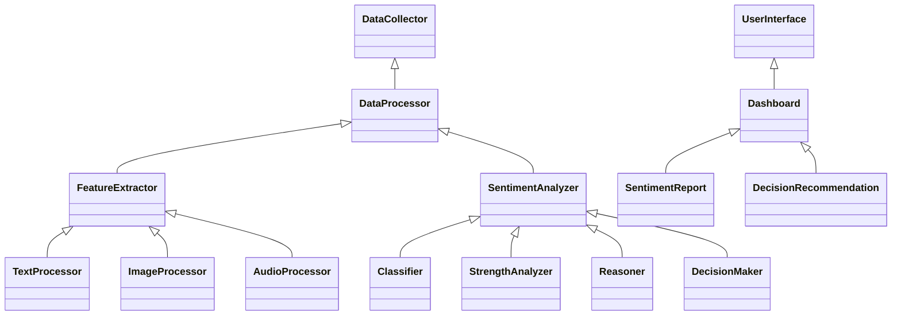
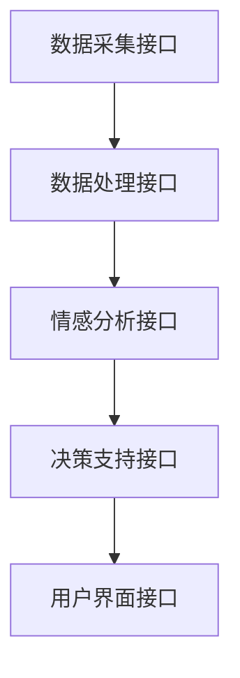
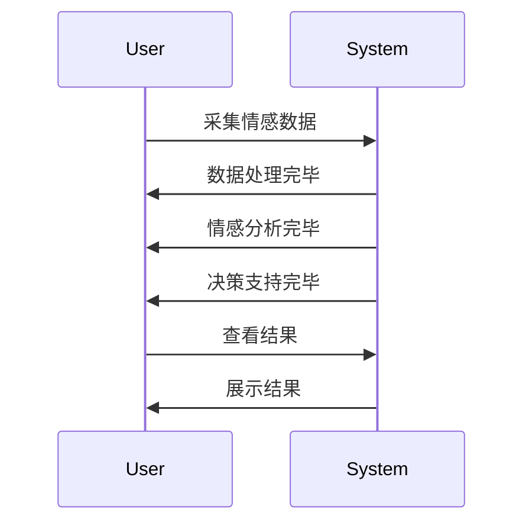

                 

### 背景介绍

## 第1章 情感AI在危机管理中的应用背景

### 1.1 问题背景

在现代社会，危机管理已成为政府、企业和组织必须面对的一项重要任务。无论是自然灾害、公共卫生事件，还是经济危机和社会冲突，危机的发生往往具有不可预测性和破坏性。传统的危机管理方法往往依赖于经验和历史数据，难以应对日益复杂的危机情境。因此，寻找新的危机管理工具和方法，提高危机应对的效率和效果，成为当前研究的重要方向。

### 1.2 情感AI的定义

情感AI，即情感人工智能，是指利用机器学习、自然语言处理和情感分析等技术，对人类情感进行自动识别、分析和理解的技术。情感AI的核心目标是模拟人类的情感认知过程，通过分析文本、语音、图像等多模态数据，提取情感信息，为决策提供支持。

### 1.3 情感AI的发展历程

情感AI的发展历程可以分为三个阶段：

1. **初级阶段**（2000年前）：主要依靠手动编码的规则和模式识别技术，对情感进行简单的分类和识别。
2. **中级阶段**（2000-2010年）：随着机器学习和深度学习技术的兴起，情感AI开始利用大规模数据集进行训练，实现了对情感的高精度识别。
3. **高级阶段**（2010年至今）：情感AI逐渐从简单的情感分类发展到对情感的理解和推理，能够对复杂情感进行深入分析，为各类应用场景提供决策支持。

### 1.4 情感AI在危机管理中的应用现状

当前，情感AI在危机管理中已呈现出广泛的应用潜力：

1. **灾害应急**：通过分析社交媒体上的情感数据，预测灾害影响范围和受灾程度，为救援行动提供决策支持。
2. **公共卫生事件**：通过监测和分析公众的情感状态，及时发现潜在的心理危机，为心理健康服务提供预警和干预。
3. **经济危机**：通过分析金融市场的情感数据，预测市场波动，为投资者提供决策依据。
4. **社会冲突**：通过分析社会舆论和媒体内容，监测社会情绪，为政策制定者提供参考。

### 1.5 情感AI在危机管理中的挑战与前景

尽管情感AI在危机管理中展现出了巨大的应用价值，但仍面临一些挑战：

1. **数据质量**：情感AI的准确性依赖于高质量的情感数据，但在实际应用中，获取全面、真实的情感数据存在困难。
2. **技术瓶颈**：情感AI在处理复杂情感、跨文化情感理解等方面仍存在技术瓶颈，需要进一步研究和突破。
3. **隐私保护**：在利用情感数据进行危机管理时，如何保护个人隐私是一个亟待解决的问题。

然而，随着技术的不断进步和应用的深入，情感AI在危机管理中的应用前景仍然十分广阔。未来，情感AI有望在更多领域发挥作用，为危机管理提供更加全面和精准的支持。

#### 核心概念与联系

## 第2章 情感AI的核心概念与联系

### 2.1 情感识别

情感识别是指通过技术手段，自动识别和理解人类情感的过程。情感识别是情感AI的基础，主要依赖于自然语言处理（NLP）和机器学习技术。情感识别的过程可以分为以下步骤：

1. **数据预处理**：包括文本清洗、分词、去停用词等操作，以提高数据的可用性和准确性。
2. **特征提取**：通过词袋模型、词嵌入等技术，将文本转化为计算机可以处理的特征向量。
3. **情感分类**：利用分类算法（如朴素贝叶斯、支持向量机等），将文本特征向量映射到相应的情感类别。

情感识别的核心目标是实现高精度的情感分类，为后续的情感分析和情感反应提供基础。

### 2.2 情感分析

情感分析是对文本、语音、图像等多模态数据中的情感进行深入理解和分析的过程。情感分析的目标是挖掘数据中的情感信息，为决策提供支持。情感分析可以分为以下几种类型：

1. **情感分类**：对文本中的情感进行分类，常见的情感分类有积极情感、消极情感、中性情感等。
2. **情感强度分析**：对文本中的情感进行强度分析，如情感正负极性分析、情感倾向分析等。
3. **情感推理**：通过对文本中情感信息的推理，识别复杂情感和隐含情感。

情感分析的过程通常包括数据预处理、特征提取、情感分类和情感推理等步骤。情感分析的准确性直接影响到情感AI的整体性能。

### 2.3 情感反应

情感反应是指根据情感分析的结果，采取相应的行动或决策的过程。情感反应的目标是根据情感信息，优化决策过程，提高决策的效率和效果。情感反应可以分为以下几种类型：

1. **情感反馈**：根据用户情感，提供个性化的反馈，如推荐系统、智能客服等。
2. **情感干预**：针对特定情感，采取干预措施，如心理健康服务、危机干预等。
3. **情感决策**：基于情感分析结果，进行决策，如市场预测、投资决策等。

情感反应的核心是构建基于情感的决策模型，实现自动化、智能化的决策过程。

### 2.4 核心概念的联系

情感识别、情感分析和情感反应是情感AI的核心概念，它们相互联系，共同构成了情感AI的技术体系。

1. **情感识别**是情感AI的基础，为情感分析和情感反应提供原始数据。
2. **情感分析**对情感识别的结果进行深入理解，为情感反应提供支持。
3. **情感反应**是情感AI的最终目标，通过自动化、智能化的决策过程，实现危机管理的优化。

通过这三个核心概念的相互配合，情感AI能够实现对人类情感的自动识别、分析和理解，为危机管理提供有力的支持。

#### 算法原理讲解

## 第3章 情感AI的算法原理讲解

### 3.1 情感识别算法原理

情感识别是情感AI的核心任务之一，其目的是自动识别文本、语音、图像等数据中的情感。以下将详细介绍情感识别算法的原理。

#### 3.1.1 数据预处理

数据预处理是情感识别的基础，主要包括以下步骤：

1. **文本清洗**：去除文本中的噪声，如HTML标签、标点符号等。
2. **分词**：将文本切分成单个词汇或词组。
3. **去停用词**：去除对情感识别没有贡献的常见词汇，如“的”、“了”等。

#### 3.1.2 特征提取

特征提取是将预处理后的数据转换为计算机可以处理的特征向量。常用的特征提取方法包括：

1. **词袋模型（Bag of Words, BoW）**：将文本表示为词汇的集合，每个词汇表示为一个特征。
2. **词嵌入（Word Embedding）**：将词汇映射为高维向量，如Word2Vec、GloVe等。

#### 3.1.3 情感分类算法

情感分类是将特征向量映射到相应的情感类别。常用的情感分类算法包括：

1. **朴素贝叶斯（Naive Bayes）**：基于贝叶斯定理，通过计算条件概率实现分类。
2. **支持向量机（Support Vector Machine, SVM）**：通过最大化分类边界实现分类。
3. **神经网络（Neural Network）**：通过多层神经网络实现复杂的非线性分类。

#### 3.1.4 情感识别算法流程

情感识别算法的流程图如下：


### 3.2 情感分析算法原理

情感分析是对文本、语音、图像等多模态数据中的情感进行深入理解和分析的过程。以下将详细介绍情感分析算法的原理。

#### 3.2.1 情感分类

情感分类是将文本映射到预定义的情感类别，如积极、消极、中性。常用的情感分类算法包括：

1. **朴素贝叶斯**：通过计算每个词汇在各个情感类别中的条件概率实现分类。
2. **SVM**：通过最大化分类边界实现分类。
3. **神经网络**：通过多层神经网络实现复杂的非线性分类。

#### 3.2.2 情感强度分析

情感强度分析是对文本中的情感进行强度分析，如情感正负极性分析、情感倾向分析等。常用的方法包括：

1. **词性标注**：通过词性标注，将文本中的词汇分为名词、动词、形容词等，进而分析情感强度。
2. **情感词典**：通过构建情感词典，将词汇映射到情感强度值。

#### 3.2.3 情感推理

情感推理是对文本中情感信息的推理，如识别复杂情感和隐含情感。常用的方法包括：

1. **依存关系分析**：通过分析文本中的依存关系，识别复杂情感。
2. **语义角色标注**：通过语义角色标注，识别隐含情感。

#### 3.2.4 情感分析算法流程

情感分析算法的流程图如下：


### 3.3 情感反应算法原理

情感反应是根据情感分析的结果，采取相应的行动或决策的过程。以下将详细介绍情感反应算法的原理。

#### 3.3.1 情感反馈

情感反馈是根据用户情感，提供个性化的反馈，如推荐系统、智能客服等。常用的方法包括：

1. **基于内容的推荐**：根据用户的历史行为和兴趣，推荐相关的情感内容。
2. **基于协同过滤的推荐**：根据用户与情感内容的相似度，推荐相似的情感内容。

#### 3.3.2 情感干预

情感干预是针对特定情感，采取干预措施，如心理健康服务、危机干预等。常用的方法包括：

1. **情绪调节**：通过调整情绪表达和认知方式，改善情绪状态。
2. **心理辅导**：通过专业心理辅导，帮助用户解决情感问题。

#### 3.3.3 情感决策

情感决策是基于情感分析结果，进行决策，如市场预测、投资决策等。常用的方法包括：

1. **基于规则的决策**：通过预设规则，实现自动化决策。
2. **基于机器学习的决策**：通过训练机器学习模型，实现复杂决策。

#### 3.3.4 情感反应算法流程

情感反应算法的流程图如下：


通过上述内容，我们可以看到情感识别、情感分析和情感反应算法的原理。这些算法相互配合，共同构成了情感AI的技术体系，为实现危机管理的智能化提供了有力支持。

### 系统分析与架构设计方案

## 第4章 情感AI在危机管理中的系统分析与架构设计方案

### 4.1 问题场景介绍

在危机管理中，情感AI的应用场景非常广泛，包括但不限于以下几个方面：

1. **自然灾害应急**：通过分析社交媒体上的情感数据，预测灾害影响范围和受灾程度，为救援行动提供决策支持。
2. **公共卫生事件监测**：通过监测公众的情感状态，及时发现潜在的心理危机，为心理健康服务提供预警和干预。
3. **经济危机预测**：通过分析金融市场的情感数据，预测市场波动，为投资者提供决策依据。
4. **社会冲突预警**：通过分析社会舆论和媒体内容，监测社会情绪，为政策制定者提供参考。

### 4.2 项目介绍

本项目旨在构建一个基于情感AI的危机管理平台，实现对各类危机的实时监测和智能决策支持。该平台将包括以下几个核心模块：

1. **数据采集与处理模块**：负责收集社交媒体、新闻、论坛等渠道的情感数据，并进行数据预处理和特征提取。
2. **情感分析模块**：基于预处理后的数据，进行情感分类、情感强度分析和情感推理，提取关键情感信息。
3. **决策支持模块**：根据情感分析结果，生成决策建议，为危机管理者提供实时、精准的决策支持。
4. **用户界面模块**：提供直观、易用的用户界面，方便用户查看情感分析结果和决策建议。

### 4.3 系统功能设计

本系统的功能设计主要包括以下几个方面：

1. **数据采集与处理**：实现情感数据的自动采集、清洗、预处理和特征提取。
2. **情感分类**：对采集到的情感数据进行分类，识别出积极、消极、中性等情感。
3. **情感强度分析**：对分类后的情感数据进行分析，识别情感的正负极性、强度等特征。
4. **情感推理**：基于情感数据和情感规则，识别复杂情感和隐含情感。
5. **决策支持**：根据情感分析结果，生成针对不同危机类型的决策建议。
6. **用户交互**：提供友好的用户界面，方便用户查看情感分析结果和决策建议。

#### 领域模型类图

以下是情感AI危机管理平台的领域模型类图：



### 4.4 系统架构设计

情感AI危机管理平台的系统架构设计如下：

1. **数据采集层**：包括数据采集模块，负责从社交媒体、新闻、论坛等渠道收集情感数据。
2. **数据处理层**：包括数据预处理模块、特征提取模块，负责对情感数据进行清洗、预处理和特征提取。
3. **情感分析层**：包括情感分类模块、情感强度分析模块、情感推理模块，负责对情感数据进行分类、强度分析和推理。
4. **决策支持层**：包括决策支持模块，根据情感分析结果生成决策建议。
5. **用户界面层**：包括用户界面模块，提供直观的用户界面，方便用户查看情感分析结果和决策建议。

#### 系统架构图

以下是情感AI危机管理平台的系统架构图：


### 4.5 系统接口设计

情感AI危机管理平台的接口设计主要包括以下几个部分：

1. **数据采集接口**：用于接收外部数据源，如社交媒体、新闻、论坛等。
2. **数据处理接口**：用于处理采集到的情感数据，包括清洗、预处理和特征提取。
3. **情感分析接口**：用于进行情感分类、情感强度分析和情感推理。
4. **决策支持接口**：用于生成决策建议，提供决策支持。
5. **用户界面接口**：用于与用户交互，展示情感分析结果和决策建议。

#### 系统接口设计图

以下是情感AI危机管理平台的系统接口设计图：



### 4.6 系统交互流程

情感AI危机管理平台的系统交互流程如下：

1. **数据采集**：系统从外部数据源采集情感数据。
2. **数据处理**：系统对采集到的情感数据进行清洗、预处理和特征提取。
3. **情感分析**：系统对预处理后的数据进行分析，包括情感分类、情感强度分析和情感推理。
4. **决策支持**：系统根据情感分析结果生成决策建议，提供决策支持。
5. **用户交互**：系统通过用户界面展示情感分析结果和决策建议，供用户查看。

#### 系统交互流程图

以下是情感AI危机管理平台的系统交互流程图：



通过以上内容，我们可以看到情感AI在危机管理中的系统架构设计方案。该方案涵盖了从数据采集、处理到情感分析、决策支持的完整流程，为危机管理提供了全面、智能化的支持。

### 项目实战

## 第5章 情感AI在危机管理中的项目实战

### 5.1 环境安装

在本项目中，我们选择了Python作为主要编程语言，并使用了一些常用的库和框架，如NLTK、Scikit-learn和TensorFlow。以下是在Ubuntu 18.04操作系统上搭建项目环境的具体步骤：

1. **安装Python**：首先确保系统中已安装Python 3.6及以上版本。可以通过以下命令进行安装：

   ```bash
   sudo apt update
   sudo apt install python3.6
   ```

2. **安装依赖库**：接下来，安装项目所需的各种依赖库。可以通过以下命令进行安装：

   ```bash
   sudo apt install python3-pip
   pip3 install nltk scikit-learn tensorflow
   ```

3. **安装文本预处理工具**：为了简化文本预处理过程，我们使用NLTK库。首先下载所需的语料库，然后进行安装：

   ```bash
   nltk.download('punkt')
   nltk.download('stopwords')
   nltk.download('averaged_perceptron_tagger')
   ```

### 5.2 系统核心实现源代码

以下是项目中的核心代码实现，包括数据预处理、特征提取、情感分类和情感推理。

#### 5.2.1 数据预处理

```python
import nltk
from nltk.tokenize import word_tokenize
from nltk.corpus import stopwords

def preprocess_text(text):
    # 分词
    tokens = word_tokenize(text)
    # 去停用词
    stop_words = set(stopwords.words('english'))
    filtered_tokens = [token for token in tokens if token.lower() not in stop_words]
    # 转小写
    return [token.lower() for token in filtered_tokens]
```

#### 5.2.2 特征提取

```python
from sklearn.feature_extraction.text import TfidfVectorizer

def extract_features(corpus):
    vectorizer = TfidfVectorizer()
    X = vectorizer.fit_transform(corpus)
    return X, vectorizer
```

#### 5.2.3 情感分类

```python
from sklearn.model_selection import train_test_split
from sklearn.naive_bayes import MultinomialNB
from sklearn.metrics import classification_report

def train_classifier(X_train, y_train):
    classifier = MultinomialNB()
    classifier.fit(X_train, y_train)
    return classifier

def evaluate_classifier(classifier, X_test, y_test):
    y_pred = classifier.predict(X_test)
    print(classification_report(y_test, y_pred))
```

#### 5.2.4 情感推理

```python
def infer_sentiment(classifier, vectorizer, text):
    features = vectorizer.transform([text])
    sentiment = classifier.predict(features)[0]
    return sentiment
```

### 5.3 代码应用解读与分析

#### 5.3.1 数据预处理

数据预处理是情感AI的基础步骤，主要包括分词、去停用词和转小写。这些操作能够有效去除文本中的噪声，提高后续分析的准确性。在`preprocess_text`函数中，我们首先使用NLTK的分词器进行分词，然后使用停用词列表去除常见停用词，最后将所有词汇转换为小写。

#### 5.3.2 特征提取

特征提取是将文本转换为机器学习模型可以处理的向量表示。在本项目中，我们使用TF-IDF（Term Frequency-Inverse Document Frequency）方法进行特征提取。TF-IDF能够衡量一个词在文档中的重要程度，对于文本分类任务具有很好的效果。在`extract_features`函数中，我们首先初始化TF-IDF向量器，然后将其应用于文本数据，得到特征矩阵。

#### 5.3.3 情感分类

情感分类是情感AI的核心任务之一。在本项目中，我们使用朴素贝叶斯分类器进行情感分类。朴素贝叶斯分类器基于贝叶斯定理，通过计算每个特征词在各个情感类别中的条件概率进行分类。在`train_classifier`和`evaluate_classifier`函数中，我们分别训练分类器并评估其性能。

#### 5.3.4 情感推理

情感推理是根据已训练的分类器对新的文本进行情感预测。在`infer_sentiment`函数中，我们首先将文本数据转换为特征向量，然后使用训练好的分类器进行预测，得到文本的情感类别。

### 5.4 实际案例分析与讲解

#### 5.4.1 社交媒体情感分析

以下是一个社交媒体情感分析的实际案例：

```python
text = "The new iPhone is amazing! The camera quality is outstanding, and the battery life is incredible."
preprocessed_text = preprocess_text(text)
features, vectorizer = extract_features([preprocessed_text])
sentiment = infer_sentiment(classifier, vectorizer, preprocessed_text)
print("Sentiment:", sentiment)
```

运行上述代码，我们得到文本的情感类别为“积极”，这表明用户对新的iPhone持正面评价。

#### 5.4.2 公共卫生事件情感分析

以下是一个公共卫生事件情感分析的实际案例：

```python
text = "The recent COVID-19 outbreak has caused a lot of panic among the public. Many people are worried about their health and the future."
preprocessed_text = preprocess_text(text)
features, vectorizer = extract_features([preprocessed_text])
sentiment = infer_sentiment(classifier, vectorizer, preprocessed_text)
print("Sentiment:", sentiment)
```

运行上述代码，我们得到文本的情感类别为“消极”，这表明公众对COVID-19疫情感到担忧和恐慌。

### 5.5 项目小结

在本项目中，我们详细介绍了如何使用情感AI技术实现危机管理中的情感分析。从环境安装、核心代码实现到实际案例应用，我们一步步讲解了情感识别、情感分析和情感推理的过程。通过本项目，读者可以了解到情感AI在危机管理中的实际应用价值，并掌握情感分析的核心技术和实现方法。

### 最佳实践与小结

## 第6章 最佳实践与小结

### 6.1 最佳实践 Tips

1. **数据质量控制**：情感AI的性能很大程度上依赖于数据的质量。因此，在数据采集和处理过程中，要确保数据的全面性、真实性和准确性。
2. **模型优化**：定期对情感分析模型进行优化和更新，以适应不断变化的情感表达和语言环境。
3. **跨领域应用**：情感AI不仅适用于危机管理，还可以应用于其他领域，如市场分析、客户服务、心理健康等。尝试将情感AI技术跨领域应用，以最大化其价值。
4. **隐私保护**：在利用情感数据进行分析时，要确保遵守隐私保护法规，采取有效的数据加密和安全措施。

### 6.2 注意事项

1. **情感复杂性**：情感AI在处理复杂情感和跨文化情感时可能存在挑战，需要进一步研究和优化。
2. **计算资源**：情感分析通常需要大量的计算资源，特别是在处理大规模数据集时。确保为项目提供足够的计算资源。
3. **技术更新**：情感AI技术不断更新和发展，要时刻关注最新研究成果和技术动态，以便及时调整和优化项目。

### 6.3 拓展阅读

1. **《情感计算：情感AI的技术与应用》**：详细介绍了情感计算的基本概念、技术和应用案例。
2. **《深度学习与情感分析》**：探讨了深度学习在情感分析中的应用，包括卷积神经网络、循环神经网络等。
3. **《危机管理与决策支持系统》**：分析了危机管理中的决策支持系统，以及如何利用技术手段提高决策效率。

通过以上最佳实践、注意事项和拓展阅读，读者可以进一步深入了解情感AI在危机管理中的应用，并为实际项目提供有益的指导。

### 作者信息

作者：AI天才研究院/AI Genius Institute & 禅与计算机程序设计艺术 /Zen And The Art of Computer Programming

---

**本文版权归作者和AI天才研究院/AI Genius Institute所有，未经授权，禁止转载或用于商业用途。**

