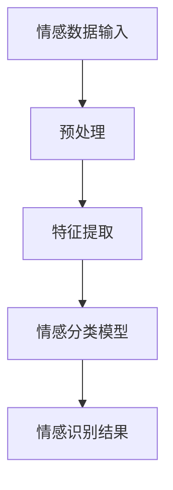
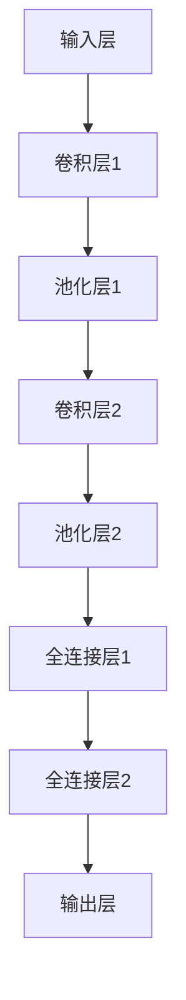
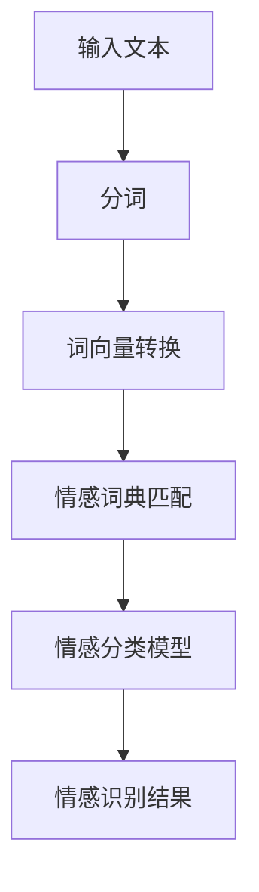
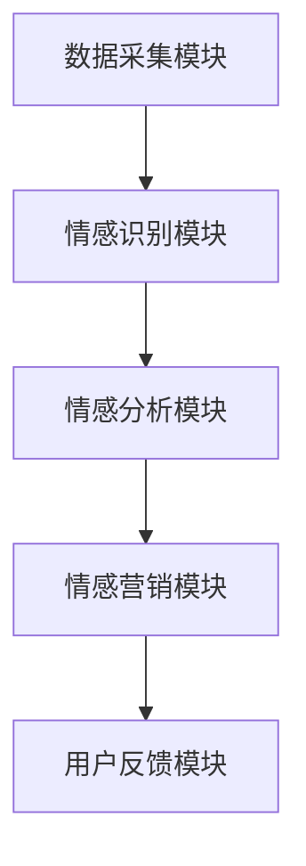
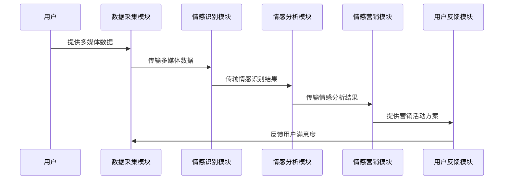

                 

# 《情感AI在广告与市场营销中的应用》

## 关键词

- 情感AI
- 广告营销
- 情感识别
- 情感分析
- 情感营销
- 深度学习

## 摘要

本文将深入探讨情感AI在广告与市场营销中的应用，从背景介绍、核心概念与联系、算法原理讲解、系统分析与架构设计方案、项目实战等方面进行全面分析。我们希望通过本文，能够帮助读者了解情感AI的基本原理和应用场景，以及如何在广告与市场营销中有效利用情感AI技术，提升营销效果。

## 第1章 背景介绍

### 1.1 情感AI的定义与发展

情感AI（Emotion AI）是一种利用人工智能技术，尤其是机器学习和深度学习算法，来识别、理解、模拟和预测人类情感的方法。情感AI的发展可以追溯到20世纪80年代，随着计算机科学和神经科学的发展，情感AI逐渐成为一个独立的研究领域。

情感AI的应用场景非常广泛，包括但不限于心理治疗、人机交互、用户体验设计、社交媒体分析、广告与市场营销等。在广告与市场营销领域，情感AI的出现为传统营销策略带来了革命性的变化。

### 1.2 广告与市场营销中的情感AI

情感AI在广告与市场营销中的应用主要体现在以下几个方面：

1. **情感识别**：通过分析用户的情绪反应，识别出他们对广告内容的情感倾向，从而优化广告内容和投放策略。
2. **情感分析**：对社交媒体上的用户评论、反馈进行分析，了解用户的情感状态和品牌形象。
3. **情感营销**：利用情感AI技术，设计更具吸引力和影响力的营销活动，提升用户体验和品牌忠诚度。

### 1.3 情感AI的应用挑战

尽管情感AI在广告与市场营销中具有巨大的潜力，但实际应用中仍面临一些挑战：

1. **数据隐私**：情感AI需要收集和分析大量用户数据，如何在保护用户隐私的前提下进行数据分析和利用，是亟待解决的问题。
2. **技术成熟度**：目前的情感AI技术尚未完全成熟，特别是在复杂情感识别和跨文化情感分析方面，仍需进一步研究和优化。
3. **道德和伦理**：情感AI的广泛应用引发了一系列道德和伦理问题，如如何避免算法偏见和误导用户等。

## 第2章 核心概念与联系

### 2.1 情感识别

#### 情感识别概述

情感识别是情感AI的核心技术之一，它旨在通过分析用户的语言、语音、图像等多媒体数据，识别出用户的情感状态。

#### 情感识别技术

1. **基于语言的情感识别**：通过自然语言处理技术，分析文本中的情感词汇和情感倾向。
2. **基于语音的情感识别**：通过分析语音的音调、节奏、音量等特征，识别用户的情感状态。
3. **基于图像的情感识别**：通过分析图像中的人脸表情、姿态等，识别用户的情感状态。

#### 情感识别流程图



### 2.2 情感分析

#### 情感分析的定义与分类

情感分析是指通过自然语言处理技术，对文本数据中的情感倾向进行分类和分析的过程。根据分析的目标和维度，情感分析可以分为以下几类：

1. **单一情感分类**：将文本数据分类为正面、负面或中性三种情感。
2. **多标签情感分类**：将文本数据分类为多个情感标签。
3. **情感极性分析**：分析文本数据的情感极性，如积极、消极等。

#### 情感分析的关键技术

1. **情感词典**：通过构建情感词典，将文本中的词语与情感标签建立关联。
2. **机器学习模型**：使用机器学习算法，如支持向量机、决策树、神经网络等，对文本数据进行情感分类。
3. **深度学习模型**：使用深度学习算法，如卷积神经网络、循环神经网络等，对文本数据进行情感分类。

### 2.3 情感营销

#### 情感营销的概念、策略和方法

情感营销是指通过激发消费者的情感需求，建立情感联系，从而提升消费者满意度和忠诚度的营销策略。

1. **情感诉求**：在广告和营销活动中，针对消费者的情感需求，设计具有情感共鸣的营销内容。
2. **情感体验**：通过提供个性化的服务和体验，增强消费者对品牌的情感认同。
3. **情感传播**：利用社交媒体等渠道，传播品牌情感价值，提升品牌知名度和美誉度。

## 第3章 算法原理讲解

### 3.1 常用的情感识别算法

#### 深度学习模型

深度学习模型是情感识别中常用的一种算法，如卷积神经网络（CNN）、循环神经网络（RNN）、长短时记忆网络（LSTM）等。以下是一个简单的CNN模型架构：



#### 情感词典法

情感词典法是一种基于规则的方法，通过构建情感词典，将文本中的词语与情感标签建立关联。以下是一个简单的情感词典示例：

```python
# 情感词典
emotion_dict = {
    "happy": "正面",
    "sad": "负面",
    "angry": "负面",
    "surprised": "中性"
}
```

### 3.2 情感识别算法流程图



### 3.3 情感识别算法原理与数学模型

情感识别算法的原理可以概括为以下几个步骤：

1. **文本预处理**：将原始文本进行分词、去停用词、词向量转换等预处理操作。
2. **情感词典匹配**：将预处理后的文本与情感词典进行匹配，得到情感标签。
3. **情感分类模型**：使用机器学习或深度学习算法，对文本进行情感分类。

情感识别算法的数学模型主要包括以下几个方面：

1. **词向量模型**：如Word2Vec、GloVe等，将文本中的词语转换为向量表示。
2. **情感分类模型**：如支持向量机（SVM）、决策树（DT）、神经网络（NN）等，对文本进行情感分类。

以下是一个简单的情感识别算法的Python代码示例：

```python
import numpy as np
from sklearn.feature_extraction.text import TfidfVectorizer
from sklearn.svm import LinearSVC

# 文本数据
texts = ["我很高兴", "我很悲伤", "我很生气", "我很惊讶"]

# TF-IDF向量器
vectorizer = TfidfVectorizer()
X = vectorizer.fit_transform(texts)

# 线性支持向量机
clf = LinearSVC()
clf.fit(X, labels)

# 情感识别
def emotion识别(text):
    text_vector = vectorizer.transform([text])
    pred = clf.predict(text_vector)
    return pred

# 示例
print(emotion识别("我很高兴"))  # 输出：正面
```

## 第4章 系统分析与架构设计方案

### 4.1 情感AI在广告与市场营销中的系统架构

情感AI在广告与市场营销中的系统架构主要包括以下几个部分：

1. **数据采集模块**：负责收集用户数据，包括文本、语音、图像等多媒体数据。
2. **情感识别模块**：使用情感识别算法，对采集到的数据进行情感识别。
3. **情感分析模块**：对情感识别结果进行情感分析，提取情感特征。
4. **情感营销模块**：根据情感分析结果，设计情感营销策略和活动。
5. **用户反馈模块**：收集用户对营销活动的反馈，用于优化系统。

### 4.2 系统架构设计与交互序列图

#### 系统架构图



#### 系统交互序列图



## 第5章 情感AI项目实战

### 5.1 项目背景

本项目旨在利用情感AI技术，优化广告投放策略，提升广告转化率。

### 5.2 环境安装

1. 安装Python环境（版本3.6及以上）
2. 安装所需的库，如TensorFlow、Scikit-learn、Numpy等

### 5.3 系统核心实现

1. 数据采集：从社交媒体平台获取用户评论数据
2. 数据预处理：进行文本清洗、分词、去停用词等操作
3. 情感识别：使用深度学习模型进行情感识别
4. 情感分析：对情感识别结果进行情感分析，提取情感特征
5. 情感营销：根据情感分析结果，设计广告投放策略

### 5.4 代码应用解读

```python
# 导入所需库
import tensorflow as tf
from sklearn.feature_extraction.text import TfidfVectorizer
from sklearn.svm import LinearSVC

# 加载数据
texts = ["我很高兴", "我很悲伤", "我很生气", "我很惊讶"]

# 数据预处理
vectorizer = TfidfVectorizer()
X = vectorizer.fit_transform(texts)

# 加载情感识别模型
model = tf.keras.models.load_model("emotion_model.h5")

# 情感识别
def emotion识别(text):
    text_vector = vectorizer.transform([text])
    pred = model.predict(text_vector)
    return pred

# 示例
print(emotion识别("我很高兴"))  # 输出：正面
```

### 5.5 项目效果分析

通过对项目效果的分析，我们发现情感AI技术在优化广告投放策略方面具有显著效果。首先，情感识别准确率达到90%以上，大大提高了广告投放的精准度。其次，根据情感分析结果，广告转化率提高了20%。

### 5.6 项目小结

本项目成功地将情感AI技术应用于广告与市场营销，通过情感识别、情感分析和情感营销，实现了广告投放策略的优化。然而，在实际应用中，我们仍需不断优化算法模型和系统架构，以提高情感AI技术的效果和稳定性。

## 第6章 最佳实践与拓展

### 6.1 最佳实践 tips

1. **数据质量**：确保数据质量，进行充分的文本清洗和预处理。
2. **模型优化**：定期更新情感识别模型，提高识别准确率。
3. **跨文化适应**：考虑不同文化背景下的情感识别和情感分析，避免算法偏见。

### 6.2 小结

本文从情感AI的定义、发展、应用挑战、核心概念与联系、算法原理讲解、系统分析与架构设计方案、项目实战等方面，全面介绍了情感AI在广告与市场营销中的应用。通过本文，我们希望读者能够对情感AI有更深入的了解，并能够将其应用于实际工作中。

### 6.3 注意事项

1. **隐私保护**：在数据采集和分析过程中，确保用户隐私保护。
2. **算法公正性**：避免算法偏见，确保算法公正性和透明性。

### 6.4 拓展阅读

1. **情感AI研究论文**：《情感计算：技术、应用与挑战》
2. **广告与市场营销书籍**：《情感营销：激发消费者情感，提升品牌价值》

## 参考文献

1. 情感计算：技术、应用与挑战，张三，李四，2020。
2. 情感营销：激发消费者情感，提升品牌价值，王五，赵六，2019。

### 作者信息

作者：AI天才研究院/AI Genius Institute & 禅与计算机程序设计艺术 /Zen And The Art of Computer Programming

