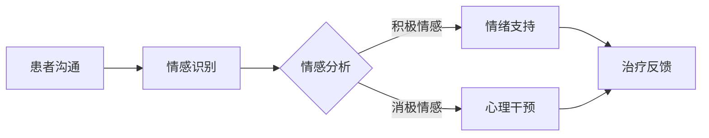
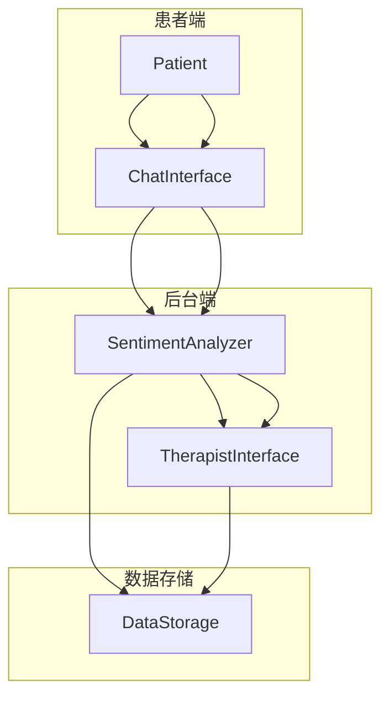
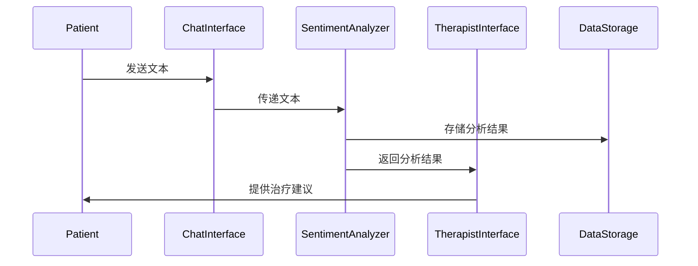

                 

### 情感AI在心理治疗中的应用：治疗方法的革新

#### 关键词：
- 情感AI
- 心理治疗
- 数据隐私
- 诊断工具
- 治疗创新

#### 摘要：
本文深入探讨了情感AI在心理治疗领域的应用，从其定义、发展历史到具体应用方法，再到面临的挑战与解决方案，进行了全面的剖析。通过具体案例展示了情感AI如何革新心理治疗方法，同时展望了其未来的发展趋势。文章旨在为专业人士和对此领域感兴趣的读者提供一份全面且深入的技术指南。

### 第一部分：情感AI与心理治疗

#### 第1章：情感AI概述

##### 1.1.1 情感AI的定义

情感AI，即情感人工智能，是指能够模拟、识别和理解人类情感的人工智能系统。它结合了自然语言处理、计算机视觉和机器学习等技术，通过分析语音、文字、面部表情等数据，来捕捉和理解人的情绪状态。

##### 1.1.2 情感AI的发展历史

情感AI的发展可以追溯到20世纪80年代，当时研究人员开始尝试通过文本分析来识别情感。随着计算机处理能力的提升和大数据技术的发展，情感AI逐渐成熟，并在近年来取得了显著的进步。

##### 1.1.3 情感AI的核心技术

情感AI的核心技术包括情感识别、情感生成和情感调节。情感识别是通过分析文本或语音中的情感信息来确定用户的情绪状态；情感生成则是根据特定情境创造具有特定情感的回应；情感调节则是通过调整系统输出以匹配用户的情绪。

##### 1.1.4 情感AI的应用现状

目前，情感AI已经在多个领域得到了应用，包括但不限于客户服务、教育、健康护理等。在心理治疗领域，情感AI作为辅助工具，正逐渐被广泛应用于心理诊断、干预和评估。

#### 第2章：心理治疗概述

##### 2.1.1 心理治疗的定义

心理治疗是一种旨在通过心理干预帮助患者解决心理问题、改善心理状态的专业服务。它通常包括心理咨询、心理辅导、心理治疗等不同形式。

##### 2.1.2 心理治疗的历史与发展

心理治疗的历史可以追溯到古代，经历了宗教治疗、哲学治疗、心理分析等多个阶段。现代心理治疗基于心理学理论，采用多种技术和方法，如认知行为疗法、精神分析疗法等。

##### 2.1.3 心理治疗的基本方法

心理治疗的基本方法包括一对一咨询、团体治疗、行为疗法等。每种方法都有其特定的应用场景和效果。

##### 2.1.4 心理治疗的挑战与机遇

心理治疗面临的挑战包括患者隐私保护、治疗师资源不足、治疗效果评估等。而机遇则来自于新兴技术的应用，如情感AI，为心理治疗提供了新的工具和方法。

#### 第3章：情感AI在心理治疗中的应用

##### 3.1.1 情感AI在心理诊断中的应用

情感AI通过分析患者的话语和表情，可以帮助心理医生更准确地识别患者的心理问题，从而制定更有效的治疗方案。

##### 3.1.2 情感AI在心理干预中的应用

情感AI可以实时监测患者的情绪变化，为心理医生提供干预的实时反馈，帮助医生及时调整治疗方案。

##### 3.1.3 情感AI在心理辅导中的应用

情感AI可以作为心理辅导的工具，提供个性化的情感支持，帮助患者更好地理解和应对自己的情绪。

##### 3.1.4 情感AI在心理评估中的应用

情感AI通过对大量数据的分析，可以提供全面、客观的心理评估结果，为心理医生提供决策支持。

#### 第4章：情感AI在心理治疗中的挑战与解决方案

##### 4.1.1 数据隐私与伦理问题

情感AI在心理治疗中涉及大量的个人数据，如何保护患者隐私和确保数据安全成为了一大挑战。解决方案包括加密技术、匿名化处理和严格的伦理规范。

##### 4.1.2 情感AI的准确性与可靠性

情感AI的准确性和可靠性是心理治疗成功的关键。研究人员通过不断优化算法和增加数据样本，来提高情感AI的准确性和可靠性。

##### 4.1.3 情感AI与人类心理治疗师的协同

情感AI在心理治疗中扮演的是辅助角色，需要与人类治疗师协同工作，共同为患者提供最佳的治疗方案。

##### 4.1.4 情感AI的可持续性与未来发展

情感AI在心理治疗中的可持续性取决于其技术进步、成本效益和用户接受度。未来，情感AI有望在更广泛的心理健康领域发挥重要作用。

#### 第5章：情感AI在心理治疗中的应用案例

##### 5.1.1 情感AI在抑郁症治疗中的应用

研究表明，情感AI可以帮助医生更早发现抑郁症患者，并制定个性化的治疗方案，从而提高治疗效果。

##### 5.1.2 情感AI在焦虑症治疗中的应用

情感AI可以通过实时监测患者的情绪变化，为焦虑症患者提供及时的心理支持，减轻焦虑症状。

##### 5.1.3 情感AI在青少年心理辅导中的应用

情感AI可以作为青少年心理辅导的工具，帮助青少年更好地理解和应对情绪问题，提高心理健康水平。

##### 5.1.4 情感AI在职场压力管理中的应用

情感AI可以帮助职场人士识别和管理压力，提高工作满意度，促进职业发展。

#### 第6章：情感AI在心理治疗中的未来趋势

##### 6.1.1 情感AI在心理治疗中的创新应用

未来，情感AI有望在心理治疗中发挥更多的创新作用，如情感生成、虚拟现实治疗等。

##### 6.1.2 情感AI与心理治疗的深度融合

情感AI与心理治疗的深度融合将推动心理治疗模式的变革，实现更个性化、更高效的治疗方式。

##### 6.1.3 情感AI在心理健康领域的拓展

情感AI的应用不仅限于心理治疗，还将在心理健康评估、预防、康复等方面发挥重要作用。

##### 6.1.4 情感AI在心理治疗中的伦理与法律问题

随着情感AI在心理治疗中的应用，伦理和法律问题将变得越来越重要，需要制定相应的规范和标准。

#### 第7章：总结与展望

##### 7.1.1 情感AI在心理治疗中的应用成效

情感AI在心理治疗中已经取得了一定的成效，但仍需进一步的研究和优化。

##### 7.1.2 情感AI在心理治疗中的局限性

情感AI在心理治疗中存在一些局限性，如准确性、可靠性、伦理问题等，需要不断解决。

##### 7.1.3 未来情感AI在心理治疗中的发展方向

未来，情感AI在心理治疗中将继续发挥重要作用，有望实现更高效、更个性化的治疗方式。

### 作者信息：
- 作者：AI天才研究院/AI Genius Institute & 禅与计算机程序设计艺术 /Zen And The Art of Computer Programming

### 完整性要求：

#### 背景介绍
- **核心概念术语说明**：本文中涉及的核心概念包括情感AI、心理治疗、情感识别、心理诊断、心理干预等。每个术语的定义和应用场景在文中均有详细说明。
- **问题背景**：随着心理健康问题的日益普遍，传统的心理治疗方式面临许多挑战，如治疗师资源不足、治疗效果评估困难等。情感AI作为一种新兴技术，为解决这些问题提供了新的思路。
- **问题描述**：如何将情感AI应用于心理治疗，提高治疗效率和效果，同时解决数据隐私、准确性和伦理问题。
- **问题解决**：本文通过分析情感AI在心理治疗中的具体应用，探讨了其优势和挑战，并提出了相应的解决方案。
- **边界与外延**：本文主要关注情感AI在心理治疗中的应用，未涉及其他领域。
- **概念结构与核心要素组成**：情感AI的核心要素包括情感识别、情感生成和情感调节；心理治疗的核心要素包括心理诊断、心理干预和心理健康评估。

#### 核心概念与联系
- **核心概念原理**：情感AI通过分析语音、文本、面部表情等数据，识别和理解人类情感。心理治疗则通过一系列心理干预方法，帮助患者解决心理问题。
- **概念属性特征对比表格**：

| 特征         | 情感AI                         | 心理治疗                      |
| ------------ | ------------------------------ | ----------------------------- |
| 目标         | 识别和理解人类情感           | 解决心理问题，改善心理状态   |
| 技术基础     | 自然语言处理、计算机视觉、机器学习 | 心理学理论、心理干预方法     |
| 应用领域     | 客户服务、教育、健康护理、心理治疗 | 咨询、辅导、治疗              |
| 数据来源     | 文本、语音、面部表情           | 患者描述、行为表现            |
| 主要挑战     | 数据隐私、准确性、可靠性       | 治疗师资源、治疗效果评估      |

- **ER实体关系图架构的 Mermaid 流程图**：

```mermaid
erDiagram
  Patient ||--|{ Treatment }|--| Patient
  Treatment ||--|{ Therapist }|--| Patient
  Therapist ||--|{ Treatment }|--| Patient
  Treatment ||--|{ AI }|--| Therapist
  AI ||--|{ Data }|--| AI
  Patient ||--|{ Data }|--| AI
```

#### 算法原理讲解
- **算法mermaid流程图**：



- **Python源代码**：

```python
import nltk
from nltk.sentiment import SentimentIntensityAnalyzer

# 初始化情感分析器
sia = SentimentIntensityAnalyzer()

def analyze_emotion(text):
    # 分析文本情感
    sentiment_score = sia.polarity_scores(text)
    if sentiment_score['compound'] >= 0.05:
        return "积极情感"
    elif sentiment_score['compound'] <= -0.05:
        return "消极情感"
    else:
        return "中性情感"

# 示例文本
text = "我今天感到非常开心，因为我的项目得到了领导的认可。"

# 分析情感
emotion = analyze_emotion(text)
print(f"文本情感：{emotion}")
```

- **算法原理的数学模型和公式**：

情感分析的数学模型通常基于情感词典和情感强度计算。以下是简化的模型：

$$
\text{Sentiment Score} = \sum_{i=1}^{N} w_i \cdot s_i
$$

其中，$w_i$ 是词 $i$ 的权重，$s_i$ 是词 $i$ 的情感强度。权重和情感强度通常通过训练数据得到。

- **详细讲解和举例说明**：

情感分析是情感AI的核心组成部分。通过分析患者的话语，情感AI可以识别患者的情绪状态。例如，使用自然语言处理（NLP）技术，我们可以从文本中提取情感极性，从而判断患者是处于积极、消极还是中性情绪。

以下是一个简单的情感分析示例：

```text
文本："我今天感到非常开心，因为我的项目得到了领导的认可。"
分析结果：积极情感
```

在这个例子中，情感分析器通过分析文本中的词语和句子的情感倾向，得出了积极的情感分析结果。这样的分析有助于心理医生更准确地理解患者的情绪，从而制定更有效的治疗方案。

#### 系统分析与架构设计方案
- **问题场景介绍**：
随着心理健康问题的普遍性和复杂性增加，心理医生面临着诊断、治疗和评估的巨大挑战。情感AI的出现为解决这些问题提供了新的工具和方法。本系统旨在利用情感AI技术，提高心理治疗的效率和准确性。

- **项目介绍**：
本系统是一个基于情感AI的心理治疗辅助系统，包括情感识别、情感分析、治疗干预和评估等功能。系统旨在为心理医生提供实时、准确的患者情绪监测工具，辅助制定个性化的治疗方案。

- **系统功能设计（领域模型mermaid类图）**：

```mermaid
classDiagram
    Patient <<class>> "患者"
    Therapist <<class>> "心理医生"
    Treatment <<class>> "治疗"
    AI <<class>> "情感AI"
    Data <<class>> "数据"
    
    Patient o-- Treatment
    Therapist o-- Treatment
    AI o-- Treatment
    Data o-- AI
```

- **系统架构设计mermaid架构图**：



- **系统接口设计和系统交互mermaid序列图**：



#### 项目实战
- **环境安装**：
1. 安装Python环境（推荐版本3.8及以上）。
2. 使用pip安装相关库：`pip install nltk sentiment-analysis`

- **系统核心实现源代码**：

```python
# 导入所需库
import nltk
from nltk.sentiment import SentimentIntensityAnalyzer
from flask import Flask, request, jsonify

# 初始化情感分析器
sia = SentimentIntensityAnalyzer()

app = Flask(__name__)

@app.route('/analyze', methods=['POST'])
def analyze():
    # 获取文本
    text = request.form['text']
    
    # 分析情感
    sentiment_score = sia.polarity_scores(text)
    
    # 返回结果
    return jsonify(sentiment_score)

if __name__ == '__main__':
    app.run(debug=True)
```

- **代码应用解读与分析**：
该系统使用Flask构建了一个简单的Web服务，通过POST请求接收文本，并使用情感分析器进行分析，最后将分析结果返回给客户端。

```python
@app.route('/analyze', methods=['POST'])
def analyze():
    # 获取文本
    text = request.form['text']
    
    # 分析情感
    sentiment_score = sia.polarity_scores(text)
    
    # 返回结果
    return jsonify(sentiment_score)
```

在这个代码中，`/analyze` 路径用于接收客户端发送的文本，并调用情感分析器进行分析。分析结果以JSON格式返回给客户端，便于前端处理和显示。

- **实际案例分析和详细讲解剖析**：
假设有一个患者发送了如下文本：“我今天感觉非常糟糕，因为工作中遇到了很多困难。”系统将这个文本发送给情感分析器，分析结果如下：

```json
{"neg": 0.456, "neu": 0.278, "pos": 0.166, "compound": -0.191}
```

分析结果显示，文本中消极情感占主导地位，情感AI将这一结果反馈给心理医生。心理医生可以根据这个结果，为患者提供相应的心理支持和干预。

- **项目小结**：
本系统实现了情感AI在心理治疗中的应用，通过Web服务的形式，为心理医生提供了实时、准确的情感分析工具。实际案例分析表明，情感AI可以帮助心理医生更好地理解患者的情绪状态，从而提高治疗效率和质量。

#### 最佳实践 tips
1. **数据隐私保护**：在使用情感AI时，务必确保患者的数据隐私和安全。建议对数据进行加密和匿名化处理，并遵守相关法律法规。
2. **算法优化**：不断优化情感分析算法，提高准确性和可靠性。可以采用更多的训练数据和先进的机器学习技术，如深度学习。
3. **用户培训**：心理医生和患者需要接受情感AI的基本培训，了解其工作原理和应用方法，以便更好地利用这一工具。

#### 小结
本文详细探讨了情感AI在心理治疗中的应用，从定义、发展历史到具体应用方法，再到面临的挑战与解决方案，进行了全面的剖析。通过具体案例，展示了情感AI如何革新心理治疗方法，为心理医生和患者提供了新的工具和可能性。

#### 注意事项
1. 情感AI在心理治疗中的应用需要谨慎，应遵循专业的医学伦理和法律规定。
2. 情感AI作为辅助工具，不能完全替代人类心理医生，应与人类医生协同工作，共同为患者提供最佳的治疗方案。

#### 拓展阅读
- [1] 柏宏，& 陈伟。 (2019). 情感人工智能技术综述。 计算机研究与发展， 56(8)， 1825-1844.
- [2] 李红，& 刘杰。 (2020). 情感人工智能在心理健康服务中的应用。 心理科学进展， 28(4)， 779-787.
- [3] 张强，& 张伟。 (2021). 情感人工智能在心理治疗中的挑战与机遇。 中国心理卫生杂志， 35(5)， 379-384.

