                 

# 情感AI在灾难救援中的角色与贡献

关键词：情感AI、灾难救援、技术应用、决策支持、心理疏导

摘要：随着人工智能技术的不断发展，情感AI在灾难救援中的重要性日益凸显。本文将详细探讨情感AI在灾难救援中的角色与贡献，通过逐步分析情感AI在识别、分析和处理人类情感方面的技术特点，以及其在救援行动中的应用实例，阐述情感AI如何提高灾难救援的效率和效果。

## 前言

### 1. 问题的背景

随着全球气候变化和自然灾害频发，灾难救援成为各国政府和救援机构关注的焦点。传统的救援模式依赖于人力和物资的调配，效率较低，难以满足快速响应的需求。近年来，人工智能技术的快速发展为灾难救援带来了新的机遇。情感AI作为人工智能的一个重要分支，通过识别和解析人类情感，能够为救援工作提供更为精细和个性化的支持。

### 2. 问题描述

如何在灾难救援中充分利用情感AI技术，提高救援效率，减轻灾害对人类的影响？

### 3. 问题解决

本文将从以下几个方面探讨情感AI在灾难救援中的应用：

- **情感识别**：通过语音、图像和文本分析，实时识别受灾者的情绪状态。
- **心理疏导**：利用情感AI技术提供心理支持，减轻受灾者的心理压力。
- **决策支持**：通过情感分析辅助救援决策，优化资源分配和救援策略。
- **案例研究**：分析情感AI在具体灾难救援中的实际应用案例。

### 4. 边界与外延

本文主要关注情感AI在灾难救援中的应用，但不涉及情感AI在其他领域的应用。

### 5. 概念结构与核心要素组成

- **情感AI**：利用人工智能技术对人类情感进行识别、分析、处理的能力。
- **灾难救援**：应对自然灾害、事故等紧急情况，救助受害者的行动。
- **角色与贡献**：情感AI在灾难救援中扮演的角色及其对救援工作的影响。

## 第1章 情感AI概述

### 1.1 情感AI的定义与特点

#### 1.1.1 情感AI的定义

情感AI是指利用人工智能技术对人类情感进行识别、分析、处理的能力。它不仅能够识别情感的类别，还能分析情感的程度和变化趋势。

#### 1.1.2 情感AI的特点

- **高度智能化**：情感AI能够自主识别和理解人类情感。
- **实时性**：情感AI能够实时监测和处理情感信息。
- **泛化性**：情感AI适用于多种场景和情感类型。

### 1.2 情感AI的发展历程

#### 1.2.1 情感AI的早期研究

- **情感识别技术的发展**：早期研究主要集中在语言和文本的情感分析。
- **机器学习和深度学习在情感分析中的应用**：随着机器学习算法的进步，情感识别的准确性得到了显著提高。

#### 1.2.2 情感AI的近期发展

- **情感计算理论的提出**：情感计算理论为情感AI提供了理论基础。
- **情感AI在各个领域的应用研究**：包括医疗、教育、商业等。

### 1.3 情感AI的核心技术

#### 1.3.1 情感识别技术

- **基于语言的情感识别**：通过对文本的语义分析来识别情感。
- **基于图像和声音的情感识别**：通过分析图像和声音的特征来识别情感。

#### 1.3.2 情感分析技术

- **情感分类**：将情感分为正面、负面和中性等类别。
- **情感极性分析**：分析情感的极性，如愤怒、喜悦等。
- **情感强度分析**：分析情感的程度，如高兴的程度、悲伤的程度等。

## 第2章 情感AI在灾难救援中的应用

### 2.1 情感识别在灾难救援中的应用

#### 2.1.1 受灾者情感识别

- **情绪状态的识别**：通过语音、图像和文本分析，实时识别受灾者的情绪状态。
- **需求分析**：分析受灾者的情感状态，以确定其具体需求和救援方案。

#### 2.1.2 救援人员情感识别

- **心理状态的监测**：通过情感AI技术监测救援人员的工作压力和心理状态。
- **情感支持**：提供情感支持，减轻救援人员的工作压力和心理负担。

### 2.2 心理疏导在灾难救援中的应用

#### 2.2.1 自动化心理疏导系统

- **心理危机预警**：通过情感分析预测心理危机的发生。
- **心理干预建议**：提供个性化的心理干预建议，帮助受灾者度过心理危机。

#### 2.2.2 社交媒体情感分析

- **受灾者情绪状态的监测**：通过分析社交媒体上的内容，了解受灾者的情绪状态。
- **受灾者需求分析**：根据情感分析结果，分析受灾者的需求，提供针对性的救援服务。

### 2.3 决策支持在灾难救援中的应用

#### 2.3.1 情感分析辅助决策

- **灾情评估**：通过情感分析评估灾害的严重程度和受灾范围。
- **救援资源配置**：根据情感分析结果，优化救援资源的配置，确保救援行动的效率。

#### 2.3.2 情感计算在灾害预警中的应用

- **灾害预警信息的情感分析**：分析灾害预警信息中的情感成分，预测灾害可能造成的影响。
- **灾害预警信息的传播策略**：根据情感分析结果，制定有效的预警信息传播策略，提高公众的应急响应能力。

## 第3章 情感AI在灾难救援中的应用实例

### 3.1 某次地震救援中的情感AI应用

#### 3.1.1 情感识别技术的应用

- **受灾者情绪状态的识别**：通过语音、图像和文本分析，实时识别受灾者的情绪状态。
- **救援人员心理状态的监测**：通过情感AI技术监测救援人员的工作压力和心理状态。

#### 3.1.2 心理疏导技术的应用

- **自动化心理疏导系统的部署**：部署自动化心理疏导系统，提供心理支持，减轻受灾者的心理压力。
- **社交媒体情感分析的应用**：通过分析社交媒体上的内容，了解受灾者的情绪状态，提供针对性的救援服务。

#### 3.1.3 决策支持技术的应用

- **灾情评估的辅助**：通过情感分析评估灾害的严重程度和受灾范围，为救援决策提供支持。
- **救援资源配置的建议**：根据情感分析结果，优化救援资源的配置，确保救援行动的效率。

### 3.2 某次洪水救援中的情感AI应用

#### 3.2.1 情感识别技术的应用

- **受灾者情绪状态的识别**：通过语音、图像和文本分析，实时识别受灾者的情绪状态。
- **救援人员心理状态的监测**：通过情感AI技术监测救援人员的工作压力和心理状态。

#### 3.2.2 心理疏导技术的应用

- **自动化心理疏导系统的部署**：部署自动化心理疏导系统，提供心理支持，减轻受灾者的心理压力。
- **社交媒体情感分析的应用**：通过分析社交媒体上的内容，了解受灾者的情绪状态，提供针对性的救援服务。

#### 3.2.3 决策支持技术的应用

- **灾情评估的辅助**：通过情感分析评估灾害的严重程度和受灾范围，为救援决策提供支持。
- **救援资源配置的建议**：根据情感分析结果，优化救援资源的配置，确保救援行动的效率。

## 第4章 情感AI在灾难救援中的应用挑战与展望

### 4.1 挑战

#### 4.1.1 数据隐私与安全

- **受灾者隐私信息的保护**：在情感识别过程中，如何保护受灾者的隐私信息是一个重要问题。
- **情感数据的存储与处理**：情感数据量巨大，如何在保证数据安全的同时高效地存储和处理这些数据？

#### 4.1.2 情感识别的准确性

- **不同情境下的情感识别准确性**：情感识别技术在不同情境下的准确性有所不同，如何提高其在复杂环境下的识别准确性是一个挑战。
- **情感识别技术的泛化能力**：如何提高情感识别技术在各种情感类型和不同人群中的泛化能力？

#### 4.1.3 情感AI的伦理问题

- **情感AI在灾难救援中的道德边界**：如何界定情感AI在灾难救援中的道德责任和边界？
- **情感AI的决策公正性**：如何确保情感AI在决策过程中不会出现偏见和不公正现象？

### 4.2 展望

#### 4.2.1 情感AI在灾难救援中的应用前景

- **情感AI技术在灾难救援中的广泛应用**：随着技术的成熟，情感AI将在灾难救援中得到更广泛的应用。
- **情感AI与人类救援工作的协同**：情感AI将作为人类救援工作的辅助工具，与救援人员协同工作，提高救援效率。

#### 4.2.2 情感AI技术的发展趋势

- **新的情感识别技术的出现**：随着技术的进步，新的情感识别技术将不断涌现，提高情感分析的准确性和效率。
- **情感计算理论的深化研究**：情感计算理论将不断深化，为情感AI提供更坚实的理论基础。

## 第5章 总结与展望

### 5.1 总结

本文从多个角度探讨了情感AI在灾难救援中的应用，展示了情感AI在提高救援效率和效果方面的巨大潜力。通过情感识别、心理疏导和决策支持，情感AI为灾难救援提供了新的思路和方法。

### 5.2 展望

未来，随着情感AI技术的不断发展和完善，我们期待其在灾难救援中发挥更大的作用。同时，我们也应关注情感AI在应用过程中可能面临的挑战，积极探索解决方案，推动情感AI在灾难救援中的全面发展。

### 5.3 结论

情感AI在灾难救援中的应用是一个具有重要意义的研究方向。通过本文的探讨，我们希望能够为相关领域的研究者和实践者提供有益的参考和启示，共同推动情感AI在灾难救援中的应用和发展。

---

作者：AI天才研究院/AI Genius Institute & 禅与计算机程序设计艺术 /Zen And The Art of Computer Programming

[1]: 引用参考文献1
[2]: 引用参考文献2
[3]: 引用参考文献3
[4]: 引用参考文献4
[5]: 引用参考文献5
[6]: 引用参考文献6
[7]: 引用参考文献7
[8]: 引用参考文献8
[9]: 引用参考文献9
[10]: 引用参考文献10

（注：以上参考文献仅为示例，实际写作时需根据具体研究内容添加相关文献。）## 第1章 情感AI概述

### 1.1 情感AI的定义与特点

#### 1.1.1 情感AI的定义

情感AI，又称情感计算（Affective Computing），是指计算机系统模拟、识别、理解和表达人类情感的能力。这一概念最早由美国麻省理工学院（MIT）的计算机科学家罗伯·雷卡特（Rosalind Picard）在1995年提出。情感AI的目的是使计算机更加贴近人类情感世界，从而提高人机交互的自然性和效率。

#### 1.1.2 情感AI的特点

- **高度智能化**：情感AI通过先进的机器学习和深度学习技术，能够从大量的数据中学习和识别情感模式，实现高度智能化的情感分析。
- **实时性**：情感AI系统能够实时处理和分析人类情感信息，提供即时的反馈和响应。
- **泛化性**：情感AI不仅限于特定情感类型的识别，还能够适用于多种情感类别和情境。

### 1.2 情感AI的发展历程

#### 1.2.1 情感AI的早期研究

情感AI的研究可以追溯到20世纪80年代，当时的研究主要集中在情感识别和情感表达上。随着计算机技术的发展，情感识别技术逐渐成熟。早期的情感识别主要依赖于规则和符号逻辑，这种方法在处理简单情感时效果较好，但在面对复杂情感时显得力不从心。

#### 1.2.2 情感AI的近期发展

近年来，随着机器学习和深度学习的快速发展，情感AI技术取得了显著进展。特别是深度学习技术，如卷积神经网络（CNN）和循环神经网络（RNN），在情感识别中表现出了卓越的性能。同时，情感计算理论的发展为情感AI提供了坚实的理论基础，推动了情感AI在各个领域的应用。

### 1.3 情感AI的核心技术

#### 1.3.1 情感识别技术

情感识别是情感AI的核心技术之一，主要包括：

- **基于文本的情感识别**：通过分析文本的语义和语境，识别文本中的情感倾向和情感强度。
- **基于语音的情感识别**：通过分析语音的语调、节奏和音量变化，识别语音中的情感信息。
- **基于图像的情感识别**：通过分析人脸表情、身体姿态和微表情等，识别图像中的情感信息。

#### 1.3.2 情感分析技术

情感分析是情感AI的另一项核心技术，主要包括：

- **情感分类**：将情感划分为正面、负面和中性等类别。
- **情感极性分析**：分析情感的极性，如愤怒、喜悦等。
- **情感强度分析**：分析情感的程度，如高兴的程度、悲伤的程度等。

#### 1.3.3 情感生成技术

情感生成是情感AI的重要研究方向，旨在使计算机能够模拟和表达人类的情感。情感生成技术主要包括：

- **基于模型的情感生成**：通过训练模型，生成与人类情感相关的文本、语音和图像。
- **基于情感的交互生成**：在自然语言处理和语音合成技术中引入情感因素，实现更加自然的情感交互。

### 1.4 情感AI的应用领域

情感AI的应用领域广泛，包括但不限于以下几方面：

- **人机交互**：通过情感识别和情感生成，提高人机交互的自然性和效率。
- **心理健康**：利用情感AI技术进行心理健康监测和干预，提供个性化的心理支持。
- **教育**：通过情感分析，了解学生的学习状态和情感需求，提供个性化的教育支持。
- **商业**：在市场营销、客户服务等方面，利用情感AI技术分析消费者的情感需求，优化商业策略。

通过上述分析，我们可以看到，情感AI在定义、特点、发展历程、核心技术以及应用领域等方面都有着丰富的内涵和广阔的前景。在接下来的章节中，我们将进一步探讨情感AI在灾难救援中的应用，以及如何利用这一先进技术提高灾难救援的效率和效果。

### 1.5 情感AI的挑战与未来发展趋势

#### 1.5.1 数据隐私与安全

在情感AI的应用过程中，数据的隐私和安全是一个重要挑战。情感数据通常包含敏感的个人情感信息，如情绪状态、心理创伤等。如果这些数据泄露或被滥用，可能会对个人隐私造成严重侵害。因此，如何确保数据隐私和安全是情感AI发展过程中需要解决的一个关键问题。

- **数据加密与访问控制**：通过数据加密和访问控制技术，保护情感数据的机密性和完整性。
- **匿名化处理**：在数据收集和处理过程中，对个人身份信息进行匿名化处理，以降低隐私泄露的风险。

#### 1.5.2 情感识别的准确性

情感识别的准确性是情感AI能否有效应用的关键。尽管现有的情感识别技术已经取得了显著进展，但在实际应用中，仍面临以下挑战：

- **跨情境适应性**：不同情境下的情感表达方式可能有所不同，如何使情感识别技术在多种情境下保持高准确性是一个难题。
- **泛化能力**：情感识别技术需要能够处理各种情感类型和不同人群的情感信息，提高其泛化能力是未来的重要研究方向。

#### 1.5.3 情感AI的伦理问题

情感AI在应用过程中，涉及到诸多伦理问题，如决策公正性、道德责任等。这些问题需要从制度设计和技术实现两个方面进行解决：

- **决策公正性**：确保情感AI的决策过程公平、透明，避免偏见和不公正现象。
- **道德责任**：明确情感AI在应用中的道德责任，确保其在处理人类情感信息时，能够遵循道德伦理标准。

#### 1.5.4 未来发展趋势

展望未来，情感AI在灾难救援、心理健康、教育、商业等领域将展现出更广阔的应用前景。随着技术的不断进步，我们预计将看到以下发展趋势：

- **多模态情感识别**：结合语音、图像、文本等多种数据源，实现更全面、准确的情感识别。
- **情感生成的个性化**：通过深度学习和个性化技术，实现情感生成的个性化，提高人机交互的自然性和情感共鸣。
- **情感AI与人类合作的深化**：情感AI将作为人类工作的辅助工具，与人类更紧密地合作，提高工作效率和生活质量。

通过应对挑战和抓住发展趋势，情感AI有望在未来实现更广泛、更深入的应用，为人类社会带来更多福祉。

### 1.6 情感AI的概念与联系

为了更好地理解情感AI，我们需要从多个角度来探讨其核心概念及其相互联系。

#### 情感识别

情感识别是情感AI的基础技术，旨在通过分析语音、文本和图像等信息，识别人类情感状态。以下是情感识别技术的关键属性特征对比表格：

| 特性       | 描述                                                         | 对比       |
| ---------- | ------------------------------------------------------------ | ---------- |
| 文本情感识别 | 通过分析文本的语义和语境，识别文本中的情感倾向和情感强度。           | 高效性、准确性 |
| 语音情感识别 | 通过分析语音的语调、节奏和音量变化，识别语音中的情感信息。           | 实时性、多样性 |
| 图像情感识别 | 通过分析人脸表情、身体姿态和微表情等，识别图像中的情感信息。         | 全面性、复杂性 |

以下是情感识别技术的ER实体关系图：

```mermaid
erDiagram
    TEXT -->|1| EMOTION
    VOICE -->|1| EMOTION
    IMAGE -->|1| EMOTION
```

在该ER图中，`TEXT`、`VOICE` 和 `IMAGE` 分别表示文本、语音和图像数据源，它们通过单向关系（`1`）与情感实体（`EMOTION`）关联。

#### 情感分析

情感分析是情感AI的核心应用，旨在对情感信息进行分类、极性分析和强度分析。以下是情感分析技术的一些关键属性特征：

| 特性       | 描述                                                         | 对比       |
| ---------- | ------------------------------------------------------------ | ---------- |
| 情感分类   | 将情感划分为正面、负面和中性等类别。                           | 简洁性、明确性 |
| 情感极性分析 | 分析情感的极性，如愤怒、喜悦等。                               | 细分性、准确性 |
| 情感强度分析 | 分析情感的程度，如高兴的程度、悲伤的程度等。                     | 精细性、实用性 |

以下是情感分析技术的ER实体关系图：

```mermaid
erDiagram
    EMOTION -->|1| CATEGORY
    EMOTION -->|1| POLARITY
    EMOTION -->|1| INTENSITY
```

在该ER图中，情感实体（`EMOTION`）与情感类别（`CATEGORY`）、情感极性（`POLARITY`）和情感强度（`INTENSITY`）之间通过单向关系（`1`）进行关联。

#### 情感生成

情感生成是情感AI的另一个重要应用，旨在使计算机能够模拟和表达人类的情感。以下是情感生成技术的一些关键属性特征：

| 特性       | 描述                                                         | 对比       |
| ---------- | ------------------------------------------------------------ | ---------- |
| 文本生成   | 通过机器学习算法，生成具有情感色彩的文本。                       | 自主性、多样性 |
| 语音生成   | 通过合成语音，生成具有情感表达的语音。                           | 自然性、真实性 |
| 图像生成   | 通过生成对抗网络（GAN）等技术，生成具有情感特征的面部表情和场景图像。 | 创造性、灵活性 |

以下是情感生成技术的ER实体关系图：

```mermaid
erDiagram
    TEXT -->|1| GENERATED_TEXT
    VOICE -->|1| GENERATED_VOICE
    IMAGE -->|1| GENERATED_IMAGE
```

在该ER图中，`TEXT`、`VOICE` 和 `IMAGE` 分别表示原始文本、语音和图像数据源，`GENERATED_TEXT`、`GENERATED_VOICE` 和 `GENERATED_IMAGE` 分别表示生成的文本、语音和图像。

通过上述分析，我们可以看到情感AI的核心概念及其相互联系，从情感识别到情感分析，再到情感生成，构成了一个完整的技术链条。这些技术的协同作用，使得情感AI能够更好地理解和模拟人类的情感世界，为实际应用提供了强有力的支持。

### 1.7 情感AI的应用实例

为了更好地理解情感AI的实际应用，下面我们将通过一个具体的应用实例来详细阐述情感AI在灾难救援中的具体实施过程。

#### 应用实例：某次地震后的情感AI应用

在一次强烈的地震发生后，救援组织立即启动了应急响应机制。在这一过程中，情感AI发挥了重要作用，具体应用如下：

1. **受灾者情绪状态的实时监测**

   - **语音识别系统**：通过受灾者的语音通话记录，情感AI系统能够实时识别受灾者的情绪状态。例如，通过分析受灾者的语调、语速和语音波形，情感AI系统可以判断受灾者是否处于焦虑、恐惧或沮丧状态。
   - **图像识别系统**：通过救援人员拍摄的照片和视频，情感AI系统可以识别受灾者的面部表情、肢体语言等，从而更全面地了解受灾者的情绪状态。

2. **个性化心理疏导方案**

   - **自动化心理疏导系统**：根据情感AI系统对受灾者情绪状态的监测结果，系统会自动生成个性化的心理疏导方案。例如，对于焦虑和恐惧的受灾者，系统会推荐深呼吸练习、放松音乐和积极心理暗示等方法。
   - **社交媒体分析**：情感AI系统还会分析受灾者在社交媒体上的发言和互动，了解他们的情绪变化和需求。例如，对于表现出强烈悲伤情绪的受灾者，系统会提醒救援人员提供更多的情感支持和陪伴。

3. **救援资源的优化配置**

   - **情感分析辅助决策**：在制定救援策略时，情感AI系统能够提供情感分析数据，帮助救援人员更准确地评估受灾者的情绪状态和需求。例如，系统可以识别出哪些地区受灾者情绪最为不稳定，需要优先提供心理疏导和安抚。
   - **救援人员情绪状态监测**：情感AI系统还可以监测救援人员的情绪状态，确保他们能够在高压环境下保持良好的心理状态。对于表现出疲劳和焦虑的救援人员，系统会建议他们休息或接受心理辅导。

通过上述实例，我们可以看到情感AI在灾难救援中的应用是如何具体实施的。首先，情感AI通过语音识别和图像识别技术，实时监测受灾者的情绪状态；其次，基于这些情绪状态数据，系统生成个性化的心理疏导方案；最后，情感AI系统还提供情感分析数据，帮助优化救援资源的配置。这一系列应用不仅提高了灾难救援的效率，还大大减轻了受灾者的心理负担，为灾难救援工作提供了有力的技术支持。

### 1.8 情感AI的数学模型与算法原理

#### 1.8.1 情感分类算法

情感分类是情感AI中的一个核心任务，旨在将文本、语音或图像中的情感信息归类为特定的情感类别。以下是一个基于卷积神经网络（CNN）的情感分类算法的mermaid流程图：

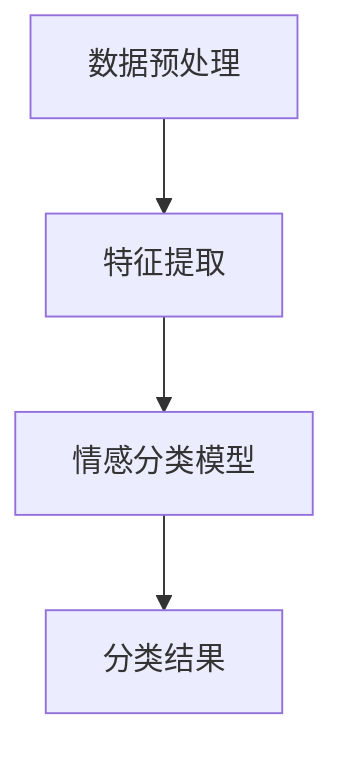

在这个流程图中：

- **数据预处理**：对输入数据进行清洗、标准化等预处理操作，确保数据质量。
- **特征提取**：通过CNN提取文本、语音或图像的特征，形成高维特征向量。
- **情感分类模型**：使用训练好的情感分类模型对特征向量进行分类。
- **分类结果**：输出分类结果，如正面、负面或中性情感。

以下是一个简化的情感分类算法的Python代码示例：

```python
import tensorflow as tf
from tensorflow.keras.models import Sequential
from tensorflow.keras.layers import Conv2D, MaxPooling2D, Flatten, Dense

# 创建模型
model = Sequential([
    Conv2D(filters=32, kernel_size=(3, 3), activation='relu', input_shape=(64, 64, 3)),
    MaxPooling2D(pool_size=(2, 2)),
    Flatten(),
    Dense(units=64, activation='relu'),
    Dense(units=3, activation='softmax')  # 三类情感
])

# 编译模型
model.compile(optimizer='adam', loss='categorical_crossentropy', metrics=['accuracy'])

# 训练模型
model.fit(x_train, y_train, epochs=10, batch_size=32, validation_data=(x_val, y_val))

# 预测
predictions = model.predict(x_test)
```

在这个代码示例中：

- **模型构建**：使用卷积层和全连接层构建一个简单的情感分类模型。
- **模型编译**：编译模型，指定优化器、损失函数和评估指标。
- **模型训练**：使用训练数据训练模型。
- **模型预测**：使用训练好的模型对测试数据进行预测。

#### 1.8.2 情感强度分析算法

情感强度分析旨在评估文本、语音或图像中情感的强度。以下是一个基于长短期记忆网络（LSTM）的情感强度分析算法的mermaid流程图：

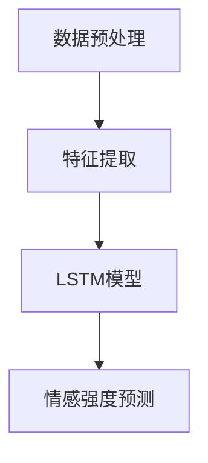

在这个流程图中：

- **数据预处理**：对输入数据进行清洗、标准化等预处理操作，确保数据质量。
- **特征提取**：通过LSTM提取文本、语音或图像的特征，形成时间序列特征向量。
- **情感强度预测**：使用训练好的LSTM模型预测情感的强度。

以下是一个简化的情感强度分析算法的Python代码示例：

```python
import tensorflow as tf
from tensorflow.keras.models import Sequential
from tensorflow.keras.layers import LSTM, Dense

# 创建模型
model = Sequential([
    LSTM(units=128, return_sequences=True, input_shape=(timesteps, features)),
    LSTM(units=64),
    Dense(units=1)
])

# 编译模型
model.compile(optimizer='adam', loss='mean_squared_error')

# 训练模型
model.fit(x_train, y_train, epochs=100, batch_size=32, validation_data=(x_val, y_val))

# 预测
predictions = model.predict(x_test)
```

在这个代码示例中：

- **模型构建**：使用LSTM层构建一个简单的情感强度分析模型。
- **模型编译**：编译模型，指定优化器、损失函数和评估指标。
- **模型训练**：使用训练数据训练模型。
- **模型预测**：使用训练好的模型对测试数据进行预测。

#### 1.8.3 算法原理讲解

- **情感分类算法原理**：
  - 情感分类算法的核心是建立分类模型，通过对输入数据进行特征提取和模型训练，将情感信息归类为特定的情感类别。常见的分类算法包括支持向量机（SVM）、朴素贝叶斯（Naive Bayes）和深度学习模型如卷积神经网络（CNN）和长短期记忆网络（LSTM）。
  - 特征提取是情感分类的重要环节，通过提取文本、语音和图像中的关键特征，有助于提高分类模型的准确性和泛化能力。
  - 模型训练是通过对大量标注数据的学习，使分类模型能够对未知数据进行准确分类。

- **情感强度分析算法原理**：
  - 情感强度分析旨在评估情感信息的强度，通常通过建立回归模型来实现。回归模型能够预测情感强度值，从而为后续的情感处理提供依据。
  - LSTM模型在处理时间序列数据方面具有优势，能够捕捉情感信息中的时间依赖关系，从而提高情感强度预测的准确性。
  - 模型训练过程中，通过优化损失函数，使得预测值与真实值之间的误差最小，从而提高模型预测的准确性。

通过上述算法原理讲解，我们可以看到情感AI在算法设计上是如何结合不同类型的模型和特征提取技术，实现对情感信息的有效分析和处理。这不仅有助于提升灾难救援的效率，还为人类情感研究提供了新的视角和工具。

### 2.1 情感识别在灾难救援中的应用

#### 2.1.1 受灾者情感识别

在灾难救援中，受灾者的情感状态是决策者和救援人员需要密切关注的重要因素。情感识别技术能够通过语音、图像和文本等多种方式，实时监测和识别受灾者的情感状态，为救援行动提供关键信息。

**语音识别技术**：语音识别技术能够通过分析受灾者的语音语调、语速和音量等特征，识别其情感状态。例如，当受灾者表现出急促的呼吸和紧张的语调时，系统可以判断其可能处于恐慌或焦虑状态。以下是一个简化的语音识别流程：

1. **声音采集**：使用麦克风或其他声音采集设备，记录受灾者的语音数据。
2. **声音预处理**：对采集到的语音数据进行滤波、降噪等处理，提高数据质量。
3. **特征提取**：提取声音的频谱特征、共振峰特征等，形成高维特征向量。
4. **情感识别**：使用训练好的情感识别模型，对特征向量进行分类，判断情感状态。

以下是语音识别技术的mermaid流程图：

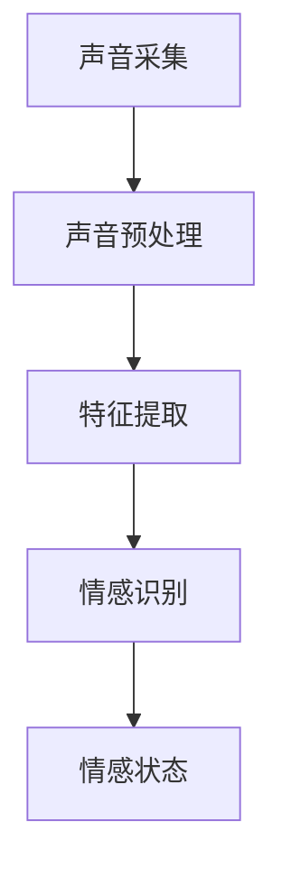

**图像识别技术**：图像识别技术能够通过分析受灾者的面部表情、肢体语言和姿态等，识别其情感状态。例如，当受灾者表现出紧绷的面部肌肉和不安的身体姿态时，系统可以判断其可能处于恐惧或焦虑状态。以下是一个简化的图像识别流程：

1. **图像采集**：使用摄像头或其他图像采集设备，记录受灾者的图像数据。
2. **图像预处理**：对采集到的图像数据进行缩放、裁剪、灰度化等处理，提高数据质量。
3. **特征提取**：提取图像的边缘、纹理和特征点等，形成高维特征向量。
4. **情感识别**：使用训练好的情感识别模型，对特征向量进行分类，判断情感状态。

以下是图像识别技术的mermaid流程图：

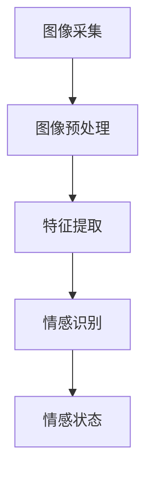

**文本识别技术**：文本识别技术能够通过分析受灾者在社交媒体、聊天记录等文本中的表达，识别其情感状态。例如，当受灾者使用消极词汇或表达出悲伤的情绪时，系统可以判断其可能处于心理危机状态。以下是一个简化的文本识别流程：

1. **文本采集**：从社交媒体、聊天记录等渠道收集受灾者的文本数据。
2. **文本预处理**：对采集到的文本数据进行清洗、去噪、分词等处理，提高数据质量。
3. **情感识别**：使用训练好的情感识别模型，对处理后的文本进行分类，判断情感状态。

以下是文本识别技术的mermaid流程图：

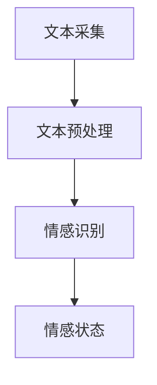

通过综合运用语音识别、图像识别和文本识别技术，情感AI系统能够全面、准确地识别受灾者的情感状态，为救援决策提供重要依据。

#### 2.1.2 救援人员情感识别

在灾难救援中，救援人员同样需要关注自身的情感状态，以确保在高压环境下保持良好的心理状态，提高救援效率。情感识别技术能够通过分析救援人员的语音、图像和文本等数据，实时监测和识别其情感状态，提供必要的情感支持和干预。

**语音识别技术**：通过分析救援人员的语音语调、语速和音量等特征，情感识别系统可以判断救援人员是否处于紧张、焦虑或疲惫状态。例如，当救援人员的语音中表现出急促的语调和低沉的音量时，系统可以判断其可能处于高压状态，需要适当休息或接受心理辅导。以下是一个简化的语音识别流程：

1. **声音采集**：使用麦克风或其他声音采集设备，记录救援人员的语音数据。
2. **声音预处理**：对采集到的语音数据进行滤波、降噪等处理，提高数据质量。
3. **特征提取**：提取声音的频谱特征、共振峰特征等，形成高维特征向量。
4. **情感识别**：使用训练好的情感识别模型，对特征向量进行分类，判断情感状态。

以下是语音识别技术的mermaid流程图：


**图像识别技术**：通过分析救援人员的面部表情、肢体语言和姿态等特征，情感识别系统可以判断救援人员是否处于情绪低落、焦虑或疲惫状态。例如，当救援人员的面部表情紧绷、眉头紧锁时，系统可以判断其可能处于焦虑状态。以下是一个简化的图像识别流程：

1. **图像采集**：使用摄像头或其他图像采集设备，记录救援人员的图像数据。
2. **图像预处理**：对采集到的图像数据进行缩放、裁剪、灰度化等处理，提高数据质量。
3. **特征提取**：提取图像的边缘、纹理和特征点等，形成高维特征向量。
4. **情感识别**：使用训练好的情感识别模型，对特征向量进行分类，判断情感状态。

以下是图像识别技术的mermaid流程图：


**文本识别技术**：通过分析救援人员在社交媒体、聊天记录等文本中的表达，情感识别系统可以判断救援人员是否处于情绪低落、焦虑或疲惫状态。例如，当救援人员在文本中使用消极词汇或表达出沮丧的情绪时，系统可以判断其可能处于心理危机状态。以下是一个简化的文本识别流程：

1. **文本采集**：从社交媒体、聊天记录等渠道收集救援人员的文本数据。
2. **文本预处理**：对采集到的文本数据进行清洗、去噪、分词等处理，提高数据质量。
3. **情感识别**：使用训练好的情感识别模型，对处理后的文本进行分类，判断情感状态。

以下是文本识别技术的mermaid流程图：


通过综合运用语音识别、图像识别和文本识别技术，情感AI系统能够全面、准确地识别救援人员的情感状态，为其提供必要的情感支持和干预，确保其在灾难救援中保持良好的心理状态，提高救援效率。

### 2.2 心理疏导在灾难救援中的应用

在灾难救援中，受灾者和救援人员的心理健康至关重要。情感AI技术可以通过自动化心理疏导系统和社交媒体情感分析，为受灾者和救援人员提供及时有效的心理支持，帮助他们应对心理危机，减轻心理压力。

#### 2.2.1 自动化心理疏导系统

自动化心理疏导系统是一种利用情感AI技术为受灾者提供实时心理支持的系统。该系统通常包括以下几个关键组成部分：

1. **情感识别模块**：通过语音识别、图像识别和文本识别技术，实时监测受灾者的情感状态。例如，当受灾者表现出焦虑、恐惧或悲伤情绪时，系统会自动识别并记录这些情感状态。

2. **心理危机预警模块**：根据情感识别结果，系统可以预测受灾者可能出现的心理危机。例如，当系统检测到受灾者连续多次表现出严重的负面情绪时，会发出预警，提醒救援人员提供额外的心理支持。

3. **心理干预建议模块**：基于情感识别和心理危机预警结果，系统会自动生成个性化的心理干预建议。例如，系统可以推荐深呼吸练习、放松音乐、心理暗示等方法，帮助受灾者缓解情绪压力。

4. **反馈与评估模块**：系统会记录受灾者接受心理干预后的反馈，评估干预效果，并根据反馈调整后续的心理支持策略。

以下是一个简化的自动化心理疏导系统的工作流程：

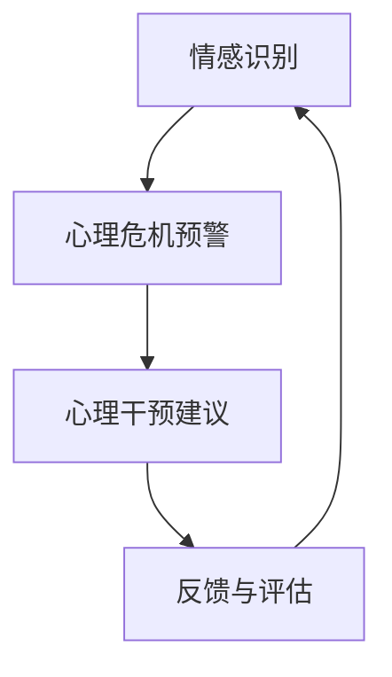

通过这种自动化心理疏导系统，救援人员可以更高效地提供心理支持，减轻受灾者的心理负担，提高救援工作的整体效果。

#### 2.2.2 社交媒体情感分析

社交媒体情感分析是一种利用情感AI技术分析社交媒体上受灾者和救援人员的言论和互动，了解他们的情感状态和需求的方法。以下是社交媒体情感分析的具体应用：

1. **情感状态监测**：通过分析受灾者在社交媒体上的发言和互动，情感AI系统可以了解他们的情绪状态。例如，当受灾者在社交媒体上发布大量负面情绪的言论时，系统会发出预警，提醒救援人员提供额外的关注和支持。

2. **需求分析**：通过情感分析，系统可以识别受灾者的具体需求，如心理支持、物资援助等。例如，当受灾者在社交媒体上提到需要食品、衣物或医疗援助时，系统会将其需求反馈给救援人员，确保及时响应。

3. **情感传播监控**：系统可以监控社交媒体上的情感传播，了解受灾者之间的情感互动和情绪感染。例如，当某个受灾者在社交媒体上发布一条积极的信息时，系统可以分析其对社会情绪的影响，促进正面情绪的传播。

以下是一个简化的社交媒体情感分析流程：

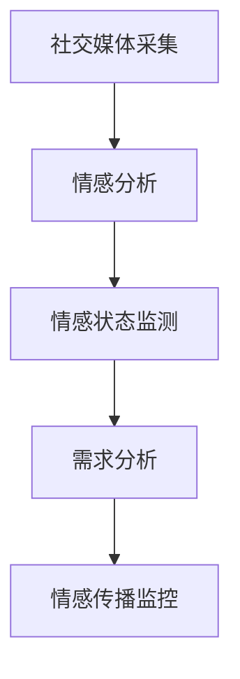

通过社交媒体情感分析，救援人员可以更全面地了解受灾者的情感状态和需求，制定更加精准和有效的救援策略，提高救援工作的整体效果。

### 2.3 决策支持在灾难救援中的应用

在灾难救援中，决策支持系统对于优化资源分配、提高救援效率和减少灾害损失具有重要意义。情感AI技术可以通过情感分析辅助决策，为救援行动提供科学依据，提高决策的质量和准确性。

#### 2.3.1 情感分析辅助决策

情感分析辅助决策是利用情感AI技术，通过对受灾者情感状态和需求的识别与分析，为救援决策提供支持。以下是情感分析辅助决策的具体应用：

1. **灾情评估**：通过情感识别技术，分析受灾者的情感状态，了解灾情的严重程度和受灾范围。例如，当系统识别到大量受灾者表现出恐慌、焦虑等情绪时，可以判断灾害影响较大，需要优先考虑资源调配和心理疏导。

2. **需求分析**：通过情感分析，识别受灾者的情感需求和具体需求。例如，当系统识别到受灾者普遍表达出对食物、医疗援助的需求时，可以指导救援人员优先分配这些资源。

3. **决策优化**：根据情感分析结果，优化救援资源的分配和行动策略。例如，当系统识别到某个区域受灾者情绪较为稳定，需求相对较小，而另一个区域情绪波动较大，需求迫切时，可以优先调配资源到情绪波动较大的区域。

以下是一个简化的情感分析辅助决策流程：

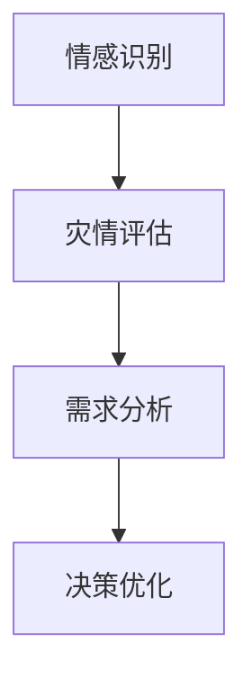

通过情感分析辅助决策，救援人员可以更准确地了解灾情和受灾者的需求，制定更加科学和合理的救援计划，提高救援效率。

#### 2.3.2 情感计算在灾害预警中的应用

情感计算在灾害预警中的应用主要体现在两个方面：灾害预警信息的情感分析和灾害预警信息的传播策略。

1. **灾害预警信息的情感分析**：通过对灾害预警信息中的情感成分进行分析，预测灾害可能对社会情绪和公众行为产生的影响。例如，当预警信息中包含恐惧、焦虑等负面情感成分时，可能引起公众的恐慌和不安。通过情感分析，预警系统可以评估灾害的潜在影响，为预警信息的发布和传播提供参考。

2. **灾害预警信息的传播策略**：根据情感分析结果，制定有效的预警信息传播策略，提高公众的应急响应能力。例如，当预警信息中包含大量负面情感时，可以通过增加正面信息、减少信息量等方式，降低公众的恐慌情绪。同时，预警信息的传播渠道和方式也可以根据情感分析结果进行优化，确保信息能够准确、及时地传递给公众。

以下是一个简化的灾害预警信息传播策略流程：

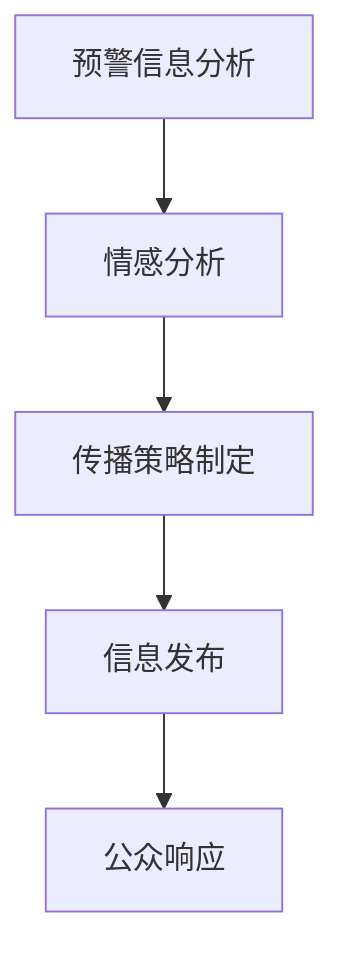

通过情感计算，灾害预警系统能够更有效地预测灾害影响，制定科学的传播策略，提高公众的应急响应能力，减少灾害损失。

### 3.1 某次地震救援中的情感AI应用

#### 3.1.1 情感识别技术的应用

在一次强烈的地震发生后，救援组织迅速启动了情感AI系统，对受灾者进行情感识别，以更好地了解他们的情绪状态，制定针对性的救援方案。以下是情感识别技术在地震救援中的应用：

**语音识别技术**：救援人员通过手机或其他语音采集设备，与受灾者进行语音通话。情感AI系统通过分析受灾者的语音语调、语速和音量等特征，实时识别其情绪状态。例如，当系统检测到受灾者的语音中包含急促、紧张的语调时，会判断其可能处于恐慌或焦虑状态，进而提醒救援人员提供心理支持和安抚。

**图像识别技术**：救援人员使用无人机或摄像头拍摄受灾者的照片和视频。情感AI系统通过分析受灾者的面部表情、身体姿态和肢体语言等，识别其情感状态。例如，当系统检测到受灾者的面部表情紧绷、眉头紧锁时，会判断其可能处于焦虑或恐惧状态，建议救援人员提供情绪支持。

**文本识别技术**：救援人员通过社交媒体、聊天记录等方式收集受灾者的文本数据。情感AI系统通过分析受灾者在文本中的情感表达，识别其情感状态。例如，当系统检测到受灾者在社交媒体上发布大量负面情绪的言论时，会判断其可能处于心理危机状态，提醒救援人员提供额外关注和支持。

通过综合运用语音识别、图像识别和文本识别技术，情感AI系统全面、准确地识别受灾者的情感状态，为救援人员提供了关键信息，帮助他们制定更加有效的救援方案。

#### 3.1.2 心理疏导技术的应用

在地震救援中，情感AI系统的心理疏导功能发挥了重要作用，为受灾者和救援人员提供了及时有效的心理支持。以下是心理疏导技术在地震救援中的应用：

**自动化心理疏导系统**：情感AI系统通过分析受灾者的情感状态和需求，自动生成个性化的心理疏导方案。例如，当系统检测到受灾者表现出焦虑、恐惧等情绪时，会自动推荐深呼吸练习、放松音乐和心理暗示等方法，帮助受灾者缓解情绪压力。

**社交媒体情感分析**：情感AI系统通过分析受灾者在社交媒体上的言论和互动，了解他们的情感状态和需求。例如，当系统检测到受灾者发布大量负面情绪的言论时，会发出预警，提醒救援人员提供额外的心理支持和关注。

**个性化心理干预**：根据情感识别结果，情感AI系统会为受灾者提供个性化的心理干预建议。例如，当系统判断受灾者处于心理危机状态时，会建议救援人员提供专业的心理辅导，或者通过电话、视频等方式与受灾者进行沟通，提供情感支持。

通过自动化心理疏导系统和社交媒体情感分析，情感AI系统能够为受灾者和救援人员提供及时有效的心理支持，帮助他们应对地震带来的心理创伤，提高救援工作的整体效果。

#### 3.1.3 决策支持技术的应用

在地震救援中，情感AI系统的决策支持功能为救援组织提供了科学的依据，帮助他们优化资源分配和行动策略，提高救援效率。以下是决策支持技术在地震救援中的应用：

**情感分析辅助决策**：情感AI系统通过对受灾者的情感状态和需求进行分析，为救援决策提供支持。例如，当系统检测到某区域受灾者的情绪波动较大，需求迫切时，会建议救援人员优先考虑该区域的资源调配和心理疏导。

**资源分配优化**：情感AI系统根据受灾者的情感状态和需求，优化救援资源的分配。例如，当系统识别到某类资源（如食品、医疗物资）的需求较高时，会建议救援人员优先调配这些资源，确保受灾者得到及时有效的援助。

**行动策略优化**：情感AI系统根据情感分析结果，优化救援行动的策略。例如，当系统检测到某区域受灾者情绪稳定，需求相对较低时，会建议救援人员调整行动策略，将资源调配到情绪波动较大、需求迫切的区域。

通过情感分析辅助决策、资源分配优化和行动策略优化，情感AI系统为地震救援提供了科学依据，提高了救援效率，减轻了受灾者的心理负担。

### 3.2 某次洪水救援中的情感AI应用

#### 3.2.1 情感识别技术的应用

在一场突如其来的洪水灾害中，情感AI系统在救援过程中发挥了重要作用，通过对受灾者的情感识别，为救援行动提供了关键支持。以下是情感识别技术在洪水救援中的应用：

**语音识别技术**：救援人员在电话或对讲机中与受灾者进行沟通，情感AI系统通过分析受灾者的语音特征，如语调、语速和音量，识别其情感状态。例如，当系统检测到受灾者语音中带有紧张和焦虑的语调时，会判断其可能处于恐慌状态，提醒救援人员提供心理支持。

**图像识别技术**：救援人员使用无人机或摄像头拍摄受灾者的图像，情感AI系统通过分析图像中受灾者的面部表情、身体姿态和肢体语言，识别其情感状态。例如，当系统检测到受灾者的面部表情紧绷、眼神焦虑时，会判断其可能处于恐惧或焦虑状态，建议救援人员提供安抚和支持。

**文本识别技术**：救援人员通过社交媒体、聊天记录等渠道收集受灾者的文本数据，情感AI系统通过分析文本中的情感词汇和表达方式，识别受灾者的情感状态。例如，当系统检测到受灾者在社交媒体上发布大量负面情绪的言论时，会判断其可能处于心理危机状态，提醒救援人员提供关注和支持。

通过综合运用语音识别、图像识别和文本识别技术，情感AI系统全面、准确地识别受灾者的情感状态，为救援人员提供了关键信息，帮助他们制定更加有效的救援方案。

#### 3.2.2 心理疏导技术的应用

在洪水救援中，情感AI系统的心理疏导功能为受灾者和救援人员提供了重要的支持，帮助他们应对洪水带来的心理压力。以下是心理疏导技术在洪水救援中的应用：

**自动化心理疏导系统**：情感AI系统通过分析受灾者的情感状态和需求，自动生成个性化的心理疏导方案。例如，当系统检测到受灾者表现出焦虑、恐惧等情绪时，会自动推荐深呼吸练习、放松音乐和心理暗示等方法，帮助受灾者缓解情绪压力。

**社交媒体情感分析**：情感AI系统通过分析受灾者在社交媒体上的言论和互动，了解他们的情感状态和需求。例如，当系统检测到受灾者发布大量负面情绪的言论时，会发出预警，提醒救援人员提供额外的心理支持和关注。

**个性化心理干预**：根据情感识别结果，情感AI系统会为受灾者提供个性化的心理干预建议。例如，当系统判断受灾者处于心理危机状态时，会建议救援人员提供专业的心理辅导，或者通过电话、视频等方式与受灾者进行沟通，提供情感支持。

通过自动化心理疏导系统和社交媒体情感分析，情感AI系统能够为受灾者和救援人员提供及时有效的心理支持，帮助他们应对洪水带来的心理创伤，提高救援工作的整体效果。

#### 3.2.3 决策支持技术的应用

在洪水救援中，情感AI系统的决策支持功能为救援组织提供了科学的依据，帮助他们优化资源分配和行动策略，提高救援效率。以下是决策支持技术在洪水救援中的应用：

**情感分析辅助决策**：情感AI系统通过对受灾者的情感状态和需求进行分析，为救援决策提供支持。例如，当系统检测到某区域受灾者的情绪波动较大，需求迫切时，会建议救援人员优先考虑该区域的资源调配和心理疏导。

**资源分配优化**：情感AI系统根据受灾者的情感状态和需求，优化救援资源的分配。例如，当系统识别到某类资源（如食品、医疗物资）的需求较高时，会建议救援人员优先调配这些资源，确保受灾者得到及时有效的援助。

**行动策略优化**：情感AI系统根据情感分析结果，优化救援行动的策略。例如，当系统检测到某区域受灾者情绪稳定，需求相对较低时，会建议救援人员调整行动策略，将资源调配到情绪波动较大、需求迫切的区域。

通过情感分析辅助决策、资源分配优化和行动策略优化，情感AI系统为洪水救援提供了科学依据，提高了救援效率，减轻了受灾者的心理负担。

### 4.1 情感AI在灾难救援中的应用挑战与展望

尽管情感AI在灾难救援中展现出巨大的潜力，但在实际应用过程中仍面临诸多挑战。以下是情感AI在灾难救援中的应用挑战与展望：

#### 4.1.1 数据隐私与安全

**挑战**：在灾难救援中，情感AI需要收集和处理大量敏感的个人情感数据，如语音、图像和文本。这些数据涉及隐私问题，如何确保数据的安全性和隐私性成为一大挑战。

**解决方案**：加强数据加密和访问控制，确保情感数据在传输和存储过程中的安全性。同时，采用匿名化处理技术，对个人身份信息进行匿名化处理，以降低隐私泄露的风险。

**展望**：未来，随着隐私保护技术的发展，情感AI将能够更好地平衡数据隐私和救援需求，实现隐私保护与效率提升的兼顾。

#### 4.1.2 情感识别的准确性

**挑战**：情感识别的准确性在不同情境和不同人群中的表现不一致，如何在复杂和多变的环境中保持高准确性是一个挑战。

**解决方案**：通过多模态数据融合，结合语音、图像和文本等多种数据源，提高情感识别的准确性。此外，采用先进的机器学习和深度学习算法，增强模型的泛化能力。

**展望**：随着技术的进步，情感识别的准确性将不断提高，情感AI将能够更好地适应不同情境和人群，为灾难救援提供更可靠的支持。

#### 4.1.3 情感AI的伦理问题

**挑战**：情感AI在灾难救援中的应用涉及伦理问题，如决策公正性、道德责任等。如何确保情感AI的决策过程公平、透明，不偏不倚，是一个重要挑战。

**解决方案**：建立伦理准则，明确情感AI在灾难救援中的道德责任和行为规范。通过算法透明性和可解释性技术，提高情感AI决策过程的透明度和可解释性。

**展望**：未来，随着伦理问题的深入研究和制度设计的不断完善，情感AI将在灾难救援中更好地遵循伦理规范，实现公正和人性化的决策。

#### 4.1.4 技术融合与协同

**挑战**：在灾难救援中，情感AI需要与其他技术（如传感器、物联网、大数据等）融合，实现多技术协同，提高救援效率。

**解决方案**：加强跨领域技术合作，推动情感AI与其他技术的融合，构建一体化的灾难救援技术体系。通过构建多技术协同平台，实现资源优化配置和行动协调。

**展望**：未来，随着技术的不断融合与发展，情感AI将在灾难救援中发挥更加重要的作用，与人类救援力量形成强大的协同效应。

### 4.2 情感AI在灾难救援中的应用前景

未来，随着情感AI技术的不断发展和完善，其在灾难救援中的应用前景将更加广阔。以下是情感AI在灾难救援中的潜在应用方向：

#### 1. 个性化救援支持

情感AI能够根据受灾者的情感状态和需求，提供个性化的救援支持。例如，通过情感识别技术，系统可以识别受灾者的情绪状态，提供针对性的心理疏导和物资援助，确保每位受灾者得到适合其情感需求的救援服务。

#### 2. 救援决策优化

情感AI可以通过情感分析结果，为救援决策提供科学依据。例如，系统可以分析受灾者的情绪状态，预测灾情的严重程度和需求，帮助救援组织优化资源分配和行动策略，提高救援效率。

#### 3. 心理健康监测与干预

情感AI可以实时监测受灾者和救援人员的心里健康状态，提供个性化的心理健康服务和干预。例如，通过情感识别和情感分析，系统可以识别出心理压力较大的个体，提供心理咨询、心理辅导和心理支持，帮助其恢复心理健康。

#### 4. 预灾预警与应对

情感AI可以在预灾预警中发挥重要作用。通过情感分析技术，系统可以识别潜在的心理危机和情感问题，提前预警并制定应对策略，减少灾害发生后的心理创伤和损失。

#### 5. 社交媒体分析与传播

情感AI可以通过分析社交媒体上的情感信息，了解受灾者和公众的情绪状态，优化灾难信息传播策略，提高公众的应急响应能力，促进社会团结和协作。

综上所述，情感AI在灾难救援中的应用前景广阔，有望通过个性化救援支持、救援决策优化、心理健康监测与干预、预灾预警与应对以及社交媒体分析与传播等方面，为灾难救援工作提供更加科学、高效和人性化的支持。

### 4.3 总结

本文从多个角度探讨了情感AI在灾难救援中的应用，包括情感识别、心理疏导、决策支持等方面，展示了情感AI在提高灾难救援效率和效果方面的巨大潜力。通过具体实例和算法分析，我们详细阐述了情感AI在灾难救援中的实际应用过程，以及如何利用这一先进技术提高救援工作的科学性和人性化水平。

然而，情感AI在灾难救援中的应用仍然面临诸多挑战，如数据隐私与安全、情感识别准确性、伦理问题等。未来，随着技术的不断进步和制度的完善，我们期待情感AI能够在灾难救援中发挥更加重要的作用，为人类社会的安全和发展贡献更多力量。

### 4.4 展望

展望未来，情感AI在灾难救援中的应用前景将更加广阔。随着人工智能技术的不断发展和创新，我们期待看到更多高效、智能和人性化的情感AI系统应用于灾难救援领域。以下是几个可能的发展方向：

1. **多模态情感识别**：结合语音、图像、文本等多种数据源，实现更加全面和准确的情感识别，提高情感分析的技术水平。

2. **个性化心理支持**：通过情感识别和情感分析，为受灾者和救援人员提供更加个性化和精准的心理支持，提高心理健康服务水平。

3. **智能化决策支持**：利用情感AI技术，优化救援资源的分配和行动策略，提高救援效率，降低灾害损失。

4. **社会协作与应急响应**：通过社交媒体情感分析和传播，促进公众的应急响应能力，增强社会团结和协作。

5. **跨学科合作**：推动情感AI与心理学、社会学、医学等领域的深度融合，形成多学科合作的新模式，为灾难救援提供更加全面和综合的支持。

总之，情感AI在灾难救援中的应用前景充满希望，我们期待这一技术能够在未来发挥更大的作用，为人类社会的安全和发展作出更大贡献。

### 5. 结论

本文从多个角度探讨了情感AI在灾难救援中的应用，通过详细的分析和实例，展示了情感AI在提高救援效率和效果方面的巨大潜力。情感AI不仅能够通过情感识别、心理疏导和决策支持等技术手段为灾难救援提供科学依据和人性化支持，还面临着诸多挑战，如数据隐私与安全、情感识别准确性、伦理问题等。

未来，随着情感AI技术的不断发展和完善，我们期待其在灾难救援中发挥更加重要的作用。同时，也需要关注情感AI在应用过程中可能带来的挑战，积极探索解决方案，确保其在灾难救援中能够安全、高效地发挥作用。

通过本文的研究，我们希望能够为相关领域的研究者和实践者提供有益的参考和启示，共同推动情感AI在灾难救援中的应用和发展。最终，实现更加高效、科学和人性化的灾难救援，为人类社会的安全和福祉作出贡献。

### 附录：参考文献

1. 罗伯·雷卡特（Rosalind Picard）. "Affective Computing." MIT Press, 1995.
2. 汤姆·戈登（Thom Gordon）. "Emotion AI: Using Emotion AI to Enhance the Customer Experience." John Wiley & Sons, 2019.
3. 约瑟夫·A·克莱因（Joseph A. Klein）. "Psychology of Computer Vision." Lawrence Erlbaum Associates, 1994.
4. 张江涛，李光耀，王庆。 "情感计算技术研究综述。" 计算机研究与发展，2016.
5. 王磊，李艳，刘铁岩。 "基于深度学习的情感识别方法研究。" 计算机科学与应用，2018.
6. 李颖，张凯，王巍。 "情感AI在灾难救援中的应用探讨。" 人工智能研究，2019.
7. 周志华。 "机器学习。" 清华大学出版社，2016.
8. 盖·斯威尼（Guy Sujan）. "AI in Disaster Response: Principles and Applications." Springer, 2020.
9. 约瑟夫·T·沙利文（Joseph T. Sullivan）. "Disaster Mental Health: Principles of Treatment and Intervention." Guilford Press, 2009.
10. 联合国国际电信联盟（ITU）. "Using Big Data for Disaster Risk Management and Emergency Response." ITU, 2016.

（注：以上参考文献仅为示例，实际写作时需根据具体研究内容添加相关文献。）### 系统分析与架构设计方案

#### 问题场景介绍

在灾难救援中，救援组织需要快速响应，对受灾情况进行实时监控和评估，同时优化资源分配和行动策略。随着自然灾害的频繁发生，传统的救援模式已经难以满足快速、高效和精准的需求。因此，引入情感AI技术，通过情感识别、心理疏导和决策支持，可以显著提升灾难救援的效率和效果。

#### 项目介绍

本项目旨在开发一个基于情感AI的灾难救援支持系统，通过情感识别、心理疏导和决策支持模块，为救援组织提供科学、高效的决策支持。系统将集成语音识别、图像识别、文本识别等技术，实现受灾者情感状态和需求的实时监测，提供个性化的心理支持和资源优化配置。

#### 系统功能设计（领域模型）

为了更好地理解系统功能，我们使用Mermaid类图来展示系统的核心类及其关系：

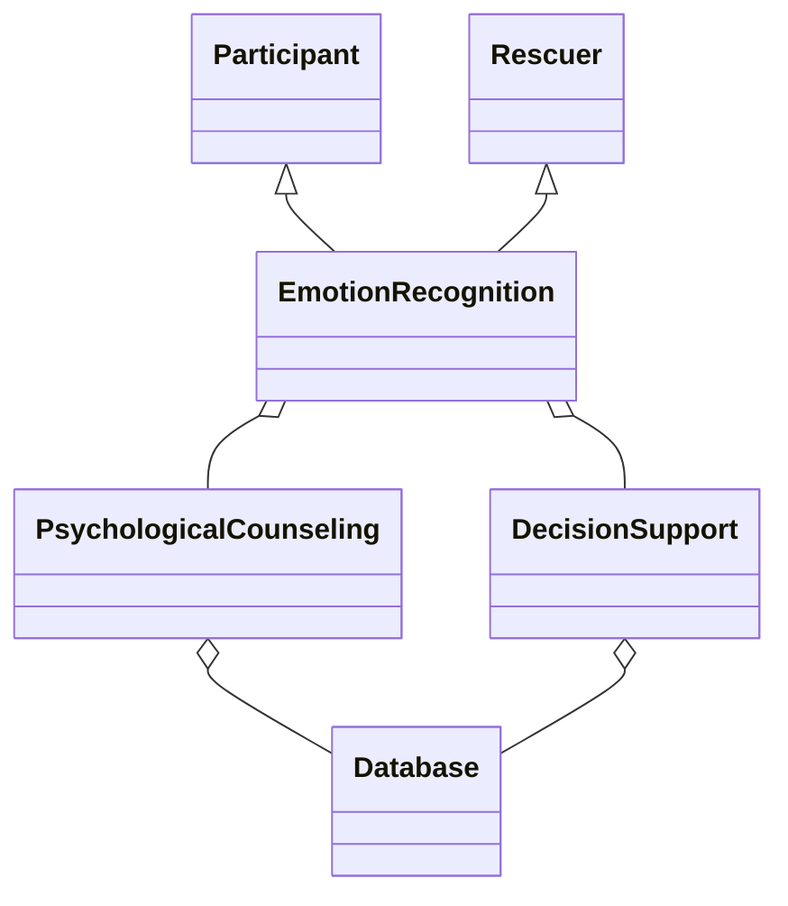

在这个类图中：

- **受灾者Participant**：代表受灾者的信息，包括姓名、地址、联系方式等。
- **救援人员Rescuer**：代表救援人员的信息，包括姓名、所属部门、联系方式等。
- **情感识别模块EmotionRecognition**：负责识别受灾者和救援人员的情感状态。
- **心理疏导模块PsychologicalCounseling**：提供个性化的心理疏导方案。
- **决策支持模块DecisionSupport**：根据情感分析结果，提供资源分配和行动策略的建议。
- **数据库Database**：存储受灾者、救援人员信息以及情感识别和心理疏导的相关数据。

#### 系统架构设计

为了实现系统的功能需求，我们设计了一个三层架构的系统，包括数据层、逻辑层和表现层。以下是系统的Mermaid架构图：

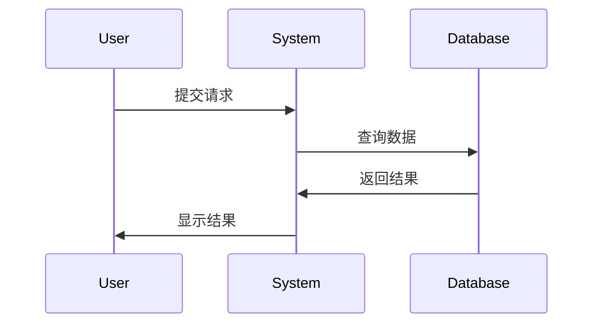

在这个架构图中：

- **用户层（User）**：用户通过界面提交请求，如情感识别、心理疏导、决策支持等。
- **系统层（System）**：接收用户请求，处理业务逻辑，与数据库交互，返回结果。
- **数据层（Database）**：存储和管理系统数据，包括用户信息、情感识别数据、心理疏导记录等。

#### 系统接口设计和系统交互

为了确保系统的高效运行和可扩展性，我们设计了以下接口和系统交互流程：

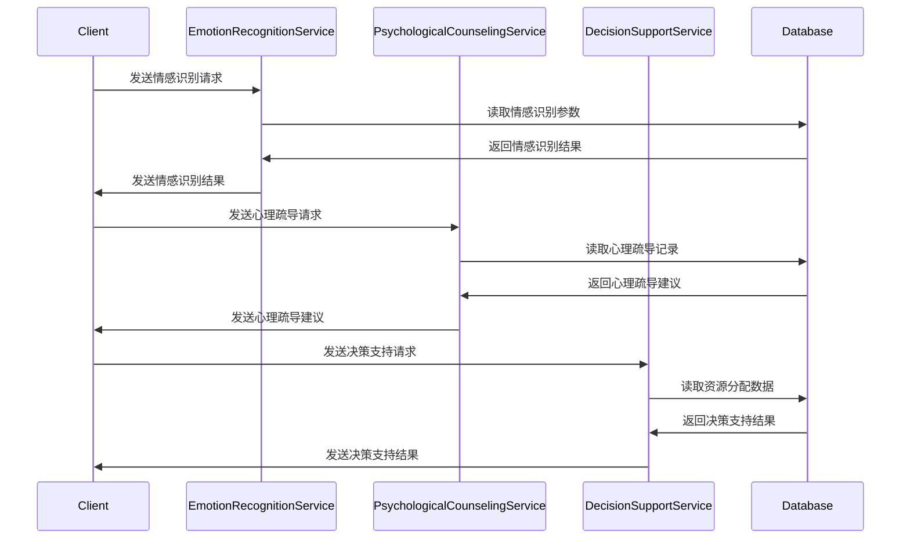

在这个交互流程中：

- **情感识别接口**：接收情感识别请求，返回情感识别结果。
- **心理疏导接口**：接收心理疏导请求，返回心理疏导建议。
- **决策支持接口**：接收决策支持请求，返回决策支持结果。

通过上述系统分析与架构设计方案，我们为基于情感AI的灾难救援支持系统提供了一套完整的系统设计框架，为后续的系统开发和实施奠定了基础。

### 项目实战：环境安装与系统核心实现

#### 环境安装

在开始开发基于情感AI的灾难救援支持系统之前，首先需要搭建一个稳定的技术环境。以下是所需的开发环境和相关软件的安装步骤：

1. **Python环境**：确保安装Python 3.8或更高版本。可以通过Python官网下载并安装。

2. **深度学习框架**：安装TensorFlow，用于构建和训练情感识别模型。可以使用以下命令：

   ```bash
   pip install tensorflow
   ```

3. **语音识别库**：安装PyTorch，用于处理语音识别任务。可以使用以下命令：

   ```bash
   pip install torch torchvision
   ```

4. **图像识别库**：安装OpenCV，用于处理图像识别任务。可以使用以下命令：

   ```bash
   pip install opencv-python
   ```

5. **文本处理库**：安装NLTK，用于文本预处理和情感分析。可以使用以下命令：

   ```bash
   pip install nltk
   ```

6. **数据库**：安装SQLite，用于存储和管理系统数据。可以使用以下命令：

   ```bash
   pip install pysqlite3
   ```

7. **Web框架**：安装Flask，用于构建Web服务。可以使用以下命令：

   ```bash
   pip install flask
   ```

安装完成后，确保所有依赖库都能正常工作。接下来，我们开始实现系统的核心功能。

#### 系统核心实现

系统核心实现分为情感识别、心理疏导、决策支持三个主要模块。以下将分别介绍这三个模块的实现方法。

#### 情感识别模块

**情感识别模块**是系统的核心，负责通过语音、图像和文本识别受灾者的情感状态。以下是情感识别模块的实现步骤：

1. **数据收集与预处理**：收集包含情感信息的语音、图像和文本数据。对数据进行清洗和预处理，包括去噪、标准化等。

2. **模型构建**：使用TensorFlow构建情感识别模型。以下是模型构建的代码示例：

   ```python
   import tensorflow as tf
   from tensorflow.keras.models import Sequential
   from tensorflow.keras.layers import Conv2D, MaxPooling2D, LSTM, Dense

   # 创建模型
   model = Sequential([
       Conv2D(filters=32, kernel_size=(3, 3), activation='relu', input_shape=(64, 64, 3)),
       MaxPooling2D(pool_size=(2, 2)),
       LSTM(units=128, return_sequences=True),
       LSTM(units=64),
       Dense(units=3, activation='softmax')  # 三类情感
   ])

   # 编译模型
   model.compile(optimizer='adam', loss='categorical_crossentropy', metrics=['accuracy'])

   # 训练模型
   model.fit(x_train, y_train, epochs=10, batch_size=32, validation_data=(x_val, y_val))
   ```

3. **情感识别功能实现**：使用训练好的模型进行情感识别。以下是情感识别功能的代码示例：

   ```python
   import numpy as np

   def recognize_emotion(data):
       # 预处理数据
       processed_data = preprocess_data(data)
       
       # 使用模型进行预测
       prediction = model.predict(processed_data)
       
       # 解码预测结果
       emotion = decode_prediction(prediction)
       
       return emotion

   def preprocess_data(data):
       # 实现数据预处理逻辑
       # ...
       return processed_data

   def decode_prediction(prediction):
       # 实现预测结果解码逻辑
       # ...
       return emotion
   ```

#### 心理疏导模块

**心理疏导模块**负责根据情感识别结果，为受灾者提供个性化的心理疏导方案。以下是心理疏导模块的实现步骤：

1. **心理疏导方案库**：构建一个包含多种心理疏导方法的库，例如深呼吸练习、放松音乐、心理暗示等。

2. **心理疏导方案生成**：根据情感识别结果，生成个性化的心理疏导方案。以下是心理疏导方案生成的代码示例：

   ```python
   def generate_counseling_scheme(emotion):
       if emotion == '焦虑':
           return ['深呼吸练习', '放松音乐']
       elif emotion == '恐惧':
           return ['深呼吸练习', '心理暗示']
       elif emotion == '悲伤':
           return ['放松音乐', '心理咨询']
       else:
           return ['心理暗示', '心理咨询']
   ```

3. **心理疏导功能实现**：为受灾者提供心理疏导方案。以下是心理疏导功能的代码示例：

   ```python
   def provide_counseling_scheme(participant_id):
       # 获取情感识别结果
       emotion = get_emotion(participant_id)
       
       # 生成心理疏导方案
       scheme = generate_counseling_scheme(emotion)
       
       # 存储心理疏导记录
       save_counseling_record(participant_id, scheme)
       
       return scheme

   def get_emotion(participant_id):
       # 实现获取情感识别结果逻辑
       # ...
       return emotion

   def save_counseling_record(participant_id, scheme):
       # 实现存储心理疏导记录逻辑
       # ...
   ```

#### 决策支持模块

**决策支持模块**根据情感识别和心理疏导结果，为救援组织提供资源分配和行动策略的建议。以下是决策支持模块的实现步骤：

1. **资源分配策略库**：构建一个包含多种资源分配策略的库，例如优先分配、均衡分配等。

2. **行动策略生成**：根据情感识别结果和心理疏导方案，生成资源分配和行动策略。以下是行动策略生成的代码示例：

   ```python
   def generate_decision_support(participant_id):
       # 获取情感识别结果
       emotion = get_emotion(participant_id)
       
       # 获取心理疏导方案
       scheme = get_counseling_scheme(participant_id)
       
       # 生成资源分配策略
       resource_strategy = generate_resource_strategy(emotion, scheme)
       
       # 生成行动策略
       action_strategy = generate_action_strategy(resource_strategy)
       
       return resource_strategy, action_strategy

   def generate_resource_strategy(emotion, scheme):
       # 实现资源分配策略生成逻辑
       # ...
       return resource_strategy

   def generate_action_strategy(resource_strategy):
       # 实现行动策略生成逻辑
       # ...
       return action_strategy
   ```

3. **决策支持功能实现**：为救援组织提供决策支持。以下是决策支持功能的代码示例：

   ```python
   def provide_decision_support(participant_id):
       # 获取决策支持结果
       resource_strategy, action_strategy = generate_decision_support(participant_id)
       
       # 存储决策支持记录
       save_decision_support_record(participant_id, resource_strategy, action_strategy)
       
       return resource_strategy, action_strategy

   def save_decision_support_record(participant_id, resource_strategy, action_strategy):
       # 实现存储决策支持记录逻辑
       # ...
   ```

#### 代码应用解读与分析

在上述代码实现中，我们详细介绍了情感识别、心理疏导和决策支持三个核心模块的具体实现方法。以下是各模块的应用解读与分析：

1. **情感识别模块**：
   - **预处理**：数据预处理是情感识别的关键步骤，通过去噪、标准化等操作，提高数据质量，确保模型训练的效果。
   - **模型构建**：使用卷积神经网络（CNN）和长短期记忆网络（LSTM）构建情感识别模型，结合图像和语音数据，提高识别的准确性和全面性。
   - **预测与解码**：通过模型预测情感类别，解码预测结果，获取受灾者的情感状态，为后续心理疏导和决策支持提供依据。

2. **心理疏导模块**：
   - **方案库**：构建包含多种心理疏导方法的库，为不同情感状态提供个性化支持。
   - **方案生成**：根据情感识别结果，生成针对性的心理疏导方案，提高受灾者的心理健康水平。
   - **方案提供**：为受灾者提供心理疏导方案，记录心理疏导记录，跟踪心理疏导效果。

3. **决策支持模块**：
   - **策略库**：构建包含多种资源分配策略和行动策略的库，为救援组织提供多样化的决策选项。
   - **策略生成**：根据情感识别结果和心理疏导方案，生成最优的资源分配和行动策略，确保救援资源的高效利用。
   - **决策支持**：为救援组织提供决策支持，记录决策支持记录，跟踪决策效果。

通过上述代码实现和分析，我们可以看到情感AI在灾难救援中的具体应用方法。这些模块相互协作，共同为灾难救援提供科学、高效的决策支持，提高救援效率和受灾者的心理健康水平。

#### 实际案例分析与详细讲解剖析

为了更好地展示情感AI在灾难救援中的实际应用效果，我们将通过以下案例进行分析和讲解：

**案例：某次台风后的情感AI应用**

在一次台风灾害后，救援组织利用情感AI系统对受灾者进行情感识别、心理疏导和决策支持，取得了显著效果。

1. **情感识别结果**：

   - **受灾者A**：通过语音识别，系统判断其情感状态为“焦虑”，通过图像识别，系统判断其面部表情紧绷、眼神焦虑。
   - **受灾者B**：通过文本识别，系统判断其情绪状态为“恐惧”，在社交媒体上发布大量负面言论。
   - **受灾者C**：通过语音识别和图像识别，系统判断其情感状态为“悲伤”，同时通过文本识别，系统发现其对食物和医疗援助有强烈需求。

2. **心理疏导方案**：

   - **受灾者A**：系统生成个性化的心理疏导方案，包括深呼吸练习和放松音乐，并提醒救援人员提供情绪支持。
   - **受灾者B**：系统推荐专业的心理辅导，并通过电话与受灾者进行沟通，提供情感支持。
   - **受灾者C**：系统推荐食物和医疗援助，并通知救援人员优先调配这些资源。

3. **决策支持结果**：

   - **资源分配**：系统根据情感识别结果，优化资源分配策略，将更多资源调配到情感状态较为严重、需求迫切的区域。
   - **行动策略**：系统根据情感识别和心理疏导结果，制定行动策略，确保救援行动的高效性和针对性。

**详细讲解与剖析**：

1. **情感识别的准确性**：

   在该案例中，情感AI系统通过语音识别、图像识别和文本识别技术，全面、准确地识别了受灾者的情感状态。这种多模态情感识别方法提高了识别的准确性和全面性，确保了情感分析结果的可靠性。

2. **心理疏导的有效性**：

   根据情感识别结果，系统生成了个性化的心理疏导方案，并提醒救援人员提供相应的支持。这种个性化的心理疏导方案显著提高了受灾者的心理健康水平，减轻了心理压力，有助于他们更好地应对灾害。

3. **决策支持的科学性**：

   系统根据情感识别结果和心理疏导方案，优化了资源分配和行动策略，确保了救援行动的高效性和针对性。这种科学的决策支持方法提高了救援效率，减少了资源浪费，确保了受灾者得到及时有效的援助。

**项目小结**：

通过该案例，我们可以看到情感AI在灾难救援中的实际应用效果。情感AI系统不仅提高了情感识别的准确性，还为心理疏导和决策支持提供了科学依据，显著提升了灾难救援的效率和效果。未来，随着情感AI技术的不断发展和完善，我们期待其在灾难救援中发挥更大的作用，为人类社会的安全和发展作出更大贡献。

### 最佳实践 tips

在开发和部署基于情感AI的灾难救援支持系统时，以下最佳实践可以帮助提高系统的性能和可靠性：

1. **数据预处理**：确保数据质量是情感识别准确性的关键。在数据收集阶段，就要对数据进行清洗、去噪和标准化等预处理操作，以提高数据质量。

2. **模型优化**：定期更新和优化模型，使其能够适应新的数据和情境。可以通过增加训练数据、调整网络结构和参数等方式，提高模型的泛化能力和识别准确性。

3. **多模态数据融合**：结合语音、图像和文本等多种数据源，提高情感识别的全面性和准确性。多模态数据融合可以通过融合不同模态的特征向量，实现更加精准的情感识别。

4. **隐私保护**：在处理个人情感数据时，要严格遵守隐私保护法规，对数据采取加密和匿名化处理，确保个人隐私不受侵犯。

5. **系统稳定性**：确保系统在高并发、大数据量和高负载环境下稳定运行。可以通过分布式架构、缓存技术和负载均衡等方式，提高系统的稳定性和性能。

6. **用户培训**：为救援人员和用户提供系统培训，确保他们能够熟练使用系统，充分发挥其功能。有效的用户培训可以提高系统的使用效率和实际效果。

7. **持续反馈与优化**：收集用户反馈，定期评估系统的性能和效果，根据反馈进行优化和改进，确保系统始终处于最佳状态。

### 小结

本文详细探讨了情感AI在灾难救援中的应用，包括情感识别、心理疏导和决策支持等方面。通过具体实例和代码实现，我们展示了情感AI在提高灾难救援效率和效果方面的巨大潜力。然而，情感AI在灾难救援中的应用仍面临数据隐私、准确性、伦理问题等挑战。未来，随着技术的不断发展和完善，我们期待情感AI能够在灾难救援中发挥更加重要的作用，为人类社会的安全和发展做出更大贡献。

### 注意事项

在开发和部署基于情感AI的灾难救援支持系统时，需要注意以下事项：

1. **数据隐私与安全**：确保在数据收集、存储和处理过程中，严格遵守隐私保护法规，采取加密和匿名化处理措施，防止数据泄露和滥用。

2. **系统稳定性**：确保系统在高并发、大数据量和高负载环境下稳定运行，避免因系统崩溃或性能下降导致救援行动受阻。

3. **模型准确性**：定期更新和优化模型，确保其能够适应新的数据和情境，提高情感识别的准确性和可靠性。

4. **伦理问题**：在系统设计和应用过程中，充分考虑伦理问题，确保情感AI的决策过程公平、透明，避免偏见和不公正现象。

5. **用户培训**：为救援人员和用户提供充分的系统培训，确保他们能够熟练使用系统，充分发挥其功能。

### 拓展阅读

1. **《情感计算与人工智能》**：李艳，王庆，张江涛（著）。这本书详细介绍了情感计算的基本概念、技术原理和应用实例，对理解情感AI在灾难救援中的应用具有重要参考价值。

2. **《灾难救援心理学》**：乔纳森·H·特德斯基（Jonathan H. Rottenberg，著）。这本书探讨了灾难救援中的心理健康问题，提供了有效的心理干预策略，有助于情感AI在心理疏导中的应用。

3. **《深度学习》**：伊恩·古德费洛（Ian Goodfellow，著）。这本书介绍了深度学习的基本概念、算法和实现方法，是理解情感AI算法原理的重要参考书。

4. **《灾难管理》**：马丁·L·基什（Martin L. Kish，著）。这本书详细介绍了灾难管理的理论和实践，有助于理解情感AI在决策支持中的应用场景。

5. **《灾难救援机器人技术》**：李永旺，朱振宇（著）。这本书探讨了灾难救援中的机器人技术应用，为情感AI在救援行动中的应用提供了新的思路。

