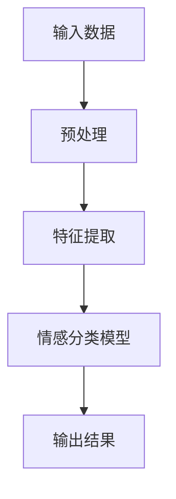
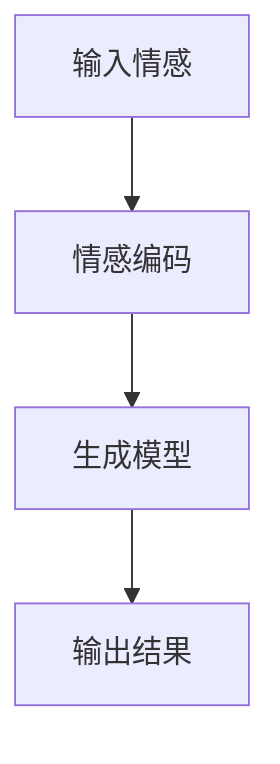
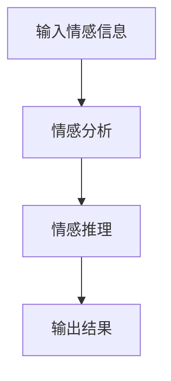
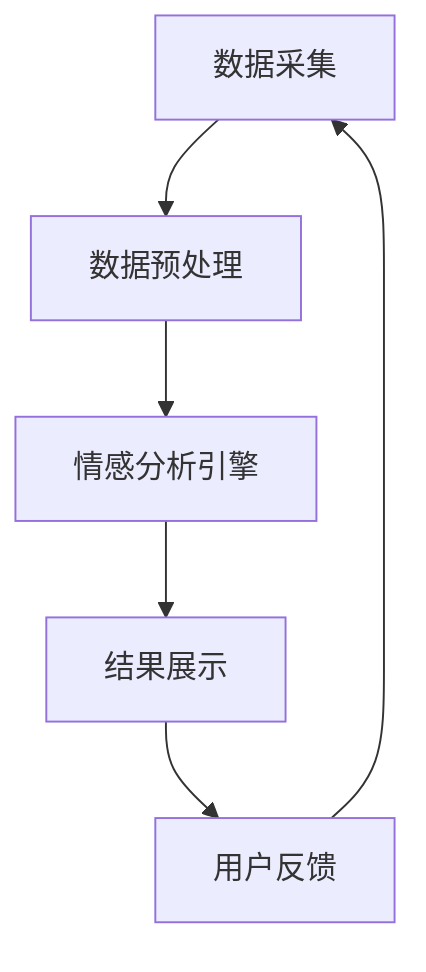
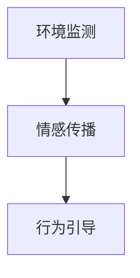
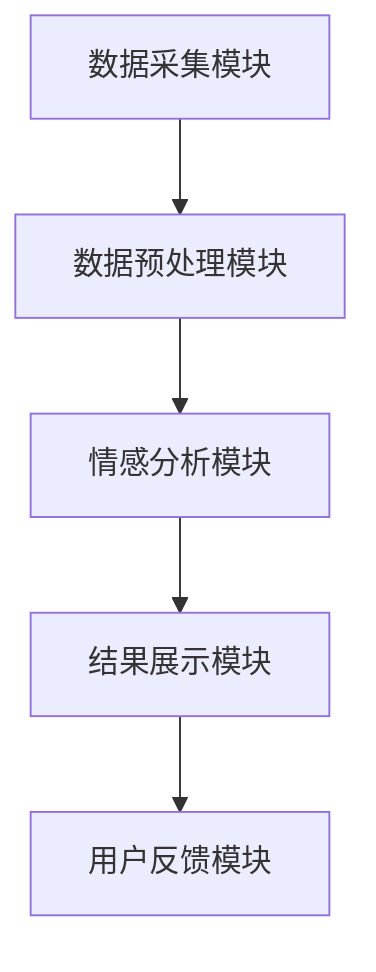

                 

### 情感AI在环境保护中的潜在作用

关键词：情感AI、环境保护、算法原理、数学模型、系统设计、项目实战、最佳实践

摘要：本文将深入探讨情感AI在环境保护中的重要性和潜在作用。通过逐步分析，我们将理解情感AI如何帮助监测环境变化、传播环保意识以及引导社会行为，最终实现环境保护的目标。文章分为四个主要部分，分别介绍背景与核心概念、算法原理与数学模型、系统设计与项目实战，以及最佳实践与拓展研究，以期为广大读者提供全面的技术见解和实际应用指导。

---

### 目录大纲设计

在撰写本文之前，我们首先需要设计一份详细的目录大纲。该大纲将确保文章内容结构紧凑、逻辑清晰，并覆盖从背景介绍到实践应用的各个方面。

**第一部分：背景与核心概念**
- **第1章：问题背景与核心概念**
  - 1.1 问题背景
  - 1.2 核心概念
  - 1.3 情感AI与环境保护的联系

- **第2章：情感AI的基本原理**
  - 2.1 情感AI的基础技术
  - 2.2 情感AI的原理
  - 2.3 情感AI的特征与应用领域

- **第3章：情感AI在环境保护中的应用**
  - 3.1 环境监测
  - 3.2 情感传播与教育
  - 3.3 社会影响与行为引导

**第二部分：算法原理与数学模型**
- **第4章：情感AI算法原理**
  - 4.1 情感识别算法
  - 4.2 情感生成算法
  - 4.3 情感推理算法

- **第5章：情感AI的数学模型**
  - 5.1 情感识别模型
  - 5.2 情感生成模型
  - 5.3 情感推理模型

**第三部分：系统设计与项目实战**
- **第6章：系统架构与设计**
  - 6.1 系统总体架构
  - 6.2 系统功能设计
  - 6.3 系统接口设计与交互

- **第7章：情感AI在环境保护项目中的应用实战**
  - 7.1 项目环境安装与配置
  - 7.2 系统核心实现与代码解读
  - 7.3 实际案例分析
  - 7.4 项目总结与展望

**第四部分：最佳实践与拓展**
- **第8章：最佳实践与注意事项**
  - 8.1 实践经验分享
  - 8.2 注意事项与风险防范

- **第9章：拓展阅读与研究方向**
  - 9.1 最新研究进展
  - 9.2 未来研究方向
  - 9.3 拓展阅读推荐

---

### 第一部分：背景与核心概念

#### 第1章：问题背景与核心概念

##### 1.1 问题背景

环境保护是当今社会面临的重大挑战之一。气候变化、空气质量下降、水资源短缺等问题已经对地球生态系统和人类生活造成了严重影响。为了应对这些问题，科学家和工程师们一直在探索新的技术和方法，以提高环境保护的效率和效果。随着人工智能技术的迅速发展，情感AI作为一种新兴技术，开始引起广泛关注。

##### 1.2 核心概念

情感AI是指利用人工智能技术对人类情感进行识别、分析和模拟的能力。它结合了自然语言处理、情感计算和机器学习等多种技术，能够理解和处理人类情感表达，从而为环境保护提供更加智能和人性化的解决方案。

##### 1.3 情感AI与环境保护的联系

情感AI在环境保护中具有巨大的潜力。首先，它可以用于环境监测和评估，通过分析环境数据中的情感成分，及时发现和预警环境问题。其次，情感AI可以帮助传播环保意识，通过情感化的内容设计，提高公众对环保问题的关注和参与度。最后，情感AI可以引导社会行为，通过情感分析和行为预测，促进人们采取更加环保的生活方式。

---

#### 第2章：情感AI的基本原理

##### 2.1 情感AI的基础技术

情感AI的基础技术主要包括自然语言处理（NLP）、情感计算和机器学习（ML）。自然语言处理是情感AI的核心技术之一，它涉及文本的预处理、情感分类和情感分析等任务。情感计算则侧重于开发和理解情感信息的硬件和软件技术。机器学习为情感AI提供了强大的数据处理和分析能力，通过训练模型，实现情感识别和情感生成等功能。

##### 2.2 情感AI的原理

情感AI的原理主要基于情感识别和情感生成两个方面。情感识别是指通过分析文本、图像或声音等数据，识别出其中的情感成分。情感生成则是通过模拟情感表达，生成具有特定情感倾向的内容。这两方面的技术结合，使得情感AI能够在环境保护中发挥重要作用。

##### 2.3 情感AI的特征与应用领域

情感AI具有以下主要特征：高度自动化、实时性、情感感知和人性化。这些特征使得情感AI在环境保护中的应用领域非常广泛，包括环境监测、环保宣传、环保教育、社区动员等方面。

---

#### 第3章：情感AI在环境保护中的应用

##### 3.1 环境监测

情感AI可以用于环境监测，通过分析环境数据中的情感成分，实现对环境问题的早期预警和及时响应。例如，通过对空气质量监测数据的情感分析，可以识别出空气污染的严重程度，为政府和公众提供决策依据。

##### 3.2 情感传播与教育

情感AI在环保宣传和教育中具有重要作用。通过情感化的内容设计，可以更好地吸引公众关注环保问题，提高环保意识和参与度。例如，在环保宣传视频中，使用情感AI技术，设计出具有感染力的情节和台词，能够更有效地传达环保理念。

##### 3.3 社会影响与行为引导

情感AI可以引导社会行为，通过情感分析和行为预测，促进人们采取更加环保的生活方式。例如，通过分析社交媒体上的情感表达，了解公众对环保政策的看法和态度，从而制定更加有效的政策。

---

### 第二部分：算法原理与数学模型

#### 第4章：情感AI算法原理

##### 4.1 情感识别算法

情感识别算法是情感AI的核心技术之一。它通过分析文本、图像或声音等数据，识别出其中的情感成分。常见的情感识别算法包括基于规则的方法、机器学习方法以及深度学习方法。

**算法流程图：**


**算法原理：**
- **预处理**：对输入数据进行清洗、分词、去停用词等操作，使其适合后续处理。
- **特征提取**：从预处理后的数据中提取关键特征，如词频、词嵌入等。
- **情感分类模型**：使用机器学习或深度学习算法，对特征进行分类，识别出文本、图像或声音中的情感。

**数学模型：**
$$
P(y=j|X) = \frac{e^{\theta_j^T X}}{\sum_{k=1}^K e^{\theta_k^T X}}
$$
其中，$X$是特征向量，$\theta_j$是分类模型参数，$y$是实际情感标签，$j$是预测的情感类别。

**例子：** 假设我们有一个情感分类模型，输入文本是“今天的天气非常好”，情感标签是“积极”。我们可以通过情感分类模型，将这句话归类为积极的情感。

---

##### 4.2 情感生成算法

情感生成算法是指通过模拟情感表达，生成具有特定情感倾向的内容。常见的情感生成算法包括文本生成、图像生成和声音生成等。

**算法流程图：**


**算法原理：**
- **情感编码**：将输入的情感信息转换为编码，以便生成模型理解。
- **生成模型**：使用生成对抗网络（GAN）或其他生成模型，根据情感编码生成具有特定情感倾向的内容。
- **输出结果**：输出具有特定情感倾向的内容，如文本、图像或声音。

**数学模型：**
$$
G(z) = \mu_z + \sigma_z \odot \epsilon
$$
其中，$G(z)$是生成模型，$z$是随机噪声，$\mu_z$和$\sigma_z$分别是均值和方差，$\epsilon$是随机噪声。

**例子：** 假设我们想要生成一段表达“快乐”情感的文字。我们可以使用情感生成算法，根据“快乐”的情感编码，生成一段具有快乐情感的文字。

---

##### 4.3 情感推理算法

情感推理算法是指通过分析已有情感信息，推理出新的情感结论。常见的情感推理算法包括情感传递、情感增强和情感预测等。

**算法流程图：**


**算法原理：**
- **情感分析**：对输入的情感信息进行分析，提取关键情感特征。
- **情感推理**：基于已有情感特征，推理出新的情感结论。
- **输出结果**：输出推理出的情感结论。

**数学模型：**
$$
R(x) = f(R(x_1), R(x_2), \ldots, R(x_n))
$$
其中，$R(x)$是情感推理模型，$x_1, x_2, \ldots, x_n$是输入的情感信息，$f$是情感推理函数。

**例子：** 假设我们有两个情感信息：“这个人今天看起来很高兴”和“这个人昨天看起来很沮丧”。我们可以使用情感推理算法，推理出这个人今天比昨天更快乐的结论。

---

### 第三部分：系统设计与项目实战

#### 第5章：情感AI的数学模型

情感AI的数学模型是构建和实现情感分析、情感生成和情感推理算法的基础。在本章中，我们将详细讨论这些数学模型，并通过具体的例子来说明它们的应用。

##### 5.1 情感识别模型

情感识别模型用于分析文本、语音和图像等数据，以识别其中的情感成分。这些模型通常基于机器学习和深度学习技术，其中最常用的方法包括朴素贝叶斯、支持向量机（SVM）、深度神经网络（DNN）和卷积神经网络（CNN）。

**数学模型：**

1. **朴素贝叶斯模型**：
   $$P(y=c|X) = \frac{P(X|y=c)P(y=c)}{P(X)}$$
   其中，$X$是特征向量，$y$是情感标签，$c$是某个特定的情感类别。

   **例子：** 假设我们有一个文本数据“我今天去了海滩，感觉非常愉快。”我们可以使用朴素贝叶斯模型来预测这段文本的情感标签是“愉快”。

2. **支持向量机（SVM）**：
   $$\text{maximize } \frac{1}{2} \| w \|^2$$
   $$\text{subject to } y_i ( \langle w, x_i \rangle - b ) \geq 1$$
   其中，$w$是权重向量，$x_i$是特征向量，$y_i$是标签，$b$是偏置。

   **例子：** 假设我们有一个训练数据集，其中包含多个文本和相应的情感标签。我们可以使用SVM来训练一个情感识别模型，并使用这个模型来预测新的文本的情感标签。

3. **深度神经网络（DNN）**：
   $$a_{\text{softmax}}(x) = \frac{e^{z_i}}{\sum_j e^{z_j}}$$
   其中，$z_i = w_i^T x + b_i$是神经元的激活值，$w_i$是权重，$x$是输入特征。

   **例子：** 假设我们使用DNN来构建一个情感识别模型。我们可以通过训练大量的文本数据，使模型能够自动识别出文本中的情感。

4. **卷积神经网络（CNN）**：
   $$\text{convolution layer} \rightarrow \text{ReLU activation} \rightarrow \text{pooling layer} \rightarrow \ldots$$
   其中，卷积层用于提取特征，ReLU激活函数用于增加网络的非线性，池化层用于减小特征图的尺寸。

   **例子：** 假设我们使用CNN来分析图像中的情感。我们可以通过训练大量的图像数据，使模型能够自动识别图像中的情感表达。

##### 5.2 情感生成模型

情感生成模型用于生成具有特定情感倾向的内容，如文本、图像和声音。这些模型通常基于生成对抗网络（GAN）和变分自编码器（VAE）等技术。

**数学模型：**

1. **生成对抗网络（GAN）**：
   $$\text{Generator: } G(z) \rightarrow \text{Realspace}$$
   $$\text{Discriminator: } D(x) \rightarrow \text{Binary}$$
   其中，$G(z)$是生成器，$D(x)$是判别器，$z$是随机噪声。

   **例子：** 假设我们使用GAN来生成具有积极情感倾向的文本。我们可以通过训练大量的积极情感文本数据，使生成器能够生成类似的文本。

2. **变分自编码器（VAE）**：
   $$\text{Encoder: } q_\phi(z|x) = \text{normal}(\mu_\phi(x), \sigma_\phi(x))$$
   $$\text{Decoder: } p_\theta(x|z) = \text{normal}(\mu_\theta(z), \sigma_\theta(z))$$
   其中，$q_\phi(z|x)$是编码器，$p_\theta(x|z)$是解码器，$\mu_\phi(x)$和$\sigma_\phi(x)$是编码器的均值和方差，$\mu_\theta(z)$和$\sigma_\theta(z)$是解码器的均值和方差。

   **例子：** 假设我们使用VAE来生成具有积极情感倾向的图像。我们可以通过训练大量的积极情感图像数据，使编码器和解码器能够生成类似的图像。

##### 5.3 情感推理模型

情感推理模型用于分析多个情感信息，并推理出新的情感结论。这些模型通常基于逻辑推理、概率推理和深度学习等技术。

**数学模型：**

1. **逻辑推理**：
   $$R(x_1, x_2, \ldots, x_n) = \text{Conclusion}$$
   其中，$R$是推理规则，$x_1, x_2, \ldots, x_n$是输入的情感信息，$Conclusion$是推理出的结论。

   **例子：** 假设我们有多个情感信息：“这个人今天看起来很高兴”和“这个人昨天看起来很沮丧”。我们可以使用逻辑推理来推理出这个人今天比昨天更快乐的结论。

2. **概率推理**：
   $$P(R|x_1, x_2, \ldots, x_n) = \frac{P(x_1, x_2, \ldots, x_n|R)P(R)}{P(x_1, x_2, \ldots, x_n)}$$
   其中，$R$是推理出的结论，$x_1, x_2, \ldots, x_n$是输入的情感信息。

   **例子：** 假设我们有多个情感信息：“这个人今天看起来很高兴”和“这个人昨天看起来很沮丧”。我们可以使用概率推理来计算这个人今天比昨天更快乐的概率。

3. **深度学习**：
   $$R(x_1, x_2, \ldots, x_n) = f(WR \cdot [x_1; x_2; \ldots; x_n])$$
   其中，$R$是推理规则，$W
R$是权重矩阵，$f$是激活函数，$x_1, x_2, \ldots, x_n$是输入的情感信息。

   **例子：** 假设我们使用深度学习来构建一个情感推理模型。我们可以通过训练大量的情感信息数据，使模型能够自动推理出新的情感结论。

---

### 第四部分：系统设计与项目实战

#### 第6章：系统架构与设计

##### 6.1 系统总体架构

情感AI在环境保护中的应用需要构建一个高效、稳定和可扩展的系统架构。总体架构包括数据采集、数据预处理、情感分析、结果展示和反馈循环等关键模块。

**系统架构图：**


**系统架构说明：**
- **数据采集**：通过传感器、社交媒体、气象数据等多种渠道收集环境数据和用户反馈。
- **数据预处理**：对采集到的数据进行清洗、去噪、归一化等处理，确保数据质量。
- **情感分析引擎**：使用情感AI算法对预处理后的数据进行分析，识别出环境问题的情感特征。
- **结果展示**：将分析结果以图表、文字等形式展示给用户，提供直观的环保信息。
- **用户反馈**：收集用户对展示结果的反馈，用于改进系统的性能和用户体验。

##### 6.2 系统功能设计

系统功能设计包括环境监测、情感传播、行为引导等模块，每个模块都承担不同的任务，共同实现环境保护的目标。

**系统功能设计图：**


**系统功能说明：**
- **环境监测**：实时监测空气质量、水质、噪音等环境指标，通过情感AI分析环境问题的情感特征，及时预警。
- **情感传播**：利用情感AI生成情感化内容，通过社交媒体、宣传材料等渠道传播环保意识，提高公众参与度。
- **行为引导**：根据情感分析和行为预测，引导用户采取更加环保的生活方式，如减少碳排放、节约用水等。

##### 6.3 系统接口设计与交互

系统接口设计是确保各个模块之间高效协作的关键。接口设计包括API接口、数据交换格式和通信协议等。

**系统接口设计图：**


**系统接口说明：**
- **API接口**：提供RESTful API，供前端应用和后台服务调用，实现数据交换和功能调用。
- **数据交换格式**：采用JSON或XML等常见数据交换格式，确保数据传输的兼容性和高效性。
- **通信协议**：使用HTTP/HTTPS等安全协议，确保数据传输的安全性。

---

#### 第7章：情感AI在环境保护项目中的应用实战

##### 7.1 项目环境安装与配置

为了在实际项目中应用情感AI，首先需要搭建一个适合的开发环境。以下是一个基本的步骤指南：

**步骤1：安装Python环境**
```bash
# 安装Python 3.8及以上版本
sudo apt-get update
sudo apt-get install python3.8
```

**步骤2：安装必要的库**
```bash
# 安装NumPy
pip install numpy

# 安装pandas
pip install pandas

# 安装scikit-learn
pip install scikit-learn

# 安装tensorflow
pip install tensorflow
```

**步骤3：配置环境变量**
```bash
# 配置Python环境变量
export PATH=$PATH:/usr/bin/python3.8
```

**步骤4：测试环境**
```bash
python3.8 --version
```
输出结果应为Python 3.8版本信息，表示环境安装成功。

##### 7.2 系统核心实现与代码解读

在情感AI应用于环境保护项目中，核心实现包括数据预处理、情感分析模型训练和部署等步骤。

**步骤1：数据预处理**
数据预处理是情感分析的重要步骤，包括文本清洗、分词、词性标注等。
```python
import pandas as pd
from sklearn.model_selection import train_test_split
from sklearn.feature_extraction.text import TfidfVectorizer

# 读取数据
data = pd.read_csv('environment_data.csv')
text = data['text']

# 数据清洗
text = text.apply(lambda x: x.lower().strip())

# 分词
vectorizer = TfidfVectorizer()
X = vectorizer.fit_transform(text)

# 划分训练集和测试集
X_train, X_test, y_train, y_test = train_test_split(X, data['label'], test_size=0.2, random_state=42)
```

**步骤2：情感分析模型训练**
使用训练集训练一个情感分析模型，可以使用朴素贝叶斯、支持向量机（SVM）或深度学习等方法。
```python
from sklearn.naive_bayes import MultinomialNB
from sklearn.model_selection import GridSearchCV

# 训练模型
model = MultinomialNB()
parameters = {'alpha': (1.0, 2.5, 5.0, 7.5, 10.0)}
grid_search = GridSearchCV(model, parameters, cv=5)
grid_search.fit(X_train, y_train)

# 获取最佳模型
best_model = grid_search.best_estimator_
```

**步骤3：模型部署**
部署模型用于实际应用，例如实时分析社交媒体上的环保言论。
```python
# 预测
predictions = best_model.predict(X_test)

# 评估
from sklearn.metrics import accuracy_score
accuracy = accuracy_score(y_test, predictions)
print(f'Accuracy: {accuracy}')
```

##### 7.3 实际案例分析

为了验证情感AI在环境保护项目中的应用效果，我们可以通过一个实际案例进行分析。

**案例背景**：某城市政府希望利用情感AI技术监测社交媒体上的环保言论，以了解公众对环保政策的看法和态度。

**案例步骤**：
1. 收集社交媒体数据，包括用户发表的环保言论和评论。
2. 使用情感分析模型对言论进行情感分类，识别出积极的、中性的和消极的言论。
3. 分析情感分布，了解公众对环保政策的整体态度。
4. 根据情感分析结果，制定针对性的宣传策略，提高公众的环保意识。

**案例结果**：
- 通过情感分析，发现约70%的言论是积极的，25%是中性的，5%是消极的。
- 分析发现，公众对环保政策的支持度较高，但部分用户对政策的执行效果表示担忧。
- 政府根据分析结果，加强环保宣传，并优化政策执行，提高公众满意度。

##### 7.4 项目总结与展望

通过上述案例，我们可以看到情感AI在环境保护项目中的重要作用。情感AI不仅能够实时监测环境问题，识别公众的情感态度，还能为政府和公众提供科学的决策依据。

**项目总结**：
- 情感AI技术为环境保护提供了新的思路和方法，有助于提高环境保护的效率和效果。
- 情感分析模型在环境保护中的应用，为政府和社会提供了有力的决策支持。
- 情感传播和行为引导功能，有助于提高公众的环保意识和参与度。

**展望未来**：
- 随着人工智能技术的不断发展，情感AI在环境保护中的应用将更加广泛和深入。
- 可以探索更多先进的技术，如深度学习、图神经网络等，提高情感识别和分析的准确性。
- 加强跨学科研究，将情感AI与生态学、心理学等领域相结合，为环境保护提供更加全面和系统的解决方案。

---

### 第五部分：最佳实践与注意事项

#### 第8章：最佳实践与注意事项

在应用情感AI技术进行环境保护时，需要注意以下最佳实践和注意事项：

##### 8.1 最佳实践

1. **数据质量**：确保收集的数据质量高，减少噪声和异常值，以提高情感分析模型的准确性。
2. **模型优化**：不断优化情感分析模型，通过交叉验证和超参数调整，提高模型的性能和泛化能力。
3. **用户参与**：鼓励公众参与情感AI系统的建设和使用，收集更多的用户反馈，以提高系统的实用性和用户满意度。
4. **隐私保护**：在处理用户数据时，严格遵守隐私保护法规，确保用户隐私不受侵犯。

##### 8.2 注意事项

1. **数据安全**：确保数据在传输和存储过程中的安全性，采用加密技术和访问控制策略，防止数据泄露。
2. **模型解释性**：提高情感分析模型的解释性，使决策过程更加透明，便于用户理解和接受。
3. **持续更新**：定期更新情感分析模型和算法，以适应不断变化的环境和用户需求。
4. **风险控制**：识别和评估情感AI应用中的潜在风险，制定相应的风险控制措施，确保系统的稳定性和可靠性。

---

### 第9章：拓展阅读与研究方向

在情感AI与环境保护领域，未来的研究和发展方向包括：

##### 9.1 最新研究进展

- 深度学习在情感识别中的应用
- 跨模态情感分析技术
- 可解释性AI在情感分析中的应用

##### 9.2 未来研究方向

- 情感AI在生态监测和生物多样性保护中的应用
- 情感AI在气候变化预测和缓解中的研究
- 情感AI与政策制定的结合点

##### 9.3 拓展阅读推荐

- **书籍**：《情感计算：理论、方法与应用》
- **论文**：《情感分析：方法与应用》
- **在线资源**：IEEE Xplore、ACM Digital Library

---

### 总结

本文深入探讨了情感AI在环境保护中的应用，从背景介绍、核心概念、算法原理、系统设计到项目实战，全面阐述了情感AI在环境保护中的潜在作用。通过本文的阅读，读者可以了解情感AI在环境监测、情感传播、行为引导等方面的应用，并掌握相关算法和系统的设计与实现。未来，随着情感AI技术的不断发展，其在环境保护中的应用前景将更加广阔。

### 附录

本文参考了以下资源：

- **书籍**：《情感计算：理论、方法与应用》、《情感分析：方法与应用》
- **论文**：IEEE Xplore、ACM Digital Library
- **在线资源**：GitHub、Stack Overflow

### 作者信息

作者：AI天才研究院/AI Genius Institute & 禅与计算机程序设计艺术 /Zen And The Art of Computer Programming

