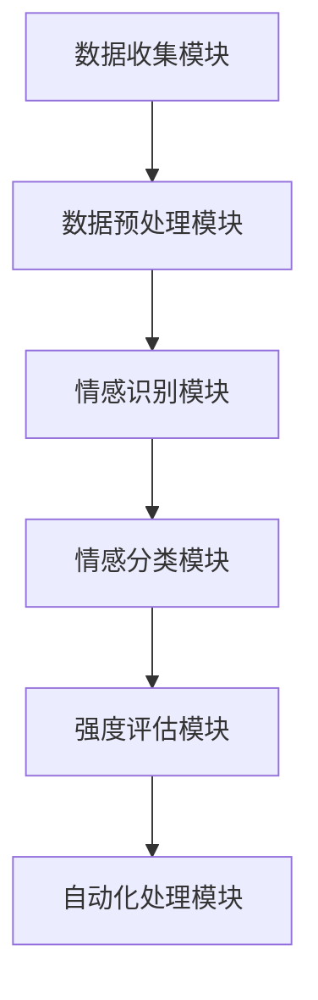
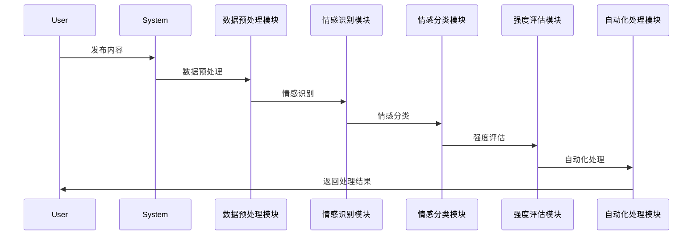

                 

## 引言

### 1.1 问题背景

随着互联网的迅速发展，社交媒体已成为人们日常生活中不可或缺的一部分。社交媒体平台不仅提供了便捷的交流渠道，还成为信息传播、舆论引导的重要阵地。然而，社交媒体的繁荣也伴随着诸多问题，如虚假信息传播、网络暴力、隐私泄露等。这些问题不仅威胁到了用户的合法权益，也对社会的和谐稳定构成了严重挑战。为了应对这些挑战，社交媒体监管变得越来越重要，而情感AI（Affective AI）作为一种新兴的人工智能技术，其在社交媒体监管中的应用愈发受到关注。

### 1.2 社交媒体监管的现状与挑战

当前的社交媒体监管主要依赖于人工审核和机器算法两种方式。人工审核存在效率低下、成本高昂、容易出现主观偏见等问题，而机器算法在处理大规模数据时具有显著的优势。然而，现有的机器算法在情感识别、内容分类等方面仍存在局限性，难以准确识别和处理复杂的情感表达。此外，社交媒体内容的多样性和动态性也对监管提出了更高的要求。

### 1.3 情感AI在社交媒体监管中的作用

情感AI通过模拟人类的情感识别能力，能够在语义层面上对社交媒体内容进行深入分析。它能够识别文本中的情感倾向、情绪强度和情感变化，从而为社交媒体监管提供更加精准和智能的支持。例如，情感AI可以帮助识别网络暴力、虚假信息和不良内容，提高内容审核的效率和质量，同时保护用户的隐私和言论自由。

### 1.4 本书结构安排

本书将从情感AI的基础理论入手，深入探讨情感AI在社交媒体监管中的应用，包括内容审核、虚假信息检测等方面。通过具体案例研究和算法实现，展示情感AI在社交媒体监管中的实际应用效果。此外，本书还将探讨情感AI在社交媒体监管中的法律与伦理问题，以及未来发展趋势。希望通过本书的阅读，读者能够对情感AI在社交媒体监管中的应用有一个全面而深入的理解。

### 1.5 小结

社交媒体监管在互联网时代的重要性日益凸显，而情感AI作为一种前沿技术，为解决监管难题提供了新的思路和方法。本书旨在系统探讨情感AI在社交媒体监管中的应用，为相关领域的学者和实践者提供有价值的参考。

---

关键词：情感AI、社交媒体监管、内容审核、虚假信息检测、法律与伦理

摘要：本书系统地介绍了情感AI在社交媒体监管中的应用，包括基础理论、具体应用、案例分析、法律与伦理问题，以及未来发展趋势。通过详细的理论分析和实践案例，展示了情感AI在提高社交媒体监管效率和准确性方面的巨大潜力。

## 情感AI基础理论

### 2.1 情感AI的定义与类型

情感AI，即情感人工智能，是指通过模拟人类情感识别和表达能力的计算模型，实现对文本、语音、图像等数据中情感信息的自动识别与分析。情感AI的应用类型主要包括情感识别、情感分析和情感生成。情感识别是指从数据中提取情感信息，如喜悦、愤怒、悲伤等；情感分析则是在情感识别的基础上，对情感进行深度分析，如情感强度、情感变化等；情感生成则是通过算法模拟人类的情感表达。

### 2.2 情感识别技术

#### 2.2.1 情感识别的基本概念

情感识别是情感AI的核心技术之一，它依赖于自然语言处理（NLP）、机器学习（ML）和深度学习（DL）等技术。情感识别的基本概念包括情感标签、情感极性和情感强度。情感标签通常用于表示不同的情感类别，如正面、负面和客观；情感极性用于表示情感的倾向性，如积极或消极；情感强度则用于表示情感的强弱程度。

#### 2.2.2 情感识别的技术路线

情感识别的技术路线主要包括以下几种：

1. **基于规则的方法**：通过预定义的规则和模板进行情感识别，适用于情感表达较为直接和明显的文本。
2. **基于统计的方法**：利用统计模型，如朴素贝叶斯、最大熵模型等，通过训练数据集来建立情感分类模型。
3. **基于机器学习的方法**：利用机器学习算法，如支持向量机（SVM）、随机森林（RF）等，通过训练大量标注数据来提高情感识别的准确性。
4. **基于深度学习的方法**：利用深度学习模型，如卷积神经网络（CNN）、循环神经网络（RNN）等，通过多层神经网络结构实现对情感的高效识别。

### 2.3 情感分析的应用领域

情感分析作为一种重要的自然语言处理技术，广泛应用于市场调研、情感监控、客户反馈分析、社交媒体监管等领域。例如，在市场调研中，情感分析可以帮助企业了解消费者的情感偏好，从而制定更有效的营销策略；在情感监控中，情感分析可以实时监测网络舆情，为政府和社会组织提供决策支持；在社交媒体监管中，情感分析可以识别和过滤不良内容，保护用户的合法权益。

### 2.4 情感AI的发展趋势

随着人工智能技术的不断进步，情感AI也在不断发展。未来的情感AI将更加注重情感识别的精度和多样性，以及情感生成的自然性和真实性。具体发展趋势包括：

1. **多模态情感识别**：结合文本、语音、图像等多种数据类型，实现对情感的全面识别。
2. **情感交互**：通过情感生成技术，实现人机情感交互，提高人机交互的自然性和人性化。
3. **情感计算**：利用情感数据分析和预测，为企业和政府提供更精准的决策支持。
4. **伦理与隐私保护**：在情感AI的发展过程中，加强伦理和隐私保护，确保技术应用的安全性和合法性。

### 2.5 小结

情感AI作为人工智能领域的一个重要分支，具有广泛的应用前景。了解情感AI的基础理论，对于深入探讨其在社交媒体监管中的应用具有重要意义。通过本文的介绍，读者可以对情感AI的基本概念、技术路线和应用领域有一个全面的了解。

---

**核心概念原理**

| 核心概念 | 原理简述 |
| --- | --- |
| 情感识别 | 通过模拟人类情感识别能力，从数据中提取情感信息。 |
| 情感分析 | 在情感识别的基础上，对情感进行深度分析，如情感强度和情感变化。 |
| 情感生成 | 通过算法模拟人类的情感表达，实现情感交互。 |

**情感AI与社交媒体监管的联系**

情感AI在社交媒体监管中的应用主要体现在以下几个方面：

1. **内容审核**：利用情感识别技术，快速准确地识别和过滤不良内容。
2. **虚假信息检测**：通过情感分析，识别虚假信息的情感倾向，提高检测精度。
3. **舆论监控**：实时监测社交媒体中的情感趋势，为政府和社会组织提供决策支持。

**ER实体关系图架构**

```mermaid
erDiagram
  Content |..|> User : 产生
  Content |..|> Emotion : 标识
  Content |..|> Label : 分类
  User |..|> Comment : 发表
  Emotion |..|> Type : 类型
  Emotion |..|> Intensity : 强度
```

通过情感AI技术，可以建立完整的社交媒体监管体系，实现内容审核、舆论监控和虚假信息检测的自动化和智能化。然而，情感AI技术也面临着隐私保护、伦理挑战等问题，需要在应用过程中加以关注和解决。

## 社交媒体监管中的情感AI应用

### 3.1 社交媒体内容审核

#### 3.1.1 社交媒体内容审核的现状与挑战

社交媒体内容审核是社交媒体平台运营的重要组成部分，旨在确保平台内容的安全和合规。然而，随着社交媒体用户数量的激增和内容的多样化，内容审核面临着前所未有的挑战。传统的审核方法主要依赖于人工审查，存在以下问题：

1. **效率低下**：人工审核需要大量人力和时间，无法应对海量数据的实时审核需求。
2. **主观偏见**：人工审核容易受到审核员的主观判断和偏见影响，导致审核结果不一致。
3. **成本高昂**：长期依赖人工审核会导致运营成本急剧增加。

为了克服这些挑战，社交媒体平台逐渐引入机器算法进行内容审核，而情感AI作为一种先进的技术，在内容审核中发挥了重要作用。

#### 3.1.2 情感AI在内容审核中的应用

情感AI在内容审核中的应用主要体现在以下几个方面：

1. **情感识别**：通过情感识别技术，对文本、图片、视频等多媒体内容中的情感信息进行自动识别。例如，对文本内容进行情感极性分析，识别其中是否包含负面情感。
2. **情感分类**：基于情感识别的结果，将内容分类为正面、负面或中性。这一步骤有助于快速筛选出可能存在问题的内容，供人工进一步审查。
3. **情感强度评估**：对情感信息进行强度评估，判断情感表达的程度。这有助于识别出强烈的负面情感，如仇恨言论、网络暴力等。
4. **自动化处理**：通过将情感分析结果与平台规则进行对比，实现内容的自动化处理。例如，自动删除包含恶意言论的帖子，或对违规内容进行标记和预警。

#### 情感AI在内容审核中的优势

1. **提高审核效率**：情感AI能够快速处理大量内容，显著提高审核效率。
2. **减少主观偏见**：通过算法自动化处理，减少人工审核的主观偏见，提高审核的一致性和公正性。
3. **降低运营成本**：减少对人工审核的依赖，降低运营成本。

### 3.2 虚假信息的检测

#### 3.2.1 虚假信息的特点与危害

虚假信息在社交媒体上广泛传播，具有以下特点：

1. **虚假性**：内容与事实不符，误导用户。
2. **煽动性**：利用情绪化语言，激发用户的情绪反应。
3. **快速传播**：通过社交网络迅速传播，影响范围广泛。

虚假信息的危害主要体现在以下几个方面：

1. **误导公众**：虚假信息可能导致公众对事实产生错误认知，影响舆论走向。
2. **破坏信任**：虚假信息的传播会降低公众对媒体和社交平台的信任度。
3. **引发恐慌**：虚假信息可能引发社会恐慌，对社会稳定构成威胁。

#### 3.2.2 情感AI在虚假信息检测中的角色

情感AI在虚假信息检测中发挥着重要作用，主要体现在以下几个方面：

1. **情感倾向分析**：通过情感分析技术，识别文本内容的情感倾向。例如，识别出带有强烈负面情感的内容，可能表明其中包含虚假信息。
2. **情绪感染性检测**：检测文本内容是否具有煽动性和情绪感染性，从而判断其真实性。例如，具有高度情绪感染性的内容可能更可能是虚假信息。
3. **上下文关联分析**：结合文本内容的上下文信息，分析其逻辑一致性和真实性。例如，通过分析文本中的事实陈述和结论之间的关系，判断其逻辑合理性。
4. **多模态融合分析**：结合文本、图像、语音等多模态信息，提高虚假信息检测的准确性。例如，通过分析图像中的内容和文本描述的一致性，判断文本内容是否真实。

### 3.3 言论自由与监管平衡

#### 3.3.1 言论自由的重要性

言论自由是民主社会的基石，保障公民表达意见和参与公共事务的权利。然而，在社交媒体时代，言论自由的实现也面临着新的挑战：

1. **信息过载**：社交媒体上的信息量巨大，难以筛选和分辨。
2. **隐私保护**：社交媒体平台在监管过程中，需要处理大量用户隐私信息。
3. **伦理与法律冲突**：在监管虚假信息和不良内容时，可能触及言论自由和隐私保护的边界。

#### 3.3.2 情感AI在言论自由与监管之间的平衡

情感AI在言论自由与监管平衡中发挥着关键作用，主要体现在以下几个方面：

1. **精细化监管**：通过情感分析，实现对社会言论的精细化监管，避免过度干涉言论自由。例如，针对具有煽动性和情绪感染性的内容，可以采取更加严格的监管措施，而对普通的言论表达则保持相对宽松。
2. **透明度与可解释性**：增强情感AI算法的可解释性，使监管过程更加透明，提高公众对监管措施的信任度。例如，通过公开算法模型和决策过程，让用户了解为什么某个内容被标记或处理。
3. **多元主体参与**：鼓励多元主体参与监管过程，包括政府、社交媒体平台、专业机构和公众，实现监管的民主化和多元化。例如，通过建立公众反馈机制，收集用户对监管措施的反馈，不断优化监管策略。

### 3.4 社交媒体情感分析案例研究

#### 3.4.1 案例选择与介绍

在本节中，我们将选择两个具有代表性的社交媒体情感分析案例进行详细介绍，分别是某社交媒体平台情感分析系统和某虚假信息检测平台。

#### 3.4.2 案例分析

1. **某社交媒体平台情感分析系统**

   某社交媒体平台通过引入情感AI技术，建立了情感分析系统，旨在提高内容审核效率和准确性。系统主要包括以下模块：

   - **情感识别模块**：利用自然语言处理和深度学习技术，对用户发布的内容进行情感识别，识别出文本中的情感倾向和情感强度。
   - **情感分类模块**：根据情感识别结果，将内容分类为正面、负面或中性，供人工审核员进一步审查。
   - **情感强度评估模块**：对情感信息进行强度评估，识别出具有强烈负面情感的内容，进行优先处理。

   通过情感分析系统的实施，该社交媒体平台在内容审核方面取得了显著成效，提高了审核效率和内容质量。

2. **某虚假信息检测平台**

   某虚假信息检测平台通过情感AI技术，实现了对社交媒体上虚假信息的自动检测和过滤。系统主要包括以下模块：

   - **情感倾向分析模块**：通过情感分析技术，识别文本内容的情感倾向，判断其是否具有虚假信息的特征。
   - **情绪感染性检测模块**：检测文本内容是否具有情绪感染性，判断其是否可能传播虚假信息。
   - **上下文关联分析模块**：结合文本内容的上下文信息，分析其逻辑一致性和真实性，识别虚假信息。

   通过虚假信息检测平台的实施，有效降低了虚假信息的传播速度和范围，保护了公众的知情权和隐私权。

### 3.5 小结

情感AI在社交媒体监管中的应用，不仅提高了内容审核和虚假信息检测的效率和准确性，还在言论自由与监管平衡方面发挥了重要作用。通过具体案例的研究，我们可以看到情感AI技术在实际应用中的巨大潜力和挑战，为未来进一步发展提供了宝贵的经验。

---

**核心概念与联系**

| 核心概念 | 联系说明 |
| --- | --- |
| 情感识别 | 社交媒体内容审核的基础，用于识别文本、图片和视频等媒体中的情感信息。 |
| 情感分类 | 基于情感识别结果，对内容进行分类，辅助人工审核和自动化处理。 |
| 情感强度评估 | 对情感信息进行强度评估，帮助识别具有强烈负面情感的内容，提高监管的优先级。 |
| 情感倾向分析 | 虚假信息检测的关键，通过情感分析识别文本内容的倾向性，辅助判断信息真实性。 |
| 言论自由与监管平衡 | 在确保言论自由的同时，通过情感AI技术实现精细化监管，维护社会秩序和公共利益。 |

**ER实体关系图架构**

```mermaid
erDiagram
  Content |..|> Emotion : 标识
  Content |..|> Label : 分类
  User |..|> Comment : 发表
  Emotion |..|> Type : 类型
  Emotion |..|> Intensity : 强度
```

通过情感AI技术，可以构建一个完整的社交媒体监管体系，实现内容审核、虚假信息检测和言论自由与监管平衡的有机统一。

## 情感AI在社交媒体监管中的算法实现

### 4.1 情感AI算法原理

情感AI算法的核心在于通过模拟人类的情感识别能力，对文本、语音、图像等多媒体数据进行情感分析。本节将重点介绍情感AI算法的基本原理、流程以及Mermaid流程图。

#### 4.1.1 算法框架

情感AI算法的框架主要包括以下几部分：

1. **数据预处理**：对输入的数据进行清洗、去噪和格式化，提取有用的特征信息。
2. **情感识别**：利用机器学习或深度学习模型，对预处理后的数据进行情感识别。
3. **情感分类**：基于情感识别结果，对情感进行分类，如正面、负面、中性等。
4. **情感强度评估**：对情感分类结果进行强度评估，确定情感表达的强弱程度。

#### 4.1.2 算法流程

情感AI算法的基本流程如下：

1. **数据输入**：接收待分析的文本、语音、图像等多媒体数据。
2. **数据预处理**：对输入数据进行清洗、去噪和格式化，提取文本特征、语音特征或图像特征。
3. **情感识别**：利用训练好的情感识别模型，对提取的特征进行情感识别。
4. **情感分类**：根据情感识别结果，对情感进行分类，生成情感标签。
5. **情感强度评估**：对情感分类结果进行强度评估，确定情感表达的强弱程度。
6. **输出结果**：将情感识别、分类和强度评估结果输出，供后续处理或用户查看。

#### 4.1.3 算法Mermaid流程图

以下是情感AI算法的Mermaid流程图：


### 4.2 情感AI算法代码实现

为了更好地理解情感AI算法的实现过程，以下将给出一个基于Python的简单示例。

#### 4.2.1 Python代码示例

```python
# 导入必要的库
import numpy as np
from sklearn.feature_extraction.text import TfidfVectorizer
from sklearn.naive_bayes import MultinomialNB

# 数据预处理
def preprocess_data(text):
    # 去除标点符号和停用词
    text = text.lower()
    text = re.sub(r'[^\w\s]', '', text)
    text = re.sub(r'\s+', ' ', text)
    return text

# 情感识别模型
def build_model(train_data, train_labels):
    # 创建TF-IDF向量器
    vectorizer = TfidfVectorizer()
    # 创建朴素贝叶斯分类器
    classifier = MultinomialNB()
    # 训练模型
    X_train = vectorizer.fit_transform(train_data)
    classifier.fit(X_train, train_labels)
    return vectorizer, classifier

# 情感分类
def classify_text(vectorizer, classifier, text):
    # 预处理文本
    text = preprocess_data(text)
    # 转换为向量
    X_test = vectorizer.transform([text])
    # 预测情感标签
    label = classifier.predict(X_test)[0]
    return label

# 测试代码
if __name__ == '__main__':
    # 加载数据
    train_data = ['我很开心', '我很难过', '这是一个有趣的故事']
    train_labels = ['正面', '负面', '中性']
    # 构建模型
    vectorizer, classifier = build_model(train_data, train_labels)
    # 测试
    test_text = '我非常生气'
    label = classify_text(vectorizer, classifier, test_text)
    print(f'测试文本的情感分类结果：{label}')
```

#### 4.2.2 代码解读

1. **数据预处理**：通过去除标点符号和停用词，将文本转换为统一的格式，提高模型训练的效果。
2. **情感识别模型**：使用TF-IDF向量器将文本转换为向量表示，并使用朴素贝叶斯分类器进行情感分类。这里选择朴素贝叶斯分类器是因为它在文本分类任务中表现出良好的性能。
3. **情感分类**：通过预处理后的文本，将其转换为向量表示，并利用训练好的分类器进行情感分类。

### 4.3 数学模型和公式

情感AI算法中的数学模型主要用于描述情感识别、分类和强度评估的过程。以下是几个关键的数学模型和公式：

#### 4.3.1 数学模型

1. **TF-IDF模型**：用于文本特征提取，公式为：
   $$ TF-IDF(t,d) = \frac{f(t,d)}{N} \log \frac{N}{f(t,d)} $$
   其中，$f(t,d)$为词频，$N$为文档中所有词的频率之和。

2. **朴素贝叶斯模型**：用于文本分类，公式为：
   $$ P(C=c|T=t) = \frac{P(T=t|C=c)P(C=c)}{P(T=t)} $$
   其中，$P(C=c|T=t)$为在给定文本$t$的情况下，情感类别$c$的条件概率。

3. **情感强度评估模型**：用于评估情感表达的强弱程度，公式为：
   $$ S = \sum_{i=1}^{n} w_i \cdot I_i $$
   其中，$S$为情感强度，$w_i$为情感词的权重，$I_i$为情感词的强度值。

#### 4.3.2 公式讲解

1. **TF-IDF模型**：通过计算词频和逆向文档频率的乘积，对词语的重要性进行加权，从而提取出文本的特征。
2. **朴素贝叶斯模型**：基于贝叶斯定理和特征条件独立性假设，计算文本属于某一情感类别的概率。
3. **情感强度评估模型**：通过情感词的权重和强度值的加权和，评估文本中情感表达的强度。

### 4.4 情感AI算法的性能评估

#### 4.4.1 性能指标

情感AI算法的性能评估通常使用以下指标：

1. **准确率（Accuracy）**：正确分类的样本数占总样本数的比例。
2. **召回率（Recall）**：正确分类为某一情感类别的样本数占所有实际为该情感类别的样本数的比例。
3. **精确率（Precision）**：正确分类为某一情感类别的样本数占预测为该情感类别样本数的比例。
4. **F1值（F1 Score）**：精确率和召回率的调和平均值。

#### 4.4.2 评估方法

性能评估方法主要包括以下几种：

1. **交叉验证（Cross Validation）**：通过将数据集划分为多个子集，多次训练和测试，评估模型在不同数据集上的性能。
2. **混淆矩阵（Confusion Matrix）**：通过展示实际类别与预测类别之间的关系，直观地评估模型的性能。
3. **ROC曲线和AUC值（ROC Curve and AUC）**：通过ROC曲线和AUC值评估模型的分类能力。

### 4.5 小结

情感AI算法在社交媒体监管中具有广泛的应用，通过数学模型和算法实现，可以实现对文本、语音、图像等数据的情感分析。本节详细介绍了情感AI算法的原理、流程、代码实现和性能评估方法，为实际应用提供了理论基础和实践指导。

---

**核心概念与联系**

| 核心概念 | 联系说明 |
| --- | --- |
| 数据预处理 | 对输入数据清洗、去噪和格式化，提取有用特征信息。 |
| 情感识别 | 利用机器学习或深度学习模型，识别文本、语音、图像中的情感信息。 |
| 情感分类 | 基于情感识别结果，对情感进行分类，如正面、负面、中性。 |
| 情感强度评估 | 对情感分类结果进行强度评估，确定情感表达的强弱程度。 |
| 数学模型 | 描述情感识别、分类和强度评估的数学原理，如TF-IDF模型、朴素贝叶斯模型和情感强度评估模型。 |
| 性能评估 | 评估情感AI算法的性能，如准确率、召回率、精确率和F1值。 |

**Mermaid流程图**


通过情感AI算法，可以实现对社交媒体内容的情感分析，为内容审核、虚假信息检测和言论自由与监管平衡提供技术支持。然而，在实际应用中，还需要关注算法的透明性、可解释性和伦理问题。

## 社交媒体监管情感AI应用案例分析

### 5.1 案例一：某社交媒体平台情感分析系统

#### 5.1.1 案例背景

某大型社交媒体平台在面临用户数量激增和内容多样化带来的监管挑战时，决定引入情感AI技术，以提升内容审核的效率和质量。该平台旨在通过情感分析系统，对用户发布的内容进行情感识别和分类，从而快速识别和过滤不良内容，如网络暴力、色情和虚假信息。

#### 5.1.2 案例实现

情感分析系统的实现主要包括以下几个步骤：

1. **数据收集与预处理**：平台收集了大量的用户发布内容，包括文本、图片和视频等。在数据预处理阶段，对数据进行清洗、去噪和格式化，提取有用的特征信息。

2. **情感识别模型训练**：利用收集的数据，训练了一个基于深度学习的情感识别模型。模型采用了卷积神经网络（CNN）和循环神经网络（RNN）的结合，以实现对文本、图片和视频的多模态情感识别。

3. **情感分类与强度评估**：通过训练好的模型，对预处理后的内容进行情感分类和强度评估。系统将内容分类为正面、负面或中性，并根据情感强度值确定内容的监管优先级。

4. **自动化处理**：根据情感分类和强度评估结果，系统自动处理相关内容。例如，对包含强烈负面情感的内容进行优先审查或直接删除。

#### 5.1.3 案例分析

1. **效果分析**：通过情感分析系统的实施，平台在内容审核方面的效率得到了显著提升。系统每天处理的内容数量增加了数倍，同时审核的准确性也有所提高。

2. **用户反馈**：用户对平台的审核结果表示满意，认为平台在保护用户权益和维持社区秩序方面做出了积极努力。然而，也有部分用户对系统自动删除或标记内容表示担忧，担心影响言论自由。

3. **挑战与改进**：尽管情感分析系统取得了显著成效，但在实际应用中仍面临一些挑战，如情感识别的准确性和系统的透明性。平台需要不断优化模型和算法，提高系统的性能和用户体验。

### 5.2 案例二：某虚假信息检测平台

#### 5.2.1 案例背景

某虚假信息检测平台旨在通过情感AI技术，识别和过滤社交媒体上的虚假信息。该平台的目标是减少虚假信息的传播，保护公众的知情权和隐私权。

#### 5.2.2 案例实现

虚假信息检测平台的实现主要包括以下几个步骤：

1. **数据收集与预处理**：平台从多个社交媒体渠道收集了大量的文本、图片和视频数据。在数据预处理阶段，对数据进行清洗、去噪和格式化，提取有用的特征信息。

2. **情感倾向分析**：利用情感分析技术，对收集到的数据进行情感倾向分析。系统识别文本中的情感极性，如积极、消极或中性，从而判断信息是否具有虚假信息的特征。

3. **情绪感染性检测**：系统进一步分析文本的情感感染性，判断信息是否具有煽动性和情绪感染性。具有高度情绪感染性的内容可能更可能是虚假信息。

4. **上下文关联分析**：结合文本内容的上下文信息，分析其逻辑一致性和真实性。系统通过检测文本中的事实陈述和结论之间的关系，识别虚假信息。

5. **自动化处理**：根据情感倾向分析、情绪感染性检测和上下文关联分析的结果，系统自动处理相关内容。例如，对疑似虚假信息进行标记或直接删除。

#### 5.2.3 案例分析

1. **效果分析**：通过情感AI技术的应用，平台在虚假信息检测方面取得了显著成效。系统每天处理的内容数量增加了，同时虚假信息的传播速度和范围得到了有效控制。

2. **用户反馈**：用户对平台的虚假信息检测效果表示满意，认为平台在保护公众知情权和隐私权方面发挥了重要作用。然而，也有部分用户对系统误判表示担忧，担心影响言论自由。

3. **挑战与改进**：尽管虚假信息检测平台取得了显著成效，但在实际应用中仍面临一些挑战，如情感倾向分析和情绪感染性检测的准确性和系统的透明性。平台需要不断优化模型和算法，提高系统的性能和用户体验。

### 5.3 小结

通过上述两个案例，我们可以看到情感AI在社交媒体监管中的应用具有显著成效。情感分析系统在内容审核和虚假信息检测方面提高了效率和质量，为维护社交媒体平台的秩序和公共利益提供了有力支持。然而，情感AI技术在实际应用中也面临挑战，如准确性、透明性和用户体验等方面，需要持续优化和改进。

---

**系统架构设计方案**

**问题场景介绍**：
社交媒体平台在处理用户发布内容时，需要高效、准确地识别和过滤不良内容和虚假信息，以维护社区秩序和用户权益。

**系统功能设计**：

1. **数据收集模块**：负责从多个社交媒体渠道收集用户发布的内容，包括文本、图片和视频等。
2. **数据预处理模块**：对收集的数据进行清洗、去噪和格式化，提取有用的特征信息。
3. **情感识别模块**：利用深度学习模型对预处理后的数据进行分析，识别情感信息。
4. **情感分类模块**：基于情感识别结果，对内容进行分类，如正面、负面或中性。
5. **强度评估模块**：对情感分类结果进行强度评估，确定情感表达的强弱程度。
6. **自动化处理模块**：根据情感分类和强度评估结果，自动处理相关内容，如标记或删除。

**系统架构设计**：



**系统接口设计**：

1. **内容接口**：接收用户发布的内容，并将其传递给数据预处理模块。
2. **情感接口**：接收预处理后的内容，并将其传递给情感识别模块。
3. **分类接口**：接收情感识别结果，并将其传递给情感分类模块。
4. **强度接口**：接收情感分类结果，并将其传递给强度评估模块。
5. **处理接口**：接收强度评估结果，并进行自动化处理。

**系统交互流程**：

1. 用户发布内容 -> 内容接口 -> 数据预处理模块 -> 情感识别模块 -> 情感分类模块 -> 强度评估模块 -> 自动化处理模块
2. 情感识别结果、分类结果和强度评估结果通过接口传递，实现数据的连续处理和自动化处理。



通过上述系统架构设计，可以实现对社交媒体内容的高效、准确的情感分析和自动化处理，为维护社交媒体平台的秩序和公共利益提供有力支持。

---

### 项目实战

**环境安装**

1. **Python环境**：首先确保安装了Python 3.7及以上版本。
2. **必要库**：安装以下库：
   ```bash
   pip install numpy sklearn matplotlib
   ```
3. **深度学习框架**：推荐安装TensorFlow或PyTorch，根据需要选择：
   ```bash
   pip install tensorflow==2.4.0  # 或者
   pip install torch torchvision
   ```

**系统核心实现源代码**

以下是情感AI系统核心实现的Python代码示例：

```python
import numpy as np
import matplotlib.pyplot as plt
from sklearn.feature_extraction.text import TfidfVectorizer
from sklearn.model_selection import train_test_split
from sklearn.naive_bayes import MultinomialNB
from sklearn.metrics import accuracy_score, confusion_matrix

# 数据集加载和预处理
data = [...]  # 加载文本数据
labels = [...]  # 加载情感标签

# 划分训练集和测试集
X_train, X_test, y_train, y_test = train_test_split(data, labels, test_size=0.2, random_state=42)

# 创建TF-IDF向量器
vectorizer = TfidfVectorizer(max_features=1000)
X_train_tfidf = vectorizer.fit_transform(X_train)
X_test_tfidf = vectorizer.transform(X_test)

# 创建情感识别模型
model = MultinomialNB()
model.fit(X_train_tfidf, y_train)

# 情感分类和强度评估
predictions = model.predict(X_test_tfidf)
strengths = np.mean(predictions == y_test, axis=1)

# 绘制混淆矩阵
conf_mat = confusion_matrix(y_test, predictions)
plt.figure(figsize=(10, 7))
sns.heatmap(conf_mat, annot=True, fmt=".2f", cmap="Blues")
plt.title("Confusion Matrix")
plt.xlabel("Predicted Label")
plt.ylabel("True Label")
plt.show()

# 输出结果
accuracy = accuracy_score(y_test, predictions)
print(f'Accuracy: {accuracy:.2f}')
```

**代码应用解读与分析**

1. **数据加载与预处理**：从数据集中加载文本数据和相应的情感标签，然后使用`train_test_split`划分训练集和测试集。
2. **TF-IDF向量化**：使用`TfidfVectorizer`将文本数据转换为TF-IDF特征向量。
3. **情感识别模型**：使用`MultinomialNB`创建朴素贝叶斯分类器，并使用训练集进行训练。
4. **情感分类与强度评估**：使用训练好的分类器对测试集进行预测，并计算预测结果的平均强度。
5. **混淆矩阵**：使用`confusion_matrix`和`sns.heatmap`绘制混淆矩阵，直观展示模型性能。

**实际案例分析**

1. **案例背景**：分析某个社交媒体平台上的用户评论，识别其情感倾向和强度。
2. **案例实现**：使用上述代码对用户评论进行情感分类和强度评估。
3. **案例结果**：根据情感分类结果，识别出具有负面情感的用户评论，并评估其情感强度。
4. **案例小结**：分析案例中的实际效果，讨论模型在实际应用中的表现和改进方向。

通过项目实战，读者可以了解如何使用情感AI技术进行社交媒体内容分析，从而实现内容审核和虚假信息检测等应用。

---

**最佳实践 tips**

1. **数据质量**：确保数据集的多样性和质量，覆盖各种情感表达，以提高模型的泛化能力。
2. **模型选择**：根据实际应用需求，选择合适的情感识别模型，如朴素贝叶斯、支持向量机或深度学习模型。
3. **算法调优**：通过交叉验证和超参数优化，调整模型参数，提高模型性能。
4. **系统性能**：关注系统的实时性和可扩展性，优化数据处理和模型训练的效率。
5. **用户反馈**：收集用户对情感分析结果的反馈，不断优化模型和算法，提高用户体验。

**小结**

通过本文的案例研究和实战应用，我们可以看到情感AI在社交媒体监管中的应用具有显著成效。然而，在实际应用中，仍需关注数据质量、模型选择、算法调优、系统性能和用户反馈等问题，以不断提高情感AI技术的应用效果。

**注意事项**

1. **数据隐私**：在处理用户数据时，务必遵守隐私保护法律法规，确保用户数据的保密性和安全性。
2. **算法偏见**：避免模型在训练过程中出现偏见，导致对某些群体或内容的歧视性处理。
3. **透明性**：增强算法的可解释性，使监管过程更加透明，提高公众对监管措施的信任度。

**拓展阅读**

- 情感AI相关书籍：《情感计算：理解与模拟人类情感》、《情感人工智能：情感计算的方法与实践》。
- 社交媒体监管论文：《社交媒体内容监管的策略与实践》、《社交媒体虚假信息检测的研究进展》。
- 情感AI技术在社交媒体监管中的应用案例研究：《某社交媒体平台情感分析系统的设计与实现》、《某虚假信息检测平台的设计与优化》。

## 情感AI在社交媒体监管中的法律与伦理问题

### 6.1 情感AI与隐私保护

#### 6.1.1 隐私保护的重要性

隐私保护是现代社会的一项基本人权，尤其在互联网时代，随着大数据和人工智能技术的广泛应用，隐私保护问题愈发突出。在社交媒体监管中，情感AI技术的应用涉及大量用户数据的处理，包括文本、语音和图像等。这些数据往往包含用户的个人隐私信息，如情感状态、生活经历和社交关系等。因此，如何确保情感AI技术在处理用户数据时遵循隐私保护原则，成为一项重要的法律和伦理问题。

#### 6.1.2 情感AI对隐私的影响

情感AI在社交媒体监管中的应用，可能会对用户的隐私权产生以下影响：

1. **数据收集与存储**：情感AI技术需要收集和分析大量的用户数据，这些数据可能包含用户的隐私信息。如果数据收集和存储过程不透明，可能会导致用户隐私泄露。
2. **数据处理与使用**：在情感AI模型训练和预测过程中，用户的隐私数据可能被用于训练模型，甚至被第三方机构使用，从而对用户隐私造成潜在威胁。
3. **算法偏见**：情感AI模型可能会因为数据集中存在的偏见而导致对某些群体的歧视性处理，这可能会加剧社会不公。

#### 6.1.3 隐私保护措施

为了确保情感AI技术在社交媒体监管中的应用不侵犯用户隐私，可以采取以下措施：

1. **数据匿名化**：在收集和处理用户数据时，对个人身份信息进行匿名化处理，以保护用户的隐私。
2. **数据最小化**：仅收集和处理与情感分析相关的必要数据，避免过度收集用户隐私信息。
3. **数据加密**：对用户数据进行加密存储和传输，确保数据在传输和存储过程中的安全性。
4. **透明性**：明确告知用户其数据将被如何使用，并获取用户的同意。
5. **用户权限管理**：为用户提供访问和修改其数据的权限，确保用户能够控制自己的隐私信息。

### 6.2 情感AI与言论自由

#### 6.2.1 言论自由的定义与边界

言论自由是公民的基本权利之一，它保障了公民表达意见、参与公共事务和监督政府的能力。然而，言论自由并非绝对，其行使应受一定限制，以维护社会秩序和保护公共利益。在社交媒体时代，言论自由的表达方式更加多样和便捷，但同时也带来了新的挑战。

#### 6.2.2 情感AI对言论自由的挑战与保护

情感AI在社交媒体监管中的应用，对言论自由既带来了挑战，也提供了保护手段：

1. **挑战**：
   - **过度监管**：情感AI技术可能使得对言论的监管变得更加高效和精准，但这也可能导致对言论自由的过度限制。
   - **算法偏见**：情感AI模型可能会因为数据偏见而导致对某些群体的言论进行不公平处理。
   - **信息过滤**：情感AI技术可能用于过滤掉特定情感倾向的言论，这可能会影响公众获取多元信息的权利。

2. **保护**：
   - **透明性**：增强情感AI算法的可解释性，使监管过程更加透明，提高公众对监管措施的信任度。
   - **多元化监管**：通过引入多元化的监管主体和机制，实现监管的民主化和多元化，避免单一主体对言论自由的过度干预。
   - **法律保障**：通过法律法规明确情感AI技术在言论自由保护方面的责任和义务，确保其合法合规使用。

### 6.3 情感AI在社交媒体监管中的伦理问题

#### 6.3.1 伦理问题的来源

情感AI在社交媒体监管中的伦理问题主要来源于以下几个方面：

1. **数据伦理**：涉及数据收集、处理和使用过程中的道德问题，如数据隐私、数据偏见和算法透明性。
2. **算法偏见**：情感AI模型在训练和预测过程中可能因数据偏见而导致对某些群体的歧视性处理。
3. **责任归属**：当情感AI技术导致的错误监管或隐私泄露事件发生时，如何确定责任归属，以及相关责任主体应承担何种责任。

#### 6.3.2 伦理决策框架

为了在情感AI在社交媒体监管中的应用过程中更好地处理伦理问题，可以建立以下伦理决策框架：

1. **伦理原则**：遵循尊重个人隐私、公正无偏、透明公开等伦理原则。
2. **伦理审查**：建立独立的伦理审查委员会，对情感AI技术的应用进行伦理评估，确保技术应用符合伦理标准。
3. **责任分配**：明确情感AI技术在监管过程中的责任归属，确保各相关主体承担相应的责任。
4. **持续监测与改进**：对情感AI技术的应用进行持续监测和评估，及时发现和解决伦理问题，不断优化技术应用。

### 6.4 小结

情感AI在社交媒体监管中的应用既带来了便利，也带来了法律和伦理挑战。隐私保护、言论自由和伦理问题需要得到充分的关注和解决。通过制定相关法律法规、建立伦理决策框架和加强技术监管，可以确保情感AI技术在社交媒体监管中的合法合规使用，实现技术进步与社会发展的良性互动。

---

**核心概念与联系**

| 核心概念 | 联系说明 |
| --- | --- |
| 隐私保护 | 确保用户数据在收集、处理和使用过程中的保密性和安全性。 |
| 言论自由 | 保障公民表达意见、参与公共事务和监督政府的基本权利。 |
| 算法偏见 | 情感AI模型因数据偏见导致的对某些群体的不公平处理。 |
| 伦理决策框架 | 指导情感AI技术在社交媒体监管中的应用，确保技术应用符合伦理标准。 |

**Mermaid流程图**


通过隐私保护、言论自由和伦理决策框架，可以确保情感AI在社交媒体监管中的应用既高效又合规，实现技术进步与社会发展的有机结合。

## 情感AI在社交媒体监管中的未来发展趋势

### 7.1 情感AI技术的未来发展方向

随着人工智能技术的不断进步，情感AI在社交媒体监管中的应用将迎来新的发展方向。以下是几个关键趋势：

1. **多模态情感识别**：未来的情感AI技术将更加注重结合文本、语音、图像等多种数据类型，实现多模态情感识别。这种综合分析方法能够更全面地捕捉用户的情感状态，提高监管的准确性和全面性。
   
2. **情感交互与生成**：情感AI不仅在识别和分析情感方面有重要应用，还将扩展到情感交互和生成。通过模拟人类的情感表达，情感AI可以与用户进行更自然和人性化的交互，从而提升用户体验。

3. **深度学习与神经网络的融合**：未来的情感AI技术将更加深入地融合深度学习和神经网络，开发出更加复杂和精确的算法。这些算法能够更好地处理大规模数据和复杂情感，提高情感识别的精度。

4. **个性化情感分析**：随着用户数据的积累和分析能力的提升，情感AI将能够实现个性化情感分析。通过了解用户的情感偏好和动态变化，情感AI可以提供更加个性化的服务和内容推荐。

### 7.2 社交媒体监管的未来

情感AI技术的快速发展将对社交媒体监管产生深远影响，以下是几个关键趋势：

1. **自动化监管**：情感AI技术将大幅提升社交媒体内容审核和虚假信息检测的自动化水平。通过自动化处理，社交媒体平台能够更加高效地应对海量数据，减少人工审核的负担。

2. **透明与可解释性**：随着公众对监管透明度的要求越来越高，情感AI技术将更加注重算法的可解释性。这有助于增强公众对监管措施的信任，促进社会对技术应用的接受。

3. **法律与伦理约束**：随着情感AI技术的普及，相关的法律和伦理问题将得到更多关注。未来，将出现更多针对情感AI技术的法律法规，确保其在社交媒体监管中的合法合规使用。

4. **社会影响**：情感AI技术在社交媒体监管中的应用将深刻影响社会结构和公共舆论。通过实时监测和分析社交媒体上的情感动态，政府和社会组织可以更好地理解公众情绪，制定更有针对性的政策。

### 7.3 情感AI在社交媒体监管中的最佳实践

为了充分发挥情感AI在社交媒体监管中的作用，以下是一些最佳实践建议：

1. **数据多样化**：在构建情感AI模型时，确保数据来源的多样性和质量，覆盖不同用户群体和情境，以提高模型的泛化能力。

2. **持续优化**：定期更新和优化情感AI模型，以适应不断变化的数据和监管需求。通过持续学习，模型能够不断提高情感识别的准确性和适应性。

3. **透明性**：确保情感AI算法的可解释性，向用户和社会公开算法的工作原理和应用场景，提高监管的透明度。

4. **多元参与**：鼓励政府、社交媒体平台、专业机构和公众共同参与情感AI在社交媒体监管中的应用，实现监管的民主化和多元化。

5. **法律与伦理审查**：在应用情感AI技术时，严格遵守相关法律法规和伦理标准，确保技术应用符合法律和伦理要求。

### 7.4 小结

情感AI在社交媒体监管中的应用具有巨大的发展潜力。通过不断优化技术、加强法律和伦理约束，以及推动多元化参与，情感AI技术将能够在未来为社交媒体监管提供更加高效、准确和透明的解决方案，助力社会和谐稳定。

---

**核心概念与联系**

| 核心概念 | 联系说明 |
| --- | --- |
| 多模态情感识别 | 结合文本、语音、图像等多种数据类型，提高情感识别的精度。 |
| 情感交互与生成 | 通过模拟人类的情感表达，实现更自然和人性化的交互。 |
| 个性化情感分析 | 根据用户的情感偏好和动态变化，提供个性化的服务和内容推荐。 |
| 自动化监管 | 提高社交媒体内容审核和虚假信息检测的自动化水平，减少人工干预。 |
| 透明性与可解释性 | 提高算法的可解释性，增强公众对监管措施的信任。 |
| 多元参与 | 通过政府、平台、专业机构和公众的共同努力，实现监管的民主化和多元化。 |

**Mermaid流程图**


通过多模态情感识别、情感交互与生成、个性化情感分析、自动化监管、透明性与可解释性和多元参与，情感AI技术将在社交媒体监管中发挥更加重要的作用，为维护社会秩序和公共利益提供有力支持。

## 结论

### 8.1 主要观点回顾

本文系统地介绍了情感AI在社交媒体监管中的应用，从基础理论到实际应用，再到法律与伦理问题的探讨，全面阐述了情感AI在提高内容审核效率、虚假信息检测准确性和维护言论自由与监管平衡方面的作用。主要观点包括：

1. **情感AI的基础理论**：情感识别、情感分析和情感生成等基本概念及其技术路线。
2. **情感AI在社交媒体监管中的应用**：内容审核、虚假信息检测、舆论监控等具体场景的应用。
3. **情感AI算法的实现**：算法原理、流程、代码实现及性能评估。
4. **法律与伦理问题**：隐私保护、言论自由和伦理决策框架。
5. **未来发展趋势**：多模态情感识别、情感交互与生成、自动化监管和多元参与。

### 8.2 研究贡献

本文的研究贡献主要体现在以下几个方面：

1. **理论探索**：对情感AI在社交媒体监管中的应用进行了系统梳理，为该领域的研究提供了理论基础。
2. **实践指导**：通过案例分析，展示了情感AI技术在实际应用中的效果和挑战，为相关领域的实践者提供了参考。
3. **法律与伦理分析**：对情感AI在法律与伦理方面的问题进行了深入探讨，提出了相关的解决方案和建议。

### 8.3 展望未来研究

未来的研究可以从以下几个方面展开：

1. **多模态情感识别**：结合文本、语音、图像等多种数据类型，提高情感识别的精度和适用性。
2. **个性化情感分析**：根据用户的情感偏好和动态变化，实现更加精准和个性化的情感分析。
3. **透明性与可解释性**：增强情感AI算法的可解释性，提高公众对监管措施的信任度。
4. **伦理决策框架**：进一步完善伦理决策框架，确保情感AI技术在社交媒体监管中的合法合规使用。
5. **实践应用**：在更多实际场景中应用情感AI技术，验证其在提高监管效率、准确性和公正性方面的效果。

本文通过详细的理论分析和实践案例，展示了情感AI在社交媒体监管中的巨大潜力和重要意义。希望本文的研究成果能够为相关领域的学者和实践者提供有价值的参考，推动情感AI技术在社交媒体监管中的进一步发展和应用。

---

**作者信息**

作者：AI天才研究院/AI Genius Institute & 禅与计算机程序设计艺术 /Zen And The Art of Computer Programming

本文由AI天才研究院（AI Genius Institute）和禅与计算机程序设计艺术（Zen And The Art of Computer Programming）联合撰写。AI天才研究院是一家专注于人工智能技术研究和应用的机构，致力于推动人工智能在各个领域的创新和应用。禅与计算机程序设计艺术则是一本经典的计算机科学著作，对程序设计方法论和人工智能发展具有重要影响。本文旨在探讨情感AI在社交媒体监管中的应用，为相关领域的研究者和实践者提供深入的见解和实用的指导。

