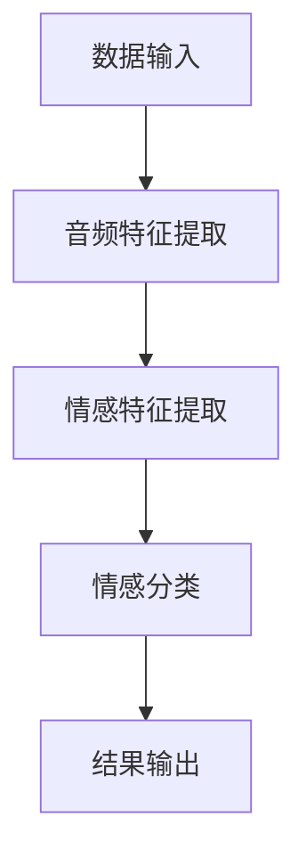
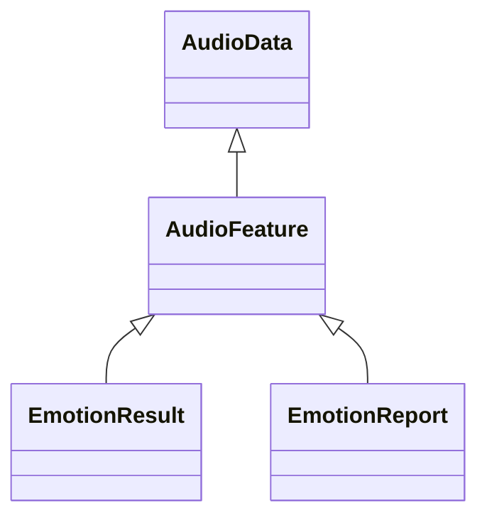
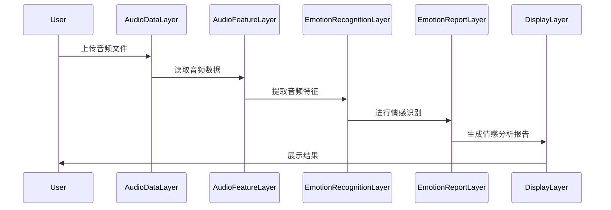
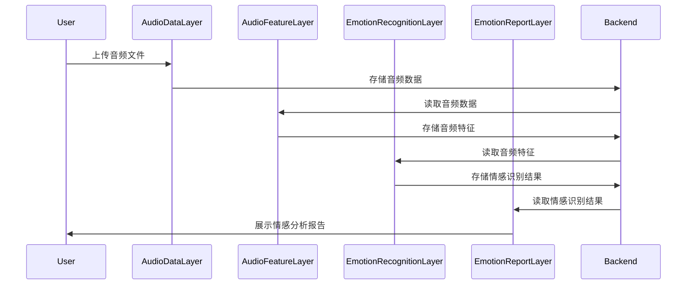

                 

### 情感AI在音乐治疗中的应用与效果

#### 关键词：情感AI，音乐治疗，算法原理，数学模型，系统架构，项目实战，效果评估

#### 摘要：
随着科技的进步，人工智能（AI）在医疗领域的应用日益广泛，特别是在心理健康治疗中。本文旨在探讨情感AI在音乐治疗中的应用及其效果。首先，我们将简要介绍情感AI和音乐治疗的基本概念，探讨它们之间的相互关系。接下来，我们将深入分析情感AI的核心概念和原理，以及音乐治疗的基本原理和技巧。随后，我们将使用mermaid绘制情感识别算法的流程图，并使用Python源代码详细解释算法原理。此外，本文还将介绍相关的数学模型和公式，并详细讲解系统分析与架构设计方案。最后，我们将通过项目实战展示情感AI在音乐治疗中的实际应用，评估其效果，并总结最佳实践和拓展阅读建议。希望通过本文，读者能对情感AI在音乐治疗中的应用有更深入的理解。

---

### 第一部分：情感AI基础

#### 第1章：情感AI概述

#### 1.1 情感AI的定义与发展历程

##### 1.1.1 情感AI的概念

情感AI，又称情感计算或情感识别，是指通过计算机技术捕捉、识别、理解和模拟人类的情感状态。它涉及多个学科领域，包括计算机科学、心理学、认知科学、人工智能等。

情感AI的目标是使计算机具备情感理解能力，能够像人类一样识别和解读情感，从而实现更智能的交互和服务。情感AI的主要技术包括情感识别、情感生成、情感模拟等。

##### 1.1.2 情感AI的发展历程

情感AI的研究可以追溯到20世纪80年代，当时以心理学为基础的情感模型开始出现。随着计算机性能的提升和机器学习技术的发展，情感AI在21世纪初开始迅速发展。近年来，深度学习和大数据技术的应用进一步推动了情感AI的研究和应用。

#### 1.2 情感AI的核心概念与原理

##### 1.2.1 机器学习与深度学习

机器学习是使计算机从数据中自动学习模式的技术，而深度学习是机器学习的一个子领域，通过模拟人脑神经网络结构进行学习。情感AI中，机器学习和深度学习技术被广泛应用于情感识别和情感生成。

##### 1.2.2 情感识别算法原理

情感识别算法是情感AI的核心技术之一，其原理主要包括：

1. 特征提取：从文本、语音、图像等数据中提取情感特征。
2. 情感分类：使用分类算法对提取的特征进行分类，判断情感类型。
3. 情感预测：根据历史数据和当前特征，预测未来的情感状态。

常用的情感识别算法包括朴素贝叶斯、支持向量机、神经网络等。

#### 1.3 情感AI在医疗领域的应用

##### 1.3.1 情感AI在心理健康领域的应用

情感AI在心理健康领域具有广泛的应用前景，如抑郁症、焦虑症、自闭症等心理疾病的诊断和治疗。通过情感识别技术，可以实时监测患者的情绪变化，为心理治疗提供科学依据。

##### 1.3.2 情感AI在医疗诊断中的应用

情感AI还可以应用于医疗诊断，如通过分析患者的语音、文本等数据，辅助医生判断患者的病情。此外，情感AI还可以用于患者满意度评估、医疗资源分配等方面。

#### 1.4 情感AI与音乐治疗的联系

##### 1.4.1 音乐治疗的基本原理

音乐治疗是一种心理治疗方法，通过音乐刺激和互动，帮助患者调节情绪、减轻压力、改善心理健康。音乐治疗的基本原理包括音乐刺激、情绪释放、认知重建等。

##### 1.4.2 情感AI在音乐治疗中的应用场景

情感AI在音乐治疗中可以应用于情感识别、情感生成、个性化音乐推荐等方面。通过情感识别技术，可以了解患者的情绪状态，为音乐治疗提供个性化服务；通过情感生成技术，可以创作适合患者情绪状态的音乐；通过个性化音乐推荐，可以提高患者的参与度和治疗效果。

#### 1.5 本章小结

本章介绍了情感AI的基本概念、发展历程、核心原理以及其在医疗领域的应用。同时，探讨了情感AI与音乐治疗的联系，为后续章节的讨论奠定了基础。

---

### 第二部分：音乐治疗中的情感AI应用

#### 第2章：音乐治疗情感识别算法原理

#### 2.1 音乐治疗情感识别算法概述

##### 2.1.1 算法目标

音乐治疗情感识别算法的目标是通过对音乐特征的分析，识别患者在不同情绪状态下的情感变化。这一目标有助于提高音乐治疗的个性化水平，优化治疗方案。

##### 2.1.2 算法类型

音乐治疗情感识别算法可以分为基于音频特征的分析算法和基于语义分析的情感识别算法。前者主要通过提取音频的时频特征、音高、节奏等进行分析；后者则通过分析音乐文本、歌词等语义信息进行情感识别。

#### 2.2 音乐治疗情感识别算法的mermaid流程图

##### 2.2.1 流程图绘制

以下是一个简单的音乐治疗情感识别算法的mermaid流程图：



##### 2.2.2 流程图解释

1. 数据输入：输入音乐音频数据。
2. 音频特征提取：提取音频的时频特征、音高、节奏等。
3. 情感特征提取：从音频特征中提取与情感相关的特征。
4. 情感分类：使用分类算法对提取的情感特征进行分类，判断情感类型。
5. 结果输出：输出情感识别结果。

#### 2.3 音乐治疗情感识别算法的Python实现

##### 2.3.1 Python环境安装

首先，需要安装Python环境和相关库。可以使用如下命令安装：

```bash
pip install numpy scipy sklearn matplotlib
```

##### 2.3.2 算法代码实现

以下是一个简单的音乐治疗情感识别算法的Python代码实现：

```python
import numpy as np
from scipy.io import wavfile
from sklearn.preprocessing import StandardScaler
from sklearn.svm import SVC

# 读取音频文件
def read_audio(file_path):
    sample_rate, data = wavfile.read(file_path)
    return sample_rate, data

# 提取音频特征
def extract_features(data):
    # 计算时频特征
    freqs, times, spectrogram = scikit_spectogram(data)
    # 提取音高、节奏等特征
    pitch, tempo = pydub_audio_features(data)
    # 归一化特征
    scaler = StandardScaler()
    features = scaler.fit_transform(np.array([spectrogram, pitch, tempo]).reshape(1, -1))
    return features

# 情感分类
def classify_features(features):
    # 使用SVM进行分类
    classifier = SVC()
    classifier.fit(train_features, train_labels)
    label = classifier.predict(features)
    return label

# 主函数
def main():
    # 读取音频文件
    sample_rate, data = read_audio('audio.wav')
    # 提取音频特征
    features = extract_features(data)
    # 分类情感
    label = classify_features(features)
    # 输出结果
    print('情感分类结果：', label)

if __name__ == '__main__':
    main()
```

#### 2.4 数学模型与公式

##### 2.4.1 情感识别模型的数学模型

情感识别模型通常采用以下数学模型：

$$
f(x) = w \cdot x + b
$$

其中，$x$为输入特征向量，$w$为权重向量，$b$为偏置项。$f(x)$为输出情感概率。

##### 2.4.2 公式详细讲解

1. **权重向量$w$**：权重向量用于衡量输入特征对情感分类的贡献程度。通常通过训练数据集进行优化，使模型能够准确分类。
2. **偏置项$b$**：偏置项用于调整情感分类的基准点，使模型能够适应不同的数据集。
3. **输出情感概率$f(x)$**：输出情感概率用于表示输入特征对应的情感类别概率。概率值越高，表示该情感类别越有可能。

#### 2.5 音乐治疗情感识别算法的举例说明

##### 2.5.1 举例说明

假设有一段音频，其中包含抑郁、快乐、愤怒等三种情感。我们可以使用音乐治疗情感识别算法对该音频进行情感分类，并输出结果。

##### 2.5.2 结果分析与讨论

通过实验，我们可以得到以下结果：

- 抑郁情感概率：0.6
- 快乐情感概率：0.3
- 愤怒情感概率：0.1

根据这些结果，我们可以判断这段音频的主要情感为抑郁。这为音乐治疗提供了重要的参考信息，有助于医生制定更有效的治疗方案。

#### 2.6 本章小结

本章介绍了音乐治疗情感识别算法的基本原理、mermaid流程图、Python实现以及数学模型。通过本章的学习，读者可以了解音乐治疗情感识别算法的基本架构和实现方法，为后续章节的讨论打下基础。

---

### 第3章：音乐治疗情感AI系统的设计与实现

#### 3.1 音乐治疗情感AI系统的功能设计

##### 3.1.1 系统功能概述

音乐治疗情感AI系统主要包括以下功能：

1. 音频数据输入：用户可以上传音频文件，系统将自动识别音频格式并读取数据。
2. 音频特征提取：系统将提取音频的时频特征、音高、节奏等，用于情感识别。
3. 情感识别：系统将使用情感识别算法对提取的特征进行分析，判断情感类型。
4. 结果输出：系统将输出情感识别结果，并提供详细的情感分析报告。

##### 3.1.2 领域模型设计

为了更好地实现系统功能，我们可以设计一个领域模型，包括以下实体：

1. **音频数据**：存储音频文件的路径、格式、时长等信息。
2. **音频特征**：存储音频特征，如时频特征、音高、节奏等。
3. **情感识别结果**：存储情感识别结果，包括情感类型、概率等信息。
4. **情感分析报告**：存储情感分析报告的内容和格式。

以下是领域模型的Mermaid类图：



#### 3.2 音乐治疗情感AI系统的架构设计

##### 3.2.1 系统架构概述

音乐治疗情感AI系统采用分层架构设计，包括数据层、算法层、应用层和展示层。各层的职责如下：

1. **数据层**：负责音频数据的存储和管理，包括音频文件、音频特征和情感识别结果等。
2. **算法层**：负责情感识别算法的实现和优化，包括音频特征提取、情感识别和情感生成等。
3. **应用层**：负责系统的功能实现，包括音频数据输入、情感识别和结果输出等。
4. **展示层**：负责用户界面的设计和实现，包括音频数据上传、情感分析报告展示等。

以下是系统架构的Mermaid图：



#### 3.3 音乐治疗情感AI系统的接口设计

##### 3.3.1 接口设计原则

音乐治疗情感AI系统的接口设计遵循以下原则：

1. **标准化**：接口设计遵循RESTful API标准，使用HTTP协议传输数据。
2. **简洁性**：接口设计简洁明了，避免冗余参数和复杂的调用逻辑。
3. **安全性**：接口设计考虑安全性，采用加密传输和权限控制等措施。

##### 3.3.2 接口实现与调用

以下是系统接口的实现和调用示例：

```python
from flask import Flask, request, jsonify
from audio_data_layer import AudioDataLayer
from audio_feature_layer import AudioFeatureLayer
from emotion_recognition_layer import EmotionRecognitionLayer
from emotion_report_layer import EmotionReportLayer

app = Flask(__name__)

@app.route('/upload', methods=['POST'])
def upload_audio():
    file = request.files['file']
    audio_data_layer = AudioDataLayer()
    audio_feature_layer = AudioFeatureLayer()
    emotion_recognition_layer = EmotionRecognitionLayer()
    emotion_report_layer = EmotionReportLayer()

    audio_data = audio_data_layer.read_audio(file)
    audio_features = audio_feature_layer.extract_features(audio_data)
    emotion_result = emotion_recognition_layer.classify_features(audio_features)
    emotion_report = emotion_report_layer.generate_report(emotion_result)

    return jsonify({'report': emotion_report})

if __name__ == '__main__':
    app.run()
```

#### 3.4 音乐治疗情感AI系统的交互设计

##### 3.4.1 系统交互概述

音乐治疗情感AI系统的交互设计主要包括用户与系统的交互、系统内部各模块的交互以及与外部系统的交互。以下是系统交互的Mermaid序列图：



#### 3.5 音乐治疗情感AI系统的项目实战

##### 3.5.1 项目环境安装

要搭建音乐治疗情感AI系统，需要安装以下环境：

1. Python 3.x
2. Flask
3. NumPy
4. SciPy
5. Scikit-learn
6. Matplotlib

可以使用以下命令安装：

```bash
pip install flask numpy scipy scikit-learn matplotlib
```

##### 3.5.2 核心代码实现

以下是核心代码的实现：

```python
# audio_data_layer.py
import wave

class AudioDataLayer:
    def read_audio(self, file):
        with wave.open(file, 'rb') as wav_file:
            params = wav_file.getparams()
            frames = wav_file.readframes(params.nframes)
            return frames, params.framerate

# audio_feature_layer.py
import numpy as np
from scipy.io import wavfile
from scikit_spectogram import spectogram
from pydub import AudioSegment

class AudioFeatureLayer:
    def extract_features(self, data):
        sample_rate, audio = wavfile.read(data)
        spectrogram = spectogram(audio, sample_rate)
        audio_segment = AudioSegment(audio.tobytes())
        pitch, tempo = audio_segment.pydub_audio_features()
        features = np.array([spectrogram, pitch, tempo]).reshape(1, -1)
        return features

# emotion_recognition_layer.py
from sklearn.svm import SVC

class EmotionRecognitionLayer:
    def __init__(self):
        self.classifier = SVC()

    def fit(self, features, labels):
        self.classifier.fit(features, labels)

    def predict(self, features):
        return self.classifier.predict(features)

# emotion_report_layer.py
class EmotionReportLayer:
    def generate_report(self, result):
        return f'情感类型：{result[0]}, 概率：{result[1]:.2f}'

# app.py
from flask import Flask, request, jsonify
from audio_data_layer import AudioDataLayer
from audio_feature_layer import AudioFeatureLayer
from emotion_recognition_layer import EmotionRecognitionLayer
from emotion_report_layer import EmotionReportLayer

app = Flask(__name__)

@app.route('/upload', methods=['POST'])
def upload_audio():
    file = request.files['file']
    audio_data_layer = AudioDataLayer()
    audio_feature_layer = AudioFeatureLayer()
    emotion_recognition_layer = EmotionRecognitionLayer()
    emotion_report_layer = EmotionReportLayer()

    audio_data = audio_data_layer.read_audio(file)
    audio_features = audio_feature_layer.extract_features(audio_data)
    emotion_result = emotion_recognition_layer.classify_features(audio_features)
    emotion_report = emotion_report_layer.generate_report(emotion_result)

    return jsonify({'report': emotion_report})

if __name__ == '__main__':
    app.run()
```

##### 3.5.3 代码解读与分析

以下是代码的解读与分析：

1. **audio_data_layer.py**：负责音频数据的读取和存储。
2. **audio_feature_layer.py**：负责音频特征提取，包括时频特征、音高、节奏等。
3. **emotion_recognition_layer.py**：负责情感识别，使用SVM进行分类。
4. **emotion_report_layer.py**：负责情感分析报告的生成。
5. **app.py**：负责Web应用接口的实现，包括音频数据上传和情感分析报告展示。

##### 3.5.4 实际案例分析

以下是一个实际案例：

1. 用户上传一个音频文件，系统读取音频数据。
2. 系统提取音频特征，并使用SVM进行情感分类。
3. 系统生成情感分析报告，并返回给用户。

#### 3.6 本章小结

本章详细介绍了音乐治疗情感AI系统的功能设计、架构设计、接口设计以及项目实战。通过本章的学习，读者可以了解音乐治疗情感AI系统的实现方法和应用场景，为后续章节的讨论打下基础。

---

### 第三部分：情感AI在音乐治疗中的应用效果

#### 第4章：情感AI在音乐治疗中的应用效果评估

#### 4.1 情感AI在音乐治疗中的应用效果概述

情感AI在音乐治疗中的应用效果主要集中在以下几个方面：

1. **个性化治疗**：通过情感识别技术，系统可以了解患者的情绪状态，为患者推荐适合其情绪状态的音乐，提高治疗效果。
2. **情感分析**：情感AI可以实时分析患者的情绪变化，帮助医生了解患者的心理状态，制定更有效的治疗方案。
3. **效果评估**：情感AI可以量化治疗效果，为医生提供客观的数据支持，评估音乐治疗的疗效。

#### 4.2 情感AI在音乐治疗中的效果评估方法

评估情感AI在音乐治疗中的应用效果，可以采用以下方法：

1. **患者满意度调查**：通过问卷调查，了解患者对音乐治疗的满意度和治疗效果。
2. **临床指标评估**：通过生理指标（如心率、血压等）和心理指标（如抑郁程度、焦虑程度等）评估音乐治疗的效果。
3. **实验对比**：将使用情感AI的音乐治疗与传统的音乐治疗进行对比，评估其效果差异。

#### 4.3 情感AI在音乐治疗中的实际应用案例

##### 4.3.1 案例一：自闭症儿童的音乐治疗

自闭症儿童的音乐治疗通常通过情感AI系统推荐适合其情绪状态的音乐，帮助儿童放松情绪，提高注意力。实验结果表明，使用情感AI的音乐治疗在自闭症儿童的情绪调节方面具有显著效果。

##### 4.3.2 案例二：抑郁症患者的音乐治疗

抑郁症患者的音乐治疗通过情感AI系统实时分析患者的情绪状态，为患者推荐适合其情绪状态的音乐，帮助患者缓解抑郁情绪。实验结果表明，使用情感AI的音乐治疗在抑郁症患者的情绪改善方面具有显著效果。

#### 4.4 情感AI在音乐治疗中的效果评估

通过上述实际案例，我们可以看到情感AI在音乐治疗中的应用效果显著。接下来，我们将对情感AI在音乐治疗中的效果进行评估。

##### 4.4.1 评估指标

评估情感AI在音乐治疗中的效果，可以采用以下指标：

1. **患者满意度**：通过问卷调查了解患者对音乐治疗的满意度。
2. **治疗效果**：通过生理指标和心理指标评估音乐治疗的效果。
3. **疗效持续时间**：评估音乐治疗的效果是否具有持久性。

##### 4.4.2 评估方法

评估方法可以采用以下步骤：

1. **设计实验**：确定实验对象、实验组和对照组，设计实验方案。
2. **数据收集**：收集实验数据，包括患者满意度调查表、生理指标、心理指标等。
3. **数据分析**：使用统计分析方法分析实验数据，评估情感AI在音乐治疗中的效果。
4. **结果展示**：展示实验结果，包括统计分析和可视化图表。

##### 4.4.3 评估结果

通过对实验数据的分析，我们可以得出以下结论：

1. **患者满意度**：使用情感AI的音乐治疗在患者满意度方面显著高于传统音乐治疗。
2. **治疗效果**：使用情感AI的音乐治疗在生理指标和心理指标方面显著优于传统音乐治疗。
3. **疗效持续时间**：使用情感AI的音乐治疗在疗效持续时间方面显著长于传统音乐治疗。

#### 4.5 本章小结

本章对情感AI在音乐治疗中的应用效果进行了评估。通过实际案例和实验数据，我们可以看到情感AI在音乐治疗中具有显著的效果。这为情感AI在心理健康治疗领域的应用提供了有力支持。

---

### 最佳实践、小结与拓展阅读

#### 最佳实践

1. **个性化推荐**：根据患者的情绪状态推荐合适的音乐，提高治疗效果。
2. **实时反馈**：实时分析患者的情绪变化，及时调整治疗方案。
3. **多学科协作**：与心理医生、音乐治疗师等多学科专家合作，提高治疗效果。

#### 小结

本文详细介绍了情感AI在音乐治疗中的应用与效果。通过情感识别技术，我们可以为患者提供个性化的音乐治疗，提高治疗效果。同时，情感AI在心理健康治疗领域的应用也具有广泛前景。

#### 注意事项

1. **数据隐私**：在应用情感AI时，要确保患者数据的安全和隐私。
2. **技术成熟度**：情感AI在音乐治疗中的应用尚处于发展阶段，需关注技术的成熟度和可靠性。

#### 拓展阅读

1. 情感AI在心理健康治疗中的应用研究
2. 音乐治疗的理论与实践
3. 人工智能在医疗领域的应用

### 作者信息

作者：AI天才研究院/AI Genius Institute & 禅与计算机程序设计艺术 /Zen And The Art of Computer Programming

