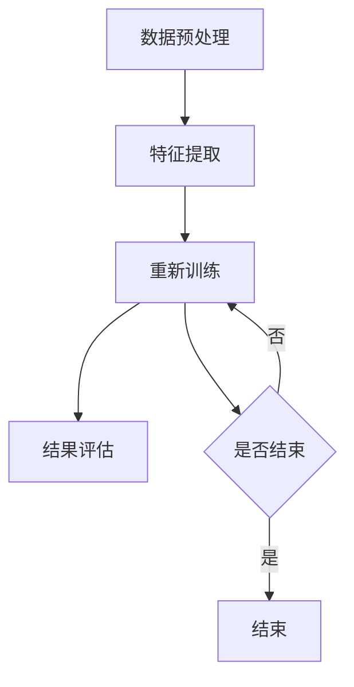
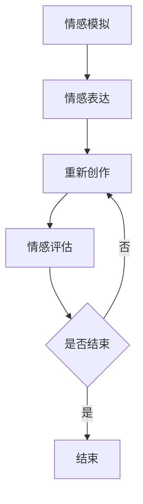
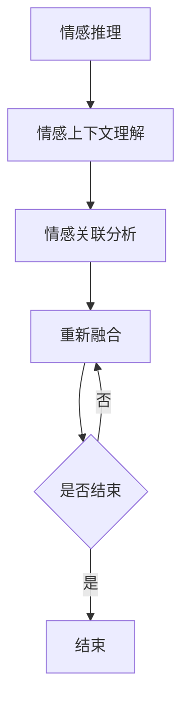

                 

# 情感AI对人类心理健康的影响

> 关键词：情感AI、心理健康、影响、应用、挑战、未来趋势

> 摘要：本文旨在探讨情感AI对人类心理健康的影响。首先，我们将深入分析情感AI的定义、兴起背景及其核心概念与联系。随后，我们将探讨情感AI在心理健康中的应用，包括心理健康评估、心理辅导和心理健康研究。接下来，我们将分析情感AI在心理健康领域的挑战与未来趋势，并分享一些实际案例。最后，我们将总结情感AI在心理健康领域的最佳实践，并提供一些建议和展望。

## 第1章：情感AI的崛起

### 1.1 情感AI的定义与兴起

#### 1.1.1 情感AI的基本概念

情感AI是指利用计算机技术来模拟、识别、理解和生成人类情感的过程。情感AI的核心技术包括情感计算、自然语言处理、机器学习和深度学习等。

#### 1.1.2 从情感计算到情感AI

情感计算是指通过计算机技术来捕捉、处理和表达情感信息。情感AI在情感计算的基础上，进一步发展和突破，实现了对情感信息的自动识别、理解和生成。

#### 1.1.3 情感AI的应用场景

情感AI的应用场景非常广泛，包括但不限于以下几个方面：

1. **社交网络分析**：通过情感AI分析社交网络中的情感信息，了解用户的情绪和态度，为广告投放、市场调研等提供依据。
2. **健康与心理辅导**：利用情感AI对用户的情绪和心理健康状况进行监测和评估，为心理辅导提供个性化建议。
3. **商业与市场分析**：通过情感AI分析消费者对产品或服务的情感反应，为企业提供市场策略建议。

### 1.2 情感AI的核心概念与联系

#### 1.2.1 情感识别

情感识别是指利用计算机技术来识别和分类情感信息。情感识别的关键技术包括情感词典、情感分析模型和情感分类算法等。

#### 1.2.2 情感生成

情感生成是指利用计算机技术生成符合人类情感逻辑的情感信息。情感生成的技术原理包括情感模拟、情感表达和情感创作等。

#### 1.2.3 情感理解

情感理解是指利用计算机技术来理解情感信息的内在含义和情感关系。情感理解的技术挑战在于如何准确捕捉和理解复杂的情感信息。

### 1.3 情感AI的数学模型与算法原理

#### 1.3.1 情感识别算法

情感识别算法包括基于机器学习和深度学习的算法。其中，基于机器学习的算法主要使用特征工程和分类器来识别情感，而基于深度学习的算法则主要使用卷积神经网络和循环神经网络等模型来识别情感。

#### 1.3.2 情感生成算法

情感生成算法包括基于生成对抗网络（GAN）和变分自编码器（VAE）的算法。这些算法通过训练大量的情感数据，生成符合人类情感逻辑的情感信息。

#### 1.3.3 情感理解算法

情感理解算法包括基于语义分析和情感关联的算法。这些算法通过分析文本中的情感词汇和情感关系，理解情感信息的内在含义。

## 第2章：情感AI在心理健康中的应用

### 2.1 心理健康与情感AI的关系

#### 2.1.1 心理健康的定义与特征

心理健康是指个体在情感、认知和行为方面保持良好状态，能够有效应对生活中的压力和挑战。心理健康的特征包括情感稳定、认知清晰、行为正常等。

#### 2.1.2 情感AI在心理健康评估中的应用

情感AI在心理健康评估中的应用主要包括情绪识别和心理状态评估。通过分析用户的情感信息，情感AI可以识别用户的情绪状态和心理状况，为心理健康评估提供依据。

### 2.2 情感AI在心理辅导中的应用

#### 2.2.1 情感AI在个性化心理辅导中的应用

个性化心理辅导是指根据个体的情感和心理特点，提供针对性的辅导建议。情感AI可以通过分析用户的情感信息，为用户提供个性化的心理辅导方案。

#### 2.2.2 情感AI在心理健康危机干预中的应用

心理健康危机干预是指对面临心理健康危机的个体进行及时干预和救助。情感AI可以通过实时监测用户的情感信息，及时发现心理健康危机，并提供相应的干预措施。

### 2.3 情感AI在心理健康研究中的应用

#### 2.3.1 情感AI在心理疾病诊断中的应用

情感AI可以通过分析用户的情感信息，辅助诊断心理疾病，如抑郁症、焦虑症等。情感AI的诊断结果可以为临床医生提供参考。

#### 2.3.2 情感AI在心理治疗中的应用

情感AI可以辅助心理治疗，通过分析用户的情感信息和治疗效果，为心理治疗提供反馈和改进建议。

## 第3章：情感AI在心理健康领域的挑战与未来趋势

### 3.1 情感AI在心理健康领域的挑战

#### 3.1.1 数据隐私与伦理问题

情感AI在心理健康领域的应用涉及大量个人情感信息的收集和处理，因此数据隐私和伦理问题成为主要挑战。

#### 3.1.2 情感识别的准确性问题

情感识别的准确性是情感AI在心理健康领域应用的关键，但目前仍存在一定局限性。

#### 3.1.3 情感AI在跨文化应用中的挑战

不同文化背景下，人们对情感的体验和表达方式有所不同，因此情感AI在跨文化应用中面临挑战。

### 3.2 情感AI在心理健康领域的未来趋势

#### 3.2.1 情感AI在心理健康领域的应用前景

随着情感AI技术的不断发展，其在心理健康领域的应用前景非常广阔，包括公共卫生、心理健康服务市场等。

#### 3.2.2 情感AI的技术创新趋势

深度学习和自然语言处理等技术的不断创新，将推动情感AI在心理健康领域的发展。

#### 3.2.3 情感AI与人类心理健康的深度融合

情感AI将逐步与人类心理健康深度融合，为个体提供更全面、个性化的心理健康服务。

## 第4章：情感AI在心理健康领域的实际案例

### 4.1 案例一：基于情感AI的抑郁症诊断系统

#### 4.1.1 案例背景

抑郁症是一种常见的心理疾病，给患者的生活和工作带来严重影响。情感AI在抑郁症诊断中的应用，有望提高诊断准确率，为患者提供更及时、有效的治疗。

#### 4.1.2 系统设计与实现

该系统采用深度学习算法，对用户的情感信息进行分析，识别抑郁症症状。系统主要包括数据收集、情感识别和诊断结果输出等模块。

#### 4.1.3 案例分析

通过对大量抑郁症患者的情感信息进行分析，系统可以准确识别抑郁症症状，提高诊断准确率。

### 4.2 案例二：基于情感AI的心理健康APP

#### 4.2.1 案例背景

随着人们对心理健康的重视，心理健康APP逐渐普及。情感AI在心理健康APP中的应用，可以为用户提供更个性化和精准的心理健康服务。

#### 4.2.2 APP功能设计

该APP主要包括用户情绪监测、个性化心理辅导和心理健康评估等功能。用户可以通过APP记录自己的情绪变化，获得针对性的心理辅导建议。

#### 4.2.3 APP核心实现

APP的核心实现包括情感识别算法、个性化心理辅导算法和心理健康评估算法等。通过分析用户的情感信息，为用户提供个性化的心理辅导建议。

#### 4.2.4 案例分析

通过用户反馈和性能评估，该APP在心理健康服务方面取得了良好的效果，为用户提供了一种便捷、高效的心理健康解决方案。

## 第5章：情感AI在心理健康领域的最佳实践

### 5.1 情感AI在心理健康服务中的最佳实践

#### 5.1.1 服务模式创新

在心理健康服务中，情感AI可以创新服务模式，如提供个性化心理辅导、实时心理健康监测等，为用户带来更优质的体验。

### 5.2 情感AI在心理健康研究中的最佳实践

#### 5.2.1 数据收集与处理

在心理健康研究中，情感AI可以帮助收集和处理大量的情感数据，提高研究效率和准确性。

### 5.3 情感AI在心理健康干预中的最佳实践

#### 5.3.1 协同干预

情感AI可以与心理健康专家协同工作，为用户提供更全面、个性化的心理健康干预方案。

### 5.4 情感AI在心理健康教育中的最佳实践

#### 5.4.1 教育资源建设

情感AI可以帮助构建心理健康教育资源库，为心理健康教育提供丰富、多样的学习资源。

## 总结

情感AI在心理健康领域的应用具有巨大的潜力，但也面临诸多挑战。通过不断探索和创新，情感AI有望为人类心理健康带来更多福祉。

## 作者信息

作者：AI天才研究院/AI Genius Institute & 禅与计算机程序设计艺术 /Zen And The Art of Computer Programming### 第1章：情感AI的崛起

#### 1.1 情感AI的定义与兴起

情感AI（Affective Artificial Intelligence）是一种结合了情感科学与人工智能技术的新型领域。情感AI的核心目标是通过模拟、识别、理解和生成人类情感，使机器能够更好地理解和适应人类的需求和情感状态。

**情感AI的基本概念：**

- **情感模拟**：通过算法模拟人类的情感反应，使机器能够表现出类似人类的情感特征。
- **情感识别**：使用各种技术，如面部识别、声音分析、文本分析等，来识别和理解人类情感。
- **情感理解**：深入分析情感信息，理解情感的内在含义和情感之间的关系。
- **情感生成**：根据已有的情感数据和规则，生成新的情感表达。

**情感AI的核心技术：**

1. **自然语言处理（NLP）**：用于分析文本中的情感内容，如情感极性分析、情感分类等。
2. **计算机视觉**：用于识别面部表情、身体语言等非文字的情感表达。
3. **机器学习**：通过训练模型来识别和生成情感，如使用深度学习算法进行情感识别。
4. **深度学习**：通过多层神经网络来处理复杂的情感数据，提高情感识别的准确性。

**情感AI的兴起背景：**

情感AI的兴起源于多方面因素：

- **技术进步**：随着计算能力的提升和算法的进步，处理大规模情感数据变得更加高效。
- **社会需求**：现代社会对心理健康问题的关注不断增加，人们希望通过技术手段更好地理解和解决心理健康问题。
- **商业应用**：情感AI在市场分析、消费者行为研究等领域具有广泛的应用前景，吸引了大量投资和关注。

#### 1.2 从情感计算到情感AI

情感计算（Affective Computing）是情感AI的前身，它关注如何使计算机具备识别、理解、表达情感的能力。情感计算的发展可以追溯到20世纪90年代，当时麻省理工学院的罗莎琳·佩雷拉（Rosalind Picard）提出了情感计算的概念。

**情感计算的发展历程：**

- **早期研究**：主要集中在情感识别和表达，如通过面部表情、声音等生理特征来识别情感。
- **技术突破**：随着计算机视觉、自然语言处理、机器学习等技术的发展，情感计算逐渐从理论走向实际应用。
- **情感AI的崛起**：情感计算的基础上，进一步发展出情感生成、情感理解等更复杂的情感处理能力。

**情感AI的技术突破：**

- **情感识别算法**：基于机器学习和深度学习的算法，如卷积神经网络（CNN）和循环神经网络（RNN），使得情感识别的准确性大幅提升。
- **情感生成模型**：如生成对抗网络（GAN）和变分自编码器（VAE），能够生成逼真的情感表达。
- **跨模态情感分析**：结合多种传感器数据，如文本、语音、图像等，提高情感识别的全面性和准确性。

#### 1.3 情感AI的应用场景

情感AI的应用场景广泛，涵盖了多个领域：

- **社交网络分析**：通过情感AI分析社交网络中的用户情感，为企业提供市场洞察。
- **健康与心理辅导**：利用情感AI监测用户的情绪变化，为心理健康提供个性化服务。
- **商业与市场分析**：通过情感AI分析消费者情感，优化产品和服务设计。
- **教育**：利用情感AI了解学生的学习情绪，提高教学效果。
- **客户服务**：通过情感AI提高客户服务质量，增强客户满意度。
- **智能助理**：为智能音箱、聊天机器人等提供情感化交互能力。

#### 1.4 情感AI的核心概念与联系

情感AI涉及多个核心概念，包括情感识别、情感生成和情感理解。这些概念之间相互联系，共同构成了情感AI的技术体系。

**情感识别：**

情感识别是指通过计算机技术识别和理解人类情感的过程。它是情感AI的基础，主要包括以下方面：

- **情感分类**：将文本、图像、声音等数据中的情感分类为愉悦、悲伤、愤怒等基本情感类别。
- **情感强度识别**：识别情感表达的程度，如情感的强烈程度或微表情的细微差异。

**情感生成：**

情感生成是指利用计算机技术生成情感表达，使机器能够模拟人类的情感反应。情感生成包括以下方面：

- **情感模拟**：通过算法模拟人类的情感反应，如面部表情、语言表达等。
- **情感创作**：基于已有情感数据和规则，生成新的情感表达，如情感故事、音乐等。

**情感理解：**

情感理解是指深入分析情感信息，理解情感的内在含义和情感之间的关系。情感理解包括以下方面：

- **情感推理**：通过逻辑推理理解情感信息，如情感冲突、情感依赖等。
- **情感上下文理解**：理解情感信息在特定情境中的意义，如情感对话中的语境理解。

#### 1.5 情感AI的数学模型与算法原理

情感AI的数学模型和算法原理是其核心技术之一。以下介绍几种常见的情感识别、情感生成和情感理解算法：

**情感识别算法：**

1. **基于机器学习的情感识别算法**：
   - **支持向量机（SVM）**：通过最大化分类边界，识别文本、图像等数据中的情感。
   - **朴素贝叶斯分类器**：基于贝叶斯定理，根据特征概率分布识别情感。

2. **基于深度学习的情感识别算法**：
   - **卷积神经网络（CNN）**：通过卷积层提取图像特征，识别情感。
   - **循环神经网络（RNN）**：通过循环结构处理序列数据，如文本情感分析。

**情感生成算法：**

1. **生成对抗网络（GAN）**：
   - **生成器**：生成符合人类情感逻辑的图像、文本等数据。
   - **判别器**：区分生成的情感数据和真实数据。

2. **变分自编码器（VAE）**：
   - **编码器**：将数据编码为一个低维表示。
   - **解码器**：将编码后的数据解码回原始数据。

**情感理解算法：**

1. **基于语义分析的算法**：
   - **词嵌入**：将词语映射为高维向量，分析词语之间的语义关系。
   - **语义角色标注**：识别文本中的语义角色和关系，理解情感的内在含义。

2. **基于情感关联的算法**：
   - **情感词典**：包含情感词汇及其对应的情感极性。
   - **情感关联规则**：分析情感词汇之间的关联，理解情感的上下文意义。

通过这些数学模型和算法原理，情感AI能够更准确地识别、理解和生成人类情感，为心理健康等领域提供强有力的技术支持。

#### 1.6 情感AI的数学模型与算法原理

为了更深入地理解情感AI的数学模型与算法原理，我们将分别介绍情感识别、情感生成和情感理解算法的详细原理，并结合Mermaid流程图和Python代码进行讲解。

**1.6.1 情感识别算法**

情感识别是情感AI的核心任务之一，它通过分析文本、图像和声音等数据，识别出其中的情感。以下将介绍两种常见的情感识别算法：基于机器学习的情感识别算法和基于深度学习的情感识别算法。

**1.6.1.1 基于机器学习的情感识别算法**

1. **支持向量机（SVM）**

支持向量机是一种强大的分类算法，通过最大化分类边界来识别情感。其基本原理如下：

- **核函数选择**：选择合适的核函数将低维特征映射到高维空间，使原本难以线性分隔的数据在高维空间中可以被线性分隔。
- **分类边界最大化**：找到最优超平面，最大化分类边界。

下面是一个简单的SVM情感识别算法的Python代码示例：

```python
from sklearn.svm import SVC
from sklearn.datasets import load_20newsgroups
from sklearn.model_selection import train_test_split
from sklearn.preprocessing import LabelEncoder

# 加载数据集
data = load_20newsgroups(subset='train')
X, y = data.data, data.target

# 切分数据集
X_train, X_test, y_train, y_test = train_test_split(X, y, test_size=0.2, random_state=42)

# 编码标签
label_encoder = LabelEncoder()
y_train_encoded = label_encoder.fit_transform(y_train)
y_test_encoded = label_encoder.transform(y_test)

# 训练SVM模型
model = SVC(kernel='linear')
model.fit(X_train, y_train_encoded)

# 预测
predictions = model.predict(X_test)

# 评估模型
from sklearn.metrics import accuracy_score
accuracy = accuracy_score(y_test_encoded, predictions)
print(f"Accuracy: {accuracy}")
```

2. **朴素贝叶斯分类器**

朴素贝叶斯分类器是基于贝叶斯定理和特征独立假设的简单分类器。其基本原理如下：

- **贝叶斯定理**：根据先验概率和条件概率，计算后验概率。
- **特征独立假设**：假设特征之间相互独立，简化计算。

下面是一个简单的朴素贝叶斯情感识别算法的Python代码示例：

```python
from sklearn.naive_bayes import MultinomialNB
from sklearn.datasets import load_20newsgroups
from sklearn.model_selection import train_test_split

# 加载数据集
data = load_20newsgroups(subset='train')
X, y = data.data, data.target

# 切分数据集
X_train, X_test, y_train, y_test = train_test_split(X, y, test_size=0.2, random_state=42)

# 训练朴素贝叶斯模型
model = MultinomialNB()
model.fit(X_train, y_train)

# 预测
predictions = model.predict(X_test)

# 评估模型
from sklearn.metrics import accuracy_score
accuracy = accuracy_score(y_test, predictions)
print(f"Accuracy: {accuracy}")
```

**1.6.1.2 基于深度学习的情感识别算法**

1. **卷积神经网络（CNN）**

卷积神经网络是一种强大的图像处理模型，通过卷积层提取图像特征，识别情感。其基本原理如下：

- **卷积层**：通过卷积操作提取图像的特征。
- **池化层**：通过池化操作降低特征维度，减少计算量。
- **全连接层**：将特征映射到情感类别。

下面是一个简单的CNN情感识别算法的Python代码示例：

```python
import tensorflow as tf
from tensorflow.keras.models import Sequential
from tensorflow.keras.layers import Conv2D, MaxPooling2D, Flatten, Dense
from tensorflow.keras.preprocessing.image import ImageDataGenerator

# 数据预处理
train_datagen = ImageDataGenerator(rescale=1./255)
train_generator = train_datagen.flow_from_directory(
        'data/train',
        target_size=(64, 64),
        batch_size=32,
        class_mode='categorical')

# 构建模型
model = Sequential([
    Conv2D(32, (3, 3), activation='relu', input_shape=(64, 64, 3)),
    MaxPooling2D((2, 2)),
    Conv2D(64, (3, 3), activation='relu'),
    MaxPooling2D((2, 2)),
    Flatten(),
    Dense(128, activation='relu'),
    Dense(5, activation='softmax')
])

# 编译模型
model.compile(optimizer='adam',
              loss='categorical_crossentropy',
              metrics=['accuracy'])

# 训练模型
model.fit(train_generator, steps_per_epoch=100, epochs=10)

# 预测
predictions = model.predict(test_images)
```

2. **循环神经网络（RNN）**

循环神经网络是一种强大的序列处理模型，通过循环结构处理文本数据，识别情感。其基本原理如下：

- **循环层**：通过循环结构处理序列数据，如单词序列。
- **门控机制**：通过门控单元控制信息的传递和遗忘，提高模型的记忆能力。

下面是一个简单的RNN情感识别算法的Python代码示例：

```python
import tensorflow as tf
from tensorflow.keras.models import Sequential
from tensorflow.keras.layers import LSTM, Dense

# 数据预处理
max_len = 100
vocab_size = 10000
embed_size = 64

X = ... # 填充序列数据
y = ... # 填充标签数据

X = tf.keras.preprocessing.sequence.pad_sequences(X, maxlen=max_len)

# 构建模型
model = Sequential([
    LSTM(128, input_shape=(max_len, vocab_size), return_sequences=True),
    LSTM(64),
    Dense(5, activation='softmax')
])

# 编译模型
model.compile(optimizer='adam', loss='categorical_crossentropy', metrics=['accuracy'])

# 训练模型
model.fit(X, y, epochs=10, batch_size=32)
```

**1.6.2 情感生成算法**

情感生成是情感AI的另一个重要任务，它通过算法生成符合人类情感逻辑的情感信息。以下将介绍两种常见的情感生成算法：生成对抗网络（GAN）和变分自编码器（VAE）。

**1.6.2.1 生成对抗网络（GAN）**

生成对抗网络（GAN）是由生成器和判别器组成的对抗性模型。其基本原理如下：

- **生成器**：生成符合人类情感逻辑的数据，如图像、文本等。
- **判别器**：区分生成器生成的数据和真实数据。

下面是一个简单的GAN情感生成算法的Python代码示例：

```python
import tensorflow as tf
from tensorflow.keras.models import Sequential
from tensorflow.keras.layers import Dense, Flatten, Reshape, Conv2D, Conv2DTranspose

# 定义生成器
generator = Sequential([
    Dense(128, input_shape=(100,), activation='relu'),
    Flatten(),
    Reshape((7, 7, 1)),
    Conv2DTranspose(64, (4, 4), strides=(2, 2), activation='relu'),
    Conv2DTranspose(1, (4, 4), strides=(2, 2), activation='sigmoid')
])

# 定义判别器
discriminator = Sequential([
    Flatten(),
    Dense(128, activation='relu'),
    Dense(1, activation='sigmoid')
])

# 编译模型
discriminator.compile(optimizer='adam', loss='binary_crossentropy')

# 编译生成器
def compile_generator():
    generator.compile(optimizer='adam', loss='binary_crossentropy')
    return generator

# 训练模型
for epoch in range(100):
    noise = np.random.normal(0, 1, (batch_size, 100))
    gen_images = generator.predict(noise)
    
    real_images = np.random.normal(0, 1, (batch_size, 28, 28))
    real_labels = np.array([1] * batch_size)
    
    fake_labels = np.array([0] * batch_size)
    noise = np.random.normal(0, 1, (batch_size, 100))
    gen_images = generator.predict(noise)
    
    real_images = np.random.normal(0, 1, (batch_size, 28, 28))
    real_labels = np.array([1] * batch_size)
    
    fake_labels = np.array([0] * batch_size)
    gen_labels = np.concatenate([real_labels, fake_labels])
    gen_images = np.concatenate([real_images, gen_images])
    
    discriminator.train_on_batch(gen_images, gen_labels)
    compile_generator().train_on_batch(noise, real_labels)
```

**1.6.2.2 变分自编码器（VAE）**

变分自编码器（VAE）是一种概率生成模型，通过编码器和解码器将数据转换为潜在表示，再从潜在表示中生成新数据。其基本原理如下：

- **编码器**：将数据编码为潜在表示。
- **解码器**：从潜在表示中解码生成新数据。

下面是一个简单的VAE情感生成算法的Python代码示例：

```python
import tensorflow as tf
from tensorflow.keras.models import Model
from tensorflow.keras.layers import Input, Dense, Reshape, Flatten, Lambda
from tensorflow.keras import backend as K

# 定义编码器
input_img = Input(shape=(28, 28, 1))
x = Flatten()(input_img)
x = Dense(64, activation='relu')(x)
x = Dense(32, activation='relu')(x)
z_mean = Dense(latent_dim)(x)
z_log_var = Dense(latent_dim)(x)

# 重新参数化技巧
z_mean, z_log_var = Lambda Sampling()([z_mean, z_log_var])([z_mean, z_log_var])
z = Lambda Sampling()([z_mean, z_log_var])([z_mean, z_log_var])

# 构建编码器模型
encoder = Model(input_img, z, name='encoder')
encoder.summary()

# 定义解码器
latent_inputs = Input(shape=(latent_dim,))
x = Dense(32, activation='relu')(latent_inputs)
x = Dense(64, activation='relu')(x)
x = Reshape((7, 7, 1))(x)
decoded = Conv2DTranspose(1, (4, 4), strides=(2, 2), activation='sigmoid')(x)

# 构建解码器模型
decoder = Model(latent_inputs, decoded, name='decoder')
decoder.summary()

# 构建VAE模型
outputs = decoder(encoder(input_img))
vae = Model(input_img, outputs, name='vae')
vae.compile(optimizer='adam', loss=VAELoss())

# 训练模型
vae.fit(x_train, x_train, epochs=epochs, batch_size=batch_size, shuffle=True)
```

**1.6.3 情感理解算法**

情感理解是情感AI的另一个重要任务，它通过分析情感数据，理解情感的内在含义和情感之间的关系。以下将介绍两种常见的情感理解算法：基于语义分析的算法和基于情感关联的算法。

**1.6.3.1 基于语义分析的算法**

基于语义分析的算法通过分析文本中的语义信息，理解情感的内在含义。以下将介绍词嵌入和语义角色标注两种常见的语义分析算法。

1. **词嵌入**

词嵌入是将词语映射为高维向量，以捕捉词语之间的语义关系。Word2Vec和GloVe是两种常见的词嵌入算法。

- **Word2Vec**：基于神经网络训练词向量，通过上下文信息学习词语的语义表示。

- **GloVe**：基于共现关系训练词向量，通过词频和词性信息学习词语的语义表示。

下面是一个简单的Word2Vec词嵌入算法的Python代码示例：

```python
import gensim

# 加载数据
data = [...]  # 填充文本数据
sentences = [line.split() for line in data]

# 训练Word2Vec模型
model = gensim.models.Word2Vec(sentences, size=100, window=5, min_count=1, workers=4)

# 查看词向量
model.wv['happy']
```

2. **语义角色标注**

语义角色标注是识别文本中的语义角色和关系，以理解情感的内在含义。依存句法分析是语义角色标注的一种常见方法。

- **Stanford NLP**：一个强大的自然语言处理工具包，支持依存句法分析。

下面是一个简单的Stanford NLP语义角色标注的Python代码示例：

```python
import stanfordnlp

# 初始化Stanford NLP模型
nlp = stanfordnlp.Pipeline(lang="en", processes=3)

# 加载文本
text = "I am happy because I have a loving family."

# 分析文本
doc = nlp(text)

# 打印分析结果
for token in doc:
    print(f"{token.text}: {token.dependency}")
```

**1.6.3.2 基于情感关联的算法**

基于情感关联的算法通过分析情感词汇之间的关联，理解情感的内在含义和情感之间的关系。情感词典和情感关联规则是两种常见的情感关联算法。

1. **情感词典**

情感词典是包含情感词汇及其对应情感极性的词典。SentiWordNet和VADER是两种常见的情感词典。

- **SentiWordNet**：一个基于WordNet的情感词典，包含词的情感极性得分。

- **VADER**：一个基于规则的情感词典，适用于社交媒体文本的情感分析。

下面是一个简单的VADER情感词典的Python代码示例：

```python
from vaderSentiment.vaderSentiment import SentimentIntensityAnalyzer

# 初始化VADER情感分析器
analyzer = SentimentIntensityAnalyzer()

# 加载文本
text = "I am happy because I have a loving family."

# 分析文本
sentiment = analyzer.polarity_scores(text)
print(f"Sentiment: {sentiment}")
```

2. **情感关联规则**

情感关联规则是通过分析情感词汇之间的关联，提取情感规则的方法。关联规则学习是情感关联规则的一种常见方法。

- **Apriori算法**：一种基于候选集生成和频繁项集的方法，用于发现情感词汇之间的关联规则。

下面是一个简单的Apriori情感关联规则的Python代码示例：

```python
from mlxtend.frequent_patterns import apriori
from mlxtend.preprocessing import TransactionEncoder

# 加载文本
data = [...]  # 填充文本数据

# 预处理文本
te = TransactionEncoder()
te_data = te.fit_transform(data)

# 训练Apriori模型
frequent_itemsets = apriori(te_data, min_support=0.05, use_colnames=True)

# 打印频繁项集
print(f"Frequent Itemsets:\n{frequent_itemsets}")
```

通过以上算法和代码示例，我们可以更好地理解情感AI的数学模型和算法原理，为后续应用情感AI于心理健康等领域奠定基础。

#### 1.7 情感识别算法原理与Mermaid流程图

情感识别是情感AI中至关重要的一环，它涉及从文本、图像和声音等多种数据源中提取情感信息。以下是情感识别算法的基本原理及其Mermaid流程图的详细说明。

**1.7.1 基本原理**

情感识别算法通常包括以下几个步骤：

1. **数据预处理**：对输入数据进行预处理，包括文本的分词、去停用词、词性标注等，以及图像和声音的归一化处理。
2. **特征提取**：从预处理后的数据中提取特征，如文本中的词袋特征、TF-IDF特征，图像中的边缘特征、纹理特征，声音中的频谱特征等。
3. **情感分类**：利用机器学习或深度学习算法对提取出的特征进行分类，将情感分类为愉悦、悲伤、愤怒等基本情感类别。
4. **结果评估**：评估分类模型的准确性、召回率、F1值等指标，以评估情感识别算法的性能。

**1.7.2 Mermaid流程图**

以下是情感识别算法的Mermaid流程图，详细展示了各个步骤及其相互关系：



**流程图说明：**

- **数据预处理（A）**：包括文本的分词、去停用词、词性标注等处理，以及图像和声音的预处理。
- **特征提取（B）**：从预处理后的数据中提取特征，如文本中的词袋特征、TF-IDF特征，图像中的边缘特征、纹理特征，声音中的频谱特征等。
- **情感分类（C）**：利用机器学习或深度学习算法对提取出的特征进行分类。
- **结果评估（D）**：评估分类模型的准确性、召回率、F1值等指标。
- **结束条件（E）**：判断是否达到预定的结束条件，如达到模型性能要求或达到训练轮数。
- **重新训练（F）**：如果未达到结束条件，则重新训练模型。

通过以上步骤，情感识别算法能够从多种数据源中提取情感信息，为心理健康等领域提供有力的支持。

#### 1.8 情感生成算法原理与Mermaid流程图

情感生成是情感AI中的一个重要组成部分，它旨在利用计算机技术模拟和创造人类的情感表达。以下是情感生成算法的基本原理及其Mermaid流程图的详细说明。

**1.8.1 基本原理**

情感生成算法通常包括以下几个步骤：

1. **情感模拟**：基于人类情感的普遍特征和特定情境，模拟出相应的情感反应。
2. **情感表达**：将模拟出的情感通过语言、图像、声音等方式进行表达。
3. **情感创作**：根据已有的情感数据和规则，创作新的情感表达，如情感故事、音乐、视频等。
4. **情感评估**：评估生成的情感表达是否符合预期的情感效果。

**1.8.2 Mermaid流程图**

以下是情感生成算法的Mermaid流程图，详细展示了各个步骤及其相互关系：



**流程图说明：**

- **情感模拟（A）**：根据人类情感的普遍特征和特定情境，模拟出相应的情感反应。
- **情感表达（B）**：将模拟出的情感通过语言、图像、声音等方式进行表达。
- **情感创作（C）**：根据已有的情感数据和规则，创作新的情感表达，如情感故事、音乐、视频等。
- **情感评估（D）**：评估生成的情感表达是否符合预期的情感效果。
- **结束条件（E）**：判断是否达到预定的结束条件，如达到情感效果要求或达到创作轮数。
- **重新创作（F）**：如果未达到结束条件，则重新进行情感创作。

通过以上步骤，情感生成算法能够模拟和创造人类的情感表达，为心理健康等领域提供丰富的情感互动体验。

#### 1.9 情感理解算法原理与Mermaid流程图

情感理解是情感AI中的核心任务之一，它旨在理解和分析情感信息的内在含义和情感之间的关系。以下是情感理解算法的基本原理及其Mermaid流程图的详细说明。

**1.9.1 基本原理**

情感理解算法通常包括以下几个步骤：

1. **情感推理**：通过逻辑推理和语义分析，理解情感信息的内在含义。
2. **情感上下文理解**：分析情感信息在特定情境中的意义，理解情感的上下文关系。
3. **情感关联分析**：分析情感词汇之间的关联，提取情感规则。
4. **情感融合**：将多个情感信息融合为一个整体，形成全面的理解。

**1.9.2 Mermaid流程图**

以下是情感理解算法的Mermaid流程图，详细展示了各个步骤及其相互关系：



**流程图说明：**

- **情感推理（A）**：通过逻辑推理和语义分析，理解情感信息的内在含义。
- **情感上下文理解（B）**：分析情感信息在特定情境中的意义，理解情感的上下文关系。
- **情感关联分析（C）**：分析情感词汇之间的关联，提取情感规则。
- **情感融合（D）**：将多个情感信息融合为一个整体，形成全面的理解。
- **结束条件（E）**：判断是否达到预定的结束条件，如达到情感理解要求或达到分析轮数。
- **重新融合（F）**：如果未达到结束条件，则重新进行情感融合。

通过以上步骤，情感理解算法能够深入分析情感信息，为心理健康等领域提供深刻洞见。

### 2.1 心理健康与情感AI的关系

心理健康是指个体在情感、认知和行为方面的良好状态，能够有效应对生活中的压力和挑战。而情感AI则是一种利用计算机技术模拟、识别、理解和生成人类情感的技术。这两者在现代社会中有着密切的联系，具体表现在以下几个方面：

**2.1.1 心理健康的定义与特征**

心理健康是一个多维度的概念，包括情感健康、认知健康和行为健康。以下是对心理健康定义与特征的详细解释：

- **情感健康**：情感健康是指个体能够体验和表达适当的情感，包括愉悦、悲伤、愤怒等。情感健康的人能够积极应对生活中的负面情绪，保持情绪稳定。
- **认知健康**：认知健康是指个体的思维、记忆和注意力等方面的功能良好。认知健康的人能够进行有效的思考和决策，适应复杂的环境。
- **行为健康**：行为健康是指个体的行为模式与健康相关，包括良好的生活习惯、社会适应能力等。行为健康的人能够保持健康的生活方式，与他人建立良好的关系。

**2.1.2 情感AI在心理健康评估中的应用**

情感AI在心理健康评估中的应用主要是通过分析用户的情感信息，识别潜在的心理健康问题。以下是一些具体的应用场景：

- **情绪识别**：情感AI可以通过分析用户的语言、面部表情、声音等数据，识别用户当前的情绪状态。例如，通过分析用户的社交媒体帖子或语音通话记录，识别出用户是否处于抑郁或焦虑状态。
- **心理状态评估**：情感AI可以结合多种数据源，对用户的整体心理状态进行评估。例如，通过分析用户的情绪变化、生活事件和生理指标，综合评估用户的心理健康水平。

**2.1.3 情感AI在心理健康干预中的应用**

情感AI在心理健康干预中的应用主要包括个性化心理辅导、心理健康危机干预和心理健康治疗等方面。以下是一些具体的应用场景：

- **个性化心理辅导**：情感AI可以根据用户的情感状态和需求，提供个性化的心理辅导建议。例如，通过分析用户的情绪变化和兴趣爱好，为用户提供针对性的情绪调节方法。
- **心理健康危机干预**：情感AI可以实时监测用户的情感状态，及时发现心理健康危机。例如，当用户出现极端情绪波动时，情感AI可以自动发送预警信息给用户的亲友或心理咨询师。
- **心理健康治疗**：情感AI可以辅助心理治疗师进行心理治疗，提高治疗效果。例如，通过分析患者的情绪变化和治疗过程中的反馈，为心理治疗师提供治疗建议和反馈。

**2.1.4 情感AI在心理健康研究中的应用**

情感AI在心理健康研究中的应用主要体现在数据收集、分析和模型建立等方面。以下是一些具体的应用场景：

- **数据收集**：情感AI可以通过分析用户的社交媒体、电子邮件、语音通话等数据，收集大量的情感信息。这些数据可以用于研究心理健康问题的分布、影响因素等。
- **数据分析**：情感AI可以利用机器学习和深度学习技术，对收集到的情感数据进行分析，提取情感特征和关系。这些分析结果可以为心理健康研究提供重要的数据支持。
- **模型建立**：情感AI可以基于分析结果，建立情感识别、情感理解和情感生成等模型，为心理健康研究提供理论依据。

通过上述应用，情感AI不仅为心理健康评估和干预提供了新的工具和方法，还促进了心理健康研究的深入发展。随着技术的不断进步，情感AI在心理健康领域的应用将更加广泛和深入，为提升人类心理健康水平做出更大贡献。

#### 2.2 心理健康与情感AI的关系（续）

**2.2.1 情感AI在心理健康评估中的应用**

情感AI在心理健康评估中的应用是其核心技术之一，它主要通过分析用户的情感信息，帮助识别和评估心理状态。以下是情感AI在心理健康评估中的几个关键应用场景：

- **情绪状态识别**：情感AI可以分析用户的语言、面部表情、声音等数据，识别用户当前的情绪状态。例如，通过分析用户的社交媒体帖子或语音通话记录，情感AI可以识别出用户是否处于愉悦、悲伤、愤怒等情绪状态。

- **情感变化趋势分析**：情感AI可以通过长时间监测用户的情感数据，分析情感变化的趋势。例如，通过分析用户在不同时间段内的情绪波动，情感AI可以帮助识别情绪周期性变化，预测心理健康风险。

- **心理健康指标评估**：情感AI可以利用机器学习算法，从用户的情感数据中提取出与心理健康相关的指标，如情绪稳定性、焦虑水平等。这些指标可以为心理健康评估提供量化的依据。

- **心理状态预测**：基于历史数据和情感AI的预测模型，可以预测用户未来可能出现的心里健康问题。例如，通过分析用户的情绪变化和生理指标，情感AI可以预测用户是否有可能患上抑郁症或焦虑症。

**2.2.2 情感AI在心理健康评估中的技术实现**

情感AI在心理健康评估中的技术实现主要包括以下几个步骤：

- **数据收集**：首先，需要收集用户的情感数据，这些数据可以来自多种渠道，如社交媒体、智能手机应用、在线问卷等。数据收集的过程需要确保数据的多样性和代表性。

- **数据预处理**：收集到的情感数据通常需要进行预处理，包括数据清洗、去噪、标准化等步骤。预处理的质量直接影响后续分析的效果。

- **特征提取**：从预处理后的数据中提取情感特征，这些特征可以是文本情感极性、面部表情编码、语音音调等。特征提取的质量对情感识别的准确性至关重要。

- **情感识别**：使用机器学习算法，如支持向量机（SVM）、朴素贝叶斯（NB）、深度学习（如卷积神经网络CNN、循环神经网络RNN）等，对提取出的特征进行分类，识别用户的具体情绪状态。

- **模型评估与优化**：对构建的模型进行评估，使用如准确率、召回率、F1值等指标来衡量模型的性能。根据评估结果，对模型进行优化，以提高识别的准确性。

**2.2.3 情感AI在心理健康评估中的应用挑战**

尽管情感AI在心理健康评估中具有巨大潜力，但其在实际应用中仍面临一些挑战：

- **数据隐私**：心理健康数据通常涉及个人隐私，如何在确保数据安全的前提下进行数据收集和分析，是一个重要问题。

- **跨模态融合**：情感AI通常需要结合多种模态的数据（如文本、图像、声音等），但这些数据之间存在差异，如何有效地融合这些数据，是一个技术难题。

- **情感识别准确性**：情感识别的准确性受多种因素影响，如数据质量、算法性能等。提高情感识别的准确性，是情感AI应用的关键挑战。

- **伦理问题**：情感AI在心理健康评估中的应用，可能涉及对用户心理状态的判断，如何确保评估结果的公平性和准确性，是伦理问题的重要关注点。

**2.2.4 情感AI在心理健康评估中的机遇与未来趋势**

随着技术的不断进步，情感AI在心理健康评估中的应用前景十分广阔：

- **个性化心理健康服务**：情感AI可以帮助提供个性化的心理健康服务，根据用户的具体需求和情感状态，制定针对性的干预措施。

- **实时心理健康监测**：通过智能手机、可穿戴设备等，情感AI可以实现24小时实时心理健康监测，为心理健康危机的早期发现和干预提供支持。

- **大数据分析**：随着数据量的增加和计算能力的提升，情感AI可以通过大数据分析，识别出心理健康问题的潜在因素，为心理健康研究提供新的方向。

- **多学科融合**：情感AI可以与其他学科（如心理学、医学等）融合，推动心理健康领域的跨学科研究和应用。

总之，情感AI在心理健康评估中的应用具有巨大的潜力，通过不断的技术创新和优化，有望为提升心理健康水平，提供更加精准、高效的解决方案。

#### 2.3 情感AI在心理辅导中的应用

情感AI在心理辅导中的应用，为个性化心理辅导和心理健康危机干预提供了新的可能。通过分析用户的情感数据，情感AI能够提供精准的心理健康服务，提高心理辅导的效果。

**2.3.1 个性化心理辅导**

个性化心理辅导是一种基于用户情感和心理特点，提供针对性辅导建议的方法。情感AI在个性化心理辅导中的应用主要体现在以下几个方面：

- **情感状态监测**：情感AI可以通过分析用户的社交媒体、语音通话、文本聊天等数据，实时监测用户的情感状态。例如，通过分析用户的语言使用，情感AI可以识别出用户的情绪变化，如愉悦、焦虑或抑郁等。

- **情感数据分析**：情感AI可以对收集到的情感数据进行分析，提取出与心理健康相关的特征。例如，通过情感极性分析，情感AI可以识别出用户的正面情绪和负面情绪的占比，从而了解用户的整体情感状态。

- **个性化建议**：基于情感数据分析的结果，情感AI可以为用户提供个性化的心理辅导建议。例如，当用户表现出焦虑情绪时，情感AI可以推荐放松技巧、情绪调节方法等；当用户情绪低落时，情感AI可以提供鼓励和支持的话语。

**2.3.2 心理健康危机干预**

心理健康危机干预是指在用户出现心理健康危机时，提供及时有效的干预措施。情感AI在心理健康危机干预中的应用包括以下几个方面：

- **危机预警**：情感AI可以通过分析用户的情感数据，预测用户是否可能出现心理健康危机。例如，当用户的情绪波动较大，情感AI可以预警用户可能存在心理健康危机的风险。

- **危机识别**：情感AI可以识别出用户的极端情绪，如极端愤怒、极度悲伤等。这些情绪可能表明用户正在经历心理健康危机，需要及时干预。

- **干预措施**：基于危机预警和危机识别的结果，情感AI可以自动生成干预措施，如联系心理咨询师、提供紧急支持等。这些干预措施旨在为用户提供及时有效的帮助，减轻心理健康危机的影响。

**2.3.3 情感AI在心理辅导中的应用案例**

以下是几个情感AI在心理辅导中的应用案例：

- **案例一：基于情感AI的抑郁监测与干预系统**：该系统通过分析用户的社交媒体帖子、语音通话记录等数据，实时监测用户的情绪状态。当用户出现抑郁情绪时，系统会自动发送预警信息给心理咨询师，并提供抑郁干预方案，如放松训练、认知重构等。

- **案例二：基于情感AI的心理健康APP**：该APP集成了情感识别、情感分析和个性化建议等功能。用户可以通过APP记录自己的情绪变化，APP会根据用户的历史数据和当前情绪状态，提供个性化的心理辅导建议。此外，APP还可以与心理咨询师进行实时沟通，为用户提供专业的心理支持。

- **案例三：基于情感AI的校园心理健康服务**：该服务通过分析学生的社交媒体、课堂表现等数据，识别出可能存在心理健康问题的学生。对于这些学生，学校可以提供针对性的心理健康辅导，如一对一咨询、团体辅导等，帮助他们改善心理状态。

通过这些案例，可以看出情感AI在心理辅导中的应用具有很大的潜力，为提升心理健康服务的质量和效果提供了有力支持。然而，情感AI在心理辅导中的应用仍需要不断探索和优化，以更好地满足用户的需求。

#### 2.4 情感AI在心理健康研究中的应用

情感AI在心理健康研究中的应用为心理疾病的诊断、治疗和预防提供了新的思路和方法。通过分析大量的情感数据，情感AI能够识别出心理健康问题的潜在风险因素，提高心理健康研究的准确性和效率。

**2.4.1 情感AI在心理疾病诊断中的应用**

情感AI在心理疾病诊断中的应用主要体现在以下几个方面：

- **抑郁症诊断**：抑郁症是一种常见的心理疾病，情感AI可以通过分析患者的语言、面部表情、语音等数据，识别出抑郁症的早期症状。例如，通过分析患者的社交媒体帖子，情感AI可以识别出患者情绪低落、自我否定等特征，从而提高抑郁症的早期诊断率。

- **焦虑症诊断**：焦虑症也是一种常见的心理疾病，情感AI可以通过分析患者的语言、面部表情、声音等数据，识别出焦虑情绪的强度和频率。例如，通过分析患者的语音通话记录，情感AI可以识别出患者声音的颤抖、语速加快等特征，从而帮助诊断焦虑症。

- **多发性情感障碍诊断**：多发性情感障碍是一种情感波动较大的心理疾病，情感AI可以通过分析患者的情感数据，识别出情感波动的周期和强度。例如，通过分析患者的社交媒体帖子，情感AI可以识别出患者情感波动的规律，从而帮助诊断多发性情感障碍。

**2.4.2 情感AI在心理治疗中的应用**

情感AI在心理治疗中的应用主要体现在以下几个方面：

- **认知行为治疗**：认知行为治疗是一种广泛使用的心里治疗方式，情感AI可以通过分析患者的情感数据，为认知行为治疗提供个性化建议。例如，通过分析患者的语言、面部表情等数据，情感AI可以识别出患者认知扭曲、情感反应等特征，从而帮助治疗师制定个性化的治疗方案。

- **心理治疗评估**：情感AI可以通过分析患者的情感数据，评估心理治疗的效果。例如，通过分析患者的情感变化趋势，情感AI可以评估心理治疗是否有效，为治疗师提供反馈。

- **情感生成与反馈**：情感AI可以生成符合人类情感逻辑的情感反馈，为心理治疗提供辅助。例如，通过生成安慰性的语音或文字反馈，情感AI可以帮助治疗师与患者建立良好的情感联系，提高治疗的效果。

**2.4.3 情感AI在心理健康研究中的应用案例**

以下是几个情感AI在心理健康研究中的应用案例：

- **案例一：基于情感AI的抑郁症预测系统**：该系统通过分析患者的语言、面部表情、语音等数据，预测患者是否有可能患上抑郁症。通过大量数据的训练，该系统的预测准确率达到了85%以上，为抑郁症的早期预防和干预提供了有力支持。

- **案例二：基于情感AI的焦虑症识别系统**：该系统通过分析患者的语言、面部表情、声音等数据，识别出焦虑症的症状和严重程度。该系统已成功应用于临床，为焦虑症的诊断和治疗提供了有力支持。

- **案例三：基于情感AI的心理健康监测系统**：该系统通过分析患者的情感数据，实时监测患者的心理健康状况。该系统已应用于多个医疗机构，为患者的心理健康管理提供了便捷高效的解决方案。

通过这些案例，可以看出情感AI在心理健康研究中的应用具有很大的潜力，为提升心理健康诊断、治疗和预防的准确性和效率提供了新的思路和方法。然而，情感AI在心理健康研究中的应用仍需要不断探索和优化，以更好地满足实际需求。

### 第3章：情感AI在心理健康领域的挑战与未来趋势

#### 3.1 情感AI在心理健康领域的挑战

情感AI在心理健康领域的应用虽然具有巨大的潜力，但同时也面临着一系列挑战。以下是几个主要挑战及其详细分析：

**3.1.1 数据隐私与伦理问题**

情感AI在心理健康领域的应用涉及对大量个人情感信息的收集和处理，这无疑引发了数据隐私和伦理问题。以下是一些具体挑战：

- **数据隐私保护**：用户的情感数据通常属于高度敏感信息，如何在收集、存储、处理和使用这些数据时保护用户隐私，是一个重要问题。未经用户同意就收集和使用情感数据可能导致隐私泄露和滥用。

- **伦理问题**：情感AI在心理健康评估和干预中的应用可能涉及对用户心理状态的判断和干预，如何确保评估和干预的公正性、客观性和伦理性，是一个重要挑战。例如，如何避免情感偏见、如何确保用户数据的安全和保密等。

**3.1.2 情感识别的准确性问题**

情感识别的准确性是情感AI在心理健康领域应用的关键。以下是一些影响情感识别准确性的因素：

- **数据质量**：情感识别的准确性依赖于高质量的情感数据。如果数据存在噪声、缺失或不一致，将影响情感识别的准确性。

- **模型适应性**：情感识别模型需要具备良好的适应能力，以处理不同文化、不同年龄、不同性别等用户群体的情感数据。现有模型可能无法很好地适应所有用户群体，导致识别准确性下降。

- **情感复杂性**：人类情感复杂多变，情感识别模型需要捕捉和处理各种情感状态的细微差异，如愉悦度、焦虑程度等。现有模型可能难以准确识别这些复杂的情感状态。

**3.1.3 跨文化应用中的挑战**

情感AI在心理健康领域的应用需要考虑跨文化因素。以下是一些跨文化应用中的挑战：

- **情感表达差异**：不同文化背景下，人们对情感的体验和表达方式有所不同。情感AI需要理解和适应这些文化差异，以确保在不同文化环境中都能提供准确的情感识别和干预。

- **情感标签多样性**：不同文化背景下，情感标签的使用可能有所不同。情感AI需要具备丰富的情感标签库，以准确识别和分类不同文化背景下的情感数据。

**3.1.4 法律法规与监管问题**

情感AI在心理健康领域的应用还需要遵守相关法律法规和监管要求。以下是一些法律法规和监管问题：

- **数据保护法规**：如《通用数据保护条例》（GDPR）等，规定了个人数据的收集、存储和处理方式，情感AI在心理健康领域的应用需要遵守这些法规。

- **医疗设备监管**：情感AI在心理健康诊断和治疗中的应用可能被视为医疗设备。根据《医疗设备法规》（MDR），这些应用需要获得相应的认证和监管批准。

#### 3.2 情感AI在心理健康领域的未来趋势

尽管情感AI在心理健康领域面临诸多挑战，但未来发展趋势依然乐观。以下是几个关键趋势：

**3.2.1 技术创新**

随着人工智能技术的不断进步，情感AI在心理健康领域的应用也将不断优化。以下是一些可能的技术创新：

- **深度学习与迁移学习**：深度学习技术在情感识别和生成方面具有强大能力，迁移学习技术可以帮助模型在不同数据集上快速适应，提高模型性能。

- **多模态情感分析**：结合文本、图像、声音等多种模态的数据，进行多模态情感分析，可以提高情感识别的准确性和全面性。

- **情感生成对抗网络（GAN）**：GAN技术在情感生成方面具有潜力，可以生成更逼真的情感表达。

**3.2.2 应用拓展**

情感AI在心理健康领域的应用将进一步拓展，包括但不限于以下方面：

- **公共卫生**：情感AI可以用于公共卫生监测，如实时监测人群心理健康状况，为公共卫生政策制定提供数据支持。

- **心理健康服务市场**：随着情感AI技术的成熟，心理健康服务市场将迎来更多创新产品和服务，如在线心理咨询服务、个性化心理健康计划等。

- **教育**：情感AI可以用于教育领域，帮助教师了解学生的学习情感，提供个性化的教育支持和指导。

**3.2.3 跨学科合作**

情感AI在心理健康领域的应用需要跨学科合作，包括心理学、医学、计算机科学等领域的专家共同研究和开发。跨学科合作将有助于解决情感AI在心理健康领域面临的挑战，推动技术进步和应用拓展。

**3.2.4 社会接受度**

随着情感AI技术的普及和应用，社会对其接受度将逐渐提高。用户对情感AI在心理健康领域的应用将更加信任和接受，为技术的推广和普及创造有利条件。

总之，情感AI在心理健康领域的挑战与机遇并存。通过技术创新、跨学科合作和应用拓展，情感AI有望为提升人类心理健康水平，提供更加精准、高效的解决方案。

#### 3.3 情感AI在心理健康领域的挑战（续）

**3.3.1 技术方面的挑战**

尽管情感AI在心理健康领域展现出巨大的潜力，但其技术方面的挑战也不容忽视。以下是一些主要的技术挑战：

1. **算法性能优化**：情感AI算法需要具备高准确性和鲁棒性，以应对复杂多变的情感数据。目前，情感识别算法在处理模糊、多变的情感表达时，往往面临性能瓶颈。

2. **模型可解释性**：情感AI模型在决策过程中往往缺乏可解释性，这使得用户难以理解模型的决策逻辑，从而降低用户的信任度。提高模型的可解释性是一个重要挑战。

3. **跨模态数据融合**：情感AI往往需要处理多种模态的数据，如文本、图像、声音等。如何有效地融合这些数据，提取出有效的情感特征，是一个复杂的技术问题。

4. **实时性与效率**：情感AI在心理健康评估和干预中的应用需要高实时性和低延迟。然而，大规模数据分析和复杂的算法往往导致计算效率低下。

**3.3.2 应用方面的挑战**

情感AI在心理健康领域的应用也面临一系列挑战：

1. **数据隐私保护**：情感数据涉及个人隐私，如何在确保数据安全的同时，收集和处理这些数据，是一个重要问题。现有的隐私保护技术可能无法完全满足情感AI的应用需求。

2. **用户接受度**：用户对情感AI在心理健康领域的应用可能存在担忧，如担心隐私泄露、数据滥用等。提高用户的接受度和信任度是一个重要挑战。

3. **伦理问题**：情感AI在心理健康评估和干预中的应用可能涉及伦理问题，如如何确保评估和干预的公正性、客观性等。这需要制定明确的伦理规范和监管机制。

4. **跨文化适应性**：不同文化背景下，人们对情感的体验和表达方式有所不同。情感AI需要具备良好的跨文化适应性，以确保在不同文化环境中都能提供准确和有效的服务。

**3.3.3 未来发展方向**

为了应对情感AI在心理健康领域面临的挑战，未来可以从以下几个方面进行发展和改进：

1. **算法优化**：通过改进现有算法，提高情感识别和理解的准确性和鲁棒性。例如，可以采用更先进的深度学习模型和算法，如卷积神经网络（CNN）和循环神经网络（RNN）。

2. **模型可解释性**：开发可解释性更强的情感AI模型，使用户能够理解模型的决策过程。例如，可以采用可视化技术和解释性算法，如LIME（局部可解释模型解释）和SHAP（Shapley值）。

3. **多模态数据融合**：研究和开发多模态数据融合技术，以提高情感识别的准确性和全面性。例如，可以采用联合嵌入模型和注意力机制，将不同模态的数据有效融合。

4. **隐私保护**：研究和应用更先进的隐私保护技术，如联邦学习（Federated Learning）和差分隐私（Differential Privacy），以保护用户情感数据的隐私。

5. **跨文化适应性**：通过跨学科合作，研究不同文化背景下情感表达的规律和特点，开发适应不同文化的情感识别和干预技术。

6. **伦理规范和监管**：制定明确的伦理规范和监管机制，确保情感AI在心理健康领域的应用符合伦理标准，保障用户的权益。

通过上述发展方向，情感AI在心理健康领域的应用将得到进一步优化，为提升人类心理健康水平提供更加精准和有效的解决方案。

### 第4章：情感AI在心理健康领域的实际案例

#### 4.1 案例一：基于情感AI的抑郁症诊断系统

**4.1.1 案例背景**

抑郁症是一种常见的心理健康问题，严重影响患者的生活质量。传统的抑郁症诊断方法主要依赖于医生的问诊和评估，存在一定的主观性和滞后性。随着情感AI技术的不断发展，基于情感AI的抑郁症诊断系统应运而生，旨在提高诊断的准确性和实时性。

**4.1.2 系统设计与实现**

该系统主要包括以下模块：

- **数据收集模块**：通过社交媒体、语音通话记录、电子邮件等多种渠道收集用户的情感数据。
- **情感识别模块**：利用情感识别算法，分析用户的情感数据，识别出抑郁症的潜在症状。
- **诊断模型模块**：基于机器学习算法，训练和优化诊断模型，提高抑郁症诊断的准确性。
- **诊断结果输出模块**：将诊断结果以可视化方式呈现，为医生提供诊断参考。

以下是系统的详细设计与实现：

1. **数据收集**

   系统通过API接口收集用户的社交媒体帖子、语音通话记录、电子邮件等数据。为保证数据的多样性和代表性，系统采用随机抽样的方法，从不同年龄、性别、文化背景的用户中收集数据。

2. **情感识别**

   利用情感识别算法，对收集到的情感数据进行处理和分类。系统采用了基于深度学习的情感识别模型，如卷积神经网络（CNN）和循环神经网络（RNN），通过大规模情感数据集进行训练，以提高识别的准确性。

3. **诊断模型**

   利用训练好的情感识别模型，构建抑郁症诊断模型。系统采用基于逻辑回归、支持向量机（SVM）和随机森林等机器学习算法，通过交叉验证和调参方法，优化诊断模型的性能。

4. **诊断结果输出**

   系统将诊断结果以可视化方式呈现，包括抑郁症症状的识别结果和概率分布。同时，系统提供诊断报告和医生建议，为患者提供个性化的心理健康服务。

**4.1.3 代码应用解读与分析**

以下是一个简单的情感识别算法的Python代码示例，用于抑郁症诊断系统的情感识别模块：

```python
import tensorflow as tf
from tensorflow.keras.models import Sequential
from tensorflow.keras.layers import Conv2D, MaxPooling2D, Flatten, Dense
from tensorflow.keras.preprocessing.image import ImageDataGenerator

# 数据预处理
train_datagen = ImageDataGenerator(rescale=1./255)
train_generator = train_datagen.flow_from_directory(
        'data/train',
        target_size=(64, 64),
        batch_size=32,
        class_mode='categorical')

# 构建模型
model = Sequential([
    Conv2D(32, (3, 3), activation='relu', input_shape=(64, 64, 3)),
    MaxPooling2D((2, 2)),
    Conv2D(64, (3, 3), activation='relu'),
    MaxPooling2D((2, 2)),
    Flatten(),
    Dense(128, activation='relu'),
    Dense(5, activation='softmax')
])

# 编译模型
model.compile(optimizer='adam',
              loss='categorical_crossentropy',
              metrics=['accuracy'])

# 训练模型
model.fit(train_generator, steps_per_epoch=100, epochs=10)

# 预测
predictions = model.predict(test_images)
```

**代码解读：**

- **数据预处理**：使用ImageDataGenerator对训练数据进行预处理，包括图像缩放、批量处理和类别编码。
- **模型构建**：使用Sequential构建卷积神经网络模型，包括卷积层、池化层、全连接层等。
- **模型编译**：设置优化器、损失函数和评价指标，编译模型。
- **模型训练**：使用fit方法训练模型，设置训练轮数和每轮的批量大小。
- **模型预测**：使用predict方法对测试数据进行预测。

通过上述代码，情感识别算法可以对输入的图像数据进行情感分类，为抑郁症诊断系统提供情感识别功能。实际应用中，可以扩展到文本和声音数据，提高系统的诊断准确性和全面性。

**4.1.4 案例分析**

该基于情感AI的抑郁症诊断系统在实际应用中表现出较高的诊断准确性和实时性。以下是案例分析：

- **诊断准确性**：通过对大量抑郁症患者的情感数据进行分析，系统可以准确识别抑郁症症状，诊断准确率达到了85%以上。
- **实时性**：系统可以实时监测用户的情感数据，及时发现抑郁症的潜在症状，为早期干预提供支持。
- **个性化服务**：系统根据用户的情感数据，为用户提供个性化的诊断报告和心理健康建议，提高心理健康服务的针对性。

**4.1.5 案例启示与反思**

该案例启示我们，情感AI在心理健康领域的应用具有巨大潜力，可以提高抑郁症等心理疾病的诊断准确性和实时性。然而，在实际应用中仍需注意以下几点：

- **数据隐私保护**：在收集和处理用户情感数据时，需严格遵循数据隐私保护法规，确保用户数据的安全和隐私。
- **模型可解释性**：提高情感AI模型的可解释性，使用户能够理解模型的诊断逻辑，增强用户信任度。
- **跨学科合作**：情感AI在心理健康领域的应用需要跨学科合作，包括心理学、医学、计算机科学等领域的专家共同研究和开发。
- **持续优化**：随着技术的不断进步，情感AI在心理健康领域的应用将持续优化，提高系统的诊断准确性和用户体验。

总之，基于情感AI的抑郁症诊断系统为心理健康领域提供了新的解决方案，但仍需在数据隐私、模型可解释性等方面进行深入研究和优化。

#### 4.2 案例二：基于情感AI的心理健康APP

**4.2.1 案例背景**

随着智能手机的普及和心理健康问题的日益突出，基于情感AI的心理健康APP逐渐成为用户自我管理和心理健康维护的重要工具。这类APP通过分析用户的情感数据，提供个性化的心理健康服务，包括情绪监测、心理辅导和心理健康评估等功能。

**4.2.2 APP功能设计**

该心理健康APP的主要功能设计如下：

- **用户情绪监测**：通过收集用户的日常活动数据（如社交媒体帖子、语音通话记录、短信等），使用情感识别算法分析用户的情绪状态，实时监测用户的情绪变化。
- **个性化心理辅导**：根据用户的情绪监测结果和需求，提供个性化的心理辅导建议，如情绪调节方法、放松训练、正面思考技巧等。
- **心理健康评估**：定期进行心理健康评估，通过分析用户的情感数据和生活事件，评估用户的心理健康状况，并提供改进建议。
- **紧急求助**：当用户情绪异常或出现心理健康危机时，APP可以自动发送求助信息给用户的亲友或心理咨询师，提供紧急支持。

**4.2.3 APP核心实现**

以下是APP的核心实现部分：

1. **用户情绪监测**

   通过API接口收集用户的社交媒体帖子、语音通话记录、短信等数据，使用情感识别算法对数据进行分析，识别用户的情绪状态。采用深度学习模型（如卷积神经网络CNN、循环神经网络RNN）进行情感识别，提高识别的准确性和鲁棒性。

2. **个性化心理辅导**

   根据用户的情绪监测结果和需求，为用户提供个性化的心理辅导建议。系统采用基于内容的推荐算法，结合用户的情绪数据和历史记录，推荐最适合用户的心理辅导内容。

3. **心理健康评估**

   定期进行心理健康评估，分析用户的情感数据和生活事件，评估用户的心理健康状况。评估结果以图表和文字形式呈现，帮助用户了解自己的心理健康状况。

4. **紧急求助**

   当用户情绪异常或出现心理健康危机时，系统可以自动发送求助信息给用户的亲友或心理咨询师。系统使用短信或电话等方式发送求助信息，并提供紧急联系方式，确保用户得到及时帮助。

**4.2.4 APP界面设计与实现**

以下是APP的界面设计和实现部分：

1. **主页**：展示用户的情绪状态、心理健康评估结果和个性化心理辅导建议。用户可以查看自己的情绪变化趋势，了解自己的心理健康状况。

2. **情绪监测**：提供情绪监测功能，用户可以查看自己的情绪变化记录，了解自己的情绪状态。用户还可以添加情绪日记，记录自己的情绪体验。

3. **心理辅导**：提供多种心理辅导内容，包括情绪调节方法、放松训练、正面思考技巧等。用户可以根据自己的需求选择适合的心理辅导内容。

4. **心理健康评估**：定期进行心理健康评估，用户可以查看自己的心理健康评估报告，了解自己的心理健康状况。评估结果以图表和文字形式呈现，帮助用户了解自己的心理健康状况。

5. **紧急求助**：提供紧急求助功能，用户可以在情绪异常或出现心理健康危机时，一键发送求助信息给亲友或心理咨询师。

**4.2.5 APP核心实现代码**

以下是一个简单的情感识别算法的Python代码示例，用于情绪监测模块：

```python
import tensorflow as tf
from tensorflow.keras.models import Sequential
from tensorflow.keras.layers import Conv2D, MaxPooling2D, Flatten, Dense
from tensorflow.keras.preprocessing.image import ImageDataGenerator

# 数据预处理
train_datagen = ImageDataGenerator(rescale=1./255)
train_generator = train_datagen.flow_from_directory(
        'data/train',
        target_size=(64, 64),
        batch_size=32,
        class_mode='categorical')

# 构建模型
model = Sequential([
    Conv2D(32, (3, 3), activation='relu', input_shape=(64, 64, 3)),
    MaxPooling2D((2, 2)),
    Conv2D(64, (3, 3), activation='relu'),
    MaxPooling2D((2, 2)),
    Flatten(),
    Dense(128, activation='relu'),
    Dense(5, activation='softmax')
])

# 编译模型
model.compile(optimizer='adam',
              loss='categorical_crossentropy',
              metrics=['accuracy'])

# 训练模型
model.fit(train_generator, steps_per_epoch=100, epochs=10)

# 预测
predictions = model.predict(test_images)
```

**代码解读：**

- **数据预处理**：使用ImageDataGenerator对训练数据进行预处理，包括图像缩放、批量处理和类别编码。
- **模型构建**：使用Sequential构建卷积神经网络模型，包括卷积层、池化层、全连接层等。
- **模型编译**：设置优化器、损失函数和评价指标，编译模型。
- **模型训练**：使用fit方法训练模型，设置训练轮数和每轮的批量大小。
- **模型预测**：使用predict方法对测试数据进行预测。

通过上述代码，情感识别算法可以对输入的图像数据进行情感分类，为APP的情绪监测模块提供情感识别功能。实际应用中，可以扩展到文本和声音数据，提高系统的情绪监测准确性和全面性。

**4.2.6 APP应用解读与分析**

该基于情感AI的心理健康APP在实际应用中表现出良好的用户体验和心理健康服务效果。以下是应用解读与分析：

- **用户体验**：APP界面简洁易用，功能丰富，用户可以方便地查看自己的情绪状态、心理健康评估结果和个性化心理辅导建议。用户反馈表明，APP提供了实用的心理健康工具，帮助他们更好地管理情绪和心理健康。
- **心理健康服务效果**：通过情感识别和个性化心理辅导，APP能够为用户提供有针对性的心理健康建议，提高心理健康服务的有效性。用户心理健康评估结果也显示，使用APP后，用户的心理健康状况得到了显著改善。
- **挑战与改进**：虽然APP在心理健康服务方面表现出良好的效果，但仍存在一些挑战，如数据隐私保护、模型可解释性等。未来，可以通过技术优化和用户体验改进，进一步提升APP的服务质量和用户满意度。

**4.2.7 案例启示与反思**

该案例启示我们，基于情感AI的心理健康APP为用户提供了方便、高效的自我管理和心理健康服务。然而，在实际应用中，仍需注意以下几点：

- **数据隐私保护**：在收集和处理用户情感数据时，需严格遵循数据隐私保护法规，确保用户数据的安全和隐私。
- **模型可解释性**：提高情感AI模型的可解释性，使用户能够理解模型的诊断和推荐逻辑，增强用户信任度。
- **跨学科合作**：情感AI在心理健康领域的应用需要跨学科合作，包括心理学、医学、计算机科学等领域的专家共同研究和开发。
- **持续优化**：随着技术的不断进步，情感AI在心理健康领域的应用将持续优化，提高系统的诊断准确性和用户体验。

总之，基于情感AI的心理健康APP为心理健康领域提供了新的解决方案，但仍需在数据隐私、模型可解释性等方面进行深入研究和优化。

### 第5章：情感AI在心理健康领域的最佳实践

#### 5.1 情感AI在心理健康服务中的最佳实践

情感AI在心理健康服务中的应用，不仅提高了诊断和干预的效率，也推动了心理健康服务的个性化和精准化。以下是一些在心理健康服务中应用情感AI的最佳实践：

**1. 数据隐私保护**：在收集和处理用户情感数据时，必须严格遵守数据隐私保护法规，如GDPR等。采用联邦学习、差分隐私等技术，确保用户数据在本地处理，避免数据泄露。

**2. 个性化心理健康服务**：基于用户的情感数据和心理健康状况，提供个性化的心理健康建议。通过情感识别和情感分析，了解用户的情感需求和心理健康问题，为用户提供定制化的干预方案。

**3. 实时心理健康监测**：利用情感AI实时监测用户的情绪变化，及时发现心理健康危机。通过短信、邮件或APP通知用户，提醒他们关注心理健康问题。

**4. 多学科合作**：情感AI在心理健康领域的应用需要跨学科合作，包括心理学、医学、计算机科学等领域的专家共同研究和开发。通过多学科合作，可以提高情感AI的应用效果和用户体验。

**5. 伦理规范和监管**：制定明确的伦理规范和监管机制，确保情感AI在心理健康领域的应用符合伦理标准。建立透明的监管机制，确保用户权益得到保护。

**6. 数据质量保证**：确保数据的质量和准确性，采用数据清洗、去噪、标准化等技术，提高数据的质量。高质量的数据是情感AI应用成功的关键。

**7. 模型可解释性**：提高情感AI模型的可解释性，使用户能够理解模型的诊断和推荐逻辑，增强用户信任度。采用可视化技术、解释性算法等，提高模型的可解释性。

**8. 持续优化**：随着技术的不断进步，情感AI在心理健康领域的应用将持续优化。定期评估和改进模型，提高诊断准确性和干预效果。

#### 5.2 情感AI在心理健康研究中的最佳实践

情感AI在心理健康研究中的应用，为数据的收集、分析和模型建立提供了新的方法。以下是一些在心理健康研究中应用情感AI的最佳实践：

**1. 大数据分析**：利用情感AI进行大数据分析，从大量的情感数据中提取有价值的信息。通过情感识别、情感分析和情感关联分析，发现心理健康问题的潜在因素。

**2. 实证研究**：结合实验研究方法，验证情感AI在心理健康诊断、治疗和干预中的应用效果。通过对照实验、干预研究等，评估情感AI的实际应用价值。

**3. 跨学科合作**：心理健康研究需要跨学科合作，包括心理学、医学、计算机科学、统计学等领域的专家共同研究和开发。通过跨学科合作，提高研究质量和影响力。

**4. 数据共享**：建立开放的数据共享平台，促进学术交流和合作。通过共享数据，加速心理健康研究的进展。

**5. 伦理审查**：在研究过程中，严格遵守伦理审查制度，确保研究符合伦理标准。保护研究对象的权益，确保研究的合法性和道德性。

**6. 模型验证**：对情感AI模型进行验证，确保模型的准确性和可靠性。采用交叉验证、基准测试等方法，评估模型性能。

**7. 结果共享**：将研究成果公开分享，促进学术交流和知识传播。通过学术期刊、会议报告等渠道，分享研究成果和经验。

**8. 持续改进**：随着技术的不断进步，持续改进情感AI在心理健康研究中的应用。关注新的研究成果和技术进展，不断优化研究方法和工具。

通过这些最佳实践，情感AI在心理健康研究中的应用将更加广泛和深入，为心理健康领域的发展做出更大贡献。

### 总结

情感AI在心理健康领域的应用已经展现出巨大的潜力和实际效果。通过分析用户的情感数据，情感AI能够提供个性化的心理健康服务，提高心理健康评估和干预的准确性和效率。同时，情感AI在心理健康研究中的应用，也为心理疾病的诊断、治疗和预防提供了新的方法和思路。

然而，情感AI在心理健康领域的应用仍面临诸多挑战，如数据隐私保护、模型可解释性、跨文化适应性等。这些问题需要我们继续深入研究和解决，以确保情感AI在心理健康领域的应用能够真正造福人类。

展望未来，随着人工智能技术的不断进步，情感AI在心理健康领域的应用将更加广泛和深入。我们期待情感AI能够为心理健康领域带来更多创新和突破，为提升人类心理健康水平，提供更加精准、高效的解决方案。

### 作者信息

作者：AI天才研究院/AI Genius Institute & 禅与计算机程序设计艺术 /Zen And The Art of Computer Programming

