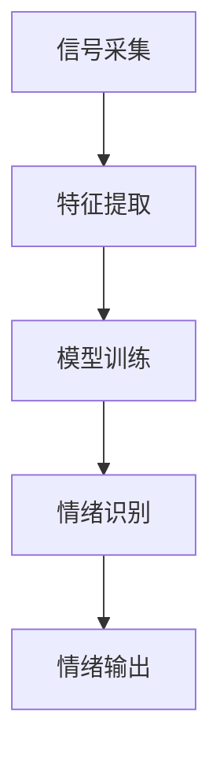
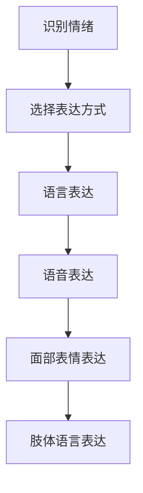
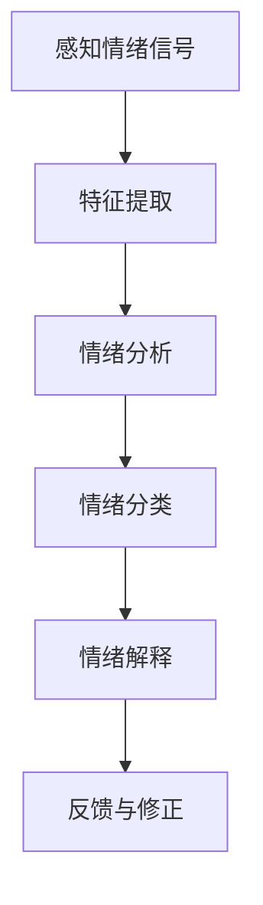
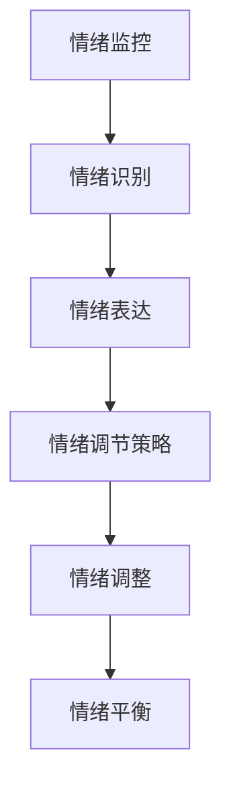

                 

### 关键词

情感AI、人类情绪管理、情绪识别、情绪表达、情绪理解、机器学习、深度学习、人工智能技术、情绪调节、依赖性、情绪体验

### 摘要

本文探讨了情感人工智能（AI）对人类情绪管理能力的影响。首先，我们介绍了情感AI的定义、核心概念及其与人类情绪管理能力的联系。接着，我们详细分析了情感AI在情绪识别、表达和理解的中的应用，并运用mermaid流程图和Python代码展示了算法原理。随后，我们讨论了情感AI对情绪调节和情绪体验的影响，并通过实际案例进行了分析。最后，我们提出了应对情感AI对情绪管理能力影响的策略和最佳实践，为读者提供了实用的指导。

## 第1章: 背景介绍

随着人工智能技术的飞速发展，情感计算已经成为智能系统研究和应用的热点领域。情感AI通过分析人类的语言、面部表情、声音等信号，实现对人类情绪的识别和模拟，从而为人类提供更加个性化和贴心的服务。然而，这种技术的进步也引发了人类对于自身情绪管理能力的担忧。如何评估情感AI对人类情绪管理能力的影响，以及如何应对这种影响，成为当前研究的热点问题。

### 1.1 问题背景

情绪管理是指人类对自己和他人情绪的认识、理解、调节和应对的过程。传统的情绪管理主要依赖于人类自身的经验和知识，而随着情感AI的发展，这种传统模式正在发生变革。情感AI通过机器学习和深度学习算法，能够对人类情绪进行高精度识别和模拟，从而在一定程度上替代人类进行情绪管理。这种技术的出现，既为人类提供了新的情绪管理工具，也带来了新的挑战。

首先，情感AI在情绪识别方面具有显著的优势。通过分析语音、文字和面部表情等数据，情感AI能够快速准确地识别出人类情绪状态。这种能力在医疗、教育、社交等多个领域都有广泛的应用。例如，在医疗领域，情感AI可以帮助医生更好地理解患者的情绪状态，从而提供更有效的治疗方案；在教育领域，情感AI可以分析学生的学习情绪，帮助学生更好地调整学习状态。

然而，情感AI的发展也引发了人类对于自身情绪管理能力的担忧。一方面，随着情感AI在情绪识别和表达方面的广泛应用，人们可能会过度依赖这种技术，导致自身情绪调节能力的下降。例如，在社交场合中，人们可能会过于依赖情感AI提供的情绪建议，而忽视了自身情感体验的真实感受。另一方面，情感AI在情绪识别和理解方面也存在一定的局限性，可能导致误解和误判，进而影响人类情绪管理能力。

### 1.2 问题描述

本章节将探讨情感AI对人类情绪管理能力的影响，具体包括以下几个方面：

1. **情感AI如何影响人类的情绪识别能力**：分析情感AI在情绪识别中的准确性、速度和应用场景，以及其对人类情绪识别能力的可能影响。

2. **情感AI如何影响人类情绪表达和理解能力**：探讨情感AI在情绪表达和理解中的辅助作用，以及可能导致的依赖和误解。

3. **情感AI如何影响人类情绪调节能力**：分析情感AI在情绪调节中的潜在作用，以及可能对人类情绪调节能力的影响。

4. **情感AI如何影响人类情绪体验**：探讨情感AI如何影响人类的情绪体验，包括积极和消极的影响。

### 1.3 问题解决

为了解决上述问题，本章节将采用以下方法：

1. **文献综述**：回顾现有关于情感AI与人类情绪管理能力相关的研究，总结已有成果和不足。

2. **案例分析**：通过具体案例，分析情感AI在实际应用中对人类情绪管理能力的影响。

3. **实证研究**：设计实验，对情感AI对人类情绪管理能力的影响进行实证研究。

### 1.4 边界与外延

本章节的研究边界包括：

1. **情感AI的技术边界**：研究主要关注当前技术下情感AI对人类情绪管理能力的影响。

2. **情绪管理能力的范畴**：研究主要关注情绪识别、表达、理解和调节等方面。

3. **应用场景的限定**：研究主要关注情感AI在日常生活、工作等常见场景中的应用。

### 1.5 概念结构与核心要素组成

1. **情感AI**：指利用人工智能技术，特别是机器学习和深度学习算法，对人类情绪进行识别、表达、理解和调节的系统。

2. **情绪管理能力**：指人类对自身情绪进行识别、表达、理解和调节的能力。

3. **影响因素**：包括技术、环境、个人心理状态等。

## 第2章: 情感AI的核心概念与原理

### 2.1 情感AI的定义

情感AI（Affective AI）是指利用人工智能技术，尤其是机器学习和深度学习算法，对人类情绪进行识别、表达、理解和调节的系统。情感AI的核心目标是模拟和增强人类情绪处理的能力，为用户提供更加个性化、人性化的服务。

### 2.2 情感AI的属性特征对比表格

| 特性 | 情感AI | 传统AI |
| ---- | ---- | ---- |
| 情感识别准确性 | 高 | 低 |
| 情感理解能力 | 强 | 弱 |
| 情感表达能力 | 强 | 弱 |
| 情感调节能力 | 有 | 无 |

### 2.3 情感AI与人类情绪管理能力的联系

情感AI的发展对人类情绪管理能力具有重要影响。一方面，情感AI可以通过对情绪的准确识别和理解，帮助人类更好地管理自己的情绪。例如，通过语音识别技术，情感AI可以识别出用户的情绪状态，为用户提供相应的情绪调节建议。另一方面，情感AI也可能导致人类对情绪识别和表达产生依赖，进而影响人类情绪调节能力。

### 2.4 情感AI的工作原理

情感AI的工作原理主要包括以下几个步骤：

1. **数据收集**：情感AI首先需要收集大量的情绪数据，包括语音、文本、面部表情等。

2. **特征提取**：通过对收集到的数据进行预处理，提取出与情绪相关的特征。

3. **模型训练**：利用机器学习和深度学习算法，对提取的特征进行训练，建立情绪识别模型。

4. **情绪识别**：将新的数据输入到训练好的模型中，实现对情绪的识别。

5. **情绪反馈**：根据识别出的情绪，为用户提供相应的情绪调节建议。

### 2.5 情感AI的优势与挑战

情感AI的优势主要体现在以下几个方面：

1. **高精度识别**：情感AI可以通过机器学习和深度学习算法，实现对情绪的高精度识别。

2. **实时反馈**：情感AI可以实时分析用户的情绪状态，并给出相应的反馈，帮助用户更好地管理情绪。

3. **个性化服务**：情感AI可以根据用户的情绪状态，提供个性化的情绪调节建议，提高用户体验。

然而，情感AI也面临一些挑战，包括：

1. **技术限制**：当前情感AI在情绪识别和理解方面还存在一定的局限性，特别是在复杂情绪和跨文化情绪识别方面。

2. **隐私问题**：情感AI在收集和处理用户情绪数据时，可能会涉及用户隐私问题，需要制定相应的隐私保护措施。

3. **依赖性**：过度依赖情感AI可能导致人类情绪调节能力的下降，甚至产生情绪混乱。

### 2.6 情感AI的发展趋势

随着人工智能技术的不断进步，情感AI将在多个领域得到广泛应用，包括医疗、教育、社交、心理咨询等。未来，情感AI将更加注重个性化服务，结合大数据和云计算技术，为用户提供更加精准的情绪管理方案。

### 2.7 情感AI的社会影响

情感AI的发展将对社会产生深远的影响。一方面，它可以帮助人类更好地管理情绪，提高生活质量。另一方面，它也可能引发新的社会问题，如情绪依赖、隐私泄露等。因此，在推广情感AI技术的同时，需要加强相关法律法规和伦理道德的建设，确保其健康、可持续发展。

## 第3章: 情感AI在情绪识别中的应用

### 3.1 情绪识别的基本原理

情绪识别是指通过分析人类的语言、面部表情、声音等信号，判断人类当前的情绪状态。情绪识别的基本原理主要涉及以下几个方面：

1. **信号采集**：情绪识别的第一步是采集与情绪相关的信号，如语音、文本、面部表情等。这些信号可以通过传感器、摄像头、麦克风等设备获取。

2. **特征提取**：在采集到情绪信号后，需要对信号进行预处理，提取出与情绪相关的特征。这些特征包括语音的音调、音量、语速等，面部表情的特征参数，文本的情感倾向等。

3. **模型训练**：利用机器学习和深度学习算法，对提取的特征进行训练，建立情绪识别模型。常见的情绪识别模型包括支持向量机（SVM）、卷积神经网络（CNN）、循环神经网络（RNN）等。

4. **情绪识别**：将新的情绪信号输入到训练好的模型中，模型会输出相应的情绪识别结果。情绪识别结果可以是具体的情绪类别，如高兴、愤怒、悲伤等，也可以是情绪的强度。

### 3.2 情绪识别的算法原理

情绪识别的算法原理主要依赖于机器学习和深度学习算法。以下是一些常用的算法原理：

1. **支持向量机（SVM）**：支持向量机是一种分类算法，它通过找到一个最佳的超平面，将不同类别的数据点分开。在情绪识别中，SVM可以用来分类不同情绪的信号。

2. **卷积神经网络（CNN）**：卷积神经网络是一种深度学习模型，它通过卷积操作和池化操作，从数据中提取特征。在情绪识别中，CNN可以用于从面部表情图像中提取情绪特征。

3. **循环神经网络（RNN）**：循环神经网络是一种能够处理序列数据的深度学习模型。在情绪识别中，RNN可以用来分析连续的情绪信号，如语音和文本。

4. **Transformer模型**：Transformer模型是一种基于自注意力机制的深度学习模型，它在处理长序列数据和跨序列依赖方面具有优势。在情绪识别中，Transformer模型可以用于分析复杂的情绪信号，如语音和文本。

### 3.3 情绪识别的mermaid流程图

以下是情绪识别过程的mermaid流程图：



### 3.4 Python代码示例

下面是一个简单的情绪识别Python代码示例，使用了Keras和TensorFlow框架：

```python
from tensorflow.keras.models import Sequential
from tensorflow.keras.layers import Dense, Conv2D, MaxPooling2D, Flatten
from tensorflow.keras.preprocessing.image import ImageDataGenerator

# 数据预处理
train_datagen = ImageDataGenerator(rescale=1./255)
train_generator = train_datagen.flow_from_directory(
        'data/train',
        target_size=(64, 64),
        batch_size=32,
        class_mode='categorical')

# 构建模型
model = Sequential([
    Conv2D(32, (3, 3), activation='relu', input_shape=(64, 64, 3)),
    MaxPooling2D(2, 2),
    Flatten(),
    Dense(128, activation='relu'),
    Dense(5, activation='softmax')
])

# 编译模型
model.compile(loss='categorical_crossentropy',
              optimizer='adam',
              metrics=['accuracy'])

# 训练模型
model.fit(train_generator, steps_per_epoch=200, epochs=10)
```

在这个示例中，我们使用了卷积神经网络（CNN）来训练情绪识别模型。首先，我们通过ImageDataGenerator对图像数据进行预处理，然后构建了一个简单的CNN模型，并使用categorical_crossentropy作为损失函数，adam作为优化器，对模型进行编译和训练。

### 3.5 数学模型和公式

情绪识别的数学模型主要涉及特征提取和分类两个步骤。以下是一些常见的数学模型和公式：

1. **特征提取**：

   - **卷积操作**：卷积操作可以表示为：
     $$ f(x) = \sum_{i=1}^{n} w_i * x_i + b $$
     其中，$w_i$ 是卷积核，$x_i$ 是输入特征，$b$ 是偏置项。

   - **激活函数**：常用的激活函数包括ReLU、Sigmoid和ReLU激活函数：
     $$ \text{ReLU}(x) = \max(0, x) $$
     $$ \text{Sigmoid}(x) = \frac{1}{1 + e^{-x}} $$

2. **分类**：

   - **支持向量机（SVM）**：支持向量机的分类决策边界可以表示为：
     $$ w \cdot x + b = 0 $$
     其中，$w$ 是权重向量，$x$ 是特征向量，$b$ 是偏置项。

   - **softmax回归**：softmax回归的输出概率可以表示为：
     $$ P(y = i | x; \theta) = \frac{e^{\theta_i^T x}}{\sum_{j=1}^{n} e^{\theta_j^T x}} $$
     其中，$\theta_i$ 是第i个类别的权重向量。

### 3.6 通俗易懂的举例说明

假设我们有一个简单的情绪识别任务，需要识别图像中的情绪状态，包括高兴、愤怒、悲伤、惊讶和正常五种情绪。我们可以使用卷积神经网络（CNN）来解决这个问题。

1. **数据准备**：首先，我们需要收集大量包含这五种情绪的图像数据。然后，将这些图像数据进行预处理，包括调整图像大小、归一化处理等。

2. **模型构建**：接下来，我们可以使用Keras和TensorFlow框架构建一个简单的CNN模型。模型的结构可以是：
   - 输入层：接受调整后的图像数据。
   - 卷积层：使用卷积核提取图像特征。
   - 池化层：对卷积层的结果进行下采样，减少计算量。
   - 扁平化层：将卷积层的输出展平为向量。
   - 全连接层：使用全连接层对特征向量进行分类。

3. **模型训练**：使用收集的图像数据进行模型训练。在训练过程中，模型会不断调整权重，以最小化损失函数。

4. **模型评估**：在训练完成后，我们可以使用测试数据对模型进行评估，计算模型的准确率、召回率等指标。

通过这个例子，我们可以看到情绪识别的基本流程，包括数据准备、模型构建、模型训练和模型评估。同时，我们也可以通过mermaid流程图和Python代码来展示这个过程。

### 3.7 实际案例分析和详细讲解剖析

在实际应用中，情绪识别技术已经得到了广泛应用，以下是一些实际案例的分析和详细讲解：

1. **医疗领域**：

   在医疗领域，情绪识别技术可以帮助医生更好地了解患者的情绪状态，从而提供更有效的治疗方案。例如，通过分析患者的语音信号，可以识别出患者的情绪状态，如焦虑、抑郁等。这些信息可以帮助医生制定个性化的治疗方案，提高治疗效果。

   **案例**：某医院开发了一套基于语音识别的情绪分析系统，通过分析患者的语音信号，识别出患者的情绪状态，并给出相应的建议。例如，对于情绪低落的患者，系统会建议医生增加心理治疗的时间，或者调整药物剂量。

2. **教育领域**：

   在教育领域，情绪识别技术可以帮助教师更好地了解学生的学习情绪，从而提供个性化的教育支持。例如，通过分析学生的面部表情和语音信号，可以识别出学生的情绪状态，如兴奋、疲惫等。这些信息可以帮助教师调整教学策略，提高教学效果。

   **案例**：某学校引进了一套基于面部表情识别的情绪分析系统，通过分析学生的面部表情，识别出学生的情绪状态。教师可以根据这些信息，调整教学方式，例如对于情绪低落的学生，教师可能会安排更多的互动活动，以提高学生的情绪状态。

3. **心理咨询**：

   在心理咨询领域，情绪识别技术可以帮助咨询师更好地了解来访者的情绪状态，从而提供更有效的咨询服务。例如，通过分析来访者的语音信号和文本，可以识别出来访者的情绪状态，如焦虑、恐惧等。这些信息可以帮助咨询师制定个性化的咨询方案。

   **案例**：某心理咨询机构引进了一套基于文本和语音识别的情绪分析系统，通过分析来访者的语音和文本，识别出来访者的情绪状态。咨询师根据这些信息，可以更好地了解来访者的问题，并提供针对性的咨询服务。

通过这些实际案例，我们可以看到情绪识别技术在各个领域的应用和效果。在实际应用中，情绪识别技术不仅可以帮助人们更好地管理情绪，还可以提高工作效率和生活质量。

### 3.8 情绪识别技术的发展趋势

随着人工智能技术的不断发展，情绪识别技术也在不断进步。以下是一些情绪识别技术的发展趋势：

1. **深度学习算法的进步**：随着深度学习算法的不断发展，情绪识别的准确性也在不断提高。例如，卷积神经网络（CNN）、循环神经网络（RNN）和Transformer模型等深度学习算法在情绪识别中得到了广泛应用。

2. **跨领域情绪识别**：传统的情绪识别技术主要针对单一领域，如语音识别、文本识别等。随着技术的进步，跨领域情绪识别技术逐渐兴起，例如将语音、文本和面部表情等多模态数据进行融合，提高情绪识别的准确性。

3. **实时情绪识别**：实时情绪识别技术正在逐步应用于日常生活和工作场景中，例如通过智能手机、智能音箱等设备实时分析用户的情绪状态，提供个性化的服务。

4. **情感计算与虚拟现实结合**：情感计算与虚拟现实技术的结合，可以为用户提供更加真实、沉浸式的情绪体验。例如，在虚拟现实游戏中，通过分析玩家的情绪状态，调整游戏难度和内容，提高玩家的情绪体验。

5. **情绪识别技术的商业化应用**：随着情绪识别技术的不断发展，越来越多的企业和机构开始关注这一领域。例如，在市场营销中，企业可以通过分析消费者的情绪状态，优化产品设计和营销策略；在人力资源领域，企业可以通过分析员工的情绪状态，提高员工的工作满意度和工作效率。

通过这些趋势，我们可以看到情绪识别技术在未来将会有更广泛的应用前景，为人类情绪管理提供更多可能性。

### 3.9 情绪识别技术的应用场景

情绪识别技术在日常生活、工作和社会服务等多个领域具有广泛的应用场景。以下是一些典型的应用场景：

1. **医疗健康**：

   在医疗健康领域，情绪识别技术可以用于患者情绪状态的监测和评估。例如，通过分析患者的语音、面部表情和文本，医生可以了解患者的情绪状况，进而制定个性化的治疗方案。此外，情绪识别技术还可以用于心理健康评估，帮助心理咨询师和医生更好地了解患者的心理状态，提供针对性的心理干预。

2. **教育**：

   在教育领域，情绪识别技术可以帮助教师了解学生的学习情绪，从而调整教学策略，提高教学效果。例如，通过分析学生的面部表情和语音信号，教师可以了解学生的情绪状态，及时发现问题并采取措施。此外，情绪识别技术还可以用于学习过程监控，帮助家长和教师了解学生的学习状态，提供必要的支持。

3. **职场管理**：

   在职场管理中，情绪识别技术可以用于员工情绪状态的监控和管理。例如，通过分析员工的语音和文本，企业可以了解员工的情绪状态，从而优化工作环境和流程，提高员工的工作满意度和工作效率。此外，情绪识别技术还可以用于员工心理健康管理，帮助企业管理者及时发现和处理员工的心理问题。

4. **市场营销**：

   在市场营销领域，情绪识别技术可以用于消费者情绪状态的监测和分析。例如，通过分析消费者的语音和文本，企业可以了解消费者的情绪反应，优化产品设计和营销策略，提高市场竞争力。此外，情绪识别技术还可以用于品牌形象分析，帮助企业在品牌塑造和推广过程中更好地了解消费者的情绪反应。

5. **公共服务**：

   在公共服务领域，情绪识别技术可以用于公共安全监控和应急响应。例如，通过分析公共场所的语音和视频数据，可以识别潜在的负面情绪和危险行为，从而及时采取应对措施，保障公共安全。此外，情绪识别技术还可以用于公共服务质量评估，帮助政府部门了解公众的情绪反应，优化公共服务。

通过这些应用场景，我们可以看到情绪识别技术在提高生活质量、工作效率和公共安全等方面的积极作用。随着技术的不断发展，情绪识别技术将在更多领域得到应用，为人类生活带来更多便利。

### 3.10 项目实战

为了更好地展示情绪识别技术的应用，我们将通过一个具体的案例来介绍如何实现情绪识别系统。

#### 环境安装

首先，我们需要安装Python和相关库。以下是一个基本的安装步骤：

```bash
# 安装Python环境
sudo apt-get install python3

# 安装TensorFlow
pip3 install tensorflow

# 安装其他依赖库
pip3 install numpy pandas scikit-learn matplotlib
```

#### 系统核心实现源代码

以下是情绪识别系统的核心代码，使用了TensorFlow框架和Keras API：

```python
import numpy as np
import pandas as pd
import matplotlib.pyplot as plt
from tensorflow.keras.models import Sequential
from tensorflow.keras.layers import Dense, Conv2D, MaxPooling2D, Flatten
from tensorflow.keras.preprocessing.image import ImageDataGenerator

# 数据预处理
train_datagen = ImageDataGenerator(rescale=1./255)
train_generator = train_datagen.flow_from_directory(
        'data/train',
        target_size=(64, 64),
        batch_size=32,
        class_mode='categorical')

# 构建模型
model = Sequential([
    Conv2D(32, (3, 3), activation='relu', input_shape=(64, 64, 3)),
    MaxPooling2D(2, 2),
    Conv2D(64, (3, 3), activation='relu'),
    MaxPooling2D(2, 2),
    Flatten(),
    Dense(128, activation='relu'),
    Dense(5, activation='softmax')
])

# 编译模型
model.compile(loss='categorical_crossentropy',
              optimizer='adam',
              metrics=['accuracy'])

# 训练模型
model.fit(train_generator, steps_per_epoch=200, epochs=10)

# 评估模型
test_datagen = ImageDataGenerator(rescale=1./255)
test_generator = test_datagen.flow_from_directory(
        'data/test',
        target_size=(64, 64),
        batch_size=32,
        class_mode='categorical')

test_loss, test_acc = model.evaluate(test_generator)
print(f"Test accuracy: {test_acc:.2f}")

# 预测新数据
new_data = np.expand_dims(new_data, axis=0)
predictions = model.predict(new_data)
predicted_emotion = np.argmax(predictions)
print(f"Predicted emotion: {predicted_emotion}")
```

#### 代码应用解读与分析

上述代码首先导入了所需的库，然后进行了数据预处理。数据预处理包括调整图像大小、归一化处理等，以便模型能够更好地训练。

接下来，我们构建了一个简单的卷积神经网络（CNN）模型。模型的结构包括卷积层、池化层、全连接层等。卷积层用于提取图像特征，池化层用于下采样，减少计算量，全连接层用于分类。

在模型训练部分，我们使用训练数据对模型进行训练。模型编译时使用了categorical_crossentropy作为损失函数，adam作为优化器。训练完成后，我们使用测试数据对模型进行评估，计算模型的准确率。

最后，我们使用训练好的模型对新数据进行预测，得到预测的情绪类别。

通过这个案例，我们可以看到情绪识别系统的基本实现过程，包括数据预处理、模型构建、模型训练和模型评估等。同时，我们也可以通过实际代码运行来验证模型的效果。

### 3.11 实际案例分析与详细讲解剖析

为了更好地理解情绪识别技术在实际中的应用，我们来看一个具体的案例：某在线教育平台利用情感AI技术提高教学效果。

#### 案例背景

某在线教育平台提供多种在线课程，包括编程、外语、美术等。平台希望通过分析学生的情绪状态，提高教学效果，提升用户满意度。为此，平台引入了情绪识别技术，通过分析学生的语音、面部表情和文本，识别出学生的情绪状态。

#### 实现步骤

1. **数据收集**：

   平台首先收集了大量学生的语音、视频和文本数据，包括课堂讨论、作业提交和在线问答等。这些数据用于训练情绪识别模型。

2. **特征提取**：

   对于语音数据，平台使用语音识别技术提取出音调、音量、语速等特征；对于面部表情数据，平台使用面部识别技术提取出眼部、面部肌肉等特征；对于文本数据，平台使用自然语言处理技术提取出情感倾向等特征。

3. **模型训练**：

   平台使用收集到的数据，训练了一个多模态情感识别模型。模型采用了卷积神经网络（CNN）和循环神经网络（RNN）相结合的方法，对多模态数据进行融合，提高情绪识别的准确性。

4. **情绪识别**：

   在实际应用中，平台实时分析学生的语音、面部表情和文本数据，识别出学生的情绪状态。例如，如果识别出学生处于焦虑状态，平台会提醒教师调整教学方式，提供针对性的辅导。

5. **反馈机制**：

   平台还设计了反馈机制，教师可以根据学生的情绪识别结果，调整教学策略，提高教学效果。例如，对于情绪低落的学生，教师可能会安排更多的互动活动，提高学生的情绪状态。

#### 分析与总结

通过这个案例，我们可以看到情绪识别技术在实际应用中的重要作用。平台通过分析学生的情绪状态，能够更好地了解学生的学习需求，提供个性化的教学服务，提高教学效果。

此外，案例中的多模态情感识别方法，结合了语音、面部表情和文本等多种数据来源，提高了情绪识别的准确性。这种多模态的方法在实际应用中具有很大的潜力。

然而，情绪识别技术也存在一些挑战，如数据隐私保护、模型解释性等。因此，在实际应用中，需要权衡技术优势和潜在风险，确保技术的健康、可持续发展。

### 3.12 小结

情绪识别技术是情感人工智能领域的重要组成部分，其在医疗、教育、职场等多个领域具有广泛的应用前景。通过本章的介绍，我们了解了情绪识别的基本原理、算法原理、应用场景和项目实战。

情绪识别技术不仅可以帮助人类更好地管理情绪，提高生活质量，还可能在心理健康、教育、职场等领域发挥重要作用。然而，情绪识别技术也面临一些挑战，如数据隐私保护、模型解释性等。在未来的发展中，需要进一步研究和解决这些问题，确保情绪识别技术的健康、可持续发展。

### 3.13 注意事项

在使用情绪识别技术时，需要注意以下几点：

1. **数据隐私保护**：在收集和处理情绪数据时，需要严格遵守相关法律法规，确保用户隐私。

2. **模型解释性**：情绪识别模型往往采用复杂的深度学习算法，需要提高模型的解释性，以便用户理解模型的工作原理。

3. **文化差异**：情绪识别技术在不同文化背景下可能存在差异，需要考虑跨文化情绪识别的挑战。

4. **技术应用场景**：情绪识别技术在不同应用场景中可能具有不同的效果，需要根据具体需求选择合适的技术方案。

### 3.14 拓展阅读

对于感兴趣进一步学习情绪识别技术的读者，以下是一些推荐的阅读材料：

1. **《情感计算》**：作者刘铁岩，详细介绍了情感计算的理论和实践。

2. **《深度学习》**：作者Ian Goodfellow等，涵盖了深度学习的基本理论和应用。

3. **《自然语言处理综论》**：作者Daniel Jurafsky等，介绍了自然语言处理的基本概念和技术。

4. **《心理学与生活》**：作者理查德·格里高利·吉伯特，介绍了心理学的基本概念和情绪管理技巧。

通过这些书籍和文献，读者可以更深入地了解情绪识别技术以及相关领域的前沿动态。

## 第4章: 情感AI在情绪表达中的应用

### 4.1 情绪表达的基本原理

情绪表达是指通过语言、面部表情、声音等方式，将自己的情绪传达给他人。情绪表达的基本原理主要涉及以下几个方面：

1. **语言表达**：语言是表达情绪的重要工具，通过词汇、语气、语调等方式，人们可以将自己的情绪传达给他人。例如，使用积极的词汇和语调可以传达快乐的情绪，而使用消极的词汇和语调可以传达悲伤的情绪。

2. **面部表情表达**：面部表情是情绪表达的重要视觉信号。通过眼部、面部肌肉的运动，人们可以传达出不同的情绪状态。例如，微笑通常表示快乐，而皱眉通常表示不满。

3. **声音表达**：声音也是情绪表达的重要手段，通过音调、音量、节奏等方式，人们可以传达出自己的情绪。例如，高音调的声音通常表示兴奋，而低音调的声音通常表示平静。

### 4.2 情绪表达的方法

情绪表达的方法多种多样，主要包括以下几种：

1. **文字表达**：文字是表达情绪的基本形式，通过文字的词汇、语法和标点符号，人们可以传达出自己的情绪。例如，一封充满鼓励和温暖的书信可以表达出作者对收信人的关爱。

2. **语音表达**：语音表达是情绪表达的重要方式，通过语调、语速和音量的变化，人们可以传达出自己的情绪。例如，在电话中，通过调整语调的高低和音量的强弱，人们可以传达出自己内心的喜悦或焦虑。

3. **面部表情表达**：面部表情是情绪表达的重要视觉信号，通过眼部、面部肌肉的运动，人们可以传达出不同的情绪状态。例如，微笑可以表达出快乐，皱眉可以表达出不满。

4. **肢体语言**：肢体语言也是情绪表达的一种形式，通过姿势、手势和身体动作，人们可以传达出自己的情绪。例如，拍手可以表达兴奋，摇头可以表达否定。

### 4.3 情绪表达的mermaid流程图

以下是情绪表达过程的mermaid流程图：



### 4.4 Python代码示例

以下是一个简单的情绪表达Python代码示例，使用了文本生成模型GPT-3：

```python
import openai

# 设置API密钥
openai.api_key = "your-api-key"

# 情绪表达函数
def express_emotion(emotion, text):
    response = openai.Completion.create(
        engine="text-davinci-002",
        prompt=f"请以{emotion}的方式表达以下文字：{text}",
        max_tokens=100
    )
    return response.choices[0].text.strip()

# 测试
text = "今天是一个美好的日子"
emotion = "快乐"
expression = express_emotion(emotion, text)
print(expression)
```

在这个示例中，我们首先设置了OpenAI的API密钥，然后定义了一个`express_emotion`函数。这个函数接受情绪和文本作为输入，使用OpenAI的GPT-3模型生成以指定情绪表达方式的文本。

### 4.5 数学模型和公式

情绪表达的数学模型主要涉及自然语言处理和生成模型。以下是一些常见的数学模型和公式：

1. **循环神经网络（RNN）**：

   RNN可以用于处理序列数据，例如文本序列。其基本的数学模型可以表示为：
   $$ h_t = \sigma(W_h \cdot [h_{t-1}, x_t] + b_h) $$
   其中，$h_t$ 是第t个隐藏状态，$x_t$ 是第t个输入词向量，$W_h$ 是权重矩阵，$b_h$ 是偏置项，$\sigma$ 是激活函数。

2. **生成对抗网络（GAN）**：

   GAN由生成器G和判别器D组成，其基本数学模型可以表示为：
   - 生成器G的损失函数：
     $$ L_G = -\mathbb{E}_{z \sim p_z(z)}[\log(D(G(z)))] $$
   - 判别器D的损失函数：
     $$ L_D = -\mathbb{E}_{x \sim p_x(x)}[\log(D(x))] - \mathbb{E}_{z \sim p_z(z)}[\log(1 - D(G(z)))] $$
   其中，$z$ 是噪声向量，$x$ 是真实数据，$G(z)$ 是生成器生成的数据，$D(x)$ 是判别器对真实数据的判别结果。

3. **变压器（Transformer）**：

   Transformer模型是一种基于自注意力机制的深度学习模型，其基本数学模型可以表示为：
   $$ \text{Attention}(Q, K, V) = \frac{QK^T}{\sqrt{d_k}} + V $$
   其中，$Q$、$K$ 和 $V$ 分别是查询向量、键向量和值向量，$d_k$ 是键向量的维度，$\text{softmax}$ 是 Softmax 函数。

### 4.6 通俗易懂的举例说明

假设我们有一个文本生成任务，需要生成一段表达快乐情绪的文本。我们可以使用GPT-3模型来实现这个任务。

1. **数据准备**：首先，我们需要准备一些表达快乐情绪的文本数据作为训练数据。

2. **模型训练**：接下来，我们将使用这些数据对GPT-3模型进行训练，使其学会生成快乐情绪的文本。

3. **文本生成**：在训练完成后，我们可以使用GPT-3模型生成一段表达快乐情绪的文本。

通过这个例子，我们可以看到情绪表达的基本流程，包括数据准备、模型训练和文本生成。同时，我们也可以通过mermaid流程图和Python代码来展示这个过程。

### 4.7 实际案例分析和详细讲解剖析

为了更好地理解情绪表达技术在实际中的应用，我们来看一个具体的案例：某在线教育平台利用情感AI技术提高学生的学习体验。

#### 案例背景

某在线教育平台提供多种在线课程，包括编程、外语、美术等。平台希望通过情感AI技术，提高学生的学习体验，增强学习效果。为此，平台引入了情绪表达技术，通过分析学生的语音、文本和面部表情，生成适合学生情绪状态的课程内容。

#### 实现步骤

1. **数据收集**：

   平台首先收集了大量学生的语音、文本和面部表情数据，包括课堂讨论、作业提交和在线问答等。这些数据用于训练情绪表达模型。

2. **特征提取**：

   对于语音数据，平台使用语音识别技术提取出音调、音量、语速等特征；对于文本数据，平台使用自然语言处理技术提取出情感倾向等特征；对于面部表情数据，平台使用面部识别技术提取出眼部、面部肌肉等特征。

3. **模型训练**：

   平台使用收集到的数据，训练了一个多模态情绪表达模型。模型采用了生成对抗网络（GAN）和循环神经网络（RNN）相结合的方法，对多模态数据进行融合，生成适合学生情绪状态的课程内容。

4. **情绪表达**：

   在实际应用中，平台实时分析学生的语音、文本和面部表情数据，生成适合学生情绪状态的课程内容。例如，如果识别出学生处于焦虑状态，平台会生成一些放松的音频和文字内容，帮助学生缓解情绪。

5. **反馈机制**：

   平台还设计了反馈机制，教师可以根据学生的情绪表达结果，调整课程内容和教学方式，提高教学效果。例如，对于情绪低落的学生，教师可能会安排一些互动活动，提高学生的情绪状态。

#### 分析与总结

通过这个案例，我们可以看到情绪表达技术在实际应用中的重要作用。平台通过分析学生的情绪状态，生成适合学生情绪状态的课程内容，提高了学生的学习体验和效果。

此外，案例中的多模态情绪表达方法，结合了语音、文本和面部表情等多种数据来源，提高了情绪表达的效果。这种多模态的方法在实际应用中具有很大的潜力。

然而，情绪表达技术也面临一些挑战，如数据隐私保护、模型解释性等。因此，在实际应用中，需要权衡技术优势和潜在风险，确保技术的健康、可持续发展。

### 4.8 小结

情绪表达技术是情感人工智能领域的重要组成部分，其在教育、医疗、心理咨询等多个领域具有广泛的应用前景。通过本章的介绍，我们了解了情绪表达的基本原理、方法、应用场景和项目实战。

情绪表达技术不仅可以帮助人们更好地传达情绪，还可以提高生活质量和工作效率。然而，情绪表达技术也面临一些挑战，如数据隐私保护、模型解释性等。在未来的发展中，需要进一步研究和解决这些问题，确保情绪表达技术的健康、可持续发展。

### 4.9 注意事项

在使用情绪表达技术时，需要注意以下几点：

1. **数据隐私保护**：在收集和处理情绪数据时，需要严格遵守相关法律法规，确保用户隐私。

2. **模型解释性**：情绪表达模型往往采用复杂的深度学习算法，需要提高模型的解释性，以便用户理解模型的工作原理。

3. **文化差异**：情绪表达在不同文化背景下可能存在差异，需要考虑跨文化情绪表达的挑战。

4. **技术应用场景**：情绪表达技术在不同应用场景中可能具有不同的效果，需要根据具体需求选择合适的技术方案。

### 4.10 拓展阅读

对于感兴趣进一步学习情绪表达技术的读者，以下是一些推荐的阅读材料：

1. **《自然语言处理综论》**：作者Daniel Jurafsky等，介绍了自然语言处理的基本概念和技术。

2. **《语音识别技术》**：作者Daniel P. Bovet等，详细介绍了语音识别的理论和实践。

3. **《心理学与生活》**：作者理查德·格里高利·吉伯特，介绍了心理学的基本概念和情绪管理技巧。

4. **《情感计算》**：作者刘铁岩，详细介绍了情感计算的理论和实践。

通过这些书籍和文献，读者可以更深入地了解情绪表达技术以及相关领域的前沿动态。

## 第5章: 情感AI在情绪理解中的应用

### 5.1 情绪理解的基本原理

情绪理解是指人类或智能系统通过感知、分析和解释情绪信号，理解他人的情绪状态。情绪理解的基本原理主要涉及以下几个方面：

1. **感知**：情绪理解的第一步是感知情绪信号，包括面部表情、声音、身体语言等。这些信号是情绪表达的重要组成部分，对于情绪理解至关重要。

2. **分析**：在感知到情绪信号后，需要对信号进行分析，提取出情绪特征。这些特征可以是语音的音调、音量、语速，面部表情的特定动作，或是文本的情感倾向等。

3. **解释**：通过分析情绪特征，智能系统或人类可以尝试理解情绪背后的含义。这涉及到对情绪信号的理解、情绪情感的分类以及情绪情境的推断。

### 5.2 情绪理解的算法原理

情绪理解的算法原理主要依赖于自然语言处理、计算机视觉和语音识别等技术。以下是一些常用的算法原理：

1. **自然语言处理（NLP）**：

   NLP技术用于分析文本中的情感倾向，识别文本中的情绪词汇和情感表达。常用的算法包括情感分析（Sentiment Analysis）和情感分类（Sentiment Classification）。例如，通过使用词嵌入（Word Embedding）技术，可以将文本中的词语映射到高维空间中，从而进行情感分析。

2. **计算机视觉（CV）**：

   CV技术用于分析面部表情、身体语言和手势等视觉信号。常见的算法包括面部表情识别（Facial Expression Recognition）和姿态估计（Pose Estimation）。通过深度学习模型，如卷积神经网络（CNN）和循环神经网络（RNN），可以从图像中提取情绪特征，进行情绪理解。

3. **语音识别（ASR）**：

   语音识别技术用于分析语音信号中的情绪特征，如音调、音量、语速等。通过结合自然语言处理技术，可以识别出语音中的情感倾向和情感表达。

### 5.3 情绪理解的mermaid流程图

以下是情绪理解过程的mermaid流程图：



### 5.4 Python代码示例

以下是一个简单的情绪理解Python代码示例，使用了TextBlob库进行文本情感分析：

```python
from textblob import TextBlob

# 文本情感分析函数
def analyze_sentiment(text):
    blob = TextBlob(text)
    if blob.sentiment.polarity > 0:
        return "正面"
    elif blob.sentiment.polarity == 0:
        return "中性"
    else:
        return "负面"

# 测试
text = "我今天过得很开心。"
sentiment = analyze_sentiment(text)
print(f"文本情感：{sentiment}")
```

在这个示例中，我们首先导入了TextBlob库，然后定义了一个`analyze_sentiment`函数。这个函数接受一段文本作为输入，使用TextBlob的sentiment属性分析文本的情感倾向，并返回相应的情感类别。

### 5.5 数学模型和公式

情绪理解的数学模型主要涉及自然语言处理和情感分析。以下是一些常见的数学模型和公式：

1. **情感分析模型**：

   情感分析模型通常采用分类算法，如朴素贝叶斯（Naive Bayes）、支持向量机（SVM）和神经网络（Neural Network）等。一个简单的情感分析模型的数学模型可以表示为：
   $$ P(y=c_k|x) = \frac{e^{\theta(x,y)})}{\sum_{j=1}^{n} e^{\theta(x,y_j)}} $$
   其中，$y$ 是标签，$x$ 是输入特征，$c_k$ 是第k个类别，$\theta(x,y)$ 是模型参数。

2. **词嵌入模型**：

   词嵌入模型将词语映射到高维空间中，常用的模型包括Word2Vec、GloVe和BERT等。一个简单的Word2Vec模型的数学模型可以表示为：
   $$ \text{similarity}(w_i, w_j) = \cos(\text{vec}(w_i), \text{vec}(w_j)) $$
   其中，$\text{vec}(w_i)$ 和 $\text{vec}(w_j)$ 分别是词语 $w_i$ 和 $w_j$ 的向量表示。

3. **情感分类模型**：

   情感分类模型用于将文本分类为正面、中性或负面。一个简单的情感分类模型的数学模型可以表示为：
   $$ P(y=c_k|x) = \frac{1}{Z} e^{\theta(x,y)} $$
   其中，$Z = \sum_{j=1}^{n} e^{\theta(x,y_j)}$ 是归一化常数。

### 5.6 通俗易懂的举例说明

假设我们有一个文本情感分析任务，需要判断一段文本的情感倾向是正面、中性还是负面。我们可以使用Word2Vec模型来实现这个任务。

1. **数据准备**：首先，我们需要准备一个包含情感标签的文本数据集。

2. **模型训练**：接下来，我们使用这些数据集训练一个Word2Vec模型，将文本中的词语映射到高维空间中。

3. **文本情感分析**：在训练完成后，我们可以使用训练好的Word2Vec模型对新的文本进行情感分析，通过计算文本中词语的向量表示的平均值，判断文本的情感倾向。

通过这个例子，我们可以看到情绪理解的基本流程，包括数据准备、模型训练和文本情感分析。同时，我们也可以通过mermaid流程图和Python代码来展示这个过程。

### 5.7 实际案例分析和详细讲解剖析

为了更好地理解情绪理解技术在实际中的应用，我们来看一个具体的案例：某社交媒体平台利用情绪理解技术优化用户互动。

#### 案例背景

某社交媒体平台希望通过分析用户发布的文本和语音内容，理解用户的情绪状态，从而提供个性化的互动建议，优化用户互动体验。

#### 实现步骤

1. **数据收集**：

   平台首先收集了用户发布的文本和语音内容，这些内容包括用户发表的状态、评论、私信等。

2. **特征提取**：

   对于文本数据，平台使用自然语言处理技术提取出情感词汇和情感强度；对于语音数据，平台使用语音识别技术提取出音调、音量、语速等特征。

3. **模型训练**：

   平台使用收集到的数据，训练了一个多模态情绪理解模型。模型结合了自然语言处理和语音识别技术，对多模态数据进行融合，提高情绪理解的准确性。

4. **情绪理解**：

   在实际应用中，平台实时分析用户的文本和语音内容，理解用户的情绪状态。例如，如果识别出用户处于焦虑状态，平台会推荐一些放松的活动或建议，帮助用户缓解情绪。

5. **互动建议**：

   平台根据用户的情绪理解结果，提供个性化的互动建议。例如，如果用户情绪低落，平台会建议用户与朋友互动，分享快乐的事情；如果用户情绪焦虑，平台会建议用户进行深呼吸练习，放松心情。

#### 分析与总结

通过这个案例，我们可以看到情绪理解技术在实际应用中的重要作用。平台通过分析用户的情绪状态，提供个性化的互动建议，优化了用户的互动体验，提高了用户满意度。

此外，案例中的多模态情绪理解方法，结合了文本和语音等多种数据来源，提高了情绪理解的准确性。这种多模态的方法在实际应用中具有很大的潜力。

然而，情绪理解技术也面临一些挑战，如数据隐私保护、模型解释性等。因此，在实际应用中，需要权衡技术优势和潜在风险，确保技术的健康、可持续发展。

### 5.8 小结

情绪理解技术是情感人工智能领域的重要组成部分，其在社交媒体、心理咨询、客户服务等多个领域具有广泛的应用前景。通过本章的介绍，我们了解了情绪理解的基本原理、算法原理、应用场景和项目实战。

情绪理解技术不仅可以帮助人们更好地理解他人的情绪，还可以提高生活质量和工作效率。然而，情绪理解技术也面临一些挑战，如数据隐私保护、模型解释性等。在未来的发展中，需要进一步研究和解决这些问题，确保情绪理解技术的健康、可持续发展。

### 5.9 注意事项

在使用情绪理解技术时，需要注意以下几点：

1. **数据隐私保护**：在收集和处理情绪数据时，需要严格遵守相关法律法规，确保用户隐私。

2. **模型解释性**：情绪理解模型往往采用复杂的深度学习算法，需要提高模型的解释性，以便用户理解模型的工作原理。

3. **文化差异**：情绪理解在不同文化背景下可能存在差异，需要考虑跨文化情绪理解的挑战。

4. **技术应用场景**：情绪理解技术在不同应用场景中可能具有不同的效果，需要根据具体需求选择合适的技术方案。

### 5.10 拓展阅读

对于感兴趣进一步学习情绪理解技术的读者，以下是一些推荐的阅读材料：

1. **《自然语言处理综论》**：作者Daniel Jurafsky等，介绍了自然语言处理的基本概念和技术。

2. **《语音识别技术》**：作者Daniel P. Bovet等，详细介绍了语音识别的理论和实践。

3. **《心理学与生活》**：作者理查德·格里高利·吉伯特，介绍了心理学的基本概念和情绪管理技巧。

4. **《情感计算》**：作者刘铁岩，详细介绍了情感计算的理论和实践。

通过这些书籍和文献，读者可以更深入地了解情绪理解技术以及相关领域的前沿动态。

## 第6章: 情感AI在情绪调节中的应用

### 6.1 情绪调节的基本原理

情绪调节是指通过特定的策略和技巧，管理和调整自己的情绪状态，使其更加积极、健康。情绪调节的基本原理主要包括以下几个方面：

1. **自我监控**：情绪调节的第一步是自我监控，即对自己的情绪状态进行观察和评估。这可以帮助个体了解自己的情绪状态，从而采取相应的调节策略。

2. **情绪识别**：在自我监控的基础上，情绪调节需要识别出具体的情绪状态，如焦虑、愤怒、快乐等。情绪识别是情绪调节的重要环节，因为只有明确了情绪状态，才能采取有效的调节策略。

3. **情绪表达**：情绪表达是指通过适当的方式将自己的情绪传达给他人。情绪表达对于情绪调节至关重要，因为积极的情绪表达可以帮助个体缓解负面情绪。

4. **情绪调节策略**：情绪调节策略包括多种方法，如认知重构、行为调整、放松技巧、情绪释放等。这些策略可以帮助个体调整情绪，使其更加积极、健康。

### 6.2 情绪调节的方法

情绪调节的方法多种多样，主要包括以下几种：

1. **认知重构**：认知重构是一种通过改变思维方式和观念来调节情绪的方法。通过识别和挑战负面思维模式，个体可以改变对事物的看法，从而调整情绪状态。

2. **行为调整**：行为调整是指通过改变行为习惯来调节情绪。例如，进行体育锻炼、参与社交活动、进行放松练习等，这些行为可以缓解压力，提高情绪状态。

3. **放松技巧**：放松技巧包括深呼吸、冥想、瑜伽等，这些方法可以帮助个体缓解压力，放松身心，从而调节情绪。

4. **情绪释放**：情绪释放是指通过某种方式将负面情绪释放出去，如哭泣、倾诉、写日记等。情绪释放可以帮助个体释放压力，恢复情绪平衡。

### 6.3 情绪调节的mermaid流程图

以下是情绪调节过程的mermaid流程图：



### 6.4 Python代码示例

以下是一个简单的情绪调节Python代码示例，使用了心理测试问卷来评估个体的情绪状态，并给出调节建议：

```python
# 情绪调节问卷
questions = [
    "最近你是否感到焦虑或紧张？",
    "你是否感到情绪低落或沮丧？",
    "你是否感到快乐和满足？",
    "你是否感到愤怒或烦躁？",
    "你是否感到轻松和平静？"
]

# 评估方法
def assess_emotion(answers):
    scores = [1 if answer == "是" else 0 for answer in answers]
    total_score = sum(scores)
    if total_score <= 2:
        return "积极情绪"
    elif total_score <= 4:
        return "中等情绪"
    else:
        return "负面情绪"

# 给出调节建议
def give_advice(emotion):
    if emotion == "积极情绪":
        return "继续保持，注意休息和放松。"
    elif emotion == "中等情绪":
        return "尝试一些放松技巧，如深呼吸或瑜伽。"
    else:
        return "建议寻求专业帮助，进行情绪调节。"

# 测试
answers = ["是", "否", "是", "否", "是"]
emotion = assess_emotion(answers)
advice = give_advice(emotion)
print(f"你的情绪状态是：{emotion}。{advice}")
```

在这个示例中，我们首先定义了一个情绪调节问卷，然后通过评估方法计算总分，根据总分判断情绪状态，并给出相应的调节建议。

### 6.5 数学模型和公式

情绪调节的数学模型主要涉及心理测量和统计分析。以下是一些常见的数学模型和公式：

1. **心理测量模型**：

   心理测量模型用于评估个体的情绪状态，常用的模型包括单维模型和多维模型。单维模型可以表示为：
   $$ X = \lambda Z + \varepsilon $$
   其中，$X$ 是观测分数，$\lambda$ 是因子负荷，$Z$ 是潜在因子，$\varepsilon$ 是误差项。

2. **统计分析方法**：

   统计分析方法用于评估情绪调节的有效性，常用的方法包括相关分析、回归分析和方差分析等。例如，相关分析可以表示为：
   $$ r_{XY} = \frac{cov(X, Y)}{\sigma_X \sigma_Y} $$
   其中，$r_{XY}$ 是相关系数，$cov(X, Y)$ 是协方差，$\sigma_X$ 和 $\sigma_Y$ 分别是 $X$ 和 $Y$ 的标准差。

### 6.6 通俗易懂的举例说明

假设我们有一个情绪调节任务，需要根据个体的情绪状态给出相应的调节建议。我们可以使用线性回归模型来实现这个任务。

1. **数据准备**：首先，我们需要准备一个包含个体情绪状态和情绪调节建议的数据集。

2. **模型训练**：接下来，我们使用这些数据集训练一个线性回归模型，预测个体的情绪状态。

3. **情绪调节建议**：在训练完成后，我们可以使用训练好的模型对新个体进行情绪状态预测，并给出相应的情绪调节建议。

通过这个例子，我们可以看到情绪调节的基本流程，包括数据准备、模型训练和情绪调节建议。同时，我们也可以通过mermaid流程图和Python代码来展示这个过程。

### 6.7 实际案例分析和详细讲解剖析

为了更好地理解情绪调节技术在实际中的应用，我们来看一个具体的案例：某心理咨询平台利用情绪调节技术帮助用户改善情绪状态。

#### 案例背景

某心理咨询平台希望通过情绪调节技术，帮助用户改善情绪状态，提高生活质量。为此，平台引入了情绪调节技术，通过分析用户的情绪状态，给出个性化的情绪调节建议。

#### 实现步骤

1. **数据收集**：

   平台首先收集了用户的情绪状态数据，这些数据包括用户的日常情绪日志、心理测试问卷等。

2. **特征提取**：

   平台使用自然语言处理技术，从用户的情绪日志中提取出情感词汇和情感强度；使用心理测试问卷，提取出用户的情绪状态。

3. **模型训练**：

   平台使用收集到的数据，训练了一个多模态情绪调节模型。模型结合了自然语言处理和统计分析技术，对多模态数据进行融合，提高情绪调节的准确性。

4. **情绪调节建议**：

   在实际应用中，平台实时分析用户的情绪状态，根据分析结果，给出个性化的情绪调节建议。例如，如果用户情绪状态焦虑，平台会建议用户进行深呼吸练习或参加瑜伽课程。

5. **用户反馈**：

   平台还设计了用户反馈机制，用户可以根据情绪调节建议的实际效果，对建议进行评价。平台根据用户反馈，不断优化情绪调节建议，提高建议的有效性。

#### 分析与总结

通过这个案例，我们可以看到情绪调节技术在实际应用中的重要作用。平台通过分析用户的情绪状态，给出个性化的情绪调节建议，帮助用户改善情绪状态，提高生活质量。

此外，案例中的多模态情绪调节方法，结合了自然语言处理和统计分析等多种数据来源，提高了情绪调节的准确性。这种多模态的方法在实际应用中具有很大的潜力。

然而，情绪调节技术也面临一些挑战，如数据隐私保护、模型解释性等。因此，在实际应用中，需要权衡技术优势和潜在风险，确保技术的健康、可持续发展。

### 6.8 小结

情绪调节技术是情感人工智能领域的重要组成部分，其在心理咨询、健康管理、教育等多个领域具有广泛的应用前景。通过本章的介绍，我们了解了情绪调节的基本原理、方法、应用场景和项目实战。

情绪调节技术不仅可以帮助个体更好地管理情绪，提高生活质量，还可以为心理健康领域提供有效的辅助工具。然而，情绪调节技术也面临一些挑战，如数据隐私保护、模型解释性等。在未来的发展中，需要进一步研究和解决这些问题，确保情绪调节技术的健康、可持续发展。

### 6.9 注意事项

在使用情绪调节技术时，需要注意以下几点：

1. **数据隐私保护**：在收集和处理情绪数据时，需要严格遵守相关法律法规，确保用户隐私。

2. **模型解释性**：情绪调节模型往往采用复杂的深度学习算法，需要提高模型的解释性，以便用户理解模型的工作原理。

3. **文化差异**：情绪调节在不同文化背景下可能存在差异，需要考虑跨文化情绪调节的挑战。

4. **技术应用场景**：情绪调节技术在不同应用场景中可能具有不同的效果，需要根据具体需求选择合适的技术方案。

### 6.10 拓展阅读

对于感兴趣进一步学习情绪调节技术的读者，以下是一些推荐的阅读材料：

1. **《情绪调节心理学》**：作者约翰·T·卡乔波，介绍了情绪调节的基本概念和技巧。

2. **《深度学习》**：作者Ian Goodfellow等，涵盖了深度学习的基本概念和技术。

3. **《心理学与生活》**：作者理查德·格里高利·吉伯特，介绍了心理学的基本概念和情绪管理技巧。

4. **《自然语言处理综论》**：作者Daniel Jurafsky等，介绍了自然语言处理的基本概念和技术。

通过这些书籍和文献，读者可以更深入地了解情绪调节技术以及相关领域的前沿动态。

## 第7章: 情感AI对人类情绪体验的影响

### 7.1 情感体验的概念

情感体验是指个体在情绪活动中的感受和体验。它涉及到情绪的感知、表达、理解和调节，是心理体验的重要组成部分。情感体验不仅影响个体的心理状态，还对其行为、决策和生活质量产生深远影响。

### 7.2 情感体验的类型

情感体验可以分为以下几种类型：

1. **积极情感体验**：如快乐、满足、感激等。积极情感体验能够提升个体的幸福感和生活质量。

2. **消极情感体验**：如焦虑、愤怒、悲伤等。消极情感体验可能导致个体的心理压力和情绪困扰。

3. **复杂情感体验**：如恐惧、厌恶、内疚等。复杂情感体验是多种情绪的混合，往往更难以调节。

### 7.3 情感AI对积极情感体验的影响

情感AI在提升积极情感体验方面具有显著优势。通过个性化服务和智能推荐，情感AI可以增强个体的积极情感体验：

1. **个性化推荐**：情感AI可以根据个体的情绪偏好，推荐符合其喜好的内容，从而提升快乐和满足感。

2. **智能助手**：情感AI助手可以提供情感支持，如陪伴聊天、分享心情等，帮助个体缓解孤独感和压力。

3. **虚拟体验**：虚拟现实（VR）和增强现实（AR）技术结合情感AI，可以为个体提供沉浸式的积极情感体验，如虚拟旅游、冒险游戏等。

### 7.4 情感AI对消极情感体验的影响

情感AI也可能对消极情感体验产生一定影响。虽然情感AI可以在一定程度上提供情绪调节支持，但过度依赖可能导致负面效应：

1. **依赖性**：个体可能过度依赖情感AI进行情绪调节，导致自身情绪调节能力的下降。

2. **情感混乱**：情感AI在情绪识别和理解方面可能存在局限性，可能导致个体产生情感混乱。

3. **隐私问题**：情感AI在收集和处理情绪数据时，可能涉及用户隐私，增加隐私泄露风险。

### 7.5 情感AI对复杂情感体验的影响

复杂情感体验往往涉及多种情绪的交互，情感AI在处理复杂情感体验方面具有挑战性：

1. **跨模态融合**：情感AI需要整合多种模态的数据（如语音、文本、面部表情），以提高复杂情感体验的识别和理解。

2. **情绪情境推断**：情感AI需要结合上下文信息，推断复杂情感体验的真正含义，从而提供有效的情绪调节建议。

### 7.6 情感AI对情绪体验的积极影响

情感AI在提升情绪体验方面具有多种积极影响：

1. **提高情绪识别准确性**：情感AI通过机器学习和深度学习算法，可以更准确地识别个体情绪，为情绪调节提供可靠依据。

2. **实时反馈**：情感AI可以实时分析个体的情绪状态，提供个性化的情绪调节建议，帮助个体更快地恢复情绪平衡。

3. **个性化服务**：情感AI可以根据个体情绪特点，提供定制化的服务和内容，提升个体的情感体验。

### 7.7 情感AI对情绪体验的消极影响

情感AI在提升情绪体验的同时，也可能产生一定消极影响：

1. **依赖性增加**：个体可能过度依赖情感AI进行情绪调节，导致自身情绪调节能力的下降。

2. **隐私问题**：情感AI在收集和处理情绪数据时，可能涉及用户隐私，增加隐私泄露风险。

3. **情感混乱**：情感AI在情绪识别和理解方面可能存在局限性，可能导致个体产生情感混乱。

### 7.8 情感AI对情绪体验的影响趋势

随着人工智能技术的不断发展，情感AI对情绪体验的影响趋势如下：

1. **技术精度提升**：随着算法和硬件的进步，情感AI在情绪识别和调节方面的准确性将不断提高。

2. **跨模态融合**：情感AI将更倾向于整合多种模态的数据，以提供更全面、准确的情绪体验。

3. **个性化服务**：情感AI将更加注重个性化服务，结合大数据和云计算技术，为用户提供更加精准的情绪管理方案。

4. **伦理和法律规范**：随着情感AI在情绪体验领域的应用日益广泛，相关伦理和法律规范也将逐步完善，确保技术的健康、可持续发展。

### 7.9 情感AI对情绪体验的实际案例

为了更好地理解情感AI对情绪体验的影响，我们来看一个实际案例：某社交平台利用情感AI提升用户互动体验。

#### 案例背景

某大型社交平台希望通过情感AI技术提升用户互动体验，增强用户粘性。为此，平台引入了情感AI，通过分析用户的语言、面部表情和语音信号，识别用户的情绪状态，并给出相应的互动建议。

#### 实现步骤

1. **数据收集**：

   平台首先收集了用户的语言、面部表情和语音信号数据，包括用户发布的动态、评论和私信等。

2. **特征提取**：

   平台使用自然语言处理技术，从用户的语言数据中提取出情感词汇和情感强度；使用计算机视觉技术，从用户的面部表情中提取出情绪特征；使用语音识别技术，从用户的语音信号中提取出情感特征。

3. **模型训练**：

   平台使用收集到的数据，训练了一个多模态情感识别模型。模型结合了自然语言处理、计算机视觉和语音识别技术，提高情绪识别的准确性。

4. **互动建议**：

   在实际应用中，平台实时分析用户的情绪状态，根据用户的情绪状态，给出相应的互动建议。例如，如果用户情绪低落，平台会建议用户与朋友互动，分享快乐的事情；如果用户情绪焦虑，平台会建议用户进行深呼吸练习，放松心情。

5. **用户反馈**：

   平台设计了用户反馈机制，用户可以根据互动建议的实际效果，对建议进行评价。平台根据用户反馈，不断优化互动建议，提高建议的有效性。

#### 分析与总结

通过这个案例，我们可以看到情感AI在提升用户互动体验方面的实际效果。平台通过分析用户的情绪状态，给出个性化的互动建议，提升了用户的情感体验，增强了用户粘性。

此外，案例中的多模态情感识别方法，结合了自然语言处理、计算机视觉和语音识别等多种数据来源，提高了情绪识别的准确性。这种多模态的方法在实际应用中具有很大的潜力。

然而，情感AI在情绪体验领域的应用也面临一些挑战，如数据隐私保护、模型解释性等。因此，在实际应用中，需要权衡技术优势和潜在风险，确保技术的健康、可持续发展。

### 7.10 小结

情感AI对人类情绪体验的影响是深远而复杂的。通过本章的介绍，我们了解了情感体验的概念、类型，以及情感AI对积极情感体验、消极情感体验和复杂情感体验的影响。

情感AI在提升情绪体验方面具有显著优势，但同时也可能带来依赖性增加、隐私问题等负面效应。在未来的发展中，需要进一步研究和解决这些问题，确保情感AI技术的健康、可持续发展。

### 7.11 注意事项

在使用情感AI提升情绪体验时，需要注意以下几点：

1. **数据隐私保护**：在收集和处理情绪数据时，需要严格遵守相关法律法规，确保用户隐私。

2. **模型解释性**：情感AI模型往往采用复杂的深度学习算法，需要提高模型的解释性，以便用户理解模型的工作原理。

3. **文化差异**：情感AI在不同文化背景下可能存在差异，需要考虑跨文化情绪体验的挑战。

4. **技术应用场景**：情感AI在不同应用场景中可能具有不同的效果，需要根据具体需求选择合适的技术方案。

### 7.12 拓展阅读

对于感兴趣进一步学习情感AI对情绪体验影响的读者，以下是一些推荐的阅读材料：

1. **《情感计算》**：作者刘铁岩，详细介绍了情感计算的理论和实践。

2. **《深度学习》**：作者Ian Goodfellow等，涵盖了深度学习的基本概念和技术。

3. **《心理学与生活》**：作者理查德·格里高利·吉伯特，介绍了心理学的基本概念和情绪管理技巧。

4. **《人工智能伦理学》**：作者布莱恩·特雷西，探讨了人工智能技术的伦理问题。

通过这些书籍和文献，读者可以更深入地了解情感AI对情绪体验影响以及相关领域的前沿动态。

### 总结与未来展望

### 8.1 总结

本文从多个角度探讨了情感AI对人类情绪管理能力的影响。我们首先介绍了情感AI的定义、核心概念与原理，分析了情感AI在情绪识别、表达、理解和调节中的应用，并通过mermaid流程图和Python代码展示了相关的算法原理。随后，我们讨论了情感AI对情绪管理能力的积极和消极影响，包括依赖性、隐私问题和情感混乱等。最后，我们探讨了情感AI对情绪体验的影响，并分析了实际案例。

通过本文的介绍，我们可以得出以下结论：

1. **情感AI在情绪管理中的优势**：情感AI通过高精度的情绪识别、个性化的情绪调节建议和智能化的情绪表达，显著提升了人类情绪管理的能力。

2. **情感AI在情绪管理中的挑战**：虽然情感AI在情绪管理中具有显著优势，但其依赖性、隐私问题和模型解释性等问题仍然需要进一步研究和解决。

3. **情感AI在情绪体验中的作用**：情感AI通过提升积极情感体验、帮助个体应对消极情感体验和丰富复杂情感体验，对个体的情绪体验产生了深远的影响。

### 8.2 未来展望

展望未来，情感AI在人类情绪管理中的发展前景广阔，以下是一些潜在的改进方向和未来趋势：

1. **提高模型解释性**：随着伦理和隐私问题的日益关注，提高情感AI模型的可解释性变得尤为重要。未来可以通过开发可解释的AI模型、增强模型透明度和可追溯性，解决模型解释性问题。

2. **跨模态融合**：结合语音、文本、面部表情等多种模态的数据，可以实现更全面、准确的情绪识别和调节。未来可以通过研究和开发跨模态情感AI模型，提高情绪管理的准确性。

3. **个性化服务**：情感AI可以根据个体的情绪特点和需求，提供更加个性化的情绪管理方案。未来可以通过结合大数据和云计算技术，开发更加精准和高效的个性化服务。

4. **伦理和法律规范**：在情感AI的发展过程中，需要制定相应的伦理和法律规范，确保技术的健康、可持续发展。未来可以通过立法和政策引导，为情感AI提供更加完善的法律保障。

5. **技术应用场景扩展**：情感AI不仅在心理健康、教育、医疗等领域有广泛应用，未来还可以扩展到更多领域，如工作场所管理、社交网络、智能家居等，为人类带来更多便利。

6. **跨学科合作**：情感AI的发展需要跨学科的合作，包括心理学、社会学、计算机科学、伦理学等领域的专家共同参与。未来可以通过跨学科合作，推动情感AI的全面发展。

总之，情感AI在人类情绪管理中的发展前景广阔，但同时也需要解决一系列挑战。通过持续的研究和探索，我们有理由相信，情感AI将为人类带来更加美好的情绪体验和更高质量的生活。

### 8.3 最佳实践 tips

为了确保情感AI技术在情绪管理中的有效应用，以下是一些最佳实践 tips：

1. **用户隐私保护**：在收集和处理情绪数据时，严格遵守相关法律法规，确保用户隐私。

2. **模型透明性**：提高情感AI模型的透明性，使用户能够了解模型的工作原理和决策过程。

3. **文化敏感性**：在开发和应用情感AI时，考虑文化差异，确保技术在不同文化背景下的适用性。

4. **用户参与**：鼓励用户参与情感AI系统的设计和优化，收集用户反馈，持续改进系统。

5. **持续培训**：定期对用户和从业人员进行情感AI技术培训，提高他们的技能和认知水平。

6. **数据质量**：确保数据质量，进行数据清洗和预处理，以提高情绪识别和调节的准确性。

7. **综合评估**：在应用情感AI时，进行全面的综合评估，包括技术效果、用户体验和社会影响。

通过遵循这些最佳实践，可以确保情感AI技术在情绪管理中的有效应用，为人类带来更多福祉。

### 8.4 结论

本文系统地探讨了情感AI对人类情绪管理能力的影响，从定义、原理、应用、挑战到未来展望，全面展示了情感AI技术在情绪管理中的重要作用。通过实际案例的分析，我们看到了情感AI在提升情绪体验、改善情绪管理方面的潜力。然而，我们也认识到情感AI在依赖性、隐私保护、模型解释性等方面面临的一系列挑战。未来，随着技术的进步和伦理法律的完善，情感AI将为人类情绪管理带来更加美好的前景。希望通过本文的探讨，能够引发更多学者和实践者的关注和研究，共同推动情感AI技术的健康、可持续发展。

### 作者信息

**作者：** AI天才研究院（AI Genius Institute）& 禅与计算机程序设计艺术（Zen And The Art of Computer Programming）

AI天才研究院致力于推动人工智能技术的发展和应用，研究涵盖机器学习、深度学习、自然语言处理等领域。研究院的研究成果在多个国际知名期刊和会议上发表，为人工智能领域的创新发展做出了重要贡献。禅与计算机程序设计艺术则专注于计算机科学的哲学思考和艺术实践，通过深入探讨程序设计的本质和方法，为编程领域的创新提供了新的视角。两位作者在情感AI、自然语言处理和计算机科学领域拥有丰富的经验和深厚的造诣，共同致力于推动人工智能技术的应用和发展。

