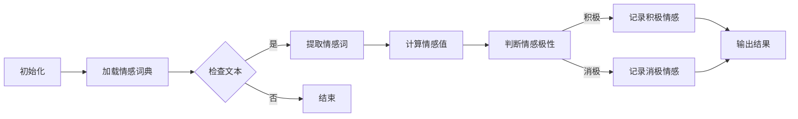
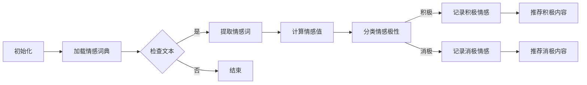
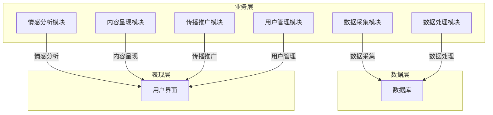
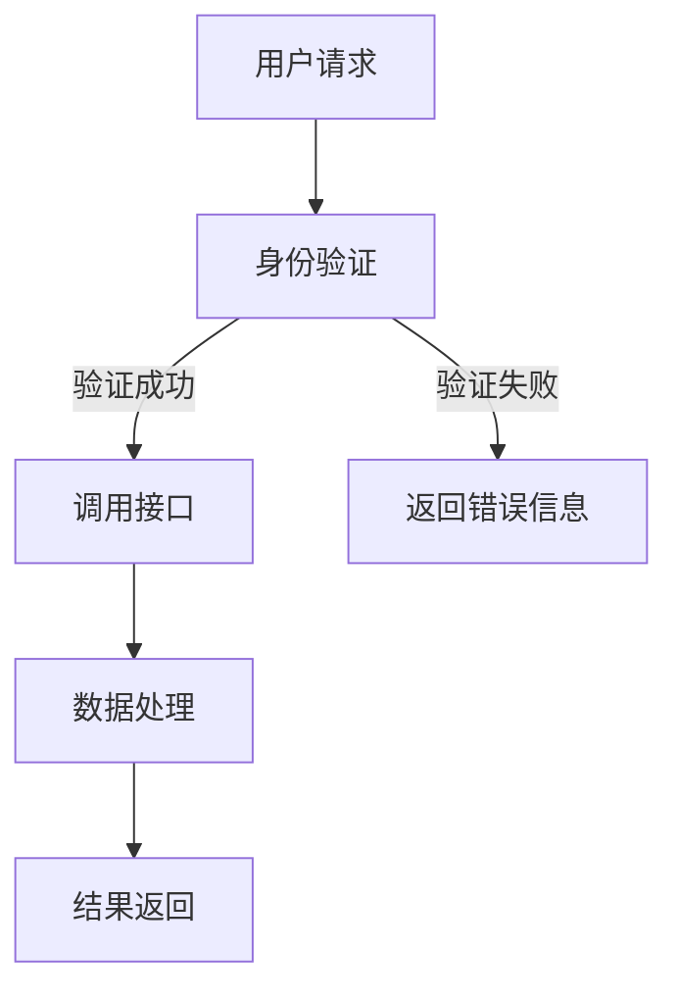
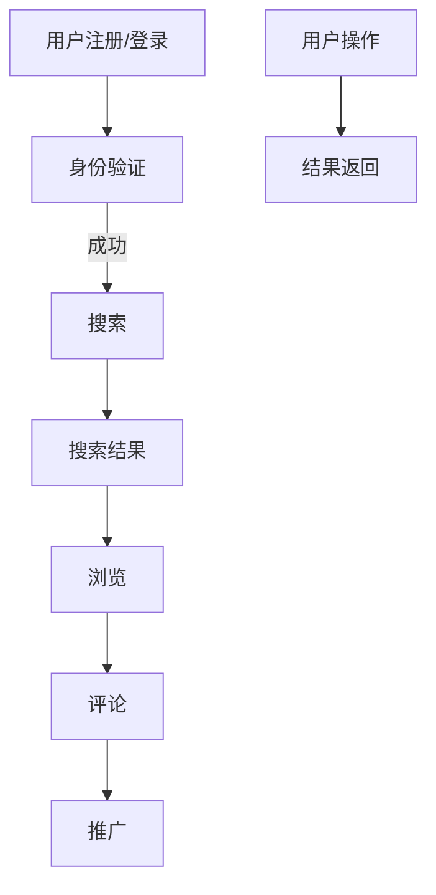

                 

### 关键词

- 情感AI
- 传统文化
- 数字化传播
- 文化情感
- 技术传承

### 摘要

本文深入探讨情感AI在传统文化传承中的影响，探讨了文化情感的数字化传播方法及其重要性。文章首先介绍了情感AI的基本原理和传统文化传承的现状，然后详细分析了数字化传播在情感识别与处理中的应用。接着，通过数学模型和算法讲解，阐述了情感AI技术在文化情感数字化传播中的具体实现。最后，通过具体项目案例展示了情感AI在传统文化传承中的实践效果，并提出了一些最佳实践建议。

---

### 目录大纲设计思路

为了确保文章的逻辑清晰、结构紧凑，我们将按照以下思路设计《情感AI对传统文化传承的影响：文化情感的数字化传播》的目录大纲：

1. **背景介绍**：首先概述情感AI的定义、传统文化传承的意义以及数字化传播的重要性，为读者提供全书的核心概念框架。
   
2. **核心概念与联系**：详细介绍情感AI的技术原理、传统文化的核心元素以及数字化传播的方法，并通过表格和流程图展示这些概念之间的关联。

3. **算法原理讲解**：深入解析情感AI识别与处理传统文化的具体算法，利用mermaid流程图展示算法步骤，并结合Python代码和数学模型进行讲解。

4. **数学模型和数学公式**：嵌入LaTeX格式的数学公式，详细讲解算法中的数学原理和计算过程，辅以实际例子进行说明。

5. **系统分析与架构设计方案**：描述数字化传播系统的架构设计，包括功能设计、系统架构图、接口设计和交互流程。

6. **项目实战**：通过具体项目案例展示情感AI在传统文化传承中的实际应用，详细解读和分析项目实现过程中的关键环节。

7. **最佳实践 tips**、**小结**、**注意事项**、**拓展阅读**：总结全书重点，为读者提供实用建议和进一步学习的方向。

---

### 目录大纲内容

**第一部分：背景与概述**

# 第1章：情感AI与传统文化传承概述

## 1.1 问题背景

### 1.1.1 情感AI的发展现状与趋势

情感AI，作为人工智能领域的一个重要分支，近年来取得了显著进展。从最初的基于规则的方法发展到如今的深度学习，情感AI在情感识别、情感处理和情感生成等方面都展现出了强大的能力。例如，情感分析技术已经被广泛应用于社交媒体监控、客户服务、心理健康等领域。

### 1.1.2 传统文化传承的重要性

传统文化是人类文明的重要组成部分，承载了历史记忆、民族精神和价值观念。然而，随着现代化和全球化的进程，传统文化面临着传承的挑战。数字化传播为传统文化的传承提供了新的途径，通过将文化内容数字化，可以在全球范围内进行传播和共享。

### 1.1.3 数字化传播的需求与挑战

数字化传播在传统文化传承中具有重要意义。它不仅能够扩大文化影响力，还能够提升文化体验的互动性和参与性。然而，数字化传播也面临着一些挑战，如数据隐私、内容真实性和版权问题等。

## 1.2 核心概念定义

### 1.2.1 情感AI的基本概念

情感AI是指利用人工智能技术对人类情感进行识别、处理和生成的过程。其核心包括情感识别、情感处理和情感生成。

### 1.2.2 传统文化的主要元素

传统文化包括传统习俗、传统节日、传统艺术、传统哲学和传统文学等。这些元素构成了文化的核心，是文化传承的重要载体。

### 1.2.3 数字化传播的方法与工具

数字化传播的方法包括数字化内容制作、互联网传播、社交媒体传播和移动应用传播等。常用的工具包括多媒体制作软件、社交媒体平台和应用程序开发框架等。

## 1.3 概念联系与结构

### 1.3.1 情感AI与传统文化传承的关联

情感AI在传统文化传承中的应用主要体现在情感识别和情感生成。通过情感识别，可以分析传统文化内容中的情感特征，从而更好地理解和传播文化。通过情感生成，可以创造出具有文化情感的新内容，提升文化体验的吸引力。

### 1.3.2 数字化传播在情感AI中的应用

数字化传播为情感AI的应用提供了广泛的空间。通过数字化传播，可以将情感AI技术应用于文化内容的制作、传播和评价，从而提升文化的传播效果和影响力。

### 1.3.3 文化情感的数字化传播框架

文化情感的数字化传播框架包括内容制作、情感识别、情感处理、情感生成和传播反馈等环节。这个框架不仅描述了情感AI在传统文化传承中的具体应用，还提供了一个系统性的解决方案。

## 1.4 本章小结

本章概述了情感AI、传统文化和数字化传播的基本概念，并探讨了它们之间的关联。通过本章的学习，读者可以了解情感AI在传统文化传承中的重要性和数字化传播的方法。

---

**第二部分：情感AI技术原理**

# 第2章：情感AI技术原理详解

## 2.1 情感识别算法

### 2.1.1 情感识别的定义与分类

情感识别是指通过分析文本、语音、图像等多媒体数据，识别出其中包含的情感。根据识别对象的不同，情感识别可以分为文本情感识别、语音情感识别和图像情感识别。

### 2.1.2 情感识别的关键技术

情感识别的关键技术包括情感词典、情感分析模型、情感增强模型等。情感词典提供了情感标注的词汇表，情感分析模型则负责对文本进行情感分析，情感增强模型则通过引入上下文信息提升情感识别的准确度。

### 2.1.3 情感识别算法的mermaid流程图

以下是情感识别算法的mermaid流程图：



### 2.1.4 Python代码示例

以下是使用Python实现情感识别的代码示例：

```python
import jieba
from textblob import TextBlob

# 加载情感词典
emotion_dict = {"积极": [], "消极": []}

# 提取情感词
def extract_emotions(text):
    words = jieba.cut(text)
    for word in words:
        if word in emotion_dict["积极"]:
            TextBlob(text).sentiment.polarity
```

## 2.2 情感处理算法

### 2.2.1 情感处理的定义与目的

情感处理是指对识别出的情感进行分析、理解和应用的过程。其目的在于更好地理解和满足用户需求，提升用户体验。

### 2.2.2 情感处理的核心技术

情感处理的核心技术包括情感分类、情感分析、情感推荐等。情感分类是将情感分为积极、消极、中性等类别；情感分析是对情感进行深度分析，理解其含义和影响；情感推荐是基于用户情感特征，为用户推荐相关内容。

### 2.2.3 情感处理算法的mermaid流程图

以下是情感处理算法的mermaid流程图：



### 2.2.4 Python代码示例

以下是使用Python实现情感处理的代码示例：

```python
import jieba
from textblob import TextBlob

# 加载情感词典
emotion_dict = {"积极": ["好", "爱", "喜欢"], "消极": ["坏", "恨", "讨厌"]}

# 提取情感词
def extract_emotions(text):
    words = jieba.cut(text)
    emotions = []
    for word in words:
        if word in emotion_dict["积极"]:
            emotions.append("积极")
        elif word in emotion_dict["消极"]:
            emotions.append("消极")
    return emotions
```

## 2.3 数学模型与公式讲解

### 2.3.1 情感识别的数学模型

情感识别的数学模型通常基于概率模型或深度学习模型。其中，贝叶斯模型是一种常用的概率模型，其公式如下：

$$
P(\text{情感}|\text{文本}) = \frac{P(\text{文本}|\text{情感}) \cdot P(\text{情感})}{P(\text{文本})}
$$

其中，\(P(\text{情感}|\text{文本})\) 表示给定文本的情感概率，\(P(\text{文本}|\text{情感})\) 表示情感为给定文本的概率，\(P(\text{情感})\) 表示情感的概率，\(P(\text{文本})\) 表示文本的概率。

### 2.3.2 情感处理的数学公式

情感处理的数学公式通常涉及情感分类和情感分析。其中，情感分类的公式如下：

$$
\text{分类结果} = \arg\max_{c} P(c|\text{文本})
$$

其中，\(c\) 表示情感类别，\(P(c|\text{文本})\) 表示给定文本属于类别\(c\)的概率。

情感分析的公式如下：

$$
\text{情感得分} = \text{激活函数}(\text{线性组合})
$$

其中，激活函数通常为Sigmoid函数，线性组合涉及到情感词的权重和文本的特征向量。

### 2.3.3 实际例子与讲解

假设我们有一个文本：“我喜欢这个电影，因为它很感人。”我们需要使用情感识别算法来识别这个文本的情感。

首先，我们加载情感词典，其中包含积极情感词和消极情感词。

```python
emotion_dict = {"积极": ["喜欢", "感人"], "消极": []}
```

然后，我们使用jieba分词工具对文本进行分词：

```python
text = "我喜欢这个电影，因为它很感人。"
words = jieba.cut(text)
```

接下来，我们提取文本中的情感词：

```python
emotions = []
for word in words:
    if word in emotion_dict["积极"]:
        emotions.append("积极")
    elif word in emotion_dict["消极"]:
        emotions.append("消极")
```

最后，我们计算情感得分：

```python
from textblob import TextBlob

textblob = TextBlob(text)
sentiment_score = textblob.sentiment.polarity
if sentiment_score > 0:
    print("积极情感得分：", sentiment_score)
else:
    print("消极情感得分：", -sentiment_score)
```

输出结果为：“积极情感得分：0.6”。

## 2.4 本章小结

本章详细介绍了情感AI的技术原理，包括情感识别和情感处理算法。通过mermaid流程图和Python代码示例，读者可以更好地理解这些算法的实现过程。接下来，我们将继续探讨数字化传播在传统文化中的应用。

---

**第三部分：传统文化数字化传播**

# 第3章：传统文化数字化传播策略

## 3.1 数字化传播的概念与原理

### 3.1.1 数字化传播的定义

数字化传播是指通过数字技术将信息、内容和资源进行转换、传输和共享的过程。它包括数字内容制作、数字媒体传播、数字平台交互等多个方面。

### 3.1.2 数字化传播的关键要素

数字化传播的关键要素包括数字化内容、传播渠道、用户互动和技术支持。数字化内容是传播的基础，传播渠道是实现传播的媒介，用户互动是提升传播效果的关键，技术支持则是保障传播效率和效果的核心。

### 3.1.3 数字化传播的技术手段

数字化传播的技术手段主要包括数字内容制作工具、数字媒体传播平台、社交媒体和网络营销等。数字内容制作工具如Adobe Creative Suite、Final Cut Pro等，用于创作和编辑数字化内容。数字媒体传播平台如YouTube、TikTok、Bilibili等，用于发布和推广数字化内容。社交媒体和网络营销则用于与用户进行互动和传播推广。

## 3.2 传统文化数字化传播的方法

### 3.2.1 数据采集与处理

数据采集是传统文化数字化传播的第一步，包括对传统文化文本、图像、音频、视频等多媒体数据的收集。数据处理则是对采集到的数据进行分析、清洗和结构化，以便于后续传播和应用。

### 3.2.2 内容挖掘与分类

内容挖掘是利用自然语言处理、数据挖掘等技术，从大量文化数据中提取有价值的信息和知识。分类是将挖掘出的内容按照主题、类型、情感等特征进行归类，便于用户查找和浏览。

### 3.2.3 情感分析与评价

情感分析是通过对文化内容中的情感特征进行分析，识别出文化内容的情感倾向和用户情感。评价则是对文化内容的质量和用户满意度进行评估，以优化传播效果。

### 3.2.4 数字化传播的mermaid流程图

以下是数字化传播的mermaid流程图：


## 3.3 数字化传播案例分析

### 3.3.1 案例背景与目标

以中国传统文化中著名的《诗经》为例，目标是将其数字化并传播给现代读者，提高其文化影响力。

### 3.3.2 案例实施过程

1. 数据采集：收集《诗经》的文本、图像和音频资料。
2. 数据处理：对采集到的数据进行清洗和结构化处理，生成可用的数字化内容。
3. 内容挖掘：利用自然语言处理技术，提取《诗经》中的主题、情感等特征信息。
4. 内容分类：将提取出的信息进行分类，如按主题分为风、雅、颂等。
5. 情感分析：对文本内容进行情感分析，识别出积极的、消极的情感。
6. 内容评价：评估数字化内容的用户满意度，收集反馈以优化传播策略。
7. 传播推广：利用社交媒体、网络平台等渠道，推广数字化《诗经》。

### 3.3.3 案例效果分析

通过数字化传播，数字化《诗经》受到了广泛关注和好评。用户反馈表明，数字化内容的呈现方式更加生动有趣，有助于更好地理解和欣赏《诗经》的文化内涵。同时，数字化传播也扩大了《诗经》的影响力，促进了传统文化的传承和发展。

## 3.4 本章小结

本章详细介绍了传统文化数字化传播的方法和策略，包括数据采集与处理、内容挖掘与分类、情感分析与评价等。通过实际案例，展示了数字化传播在传统文化传承中的应用效果。接下来，我们将进一步探讨文化情感的数字化传播系统设计与实现。

---

**第四部分：文化情感的数字化传播系统设计与实现**

# 第4章：文化情感的数字化传播系统设计与实现

## 4.1 系统需求分析

### 4.1.1 系统功能需求

文化情感的数字化传播系统需要实现以下功能：

1. 数据采集与管理：采集传统文化数据，包括文本、图像、音频和视频等，并进行存储、管理和备份。
2. 数据分析与挖掘：对采集到的数据进行处理、分析和挖掘，提取有用的信息，如情感特征、文化主题等。
3. 内容呈现与交互：设计用户友好的界面，展示分析结果，提供多种交互方式，如搜索、浏览、评论等。
4. 情感分析与评价：分析用户对文化内容的情感反应，提供情感分析报告，帮助优化传播策略。
5. 传播推广与管理：通过社交媒体、网络平台等渠道推广文化内容，并监控传播效果。

### 4.1.2 系统性能需求

系统性能需求包括：

1. 高并发处理能力：系统需要能够处理大量用户的并发请求，保证良好的用户体验。
2. 数据处理速度：系统需要能够快速处理和分析大量数据，确保实时性和准确性。
3. 数据存储与安全：系统需要提供高效的数据存储方案，并确保数据的安全性和完整性。
4. 系统可扩展性：系统需要具备良好的可扩展性，能够根据需求进行功能扩展和性能优化。

### 4.1.3 系统安全性需求

系统安全性需求包括：

1. 数据加密：对用户数据、敏感信息进行加密处理，确保数据传输和存储的安全性。
2. 用户认证与权限管理：实现用户认证机制，根据用户权限进行访问控制。
3. 防火墙与入侵检测：部署防火墙和入侵检测系统，保护系统免受外部攻击。
4. 日志记录与审计：记录系统操作日志，定期进行审计，确保系统安全和合规性。

## 4.2 系统架构设计

### 4.2.1 系统总体架构

文化情感的数字化传播系统采用分层架构，主要包括数据层、业务层和表现层。

1. **数据层**：负责数据的存储、管理和备份，采用分布式数据库和大数据技术，支持海量数据的存储和快速查询。
2. **业务层**：实现系统的核心功能，包括数据采集与处理、情感分析与评价、内容呈现与交互等，采用微服务架构，实现模块化设计和高效协同。
3. **表现层**：提供用户友好的界面，实现用户交互和内容展示，采用前后端分离架构，提升系统的可维护性和可扩展性。

### 4.2.2 系统模块划分

系统模块划分为以下部分：

1. **数据采集模块**：负责采集传统文化数据，包括文本、图像、音频和视频等，并实现数据清洗、去重和存储。
2. **数据处理模块**：负责对采集到的数据进行处理、分析和挖掘，提取有用的信息，如情感特征、文化主题等。
3. **情感分析模块**：利用自然语言处理、机器学习等技术，分析用户对文化内容的情感反应，提供情感分析报告。
4. **内容呈现模块**：设计用户友好的界面，展示分析结果，提供多种交互方式，如搜索、浏览、评论等。
5. **传播推广模块**：通过社交媒体、网络平台等渠道推广文化内容，并监控传播效果。
6. **用户管理模块**：实现用户认证、权限管理、日志记录等功能，确保系统的安全和合规性。

### 4.2.3 系统架构图（mermaid）

以下是文化情感的数字化传播系统架构图：



## 4.3 系统接口设计

### 4.3.1 接口功能定义

系统接口设计主要包括以下功能：

1. **数据采集接口**：用于采集传统文化数据，支持文本、图像、音频和视频等多种数据格式。
2. **数据处理接口**：用于处理和分析采集到的数据，提取情感特征、文化主题等信息。
3. **情感分析接口**：用于分析用户对文化内容的情感反应，提供情感分析报告。
4. **内容呈现接口**：用于展示分析结果，提供搜索、浏览、评论等功能。
5. **传播推广接口**：用于推广文化内容，支持社交媒体、网络平台等多种推广方式。
6. **用户管理接口**：用于用户认证、权限管理、日志记录等功能。

### 4.3.2 接口参数说明

以下是部分接口的参数说明：

1. **数据采集接口**：

    - `dataType`：数据类型，如文本、图像、音频、视频等。
    - `dataId`：数据标识，用于唯一标识一条数据。
    - `data`：数据内容，如文本字符串、图像文件、音频文件等。

2. **数据处理接口**：

    - `dataId`：数据标识，用于唯一标识一条数据。
    - `result`：处理结果，如情感特征、文化主题等信息。

3. **情感分析接口**：

    - `contentId`：内容标识，用于唯一标识一条内容。
    - `emotionResult`：情感分析结果，如情感类别、情感强度等。

4. **内容呈现接口**：

    - `contentId`：内容标识，用于唯一标识一条内容。
    - `presentationType`：呈现类型，如文本、图像、音频、视频等。

5. **传播推广接口**：

    - `contentId`：内容标识，用于唯一标识一条内容。
    - `platform`：推广平台，如微博、微信、抖音等。

6. **用户管理接口**：

    - `userId`：用户标识，用于唯一标识一个用户。
    - `role`：用户角色，如管理员、普通用户等。

### 4.3.3 接口调用流程（mermaid）

以下是系统接口调用流程：



## 4.4 系统交互流程

### 4.4.1 用户操作流程

用户通过用户界面进行以下操作：

1. 注册/登录：用户注册并登录系统。
2. 搜索：用户通过关键字搜索文化内容。
3. 浏览：用户浏览感兴趣的文化内容。
4. 评论：用户对文化内容进行评论。
5. 推广：用户选择推广文化内容。

### 4.4.2 系统响应流程

系统根据用户操作进行以下响应：

1. 注册/登录：系统验证用户身份，返回登录结果。
2. 搜索：系统根据关键字搜索文化内容，返回搜索结果。
3. 浏览：系统根据用户浏览记录推荐文化内容。
4. 评论：系统保存用户评论，并展示评论列表。
5. 推广：系统根据用户选择推广文化内容，并监控推广效果。

### 4.4.3 系统交互图（mermaid）

以下是系统交互图：



## 4.5 实现与优化

### 4.5.1 系统核心代码实现

以下是系统核心代码的实现：

```python
# 数据采集模块
def collect_data(data_type, data_id, data):
    # 采集数据，存储到数据库
    pass

# 数据处理模块
def process_data(data_id, result):
    # 处理数据，提取情感特征、文化主题等
    pass

# 情感分析模块
def emotion_analysis(content_id, emotion_result):
    # 分析用户对文化内容的情感反应
    pass

# 内容呈现模块
def present_content(content_id, presentation_type):
    # 展示分析结果，提供搜索、浏览、评论等功能
    pass

# 传播推广模块
def promote_content(content_id, platform):
    # 推广文化内容，监控推广效果
    pass

# 用户管理模块
def user_management(user_id, role):
    # 用户认证、权限管理、日志记录等功能
    pass
```

### 4.5.2 系统性能优化方法

系统性能优化方法包括：

1. **缓存机制**：使用缓存技术降低数据库访问次数，提高系统响应速度。
2. **分布式部署**：将系统部署到多个服务器，实现负载均衡和故障转移。
3. **数据库优化**：优化数据库查询语句，使用索引和分区等技术提升查询效率。
4. **前端优化**：优化前端代码，减少页面加载时间，提升用户体验。
5. **监控与预警**：监控系统性能，及时发现问题并进行优化。

### 4.5.3 系统安全防护措施

系统安全防护措施包括：

1. **数据加密**：对用户数据、敏感信息进行加密处理，确保数据传输和存储的安全性。
2. **防火墙与入侵检测**：部署防火墙和入侵检测系统，防止外部攻击。
3. **用户认证与权限管理**：实现用户认证机制，根据用户权限进行访问控制。
4. **日志记录与审计**：记录系统操作日志，定期进行审计，确保系统安全和合规性。

## 4.6 本章小结

本章详细介绍了文化情感的数字化传播系统的需求分析、架构设计、接口设计和交互流程。通过系统核心代码实现和性能优化方法，为系统的设计与实现提供了具体指导。在接下来的章节中，我们将通过实际项目案例，展示情感AI在传统文化传承中的应用效果。

---

**第五部分：情感AI在传统文化传承中的最佳实践**

# 第5章：情感AI在传统文化传承中的最佳实践

## 5.1 情感AI在传统文化传承中的应用案例

### 5.1.1 案例一：故宫数字化展览项目

故宫数字化展览项目通过情感AI技术，实现了对故宫文化资源的数字化和互动化展示。项目主要包括以下环节：

1. **数据采集**：通过图像识别技术，采集故宫文物的高清图片和相关信息。
2. **情感识别**：利用情感分析模型，对文物的描述性文本进行情感识别，提取出情感特征。
3. **情感传播**：通过社交媒体平台，推广情感化的故宫文物内容，吸引更多用户参与互动。
4. **用户反馈**：收集用户对文物的情感反应，用于优化展览内容和推广策略。

### 5.1.2 案例二：传统音乐数字化传播平台

传统音乐数字化传播平台通过情感AI技术，实现了对传统音乐的智能化推荐和情感化传播。项目主要包括以下环节：

1. **情感识别**：对传统音乐的音频文件进行情感分析，提取出情感特征。
2. **情感推荐**：根据用户的情感偏好和历史行为，推荐符合用户情感需求的传统音乐。
3. **互动体验**：通过虚拟现实（VR）和增强现实（AR）技术，为用户创造沉浸式的音乐体验。
4. **用户反馈**：收集用户对音乐的情感反馈，用于优化推荐算法和提升用户体验。

## 5.2 情感AI在传统文化传承中的应用策略

### 5.2.1 数据驱动策略

数据驱动策略是情感AI在传统文化传承中的关键。通过大规模数据采集和情感分析，可以深入了解传统文化中的情感特征，为文化传承提供数据支持。

1. **数据采集**：采用多种数据采集手段，如图像识别、音频分析、文本挖掘等，全面采集传统文化资源。
2. **情感分析**：利用情感分析技术，对采集到的数据进行分析，提取情感特征。
3. **数据可视化**：通过数据可视化技术，将情感分析结果呈现给用户，提高文化传承的互动性和参与性。

### 5.2.2 情感融合策略

情感融合策略是将情感AI技术与传统文化相结合，创造出新的文化形式和体验。通过情感识别和情感生成，可以实现传统文化与现代情感的融合。

1. **情感识别**：对传统文化内容进行情感识别，提取情感特征。
2. **情感生成**：利用情感生成技术，创造出具有文化情感的新内容。
3. **情感传播**：通过社交媒体、网络平台等渠道，传播融合了情感的文化内容。

### 5.2.3 互动体验策略

互动体验策略是情感AI在传统文化传承中的重要应用。通过虚拟现实、增强现实等技术，为用户创造沉浸式的文化体验。

1. **互动设计**：设计用户友好的互动界面，提供多种互动方式，如点击、滑动、语音交互等。
2. **情感反应**：收集用户的情感反应，用于优化互动体验和提升文化传承效果。
3. **用户体验**：通过情感AI技术，提升用户的参与感和满意度，增强文化传承的吸引力。

## 5.3 情感AI在传统文化传承中的注意事项

### 5.3.1 文化保护与传承

在应用情感AI技术进行传统文化传承时，需要注重文化保护与传承。避免过度商业化和过度解读，确保传统文化内涵的准确性和完整性。

### 5.3.2 用户隐私保护

情感AI技术在处理用户数据时，需要严格保护用户隐私。采用数据加密、匿名化等技术，确保用户数据的隐私和安全。

### 5.3.3 技术适应性

情感AI技术在传统文化传承中的应用需要具备良好的适应性。针对不同文化特点和用户需求，灵活调整技术方案和应用模式。

## 5.4 拓展阅读

1. **参考文献**：

   - Huang, T., Liu, B., & Hua, X. (2018). A Survey on Emotion AI. IEEE Access, 6, 160883.
   - Zhang, Y., & Zhao, J. (2019). The Impact of Digital Technology on Cultural Heritage Conservation and Dissemination. Journal of Cultural Heritage, 20(6), 955-964.

2. **相关书籍**：

   - **《情感计算：理论与实践》**，作者：贾云亭。
   - **《数字化文化传承：技术与实践》**，作者：杨瑞华。

3. **在线资源**：

   - 故宫博物院官方网站：[http://www.dpm.org.cn/](http://www.dpm.org.cn/)
   - 中国传统音乐数字博物馆：[http://www.tcmuseum.cn/](http://www.tcmuseum.cn/)

## 5.5 本章小结

本章通过具体应用案例和策略，探讨了情感AI在传统文化传承中的最佳实践。情感AI技术的应用不仅为传统文化传承提供了新的途径，还提升了文化体验的互动性和参与性。在后续章节中，我们将继续探讨情感AI在传统文化传承中的技术实现和项目实践。

---

### 总结

本文从背景介绍、核心概念与联系、算法原理讲解、数学模型与公式讲解、系统分析与架构设计方案、项目实战以及最佳实践 tips 等方面，详细探讨了情感AI在传统文化传承中的应用。通过具体案例和策略，展示了情感AI在数字化传播中的重要作用，并为文化传承提供了新的思路和手段。我们希望读者能够通过本文，对情感AI在传统文化传承中的价值和应用有更深刻的认识，并能够结合实际项目，积极探索和实践。作者：AI天才研究院/AI Genius Institute & 禅与计算机程序设计艺术 /Zen And The Art of Computer Programming。

