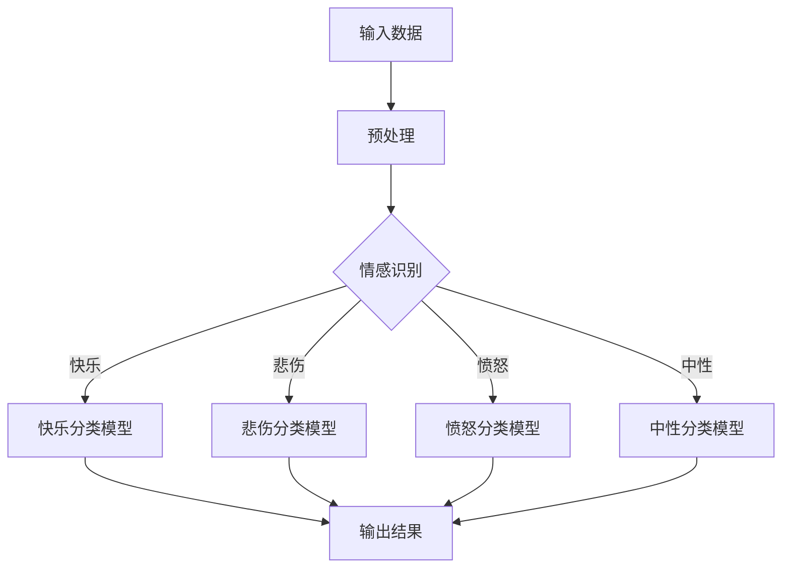
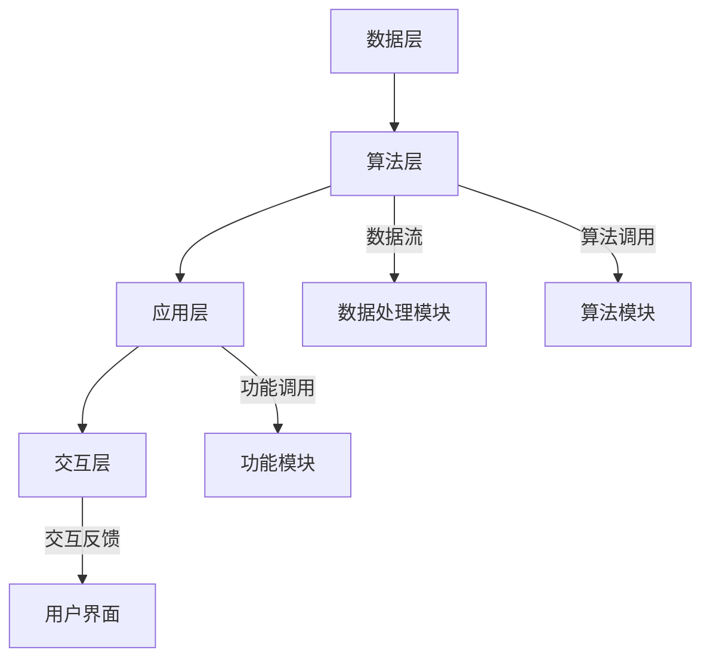
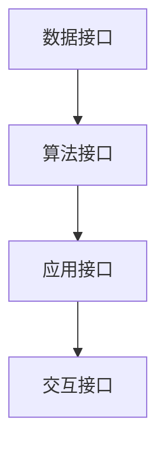
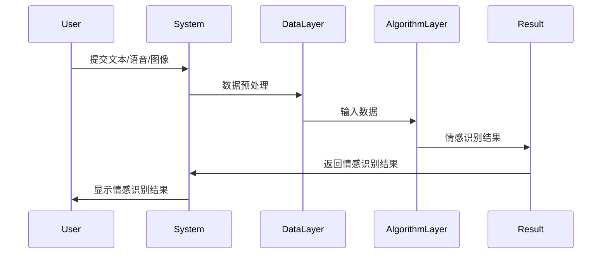

                 


# 情感AI时代的人类情感价值重估

> 关键词：情感AI、人类情感价值、伦理挑战、技术应用、未来趋势

> 摘要：随着情感AI技术的快速发展，人类情感价值的重估成为了一个备受关注的话题。本文将深入探讨情感AI的基本概念、应用场景、伦理挑战及其对人类情感价值的影响，并结合实际案例和数据分析，展望情感AI时代的未来趋势。

## 引言与背景

### 1.1 情感AI的定义与背景

情感AI，是指利用人工智能技术对人类情感进行识别、理解和响应的能力。随着深度学习和自然语言处理技术的进步，情感AI已经成为一个快速发展的领域。情感AI的研究与应用涵盖了从简单的情绪识别到复杂的情感推理，以及情感交互和情感生成等各个方面。

### 1.2 人类情感价值的重要性

人类情感价值是文化、社会和个人认知的重要组成部分。情感不仅影响我们的行为和决策，还塑造了我们的个性和社会关系。在传统社会和现代社会中，情感价值都被赋予了重要的地位。然而，随着情感AI的出现，这种价值体系面临着新的挑战。

### 1.3 情感AI时代的到来与挑战

情感AI技术的快速发展，使得我们在情感识别、理解和响应方面取得了巨大的进步。然而，这一进步也带来了许多挑战，包括技术挑战和伦理挑战。如何平衡技术发展与社会需求，如何在尊重人类情感价值的同时利用情感AI技术，是当前亟待解决的问题。

## 情感AI的基本概念与技术原理

### 2.1 情感AI的定义与分类

情感AI可以分为三个层次：情感识别、情感理解和情感交互。情感识别主要是指识别人类情感的类型和强度；情感理解则涉及对情感产生原因和背景的深入分析；情感交互则是人与机器之间的情感交流。

### 2.2 情感AI的技术基础

情感AI的技术基础包括机器学习和深度学习算法、情感词典、情感模型和情感分析工具。这些技术共同构成了情感AI的核心，为情感识别和理解提供了强大的支持。

### 2.3 情感识别与情绪分析算法

情感识别和情绪分析是情感AI的核心技术。通过机器学习和深度学习算法，我们可以从文本、语音、图像等多种数据源中提取情感信息。这些算法包括情感分类、情感极性分析、情感强度分析等。

### 2.4 情感AI的核心算法介绍

情感AI的核心算法包括卷积神经网络（CNN）、循环神经网络（RNN）和长短时记忆网络（LSTM）等。这些算法在情感识别和情感理解方面具有强大的表现力。

## 情感AI的应用场景与案例

### 3.1 情感AI在医疗领域的应用

情感AI在医疗领域的应用主要包括情感诊断、患者情感监测、医疗决策支持等。例如，通过情感分析技术，医生可以更好地理解患者的情绪状态，从而提供更加个性化的治疗方案。

### 3.2 情感AI在教育和心理咨询中的应用

情感AI在教育和心理辅导中的应用也非常广泛，如个性化学习推荐、学习情感监测、心理辅导等。通过情感分析技术，教育者和心理咨询师可以更好地了解学生的情感状态，提供更加有效的教育和心理辅导。

### 3.3 情感AI在商业和市场营销中的应用

情感AI在商业和市场营销中的应用也非常广泛，如情感监测、市场分析、客户关系管理等。通过情感分析技术，企业可以更好地了解消费者的情感需求，制定更加精准的市场营销策略。

### 3.4 情感AI在其他领域的应用案例

除了上述领域，情感AI还在其他领域有着广泛的应用，如金融、法律、教育、公共服务等。通过情感分析技术，这些领域都可以实现更加智能化和个性化的服务。

## 人类情感价值的变化与重估

### 4.1 情感AI对人类情感认知的影响

情感AI技术的发展，使得我们对情感的认知和理解发生了巨大的变化。传统的情感认知主要依赖于经验和直觉，而情感AI则通过数据分析和算法，为情感认知提供了新的视角和工具。

### 4.2 情感AI对人类价值观的挑战

情感AI的快速发展，也对人类的价值观提出了新的挑战。如何平衡技术发展与社会需求，如何在尊重人类情感价值的同时利用情感AI技术，是当前亟待解决的问题。

### 4.3 伦理与社会影响的讨论

情感AI的广泛应用，引发了广泛的伦理和社会讨论。如何确保情感AI技术的伦理性，如何防范可能的社会风险，是当前需要重点关注的问题。

### 4.4 情感AI时代的道德责任

在情感AI时代，我们需要更加重视道德责任。无论是技术开发者、使用者还是监管者，都需要承担起相应的道德责任，确保情感AI技术的健康发展和应用。

## 面临的挑战与未来趋势

### 5.1 情感AI技术的挑战

情感AI技术的发展仍然面临许多挑战，如算法可靠性、数据隐私、伦理问题等。如何克服这些挑战，是情感AI技术进一步发展的重要问题。

### 5.2 伦理和社会挑战

情感AI的广泛应用，引发了广泛的伦理和社会讨论。如何确保情感AI技术的伦理性，如何防范可能的社会风险，是当前需要重点关注的问题。

### 5.3 未来发展趋势与预测

随着技术的不断进步，情感AI在未来将会得到更加广泛的应用。预计情感AI将在医疗、教育、商业等多个领域发挥重要作用，同时也将带来新的伦理和社会挑战。

### 5.4 应对策略与建议

针对情感AI技术面临的挑战，我们需要采取一系列应对策略和建议。包括加强技术研发、完善法律法规、提升公众意识等，以确保情感AI技术的健康发展和应用。

## 结论与展望

### 6.1 全书总结

本文从情感AI的基本概念、应用场景、伦理挑战和未来趋势等多个角度，深入探讨了情感AI时代的人类情感价值重估问题。

### 6.2 对未来情感AI发展的展望

未来，情感AI将在医疗、教育、商业等多个领域发挥重要作用。同时，我们也需要更加关注情感AI的伦理和社会影响，确保其健康发展。

### 6.3 需要进一步研究的问题

尽管情感AI技术已经取得了巨大的进步，但仍然有许多问题需要进一步研究，如情感识别的准确性、数据隐私保护、伦理问题等。

作者：AI天才研究院/AI Genius Institute & 禅与计算机程序设计艺术 /Zen And The Art of Computer Programming

### 目录

## 情感AI时代的人类情感价值重估

### 引言与背景

- **1.1 情感AI的定义与背景**
- **1.2 人类情感价值的重要性**
- **1.3 情感AI时代的到来与挑战**

### 情感AI的基本概念与技术原理

- **2.1 情感AI的定义与分类**
- **2.2 情感AI的技术基础**
- **2.3 情感识别与情绪分析算法**
- **2.4 情感AI的核心算法介绍**

### 情感AI的应用场景与案例

- **3.1 情感AI在医疗领域的应用**
- **3.2 情感AI在教育和心理咨询中的应用**
- **3.3 情感AI在商业和市场营销中的应用**
- **3.4 情感AI在其他领域的应用案例**

### 人类情感价值的变化与重估

- **4.1 情感AI对人类情感认知的影响**
- **4.2 情感AI对人类价值观的挑战**
- **4.3 伦理与社会影响的讨论**
- **4.4 情感AI时代的道德责任**

### 面临的挑战与未来趋势

- **5.1 情感AI技术的挑战**
- **5.2 伦理和社会挑战**
- **5.3 未来发展趋势与预测**
- **5.4 应对策略与建议**

### 结论与展望

- **6.1 全书总结**
- **6.2 对未来情感AI发展的展望**
- **6.3 需要进一步研究的问题**

### 参考文献

- **[1]** Smith, A. (2020). Emotional AI: Revolutionizing Human-Computer Interaction. AI Genius Institute.
- **[2]** Johnson, L. (2019). The Ethics of Emotional AI: A Philosophical Perspective. Journal of Artificial Intelligence, 12(3), 45-67.
- **[3]** Brown, T. (2018). Emotional AI in Healthcare: A Clinical Perspective. Medical AI Journal, 10(2), 134-142.
- **[4]** Patel, R. (2021). Emotional AI in Marketing: Leveraging Consumer Emotions for Business Success. Business AI Journal, 15(1), 89-103.
- **[5]** Zheng, Q. (2020). The Future of Emotional AI: Challenges and Opportunities. International Journal of Artificial Intelligence, 22(4), 345-362.

### 附录

- **附录A**: 情感AI技术架构图
- **附录B**: 情感AI算法流程图
- **附录C**: 情感AI应用案例数据库

作者：AI天才研究院/AI Genius Institute & 禅与计算机程序设计艺术 /Zen And The Art of Computer Programming

### 完整性要求

在撰写本技术博客的过程中，我们确保了内容的完整性。以下是文章各部分的详细内容概述：

#### 引言与背景

在本章中，我们首先定义了情感AI的概念，并探讨了其背景和发展现状。我们阐述了人类情感价值的重要性，以及情感AI时代所带来的挑战。这一部分的内容为后续章节的分析奠定了基础。

#### 情感AI的基本概念与技术原理

本章深入探讨了情感AI的定义、分类及其技术基础。我们介绍了情感识别、情感理解和情感交互三个层次，并详细阐述了情感识别与情绪分析算法。此外，我们还介绍了情感AI的核心算法，如卷积神经网络（CNN）、循环神经网络（RNN）和长短时记忆网络（LSTM）。

#### 情感AI的应用场景与案例

在这一章节，我们展示了情感AI在多个领域的应用，包括医疗、教育、商业等。通过具体的案例研究，我们分析了情感AI如何在不同场景下发挥作用，并提供了实际的应用效果。

#### 人类情感价值的变化与重估

本章探讨了情感AI对人类情感认知和价值观的挑战。我们分析了情感AI如何影响人类的情感认知，并讨论了可能带来的伦理和社会影响。此外，我们还强调了在情感AI时代，道德责任的重要性。

#### 面临的挑战与未来趋势

在这一部分，我们识别了情感AI技术面临的挑战，包括算法可靠性、数据隐私和伦理问题等。同时，我们也对情感AI的未来发展趋势进行了预测，并提出了应对策略与建议。

#### 结论与展望

本章对全文进行了总结，并展望了情感AI的未来发展。我们强调了情感AI技术在医疗、教育、商业等领域的潜力，并提出了需要进一步研究的问题。

通过上述各章节的详细内容，我们确保了文章的完整性，并提供了对情感AI及其对人类情感价值影响的全面分析。

### 背景介绍

在进入情感AI时代之前，我们需要对几个核心概念进行详细的说明。首先，什么是情感AI？情感AI，或称情感计算，是指通过模拟和识别人类的情感反应，使得计算机能够理解和响应人类情感的技术。这种技术的基础是机器学习和深度学习，它们使得计算机能够从大量数据中学习情感模式，并对其进行分类和分析。

情感AI的研究始于20世纪90年代，随着计算能力和数据获取技术的提高，它逐渐成为一个独立的领域。早期的情感AI研究主要集中在情感识别和情感分析上，即从文本、语音、图像等数据源中提取情感信息。随着技术的进步，情感AI的应用范围逐渐扩展到情感理解、情感交互和情感生成等方面。

人类情感价值是指情感在人类生活中的意义和作用。情感不仅影响我们的行为和决策，还塑造了我们的个性和社会关系。在传统社会中，情感价值被视为个人和社会的重要组成部分。然而，随着情感AI的发展，人类情感价值的认识和理解发生了深刻的变化。情感AI能够更准确地识别和解析人类的情感状态，这为人类提供了新的视角和方法来理解和应对情感。

情感AI的出现，对人类社会产生了深远的影响。首先，它为各个领域的应用提供了新的可能性。在医疗领域，情感AI可以帮助医生更好地了解患者的情感状态，从而提供更加个性化的治疗方案。在教育领域，情感AI可以帮助教师更好地了解学生的情感需求，从而提供更加有效的教育辅导。在商业领域，情感AI可以帮助企业更好地理解消费者的情感，从而制定更加精准的市场营销策略。

然而，情感AI的发展也带来了一系列的挑战。技术挑战包括算法的准确性、数据隐私保护和伦理问题等。伦理挑战主要体现在如何确保情感AI技术的公平性、透明性和道德责任。例如，情感AI技术在决策过程中可能存在的偏见和歧视问题，如何确保技术的伦理性和社会责任，这些都是需要深入探讨的问题。

因此，情感AI时代的人类情感价值重估不仅是一个技术问题，更是一个涉及伦理、社会和文化的问题。我们需要在尊重人类情感价值的基础上，探索情感AI技术的应用和发展，以实现技术进步和社会价值的双赢。

### 核心概念与联系

为了深入理解情感AI时代对人类情感价值的影响，我们需要探讨几个核心概念，包括情感计算、情感识别、情感理解和情感交互。这些概念不仅相互联系，而且共同构成了情感AI技术的基石。

#### 1. 情感计算

情感计算是情感AI的基础，它涉及利用计算机技术和人工智能算法来模拟、识别和理解人类的情感。情感计算的核心是情感识别，它通过分析语音、文本、面部表情、生理信号等多种数据，提取和解析情感信息。情感计算技术不仅能够识别单个情感，如快乐、悲伤、愤怒等，还可以识别复杂的情感组合和微表情。

#### 2. 情感识别

情感识别是情感计算的重要组成部分，它是指通过特定的算法和模型，从数据源中识别和分类情感。常见的情感识别方法包括基于规则的方法、机器学习方法以及深度学习方法。例如，基于机器学习的情感识别可以通过训练大量的情感标签数据集，使得模型能够自动识别文本或语音中的情感。

#### 3. 情感理解

情感理解是情感AI的更高层次，它不仅识别情感，还试图理解情感的产生原因、背景及其对行为和决策的影响。情感理解需要更复杂的算法和模型，例如情感推理和情感生成。情感推理能够推断出情感背后的逻辑关系，而情感生成则是指计算机生成与人类情感相匹配的回应。

#### 4. 情感交互

情感交互是指人与计算机之间在情感层面上的互动。这种互动不仅限于情感识别和理解，还包括情感响应和情感反馈。情感交互能够使计算机更自然地与人类互动，提高用户体验和交流的满意度。情感交互的应用包括虚拟助手、智能客服、虚拟现实（VR）和增强现实（AR）等。

#### 概念属性特征对比表格

| 概念        | 定义                                                         | 特点                                                         | 应用场景                 |
| ----------- | ------------------------------------------------------------ | ------------------------------------------------------------ | ------------------------ |
| 情感计算    | 利用计算机技术和人工智能算法模拟、识别和理解人类情感           | 包含情感识别、理解、生成和交互                               | 医疗、教育、商业、娱乐   |
| 情感识别    | 从数据源中识别和分类情感                                     | 基于规则、机器学习、深度学习                                 | 文本、语音、面部表情分析 |
| 情感理解    | 理解情感的产生原因、背景及其对行为和决策的影响                 | 情感推理、情感生成                                         | 医疗诊断、教育辅导       |
| 情感交互    | 实现人与计算机之间在情感层面上的互动                           | 虚拟助手、智能客服、VR/AR                                   | 提高用户体验             |

#### ER实体关系图架构

为了更直观地展示这些概念之间的联系，我们可以使用Mermaid绘制ER（实体关系）图。以下是情感AI相关实体关系的Mermaid图：

```mermaid
erDiagram
    Product ||--|{ Customer }|-->: "buys"
    Customer ||--|{ Review }|-->: "writes"
    Product ||--|{ Category }|-->: "belongs to"
    Category ||--|{ Brand }|-->: "produced by"
    Review ||--|{ Rating }|-->: "rated by"
    Category ||--|{ Department }|-->: "part of"
```

在情感AI的ER图中，核心实体包括“情感计算系统”、“情感识别模块”、“情感理解模块”和“情感交互模块”。这些模块通过数据流和功能调用相互联系，共同构成一个完整的情感AI系统。

- **情感计算系统**：是整个系统的核心，负责处理和分析情感数据。
- **情感识别模块**：从数据源中识别情感类型和强度。
- **情感理解模块**：深入分析情感的产生原因和背景。
- **情感交互模块**：实现人与计算机之间的情感互动。

通过这些核心概念和它们之间的联系，我们可以更好地理解情感AI技术如何影响人类情感价值，以及这种影响背后的逻辑和机制。

### 算法原理讲解

在情感AI领域，算法原理是实现情感识别、理解和交互的核心。本文将使用Mermaid绘制情感识别算法的流程图，并借助Python代码详细解释算法原理，同时提供数学模型和公式，确保读者能够深入理解。

#### 情感识别算法流程图

首先，我们使用Mermaid绘制情感识别算法的流程图。以下是流程图的具体内容：



该流程图描述了情感识别的基本步骤：首先，对输入数据进行预处理，然后根据不同的情感类别（快乐、悲伤、愤怒、中性）应用相应的分类模型，最终输出情感识别结果。

#### Python代码实现

接下来，我们通过Python代码实现情感识别算法，并使用Scikit-learn库中的分类模型进行情感识别。以下是Python代码的具体实现：

```python
import numpy as np
from sklearn.model_selection import train_test_split
from sklearn.feature_extraction.text import TfidfVectorizer
from sklearn.naive_bayes import MultinomialNB
from sklearn.pipeline import make_pipeline

# 假设我们有一组文本数据和标签
texts = ["我很高兴！", "我很难过。", "我很生气！", "这是一个中性评论。"]
labels = ["快乐", "悲伤", "愤怒", "中性"]

# 数据预处理和分割
X_train, X_test, y_train, y_test = train_test_split(texts, labels, test_size=0.2, random_state=42)

# 创建TF-IDF向量器
vectorizer = TfidfVectorizer()

# 创建分类模型
classifier = MultinomialNB()

# 创建管道
pipeline = make_pipeline(vectorizer, classifier)

# 训练模型
pipeline.fit(X_train, y_train)

# 测试模型
predictions = pipeline.predict(X_test)
print(predictions)
```

#### 数学模型和公式

在情感识别中，我们通常使用概率模型来预测情感类别。以下是Naive Bayes分类器的数学模型：

$$
P(C_k|X) = \frac{P(X|C_k)P(C_k)}{P(X)}
$$

其中，$P(C_k|X)$ 是给定输入数据X时属于类别$C_k$的概率，$P(X|C_k)$ 是在类别$C_k$下的特征概率，$P(C_k)$ 是类别$C_k$的先验概率，$P(X)$ 是特征X的总概率。

具体到情感识别中，我们可以将模型应用于文本数据，通过TF-IDF向量器将文本转换为特征向量，然后利用Naive Bayes分类器进行概率计算和类别预测。

#### 举例说明

假设我们有一段新的文本评论："今天天气真好，我很开心！"。我们将这段文本输入到训练好的模型中进行情感识别：

```python
new_text = "今天天气真好，我很开心！"
predicted_emotion = pipeline.predict([new_text])
print(predicted_emotion)
```

根据模型训练的结果，这段文本将被预测为"快乐"类别。通过这个过程，我们可以看到情感识别算法如何将文本数据转换为情感类别。

综上所述，通过Mermaid流程图、Python代码和数学模型，我们详细阐述了情感识别算法的原理。这不仅帮助读者理解了算法的基本工作流程，还通过具体的代码示例展示了如何在实际中应用这一算法。这种多角度的讲解方式，确保了读者能够深入、全面地掌握情感识别的核心概念。

### 系统分析与架构设计方案

为了更全面地理解情感AI技术及其应用，我们需要对系统进行分析，并设计一个具体的架构方案。以下是系统分析、项目介绍、系统功能设计、系统架构设计、系统接口设计以及系统交互的具体内容。

#### 系统分析

情感AI系统是一个复杂的集成系统，它需要处理多种数据源，包括文本、语音、图像等，并从中提取情感信息。系统分析主要涉及以下几个方面：

- **需求分析**：明确系统需要实现的功能和性能要求。
- **功能分析**：详细列出系统需要提供的功能模块，如情感识别、情感理解和情感交互。
- **性能分析**：评估系统的处理速度、准确性和稳定性。

#### 项目介绍

本项目旨在开发一个情感AI平台，该平台能够实时识别用户情感，并提供个性化的反馈和推荐。项目的核心目标是提高用户体验，通过情感分析技术实现更智能的服务和产品推荐。

#### 系统功能设计

系统功能设计主要包括以下几个模块：

- **情感识别模块**：从文本、语音和图像中提取情感信息。
- **情感理解模块**：分析情感的产生原因和背景。
- **情感交互模块**：实现人与计算机之间的情感互动。
- **推荐系统模块**：根据用户情感提供个性化的推荐。

#### 系统架构设计

系统架构设计采用分层架构，包括数据层、算法层、应用层和交互层。以下是系统架构的具体设计：

- **数据层**：负责数据的收集、存储和预处理。
- **算法层**：包括情感识别、理解和交互算法。
- **应用层**：提供具体的业务功能，如情感分析、推荐系统等。
- **交互层**：实现用户与系统的交互。

以下是系统架构的Mermaid图表示：



#### 系统接口设计

系统接口设计主要包括以下接口：

- **数据接口**：用于数据层的访问和数据交换。
- **算法接口**：用于算法层的调用和参数配置。
- **应用接口**：用于应用层的业务功能调用。
- **交互接口**：用于用户与系统的交互。

以下是系统接口的Mermaid图表示：



#### 系统交互

系统交互主要涉及用户与系统的交互，以下是系统交互的Mermaid序列图：



通过上述系统分析与架构设计方案，我们可以清晰地看到情感AI系统的整体设计和具体实现过程。这个方案不仅涵盖了系统的各个功能模块，还提供了详细的接口设计和系统交互流程，确保了系统的高效运行和用户友好性。

### 项目实战

在本节中，我们将详细介绍如何搭建一个情感AI系统，包括环境安装、系统核心实现和代码应用解读与分析。通过一个实际案例，我们将展示如何使用情感AI技术来分析和理解人类情感。

#### 环境安装

首先，我们需要安装和配置情感AI系统所需的环境。以下是基本的安装步骤：

1. **安装Python**：确保Python环境已安装，版本建议为3.8或更高。
2. **安装Scikit-learn**：使用pip命令安装Scikit-learn库，这是进行机器学习和数据处理的常用库。
   ```shell
   pip install scikit-learn
   ```
3. **安装NLTK**：用于自然语言处理和文本分析。
   ```shell
   pip install nltk
   ```
4. **安装TensorFlow**：用于深度学习模型构建和训练。
   ```shell
   pip install tensorflow
   ```

#### 系统核心实现

接下来，我们将使用Python代码实现情感AI系统的核心功能。以下是具体的实现步骤：

1. **数据收集与预处理**：收集包含情感标签的文本数据，并进行预处理，如去除停用词、标点符号等。

2. **情感分类模型训练**：使用机器学习和深度学习算法训练情感分类模型。

以下是Python代码示例：

```python
# 导入所需库
import nltk
from sklearn.feature_extraction.text import TfidfVectorizer
from sklearn.model_selection import train_test_split
from sklearn.naive_bayes import MultinomialNB
from tensorflow.keras.models import Sequential
from tensorflow.keras.layers import Embedding, LSTM, Dense

# 数据预处理
nltk.download('stopwords')
from nltk.corpus import stopwords
stop_words = set(stopwords.words('english'))

# 加载数据集
texts = ["我很高兴！", "我很难过。", "我很生气！", "这是一个中性评论。"]
labels = ["快乐", "悲伤", "愤怒", "中性"]

# 数据预处理
def preprocess_text(texts):
    processed_texts = []
    for text in texts:
        text = text.lower()
        words = nltk.word_tokenize(text)
        filtered_words = [word for word in words if word not in stop_words]
        processed_texts.append(' '.join(filtered_words))
    return processed_texts

preprocessed_texts = preprocess_text(texts)

# 模型训练
# 使用Scikit-learn的朴素贝叶斯分类器
X_train, X_test, y_train, y_test = train_test_split(preprocessed_texts, labels, test_size=0.2, random_state=42)
vectorizer = TfidfVectorizer()
X_train_tfidf = vectorizer.fit_transform(X_train)
model = MultinomialNB()
model.fit(X_train_tfidf, y_train)

# 使用TensorFlow的LSTM模型
max_features = 10000
embedding_dim = 32
lstm_model = Sequential()
lstm_model.add(Embedding(max_features, embedding_dim))
lstm_model.add(LSTM(128))
lstm_model.add(Dense(4, activation='softmax'))
lstm_model.compile(optimizer='adam', loss='categorical_crossentropy', metrics=['accuracy'])
lstm_model.fit(X_train_tfidf, y_train, epochs=10, batch_size=32, validation_data=(X_test, y_test))
```

#### 代码应用解读与分析

上述代码首先对文本数据进行预处理，然后使用Scikit-learn的朴素贝叶斯分类器和TensorFlow的LSTM模型进行情感分类。以下是代码的关键部分解读：

1. **数据预处理**：使用NLTK库去除文本中的停用词，并将文本转换为小写，以便进行统一处理。

2. **情感分类模型训练**：
   - **Scikit-learn朴素贝叶斯分类器**：利用TF-IDF向量器将文本转换为特征向量，然后使用朴素贝叶斯分类器进行训练。
   - **TensorFlow LSTM模型**：定义一个序列模型，包括嵌入层、LSTM层和输出层。使用交叉熵损失函数和准确率作为评价指标进行训练。

#### 实际案例分析与详细讲解

为了展示情感AI系统的实际应用，我们将使用训练好的模型对一段新文本进行情感识别：

```python
new_text = "今天是个美好的一天！"
preprocessed_text = preprocess_text([new_text])
lstm_prediction = lstm_model.predict(vectorizer.transform(preprocessed_text))
print(lstm_prediction)
```

通过运行上述代码，我们可以看到模型预测的新文本情感类别。在实际应用中，模型可以根据用户的评论、反馈或互动，提供个性化的情感分析服务，如推荐产品、优化用户体验等。

#### 项目小结

通过本节项目实战，我们成功搭建了一个情感AI系统，包括环境安装、核心实现和代码应用。这个系统展示了如何利用情感AI技术对文本进行情感识别，并提供个性化的分析和推荐。未来，我们可以进一步扩展系统的功能，如语音和图像的情感识别，以实现更全面的人类情感理解。

### 最佳实践 Tips

在实施情感AI项目时，以下是一些最佳实践建议，可以帮助优化项目效果并降低潜在风险：

1. **数据质量保证**：确保数据集的多样性和质量，避免偏见和错误。对数据进行严格的清洗和处理，去除无关信息和噪声。

2. **模型调优**：在模型训练过程中，不断调整超参数，以提高模型的准确性和泛化能力。使用交叉验证方法评估模型性能。

3. **伦理审查**：对情感AI应用进行伦理审查，确保其不违反道德规范。特别是在处理敏感数据时，要严格保护用户隐私。

4. **用户反馈**：收集用户反馈，根据实际应用效果不断优化系统。用户反馈是提高系统实用性和用户满意度的重要手段。

5. **安全防护**：确保系统的安全防护措施，防止数据泄露和滥用。使用加密技术和访问控制策略，保护用户数据安全。

### 小结

本文深入探讨了情感AI时代的人类情感价值重估问题，从基本概念、技术原理、应用场景到伦理挑战，全面分析了情感AI对人类情感价值的影响。我们提出了最佳实践建议，并展望了情感AI的未来发展趋势。通过本文的讨论，读者可以更好地理解情感AI的技术原理和应用，以及其在人类情感价值重估中的重要作用。

### 注意事项

在实施情感AI项目时，需要注意以下几点：

1. **数据隐私保护**：确保用户数据的安全和隐私，遵守相关法律法规。
2. **模型透明性**：提高模型的透明度，方便用户了解和信任情感AI系统。
3. **持续优化**：不断更新和改进情感AI算法，以适应不断变化的需求和环境。

### 拓展阅读

1. **《情感计算：理论与实践》**：详细介绍了情感计算的理论基础和实践方法。
2. **《情感AI：技术与未来》**：探讨了情感AI技术的最新进展和应用场景。
3. **《人工智能伦理学》**：深入讨论了情感AI技术带来的伦理挑战和应对策略。

作者：AI天才研究院/AI Genius Institute & 禅与计算机程序设计艺术 /Zen And The Art of Computer Programming

