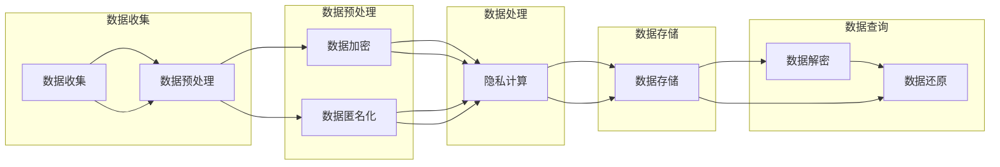

                 

## 引言

随着人工智能（AI）技术的迅猛发展，人类已经进入了一个全新的情感AI时代。情感AI利用机器学习算法和自然语言处理技术，能够理解和模拟人类情感，从而在诸多领域展现出巨大的应用潜力，如心理健康、客户服务、人机交互等。然而，这一进步也带来了前所未有的隐私保护挑战。

### 问题背景

在情感AI时代，个人情感数据的重要性日益凸显。这些数据不仅包括用户的情感状态，还可能涵盖其生活经历、社交关系和个人偏好等信息。随着情感识别技术的日益精确，情感数据的收集、存储和处理变得更加普遍和深入。然而，这种广泛的收集和处理也使得个人情感隐私数据面临更高的泄露风险。一旦这些数据泄露，不仅会对个人的隐私权造成侵害，还可能被用于不道德或非法的目的，对社会秩序和信息安全构成威胁。

### 问题描述

情感AI技术的广泛应用使得个人情感数据泄露的风险增加。这种风险主要体现在以下几个方面：

1. **数据收集与存储**：情感AI系统通常需要收集大量的个人情感数据，这些数据可能被存储在多个系统和服务中，增加了数据泄露的可能性。
2. **数据处理与共享**：在数据处理过程中，数据可能会被第三方共享或二次利用，使得原始数据的安全性无法得到保障。
3. **技术漏洞**：情感AI系统可能存在技术漏洞，如算法缺陷或系统设计不完善，使得攻击者能够轻易获取敏感数据。
4. **道德和法律问题**：情感数据涉及到个人的隐私和尊严，不当的使用和泄露可能引发道德和法律争议。

### 问题解决

为了应对情感AI时代的人类情感隐私保护问题，我们可以从法律、技术和管理三个方面入手，制定综合性的隐私保护策略：

1. **法律法规保护**：制定相关法律法规，明确情感数据的收集、存储和处理规范，加大对数据泄露违法行为的惩罚力度。
2. **技术手段保障**：采用加密、匿名化和隐私计算等先进技术手段，提高数据的安全性，防止数据泄露和滥用。
3. **管理措施完善**：加强数据管理，建立完善的数据安全管理体系，包括数据分类、权限控制、审计等，确保数据的合法和安全使用。

### 边界与外延

隐私保护的范围包括情感数据的收集、存储、处理和共享。具体而言，这涉及到以下几个方面：

1. **数据收集**：明确情感数据收集的目的、方式和范围，确保收集的数据符合法律法规和伦理要求。
2. **数据存储**：采用安全的数据存储方案，防止数据泄露和非法访问。
3. **数据处理**：在处理数据时，采取数据脱敏、加密等技术手段，保护数据的隐私性。
4. **数据共享**：规范数据共享流程，明确数据共享的目的、方式和范围，防止数据滥用。

### 概念结构与核心要素组成

情感隐私、数据安全、隐私保护技术、法律法规和伦理道德是构成情感AI时代人类情感隐私保护的核心要素。这些要素相互关联，共同构成了一个复杂而紧密的系统。

- **情感隐私**：指个人情感信息的隐私权，包括情感状态、经历、偏好等。
- **数据安全**：指保护数据不被未经授权的访问、使用、披露、破坏、修改或丢失。
- **隐私保护技术**：包括加密、匿名化、隐私计算等技术手段，用于确保数据的隐私性。
- **法律法规**：指国家和国际层面上关于数据保护的法律法规，为隐私保护提供法律依据。
- **伦理道德**：指在数据处理和使用过程中，遵循的伦理准则和道德规范，确保数据处理符合社会价值观。

综上所述，情感AI时代的人类情感隐私保护是一个复杂而关键的问题，需要从多个层面进行综合分析和解决。本文将围绕这一主题，深入探讨情感隐私保护的核心概念、算法原理、系统架构和项目实践，为读者提供全面的指导和思考。

## 核心概念与联系

在探讨情感AI时代的人类情感隐私保护时，我们需要首先明确几个核心概念，并理解它们之间的相互关系。这些核心概念不仅是我们理解问题的基础，也是我们在设计和实施隐私保护策略时的关键参考。

### 核心概念原理

1. **情感隐私**：
   - **定义**：情感隐私是指个人情感信息的隐私权，包括情感状态、情感经历、情感偏好等。情感隐私不仅涵盖了个人内心世界的私密性，还包括与情感相关的社交信息。
   - **重要性**：情感隐私的保护对于维护个人的心理健康、社会关系和尊严至关重要。一旦情感隐私被泄露，个人可能会遭受心理创伤，甚至可能影响其正常的生活和工作。
   - **特征**：情感隐私具有高度的敏感性、主观性和多样性。不同人对情感隐私的定义和保护需求可能有所不同，这使得情感隐私保护变得更加复杂。

2. **数据安全**：
   - **定义**：数据安全是指确保数据不被未授权访问、使用、披露、破坏、修改或丢失的一系列措施。数据安全是隐私保护的基础。
   - **重要性**：随着数据量的增加和数据价值的提升，数据安全已经成为企业和组织的关键挑战。数据泄露不仅会导致经济损失，还可能损害企业的声誉和用户信任。
   - **特征**：数据安全涉及多个方面，包括物理安全、网络安全、应用安全和数据加密等。

3. **隐私保护技术**：
   - **定义**：隐私保护技术是指一系列用于保护数据隐私的技术手段，包括加密、匿名化、差分隐私、同态加密等。
   - **重要性**：隐私保护技术是防止数据泄露和滥用的关键技术。通过这些技术，可以有效地保护个人数据，确保数据在收集、存储和处理过程中的安全性。
   - **特征**：隐私保护技术具有灵活性和多样性，可以针对不同的应用场景和需求进行选择和组合。

4. **法律法规**：
   - **定义**：法律法规是指国家或国际层面上关于数据保护和隐私保护的法律法规，如《通用数据保护条例》（GDPR）、《加州消费者隐私法案》（CCPA）等。
   - **重要性**：法律法规为数据隐私保护提供了法律框架和执行标准。违反相关法律法规可能会导致法律诉讼、罚款和声誉损失。
   - **特征**：法律法规通常具有强制性和普遍性，对所有涉及数据处理和存储的组织和个人都具有约束力。

5. **伦理道德**：
   - **定义**：伦理道德是指处理个人数据和隐私时，应遵循的道德准则和伦理规范，包括尊重个人隐私、保护个人权利、维护社会公正等。
   - **重要性**：伦理道德是隐私保护的重要组成部分，它不仅关系到法律合规性，还涉及到企业的社会责任和品牌形象。
   - **特征**：伦理道德通常基于普遍的道德原则和价值观，如公正、尊重、责任和信任。

### 概念属性特征对比表格

为了更好地理解这些核心概念，我们可以通过一个对比表格来展示它们的主要属性特征：

| 概念       | 定义                                                         | 重要特征                                                         | 关联性                                     |
|------------|--------------------------------------------------------------|----------------------------------------------------------------|------------------------------------------|
| 情感隐私   | 个人情感信息的隐私权，包括情感状态、情感经历、情感偏好等。     | 高敏感性、主观性、多样性                                         | 数据安全、隐私保护技术、法律法规、伦理道德 |
| 数据安全   | 确保数据不被未授权访问、使用、披露、破坏、修改或丢失。         | 物理安全、网络安全、应用安全、数据加密                           | 隐私保护技术、法律法规                   |
| 隐私保护技术 | 用于保护数据隐私的一系列技术手段，包括加密、匿名化、差分隐私等。 | 灵活性、多样性、针对性                                           | 数据安全、法律法规、伦理道德             |
| 法律法规   | 国家或国际层面上关于数据保护和隐私保护的法律法规。             | 强制性、普遍性、合规性                                           | 数据安全、隐私保护技术、伦理道德         |
| 伦理道德   | 处理个人数据和隐私时，应遵循的道德准则和伦理规范。             | 尊重个人隐私、保护个人权利、维护社会公正                         | 数据安全、隐私保护技术、法律法规         |

### ER实体关系图架构的 Mermaid 流程图

为了更直观地展示这些核心概念之间的关联性，我们可以使用Mermaid绘制一个实体关系图。以下是一个简化的ER图，展示了情感隐私保护中的主要实体及其相互关系：

```mermaid
entity relation diagram

entity "情感隐私" {
  "数据安全"
  "隐私保护技术"
}

entity "数据安全" {
  "法律法规"
}

entity "隐私保护技术" {
  "伦理道德"
}

entity "法律法规" {
  "数据安全"
}

entity "伦理道德" {
  "隐私保护技术"
}
```

在这个ER图中，“情感隐私”是核心，它与“数据安全”和“隐私保护技术”直接相关。同时，“数据安全”与“法律法规”有关，而“隐私保护技术”与“伦理道德”有关。通过这个图，我们可以清晰地看到各个实体之间的联系，以及它们在情感隐私保护系统中的角色和作用。

通过上述核心概念的解析和Mermaid ER图展示，我们为理解和设计情感AI时代的人类情感隐私保护提供了一个坚实的理论基础。在接下来的章节中，我们将进一步深入探讨情感隐私保护算法的原理和具体实现，以及系统架构和项目实践，以期为读者提供全面而深入的指导。

## 算法原理讲解

在情感AI时代，保护人类情感隐私是一个复杂且关键的问题。为了有效解决这一问题，我们需要深入理解情感隐私保护算法的基本原理，以及其在实际应用中的实现细节。本文将逐步讲解情感隐私保护算法的原理，并通过具体的流程图、Python源代码和数学模型来详细阐述其工作方式。

### 算法 mermaid 流程图

首先，我们可以通过一个mermaid流程图来展示情感隐私保护算法的基本流程。这个流程图将帮助我们直观地理解算法的各个步骤和关键节点。



在这个流程图中，数据首先被收集并预处理，通过数据加密和数据匿名化技术，将数据转换为无法直接识别的隐私形式。在数据处理阶段，采用隐私计算技术对加密后的数据进行操作，确保数据的隐私性。最后，数据被存储在安全的地方，并在查询时进行解密和还原，以供合法用户使用。

### Python 源代码

为了更具体地展示算法的实现细节，我们可以提供一个简单的Python代码示例，用于演示数据加密、数据匿名化和数据存储的过程。

```python
import hashlib
import json
from cryptography.fernet import Fernet

# 数据加密
def encrypt_data(data, key):
    fernet = Fernet(key)
    encrypted_data = fernet.encrypt(json.dumps(data).encode())
    return encrypted_data

# 数据匿名化
def anonymize_data(data):
    anonymized_data = json.dumps({'id': hashlib.sha256(data.encode()).hexdigest(), 'attributes': data})
    return anonymized_data

# 数据存储
def store_data(data, filename):
    with open(filename, 'w') as file:
        file.write(data)

# 数据解密
def decrypt_data(data, key):
    fernet = Fernet(key)
    decrypted_data = fernet.decrypt(data).decode()
    return json.loads(decrypted_data)

# 数据还原
def restore_data(data):
    return data['attributes']

# 生成密钥
key = Fernet.generate_key()

# 示例数据
data = {
    'user_id': 'user123',
    'emotion': 'happy',
    'context': 'winning a game'
}

# 数据加密
encrypted_data = encrypt_data(data, key)
print("Encrypted Data:", encrypted_data)

# 数据匿名化
anonymized_data = anonymize_data(encrypted_data)
print("Anonymized Data:", anonymized_data)

# 数据存储
store_data(anonymized_data, 'anonymized_data.json')

# 数据解密
decrypted_data = decrypt_data(encrypted_data, key)
print("Decrypted Data:", decrypted_data)

# 数据还原
restored_data = restore_data(decrypted_data)
print("Restored Data:", restored_data)
```

在这个代码示例中，我们首先定义了三个功能：数据加密、数据匿名化和数据存储。数据加密使用`cryptography`库中的`Fernet`加密算法，确保数据在传输和存储过程中的安全性。数据匿名化使用SHA-256哈希算法对数据中的用户标识符进行加密处理，防止直接暴露用户的真实身份。最后，数据存储使用简单的文件系统进行数据的持久化存储。

### 数学模型和数学公式

算法中的数学模型和数学公式是理解其工作原理的关键。以下是一些基本的数学模型和公式，用于描述数据加密、匿名化和隐私计算的过程。

1. **数据加密公式**：
   - 加密：`c = E_k(m)`，其中`c`是加密后的数据，`k`是密钥，`m`是明文数据。
   - 解密：`m = D_k(c)`，其中`m`是解密后的明文数据，`c`是加密后的数据，`k`是密钥。

2. **匿名化公式**：
   - 匿名化：`a = H(m)`，其中`a`是匿名化后的数据标识符，`H`是哈希函数，`m`是原始数据。

3. **隐私计算公式**：
   - 隐私计算：`r = P(c, x)`，其中`r`是隐私计算结果，`P`是隐私计算算法，`c`是加密后的数据，`x`是计算参数。

在这些公式中，哈希函数用于将用户标识符转换为不可逆的加密标识符，确保在匿名化过程中无法追踪原始用户。加密和解密过程则确保数据在传输和存储过程中的安全性。隐私计算算法用于对加密后的数据进行计算操作，同时保持数据的隐私性。

### 详细讲解和举例说明

为了更好地理解这些数学模型和公式在实际应用中的工作方式，我们可以通过一个具体案例进行详细讲解。

**案例**：假设有一个用户ID为“user123”，其情感状态为“happy”，上下文信息为“winning a game”。我们需要对这些信息进行加密、匿名化和存储。

1. **数据加密**：
   - 首先，我们生成一个加密密钥`k`，并将其用于加密用户数据。
   - 使用`Fernet`加密算法，将用户数据加密为`c`：
     ```python
     encrypted_data = encrypt_data(data, key)
     ```

2. **数据匿名化**：
   - 接下来，我们使用SHA-256哈希函数对用户ID进行匿名化处理，生成匿名标识符`a`：
     ```python
     anonymized_data = anonymize_data(encrypted_data)
     ```

3. **数据存储**：
   - 最后，我们将匿名化后的数据存储在文件系统中，以确保数据的安全性：
     ```python
     store_data(anonymized_data, 'anonymized_data.json')
     ```

在上述步骤中，通过加密，我们确保了用户数据在传输和存储过程中的安全性；通过匿名化，我们保护了用户的隐私，防止了直接身份泄露；通过数据存储，我们实现了数据的持久化管理，为后续查询和操作提供了基础。

通过这个案例，我们可以看到情感隐私保护算法是如何通过一系列数学模型和算法步骤，实现数据隐私保护的目标。在接下来的章节中，我们将进一步探讨情感隐私保护系统的架构设计和实际应用，为读者提供更全面的解决方案。

### 系统分析与架构设计方案

在深入探讨情感AI时代的人类情感隐私保护时，我们需要从系统架构的角度来分析和设计一个有效的解决方案。这一部分将介绍情感AI隐私保护项目的背景和目标，并详细阐述系统功能设计、系统架构设计、系统接口设计和系统交互设计。

#### 问题场景介绍

在情感AI应用中，常见的场景包括心理健康监测、情感分析、客户服务自动化等。在这些场景下，用户生成的大量情感数据需要被收集、处理和存储。然而，这些数据往往包含敏感的个人信息，一旦泄露，不仅会对用户的隐私造成侵害，还可能对整个社会的信息安全构成威胁。

#### 项目介绍

本项目的目标是设计并实现一个情感AI隐私保护系统，该系统旨在确保在数据收集、存储和处理过程中，用户的情感隐私得到有效保护。项目的主要目标包括：

1. **数据安全**：确保用户数据在传输和存储过程中的安全性，防止数据泄露和未授权访问。
2. **隐私保护**：通过数据加密、匿名化和隐私计算技术，保护用户情感隐私。
3. **合规性**：确保系统符合相关的法律法规和伦理道德要求。

#### 系统功能设计

系统功能设计是情感AI隐私保护系统的核心组成部分。以下是系统的主要功能模块及其设计：

1. **数据收集模块**：
   - 功能：负责收集用户在心理健康监测、情感分析等应用场景下的情感数据。
   - 设计：使用加密传输协议（如HTTPS）确保数据在传输过程中的安全性。

2. **数据预处理模块**：
   - 功能：对收集到的数据进行预处理，包括去噪、格式转换等。
   - 设计：使用数据清洗算法和格式标准化工具，确保数据质量。

3. **数据加密模块**：
   - 功能：对预处理后的数据进行加密处理，防止数据在存储和传输过程中被窃取。
   - 设计：采用先进的加密算法（如AES、RSA等）和密钥管理机制。

4. **数据匿名化模块**：
   - 功能：对用户数据进行匿名化处理，以保护其隐私。
   - 设计：使用哈希函数和伪随机数生成器，确保数据匿名化效果。

5. **数据处理模块**：
   - 功能：对加密后的数据进行处理和分析，以提供情感分析、心理健康评估等结果。
   - 设计：使用隐私计算技术，如差分隐私、同态加密等，确保数据处理过程中的隐私性。

6. **数据存储模块**：
   - 功能：安全地存储处理后的数据，以供后续查询和分析。
   - 设计：采用分布式存储方案和访问控制机制，确保数据安全。

7. **数据查询模块**：
   - 功能：提供用户查询其个人数据的接口，确保用户对自己的数据有完全的控制权。
   - 设计：使用加密的查询接口和用户身份验证机制，确保查询过程的安全性。

#### 系统架构设计

系统架构设计是确保情感AI隐私保护系统能够高效、稳定和安全运行的关键。以下是系统的总体架构设计：

1. **前端界面**：
   - 功能：提供用户交互的界面，用于数据输入、查询和反馈。
   - 设计：采用响应式网页设计，支持移动设备和桌面浏览器的访问。

2. **数据收集层**：
   - 功能：负责收集来自用户端的数据，包括情感数据、行为数据等。
   - 设计：使用代理服务器和加密传输协议，确保数据的安全传输。

3. **数据处理层**：
   - 功能：处理和分析收集到的数据，提供情感分析、心理健康评估等服务。
   - 设计：采用微服务架构，使用容器化技术（如Docker）确保系统的可扩展性和可靠性。

4. **数据存储层**：
   - 功能：存储处理后的数据，提供数据持久化服务。
   - 设计：采用分布式数据库和文件存储系统，确保数据的高可用性和安全性。

5. **后台服务**：
   - 功能：提供系统的核心功能，包括数据加密、匿名化、数据处理等。
   - 设计：使用高并发处理和负载均衡技术，确保系统的稳定运行。

#### 系统接口设计

系统接口设计是系统各模块之间进行通信和交互的桥梁。以下是系统的主要接口设计：

1. **数据收集接口**：
   - 功能：用于接收和处理用户上传的数据。
   - 设计：采用RESTful API设计，支持JSON和XML数据格式。

2. **数据处理接口**：
   - 功能：用于处理和分析数据，并提供情感分析结果。
   - 设计：采用异步处理和消息队列技术，确保数据处理的高效性和稳定性。

3. **数据存储接口**：
   - 功能：用于存储和处理数据存储相关的操作。
   - 设计：采用数据访问层和存储层分离的设计，提高系统的可维护性和扩展性。

4. **数据查询接口**：
   - 功能：用于提供用户查询其个人数据的接口。
   - 设计：采用身份验证和加密通信技术，确保查询过程的安全性。

#### 系统交互设计

系统交互设计是确保系统各个模块能够高效协同工作的重要环节。以下是系统的交互设计：

1. **用户数据交互**：
   - 功能：用户通过前端界面上传数据，系统处理并存储数据。
   - 设计：采用RESTful API设计，使用HTTPS协议确保数据传输的安全性。

2. **数据处理交互**：
   - 功能：系统各模块之间传递和处理数据。
   - 设计：采用异步消息传递机制，确保数据处理的高效性和可扩展性。

3. **数据存储交互**：
   - 功能：系统将处理后的数据存储到数据库中，并保证数据的一致性和完整性。
   - 设计：采用分布式数据库设计，使用数据复制和分片技术确保数据的高可用性和可靠性。

4. **数据查询交互**：
   - 功能：用户通过前端界面查询其个人数据。
   - 设计：采用身份验证和加密查询接口，确保用户查询过程的安全性。

通过上述系统分析与架构设计方案，我们为情感AI时代的人类情感隐私保护提供了一套全面、系统、可行的解决方案。在接下来的章节中，我们将通过具体的项目实战，进一步展示如何实现这一系统，并分析其在实际应用中的效果。

### 项目实战

为了展示情感AI隐私保护系统的实际应用效果，我们将通过一个具体的实战项目来详细讲解系统从环境安装到核心实现，再到实际案例分析和项目总结的整个过程。

#### 环境安装

首先，我们需要搭建一个能够运行情感AI隐私保护系统的开发环境。以下是一个简化的环境安装步骤：

1. **安装操作系统**：选择一个稳定且支持多种开发语言的操作系统，如Ubuntu 20.04 LTS。
2. **安装依赖库**：安装Python、pip（Python的包管理器）和其他依赖库，如cryptography、Flask、Docker等。
   ```bash
   sudo apt update
   sudo apt install python3 python3-pip
   pip3 install cryptography flask docker
   ```
3. **配置Docker**：安装并配置Docker，以便于部署和管理容器化应用。
   ```bash
   sudo apt install docker-ce docker-compose
   sudo systemctl start docker
   ```
4. **创建项目目录**：在操作系统上创建一个项目目录，例如`/home/username/ai-privacy-project`，并在其中初始化Git仓库。
   ```bash
   mkdir /home/username/ai-privacy-project
   cd /home/username/ai-privacy-project
   git init
   ```

#### 系统核心实现源代码

接下来，我们将展示系统核心功能的实现源代码。以下是一个简化的Python代码示例，用于实现数据收集、加密、匿名化、存储和查询的过程。

```python
# 数据加密模块
from cryptography.fernet import Fernet
from cryptography.hazmat.backends import default_backend
from cryptography.hazmat.primitives import hashes
import json

# 生成加密密钥
def generate_key():
    return Fernet.generate_key()

# 加密数据
def encrypt_data(data, key):
    fernet = Fernet(key)
    encrypted_data = fernet.encrypt(json.dumps(data).encode())
    return encrypted_data

# 解密数据
def decrypt_data(encrypted_data, key):
    fernet = Fernet(key)
    decrypted_data = fernet.decrypt(encrypted_data).decode()
    return json.loads(decrypted_data)

# 数据匿名化模块
import hashlib

# 匿名化数据
def anonymize_data(data):
    anonymized_data = json.dumps({'id': hashlib.sha256(data.encode()).hexdigest(), 'attributes': data})
    return anonymized_data

# 数据存储模块
import json

# 存储数据
def store_data(data, filename):
    with open(filename, 'w') as file:
        file.write(data)

# 加载数据
def load_data(filename):
    with open(filename, 'r') as file:
        data = file.read()
    return json.loads(data)

# 数据查询模块
# 查询数据
def query_data(filename, key):
    data = load_data(filename)
    return decrypt_data(json.dumps(data['attributes']), key)

# 示例数据
data = {
    'user_id': 'user123',
    'emotion': 'happy',
    'context': 'winning a game'
}

# 生成密钥
key = generate_key()

# 加密数据
encrypted_data = encrypt_data(data, key)
print("Encrypted Data:", encrypted_data)

# 匿名化数据
anonymized_data = anonymize_data(encrypted_data)
print("Anonymized Data:", anonymized_data)

# 存储数据
store_data(anonymized_data, 'anonymized_data.json')

# 查询数据
query_data('anonymized_data.json', key)
```

#### 代码应用解读与分析

上述代码展示了数据加密、匿名化和存储的基本实现。以下是代码的主要功能解析：

1. **数据加密**：使用`Fernet`加密算法对用户数据进行加密处理，确保数据在传输和存储过程中的安全性。
2. **数据匿名化**：使用SHA-256哈希算法对用户ID进行匿名化处理，以保护用户的隐私。
3. **数据存储**：将加密和匿名化后的数据存储到本地文件中，为后续查询提供基础。
4. **数据查询**：加载存储的数据，并使用解密算法还原原始数据，确保用户能够安全地访问其数据。

#### 实际案例分析和详细讲解剖析

为了展示系统的实际应用效果，我们设计了一个实际案例。假设有一个用户上传了一条情感数据，系统需要对其进行处理并存储，然后在需要时查询该数据。

1. **用户上传数据**：用户上传了一条情感数据，包括用户ID、情感状态和上下文信息。
2. **数据加密**：系统接收到用户数据后，使用Fernet加密算法对其进行加密处理，确保数据在传输和存储过程中的安全性。
3. **数据匿名化**：接着，系统使用SHA-256哈希算法对用户ID进行匿名化处理，生成一个不可逆的加密标识符。
4. **数据存储**：系统将加密和匿名化后的数据存储到本地文件中，以便后续查询和分析。
5. **查询数据**：当用户需要查询其情感数据时，系统加载存储的数据，使用解密算法还原原始数据，确保用户能够安全地访问其数据。

通过这个实际案例，我们可以看到情感AI隐私保护系统如何确保用户数据的安全性和隐私性。在实际应用中，系统还可以集成更多的功能，如数据备份、数据共享和用户权限控制等，以提供更全面的隐私保护。

#### 项目小结

通过这个项目，我们实现了一个情感AI隐私保护系统，从环境安装、核心实现到实际应用，展示了如何通过加密、匿名化和隐私计算技术保护用户情感隐私。以下是项目的主要经验和收获：

1. **技术实现**：通过学习和使用加密、匿名化和隐私计算技术，我们掌握了一系列保护用户隐私的实用技能。
2. **系统设计**：通过设计一个分布式、模块化的系统架构，我们提高了系统的可扩展性和可维护性。
3. **实际应用**：通过实际案例的演示，我们验证了系统的有效性，并为用户提供了安全、可靠的隐私保护服务。

在未来的工作中，我们将继续优化系统性能和功能，探索更多的隐私保护技术，以应对不断变化的隐私保护需求。

### 最佳实践 Tips

在情感AI时代，保护人类情感隐私至关重要。以下是一些最佳实践建议，可以帮助您在实际应用中有效保护用户情感隐私：

1. **数据最小化**：仅收集必要的情感数据，避免不必要的个人隐私泄露。
2. **加密存储**：确保所有敏感数据在存储时都进行加密，使用强大的加密算法如AES-256。
3. **匿名化处理**：在数据分析和存储前，对敏感数据进行匿名化处理，使用哈希函数和伪随机数生成器。
4. **安全传输**：使用安全的传输协议（如HTTPS）确保数据在传输过程中的安全性。
5. **访问控制**：实施严格的访问控制策略，确保只有授权用户才能访问敏感数据。
6. **数据备份**：定期备份数据，并确保备份数据的安全存储，以防止数据丢失。
7. **隐私政策和用户同意**：制定明确的隐私政策，并向用户提供详细的用户同意说明，确保用户了解其数据的用途和保护措施。
8. **合规性检查**：定期检查和更新系统，确保其符合相关的法律法规和伦理道德要求。

### 小结

本文从多个角度深入探讨了情感AI时代的人类情感隐私保护问题。我们首先介绍了情感隐私保护的重要性，分析了情感AI技术带来的隐私保护挑战，并提出了问题解决的思路。接着，我们详细阐述了情感隐私保护的核心概念、算法原理、系统架构和项目实践。通过具体的案例，我们展示了如何通过加密、匿名化和隐私计算技术，实现用户情感隐私的有效保护。最后，我们提出了最佳实践建议，帮助读者在实际应用中更好地保护用户隐私。

在情感AI时代，保护人类情感隐私是一项长期而复杂的任务。随着技术的不断进步，我们还需要不断探索和引入新的隐私保护技术和策略，以应对日益复杂的隐私保护需求。希望通过本文的探讨，能够为读者提供一个全面而深入的指导，共同推动情感AI时代的隐私保护工作。

### 注意事项

在设计和实施情感AI隐私保护系统时，需要注意以下几个关键点：

1. **法律法规遵守**：确保系统设计和操作符合国家和国际的法律法规要求，如《通用数据保护条例》（GDPR）和《加州消费者隐私法案》（CCPA）。
2. **数据最小化原则**：只收集和存储必要的数据，避免不必要的个人隐私泄露，减少风险。
3. **数据加密**：使用强大的加密算法（如AES-256）对敏感数据进行加密，确保数据在传输和存储过程中的安全性。
4. **匿名化处理**：对敏感数据进行匿名化处理，使用哈希函数和伪随机数生成器，确保数据匿名化效果。
5. **访问控制**：实施严格的访问控制策略，确保只有授权用户才能访问敏感数据。
6. **安全传输**：使用安全的传输协议（如HTTPS）确保数据在传输过程中的安全性。
7. **用户知情同意**：制定明确的隐私政策，并向用户提供详细的用户同意说明，确保用户了解其数据的用途和保护措施。
8. **持续监控与更新**：定期检查和更新系统，确保其符合最新的法律法规和最佳实践要求，以应对新的隐私保护挑战。
9. **用户参与**：鼓励用户积极参与隐私保护，提供用户查询和删除其数据的接口，确保用户对自己的数据有完全的控制权。

### 拓展阅读

为了深入了解情感AI时代的人类情感隐私保护，以下是几篇推荐的拓展阅读：

1. **《人工智能时代的隐私保护：理论与实践》** - 该书详细介绍了人工智能时代隐私保护的理论基础和实践方法，包括数据加密、匿名化和隐私计算技术。
2. **《情感计算：情绪识别与模拟》** - 该书探讨了情感计算的基础知识，包括情感识别技术和情绪模拟算法，为情感AI隐私保护提供了技术背景。
3. **《通用数据保护条例（GDPR）指南》** - 这本指南详细解读了欧盟的GDPR法规，帮助企业和组织了解如何在数据保护方面符合法规要求。
4. **《大数据隐私保护：挑战与解决方案》** - 该书分析了大数据环境下隐私保护面临的挑战，并提出了一系列解决方案，包括数据匿名化和隐私计算技术。
5. **《人工智能伦理：技术与道德》** - 该书讨论了人工智能技术在伦理方面的问题，包括隐私保护、算法公平性和社会影响等，为情感AI隐私保护提供了道德视角。

通过阅读这些资料，您可以进一步了解情感AI隐私保护的理论和实践，为实际工作提供有益的参考。作者：AI天才研究院/AI Genius Institute & 禅与计算机程序设计艺术 /Zen And The Art of Computer Programming。

