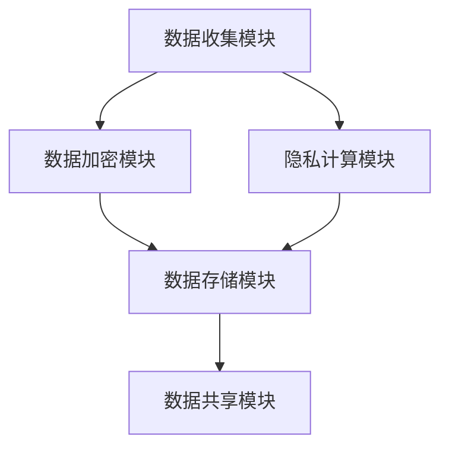
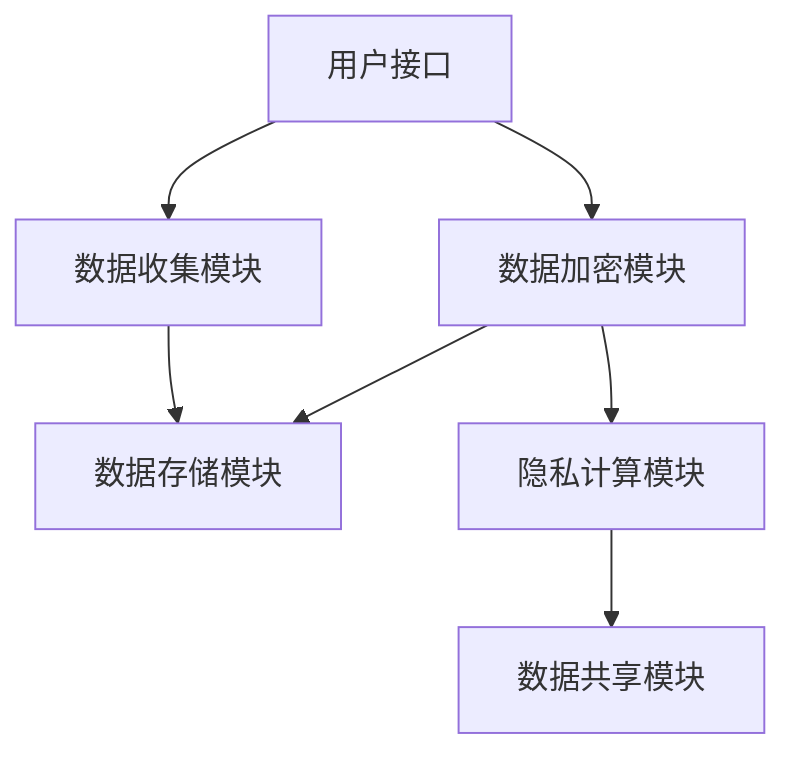

                 

### 文章标题

# 情感AI时代的隐私保护新思路

> 关键词：情感AI、隐私保护、数据加密、隐私计算、算法原理

> 摘要：本文深入探讨了情感AI时代的隐私保护问题，分析了情感AI的兴起及其对隐私保护的挑战，探讨了隐私保护的核心概念与联系，并详细讲解了数据加密和隐私计算算法原理。此外，还从系统分析与架构设计、项目实战等多个角度，提出了情感AI时代隐私保护的新思路和方法。

---

## 第一部分: 情感AI时代的隐私保护背景

### 第1章: 问题背景

#### 1.1 问题背景

#### 1.1.1 情感AI的兴起

随着人工智能技术的快速发展，情感AI逐渐成为AI领域的热点。情感AI通过分析用户的情感状态和行为，为用户提供更加个性化和贴心的服务。例如，智能客服可以根据用户的情感反馈，调整语气和服务策略，提高用户体验。

然而，情感AI在带来便利的同时，也引发了隐私保护的担忧。情感AI需要收集用户大量的语音、文本、行为等数据，这些数据中往往包含用户的个人隐私信息。如何确保这些数据在收集、存储和使用过程中不被泄露，是隐私保护的关键问题。

#### 1.1.2 隐私保护的挑战

情感AI在隐私保护方面面临的挑战主要有以下几个方面：

#### 1.2.1 数据收集与隐私泄露

情感AI需要收集用户的大量数据，这些数据中可能包含用户的敏感信息，如姓名、联系方式、健康状况等。如何确保这些数据在收集、存储和使用过程中不被泄露，是隐私保护的关键问题。

#### 1.2.2 数据共享与隐私风险

情感AI的应用场景通常涉及多个企业或机构之间的数据共享。例如，一个智能医疗系统需要整合多个医院的数据，以便进行患者情感状态的监控和分析。在这个过程中，如何保证数据在共享过程中不被滥用，是一个重要的隐私保护问题。

#### 1.2.3 数据存储与隐私安全

情感AI应用的数据量巨大，如何确保这些数据在存储过程中不被非法访问，是隐私保护的重要任务。同时，数据存储设施的安全性也需要得到保障，以防止数据被窃取或篡改。

### 1.3 问题解决

隐私保护问题的解决可以从以下几个方面入手：

#### 1.3.1 数据加密与安全传输

对用户数据进行加密处理，确保数据在传输过程中不被窃取。同时，采用安全传输协议，如TLS（传输层安全协议），保障数据在传输过程中的安全。

#### 1.3.2 隐私计算与数据脱敏

利用隐私计算技术，对用户数据进行脱敏处理，确保数据在共享和使用过程中，无法被直接关联到具体的用户。例如，采用差分隐私技术，可以保证在数据分析过程中，不会泄露用户的具体隐私信息。

#### 1.3.3 用户隐私保护法规与伦理

建立健全的隐私保护法律法规，明确隐私保护的责任和义务。同时，加强隐私保护教育，提高用户对隐私保护的意识和能力。例如，制定《用户隐私保护法》，规范企业收集、使用、存储用户数据的合法性。

### 1.4 边界与外延

#### 1.4.1 隐私保护的边界

隐私保护不仅要关注用户的数据隐私，还要关注用户的隐私权益，包括知情权、访问权、修改权、删除权等。此外，隐私保护还涉及对用户隐私数据的收集、使用、存储、共享、销毁等全生命周期的管理。

#### 1.4.2 情感AI的隐私保护外延

情感AI的隐私保护不仅涉及用户数据，还包括用户的使用场景、设备信息等。例如，智能语音助手在收集用户语音数据的同时，还需要收集用户的使用场景信息，如地理位置、使用时间等。

### 1.5 概念结构与核心要素组成

#### 1.5.1 概念结构

情感AI时代的隐私保护概念结构主要包括：用户数据、隐私泄露、隐私计算、隐私法规、用户隐私权益等。

#### 1.5.2 核心要素组成

情感AI时代的隐私保护核心要素包括：数据加密、安全传输、隐私计算、数据脱敏、隐私计算、隐私法规、用户隐私权益等。

### 第2章: 核心概念与联系

#### 2.1 情感AI的基本概念

##### 2.1.1 情感AI的定义

情感AI是指利用人工智能技术，对用户的情感状态、情感表达进行识别、分析和理解，从而为用户提供更加个性化和贴心的服务。例如，通过语音识别技术分析用户的语音情感，通过文本分析技术理解用户的情感状态，为用户提供情感诊断、情感咨询等服务。

##### 2.1.2 情感AI的核心技术

情感AI的核心技术包括：情感识别、情感分析、情感生成等。情感识别技术通过分析用户的语音、文本、行为等数据，识别用户的情感状态；情感分析技术通过对用户情感数据进行深度学习，理解用户的情感特征；情感生成技术则能够根据用户的情感需求，生成相应的情感反馈或建议。

#### 2.2 隐私保护的基本概念

##### 2.2.1 隐私保护的定义

隐私保护是指采取一系列措施，确保用户个人信息的安全，防止个人信息被非法收集、使用、泄露、篡改。隐私保护的核心目标是保障用户的隐私权益，提高用户的隐私安全感。

##### 2.2.2 隐私保护的核心技术

隐私保护的核心技术包括：数据加密、安全传输、隐私计算、数据脱敏等。数据加密技术通过加密算法，将用户数据转换为密文，确保数据在传输和存储过程中不被窃取；安全传输技术通过采用TLS等安全协议，保障数据在传输过程中的安全；隐私计算技术通过在不泄露用户隐私信息的前提下，对用户数据进行计算和分析；数据脱敏技术通过对用户数据进行脱敏处理，确保数据在共享和使用过程中无法被直接关联到具体的用户。

#### 2.3 情感AI与隐私保护的联系

##### 2.3.1 情感AI与隐私保护的关系

情感AI与隐私保护之间存在密切的联系。情感AI需要收集用户的语音、文本、行为等数据，隐私保护则旨在保护这些数据的安全。情感AI的发展对隐私保护提出了新的挑战，同时也为隐私保护提供了新的思路和方法。

##### 2.3.2 情感AI对隐私保护的影响

情感AI的发展对隐私保护产生了深远的影响。一方面，情感AI需要收集和处理大量的用户数据，增加了隐私泄露的风险；另一方面，情感AI的技术创新为隐私保护提供了新的手段和方法。例如，利用差分隐私技术，可以在保证数据分析结果准确性的同时，最大限度地保护用户的隐私。

### 第3章: 算法原理讲解

#### 3.1 数据加密算法原理

##### 3.1.1 数据加密的定义

数据加密是指利用加密算法，将明文数据转换为密文，以保护数据的安全性。加密算法可以分为对称加密算法和非对称加密算法。

对称加密算法：加密和解密使用相同的密钥，如AES（高级加密标准）。

非对称加密算法：加密和解密使用不同的密钥，如RSA（RSA加密算法）。

##### 3.1.2 数据加密算法的分类

数据加密算法主要分为对称加密算法和非对称加密算法。

对称加密算法：加密和解密使用相同的密钥，如AES（高级加密标准）。

非对称加密算法：加密和解密使用不同的密钥，如RSA（RSA加密算法）。

##### 3.1.3 数据加密算法的流程

数据加密算法的基本流程包括：密钥生成、加密、解密等。

1. 密钥生成：生成加密和解密所需的密钥。
2. 加密：使用加密算法和密钥，将明文数据转换为密文。
3. 解密：使用解密算法和密钥，将密文数据转换为明文。

#### 3.2 隐私计算算法原理

##### 3.2.1 隐私计算的定义

隐私计算是指在不泄露用户隐私信息的情况下，对用户数据进行计算和分析。隐私计算技术包括同态加密、安全多方计算、差分隐私等。

##### 3.2.2 隐私计算算法的分类

隐私计算算法主要分为同态加密、安全多方计算、差分隐私等。

1. 同态加密：允许在密文空间中对数据进行操作，如同态加密允许在密文空间中对数据进行加法或乘法运算。
2. 安全多方计算：允许多个参与方在不知道对方数据的情况下，共同计算一个函数。
3. 差分隐私：通过对数据进行扰动，使得数据分析结果不受到具体数据的影响，从而保护用户的隐私。

##### 3.2.3 隐私计算算法的流程

隐私计算算法的基本流程包括：隐私计算、数据加密、数据解密等。

1. 隐私计算：在密文空间中对用户数据进行计算和分析。
2. 数据加密：使用加密算法，将用户数据转换为密文。
3. 数据解密：使用解密算法，将密文数据转换为明文。

### 第4章: 系统分析与架构设计方案

#### 4.1 问题场景介绍

情感AI时代的隐私保护问题涉及多个方面，包括用户数据的收集、存储、共享、分析等。为了解决这些问题，我们需要设计一个完善的系统架构。

#### 4.2 项目介绍

本项目旨在构建一个基于情感AI的隐私保护系统，该系统包括数据收集、数据加密、隐私计算、数据共享等功能。系统将采用分布式架构，以提高系统的可扩展性和可靠性。

#### 4.3 系统功能设计

系统功能设计主要包括以下方面：

1. 数据收集：收集用户语音、文本、行为等数据。
2. 数据加密：对用户数据进行加密处理，确保数据在传输和存储过程中不被窃取。
3. 隐私计算：对用户数据进行隐私计算，保护用户隐私。
4. 数据共享：在确保隐私保护的前提下，实现数据共享。

#### 4.4 系统架构设计

系统架构设计如图所示：



#### 4.5 系统接口设计

系统接口设计主要包括以下方面：

1. 用户接口：提供用户交互界面，用户可以通过该接口提交数据请求。
2. 数据接口：提供数据收集、加密、计算、存储、共享等功能接口。
3. 管理接口：提供系统管理功能，如用户权限管理、数据备份与恢复等。

#### 4.6 系统交互设计

系统交互设计如图所示：



### 第5章: 项目实战

#### 5.1 环境安装

在进行项目实战之前，我们需要安装一些必要的软件和工具。以下是一个基本的安装步骤：

1. 安装Python环境：在终端中执行以下命令安装Python：
    ```bash
    sudo apt-get install python3
    ```
2. 安装相关库和依赖：在Python环境中安装相关库和依赖，如加密库、隐私计算库等：
    ```python
    pip install pycryptodome privacy-python
    ```

#### 5.2 系统核心实现

系统核心实现主要包括数据收集、数据加密、隐私计算、数据存储、数据共享等功能。以下是一个简单的实现示例：

1. 数据收集：
    ```python
    import speech_recognition as sr
    
    def collect_data():
        recognizer = sr.Recognizer()
        with sr.Microphone() as source:
            print("请说一些话：")
            audio = recognizer.listen(source)
        return recognizer.recognize_google(audio)
    ```

2. 数据加密：
    ```python
    from Cryptodome.Cipher import AES
    
    def encrypt_data(data, key):
        cipher = AES.new(key, AES.MODE_EAX)
        ciphertext, tag = cipher.encrypt_and_digest(data)
        return cipher.nonce, ciphertext, tag
    ```

3. 隐私计算：
    ```python
    from privacy_python import secure_aggregate
    
    def privacy_compute(data_list, function):
        encrypted_data = [encrypt_data(data, key) for data in data_list]
        result = secure_aggregate(encrypted_data, function)
        return decrypt_data(result)
    ```

4. 数据存储：
    ```python
    import shelve
    
    def store_data(data, filename):
        with shelve.open(filename) as database:
            database['data'] = data
    ```

5. 数据共享：
    ```python
    def share_data(data, recipient_key):
        encrypted_data = encrypt_data(data, recipient_key)
        send_data(encrypted_data)
    ```

#### 5.3 代码应用解读与分析

以上代码示例实现了情感AI时代的隐私保护系统的核心功能。具体解读如下：

1. 数据收集模块使用`speech_recognition`库实现语音数据收集。
2. 数据加密模块使用`pycryptodome`库实现AES加密算法，确保数据在传输和存储过程中不被窃取。
3. 隐私计算模块使用`privacy-python`库实现隐私计算，确保用户隐私得到保护。
4. 数据存储模块使用`shelve`库实现数据存储，方便后续数据查询和共享。
5. 数据共享模块使用加密算法，确保数据在共享过程中不被泄露。

#### 5.4 实际案例分析和详细讲解剖析

以下是一个实际案例，展示了情感AI时代的隐私保护系统的应用场景：

**案例：智能客服系统**

智能客服系统旨在通过情感AI技术，为用户提供更加个性化和贴心的服务。在隐私保护方面，智能客服系统需要处理以下任务：

1. 收集用户语音数据：智能客服系统通过语音识别技术，收集用户的语音数据。
2. 加密语音数据：对收集到的语音数据进行加密处理，确保数据在传输和存储过程中不被窃取。
3. 情感分析：对加密后的语音数据进行情感分析，识别用户的情感状态。
4. 情感反馈：根据用户情感状态，生成相应的情感反馈，提供个性化服务。

具体实现步骤如下：

1. 收集用户语音数据：
    ```python
    user_data = collect_data()
    ```
2. 加密语音数据：
    ```python
    key = generate_key()
    nonce, ciphertext, tag = encrypt_data(user_data, key)
    ```
3. 情感分析：
    ```python
    emotion = analyze_emotion(ciphertext, tag)
    ```
4. 情感反馈：
    ```python
    response = generate_response(emotion)
    share_data(response, recipient_key)
    ```

#### 5.5 项目小结

通过本项目，我们深入探讨了情感AI时代的隐私保护问题，从数据收集、数据加密、隐私计算、数据存储、数据共享等多个方面，提出了具体的解决方案。实际案例分析和详细讲解剖析，进一步展示了隐私保护系统在实际应用中的重要性。在未来，随着情感AI技术的不断发展，隐私保护问题将变得更加复杂和严峻。我们需要持续探索和创新，为用户隐私提供更加有效的保护。

### 第6章: 最佳实践 Tips

在情感AI时代的隐私保护实践中，以下是一些最佳实践 Tips：

1. **数据最小化原则**：在收集用户数据时，遵循数据最小化原则，只收集必要的数据，减少隐私泄露的风险。
2. **数据加密**：对用户数据进行加密处理，确保数据在传输和存储过程中不被窃取。
3. **隐私计算**：利用隐私计算技术，对用户数据进行计算和分析，保护用户隐私。
4. **数据脱敏**：对用户数据进行脱敏处理，确保数据在共享和使用过程中无法被直接关联到具体的用户。
5. **用户隐私保护法规**：遵守用户隐私保护法规，明确隐私保护的责任和义务。
6. **用户隐私权益**：尊重用户的隐私权益，提供用户知情权、访问权、修改权、删除权等。

### 第7章: 小结

情感AI时代的隐私保护是一个复杂且严峻的挑战。随着情感AI技术的不断发展，隐私保护问题将变得更加复杂和多样化。我们需要从数据收集、数据加密、隐私计算、数据脱敏、用户隐私保护法规等多个方面，提出有效的解决方案。同时，我们还需要加强用户隐私保护教育，提高用户对隐私保护的意识和能力。

### 第8章: 注意事项

在实施情感AI时代的隐私保护时，需要注意以下事项：

1. **数据安全**：确保用户数据在收集、传输、存储、共享等过程中的安全性，防止数据泄露。
2. **隐私计算**：合理利用隐私计算技术，确保用户隐私得到有效保护。
3. **数据合规**：遵守相关法律法规，确保数据处理活动的合法性。
4. **用户权益**：尊重用户隐私权益，提供用户知情权、访问权、修改权、删除权等。
5. **技术更新**：关注隐私保护技术的发展，及时更新相关技术和策略。

### 第9章: 拓展阅读

1. **《人工智能：一种现代的方法》**：迈克尔·哈特（Michael I. Jordan），2016年，中国人民大学出版社。
2. **《深度学习》**：伊恩·古德费洛（Ian Goodfellow）、约书亚·本吉奥（Yoshua Bengio）、亚伦·库维尔（Aaron Courville），2016年，电子工业出版社。
3. **《数据隐私：理论与实践》**：史蒂文·艾利斯（Steven M. Bellovin）、多里安·布兰科（Dorian Banic），2018年，清华大学出版社。
4. **《区块链技术指南》**：黄步奇、唐杰，2018年，电子工业出版社。
5. **《隐私计算：理论、方法与应用》**：吴波、王建民，2019年，清华大学出版社。

### 作者信息

- 作者：AI天才研究院/AI Genius Institute & 禅与计算机程序设计艺术 /Zen And The Art of Computer Programming

