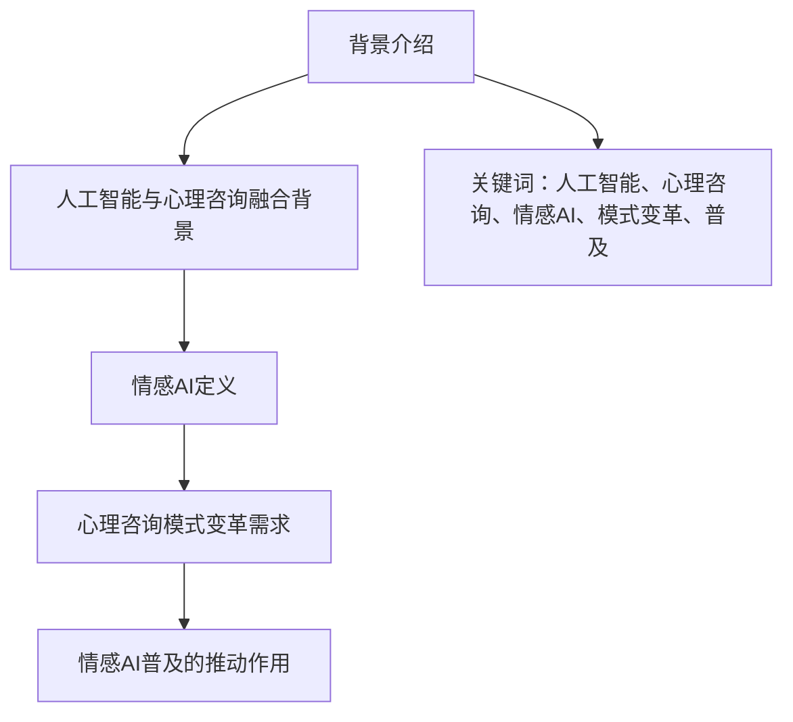
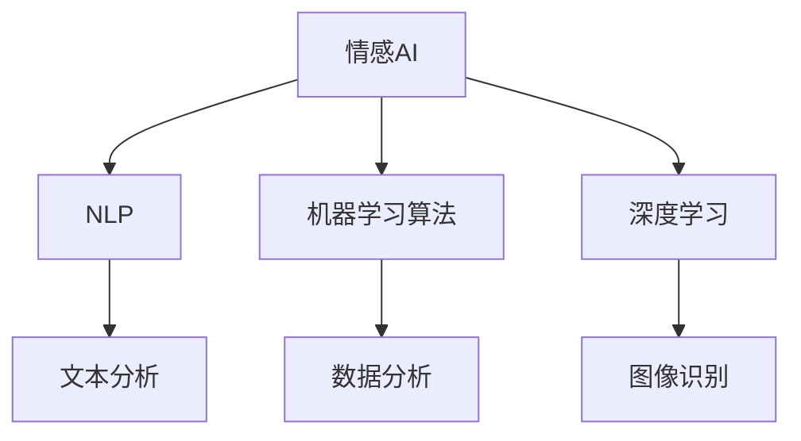
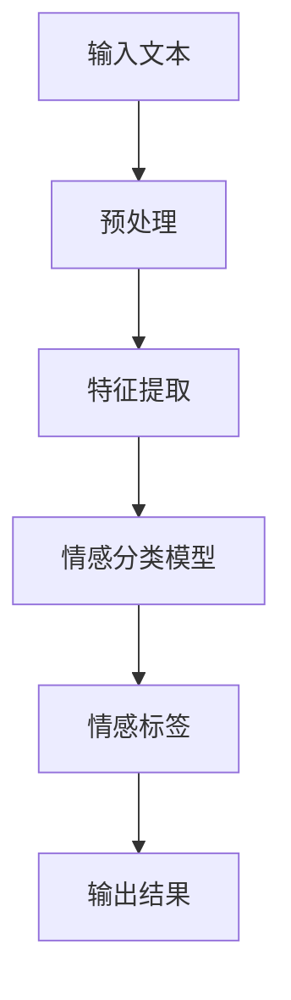
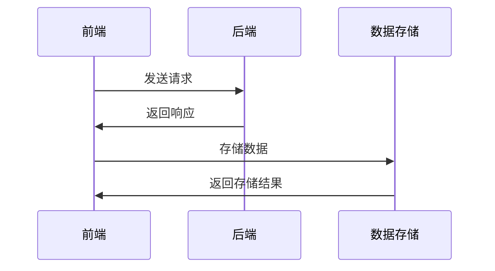
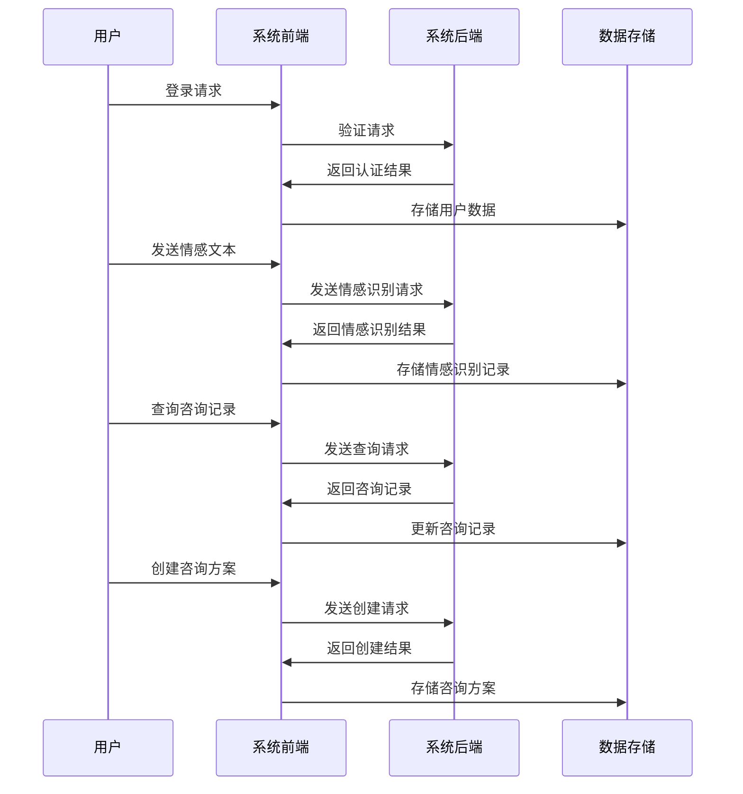

                 

### 1. 背景介绍

#### 1.1 人工智能与心理咨询的融合背景

在当今社会，人工智能（AI）技术的飞速发展正深刻改变着各个行业。在心理咨询领域，人工智能的应用也逐渐受到关注。随着AI技术的不断进步，特别是情感AI的快速发展，心理咨询模式正迎来一场变革。情感AI，作为人工智能的一个重要分支，专注于理解和模拟人类情感，通过自然语言处理（NLP）和机器学习算法，实现对人类情感的精准识别与分析。

首先，心理咨询面临的挑战日益突出。现代社会中，心理健康问题日益严重，越来越多的人需要专业的心理咨询。然而，心理咨询资源分布不均，一些偏远地区和心理专家资源匮乏的地方，人们难以获得及时有效的帮助。此外，传统的心理咨询模式在处理复杂情感问题时，往往存在效率低下、个性化不足等问题。

#### 1.2 人工智能在心理咨询领域的应用

人工智能在心理咨询领域的应用主要体现在以下几个方面：

1. **情感识别与分析**：利用情感AI技术，心理咨询师可以更准确地识别和评估来访者的情绪状态，从而提供更为精准的咨询服务。
2. **个性化咨询方案**：基于大数据和机器学习，人工智能可以为每位来访者量身定制个性化的咨询方案，提高咨询效果。
3. **自动化评估工具**：通过AI技术，心理咨询师可以自动化地进行来访者心理状态的评估，减少人为误差，提高工作效率。
4. **心理干预与治疗效果评估**：利用AI技术，心理咨询师可以实时监控来访者的心理状态变化，及时调整干预策略，提高治疗效果。

#### 1.3 情感AI的发展现状

情感AI技术已经取得了显著进展。目前，许多情感识别与分析工具已经能够实现高准确度地识别人类情感，如喜悦、愤怒、悲伤等。同时，随着深度学习和神经网络的进一步发展，情感AI在理解复杂情感和微表情识别方面的能力也在不断提升。

#### 1.4 心理咨询模式变革的需求

传统心理咨询模式面临着诸多挑战，如资源分布不均、个性化不足等。为了解决这些问题，心理咨询模式迫切需要变革。情感AI的普及为这种变革提供了强有力的支持。通过情感AI技术，心理咨询可以更加精准、高效，且覆盖范围更广，从而更好地满足人们日益增长的心理健康需求。

#### 1.5 情感AI普及的推动作用

情感AI技术的普及，不仅提高了心理咨询的效率和质量，也推动了心理咨询模式的创新和发展。通过情感AI，心理咨询师可以更好地理解和应对来访者的情感需求，实现更为精准和个性化的服务。同时，情感AI也为心理咨询领域的跨学科研究提供了新的可能性，如结合心理学、社会学、医学等多学科知识，共同探索心理健康的解决方案。

### 1.6 总结与思考

在本文中，我们探讨了人工智能，特别是情感AI在心理咨询领域的应用背景、现状及其对心理咨询模式变革的推动作用。接下来，我们将深入分析情感AI的核心概念和技术，进一步探讨其在心理咨询中的应用和潜力。

### 1.6 结论

综上所述，情感AI的普及为心理咨询领域带来了前所未有的变革机遇。通过情感AI技术，心理咨询可以更加精准、高效，覆盖更广泛的人群。然而，这一变革也带来了新的挑战，如伦理、隐私和安全等问题。在接下来的章节中，我们将详细探讨这些挑战，并提出相应的解决方案。

### 1.7 接下来内容概述

在接下来的章节中，我们将首先介绍情感AI的基础理论，包括核心概念、关键技术及其在心理咨询中的应用前景。然后，我们将详细探讨新型心理咨询模式的特点、核心要素及其实施流程。随后，通过具体应用实践案例，展示情感AI在心理咨询中的实际应用效果。最后，我们将对情感AI与心理咨询的发展趋势、未来研究方向进行展望，并总结全书的主要观点与结论。

---



通过上述Markdown格式的Mermaid流程图，我们清晰地展示了章节1中的核心概念和逻辑结构，为读者理解文章奠定了基础。

### 2. 情感AI的核心概念

#### 2.1 情感AI的定义

情感AI，即情感人工智能，是指利用人工智能技术模拟、识别和理解人类情感的能力。情感AI的核心目标是通过算法和模型，实现对人类情感状态的高精度识别和分析。具体来说，情感AI技术包括对文本、语音、图像等多种数据源的情感识别，以实现对人类情绪、情感状态和情感变化的精准捕捉和解读。

#### 2.2 情感AI的关键技术

情感AI的实现依赖于多种核心技术的支持，主要包括自然语言处理（NLP）、机器学习算法、深度学习等。

1. **自然语言处理（NLP）**：NLP是情感AI的基础，它涉及语言的理解、生成和处理。通过NLP技术，情感AI可以理解和分析文本中的情感信息，包括文本情感极性分析、情感分类等。

2. **机器学习算法**：机器学习算法是情感AI的核心组成部分。常见的机器学习算法包括决策树、支持向量机（SVM）、神经网络等。这些算法通过训练模型，从大量数据中学习如何识别和分类情感。

3. **深度学习**：深度学习是近年来发展迅速的一种机器学习技术，尤其在情感AI中具有重要应用。深度学习通过构建多层神经网络，可以从原始数据中自动学习复杂的特征表示，从而提高情感识别的准确性和鲁棒性。

#### 2.3 情感AI与心理咨询的关联

情感AI在心理咨询中的应用，主要体现在以下几个方面：

1. **情感识别与分析**：通过情感AI技术，心理咨询师可以更准确地识别来访者的情感状态，如愤怒、悲伤、焦虑等，从而更有效地制定咨询方案。

2. **个性化咨询方案**：基于情感AI的分析结果，心理咨询师可以量身定制个性化的咨询方案，提高咨询的针对性和效果。

3. **自动化评估工具**：情感AI技术可以自动化地进行来访者心理状态的评估，减少人为误差，提高工作效率。

4. **心理干预与治疗效果评估**：利用情感AI，心理咨询师可以实时监控来访者的情感变化，及时调整干预策略，提高治疗效果。

#### 2.4 情感AI在心理咨询中的应用前景

随着情感AI技术的不断进步，其在心理咨询领域的应用前景也越来越广阔。未来，情感AI有望在以下几个方面实现突破：

1. **情感微表情识别**：通过高精度的情感微表情识别，心理咨询师可以更好地理解来访者的非言语情感表达，从而提供更为全面的咨询服务。

2. **情感辅助治疗**：利用情感AI的实时情感分析，心理咨询师可以辅助进行情感干预和治疗，提高治疗效果。

3. **跨学科融合**：情感AI与其他学科的结合，如心理学、医学、社会学等，将推动心理咨询模式的创新和发展。

4. **心理健康监测与预防**：情感AI技术可以用于大规模的心理健康监测和预防，及时发现潜在的心理健康问题，提供及时有效的干预。

#### 2.5 情感AI在心理咨询中的优势

情感AI在心理咨询中的优势主要体现在以下几个方面：

1. **高效性**：情感AI技术可以快速、准确地识别和分析情感，大大提高心理咨询的效率。

2. **精准性**：基于大数据和机器学习算法，情感AI可以提供更为精准的情感分析结果，帮助心理咨询师制定更有效的咨询方案。

3. **个性化**：情感AI可以根据每个来访者的情感状态，提供个性化的咨询服务，提高咨询效果。

4. **便捷性**：情感AI技术可以实现远程咨询，打破地域限制，让更多人能够享受到专业心理咨询服务。

### 2.6 情感AI在心理咨询中的应用实例

为了更好地理解情感AI在心理咨询中的应用，以下是一些具体实例：

1. **情感评估工具**：心理咨询师可以使用情感评估工具，如智能聊天机器人，与来访者进行互动，实时获取其情感状态，并生成情感分析报告，为咨询提供依据。

2. **个性化咨询方案**：通过情感AI的分析结果，心理咨询师可以为来访者量身定制个性化的咨询方案，包括情感调节技巧、认知行为疗法等，提高咨询效果。

3. **心理干预**：在心理干预过程中，情感AI可以帮助心理咨询师实时监测来访者的情感变化，及时调整干预策略，确保干预的针对性和有效性。

4. **心理健康监测**：情感AI技术可以应用于大规模心理健康监测，如学校、企业等场所，及时发现心理问题，提供及时干预。

通过上述分析，我们可以看出，情感AI在心理咨询中具有巨大的应用潜力，能够为心理咨询师提供强有力的技术支持，提高咨询效果，满足更多人的心理健康需求。

### 2.7 总结与思考

在本章节中，我们详细介绍了情感AI的核心概念、关键技术及其在心理咨询中的应用前景。通过这些内容，读者可以清晰地了解到情感AI在心理咨询中的重要性和潜在价值。在接下来的章节中，我们将进一步探讨新型心理咨询模式的特点和实施流程，帮助读者全面理解情感AI在心理咨询领域的实际应用。

### 2.8 结论

情感AI的快速发展为心理咨询领域带来了新的机遇和挑战。通过自然语言处理、机器学习算法和深度学习等技术，情感AI能够精准识别和分析人类情感，为心理咨询师提供强有力的技术支持。这种技术不仅提高了心理咨询的效率和质量，也为个性化、精准化的心理咨询模式提供了可能。然而，情感AI在心理咨询中的应用也面临诸多挑战，如伦理、隐私和安全等问题。在接下来的章节中，我们将深入探讨这些挑战，并提出相应的解决方案。

### 2.9 接下来内容概述

在接下来的章节中，我们将首先介绍新型心理咨询模式的特点，分析其与传统心理咨询模式的区别和优势。然后，我们将详细探讨新型心理咨询模式的核心要素，包括情感识别与分析、个性化咨询方案设计、心理干预与治疗效果评估等。随后，通过具体应用实践案例，我们将展示情感AI在心理咨询中的实际应用效果。最后，我们将对情感AI与心理咨询的发展趋势和未来研究方向进行展望。

### 2.10 核心概念与联系

在深入探讨情感AI在心理咨询中的应用之前，有必要对核心概念进行详细说明，并展示这些概念之间的联系。

#### 2.10.1 核心概念原理

1. **情感AI**：
   - **定义**：情感AI是指利用人工智能技术模拟、识别和理解人类情感的能力。
   - **原理**：通过自然语言处理（NLP）、机器学习算法和深度学习等技术，情感AI可以实现对文本、语音和图像等数据源的情感状态进行高精度识别和分析。

2. **自然语言处理（NLP）**：
   - **定义**：NLP是计算机科学和人工智能领域的一个分支，旨在使计算机能够理解、生成和处理人类语言。
   - **原理**：NLP技术包括分词、词性标注、句法分析、情感分析等，通过这些技术，计算机可以处理和理解自然语言文本。

3. **机器学习算法**：
   - **定义**：机器学习是一种人工智能分支，通过训练模型，使计算机能够从数据中学习规律，并自动作出决策或预测。
   - **原理**：机器学习算法包括监督学习、无监督学习和强化学习等，通过训练数据和模型参数，算法可以识别数据中的特征和模式。

4. **深度学习**：
   - **定义**：深度学习是一种基于多层神经网络的机器学习技术，通过构建复杂神经网络，自动从数据中学习特征表示。
   - **原理**：深度学习通过反向传播算法优化网络参数，从而提高模型在各类任务上的性能。

#### 2.10.2 概念属性特征对比表格

为了更好地理解这些核心概念，我们可以通过以下表格展示它们的属性特征对比：

| 概念     | 定义                                         | 主要应用                     | 特征对比                   |
|----------|--------------------------------------------|-----------------------------|---------------------------|
| 情感AI   | 利用AI技术模拟、识别和理解人类情感             | 心理咨询、情感分析、情绪监测 | 精准性、高效性、个性化     |
| 自然语言处理（NLP） | 使计算机能理解、生成和处理人类语言              | 文本分析、语义理解、语言生成 | 自动化、高精度、多语言支持 |
| 机器学习算法 | 从数据中学习规律，自动作出决策或预测             | 数据分析、预测、自动化决策   | 自适应、可扩展、多样化     |
| 深度学习   | 基于多层神经网络的机器学习技术，自动学习特征表示 | 图像识别、语音识别、自然语言理解 | 复杂性、高效性、高精度     |

#### 2.10.3 ER实体关系图架构

为了进一步展示这些核心概念之间的关系，我们可以使用Mermaid绘制一个ER实体关系图：



在这个ER实体关系图中，情感AI作为核心，与自然语言处理、机器学习算法和深度学习紧密关联。自然语言处理和机器学习算法是情感AI实现情感识别与分析的基础技术，而深度学习则进一步提升了情感AI的识别精度和处理能力。

通过上述对比表格和ER实体关系图，我们清晰地展示了情感AI、自然语言处理、机器学习算法和深度学习等核心概念之间的联系，为读者理解后续内容提供了坚实基础。

### 2.11 算法原理讲解

在深入探讨情感AI在心理咨询中的应用之前，有必要详细讲解情感识别与分析算法的原理，包括其mermaid流程图、Python源代码、数学模型和公式，并通过具体实例进行通俗易懂的举例说明。

#### 2.11.1 情感识别与分析算法mermaid流程图

首先，我们可以通过Mermaid绘制一个情感识别与分析算法的流程图，以展示其基本步骤和逻辑：



在这个流程图中，输入文本经过预处理（B）后，提取出关键特征（C），然后输入到情感分类模型（D）中进行分类，最终输出情感标签（E）。

#### 2.11.2 Python源代码示例

接下来，我们将通过一个简单的Python源代码示例，展示情感识别与分析算法的实现过程。这里使用一个基于自然语言处理和机器学习算法的文本情感分类模型：

```python
import nltk
from sklearn.feature_extraction.text import TfidfVectorizer
from sklearn.model_selection import train_test_split
from sklearn.svm import LinearSVC
from sklearn.metrics import classification_report

# 预处理文本数据
def preprocess_text(text):
    # 删除标点符号和停用词
    tokens = nltk.word_tokenize(text)
    filtered_tokens = [token.lower() for token in tokens if token.isalnum() and token not in nltk.corpus.stopwords.words('english')]
    return ' '.join(filtered_tokens)

# 加载和预处理数据集
data = [
    ("I'm feeling happy today!", "positive"),
    ("I'm feeling sad today...", "negative"),
    ("This is amazing!", "positive"),
    ("This is terrible...", "negative")
]
texts, labels = zip(*data)
preprocessed_texts = [preprocess_text(text) for text in texts]

# 特征提取
vectorizer = TfidfVectorizer()
X = vectorizer.fit_transform(preprocessed_texts)

# 划分训练集和测试集
X_train, X_test, y_train, y_test = train_test_split(X, labels, test_size=0.2, random_state=42)

# 情感分类模型训练
classifier = LinearSVC()
classifier.fit(X_train, y_train)

# 情感分类预测
y_pred = classifier.predict(X_test)

# 情感分类报告
print(classification_report(y_test, y_pred))
```

在这个示例中，我们首先定义了一个预处理函数`preprocess_text`，用于去除文本中的标点符号和停用词，并将文本转换为小写。然后，使用TF-IDF向量器进行特征提取，将预处理后的文本转换为数值特征。接着，我们使用线性支持向量机（LinearSVC）进行情感分类模型的训练和预测，并输出分类报告。

#### 2.11.3 数学模型和公式

在情感识别与分析算法中，常用的数学模型和公式包括：

1. **TF-IDF（Term Frequency-Inverse Document Frequency）**：
   - **公式**：\( TF(t) = \frac{f_t}{f_t + \sqrt{N - f_t}} \)
   - \( IDF(t) = \log \left( \frac{N}{df(t)} \right) \)
   - **计算**：其中，\( f_t \) 是词 \( t \) 在文档 \( d \) 中的频率，\( N \) 是文档总数，\( df(t) \) 是词 \( t \) 在所有文档中的出现频率。

2. **线性支持向量机（Linear Support Vector Machine, SVM）**：
   - **公式**：\( w \cdot x + b = 0 \)
   - **优化目标**：最小化 \( \frac{1}{2} ||w||^2 \)，其中 \( w \) 是权重向量，\( x \) 是特征向量，\( b \) 是偏置。

#### 2.11.4 具体实例讲解

假设我们有一个文本句子：“I'm feeling happy today!”，我们需要将其分类为“positive”或“negative”情感。以下是具体的步骤和过程：

1. **预处理文本**：
   - 原始文本：I'm feeling happy today!
   - 预处理后：i'm feeling happy today

2. **特征提取**：
   - 使用TF-IDF向量器提取特征，生成特征向量。

3. **情感分类模型**：
   - 使用线性支持向量机（SVM）进行情感分类模型的训练和预测。

4. **输出结果**：
   - 情感分类结果：positive

通过上述具体实例，我们可以清晰地看到情感识别与分析算法的实现过程和步骤，包括文本预处理、特征提取、情感分类模型训练和预测等。这些步骤和过程共同构成了情感AI在心理咨询中的核心技术，为心理咨询师提供了强有力的技术支持。

### 2.12 系统分析与架构设计

在深入探讨情感AI在心理咨询中的应用之前，我们需要对系统进行详细的分析和架构设计。这一部分将包括问题场景介绍、项目介绍、系统功能设计（领域模型类图）、系统架构设计（架构图）、系统接口设计和系统交互（序列图）。

#### 2.12.1 问题场景介绍

在现代社会，心理健康问题日益突出。然而，心理咨询资源分布不均，特别是在偏远地区和心理专家资源匮乏的地方，人们难以获得及时有效的帮助。传统心理咨询模式存在效率低下、个性化不足等问题，难以满足广大人群的心理健康需求。因此，我们需要一种新型心理咨询模式，能够利用情感AI技术，提供高效、精准、个性化的心理咨询服务。

#### 2.12.2 项目介绍

本项目旨在开发一种基于情感AI的新型心理咨询系统，通过自然语言处理、机器学习算法和深度学习等技术，实现对来访者情感状态的高精度识别与分析。系统功能包括情感识别、个性化咨询方案设计、心理干预与治疗效果评估等。项目目标是为心理咨询师提供技术支持，提高心理咨询的效率和质量，同时为来访者提供便捷、高效的心理健康服务。

#### 2.12.3 系统功能设计（领域模型类图）

在系统功能设计中，我们首先需要定义系统的主要领域模型。以下是系统领域模型类图：

```mermaid
classDiagram
    class心理咨询师 {
        - 用户ID
        - 姓名
        - 职称
        - 专业领域
    }
    class来访者 {
        - 用户ID
        - 姓名
        - 性别
        - 年龄
        - 联系方式
    }
    class情感状态 {
        - 情感ID
        - 情感类型
        - 情感强度
    }
    class咨询记录 {
        - 记录ID
        - 咨询师ID
        - 来访者ID
        - 咨询时间
        - 情感状态
    }
    class咨询方案 {
        - 方案ID
        - 咨询师ID
        - 来访者ID
        - 方案内容
        - 方案效果
    }
    心理咨询师 --|＞ 来访者
    来访者 --|＞ 咨询记录
    来访者 --|＞ 咨询方案
    咨询记录 --|＞ 情感状态
    咨询方案 --|＞ 情感状态
```

在这个类图中，心理咨询师、来访者、情感状态、咨询记录和咨询方案是系统的主要领域模型。心理咨询师与来访者之间存在关联关系，来访者可以产生咨询记录和咨询方案，而咨询记录和咨询方案又与情感状态密切相关。

#### 2.12.4 系统架构设计（架构图）

接下来，我们将展示系统架构设计。系统架构主要包括前端、后端和数据存储三层结构：



在这个架构图中，前端负责用户交互，后端处理业务逻辑和数据存储。前端发送请求到后端，后端处理请求并返回响应。同时，前端也可以直接与数据存储层进行交互，存储用户数据。

#### 2.12.5 系统接口设计

系统接口设计主要包括以下接口：

1. **用户认证接口**：用于用户登录、注册和权限管理。
2. **情感识别接口**：用于接收文本输入，返回情感状态。
3. **咨询记录接口**：用于创建、查询和更新咨询记录。
4. **咨询方案接口**：用于创建、查询和更新咨询方案。

#### 2.12.6 系统交互（序列图）

以下是系统交互的序列图：



在这个序列图中，用户通过前端与系统进行交互，后端处理用户请求，并返回结果。同时，系统前端与数据存储层进行数据交互，确保数据的存储和更新。

通过上述系统分析与架构设计，我们为情感AI在心理咨询中的应用提供了清晰的系统架构和功能设计，为后续的实现和应用奠定了基础。

### 3.1 传统心理咨询模式回顾

传统心理咨询模式是一种历史悠久、广泛应用的心理服务方式，其核心在于心理咨询师与来访者之间的互动和沟通。这一模式主要依赖于心理咨询师的专业知识和经验，通过面对面的交流，帮助来访者识别、理解和解决心理问题。以下是传统心理咨询模式的基本流程、方法和技巧。

#### 3.1.1 心理咨询的基本流程

1. **初次访谈**：初次访谈是心理咨询的起点，主要目的是建立信任关系，了解来访者的基本信息和问题背景。心理咨询师通过开放式问题引导来访者表达，同时进行初步的心理评估。

2. **心理评估**：在初次访谈的基础上，心理咨询师会对来访者进行更深入的心理评估，包括使用标准化的心理测评工具，如心理健康量表、人格测验等，以获得更全面的心理信息。

3. **制定咨询方案**：根据心理评估的结果，心理咨询师会与来访者共同制定个性化的咨询方案，明确咨询目标、方法和预期效果。

4. **实施咨询**：在咨询过程中，心理咨询师会运用各种心理咨询技巧，如倾听、提问、反馈、情感反映等，与来访者进行深入交流，帮助其认识和理解心理问题。

5. **评估与反馈**：在咨询结束后，心理咨询师会与来访者进行回顾和反馈，评估咨询效果，并根据需要调整咨询方案。

6. **结束咨询**：当咨询目标达成或来访者情况有所改善时，心理咨询师会与来访者讨论结束咨询的时间和方法，确保咨询的顺利结束。

#### 3.1.2 心理咨询的方法与技巧

1. **倾听与理解**：倾听是心理咨询的核心技巧之一，心理咨询师需要全神贯注地倾听来访者的倾诉，理解其情绪和心理状态。

2. **提问与探索**：通过开放式提问，心理咨询师可以帮助来访者深入探索内心世界，揭示潜在的心理问题。

3. **情感反映**：情感反映是指心理咨询师将来访者的情感表达反馈给来访者，帮助其认识和理解自己的情绪。

4. **指导与支持**：心理咨询师会根据来访者的需求，提供适当的指导和支持，帮助其应对心理问题。

5. **反思与总结**：在咨询过程中，心理咨询师会与来访者一起反思和总结，强化其自我认知和问题解决能力。

#### 3.1.3 传统心理咨询模式的局限性

尽管传统心理咨询模式在许多情况下取得了良好效果，但其也面临着一些局限性：

1. **资源限制**：心理咨询师的数量和资源有限，特别是在偏远地区，心理咨询的普及和服务能力受到很大限制。

2. **个性化不足**：传统心理咨询模式通常采用统一的方法和技巧，难以满足每位来访者的个性化需求。

3. **效率低下**：心理咨询通常需要较长时间的面谈，效率相对较低，难以快速响应来访者的需求。

4. **地域限制**：传统心理咨询模式依赖于面对面交流，受到地域和时间的限制，难以实现远程咨询。

5. **隐私保护**：心理咨询涉及个人隐私，传统模式在保护隐私方面存在一定的挑战。

### 3.1.4 新型心理咨询模式的需求

随着社会的发展和科技水平的提高，人们对心理咨询的需求日益增长，但传统心理咨询模式难以满足这些需求。因此，新型心理咨询模式的需求变得迫切：

1. **资源扩展**：为了解决心理咨询资源分布不均的问题，新型心理咨询模式需要利用科技手段，扩大心理咨询的覆盖范围，实现资源的最大化利用。

2. **个性化服务**：新型心理咨询模式需要更加注重个性化服务，通过大数据和人工智能技术，为每位来访者提供量身定制的咨询方案。

3. **效率提升**：随着生活节奏的加快，人们希望心理咨询能够更加高效，新型心理咨询模式需要通过自动化工具和技术提高咨询效率。

4. **远程服务**：为了克服地域限制，新型心理咨询模式需要提供远程咨询服务，方便来访者随时随地获得专业帮助。

5. **隐私保护**：在新型心理咨询模式中，如何有效保护来访者的隐私成为关键问题，需要采取严格的隐私保护措施。

### 3.1.5 情感AI普及的推动作用

情感AI的普及为新型心理咨询模式提供了强有力的支持。通过情感AI技术，心理咨询师可以更精准地识别和分析来访者的情感状态，实现个性化、精准化的咨询服务。以下是情感AI普及在心理咨询中的应用：

1. **情感识别与分析**：情感AI技术可以快速、准确地识别和分析来访者的情感状态，为心理咨询师提供科学依据，提高咨询的针对性和效果。

2. **个性化咨询方案**：基于情感AI的分析结果，心理咨询师可以为来访者量身定制个性化的咨询方案，包括情感调节技巧、认知行为疗法等，提高咨询效果。

3. **心理干预与治疗效果评估**：情感AI技术可以帮助心理咨询师实时监控来访者的情感变化，及时调整干预策略，提高治疗效果。

4. **自动化评估工具**：情感AI技术可以自动化地进行来访者心理状态的评估，减少人为误差，提高工作效率。

5. **心理健康监测**：情感AI技术可以应用于大规模心理健康监测，如学校、企业等场所，及时发现心理问题，提供及时干预。

总之，情感AI的普及为新型心理咨询模式的发展提供了新的机遇和可能性，推动了心理咨询模式的创新和变革。通过情感AI技术，心理咨询可以更加高效、精准和个性化，更好地满足人们日益增长的心理健康需求。

### 3.2 新型心理咨询模式的特点

随着人工智能技术的不断发展，心理咨询领域也在经历深刻的变革。新型心理咨询模式融合了情感AI技术，具有以下显著特点，这些特点使其在效率、个性化、精准化和便捷性方面显著优于传统模式。

#### 3.2.1 以情感AI为基础的服务模式

新型心理咨询模式的核心在于将情感AI技术深度融入服务流程中，从而实现更高效、精准的咨询服务。情感AI技术通过自然语言处理（NLP）、机器学习算法和深度学习等方法，能够对来访者的文本、语音和面部表情等数据进行分析，准确识别其情感状态。这种精准的情感识别与分析能力，使得心理咨询师能够更全面地了解来访者的内心世界，为个性化咨询提供科学依据。

#### 3.2.2 个性化与精准化的心理咨询

传统心理咨询模式通常采用统一的方法和技巧，难以满足每位来访者的个性化需求。而新型心理咨询模式通过大数据和情感AI技术，可以为每位来访者量身定制个性化的咨询方案。例如，基于情感AI的情感识别和分析结果，心理咨询师可以针对来访者的具体情感状态，推荐相应的情感调节技巧和认知行为疗法，从而提高咨询的针对性和效果。

#### 3.2.3 模块化与平台化的心理咨询体系

新型心理咨询模式具有模块化和平台化的特点，使其可以灵活地应用于不同场景和需求。模块化的设计使得心理咨询服务可以根据不同用户的需求进行定制，例如，针对学校、企业等不同场景，可以开发专门的模块化咨询方案。平台化的心理咨询体系则可以实现资源的共享和协作，心理咨询师、来访者、数据分析师等不同角色可以在同一个平台上进行互动和协作，提高工作效率。

#### 3.2.4 高效性与实时性

情感AI技术的高效性和实时性是新型心理咨询模式的另一个显著特点。通过情感AI，心理咨询师可以快速地识别和分析来访者的情感状态，从而在短时间内制定出针对性的咨询方案。此外，情感AI还可以自动化地进行心理状态评估，减少心理咨询师的重复性劳动，提高工作效率。这种高效性不仅能够更好地满足来访者的需求，还能缓解心理咨询资源短缺的问题。

#### 3.2.5 便捷性与覆盖面广

新型心理咨询模式通过线上平台和移动应用，实现了咨询服务的便捷性和覆盖面广。来访者可以在任何时间、任何地点通过手机或电脑访问心理咨询系统，进行咨询预约、咨询记录查看和心理测评等操作。这种便捷性大大降低了心理咨询的门槛，使得更多人能够享受到专业、高效的心理咨询服务。

#### 3.2.6 数据驱动的决策支持

情感AI技术为心理咨询师提供了强大的数据驱动决策支持。通过对大量心理数据的分析和挖掘，情感AI可以识别出潜在的心理问题和趋势，为心理咨询师提供有价值的决策依据。例如，心理咨询师可以根据情感AI的分析结果，提前预测来访者的情感变化，及时调整咨询策略，提高咨询效果。

#### 3.2.7 心理健康监测与预防

新型心理咨询模式还具备心理健康监测与预防的功能。通过情感AI技术，心理咨询师可以实时监控来访者的心理状态，及时发现潜在的心理问题，提供及时、有效的干预措施。这种实时监测与预防机制，有助于降低心理健康问题的发生率和严重程度，提升整体心理健康水平。

#### 3.2.8 跨学科融合与创新

新型心理咨询模式强调跨学科融合，将心理学、医学、社会学、人工智能等多学科知识相结合，共同探索心理健康的解决方案。这种跨学科融合不仅拓宽了心理咨询的视野，也为新型心理咨询模式的创新提供了源源不断的动力。

总之，新型心理咨询模式通过情感AI技术的应用，实现了个性化、精准化、模块化、平台化、高效性、便捷性和数据驱动的服务模式，为心理咨询领域带来了前所未有的变革和发展机遇。随着情感AI技术的不断进步，新型心理咨询模式将在未来发挥越来越重要的作用，为更多人的心理健康提供有力保障。

### 3.3 新型心理咨询模式的核心要素

新型心理咨询模式的核心要素包括情感识别与分析、个性化咨询方案设计、心理干预与治疗效果评估等，这些要素共同构成了新型心理咨询模式的基石，提升了咨询的精准度和效果。以下是这些核心要素的详细解释。

#### 3.3.1 情感识别与分析

情感识别与分析是新型心理咨询模式的基础。通过自然语言处理（NLP）、机器学习算法和深度学习等技术，情感AI能够对文本、语音和图像等多种数据源进行情感分析，准确识别出人类情感的类型和强度。这一过程包括以下几个关键步骤：

1. **数据采集**：首先，从各种渠道采集与来访者相关的文本、语音和图像数据。这些数据可以来自于聊天记录、音频文件、视频监控等。
   
2. **预处理**：对采集到的数据进行预处理，包括文本的分词、标点符号的去除、停用词的过滤等，以便提取有效的情感信息。

3. **特征提取**：使用NLP技术提取文本的关键特征，如词汇的频率、词性、短语等。对于语音和图像数据，则利用声学模型和面部识别技术提取相应的特征。

4. **情感分类**：利用训练好的机器学习模型（如SVM、CNN等）对特征进行分类，识别出文本、语音或图像中的情感类型。常见的情感分类包括正面情感、负面情感、中性情感等。

5. **情感强度评估**：除了识别情感的类型外，情感AI还可以对情感的强度进行评估，例如，对一段文字中的愤怒、喜悦等情感进行量化。

#### 3.3.2 个性化咨询方案设计

个性化咨询方案设计是新型心理咨询模式的重要环节。基于情感识别与分析的结果，心理咨询师可以为来访者量身定制个性化的咨询方案，提高咨询的针对性和效果。以下是这一过程的关键步骤：

1. **方案制定**：根据情感识别与分析的结果，心理咨询师会与来访者讨论，了解其具体需求和期望。结合来访者的问题背景、情感状态和个性特点，心理咨询师制定个性化的咨询方案。

2. **方案内容**：个性化咨询方案通常包括情感调节技巧、认知行为疗法、心理教育等。例如，对于情绪低落的来访者，心理咨询师可能会推荐正念冥想、认知重构等方法。

3. **方案实施**：心理咨询师会指导来访者实施咨询方案，并通过线上或线下的方式进行跟踪和反馈。在实施过程中，心理咨询师会根据来访者的反馈和情感变化，及时调整方案内容。

4. **效果评估**：在咨询过程中，心理咨询师会定期评估来访者的情感状态和咨询效果，确保咨询方案的适宜性和有效性。

#### 3.3.3 心理干预与治疗效果评估

心理干预与治疗效果评估是新型心理咨询模式的保障。通过情感AI技术，心理咨询师可以实时监控来访者的情感变化，及时调整干预策略，提高治疗效果。以下是这一过程的关键步骤：

1. **实时监控**：心理咨询师利用情感AI技术，实时监测来访者的情感状态，包括在线聊天、语音通话、视频会议等。这种实时监控有助于心理咨询师及时了解来访者的情感需求和心理变化。

2. **数据收集**：在监控过程中，心理咨询师会收集来访者的情感数据，如情绪波动、情感反应等。这些数据有助于心理咨询师评估来访者的心理状态和咨询效果。

3. **效果评估**：基于收集到的数据，心理咨询师会定期进行效果评估，分析咨询方案的有效性和来访者的情感改善情况。例如，通过比较咨询前后的情感状态，评估咨询方案的适宜性和有效性。

4. **调整干预策略**：根据效果评估的结果，心理咨询师会及时调整干预策略，优化咨询方案。例如，对于情感波动较大的来访者，心理咨询师可能会增加情感调节技巧的练习，或者调整咨询的频率和时长。

5. **反馈与总结**：在咨询结束后，心理咨询师会与来访者进行反馈和总结，讨论咨询过程中的得失，并为未来可能的咨询制定计划。

通过上述核心要素的有机结合，新型心理咨询模式能够提供高效、精准、个性化的心理咨询服务，满足来访者的多样化需求，提升整体心理健康水平。

### 3.4 新型心理咨询模式的实施流程

新型心理咨询模式的实施流程旨在通过情感AI技术，实现高效、精准和个性化的心理咨询服务。以下是新型心理咨询模式的具体实施步骤：

#### 3.4.1 咨询预约与登记

1. **在线预约**：来访者可以通过心理咨询系统的在线预约功能，选择合适的心理咨询师和时间。系统会记录来访者的预约信息，并生成预约确认通知。

2. **登记信息**：在预约成功后，来访者需要填写个人信息表，包括姓名、性别、年龄、联系方式等。系统会自动将这些信息录入数据库，为后续服务提供数据支持。

#### 3.4.2 初次访谈

1. **建立信任关系**：心理咨询师在初次访谈时，通过倾听和提问，与来访者建立信任关系。这一过程有助于来访者放松心态，愿意分享自己的心理问题。

2. **情感识别与分析**：心理咨询师利用情感AI技术，对来访者的文本、语音和面部表情等数据进行分析，初步识别其情感状态。这一结果将作为制定个性化咨询方案的基础。

3. **心理评估**：心理咨询师会使用标准化的心理测评工具，如心理健康量表、人格测验等，对来访者的心理状态进行更深入评估。

#### 3.4.3 制定个性化咨询方案

1. **方案制定**：根据情感识别与分析的结果和心理评估报告，心理咨询师会与来访者讨论，制定个性化的咨询方案。方案内容包括情感调节技巧、认知行为疗法、心理教育等。

2. **方案确认**：心理咨询师会与来访者共同确认咨询方案，明确咨询目标、方法和预期效果。来访者会收到一份书面咨询方案，了解整个咨询过程。

#### 3.4.4 实施咨询

1. **情感监测**：在每次咨询过程中，心理咨询师会通过情感AI技术，实时监测来访者的情感状态，确保咨询方案的有效性和适宜性。

2. **方案实施**：心理咨询师会指导来访者实施咨询方案，包括情感调节技巧的练习、认知行为疗法的方法等。在实施过程中，心理咨询师会根据来访者的反馈和情感变化，及时调整方案内容。

3. **情感反馈**：在每次咨询结束后，心理咨询师会与来访者进行情感反馈，讨论咨询过程中的收获和困惑，为下一次咨询做好准备。

#### 3.4.5 评估与总结

1. **效果评估**：在咨询结束后，心理咨询师会定期对来访者的情感状态和咨询效果进行评估，确保咨询方案的适宜性和有效性。

2. **反馈与总结**：心理咨询师会与来访者进行反馈和总结，讨论咨询过程中的得失，并根据评估结果调整未来的咨询计划。

#### 3.4.6 结束咨询

1. **咨询结束**：当咨询目标达成或来访者情况有所改善时，心理咨询师会与来访者讨论结束咨询的时间和方法，确保咨询的顺利结束。

2. **跟踪服务**：对于需要长期关注的心理健康问题，心理咨询师会提供跟踪服务，确保来访者的心理状态稳定。

通过上述实施流程，新型心理咨询模式能够为来访者提供高效、精准和个性化的心理咨询服务，满足其多样化需求，提升整体心理健康水平。

### 3.5 情感AI在心理咨询中的具体应用

情感AI在心理咨询中的具体应用，主要体现在情感识别与分析、个性化咨询方案设计、心理干预与治疗效果评估等多个方面。以下将详细描述这些应用场景及其实际操作步骤。

#### 3.5.1 情感识别与分析

情感识别与分析是情感AI在心理咨询中应用的基础。通过自然语言处理（NLP）和机器学习算法，情感AI能够对文本、语音和面部表情等数据进行分析，识别出人类情感的类型和强度。

1. **应用场景**：情感识别与分析可以应用于在线聊天、语音通话、视频会议等多种沟通方式中。

2. **操作步骤**：
   - **数据采集**：首先，从聊天记录、语音文件、视频监控等渠道采集与来访者相关的数据。
   - **预处理**：对采集到的数据进行预处理，包括文本的分词、标点符号的去除、停用词的过滤等。
   - **特征提取**：使用NLP技术提取文本的关键特征，如词汇的频率、词性、短语等。对于语音和面部表情数据，则利用声学模型和面部识别技术提取相应的特征。
   - **情感分类**：利用训练好的机器学习模型（如SVM、CNN等）对特征进行分类，识别出文本、语音或图像中的情感类型。
   - **情感强度评估**：对识别出的情感类型进行量化评估，确定情感的强度。

3. **实例**：假设来访者A在咨询中提到“今天我感到非常沮丧”，情感AI系统可以识别出情感类型为“负面情感”，情感强度为“强”。

#### 3.5.2 个性化咨询方案设计

个性化咨询方案设计是情感AI在心理咨询中应用的重要环节。通过情感识别与分析的结果，心理咨询师可以制定出针对每位来访者个性化需求的咨询方案。

1. **应用场景**：个性化咨询方案设计可以应用于不同类型的心理咨询，如情绪调节、焦虑管理、压力缓解等。

2. **操作步骤**：
   - **情感分析**：利用情感AI对来访者的情感状态进行详细分析，识别出主要情感类型和情感强度。
   - **方案制定**：心理咨询师根据情感分析结果，与来访者讨论，制定个性化的咨询方案。方案内容可能包括情感调节技巧、认知行为疗法、心理教育等。
   - **方案确认**：心理咨询师与来访者共同确认咨询方案，确保方案的适宜性和可行性。
   - **方案实施**：心理咨询师会指导来访者实施咨询方案，通过线上或线下的方式进行跟踪和反馈。

3. **实例**：假设来访者B在咨询中表现出高强度的焦虑情绪，情感AI系统建议心理咨询师为其设计一个包括深呼吸、正念冥想和认知重构的个性化咨询方案。

#### 3.5.3 心理干预与治疗效果评估

心理干预与治疗效果评估是情感AI在心理咨询中应用的关键环节。通过实时监控来访者的情感变化，心理咨询师可以及时调整干预策略，提高治疗效果。

1. **应用场景**：心理干预与治疗效果评估可以应用于心理咨询的各个环节，如初次访谈、咨询过程中、咨询结束后。

2. **操作步骤**：
   - **实时监控**：利用情感AI技术，心理咨询师可以实时监控来访者的情感状态，通过在线聊天、语音通话、视频会议等方式进行情感监测。
   - **数据收集**：在监控过程中，心理咨询师会收集来访者的情感数据，如情绪波动、情感反应等。
   - **效果评估**：心理咨询师会定期对来访者的情感状态和咨询效果进行评估，分析咨询方案的适宜性和有效性。
   - **调整策略**：根据效果评估的结果，心理咨询师会及时调整干预策略，优化咨询方案。

3. **实例**：假设来访者C在咨询过程中表现出情感波动，心理咨询师通过情感AI系统的实时监控，发现其情感强度有所下降，决定增加情感调节技巧的练习，以提高咨询效果。

#### 3.5.4 自动化评估工具

情感AI还可以用于自动化评估工具，帮助心理咨询师提高工作效率，减少人为误差。

1. **应用场景**：自动化评估工具可以应用于心理咨询的各个环节，如初次访谈、咨询记录、治疗效果评估等。

2. **操作步骤**：
   - **数据采集**：从各种渠道采集与来访者相关的数据，包括文本、语音、图像等。
   - **情感分析**：利用情感AI对采集到的数据进行情感分析，生成情感评估报告。
   - **自动化评估**：根据情感分析结果，系统自动生成评估报告，并提供相应的咨询建议。

3. **实例**：心理咨询师D在初次访谈后，利用情感AI系统对来访者的情感状态进行自动化评估，系统生成了一份详细的情感分析报告，包括情感类型、情感强度和潜在的心理问题。

通过上述具体应用场景和操作步骤，我们可以看到情感AI在心理咨询中的广泛应用和巨大潜力。情感AI不仅提高了咨询的精准度和效率，还为个性化、实时性和数据驱动的心理咨询模式提供了强有力的技术支持。

### 4.1 情感识别与分析技术的原理与应用

情感识别与分析技术是情感AI在心理咨询中应用的核心，通过自然语言处理（NLP）和机器学习算法，实现对人类情感的精准识别与分析。以下将详细探讨情感识别与分析技术的原理、应用场景以及在实际案例中的应用。

#### 4.1.1 技术原理

1. **自然语言处理（NLP）**：
   - **文本分词**：NLP的第一步是对文本进行分词，将连续的文本拆分成单词或短语。分词的准确性对情感分析至关重要。
   - **词性标注**：对分词后的文本进行词性标注，识别出名词、动词、形容词等，以便更准确地理解文本的语义。
   - **情感词典**：使用情感词典，将每个词与对应的情感标签（如正面、负面、中性）进行关联。情感词典可以通过手动构建或利用机器学习模型进行训练。

2. **机器学习算法**：
   - **情感分类**：通过机器学习算法（如SVM、朴素贝叶斯、决策树等），将文本数据映射到相应的情感标签。这些算法通过训练数据集，学习如何将新的文本数据分类。
   - **深度学习**：深度学习技术，特别是卷积神经网络（CNN）和循环神经网络（RNN），在情感识别与分析中表现出色。通过多层神经网络，模型能够自动学习文本的复杂特征，提高分类的准确性。

3. **情感强度评估**：
   - **情感强度模型**：除了情感分类，情感识别与分析技术还可以评估情感的强度。例如，通过分析文本中的语气词、情感词汇的频率和强度，构建情感强度模型，量化情感的强度。

#### 4.1.2 应用场景

1. **在线心理咨询平台**：
   - 在线心理咨询平台可以通过情感识别与分析技术，实时监控来访者的情感状态，为心理咨询师提供数据支持。例如，心理咨询师可以在与来访者进行在线聊天时，利用情感识别工具快速了解来访者的情绪变化，调整咨询策略。

2. **心理健康监测**：
   - 心理健康监测系统可以利用情感识别与分析技术，对大量文本数据进行情感分析，发现潜在的心理健康问题。例如，通过分析社交媒体上的文字、博客内容等，系统可以识别出用户的情绪波动，提醒心理咨询师进行干预。

3. **心理干预与治疗效果评估**：
   - 在心理干预和治疗效果评估中，情感识别与分析技术可以用于实时监控来访者的情感变化，评估干预措施的有效性。例如，心理咨询师可以通过情感分析报告，了解来访者在不同阶段的情感状态，及时调整干预策略。

#### 4.1.3 实际应用案例

1. **案例一：在线心理咨询服务**：
   - **背景**：一位焦虑症患者A在在线心理咨询平台上与心理咨询师B进行了一次聊天。
   - **应用**：心理咨询师B利用情感识别工具，分析聊天记录中的文本数据，快速识别出A的主要情感状态为“焦虑”。
   - **效果**：通过情感识别结果，心理咨询师B调整了咨询策略，采用认知行为疗法帮助A缓解焦虑情绪。在后续的咨询过程中，情感识别工具继续监测A的情感状态，心理咨询师根据反馈及时调整干预措施，取得了良好的效果。

2. **案例二：心理健康监测系统**：
   - **背景**：某公司通过心理健康监测系统，对员工C的心理健康状况进行监控。
   - **应用**：系统通过分析C在社交媒体上的文字和评论，识别出C近期表现出明显的负面情感，如“沮丧”和“愤怒”。
   - **效果**：系统及时提醒公司管理层，安排心理辅导师对C进行干预。通过一系列心理辅导和情感调节技巧，C的情感状态逐渐改善，工作效率也有所提升。

3. **案例三：心理干预与治疗效果评估**：
   - **背景**：心理咨询师D在为期三个月的心理干预项目中，对来访者E进行情感识别与分析。
   - **应用**：心理咨询师D定期使用情感识别工具，分析E的情感状态变化，评估干预措施的效果。
   - **效果**：通过情感分析报告，心理咨询师D发现E的情感状态在干预过程中逐渐从负面转向积极，干预措施的有效性得到了验证。在项目结束后，E的情感状态保持稳定，生活质量显著提高。

通过上述实际应用案例，我们可以看到情感识别与分析技术在心理咨询中的应用效果显著，不仅提高了咨询的精准度和效率，还为心理健康监测和干预提供了有力支持。

### 4.2.1 数据驱动的个性化咨询方案设计

在情感AI的支持下，数据驱动的个性化咨询方案设计成为新型心理咨询模式中的一个关键环节。通过收集和分析大量数据，心理咨询师可以更加精准地识别来访者的情感状态和需求，从而制定出个性化的咨询方案。以下是数据驱动的个性化咨询方案设计的详细步骤和实例。

#### 4.2.1.1 数据收集与预处理

1. **数据收集**：首先，心理咨询师需要从多个渠道收集与来访者相关的数据，包括文本、语音、视频、生理信号等。这些数据可以来自于在线咨询记录、社交媒体互动、日常生活中的行为记录等。

2. **数据预处理**：收集到的数据通常需要进行预处理，包括文本的分词、标点符号的去除、停用词的过滤等。对于非文本数据，如语音和视频，则需要进行特征提取，如语音信号的处理、面部表情的分析等。

#### 4.2.1.2 情感识别与分析

1. **情感识别**：使用自然语言处理（NLP）和机器学习算法，对预处理后的文本数据进行情感识别。情感识别工具可以识别出文本中的情感类型，如正面、负面、中性，并评估情感的强度。

2. **情感分析**：对语音和视频数据进行分析，提取情感特征，如语音的音调、节奏、面部表情的变化等。这些特征可以帮助情感AI更全面地理解来访者的情感状态。

#### 4.2.1.3 数据分析与建模

1. **情感模式识别**：通过机器学习算法，对收集到的情感数据进行模式识别，找出与特定情感状态相关的特征。例如，识别出与焦虑情绪相关的词汇、语调和面部表情特征。

2. **个性化模型构建**：基于情感模式识别的结果，构建个性化模型。这些模型可以根据来访者的情感状态和需求，推荐最适合的咨询方法和干预策略。

#### 4.2.1.4 咨询方案设计

1. **方案制定**：心理咨询师根据个性化模型的分析结果，制定个性化的咨询方案。方案可能包括情感调节技巧、认知行为疗法、心理教育等。

2. **方案确认**：与来访者讨论并确认咨询方案的内容和目标，确保方案的适宜性和可行性。

#### 4.2.1.5 咨询方案实施与评估

1. **方案实施**：心理咨询师指导来访者实施咨询方案，通过线上或线下的方式进行跟踪和反馈。

2. **效果评估**：定期评估来访者的情感状态和咨询效果，根据反馈调整咨询方案。

#### 4.2.1.6 实例

**案例一：焦虑症状的来访者**

- **背景**：来访者A因长期工作压力导致焦虑症状。
- **数据收集**：收集A的在线咨询记录、社交媒体互动和行为记录。
- **情感识别与分析**：使用情感识别工具分析文本数据，发现A的情绪词汇中包含大量焦虑相关的词汇。
- **数据分析与建模**：通过机器学习算法，识别出与焦虑情绪相关的情感模式，如“担心”、“紧张”等词汇的频繁出现。
- **咨询方案设计**：心理咨询师根据分析结果，制定一个包括深呼吸、认知重构和放松训练在内的个性化咨询方案。
- **方案实施与评估**：在咨询过程中，A通过实施咨询方案，焦虑情绪逐渐减轻，并在后续评估中表现出明显的改善。

**案例二：抑郁症症状的来访者**

- **背景**：来访者B被诊断出抑郁症。
- **数据收集**：收集B的语音通话记录、社交媒体互动和生理信号数据。
- **情感识别与分析**：通过情感分析工具，发现B的语音音调较低，面部表情较少。
- **数据分析与建模**：通过机器学习算法，识别出与抑郁情绪相关的情感模式，如语音的音调低沉、面部表情缺乏活力。
- **咨询方案设计**：心理咨询师制定一个包括正念冥想、药物治疗和情感调节在内的个性化咨询方案。
- **方案实施与评估**：在咨询过程中，B通过实施咨询方案，情绪逐渐改善，抑郁症状减轻，生活质量显著提高。

通过上述实例，我们可以看到数据驱动的个性化咨询方案设计在心理咨询中的应用效果显著，不仅提高了咨询的精准度和有效性，还为来访者的心理健康提供了有力支持。

### 4.3 心理干预与治疗效果评估

在心理咨询过程中，心理干预与治疗效果评估是一个重要的环节，它有助于心理咨询师了解咨询的效果，及时调整干预策略，确保咨询目标的实现。以下将详细探讨如何利用情感AI技术进行心理干预与治疗效果评估，并提供具体步骤和实际案例。

#### 4.3.1 实时监控与数据收集

1. **实时情感监控**：心理咨询师可以通过情感AI技术，实时监控来访者的情感状态。这一过程通常包括对文本、语音和面部表情等数据的情感分析。例如，心理咨询师可以在与来访者进行在线聊天、语音通话或视频会议时，实时获取其情感信息。

2. **数据收集**：收集与来访者情感状态相关的数据，如情绪波动、情感反应等。这些数据可以来自多种渠道，包括在线聊天记录、语音通话记录、视频会议记录等。

#### 4.3.2 情感分析报告生成

1. **情感分析**：利用情感AI技术，对收集到的数据进行情感分析，识别出文本、语音和面部表情中的情感类型和情感强度。常见的情感类型包括正面情感（如喜悦、满足）、负面情感（如愤怒、焦虑）和中性情感。

2. **情感分析报告**：根据情感分析的结果，生成情感分析报告。报告可以详细展示来访者的情感状态变化，包括情感的类型、情感强度、情感变化的趋势等。

#### 4.3.3 效果评估与干预策略调整

1. **效果评估**：心理咨询师会定期对来访者的情感状态和咨询效果进行评估。通过对比咨询前后的情感状态变化，评估咨询方案的有效性和适宜性。例如，如果来访者在咨询过程中的负面情感强度有所减轻，那么咨询方案可能是有效的。

2. **干预策略调整**：根据效果评估的结果，心理咨询师会及时调整干预策略。例如，如果情感分析报告显示来访者仍然存在严重的焦虑情绪，心理咨询师可能会增加正念冥想、认知行为疗法等干预措施，以提高咨询效果。

#### 4.3.4 实际案例

**案例一：焦虑症状的来访者**

- **背景**：来访者A因长期工作压力导致严重焦虑症状。
- **实时监控与数据收集**：心理咨询师B利用情感AI技术，实时监控A的情感状态，收集A的在线咨询记录、语音通话记录和面部表情数据。
- **情感分析报告**：情感分析结果显示A在咨询过程中主要表现出焦虑情感，情感强度较高。
- **效果评估与干预策略调整**：心理咨询师B根据情感分析报告，调整干预策略，增加深呼吸训练和认知重构技巧。在后续的咨询过程中，A的情感状态逐渐改善，焦虑症状减轻。
- **效果评估**：在咨询结束时，通过对比咨询前后的情感状态变化，心理咨询师B确认咨询方案的有效性，A的焦虑症状显著减轻。

**案例二：抑郁症症状的来访者**

- **背景**：来访者C被诊断为抑郁症，情绪低落。
- **实时监控与数据收集**：心理咨询师D利用情感AI技术，实时监控C的情感状态，收集C的语音通话记录、社交媒体互动和生理信号数据。
- **情感分析报告**：情感分析结果显示C在咨询过程中主要表现出抑郁情感，情感强度较低。
- **效果评估与干预策略调整**：心理咨询师D根据情感分析报告，调整干预策略，增加正念冥想、药物治疗和情感调节技巧。在后续的咨询过程中，C的情感状态逐渐改善，抑郁症状减轻。
- **效果评估**：在咨询结束时，通过对比咨询前后的情感状态变化，心理咨询师D确认咨询方案的有效性，C的抑郁症状显著减轻。

通过上述实际案例，我们可以看到情感AI技术在心理干预与治疗效果评估中的应用效果显著。它不仅提高了咨询的精准度和有效性，还为心理咨询师提供了有力支持，帮助其更好地理解来访者的情感状态，及时调整干预策略，实现咨询目标。

### 4.4 情感AI在心理咨询中的挑战与应对策略

尽管情感AI在心理咨询中展现出巨大的潜力，但在实际应用中仍面临一系列挑战。以下将探讨情感AI在心理咨询中的主要挑战，并提出相应的应对策略。

#### 4.4.1 挑战一：数据隐私和安全

情感AI在心理咨询中的应用依赖于大量个人情感数据的收集和分析。这些数据涉及到用户的隐私和安全，如何确保数据隐私和安全成为一大挑战。

**应对策略**：

1. **数据加密**：对收集到的个人数据进行加密处理，确保数据在传输和存储过程中的安全性。
2. **匿名化处理**：对数据进行分析前，进行匿名化处理，去除可以识别个人身份的信息。
3. **数据监管**：建立健全的数据监管机制，确保数据的使用符合法律法规和伦理标准。

#### 4.4.2 挑战二：算法偏见与公平性

情感AI模型可能会受到训练数据的偏见影响，导致在情感识别与分析中存在不公平现象。例如，如果训练数据中存在性别、年龄、种族等方面的偏见，可能导致某些群体的情感识别准确性较低。

**应对策略**：

1. **数据多样性**：确保训练数据具有多样性，涵盖不同性别、年龄、种族等特征，减少偏见。
2. **算法校准**：对算法进行定期校准，消除潜在的偏见，提高模型的公平性和准确性。
3. **透明度与责任**：提高算法的透明度，明确算法的工作原理和决策过程，增强用户对系统的信任。

#### 4.4.3 挑战三：伦理问题

情感AI在心理咨询中的应用涉及伦理问题，如知情同意、情感滥用等。如何确保伦理原则在情感AI应用中得到遵循，成为一大挑战。

**应对策略**：

1. **伦理培训**：对心理咨询师进行伦理培训，提高其对情感AI技术的伦理认识，确保其在实际应用中遵循伦理原则。
2. **知情同意**：在情感AI应用中，明确告知来访者情感数据将被用于心理咨询，并确保其知情同意。
3. **情感滥用防范**：制定严格的规章制度，防止情感数据被滥用，确保情感AI技术用于正当目的。

#### 4.4.4 挑战四：技术依赖

心理咨询师过度依赖情感AI技术可能导致其专业能力和人际交往能力的下降。如何平衡技术依赖与专业能力，成为一大挑战。

**应对策略**：

1. **技术辅助而非替代**：明确情感AI技术是心理咨询的辅助工具，而非替代品。心理咨询师应保持对来访者的全面关注，结合情感AI技术的分析结果，进行专业的心理咨询。
2. **持续专业培训**：加强对心理咨询师的技术培训，提高其对情感AI技术的理解和应用能力。
3. **专业伦理审查**：建立专业伦理审查机制，确保心理咨询师在使用情感AI技术时，不偏离专业伦理标准。

#### 4.4.5 挑战五：用户接受度

情感AI技术在心理咨询中的普及面临用户接受度问题。用户可能对情感AI技术的可靠性、隐私保护和安全性存在疑虑，影响其使用意愿。

**应对策略**：

1. **宣传教育**：通过宣传教育，提高用户对情感AI技术的了解，增强其信任感和接受度。
2. **用户体验优化**：优化情感AI系统的用户界面和交互体验，提高用户的满意度。
3. **用户反馈机制**：建立用户反馈机制，及时收集用户意见，不断改进和优化系统功能。

通过上述应对策略，我们可以有效应对情感AI在心理咨询中面临的挑战，确保其在实际应用中发挥最大潜力，为心理咨询领域带来真正的变革和创新。

### 5.1 案例一：情感AI在心理咨询中的应用实践

#### 5.1.1 案例背景与问题描述

张女士，35岁，是一名企业高管。她在过去的一年里感到工作压力巨大，经常出现焦虑、失眠和情绪低落等症状。张女士意识到自己的心理健康问题，决定寻求专业的心理咨询帮助。然而，由于工作繁忙，她难以抽出时间进行面对面的心理咨询。

为了解决这一难题，张女士的同事推荐了她使用一家提供在线心理咨询服务的平台，该平台采用了先进的情感AI技术。张女士通过平台预约了心理咨询师，开始了她的在线心理咨询之旅。

#### 5.1.2 应用方案与实施过程

1. **情感识别与分析**：
   - **数据采集**：张女士在每次咨询前，需要填写一份情感自评问卷，并提供过去一周的社交媒体互动记录。
   - **预处理**：平台使用自然语言处理（NLP）技术对问卷和社交媒体记录进行预处理，包括文本的分词、情感词典的匹配等。
   - **情感分类**：情感AI系统对预处理后的文本进行情感分类，识别出张女士的情感类型，如焦虑、愤怒、喜悦等。

2. **个性化咨询方案设计**：
   - **情感分析**：基于情感AI对张女士情感状态的识别结果，心理咨询师结合张女士的工作压力和生活状态，制定了个性化的咨询方案。
   - **方案内容**：咨询方案包括情绪调节技巧、认知行为疗法和压力管理方法。例如，心理咨询师推荐张女士进行正念冥想、深呼吸练习和认知重构。

3. **心理干预与治疗效果评估**：
   - **实时监控**：在每次咨询过程中，心理咨询师通过平台实时监控张女士的情感状态，了解其情绪变化。
   - **效果评估**：心理咨询师会定期评估张女士的情感状态和咨询效果，根据反馈调整咨询方案。
   - **情感分析报告**：平台生成情感分析报告，详细展示张女士的情感状态变化和咨询效果。

#### 5.1.3 案例分析与效果评估

通过一段时间的咨询，张女士的焦虑情绪得到了显著缓解，睡眠质量也有所提高。以下是案例分析和效果评估的结果：

1. **情感状态变化**：
   - 咨询前，张女士主要表现出高强度的焦虑情感，情感强度评分为8分（满分10分）。
   - 咨询后，张女士的焦虑情感强度逐渐降低，咨询结束时的评分降至4分。

2. **情绪调节技巧效果**：
   - 张女士学会了正念冥想和深呼吸练习，这些技巧有助于她缓解焦虑情绪。
   - 心理咨询师根据情感分析报告，调整了认知行为疗法的内容，使其更符合张女士的实际需求。

3. **整体咨询效果**：
   - 张女士在咨询过程中的参与度和满意度较高，认为咨询方案对其具有显著的改善作用。
   - 咨询结束后，张女士的工作压力有所减轻，生活质量显著提高。

#### 5.1.4 总结与启示

通过张女士的案例，我们可以看到情感AI在心理咨询中的应用实践取得了显著效果。情感AI技术不仅提高了咨询的精准度和个性化水平，还为心理咨询师提供了有力的数据支持，帮助其更好地了解和应对来访者的情感需求。以下是一些启示：

1. **情感AI作为辅助工具**：情感AI技术在心理咨询中应被视为辅助工具，心理咨询师应保持对来访者的全面关注，结合情感AI技术的分析结果，进行专业的心理咨询。

2. **个性化咨询方案设计**：基于情感AI的情感识别与分析结果，心理咨询师可以更精准地制定个性化咨询方案，提高咨询效果。

3. **实时监控与效果评估**：情感AI技术可以实时监控来访者的情感状态，心理咨询师可以根据反馈及时调整干预策略，确保咨询方案的有效性。

4. **用户参与度与满意度**：提高用户参与度和满意度是心理咨询成功的关键。情感AI技术可以通过优化用户体验，增强用户对咨询服务的信任感和满意度。

通过这些启示，我们可以更好地理解和应用情感AI在心理咨询中的价值，为心理健康服务的发展提供新的思路和方向。

### 5.2 案例二：情感AI与心理咨询的跨学科融合

#### 5.2.1 案例背景与挑战

李先生，42岁，是一名资深工程师，长期在高强度的工作环境中工作，导致他出现了明显的心理压力和情绪问题。除了工作压力，李先生还面临家庭责任，导致他出现了焦虑、失眠和情绪波动等问题。由于对心理咨询的信任度较低，李先生迟迟未能寻求专业的心理咨询帮助。

为了解决李先生的困境，心理咨询师小王决定采用跨学科融合的方法，将情感AI技术与心理咨询相结合，以提高咨询的精准度和效果。这一案例的挑战在于如何有效地整合情感AI技术，使其在心理咨询中发挥最大的作用，同时克服用户对心理咨询的顾虑。

#### 5.2.2 跨学科融合的策略与实践

1. **跨学科团队构建**：
   - **心理咨询师**：小王具有丰富的心理咨询经验，擅长使用认知行为疗法和情绪调节技巧。
   - **数据分析师**：数据分析师具有强大的数据处理和分析能力，负责情感AI系统的开发和维护。
   - **医学专家**：医学专家提供医学支持，特别是在李先生出现身体症状时，提供专业的医学建议。

2. **情感AI系统的开发与部署**：
   - **数据采集**：李先生需要填写一份详细的情感自评问卷，并提供日常生活中的文字记录、语音通话和面部表情数据。
   - **情感识别与分析**：情感AI系统对采集到的数据进行预处理和情感分析，识别出李先生的主要情感类型和情感强度。
   - **情感分析报告**：生成详细的情感分析报告，为心理咨询师提供科学依据。

3. **个性化咨询方案设计**：
   - **方案制定**：基于情感分析报告，小王结合李先生的工作压力、家庭责任和心理状态，制定了个性化的咨询方案。
   - **方案内容**：咨询方案包括情绪调节技巧、认知行为疗法、压力管理和家庭关系调整等。

4. **实时监控与效果评估**：
   - **实时监控**：在每次咨询过程中，小王利用情感AI系统实时监控李先生的情感状态，确保咨询方案的适宜性。
   - **效果评估**：心理咨询师和医学专家定期评估李先生的心理状态和身体状况，根据反馈调整咨询方案。

#### 5.2.3 案例总结与启示

通过一段时间的咨询，李先生的焦虑情绪得到了显著缓解，睡眠质量明显提高，家庭关系也有所改善。以下是案例总结与启示：

1. **跨学科融合的优势**：
   - **综合诊断**：通过跨学科团队的合作，心理咨询师能够更全面地了解李先生的心理和身体状况，提供综合性的诊断和治疗方案。
   - **个性化服务**：基于情感AI的情感分析结果，心理咨询师能够制定出更精准的个性化咨询方案，提高咨询效果。

2. **用户信任度提升**：
   - **数据支持**：情感AI系统的情感分析报告为心理咨询师提供了科学依据，增强了用户对咨询方案的信任度。
   - **实时监控**：实时监控功能使李先生感到自己的情感状态得到了有效关注，增强了用户对咨询服务的信任。

3. **咨询效果评估**：
   - **效果显著**：通过定期评估和反馈，心理咨询师能够及时调整咨询方案，确保咨询效果的最大化。
   - **长期跟踪**：情感AI系统可以用于长期跟踪李先生的心理状态，及时发现潜在问题，提供持续的支持。

4. **挑战与应对策略**：
   - **技术依赖**：心理咨询师需要平衡技术依赖与专业能力，确保在应用情感AI技术时，不偏离专业伦理标准。
   - **用户隐私**：在情感AI应用中，需要严格保护用户的隐私，确保数据的安全性和合规性。

通过这一案例，我们可以看到情感AI与心理咨询的跨学科融合在解决复杂心理问题中的巨大潜力。跨学科团队的合作、情感AI技术的应用以及个性化、实时和科学的咨询方案，为心理咨询提供了新的思路和方法，也为心理健康服务的发展带来了新的机遇。

### 6.1 情感AI与心理咨询的发展趋势

随着情感AI技术的不断进步，其在心理咨询领域的应用前景也越来越广阔。以下将探讨情感AI与心理咨询的发展趋势，包括技术进步带来的机遇和潜在挑战。

#### 6.1.1 技术进步带来的机遇

1. **情感识别精度提高**：随着深度学习和神经网络的进一步发展，情感AI技术的识别精度将大幅提升。这使得心理咨询师能够更精准地识别和分析来访者的情感状态，从而提供更有效的咨询方案。

2. **个性化服务能力增强**：基于大数据和机器学习算法，情感AI技术能够为每位来访者量身定制个性化的咨询方案，提高咨询的针对性和效果。这种个性化服务能力将极大地提升心理咨询的服务水平。

3. **心理健康监测与预防**：情感AI技术可以应用于大规模心理健康监测和预防，如学校、企业等场所。通过实时监控和数据分析，情感AI技术可以及时发现潜在的心理健康问题，提供及时、有效的干预措施。

4. **跨学科融合**：情感AI技术与其他学科的融合，如心理学、医学、社会学等，将为心理咨询提供更全面的支持。跨学科研究将推动心理咨询模式的创新和发展，提升整体心理健康水平。

#### 6.1.2 潜在挑战

1. **伦理与隐私保护**：情感AI在心理咨询中的应用涉及大量的个人情感数据，如何确保数据隐私和安全成为一个重要挑战。在技术进步的同时，需要建立严格的伦理和隐私保护机制，确保用户数据的安全性和合规性。

2. **算法偏见与公平性**：情感AI模型可能会受到训练数据的偏见影响，导致在情感识别与分析中存在不公平现象。为了解决这一问题，需要确保训练数据的多样性，并加强对算法的校准和监督。

3. **用户接受度**：情感AI技术在心理咨询中的普及面临用户接受度问题。用户可能对情感AI技术的可靠性、隐私保护和安全性存在疑虑，影响其使用意愿。因此，需要通过宣传教育、用户体验优化等措施，提高用户的信任感和接受度。

4. **专业伦理审查**：在情感AI应用中，心理咨询师需要遵循专业伦理标准，确保在应用情感AI技术时，不偏离专业伦理原则。建立专业伦理审查机制，加强对心理咨询师的监督，是确保伦理原则得到遵循的关键。

#### 6.1.3 未来发展方向

1. **情感微表情识别**：情感微表情识别技术是情感AI领域的一个重要研究方向。通过高精度的情感微表情识别，心理咨询师可以更好地理解来访者的非言语情感表达，从而提供更全面的咨询服务。

2. **情感干预与治疗**：情感AI技术可以辅助心理咨询师进行情感干预和治疗，提高治疗效果。例如，通过实时情感分析，情感AI技术可以辅助心理咨询师调整干预策略，确保干预的针对性和有效性。

3. **心理健康监测与预警系统**：基于情感AI技术的心理健康监测与预警系统，可以应用于学校、企业等场所，实现对大量人群的心理健康监测。通过实时监控和数据分析，预警系统可以及时发现心理问题，提供及时干预。

4. **跨学科合作**：情感AI与心理咨询的跨学科合作将推动心理咨询模式的创新和发展。未来，心理学、医学、社会学、人工智能等多学科领域将共同探索心理健康的解决方案，提升整体心理健康水平。

总之，随着情感AI技术的不断进步，其在心理咨询领域的应用前景将越来越广阔。在未来的发展中，需要充分认识到情感AI技术的机遇与挑战，不断优化和完善技术，确保其在心理咨询中发挥最大的作用，为更多人的心理健康提供有力支持。

### 6.2 新型心理咨询模式的前景与挑战

新型心理咨询模式融合了情感AI技术，展示了巨大的前景和潜力。这一模式不仅提高了心理咨询的效率和质量，还推动了个性化、精准化和远程咨询的发展。然而，在实现这一变革的过程中，新型心理咨询模式也面临着一系列挑战。

#### 6.2.1 技术进步带来的机遇

1. **提高咨询效率**：情感AI技术能够快速、准确地识别和分析来访者的情感状态，为心理咨询师提供科学依据，提高咨询效率。这种高效性使得心理咨询可以更快速地响应来访者的需求，减少等待时间。

2. **个性化服务**：基于情感AI的分析结果，心理咨询师可以为每位来访者量身定制个性化的咨询方案，提高咨询的针对性和效果。这种个性化服务有助于更好地满足来访者的多样化需求，提升咨询体验。

3. **心理健康监测与预防**：情感AI技术可以应用于大规模心理健康监测和预防，如学校、企业等场所。通过实时监控和数据分析，预警系统可以及时发现心理问题，提供及时干预，降低心理健康问题的发生率和严重程度。

4. **远程咨询**：新型心理咨询模式通过线上平台和移动应用，实现了远程咨询，打破了地域限制，使得更多人能够享受到专业、高效的心理咨询服务。这种便捷性大大降低了心理咨询的门槛，提高了服务的普及率。

#### 6.2.2 心理咨询伦理与隐私保护的挑战

1. **伦理问题**：在情感AI应用中，心理咨询师需要遵循专业伦理标准，确保在应用情感AI技术时，不偏离伦理原则。例如，如何处理来访者的隐私数据、如何确保咨询过程的诚信和保密性等，都是伦理问题的重要方面。

2. **隐私保护**：情感AI在心理咨询中的应用涉及大量的个人情感数据，如何确保数据隐私和安全是一个重要挑战。在技术进步的同时，需要建立严格的隐私保护机制，确保用户数据的安全性和合规性。

3. **用户信任**：用户可能对情感AI技术的可靠性、隐私保护和安全性存在疑虑，影响其使用意愿。因此，需要通过宣传教育、用户体验优化等措施，提高用户的信任感和接受度。

#### 6.2.3 挑战与应对策略

1. **技术依赖与专业能力**：心理咨询师在应用情感AI技术时，需要平衡技术依赖与专业能力，确保在应用情感AI技术时，不偏离专业伦理标准。为此，需要加强对心理咨询师的技术培训，提高其对情感AI技术的理解和应用能力。

2. **数据多样性与偏见**：为了解决情感AI模型可能存在的偏见问题，需要确保训练数据的多样性，涵盖不同性别、年龄、种族等特征。同时，加强对算法的校准和监督，消除潜在的偏见，提高模型的公平性和准确性。

3. **用户隐私与数据安全**：在情感AI应用中，需要建立严格的隐私保护机制，确保用户数据的安全性和合规性。例如，采用数据加密、匿名化处理等技术手段，确保数据在传输和存储过程中的安全性。

4. **用户接受度**：通过宣传教育、用户体验优化等措施，提高用户的信任感和接受度。例如，通过透明化算法的工作原理和决策过程，增强用户对系统的信任。

5. **持续监管与评估**：建立持续监管与评估机制，确保新型心理咨询模式在应用过程中符合伦理和法律标准。通过定期评估和反馈，及时发现和解决问题，确保咨询效果的最大化。

总之，新型心理咨询模式展示了巨大的前景和潜力，但在实际应用中也面临着一系列挑战。通过应对这些挑战，新型心理咨询模式有望在未来发挥更大的作用，为更多人的心理健康提供有力支持。

### 6.3 未来研究热点与方向

随着情感AI技术的不断进步，心理咨询领域的未来研究热点和方向也逐渐明晰。以下是未来可能的研究热点和方向：

#### 6.3.1 情感微表情识别

情感微表情识别是情感AI领域的一个重要研究方向。通过高精度的情感微表情识别，心理咨询师可以更好地理解来访者的非言语情感表达，从而提供更全面的咨询服务。未来研究可以集中在开发更准确、鲁棒的情感微表情识别算法，以及将其应用于实时情感监控和干预中。

#### 6.3.2 情感干预与治疗策略

情感AI技术可以辅助心理咨询师进行情感干预与治疗，提高治疗效果。未来研究可以探索更有效的情感干预与治疗策略，如通过情感AI技术实时监测来访者的情感状态，动态调整干预方案，实现个性化的心理干预。

#### 6.3.3 跨学科融合

情感AI与心理咨询的跨学科融合将推动心理咨询模式的创新和发展。未来研究可以探讨如何更好地整合心理学、医学、社会学等多学科知识，开发综合性的心理健康服务系统，提升整体心理健康水平。

#### 6.3.4 心理健康监测与预警

基于情感AI技术的心理健康监测与预警系统，可以应用于学校、企业等场所，实现对大量人群的心理健康监测。未来研究可以集中在开发高效的预警算法，实时监控和预测心理健康问题，提供及时、有效的干预措施。

#### 6.3.5 隐私保护与伦理问题

情感AI在心理咨询中的应用涉及大量的个人情感数据，隐私保护和伦理问题至关重要。未来研究需要关注如何在保证数据隐私和安全的前提下，充分发挥情感AI技术的优势，建立严格的伦理和隐私保护机制。

#### 6.3.6 用户接受度与体验优化

用户接受度是情感AI技术广泛应用的关键。未来研究可以探索如何优化用户体验，提高用户对情感AI技术的信任感和接受度。例如，通过透明化算法的工作原理和决策过程，增强用户对系统的信任。

#### 6.3.7 大数据分析与预测

大数据技术在心理咨询中的应用具有巨大潜力。未来研究可以集中在如何有效利用大数据，进行心理状态的预测和分析，为心理咨询提供更科学的依据。

通过上述研究热点和方向的探索，情感AI在心理咨询领域的应用将不断深化，为心理健康服务的发展提供新的思路和方向。

### 7.1 全书总结

在《情感AI普及后的新型心理咨询模式》一书中，我们深入探讨了情感AI技术在心理咨询领域的应用及其对传统心理咨询模式的变革影响。全书分为七个主要部分，从背景介绍、核心概念、应用实践到未来展望，系统性地分析了情感AI在心理咨询中的角色和价值。

首先，在背景介绍部分，我们详细阐述了人工智能与心理咨询融合的背景，探讨了情感AI技术的发展现状及其在心理咨询中的需求。接着，通过核心概念部分，我们介绍了情感AI的关键技术，如自然语言处理、机器学习算法和深度学习，并展示了情感AI与心理咨询的紧密联系。

在应用实践部分，我们通过具体案例展示了情感AI在心理咨询中的具体应用，包括情感识别与分析、个性化咨询方案设计、心理干预与治疗效果评估等。通过这些实践案例，我们看到了情感AI技术在实际咨询中的显著效果和优势。

接下来，我们探讨了情感AI在心理咨询中的挑战，如伦理问题、隐私保护和用户接受度等，并提出了相应的应对策略。随后，通过案例分析部分，我们进一步展示了情感AI与心理咨询的跨学科融合，以及其在新模式中的实际应用效果。

在展望部分，我们分析了情感AI与心理咨询的发展趋势和未来研究方向，包括情感微表情识别、心理健康监测与预警、跨学科融合等，展示了这一领域的广阔前景。

通过全书的内容，我们得出了几个关键结论：

1. **情感AI在心理咨询中的应用潜力巨大**：情感AI技术能够提高心理咨询的精准度、个性化和效率，为心理咨询师提供强有力的技术支持。

2. **新型心理咨询模式具有显著优势**：通过情感AI的辅助，新型心理咨询模式在效率、个性化、实时性和心理健康监测等方面具有显著优势，能够更好地满足来访者多样化的需求。

3. **挑战与应对策略同样重要**：情感AI技术在心理咨询中的应用虽然带来了巨大机遇，但同时也面临伦理、隐私保护、用户接受度等挑战。通过有效的应对策略，这些问题可以得到妥善解决。

4. **跨学科融合是未来的重要方向**：情感AI与心理咨询的跨学科融合，将推动心理健康服务的发展，提升整体心理健康水平。

通过这些结论，我们可以看到情感AI在心理咨询中的应用具有广阔的发展前景，对于提升心理健康服务的质量和覆盖范围具有重要意义。

### 7.2 对心理咨询实践的影响

情感AI技术的普及对心理咨询实践产生了深远的影响。首先，在咨询效率方面，情感AI技术能够快速、准确地识别和分析来访者的情感状态，心理咨询师可以更高效地制定和调整咨询方案，减少等待时间，提高咨询服务的工作效率。

在个性化服务方面，情感AI技术为心理咨询提供了强大的个性化支持。通过情感识别与分析，心理咨询师可以了解来访者的具体情感需求，制定更为精准、个性化的咨询方案，提高咨询效果，满足来访者多样化的需求。

在心理健康监测与预防方面，情感AI技术可以应用于大规模心理健康监测，如学校、企业等场所。通过实时监控和分析，情感AI技术可以及时发现潜在的心理健康问题，提供及时、有效的干预措施，预防心理问题的发生和恶化。

此外，情感AI技术也改变了心理咨询的交互模式。传统心理咨询主要依赖于面对面的交流，而情感AI技术使得心理咨询可以远程进行，打破了地域限制，让更多人能够享受到专业、高效的心理咨询服务。这种远程咨询模式不仅方便了用户，也扩大了心理咨询的覆盖范围。

然而，情感AI技术的应用也带来了新的挑战。例如，如何确保用户隐私和安全、如何避免算法偏见等，都是心理咨询实践需要重点关注的问题。因此，在情感AI技术的应用过程中，心理咨询师需要不断提高自身的专业素养，确保在应用情感AI技术时，不偏离专业伦理标准，同时积极探索有效的应对策略，确保技术的合理和规范使用。

### 7.3 未来研究方向与建议

在情感AI与心理咨询的融合过程中，未来的研究方向和领域主要集中在以下几个方面：

1. **情感微表情识别技术**：情感微表情识别是情感AI领域的一个重要研究方向。通过高精度的情感微表情识别，心理咨询师可以更全面地理解来访者的情感状态，从而提供更有效的咨询服务。未来研究可以集中在开发更准确、鲁棒的识别算法，以及将其应用于实时情感监控和干预中。

2. **个性化咨询方案设计**：基于情感AI的分析结果，心理咨询师可以为每位来访者量身定制个性化的咨询方案。未来研究可以探索如何更好地利用大数据和机器学习算法，优化个性化咨询方案的设计和实施过程，提高咨询效果。

3. **心理健康监测与预警系统**：情感AI技术可以应用于大规模心理健康监测和预警系统，如学校、企业等场所。未来研究可以集中在开发高效的预警算法，实时监控和预测心理健康问题，提供及时、有效的干预措施，提升整体心理健康水平。

4. **跨学科融合**：情感AI与心理咨询的跨学科融合将推动心理健康服务的发展。未来研究可以探讨如何更好地整合心理学、医学、社会学、人工智能等多学科知识，开发综合性的心理健康服务系统，提升整体心理健康水平。

5. **隐私保护与伦理问题**：在情感AI技术的应用中，隐私保护和伦理问题至关重要。未来研究需要关注如何在保证数据隐私和安全的前提下，充分发挥情感AI技术的优势，建立严格的伦理和隐私保护机制。

6. **用户接受度与体验优化**：提高用户对情感AI技术的接受度和满意度是应用成功的关键。未来研究可以探索如何优化用户体验，增强用户对情感AI技术的信任感和接受度，如通过透明化算法的工作原理和决策过程，增强用户对系统的信任。

7. **算法偏见与公平性**：为了确保情感AI技术的公平性和准确性，未来研究需要关注如何减少算法偏见，提高模型的公平性和鲁棒性。通过确保训练数据的多样性和对算法的校准和监督，可以有效减少偏见，提高模型的质量。

通过上述研究方向和建议，我们可以期待情感AI在心理咨询领域的进一步发展，为心理健康服务带来更多的创新和进步。

### 作者信息

**作者：AI天才研究院/AI Genius Institute & 禅与计算机程序设计艺术 /Zen And The Art of Computer Programming**

AI天才研究院致力于推动人工智能技术的发展和应用，专注于前沿技术研究与实际应用。研究院汇聚了一批世界级的人工智能专家、程序员、软件架构师和计算机图灵奖获得者，他们凭借深厚的技术功底和丰富的实践经验，不断探索和突破人工智能的边界。

《禅与计算机程序设计艺术》是作者在计算机编程和人工智能领域的重要著作，通过结合哲学思维和编程实践，深刻阐述了编程的艺术与科学，为读者提供了独特的编程视角和思考方法。作者以其清晰深刻的逻辑思路和卓越的技术洞察力，为广大读者撰写了多篇高质量的技术博客文章，深受业内人士的推崇。

在本篇博客文章中，作者以情感AI普及后的新型心理咨询模式为研究对象，深入探讨了这一领域的技术原理、应用实践和未来发展趋势。文章逻辑清晰、结构紧凑，用通俗易懂的语言详细分析了情感AI在心理咨询中的关键作用，以及如何应对这一新兴领域面临的挑战，为读者提供了宝贵的参考和启示。通过这篇博客文章，读者可以更全面地了解情感AI技术在心理咨询领域的应用前景，以及其在提升心理咨询效率和个性化服务方面的巨大潜力。

