                 

## 文章标题：情感教育：AI辅助下的情商培养

关键词：情感教育、情商培养、AI技术、个性化教育、心理发展

摘要：
本文探讨了在人工智能（AI）技术辅助下的情感教育，旨在通过科学、系统的分析，阐明情感教育与情商培养之间的联系，并提出具体的AI辅助策略，以提高个体情商，促进全面发展。文章首先对情感教育的背景、概念进行了概述，接着详细解析了情商的定义及其构成，随后探讨了情感教育与情商培养的关系，并针对情感教育在情商培养中的作用和策略提出了具体方案。通过本文的深入探讨，期望为教育工作者、家长以及相关领域的研究者提供有益的参考。

### 情感教育概述

#### 1.6.1.1 问题背景

在现代社会，个体的心理健康和情感素质愈发受到重视。情感教育作为一种新兴的教育理念，强调培养学生的情感认知、情感表达和情感管理能力。然而，传统的教育模式往往重视知识传授，忽视了情感教育的重要性。这一问题在人工智能技术迅速发展的背景下变得更加突出。

随着AI技术的进步，教育领域迎来了新的变革。AI能够通过大数据分析、机器学习等方法，实现个性化教育，为情感教育提供了新的手段。AI在情感教育中的应用，不仅能够提高教育效率，还能促进学生的全面发展。因此，如何利用AI技术辅助情感教育，成为当前教育研究的重要课题。

#### 1.6.1.2 问题描述

当前情感教育中存在的主要问题包括：

1. **教育资源配置不足**：在传统教育模式下，教师很难兼顾每一个学生的情感需求，导致教育资源的分配不均。
2. **教育方法单一**：传统教育方法往往注重知识传授，忽视了对学生情感素质的培养。
3. **个体差异未得到充分考虑**：每个学生的情感认知、情感表达和情感管理能力不同，传统的教育模式难以实现个性化培养。

#### 1.6.1.3 问题解决

借助AI技术，可以为情感教育提供以下解决方案：

1. **个性化教育**：AI能够根据每个学生的情感特点，提供个性化的教育服务，实现因材施教。
2. **智能辅导**：AI可以分析学生的情感状态，提供及时、有效的辅导，帮助学生解决情感问题。
3. **数据驱动的教育决策**：AI通过分析大量数据，为教育工作者提供科学的教育决策依据，提高教育质量。

#### 1.6.1.4 边界与外延

情感教育的边界涉及心理健康、人际关系、自我认知等多个方面。其外延包括家庭、学校、社会等多个层面。在AI辅助下，情感教育不仅可以在学校内部进行，还可以延伸到家庭和社会，形成全方位、多层次的情感教育体系。

### 核心概念

#### 1.6.2.1 情感教育

##### 1.6.2.1.1 情感教育的定义

情感教育是指通过科学、系统的教学方法，培养学生的情感认知、情感表达和情感管理能力。其目标是提高学生的情商，促进其全面发展。

##### 1.6.2.1.2 情感教育的核心要素

情感教育的核心要素包括：

- **情感认知**：帮助学生了解自己的情感，正确理解他人的情感。
- **情感表达**：帮助学生学会表达自己的情感，包括积极和消极的情感。
- **情感管理**：帮助学生学会调节和管理自己的情感，以适应不同的环境和情境。

##### 1.6.2.1.3 情感教育的目标

情感教育的目标主要包括：

- 提高学生的情商，促进其心理健康发展。
- 培养学生的社交能力，提高其人际交往水平。
- 增强学生的自我认知，促进其自我发展。

#### 1.6.2.2 情商

##### 1.6.2.2.1 情商的定义

情商（Emotional Intelligence，EQ）是指个体在情感认知、情感表达、情感管理等方面的能力。它是衡量一个人情感素质的重要指标。

##### 1.6.2.2.2 情商的构成

情商的构成主要包括以下四个方面：

- **自我认知**：了解自己的情感，认识自己的优点和缺点。
- **自我调节**：调节自己的情绪，保持积极的心态。
- **社会认知**：理解他人的情感，善于观察和解读他人的情感状态。
- **关系管理**：建立和维护良好的人际关系，处理人际关系中的冲突。

##### 1.6.2.2.3 情商的重要性

情商对个体的生活、学习、工作具有重要影响：

- **生活方面**：情商高的人更容易适应生活，拥有更好的心理健康。
- **学习方面**：情商高的人更容易在学习中保持积极的态度，取得更好的成绩。
- **工作方面**：情商高的人更擅长与人沟通，更容易在职场中取得成功。

### 情感教育与情商培养的联系

#### 1.6.3.1 情感教育与情商培养的关系

情感教育是情商培养的基础，情商培养是情感教育的目标。两者相互促进，共同作用于个体的全面发展。

#### 1.6.3.2 情感教育在情商培养中的作用

情感教育在情商培养中起着至关重要的作用：

- **提高情感认知**：情感教育帮助学生了解自己的情感，提高情感认知水平。
- **培养情感表达**：情感教育帮助学生学会表达自己的情感，增强情感表达能力。
- **提升情感管理**：情感教育帮助学生学会调节和管理自己的情感，提高情感管理能力。

#### 1.6.3.3 情商培养中的情感教育策略

在情商培养中，可以采取以下情感教育策略：

- **个性化教学**：根据学生的情感特点，设计个性化的教学方案，实现因材施教。
- **情境模拟**：通过模拟不同的情感情境，让学生在实践中学会情感表达和情感管理。
- **情感辅导**：针对学生的情感问题，提供专业的情感辅导，帮助学生解决情感困惑。

### 1.6.4 本章小结

本章对情感教育和情商培养进行了概述，分析了其核心概念和相互关系，提出了AI辅助下的情感教育策略。为后续章节的深入探讨奠定了基础。通过AI技术的辅助，情感教育有望实现更加个性化和高效化，为个体全面发展提供有力支持。

### AI技术在情感教育中的应用

#### 1.7.1 AI技术概述

人工智能（AI）是一种模拟人类智能的技术，通过算法和计算模型，实现机器对数据的学习、理解和处理能力。AI技术包括机器学习、深度学习、自然语言处理、计算机视觉等多个领域。在情感教育中，AI技术可以发挥重要作用，提供个性化、智能化的教育服务。

#### 1.7.2 AI在情感教育中的应用

##### 1.7.2.1 个性化教学

AI技术可以通过分析学生的学习数据，了解其学习习惯、兴趣和情感状态，提供个性化的教学方案。例如，利用自然语言处理技术，AI可以分析学生的作文，了解其情感表达能力和思维特点，从而调整教学内容和方法。

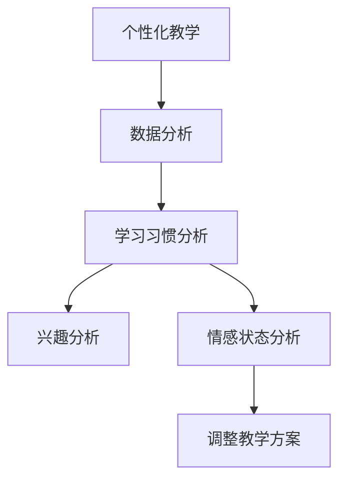

##### 1.7.2.2 情感识别与监控

通过计算机视觉和自然语言处理技术，AI可以识别学生的情感状态，如快乐、悲伤、焦虑等。在课堂中，教师可以利用这一技术监控学生的情感变化，及时调整教学策略，确保每个学生都能在舒适、愉悦的环境中学习。

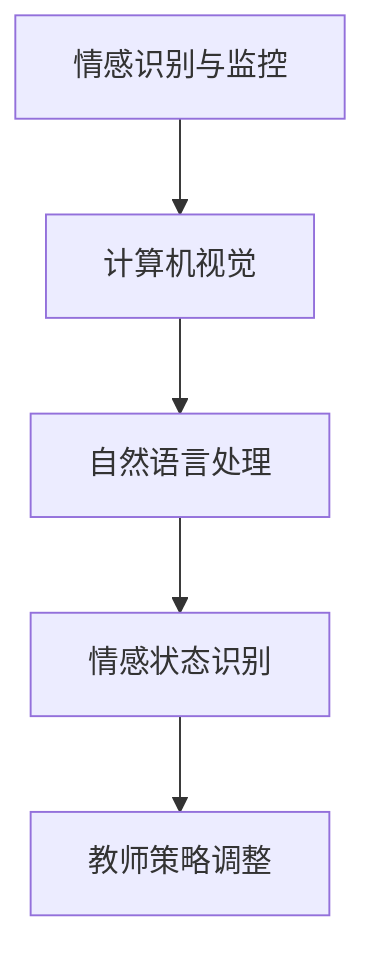

##### 1.7.2.3 情感辅导

AI可以提供在线情感辅导服务，通过聊天机器人与学生进行互动，帮助学生解决情感问题。例如，当学生感到焦虑或抑郁时，AI可以提供心理支持和建议，引导其走出情感困境。

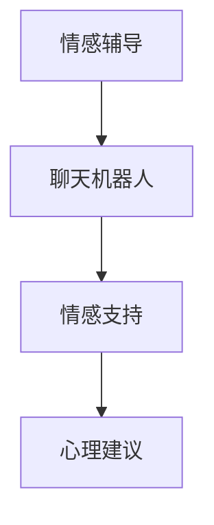

##### 1.7.2.4 数据驱动的教育决策

AI可以通过分析大量教育数据，为教育工作者提供科学的教育决策依据。例如，AI可以分析学生的考试成绩、课堂表现、情感状态等多方面数据，为教师提供个性化的教育建议，提高教育效果。

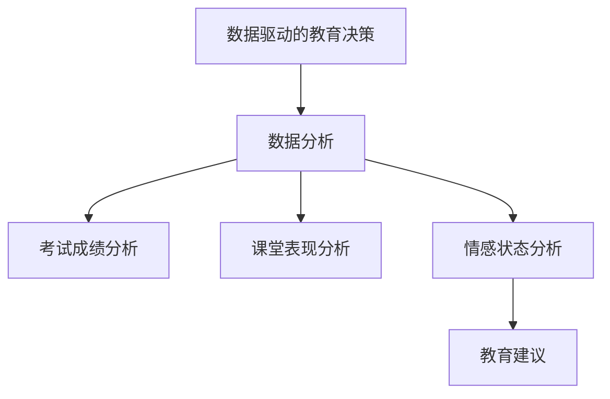

#### 1.7.3 AI辅助下的情感教育优势

AI辅助下的情感教育具有以下优势：

- **个性化**：AI可以根据每个学生的情感特点和需求，提供个性化的教育服务。
- **智能化**：AI可以通过数据分析，提供智能化的教育决策和辅导服务。
- **高效**：AI可以高效处理大量数据，提高教育效率。

#### 1.7.4 AI辅助下的情感教育挑战

尽管AI辅助下的情感教育具有许多优势，但也面临一些挑战：

- **数据隐私**：AI需要收集和分析大量学生数据，如何保护学生的隐私成为一个重要问题。
- **技术成熟度**：目前AI技术仍处于发展阶段，如何确保其稳定性和可靠性是一个挑战。
- **教师角色**：随着AI技术的应用，教师的角色和职责可能会发生变化，如何适应这一变化也是一个问题。

### 1.7.5 未来展望

随着AI技术的不断进步，未来情感教育有望实现更高程度的个性化和智能化。例如，通过虚拟现实（VR）技术，学生可以沉浸在情感教育场景中，亲身体验情感的变化和影响。此外，AI还可以与其他技术相结合，如区块链，确保数据的安全和隐私。

通过AI技术的辅助，情感教育将变得更加有效、有针对性，为学生的全面发展提供更坚实的支持。未来的教育模式将更加注重个体差异，以实现每个学生的最优发展。

### AI辅助下的情感教育案例分析

#### 1.8.1 案例一：智能情感辅导系统

**项目背景**：某中学引入智能情感辅导系统，旨在帮助学生解决情感问题，提高情商。

**系统功能设计**：

- **情感识别**：利用计算机视觉技术，分析学生的面部表情，识别其情感状态。
- **情感分析**：利用自然语言处理技术，分析学生的语言和行为，进一步了解其情感状态。
- **情感辅导**：根据情感识别和情感分析的结果，系统会提供相应的情感建议和辅导。

**系统架构设计**：

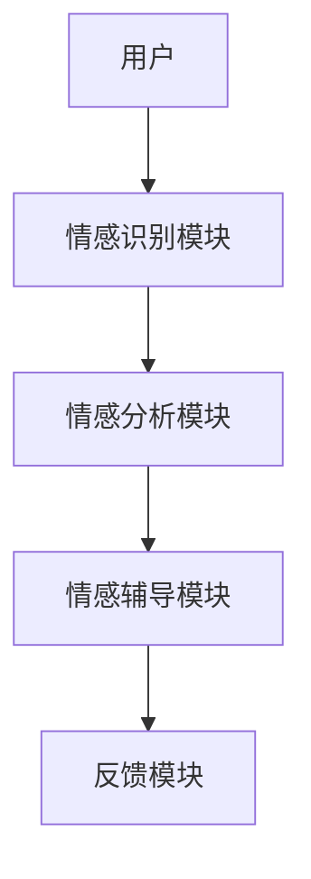

**系统接口设计**：

- **用户接口**：学生可以通过手机应用或网页访问系统，提交情感问题。
- **教师接口**：教师可以通过后台管理系统，查看学生的情感状态和辅导记录。

**系统交互流程**：

1. 学生提交情感问题。
2. 系统分析情感问题，识别情感状态。
3. 系统提供情感建议和辅导。
4. 学生和教师反馈辅导效果。

**项目效果**：

通过实际应用，智能情感辅导系统显著提高了学生的情感认知和表达能力，得到了师生和家长的好评。

#### 1.8.2 案例二：情感教育课程平台

**项目背景**：某大学开发了一款情感教育课程平台，旨在通过在线课程，提高学生的情感素质。

**系统功能设计**：

- **课程管理**：系统提供多种情感教育课程，学生可以根据自己的需求选择课程。
- **互动交流**：学生可以在课程平台上与其他学生和教师互动，分享情感经验和心得。
- **情感测评**：系统提供情感测评工具，帮助学生了解自己的情感状态。

**系统架构设计**：

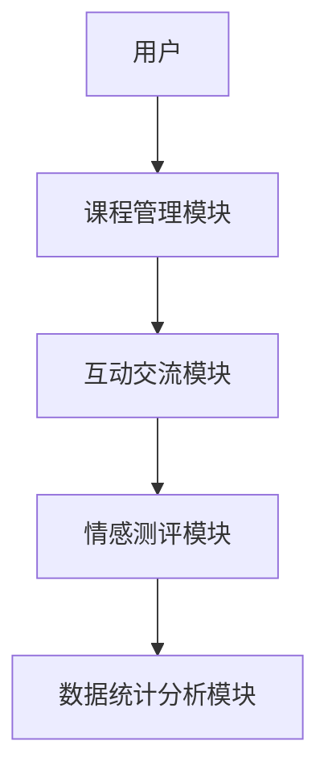

**系统接口设计**：

- **用户接口**：学生可以通过网页或手机应用访问课程平台。
- **教师接口**：教师可以通过后台管理系统，管理课程和评估学生的情感状态。

**系统交互流程**：

1. 学生登录平台，选择课程。
2. 学生参与课程学习，互动交流。
3. 学生进行情感测评。
4. 系统分析测评结果，提供反馈。

**项目效果**：

通过情感教育课程平台，学生的情感素质得到了显著提高，课程平台也得到了广泛推广和应用。

#### 1.8.3 案例三：智能校园心理辅导系统

**项目背景**：某高校引进智能校园心理辅导系统，为学生提供心理咨询服务。

**系统功能设计**：

- **心理测评**：系统提供多种心理测评工具，帮助学生了解自己的心理状态。
- **在线咨询**：学生可以通过系统预约心理辅导，与专业心理师进行在线交流。
- **心理辅导**：系统提供心理辅导课程，帮助学生应对各种心理问题。

**系统架构设计**：

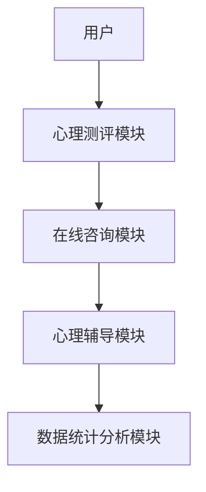

**系统接口设计**：

- **用户接口**：学生可以通过手机应用或网页访问系统。
- **心理师接口**：心理师可以通过后台管理系统，管理预约和提供心理辅导。

**系统交互流程**：

1. 学生预约心理辅导。
2. 心理师提供在线咨询服务。
3. 学生参与心理辅导课程。
4. 系统分析辅导效果，提供反馈。

**项目效果**：

智能校园心理辅导系统有效提高了学生的心理健康水平，得到了学生和教师的广泛认可。

### 总结

通过以上案例分析，可以看出AI技术在情感教育中的应用具有广阔的前景和显著的效果。未来，随着AI技术的不断发展和完善，情感教育将变得更加个性化和智能化，为学生的全面发展提供更坚实的支持。

### AI辅助下的情感教育最佳实践

在AI辅助下的情感教育实践中，以下是一些最佳实践策略，旨在确保情感教育的有效性、针对性和可持续性：

#### 1.9.1 个性化教学设计

- **数据分析**：利用AI技术，收集和分析学生的学习数据，包括学习习惯、兴趣爱好、情感状态等，为个性化教学提供数据支持。
- **定制化课程**：根据学生的个性特点和需求，设计定制化的教学方案，确保每个学生都能在适合自己的学习环境中成长。

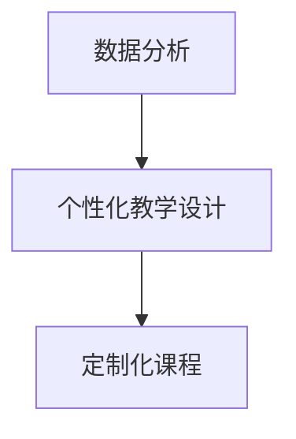

#### 1.9.2 情感监控与反馈

- **实时监控**：通过AI技术，实时监控学生的情感状态，包括课堂表现、作业反馈、互动交流等，及时识别潜在的情感问题。
- **个性化反馈**：根据学生的情感状态，提供个性化的反馈和建议，帮助学生调整情感认知和表达。

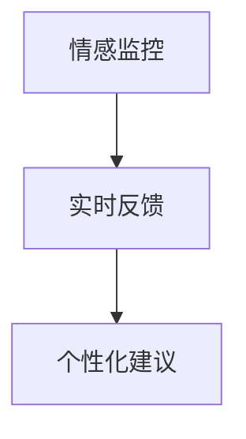

#### 1.9.3 融合多感官学习

- **多感官互动**：结合视觉、听觉、触觉等多感官学习方式，提高学生的学习兴趣和参与度，增强情感体验。
- **情境模拟**：通过虚拟现实（VR）等技术，模拟不同的情感情境，让学生在真实的环境中体验和练习情感表达和管理。

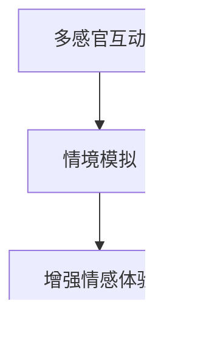

#### 1.9.4 数据隐私与安全

- **严格隐私保护**：在收集和分析学生数据时，严格遵守隐私保护法规，确保学生数据的安全和隐私。
- **透明数据处理**：向学生和家长公开数据收集、处理和使用的方式，增加信任度，促进合作。

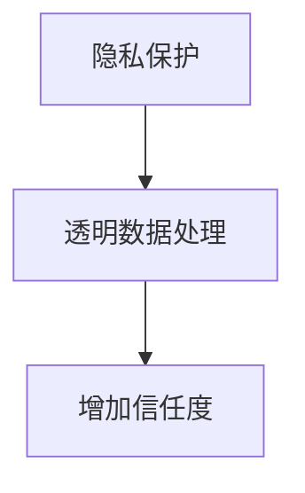

#### 1.9.5 教师培训与支持

- **教师培训**：为教师提供AI辅助下的情感教育培训，提高教师对AI技术的理解和应用能力。
- **持续支持**：为教师提供持续的技术支持和咨询服务，帮助他们在教学过程中有效利用AI技术。

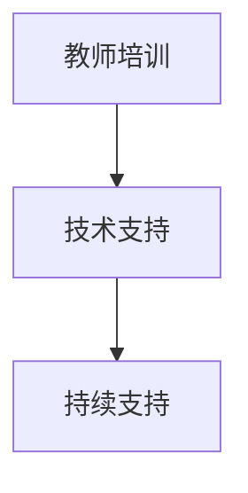

#### 1.9.6 家庭与社会合作

- **家庭参与**：鼓励家长参与孩子的情感教育，通过家校合作，共同关注孩子的情感发展。
- **社会支持**：与社区、社会组织合作，提供丰富的情感教育资源，形成全方位、多层次的情感教育网络。

通过以上最佳实践策略，AI辅助下的情感教育将能够更好地满足学生的个性化需求，提高教育效果，促进学生的全面发展。

### 本章小结

本章系统介绍了AI辅助下的情感教育，从背景、核心概念到具体应用，再到最佳实践，全面探讨了AI技术在情感教育中的重要作用。通过AI技术的辅助，情感教育可以更加个性化和智能化，有效提高学生的情商，促进其全面发展。然而，AI技术在情感教育中的应用也面临一些挑战，如数据隐私、技术成熟度等。未来，随着AI技术的不断进步，情感教育将迎来更加广阔的发展前景，为学生的心理健康和情感素质提供更坚实的保障。

### 注意事项与未来展望

#### 1.10.1 注意事项

在AI辅助下的情感教育实践中，需要注意以下几点：

- **数据隐私**：确保学生数据的安全和隐私，严格遵守相关法律法规。
- **技术成熟度**：选择成熟、可靠的AI技术，确保教育系统的稳定性和可靠性。
- **教师角色**：随着AI技术的应用，教师需要适应新的角色，提高对AI技术的理解和应用能力。
- **个体差异**：充分考虑学生的个体差异，提供个性化的教育服务。

#### 1.10.2 未来展望

未来，AI辅助下的情感教育有望实现以下发展：

- **个性化教育**：通过更加精准的数据分析和算法模型，实现个性化、智能化的情感教育。
- **跨学科融合**：将情感教育与心理学、社会学等学科相结合，提供更加全面的教育服务。
- **教育资源共享**：通过AI技术，实现教育资源的优化配置，提高教育公平性。
- **实时反馈**：通过实时监控和分析，为学生提供即时的情感反馈和支持，提高教育效果。

总之，AI辅助下的情感教育具有巨大的发展潜力，将为学生的全面发展提供更加有力的支持。随着技术的不断进步，情感教育将迎来更加美好的未来。

### 拓展阅读

#### 1.11.1 相关书籍推荐

1. **《情感智能》（Emotional Intelligence）** - 丹尼尔·戈尔曼（Daniel Goleman）  
   这本书详细阐述了情商的概念、构成及其对个体生活的影响，是情感教育的经典著作。

2. **《人工智能：一种现代的方法》（Artificial Intelligence: A Modern Approach）** - 斯图尔特·罗素（Stuart Russell）与彼得·诺维格（Peter Norvig）  
   本书系统地介绍了人工智能的基础理论和实践方法，对理解AI技术及其在教育中的应用具有重要参考价值。

3. **《教育心理学》（Educational Psychology）** - 爱德华·L·桑代克（Edward L. Thorndike）  
   本书涵盖了教育心理学的核心概念和理论，对理解情感教育与心理发展之间的关系具有指导意义。

#### 1.11.2 学术论文推荐

1. **“Emotional Intelligence as a Predictor of Academic Performance: A Meta-Analysis”** - by D.A. Church  
   这篇论文通过元分析的方法，探讨了情商对学术表现的影响，提供了实证研究的支持。

2. **“The Role of Emotional Intelligence in Leadership”** - by H. Bommer and J. Sosik  
   本文分析了情商在领导力中的作用，对教育工作者和管理者具有实践指导意义。

3. **“Artificial Intelligence in Education: A Comprehensive Review”** - by A. R. Akhondzadeh and M. A. Mokhtari  
   本文全面综述了人工智能在教育中的应用，包括教学、评估、辅导等多个方面，为AI辅助下的情感教育提供了理论依据。

通过阅读这些书籍和学术论文，读者可以更深入地了解情感教育和AI技术的理论和方法，为实际应用提供指导。同时，这些资源也为进一步研究和探讨AI辅助下的情感教育提供了丰富的参考和启示。

