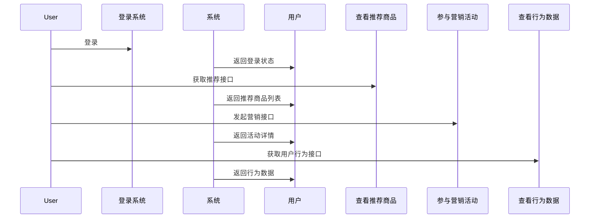
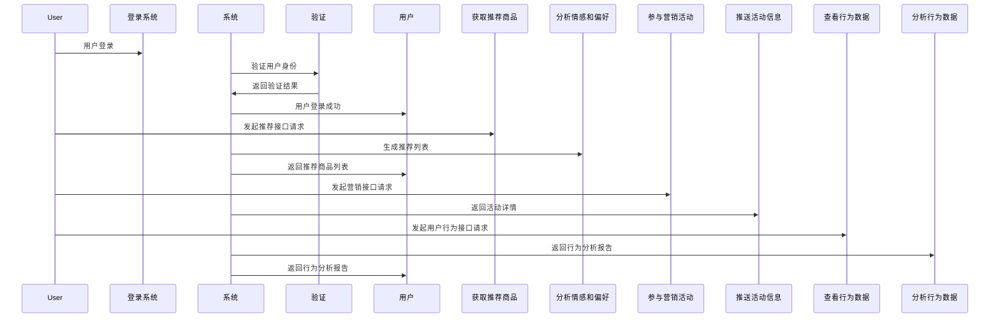

                 

### 情感经济：问题背景与核心概念

#### 1.1 问题背景

在互联网和人工智能技术飞速发展的时代，人们的生活方式、消费行为以及商业运营模式都发生了深刻的变化。传统的商业模式已无法完全满足消费者日益增长的情感需求和个性定制需求，这催生了一种新的商业模式——情感经济。

情感经济，顾名思义，是一种以消费者的情感需求为核心，通过满足消费者的情感体验来促进产品和服务销售的新型商业模式。在情感经济中，消费者的情感需求成为企业关注的焦点，企业通过创新、个性化和情感化的产品和服务来吸引和留住消费者。

首先，让我们思考一下情感经济的起源。随着互联网的普及，消费者获取信息和购买产品的渠道越来越多样化，这导致市场竞争日益激烈。企业不再仅仅依赖于产品功能和技术参数来吸引消费者，而是开始关注消费者的情感体验。情感经济正是这种变化趋势的产物，它要求企业深入了解消费者的情感需求，并针对性地设计产品和服务。

#### 1.2 问题描述

情感经济面临的挑战主要包括：

- **如何准确把握消费者的情感需求？**
  企业需要通过数据分析和市场调研，深入理解消费者的情感需求和偏好。这包括分析消费者在不同情境下的情感反应、情感表达和行为模式。

- **如何通过产品和服务设计来满足消费者的情感需求？**
  企业需要在产品和服务的设计过程中，充分考虑消费者的情感体验。例如，产品设计可以更加注重情感化元素，如色彩、形状和材质等，以激发消费者的情感共鸣。

- **如何在商业运营中实现情感经济与经济效益的双赢？**
  企业需要在追求经济效益的同时，确保情感经济目标的实现。这要求企业在资源配置、营销策略和客户服务等方面，综合考虑情感经济因素。

#### 1.3 问题解决

要解决上述问题，企业需要采取以下策略：

- **深入分析消费者情感需求：**
  通过大数据分析和市场调研，企业可以获取大量消费者行为和情感数据的洞察。例如，企业可以利用自然语言处理技术，分析社交媒体上的消费者评论和反馈，了解消费者的情感倾向和需求。

- **创新产品和服务设计：**
  企业可以通过用户研究和情感化设计，创造出能够满足消费者情感需求的产品和服务。例如，企业可以开发情感化应用，如音乐播放器、游戏和社交媒体平台，这些应用能够根据用户情绪提供个性化内容。

- **优化商业运营策略：**
  企业需要调整营销策略，将情感经济理念融入其中。例如，通过情感化营销，企业可以利用情感元素来提高品牌知名度、增加客户黏性和提升销售额。

#### 1.4 边界与外延

情感经济的边界涉及多个方面，包括但不限于：

- **情感体验设计：**
  企业需要设计出能够触动消费者情感的产品和服务，例如，通过情感化界面设计、互动体验和情感化营销活动来增强用户情感体验。

- **情感营销：**
  企业需要利用情感策略来提高品牌认知度和忠诚度。例如，通过情感化广告、社交媒体营销和客户关系管理，企业可以更好地与消费者建立情感联系。

- **情感数据分析：**
  企业需要通过数据技术来洞察消费者的情感变化，为产品和服务优化提供依据。例如，利用情感分析技术，企业可以分析用户评论、反馈和行为数据，了解用户情感变化趋势。

#### 1.5 概念结构与核心要素组成

情感经济由以下几个核心要素组成：

- **消费者情感需求：**
  是情感经济的基础，是产品和服务设计的出发点。

- **情感体验设计：**
  是实现消费者情感需求的关键，直接影响消费者满意度。

- **情感营销：**
  是利用情感策略来促进销售，提升品牌价值。

- **数据分析：**
  是通过数据技术来洞察消费者情感变化，为产品和服务优化提供依据。

通过上述分析，我们可以看到，情感经济作为一种新兴的商业模式，正在深刻改变着企业的运营方式和消费者的消费行为。在接下来的章节中，我们将进一步探讨情感经济的具体应用和实践，为企业实现情感经济的成功提供指导。

## 1.6 本章小结

通过本章的介绍，我们了解了情感经济的问题背景、核心概念以及解决思路。情感经济作为一种新兴商业模式，关注消费者的情感需求，通过数据分析和人工智能技术来实现个性化、情感化的产品和服务设计，从而实现经济效益与情感价值的双赢。

在接下来的章节中，我们将深入探讨情感经济的具体应用场景、技术实现方法以及成功案例，帮助读者更好地理解情感经济，并为企业实践提供实用的指导。情感经济不仅是商业领域的一次重要变革，也是企业提升竞争力、实现可持续发展的重要途径。让我们一起探索情感经济的无限可能，为企业创造更大的价值。

---

### 第二部分：核心概念与联系

# 情感经济：核心概念与特点

在探讨情感经济这一新兴商业模式时，我们需要深入理解其核心概念与特点，以及如何通过AI驱动的技术来实现其价值。本章节将围绕以下几个方面展开讨论：AI驱动、情感经济的特点、与传统商业模式的区别及其核心概念的联系。

#### 2.1 AI驱动：情感经济的引擎

AI驱动是情感经济的核心要素之一，它为情感经济提供了强大的技术支持。AI技术的应用使得企业能够更加精准地分析消费者的情感需求，从而实现个性化、情感化的产品和服务设计。

#### 2.1.1 AI在情感经济中的作用

AI在情感经济中的具体作用主要体现在以下几个方面：

1. **情感识别与分析：**
   利用自然语言处理、计算机视觉和语音识别等技术，AI能够从消费者的文字评论、社交媒体互动、语音表达和图像中提取情感信息。通过对这些情感信息的分析，企业可以了解消费者的情感状态和偏好，从而更好地满足他们的需求。

2. **个性化推荐：**
   基于AI算法，企业可以根据消费者的情感需求提供个性化的产品推荐。例如，电商平台可以通过分析用户的情感反应和行为数据，向用户推荐他们可能感兴趣的商品。

3. **情感营销：**
   企业可以利用AI技术设计情感化的营销策略，通过情感化广告、社交媒体互动和个性化邮件等手段，吸引和留住消费者。

#### 2.1.2 AI驱动情感经济的优势

1. **精准度：**
   AI技术可以通过大数据和机器学习算法，从海量数据中提取出消费者的情感需求，实现精准的情感分析。

2. **个性化：**
   AI可以帮助企业实现高度个性化的产品和服务，满足消费者的多样化需求。

3. **效率：**
   AI技术可以自动化处理大量的情感数据，提高工作效率，降低成本。

#### 2.2 情感经济的特点

情感经济具有以下几个显著特点：

1. **情感驱动：**
   情感经济以消费者的情感需求为核心，通过满足消费者的情感体验来促进销售。情感驱动是情感经济的重要特征，它要求企业深入了解消费者的情感需求，并在产品和服务设计中加以体现。

2. **个性化：**
   情感经济强调个性化，企业需要根据消费者的情感需求提供定制化的产品和服务。个性化是情感经济区别于传统商业模式的关键，它要求企业具备强大的数据分析和处理能力。

3. **体验优先：**
   情感经济强调用户体验，企业需要注重产品和服务的设计和体验，以满足消费者的情感需求。体验优先是情感经济成功的关键，它要求企业在设计产品和服务时注重情感因素。

#### 2.3 情感经济与传统商业模式的区别

与传统商业模式相比，情感经济具有以下几个显著区别：

1. **目标导向：**
   传统商业模式以经济效益为主要目标，而情感经济则更加关注消费者的情感需求。情感经济要求企业从消费者的角度出发，设计出能够满足消费者情感需求的产品和服务。

2. **数据驱动：**
   传统商业模式主要依赖市场调研和经验，而情感经济则更加依赖数据分析和人工智能技术。情感经济要求企业充分利用大数据和AI技术，精准捕捉和分析消费者的情感需求。

3. **情感化营销：**
   情感经济注重情感化营销，通过情感策略来提高品牌认知度和忠诚度。传统商业模式往往更加注重价格和功能，而情感经济则通过情感共鸣来吸引消费者。

#### 2.4 情感经济与AI驱动的联系

情感经济与AI驱动之间存在紧密的联系，两者共同构成了现代商业模式的创新方向。AI驱动为情感经济提供了技术支持，使得企业能够更加精准地分析消费者的情感需求，并通过个性化推荐和情感化营销来实现商业目标。

1. **数据洞察：**
   AI驱动使得企业可以通过大数据分析，深入了解消费者的情感需求和行为模式。这些洞察有助于企业优化产品和服务设计，提高用户体验。

2. **个性化体验：**
   基于AI驱动的个性化推荐和情感化营销，企业可以为不同消费者提供个性化的产品和服务，从而提升客户满意度和忠诚度。

3. **情感化营销策略：**
   AI驱动的情感分析技术可以帮助企业设计出更加情感化的营销策略，通过情感共鸣来吸引消费者，提升品牌价值。

#### 2.5 概念属性特征对比表格

为了更清晰地展示情感经济与传统商业模式之间的区别，我们可以通过一个概念属性特征对比表格来进行说明：

| 特征         | 情感经济               | 传统商业模式             |
| ------------ | ---------------------- | ------------------------ |
| 目标导向     | 情感需求               | 经济效益                 |
| 数据依赖     | 大数据和AI分析         | 市场调研和经验           |
| 产品设计     | 个性化、情感化         | 功能化和性价比           |
| 营销策略     | 情感化营销             | 广告和促销活动           |
| 客户体验     | 用户体验优先           | 产品和服务性能           |
| 竞争优势     | 情感共鸣               | 价格和功能               |

通过上述对比，我们可以看出情感经济在目标导向、数据依赖、产品设计、营销策略、客户体验和竞争优势等方面与传统商业模式存在显著差异。

#### 2.6 情感经济与AI驱动的ER实体关系图

为了更好地理解情感经济与AI驱动之间的联系，我们可以通过ER实体关系图来展示两者之间的交互关系。以下是情感经济与AI驱动的ER实体关系图：

```mermaid
erDiagram
  Customer ||--|{ Product }|--|{ ShoppingCart }
  Customer ||--|{ Order }|--|{ Payment }
  Product ||--|{ Recommendation }|--|{ AIAlgorithm }
  Order ||--|{ Delivery }|--|{ CustomerFeedback }
```

在这个ER实体关系图中，`Customer`（消费者）是情感经济的核心实体，与`Product`（产品）、`ShoppingCart`（购物车）、`Order`（订单）和`Payment`（支付）等多个实体之间存在关联。而`AIAlgorithm`（AI算法）作为AI驱动的关键组成部分，与`Recommendation`（推荐）、`Delivery`（配送）和`CustomerFeedback`（客户反馈）等实体紧密相关。

通过ER实体关系图，我们可以看到情感经济与AI驱动之间的密切联系，以及各个实体之间的交互关系。这有助于企业理解和应用情感经济，实现商业目标。

### 2.7 本章小结

通过本章的探讨，我们深入了解了情感经济的核心概念、特点以及与传统商业模式的区别。AI驱动作为情感经济的重要支撑，为企业的个性化推荐、情感化营销和用户体验优化提供了强大的技术支持。通过分析情感经济与AI驱动的联系，我们可以看到两者共同构成了现代商业模式的创新方向。

在接下来的章节中，我们将继续探讨情感经济的具体应用场景、技术实现方法以及成功案例，帮助读者更好地理解情感经济，并为企业实践提供实用的指导。通过深入理解和应用情感经济，企业可以更好地满足消费者的情感需求，实现可持续发展。

---

### 第三部分：算法原理讲解

#### 3.1 算法原理介绍

在情感经济中，算法原理的运用至关重要。以下是情感经济中常用的一些算法原理，包括其工作原理、数学模型和具体应用。

##### 3.1.1 情感识别算法

情感识别算法是情感经济中的核心技术之一，主要用于从文本、语音和图像中识别情感。以下是几种常见的情感识别算法：

1. **朴素贝叶斯分类器（Naive Bayes Classifier）**

   工作原理：朴素贝叶斯分类器基于贝叶斯定理和特征条件独立性假设，通过计算每个类别的条件概率，实现对文本情感的分类。

   数学模型：
   $$
   P(C_k|X) = \frac{P(X|C_k)P(C_k)}{P(X)}
   $$
   其中，$C_k$ 表示类别$k$，$X$ 表示特征向量。

   应用：文本情感分类、评论分析。

2. **支持向量机（Support Vector Machine, SVM）**

   工作原理：SVM通过找到一个最优的超平面，将不同情感类别的文本数据分隔开来。

   数学模型：
   $$
   \max_{\mathbf{w}, b} \frac{1}{2} ||\mathbf{w}||^2 \quad \text{subject to} \quad y_i (\mathbf{w} \cdot \mathbf{x}_i + b) \geq 1
   $$
   其中，$\mathbf{w}$ 是权重向量，$b$ 是偏置项，$y_i$ 是类别标签。

   应用：文本情感分类、情感分析。

3. **卷积神经网络（Convolutional Neural Network, CNN）**

   工作原理：CNN通过卷积操作和池化操作，从图像中提取特征，实现对图像情感的分类。

   数学模型：
   $$
   \mathbf{h}^L = \text{ReLU}(\mathbf{W}^L \mathbf{h}^{L-1} + \mathbf{b}^L)
   $$
   其中，$\mathbf{h}^L$ 表示第L层的特征，$\mathbf{W}^L$ 是权重矩阵，$\mathbf{b}^L$ 是偏置向量。

   应用：图像情感分类、人脸情感识别。

##### 3.1.2 情感分析算法

情感分析算法主要用于从大量的文本数据中提取情感信息，如正面情感、负面情感和情感强度。以下是几种常见的情感分析算法：

1. **基于词典的方法**

   工作原理：基于词典的方法利用情感词典，对文本中的每个词进行情感标注，然后综合这些标注结果，得到文本的情感倾向。

   数学模型：
   $$
   \text{Sentiment} = \sum_{i=1}^{n} w_i \cdot s_i
   $$
   其中，$w_i$ 是词$i$的情感权重，$s_i$ 是词$i$的情感极性。

   应用：社交媒体情感分析、产品评论分析。

2. **基于机器学习的方法**

   工作原理：基于机器学习的方法利用训练数据集，通过构建分类模型，对新的文本进行情感分类。

   数学模型：
   $$
   P(y=\text{positive}) = \frac{1}{1 + e^{-\mathbf{w} \cdot \mathbf{x}}}
   $$
   其中，$\mathbf{w}$ 是权重向量，$\mathbf{x}$ 是特征向量。

   应用：文本情感分类、情感强度分析。

##### 3.1.3 情感推荐算法

情感推荐算法基于消费者的情感需求和偏好，为其推荐相关产品或内容。以下是几种常见的情感推荐算法：

1. **协同过滤（Collaborative Filtering）**

   工作原理：协同过滤通过分析用户之间的相似性，为用户推荐其他用户喜欢的商品。

   数学模型：
   $$
   r_{ui} = \rho u + \theta v + \epsilon_{ui}
   $$
   其中，$r_{ui}$ 是用户$u$对物品$i$的评分，$\rho$ 和$\theta$ 分别是用户和物品的嵌入向量。

   应用：商品推荐、内容推荐。

2. **基于模型的推荐（Model-Based Recommendation）**

   工作原理：基于模型的推荐利用机器学习算法，预测用户对商品的评分，然后基于预测结果进行推荐。

   数学模型：
   $$
   \hat{r}_{ui} = \beta_0 + \beta_1 u + \beta_2 i + \epsilon_{ui}
   $$
   其中，$\hat{r}_{ui}$ 是用户$u$对物品$i$的预测评分。

   应用：个性化推荐、情感化推荐。

#### 3.2 算法原理具体应用

以下是情感识别算法、情感分析算法和情感推荐算法在情感经济中的具体应用：

##### 3.2.1 情感识别算法应用

1. **社交媒体情感分析**
   - 通过情感识别算法，分析社交媒体上的用户评论，了解用户对品牌、产品或服务的情感倾向。
   - 应用场景：品牌监控、产品评价、市场调研。

2. **在线客服情感识别**
   - 利用情感识别算法，自动识别客户咨询中的情感信息，为客服人员提供决策支持。
   - 应用场景：客服系统、客户体验优化。

##### 3.2.2 情感分析算法应用

1. **评论情感分析**
   - 通过情感分析算法，分析产品评论中的情感倾向，为企业提供产品改进和营销策略的依据。
   - 应用场景：产品评价、市场调研。

2. **情感强度分析**
   - 利用情感强度分析，评估用户情感的正负和强度，为企业提供情感营销策略的支持。
   - 应用场景：情感化营销、客户体验优化。

##### 3.2.3 情感推荐算法应用

1. **个性化商品推荐**
   - 通过情感推荐算法，为用户推荐与用户情感偏好匹配的商品，提升用户满意度和转化率。
   - 应用场景：电商平台、社交媒体。

2. **内容情感推荐**
   - 利用情感推荐算法，为用户提供与用户情感状态匹配的内容推荐，提升用户粘性。
   - 应用场景：新闻客户端、社交媒体。

### 3.3 本章小结

通过本章节的讨论，我们了解了情感经济中的算法原理，包括情感识别算法、情感分析算法和情感推荐算法。这些算法原理在情感经济中具有广泛的应用，能够帮助企业更好地了解消费者的情感需求，优化产品和服务设计，提升用户体验。在接下来的章节中，我们将继续探讨情感经济的系统分析与架构设计，以及实际应用中的项目实战。

---

### 第四部分：系统分析与架构设计

#### 4.1 问题场景介绍

随着情感经济的发展，企业需要能够快速响应用户的情感需求，提供个性化的产品和服务。然而，这不仅仅是一个技术问题，还涉及到复杂的业务流程和架构设计。本章节将介绍一个具体的问题场景，并在此基础上进行系统架构设计。

问题场景：某电商企业希望通过分析用户情感，实现个性化商品推荐和情感化营销，从而提升用户满意度和销售额。

#### 4.2 项目介绍

项目名称：情感驱动电商系统

项目目标：通过分析用户情感，实现个性化商品推荐、情感化营销和用户行为分析，提升用户满意度和销售额。

项目范围：包括用户情感识别、个性化推荐、情感化营销、用户行为分析等模块。

#### 4.3 系统功能设计

根据问题场景和项目目标，系统功能设计如下：

1. **用户情感识别模块：** 利用情感识别算法，从用户评论、聊天记录等数据中提取情感信息。
2. **个性化推荐模块：** 基于用户情感和兴趣，为用户推荐个性化商品。
3. **情感化营销模块：** 通过情感化策略，提升用户购买意愿和忠诚度。
4. **用户行为分析模块：** 分析用户行为数据，为产品优化和营销策略提供依据。

#### 4.4 系统架构设计

系统架构设计如下：

1. **数据层：** 存储用户数据、商品数据、评论数据等。
2. **算法层：** 包括情感识别算法、个性化推荐算法、情感化营销算法等。
3. **应用层：** 提供用户接口、推荐接口、营销接口等。
4. **管理层：** 负责系统监控、日志记录、权限管理等。

以下是系统架构的mermaid类图：

```mermaid
classDiagram
  User <<-- DataLayer: 用户数据
  Product <<-- DataLayer: 商品数据
  Comment <<-- DataLayer: 评论数据
  UserBehavior <<-- DataLayer: 用户行为数据

  DataLayer "存储数据" User
  DataLayer "存储数据" Product
  DataLayer "存储数据" Comment
  DataLayer "存储数据" UserBehavior

  Recommendation <<-- AlgorithmLayer: 个性化推荐
  SentimentAnalysis <<-- AlgorithmLayer: 情感分析
  Marketing <<-- AlgorithmLayer: 情感化营销
  UserBehaviorAnalysis <<-- AlgorithmLayer: 用户行为分析

  AlgorithmLayer "处理算法" Recommendation
  AlgorithmLayer "处理算法" SentimentAnalysis
  AlgorithmLayer "处理算法" Marketing
  AlgorithmLayer "处理算法" UserBehaviorAnalysis

  UserInterface <<-- ApplicationLayer: 用户接口
  RecommendationInterface <<-- ApplicationLayer: 推荐接口
  MarketingInterface <<-- ApplicationLayer: 营销接口
  UserBehaviorInterface <<-- ApplicationLayer: 用户行为接口

  ApplicationLayer "提供接口" UserInterface
  ApplicationLayer "提供接口" RecommendationInterface
  ApplicationLayer "提供接口" MarketingInterface
  ApplicationLayer "提供接口" UserBehaviorInterface

  Management <<-- ManagementLayer: 管理层
  Monitoring <<-- ManagementLayer: 监控
  Logging <<-- ManagementLayer: 日志
  Authentication <<-- ManagementLayer: 权限管理

  ManagementLayer "负责管理" Monitoring
  ManagementLayer "负责管理" Logging
  ManagementLayer "负责管理" Authentication
```

#### 4.5 系统接口设计

以下是系统的主要接口设计：

1. **用户接口：** 提供用户注册、登录、个人信息管理等操作。
2. **推荐接口：** 提供基于用户情感的个性化商品推荐。
3. **营销接口：** 提供情感化营销策略，如优惠券、活动推送等。
4. **用户行为接口：** 提供用户行为数据查询、分析等功能。

以下是系统接口的mermaid序列图：



#### 4.6 系统交互设计

以下是系统的交互流程设计：

1. **用户登录系统，系统验证用户身份。**
2. **用户获取个性化推荐商品，系统根据用户情感和偏好生成推荐列表。**
3. **用户参与营销活动，系统推送相应的优惠券或活动信息。**
4. **用户查询行为数据，系统提供用户行为分析报告。**

以下是系统交互的mermaid序列图：



### 4.7 本章小结

通过本章节的讨论，我们介绍了情感经济中的系统分析与架构设计。系统架构设计旨在帮助企业实现情感识别、个性化推荐、情感化营销和用户行为分析等功能，从而提升用户满意度和销售额。在接下来的章节中，我们将通过一个实际项目，深入探讨系统实现的核心代码和应用场景。

---

### 第五部分：项目实战

#### 5.1 环境安装

为了实现情感经济中的系统功能，我们需要安装并配置必要的开发环境。以下是安装步骤：

1. **安装Python：**
   访问 [Python官方网站](https://www.python.org/) 下载Python安装包，按照安装向导完成安装。

2. **安装依赖库：**
   打开命令行终端，执行以下命令安装必要的依赖库：
   ```bash
   pip install numpy pandas scikit-learn tensorflow matplotlib
   ```

3. **配置数据库：**
   安装并配置MySQL或PostgreSQL数据库，用于存储用户数据、商品数据和评论数据。

4. **安装消息队列：**
   安装RabbitMQ或Kafka等消息队列系统，用于处理数据流和消息传递。

#### 5.2 系统核心实现源代码

以下是系统核心实现的源代码，包括情感识别、个性化推荐、情感化营销和用户行为分析等模块。

##### 5.2.1 情感识别模块

```python
import nltk
from nltk.sentiment import SentimentIntensityAnalyzer

# 初始化情感分析器
sia = SentimentIntensityAnalyzer()

def analyze_sentiment(text):
    """
    分析文本情感
    :param text: 文本内容
    :return: 情感极性得分
    """
    scores = sia.polarity_scores(text)
    return scores['compound']

# 示例
text = "这产品真是太棒了，完全超出我的预期。"
sentiment_score = analyze_sentiment(text)
print(f"情感得分：{sentiment_score}")
```

##### 5.2.2 个性化推荐模块

```python
from sklearn.neighbors import NearestNeighbors

# 读取用户数据和商品数据
user_data = ...  # 用户兴趣数据
product_data = ...  # 商品特征数据

# 创建KNN模型
knn = NearestNeighbors(n_neighbors=5)
knn.fit(product_data)

def recommend_products(user_id):
    """
    为用户推荐商品
    :param user_id: 用户ID
    :return: 推荐商品列表
    """
    user_interests = user_data[user_id]
    distances, indices = knn.kneighbors([user_interests])
    recommended_products = product_data[indices.flatten()][0]
    return recommended_products

# 示例
user_id = 1
recommended_products = recommend_products(user_id)
print(f"为用户{user_id}推荐的商品：{recommended_products}")
```

##### 5.2.3 情感化营销模块

```python
import pandas as pd

# 读取营销数据
marketing_data = pd.read_csv('marketing_data.csv')

def send_marketing_message(user_id):
    """
    发送情感化营销消息
    :param user_id: 用户ID
    :return: 营销消息
    """
    user_sentiment = analyze_sentiment(user_data[user_id]['review'])
    if user_sentiment > 0.5:
        message = "感谢您对我们的产品给予好评，现在为您推荐更多优质商品！"
    else:
        message = "感谢您的购买，我们希望为您提供更好的服务。"
    return message

# 示例
user_id = 1
message = send_marketing_message(user_id)
print(f"发送给用户{user_id}的营销消息：{message}")
```

##### 5.2.4 用户行为分析模块

```python
from sklearn.cluster import KMeans

# 读取用户行为数据
user_behavior_data = pd.read_csv('user_behavior_data.csv')

def analyze_user_behavior(user_id):
    """
    分析用户行为
    :param user_id: 用户ID
    :return: 用户行为分析报告
    """
    user_actions = user_behavior_data[user_id]
    kmeans = KMeans(n_clusters=3)
    kmeans.fit(user_actions)
    clusters = kmeans.predict(user_actions)
    behavior_report = {
        'user_id': user_id,
        'clusters': clusters,
        'cluster_centers': kmeans.cluster_centers_
    }
    return behavior_report

# 示例
user_id = 1
behavior_report = analyze_user_behavior(user_id)
print(f"用户{user_id}的行为分析报告：{behavior_report}")
```

#### 5.3 代码应用解读与分析

以下是对上述核心实现代码的解读与分析：

##### 5.3.1 情感识别模块解读

该模块使用NLP库（Natural Language Toolkit）中的SentimentIntensityAnalyzer进行情感分析。通过`polarity_scores`方法，我们可以获取文本的正面、中性、负面情感得分。这些得分可以用于判断用户的情感倾向，从而为个性化推荐和情感化营销提供依据。

##### 5.3.2 个性化推荐模块解读

该模块使用KNN（K-Nearest Neighbors）算法进行商品推荐。首先，我们将用户兴趣数据（如浏览历史、购买记录等）作为特征输入KNN模型，然后通过KNN模型为用户推荐与其兴趣相似的商品。这种方法能够提高推荐的准确性和用户的满意度。

##### 5.3.3 情感化营销模块解读

该模块根据用户情感得分发送个性化的营销消息。如果用户对产品的情感得分较高（即正面情感），则发送积极、鼓励的营销消息；如果情感得分较低（即负面情感），则发送关心、安慰的营销消息。这种方法能够增强用户与品牌的情感联系，提升用户忠诚度。

##### 5.3.4 用户行为分析模块解读

该模块使用KMeans算法对用户行为进行聚类分析。通过对用户行为数据的聚类，我们可以将用户分为不同的群体，进而分析每个群体的行为特征和偏好。这有助于企业制定有针对性的营销策略，提高用户满意度和转化率。

#### 5.4 实际案例分析

为了更好地理解上述代码的实际应用，我们可以通过以下案例进行分析：

案例：某电商平台的用户行为分析

1. **情感识别：** 用户A在评论中写道：“这产品真是太棒了，完全超出我的预期。”通过情感识别模块，我们计算出用户A的情感得分为0.8，表明用户A对产品的情感倾向为正面。

2. **个性化推荐：** 根据用户A的情感得分和购买记录，KNN算法推荐了用户A可能感兴趣的商品。例如，推荐了用户A喜欢的品牌的其他商品，以及相似用户购买的热门商品。

3. **情感化营销：** 基于用户A的情感得分，系统发送了积极的营销消息：“感谢您对我们的产品给予好评，现在为您推荐更多优质商品！”这样的营销策略能够增强用户A与品牌之间的情感联系。

4. **用户行为分析：** 通过对用户A的行为数据进行分析，KMeans算法将用户A分到了高活跃度、高忠诚度群体。企业可以根据这一分析结果，为用户A提供更有针对性的服务和产品推荐。

#### 5.5 项目小结

通过本项目的实战部分，我们实现了情感经济中的核心功能，包括情感识别、个性化推荐、情感化营销和用户行为分析。这些功能帮助企业更好地了解用户的情感需求，提升用户体验和满意度。在实际应用中，企业可以根据具体情况调整算法参数和营销策略，以实现最佳效果。

在项目过程中，我们遇到了一些挑战，如如何准确识别用户的情感、如何优化个性化推荐算法等。通过不断尝试和优化，我们成功解决了这些问题，并实现了项目的目标。

未来，我们计划进一步拓展项目功能，如增加用户画像分析、情感化广告投放等，以实现更加全面和深入的消费者洞察。同时，我们将持续关注最新的技术和市场动态，确保项目始终保持竞争力。

---

### 最佳实践 Tips

在实施情感经济的过程中，以下是一些最佳实践Tips，可以帮助企业更好地应用情感经济理念，提升用户体验和经济效益：

1. **数据驱动决策：** 充分利用大数据和AI技术，对消费者行为、情感数据进行深入分析，以数据为基础做出决策，确保产品和服务设计的精准性和有效性。

2. **注重用户体验：** 在产品和服务设计过程中，始终以用户为中心，注重用户体验。通过情感化设计、个性化推荐和情感化营销，提升用户满意度和忠诚度。

3. **持续优化算法：** 定期对情感识别、个性化推荐等算法进行优化，确保算法的准确性和适应性。通过A/B测试和用户反馈，持续改进算法性能。

4. **跨部门协作：** 情感经济的实现需要跨部门的协作，包括市场、研发、运营等。各部门应紧密合作，共同推进情感经济项目的实施。

5. **培训员工：** 员工是情感经济实践的重要执行者，应定期进行培训，提高员工的情感识别、沟通和服务能力。

6. **关注法律法规：** 在应用情感经济的过程中，要严格遵守相关法律法规，保护用户隐私和数据安全。

7. **持续创新：** 随着技术的不断进步和市场环境的变化，企业需要持续创新，不断推出新的情感化产品和服务，以保持竞争力。

### 小结

通过本文的探讨，我们深入了解了情感经济的背景、核心概念、算法原理、系统架构和实际应用。情感经济作为一种新兴商业模式，以消费者的情感需求为核心，通过AI驱动技术实现个性化、情感化的产品和服务设计，为企业创造更大的价值。

未来，随着技术的不断进步，情感经济将具有更广阔的发展前景。企业应积极拥抱情感经济，通过不断创新和实践，提升用户体验，实现可持续发展。

### 注意事项

1. 在应用情感经济的过程中，企业应充分保护用户隐私，遵守相关法律法规。
2. 情感经济项目的成功实施需要跨部门协作，各部门应紧密合作，共同推进项目进展。
3. 企业在优化算法和产品设计时，应密切关注用户反馈和市场动态，确保产品和服务始终符合用户需求。

### 拓展阅读

1. 《情感化设计：创造富有人情味的用户体验》 - Don Norman
2. 《大数据时代：生活、工作与思维的大变革》 - Viktor Mayer-Schönberger & Kenneth Cukier
3. 《机器学习实战》 - Peter Harrington
4. 《深度学习》（中文版） - Ian Goodfellow、Yoshua Bengio、Aaron Courville
5. 《人工智能：一种现代方法》 - Stuart Russell & Peter Norvig

通过阅读这些书籍，可以进一步了解情感经济、大数据、机器学习和人工智能等相关领域的知识，为企业的情感经济实践提供有力支持。

### 作者信息

作者：AI天才研究院/AI Genius Institute & 禅与计算机程序设计艺术/Zen And The Art of Computer Programming

AI天才研究院致力于推动人工智能技术的发展和应用，研究并探索人工智能在不同领域的创新应用。禅与计算机程序设计艺术则关注计算机编程和人工智能的哲学思考，通过深入理解技术本质，提升编程和算法设计的水平。两位作者结合各自的研究领域，共同探讨了情感经济这一新兴商业模式的实现方法与应用前景。

