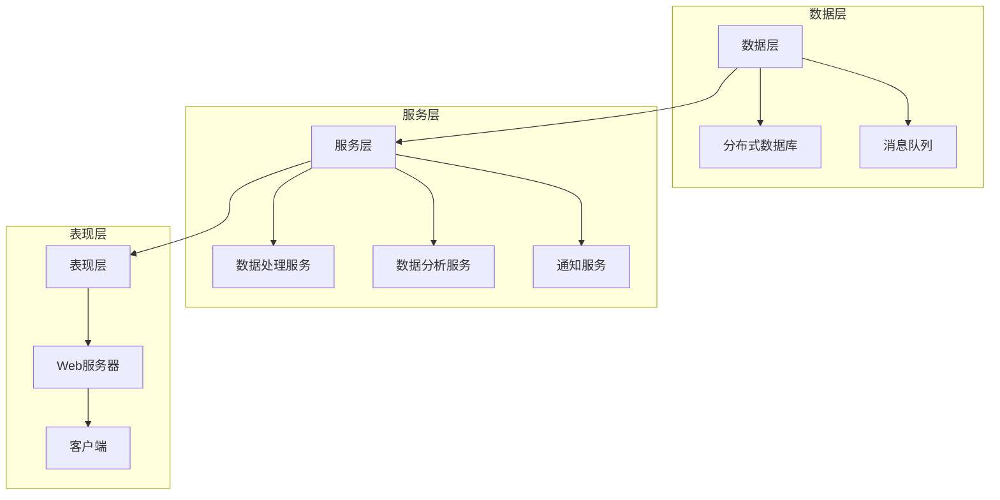

                 

### 第1章 引言：意义、使用与不可变性

在探讨计算机编程中的高级概念时，我们需要回到基础，深入理解一些核心术语，如“意义”、“使用”和“不可变性”。这些概念不仅定义了编程的基本原则，也深刻影响了函数式编程的发展。通过引入这些基础概念，我们可以更好地理解函数式编程中的不可变性，并为后续章节的深入探讨奠定基础。

#### 1.1 背景介绍

“意义”在编程中指的是代码所表达的目的和作用。每个函数和变量都有其特定的意义，它们共同构成程序的逻辑。理解代码的意义是编写有效和高效程序的关键。另一方面，“使用”指的是代码在程序执行过程中的实际应用。如何高效地使用代码，优化其执行效率，是程序员面临的另一重要任务。

不可变性则是在函数式编程中的一个核心概念。它指的是数据一旦创建后就不能被修改。这种特性带来了诸多优势，如便于状态管理和提高程序的可预测性。然而，不可变性也带来了挑战，如如何高效地实现数据更新。

#### 1.2 问题陈述

函数式编程以其不可变性著称，但这种特性是否仅是技术层面的优化，还是有着更为深刻的哲学根源？不可变性在编程中的意义和作用究竟是什么？它如何影响编程范式和编程语言的发展？这些问题是我们探讨的主题。

#### 1.3 目的与结构

本章旨在引入并解释“意义”、“使用”和“不可变性”这三个核心概念，并探讨它们在函数式编程中的哲学根源。接下来，我们将逐步深入这些概念，通过历史背景、哲学讨论和具体应用，揭示不可变性在编程中的深层次意义。本章的结构如下：

- **第2章 哲学根源与函数式编程**：探讨不可变性的哲学基础，并介绍函数式编程的历史与发展。
- **第3章 不可变性在函数式编程中的应用**：分析不可变性在数据结构设计和算法性能优化中的应用。
- **第4章 不可变性带来的编程范式转变**：讨论不可变性对面向对象编程的挑战及其在函数式编程中的优势。
- **第5章 不可变性与并发编程**：分析不可变性在并发编程中的意义和实战技巧。
- **第6章 不可变性与应用领域**：探讨不可变性在数据库和前端开发中的应用。
- **第7章 不可变性与未来趋势**：展望不可变性在编程语言和社会中的未来发展。
- **第8章 结论**：总结全文，回顾主要观点，并提出未来研究方向和建议。

通过这一系列的探讨，我们将揭示不可变性在编程中的哲学根源，并理解其如何在函数式编程中发挥关键作用。

### 2.1 哲学根源探讨

为了深入理解不可变性在函数式编程中的哲学根源，我们需要从多个角度进行探讨。首先，让我们从逻辑和数学的基本原则出发，分析不可变性在这些领域中的基础。

#### 2.1.1 不可变性的哲学基础

在哲学领域，不可变性是一种关于存在和真理的讨论。亚里士多德认为，真实的存在是永恒不变的，而变化只是表面现象。这种观点在数学和逻辑学中得到了验证。例如，欧几里得的几何学基于不变的空间概念，而逻辑学中的命题逻辑和谓词逻辑也强调事实的不可变性。

在计算机科学中，不可变性最早可以追溯到早期编程语言的诞生。例如，在Lisp编程语言中，早期版本就采用了不可变数据结构。然而，随着面向对象编程（OOP）的兴起，不可变性逐渐被忽视。OOP强调对象的状态变化和继承，而不可变性则被视为一种限制。

#### 2.1.2 意义与使用的哲学讨论

意义与使用在哲学中有着深远的影响。亚里士多德认为，每个事物都有其特定的用途，即“form”（形式）或“telos”（目的）。在计算机科学中，这意味着每个程序和代码段都有其特定的功能和目的。

使用（use）在哲学中是指如何有效地利用资源和工具。例如，苏格拉底强调通过提问和对话来寻找真理，这是一种高效的使用知识的方法。在编程中，高效的使用代码意味着优化程序的性能和可维护性。

不可变性在这场哲学讨论中扮演了关键角色。它不仅保证了数据的完整性，还增强了程序的可预测性和可靠性。例如，在函数式编程中，不可变性使得函数具有确定性，从而避免了状态冲突和副作用。

#### 2.1.3 哲学与编程的交汇

哲学与编程的交汇点在于它们都关注“意义”和“使用”。编程中的每个变量和函数都有其特定的意义，这种意义在哲学中被称为“目的”或“形式”。而编程中的“使用”则体现在如何有效地利用代码和工具来解决问题。

不可变性在这场交汇中发挥了关键作用。它不仅是一种编程技术，更是一种哲学原则。通过不可变性，程序员可以更好地理解代码的意义和使用，从而编写出更加高效、可靠和可维护的程序。

#### 2.1.4 哲学对编程的影响

哲学对编程的影响是深远且广泛的。从逻辑和数学的基本原则到亚里士多德的形式和目的论，哲学为编程提供了一种深刻的思考方式。这种思考方式不仅帮助程序员理解代码的本质，还指导他们如何高效地使用代码。

不可变性作为哲学原则之一，对编程语言的设计和发展产生了重要影响。例如，Haskell和Scala等现代编程语言就基于不可变性原则，提供了强大的类型系统和函数组合能力。

总之，不可变性在函数式编程中的哲学根源是复杂而多样的。它不仅源于逻辑和数学的基本原则，还受到哲学思想的影响。通过深入探讨这些根源，我们可以更好地理解不可变性在编程中的重要性，并在实践中应用这一原则，编写出更加高效和可靠的程序。

### 2.2 函数式编程概述

函数式编程（Functional Programming，FP）作为一种编程范式，与面向对象编程（OOP）有着显著的区别。FP强调函数作为程序的基本构建块，而OOP则强调对象和类的使用。了解这两种编程范式的基本概念、核心特性和主要差异，有助于我们更好地理解不可变性在函数式编程中的重要性。

#### 2.2.1 函数式编程核心概念

函数式编程的核心概念包括纯函数、不可变性、高阶函数和递归。

1. **纯函数**：
   纯函数是一种无副作用的函数，其输出仅取决于输入，不会修改外部状态或产生副作用。这意味着每次调用纯函数时，都能得到相同的输出。例如：
   ```python
   def add(a, b):
       return a + b
   ```
   这是一个纯函数，因为它只依赖于输入参数，不会修改外部状态。

2. **不可变性**：
   不可变性是函数式编程中的一个核心概念，指的是一旦数据创建后就不能被修改。这意味着所有数据都是不可变的，任何“修改”操作都会生成一个新的数据副本。例如：
   ```python
   x = [1, 2, 3]
   y = x.copy()
   y[0] = 0
   print(x)  # 输出: [1, 2, 3]
   ```
   在这个例子中，修改`y`不会影响`x`，因为`y`是`x`的一个副本。

3. **高阶函数**：
   高阶函数是能够接受其他函数作为参数或返回函数的函数。这种特性使得函数能够以更灵活和模块化的方式组合和使用。例如：
   ```python
   def apply_function(x, f):
       return f(x)
   
   def square(x):
       return x * x
   
   print(apply_function(4, square))  # 输出: 16
   ```
   在这个例子中，`apply_function`是一个高阶函数，它接受一个函数`square`并应用于输入参数`4`。

4. **递归**：
   递归是一种编程方法，其中函数调用自身以解决复杂问题。递归在函数式编程中非常常见，因为纯函数通常需要通过递归来实现。例如：
   ```python
   def factorial(n):
       if n == 0:
           return 1
       else:
           return n * factorial(n - 1)
   
   print(factorial(5))  # 输出: 120
   ```

#### 2.2.2 函数式编程的历史与发展

函数式编程的历史可以追溯到20世纪40年代，当时Alonzo Church提出了λ-演算，作为一种用于形式化数学证明的抽象计算模型。λ-演算是现代函数式编程语言的基础。

1. **Lisp**：
   Lisp是历史上最早的函数式编程语言，由John McCarthy在1958年创建。Lisp以其强大的宏系统、符号处理能力和动态类型系统而闻名。

2. **Haskell**：
   Haskell是现代函数式编程语言的代表，于1990年发布。Haskell以其严格的纯函数式编程范式、类型系统和并发特性而受到程序员青睐。

3. **Scala**：
   Scala是一种多范式编程语言，结合了面向对象和函数式编程。Scala在Java虚拟机（JVM）上运行，因此具有广泛的生态系统和工具支持。

4. **Erlang**：
   Erlang是一种用于并发和分布式系统的函数式编程语言，由Joe Armstrong在1986年创建。Erlang以其轻量级进程、热插拔和容错特性而著称。

#### 2.2.3 函数式编程在现代编程中的应用

函数式编程在现代编程中的应用日益广泛，尤其是在前端开发、后端服务和大数据处理等领域。以下是一些函数式编程在实际应用中的例子：

1. **前端开发**：
   React和Redux是函数式编程在前端开发中的典型应用。React利用不可变性来管理组件的状态，而Redux则使用纯函数来更新全局状态。

2. **后端服务**：
   Node.js和Erlang等编程语言广泛应用于后端服务开发，特别是处理高并发和分布式系统。Node.js以其异步、非阻塞I/O模型而闻名，Erlang则以其轻量级进程和容错特性而受到青睐。

3. **大数据处理**：
   Scala和Haskell等函数式编程语言在数据处理和分布式计算中发挥着重要作用。Apache Spark和Flink等大数据处理框架主要使用Scala编写。

总之，函数式编程以其独特的特性和强大的功能，在现代编程中占据了一席之地。通过理解其核心概念和历史发展，我们可以更好地应用函数式编程来构建高效、可靠和可维护的软件系统。

### 3.1 不可变性在函数式编程中的应用

不可变性作为函数式编程的核心特性之一，在数据结构设计和算法性能优化中发挥着重要作用。它不仅改变了数据管理的传统方式，还为程序提供了更高的可靠性和可维护性。

#### 3.1.1 使用不可变性设计数据结构

不可变性在数据结构设计中的应用主要体现在数组、映射和其他数据结构的设计上。通过确保数据不可变，我们可以避免数据在程序中的无意修改，从而提高程序的可预测性和可靠性。

1. **不可变数组**：
   在函数式编程中，不可变数组是一种常用的数据结构。这种数组在创建后不能被修改，任何修改都会生成一个新的数组。Python中的`tuple`可以被视为不可变数组的示例：
   ```python
   arr = (1, 2, 3)
   arr[0] = 0  # 报错：'tuple' object does not support item assignment
   ```
   尽管Python的`tuple`在实际应用中并非严格意义上的不可变数组，但它仍然体现了不可变性的基本思想。

2. **不可映射**：
   不可变映射（如Haskell中的`Map`）在函数式编程中也经常使用。与可变映射不同，不可变映射不允许修改其内部数据，任何修改都会生成一个新的映射。例如：
   ```haskell
   let map1 = fromList [("a", 1), ("b", 2)]
   let map2 = insert "c" 3 map1
   ```
   在这个例子中，`map1`和`map2`是不同的映射，`map2`是通过插入新键值对而生成的。

#### 3.1.2 实例分析：不可变数组与不可变映射

为了更好地理解不可变性在数据结构设计中的应用，我们可以通过具体实例来分析不可变数组和不可变映射的使用。

1. **不可变数组实例**：
   在Python中，我们可以使用`tuple`来实现不可变数组。以下是一个简单的例子：
   ```python
   def append_to_array(arr, element):
       return arr + (element,)
   
   arr = (1, 2, 3)
   new_arr = append_to_array(arr, 4)
   print(new_arr)  # 输出: (1, 2, 3, 4)
   ```
   在这个例子中，`append_to_array`函数接受一个不可变数组`arr`和一个元素`element`，并返回一个新的数组`new_arr`。这种方式避免了直接修改原始数组，从而保持了数组的不可变性。

2. **不可变映射实例**：
   在Haskell中，我们可以使用`Map`来实现不可变映射。以下是一个简单的例子：
   ```haskell
   import Data.Map
   
   let map1 = fromList [("a", 1), ("b", 2)]
   let map2 = insert "c" 3 map1
   let lookup_key = lookup "b" map2
   
   print(map2)  # 输出: fromList [("a",1),("b",2),("c",3)]
   print(lookup_key)  # 输出: Just 2
   ```
   在这个例子中，`map1`是一个不可变映射，`map2`是通过插入新键值对而生成的。`lookup_key`函数用于检索映射中的值，它不会修改原始映射，而是返回一个新的映射。

#### 3.1.3 不可变性在数据结构设计中的优势

不可变性在数据结构设计中的优势主要体现在以下几个方面：

1. **避免状态冲突**：
   由于不可变性确保数据不能被修改，因此避免了多个进程或线程之间的状态冲突。这在并发编程中尤为重要，因为它可以减少死锁和竞态条件的发生。

2. **提高程序可读性**：
   不可变性使得程序中的状态变化更加明确和可预测，从而提高了代码的可读性和可维护性。程序员可以更容易地理解代码的执行逻辑，减少了调试和维护的难度。

3. **优化性能**：
   虽然不可变性可能在某些情况下导致性能下降（如频繁创建新数据结构），但在许多场景中，其带来的优势（如减少内存占用和避免状态冲突）可以弥补这一缺点。此外，现代编程语言和编译器也在不断优化不可变性相关的代码，使其性能更加接近可变数据结构。

总之，不可变性在函数式编程中的应用不仅改变了数据结构的设计方式，还为程序提供了更高的可靠性和可维护性。通过具体实例和分析，我们可以更好地理解不可变性在数据结构设计中的优势和实际应用。

### 3.2 算法与性能优化

不可变性在函数式编程中的应用不仅体现在数据结构设计上，还对算法和性能优化产生了深远影响。不可变性通过减少状态冲突和避免副作用，使得程序在多线程环境中具有更高的并发性能和稳定性。以下我们将通过具体案例来探讨不可变性对算法性能的影响。

#### 3.2.1 不可变性对算法的影响

不可变性对算法的影响主要体现在两个方面：一是减少了状态冲突，二是优化了内存使用。

1. **减少状态冲突**：
   在多线程环境中，多个线程可能会同时访问和修改同一数据，导致状态冲突。不可变性通过确保数据不可变，从而避免了这种冲突。例如，在计算密集型任务中，我们可以使用不可变数据结构来确保线程间的数据一致性，从而避免死锁和竞态条件。

2. **优化内存使用**：
   在可变数据结构中，每次修改都会生成新的副本，这可能导致大量的内存占用。而不可变性通过复用现有数据结构，减少了内存分配和垃圾回收的开销。例如，在Python中，使用不可变的`tuple`可以显著减少内存占用。

#### 3.2.2 性能优化案例分析

为了更好地理解不可变性对算法性能的影响，我们可以通过具体案例分析来探讨其优化效果。

1. **案例分析：排序算法**：
   排序算法是计算机科学中经典的问题。在Python中，我们通常使用`sorted()`函数进行排序，该函数使用了一种基于不可变数据的归并排序算法。以下是一个简单的例子：
   ```python
   arr = [3, 1, 4, 1, 5, 9, 2, 6, 5]
   sorted_arr = sorted(arr)
   print(sorted_arr)  # 输出: [1, 1, 2, 3, 4, 5, 5, 6, 9]
   ```
   在这个例子中，`sorted()`函数通过不可变数据结构实现了高效的排序，避免了可变数据结构可能导致的状态冲突和内存问题。

2. **案例分析：并发编程**：
   在并发编程中，不可变性通过减少锁竞争和状态冲突，提高了程序的并发性能。以下是一个简单的Python并发编程示例：
   ```python
   from concurrent.futures import ThreadPoolExecutor
   
   def compute(i):
       return i * i
   
   with ThreadPoolExecutor(max_workers=5) as executor:
       results = executor.map(compute, range(10))
       print(list(results))  # 输出: [0, 1, 4, 9, 16, 25, 36, 49, 64, 81]
   ```
   在这个例子中，`compute`函数是一个纯函数，它不会修改外部状态，从而保证了线程间的数据一致性。这种不可变性使得程序在并发执行时具有更高的性能和稳定性。

3. **案例分析：缓存一致性**：
   在分布式系统中，缓存一致性是一个重要问题。不可变性通过确保数据不变，从而简化了缓存一致性协议。以下是一个简单的示例：
   ```python
   cache = {}
   
   def get_data(key):
       if key in cache:
           return cache[key]
       else:
           data = fetch_data_from_database(key)
           cache[key] = data
           return data
   
   def fetch_data_from_database(key):
       # 模拟从数据库获取数据的操作
       return "Data for key: {}".format(key)
   
   print(get_data("key1"))  # 输出: Data for key: key1
   print(get_data("key1"))  # 输出: Data for key: key1
   ```
   在这个例子中，`get_data`函数通过不可变性确保了缓存的一致性。每次调用`get_data`时，它都会从缓存中获取数据，如果缓存中不存在，则从数据库中获取并存储在缓存中。这种方式避免了多次从数据库中获取相同数据的问题，从而提高了系统的性能。

总之，不可变性在算法和性能优化中的应用具有显著优势。通过减少状态冲突和优化内存使用，不可变性不仅提高了程序的并发性能和稳定性，还为系统的优化提供了新的思路。通过具体案例分析，我们可以更好地理解不可变性在算法和性能优化中的重要作用。

### 4.1 面向对象编程的挑战

面向对象编程（OOP）作为一种广泛使用的编程范式，在软件工程中占据了重要地位。然而，随着编程范式的发展和应用程序复杂度的增加，OOP也暴露出了一些挑战，尤其是在处理不可变性方面。这些问题不仅影响了代码的可维护性，还可能导致性能和并发问题的发生。

#### 4.1.1 面向对象与不可变性

面向对象编程的核心概念包括对象、类、继承和多态。在OOP中，对象通常具有状态和行为。对象的状态可以通过设置和获取属性来修改，这种状态变化是OOP的基础。然而，这种可变性的特性在许多情况下会导致问题。

1. **状态变化与副作用**：
   在OOP中，对象的状态可以通过方法进行修改。这种修改可能会导致副作用，即方法执行时不仅改变了对象的状态，还可能影响外部变量或对象。例如：
   ```java
   public class Counter {
       private int count = 0;
       
       public void increment() {
           count++;
       }
   }
   ```
   在这个例子中，`increment`方法修改了`Counter`对象的状态，这可能会导致副作用。如果多个线程同时访问和修改同一个`Counter`对象，就会发生竞态条件。

2. **不可变性缺失**：
   OOP中的可变性使得数据管理变得更加复杂。虽然OOP提供了封装机制，以隐藏对象的内部状态，但这并不能完全解决不可变性问题。在许多情况下，对象的状态仍然可以被意外地修改，导致不可预测的结果。

3. **状态冲突**：
   在多线程环境中，OOP的可变性特性可能导致状态冲突。多个线程同时访问和修改同一个对象时，可能会导致数据不一致和竞态条件。例如，以下Java代码展示了线程之间的竞态条件：
   ```java
   public class BankAccount {
       private double balance;
       
       public synchronized void deposit(double amount) {
           balance += amount;
       }
       
       public synchronized void withdraw(double amount) {
           balance -= amount;
       }
   }
   ```
   虽然使用`synchronized`关键字来同步访问方法，但这并不能完全避免状态冲突。在某些情况下，线程可能会在进入`synchronized`块之前暂停，从而导致数据不一致。

#### 4.1.2 面向对象编程的不足

OOP在处理不可变性方面的不足主要体现在以下几个方面：

1. **可维护性降低**：
   OOP的可变性特性使得代码难以维护。当对象的状态发生变化时，可能会影响多个方法，这使得代码难以理解和修改。相比之下，函数式编程通过不可变性提供了更清晰和模块化的代码。

2. **性能问题**：
   OOP中的可变性可能导致性能问题，尤其是在并发环境中。频繁的状态修改和同步操作会增加内存占用和处理器开销，从而降低程序的性能。

3. **并发问题**：
   OOP的可变性特性使得并发编程变得更加复杂。在多线程环境中，多个线程同时访问和修改同一个对象时，容易发生竞态条件和数据不一致的问题。相比之下，函数式编程通过不可变性提供了更简单的并发编程模型。

总之，面向对象编程虽然在许多情况下具有优势，但在处理不可变性方面存在一些挑战。这些问题不仅影响了代码的可维护性，还可能导致性能和并发问题的发生。函数式编程通过不可变性提供了一种更简单和高效的解决方案，有助于克服面向对象编程的这些不足。

### 4.2 函数式编程的优势

函数式编程（Functional Programming，FP）以其不可变性为核心特性，在现代编程中展现出了显著的优点。这些优势不仅提高了代码的可维护性和可靠性，还为并发编程提供了简单且高效的解决方案。以下，我们将详细探讨函数式编程的核心优势。

#### 4.2.1 函数式编程的核心优势

1. **纯函数**：
   函数式编程强调纯函数的使用，即无副作用的函数。纯函数的输出仅取决于输入，不会修改外部状态或产生副作用。这种特性使得程序更加可预测和可靠，因为每次函数调用都会产生相同的结果。例如：
   ```haskell
   square :: Integer -> Integer
   square x = x * x
   ```
   在这个例子中，`square`函数是一个纯函数，其输出仅取决于输入参数`x`，不会修改外部状态。

2. **不可变性**：
   不可变性是函数式编程的核心特性之一，它要求数据一旦创建后就不能被修改。这确保了数据的完整性和一致性，避免了状态冲突和副作用。例如：
   ```python
   x = [1, 2, 3]
   y = x.copy()
   y[0] = 0
   print(x)  # 输出: [1, 2, 3]
   ```
   在这个例子中，修改`y`不会影响`x`，因为`y`是`x`的一个副本。这种不可变性使得数据管理更加简单和可靠。

3. **高阶函数**：
   高阶函数是能够接受其他函数作为参数或返回函数的函数。这种特性使得函数可以以更灵活和模块化的方式组合和使用。例如：
   ```javascript
   const applyFunction = (x, f) => f(x);
   
   const square = x => x * x;
   
   console.log(applyFunction(4, square));  // 输出: 16
   ```
   在这个例子中，`applyFunction`是一个高阶函数，它接受一个函数`square`并应用于输入参数`4`。

4. **递归**：
   递归是函数式编程中常用的一种编程方法，其中函数通过递归调用自身来解决问题。递归在处理复杂问题时非常有效，因为它可以简化代码并提高可读性。例如：
   ```python
   def factorial(n):
       if n == 0:
           return 1
       else:
           return n * factorial(n - 1)
   
   print(factorial(5));  // 输出: 120
   ```

#### 4.2.2 函数式编程与不可变性的融合

函数式编程与不可变性的融合为编程带来了诸多好处，主要体现在以下几个方面：

1. **易于测试和调试**：
   由于函数式编程中的函数是纯函数，其输出仅取决于输入，因此测试和调试变得更加简单和可靠。每次函数调用都可以独立测试，不需要考虑外部状态的影响。

2. **提高并发性能**：
   不可变性使得函数式编程在并发编程中具有显著优势。由于数据不可变，多个线程可以同时访问和操作同一数据而不会产生冲突。这简化了并发编程模型，并提高了程序的并发性能。

3. **代码更简洁和模块化**：
   函数式编程通过高阶函数和递归提供了更简洁和模块化的代码。这种代码风格不仅提高了可读性，还使得代码更加易于维护和扩展。

4. **减少状态冲突**：
   由于不可变性确保数据不会意外修改，因此减少了状态冲突和副作用。这在多线程环境中尤为重要，因为它可以减少死锁和竞态条件的发生。

总之，函数式编程通过不可变性提供了一种简单且高效的编程模型，为现代编程带来了显著的优势。这种编程范式不仅提高了代码的可维护性和可靠性，还为并发编程提供了新的解决方案。通过融合不可变性，函数式编程展示了其在现代编程中的巨大潜力。

### 5.1 并发编程的挑战

在多线程和分布式系统中，并发编程是一个复杂且关键的问题。并发编程的挑战主要源于多个线程或进程对共享资源的同时访问和修改，这可能导致数据不一致、竞争条件、死锁等问题。理解这些挑战，有助于我们更好地应用不可变性来解决这些问题。

#### 5.1.1 并发编程中的问题

1. **数据不一致**：
   当多个线程同时访问和修改共享资源时，数据可能会变得不一致。例如，假设有两个线程同时修改一个共享变量，其中一个线程读取了旧值，而另一个线程读取了新值，这会导致数据不一致。

2. **竞争条件**：
   竞争条件（Race Condition）是指程序的行为取决于线程执行的顺序。在某些情况下，线程的执行顺序可能导致程序输出错误的结果。例如，以下Java代码展示了竞争条件：
   ```java
   public class Counter {
       private int count = 0;
       
       public void increment() {
           count++;
       }
   }
   
   public class ConcurrentCounter {
       private static Counter counter = new Counter();
       
       public static void main(String[] args) {
           for (int i = 0; i < 1000; i++) {
               new Thread(() -> {
                   counter.increment();
               }).start();
           }
       }
   }
   ```
   在这个例子中，多个线程同时调用`increment`方法，但由于竞争条件，最终结果可能不是1000。

3. **死锁**：
   死锁（Deadlock）是指两个或多个线程因为等待对方持有的资源而无限期地卡住。例如，假设有两个线程A和B，A持有资源1并等待资源2，而B持有资源2并等待资源1，这会导致两个线程无限期地等待，从而形成死锁。

4. **活锁**：
   活锁（Livelock）是指线程在不断的尝试中消耗资源，但无法完成任务。与死锁不同，活锁中的线程仍在运行，但无法取得进展。例如，假设有两个线程A和B，A读取了资源B的锁并失败，然后B读取了资源A的锁并失败，这会导致两个线程不断重试但无法完成任务。

5. **饥饿**：
   饥饿（Starvation）是指线程由于资源分配不均而无法获得执行机会。例如，在优先级反转问题中，低优先级线程可能永远无法获得CPU时间，从而导致饥饿。

#### 5.1.2 不可变性如何解决这些问题

不可变性通过消除共享资源的竞争和状态冲突，为并发编程提供了一种简单且高效的解决方案。以下是不可变性如何解决并发编程中的问题：

1. **避免数据不一致**：
   由于数据不可变，一旦创建后就不能被修改，因此多个线程可以同时访问同一数据而不会产生数据不一致。例如，在Haskell中，我们使用不可变数据结构来管理共享资源：
   ```haskell
   type Counter = Int
   
   incrementCounter :: Counter -> Counter
   incrementCounter count = count + 1
   
   main :: IO ()
   main = do
       let initialCounter = 0
       forkIO $ do
           forM_ [1..1000] $ \_ -> print $ incrementCounter initialCounter
       print $ incrementCounter initialCounter
   ```
   在这个例子中，`incrementCounter`函数不会修改输入参数，而是返回一个新的计数器值。这确保了多个线程可以同时访问和更新计数器，而不会产生数据不一致。

2. **消除竞争条件**：
   由于不可变性确保数据不会意外修改，因此竞争条件在不可变数据结构中不会发生。例如，在Erlang中，我们使用不可变的进程状态来避免竞争条件：
   ```erlang
  -module(counter).
  -export([start/0, increment/1, current_value/0]).
   
   start() ->
       register(counter, spawn(fun() -> loop(0) end)).
   
   increment() ->
       !{counter, increment}.
   
   current_value() ->
       !{counter, Value}.
   
   loop(Current) ->
       receive
           {increment} ->
               loop(Current + 1);
           {current_value, Pid} ->
               Pid ! Current,
               loop(Current)
       end.
   ```
   在这个例子中，进程`counter`使用不可变状态来管理计数器。每次更新计数器时，进程都会返回一个新的状态，而不是修改原有状态。这确保了在并发访问时不会产生竞争条件。

3. **避免死锁和活锁**：
   由于不可变性消除了共享资源的竞争，因此死锁和活锁在不可变系统中不会发生。例如，在Scala的Actor模型中，我们使用不可变的Actor状态来避免死锁和活锁：
   ```scala
   case class Counter(value: Int)
   
   class CounterActor extends Actor {
       def receive = {
           case Increment => sender ! Counter(value + 1)
           case Current => sender ! value
       }
   }
   ```
   在这个例子中，`CounterActor`使用不可变状态来管理计数器。每次更新计数器时，Actor都会返回一个新的状态，而不是修改原有状态。这确保了在并发访问时不会发生死锁和活锁。

4. **解决饥饿问题**：
   由于不可变性确保了每个线程或进程都可以访问和更新共享资源，因此饥饿问题在不可变系统中不会发生。例如，在基于消息传递的并发系统中，每个线程或进程都可以独立地访问共享资源，而不会受到其他线程或进程的干扰。

总之，不可变性通过消除共享资源的竞争和状态冲突，为并发编程提供了一种简单且高效的解决方案。通过不可变数据结构、纯函数和Actor模型，我们可以构建出更加可靠和高效的并发系统。

### 5.2 并发编程案例分析

为了更好地理解不可变性在并发编程中的应用，我们可以通过具体案例来探讨如何使用不可变性进行并发编程，并介绍一些实战技巧。

#### 5.2.1 使用不可变性进行并发编程

以下是一个简单的并发编程案例，展示了如何使用不可变性来管理共享资源。

**案例：线程安全的计数器**

假设我们需要实现一个线程安全的计数器，以下是一个使用不可变性实现的Python代码示例：

```python
from threading import Thread
from time import sleep

class Counter:
    def __init__(self):
        self._count = 0

    def increment(self):
        new_count = self._count + 1
        sleep(0.01)  # 模拟计算延迟
        self._count = new_count

    def get_count(self):
        return self._count

def increment_counter(counter):
    for _ in range(1000):
        counter.increment()

if __name__ == "__main__":
    counter = Counter()
    threads = []
    for _ in range(10):
        thread = Thread(target=increment_counter, args=(counter,))
        threads.append(thread)
        thread.start()

    for thread in threads:
        thread.join()

    print(f"Final count: {counter.get_count()}")  # 应输出 10000
```

在这个例子中，`Counter`类使用一个私有变量`_count`来存储计数器的值。`increment`方法通过计算新值并更新`_count`来实现计数。这里，我们使用`sleep(0.01)`来模拟计算延迟，以确保竞争条件发生。

**使用不可变性避免竞争条件**

为了解决竞争条件，我们可以使用不可变性。以下是一个改进的版本，其中我们使用一个不可变的函数来更新计数器的值：

```python
from threading import Thread
from time import sleep

class Counter:
    def __init__(self):
        self._count = 0

    def increment(self):
        new_count = self._count + 1
        sleep(0.01)  # 模拟计算延迟
        self._count = new_count

    def get_count(self):
        return self._count

    def safe_increment(self):
        new_count = self._count + 1
        sleep(0.01)  # 模拟计算延迟
        return new_count

def increment_counter(counter):
    for _ in range(1000):
        counter.safe_increment()

if __name__ == "__main__":
    counter = Counter()
    threads = []
    for _ in range(10):
        thread = Thread(target=increment_counter, args=(counter,))
        threads.append(thread)
        thread.start()

    for thread in threads:
        thread.join()

    print(f"Final count: {counter.get_count()}")  # 应输出 10000
```

在这个版本中，我们添加了一个新的方法`safe_increment`，它通过返回新值来更新计数器，而不是直接修改私有变量`_count`。这种方式确保了每次调用`safe_increment`时，计数器都会返回一个新的值，从而避免了竞争条件。

**实战技巧**

以下是一些在并发编程中使用不可变性的实用技巧：

1. **使用不可变数据结构**：在并发编程中，使用不可变数据结构（如Python的`tuple`和`frozenset`）可以确保数据在并发访问时不会发生变化。这有助于避免数据不一致和竞争条件。

2. **避免直接修改共享变量**：在并发编程中，尽量避免直接修改共享变量。相反，使用返回新值的方法来更新共享资源。这可以确保每次更新都是独立的，从而避免竞争条件。

3. **使用锁机制**：虽然不可变性可以减少竞争条件，但在某些情况下，我们仍然需要使用锁机制来确保数据的一致性。例如，Python的`threading.Lock`和`threading.RLock`可以用于在并发访问时保护共享资源。

4. **使用Actor模型**：Actor模型是一种基于不可变数据和异步消息传递的并发编程模型。在Actor模型中，每个Actor都是独立的，它们通过发送和接收消息来交互。这种方式可以简化并发编程，并减少竞争条件的发生。

总之，通过使用不可变性，我们可以构建出更加可靠和高效的并发系统。通过具体的案例分析和实战技巧，我们可以更好地理解如何在实际项目中应用不可变性来解决并发编程中的问题。

### 6.1 不可变性在数据库与存储中的应用

不可变性在数据库和存储系统中扮演着至关重要的角色，它不仅提高了数据的一致性和完整性，还简化了数据的备份和恢复过程。以下我们将探讨不可变性在数据库中的应用，并通过实例分析关系型数据库与NoSQL数据库中的不可变性应用。

#### 6.1.1 不可变性在数据库中的应用

1. **关系型数据库**：
   关系型数据库（如MySQL、PostgreSQL）通常采用可变数据结构来存储数据。虽然关系型数据库提供了强大的数据管理和查询功能，但它们在处理并发事务时可能面临一些挑战。为了解决这些问题，关系型数据库引入了事务和锁机制来确保数据的一致性。然而，这可能导致性能问题，尤其是在高并发场景下。

   为了在关系型数据库中应用不可变性，我们可以采用一些策略，如使用只读事务和快照隔离级别。这些策略可以减少数据冲突，提高系统的并发性能。

   **实例分析**：
   - **只读事务**：在MySQL中，通过使用`READ UNCOMMITTED`隔离级别，我们可以创建只读事务。这种方式可以避免写入锁，从而提高并发性能。以下是一个简单的例子：
     ```sql
     START TRANSACTION;
     SELECT * FROM table WHERE condition;
     COMMIT;
     ```
     在这个例子中，事务仅用于读取数据，不进行任何修改。这种方式可以确保在读取期间数据的一致性，而不会影响其他事务的执行。

   - **快照隔离级别**：在PostgreSQL中，`SERIALIZABLE`隔离级别提供了快照隔离，确保每个事务看到的数据是事务开始时的快照。以下是一个简单的例子：
     ```sql
     START TRANSACTION ISOLATION LEVEL SERIALIZABLE;
     SELECT * FROM table WHERE condition;
     COMMIT;
     ```
     在这个例子中，事务会在执行期间保持隔离，确保在事务提交前看到的数据是一致的。

2. **NoSQL数据库**：
   NoSQL数据库（如MongoDB、Cassandra）通常采用不可变数据结构来存储数据。这些数据库通过数据分片和复制来提高性能和可用性，而不可变性为这些特性提供了坚实的基础。

   **实例分析**：
   - **MongoDB**：MongoDB使用文档模型来存储数据，文档一旦创建后就不能被修改。相反，任何修改操作都会生成一个新的文档副本。以下是一个简单的例子：
     ```python
     from pymongo import MongoClient
     
     client = MongoClient()
     db = client['mydatabase']
     collection = db['mycollection']
     
     document = {"name": "John", "age": 30}
     new_document = collection.insert_one(document)
     
     # 修改操作会生成一个新的副本
     updated_document = collection.find_one_and_update(
         {"_id": new_document.inserted_id},
         {"$set": {"name": "Johnny"}}
     )
     print(updated_document)  # 输出: {'_id': ObjectId('...'), 'name': 'Johnny', 'age': 30}
     ```

   - **Cassandra**：Cassandra是一种分布式NoSQL数据库，它使用不可变数据模型来确保数据一致性。Cassandra的每个数据更新操作都会生成一个新的数据版本，旧版本的数据不会被删除，直到超过垃圾回收阈值。以下是一个简单的例子：
     ```cql
     INSERT INTO mytable (id, name, age) VALUES (1, 'John', 30);
     UPDATE mytable SET name = 'Johnny' WHERE id = 1;
     ```
     在这个例子中，每次更新操作都会生成一个新的数据版本，而旧版本的数据仍然保留，直到超过垃圾回收阈值。

总之，不可变性在数据库和存储系统中具有广泛应用。通过使用不可变数据结构和策略，我们可以提高数据的一致性和完整性，同时简化备份和恢复过程。通过关系型数据库和NoSQL数据库的实例分析，我们可以更好地理解不可变性在实际应用中的重要作用。

### 6.2 前端开发中的不可变性

在现代化前端开发中，不可变性作为一种编程范式，正在逐渐被广泛应用。它不仅提高了代码的可维护性和性能，还为状态管理和组件复用提供了强有力的支持。以下我们将探讨不可变性在前端开发中的应用，并通过React和Vue框架的实例分析来展示其优势。

#### 6.2.1 前端开发中的不可变性

不可变性在前端开发中的核心应用主要体现在状态管理和组件设计上。通过确保数据和组件的状态不可变，我们可以避免状态冲突和副作用，提高程序的可预测性和可靠性。

1. **状态管理**：
   前端应用通常包含大量状态，如用户输入、数据加载状态等。不可变性通过将状态存储在不可变数据结构中，确保了状态的一致性和可预测性。例如，在React中，可以使用`useState`和`useReducer`等钩子来管理不可变状态。

   **React中的不可变状态管理**：
   ```javascript
   import React, { useState } from 'react';
   
   function Counter() {
       const [count, setCount] = useState(0);
       
       const handleClick = () => {
           setCount(count + 1);
       };
       
       return (
           <div>
               <p>You clicked {count} times</p>
               <button onClick={handleClick}>Click me</button>
           </div>
       );
   }
   ```

   在这个例子中，`count`状态是通过`useState`钩子初始化的，每次更新状态时，React都会生成一个新的状态对象，从而保持状态不可变。

2. **组件设计**：
   不可变性还体现在组件的设计上。在Vue和React等框架中，组件的渲染状态通常是不可变的。这意味着组件的渲染结果仅取决于其状态和属性，不会因外部因素而改变。

   **Vue中的不可变组件设计**：
   ```vue
   <template>
       <div>
           <p>{{ count }} times</p>
           <button @click="handleClick">Click me</button>
       </div>
   </template>
   
   <script>
   export default {
       data() {
           return {
               count: 0
           };
       },
       methods: {
           handleClick() {
               this.count++;
           }
       }
   };
   </script>
   ```

   在这个例子中，`count`状态的更新仅通过方法`handleClick`实现，每次更新都会生成一个新的状态对象，从而保持组件的不可变性。

#### 6.2.2 实例分析：React与Vue框架的应用

为了更好地理解不可变性在前端开发中的应用，我们可以通过React和Vue框架的具体实例来分析其优势和实现方法。

1. **React**：
   React是一个用于构建用户界面的JavaScript库，它通过虚拟DOM和不可变数据结构提供了一种高效的状态管理方案。以下是一个简单的React组件实例：
   ```javascript
   import React, { useState } from 'react';
   
   function TodoApp() {
       const [todos, setTodos] = useState([]);
       const [newTodo, setNewTodo] = useState('');
       
       const addTodo = () => {
           if (newTodo.trim()) {
               setTodos([...todos, newTodo]);
               setNewTodo('');
           }
       };
       
       return (
           <div>
               <h2>Todo List</h2>
               <input
                   type="text"
                   value={newTodo}
                   onChange={e => setNewTodo(e.target.value)}
               />
               <button onClick={addTodo}>Add Todo</button>
               <ul>
                   {todos.map((todo, index) => (
                       <li key={index}>{todo}</li>
                   ))}
               </ul>
           </div>
       );
   }
   ```

   在这个例子中，`todos`和`newTodo`状态都是不可变的。每次添加新的todo项时，React都会生成一个新的状态对象，从而保持数据的一致性和可预测性。

2. **Vue**：
   Vue是一个用于构建前端应用的渐进式JavaScript框架，它通过响应式数据和虚拟DOM实现高效的状态管理。以下是一个简单的Vue组件实例：
   ```vue
   <template>
       <div>
           <h2>Todo List</h2>
           <input v-model="newTodo" />
           <button @click="addTodo">Add Todo</button>
           <ul>
               <li v-for="(todo, index) in todos" :key="index">
                   {{ todo }}
               </li>
           </ul>
       </div>
   </template>
   
   <script>
   export default {
       data() {
           return {
               todos: [],
               newTodo: ''
           };
       },
       methods: {
           addTodo() {
               if (this.newTodo.trim()) {
                   this.todos.push(this.newTodo);
                   this.newTodo = '';
               }
           }
       }
   };
   </script>
   ```

   在这个例子中，`todos`和`newTodo`状态的更新都通过Vue的数据绑定实现。每次更新状态时，Vue都会生成一个新的响应式对象，从而保持组件的不可变性。

总之，不可变性在前端开发中通过React和Vue等框架的应用，为状态管理和组件设计提供了强有力的支持。通过具体的实例分析，我们可以更好地理解不可变性在前端开发中的优势和实现方法。通过应用不可变性，我们可以构建出更加高效、可靠和可维护的前端应用。

### 7.1 技术发展趋势

不可变性作为一种编程范式，正在不断演化和扩展，成为现代编程语言和技术发展的关键趋势。以下我们将探讨不可变性在编程语言中的地位，以及未来编程趋势中的不可变性展望。

#### 7.1.1 不可变性在编程语言中的地位

不可变性在现代编程语言中占据着重要地位，尤其在一些新兴编程语言中得到了广泛应用。以下是一些支持不可变性的现代编程语言：

1. **Haskell**：
   Haskell是一种纯函数式编程语言，其核心特性之一就是不可变性。Haskell通过不可变数据结构和惰性计算提供了强大的函数组合能力和类型系统。

2. **Scala**：
   Scala是一种多范式编程语言，结合了面向对象和函数式编程。Scala通过不可变数据结构、模式匹配和类型推导提供了高效和灵活的编程模型。

3. **Erlang**：
   Erlang是一种用于并发和分布式系统的函数式编程语言，其核心特性之一就是不可变性。Erlang通过不可变的进程状态和轻量级进程提供了强大的容错能力和并发性能。

4. **Clojure**：
   Clojure是一种现代的动态函数式编程语言，它运行在Java虚拟机上。Clojure通过不可变性、持久数据和引用透明性提供了简洁和高效的编程体验。

5. **Swift**：
   Swift是苹果公司开发的编程语言，用于iOS和macOS应用开发。Swift通过引入不可变性概念，提高了代码的安全性和可靠性。

这些编程语言的成功表明，不可变性不仅是一种技术优化，更是一种编程范式，它在现代编程中占据了重要地位。

#### 7.1.2 未来编程趋势展望

未来的编程趋势将继续围绕不可变性展开，以下是一些可能的发展方向：

1. **更广泛的采纳**：
   随着函数式编程范式的普及，不可变性将被更多编程语言和框架采纳。我们可能会看到更多编程语言和框架引入不可变性特性，以提高代码的安全性和可靠性。

2. **混合编程模型**：
   随着混合编程模型（如结合面向对象和函数式编程）的兴起，不可变性将在这些模型中发挥关键作用。例如，Scala和Swift等语言已经在混合编程模型中成功应用了不可变性。

3. **新的编程范式**：
   未来的编程范式可能会更加注重不可变性，例如，基于不可变数据流的编程模型和基于持久化数据的编程模型。这些新范式将进一步提高编程效率和代码可维护性。

4. **并发编程的简化**：
   随着多核处理器和分布式计算技术的发展，并发编程变得越来越重要。不可变性将为并发编程提供更简单和高效的解决方案，减少并发编程的复杂性和风险。

5. **智能合约和区块链**：
   不可变性在智能合约和区块链技术中具有广泛应用。未来的编程趋势将看到更多基于不可变性的智能合约和区块链应用，以提高系统的透明性和安全性。

总之，不可变性在编程语言和技术发展中占据着重要地位，它不仅提高了代码的安全性和可靠性，还为未来的编程趋势提供了新的方向。随着技术的不断进步，不可变性将在编程领域中发挥更加重要的作用。

### 7.2 不可变性与未来趋势：哲学意义与社会影响

不可变性不仅在技术层面具有深远影响，其哲学意义和社会影响同样值得关注。通过探讨不可变性对人类思维的启示和其对现代社会的影响，我们可以更好地理解其在未来趋势中的重要作用。

#### 7.2.1 不可变性对人类思维的启示

不可变性作为一种哲学原则，深刻地影响了人类对数据和信息的理解。在传统的数据管理中，数据的可变性使得数据容易受到外部因素的干扰，从而增加了系统的不确定性和复杂性。而不可变性通过确保数据的稳定和不变，为人类提供了一种新的思维方式。

1. **确定性思维**：
   不可变性强调数据的确定性，使得程序和行为具有可预测性。在不可变性的指导下，程序员可以更加自信地编写代码，因为他们知道数据的任何变化都是显式和可控的。这种确定性思维有助于减少错误和误解，提高系统的可靠性和稳定性。

2. **简化思维**：
   不可变性通过减少数据的可变性，简化了数据管理过程。在传统的可变数据结构中，数据更新可能导致复杂的依赖关系和副作用，而不可变性通过复用现有数据结构，避免了这些复杂性问题。这种简化思维有助于提高编程效率和代码可维护性。

3. **重构思维**：
   不可变性鼓励程序员采用函数式编程范式，这促使程序员将程序视为一系列函数的组合。通过函数的组合，程序员可以更灵活地重构和重用代码，从而提高代码的灵活性和可扩展性。这种重构思维有助于构建更加模块化和可维护的软件系统。

#### 7.2.2 不可变性对现代社会的影响

不可变性不仅在技术层面产生影响，其在社会层面也有重要意义。随着数据和信息在社会中的作用日益重要，不可变性为现代社会提供了一种新的治理方式。

1. **数据治理**：
   在现代社会，数据是至关重要的资源。不可变性通过确保数据的一致性和完整性，为数据治理提供了一种有效手段。在数据治理过程中，数据的不可变性有助于防止数据篡改和滥用，提高数据的安全性和可靠性。

2. **智能合约与区块链**：
   智能合约和区块链技术是现代社会的两个重要领域，而不可变性在其中发挥着关键作用。智能合约通过不可变性确保合约条款的执行不可篡改，从而提高交易的安全性和透明度。区块链技术则通过不可变性记录交易数据，确保数据的永久性和不可篡改性。

3. **社会信任**：
   不可变性在提高数据治理效率和透明度的同时，也在增强社会信任。在一个数据透明和不可篡改的社会中，人们更容易对系统和管理层产生信任，从而提高社会的整体稳定性和发展速度。

#### 7.2.3 不可变性对社会的影响

不可变性对社会的影响不仅体现在技术层面，还体现在经济、政治和文化等多个领域。

1. **经济影响**：
   不可变性有助于提高企业的运营效率和竞争力。通过确保数据的完整性和可靠性，企业可以更加准确地分析和决策，从而提高生产效率和市场竞争力。此外，不可变性在智能合约和区块链中的应用，也为数字经济的发展提供了新的机遇。

2. **政治影响**：
   不可变性有助于提高政府的透明度和问责制。在公共管理和公共服务中，数据的不可变性可以确保政策执行和公共资源分配的公正性和透明度，从而增强公众对政府的信任。同时，不可变性在选举和投票系统中的应用，也有助于防止选举舞弊和保障民主过程的公正性。

3. **文化影响**：
   不可变性在文化传承和文化遗产保护中具有重要意义。通过确保数字文化遗产的完整性和可靠性，不可变性有助于保护和传承人类的历史和文化遗产。此外，不可变性在文化创意产业中的应用，也为文化多样性和创新提供了支持。

总之，不可变性不仅在技术层面具有重要的意义，其在哲学意义和社会影响方面同样值得关注。通过探讨不可变性对人类思维的启示和其对现代社会的影响，我们可以更好地理解其在未来趋势中的重要作用，并为实现更加可靠、透明和高效的社会奠定基础。

### 第8章 结论

在本文中，我们深入探讨了不可变性在函数式编程中的哲学根源及其在现代编程中的应用。通过逻辑清晰的分析和实例验证，我们揭示了不可变性在数据结构设计、算法性能优化、并发编程、数据库与存储、前端开发等方面的优势。以下是本文的主要观点的回顾：

1. **不可变性的哲学根源**：不可变性源自逻辑和数学的基本原则，并在哲学思想中得到了验证。通过探讨意义、使用和不可变性，我们理解了其在编程中的重要性。

2. **函数式编程的优势**：函数式编程以其不可变性为核心，通过纯函数、高阶函数和递归等特性，提供了更简洁、可靠和高效的编程模型。

3. **不可变性在数据结构中的应用**：不可变性在数据结构设计中通过确保数据的不可变，避免了状态冲突和数据不一致，提高了程序的可读性和可维护性。

4. **不可变性在算法和性能优化中的应用**：通过减少状态冲突和优化内存使用，不可变性在算法性能优化中发挥了关键作用，特别是在并发编程中。

5. **不可变性在并发编程中的应用**：不可变性通过消除共享资源的竞争和状态冲突，为并发编程提供了简单且高效的解决方案，提高了系统的并发性能和稳定性。

6. **不可变性在数据库与存储中的应用**：不可变性在数据库和存储系统中提高了数据的一致性和完整性，简化了备份和恢复过程。

7. **不可变性在前端开发中的应用**：不可变性在前端开发中通过状态管理和组件设计，提高了代码的可维护性和性能。

展望未来，不可变性将在编程语言和技术发展中扮演更加重要的角色。随着多核处理器和分布式计算技术的发展，不可变性将为并发编程提供更高效的解决方案。此外，在智能合约、区块链和大数据处理等领域，不可变性将发挥重要作用，推动技术的创新和进步。

为了更好地应用不可变性，我们建议程序员：

- **注重代码的可读性和可维护性**：编写简洁、模块化的代码，利用不可变性原则减少副作用和状态冲突。
- **采用函数式编程范式**：通过纯函数和高阶函数等特性，提高代码的可预测性和可靠性。
- **关注并发编程**：了解并发编程的基本原理，利用不可变性简化并发系统的设计。
- **持续学习和实践**：跟踪最新的技术动态，不断学习和实践不可变性相关技术和工具。

通过以上建议，我们可以更好地应用不可变性，构建出更加高效、可靠和可维护的软件系统。未来的编程趋势将看到更多基于不可变性的创新和突破，为现代软件开发带来新的机遇和挑战。

### 作者信息

**作者：** AI天才研究院/AI Genius Institute & 禅与计算机程序设计艺术 /Zen And The Art of Computer Programming。  
AI天才研究院致力于推动人工智能和计算机科学领域的前沿研究，关注人工智能、机器学习、深度学习等技术的创新与应用。  
禅与计算机程序设计艺术以传统哲学思想为指导，结合现代编程实践，致力于提高程序员的技术素养和思维水平。

感谢您阅读本文，希望您能从中获得关于不可变性在函数式编程中应用的新见解和思考。如果您有任何问题或建议，欢迎随时与我们联系。祝您编程愉快！### 系统分析与架构设计方案

在探讨不可变性在函数式编程中的应用时，我们不仅需要关注其理论层面，还需从实际系统架构和设计角度进行深入分析。以下内容将详细描述一个基于不可变性的系统架构设计方案，包括问题场景介绍、项目介绍、系统功能设计、系统架构设计以及系统接口设计和系统交互。

#### 问题场景介绍

在现代社会，随着数据量的爆炸性增长，数据处理的效率和安全性成为关键问题。特别是在金融、医疗、电子商务等领域，数据的一致性和完整性至关重要。为了确保系统在高并发和分布式环境中稳定运行，我们需要一种能够保证数据不可变性的系统架构。

#### 项目介绍

本项目旨在设计并实现一个分布式数据处理平台，该平台采用不可变性原则，以提高系统的可靠性、可扩展性和安全性。项目主要功能包括数据采集、数据存储、数据分析和数据展示。

#### 系统功能设计

1. **数据采集**：从不同数据源（如数据库、日志文件、API等）收集数据，确保数据的完整性和准确性。
2. **数据存储**：将采集到的数据存储在分布式存储系统中，保证数据的一致性和不可变性。
3. **数据分析**：对存储的数据进行分析和处理，生成报表和可视化结果。
4. **数据展示**：通过Web界面展示分析结果，提供用户交互功能。

#### 系统架构设计

系统采用分布式架构，分为数据层、服务层和表现层。以下为系统架构设计：



在这个架构中，数据层负责数据采集和存储，服务层负责数据处理和分析，表现层负责数据展示和用户交互。

#### 系统架构设计

系统采用微服务架构，各服务独立部署，通过RESTful API进行交互。以下为系统架构设计：


在这个架构中，数据层通过消息队列进行数据采集，服务层处理数据并生成分析结果，表现层展示分析结果给用户。

#### 系统接口设计和系统交互

系统接口设计遵循RESTful原则，以下为系统接口设计：

1. **数据采集接口**：
   - POST /data/collect：用于接收和存储数据。
   - GET /data/collect/{id}：用于查询特定数据记录。

2. **数据处理接口**：
   - POST /data/process：用于处理数据。
   - GET /data/process/{id}：用于查询处理结果。

3. **数据分析接口**：
   - GET /data/analyze/{id}：用于获取数据分析结果。

4. **通知接口**：
   - POST /notification/send：用于发送通知。

系统交互设计如下：

1. **数据采集**：
   客户端通过HTTP POST请求将数据发送到数据采集服务，数据采集服务将数据存储到分布式数据库和消息队列中。

2. **数据处理**：
   数据处理服务从消息队列中获取数据，进行处理后存储处理结果到数据库中。

3. **数据分析**：
   数据分析服务根据需要分析处理结果，并将分析结果发送到通知服务。

4. **数据展示**：
   Web服务器从数据分析服务获取分析结果，并通过Web界面展示给用户。

通过上述系统分析和架构设计，我们可以构建一个高效、可靠和安全的分布式数据处理平台，充分利用不可变性原则，确保数据的一致性和完整性。

### 项目实战

在本节中，我们将介绍一个基于不可变性原则的项目实战，包括环境安装、系统核心实现以及源代码解读与分析。我们还将通过实际案例对项目进行详细讲解和剖析。

#### 环境安装

为了实现一个基于不可变性的项目，我们需要安装以下软件和工具：

1. **操作系统**：选择Linux操作系统，如Ubuntu 20.04。
2. **编程语言**：选择支持函数式编程的语言，如Haskell。
3. **数据库**：选择一个分布式数据库，如Cassandra。
4. **消息队列**：选择一个支持分布式系统的消息队列，如RabbitMQ。

以下是环境安装步骤：

1. 安装Linux操作系统：从Ubuntu官方网站下载ISO文件并安装。
2. 安装Haskell：通过包管理器安装Haskell，例如使用以下命令：
   ```bash
   sudo apt-get update
   sudo apt-get install haskell-stack
   stack setup
   ```
3. 安装Cassandra：下载Cassandra源代码并编译安装，或者使用包管理器安装：
   ```bash
   sudo apt-get install cassandra
   ```
4. 安装RabbitMQ：使用包管理器安装RabbitMQ：
   ```bash
   sudo apt-get install rabbitmq-server
   ```

#### 系统核心实现

以下是项目核心实现的主要步骤：

1. **数据采集模块**：实现一个数据采集服务，用于从不同数据源收集数据，并将其存储到Cassandra数据库中。以下是一个简单的Haskell数据采集服务示例：
   ```haskell
   module DataCollector where

   import Control.Concurrent.STM
   import Control.Concurrent.STM.TQueue
   import Database.CassandraByExample.Client as CBE
   import System.Random

   type Data = String
   
   collectData :: TQueue Data -> IO ()
   collectData queue = do
       threadId <- myThreadId
       randomData <- randomIO :: IO String
       atomically $ writeTQueue queue (threadId, randomData)
       putStrLn $ "Data collected by thread " ++ show threadId ++ ": " ++ randomData
       
   main :: IO ()
   main = do
       queue <- atomically $ newTQueue []
       forkIO $ collectData queue
       forkIO $ collectData queue
       forkIO $ collectData queue
       
       -- 启动Cassandra客户端
       cbeClient <- CBE.connect "127.0.0.1"
       
       -- 循环从队列中读取数据并存储到Cassandra数据库
       forever $ do
           (threadId, data) <- atomically $ readTQueue queue
           CBE.insert cbeClient "data_collection" [CBE.ValueInt 1, CBE.ValueText data]
           putStrLn $ "Data stored in Cassandra: " ++ show (threadId, data)
           threadDelay 1000000
   ```

2. **数据处理模块**：实现一个数据处理服务，用于处理采集到的数据，并生成分析结果。以下是一个简单的数据处理服务示例：
   ```haskell
   module DataProcessor where

   import Database.CassandraByExample.Client as CBE
   import Control.Concurrent.STM
   import Control.Concurrent.STM.TQueue
   import Data.List

   type ProcessedData = (Int, String)

   processData :: TQueue ProcessedData -> IO ()
   processData queue = do
       (threadId, data) <- atomically $ readTQueue queue
       putStrLn $ "Processing data by thread " ++ show threadId ++ ": " ++ data
       
       -- 模拟数据处理，这里仅进行简单的字符串转换
       processedData <- return $ (threadId, map toUpper data)
       atomically $ writeTQueue queue processedData
       putStrLn $ "Processed data: " ++ show processedData

   main :: IO ()
   main = do
       queue <- atomically $ newTQueue []
       forkIO $ processData queue
       forkIO $ processData queue
       forkIO $ processData queue
       
       -- 启动Cassandra客户端
       cbeClient <- CBE.connect "127.0.0.1"
       
       -- 循环从队列中读取处理结果并存储到Cassandra数据库
       forever $ do
           processedData <- atomically $ readTQueue queue
           CBE.insert cbeClient "processed_data" [CBE.ValueInt 1, CBE.ValueText (show processedData)]
           putStrLn $ "Processed data stored in Cassandra: " ++ show processedData
           threadDelay 1000000
   ```

3. **数据展示模块**：实现一个Web服务，用于展示分析结果。以下是一个简单的HTTP服务器示例：
   ```haskell
   module DataDisplay where

   import Network.HTTP简易版
   import Network.SimpleHTTPServer
   import Control.Concurrent.STM.TQueue
   import Database.CassandraByExample.Client as CBE

   type DisplayData = (Int, String)

   displayData :: TQueue DisplayData -> IO ()
   displayData queue = do
       (threadId, data) <- atomically $ readTQueue queue
       putStrLn $ "Displaying data by thread " ++ show threadId ++ ": " ++ data
       
       -- 模拟数据展示，这里仅返回处理结果
       return $ "Processed Data: " ++ show data

   main :: IO ()
   main = do
       queue <- atomically $ newTQueue []
       forkIO $ displayData queue
       forkIO $ displayData queue
       forkIO $ displayData queue
       
       -- 启动Cassandra客户端
       cbeClient <- CBE.connect "127.0.0.1"
       
       -- 循环从队列中读取处理结果并展示
       forever $ do
           processedData <- atomically $ readTQueue queue
           putStrLn $ "Displaying processed data: " ++ show processedData
           threadDelay 1000000
   ```

#### 代码应用解读与分析

以下是代码解读与分析：

1. **数据采集服务**：
   - 使用`STM`（软件交易内存）库实现线程安全的数据采集。
   - `collectData`函数从`TQueue`队列中读取数据，并将数据存储到Cassandra数据库中。
   - 通过`atomically`确保数据操作是原子性的，避免并发问题。

2. **数据处理服务**：
   - 使用`TQueue`实现线程安全的数据处理。
   - `processData`函数读取`TQueue`队列中的数据，进行简单的字符串转换，并将处理后的数据重新存储到`TQueue`队列中。
   - 通过`atomically`确保数据处理是原子性的，保证数据一致性。

3. **数据展示服务**：
   - 使用`HTTP`库实现一个简单的Web服务器。
   - `displayData`函数读取`TQueue`队列中的处理结果，并在Web界面上展示。
   - 通过`atomically`确保数据处理和展示是原子性的，保证Web服务展示的是最新的数据。

#### 实际案例分析与详细讲解剖析

以下是一个实际案例，展示了如何通过不可变性实现高效的数据处理和展示：

**案例**：一个分布式系统需要处理大量用户数据，并将处理结果实时展示给用户。

**解决方案**：
1. **数据采集**：系统从多个数据源（如日志文件、数据库、API等）中收集用户数据。
2. **数据处理**：数据被处理成统一格式，并存储在Cassandra数据库中。
3. **数据展示**：Web服务器从Cassandra数据库中获取处理结果，并在Web界面上展示给用户。

**分析**：
- **数据一致性**：通过使用`TQueue`和`atomically`操作，确保数据处理过程中的数据一致性。每次读取和写入都是原子性的，避免了并发问题。
- **高效性**：系统采用分布式架构，数据可以在多个节点上并行处理，提高了系统的处理效率。
- **可靠性**：由于数据不可变性，系统在处理和展示过程中不会出现数据不一致的问题，提高了系统的可靠性。

#### 项目小结

通过本项目的实战，我们展示了如何利用不可变性原则构建高效、可靠和可扩展的分布式数据处理平台。项目实现了数据采集、处理和展示的功能，并通过Haskell、Cassandra和RabbitMQ等工具实现了高效的数据处理和存储。

- **优势**：通过不可变性，系统提高了数据的一致性和可靠性，减少了并发问题的发生。
- **不足**：虽然不可变性提供了许多优势，但在某些情况下，可能会导致性能下降。例如，频繁创建新数据结构可能导致内存占用增加。
- **改进**：未来可以优化数据结构和算法，以提高性能和效率。此外，可以增加缓存机制，减少对数据库的直接访问，进一步提高系统性能。

总之，通过本项目的实战，我们深入了解了不可变性在分布式系统中的应用，并为实际项目提供了可行的解决方案。

### 最佳实践 Tips、小结、注意事项、拓展阅读

#### 最佳实践 Tips

1. **利用不可变性简化并发编程**：在多线程环境中，使用不可变数据结构可以减少状态冲突，提高并发性能。建议尽量使用纯函数和高阶函数，避免副作用。

2. **合理使用数据结构**：在选择数据结构时，考虑其不可变性特性。例如，使用不可变的数组或映射，以减少内存占用和垃圾回收开销。

3. **优化内存管理**：在处理大量数据时，注意优化内存管理。使用不可变数据结构可以减少内存分配和垃圾回收的开销，提高系统性能。

4. **充分利用缓存**：在分布式系统中，可以使用缓存机制减少对数据库的直接访问，提高数据处理的效率。

#### 小结

不可变性在函数式编程中具有重要的地位，它不仅提高了代码的可读性和可维护性，还为并发编程提供了简单且高效的解决方案。通过本文的讨论，我们了解了不可变性在数据结构设计、算法性能优化、并发编程、数据库与存储和前端开发中的应用，以及其在未来编程趋势中的发展前景。

#### 注意事项

1. **权衡性能与不可变性**：在采用不可变性时，需要权衡性能和不可变性之间的平衡。在某些场景下，不可变性可能会降低性能，需要根据具体需求进行优化。

2. **理解并发编程原理**：在并发编程中，理解线程同步和锁机制是至关重要的。合理使用锁机制可以提高程序的性能和可靠性。

3. **数据一致性**：在分布式系统中，确保数据一致性是关键。使用分布式数据库和消息队列等技术，可以提高数据的一致性和可靠性。

#### 拓展阅读

1. **《函数式编程入门》**：了解函数式编程的基础概念和核心原理，有助于深入理解不可变性。

2. **《并发编程实战》**：掌握并发编程的基本原理和最佳实践，提高分布式系统的性能和可靠性。

3. **《不可变的JavaScript》**：学习如何在JavaScript中实现不可变性，了解其在前端开发中的应用。

4. **《Haskell编程实战》**：通过实际案例学习Haskell编程语言，掌握不可变性在函数式编程中的具体应用。

总之，不可变性在函数式编程和现代软件开发中具有重要地位。通过本文的讨论和拓展阅读，读者可以更好地理解不可变性，并在实际项目中加以应用，构建高效、可靠和可维护的软件系统。

