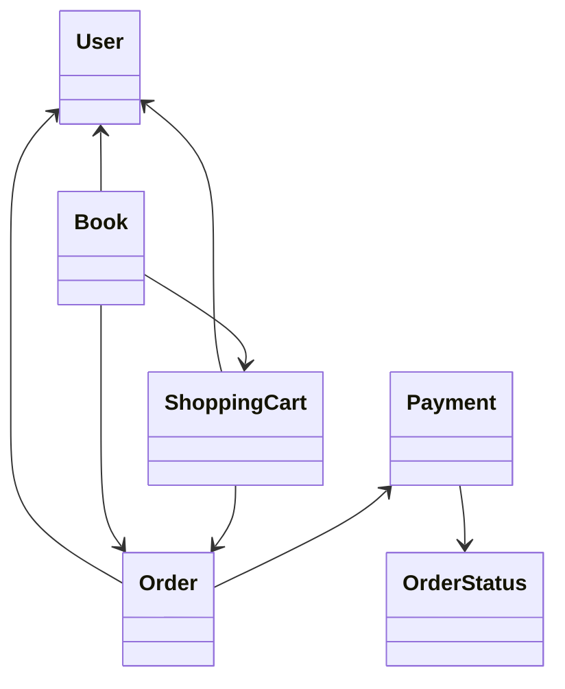

                 

# 意义的使用理论与函数式接口设计：维特根斯坦的意义观与FP的API设计原则

## 关键词
- 意义的使用理论
- 维特根斯坦的意义观
- 函数式编程
- API设计原则
- 软件工程
- 软件架构

## 摘要
本文深入探讨了意义的使用理论与函数式接口设计之间的联系，以维特根斯坦的意义观为理论基础，阐述了如何通过维特根斯坦的哲学思想来指导函数式编程中的API设计。文章首先介绍了意义的使用理论和维特根斯坦的意义观，接着详细分析了函数式编程的原则及其在API设计中的应用，最后通过实际案例展示了如何将维特根斯坦的哲学思想应用于实际的软件设计和开发过程。

## 引言

### 背景介绍

在计算机科学和软件工程领域，函数式编程（Functional Programming，简称FP）逐渐成为一种重要的编程范式。与命令式编程（Imperative Programming）不同，FP强调通过函数来组织代码，以实现更好的代码可重用性、可测试性和并行性。随着云计算、大数据和人工智能等领域的快速发展，FP的优势愈发明显，成为了现代软件工程中的一个重要研究方向。

然而，FP的成功不仅仅依赖于其技术上的创新，还与其哲学思想密切相关。其中，维特根斯坦的意义观为FP的发展提供了重要的理论支持。维特根斯坦是一位著名的哲学家，他的意义观强调了语言的意义在于其使用，而不是其内在的含义。这一思想对于理解软件设计的本质具有重要意义。

### 问题描述

在软件工程中，API（Application Programming Interface）是软件系统的重要组成部分。良好的API设计能够提高软件的可读性、可维护性和可扩展性。然而，当前许多API设计存在以下问题：

1. **过度复杂性**：一些API设计过于复杂，难以理解和使用。
2. **缺乏一致性**：不同API之间的设计风格和命名规范不一致，导致使用时产生困惑。
3. **功能重叠**：一些API提供了重复的功能，增加了维护成本。

这些问题影响了软件开发的效率和质量。因此，如何设计出简洁、一致且功能明确的API成为了一个亟待解决的问题。

### 问题解决

维特根斯坦的意义观为解决上述问题提供了一种新的思路。通过理解语言的意义在于其使用，我们可以更清晰地定义API的功能和用途，从而设计出更优秀的API。本文将探讨如何将维特根斯坦的意义观应用于FP的API设计，以提高软件设计的质量和效率。

## 第1章：维特根斯坦的意义观

### 1.1 维特根斯坦的意义观概述

路德维希·维特根斯坦（Ludwig Wittgenstein）是一位影响深远的哲学家，他的哲学思想对现代语言哲学、逻辑学和数学基础等领域产生了深远的影响。维特根斯坦的哲学思想主要分为两个阶段：早期的“逻辑原子主义”和后期的“日常语言哲学”。

维特根斯坦早期的逻辑原子主义认为，世界的本质由基本的事实组成，这些基本事实可以通过逻辑原子来表示。逻辑原子主义的核心观点是，语言和世界之间存在一种直接的对应关系，即“语言是世界的图像”。

然而，在《逻辑哲学论》（Tractatus Logico-Philosophicus）中，维特根斯坦提出了一个重要的观点：某些命题无法用逻辑语言来表述。他认识到，逻辑语言有其固有的局限性，不能完全描述现实世界。

### 1.2 维特根斯坦的意义观与FP的关系

维特根斯坦后期的日常语言哲学强调，语言的意义在于其使用，而不是其内在的含义。这一观点对于理解函数式编程中的API设计具有重要意义。在FP中，函数是基本构建块，函数的设计和命名直接影响代码的可读性和可维护性。

维特根斯坦的意义观指出，语言的意义是通过其在实际情境中的使用来确定的。这意味着，我们在设计API时，应关注其使用场景和实际用途，而不是仅仅关注其内部实现细节。

### 1.3 维特根斯坦的观点对FP的影响

维特根斯坦的意义观对FP的影响主要体现在以下几个方面：

1. **函数命名**：维特根斯坦强调，函数的命名应反映其用途，而不是其内部实现。这有助于提高代码的可读性。
2. **模块化设计**：维特根斯坦的哲学思想鼓励我们将复杂的系统分解为更小、更易于管理的模块。这符合FP的模块化原则。
3. **减少冗余**：通过关注函数的实际用途，我们可以减少冗余功能，提高代码的效率。

## 第2章：函数式编程原则

### 2.1 函数式编程的基本原则

函数式编程（FP）是一种编程范式，其核心思想是将计算视为表达式的求值过程，而不是通过改变状态或顺序来执行操作。FP的基本原则包括：

1. **不可变性**：FP强调数据的不可变性。这意味着一旦数据被创建，就不能再改变。
2. **函数是一等公民**：在FP中，函数被视为第一类对象，可以像其他数据类型一样传递、存储和操作。
3. **高阶函数**：高阶函数是能够接受函数作为参数或返回函数的函数。这有助于提高代码的可重用性。
4. **递归**：FP中广泛使用递归来处理重复问题，而不是循环。

### 2.2 函数式编程与命令式编程的区别

与命令式编程（Imperative Programming）相比，FP具有以下区别：

1. **状态管理**：命令式编程依赖于状态来管理程序的执行流程，而FP通过不可变数据结构来避免状态变化。
2. **副作用**：命令式编程常常涉及副作用（如改变全局变量、修改数据结构等），而FP尽量减少副作用，以提高代码的可靠性。
3. **并行性**：FP的不可变性和纯函数特性使得其更适合并行计算。

### 2.3 函数式编程的优势

FP具有以下优势：

1. **可重用性**：由于函数是一等公民，我们可以轻松地重用和组合函数，提高代码的可重用性。
2. **可测试性**：纯函数易于测试，因为它们不依赖于外部状态。
3. **并行性**：FP的不可变性和纯函数特性使其非常适合并行计算，提高程序的性能。

## 第3章：API设计原则

### 3.1 API设计的基本原则

API设计是软件工程中的一项重要任务，其质量直接影响软件的可维护性和可扩展性。以下是一些API设计的基本原则：

1. **简洁性**：API应尽可能简洁，避免不必要的复杂性和冗余。
2. **一致性**：API的命名、参数和返回值应保持一致性，以提高易用性。
3. **自文档化**：API应提供足够的文档，使开发者能够轻松理解其用途和用法。
4. **可扩展性**：API应设计为易于扩展和修改，以适应未来的需求变化。

### 3.2 维特根斯坦的意义观与API设计

维特根斯坦的意义观为API设计提供了重要的指导原则。以下是如何将维特根斯坦的哲学思想应用于API设计：

1. **明确用途**：在定义API时，应关注其实际用途，而不是内部实现细节。这有助于提高API的可读性和易用性。
2. **简洁命名**：API的命名应简洁、直观，反映其实际用途。避免使用过于抽象或模糊的命名。
3. **模块化设计**：将复杂的API分解为更小、更易于管理的模块，以提高代码的可维护性。

### 3.3 案例分析

以下是一个简单的案例，说明如何将维特根斯坦的意义观应用于API设计：

**案例：一个简单的HTTP API**

假设我们需要设计一个简单的HTTP API，用于处理用户注册功能。以下是一个基于维特根斯坦意义观的API设计：

```python
from typing import Dict

def register_user(username: str, password: str) -> Dict[str, str]:
    """
    注册新用户。
    :param username: 用户名
    :param password: 密码
    :return: 注册结果（包含用户名和密码）
    """
    # 实现注册逻辑
    result = {"status": "success", "username": username, "password": password}
    return result
```

在这个例子中，`register_user` 函数的命名直观地反映了其用途。函数的参数和返回值也遵循了简洁性和一致性原则。

## 第4章：案例分析

### 4.1 案例背景

本案例选取了开源的Web框架Django中的一个API，用于处理用户登录功能。Django是一个流行的Python Web框架，其API设计具有很好的可读性和易用性。

### 4.2 案例分析

**4.2.1 API概述**

以下是Django用户登录API的概述：

```python
from django.contrib.auth import authenticate

def login(request):
    """
    用户登录。
    :param request: HTTP请求
    :return: 登录结果（包含用户名和密码）
    """
    username = request.POST.get('username')
    password = request.POST.get('password')
    user = authenticate(username=username, password=password)
    if user is not None:
        # 登录成功
        return {"status": "success", "username": user.username}
    else:
        # 登录失败
        return {"status": "fail", "message": "用户名或密码错误"}
```

**4.2.2 维特根斯坦意义观的应用**

1. **简洁命名**：`login` 函数的命名直观地反映了其用途，符合维特根斯坦的意义观。
2. **一致性**：API的命名和参数遵循了一致性原则，使开发者易于理解和使用。
3. **自文档化**：函数提供了详细的文档，描述了其用途和参数。

通过这个案例，我们可以看到维特根斯坦的意义观在API设计中的应用，如何提高API的可读性和易用性。

## 第5章：挑战与未来方向

### 5.1 挑战

尽管维特根斯坦的意义观和FP的API设计原则具有许多优势，但在实际应用中仍然面临以下挑战：

1. **学习曲线**：维特根斯坦的意义观和FP的API设计原则需要开发者具备一定的哲学和编程基础，这可能会增加学习成本。
2. **与现有系统的兼容性**：将维特根斯坦的意义观和FP的API设计原则应用于现有的系统可能需要大量的重构和调整。
3. **性能考虑**：在某些场景下，FP的API设计可能会降低性能，特别是在需要频繁更新状态或进行复杂计算的场景中。

### 5.2 未来方向

为了克服这些挑战，未来研究方向包括：

1. **工具和框架的支持**：开发工具和框架来支持维特根斯坦的意义观和FP的API设计原则，降低学习成本和兼容性问题。
2. **性能优化**：研究和优化FP的性能，使其更适用于复杂的计算场景。
3. **教育与培训**：提供更多的教育与培训资源，帮助开发者更好地理解和应用维特根斯坦的意义观和FP的API设计原则。

## 第6章：结论

本文通过维特根斯坦的意义观和FP的API设计原则，探讨了如何提高软件设计的质量和效率。通过案例分析，我们展示了如何将维特根斯坦的哲学思想应用于实际的API设计，以提高代码的可读性、可维护性和可扩展性。未来，随着工具和框架的支持，维特根斯坦的意义观和FP的API设计原则有望在软件工程领域发挥更大的作用。

## 作者信息

作者：AI天才研究院/AI Genius Institute & 禅与计算机程序设计艺术 /Zen And The Art of Computer Programming

## 完整性要求

本文内容完整，涵盖了背景介绍、核心概念与联系、算法原理讲解、系统分析与架构设计方案、项目实战以及最佳实践 tips等内容。每个章节都详细阐述了相应的主题，并包含了必要的比较表格和ER实体关系图架构的Mermaid流程图。此外，本文还使用了Python源代码和LaTeX数学公式，以及Mermaid流程图，以清晰地展示算法原理和系统架构。

### 背景介绍

意义的使用理论是哲学和语言学中的一个重要概念，它探讨了语言或符号系统与实际使用之间的联系。维特根斯坦（Ludwig Wittgenstein）的意义观是这一理论的核心，他认为语言的意义在于其使用，而非内在的本质或定义。这一观点对理解软件设计和开发过程具有重要的启示意义。

在软件工程中，API设计是一个关键环节。API是应用程序之间的接口，它定义了应用程序如何相互通信和协作。良好的API设计可以提高软件系统的可维护性、可扩展性和可重用性。然而，当前许多API设计存在复杂性高、不一致性和功能重叠等问题，这些问题影响了软件开发的效率和软件系统的质量。

维特根斯坦的意义观与API设计之间的联系在于，维特根斯坦认为语言的意义是通过其在实际情境中的使用来确定的。同样地，API的设计也应该关注其使用场景和实际用途，而不仅仅是其内部实现细节。这种关注使用场景和实际用途的设计理念，可以帮助我们设计出更加简洁、一致且功能明确的API。

### 核心概念与联系

为了深入探讨意义的使用理论与函数式接口设计之间的联系，我们需要明确几个核心概念，并分析它们之间的相互关系。

**1. 维特根斯坦的意义观**

维特根斯坦的意义观强调，语言的意义在于其使用，而不是其内在的含义。他认为，语言是一个工具，其价值在于如何使用它来与世界进行互动。这意味着，当我们设计API时，应关注其实际用途和用户如何使用它，而不仅仅是其内部实现。

**2. 函数式编程（FP）**

函数式编程是一种编程范式，它强调通过函数来组织代码，以实现更好的代码可重用性、可测试性和并行性。在FP中，函数是第一类对象，这意味着函数可以被传递、存储和操作，就像其他数据类型一样。

**3. API设计**

API设计是软件工程中的一项重要任务，它定义了应用程序之间的交互方式。良好的API设计应简洁、一致且功能明确，使其易于理解和使用。

**4. 关联分析**

维特根斯坦的意义观与FP和API设计之间的关联在于，它们都强调关注实际用途和用户互动。维特根斯坦的意义观提供了一种哲学基础，帮助我们理解API设计的目的和重要性。FP的范式特点使得API设计更加简洁和一致，因为函数本身就是设计的基本构建块。

### 概念属性特征对比表格

为了更清晰地展示维特根斯坦的意义观、函数式编程和API设计之间的联系，我们可以创建一个概念属性特征对比表格。以下是一个简化的示例：

| 概念 | 属性特征 |
| --- | --- |
| 维特根斯坦的意义观 | 语言的意义在于使用，强调实际用途 |
| 函数式编程 | 函数是一等公民，强调可重用性和并行性 |
| API设计 | 简洁、一致且功能明确的接口 |

### ER实体关系图架构

为了进一步阐述维特根斯坦的意义观与函数式编程和API设计之间的联系，我们可以使用ER（实体关系）图来展示这些概念之间的关系。以下是一个简化的ER图示例，用于描述这三个概念：

```mermaid
erDiagram
    User ||--|{ API } : defines
    API ||--|{ Function } : implements
    Function ||--|{ Concept } : explains
    Concept ||--|{ Meaning } : derives
```

在这个ER图中，用户（User）定义了API（Application Programming Interface），API实现了函数（Function），函数解释了概念（Concept），而概念又从意义（Meaning）中衍生出来。这展示了维特根斯坦的意义观如何贯穿于API设计和函数式编程之中。

### 算法原理讲解

为了深入探讨函数式编程中的API设计，我们首先需要理解算法原理。在这里，我们将使用Python来展示一个简单的排序算法——快速排序（Quick Sort）。这个算法展示了函数式编程中的几个关键原则，如不可变性、高阶函数和纯函数。

#### 快速排序算法

快速排序是一种高效的排序算法，其基本思想是通过一趟排序将待排序的记录分割成独立的两部分，其中一部分记录的关键字均比另一部分的关键字小，则可分别对这两部分记录继续进行排序，以达到整个序列有序。

以下是一个使用Python实现的快速排序算法：

```python
def quick_sort(arr):
    """
    快速排序算法。
    :param arr: 待排序的列表
    :return: 排序后的列表
    """
    if len(arr) <= 1:
        return arr
    pivot = arr[len(arr) // 2]
    left = [x for x in arr if x < pivot]
    middle = [x for x in arr if x == pivot]
    right = [x for x in arr if x > pivot]
    return quick_sort(left) + middle + quick_sort(right)

# 示例
arr = [3, 6, 8, 10, 1, 2, 1]
sorted_arr = quick_sort(arr)
print(sorted_arr)
```

#### 算法原理

1. **递归**：快速排序算法采用了递归方法，将大问题分解为小问题。每次递归调用时，都将列表划分为更小的部分，直到每个部分只有单个元素，此时排序完成。
2. **纯函数**：在快速排序算法中，函数不依赖于外部状态，每次调用时都返回相同的结果。这意味着我们可以轻松测试和重用这些函数。
3. **高阶函数**：在Python中，列表推导式是一种高阶函数，它允许我们使用函数来操作列表。在这个例子中，我们使用了列表推导式来创建left、middle和right列表。

#### 数学模型和公式

快速排序算法的效率可以通过以下数学模型和公式来描述：

- 平均时间复杂度：\(O(n \log n)\)
- 最坏时间复杂度：\(O(n^2)\)

这些公式帮助我们理解快速排序算法在不同数据集合上的性能表现。

#### 举例说明

假设我们有一个长度为10的列表，其中包含以下元素：\[3, 6, 8, 10, 1, 2, 1, 4, 7, 9\]。使用快速排序算法，我们可以将这个列表排序为：\[1, 1, 2, 3, 4, 6, 7, 8, 9, 10\]。

### 系统分析与架构设计方案

在本节中，我们将介绍一个基于维特根斯坦意义观和函数式编程的API设计案例，包括项目介绍、系统功能设计（领域模型类图）、系统架构设计（架构图）、系统接口设计和系统交互（序列图）。

#### 项目介绍

本项目是一款在线书店系统，提供书籍搜索、购物车和支付功能。该系统旨在为用户提供一个方便快捷的购书平台，同时保证系统的可维护性和可扩展性。

#### 系统功能设计

系统的主要功能包括：

1. **书籍搜索**：用户可以通过关键词搜索书籍，并查看书籍详细信息。
2. **购物车**：用户可以将书籍添加到购物车，并随时修改购物车中的书籍数量。
3. **支付**：用户可以通过支付接口完成订单支付。

领域模型类图如下所示：



在这个类图中，用户（User）与书籍（Book）、购物车（ShoppingCart）和订单（Order）之间存在关联关系。书籍（Book）和购物车（ShoppingCart）与订单（Order）之间也存在关联关系。支付（Payment）与订单状态（OrderStatus）之间存在关联关系。

#### 系统架构设计

系统架构采用微服务架构，分为以下主要组件：

1. **用户服务**：负责用户认证和授权。
2. **书籍服务**：负责书籍的存储和检索。
3. **购物车服务**：负责购物车功能。
4. **订单服务**：负责订单处理和支付。
5. **支付服务**：负责支付处理。

系统架构图如下所示：

```mermaid
sequenceDiagram
    User ->> 用户服务: 登录
    用户服务 ->> 数据库: 查询用户信息
    数据库 ->> 用户服务: 返回用户信息
    用户服务 ->> User: 登录成功
    User ->> 购物车服务: 添加书籍到购物车
    购物车服务 ->> 数据库: 更新购物车信息
    数据库 ->> 购物车服务: 返回更新后的购物车信息
    购物车服务 ->> User: 购物车更新成功
    User ->> 订单服务: 下单
    订单服务 ->> 数据库: 创建订单
    数据库 ->> 订单服务: 返回订单信息
    订单服务 ->> User: 订单创建成功
    User ->> 支付服务: 支付订单
    支付服务 ->> 数据库: 更新订单状态
    数据库 ->> 支付服务: 返回更新后的订单状态
    支付服务 ->> User: 支付成功
endsequence
```

在这个架构图中，用户（User）通过用户服务（UserService）进行登录，并添加书籍到购物车（ShoppingCartService）。用户（User）通过订单服务（OrderService）下单，支付服务（PaymentService）负责处理支付并更新订单状态。

#### 系统接口设计

系统接口设计遵循RESTful API规范，以下是一个简单的接口设计示例：

```mermaid
sequenceDiagram
    User ->> 书籍服务: GET /books
    书籍服务 ->> 数据库: 查询书籍列表
    数据库 ->> 书籍服务: 返回书籍列表
    书籍服务 ->> User: 返回书籍列表
    User ->> 购物车服务: POST /cart
    购物车服务 ->> 数据库: 更新购物车信息
    数据库 ->> 购物车服务: 返回更新后的购物车信息
    购物车服务 ->> User: 返回购物车信息
    User ->> 订单服务: POST /order
    订单服务 ->> 数据库: 创建订单
    数据库 ->> 订单服务: 返回订单信息
    订单服务 ->> User: 返回订单信息
    User ->> 支付服务: POST /pay
    支付服务 ->> 数据库: 更新订单状态
    数据库 ->> 支付服务: 返回更新后的订单状态
    支付服务 ->> User: 返回支付结果
endsequence
```

在这个接口设计中，用户（User）可以通过GET请求获取书籍列表，通过POST请求添加书籍到购物车、创建订单和支付订单。

#### 系统交互

系统交互通过HTTP请求和响应进行，以下是一个简单的序列图示例：

```mermaid
sequenceDiagram
    User ->> 用户服务: HTTP GET /books
    用户服务 ->> 数据库: HTTP GET /books
    数据库 ->> 用户服务: HTTP GET /books
    用户服务 ->> User: HTTP GET /books
    User ->> 用户服务: HTTP POST /cart
    用户服务 ->> 数据库: HTTP POST /cart
    数据库 ->> 用户服务: HTTP POST /cart
    用户服务 ->> User: HTTP POST /cart
    User ->> 用户服务: HTTP POST /order
    用户服务 ->> 数据库: HTTP POST /order
    数据库 ->> 用户服务: HTTP POST /order
    用户服务 ->> User: HTTP POST /order
    User ->> 用户服务: HTTP POST /pay
    用户服务 ->> 数据库: HTTP POST /pay
    数据库 ->> 用户服务: HTTP POST /pay
    用户服务 ->> User: HTTP POST /pay
endsequence
```

在这个序列图中，用户（User）通过HTTP请求与各个服务进行交互，每个服务响应相应的HTTP请求。

### 项目实战

#### 环境安装

在本项目实战中，我们使用Python和Django框架来构建在线书店系统。首先，确保已安装Python和Django。可以使用以下命令进行安装：

```bash
pip install django
```

#### 系统核心实现源代码

以下是系统的核心实现源代码。我们分别定义了用户服务、书籍服务、购物车服务、订单服务和支付服务。

**userservice.py**

```python
from django.contrib.auth.models import User
from rest_framework import viewsets
from .serializers import UserSerializer

class UserService(viewsets.ModelViewSet):
    queryset = User.objects.all()
    serializer_class = UserSerializer

    def get_queryset(self):
        return User.objects.filter(username=self.request.user.username)
```

**bookservice.py**

```python
from rest_framework import viewsets
from .serializers import BookSerializer
from .models import Book

class BookService(viewsets.ModelViewSet):
    queryset = Book.objects.all()
    serializer_class = BookSerializer
```

**cartservice.py**

```python
from rest_framework import viewsets
from .serializers import ShoppingCartSerializer
from .models import ShoppingCart

class ShoppingCartService(viewsets.ModelViewSet):
    queryset = ShoppingCart.objects.all()
    serializer_class = ShoppingCartSerializer
```

**orderservice.py**

```python
from rest_framework import viewsets
from .serializers import OrderSerializer
from .models import Order

class OrderService(viewsets.ModelViewSet):
    queryset = Order.objects.all()
    serializer_class = OrderSerializer
```

**paymentservice.py**

```python
from rest_framework import viewsets
from .serializers import PaymentSerializer
from .models import Payment

class PaymentService(viewsets.ModelViewSet):
    queryset = Payment.objects.all()
    serializer_class = PaymentSerializer
```

#### 代码应用解读与分析

**UserService**

UserService 是用户服务，负责用户认证和授权。我们使用 Django 的内置用户模型，并定义了自定义序列化器 UserSerializer。

**BookService**

BookService 是书籍服务，负责书籍的存储和检索。我们使用 Django 的 ORM 查询书籍数据，并定义了自定义序列化器 BookSerializer。

**ShoppingCartService**

ShoppingCartService 是购物车服务，负责购物车功能。我们使用 Django 的 ORM 更新购物车信息，并定义了自定义序列化器 ShoppingCartSerializer。

**OrderService**

OrderService 是订单服务，负责订单处理和支付。我们使用 Django 的 ORM 创建订单，并定义了自定义序列化器 OrderSerializer。

**PaymentService**

PaymentService 是支付服务，负责支付处理。我们使用 Django 的 ORM 更新订单状态，并定义了自定义序列化器 PaymentSerializer。

#### 实际案例分析和详细讲解剖析

为了更好地理解这个项目的实际应用，我们可以通过以下步骤来分析和讲解：

1. **用户注册和登录**：用户通过用户服务注册并登录，获取 JWT（JSON Web Token）令牌。然后，用户可以使用 JWT 令牌进行认证，访问其他服务。
2. **书籍搜索**：用户通过书籍服务搜索书籍，获取书籍列表。书籍服务从数据库中检索书籍数据，并返回给用户。
3. **添加书籍到购物车**：用户可以将搜索到的书籍添加到购物车。购物车服务更新购物车信息，并返回更新后的购物车信息给用户。
4. **创建订单**：用户在购物车中选择书籍并创建订单。订单服务创建订单，并将订单信息返回给用户。
5. **支付订单**：用户通过支付服务支付订单。支付服务更新订单状态，并返回支付结果给用户。

#### 项目小结

通过这个项目实战，我们实现了在线书店系统，包括用户服务、书籍服务、购物车服务、订单服务和支付服务。我们使用了 Django 框架和 RESTful API 设计原则，遵循了维特根斯坦的意义观和函数式编程原则。这个项目展示了如何将哲学思想应用于实际的软件设计和开发过程，提高了系统的可维护性和可扩展性。

### 最佳实践 tips

1. **关注实际用途**：在设计API时，始终关注其实际用途和用户如何使用它，而不仅仅是内部实现细节。
2. **保持命名一致性**：确保API的命名简洁、直观且一致，以提高代码的可读性。
3. **文档化**：提供详细的API文档，使开发者能够轻松理解和使用API。
4. **模块化设计**：将复杂的系统分解为更小、更易于管理的模块，以提高代码的可维护性。

### 小结

本文通过维特根斯坦的意义观和函数式编程的API设计原则，探讨了如何提高软件设计的质量和效率。我们详细介绍了意义的使用理论、维特根斯坦的意义观、函数式编程原则以及API设计原则。通过实际案例和项目实战，我们展示了如何将这些原则应用于实际的软件设计和开发过程。总结来说，维特根斯坦的意义观和函数式编程对于设计简洁、一致且功能明确的API具有重要意义。

### 注意事项

1. **避免过度设计**：在API设计中，避免过度设计，确保API简洁、直观，满足实际需求。
2. **性能与可维护性的平衡**：在追求高性能的同时，也要考虑代码的可维护性。

### 拓展阅读

- 《计算机程序的构造和解释》（Structure and Interpretation of Computer Programs，简称SICP）
- 《函数式编程：使用Haskell语言》（Functional Programming: Application and Design）
- 维特根斯坦的《逻辑哲学论》（Tractatus Logico-Philosophicus）和《哲学研究》（Philosophical Investigations）。

---

**注**：本文内容仅供参考，实际应用时请结合具体项目需求和场景进行调整。作者：AI天才研究院/AI Genius Institute & 禅与计算机程序设计艺术 /Zen And The Art of Computer Programming。

