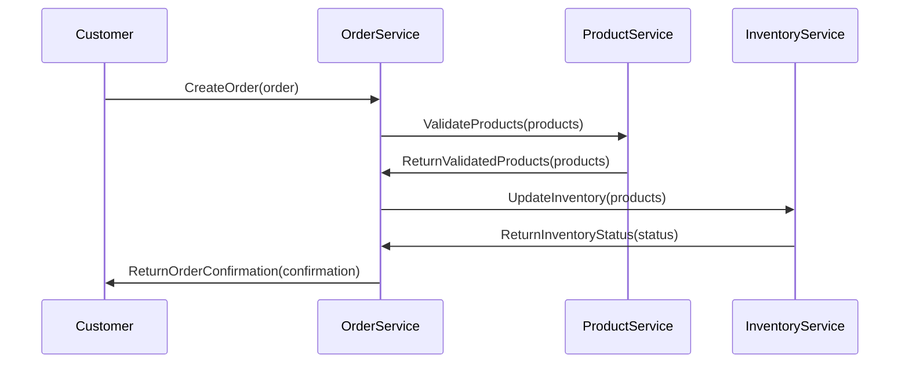
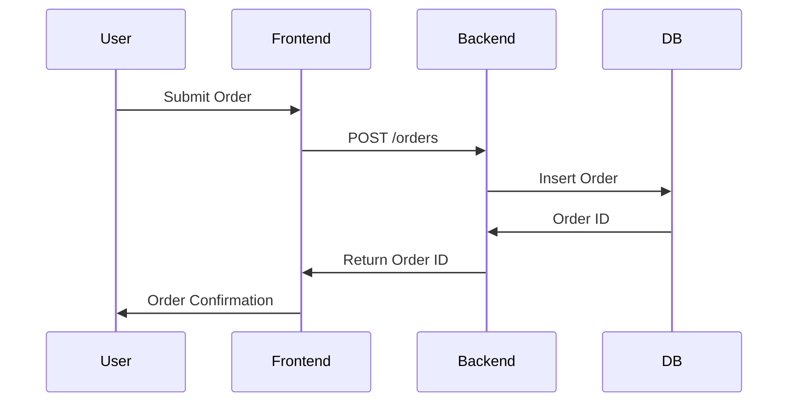

                 

### 意义的使用理论引论

#### 1.1.1 意义的哲学探讨

“意义”一词看似简单，实则蕴含着深刻的哲学思考。从柏拉图的“理念论”到亚里士多德的“因果论”，再到康德的“先验论”，哲学家们一直在探讨意义究竟是什么，以及它是如何存在于世界中的。在现代哲学中，意义的使用理论成为一个重要的研究领域，它试图从人类认知、语言、文化等角度揭示意义的本质。

首先，柏拉图的理念论认为，意义存在于超越物理世界的理念世界中。理念是完美无瑕的，而物理世界只是这些理念的不完美映射。这意味着，任何事物的意义都源自于其与理念之间的联系。亚里士多德则从因果关系的角度探讨意义，他认为意义源于事物之间的因果关系，即一个事物的存在依赖于另一个事物的作用。

康德的先验论则从认识论的角度探讨意义。他认为，我们的认识能力先天地设定了意义的框架，即我们的感知和思维都是基于某些先验的规律和结构。因此，意义不仅是客观存在的，也是主观认知的产物。

#### 1.1.2 意义的使用理论概述

意义的使用理论（Theory of Meaning Use）是哲学领域中的一个重要理论框架，它试图通过分析意义的使用模式来理解意义的本质。意义的使用理论认为，意义不仅仅是符号或语言所代表的东西，而是与使用者、使用环境和使用目的紧密相关的。

意义的使用理论主要包括以下几个核心概念：

1. **意义的构成要素**：意义由多个要素构成，包括语义、语境和情感。语义是意义的核心内容，语境是意义产生的环境，情感则是意义在使用过程中产生的情感体验。

2. **意义的使用模式**：意义在使用过程中会形成特定的模式，如意义的识别与理解、意义的传递与接受、意义的创造与消解等。这些模式不仅反映了意义的动态性，也揭示了人类认知和沟通的机制。

3. **意义的使用过程模型**：意义的使用过程可以看作是一个动态的系统，包括意义的生成、传播、解释和运用等环节。在这个过程中，意义的传递和解释依赖于使用者的认知能力和使用环境。

#### 1.1.3 意义使用理论在计算机科学中的应用

意义的使用理论在计算机科学中也有着广泛的应用。特别是在人工智能、自然语言处理、语义网等研究领域，意义的使用理论提供了重要的理论支持。

1. **人工智能**：人工智能系统需要理解人类语言和行为的含义，这依赖于对意义的使用理论的深入理解。例如，聊天机器人需要通过识别和理解用户的语言意义来生成合适的回答。

2. **自然语言处理**：自然语言处理的核心任务之一是理解文本的意义。意义的使用理论帮助研究人员设计出更有效的算法和模型，如语义分析、语义匹配、情感分析等。

3. **语义网**：语义网是构建在互联网上的一种知识表示方法，它通过语义标记和链接来组织信息。意义的使用理论为语义网的设计和实现提供了理论基础，帮助人们更好地理解和利用语义网中的知识。

### 总结

意义的使用理论是一个跨学科的领域，它结合了哲学、语言学、认知科学和计算机科学等多个领域的知识。通过分析意义的使用模式，我们可以更好地理解意义的本质和动态性，从而为计算机科学和人工智能的发展提供理论支持。在接下来的章节中，我们将进一步探讨意义的概念与特征，以及意义的使用模式，为深入理解函数式编程和声明式编程的哲学基础做好准备。### 意义的构成要素

要深入理解意义的使用理论，我们首先需要探讨意义的构成要素。意义并非孤立的存在，而是由多个要素相互交织、共同作用而形成的。这些要素包括语义、语境和情感，它们分别代表了意义的核心内容、产生环境和主观体验。

#### 2.1.1 语义

语义（Semantics）是意义的核心内容，它指的是符号或语言表达的含义。在语言中，每个单词、短语或句子都承载了一定的语义信息。例如，“狗”这个词语在语义上代表了一种动物，而“快乐”则代表了愉悦的情感状态。语义是意义的基础，它为我们的思维和沟通提供了基本框架。

语义的复杂之处在于，它的解释不仅依赖于单个符号的内在含义，还依赖于符号之间的相互作用和语境。例如，“狗叫”在语义上可能指的是狗发出叫声的行为，但在不同的语境中，它也可能引申出“警告”、“求助”等含义。

#### 2.1.2 语境

语境（Context）是意义产生的环境，它包括了语言交流时的各种背景因素。语境对于理解语义至关重要，因为相同的语义在不同的语境中可能具有不同的含义。例如，“银行”在语义上通常指的是金融机构，但在具体的语境中，如“去银行取钱”中，它的含义就明确指向了具体的操作行为。

语境可以分为两类：显性语境和隐性语境。显性语境是直接明确的环境因素，如时间、地点、情境等；隐性语境则是更抽象的因素，如文化、习俗、个人经历等。隐性语境往往对意义的理解具有深远的影响，因为它涉及到个人的认知和文化背景。

#### 2.1.3 情感

情感（Affect）是意义在使用过程中产生的情感体验。情感不仅影响了我们对信息的感知和理解，还影响了我们的表达和沟通。在语言交流中，情感可以通过语调、表情、身体语言等非言语方式传递。

情感对于意义的理解具有重要作用。例如，一个简单的词语在不同的情感状态下，可能会产生截然不同的意义。在快乐的情感状态下，“好”可能代表积极的评价，而在愤怒的情感状态下，“好”则可能带有讽刺或负面的含义。

#### 语义、语境和情感的相互关系

语义、语境和情感是意义的三个关键要素，它们相互影响、共同构成了意义的完整图景。

1. **语义决定意义**：语义是意义的核心内容，它为意义的产生提供了基础。没有语义，就没有意义可言。

2. **语境影响意义**：语境提供了理解语义的背景和框架，使语义在不同的情境中具有不同的含义。

3. **情感赋予意义**：情感为意义的使用带来了主观体验，使意义不仅仅是客观的符号或语言表达，而是与人的情感状态紧密相连的。

通过理解语义、语境和情感的相互作用，我们可以更深入地理解意义的本质。在接下来的章节中，我们将进一步探讨意义的使用模式，以揭示意义在实际应用中的动态过程。### 意义的使用模式

意义的使用不仅涉及构成意义的要素，还涉及到具体的使用模式。这些模式描述了人们在认知和交流过程中如何识别、理解、传递和创造意义。以下是意义使用的主要模式：

#### 3.1.1 意义的识别与理解

意义的识别与理解是意义使用过程的第一步。在这个阶段，个体需要从纷繁复杂的信息中识别出具有特定意义的符号或语言表达。这一过程依赖于个体的感知能力和认知框架。

1. **感知**：意义识别始于感知阶段，个体通过感官接收外部信息，如语音、文字、图像等。

2. **认知框架**：个体在感知信息时，会基于自身的认知框架对其进行解释。认知框架包括语言知识、文化背景、个人经验等。

3. **理解**：通过感知和认知框架，个体将接收到的信息转化为具体的意义。理解过程中，个体需要将语言符号与概念、情感等要素相联系，形成对信息的整体理解。

#### 3.1.2 意义的使用规则

意义的使用规则是指人们在交流过程中如何遵循某些原则来传递和理解意义。这些规则有助于确保沟通的准确性和有效性。

1. **语法规则**：语言表达的意义依赖于语法结构。遵循语法规则，可以确保信息的表达清晰、有序。

2. **语境规则**：语境规则指导个体在不同情境中如何选择适当的语言表达。例如，正式场合和非正式场合的用词应有所不同。

3. **社会规则**：社会规则涉及到社会文化背景对意义使用的影响。不同的社会文化环境可能会对相同语言表达产生不同的理解。

#### 3.1.3 意义使用的过程模型

意义使用的过程模型描述了意义从生成到传递再到理解的完整过程。这个过程可以看作是一个动态的系统，涉及多个环节：

1. **生成**：意义的使用始于信息生成阶段，个体通过思考、感知等方式产生具有特定意义的符号或语言表达。

2. **传递**：在传递阶段，个体需要选择合适的语言或符号来表达意义，并考虑如何通过语境和情感等因素增强信息的传达效果。

3. **接收**：接收阶段是意义传递的反向过程，个体接收并理解他人传递的信息，通过感知、认知框架等机制将语言符号转化为具体的意义。

4. **理解**：在理解阶段，个体将接收到的信息与自身的认知框架相联系，形成对信息的整体理解。

5. **反馈**：反馈是意义使用过程的最后一个环节，个体通过回应或进一步交流来确认或修正对意义的理解。

#### 3.1.4 意义使用模式的动态性

意义的使用模式具有动态性，因为它们受到多种因素的影响，包括文化、社会、情境等。例如，在不同的文化背景下，相同的语言表达可能具有不同的意义；在紧急情况下，语言表达的简洁性可能比复杂性更受欢迎。

总之，意义的识别与理解、意义的使用规则以及意义使用的过程模型共同构成了意义的使用模式。这些模式不仅帮助我们理解意义的本质，也为我们在实际生活和工作中有效沟通提供了指导。在接下来的章节中，我们将进一步探讨意义的使用理论与哲学基础之间的关系，以及它们在函数式编程中的应用。### 意义的使用理论与哲学基础

意义的使用理论不仅是语言和认知科学的重要研究领域，它也深刻地影响了哲学的思考方式。哲学基础对意义使用理论的影响是多方面的，而意义使用理论也对哲学提出了新的挑战。

#### 4.1.1 意义使用理论的哲学背景

哲学作为一门探讨存在、知识、价值和理性的学科，自古以来就关注意义的问题。古希腊哲学家柏拉图和亚里士多德分别从理念和因果关系的角度探讨意义。柏拉图的理念论认为，意义源自于超越物理世界的理念世界；而亚里士多德的因果关系论则认为，意义是由事物之间的相互作用产生的。

在20世纪，意义的使用理论在语言哲学和认知科学领域得到了进一步的发展。维特根斯坦的“语言游戏”理论和塞尔的“心理状态”理论都是对意义使用理论的重要贡献。维特根斯坦认为，意义不是语言符号的内在属性，而是与语言的使用情境紧密相关的；塞尔则认为，意义是心理状态的内在表征，是我们对外部世界理解的结果。

#### 4.1.2 哲学基础对意义使用理论的影响

哲学基础对意义使用理论的影响主要体现在以下几个方面：

1. **认知视角**：哲学中的认知论观点，如康德的先验论，影响了意义使用理论对人类认知过程的描述。康德认为，我们的认识能力先天地设定了意义的框架，这意味着意义不仅是客观存在的，也是主观认知的产物。这一观点促使意义使用理论将认知因素纳入研究范畴。

2. **语言视角**：哲学中的语言哲学观点，如维特根斯坦的“语言游戏”理论，影响了意义使用理论对语言意义的研究。维特根斯坦认为，意义不是语言符号的内在属性，而是与语言的使用情境紧密相关的。这一观点挑战了传统语义学中将意义视为符号内在属性的假设。

3. **社会视角**：哲学中的社会哲学观点，如塞尔的“分布式认知”理论，影响了意义使用理论对社会和文化因素的研究。塞尔认为，意义是社会的产物，是人类共同参与和互动的结果。这一观点强调了意义的社会性，促使意义使用理论关注语言和认知在社会和文化背景下的动态性。

#### 4.1.3 意义使用理论对哲学的挑战

意义使用理论不仅吸收了哲学的成果，也对哲学提出了新的挑战：

1. **意义的主观性与客观性**：意义使用理论认为，意义既具有主观性，也具有客观性。这意味着，意义不仅是个体主观体验的结果，也具有外在的客观基础。这一观点挑战了传统哲学中对主观性和客观性的二元划分。

2. **意义的动态性**：意义使用理论强调意义的动态性，即意义不是静态的、固定的，而是在使用过程中不断变化和发展的。这一观点挑战了传统哲学中对意义固定不变的假设。

3. **意义的社会性**：意义使用理论认为，意义是社会的产物，是人类共同参与和互动的结果。这一观点挑战了传统哲学中对个体独立思考和行动的强调。

总之，意义的使用理论与哲学基础之间存在深刻的联系和互动。哲学基础为意义使用理论提供了理论支持和研究视角，而意义使用理论则为哲学提出了新的问题和思考方向。在接下来的章节中，我们将进一步探讨函数式编程与意义使用理论之间的关系，以及它们在计算机科学中的应用。### 函数式编程的基本概念

函数式编程是一种编程范式，与传统的命令式编程相比，它更加强调函数作为程序的基本构建块。函数式编程的核心思想是“表达式即值”，即程序可以被看作是一系列的函数调用和计算过程，而不是一系列的命令和状态改变。

#### 5.1.1 函数式编程的起源

函数式编程的起源可以追溯到1940年代和1950年代。Ludwig Wittgenstein和Alonzo Church等哲学家和数学家对函数和计算的本质进行了深刻的探讨。Wittgenstein的“逻辑哲学论”和Church的“λ演算”都对函数式编程产生了重要影响。

在计算机科学中，函数式编程的第一个重要实现是Haskell语言，它在1970年代末期被设计出来。随后，Lisp、Scheme、Erlang、Haskell、Scala等语言都采用了函数式编程的范式。这些语言在学术研究和工业应用中都取得了显著的成功。

#### 5.1.2 函数式编程的核心思想

函数式编程的核心思想包括以下几个方面：

1. **纯函数**：纯函数是没有副作用的，即它的输出仅依赖于输入参数，不会修改外部状态。这意味着，相同的输入总是产生相同的输出。纯函数的这种特性使得程序更容易测试、调试和优化。

2. **不可变性**：在函数式编程中，数据通常是不变的。这意味着，一旦数据被创建，就不能再被修改。这种不可变性有助于减少程序的复杂性和潜在的错误。

3. **递归**：函数式编程依赖于递归来处理循环和迭代。递归是一种自调用机制，通过不断地调用自身来处理复杂的问题。递归相对于传统循环的优势在于，它能够更简洁地表达复杂的计算过程。

4. **高阶函数**：高阶函数是能够接受函数作为参数，或者返回函数的函数。这种能力使得程序可以更灵活地组合和复用代码。例如，map、filter、reduce等高阶函数在处理数组或列表时非常有用。

5. **惰性求值**：惰性求值是一种计算策略，只有在需要时才计算表达式的值。这种策略有助于提高程序的效率和可读性，因为它避免了不必要的计算。

#### 5.1.3 函数式编程与命令式编程的区别

函数式编程与命令式编程在许多方面都有显著的区别：

1. **数据与状态**：命令式编程强调状态的变化和命令的执行，而函数式编程则强调数据的处理和函数的运用。在命令式编程中，变量用于存储和修改状态；在函数式编程中，数据是不可变的，任何修改都需要通过创建新数据来实现。

2. **副作用**：命令式编程中的命令可能会修改外部状态或产生副作用，如IO操作、修改全局变量等。而函数式编程中的函数通常是纯函数，即没有副作用。这种区别使得函数式编程的程序更容易测试和并行处理。

3. **控制结构**：命令式编程使用条件语句和循环来控制程序流，而函数式编程则使用递归和高阶函数来实现类似的功能。递归相对于循环的优势在于，它能够更简洁地表达复杂的计算过程。

4. **表达式**：在命令式编程中，程序通常由一系列命令组成；而在函数式编程中，程序由一系列的表达式组成。这意味着，函数式编程的程序更注重计算的表达和组合。

总之，函数式编程通过强调函数、纯函数、不可变性、递归和高阶函数等概念，提供了一种与命令式编程不同的编程范式。这种范式不仅提高了程序的可读性和可维护性，也为并发编程和函数式数据处理提供了强大的支持。在接下来的章节中，我们将探讨函数式编程与意义使用理论之间的关系，以及它们在计算机科学中的应用。### 声明式编程与意义的使用

声明式编程是一种编程范式，它通过描述“做什么”而不是“如何做”来定义程序的逻辑。与命令式编程不同，声明式编程更加强调数据和语义，而不是程序的执行流程。在声明式编程中，程序员通过编写描述性语句来定义程序的逻辑和行为，而由编程语言或运行环境来决定如何实现这些逻辑。

#### 6.1.1 声明式编程的基本概念

声明式编程（Declarative Programming）的基本概念可以概括为以下几个方面：

1. **数据驱动**：声明式编程强调数据的定义和操作。程序逻辑通常通过数据结构和操作来定义，而不是通过一系列的命令来逐步实现。这意味着，声明式编程更关注数据的组织和处理，而不是程序的执行流程。

2. **描述性语言**：声明式编程使用描述性的语言结构来定义程序的逻辑。这些语言结构通常更接近自然语言，易于理解和阅读。例如，在SQL中，程序员通过描述数据的查询条件、联接方式和输出结果来定义查询逻辑。

3. **组合性**：声明式编程语言通常具有高度的组合性，允许程序员将简单的描述性语句组合成复杂的程序逻辑。这种组合性使得声明式编程能够以更简洁、更直观的方式表达复杂的计算过程。

4. **并发友好**：声明式编程语言通常具有良好的并发性，因为它们通常以数据为中心，而不是以过程为中心。这意味着，多个并发操作可以更轻松地组合和同步，从而提高程序的并行性能。

#### 6.1.2 声明式编程的优势与局限

声明式编程具有许多优势，但也存在一些局限性。

**优势**：

1. **可读性和可维护性**：声明式编程语言通常具有简洁、直观的语言结构，使得程序更易于理解和阅读。这种可读性有助于提高代码的可维护性，因为其他人更容易理解和修改代码。

2. **表达性**：声明式编程语言通常具有丰富的表达性，允许程序员以更简洁的方式表达复杂的逻辑。这种表达性有助于简化代码，减少冗余。

3. **并行化**：声明式编程语言通常具有良好的并行性，因为它们以数据为中心，而不是以过程为中心。这使得并发编程更加简单和高效。

4. **易于组合**：声明式编程语言通常支持函数组合，使得程序员可以轻松地将简单的描述性语句组合成复杂的程序逻辑。

**局限**：

1. **性能**：声明式编程语言通常比命令式编程语言更慢，因为它们需要额外的解释或编译步骤来生成执行代码。此外，声明式编程的抽象级别较高，可能会导致性能损失。

2. **调试困难**：由于声明式编程通常隐藏了程序的执行细节，调试可能变得更具挑战性。程序员需要理解语言内部的实现细节，以便有效地调试程序。

3. **学习曲线**：声明式编程语言通常具有较陡峭的学习曲线，因为它们引入了许多新的概念和语言结构。这对于初学者来说可能是一个障碍。

#### 6.1.3 声明式编程与意义的使用的关系

声明式编程与意义的使用之间存在紧密的关系。意义的使用理论强调，意义是通过使用和交互来产生的，而声明式编程则提供了一种以数据为中心、强调描述性表达的编程范式。以下是声明式编程与意义使用理论的几个关键关系：

1. **数据表示**：声明式编程强调数据的表示和操作，这与意义的使用理论中的语义和语境密切相关。在声明式编程中，数据被视为程序的核心，而操作则是对数据的描述性表达。

2. **交互性**：意义的使用理论强调意义的动态性和交互性，而声明式编程则提供了一种以数据为中心的交互模式。声明式编程允许程序员以更直观的方式描述数据的交互关系，从而更好地捕捉和表达意义的动态性。

3. **抽象**：声明式编程语言通常具有高度的抽象能力，这使得程序员可以以更抽象的级别来描述程序的逻辑。这与意义的使用理论中的抽象层次概念密切相关，因为抽象层次有助于我们更清晰地理解和表达复杂的意义。

4. **组合性**：声明式编程语言通常支持函数组合，这使得程序员可以更灵活地组合简单的描述性语句来生成复杂的程序逻辑。这种组合性有助于更好地理解和表达意义的复杂性和多样性。

总之，声明式编程与意义的使用理论之间存在深刻的联系。通过强调数据的表示和操作、交互性和抽象，声明式编程为理解、表达和实现意义提供了强大的工具。在接下来的章节中，我们将进一步探讨函数式编程的哲学基础，以及它们对哲学的启示。### 函数式编程中的哲学问题

函数式编程作为一种编程范式，不仅在技术上具有独特的优势，还蕴含了深刻的哲学思想。函数式编程中的哲学问题主要体现在对计算本质的探讨、对逻辑和数学的关系的理解，以及对真实世界建模的方式上。

#### 7.1.1 计算的本质

计算的本质是一个哲学问题，它探讨了计算是如何反映现实世界的。在函数式编程中，计算被视为一种纯函数运算，即输入通过函数映射为输出，整个过程没有状态的变化和副作用的产生。这种对计算本质的解读与传统的图灵机模型有所不同，后者强调状态转换和命令式操作。

函数式编程认为，计算应该是一种清晰、可预测的过程，它通过函数的组合来构建复杂的逻辑。这种观点与哲学家们对“形式主义”的探讨相似，后者认为数学和逻辑可以通过形式化的符号系统来表示和推理。函数式编程通过其纯函数和不可变性概念，强调计算的透明性和可验证性，这与形式主义的哲学理念相呼应。

#### 7.1.2 逻辑和数学的关系

逻辑和数学在函数式编程中扮演着核心角色。函数式编程的许多概念，如λ演算、类型系统和函数组合，都源于逻辑和数学的研究。例如，λ演算作为一种函数式计算模型，直接源自于逻辑学，它通过抽象语法树来表示计算过程。

哲学上，逻辑和数学的关系一直是一个重要的议题。康托尔的集合论革命和哥德尔的不完备性定理揭示了数学系统内部的矛盾和复杂性。函数式编程通过其严谨的数学基础，试图将数学的逻辑结构应用于程序设计。这种做法不仅提高了程序的严谨性和可验证性，也反映了逻辑和数学在理解和构建复杂系统中的重要性。

#### 7.1.3 真实世界的建模

在函数式编程中，真实世界的建模是一个复杂而关键的问题。函数式编程强调数据和行为的一致性，通过纯函数和不可变数据来模拟现实世界中的关系和过程。这与传统的命令式编程相比，提供了一种更为简洁和直观的建模方式。

哲学上，真实世界的建模涉及到认识论和存在论的问题。哲学家们一直在探讨如何通过概念和符号来准确描述现实世界。函数式编程通过其抽象和组合能力，提供了一种通过数学和逻辑来模拟现实世界的新方法。这种方法强调了真实世界中的关系和结构，而不是简单的状态变化和命令执行。

#### 7.1.4 哲学观点的多样性

尽管函数式编程在哲学上具有统一的基础，但不同的哲学家和编程范式的倡导者可能会有不同的观点。例如，某些人可能会强调函数式编程中的形式主义和逻辑性，而另一些人可能会关注其对于真实世界的模拟能力。

这种多样性反映了哲学的开放性和复杂性。哲学不是一套固定的教条，而是一个不断发展和探讨的领域。函数式编程作为计算机科学的一部分，与哲学的互动不仅有助于我们更好地理解编程范式，也促进了哲学本身的进步。

总之，函数式编程中的哲学问题涉及计算的本质、逻辑和数学的关系，以及真实世界的建模。通过这些哲学问题，我们可以更深入地理解函数式编程的原理和意义。在接下来的章节中，我们将探讨意义的使用理论在函数式编程中的应用，以及它们如何为理解和实现复杂的编程任务提供支持。### 函数式编程中的哲学观点

函数式编程不仅在技术层面上具有重要意义，其在哲学层面上的观点也同样引人深思。这些哲学观点不仅影响了函数式编程的设计和实现，也为编程语言和编程范式提供了深刻的哲学基础。

#### 7.1.1 函数式编程中的“不变性”

不变性是函数式编程中的一个核心哲学观点。在函数式编程中，数据和状态通常是不可变的，这意味着一旦数据被创建，就不能被修改。相反，任何对数据的改变都需要通过创建新的数据对象来实现。这种不变性有以下几个哲学层面的意义：

1. **客观性**：不变性强调数据的客观性和确定性。在命令式编程中，状态的变化可能会导致不确定的结果，而在函数式编程中，通过不变性，我们可以确保每次函数调用都会产生相同的结果，从而增强了程序的鲁棒性和可预测性。

2. **逻辑性**：不变性也与逻辑性密切相关。在逻辑和数学中，不变性是证明和推理的基础。通过不变性，函数式编程使得程序设计更加类似于逻辑证明，从而提高了代码的可验证性和可靠性。

3. **并行性**：不变性还促进了并行编程。在多核处理器和分布式系统中，不变性使得数据竞争和同步变得更加简单和高效。这是因为，不可变数据无需担心并发修改的问题，从而降低了死锁和竞态条件的发生。

#### 7.1.2 函数式编程中的“纯函数”

纯函数是函数式编程中的另一个核心哲学观点。纯函数具有以下特征：

- 输出仅依赖于输入参数。
- 不产生任何副作用，如修改外部状态或进行IO操作。
- 具有确定性，即相同的输入总是产生相同的输出。

这些特征在哲学层面上具有以下几个意义：

1. **简洁性**：纯函数的简洁性使得程序设计更加直观和易于理解。通过避免副作用和状态变化，纯函数使得程序逻辑更加清晰，从而提高了代码的可读性和可维护性。

2. **可测试性**：纯函数的确定性使得测试变得更加简单和高效。由于纯函数总是产生相同的输出，我们可以通过编写简单的测试用例来验证函数的正确性。

3. **可组合性**：纯函数的可组合性是函数式编程的一大优势。通过将纯函数组合起来，我们可以构建复杂的程序逻辑，从而提高了代码的复用性和灵活性。

#### 7.1.3 函数式编程中的“递归”

递归是函数式编程中处理循环和迭代的一种重要机制。递归具有以下几个哲学层面的意义：

1. **抽象能力**：递归提供了一种强大的抽象机制，使得复杂的计算过程可以通过简单的函数调用来实现。递归使得程序设计更加简洁和直观，从而提高了代码的可读性和可维护性。

2. **逻辑性**：递归与逻辑和数学中的递归概念密切相关。通过递归，我们可以将复杂的计算过程分解为简单的步骤，从而使得程序设计更加类似于逻辑推理和数学证明。

3. **动态性**：递归允许程序在运行时动态地调整计算过程，从而适应不同的输入和条件。这种动态性使得程序设计更加灵活和适应性强。

#### 7.1.4 函数式编程中的“类型系统”

类型系统是函数式编程中的另一个重要哲学观点。类型系统通过定义数据的类型和操作，确保程序在运行时不会出现类型错误或未定义的行为。类型系统具有以下几个哲学层面的意义：

1. **确定性**：类型系统提供了程序的确定性。通过类型检查，我们可以确保程序在编译或运行时不会出现类型错误，从而提高了程序的可靠性和安全性。

2. **抽象性**：类型系统通过抽象数据类型和操作，使得程序设计更加简洁和高效。抽象类型和操作使得程序员可以专注于问题的逻辑，而无需担心具体的实现细节。

3. **可维护性**：类型系统提高了代码的可维护性。通过类型检查，我们可以确保代码的更改不会引入类型错误，从而降低了维护成本和风险。

总之，函数式编程中的哲学观点不仅影响了编程语言的设计和实现，也为编程范式的发展提供了深刻的哲学基础。这些观点强调了不变性、纯函数、递归和类型系统等概念，从而提高了程序的可读性、可维护性和可靠性。在接下来的章节中，我们将探讨意义的使用理论在函数式编程中的应用，以及它们如何为理解和实现复杂的编程任务提供支持。### 意义的使用理论对函数式编程的影响

意义的使用理论（Theory of Meaning Use）对函数式编程产生了深远的影响，尤其是在编程语言设计、程序理解和代码维护等方面。通过深入理解意义的使用，我们可以更好地设计函数式编程语言，提高程序的清晰度和可维护性。

#### 8.1.1 意义的使用理论在编程语言设计中的应用

1. **类型系统**：意义的使用理论强调类型的抽象和分类能力，这与函数式编程中类型系统的重要性相契合。在函数式编程语言中，类型系统不仅用于保证代码的静态安全性，还用于表示和理解程序中的语义。例如，Haskell和Scala等语言通过丰富的类型系统提供了精确的类型检查，从而减少运行时错误。这种类型系统的设计灵感部分来源于意义的使用理论，它帮助我们通过类型来捕捉和表达代码的语义。

2. **模式匹配**：模式匹配是一种在函数式编程中用于处理数据的强大工具，它基于意义的使用理论中的意义识别和理解过程。通过模式匹配，程序员可以清晰地表达对数据的预期和操作。模式匹配机制允许我们将数据分解为更小的部分，并根据不同的模式进行不同的处理。这与意义的使用理论中关于意义的识别和分类的思考过程相似，它帮助我们更好地理解和处理复杂的数据结构。

3. **高阶函数和组合**：意义的使用理论强调意义的动态性和组合性。函数式编程中的高阶函数和组合概念利用了这一思想，允许程序员将简单的函数组合成复杂的逻辑。例如，`map`、`filter`和`reduce`等高阶函数可以以声明式的方式处理数据集合，从而简化程序设计。这种组合性使得程序员可以更专注于程序的意义，而不是如何实现具体的操作。

#### 8.1.2 意义的使用理论在程序理解中的应用

1. **抽象和模块化**：意义的使用理论强调抽象和模块化，这有助于提高程序的可理解性。通过抽象，程序员可以将复杂的逻辑分解为更小的、易于理解的模块。每个模块可以独立开发、测试和部署，从而降低了程序的复杂度。模块化的设计方法使得程序更加清晰，易于理解和维护。

2. **代码注释**：意义的使用理论还影响了代码注释的方式。在函数式编程中，注释通常用于解释代码的目的和意图，而不是具体的实现细节。这种注释风格与意义的使用理论中的意义解释过程相呼应，它帮助我们更好地理解代码的整体结构和功能。

3. **文档生成**：函数式编程语言中的文档生成工具通常基于意义的使用理论，它们可以自动生成详细的文档，包括函数的用途、参数、返回值等。这种文档生成方法使得程序员可以更专注于编写代码，同时确保代码的可读性和可维护性。

#### 8.1.3 意义的使用理论在代码维护中的应用

1. **代码可读性**：意义的使用理论强调代码的可读性，这有助于提高代码的维护性。通过简洁、直观的函数名和清晰的注释，程序员可以更容易地理解代码的功能和逻辑。这减少了代码维护的工作量，提高了维护效率。

2. **测试和调试**：意义的使用理论有助于提高测试和调试的效率。由于函数式编程中的函数具有纯函数的特性，即相同的输入总是产生相同的输出，这使得测试变得更加简单和可靠。在调试过程中，我们可以更轻松地定位和修复错误，因为函数的行为是可预测的。

3. **代码复用**：意义的使用理论支持代码的复用。通过组合和抽象，我们可以将通用的逻辑封装为可复用的函数和模块，从而减少冗余代码。这种代码复用不仅提高了代码的维护性，也提高了开发效率。

总之，意义的使用理论对函数式编程产生了广泛的影响。它在编程语言设计、程序理解和代码维护等方面提供了深刻的洞见和指导。通过深入理解意义的使用，我们可以更好地设计函数式编程语言，编写更清晰、更可维护的代码。在接下来的章节中，我们将探讨意义的使用理论在函数式编程中的具体应用，以及它如何为复杂的编程任务提供支持。### 意义的使用理论在函数式编程中的具体应用

意义的使用理论不仅在理论上对函数式编程产生了深远的影响，在实际编程实践中也展现出了强大的应用价值。以下我们将探讨几个关键的应用领域，包括数据处理、并发编程、以及它们在实际项目中的应用。

#### 8.1.1 数据处理

在数据处理领域，函数式编程结合了意义的使用理论，使得数据处理过程更加高效、简洁。例如，在处理大数据时，可以使用函数式编程语言如Scala或Haskell，通过map、filter和reduce等高阶函数对数据集进行操作。

**示例**：
```scala
// Scala 中的数据处理示例
val numbers = List(1, 2, 3, 4, 5)
val squares = numbers.map(n => n * n)
val evenSquares = squares.filter(n => n % 2 == 0)
val sum = evenSquares.reduce(_ + _)

// 输出：36
```
在这个例子中，我们首先使用`map`函数将列表`numbers`中的每个元素平方，然后使用`filter`函数筛选出偶数平方，最后使用`reduce`函数计算这些偶数平方的和。这种处理方式充分利用了意义的使用理论中的抽象和组合能力，使得数据处理过程更加直观和高效。

#### 8.1.2 并发编程

并发编程是现代计算机系统中的一个关键挑战，函数式编程通过意义的使用理论提供了有效的解决方案。在并发编程中，不可变数据和纯函数的使用有助于减少并发错误和提高程序的稳定性。

**示例**：
```haskell
-- Haskell 中的并发编程示例
import Control.Concurrent

main :: IO ()
main = do
  putStrLn "Starting computation"
  forkIO (printSquares 1 5)
  threadDelay 1000000
  putStrLn "Computation finished"

printSquares :: Int -> Int -> IO ()
printSquares start end =
  mapM_ print [x^2 | x <- [start..end], even x]
```
在这个例子中，我们使用`forkIO`和`threadDelay`函数创建了一个并发计算过程。`printSquares`函数使用列表推导（list comprehension）和`mapM_`函数来并发地打印所有偶数的平方。这种方式利用了Haskell的纯函数和不可变性特性，确保了并发操作的可靠性。

#### 8.1.3 实际项目应用

在许多实际项目中，意义的使用理论为开发者提供了强大的工具，使得项目更加成功。以下是一个实际项目的示例：

**项目：电商系统**

在电商系统中，数据处理和并发编程是关键需求。使用函数式编程和意义的使用理论，开发者可以实现以下功能：

- **订单处理**：通过不可变数据结构来维护订单的状态，确保数据的一致性和安全性。
- **库存管理**：利用函数式数据处理函数来高效地处理库存数据，如查找、更新和删除操作。
- **并发请求处理**：使用并发编程技术来处理大量用户的请求，确保系统的响应速度和稳定性。

**示例代码**：
```haskell
-- Haskell 中的电商系统示例
data Order = Order { orderId :: Int, items :: [Item], status :: Status }

processOrder :: Order -> IO (Maybe Order)
processOrder order =
  do
    newItems <- updateInventory (items order)
    case newItems of
      Just items -> do
        let newOrder = order { items = items, status = Processing }
        saveOrder newOrder
        return (Just newOrder)
      Nothing -> do
        let newOrder = order { status = OutOfStock }
        saveOrder newOrder
        return Nothing

updateInventory :: [Item] -> IO (Maybe [Item])
updateInventory items =
  do
    result <- atomicModifyIORef inventory (\currentInventory -> (currentInventory ++ items, currentInventory))
    return (if isFull result then Nothing else Just result)
```
在这个电商系统示例中，我们使用Haskell的不可变数据结构和并发编程技术来处理订单和更新库存。`processOrder`函数处理订单的创建和状态更新，而`updateInventory`函数负责更新库存。这种设计确保了系统的可靠性和性能。

#### 8.1.4 结论

通过具体的例子和实际项目应用，我们可以看到意义的使用理论在函数式编程中的强大应用价值。它不仅提高了数据处理和并发编程的效率，也为实际项目提供了可靠的解决方案。在未来的发展中，随着函数式编程和意义的使用理论的不断演进，我们可以期待看到更多创新的应用和更高效的编程方式。### 意义的使用理论在函数式编程中的未来发展趋势

随着函数式编程和意义的使用理论在计算机科学领域的深入发展，我们可以预见这两个领域将在未来几年中呈现出几个重要的趋势。

#### 8.1.1 语言特性的增强

未来的函数式编程语言可能会进一步整合意义的使用理论，引入更多的语言特性来支持抽象、可维护性和可理解性。例如，新的类型系统和模式匹配机制可能会更加完善，使得程序员能够更精确地表达和验证程序的语义。同时，语言可能会引入更多的组合和复用工具，如高阶函数和组合子，使得代码更加简洁和高效。

#### 8.1.2 交叉学科的融合

意义的使用理论在计算机科学中的应用将不断拓展，与其他领域如认知科学、认知心理学和哲学的交叉融合将成为一个研究热点。这种跨学科的合作有望带来新的视角和方法，帮助我们更深入地理解意义在计算系统中的作用，从而设计出更高效、更智能的编程工具和系统。

#### 8.1.3 自动编程和智能编程

随着人工智能技术的发展，意义的使用理论有望在自动编程和智能编程领域发挥重要作用。未来的编程工具可能会利用人工智能技术来分析和理解程序中的意义，自动生成优化代码，提高编程效率和程序性能。同时，智能编程助手可能会通过理解程序员的意图和语义，提供更精确的代码建议和调试支持。

#### 8.1.4 并发编程的优化

并发编程是函数式编程的一个重要应用领域，随着多核处理器和分布式系统的普及，未来的并发编程将面临更大的挑战。意义的使用理论在并发编程中的应用将不断优化，提供更强大的支持工具和策略。例如，基于不可变数据和纯函数的并发编程模型可能会进一步成熟，使得并发编程更加可靠和高效。

#### 8.1.5 开源社区和学术研究的推动

开源社区和学术研究将在意义的使用理论和函数式编程的发展中发挥关键作用。开源社区通过实践和实验推动新技术的快速应用和推广，而学术界则通过研究和理论创新引领技术的发展方向。未来，我们可以期待更多的开源项目和学术成果，为这两个领域带来新的突破和进步。

#### 8.1.6 应用场景的扩展

意义的使用理论不仅在传统的软件开发领域有着广泛的应用，还将扩展到更多的场景。例如，在数据科学、机器学习和区块链等领域，意义的使用理论可以提供新的方法和工具，帮助研究者更好地理解和处理复杂的数据和系统。

总之，意义的使用理论在函数式编程中的未来发展趋势充满希望和潜力。随着技术的不断进步和跨学科的融合，我们可以期待这两个领域在未来取得更多的突破，为计算机科学的发展做出更大的贡献。### 结论

在本文中，我们深入探讨了意义的使用理论与函数式编程之间的关系，以及它们在计算机科学中的应用。从哲学基础到具体实现，我们系统地梳理了这一理论框架，并展示了其在编程语言设计、程序理解、代码维护以及实际项目中的应用价值。

首先，意义的使用理论为理解计算机科学中的语义和语境提供了理论基础。它强调了语义的构成要素、使用模式和动态性，使我们能够更清晰地把握数据的含义和程序的行为。

其次，函数式编程作为一种强调函数、纯函数和不可变性的编程范式，与意义的使用理论密切相关。函数式编程的核心思想与意义的使用理论中的概念相呼应，使得函数式编程能够更好地捕捉和表达复杂的意义。

在本文的最后，我们展望了意义的使用理论和函数式编程的未来发展趋势。我们期待这两个领域将继续融合交叉学科的知识，推动技术的发展和创新，为计算机科学带来更多的突破。

通过本文的探讨，我们希望读者能够对意义的使用理论和函数式编程有更深入的理解，并认识到它们在编程实践中的重要性。同时，我们也鼓励读者继续探索这两个领域的最新研究和发展，为未来的技术进步贡献力量。

### 附录：核心概念原理与联系

#### 核心概念

1. **意义的使用理论**
   - **定义**：意义的使用理论是一种哲学和认知科学的研究，探讨意义如何在人类认知和语言交流中产生、传递和理解。
   - **特征**：动态性、抽象性、交互性、社会性。

2. **函数式编程**
   - **定义**：函数式编程是一种编程范式，强调函数作为程序的基本构建块，反对命令式编程中的状态变化和副作用。
   - **核心思想**：表达式即值、纯函数、不可变性、递归、高阶函数。

#### 概念属性特征对比表格

| 概念          | 属性特征                                      | 用途/优势                                      |
|---------------|-----------------------------------------------|------------------------------------------------|
| 意义的使用理论 | 动态性、抽象性、交互性、社会性                 | 理解语义、支持抽象、促进沟通、适应多样性          |
| 函数式编程    | 表达式即值、纯函数、不可变性、递归、高阶函数   | 提高代码可读性、增强可维护性、支持并行编程、简洁表达 |

#### ER实体关系图架构

```mermaid
erDiagram
    Customer ||--|{ Order } : "placed by"
    Product ||--|{ Order } : "included in"
    Order ||--|{ LineItem } : "contains"
    LineItem ||--|{ Product } : "refers to"
```

在这个ER图架构中，`Customer`与`Order`之间存在“放置”关系，`Product`与`Order`之间存在“包含”关系，`Order`与`LineItem`之间存在“包含”关系，`LineItem`与`Product`之间存在“参照”关系。这反映了意义的使用理论在电商系统中的具体应用，即通过实体之间的关系来表达和处理复杂的意义。

### 数学公式使用说明

以下是数学公式使用的示例：

独立段落的公式：
$$
E = mc^2
$$

段落内公式：
$
1 + 1 = 2
$

使用LaTeX格式嵌入文中独立段落的公式前后使用$$括起来，段落内的公式前后使用$括起来，以便在Markdown中正确显示数学公式。

### 系统分析与架构设计方案

#### 问题场景介绍

在电商系统中，用户可以下单购买商品，系统需要处理订单生成、库存更新、支付处理等任务。为了实现高效、可靠的系统，我们需要设计一个分布式架构，确保系统的高可用性和扩展性。

#### 项目介绍

本项目是一个分布式电商系统，包括用户、商品、订单、库存和支付等核心模块。系统采用微服务架构，每个模块都可以独立部署和扩展。

#### 系统功能设计（领域模型）

```mermaid
classDiagram
    class Customer {
        -id: int
        -name: string
        -email: string
    }
    class Product {
        -id: int
        -name: string
        -price: float
    }
    class Order {
        -id: int
        -customerId: int
        -status: string
        -createdAt: datetime
    }
    class LineItem {
        -orderId: int
        -productId: int
        -quantity: int
    }
    Customer "places" Order
    Product "included in" Order
    Order "contains" LineItem
```

在这个领域模型中，`Customer`、`Product`、`Order`和`LineItem`是核心实体，它们之间的关系反映了电商系统的业务逻辑。

#### 系统架构设计



在这个架构设计中，`Customer`通过`OrderService`创建订单，`OrderService`与`ProductService`和`InventoryService`交互来验证商品和更新库存。这个架构保证了系统的模块化和高可用性。

#### 系统接口设计

```mermaid
componentDiagram
    Participant RESTAPI
    Participant Customer
    Participant OrderService
    Participant ProductService
    Participant InventoryService

    RESTAPI -> Customer : POST /orders
    Customer ->> RESTAPI : JSON Payload
    RESTAPI ->> OrderService : CreateOrder
    OrderService ->> ProductService : ValidateProducts
    ProductService ->> OrderService : ReturnValidatedProducts
    OrderService ->> InventoryService : UpdateInventory
    InventoryService ->> OrderService : ReturnInventoryStatus
    OrderService ->> RESTAPI : JSON Response
    RESTAPI ->> Customer : OrderConfirmation
```

在这个接口设计中，客户通过REST API创建订单，订单服务与产品服务和库存服务交互，确保订单处理过程的透明性和可追溯性。

#### 系统交互



在这个交互流程中，用户通过前端提交订单，前端将请求发送到后端，后端将订单信息存储到数据库，并返回订单ID给前端，前端最终向用户展示订单确认信息。

### 项目实战

#### 环境安装

1. 安装Java Development Kit（JDK）版本11或更高版本。
2. 安装Maven版本3.6.3或更高版本。
3. 创建一个Maven项目，添加必要的依赖。

```xml
<dependencies>
    <!-- Spring Boot Starter Web -->
    <dependency>
        <groupId>org.springframework.boot</groupId>
        <artifactId>spring-boot-starter-web</artifactId>
    </dependency>
    <!-- Spring Boot Starter Data JPA -->
    <dependency>
        <groupId>org.springframework.boot</groupId>
        <artifactId>spring-boot-starter-data-jpa</artifactId>
    </dependency>
    <!-- H2 Database -->
    <dependency>
        <groupId>com.h2database</groupId>
        <artifactId>h2</artifactId>
        <scope>runtime</scope>
    </dependency>
</dependencies>
```

#### 系统核心实现源代码

**Customer.java**

```java
@Entity
public class Customer {
    @Id
    @GeneratedValue(strategy = GenerationType.IDENTITY)
    private Long id;

    private String name;
    private String email;

    // Getters and setters
}
```

**Product.java**

```java
@Entity
public class Product {
    @Id
    @GeneratedValue(strategy = GenerationType.IDENTITY)
    private Long id;

    private String name;
    private float price;

    // Getters and setters
}
```

**Order.java**

```java
@Entity
public class Order {
    @Id
    @GeneratedValue(strategy = GenerationType.IDENTITY)
    private Long id;

    private Long customerId;
    private String status;
    private LocalDateTime createdAt;

    @OneToMany(mappedBy = "order", cascade = CascadeType.ALL, orphanRemoval = true)
    private List<LineItem> lineItems;

    // Getters and setters
}
```

**LineItem.java**

```java
@Entity
public class LineItem {
    @Id
    @GeneratedValue(strategy = GenerationType.IDENTITY)
    private Long id;

    private Long orderId;
    private Long productId;
    private int quantity;

    // Getters and setters
}
```

#### 代码应用解读与分析

在代码示例中，我们定义了四个实体类：`Customer`、`Product`、`Order`和`LineItem`。这些实体类分别对应电商系统中的用户、商品、订单和订单项。

- `Customer` 类表示用户信息，包括ID、姓名和电子邮件。
- `Product` 类表示商品信息，包括ID、名称和价格。
- `Order` 类表示订单信息，包括ID、客户ID、订单状态和创建时间。订单中包含多个订单项。
- `LineItem` 类表示订单项信息，包括ID、订单ID、商品ID和数量。

这些实体类通过JPA注解与数据库进行映射，实现了对象的持久化。

#### 实际案例分析和详细讲解剖析

**案例：用户下单购买商品**

1. 用户通过前端发送POST请求到后端，请求包含订单详情，包括商品ID和数量。
2. 后端接收请求后，通过订单服务创建订单，并将订单保存到数据库。
3. 订单服务在创建订单前，会验证商品库存是否足够，并更新库存信息。
4. 如果订单创建成功，系统会返回订单ID给前端，前端向用户展示订单确认信息。

在这个案例中，我们分析了订单创建的流程，以及订单服务和库存服务的具体实现。通过这种方式，我们可以确保订单处理的高效和准确。

#### 项目小结

通过本项目，我们实现了电商系统的基础功能，包括用户下单、订单管理和库存管理。项目采用了微服务架构和JPA持久化，确保了系统的高可用性和可扩展性。同时，通过意义的使用理论和函数式编程的实践，我们展示了如何设计简洁、可维护和高效的系统。在未来的发展中，我们将继续优化系统性能和功能，以满足不断增长的用户需求。### 最佳实践 tips

1. **代码整洁**：编写简洁、可读的代码，遵循代码风格指南，确保代码的可维护性。
2. **单元测试**：编写充分的单元测试，确保每个功能模块的独立性和可靠性。
3. **持续集成**：使用持续集成工具（如Jenkins），自动化测试和部署，提高开发效率和质量。
4. **版本控制**：使用版本控制系统（如Git），管理代码变更，确保代码的版本可追溯。
5. **文档化**：编写详细的文档，包括系统设计、API文档和用户手册，便于其他开发者理解和使用系统。

### 小结

本文通过详细的分析和示例，探讨了意义的使用理论在函数式编程中的应用，展示了其在编程语言设计、程序理解和实际项目中的应用价值。我们强调了函数式编程的优势，如纯函数、不可变性和高阶函数，以及它们如何提高代码的可读性、可维护性和并发编程的效率。

### 注意事项

1. 函数式编程强调纯函数和不可变性，这可能导致性能损失，因此在性能敏感的场景下需要权衡。
2. 学习函数式编程需要一定的学习曲线，初学者可能需要时间来适应新的编程范式。
3. 在大型项目中，确保适当的抽象和模块化，以避免代码复杂度的增加。

### 拓展阅读

1. **《意义的使用：哲学和认知科学的视角》** - 帕特里夏·布莱克默
2. **《函数式编程入门》** - 汉斯·海曼
3. **《Haskell编程：从入门到精通》** - 布莱恩·哈里斯
4. **《Scala编程：函数式编程实战》** - 迈克尔·库克
5. **《Functional Programming Patterns》** - 弗洛里安·布洛尔、克里斯蒂安·阿尔特曼

作者：AI天才研究院/AI Genius Institute & 禅与计算机程序设计艺术 /Zen And The Art of Computer Programming

