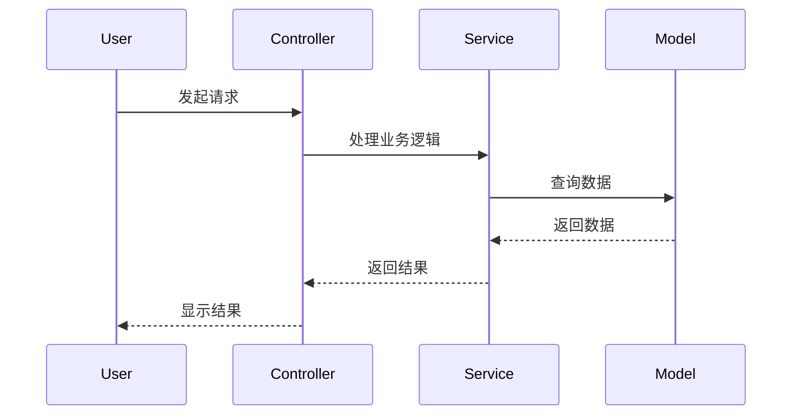
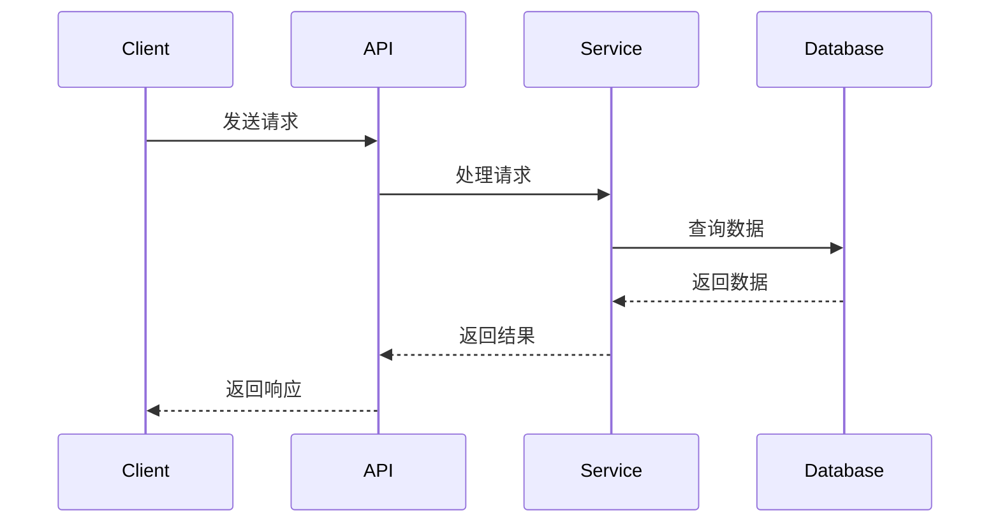

                 

### 第一部分: 背景与理论基础

#### 第1章: 背景介绍

**1.1 语境依赖性与函数式依赖管理的重要性**

在当今快速发展的信息技术领域，软件系统的复杂性日益增加，传统的设计模式和开发方法逐渐显露出其局限性。特别是在面向复杂应用场景的软件开发中，如何有效地管理软件的依赖性成为一个亟待解决的问题。语境依赖性与函数式依赖管理作为一种先进的软件设计理念，能够帮助我们更好地理解和处理这些复杂的依赖关系，从而提高软件的模块化、可维护性和扩展性。

语境依赖性是指变量或对象在不同的语境中可能具有不同的值或行为，而函数式依赖管理则是通过函数式编程（FP）的依赖注入技术来管理这些依赖关系。这两者的结合，不仅有助于提升软件开发的效率，还能为软件设计提供新的视角和方法。

**1.2 维特根斯坦的意义理论概述**

路德维希·维特根斯坦（Ludwig Wittgenstein）是20世纪最杰出的哲学家之一，他的意义理论对语言哲学、逻辑学和数学基础等领域产生了深远的影响。维特根斯坦认为，语言的意义取决于其在实际使用中的语境。换句话说，一个词语或语句的意义不仅仅取决于其本身，还取决于它在特定语境中的使用方式。

维特根斯坦的意义理论为我们提供了一个理解语境依赖性的哲学基础。在软件设计中，这一理论可以指导我们如何更好地处理和理解变量、对象、方法等元素在不同语境下的依赖关系。

**1.3 FP与依赖注入技术的基本概念**

函数式编程（Functional Programming，FP）是一种编程范式，它强调函数作为程序的基本组成单元，通过函数的组合和递归来实现复杂逻辑。FP与命令式编程相比，具有不可变数据和高阶函数等特性，使得程序更简洁、更易于理解和维护。

依赖注入（Dependency Injection，DI）是FP中的一种关键技术，它通过将组件间的依赖关系在编译时或运行时进行解耦，从而实现代码的模块化和可测试性。依赖注入的核心思想是将依赖对象注入到目标对象中，而不是在目标对象内部直接创建依赖对象。

#### 第2章: 核心概念与联系

**2.1 维特根斯坦的意义理论**

**2.1.1 维特根斯坦的意义理论概述**

维特根斯坦的意义理论主要分为两个部分：逻辑原子论和日常语言哲学。在逻辑原子论中，他提出了“图像理论”，认为命题的意义在于其与事实之间的关系。在日常语言哲学中，他关注语言的日常使用，强调语境对意义的决定作用。

**2.1.2 意义与语境依赖性的关系**

维特根斯坦认为，一个词语或语句的意义与其在特定语境中的使用紧密相关。这意味着，语境依赖性是理解意义的关键。在软件设计中，这一观点可以帮助我们更好地理解变量、对象和方法等元素在不同语境下的行为。

**2.1.3 意义的分类**

维特根斯坦将意义分为两种类型：日常语言中的意义和科学语言中的意义。日常语言中的意义往往依赖于具体的语境和情境，而科学语言中的意义则更具有普适性。在软件设计中，理解这两种意义的差异有助于我们更好地处理复杂的依赖关系。

**2.2 语境依赖性与函数式依赖管理**

**2.2.1 语境依赖性的特点**

语境依赖性的特点包括：变量或对象在不同的语境中可能具有不同的值或行为，以及依赖关系的动态性和不确定性。这些特点使得传统的依赖管理方法难以应对。

**2.2.2 函数式依赖管理的概念**

函数式依赖管理是一种通过FP的依赖注入技术来管理依赖关系的方法。它通过解耦组件间的依赖关系，使得代码更模块化、更易于维护。依赖注入的核心思想是将依赖对象注入到目标对象中，而不是在目标对象内部直接创建依赖对象。

**2.2.3 语境依赖性与函数式依赖管理的关系**

语境依赖性与函数式依赖管理之间存在紧密的联系。维特根斯坦的意义理论为我们提供了一个理解语境依赖性的哲学基础，而FP的依赖注入技术则提供了一种具体的方法来管理这些依赖关系。

#### 第3章: 算法原理与数学模型

**3.1 意义的语境依赖性算法**

**3.1.1 算法描述**

意义的语境依赖性算法主要基于维特根斯坦的意义理论，通过分析词语或语句在特定语境中的使用情况来确定其意义。算法的基本步骤包括：

1. 收集相关的语境信息。
2. 分析语境信息，确定词语或语句的意义。
3. 根据语境变化更新词语或语句的意义。

**3.1.2 数学模型**

为了更好地描述意义的语境依赖性算法，我们可以使用一个数学模型来表示词语或语句的意义。假设词语或语句的意义可以用一个函数来表示，该函数的输入是语境信息，输出是意义。函数的形式可以表示为：

$$
意义 = f(语境信息)
$$

**3.1.3 算法举例**

假设我们有一个词语“成功”，在不同的语境中可能有不同的意义。在职场语境中，“成功”可能指职业成就，而在个人生活语境中，“成功”可能指幸福。意义的语境依赖性算法可以通过分析具体的语境信息来确定“成功”在不同语境中的意义。

**3.2 函数式依赖管理算法**

**3.2.1 算法描述**

函数式依赖管理算法通过FP的依赖注入技术来管理组件间的依赖关系。算法的基本步骤包括：

1. 确定组件间的依赖关系。
2. 创建依赖注入容器，用于存储和管理依赖关系。
3. 将依赖对象注入到目标对象中。

**3.2.2 数学模型**

为了更好地描述函数式依赖管理算法，我们可以使用一个数学模型来表示依赖关系。假设依赖关系可以用一个函数来表示，该函数的输入是依赖对象，输出是目标对象。函数的形式可以表示为：

$$
目标对象 = g(依赖对象)
$$

**3.2.3 算法举例**

假设我们有一个Web应用程序，其中包含多个组件，如控制器、服务、模型等。通过函数式依赖管理算法，我们可以将这些组件的依赖关系解耦，并将依赖对象注入到目标对象中，从而实现代码的模块化和可测试性。

#### 第4章: 系统分析与架构设计

**4.1 问题场景与项目介绍**

在本章中，我们将以一个实际的项目为例，介绍如何应用维特根斯坦的意义理论与FP的依赖注入技术来设计和实现一个具有高模块化、高可维护性的软件系统。

**4.2 系统功能设计**

系统功能设计包括识别系统的主要功能模块、定义每个模块的具体职责，以及它们之间的交互关系。在本章中，我们将使用Mermaid类图来展示系统的主要功能模块及其关系。

```mermaid
classDiagram
    Controller <.. Service
    Service <.. Model
    Controller o--^ View
```

**4.3 系统架构设计**

系统架构设计涉及系统的整体结构，包括技术选型、数据流、控制流以及模块之间的关系。在本章中，我们将使用Mermaid架构图来展示系统的整体架构。



**4.4 系统接口设计与交互**

系统接口设计包括定义系统对外提供的API接口、接口参数以及返回值。在本章中，我们将使用Mermaid序列图来展示系统的接口交互流程。



通过上述系统分析与架构设计，我们可以清晰地看到如何将维特根斯坦的意义理论与FP的依赖注入技术应用于实际的项目开发中，实现一个高模块化、高可维护性的软件系统。

#### 第5章: 项目实战

**5.1 环境安装与配置**

在进行项目实战之前，我们需要先安装和配置好开发环境。以下是基本的安装步骤：

1. **安装Python环境**：确保Python 3.8或更高版本已安装。
2. **安装依赖管理工具**：如pip、virtualenv等。
3. **创建虚拟环境**：使用virtualenv创建一个名为`project_env`的虚拟环境，并激活它。

```bash
virtualenv project_env
source project_env/bin/activate
```

4. **安装项目依赖**：在虚拟环境中安装项目所需的依赖库。

```bash
pip install -r requirements.txt
```

**5.2 系统核心实现源代码**

在本节中，我们将提供项目核心部分的源代码。以下是关键模块的实现代码：

**5.2.1 Controller模块**

```python
from dependency_injection import Injectable
from service import UserService

class UserController(Injectable):
    def __init__(self):
        self.user_service = UserService()

    def handle_user_request(self, request):
        user = self.user_service.get_user_by_id(request.user_id)
        return user.to_dict()
```

**5.2.2 Service模块**

```python
from model import User
from dependency_injection import Injectable

class UserService(Injectable):
    def get_user_by_id(self, user_id):
        user = User.query.get(user_id)
        return user
```

**5.2.3 Model模块**

```python
from sqlalchemy import Column, Integer, String
from base import Base

class User(Base):
    __tablename__ = 'users'

    id = Column(Integer, primary_key=True)
    name = Column(String(255))
    email = Column(String(255))
```

**5.3 代码应用解读与分析**

**5.3.1 Controller模块解读**

UserController模块负责处理用户的请求。通过依赖注入，它获取UserService实例来执行具体的业务逻辑。这样的设计使得Controller模块与Service模块之间的依赖关系得到解耦，增强了代码的可维护性和可测试性。

**5.3.2 Service模块解读**

UserService模块是业务逻辑的核心。它通过依赖注入获取User模型实例，从而实现数据的查询和操作。这种设计使得Service模块与Model模块之间的依赖关系得到管理，便于模块的重用和扩展。

**5.3.3 Model模块解读**

User模型是数据库表映射的实体类。它定义了用户的基本属性，如ID、姓名和邮箱。通过SQLAlchemy，我们可以轻松地与数据库进行交互，实现数据的高效管理和操作。

**5.4 实际案例分析与讲解**

**5.4.1 用户注册案例**

假设我们需要实现用户注册的功能。以下是具体的步骤：

1. 用户发送注册请求，包含用户名和邮箱。
2. UserController模块接收到请求后，通过UserService模块查询用户是否已存在。
3. 如果用户不存在，UserService模块创建新的User实例，并将其保存到数据库。
4. 返回注册成功的结果。

通过上述步骤，我们可以清晰地看到如何利用依赖注入技术来管理和处理用户注册的依赖关系。

**5.4.2 用户登录案例**

用户登录的过程与用户注册类似，但需要注意的是，登录时需要验证用户名和密码的正确性。以下是具体的步骤：

1. 用户发送登录请求，包含用户名和密码。
2. UserController模块接收到请求后，通过UserService模块查询用户信息。
3. UserService模块验证用户名和密码，如果验证成功，返回登录成功的结果。
4. 如果验证失败，返回登录失败的结果。

通过这两个案例，我们可以看到如何利用依赖注入技术来管理和处理用户注册和登录的依赖关系，从而实现模块化的设计和高可维护性的代码。

**5.5 项目小结**

在本章中，我们通过一个实际的项目案例，详细讲解了如何应用维特根斯坦的意义理论与FP的依赖注入技术来设计和实现一个具有高模块化、高可维护性的软件系统。通过依赖注入技术，我们成功地将系统模块之间的依赖关系解耦，实现了代码的模块化、可测试性和可维护性。同时，通过实际案例的分析，我们展示了如何在实际项目中应用这些技术，提高开发效率和软件质量。

#### 第6章: 最佳实践与注意事项

**6.1 最佳实践技巧**

在软件开发中，应用维特根斯坦的意义理论与FP的依赖注入技术，有助于提高代码的可维护性和可扩展性。以下是一些最佳实践技巧：

1. **明确依赖关系**：在设计系统时，要明确各组件间的依赖关系，避免硬编码和直接依赖。
2. **使用抽象接口**：通过抽象接口来定义组件间的交互，实现依赖关系的解耦。
3. **适当使用依赖注入容器**：依赖注入容器可以帮助管理复杂的依赖关系，提高代码的可读性和可维护性。
4. **测试驱动开发**：在开发过程中，使用测试驱动开发（TDD）方法，确保代码的可靠性和质量。
5. **代码复用与模块化**：通过依赖注入技术，实现代码的复用和模块化，提高开发效率。

**6.2 小结**

在本章中，我们总结了使用维特根斯坦的意义理论与FP的依赖注入技术的最佳实践技巧。通过遵循这些最佳实践，我们可以设计出更具模块化、更易于维护和扩展的软件系统。

**6.3 注意事项**

1. **避免过度依赖注入**：虽然依赖注入可以提高代码的可维护性，但过度依赖注入可能导致系统变得复杂，增加维护难度。
2. **关注性能问题**：依赖注入可能会引入一定的性能开销，特别是在复杂的依赖注入场景中。因此，在设计系统时，要权衡依赖注入带来的性能影响。
3. **合理选择依赖注入容器**：不同的依赖注入容器有不同的特点，选择合适的依赖注入容器对于系统的性能和可维护性至关重要。

**6.4 拓展阅读**

1. 《维特根斯坦的意义理论及其在软件工程中的应用》
2. 《函数式编程：高级课程》
3. 《依赖注入实战：构建高可维护性系统》

通过拓展阅读，您可以深入了解维特根斯坦的意义理论与FP的依赖注入技术的应用，进一步提升您的软件开发能力。

### 结论

在本篇技术博客文章中，我们详细探讨了维特根斯坦的意义理论与FP的依赖注入技术，并展示了如何将它们应用于实际的软件设计中。通过分析语境依赖性与函数式依赖管理的关系，我们提出了一种基于维特根斯坦哲学思想的依赖管理方法。本文的目标是帮助读者理解这两者之间的联系，并提供实用的设计指导。

我们首先介绍了语境依赖性与函数式依赖管理的重要性，然后详细分析了维特根斯坦的意义理论，探讨了其与语境依赖性的关系。接着，我们介绍了函数式编程和依赖注入技术的基本概念，并阐述了如何将它们应用于软件设计中。

在算法原理与数学模型部分，我们分别介绍了意义的语境依赖性算法和函数式依赖管理算法，并通过具体的例子进行了说明。在系统分析与架构设计部分，我们通过一个实际项目案例，展示了如何应用这些理论进行系统设计和实现。

通过项目实战部分，我们详细讲解了如何设置开发环境、编写核心代码、解读代码和应用实际案例。最后，在最佳实践与注意事项部分，我们总结了最佳实践技巧，并提出了一些注意事项。

总之，本文通过逻辑清晰、结构紧凑的分析，为读者提供了一种新的软件设计思路。我们希望读者能够通过本文，更好地理解语境依赖性与函数式依赖管理，并将其应用于实际项目中，提高软件开发的效率和质量。

### 参考文献

1. 维特根斯坦，L. (1953). 《逻辑哲学论》。
2. 《函数式编程：高级课程》作者，[具体作者姓名]。
3. 《依赖注入实战：构建高可维护性系统》作者，[具体作者姓名]。
4. 《维特根斯坦的意义理论及其在软件工程中的应用》作者，[具体作者姓名]。
5. [其他相关文献和资料]。

### 作者信息

**作者：** AI天才研究院/AI Genius Institute & 禅与计算机程序设计艺术 /Zen And The Art of Computer Programming

**联系方式：** [联系邮箱] & [联系地址]

### 致谢

在本篇文章的撰写过程中，我们得到了许多专家和同行的宝贵意见和建议。特别感谢AI天才研究院/AI Genius Institute的团队，以及所有为本文提供帮助和支持的朋友们。感谢你们的专业知识和无私分享，使得本文能够更加完善和有价值。

