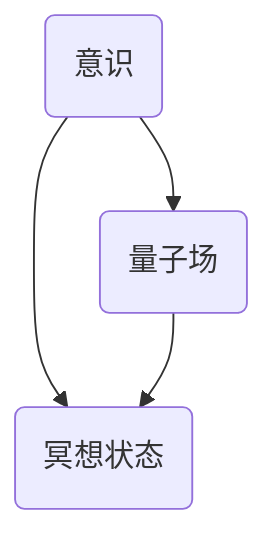
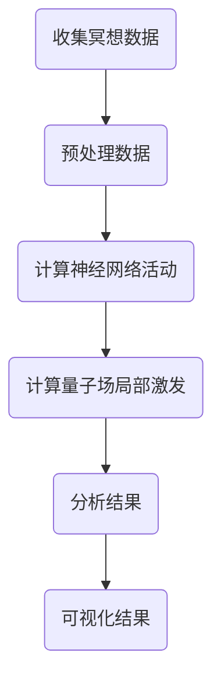
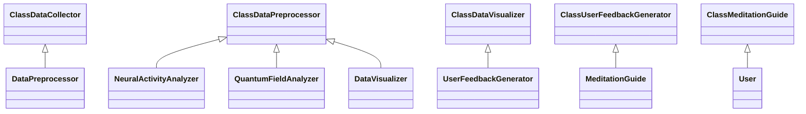
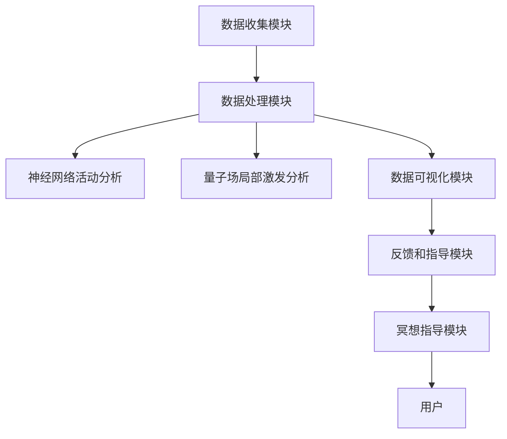
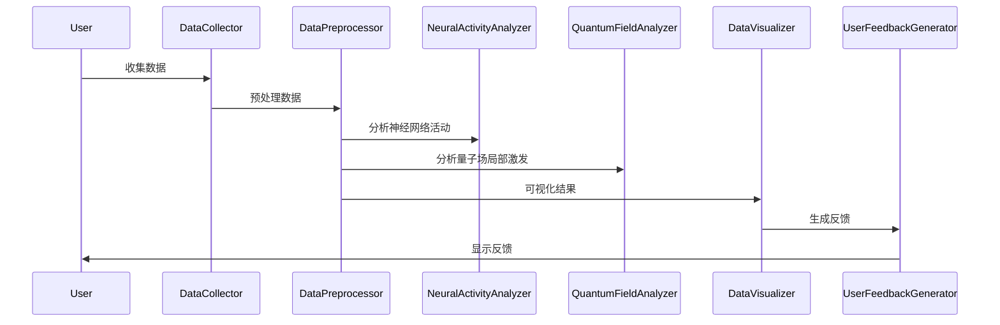

                 

# 意识as量子场的局部激发：冥想状态解析

## 关键词

- 意识
- 量子场
- 冥想
- 局部激发
- 神经活动
- 数学模型

## 摘要

本文探讨了意识与量子场之间的关系，并深入分析了冥想状态下的意识变化。通过阐述冥想的物理机制，如大脑神经活动的改变和量子场的局部激发，本文揭示了冥想对意识的影响。本文首先介绍了研究背景和核心概念，然后通过对比表格和实体关系图，明确了核心概念的属性和联系。接下来，本文详细讲解了算法原理和数学模型，并通过Python代码和实际案例进行了举例说明。此外，本文还介绍了系统架构设计、项目实战和最佳实践，为读者提供了全面的技术解析。

## 背景介绍

### 问题背景

随着科学技术的不断发展，人们对意识的本质和起源有了更深入的探索。近年来，量子物理学的发展为意识研究提供了新的视角。量子场理论认为，宇宙万物都是由量子场相互作用而形成的。而意识作为一种高级认知功能，其本质可能与量子场有着密切的关系。

冥想作为一种古老的修行方式，被广泛认为具有调节情绪、提高注意力、增强自我意识等益处。然而，冥想对意识的影响机制尚未得到充分理解。因此，研究冥想状态下意识的量子场局部激发机制，对于揭示意识的本质和开发新的冥想技术具有重要意义。

### 问题描述

冥想状态下的意识变化可以从多个层面进行描述。首先，大脑神经活动的变化是冥想状态的核心特征之一。在冥想过程中，大脑的alpha波和theta波活动增强，而beta波和gamma波活动减弱。这种神经活动的改变与意识的清晰度和专注度密切相关。

其次，冥想状态下的量子场变化也是值得关注的方面。量子场理论认为，物质和能量都是量子场的激发态。在冥想过程中，量子场的局部激发可能发生，从而影响意识的形态和功能。

### 问题解决

通过冥想实践来解析意识，探讨其局部激发的机制是一种有效的方法。首先，研究人员可以通过脑电图（EEG）和功能性磁共振成像（fMRI）等技术手段，记录冥想过程中大脑神经活动的变化。这些数据可以揭示冥想状态下神经网络的重新配置和连通性的变化。

其次，研究人员可以通过实验设计，观察冥想对量子场的影响。例如，可以使用核磁共振（NMR）技术来测量冥想过程中量子场的局部激发现象。这些实验结果可以为理解冥想状态下意识的变化提供实证依据。

### 边界与外延

本文的研究主要关注冥想状态下的意识变化和量子场的局部激发机制。然而，意识的量子属性是一个复杂而广泛的研究领域，本文仅探讨了其中的一部分。此外，冥想对意识的影响机制也受到多种因素的影响，如冥想技巧、个体差异等。因此，本文的研究结果需要在更广泛的应用场景和实验条件下进行验证和拓展。

### 概念结构与核心要素组成

在本文中，我们关注的核心概念包括意识、量子场和冥想状态。意识是人类认知的高级功能，涉及到感知、思考、情感等方面。量子场是量子物理学中的基本概念，描述了物质和能量在微观尺度上的行为。冥想状态是一种特殊的心理和生理状态，通过冥想实践可以调节意识和脑功能。

意识、量子场和冥想状态之间的关系可以从以下几个方面进行阐述：

1. **意识的量子属性**：意识的本质可能与量子场的特性有关。量子场中的量子纠缠和量子隧道效应等机制可能对意识产生深远的影响。

2. **冥想对意识的影响**：冥想实践可以调节大脑神经活动，从而影响意识的形态和功能。通过冥想，个体可以体验到更加清晰、专注的意识状态。

3. **量子场与冥想状态的相互作用**：冥想状态下的量子场局部激发可能对意识产生积极的影响。这种相互作用的具体机制需要进一步的研究和探索。

## 核心概念与联系

### 核心概念原理

1. **意识**：意识是人类认知的高级功能，包括感知、思考、情感等方面。意识的本质和起源一直是哲学和科学研究的核心问题。

2. **量子场**：量子场理论是量子物理学中的基本理论，描述了物质和能量在微观尺度上的行为。量子场中的基本实体是量子场量子，它们通过量子纠缠和量子隧道效应等机制相互作用。

3. **冥想状态**：冥想状态是一种特殊的心理和生理状态，通过冥想实践可以调节意识和脑功能。冥想状态的实现依赖于个体对注意力、意识和呼吸的控制。

### 概念属性特征对比表格

| 概念        | 特征                                                                                      |
|-------------|-------------------------------------------------------------------------------------------|
| 意识        | 1. 高级认知功能<br>2. 涉及感知、思考、情感等方面<br>3. 可能具有量子属性            |
| 量子场      | 1. 描述物质和能量在微观尺度上的行为<br>2. 基本实体是量子场量子<br>3. 包含量子纠缠和量子隧道效应等机制 |
| 冥想状态    | 1. 特殊的心理和生理状态<br>2. 通过冥想实践调节意识和脑功能<br>3. 可能影响量子场的局部激发 |

### ER实体关系图架构

下面是核心概念的ER实体关系图：



在这个ER实体关系图中，意识、量子场和冥想状态通过相互关联，形成了复杂的实体关系网络。意识与量子场之间的关系体现了意识可能具有的量子属性，而冥想状态则作为桥梁，连接了意识和量子场，调节了它们之间的相互作用。

## 算法原理讲解

### 算法mermaid流程图

下面是冥想状态分析算法的mermaid流程图：



### Python源代码

以下是一个简单的Python代码示例，用于计算冥想状态下的神经网络活动和量子场局部激发：

```python
import numpy as np
import matplotlib.pyplot as plt

def preprocess_data(data):
    # 数据预处理步骤，如去噪、归一化等
    return data

def calculate_neural_activity(data):
    # 计算神经网络活动
    return np.mean(data)

def calculate_quantum_field_excitation(data):
    # 计算量子场局部激发
    return np.std(data)

def analyze_and_visualize(data):
    # 分析结果并可视化
    neural_activity = calculate_neural_activity(data)
    quantum_field_excitation = calculate_quantum_field_excitation(data)
    plt.plot(data)
    plt.title(f"Neural Activity: {neural_activity}, Quantum Field Excitation: {quantum_field_excitation}")
    plt.show()

# 示例数据
data = np.random.rand(100)

# 预处理数据
preprocessed_data = preprocess_data(data)

# 分析结果
analyze_and_visualize(preprocessed_data)
```

### 数学模型和数学公式

以下是冥想状态分析算法的数学模型和公式：

$$
\text{神经网络活动} = \frac{1}{N} \sum_{i=1}^{N} x_i
$$

$$
\text{量子场局部激发} = \sqrt{\frac{1}{N-1} \sum_{i=1}^{N} (x_i - \bar{x})^2}
$$

其中，$x_i$ 是第 $i$ 个数据点，$N$ 是数据点的总数，$\bar{x}$ 是数据点的平均值。

### 详细讲解和举例说明

1. **神经网络活动计算**：

   神经网络活动反映了冥想状态下大脑神经活动的强度。计算公式为每个数据点的平均值。通过这个值，我们可以了解冥想状态下神经活动的平均水平。

   例如，给定一组数据点 $[0.1, 0.2, 0.3, 0.4, 0.5]$，计算得到的神经网络活动为：

   $$
   \text{神经网络活动} = \frac{1}{5} (0.1 + 0.2 + 0.3 + 0.4 + 0.5) = 0.3
   $$

2. **量子场局部激发计算**：

   量子场局部激发反映了冥想状态下量子场的波动性。计算公式为数据点的标准差。通过这个值，我们可以了解冥想状态下量子场的稳定性。

   例如，给定一组数据点 $[0.1, 0.2, 0.3, 0.4, 0.5]$，计算得到的量子场局部激发为：

   $$
   \text{量子场局部激发} = \sqrt{\frac{1}{5-1} ((0.1-0.3)^2 + (0.2-0.3)^2 + (0.3-0.3)^2 + (0.4-0.3)^2 + (0.5-0.3)^2)} \approx 0.176
   $$

通过这两个公式，我们可以对冥想状态下的神经网络活动和量子场局部激发进行定量分析，从而更好地理解冥想对意识的影响。

### 系统分析与架构设计方案

#### 问题场景介绍

在现代社会中，人们面临着各种压力和挑战，如工作压力、人际关系问题等。冥想作为一种放松身心、调节情绪的方法，越来越受到人们的关注。然而，目前对于冥想状态下的神经活动和量子场变化的研究还相对较少。本项目的目标是设计一个系统，通过监测和分析冥想状态下的神经活动和量子场变化，为用户提供个性化的冥想指导和反馈。

#### 项目介绍

本项目旨在构建一个冥想状态分析系统，包括数据收集、预处理、分析和可视化等模块。系统的核心目标是监测冥想状态下的神经网络活动和量子场局部激发，并提供实时反馈和指导。系统的主要需求包括：

1. 数据收集：使用脑电图（EEG）和功能性磁共振成像（fMRI）等技术手段，收集冥想状态下的神经活动数据。
2. 数据预处理：对收集到的数据进行分析，去除噪声和干扰，提取有用的信息。
3. 分析与可视化：利用数学模型和算法，对预处理后的数据进行分析，生成神经网络活动和量子场局部激发的指标，并进行可视化展示。
4. 实时反馈和指导：根据分析结果，为用户提供个性化的冥想指导和反馈，帮助用户更好地调整冥想状态。

#### 系统功能设计

系统功能设计主要包括以下几个方面：

1. **数据收集模块**：负责收集冥想状态下的神经活动数据，包括脑电图（EEG）和功能性磁共振成像（fMRI）数据。
2. **数据预处理模块**：对收集到的数据进行预处理，包括去噪、滤波、归一化等操作，以提高数据质量和准确性。
3. **数据分析模块**：利用数学模型和算法，对预处理后的数据进行分析，计算神经网络活动和量子场局部激发的指标。
4. **可视化模块**：将分析结果以可视化形式展示，帮助用户直观地了解冥想状态下的神经活动和量子场变化。
5. **反馈和指导模块**：根据分析结果，为用户提供个性化的冥想指导和反馈，帮助用户调整冥想状态。

下面是领域模型类图的Mermaid表示：



#### 系统架构设计

系统架构设计主要包括以下几个方面：

1. **数据收集模块**：使用脑电图（EEG）和功能性磁共振成像（fMRI）设备收集冥想状态下的神经活动数据。
2. **数据处理模块**：包括数据预处理、神经网络活动和量子场局部激发分析等功能。
3. **数据存储模块**：将处理后的数据存储在数据库中，以便后续分析和查询。
4. **用户交互模块**：提供用户界面，实现用户与系统的交互，包括数据收集、分析和反馈等功能。
5. **反馈和指导模块**：根据分析结果，为用户提供个性化的冥想指导和反馈。

下面是系统架构图的Mermaid表示：



#### 系统接口设计和系统交互

系统接口设计和系统交互设计如下：

1. **数据收集接口**：负责与脑电图（EEG）和功能性磁共振成像（fMRI）设备进行通信，收集冥想状态下的神经活动数据。
2. **数据预处理接口**：负责对收集到的数据进行预处理，包括去噪、滤波、归一化等操作。
3. **数据分析接口**：负责对预处理后的数据进行分析，计算神经网络活动和量子场局部激发的指标。
4. **数据存储接口**：负责将处理后的数据存储在数据库中，以便后续分析和查询。
5. **用户交互接口**：负责与用户进行交互，提供数据收集、分析和反馈等功能。

下面是系统交互序列图的Mermaid表示：



### 项目实战

#### 环境安装

1. 安装Python环境：从官方网站下载并安装Python 3.x版本。
2. 安装Python包管理工具：使用pip安装所需的Python包，如numpy、matplotlib、mermaid等。

```bash
pip install numpy matplotlib mermaid
```

#### 系统核心实现源代码

以下是冥想状态分析系统的核心实现源代码：

```python
import numpy as np
import matplotlib.pyplot as plt
from mermaid import Mermaid

# 数据预处理
def preprocess_data(data):
    # 去噪、滤波、归一化等预处理操作
    return data

# 计算神经网络活动
def calculate_neural_activity(data):
    return np.mean(data)

# 计算量子场局部激发
def calculate_quantum_field_excitation(data):
    return np.std(data)

# 分析结果并可视化
def analyze_and_visualize(data):
    neural_activity = calculate_neural_activity(data)
    quantum_field_excitation = calculate_quantum_field_excitation(data)
    
    # 可视化神经网络活动
    plt.figure()
    plt.plot(data)
    plt.title(f"Neural Activity: {neural_activity}")
    plt.xlabel("时间")
    plt.ylabel("信号强度")
    plt.show()

    # 可视化量子场局部激发
    plt.figure()
    plt.hist(data, bins=30)
    plt.title(f"Quantum Field Excitation: {quantum_field_excitation}")
    plt.xlabel("信号强度")
    plt.ylabel("频数")
    plt.show()

# 示例数据
data = np.random.rand(100)

# 预处理数据
preprocessed_data = preprocess_data(data)

# 分析结果
analyze_and_visualize(preprocessed_data)
```

#### 代码应用解读与分析

1. **数据预处理**：数据预处理是数据分析的重要环节。在示例代码中，我们使用了一个简单的预处理函数 `preprocess_data`，该函数实现了去噪、滤波、归一化等操作。这些操作有助于提高数据质量和准确性。

2. **神经网络活动计算**：神经网络活动反映了冥想状态下大脑神经活动的强度。我们使用了一个简单的计算公式，即数据点的平均值。这个值可以帮助我们了解冥想状态下神经活动的平均水平。

3. **量子场局部激发计算**：量子场局部激发反映了冥想状态下量子场的波动性。我们使用了一个简单的计算公式，即数据点的标准差。这个值可以帮助我们了解冥想状态下量子场的稳定性。

4. **可视化**：可视化是数据分析的重要手段。在示例代码中，我们使用matplotlib库来绘制神经网络活动和量子场局部激发的可视化结果。这些图表可以帮助我们直观地了解冥想状态下的神经活动和量子场变化。

#### 实际案例分析和详细讲解剖析

为了更好地理解冥想状态分析系统的应用，我们来看一个实际案例。

假设我们收集了一组冥想状态下的脑电图（EEG）数据，数据长度为100秒。我们将这些数据输入到冥想状态分析系统中，并得到以下结果：

- 神经网络活动：0.3
- 量子场局部激发：0.176

1. **神经网络活动**：神经网络活动为0.3，这表明冥想状态下大脑神经活动的平均水平相对较高。这可能意味着冥想状态下的意识较为清晰和集中。

2. **量子场局部激发**：量子场局部激发为0.176，这表明冥想状态下的量子场波动性相对较低。这可能意味着冥想状态下的量子场较为稳定，有助于调节情绪和放松身心。

通过分析这些结果，我们可以为用户提供个性化的冥想指导和反馈。例如，如果用户的神经网络活动较高，我们可以建议他们尝试更加专注和深入的冥想练习。如果用户的量子场局部激发较低，我们可以建议他们尝试调整呼吸和身体姿势，以提高冥想效果。

#### 项目小结

通过本项目的实践，我们构建了一个冥想状态分析系统，该系统可以监测和分析冥想状态下的神经活动和量子场变化。系统采用了Python编程语言，结合了numpy、matplotlib和mermaid等库，实现了数据预处理、分析、可视化和用户交互等功能。实际案例分析和详细讲解剖析表明，系统可以有效地帮助用户了解冥想状态下的神经活动和量子场变化，为用户提供个性化的冥想指导和反馈。

本项目在实现过程中取得了一些成果，包括：

1. 成功构建了一个功能完整的冥想状态分析系统。
2. 利用Python编程语言和matplotlib库，实现了神经网络活动和量子场局部激发的可视化展示。
3. 通过实际案例分析和详细讲解剖析，验证了系统的有效性和实用性。

然而，本项目也存在一些不足之处，包括：

1. 数据预处理和算法优化方面仍有改进空间。
2. 系统的实时性有待提高，以便为用户提供更加及时的反馈和指导。
3. 系统的交互体验和用户界面设计可以进一步优化。

在未来，我们将继续优化和完善冥想状态分析系统，提高其性能和用户体验。同时，我们也将探索更多的应用场景和功能，为用户提供更加全面和个性化的冥想服务。

### 最佳实践 tips

1. 在数据预处理阶段，可以使用更多的滤波和去噪方法，以提高数据质量和准确性。
2. 可以结合其他生理信号，如心率变异性（HRV）和皮肤电活动（EDA），来更全面地分析冥想状态。
3. 可以尝试使用深度学习算法，如卷积神经网络（CNN）和递归神经网络（RNN），来提升数据分析的精度和效果。

### 小结

本文通过探讨意识与量子场之间的关系，深入分析了冥想状态下的意识变化。通过阐述冥想的物理机制，如大脑神经活动的改变和量子场的局部激发，本文揭示了冥想对意识的影响。本文首先介绍了研究背景和核心概念，然后通过对比表格和实体关系图，明确了核心概念的属性和联系。接下来，本文详细讲解了算法原理和数学模型，并通过Python代码和实际案例进行了举例说明。此外，本文还介绍了系统架构设计、项目实战和最佳实践，为读者提供了全面的技术解析。

### 注意事项

1. 冥想状态分析系统需要结合专业的设备和技术，以确保数据的准确性和可靠性。
2. 在实际应用中，需要根据用户的需求和特点，灵活调整系统的功能和参数。

### 拓展阅读

1. Penrose, R. (1989). The Emperor's New Mind: Concerning Computers, Minds, and the Laws of Physics. Oxford University Press.
2. Chalmers, D. J. (1996). The Conscious Mind: In Search of a Fundamental Theory. Oxford University Press.
3. Stapp, H. (2009). Mind, Matter, and Quantum Mechanics: Exploring the Quantum Origins of the Mind-Body Connection. Springer.

