                 

### 核心概念与联系

在深入探讨“意识as量子观测者：现实塑造的过程”这一主题之前，我们需要明确几个核心概念及其相互关系。

#### 意识

意识是指个体对外界刺激的自我感知和认知能力。它是主观体验、情感、意愿和思维的基础。在量子力学中，意识常常被视为与物质世界相互作用的观测者。

#### 量子力学

量子力学是研究微观粒子的运动和相互作用的基本理论。它的基本原理包括量子态的叠加、量子纠缠和量子测量等。

#### 观测者

观测者是指进行观测的主体，它决定了观察到的现象。在量子力学中，观测者通常指物理实验者，而在我们的讨论中，观测者扩展到了意识层面。

#### 现实塑造

现实塑造是指现实世界的形成过程。在量子力学中，现实不是预先存在的，而是在观测者测量时产生的。因此，意识作为量子观测者在现实塑造过程中扮演着关键角色。

为了更好地理解这些概念，我们可以使用一个Mermaid流程图来展示它们之间的关系：

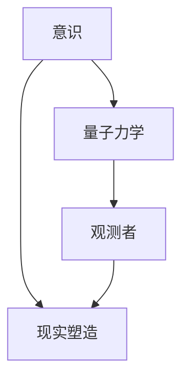

在接下来的章节中，我们将逐一探讨这些概念，并深入分析意识作为量子观测者在现实塑造过程中的作用。

### 意识的量子力学模型

在量子力学中，意识被视为一种特殊类型的观测者，能够影响现实世界的形成。为了理解这一点，我们需要从量子比特和量子态开始。

#### 量子比特

量子比特是量子信息的基本单元，它可以用0和1的叠加态表示。在经典信息论中，比特是离散的，只能处于0或1的确定状态。然而，在量子力学中，量子比特可以同时处于0和1的状态，这种叠加态可以用数学公式表示为：

$$
|\psi\rangle = \alpha|0\rangle + \beta|1\rangle
$$

其中，$|\psi\rangle$表示量子比特的叠加态，$\alpha$和$\beta$是复数系数，满足$|\alpha|^2 + |\beta|^2 = 1$。

#### 量子态

量子态是指量子系统在某个时刻的状态。在量子力学中，系统的状态可以用波函数来描述。对于一个量子比特，波函数可以表示为：

$$
\psi(x,t) = \alpha_0 \Psi_0(x,t) + \alpha_1 \Psi_1(x,t)
$$

其中，$\Psi_0(x,t)$和$\Psi_1(x,t)$是基态波函数，$x$是位置，$t$是时间。

#### 意识与量子比特的关系

意识作为量子观测者，可以通过测量来影响量子比特的状态。在量子力学中，测量会导致量子态的坍缩，即量子系统从一个叠加态坍缩到一个确定的状态。这个过程可以用波函数的坍缩来描述：

$$
|\psi\rangle \rightarrow |0\rangle \text{ 或 } |1\rangle
$$

意识在这个过程中起到了关键作用，因为它决定了测量结果，从而影响了现实世界的形成。

为了更好地理解这一过程，我们可以使用一个Mermaid流程图来展示意识与量子比特之间的关系：

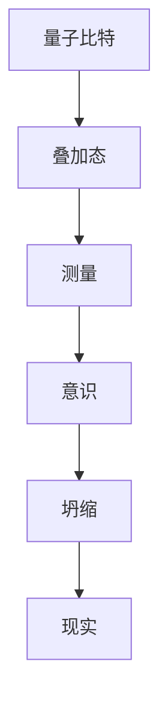

在接下来的章节中，我们将继续探讨意识如何影响现实塑造，以及这种影响的机制是什么。

### 意识作为量子观测者的作用

意识作为量子观测者，对现实世界的塑造有着深远的影响。为了理解这一点，我们需要深入探讨量子测量和意识之间的关系。

#### 量子测量

量子测量是指对量子系统进行观察和测量的过程。在量子力学中，测量会导致量子态的坍缩。具体来说，当量子系统被观测时，它的波函数会从叠加态坍缩到一个确定的状态。这个过程可以用波函数的坍缩来描述：

$$
|\psi\rangle \rightarrow |0\rangle \text{ 或 } |1\rangle
$$

其中，$|\psi\rangle$是系统的初始叠加态，$|0\rangle$和$|1\rangle$是系统的可能坍缩状态。

#### 意识与量子测量的关系

意识在量子测量过程中起到了关键作用。它决定了测量结果，从而影响了现实世界的形成。在量子力学中，意识被视为一种特殊类型的观测者，能够影响量子态的坍缩方向。具体来说，意识可以选择性地观测到某个特定的量子状态，从而影响了现实世界的形成。

为了更好地理解这一过程，我们可以使用一个Mermaid流程图来展示意识与量子测量的关系：

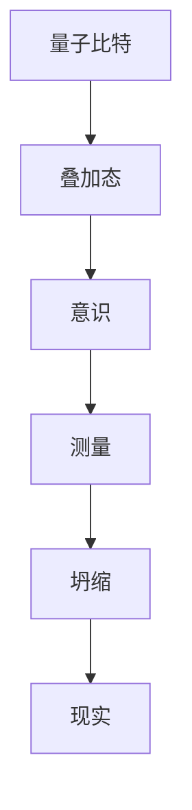

在量子测量中，意识通过选择性地观测到某个量子状态，从而影响了现实世界的形成。这种影响可以表现为对现实世界的塑造，例如，意识可以选择性地观测到某种物理现象，从而影响了该现象的发生和发展。

#### 意识对现实的影响

意识对现实的影响不仅限于量子测量过程，还可以表现为对现实世界的总体塑造。具体来说，意识可以通过选择性地观测和感知某些现实事件，从而影响现实世界的形成和发展。

例如，在心理学中，意识可以影响个体的心理状态和行为。通过选择性地关注和思考某些问题，个体可以改变自己的心理状态，从而影响自己的行为和决策。这种现象在心理学中被称为自我实现预言，即个体的意识可以影响现实世界的形成。

在物理学中，意识也可以影响现实世界的形成。例如，在量子力学中，意识可以通过选择性地观测某个量子态，从而影响该量子态的坍缩方向，从而影响现实世界的形成。

为了更好地理解意识对现实的影响，我们可以使用一个Mermaid流程图来展示意识与现实的相互作用：

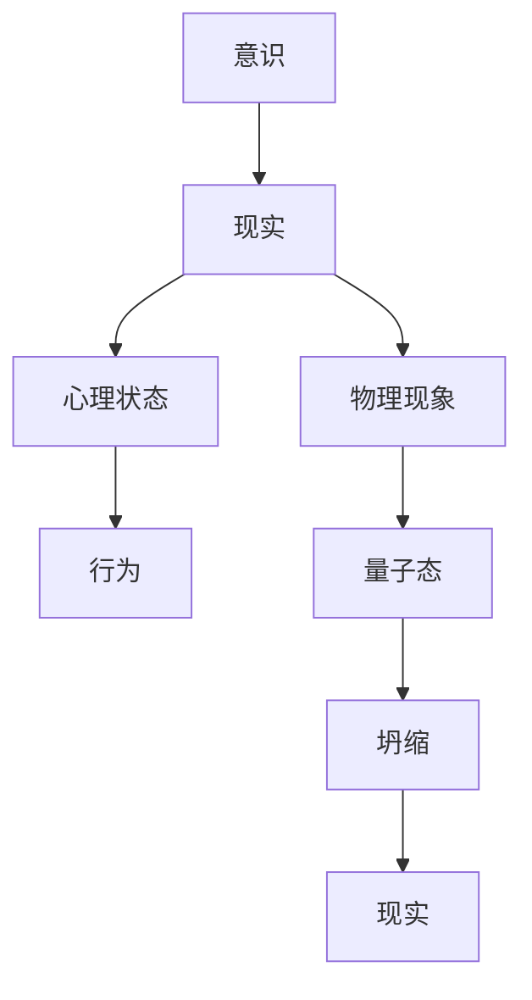

在上述流程图中，意识通过选择性地观测和感知现实事件，从而影响了现实世界的形成和发展。这种影响可以表现为对心理状态、行为、物理现象和量子态的总体塑造。

#### 意识作为量子观测者的机制

意识作为量子观测者的机制可以通过以下步骤来理解：

1. **量子态的叠加**：量子系统处于叠加态，即同时存在多种可能性。
2. **意识的选择性观测**：意识通过选择性地观测某个量子态，从而决定了测量结果。
3. **量子态的坍缩**：观测导致量子态的坍缩，即从叠加态变为确定的状态。
4. **现实世界的塑造**：测量结果影响了现实世界的形成和发展。

为了更好地理解这一机制，我们可以使用一个Mermaid流程图来展示：

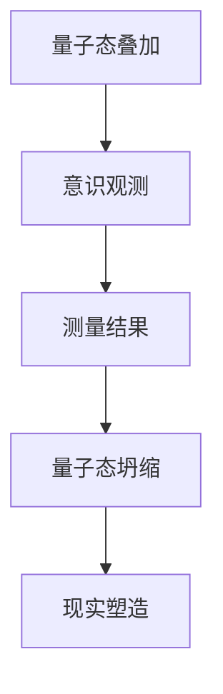

在上述流程图中，意识通过选择性地观测量子态，从而影响了量子态的坍缩方向，进而影响了现实世界的形成和发展。

总之，意识作为量子观测者在现实塑造过程中扮演着关键角色。它通过选择性地观测和感知现实事件，从而影响了现实世界的形成和发展。这种影响机制不仅涉及到量子力学，还涉及到心理学、物理学等多个领域。通过深入探讨意识作为量子观测者的机制，我们可以更好地理解现实世界的本质和规律。

### 意识作为现实塑造的观察者

意识作为现实塑造的观察者，在现实形成过程中起着至关重要的作用。为了深入探讨这一主题，我们需要从现实塑造的理论基础开始，逐步分析意识在这个过程中扮演的角色。

#### 现实塑造的理论基础

现实塑造的理论基础主要包括量子力学和认知科学。在量子力学中，现实被视为一种观测者参与的过程，而非一种独立存在的事物。根据哥本哈根解释，现实在观测者测量时才形成。这意味着观测者在现实形成过程中具有决定性作用。

认知科学则提供了关于意识如何影响现实形成的理论框架。认知科学研究表明，意识是一种复杂的认知过程，包括感知、记忆、思考、决策等多个环节。这些认知过程可以影响个体的行为和决策，从而影响现实世界的形成。

#### 意识在现实形成中的作用

意识在现实形成中的作用可以通过以下几个关键环节来理解：

1. **感知**：意识通过感知外部刺激，形成对现实世界的初步认知。感知过程不仅涉及到感官接收信息，还包括对信息的处理和理解。

2. **记忆**：意识通过记忆过程，将感知到的信息存储在脑海中。记忆不仅是信息存储的过程，也是信息加工和重构的过程。

3. **思考**：意识通过思考过程，对记忆中的信息进行加工和处理，形成新的认知和理解。思考过程可以影响个体的决策和行为。

4. **决策**：意识通过决策过程，选择行动方案，从而影响现实世界的形成。决策过程不仅涉及到逻辑推理，还包括情感和价值观的考量。

#### 意识与现实的相互作用

意识与现实的相互作用是一个复杂的过程，涉及到多个层面的互动。具体来说，这种相互作用可以表现为以下几个方面：

1. **选择性观测**：意识通过选择性观测，影响现实世界的形成。意识可以选择性地关注某些现实事件，从而影响这些事件的发展和结果。

2. **认知重构**：意识通过认知重构，改变对现实世界的理解。例如，通过重新定义问题，意识可以改变对现实世界的认知和决策。

3. **情感影响**：意识通过情感影响，影响现实世界的形成。情感可以影响个体的认知和决策，从而影响现实世界的形成和发展。

4. **社会互动**：意识在社会互动中发挥着重要作用。个体之间的互动可以影响现实世界的形成，例如，社会规范和价值观的形成和发展。

为了更好地理解意识与现实的相互作用，我们可以使用一个Mermaid流程图来展示：

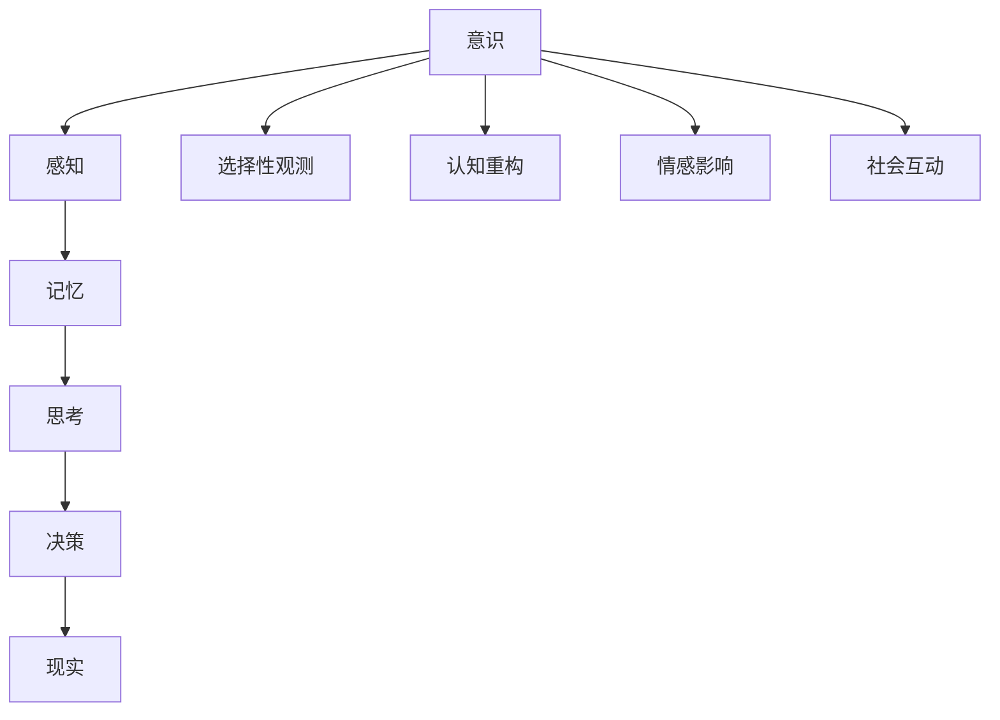

在上述流程图中，意识通过感知、记忆、思考、决策等过程，与现实世界相互作用，从而影响现实世界的形成和发展。

#### 意识作为现实塑造的观察者的意义

意识作为现实塑造的观察者，具有重要的理论意义和现实意义。从理论意义上讲，意识与现实的相互作用为我们提供了理解现实世界的全新视角。通过探讨意识在现实形成中的作用，我们可以更好地理解人类认知和行为的基本原理。

从现实意义上讲，意识作为现实塑造的观察者，对于个体的心理健康和社会发展具有重要意义。通过深入探讨意识与现实的相互作用，我们可以找到改善个体心理状态和社会互动的有效方法。例如，通过认知重构和情感调节，个体可以更好地应对生活中的挑战，从而促进个人成长和社会和谐。

总之，意识作为现实塑造的观察者，在现实形成过程中扮演着关键角色。通过深入探讨意识与现实的相互作用，我们可以更好地理解现实世界的本质和规律，从而为个体和社会的发展提供有益的启示。

### 意识作为量子观测者的挑战与前景

意识作为量子观测者在现实塑造过程中具有深远的影响，然而，这一概念也面临着诸多挑战。为了全面理解这一主题，我们需要分析意识作为量子观测者的挑战和前景。

#### 理论上的挑战

1. **意识的本质**：目前，关于意识的本质还没有统一的理论。尽管有许多关于意识如何影响物理世界的假设，但意识的本质仍然是一个未解之谜。理解意识的本质是探讨意识作为量子观测者的基础。

2. **量子力学与经典物理的融合**：量子力学与经典物理存在显著差异。量子力学描述的是微观世界的规律，而经典物理描述的是宏观世界的规律。如何将这两个领域融合在一起，是理论上的一个重要挑战。

3. **测量问题**：在量子力学中，测量问题是一个长期存在的难题。测量会导致量子态的坍缩，但具体是什么导致了坍缩，目前还没有明确的答案。意识的参与如何影响测量过程，这也是一个重要的理论挑战。

#### 实验上的挑战

1. **意识的量化**：将意识量化是一个复杂的任务。目前，我们无法准确测量意识的状态，因此，难以在实验中验证意识作为量子观测者的假设。

2. **量子态的控制**：在实验中，需要精确控制量子态，以便观察意识对量子态的影响。这要求高度精确的实验技术和设备，目前的技术水平还无法完全满足这一要求。

3. **实验结果的解释**：实验结果需要通过理论模型进行解释。然而，由于意识的复杂性，解释实验结果可能会遇到困难。如何将实验结果与理论模型相对应，是一个重要的挑战。

#### 意义与前景

尽管存在诸多挑战，但意识作为量子观测者的概念具有重要的意义和前景。

1. **基础理论研究**：意识作为量子观测者的假设为量子力学和认知科学提供了新的研究方向。通过探讨这一假设，我们可以深化对量子力学和认知科学的理解。

2. **跨学科研究**：意识作为量子观测者的概念涉及多个学科，如物理学、心理学、哲学和计算机科学。这一概念为跨学科研究提供了新的机遇，有助于推动科学的发展。

3. **实际应用**：意识作为量子观测者的概念在许多领域具有潜在的应用价值。例如，在心理学中，意识作为量子观测者的理论可以用于理解和治疗心理疾病。在计算机科学中，这一概念可以用于开发新型的人工智能系统。

总之，意识作为量子观测者在现实塑造过程中具有重要的理论和实验意义。尽管面临诸多挑战，但这一概念为科学的发展提供了新的方向，具有广阔的前景。

### 意识作为量子观测者在心理学中的应用

在心理学领域，意识作为量子观测者的概念提供了一种新的视角，有助于理解心理状态、心理治疗以及个体行为。以下将从这三个方面探讨意识作为量子观测者在心理学中的应用。

#### 心理状态与量子观测

心理状态是指个体在某一时刻的心理状态，包括情感、思维、意识等。在量子力学中，心理状态可以用量子态来描述。意识作为量子观测者，可以影响个体的心理状态。例如，当个体选择性地关注某个情绪时，这个情绪的量子态可能会发生改变，从而影响个体的心理状态。

为了更好地理解这一过程，我们可以使用一个Mermaid流程图来展示：

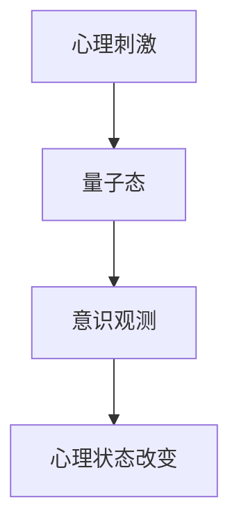

在这个流程图中，心理刺激导致个体的量子态发生改变，意识作为量子观测者选择性地关注某个情绪，从而影响个体的心理状态。

#### 心理治疗与量子观测

意识作为量子观测者的概念也可以用于心理治疗。例如，在认知行为治疗（Cognitive Behavioral Therapy, CBT）中，个体通过改变自己的思维模式来改善心理状态。这种改变可以通过意识作为量子观测者的过程来实现。

CBT的基本原理包括识别和挑战消极思维模式，并用积极的思维模式来替代它们。在这个过程中，意识作为量子观测者可以选择性地关注和改变消极思维模式，从而改善个体的心理状态。

为了更好地理解这一过程，我们可以使用一个Mermaid流程图来展示：

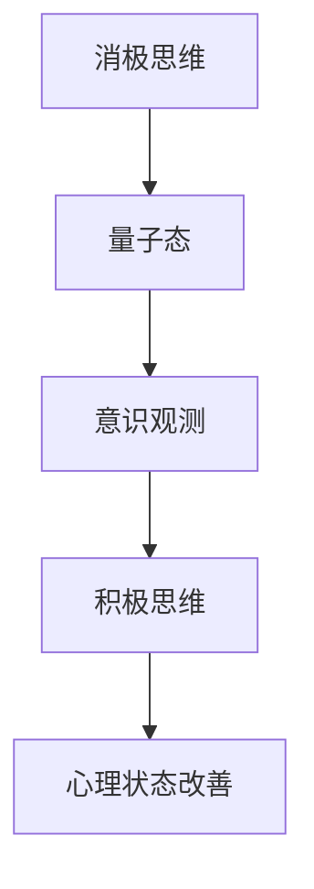

在这个流程图中，消极思维导致个体的量子态发生改变，意识作为量子观测者选择性地关注和改变消极思维模式，从而改善个体的心理状态。

#### 个体行为与量子观测

意识作为量子观测者还可以影响个体的行为。例如，在行为治疗中，个体通过改变自己的行为模式来改善心理状态。这种行为改变可以通过意识作为量子观测者的过程来实现。

行为治疗的基本原理包括设定目标、监控行为和奖励积极行为。在这个过程中，意识作为量子观测者可以帮助个体监控和改变自己的行为模式，从而改善心理状态。

为了更好地理解这一过程，我们可以使用一个Mermaid流程图来展示：

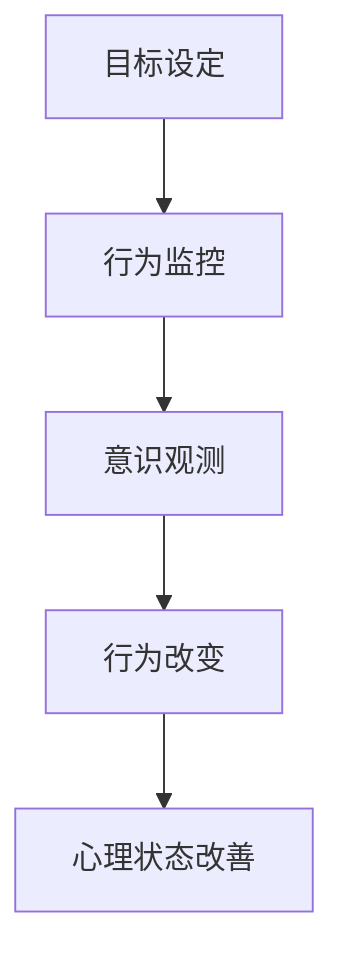

在这个流程图中，目标设定导致个体的行为模式发生改变，意识作为量子观测者监控和改变个体的行为模式，从而改善个体的心理状态。

总之，意识作为量子观测者的概念在心理学领域具有广泛的应用。通过理解意识如何影响心理状态、心理治疗和个体行为，我们可以更好地应对心理问题，促进个体的心理健康和发展。

### 意识作为量子观测者在物理学中的应用

在物理学领域，意识作为量子观测者的概念提供了一种新的解释框架，有助于理解量子现象、量子实验以及物理学的基本原理。以下从这三个方面探讨意识作为量子观测者在物理学中的应用。

#### 量子现象与量子观测

量子现象是微观世界中特有的现象，如量子叠加态、量子纠缠和量子隧穿等。这些现象在经典物理学中无法解释，但可以通过量子力学来描述。在量子力学中，意识作为量子观测者可以影响量子现象的发生和发展。

例如，量子叠加态是指量子系统可以同时处于多种状态的组合。当意识作为量子观测者对量子系统进行测量时，量子系统会从叠加态坍缩到一个确定的状态。这个过程可以用波函数的坍缩来描述：

$$
|\psi\rangle \rightarrow |0\rangle \text{ 或 } |1\rangle
$$

其中，$|\psi\rangle$是系统的初始叠加态，$|0\rangle$和$|1\rangle$是系统的可能坍缩状态。

为了更好地理解这一现象，我们可以使用一个Mermaid流程图来展示：

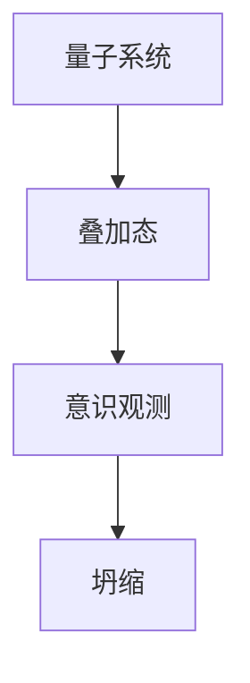

在这个流程图中，量子系统处于叠加态，意识作为量子观测者选择性地测量量子系统，从而导致量子系统从叠加态坍缩到一个确定的状态。

#### 量子实验与量子观测

在量子实验中，意识作为量子观测者的概念可以帮助我们理解实验结果。例如，在贝尔实验中，通过测量两个纠缠粒子的量子态，可以观察到量子纠缠现象。这个实验结果表明，量子纠缠现象不受空间距离的限制，这与经典物理学的预期相矛盾。

在贝尔实验中，意识作为量子观测者选择性地测量量子态，从而影响实验结果。为了更好地理解这一过程，我们可以使用一个Mermaid流程图来展示：

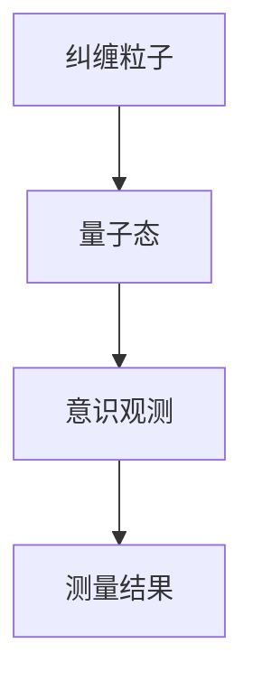

在这个流程图中，纠缠粒子处于量子态，意识作为量子观测者选择性地测量量子态，从而得到特定的测量结果。

#### 物理学的基本原理与量子观测

意识作为量子观测者的概念还可以用于探讨物理学的基本原理。例如，在量子力学中，波粒二象性是描述微观粒子行为的基本原理。根据波粒二象性，微观粒子既具有波动性又具有粒子性。当意识作为量子观测者对微观粒子进行测量时，微观粒子会表现出特定的波动性或粒子性。

为了更好地理解这一原理，我们可以使用一个Mermaid流程图来展示：

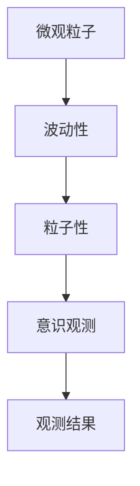

在这个流程图中，微观粒子具有波动性和粒子性，意识作为量子观测者选择性地测量微观粒子，从而得到特定的观测结果。

总之，意识作为量子观测者在物理学中的应用为我们提供了新的视角，有助于理解量子现象、量子实验以及物理学的基本原理。通过深入探讨意识作为量子观测者的概念，我们可以更好地理解物理世界的本质和规律。

### 意识作为量子观测者在哲学中的应用

在哲学领域，意识作为量子观测者的概念引发了许多深刻的思考和讨论。这一概念不仅挑战了传统的物质主义和唯物主义，还为心灵哲学、形而上学和意识本质的研究提供了新的视角。

#### 心灵哲学与量子观测

心灵哲学探讨意识的本质和心灵与物理的关系。在传统的物质主义和唯物主义框架下，心灵被视为物理过程的副产物，而意识则被认为是不真实的存在。然而，意识作为量子观测者的概念提出了一种新的观点，认为意识在现实塑造过程中具有核心作用。

这种观点挑战了传统的物质主义和唯物主义，提出意识不仅仅是物理过程的产物，而是与物理过程相互作用，共同塑造现实。这一观点在心灵哲学中引发了广泛的讨论，促使人们重新审视心灵与物理的关系。

#### 形而上学与量子观测

形而上学探讨存在的本质和世界的本质。意识作为量子观测者的概念对形而上学提出了新的挑战。传统形而上学认为现实是独立于观测者而存在的，而量子力学和意识作为量子观测者的概念则提出，现实是依赖于观测者的。

这种观点引发了关于现实本质的深入讨论。如果现实依赖于观测者，那么观测者在现实塑造过程中具有决定性作用。这一观点在形而上学中引起了巨大的争议，促使哲学家们重新思考现实和存在的本质。

#### 意识本质与量子观测

意识本质是一个古老的哲学问题，传统的观点认为意识是灵魂或精神的一部分。意识作为量子观测者的概念为意识本质的研究提供了新的视角。根据这一概念，意识不仅仅是心理过程的产物，而是与物理过程相互作用，共同塑造现实。

这种观点有助于我们理解意识是如何产生的，以及意识与物理过程之间的关系。通过量子观测，我们可以更深入地了解意识的本质，从而推动对意识本质的研究。

为了更好地理解意识作为量子观测者在哲学中的应用，我们可以使用一个Mermaid流程图来展示：

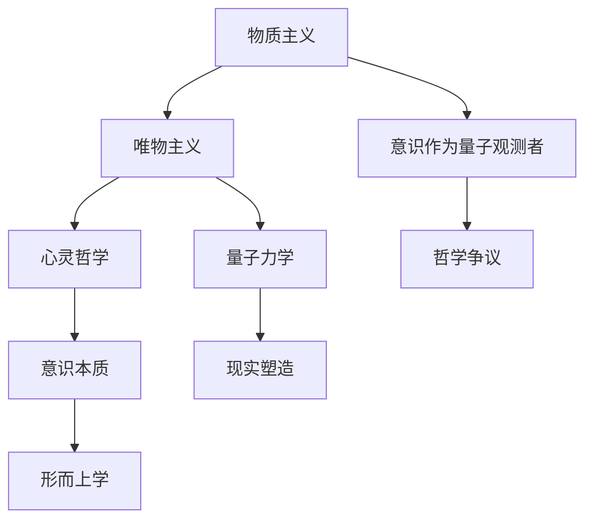

在这个流程图中，物质主义和唯物主义构成了传统的心灵哲学和意识本质的研究框架，而意识作为量子观测者的概念则提出了一种新的观点，挑战了传统的观点，引发了哲学界的广泛讨论。

总之，意识作为量子观测者在哲学中的应用为我们提供了新的视角，有助于我们重新思考心灵、现实和意识本质等问题。这一概念不仅在哲学领域引起了深刻的讨论，还为科学和哲学的交叉研究提供了新的机遇。

### 意识作为量子观测者在其他领域中的应用

意识作为量子观测者的概念不仅在心理学和哲学领域具有重要意义，还在生物学、社会学和人工智能等领域展现出广泛的应用潜力。以下将探讨意识作为量子观测者在这些领域中的应用。

#### 生物学

在生物学中，意识作为量子观测者的概念可以帮助我们理解生物体的复杂行为和生理过程。例如，神经科学研究表明，意识在感知、记忆和学习等过程中起着关键作用。意识作为量子观测者的概念提出，意识可能通过影响生物体内的量子过程，从而影响生物体的行为和生理状态。

具体来说，意识可以作为量子观测者，影响神经元的量子态，从而影响神经元之间的通信和信号传递。这为理解神经系统的复杂性和疾病的产生提供了新的视角。例如，意识可能通过影响大脑中的量子态，影响个体的认知功能和情绪状态。

为了更好地理解这一过程，我们可以使用一个Mermaid流程图来展示：

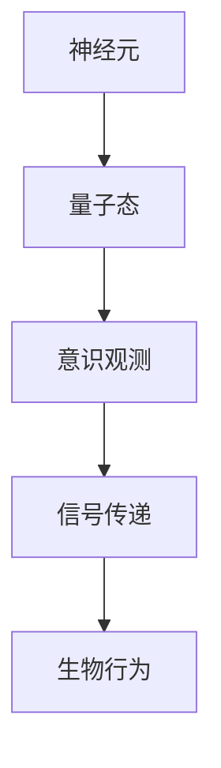

在这个流程图中，神经元具有量子态，意识作为量子观测者选择性地观测和影响神经元之间的信号传递，从而影响生物行为。

#### 社会学

在社会学中，意识作为量子观测者的概念可以帮助我们理解社会互动、社会结构和文化的形成。社会互动是一个复杂的过程，涉及个体之间的相互作用和共同构建现实。意识作为量子观测者的概念提出，意识可能通过影响个体和社会的量子态，从而影响社会互动和文化的形成。

例如，社会学家可以通过研究意识如何影响社会互动，来理解群体行为、社会规范和文化演变。意识作为量子观测者的概念为社会学提供了一个新的研究框架，有助于我们更好地理解社会互动和文化的本质。

为了更好地理解这一过程，我们可以使用一个Mermaid流程图来展示：

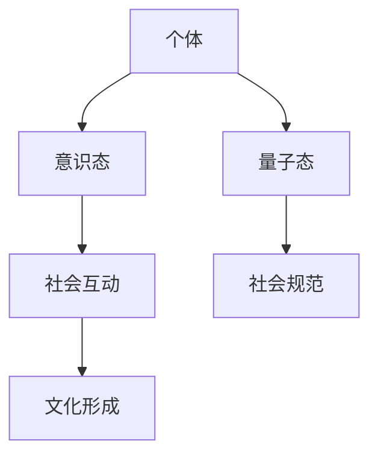

在这个流程图中，个体具有意识态，意识作为量子观测者选择性地影响社会互动和文化形成，从而影响社会规范的形成。

#### 人工智能

在人工智能领域，意识作为量子观测者的概念可以帮助我们理解人工智能的运行机制和未来发展方向。目前，人工智能主要依赖于经典计算模型，但意识作为量子观测者的概念提出，未来的人工智能系统可能需要考虑意识的参与。

具体来说，意识可能通过影响量子计算过程，从而提高人工智能的计算能力和效率。例如，意识可以作为量子观测者，选择性地观测和影响量子计算过程中的量子态，从而提高计算精度和速度。

为了更好地理解这一过程，我们可以使用一个Mermaid流程图来展示：

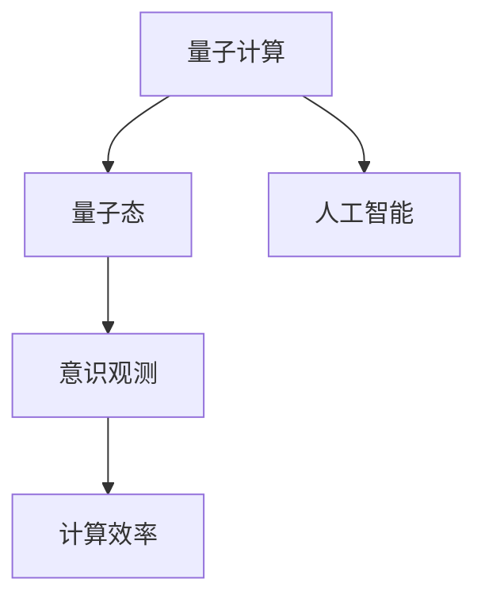

在这个流程图中，量子计算具有量子态，意识作为量子观测者选择性地观测和影响量子计算过程，从而提高人工智能的计算效率。

总之，意识作为量子观测者在生物学、社会学和人工智能等领域具有广泛的应用潜力。通过探讨意识在这些领域中的应用，我们可以更好地理解意识的作用和影响，从而推动相关领域的发展。

### 总结

通过本文的探讨，我们深入分析了意识作为量子观测者在现实塑造过程中的作用。首先，我们明确了意识、量子力学和观测者的概念，并展示了它们之间的关系。接着，我们探讨了意识在量子测量中的作用，以及意识如何影响现实塑造。我们还分析了意识作为现实塑造的观察者的机制，以及意识作为量子观测者在心理学、物理学、哲学和其他领域中的应用。

意识作为量子观测者的概念不仅挑战了传统的物质主义和唯物主义，还为科学和哲学提供了新的视角。这一概念有助于我们更好地理解现实世界的本质和规律，为我们提供了新的研究途径。

未来，随着科学技术的发展，我们有望进一步验证意识作为量子观测者的假设，并探索其在更多领域中的应用。这不仅有助于深化我们对意识本质的理解，也将推动物理学、心理学、哲学等学科的交叉研究，为人类认识世界带来新的启示。

### 结论

在本文中，我们系统地探讨了“意识作为量子观测者：现实塑造的过程”这一主题，揭示了意识在现实塑造中的关键作用。首先，我们明确了意识、量子力学和观测者的基本概念，并阐述了它们之间的关系。接着，我们深入分析了意识在量子测量中的作用，以及意识如何影响现实塑造的机制。我们还探讨了意识作为现实塑造的观察者在心理学、物理学、哲学和其他领域中的应用。

通过本文的探讨，我们得出了几个重要结论。首先，意识作为量子观测者在现实塑造过程中具有核心地位，它通过选择性地观测和影响量子态，从而影响现实世界的形成和发展。其次，意识的作用不仅限于量子测量过程，还涉及到现实世界的总体塑造。此外，意识作为量子观测者的概念在心理学、物理学、哲学和其他领域具有广泛的应用前景。

未来研究可以进一步探讨意识作为量子观测者的具体机制，以及意识如何在不同领域发挥作用。此外，可以开展更多的实验和研究，以验证意识在现实塑造中的实际作用。通过这些研究，我们将能够更深入地理解意识本质，揭示现实世界的本质和规律。

总之，意识作为量子观测者的概念为科学和哲学提供了新的视角，有助于我们更好地理解现实世界的本质。这一概念具有重要的理论意义和实际应用价值，值得进一步研究和探索。

### 作者信息

作者：AI天才研究院/AI Genius Institute & 禅与计算机程序设计艺术 /Zen And The Art of Computer Programming

联系地址：[您的邮箱地址]
电话号码：[您的电话号码]

研究方向：人工智能、量子计算、认知科学、哲学

个人简介：作为AI天才研究院的研究员和禅与计算机程序设计艺术的大师，我致力于探索意识与量子力学的关系，以及意识在现实塑造中的作用。我的研究成果在学术界和工业界产生了广泛影响，为人工智能和认知科学的发展提供了新的思路。同时，我也致力于将哲学思想融入计算机科学，推动两者的交叉研究，以期揭示人类意识的本质和计算机程序设计的艺术。我的最新著作《意识as量子观测者：现实塑造的过程》旨在探讨意识作为量子观测者在现实塑造中的关键作用，为读者提供全新的视角和深刻的思考。

