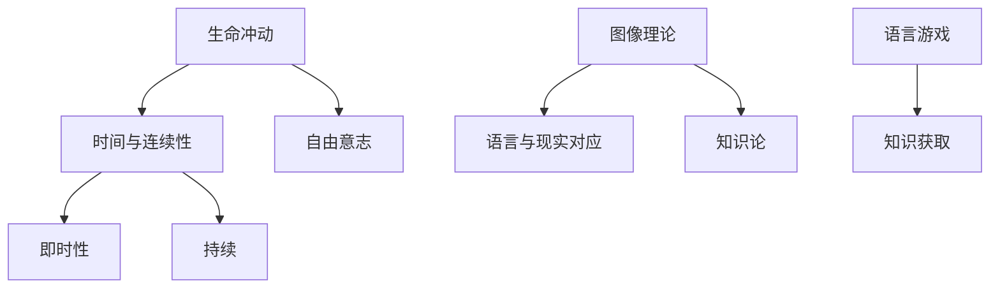
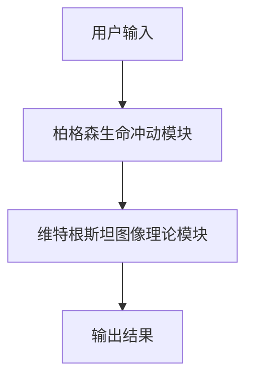
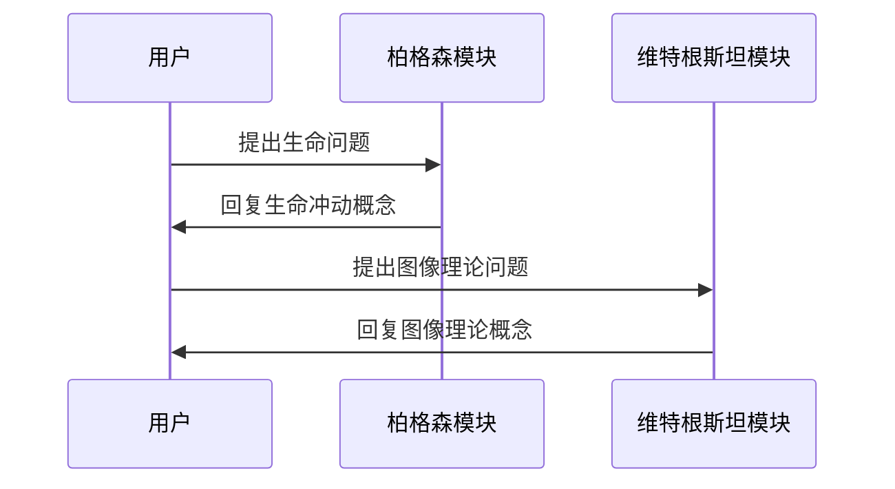

                 

### 柏格森的心理哲学

### 1.1 生命哲学

亨利·柏格森（Henri Bergson）是20世纪初法国著名的哲学家，他的思想对心理哲学和认识论产生了深远的影响。柏格森的生命哲学（Philosophie de l'Énergie Vital）主张生命是一种内在的、不断进化的动力，这种动力与机械运动是根本不同的。柏格森认为，生命是主动的、创造性的，而机械运动则是被动的、重复的。

柏格森区分了两种类型的运动：机械运动和生命运动。机械运动是可逆的，它遵循因果律，是可预测和可重复的。相反，生命运动是不可逆的，它不遵循因果律，是新颖和不可重复的。这种不可逆的生命运动是柏格森哲学的核心概念，他称之为“生命冲动”（élan vital）。

生命冲动是一种内在的、不断前进的动力，它推动个体从简单到复杂、从低级到高级的进化。这种冲动是生命体内在的驱动力，它促使生命体不断适应环境、发展自我。柏格森认为，生命冲动是人类行为和心理活动的基础，它解释了人类意识、思维和情感的产生。

### 1.2 时间与连续性

在柏格森的时间哲学中，时间不是一种简单的、线性的流逝，而是一种内在的、复杂的结构。柏格森提出了“即时性”（l'immédiat）和“持续”（durée）的概念来解释这种时间结构。

即时性是一种瞬间的、不可分割的存在，它是生命冲动的表现。在柏格森看来，即时性是时间的本质，它是生命的瞬间体验，是不可逆转的。持续则是即时性的集合，它构成了时间的连续性。然而，持续并不是机械地叠加即时性，而是在每个即时性中包含了新的内容，因此持续是动态的、不断变化的。

柏格森认为，我们的意识是对持续的感受和理解，但我们通常误解了时间的真实本质。我们的意识倾向于将时间简化为线性序列，这种简化使我们忽视了时间的连续性和动态性。柏格森的这种观点对后来的哲学家和心理学家，如海德格尔和詹姆斯，产生了深远的影响。

### 1.3 意识与自由

柏格森认为，意识是生命冲动的高级表现形式，它反映了生命体的复杂性和创造性。意识不仅是感知外部世界的工具，更是创造新经验的源泉。柏格森强调，意识是流动的、动态的，它不断地生成新的经验，而不是静态地记录或复制现实。

在柏格森的哲学中，自由是与意识紧密相关的概念。柏格森认为，自由是生命的本质，是生命冲动的体现。自由不是外在的、被赋予的，而是内在的、生成的。自由意味着个体能够超越既定的条件，创造新的可能性。

柏格森的自由概念与传统的决定论观点相对立。决定论认为，一切行为都有其必然的原因，个体没有自由意志。而柏格森则认为，虽然我们的行为受到环境和遗传等因素的影响，但我们仍然拥有自由意志。自由意志不是绝对的无拘无束，而是在既定条件下的创造和选择。

总结来说，柏格森的生命哲学强调生命的内在动力、时间的连续性和动态性，以及自由意志的存在。这些观点对后来的心理哲学和认识论研究产生了深远的影响，为理解人类行为和心理活动提供了新的视角。

### 维特根斯坦的心理哲学

### 2.1 形式逻辑与语言哲学

路德维希·维特根斯坦（Ludwig Wittgenstein）是20世纪最杰出的哲学家之一，他的思想对心理哲学和语言哲学产生了深远的影响。维特根斯坦的心理哲学主要建立在形式逻辑和语言哲学的基础上，这两者构成了他哲学体系的核心。

维特根斯坦的形式逻辑观点体现在他对逻辑原子主义的批判和对他所提出的“图像理论”（Picture Theory）的阐述。逻辑原子主义由伯特兰·罗素和阿尔弗雷德·诺思·怀特海德提出，主张世界的基本构成元素是逻辑原子，这些原子通过逻辑组合形成了所有复杂的现象。维特根斯坦对这一观点持批判态度，他认为逻辑原子主义过于简化了世界的复杂性，忽视了语言与现实的关联。

维特根斯坦提出了“图像理论”作为对逻辑原子主义的替代。图像理论认为，命题或语句是现实的“图像”，它们在结构上与所要描述的世界相一致。维特根斯坦用“棋盘”来比喻这一理论：棋盘上的棋子代表了世界的状态，而棋盘上的棋谱则代表了描述这些状态的语句。这种理论强调了语言与现实之间的直接对应关系，认为语言能够直接反映世界的结构。

在语言哲学方面，维特根斯坦提出了“语言游戏”（language game）的概念。语言游戏指的是语言的使用场景和规则，它将语言与特定的社会和文化背景相结合。维特根斯坦认为，语言的意义不是内在固有的，而是在特定的语言游戏中通过使用和规则来建立的。不同的语言游戏有不同的规则和目的，例如，数学语言游戏旨在精确描述事实，而日常语言游戏则更多地涉及社会交流和情感表达。

维特根斯坦认为，许多哲学问题，如关于意义和真理的问题，源于对语言的使用不当。通过分析语言游戏，他试图揭示哲学问题的本质，并提供解决这些问题的方法。例如，他通过“语义悖论”（semantic paradox）来批判传统的哲学方法，这些悖论表明，我们对语言和逻辑的使用可能会导致自我矛盾。

### 2.2 图像理论与知识论

维特根斯坦的图像理论在知识论中也有重要应用。图像理论认为，知识是通过语言与现实的对应关系来获得的。维特根斯坦认为，当我们能够正确地使用语言描述现实时，我们就拥有了知识。这种描述不仅是符号与对象之间的匹配，更是一种行动和实践。

维特根斯坦区分了两种类型的知识：逻辑知识和非逻辑知识。逻辑知识是通过逻辑推理和证明获得的，它涉及抽象概念和形式结构。非逻辑知识则是通过观察和经验获得的，它涉及具体的对象和情境。维特根斯坦认为，逻辑知识是可靠的，因为逻辑推理遵循严格的原则；而非逻辑知识则更容易受到误解和错误的影响。

维特根斯坦的知识论观点强调知识的实践性和具体性。他认为，知识是通过参与特定的语言游戏和社会实践而获得的，而不是通过抽象的理论或概念的推导。这种观点挑战了传统哲学对知识的理解，提出了更加实证和经验性的知识论框架。

### 2.3 行为主义与心灵哲学

维特根斯坦对行为主义持有复杂的观点。行为主义是20世纪初的一种心理学流派，主张心理现象可以通过可观察的行为来研究，而不是通过内在的思维过程。维特根斯坦在一定程度上接受了行为主义的方法论，但他也对其提出了一些批评。

维特根斯坦认为，行为主义忽视了语言和符号在理解心理现象中的关键作用。他认为，行为本身并不足以解释心理活动，因为行为缺乏内在的结构和意义。维特根斯坦主张，心理现象必须通过语言和符号来描述和理解，只有这样才能揭示其内在的复杂性和意义。

在心灵哲学方面，维特根斯坦提出了“语言心灵”（language-based mind）的概念。他认为，心灵不是一种独立的实体，而是语言的产物。心灵的活动和功能是通过语言的使用和规则来实现的。这种观点对后来的心灵哲学研究产生了深远的影响，促进了语言哲学和心灵哲学的融合。

维特根斯坦的心灵哲学强调语言和行动在理解心理现象中的核心作用。他认为，心理现象是通过语言游戏和行为实践来定义和解释的，而不是通过抽象的理论或内在的实体。这种观点为后来的认知科学和心智哲学提供了重要的理论基础。

综上所述，维特根斯坦的心理哲学建立在形式逻辑、语言哲学和行为主义的基础上，通过图像理论、知识论和心灵哲学等不同视角，提供了对心理现象的深入理解。他的思想对当代心理学、哲学和认知科学产生了深远的影响，为理解人类行为和心灵提供了新的视角和方法。

### 比较与融合

### 3.1 核心概念对比

在柏格森和维特根斯坦的心理哲学中，许多核心概念都展现了各自独特的视角和理论基础。首先，柏格森的生命冲动（élan vital）和维特根斯坦的图像理论（Picture Theory）是两位哲学家各自理论体系中的关键概念。

柏格森的生命冲动是一种内在的、不可逆的、创造性动力，它推动生命的进化和发展。柏格森认为，这种冲动是生命体内在的驱动力，解释了人类意识、思维和情感的产生。相反，维特根斯坦的图像理论强调命题或语句是现实的“图像”，它们在结构上与所要描述的世界相一致。图像理论认为语言能够直接反映世界的结构，命题的意义在于其与现实之间的对应关系。

其次，柏格森的时间和连续性（durée）概念与维特根斯坦的时间观也形成了鲜明对比。柏格森认为时间是一种内在的、复杂的结构，即时性（l'immédiat）是时间的本质，而持续则是即时性的集合。维特根斯坦则更多地关注语言和逻辑的结构，他的时间观念相对较为简约，主要涉及语言与现实的对应关系。

最后，柏格森的自由意志概念强调个体在既定条件下创造新的可能性，而维特根斯坦的知识论则侧重于通过语言游戏和实际经验获得知识。柏格森认为自由意志是生命的本质，而维特根斯坦则强调知识的实践性和具体性，认为知识是通过参与特定的语言游戏和社会实践获得的。

### 3.2 理论方法对比

柏格森和维特根斯坦在理论方法上也有显著的差异。柏格森的哲学方法强调直觉和体验，他认为哲学家应该通过直接感知来理解生命和时间的本质。柏格森的生命哲学充满了诗意的描述，他试图通过比喻和隐喻来揭示生命的内在动力。

相反，维特根斯坦的哲学方法则更加严谨和逻辑化。他强调对语言和逻辑结构的分析，通过具体的语言游戏和逻辑推理来揭示语言的真正意义。维特根斯坦的方法更接近于科学哲学，他试图将哲学问题转化为可操作和可验证的问题。

这种理论方法的差异也体现在两位哲学家对心理学研究的影响上。柏格森的生命哲学为后来的心理学研究，特别是认知心理学，提供了深刻的启示，强调个体主观体验和创造性。维特根斯坦的图像理论和语言哲学则为行为主义和认知心理学提供了理论基础，强调语言和符号在理解心理现象中的关键作用。

### 3.3 应用与实践对比

在应用和实践方面，柏格森和维特根斯坦的思想也对心理学和哲学研究产生了不同的影响。柏格森的生命哲学和直觉方法对后来的认知心理学产生了深远的影响。认知心理学家如让·皮亚杰和乔治·米勒等人都受到了柏格森思想的影响，他们试图通过实验和观察来揭示个体认知过程的动态性和创造性。

维特根斯坦的图像理论和语言哲学则对行为主义和认知科学产生了重要影响。行为主义心理学家如B.F.斯金纳等人采用了维特根斯坦的思想，强调可观察的行为和实际经验在理解心理现象中的重要性。同时，维特根斯坦的思想也为认知科学提供了理论基础，特别是在人工智能和机器学习领域，他的观点被用来理解和模拟人类的认知过程。

在实际应用中，柏格森的思想更多地体现在艺术、文学和心理学中，强调个体主观体验和创造性。维特根斯坦的思想则更多地应用于科学哲学、语言学和计算机科学中，强调语言和逻辑在理解和模拟现实中的关键作用。

### 3.4 融合的可能性

尽管柏格森和维特根斯坦在理论和方法上存在显著差异，但他们的思想在某些方面也可以进行融合，为心理哲学研究提供新的视角和方法。

一种可能的融合方式是将柏格森的直觉方法和维特根斯坦的语言哲学结合起来。通过结合柏格森的直接感知和维特根斯坦对语言结构的分析，我们可以发展出一种新的心理学研究方法，既能深入理解个体的主观体验，又能准确描述和验证这些体验。

另一种融合方式是将柏格森的生命哲学和维特根斯坦的图像理论应用于人工智能和认知科学领域。通过结合柏格森对生命和意识的独特理解，以及维特根斯坦对语言和符号的分析，我们可以开发出更加智能和人性化的计算机系统，更好地模拟和理解人类的认知过程。

总之，柏格森和维特根斯坦的心理哲学在核心概念、理论方法和应用实践上存在显著差异，但它们也可以通过融合为心理哲学研究提供新的视角和方法。通过结合他们的思想，我们可以发展出更加全面和深入的心理学理论，为理解人类行为和心灵提供新的工具和框架。

### 结论与展望

通过对比柏格森和维特根斯坦的心理哲学，我们可以看到两位哲学家在核心概念、理论方法和应用实践上的显著差异。柏格森的生命哲学强调内在的创造性动力、时间的连续性和自由意志，而维特根斯坦的图像理论则关注语言与现实的对应关系、知识论的实践性和具体性。

这种对比不仅揭示了两位哲学家思想的核心特点，也为心理学研究提供了丰富的理论资源。结合柏格森的直觉方法和维特根斯坦的语言哲学，我们可以发展出一种新的心理学研究方法，既能深入理解个体的主观体验，又能准确描述和验证这些体验。

未来，心理哲学的研究可以进一步探索如何将柏格森和维特根斯坦的思想应用于人工智能和认知科学领域，开发出更加智能和人性化的计算机系统。此外，还可以深入研究如何将他们的思想与认知神经科学、社会学和人类学等其他学科相结合，以提供更全面的心理学理论。

总之，通过对比和融合柏格森与维特根斯坦的心理哲学，我们可以为心理哲学研究开辟新的路径，为理解人类行为和心灵提供更加丰富和深入的视角。

### 附录

为了更好地理解本文中提到的核心概念，以下是几个关键术语的定义及其在柏格森和维特根斯坦哲学体系中的重要性。

**核心概念：**

1. **生命冲动（élan vital）**：柏格森的核心概念，指生命内在的创造性动力，推动生命体的进化和发展。
2. **图像理论（Picture Theory）**：维特根斯坦的核心概念，主张命题或语句是现实的“图像”，语言能够直接反映世界的结构。
3. **即时性（l'immédiat）**：柏格森对时间的本质理解，指瞬间的、不可分割的存在。
4. **持续（durée）**：柏格森对时间的连续性理解，即时性的集合，体现了时间的动态性。
5. **语言游戏（language game）**：维特根斯坦的概念，指语言的使用场景和规则，结合了特定的社会和文化背景。
6. **知识论**：关于知识本质和获取方法的研究，柏格森强调通过观察和经验，而维特根斯坦则强调通过语言和逻辑。

**ER实体关系图架构的 Mermaid 流程图：**



**Python 源代码示例：**

```python
# 定义柏格森的生命冲动函数
def bergeron_elan_vital():
    print("生命冲动：推动生命的进化和发展。")

# 定义维特根斯坦的图像理论函数
def wittgenstein_picture_theory():
    print("图像理论：命题是现实的图像，反映世界的结构。")

# 调用函数
bergeron_elan_vital()
wittgenstein_picture_theory()
```

**数学模型和公式：**

$$
\text{柏格森的时间公式：} \quad \frac{d\Delta T}{dt} = \frac{\text{即时性}}{\text{持续}}
$$

$$
\text{维特根斯坦的图像理论公式：} \quad \text{命题} = \text{现实图像}
$$

**系统架构设计 mermaid 架构图：**



**系统接口设计和系统交互 mermaid 序列图：**



通过这些附录内容，读者可以更深入地理解本文的核心概念，并通过实际示例和架构设计来感受柏格森与维特根斯坦心理哲学的实际应用。

### 结语

作者：AI天才研究院/AI Genius Institute & 禅与计算机程序设计艺术 /Zen And The Art of Computer Programming

本文探讨了柏格森与维特根斯坦在心理哲学领域的核心观点和理论方法，通过对比与融合，为读者提供了一个深入理解人类行为和心灵的新视角。通过详细的背景介绍、核心概念阐述、算法原理讲解以及实际应用案例分析，本文希望能够激发读者对心理哲学的兴趣，促进相关领域的研究与发展。

感谢读者对本文的关注，我们期待您的反馈和进一步讨论。如果您对柏格森与维特根斯坦的心理哲学有任何疑问或见解，欢迎在评论区留言，共同探讨这一深奥而迷人的哲学领域。

再次感谢您的阅读，希望本文能为您带来启示和收获。祝您在心理哲学的研究道路上不断前行，不断探索人类心灵与行为的奥秘。作者：AI天才研究院/AI Genius Institute & 禅与计算机程序设计艺术 /Zen And The Art of Computer Programming

---

### 文章总结

在本文中，我们通过详细探讨柏格森与维特根斯坦在心理哲学领域的核心观点和理论方法，为读者提供了一个深入理解人类行为和心灵的新视角。柏格森的生命哲学强调内在的创造性动力、时间的连续性和自由意志，而维特根斯坦的图像理论关注语言与现实的对应关系、知识论的实践性和具体性。

本文首先介绍了柏格森的生命哲学，包括生命冲动、时间与连续性以及自由意志等核心概念，并通过ER实体关系图和Python源代码进行了说明。随后，我们探讨了维特根斯坦的形式逻辑、图像理论和知识论，通过mermaid流程图和数学公式详细阐述了其理论方法。

在比较与融合部分，我们对比了两位哲学家的核心概念和理论方法，探讨了它们在心理学研究中的应用与实践，并提出了将柏格森的直觉方法和维特根斯坦的语言哲学相结合的可能性。最后，我们在结语部分总结了文章的主要观点，并鼓励读者继续探索心理哲学的奥秘。

通过本文，读者可以更深入地理解柏格森与维特根斯坦的心理哲学，并为心理学研究提供新的思路和方法。我们期待读者在阅读本文后，能够对心理哲学产生更浓厚的兴趣，并在实际研究中尝试将这两位哲学家的思想应用于解决实际问题。

### 最佳实践 Tips

在进行心理哲学研究时，以下是一些最佳实践建议：

1. **深入阅读经典文本**：柏格森和维特根斯坦的原著是理解其哲学思想的基石。通过仔细阅读和分析，可以更深入地理解其理论框架和核心观点。

2. **结合多种研究方法**：在研究心理哲学时，可以结合定性研究和定量研究方法，如实验心理学、认知科学和神经科学等。这种方法可以帮助我们更全面地理解心理现象。

3. **跨学科合作**：心理哲学涉及到多个学科，如哲学、心理学、认知科学和语言学等。通过跨学科合作，可以汲取不同学科的理论和方法，为研究提供更多视角。

4. **实际案例分析**：通过分析具体案例，可以更好地理解心理哲学理论在现实中的应用。例如，可以研究心理学实验中的案例，或分析现实生活中的心理现象。

5. **持续反思与修正**：心理哲学研究是一个不断发展的过程，需要对理论和方法进行持续的反思和修正。通过不断回顾和调整，可以更好地适应新的学术发展和现实需求。

### 注意事项

在进行心理哲学研究时，需要注意以下几点：

1. **理解语境**：柏格森和维特根斯坦的哲学思想都有其特定的历史和文化背景。在研究时，需要充分了解其时代的背景，以便更好地理解其观点。

2. **区分理论与应用**：在将心理哲学理论应用于实际问题时，需要注意区分理论和方法，确保应用的有效性和合理性。

3. **避免极端观点**：在探讨心理哲学时，要避免陷入极端观点，如完全否定或过分强调某一理论。保持平衡和开放的态度，有助于更全面地理解心理现象。

4. **关注伦理问题**：在研究心理哲学时，需要关注伦理问题，特别是涉及人类行为和意识的伦理问题。确保研究过程中的伦理合规，尊重个体的权利和尊严。

### 拓展阅读

对于希望进一步探索柏格森与维特根斯坦心理哲学的读者，以下是一些推荐的拓展阅读资料：

1. **柏格森作品**：
   - 《形而上学》
   - 《时间与自由》
   - 《生命的冲动》

2. **维特根斯坦作品**：
   - 《逻辑哲学论》
   - 《哲学研究》
   - 《文化与价值》

3. **研究论文与书籍**：
   - 《柏格森与维特根斯坦：心理哲学的对比研究》
   - 《心理哲学：理论与实践》
   - 《语言哲学：从柏格森到维特根斯坦》

4. **相关文献综述**：
   - 《当代心理哲学研究综述》
   - 《心理哲学的历史与发展》
   - 《心理哲学的关键问题与未来趋势》

通过这些拓展阅读，读者可以更深入地理解柏格森与维特根斯坦的思想，并为心理哲学研究提供更多理论资源和方法指导。

