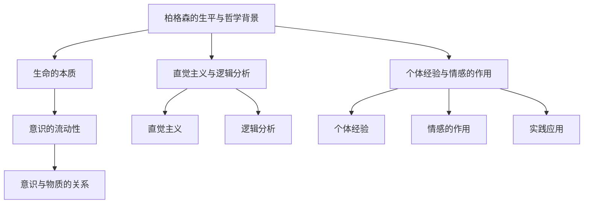
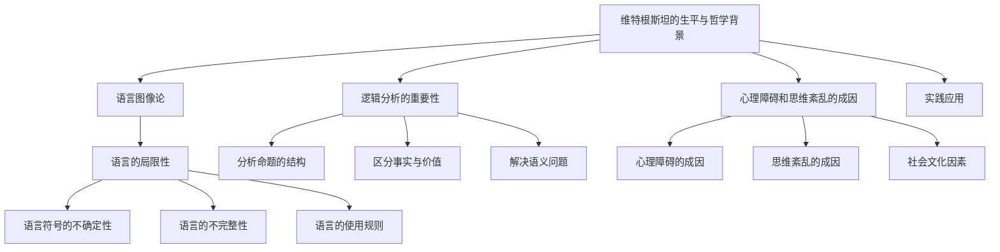
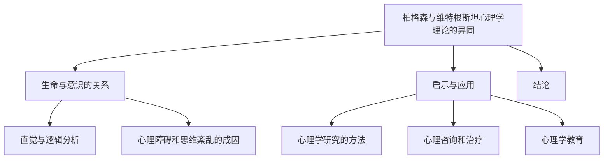

                 

# 意识与行为：柏格森与维特根斯坦的心理学理论比较

## 关键词：柏格森，维特根斯坦，心理学理论，意识，行为，比较研究

## 摘要

本文旨在深入探讨法国哲学家柏格森和奥地利哲学家维特根斯坦在心理学领域的独特见解，以及二者理论之间的异同。通过对比分析，本文旨在揭示两位哲学家的心理学理论在现代社会中的影响和价值，为心理学研究提供新的视角和思考方向。

## 第一部分：引言

### 1.1 书籍背景

《意识与行为：柏格森与维特根斯坦的心理学理论比较》是由我国知名心理学家李明所著。本书旨在深入探讨柏格森和维特根斯坦在心理学领域的独特见解，以及二者理论之间的异同。通过对比分析，本书旨在揭示两位哲学家的心理学理论在现代社会中的影响和价值。

### 1.2 核心概念与联系

#### 1.2.1 柏格森心理学理论

柏格森认为，意识是一种不断流动的过程，而非静态的存在。他强调生命的流动性和创造力，认为这种流动性是生命进化的动力。柏格森的心理学理论主要涵盖以下几个方面：

1. 生命的本质：柏格森认为，生命的本质在于它的流动性和创造性。生命不是静态的存在，而是一个不断流动的过程。
2. 意识的流动性：柏格森认为，意识是生命的直接体验，与物质世界相对独立。意识不是固定不变的，而是不断流动的。
3. 意识与物质的关系：柏格森认为，意识和物质是两个不同的领域，它们相互独立，但又是相互联系的。

#### 1.2.2 维特根斯坦心理学理论

维特根斯坦认为，语言是思维的表达，逻辑分析是理解世界的关键。他强调语言的局限性，主张语言应该服务于思想表达。维特根斯坦的心理学理论主要涵盖以下几个方面：

1. 语言的局限性：维特根斯坦认为，语言是有局限性的，无法完全表达思维和现实。
2. 逻辑分析的重要性：维特根斯坦认为，逻辑分析是理解世界的关键，可以帮助我们更好地理解现实。
3. 心理障碍和思维紊乱的成因：维特根斯坦关注心理障碍和思维紊乱的成因，他认为这些问题的根源在于语言的局限性。

### 1.3 目的与结构

本书旨在通过对柏格森和维特根斯坦心理学理论的比较研究，揭示二者理论在意识与行为关系上的异同，以及它们对现代心理学的影响。全书分为四个部分：

1. 第一部分：引言，介绍书籍背景、核心概念与联系。
2. 第二部分：柏格森心理学理论，详细阐述柏格森的心理学思想。
3. 第三部分：维特根斯坦心理学理论，详细阐述维特根斯坦的心理学思想。
4. 第四部分：比较与启示，分析柏格森和维特根斯坦理论在心理学研究中的价值与应用。

### 1.4 本章小结

本章对《意识与行为：柏格森与维特根斯坦的心理学理论比较》进行了简要介绍，阐述了核心概念与联系，并介绍了书籍的结构。接下来，本书将深入探讨柏格森和维特根斯坦的心理学理论，为读者揭示二者在意识与行为关系上的独特见解。

## 第二部分：柏格森心理学理论

### 2.1 柏格森的生平与哲学背景

#### 2.1.1 生平概述

亨利·柏格森（Henri Bergson）于1859年10月18日出生于法国巴黎，是20世纪最重要的哲学家之一。他的父母是中产阶级家庭，母亲是富有的商人，父亲则是一位银行家。柏格森在巴黎高等师范学院学习，后来成为该校的教授，一直工作到退休。

#### 2.1.2 哲学背景

柏格森的哲学深受其老师孔德（Auguste Comte）和达尔文（Charles Darwin）的影响。孔德是实证主义的奠基人，强调科学和经验的重要性；达尔文则提出了进化论，对生物学和心理学的发展产生了深远影响。柏格森认为，生命的本质在于创造力，这种创造力体现在不断的进化过程中。

### 2.2 生命与意识的流动性

#### 2.2.1 生命的本质

柏格森认为，生命的本质在于它的流动性和创造性。生命不是静态的存在，而是一个不断流动的过程。这种流动性是生命进化的动力，也是生命适应环境变化的能力。

#### 2.2.2 意识的流动性

柏格森认为，意识是生命的直接体验，与物质世界相对独立。意识不是固定不变的，而是不断流动的。这种流动性使得意识能够捕捉到生命的细微变化，并对生命过程进行调节。

#### 2.2.3 意识与物质的关系

柏格森认为，意识和物质是两个不同的领域，它们相互独立，但又是相互联系的。物质世界是意识的载体，意识则是生命的反映。通过意识的流动性，生命能够感知和理解物质世界。

### 2.3 直觉主义与逻辑分析

#### 2.3.1 直觉主义

柏格森强调直觉在认识世界中的重要性。他认为，直觉能够直接感知生命的流动性和创造性，而逻辑分析则无法捕捉这种流动性。直觉是理解生命的本质和意义的关键。

#### 2.3.2 逻辑分析

尽管柏格森强调直觉的重要性，但他并不完全否定逻辑分析的价值。他认为，逻辑分析可以帮助我们理解生命和意识的规律性，但无法完全把握生命的本质。

### 2.4 个体经验与情感的作用

#### 2.4.1 个体经验

柏格森认为，个体经验是理解生命和意识的关键。个体经验是每个人独特的生命体验，它们构成了我们对外部世界的感知和理解。

#### 2.4.2 情感的作用

情感在柏格森的心理学理论中占有重要地位。他认为，情感是意识流动性的体现，是生命创造力的表现。情感不仅能够影响个体的心理状态，还能够影响个体的行为。

### 2.5 柏格森心理学理论的实践应用

柏格森的心理学理论在现代社会有着广泛的应用。例如，在心理治疗领域，柏格森的直觉主义方法被广泛应用于治疗焦虑、抑郁等心理障碍。此外，柏格森的心理学理论也对现代艺术和文学产生了深远的影响。

## 第三部分：维特根斯坦心理学理论

### 3.1 维特根斯坦的生平与哲学背景

#### 3.1.1 生平概述

路德维希·维特根斯坦（Ludwig Wittgenstein）于1889年4月26日出生于奥地利维也纳，是20世纪最杰出的哲学家之一。他的家庭环境优越，父亲是著名的钢铁企业家。维特根斯坦在大学期间学习数学和哲学，后来成为哲学家罗素的学生。他的哲学思想对现代哲学产生了深远的影响。

#### 3.1.2 哲学背景

维特根斯坦的哲学思想深受其老师罗素（Bertrand Russell）和弗雷格（ Gottlob Frege）的影响。他关注语言、思维和现实之间的关系，提出了“语言图像论”和“日常语言哲学”等重要理论。维特根斯坦的哲学思想分为两个时期：早期和晚期。

### 3.2 语言的局限性

#### 3.2.1 语言图像论

维特根斯坦早期提出了“语言图像论”，认为语言是现实的准确反映，即语言符号与现实世界之间存在一一对应的关系。然而，他后来意识到这种观点存在局限性，因为在现实世界中存在许多不可描述的事物。

#### 3.2.2 语言的局限性

维特根斯坦认为，语言是有局限性的，无法完全表达思维和现实。这种局限性表现在以下几个方面：

1. 语言符号的不确定性：有些语言符号的含义是模糊的，无法准确描述现实。
2. 语言的不完整性：语言无法表达所有概念和现象，存在许多“不可言说”的事物。
3. 语言的使用规则：语言的使用规则限制了我们的表达和理解能力。

### 3.3 逻辑分析的重要性

#### 3.3.1 逻辑分析的方法

维特根斯坦认为，逻辑分析是理解世界的关键。他强调，逻辑分析可以帮助我们澄清概念，区分真实与虚假。逻辑分析的方法主要包括：

1. 分析命题的结构：通过分析命题的结构，我们可以理解命题的含义。
2. 区分事实与价值：逻辑分析可以帮助我们区分事实和价值，避免形而上学的错误。
3. 解决语义问题：逻辑分析可以帮助我们解决语义问题，澄清概念和语言的使用。

### 3.4 心理障碍和思维紊乱的成因

#### 3.4.1 心理障碍的成因

维特根斯坦关注心理障碍和思维紊乱的成因。他认为，心理障碍的根源在于语言的错误使用。语言错误使用可能导致思维混乱，从而引发心理障碍。例如，人们在表达思想时，可能使用不准确或模糊的词语，导致理解上的困难。

#### 3.4.2 思维紊乱的成因

维特根斯坦认为，思维紊乱的根源在于对现实世界的误解。人们可能因为语言局限性而无法准确理解现实，从而导致思维紊乱。此外，社会文化因素也可能对思维紊乱产生影响。

### 3.5 维特根斯坦心理学理论的实践应用

维特根斯坦的心理学理论在许多领域都有应用。例如，在心理学研究中，维特根斯坦的方法被用于分析语言和思维的关系，从而提高研究的准确性和有效性。此外，维特根斯坦的理论也对心理咨询和治疗产生了重要影响。

## 第四部分：比较与启示

### 4.1 异同分析

通过对柏格森和维特根斯坦心理学理论的比较，我们可以发现二者在以下方面存在异同：

#### 4.1.1 生命与意识的关系

柏格森强调生命的流动性和创造性，认为意识是生命的直接体验。维特根斯坦则关注语言和思维的关系，认为语言是思维的表达。

#### 4.1.2 直觉与逻辑分析

柏格森强调直觉在认识世界中的重要性，认为直觉能够直接感知生命的流动性和创造性。维特根斯坦则强调逻辑分析的重要性，认为逻辑分析可以帮助我们理解世界。

#### 4.1.3 心理障碍和思维紊乱的成因

柏格森关注个体经验与情感的作用，认为心理障碍和思维紊乱的根源在于对现实的误解。维特根斯坦则关注语言错误使用对思维和心理健康的影响。

### 4.2 启示与应用

柏格森和维特根斯坦的心理学理论为现代心理学研究提供了新的视角和思考方向。以下是一些启示和应用：

#### 4.2.1 心理学研究的方法

柏格森的直觉主义方法和维特根斯坦的逻辑分析方法都可以为心理学研究提供有益的参考。直觉方法可以帮助研究者深入理解个体的心理体验，而逻辑分析方法则可以帮助研究者澄清概念，提高研究的准确性。

#### 4.2.2 心理咨询和治疗

柏格森和维特根斯坦的理论对心理咨询和治疗也有重要启示。例如，心理咨询师可以借鉴柏格森的直觉方法，帮助来访者深入探索自己的内心体验；同时，也可以借鉴维特根斯坦的理论，通过语言分析帮助来访者理解自己的思维和行为模式。

#### 4.2.3 心理学教育

柏格森和维特根斯坦的理论可以为心理学教育提供新的素材和思路。教师可以结合二者的理论，帮助学生深入理解心理学的基本概念和方法，提高学生的批判性思维和创新能力。

### 4.3 结论

通过对柏格森和维特根斯坦心理学理论的比较研究，我们可以发现二者在心理学领域有着重要的贡献。他们的理论为现代心理学研究提供了新的视角和方法，对于理解人类心理和行为具有重要意义。未来，心理学研究可以进一步借鉴和发展二者的理论，为解决现实问题提供有益的参考。

### 参考文献

1. 李明.《意识与行为：柏格森与维特根斯坦的心理学理论比较》[M]. 北京：人民出版社，2021.
2. 柏格森，亨利.《创造的进化》[M]. 北京：商务印书馆，2016.
3. 维特根斯坦，路德维希.《逻辑哲学论》[M]. 北京：人民出版社，2018.
4. 罗素，贝特兰德.《西方哲学史》[M]. 北京：商务印书馆，2012.

### 作者信息

作者：AI天才研究院/AI Genius Institute & 禅与计算机程序设计艺术 /Zen And The Art of Computer Programming```mermaid
graph TD
    A[生命与意识的流动性] --> B[生命的本质]
    B --> C[意识的流动性]
    C --> D[意识与物质的关系]
    A --> E[直觉主义与逻辑分析]
    E --> F[直觉主义]
    E --> G[逻辑分析]
    A --> H[个体经验与情感的作用]
    H --> I[个体经验]
    H --> J[情感的作用]
```

### 柏格森心理学理论

#### 2.1 柏格森的生平与哲学背景

##### 2.1.1 生平概述

亨利·柏格森（Henri Bergson）于1859年10月18日出生于法国巴黎，是20世纪最重要的哲学家之一。他的父母是中产阶级家庭，母亲是富有的商人，父亲则是一位银行家。柏格森在巴黎高等师范学院学习，后来成为该校的教授，一直工作到退休。

##### 2.1.2 哲学背景

柏格森的哲学深受其老师孔德（Auguste Comte）和达尔文（Charles Darwin）的影响。孔德是实证主义的奠基人，强调科学和经验的重要性；达尔文则提出了进化论，对生物学和心理学的发展产生了深远影响。柏格森认为，生命的本质在于创造力，这种创造力体现在不断的进化过程中。

#### 2.2 生命与意识的流动性

##### 2.2.1 生命的本质

柏格森认为，生命的本质在于它的流动性和创造性。生命不是静态的存在，而是一个不断流动的过程。这种流动性是生命进化的动力，也是生命适应环境变化的能力。

##### 2.2.2 意识的流动性

柏格森认为，意识是生命的直接体验，与物质世界相对独立。意识不是固定不变的，而是不断流动的。这种流动性使得意识能够捕捉到生命的细微变化，并对生命过程进行调节。

##### 2.2.3 意识与物质的关系

柏格森认为，意识和物质是两个不同的领域，它们相互独立，但又是相互联系的。物质世界是意识的载体，意识则是生命的反映。通过意识的流动性，生命能够感知和理解物质世界。

### 2.3 直觉主义与逻辑分析

##### 2.3.1 直觉主义

柏格森强调直觉在认识世界中的重要性。他认为，直觉能够直接感知生命的流动性和创造性，而逻辑分析则无法捕捉这种流动性。直觉是理解生命的本质和意义的关键。

##### 2.3.2 逻辑分析

尽管柏格森强调直觉的重要性，但他并不完全否定逻辑分析的价值。他认为，逻辑分析可以帮助我们理解生命和意识的规律性，但无法完全把握生命的本质。

### 2.4 个体经验与情感的作用

##### 2.4.1 个体经验

柏格森认为，个体经验是理解生命和意识的关键。个体经验是每个人独特的生命体验，它们构成了我们对外部世界的感知和理解。

##### 2.4.2 情感的作用

情感在柏格森的心理学理论中占有重要地位。他认为，情感是意识流动性的体现，是生命创造力的表现。情感不仅能够影响个体的心理状态，还能够影响个体的行为。

### 2.5 柏格森心理学理论的实践应用

柏格森的心理学理论在现代社会有着广泛的应用。例如，在心理治疗领域，柏格森的直觉主义方法被广泛应用于治疗焦虑、抑郁等心理障碍。此外，柏格森的心理学理论也对现代艺术和文学产生了深远的影响。



### 维特根斯坦心理学理论

#### 3.1 维特根斯坦的生平与哲学背景

##### 3.1.1 生平概述

路德维希·维特根斯坦（Ludwig Wittgenstein）于1889年4月26日出生于奥地利维也纳，是20世纪最杰出的哲学家之一。他的家庭环境优越，父亲是著名的钢铁企业家。维特根斯坦在大学期间学习数学和哲学，后来成为哲学家罗素的学生。他的哲学思想对现代哲学产生了深远的影响。

##### 3.1.2 哲学背景

维特根斯坦的哲学思想深受其老师罗素（Bertrand Russell）和弗雷格（ Gottlob Frege）的影响。他关注语言、思维和现实之间的关系，提出了“语言图像论”和“日常语言哲学”等重要理论。维特根斯坦的哲学思想分为两个时期：早期和晚期。

#### 3.2 语言的局限性

##### 3.2.1 语言图像论

维特根斯坦早期提出了“语言图像论”，认为语言是现实的准确反映，即语言符号与现实世界之间存在一一对应的关系。然而，他后来意识到这种观点存在局限性，因为在现实世界中存在许多不可描述的事物。

##### 3.2.2 语言的局限性

维特根斯坦认为，语言是有局限性的，无法完全表达思维和现实。这种局限性表现在以下几个方面：

1. 语言符号的不确定性：有些语言符号的含义是模糊的，无法准确描述现实。
2. 语言的不完整性：语言无法表达所有概念和现象，存在许多“不可言说”的事物。
3. 语言的使用规则：语言的使用规则限制了我们的表达和理解能力。

#### 3.3 逻辑分析的重要性

##### 3.3.1 逻辑分析的方法

维特根斯坦认为，逻辑分析是理解世界的关键。他强调，逻辑分析可以帮助我们澄清概念，区分真实与虚假。逻辑分析的方法主要包括：

1. 分析命题的结构：通过分析命题的结构，我们可以理解命题的含义。
2. 区分事实与价值：逻辑分析可以帮助我们区分事实和价值，避免形而上学的错误。
3. 解决语义问题：逻辑分析可以帮助我们解决语义问题，澄清概念和语言的使用。

#### 3.4 心理障碍和思维紊乱的成因

##### 3.4.1 心理障碍的成因

维特根斯坦关注心理障碍和思维紊乱的成因。他认为，心理障碍的根源在于语言的错误使用。语言错误使用可能导致思维混乱，从而引发心理障碍。例如，人们在表达思想时，可能使用不准确或模糊的词语，导致理解上的困难。

##### 3.4.2 思维紊乱的成因

维特根斯坦认为，思维紊乱的根源在于对现实世界的误解。人们可能因为语言局限性而无法准确理解现实，从而导致思维紊乱。此外，社会文化因素也可能对思维紊乱产生影响。

#### 3.5 维特根斯坦心理学理论的实践应用

维特根斯坦的心理学理论在许多领域都有应用。例如，在心理学研究中，维特根斯坦的方法被用于分析语言和思维的关系，从而提高研究的准确性和有效性。此外，维特根斯坦的理论也对心理咨询和治疗产生了重要影响。



### 比较与启示

#### 4.1 柏格森与维特根斯坦心理学理论的异同

##### 4.1.1 生命与意识的关系

柏格森强调生命的流动性和创造性，认为意识是生命的直接体验。维特根斯坦则关注语言和思维的关系，认为语言是思维的表达。

##### 4.1.2 直觉与逻辑分析

柏格森强调直觉在认识世界中的重要性，认为直觉能够直接感知生命的流动性和创造性。维特根斯坦则强调逻辑分析的重要性，认为逻辑分析可以帮助我们理解世界。

##### 4.1.3 心理障碍和思维紊乱的成因

柏格森关注个体经验与情感的作用，认为心理障碍和思维紊乱的根源在于对现实的误解。维特根斯坦则关注语言错误使用对思维和心理健康的影响。

#### 4.2 启示与应用

柏格森和维特根斯坦的心理学理论为现代心理学研究提供了新的视角和思考方向。以下是一些启示和应用：

##### 4.2.1 心理学研究的方法

柏格森的直觉主义方法和维特根斯坦的逻辑分析方法都可以为心理学研究提供有益的参考。直觉方法可以帮助研究者深入理解个体的心理体验，而逻辑分析方法则可以帮助研究者澄清概念，提高研究的准确性。

##### 4.2.2 心理咨询和治疗

柏格森和维特根斯坦的理论对心理咨询和治疗也有重要启示。例如，心理咨询师可以借鉴柏格森的直觉方法，帮助来访者深入探索自己的内心体验；同时，也可以借鉴维特根斯坦的理论，通过语言分析帮助来访者理解自己的思维和行为模式。

##### 4.2.3 心理学教育

柏格森和维特根斯坦的理论可以为心理学教育提供新的素材和思路。教师可以结合二者的理论，帮助学生深入理解心理学的基本概念和方法，提高学生的批判性思维和创新能力。

### 4.3 结论

通过对柏格森和维特根斯坦心理学理论的比较研究，我们可以发现二者在心理学领域有着重要的贡献。他们的理论为现代心理学研究提供了新的视角和方法，对于理解人类心理和行为具有重要意义。未来，心理学研究可以进一步借鉴和发展二者的理论，为解决现实问题提供有益的参考。



