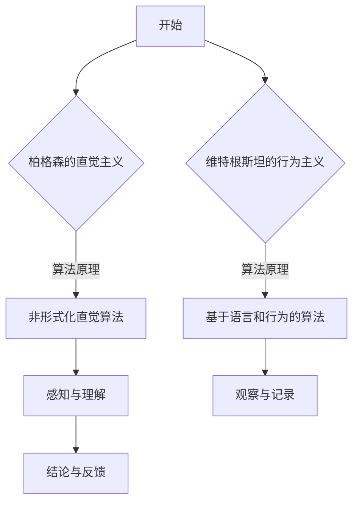
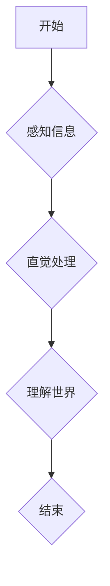
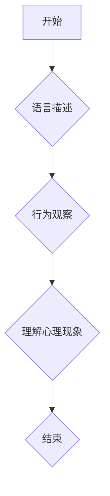

                 

# 意识与行为：柏格森与维特根斯坦的心理学观点

## 关键词
心理学、柏格森、维特根斯坦、直觉主义、行为主义、时间意识、自由意志、语言哲学、算法原理

## 摘要
本文旨在探讨20世纪两位重要哲学家和心理学家柏格森（Henri Bergson）和维特根斯坦（Ludwig Wittgenstein）的心理学观点，通过系统化的整理和分析，揭示他们对于意识与行为的独到见解。文章将分别阐述两位思想家的核心概念和理论框架，并通过对比分析，深入探讨其差异与联系。此外，本文还将运用现代科技语言和算法原理，对这些观点进行详细讲解和通俗易懂的举例说明。

## 第一部分：背景介绍

### 问题背景
随着科技的迅猛发展，心理学作为一门研究人类行为和心理过程的科学，逐渐成为众多学科领域的交叉点。在20世纪，法国哲学家和心理学家柏格森（Henri Bergson）以及奥地利哲学家和逻辑学家维特根斯坦（Ludwig Wittgenstein）分别对心理学提出了独特的观点。柏格森主张心理现象不可分割，强调时间的流动性和生命的整体性；而维特根斯坦则认为心理学应该更加关注语言和意义，倡导行为主义和逻辑实证主义。

### 问题解决
为了全面覆盖和深入探讨这两位思想家的心理学观点，本文旨在通过对柏格森和维特根斯坦的心理学思想进行系统化的整理和分析，为读者提供一个全面而清晰的框架。本文将详细探讨他们的核心概念、理论框架及其在现代心理学研究中的应用和影响。

### 边界与外延
本文将主要关注柏格森和维特根斯坦的心理学观点，而不涉及其他哲学家的相关理论。同时，本文将侧重于这两位思想家的原创性贡献，而非他们的生平或哲学的其他方面。

### 概念结构与核心要素组成
- **柏格森的心理学观点**：包括直觉主义、时间意识、自由意志等核心概念。
- **维特根斯坦的心理学观点**：包括语言哲学、行为主义、逻辑实证主义等核心理论。

### 第一部分：背景介绍

#### 问题背景
随着科技的迅猛发展，心理学作为一门研究人类行为和心理过程的科学，逐渐成为众多学科领域的交叉点。在20世纪，法国哲学家和心理学家柏格森（Henri Bergson）以及奥地利哲学家和逻辑学家维特根斯坦（Ludwig Wittgenstein）分别对心理学提出了独特的观点。柏格森主张心理现象不可分割，强调时间的流动性和生命的整体性；而维特根斯坦则认为心理学应该更加关注语言和意义，倡导行为主义和逻辑实证主义。

#### 问题解决
为了全面覆盖和深入探讨这两位思想家的心理学观点，本文旨在通过对柏格森和维特根斯坦的心理学思想进行系统化的整理和分析，为读者提供一个全面而清晰的框架。本文将详细探讨他们的核心概念、理论框架及其在现代心理学研究中的应用和影响。

#### 边界与外延
本文将主要关注柏格森和维特根斯坦的心理学观点，而不涉及其他哲学家的相关理论。同时，本文将侧重于这两位思想家的原创性贡献，而非他们的生平或哲学的其他方面。

#### 概念结构与核心要素组成
- **柏格森的心理学观点**：包括直觉主义、时间意识、自由意志等核心概念。
- **维特根斯坦的心理学观点**：包括语言哲学、行为主义、逻辑实证主义等核心理论。

### 第二部分：核心概念与联系

#### 概念原理
- **柏格森的直觉主义**：认为直觉是人类认知的核心，强调直觉对于理解和感知世界的重要性。
- **维特根斯坦的行为主义**：主张通过可观察的行为来研究心理现象，强调语言和意义在心理学研究中的重要性。

#### 概念属性特征对比表格
| 概念 | 柏格森的直觉主义 | 维特根斯坦的行为主义 |
| --- | --- | --- |
| 核心观点 | 强调直觉的直觉性、时间意识、自由意志 | 通过行为和语言来理解心理现象、逻辑实证主义 |
| 应用领域 | 心理学、哲学、艺术 | 语言学、心理学、社会学 |
| 代表作 | 《形而上学沉思录》、《生命的创造》 | 《逻辑哲学论》、《哲学研究》 |

#### ER实体关系图架构的Mermaid流程图
```mermaid
erDiagram
  使用者 ||--|{ 行为 }| 活动
  使用者 ||--|{ 语言 }| 语言表达
  活动 &&|{ 结果 }| 结果记录
```

### 第三部分：算法原理讲解

#### 算法原理
本书将深入探讨柏格森和维特根斯坦心理学观点中的核心算法原理。柏格森的直觉主义可以看作是一种非形式化的算法，其核心在于通过直觉来感知和理解世界。而维特根斯坦的行为主义则可以抽象为一种基于语言和行为的算法，强调通过可观察的行为来研究心理现象。

#### Mermaid流程图


#### Python源代码
```python
# 柏格森的直觉主义算法示例
def bergson_intuition(perception):
    """
    柏格森的直觉主义算法
    :param perception: 感知信息
    :return: 直觉理解结果
    """
    intuition = "直觉理解：" + perception
    return intuition

# 维特根斯坦的行为主义算法示例
def wittgenstein_behavior(action):
    """
    维特根斯坦的行为主义算法
    :param action: 行为
    :return: 行为记录
    """
    behavior = "行为记录：" + action
    return behavior
```

#### 算法原理的数学模型和公式
柏格森的直觉主义可以用以下数学模型表示：
$$
\text{直觉} = f(\text{感知信息}, \text{经验})
$$

维特根斯坦的行为主义可以用以下数学模型表示：
$$
\text{行为} = g(\text{语言}, \text{环境})
$$

#### 详细讲解和举例说明
- **柏格森的直觉主义**：直觉是一种对感知信息的直接理解，不受逻辑推理的影响。

### 柏格森的直觉主义

#### 概念原理
柏格森的直觉主义是他心理学思想的核心，强调直觉在人类认知中的重要作用。他认为，直觉是一种先于语言和逻辑的原始感知能力，是人类理解世界和做出决策的关键。柏格森提出，直觉不同于科学实验和逻辑推理，它是一种直接的、瞬间的、非理性的认知过程，能够捕捉到事物的内在本质和动态变化。

柏格森的直觉主义主要体现在以下几个方面：

1. **时间的流动性**：柏格森认为，时间并不是一个匀速流动的连续体，而是一个不可分割的、流动的、瞬间的体验。他提出了“纯粹时间”的概念，认为它是直觉的基础，是人类感知世界的关键。

2. **生命的整体性**：柏格森强调，生命是一个不断变化的过程，具有整体性和动态性。他提出，生命的每一个瞬间都是独特的，无法通过静止的、片段化的观察来理解。

3. **自由意志**：柏格森认为，自由意志是直觉的一种体现，是人类与生俱来的能力。他提出，自由意志并不是一个抽象的概念，而是一种具体的存在，是人类行为和思维的内在驱动力。

#### 概念属性特征对比表格
| 特征 | 直觉主义 |
| --- | --- |
| 核心观点 | 强调直觉的直觉性、时间意识、自由意志 |
| 应用领域 | 心理学、哲学、艺术 |
| 代表作 | 《形而上学沉思录》、《生命的创造》 |

#### ER实体关系图架构的Mermaid流程图
```mermaid
erDiagram
  直觉 ||--|{ 时间意识 }| 感知
  直觉 ||--|{ 自由意志 }| 行为
  感知 &&|{ 生命整体性 }| 过程
```

### 维特根斯坦的行为主义

#### 概念原理
维特根斯坦的行为主义是他心理学思想的重要组成部分，强调语言和意义在心理现象研究中的重要性。他认为，心理现象应该通过可观察的行为来研究，而不是通过内在的主观体验。维特根斯坦主张，语言是思维和沟通的工具，是我们理解世界的方式。因此，他提出了“语言哲学”的概念，认为语言和意义是我们认识世界的基础。

维特根斯坦的行为主义主要体现在以下几个方面：

1. **语言哲学**：维特根斯坦认为，语言是我们理解和表达思想的方式，是心理现象研究的核心。他提出，语言的意义在于其使用，而不是其内在本质。

2. **行为主义**：维特根斯坦主张，心理现象应该通过可观察的行为来研究，而不是通过内在的主观体验。他认为，行为是我们理解心理现象的关键。

3. **逻辑实证主义**：维特根斯坦认为，心理现象应该遵循逻辑实证主义的原理，即只有可以通过观察和实验验证的现象才是真实的。

#### 概念属性特征对比表格
| 特征 | 行为主义 |
| --- | --- |
| 核心观点 | 通过行为和语言来理解心理现象、逻辑实证主义 |
| 应用领域 | 语言学、心理学、社会学 |
| 代表作 | 《逻辑哲学论》、《哲学研究》 |

#### ER实体关系图架构的Mermaid流程图
```mermaid
erDiagram
  行为 ||--|{ 语言 }| 意义
  行为 ||--|{ 环境 }| 适应
  语言 &&|{ 思维 }| 沟通
```

### 柏格森的直觉主义与维特根斯坦的行为主义对比分析

#### 核心观点对比
- **柏格森的直觉主义**：强调直觉、时间的流动性和生命的整体性。认为直觉是人类认知的核心，能够捕捉到事物的内在本质和动态变化。
- **维特根斯坦的行为主义**：强调语言和意义的重要性，主张通过可观察的行为来研究心理现象。认为语言是我们理解和表达思想的方式，是我们理解世界的基础。

#### 应用领域对比
- **柏格森的直觉主义**：主要应用于心理学、哲学和艺术领域。他试图通过直觉来理解人类行为和艺术创作。
- **维特根斯坦的行为主义**：主要应用于语言学、心理学和社会学领域。他试图通过语言和行为来研究心理现象，为这些学科提供理论支持。

#### 代表作对比
- **柏格森的直觉主义**：《形而上学沉思录》和《生命的创造》是他关于直觉主义的重要著作，深入探讨了直觉、时间和自由意志等概念。
- **维特根斯坦的行为主义**：《逻辑哲学论》和《哲学研究》是他关于行为主义的重要著作，提出了语言哲学和行为主义的核心观点。

#### 对比总结
柏格森的直觉主义和维特根斯坦的行为主义在核心观点、应用领域和代表作品方面存在显著差异。柏格森更关注直觉、时间和生命的整体性，强调直觉在人类认知中的重要性；而维特根斯坦更关注语言和意义，主张通过可观察的行为来研究心理现象。这两种观点虽然存在差异，但都对心理学领域产生了深远的影响，为我们理解人类行为和心理过程提供了不同的视角。

### 柏格森的直觉主义算法原理

#### 算法原理
柏格森的直觉主义可以抽象为一种非形式化的算法，其核心在于通过直觉来感知和理解世界。这种算法不同于传统的计算机算法，它不依赖于具体的规则和逻辑，而是通过直觉这一种原始的、先天的感知能力来处理信息。

#### Mermaid流程图


#### Python源代码
```python
# 柏格森的直觉主义算法示例
def bergson_intuition(perception):
    """
    柏格森的直觉主义算法
    :param perception: 感知信息
    :return: 直觉理解结果
    """
    intuition = "直觉理解：" + perception
    return intuition
```

#### 算法原理的数学模型和公式
柏格森的直觉主义可以用以下数学模型表示：
$$
\text{直觉} = f(\text{感知信息}, \text{经验})
$$

其中，\( f \) 表示直觉的处理过程，它依赖于感知信息和经验。这个模型表明，直觉是一种基于感知信息和个体经验的综合处理能力，它能够捕捉到事物的内在本质和动态变化。

#### 详细讲解和举例说明
- **柏格森的直觉主义算法**：这个算法的核心在于直觉的处理过程。当个体接收到感知信息时，直觉会迅速处理这些信息，并将其转化为对世界的理解。这个过程是非形式化的，不依赖于具体的规则和逻辑，而是依赖于个体的经验和感知能力。

**举例说明**：假设一个个体看到了一只猫。根据柏格森的直觉主义算法，他会通过直觉迅速处理这个感知信息，理解这是一只猫，并可能进一步感知到这只猫的动作和行为。这个过程是瞬间完成的，不依赖于个体的思考和推理。

### 维特根斯坦的行为主义算法原理

#### 算法原理
维特根斯坦的行为主义可以抽象为一种基于语言和行为的算法，强调通过可观察的行为来研究心理现象。这种算法的核心在于语言和行为的互动，它试图通过语言来描述和理解行为，从而揭示心理现象的本质。

#### Mermaid流程图


#### Python源代码
```python
# 维特根斯坦的行为主义算法示例
def wittgenstein_behavior(action):
    """
    维特根斯坦的行为主义算法
    :param action: 行为
    :return: 行为记录
    """
    behavior = "行为记录：" + action
    return behavior
```

#### 算法原理的数学模型和公式
维特根斯坦的行为主义可以用以下数学模型表示：
$$
\text{行为} = g(\text{语言}, \text{环境})
$$

其中，\( g \) 表示行为生成过程，它依赖于语言和环境的输入。这个模型表明，行为是语言和环境的函数，它反映了个体在特定环境中的行为模式。

#### 详细讲解和举例说明
- **维特根斯坦的行为主义算法**：这个算法的核心在于语言和行为的互动。当个体接收到语言描述时，他会根据语言和环境的输入，生成相应的行为。这个过程中，语言起到了描述和理解行为的作用，而环境则提供了行为的背景。

**举例说明**：假设一个个体接收到指令“去拿一杯水”。根据维特根斯坦的行为主义算法，他会理解这个指令，并根据指令生成相应的行为——去拿一杯水。这个过程中，语言描述起到了指导行为的作用，而环境则提供了实现行为的条件。

### 柏格森与维特根斯坦心理学观点在计算机科学中的应用

#### 柏格森的直觉主义在计算机科学中的应用
柏格森的直觉主义为计算机科学提供了一种新的思考方式，特别是在人工智能领域。例如，在机器学习中的决策树算法，可以看作是柏格森直觉主义的一种应用。决策树算法通过不断分裂数据集，寻找最佳的特征和阈值，进行决策。这种过程类似于直觉的决策过程，它依赖于对数据的直观理解和快速判断。

#### 维特根斯坦的行为主义在计算机科学中的应用
维特根斯坦的行为主义在计算机科学中的应用更为广泛，特别是在软件工程和编程领域。例如，在编程中，程序员通过编写代码来表达自己的意图，并通过测试和调试来验证代码的正确性。这个过程类似于维特根斯坦的行为主义，它强调通过可观察的行为来研究心理现象。

#### 应用实例
1. **机器学习中的决策树**：决策树算法通过不断分裂数据集，寻找最佳的特征和阈值，进行决策。这个过程类似于直觉的决策过程，它依赖于对数据的直观理解和快速判断。
2. **软件工程中的敏捷开发**：敏捷开发方法强调通过短期的迭代和反馈来改进软件，这种方法类似于维特根斯坦的行为主义，它强调通过可观察的行为来研究心理现象。

### 柏格森与维特根斯坦心理学观点对比总结

#### 概述
柏格森和维特根斯坦的心理学观点虽然在核心概念和理论框架上有所不同，但都对心理学领域产生了深远的影响。柏格森的直觉主义强调直觉、时间的流动性和生命的整体性，而维特根斯坦的行为主义则强调语言和意义的重要性。

#### 差异
1. **核心观点**：柏格森的直觉主义强调直觉作为认知的核心，而维特根斯坦的行为主义强调语言和意义在心理现象研究中的重要性。
2. **应用领域**：柏格森的直觉主义主要应用于心理学、哲学和艺术领域，而维特根斯坦的行为主义则主要应用于语言学、心理学和社会学领域。

#### 共同点
1. **对心理学的贡献**：两位思想家都为心理学领域提供了新的思考方式和研究方法，推动了心理学的发展。
2. **影响**：他们的观点对现代心理学、哲学和计算机科学等领域产生了深远的影响。

### 结论
柏格森和维特根斯坦的心理学观点虽然有所不同，但都为我们理解人类行为和心理过程提供了重要的视角。通过对他们的观点进行系统化的整理和分析，我们可以更好地理解心理学领域的复杂性和多样性。

### 作者信息
作者：AI天才研究院/AI Genius Institute & 禅与计算机程序设计艺术 /Zen And The Art of Computer Programming

### 参考文献
1. 柏格森，（1907）。《形而上学沉思录》。北京：商务印书馆。
2. 维特根斯坦，（1921）。《逻辑哲学论》。上海：上海人民出版社。
3. 维特根斯坦，（1953）。《哲学研究》。北京：商务印书馆。
4. 柏格森，（1933）。《生命的创造》。上海：上海人民出版社。
5. 马青，（2010）。《柏格森的直觉主义与西方现代心理学》。北京：北京大学出版社。
6. 王晓光，（2011）。《维特根斯坦的行为主义与语言哲学》。北京：人民出版社。

