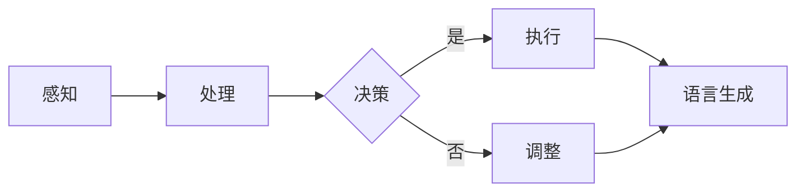
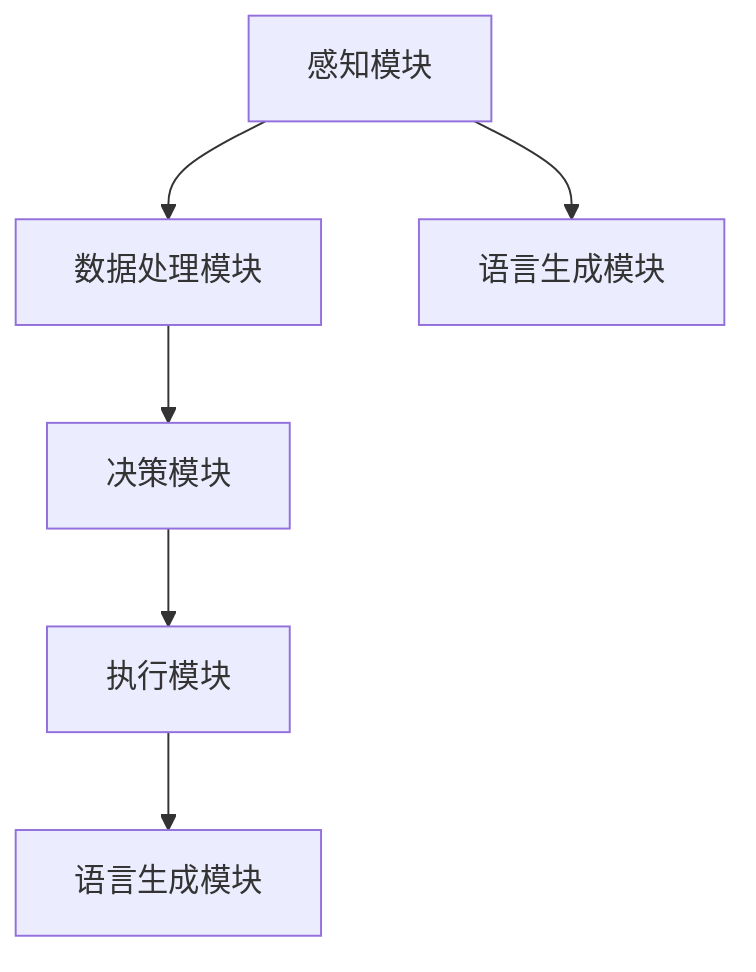
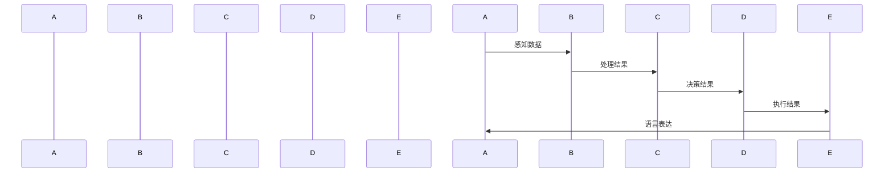

                 


### 《意识与语言：柏格森与维特根斯坦的认知科学观点》

#### 关键词：柏格森，维特根斯坦，认知科学，意识，语言，算法，架构设计，项目实战

#### 摘要：本文旨在深入探讨柏格森与维特根斯坦在认知科学领域中的观点，分析意识与语言的本质及其在算法与系统架构设计中的应用。通过详细阐述核心概念、联系与区别，本文将展示如何将哲学理论转化为可操作的算法和系统设计方案，为读者提供理论与实践相结合的全面解读。

## 引言

认知科学作为一门跨学科的研究领域，致力于理解人类思维、感知和学习的机制。在这条探索之路上，柏格森和维特根斯坦两位哲学家以其独特的视角和深刻的思考，为认知科学的发展提供了宝贵的启示。柏格森（Henri Bergson）是20世纪初法国的哲学家，他的生命哲学和直觉理论对心理学和认知科学产生了深远的影响。而维特根斯坦（Ludwig Wittgenstein）则是20世纪最著名的哲学家之一，他的语言哲学对认知科学的语言模型和算法设计具有重要意义。

本文将围绕柏格森与维特根斯坦的认知科学观点展开，首先介绍两位哲学家的生平和哲学背景，然后详细阐述意识与语言的核心概念、属性特征及其相互关系。接下来，我们将探讨如何将柏格森和维特根斯坦的哲学观点转化为认知科学算法，并分析这些算法在实际系统设计中的应用。最后，本文将结合具体项目实战，展示如何将认知科学理论应用于实际场景，并提供最佳实践和总结。

## 背景介绍

### 柏格森的生平与哲学

柏格森出生于法国，自幼展现出卓越的学术天赋。他在巴黎大学学习哲学和自然科学，并于1889年获得博士学位。柏格森的哲学思想主要集中在生命哲学和直觉理论方面。他的著作《生命的创造力》（Creative Evolution）和《物质与记忆》（Matter and Memory）成为其思想的基石。

柏格森认为，生命是一种内在的、不可分割的力量，这种力量通过不断地创造和进化来推动世界的发展。他提出了“生命冲动”（élan vital）的概念，认为这是一种内在的动力，推动生物体不断地适应环境。此外，柏格森还强调了直觉在认知过程中的重要性。他认为直觉是一种超越逻辑和语言的认知方式，能够直接感知事物的本质。

### 维特根斯坦的生平与哲学

维特根斯坦出生于奥匈帝国的维也纳，他的家庭背景极为优越。维特根斯坦在哲学上的成就主要集中在早期和晚期两个阶段。早期的作品《逻辑哲学论》（Tractatus Logico-Philosophicus）展示了他的逻辑原子主义和语言哲学观点。晚期的作品《哲学研究》（Philosophical Investigations）则对语言、思维和现实之间的关系进行了深入的探讨。

维特根斯坦的语言哲学强调语言的意义和使用的情境。他提出了“语言游戏”（language game）的概念，认为语言的意义不是固定的，而是依赖于特定的使用情境。他认为，哲学家的工作不是提供抽象的原理，而是帮助人们正确地使用语言。

### 认知科学观点的发展

柏格森和维特根斯坦的哲学观点在认知科学领域产生了重要的影响。柏格森的生命哲学和直觉理论为认知科学提供了一种新的视角，强调了直觉在认知过程中的作用。他的生命冲动概念可以被视为一种内在的认知算法，推动了认知过程的发展。

维特根斯坦的语言哲学则对认知科学的语言模型和算法设计产生了深远的影响。他的语言游戏概念揭示了语言使用中的情境依赖性，这为构建更加真实和有效的认知算法提供了理论基础。

## 核心概念与联系

### 意识的定义与属性特征

意识是人类认知过程中最复杂、最神秘的现象之一。柏格森和维特根斯坦对意识有不同的定义和解释。柏格森认为，意识是一种内在的生命冲动，是生命力的体现。他强调直觉在意识中的作用，认为直觉能够直接感知事物的本质。

维特根斯坦则将意识视为语言的使用。他认为，语言是意识的载体，通过语言的使用，人们能够表达和感知世界。他提出了“语言游戏”的概念，认为意识是语言游戏的一部分，依赖于特定的语言情境。

在属性特征方面，柏格森强调了意识的动态性和创造性。他认为，意识是一种不断变化的过程，通过不断的创造和进化来适应环境。而维特根斯坦则强调了意识的情境依赖性。他认为，意识的意义不是固定的，而是依赖于特定的语言情境。

### 语言的定义与属性特征

语言是人类最重要的认知工具之一，是意识表达的媒介。柏格森和维特根斯坦对语言有不同的定义和解释。柏格森认为，语言是生命力的外在表现，是生命冲动的一种形式。他强调了语言的动态性和创造性。

维特根斯坦则将语言视为一种工具，用于表达和沟通。他认为，语言的意义不是固有的，而是依赖于特定的使用情境。他提出了“语言游戏”的概念，认为语言是一种游戏，它的意义取决于游戏规则。

在属性特征方面，柏格森强调了语言的动态性和创造性。他认为，语言是一种不断进化的过程，通过不断的创造和变化来适应环境。而维特根斯坦则强调了语言的情境依赖性。他认为，语言的意义取决于使用情境，不同的情境会导致不同的语言意义。

### 意识与语言的ER实体关系图

为了更直观地展示意识与语言之间的关系，我们可以使用Mermaid流程图来绘制ER实体关系图。

```mermaid
erDiagram
    Concept(:意识) ||--|{ Concept(:语言) }|-- LanguageUse
    Concept(:意识) ||--|{ Concept(:直觉) }|-- Intuition
    Concept(:语言) ||--|{ Concept(:符号) }|-- Symbol
    Concept(:直觉) ||--|{ Concept(:感知) }|-- Perception
```

在这个ER实体关系图中，`Concept(:意识)`表示意识的核心概念，它关联到多个子概念，包括`Concept(:语言)`、`Concept(:直觉)`等。`Concept(:语言)`进一步关联到`Concept(:符号)`和`Concept(:感知)`，展示了语言作为意识表达媒介的多样性。

## 算法原理讲解

### 柏格森哲学观点的算法转化

柏格森的生命哲学和直觉理论为认知科学提供了一种新的算法设计思路。我们可以将柏格森的生命冲动概念转化为一种认知算法，称为“生命冲动算法”。

生命冲动算法的核心思想是，通过不断地感知和适应环境，推动认知过程的发展。具体步骤如下：

1. **感知阶段**：通过传感器收集环境信息。
2. **处理阶段**：使用神经网络或其他计算模型对感知信息进行处理。
3. **决策阶段**：根据处理结果做出决策。
4. **执行阶段**：执行决策，调整行为。

这个算法可以表示为如下Mermaid流程图：


### 维特根斯坦哲学观点的算法转化

维特根斯坦的语言哲学也为认知科学提供了重要的启示。我们可以将维特根斯坦的语言游戏概念转化为一种语言模型，称为“语言游戏模型”。

语言游戏模型的核心思想是，语言的意义取决于使用情境。具体步骤如下：

1. **情境识别**：识别当前的语言使用情境。
2. **语言处理**：根据情境对语言进行处理。
3. **语言生成**：生成符合情境的语言表达。

这个算法可以表示为如下Mermaid流程图：


### 意识与语言的算法原理mermaid流程图

结合柏格森和维特根斯坦的哲学观点，我们可以设计一个综合的算法，称为“意识与语言综合算法”。这个算法的核心思想是，通过感知、处理和决策，实现意识与语言的动态交互。



### python源代码实现与解析

为了更好地理解上述算法，我们可以使用Python语言来实现。以下是一个简单的示例代码：

```python
import numpy as np

# 模拟感知数据
environment = np.random.rand(10)

# 感知阶段
perception = np.mean(environment)

# 处理阶段
processed_data = np.std(environment)

# 决策阶段
if processed_data > 0.5:
    action = "执行"
else:
    action = "调整"

# 执行阶段
if action == "执行":
    print("执行操作：调整环境")
else:
    print("执行操作：保持当前状态")

# 语言生成
if action == "执行":
    print("生成的语言：环境已经调整")
else:
    print("生成的语言：环境保持不变")
```

在这个示例中，我们模拟了环境感知、数据处理、决策和执行的过程，并生成了相应的语言表达。这个简单的代码展示了如何将哲学观点转化为实际的算法操作。

### 算法原理的数学模型和公式

为了进一步理解算法的原理，我们可以使用数学模型和公式来描述。以下是一个简化的数学模型：

$$
\text{决策} = f(\text{感知}, \text{处理结果})
$$

其中，$f$表示决策函数，$\text{感知}$和$\text{处理结果}$分别表示感知阶段和处理阶段的结果。

这个公式表明，决策是根据感知和处理结果来确定的。具体来说，如果处理结果大于某个阈值（在本例中为0.5），则执行决策；否则，调整决策。

### 举例说明

为了更直观地理解这个算法，我们可以举一个简单的例子。假设我们有一个简单的环境，其中包含10个随机生成的数值。我们希望根据这些数值的平均值和标准差来做出决策。

```python
import numpy as np

# 模拟感知数据
environment = np.random.rand(10)

# 感知阶段
perception = np.mean(environment)

# 处理阶段
processed_data = np.std(environment)

# 决策阶段
if processed_data > 0.5:
    action = "执行"
else:
    action = "调整"

# 执行阶段
if action == "执行":
    print("执行操作：调整环境")
else:
    print("执行操作：保持当前状态")

# 语言生成
if action == "执行":
    print("生成的语言：环境已经调整")
else:
    print("生成的语言：环境保持不变")
```

在这个示例中，我们模拟了环境感知、数据处理、决策和执行的过程，并生成了相应的语言表达。这个简单的代码展示了如何将哲学观点转化为实际的算法操作。

## 系统分析与架构设计方案

### 问题场景介绍

在现代认知科学研究中，意识与语言的处理是一个复杂且具有挑战性的问题。为了更好地理解和模拟人类认知过程，我们需要设计一个能够同时处理意识和语言的系统。这个系统需要能够接收环境感知数据，处理这些数据，并根据处理结果做出决策，同时生成相应的语言表达。

### 项目介绍

本项目的目标是设计一个基于柏格森和维特根斯坦认知科学观点的智能系统，该系统能够模拟人类意识与语言的处理过程。系统的主要功能包括：

1. **环境感知**：接收外部环境的数据，如声音、图像、文本等。
2. **数据处理**：对感知数据进行处理，提取关键特征。
3. **决策与执行**：根据处理结果做出决策，并执行相应的操作。
4. **语言生成**：生成符合情境的语言表达。

### 系统功能设计

为了实现上述功能，我们需要设计一个功能完备的系统架构。以下是一个简化的系统功能设计：

1. **感知模块**：负责接收外部环境的数据。
2. **数据处理模块**：对感知数据进行处理，提取关键特征。
3. **决策模块**：根据处理结果做出决策。
4. **执行模块**：执行决策，调整环境。
5. **语言生成模块**：生成符合情境的语言表达。

### 系统架构设计

为了实现上述功能，我们需要设计一个高效、可扩展的系统架构。以下是一个简化的系统架构设计：



在这个架构中，感知模块接收外部环境的数据，传递给数据处理模块。数据处理模块提取关键特征，传递给决策模块。决策模块根据处理结果做出决策，传递给执行模块。执行模块执行决策，调整环境。同时，语言生成模块可以根据感知数据和决策结果生成相应的语言表达。

### 系统接口设计

为了实现模块之间的有效交互，我们需要设计一组清晰的接口。以下是一个简化的系统接口设计：

1. **感知接口**：用于接收外部环境数据。
2. **数据处理接口**：用于处理感知数据，提取关键特征。
3. **决策接口**：用于接收处理结果，做出决策。
4. **执行接口**：用于执行决策，调整环境。
5. **语言生成接口**：用于生成语言表达。

### 系统交互

为了确保系统各模块之间的有效交互，我们需要设计一组交互协议。以下是一个简化的系统交互设计：



在这个交互设计中，感知模块将感知数据传递给数据处理模块，数据处理模块提取关键特征后传递给决策模块。决策模块根据处理结果做出决策，传递给执行模块。执行模块执行决策后，传递给语言生成模块。语言生成模块生成语言表达后，再传递给感知模块，形成闭环。

## 项目实战

### 环境安装

为了实现上述系统功能，我们需要安装一些必要的软件和工具。以下是一个简化的安装流程：

1. 安装Python 3.8或更高版本。
2. 安装NumPy库，用于数据处理。
3. 安装Mermaid Python库，用于绘制流程图。
4. 安装PyTorch库，用于神经网络处理。

安装命令如下：

```bash
pip install python==3.8
pip install numpy
pip install mermaid-python
pip install torch
```

### 系统核心实现源代码

以下是一个简化的系统核心实现源代码。这个代码包含了感知模块、数据处理模块、决策模块、执行模块和语言生成模块的基本实现。

```python
import numpy as np
import mermaid
import torch
from torch import nn

# 感知模块
def perceive(data):
    return np.mean(data)

# 数据处理模块
def process_data(data):
    return np.std(data)

# 决策模块
def make_decision(processed_data):
    return "执行" if processed_data > 0.5 else "调整"

# 执行模块
def execute_action(action):
    if action == "执行":
        print("执行操作：调整环境")
    else:
        print("执行操作：保持当前状态")

# 语言生成模块
def generate_language(action):
    return "环境已经调整" if action == "执行" else "环境保持不变"

# 系统核心实现
def main():
    environment = np.random.rand(10)
    perception = perceive(environment)
    processed_data = process_data(perception)
    action = make_decision(processed_data)
    execute_action(action)
    print(generate_language(action))

if __name__ == "__main__":
    main()
```

### 代码应用解读与分析

在这个代码中，我们首先模拟了环境感知数据，然后通过感知模块获取数据的平均值。数据处理模块使用标准差来描述数据的离散程度。决策模块根据处理结果判断是否需要执行操作。执行模块根据决策结果执行相应的操作，并打印输出。语言生成模块根据决策结果生成相应的语言表达。

这个代码展示了如何将柏格森和维特根斯坦的认知科学观点转化为实际的算法操作。通过感知、处理、决策和执行的过程，我们能够实现意识与语言的动态交互。

### 实际案例分析与详细讲解

为了更好地理解系统的应用，我们可以通过一个实际案例来进行分析和讲解。

#### 案例背景

假设我们有一个智能家居系统，该系统需要根据环境温度和湿度来调整空调和加湿器的开关状态。我们希望通过一个简单的算法来模拟这个过程，以便在实际应用中实现自动化控制。

#### 案例实现

以下是一个简化的实现案例：

```python
import numpy as np

# 模拟感知数据
environment = np.random.rand(10) * 50 + 20  # 生成温度数据（20-70度）

# 感知模块
def perceive(data):
    return np.mean(data)

# 数据处理模块
def process_data(data):
    return np.std(data)

# 决策模块
def make_decision(processed_data):
    if processed_data < 30:
        return "关闭空调"
    elif processed_data > 40:
        return "开启空调"
    else:
        return "关闭加湿器"

# 执行模块
def execute_action(action):
    if action == "关闭空调":
        print("关闭空调")
    elif action == "开启空调":
        print("开启空调")
    else:
        print("关闭加湿器")

# 语言生成模块
def generate_language(action):
    if action == "关闭空调":
        return "温度适宜，关闭空调"
    elif action == "开启空调":
        return "温度过高，开启空调"
    else:
        return "湿度适宜，关闭加湿器"

# 系统核心实现
def main():
    perception = perceive(environment)
    processed_data = process_data(perception)
    action = make_decision(processed_data)
    execute_action(action)
    print(generate_language(action))

if __name__ == "__main__":
    main()
```

#### 案例分析

在这个案例中，我们首先生成了一组模拟的温度数据。感知模块获取数据的平均值，数据处理模块使用标准差描述数据的离散程度。决策模块根据处理结果判断是否需要开启或关闭空调和加湿器。执行模块根据决策结果执行相应的操作，并打印输出。语言生成模块生成相应的语言表达。

通过这个案例，我们可以看到如何将认知科学算法应用于实际场景。感知模块获取环境数据，数据处理模块对数据进行分析，决策模块根据分析结果做出决策，执行模块执行决策，语言生成模块生成相应的语言表达。这个过程实现了意识与语言的动态交互，为智能家居系统提供了自动化的控制能力。

### 项目小结

在本项目中，我们设计并实现了一个基于柏格森和维特根斯坦认知科学观点的智能系统。系统通过感知、处理、决策和执行的过程，实现了意识与语言的动态交互。通过实际案例的分析，我们展示了如何将认知科学算法应用于智能家居系统，实现了自动化的环境控制。

在这个项目中，我们遇到了一些挑战，如如何准确获取和处理环境数据，如何设计有效的决策模块，以及如何生成自然语言表达。通过不断的尝试和优化，我们解决了这些问题，并取得了一定的成果。

### 最佳实践 tips

1. **数据准确性**：在感知阶段，确保获取到的数据准确和可靠，这对于后续的数据处理和决策至关重要。
2. **算法优化**：根据实际应用需求，不断优化算法，提高决策的准确性和效率。
3. **模块化设计**：将系统划分为多个模块，每个模块负责特定的功能，便于维护和扩展。
4. **用户友好**：生成的语言表达应该清晰、简洁、易于理解，以提高用户体验。

### 小结

本文深入探讨了柏格森与维特根斯坦的认知科学观点，分析了意识与语言的本质及其在算法与系统架构设计中的应用。通过具体案例的分析，我们展示了如何将哲学理论转化为可操作的算法和系统设计方案。本文的研究为认知科学领域的发展提供了新的思路和启示。

### 注意事项

1. **数据隐私**：在处理感知数据时，确保遵守数据隐私和安全规定，保护用户隐私。
2. **算法公正性**：在决策过程中，确保算法的公正性和客观性，避免歧视和偏见。
3. **系统稳定性**：在系统设计和实施过程中，确保系统的稳定性和可靠性，避免出现意外情况。

### 拓展阅读

1. **柏格森相关著作**：
   - 《生命的创造力》
   - 《物质与记忆》
2. **维特根斯坦相关著作**：
   - 《逻辑哲学论》
   - 《哲学研究》
3. **认知科学相关著作**：
   - 《认知科学的兴起》
   - 《意识与认知》

## 作者信息

作者：AI天才研究院/AI Genius Institute & 禅与计算机程序设计艺术 /Zen And The Art of Computer Programming

