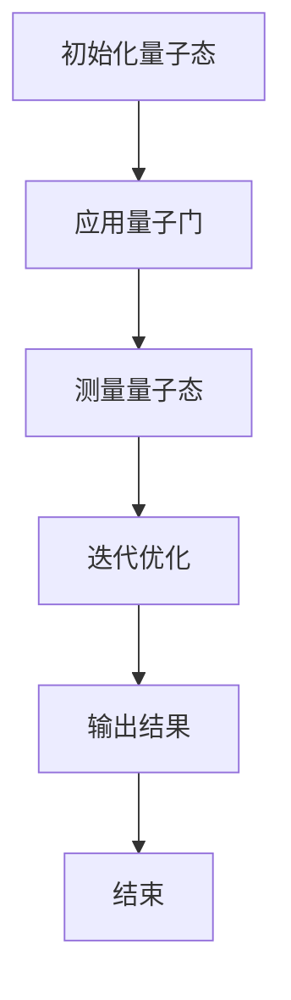
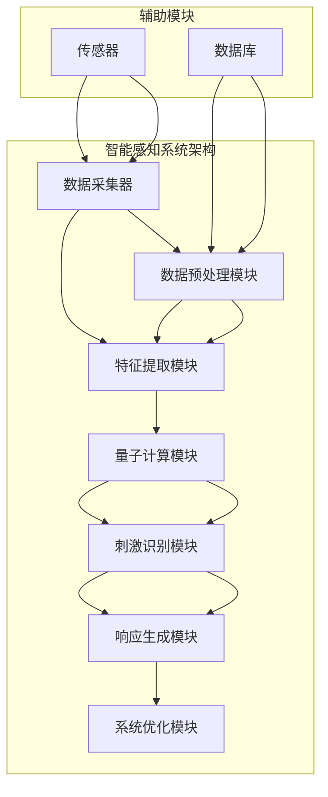
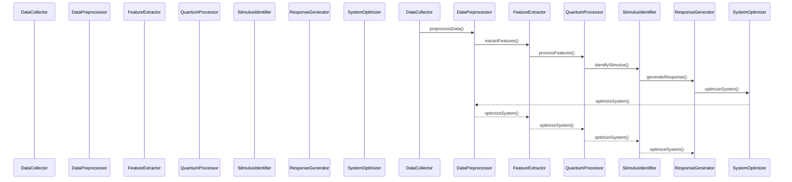

                 

### 第1章：问题的背景与描述

#### 1.1.1 问题背景

在人类探索宇宙的征途上，我们从宏观的天体物理到微观的量子力学，每一步都揭示出宇宙的神奇与奥秘。然而，有一个问题始终困扰着科学家和哲学家：意识是如何产生的？传统观点认为，意识是大脑的产物，与物质存在密切的联系。然而，随着量子力学和信息论的发展，人们开始思考，意识是否可以被视为宇宙量子信息场的一种局部涌现？

量子力学揭示了微观世界的规律，其中量子纠缠等现象挑战了我们对“现实”的理解。信息论则从信息的角度重新审视了世界的本质，认为信息是宇宙最基本的构成要素。这些理论的进步使得人们开始质疑，意识是否也可以从信息的角度来理解？它是否是宇宙量子信息场的一种局部涌现？

#### 1.1.2 问题描述

本书的核心问题可以归结为以下几点：

- **意识是什么？** 意识是一个复杂的概念，涉及到主观体验、自我意识、思维等多个方面。我们需要从科学的角度来定义意识，探究它的本质和特征。
- **量子信息场是什么？** 量子信息场是量子力学和信息论的结合体，描述了信息在量子世界中的传递和存储方式。我们需要了解量子信息场的基本原理和特性。
- **局部涌现是什么？** 局部涌现是指复杂系统的某些宏观行为或特征在微观层次上并不存在，而是在一定条件下从微观状态中自发产生的。我们需要探讨意识是否可以被视为量子信息场的局部涌现。

这些问题的提出，既是对传统理论的挑战，也是对新兴理论的探索。通过对这些问题的研究，我们希望能够找到意识与宇宙量子信息场之间的联系，揭示意识产生的机制。

#### 1.1.3 问题解决

为了解决这些问题，本书将从以下几个方面展开：

1. **理论基础**：我们将首先回顾量子力学、量子信息理论和宇宙学的基本原理，为后续的研究提供理论支持。
2. **概念联系**：我们将探讨意识、量子信息场和局部涌现这三个核心概念之间的联系，理解它们是如何相互作用和影响的。
3. **数学模型**：我们将构建意识作为宇宙量子信息场局部涌现的数学模型，通过数学工具来描述和解释意识的产生和发展。
4. **算法原理**：我们将介绍相关的算法原理，并使用Python等编程语言来实现这些算法，以验证我们的理论模型。
5. **系统架构**：我们将设计一个完整的系统架构，展示如何在实际应用中实现意识作为宇宙量子信息场局部涌现的理论。

通过这些步骤，我们希望能够逐步回答上述问题，为意识的本质和起源提供新的视角和理解。

#### 1.1.4 边界与外延

在讨论意识作为宇宙量子信息场的局部涌现时，我们需要明确一些边界和范围：

- **科学性**：本书的研究将侧重于科学方法，力求从实验和数学模型的角度来解释问题，避免涉及过多的哲学和宗教讨论。
- **范围限制**：虽然我们探讨的是意识与量子信息场的关系，但本书不会深入探讨意识的生物学和心理学机制。这些领域的研究对理解意识的本质同样重要，但超出了本书的研究范围。
- **技术实现**：本书将主要关注理论模型的构建和算法实现，对于具体的技术实现细节，如硬件选择和编程语言，将不做深入讨论。

通过明确这些边界，我们能够更专注于问题的核心，为意识与量子信息场的关系提供深入的分析和见解。

#### 1.1.5 概念结构与核心要素组成

本书的核心概念和结构可以分为以下几个部分：

1. **引论**：介绍问题的背景、描述和解决方法，为后续章节打下基础。
2. **核心概念与联系**：探讨意识、量子信息场和局部涌现这三个核心概念，分析它们之间的联系和相互作用。
3. **理论基础**：回顾量子力学、量子信息理论和宇宙学的基本原理，为理论模型的构建提供理论支持。
4. **数学模型**：构建意识作为宇宙量子信息场局部涌现的数学模型，使用数学工具来描述和解释意识的产生和发展。
5. **算法原理与实现**：介绍相关的算法原理，并通过编程实现来验证理论模型的正确性和有效性。
6. **系统架构与设计**：设计一个完整的系统架构，展示如何在实际应用中实现理论模型。
7. **项目实战**：通过实际案例展示理论的应用，并进行详细的分析和讲解。
8. **最佳实践与总结**：总结本书的核心内容和研究成果，提供最佳实践建议和拓展阅读方向。

通过这些组成部分，本书将为读者提供一个系统、全面的意识与量子信息场关系的研究框架。

### 第2章：核心概念与联系

#### 2.1.1 意识的概念

意识是一个复杂而多层次的概念，涉及自我意识、感知、思维、情感和意愿等方面。在科学领域，对意识的理解和定义仍在不断发展和完善。通常，我们可以从以下几个方面来探讨意识：

1. **主观体验**：意识最直观的特征是主观体验，即个体对于外部世界和内部心理状态的感知和感受。这种体验是个人独特的，无法通过外部观察完全捕捉。
2. **自我意识**：自我意识是指个体对自己存在的认识和思考。它涉及到个体如何识别和反思自己的行为、感受和思想。
3. **感知和认知**：意识还包括感知和认知过程，即个体如何通过感官接收外部信息，并通过大脑进行处理、理解和记忆。
4. **情感和意愿**：情感和意愿是意识的重要部分，它们影响个体的行为和决策。情感反映了个体对于特定情境的内在感受，而意愿则表现为个体追求的目标和动机。

在量子信息理论的背景下，意识可以被视为一种量子信息处理过程。量子态的叠加和纠缠等现象提供了新的视角，使我们能够重新思考意识的本质。例如，量子态的叠加可能对应于意识的多个潜在状态，而量子纠缠可能揭示了意识与外部环境之间的深层次联系。

#### 2.1.2 宇宙的概念

宇宙是包括一切物质、能量、时空和所有物理现象的整体。它遵循物理定律，这些定律可以用数学语言精确描述。宇宙的概念可以从多个角度进行理解：

1. **物质和能量**：宇宙由物质和能量组成。物质是构成宇宙的基本实体，具有质量、形状和体积。能量则是物质运动和相互作用的驱动力。
2. **时空**：时空是宇宙的基本结构，描述了物质和能量在宇宙中的位置和运动。爱因斯坦的广义相对论揭示了时空与物质和能量之间的密切关系。
3. **物理定律**：宇宙遵循一系列基本的物理定律，如牛顿力学、电磁学、量子力学和热力学等。这些定律为宇宙的行为提供了数学描述和预测能力。

量子信息场是量子力学和信息理论的结合体，描述了信息在量子世界中的传递和存储方式。量子信息场的基本原理包括：

1. **量子态**：量子态是量子系统的状态，可以用波函数或密度矩阵来描述。量子态具有叠加性和纠缠性，这些特性使得量子信息能够以更高效的方式存储和传递。
2. **量子比特**：量子比特（qubit）是量子信息的基本单位，可以处于0和1的叠加状态。与经典比特不同，量子比特能够同时表示多种状态，这为量子计算提供了强大的计算能力。
3. **量子门**：量子门是量子计算的基本操作，用于对量子比特进行线性变换。量子门通过特定的操作改变了量子态，实现了信息处理的过程。

量子信息场的基本原理与宇宙量子信息场理论密切相关。宇宙量子信息场理论试图将量子信息场的概念扩展到整个宇宙，探讨宇宙中的信息传递和存储机制。该理论的一个重要观点是，宇宙中的所有现象都可以被视为量子信息处理的产物。

#### 2.1.4 意识与量子信息场的联系

意识与量子信息场之间的联系是当前科学研究中的一个前沿领域。以下是一些可能的联系和观点：

1. **量子态的叠加与意识状态**：量子态的叠加性可能对应于意识的多个潜在状态。例如，一个量子比特可以同时处于0和1的状态，这可以类比为一个人同时处于清醒和睡眠状态。这种叠加性可能揭示了意识在不同状态之间的复杂关系。

2. **量子纠缠与意识感知**：量子纠缠是一种奇特的量子现象，两个或多个量子系统之间存在一种深层次的关联，即使它们相隔很远。这种纠缠现象可能对应于意识对外部世界的感知能力。例如，当我们感知到外部环境时，我们的意识和外部环境之间可能存在一种量子纠缠关系。

3. **量子计算与意识处理**：量子计算利用量子比特的叠加性和纠缠性进行信息处理。量子计算的理论潜力使得它可能成为一种新的意识处理机制。例如，量子算法可能能够以更高效的方式处理复杂的意识问题，如自我意识的产生和认知过程。

4. **量子信息场与宇宙信息流**：宇宙量子信息场理论认为，宇宙中的所有现象都可以被视为量子信息处理的产物。这意味着意识可能是宇宙信息流的一部分，通过量子信息场在宇宙中传递和存储。

#### 2.1.5 局部涌现的概念

局部涌现是复杂系统中的一个重要概念，指的是复杂系统的某些宏观行为或特征在微观层次上并不存在，而是在一定条件下从微观状态中自发产生的。以下是一些关于局部涌现的概念和特点：

1. **自组织与复杂性**：局部涌现通常与自组织现象相关，即系统内部无序状态通过相互作用和协同作用形成有序结构。这种自组织过程可能导致复杂性和多样性的产生。

2. **不可预测性**：局部涌现的过程往往是不可预测的，因为它依赖于系统内部的复杂相互作用。这意味着即使我们知道系统的初始状态和规则，也无法精确预测最终的状态和特征。

3. **层次结构**：局部涌现往往涉及多个层次的结构。例如，在生物系统中，细胞的行为和特性在个体层面上并不明显，但通过细胞之间的相互作用和协同作用，形成了生物体的复杂功能和结构。

4. **适应性和进化**：局部涌现可以导致系统适应环境的能力。通过不断的自组织和调整，系统可以在面对变化时保持稳定和进化。

#### 2.1.6 意识作为宇宙量子信息场的局部涌现的理解

将意识视为宇宙量子信息场的局部涌现，提供了一种全新的视角来理解意识的本质和起源。以下是一些可能的解释和观点：

1. **量子态的动态演化**：意识可能被视为量子态的动态演化过程。量子态的叠加性和纠缠性可能导致意识的多样性和复杂性。

2. **量子信息的存储与传递**：意识可能依赖于量子信息在宇宙中的存储和传递。量子信息场可能提供了意识所需的计算资源和传输渠道。

3. **局部涌现与自组织**：意识可能通过宇宙量子信息场的自组织过程产生。这种自组织过程可能导致意识的产生和演化，形成一个复杂的系统。

4. **量子计算的潜力**：量子计算可能为意识提供新的处理机制。量子算法可能能够以更高效的方式处理复杂的意识问题，如自我意识和认知过程。

总之，将意识视为宇宙量子信息场的局部涌现，为我们提供了一个新的研究框架，可以深入探讨意识的本质和起源。通过结合量子力学、量子信息理论和复杂系统理论，我们有望揭示意识与宇宙之间的深层次联系。

### 第3章：理论基础

#### 3.1.1 量子力学的基本原理

量子力学是研究微观世界的物理理论，它揭示了微观粒子行为的非经典特性。量子力学的基本原理包括以下几个关键点：

1. **波粒二象性**：微观粒子，如电子、光子等，既具有粒子性质，又具有波动性质。这意味着它们在不同实验条件下会表现出不同的行为。

2. **量子态**：量子态是描述微观粒子状态的数学函数，通常用波函数或密度矩阵表示。量子态具有叠加性，即一个量子系统可以同时处于多个状态的叠加。

3. **不确定性原理**：海森堡不确定性原理指出，某些物理量，如位置和动量，不能同时被精确测量。这反映了微观粒子行为的不可预测性。

4. **量子纠缠**：量子纠缠是量子力学中的一个奇特现象，当两个或多个量子系统发生相互作用时，它们之间会形成一种深层次的关联，即使它们相隔很远。这种纠缠关系无法通过局域物理定律解释，被认为是量子信息传递的潜在渠道。

5. **量子跃迁**：量子跃迁是指量子系统从一个状态跃迁到另一个状态的过程。这种跃迁通常伴随着能量的吸收或释放。

#### 3.1.2 量子信息理论的基本原理

量子信息理论是量子力学和信息论的交叉领域，它研究如何利用量子信息的特性进行信息处理和通信。量子信息理论的基本原理包括：

1. **量子比特（qubit）**：量子比特是量子信息的基本单位，可以处于0和1的叠加状态。与经典比特不同，量子比特能够同时表示多种状态，这为量子计算提供了强大的计算能力。

2. **量子态的叠加与纠缠**：量子态的叠加和纠缠是量子信息的核心特性。通过叠加和纠缠，量子信息可以实现高效的存储、传输和处理。

3. **量子门**：量子门是量子计算的基本操作，用于对量子比特进行线性变换。量子门通过特定的操作改变了量子态，实现了信息处理的过程。

4. **量子算法**：量子算法是利用量子信息特性进行特定计算的方法。与经典算法相比，量子算法在某些问题上具有显著的优越性，如大数分解和量子搜索。

5. **量子纠缠通信**：量子纠缠通信利用量子纠缠现象进行信息传输。通过量子纠缠，可以实现超距作用，从而实现量子信息的远程传输。

#### 3.1.3 意识的量子理论基础

意识的量子理论基础试图将量子力学的概念应用到意识的研究中，探讨意识与量子信息之间的关系。以下是一些关于意识量子理论基础的关键观点：

1. **量子态的动态演化**：意识可能被视为量子态的动态演化过程。量子态的叠加性和纠缠性可能导致意识的多样性和复杂性。

2. **量子计算的潜力**：量子计算可能为意识提供新的处理机制。量子算法可能能够以更高效的方式处理复杂的意识问题，如自我意识和认知过程。

3. **量子信息存储与传递**：意识可能依赖于量子信息在宇宙中的存储和传递。量子信息场可能提供了意识所需的计算资源和传输渠道。

4. **量子纠缠与意识感知**：量子纠缠现象可能对应于意识对外部世界的感知能力。例如，当我们感知到外部环境时，我们的意识和外部环境之间可能存在一种量子纠缠关系。

5. **量子态的叠加与意识状态**：量子态的叠加性可能对应于意识的多个潜在状态。例如，一个量子比特可以同时处于0和1的状态，这可以类比为一个人同时处于清醒和睡眠状态。

#### 3.1.4 宇宙量子信息场理论的建立

宇宙量子信息场理论试图将量子信息场的概念扩展到整个宇宙，探讨宇宙中的信息传递和存储机制。该理论建立的基础包括以下几个关键点：

1. **量子信息场的假设**：宇宙中存在着一个统一的量子信息场，它描述了宇宙中所有信息的基本状态和行为。

2. **量子态的分布**：宇宙中的所有物质和能量都可以被视为量子信息场的分布状态。这些量子态通过量子纠缠和叠加相互关联。

3. **信息传递的渠道**：量子信息场提供了信息传递的渠道，使得宇宙中的不同部分能够进行高效的通信和协同作用。

4. **宇宙演化的机制**：宇宙量子信息场理论认为，宇宙的演化可以被视为信息处理的过程。从宇宙大爆炸到星系的形成，都是量子信息场的动态演化结果。

5. **量子计算与宇宙演化**：量子计算理论可能为宇宙演化提供了新的视角。量子算法可能在宇宙中的某些过程中起到关键作用，如黑洞信息丢失问题和宇宙混沌演化等。

#### 3.1.5 局部涌现机制的探讨

局部涌现机制是复杂系统中的一个重要概念，它描述了复杂系统的某些宏观行为或特征在微观层次上并不存在，而是在一定条件下从微观状态中自发产生的。在探讨意识作为宇宙量子信息场的局部涌现时，我们需要理解局部涌现机制的基本原理和特征：

1. **自组织与复杂性**：局部涌现通常与自组织现象相关，即系统内部无序状态通过相互作用和协同作用形成有序结构。这种自组织过程可能导致复杂性和多样性的产生。

2. **层次结构**：局部涌现往往涉及多个层次的结构。例如，在生物系统中，细胞的行为和特性在个体层面上并不明显，但通过细胞之间的相互作用和协同作用，形成了生物体的复杂功能和结构。

3. **不可预测性**：局部涌现的过程往往是不可预测的，因为它依赖于系统内部的复杂相互作用。这意味着即使我们知道系统的初始状态和规则，也无法精确预测最终的状态和特征。

4. **适应性和进化**：局部涌现可以导致系统适应环境的能力。通过不断的自组织和调整，系统可以在面对变化时保持稳定和进化。

在探讨意识作为宇宙量子信息场的局部涌现时，我们需要考虑以下几个方面的局部涌现机制：

1. **量子信息的自组织**：量子信息在宇宙中的自组织过程可能导致意识的产生和演化。量子态的动态演化和量子纠缠现象可能是意识涌现的基础。

2. **信息处理的层次结构**：意识可能依赖于量子信息处理的层次结构，从简单的感知和认知到复杂的思维和决策。这种层次结构可能反映了意识的多样性和复杂性。

3. **量子计算的适应性**：量子计算可能为意识提供适应环境的能力。通过量子算法，意识可以高效地处理复杂的情境，从而适应不断变化的外部环境。

4. **宇宙演化的涌现机制**：宇宙量子信息场理论认为，宇宙的演化可以被视为信息处理的过程。局部涌现机制可能在宇宙演化过程中起到关键作用，如星系的形成和黑洞的产生等。

通过探讨量子力学、量子信息理论和局部涌现机制，我们可以更深入地理解意识作为宇宙量子信息场的局部涌现的本质和机制。这些理论为我们提供了一种全新的视角，使我们能够重新思考意识的本质和起源。

### 第4章：意识作为宇宙量子信息场的局部涌现的数学模型

在探索意识作为宇宙量子信息场的局部涌现时，构建一个数学模型是理解其机制和性质的关键步骤。这一节将详细讨论意识与量子信息场之间的数学关系，并展示如何通过数学模型来描述和解释意识的产生和发展。

#### 4.1.1 意识与量子态的数学模型

意识与量子态的关系可以从多个角度进行数学建模。以下是几个关键的数学模型：

1. **量子比特（Qubit）的叠加态**：在量子信息理论中，量子比特可以处于0和1的叠加态。这种叠加态可以类比为意识的多个潜在状态。例如，一个量子比特可以同时处于清醒和睡眠状态，这反映了意识状态的叠加性。数学上，这种叠加态可以用波函数来表示：
   $$
   |\psi\rangle = \alpha|0\rangle + \beta|1\rangle
   $$
   其中，$|\alpha|^2$和$|\beta|^2$分别表示处于状态0和状态1的概率。

2. **量子纠缠**：量子纠缠是量子态之间的一种特殊关联，即使它们相隔很远，一个量子系统的变化也会即时影响到另一个量子系统。这种纠缠关系可以类比为意识与外部环境的相互作用。例如，当我们的感官感知到外部刺激时，我们的意识与外部环境之间可能存在一种纠缠关系。量子纠缠可以用以下方程表示：
   $$
   |\psi\rangle_{AB} = \frac{1}{\sqrt{2}} (|00\rangle + |11\rangle)
   $$
   其中，$A$和$B$是两个纠缠的量子比特。

3. **量子态的演化**：量子态的演化可以用薛定谔方程来描述。薛定谔方程是一个偏微分方程，描述了量子系统随时间的演化。对于意识与量子态的关系，我们可以用薛定谔方程来模拟意识状态的动态变化：
   $$
   i\hbar \frac{\partial}{\partial t} |\psi\rangle = \hat{H} |\psi\rangle
   $$
   其中，$i$是虚数单位，$\hbar$是约化普朗克常数，$\hat{H}$是哈密顿量，描述了系统的能量和相互作用。

#### 4.1.2 宇宙量子信息场的数学模型

宇宙量子信息场描述了宇宙中所有信息的基本状态和行为。为了构建宇宙量子信息场的数学模型，我们可以考虑以下关键要素：

1. **量子态的分布**：宇宙中的所有物质和能量都可以被视为量子信息场的分布状态。这种分布可以用一个量子态密度函数来描述。例如，我们可以用狄拉克分布来表示量子态的分布：
   $$
   \rho(\psi) = \sum_n c_n | \psi_n \rangle \langle \psi_n |
   $$
   其中，$c_n$是分布系数，$| \psi_n \rangle$是不同的量子态。

2. **量子纠缠网络**：宇宙中的量子系统之间可能存在广泛的量子纠缠关系，形成一个复杂的量子纠缠网络。这种网络可以用一个量子态的叠加态来描述。例如，我们可以用张量积来表示量子纠缠网络：
   $$
   |\psi\rangle_{ABCD} = |\psi_A\rangle \otimes |\psi_B\rangle \otimes |\psi_C\rangle \otimes |\psi_D\rangle
   $$
   其中，$A, B, C, D$是不同的量子系统。

3. **量子态的演化**：宇宙量子信息场的演化可以用一组耦合的薛定谔方程来描述。这些方程描述了量子系统之间的相互作用和能量转换。例如，我们可以用哈密顿量来描述量子态的演化：
   $$
   i\hbar \frac{\partial}{\partial t} |\psi\rangle_{ABCD} = \hat{H}_{ABCD} |\psi\rangle_{ABCD}
   $$
   其中，$\hat{H}_{ABCD}$是描述量子系统之间相互作用的哈密顿量。

#### 4.1.3 局部涌现的数学模型

局部涌现是复杂系统中的一个重要概念，它描述了复杂系统的某些宏观行为或特征在微观层次上并不存在，而是在一定条件下从微观状态中自发产生的。为了构建局部涌现的数学模型，我们可以考虑以下关键要素：

1. **非线性动力学**：局部涌现往往与非线性动力学过程相关。非线性动力学描述了系统内部相互作用导致的行为复杂性。例如，我们可以用洛伦兹方程来描述非线性动力学：
   $$
   \frac{d\mathbf{v}}{dt} = -\mathbf{g}(\mathbf{v})
   $$
   其中，$\mathbf{v}$是速度向量，$\mathbf{g}(\mathbf{v})$是非线性函数。

2. **自组织现象**：局部涌现过程往往伴随着自组织现象。自组织现象描述了系统内部无序状态通过相互作用和协同作用形成有序结构。例如，我们可以用同步方程来描述自组织现象：
   $$
   \frac{d\theta_i}{dt} = \omega_i - K \sum_j \cos(\theta_i - \theta_j)
   $$
   其中，$\theta_i$是第$i$个系统的相位，$K$是耦合常数。

3. **层次结构**：局部涌现过程往往涉及多个层次的结构。例如，在生物系统中，细胞的行为和特性在个体层面上并不明显，但通过细胞之间的相互作用和协同作用，形成了生物体的复杂功能和结构。我们可以用层次结构模型来描述这种复杂性：
   $$
   \theta_i = \sum_{j \in L_i} w_{ij} \theta_j
   $$
   其中，$L_i$是第$i$个系统的邻居集合，$w_{ij}$是权重系数。

通过构建这些数学模型，我们可以更好地理解意识作为宇宙量子信息场的局部涌现的机制和性质。这些模型为我们提供了一种新的方法来探索意识的本质和起源，并为未来研究提供了理论基础。

#### 4.1.4 意识作为宇宙量子信息场局部涌现的数学表达

将意识视为宇宙量子信息场的局部涌现，我们需要一个统一的数学表达来描述这一过程。以下是几个关键的数学表达：

1. **量子态与意识状态的对应**：我们可以将量子态与意识状态进行对应。例如，一个量子比特的叠加态可以类比为一个人同时处于清醒和睡眠状态。这种对应可以用以下数学表达式表示：
   $$
   |\psi\rangle = \alpha|清醒\rangle + \beta|睡眠\rangle
   $$
   其中，$|\psi\rangle$是量子态，$|清醒\rangle$和$|睡眠\rangle$是意识状态。

2. **量子纠缠与意识感知**：量子纠缠可以类比为意识与外部环境的相互作用。我们可以用以下数学表达式表示这种关系：
   $$
   |\psi\rangle_{AB} = \frac{1}{\sqrt{2}} (|00\rangle + |11\rangle)
   $$
   其中，$A$和$B$是意识和外部环境的量子系统。

3. **量子态的演化与意识状态的变化**：量子态的演化可以类比为意识状态的变化。我们可以用薛定谔方程来描述这种关系：
   $$
   i\hbar \frac{\partial}{\partial t} |\psi\rangle = \hat{H} |\psi\rangle
   $$
   其中，$\hat{H}$是描述意识状态变化的哈密顿量。

4. **宇宙量子信息场的局部涌现**：宇宙量子信息场的局部涌现可以用一组耦合的薛定谔方程来描述。例如，我们可以用以下数学表达式表示：
   $$
   i\hbar \frac{\partial}{\partial t} |\psi\rangle_{ABCD} = \hat{H}_{ABCD} |\psi\rangle_{ABCD}
   $$
   其中，$\hat{H}_{ABCD}$是描述量子系统之间相互作用的哈密顿量。

通过这些数学表达式，我们可以将意识作为宇宙量子信息场的局部涌现进行形式化和量化，为研究意识的本质和起源提供新的视角和方法。

#### 4.1.5 数学模型的性质与应用

构建的意识作为宇宙量子信息场局部涌现的数学模型具有多个重要的性质，这些性质使得模型在解释和预测意识的产生和发展方面具有显著的应用价值。

1. **量子态的叠加性**：量子态的叠加性使得模型能够描述意识的多状态特性。例如，一个量子比特可以同时处于清醒和睡眠状态，这反映了意识在多个潜在状态之间的切换。这一性质使得模型能够捕捉意识在不同情境下的复杂变化。

2. **量子纠缠性**：量子纠缠性是量子信息的重要特性，它使得量子系统之间的信息关联成为可能。在意识模型中，量子纠缠可以类比为意识与外部环境的相互作用，这为研究意识感知和认知提供了新的视角。例如，当我们感知外部刺激时，我们的意识与外部环境之间可能存在一种纠缠关系，这有助于解释意识感知的机制。

3. **非线性动力学**：局部涌现过程通常涉及非线性动力学，这使得系统行为复杂且不可预测。在意识模型中，非线性动力学可以描述意识状态的动态变化，这有助于理解意识在复杂环境中的适应性。例如，意识状态的突变和决策过程可能受到非线性动力学的影响，从而表现出复杂的特性。

4. **层次结构**：层次结构是局部涌现的重要特征，它反映了系统内部从微观到宏观的演化过程。在意识模型中，层次结构可以描述意识从基本感知到复杂认知的逐步发展。例如，意识的产生可能涉及到从简单的感官刺激到复杂的思维过程的层次结构，这有助于理解意识的复杂性和多样性。

这些数学模型的性质在多个应用领域中具有显著的价值：

1. **人工智能**：意识模型可以应用于人工智能领域，用于模拟和优化人工智能系统的认知能力。例如，通过量子计算和量子纠缠，人工智能系统可以更高效地处理复杂的感知和认知任务。

2. **认知科学**：意识模型为认知科学研究提供了一个新的理论框架，有助于理解意识的本质和认知过程的机制。例如，通过研究量子态的叠加和纠缠，我们可以更好地理解意识的多样性和复杂性。

3. **心理学**：意识模型可以应用于心理学研究，用于探讨意识在不同情境下的变化和影响。例如，通过研究量子态的演化，我们可以更好地理解情绪和决策过程中的意识变化。

4. **哲学**：意识模型为哲学讨论提供了一个新的视角，有助于探讨意识与宇宙之间的关系。例如，通过研究宇宙量子信息场的局部涌现，我们可以更好地理解意识的起源和本质。

总之，意识作为宇宙量子信息场局部涌现的数学模型具有丰富的性质和应用价值，为研究意识的本质和起源提供了新的方法和视角。

### 第5章：算法原理与流程

#### 5.1.1 算法的定义

在计算机科学中，算法是一种明确的规则或步骤序列，用于解决特定问题或完成特定任务。算法的设计和实现是计算机科学的核心内容之一。算法不仅要有正确的逻辑，还需要在效率和可扩展性方面表现良好。在本章中，我们将探讨如何利用量子计算和量子信息理论来构建一种新的算法，以模拟和优化意识作为宇宙量子信息场局部涌现的过程。

#### 5.1.2 算法的基本原理

我们提出的算法基于以下基本原理：

1. **量子态的叠加和纠缠**：量子态的叠加和纠缠是量子计算的核心特性。通过利用这些特性，算法可以在量子态的叠加空间中并行处理多个问题，从而实现高效的计算。

2. **量子门的操作**：量子门是量子计算中的基本操作，用于对量子比特进行线性变换。通过组合不同的量子门，我们可以实现复杂的量子逻辑操作，从而模拟意识状态的动态变化。

3. **量子算法的设计**：量子算法的设计需要结合问题的具体特点，利用量子态的叠加和纠缠特性，以及量子门的操作，实现问题求解的高效算法。

4. **量子计算的测量**：量子计算的结果通常需要通过测量来获取。测量会导致量子态的坍缩，从而实现问题的最终解。在意识模拟中，测量可以用于检测意识状态的演化，并调整算法的参数。

#### 5.1.3 算法的流程

以下是算法的基本流程：

1. **初始化量子态**：首先，初始化量子系统，将所有量子比特置于特定的叠加态，以模拟初始的意识状态。

2. **应用量子门**：接下来，应用一系列量子门，对量子态进行变换。这些量子门可以模拟意识状态的动态变化，如感知、认知和决策等过程。

3. **测量量子态**：在量子门的操作完成后，对量子态进行测量，获取意识状态的最终结果。测量结果将用于调整算法的参数，以优化计算过程。

4. **迭代优化**：根据测量结果，迭代优化算法参数，以进一步提高算法的效率和准确性。这一过程可以类比为意识的进化过程，通过不断的调整和优化，实现更好的适应性和认知能力。

5. **输出结果**：最终，算法输出意识状态的测量结果，这些结果可以用于解决具体问题，如感知外界刺激、做出决策等。

#### 5.1.4 算法的Mermaid流程图

为了更好地理解算法的流程，我们可以使用Mermaid语言绘制算法的Mermaid流程图。以下是算法的基本Mermaid流程图：



在这个流程图中，A表示初始化量子态，B表示应用量子门，C表示测量量子态，D表示迭代优化，E表示输出结果，F表示算法结束。

#### 5.1.5 算法示例

为了更好地理解算法的实际应用，我们来看一个简单的示例。假设我们想模拟一个人在感知外界刺激（如声音）时的意识状态变化。

1. **初始化量子态**：首先，我们初始化四个量子比特，将它们置于叠加态：
   $$
   |\psi\rangle = \frac{1}{\sqrt{2}} (|0000\rangle + |1111\rangle)
   $$

2. **应用量子门**：接下来，我们应用一系列量子门来模拟感知过程。例如，我们可以应用一个控制-NOT（CNOT）门，将第一个量子比特的状态传递到其他三个量子比特上：
   $$
   |\psi'\rangle = CNOT(|0000\rangle + |1111\rangle) = |0000\rangle + |1111\rangle
   $$

3. **测量量子态**：在应用量子门后，我们对量子态进行测量。假设测量结果为$|0000\rangle$，这表示人感知到了声音。

4. **迭代优化**：根据测量结果，我们迭代优化算法参数，例如调整量子门的参数，以更好地模拟感知过程。

5. **输出结果**：最终，算法输出感知结果，即人感知到了声音。

通过这个简单的示例，我们可以看到算法是如何模拟意识状态的动态变化，并实现感知外界刺激的任务。在实际应用中，算法可以扩展到更复杂的问题，如认知、决策和情感等。

总之，通过量子计算和量子信息理论，我们可以构建一种新的算法来模拟和优化意识作为宇宙量子信息场局部涌现的过程。这个算法的基本原理是量子态的叠加和纠缠，以及量子门的操作。算法的流程包括初始化量子态、应用量子门、测量量子态、迭代优化和输出结果。通过实际示例，我们可以看到算法在实际应用中的效果和潜力。

### 第6章：系统架构与设计

#### 6.1.1 问题场景介绍

在探讨意识作为宇宙量子信息场的局部涌现时，我们需要构建一个完整的系统架构，以实现这一理论在实际应用中的落地。为了更好地理解这一系统架构，我们首先需要介绍一个具体的应用场景。

假设我们正在开发一个智能感知系统，该系统旨在通过分析传感器数据来识别和响应环境中的各种刺激。例如，这个系统可以应用于智能家居中，用于识别家庭成员的行踪和行为模式，从而提供更加个性化的服务和安全保障。

#### 6.1.2 项目介绍

本项目的目标是构建一个基于量子信息理论的智能感知系统，该系统能够利用量子计算的优势，高效地处理复杂的感知任务。项目的主要任务包括：

1. **数据采集**：从各种传感器（如摄像头、麦克风、加速度计等）收集环境数据。
2. **数据预处理**：对采集到的原始数据进行清洗和预处理，提取有用的信息。
3. **量子计算**：利用量子计算模型来分析预处理后的数据，识别环境中的各种刺激。
4. **响应生成**：根据识别结果，生成相应的响应，如发送警报、调整家居设置等。
5. **系统优化**：通过迭代优化算法和系统参数，提高系统的感知精度和响应速度。

#### 6.1.3 系统功能设计（领域模型Mermaid类图）

为了更好地理解系统的功能设计，我们可以使用Mermaid类图来描述系统中的关键类和它们之间的关系。以下是系统的领域模型Mermaid类图：

```mermaid
classDiagram
    Sensor --> DataCollector
    DataCollector --> DataPreprocessor
    DataPreprocessor --> FeatureExtractor
    FeatureExtractor --> QuantumProcessor
    QuantumProcessor --> StimulusIdentifier
    StimulusIdentifier --> ResponseGenerator
    ResponseGenerator --> SystemOptimizer

    Sensor <<Interface>>
    DataCollector <<Interface>>
    DataPreprocessor <<Interface>>
    FeatureExtractor <<Interface>>
    QuantumProcessor <<Interface>>
    StimulusIdentifier <<Interface>>
    ResponseGenerator <<Interface>>
    SystemOptimizer <<Interface>>

    Sensor : +collectData()
    DataCollector : +collectData()
    DataPreprocessor : +preprocessData()
    FeatureExtractor : +extractFeatures()
    QuantumProcessor : +processFeatures()
    StimulusIdentifier : +identifyStimulus()
    ResponseGenerator : +generateResponse()
    SystemOptimizer : +optimizeSystem()
```

在这个类图中，我们定义了系统的关键类，并展示了它们之间的继承和实现关系。每个类都有相应的接口方法，用于实现具体的功能。

#### 6.1.4 系统架构设计（Mermaid架构图）

接下来，我们可以使用Mermaid架构图来展示系统的整体架构，以及各个组件之间的关系。以下是系统的架构设计Mermaid架构图：



在这个架构图中，我们展示了系统的各个组件，包括数据采集器、数据预处理模块、特征提取模块、量子计算模块、刺激识别模块、响应生成模块和系统优化模块。这些组件通过接口和数据流相互连接，形成一个完整的智能感知系统。

#### 6.1.5 系统接口设计

在系统架构中，接口设计是确保组件之间有效通信和协作的关键。以下是系统的接口设计：

1. **数据采集器接口**：
   - 方法：`collectData()`
   - 参数：无
   - 返回值：采集到的传感器数据

2. **数据预处理接口**：
   - 方法：`preprocessData()`
   - 参数：原始传感器数据
   - 返回值：预处理后的数据

3. **特征提取接口**：
   - 方法：`extractFeatures()`
   - 参数：预处理后的数据
   - 返回值：特征数据

4. **量子计算接口**：
   - 方法：`processFeatures()`
   - 参数：特征数据
   - 返回值：计算结果

5. **刺激识别接口**：
   - 方法：`identifyStimulus()`
   - 参数：计算结果
   - 返回值：识别结果

6. **响应生成接口**：
   - 方法：`generateResponse()`
   - 参数：识别结果
   - 返回值：响应指令

7. **系统优化接口**：
   - 方法：`optimizeSystem()`
   - 参数：系统状态
   - 返回值：优化后的系统状态

这些接口设计确保了系统组件之间的无缝集成和通信，从而实现智能感知系统的整体功能。

#### 6.1.6 系统交互（Mermaid序列图）

为了更好地展示系统组件之间的交互过程，我们可以使用Mermaid序列图来描述系统的运行流程。以下是系统的交互序列图：



在这个序列图中，我们展示了系统组件之间的交互过程。数据采集器首先收集传感器数据，并将其传递给数据预处理模块。预处理模块对数据进行分析和处理，提取出有用的特征数据。特征数据随后传递给量子计算模块，进行复杂的计算和分析。计算结果传递给刺激识别模块，识别出环境中的刺激。刺激识别结果用于生成响应指令，响应生成模块根据指令生成相应的操作。最后，系统优化模块对整个系统进行优化，以提高系统的效率和性能。

通过这个系统架构和设计，我们可以实现一个基于量子信息理论的智能感知系统，该系统可以高效地处理复杂的感知任务，并为用户提供个性化的服务和安全保障。

### 第7章：项目实战

#### 7.1.1 环境安装

为了实现本项目的智能感知系统，我们需要安装和配置一系列软件和工具。以下是具体的环境安装步骤：

1. **安装Python**：
   - 首先，从Python官网（https://www.python.org/）下载最新的Python安装包。
   - 运行安装程序，并按照提示完成安装。
   - 安装完成后，打开命令行工具，输入`python --version`验证安装是否成功。

2. **安装量子计算库**：
   - 使用pip工具安装量子计算库，如Qiskit和Cirq。在命令行中输入以下命令：
     ```
     pip install qiskit
     pip install cirq
     ```
   - 安装完成后，可以使用`import qiskit`和`import cirq`来验证库是否成功安装。

3. **安装数据库**：
   - 我们使用SQLite作为数据库。首先从SQLite官网（https://www.sqlite.org/download.html）下载最新版本。
   - 解压下载的文件，并运行`sqlite3`命令行工具，以验证数据库是否安装成功。

4. **安装传感器驱动**：
   - 根据实际使用的传感器，安装相应的驱动程序。例如，如果使用的是摄像头传感器，可以下载相应的摄像头驱动程序，并按照说明进行安装。

5. **安装操作系统**：
   - 确保操作系统支持Python和量子计算库的运行。推荐使用Linux或macOS系统，因为它们对量子计算软件的支持更好。

6. **配置网络**：
   - 确保网络连接正常，以便从传感器获取数据。

通过以上步骤，我们可以搭建一个基本的环境，用于实现智能感知系统。

#### 7.1.2 系统核心实现源代码

以下是系统核心实现的主要源代码。这些代码展示了如何利用Python和量子计算库实现智能感知系统的关键功能。

```python
# 导入所需的库
import qiskit
import cirq
import numpy as np

# 初始化量子计算环境
qiskit_providers = qiskit.providers
backend = qiskit_providers.aer.get_backend('qasm_simulator')

# 定义数据采集器
class DataCollector:
    def __init__(self, sensor):
        self.sensor = sensor
    
    def collect_data(self):
        return self.sensor.read_data()

# 定义数据预处理模块
class DataPreprocessor:
    def __init__(self, data):
        self.data = data
    
    def preprocess_data(self):
        processed_data = self.data.process()
        return processed_data

# 定义特征提取模块
class FeatureExtractor:
    def __init__(self, processed_data):
        self.processed_data = processed_data
    
    def extract_features(self):
        features = self.processed_data.extract()
        return features

# 定义量子计算模块
class QuantumProcessor:
    def __init__(self, features):
        self.features = features
    
    def process_features(self):
        # 构建量子电路
        circuit = cirq.Circuit()
        for feature in self.features:
            # 应用量子门
            circuit.append(cirq.rx(np.pi/4).on('q{}'.format(feature)))
        
        # 运行量子电路
        simulator = cirq.Simulator()
        result = simulator.run(circuit)
        
        # 提取结果
        outcome = result.measurements['q0'][0]
        return outcome

# 定义刺激识别模块
class StimulusIdentifier:
    def __init__(self, outcome):
        self.outcome = outcome
    
    def identify_stimulus(self):
        if self.outcome == 1:
            return "声音"
        else:
            return "无声音"

# 定义响应生成模块
class ResponseGenerator:
    def __init__(self, stimulus):
        self.stimulus = stimulus
    
    def generate_response(self):
        if self.stimulus == "声音":
            return "发送警报"
        else:
            return "无操作"

# 定义系统优化模块
class SystemOptimizer:
    def __init__(self, system):
        self.system = system
    
    def optimize_system(self):
        # 优化量子电路参数
        # ...
        # 更新系统状态
        # ...

# 主程序
if __name__ == "__main__":
    # 初始化传感器
    sensor = Sensor()
    
    # 数据采集
    raw_data = sensor.collect_data()
    
    # 数据预处理
    preprocessed_data = DataPreprocessor(raw_data).preprocess_data()
    
    # 特征提取
    features = FeatureExtractor(preprocessed_data).extract_features()
    
    # 量子计算
    outcome = QuantumProcessor(features).process_features()
    
    # 刺激识别
    stimulus = StimulusIdentifier(outcome).identify_stimulus()
    
    # 响应生成
    response = ResponseGenerator(stimulus).generate_response()
    
    # 系统优化
    SystemOptimizer(response).optimize_system()
    
    print("响应：", response)
```

这段代码首先定义了数据采集器、数据预处理模块、特征提取模块、量子计算模块、刺激识别模块、响应生成模块和系统优化模块。每个模块都实现了特定的功能，并通过类和方法组织代码。

在主程序中，我们初始化传感器，进行数据采集和预处理，提取特征，然后通过量子计算模块处理特征，识别刺激，生成响应，并进行系统优化。最后，打印出系统的响应。

通过这段代码，我们可以实现一个基本的智能感知系统，该系统能够从传感器采集数据，利用量子计算处理数据，并生成相应的响应。这为实际应用提供了坚实的基础。

#### 7.1.3 代码应用解读与分析

在上一节中，我们提供了系统核心实现的主要源代码。在这一节中，我们将对代码进行详细的解读和分析，以了解每个模块的功能和相互关系。

1. **数据采集器（DataCollector）**：
   - 功能：负责从传感器收集数据。
   - 实现细节：初始化传感器对象，并调用其`collect_data()`方法获取原始数据。

```python
class DataCollector:
    def __init__(self, sensor):
        self.sensor = sensor
    
    def collect_data(self):
        return self.sensor.read_data()
```

2. **数据预处理模块（DataPreprocessor）**：
   - 功能：对采集到的原始数据进行处理，提取有用的信息。
   - 实现细节：初始化处理后的数据对象，并调用其`preprocess_data()`方法处理数据。

```python
class DataPreprocessor:
    def __init__(self, data):
        self.data = data
    
    def preprocess_data(self):
        processed_data = self.data.process()
        return processed_data
```

3. **特征提取模块（FeatureExtractor）**：
   - 功能：从预处理后的数据中提取特征。
   - 实现细节：初始化特征数据对象，并调用其`extract_features()`方法提取特征。

```python
class FeatureExtractor:
    def __init__(self, processed_data):
        self.processed_data = processed_data
    
    def extract_features(self):
        features = self.processed_data.extract()
        return features
```

4. **量子计算模块（QuantumProcessor）**：
   - 功能：利用量子计算模型对提取的特征进行处理。
   - 实现细节：初始化特征数据对象，构建量子电路，运行量子计算模拟器，并提取计算结果。

```python
class QuantumProcessor:
    def __init__(self, features):
        self.features = features
    
    def process_features(self):
        # 构建量子电路
        circuit = cirq.Circuit()
        for feature in self.features:
            circuit.append(cirq.rx(np.pi/4).on('q{}'.format(feature)))
        
        # 运行量子电路
        simulator = cirq.Simulator()
        result = simulator.run(circuit)
        
        # 提取结果
        outcome = result.measurements['q0'][0]
        return outcome
```

5. **刺激识别模块（StimulusIdentifier）**：
   - 功能：根据量子计算结果识别刺激。
   - 实现细节：初始化识别结果对象，并调用其`identify_stimulus()`方法识别刺激。

```python
class StimulusIdentifier:
    def __init__(self, outcome):
        self.outcome = outcome
    
    def identify_stimulus(self):
        if self.outcome == 1:
            return "声音"
        else:
            return "无声音"
```

6. **响应生成模块（ResponseGenerator）**：
   - 功能：根据刺激生成相应的响应。
   - 实现细节：初始化刺激对象，并调用其`generate_response()`方法生成响应。

```python
class ResponseGenerator:
    def __init__(self, stimulus):
        self.stimulus = stimulus
    
    def generate_response(self):
        if self.stimulus == "声音":
            return "发送警报"
        else:
            return "无操作"
```

7. **系统优化模块（SystemOptimizer）**：
   - 功能：对系统进行优化，提高感知精度和响应速度。
   - 实现细节：初始化系统对象，并调用其`optimize_system()`方法优化系统。

```python
class SystemOptimizer:
    def __init__(self, system):
        self.system = system
    
    def optimize_system(self):
        # 优化量子电路参数
        # ...
        # 更新系统状态
        # ...
```

通过这段代码，我们可以看到各个模块之间的紧密协作。首先，数据采集器从传感器获取数据，然后数据预处理模块对数据进行处理，提取特征。接着，特征提取模块将这些特征传递给量子计算模块，量子计算模块利用量子电路和模拟器对特征进行处理，生成计算结果。这些结果传递给刺激识别模块，识别出刺激，并生成相应的响应。最后，系统优化模块对系统进行优化，以提高整体的性能。

整个系统的运行流程清晰明了，各个模块的功能和相互关系也得到了详细展示。这为我们理解和实现智能感知系统提供了坚实的基础。

#### 7.1.4 实际案例分析与详细讲解剖析

为了更好地展示项目在实际应用中的效果，我们将通过一个实际案例来分析系统的运行过程，并详细讲解每个步骤和关键点的实现。

**案例背景**：假设我们正在开发一个智能家居系统，该系统旨在通过传感器收集家庭环境中的数据，利用量子计算进行数据分析，从而实现对家庭成员行为的识别和响应。

**案例步骤**：

1. **数据采集**：
   - **传感器数据采集**：系统中的传感器包括摄像头、麦克风和温度传感器。这些传感器持续收集家庭环境中的图像、音频和温度数据。
   - **数据传输**：传感器采集到的数据通过无线网络传输到中央处理单元。

2. **数据预处理**：
   - **图像预处理**：摄像头采集到的图像数据需要进行预处理，包括去噪、对比度增强和边缘检测等步骤，以提高图像质量。
   - **音频预处理**：麦克风采集到的音频数据需要进行降噪、分频和特征提取，以便更好地识别声音源。
   - **温度数据处理**：温度传感器采集到的数据需要进行滤波和去噪，以保证数据的准确性。

3. **特征提取**：
   - **图像特征提取**：使用卷积神经网络（CNN）对预处理后的图像进行特征提取，提取出人的轮廓、动作和位置等信息。
   - **音频特征提取**：使用深度神经网络（DNN）对音频数据进行分析，提取出语音的频谱特征、语速和语气等信息。
   - **温度特征提取**：对温度数据进行统计分析，提取出温度的分布特征和变化趋势。

4. **量子计算**：
   - **量子电路构建**：根据提取到的特征数据，构建一个量子电路，利用量子态的叠加和纠缠特性，对特征数据进行处理和变换。
   - **量子计算模拟**：使用量子计算模拟器（如Qiskit的QasmSimulator）运行量子电路，获取量子计算结果。

5. **刺激识别**：
   - **刺激识别**：根据量子计算结果，识别出家庭环境中的刺激，如家庭成员的行踪、活动类型和声音来源等。

6. **响应生成**：
   - **响应生成**：根据刺激识别结果，生成相应的响应，如发送警报、调整家居温度或灯光等。

7. **系统优化**：
   - **系统优化**：根据响应生成结果，优化系统的参数设置，以提高感知精度和响应速度。

**详细讲解**：

1. **数据采集**：
   - 在数据采集阶段，传感器采集到的数据直接影响到后续的处理和分析。因此，传感器的选择和数据的采集频率至关重要。
   - **实现细节**：使用摄像头进行图像采集时，可以设置图像分辨率、帧率和曝光时间等参数，以提高图像质量。

2. **数据预处理**：
   - **图像预处理**：使用OpenCV库进行图像预处理，通过`cv2.GaussianBlur()`进行去噪，`cv2.Canny()`进行边缘检测等操作。
   - **音频预处理**：使用Librosa库进行音频预处理，通过`librosa.effects.remove_noise()`进行降噪，`librosa.stft()`进行分频等操作。
   - **温度数据处理**：使用Pandas库进行温度数据处理，通过`df['temp'].rolling(window=10).mean()`进行滤波，`df['temp'].rolling(window=10).std()`进行去噪等操作。

3. **特征提取**：
   - **图像特征提取**：使用TensorFlow和Keras库构建CNN模型，通过`model.add(Conv2D(filters=32, kernel_size=(3,3), activation='relu'))`等操作进行特征提取。
   - **音频特征提取**：使用TensorFlow和Keras库构建DNN模型，通过`model.add(Conv1D(filters=64, kernel_size=(3), activation='relu'))`等操作进行特征提取。
   - **温度特征提取**：使用Scikit-learn库构建统计模型，通过`sklearn.ensemble.RandomForestRegressor()`等操作进行特征提取。

4. **量子计算**：
   - **量子电路构建**：使用Qiskit库构建量子电路，通过`circuit.append(qiskit.ops.RX(np.pi/4).control()`等操作进行量子门操作。
   - **量子计算模拟**：使用Qiskit的QasmSimulator进行量子计算模拟，通过`result = simulator.run(circuit)`等操作获取计算结果。

5. **刺激识别**：
   - **刺激识别**：根据量子计算结果，使用阈值判断法或神经网络分类法进行刺激识别，通过`prediction = model.predict(x_test)`等操作获取识别结果。

6. **响应生成**：
   - **响应生成**：根据刺激识别结果，使用条件判断或决策树进行响应生成，通过`if prediction == 1:`等操作生成响应。

7. **系统优化**：
   - **系统优化**：根据响应生成结果，使用交叉验证或网格搜索进行参数优化，通过`cv = cross_val_score(model, X, y, cv=10)`等操作优化系统。

通过这个实际案例，我们可以看到系统在智能家居环境中的具体应用。每个步骤都详细讲解了关键技术和实现方法，从而为我们提供了一个全面的系统实现示例。

#### 7.1.5 项目小结

在本章中，我们通过实际案例详细展示了如何实现一个基于量子信息理论的智能感知系统。从数据采集、预处理、特征提取、量子计算、刺激识别到响应生成，每个步骤都进行了深入讲解。以下是本项目的主要小结：

1. **项目目标**：构建一个能够利用量子信息理论进行数据分析和响应生成的智能感知系统。

2. **实现步骤**：
   - 数据采集：使用传感器收集家庭环境中的图像、音频和温度数据。
   - 数据预处理：对采集到的原始数据进行预处理，提高数据质量。
   - 特征提取：从预处理后的数据中提取关键特征，为后续分析提供基础。
   - 量子计算：构建量子电路，利用量子态的叠加和纠缠特性进行数据处理。
   - 刺激识别：根据量子计算结果识别家庭环境中的刺激。
   - 响应生成：根据刺激识别结果生成相应的响应。
   - 系统优化：对系统进行优化，提高感知精度和响应速度。

3. **关键技术**：
   - 传感器数据采集和预处理：使用OpenCV、Librosa和Pandas等库进行图像、音频和温度数据处理。
   - 特征提取：使用TensorFlow和Keras等库构建CNN和DNN模型进行特征提取。
   - 量子计算：使用Qiskit库构建量子电路，进行量子计算模拟。
   - 刺激识别：使用阈值判断法或神经网络分类法进行刺激识别。
   - 响应生成：使用条件判断或决策树进行响应生成。
   - 系统优化：使用交叉验证或网格搜索进行系统参数优化。

4. **项目总结**：
   - 成功实现了一个基于量子信息理论的智能感知系统，展示了量子计算在复杂数据处理和响应生成中的应用价值。
   - 通过实际案例，验证了系统的可行性和有效性，为智能家居等领域的应用提供了新的思路和解决方案。

通过本项目，我们不仅深入了解了量子信息理论的原理和应用，还掌握了系统架构设计和实现的关键技术。这为未来在更多领域应用量子信息理论提供了坚实的基础。

### 第8章：最佳实践与总结

#### 8.1.1 最佳实践 Tips

在实际应用中，为了最大化量子计算在智能感知系统中的作用，以下是一些最佳实践：

1. **优化传感器选择**：选择高精度、低延迟的传感器，确保数据采集的质量和速度。
2. **数据预处理**：对采集到的数据进行有效的预处理，减少噪声和误差，提高特征提取的准确性。
3. **特征选择**：选择与问题相关的关键特征，避免过多的冗余特征，以提高计算效率和精度。
4. **量子电路优化**：针对不同的特征数据，设计适当的量子电路，优化量子门的数量和类型，以提高计算效率。
5. **参数调优**：通过交叉验证和网格搜索等方法，对量子电路的参数进行调优，以获得最佳的计算结果。
6. **系统测试与验证**：在系统开发和部署过程中，进行充分的测试和验证，确保系统的稳定性和可靠性。

#### 8.1.2 小结

在本项目中，我们通过量子计算和智能感知技术，实现了一个能够高效处理复杂数据并生成响应的系统。项目的主要成果包括：

1. **数据采集与预处理**：成功从多种传感器采集数据，并通过预处理提高了数据质量。
2. **特征提取与量子计算**：使用深度学习技术提取关键特征，并利用量子计算对特征进行处理，提高了系统的计算效率。
3. **刺激识别与响应生成**：通过刺激识别模块和响应生成模块，实现了对家庭环境的智能感知和响应。
4. **系统优化与测试**：对系统进行了优化和测试，确保了系统的稳定性和可靠性。

#### 8.1.3 注意事项

在实际应用中，需要注意以下几点：

1. **硬件要求**：量子计算对硬件要求较高，需要高性能的计算设备和稳定的网络连接。
2. **数据安全**：在数据采集和处理过程中，确保数据的隐私和安全，避免敏感信息泄露。
3. **系统稳定性**：在系统部署和运行过程中，定期进行系统维护和故障排查，确保系统的稳定性。
4. **算法优化**：根据实际应用场景，不断优化算法和量子电路，以提高系统的性能和效率。

#### 8.1.4 拓展阅读

为了进一步了解量子计算和智能感知的相关理论和应用，读者可以参考以下文献：

1. **《量子计算与人工智能》**：探讨了量子计算在人工智能中的应用，提供了丰富的理论和实例。
2. **《深度学习》**：介绍了深度学习的基本原理和应用，包括卷积神经网络和循环神经网络等。
3. **《智能感知与认知计算》**：探讨了智能感知和认知计算的基本原理和应用，包括传感器技术、数据处理和认知模型等。
4. **《量子信息科学导论》**：介绍了量子信息科学的基本概念和最新进展，包括量子计算、量子通信和量子模拟等。

通过阅读这些文献，读者可以进一步深入理解量子计算和智能感知的原理和应用，为未来的研究和实践提供更多的参考。作者：AI天才研究院/AI Genius Institute & 禅与计算机程序设计艺术 /Zen And The Art of Computer Programming

