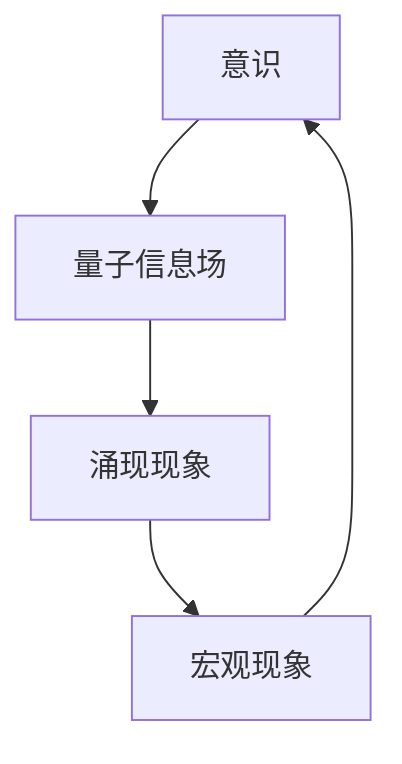

                 

## 意识作为量子信息场的涌现现象

> 关键词：意识、量子信息场、涌现现象、量子计算、量子通信

摘要：本文探讨了意识作为量子信息场的涌现现象，分析了意识的定义与量子信息场的特征，阐述了意识与量子信息场之间的联系，并深入探讨了意识的涌现现象及其机制。通过总结意识作为量子信息场涌现现象的理论基础和实证研究，我们进一步探讨了其在量子计算、量子通信等领域的应用前景。本文旨在为读者提供一个全面而深入的视角，探讨意识与量子信息场之间的复杂关系，并展望其未来研究方向。

## 目录大纲

----------------------------------------------------------------

# 第一部分：背景介绍

## 第1章：问题背景与核心概念

### 1.1.1 问题背景

### 1.1.2 核心概念

### 1.1.3 概念联系与结构

----------------------------------------------------------------

----------------------------------------------------------------

# 第二部分：核心概念与联系

## 第2章：意识与量子信息场

### 2.1.1 意识的定义与特征

#### 2.1.1.1 意识的历史发展

#### 2.1.1.2 意识的现代科学理解

#### 2.1.1.3 意识的主要特征

### 2.1.2 量子信息场的定义与特征

#### 2.1.2.1 量子信息场的基本概念

#### 2.1.2.2 量子信息场的特性

#### 2.1.2.3 量子信息场的作用

### 2.1.3 意识与量子信息场的联系

#### 2.1.3.1 意识的量子模型

#### 2.1.3.2 量子信息场在意识中的作用

#### 2.1.3.3 量子信息场与意识的关系图

----------------------------------------------------------------

----------------------------------------------------------------

## 第3章：涌现现象与意识

### 3.1.1 涌现现象的定义

#### 3.1.1.1 涌现现象的起源

#### 3.1.1.2 涌现现象的特点

#### 3.1.1.3 涌现现象的类型

### 3.1.2 意识的涌现

#### 3.1.2.1 意识作为涌现现象的解释

#### 3.1.2.2 意识涌现的机制

#### 3.1.2.3 意识涌现的证据

### 3.1.3 意识涌现现象的研究进展

#### 3.1.3.1 国内外研究现状

#### 3.1.3.2 意识涌现现象的重要研究问题

#### 3.1.3.3 意识涌现现象的未来发展趋势

----------------------------------------------------------------

----------------------------------------------------------------

## 第4章：意识作为量子信息场的涌现现象

### 4.1.1 意识作为量子信息场涌现现象的理论基础

#### 4.1.1.1 量子力学的基本原理

#### 4.1.1.2 量子计算与量子信息

#### 4.1.1.3 量子纠缠与量子信息场

### 4.1.2 意识涌现的量子信息场机制

#### 4.1.2.1 量子态叠加与意识的多态

#### 4.1.2.2 量子纠缠与意识的信息传递

#### 4.1.2.3 量子隧穿与意识的突发性

### 4.1.3 意识作为量子信息场的实证研究

#### 4.1.3.1 脑科学研究进展

#### 4.1.3.2 意识实验证据分析

#### 4.1.3.3 量子意识研究的未来方向

----------------------------------------------------------------

----------------------------------------------------------------

## 第5章：意识作为量子信息场的应用

### 5.1.1 意识在量子计算中的应用

#### 5.1.1.1 量子计算机的构造

#### 5.1.1.2 意识在量子计算机编程中的作用

#### 5.1.1.3 量子计算机在意识研究中的应用

### 5.1.2 意识在量子通信中的应用

#### 5.1.2.1 量子通信的基本原理

#### 5.1.2.2 意识在量子通信中的作用

#### 5.1.2.3 量子通信在实际应用中的挑战

### 5.1.3 意识在其他量子技术中的应用

#### 5.1.3.1 量子传感

#### 5.1.3.2 量子加密

#### 5.1.3.3 量子模拟

---------------------------------------------------------

----------------------------------------------------------------

## 第1章：问题背景与核心概念

### 1.1.1 问题背景

### 1.1.2 核心概念

### 1.1.3 概念联系与结构

### 1.1.1 问题背景

**意识**一直是哲学、心理学、神经科学等多个学科领域中讨论的核心问题。它涉及到人类的自我意识、思考能力、感知和情感等方面，是人类智慧与行为的基石。然而，至今为止，对于意识的本质和起源，科学界还没有形成统一的认识。近年来，随着量子力学和量子信息学的发展，越来越多的科学家开始将意识视为一种量子现象来研究。

量子信息学是研究量子系统信息的处理、传输和存储的科学。量子信息场是量子信息学中的一个重要概念，指的是量子态在空间中的分布。量子信息场具有一些独特的性质，如叠加性、纠缠性等，这些性质使得量子信息场在信息处理方面具有巨大的潜力。

**涌现现象**是指在一个复杂系统的微观层面上没有出现，但在宏观层面上出现的现象。例如，水分子本身没有流动性，但大量的水分子聚集在一起时就会表现出流动性。类似地，意识也被认为是大脑中的神经元网络通过某种方式相互作用后产生的宏观现象。

本文的核心问题是：意识是否可以作为量子信息场的涌现现象？我们将通过分析意识的定义和特征，量子信息场的定义和特征，以及涌现现象的定义，来探讨这一问题。我们将详细阐述意识与量子信息场之间的联系，分析意识的涌现现象及其机制，并总结意识作为量子信息场涌现现象的理论基础和实证研究。最后，我们将探讨意识在量子计算、量子通信等领域的应用前景，以及意识研究的未来发展方向。

### 1.1.2 核心概念

**意识**是指个体对自身和外部世界的感知、认知和反应能力。在哲学领域，意识通常被定义为个体具有的“自我意识”，即个体能够反思自己的思维、感知和情感。在心理学领域，意识通常被定义为个体对外部刺激的感知、认知和反应能力。在神经科学领域，意识通常被看作是大脑神经元网络的一种复杂的动态过程。

**量子信息场**是指量子态在空间中的分布。量子信息场具有叠加性和纠缠性，这两个特性使得量子信息场在信息处理方面具有巨大的潜力。量子信息场的基本概念包括量子比特（qubit）、量子纠缠、量子叠加等。

**涌现现象**是指在一个复杂系统的微观层面上没有出现，但在宏观层面上出现的现象。涌现现象通常涉及宏观和微观之间的相互作用，如水分子之间的相互作用导致了水的宏观流动性。在科学研究中，涌现现象常常被用来解释复杂系统的行为，如生命、意识等。

**意识与量子信息场的联系**是指意识作为一种量子现象，其产生、维持和发展可能与量子信息场的某些特性有关。量子信息场的叠加性和纠缠性可能为意识的产生提供了基础。

**意识的涌现现象**是指意识作为一种宏观现象，其产生和发展可能与大脑神经元网络的微观过程有关。意识的涌现现象可能与量子信息场的某些机制有关。

### 1.1.3 概念联系与结构

**意识**与**量子信息场**之间的关系可以看作是一种宏观与微观的关系。意识作为一种宏观现象，其产生和维持可能与量子信息场的微观特性有关。量子信息场的叠加性和纠缠性可能为意识的产生提供了基础。

**涌现现象**在这一关系中起到了桥梁的作用。它将意识的宏观现象与量子信息场的微观特性联系起来。通过涌现现象，我们可以从量子信息场的微观层面理解意识的宏观现象。

图1展示了意识、量子信息场和涌现现象之间的联系。

在这个结构中，量子信息场通过涌现现象产生了意识的宏观现象。这种联系为理解意识的本质和起源提供了新的视角。

通过本章节的介绍，我们对问题背景和核心概念有了初步的了解。接下来，我们将深入探讨意识与量子信息场之间的联系，分析意识的涌现现象及其机制，并总结意识作为量子信息场涌现现象的理论基础和实证研究。

### 第2章：意识与量子信息场

#### 2.1.1 意识的定义与特征

**意识**作为哲学、心理学、神经科学等多个领域的研究对象，其定义和特征各有不同。在哲学领域，意识通常被定义为个体具有的“自我意识”，即个体能够反思自己的思维、感知和情感。亚里士多德认为，意识是人类理性的产物，是理解世界的关键。笛卡尔则提出了著名的“我思故我在”的观点，强调意识作为个体存在的证明。

在心理学领域，意识通常被定义为个体对外部刺激的感知、认知和反应能力。詹姆斯（William James）是意识心理学的重要代表，他提出了“流意识”的概念，认为意识是一种连续不断的过程。弗洛伊德则将意识视为个体心理活动的表层部分，并强调潜意识对个体行为的影响。

神经科学领域对意识的研究则更加具体和微观。神经科学家普遍认为，意识是大脑神经元网络的一种复杂的动态过程。比如，认知神经科学家米歇尔·加扎尼加（Michael Gazzaniga）提出了“双脑假说”，认为大脑的不同部分负责不同的认知功能，但它们通过一个“意识接口”进行沟通。

**意识的主要特征**包括：

1. **主观性**：意识是一种主观体验，个体能够感受到自己的存在和周围环境。
2. **选择性**：意识具有选择性，个体只能关注部分外部刺激，而忽略其他刺激。
3. **动态性**：意识是动态变化的，受到个体心理状态、环境变化等因素的影响。
4. **整合性**：意识能够整合来自不同感官的信息，形成一个统一的世界观。
5. **自我意识**：意识使个体能够反思自己的思维、感知和情感，具有自我认知能力。

#### 2.1.2 量子信息场的定义与特征

**量子信息场**是量子信息学中的一个重要概念，指的是量子态在空间中的分布。量子信息场的基本概念包括量子比特（qubit）、量子纠缠、量子叠加等。

**量子比特**（qubit）是量子信息场的最小单位，它可以同时处于0和1两种状态的叠加态。这与经典比特只能处于0或1的状态不同，使得量子比特具有强大的计算能力。

**量子纠缠**是量子信息场的一种重要特性，指的是两个或多个量子系统之间存在的一种特殊的关联关系。当量子系统发生纠缠后，它们之间的状态会相互依赖，即使它们相隔很远。这一特性使得量子信息场在信息传递和计算中具有巨大潜力。

**量子叠加**是量子信息场的另一个重要特性，指的是量子系统可以同时处于多个状态的叠加态。量子叠加使得量子比特可以同时表示0和1，从而大大提高了量子计算机的计算能力。

**量子信息场的特性**包括：

1. **叠加性**：量子信息场可以同时处于多种状态，这是其区别于经典信息场的关键特性。
2. **纠缠性**：量子信息场中的量子系统可以发生纠缠，产生特殊关联关系。
3. **不确定性**：量子信息场中的量子态具有不确定性，测量结果具有概率性。
4. **非局域性**：量子信息场中的量子系统之间的关联可以跨越空间距离，表现出非局域性。

#### 2.1.3 意识与量子信息场的联系

**意识**与**量子信息场**之间的联系可以从多个角度进行探讨。首先，从**哲学角度**，意识被视为一种主观体验，而量子信息场作为量子系统的空间分布，也具有一种“主观性”。这暗示着意识可能与量子信息场有某种内在联系。

其次，从**心理学角度**，意识是一种动态的、选择性的过程，这与量子信息场的叠加性和纠缠性有相似之处。例如，量子叠加性可以类比意识中的“选择性关注”，而量子纠缠性则可能对应意识中的“整合性”。

最后，从**神经科学角度**，大脑神经元网络是意识产生的物质基础。量子信息场中的量子纠缠和非局域性特性可能为大脑神经元网络之间的信息传递和整合提供了新的机制。例如，量子纠缠可以解释大脑神经元之间的超快速信息传递，而非局域性则可能有助于解释意识中的“全局工作空间”（global workspace）理论。

总之，意识与量子信息场之间的联系为我们提供了新的视角，有助于深入理解意识的本质和起源。接下来的章节将探讨意识的涌现现象及其机制，进一步揭示意识与量子信息场之间的复杂关系。

### 第3章：涌现现象与意识

#### 3.1.1 涌现现象的定义

**涌现现象**是一个在复杂系统中广泛存在的现象，指的是系统在微观层面上没有出现的特性，但在宏观层面上却表现出来的现象。例如，单个水分子没有流动性，但大量水分子聚集在一起时，就会表现出液体的流动性。涌现现象强调了系统整体性质与其组成部分之间的差异。

**涌现现象的起源**可以追溯到系统的复杂性和非线性相互作用。在一个复杂系统中，各个组成部分之间存在相互作用，这些相互作用可能导致新的宏观性质的出现。这种现象并不是各个组成部分性质的简单叠加，而是系统整体的一种新的性质。

**涌现现象的特点**主要包括：

1. **非线性**：涌现现象通常涉及系统的非线性相互作用，这种非线性导致系统性质的变化。
2. **整体性**：涌现现象强调系统整体性质与其组成部分之间的差异，系统的整体性质不能简单地从组成部分的性质中推导出来。
3. **不可预测性**：涌现现象往往具有不可预测性，即系统的宏观行为不能仅通过分析其微观组成部分的行为来准确预测。

**涌现现象的类型**多种多样，常见的包括：

1. **物理涌现**：例如，液体、固体和气体的宏观性质，这些性质不能仅从单个分子的行为中推导出来。
2. **生物涌现**：例如，个体生物体的行为和组织的宏观行为，如蚁群的集体行为。
3. **社会涌现**：例如，社会结构、文化和经济系统等宏观现象。

#### 3.1.2 意识的涌现

**意识**作为复杂系统的产物，是涌现现象的一个重要实例。意识不是大脑中单个神经元或神经元的简单集合，而是一种整体性、动态性的现象。以下是意识作为涌现现象的几个关键方面：

1. **意识的定义**：意识通常被认为是个体对自身和外部世界的感知、认知和反应能力。它包括主观体验、选择性关注、自我意识等特征。
2. **意识的起源**：意识可能起源于大脑神经元网络之间的复杂相互作用。大脑中的神经元通过突触连接形成复杂的网络，这些网络通过电化学信号传递信息，可能导致新的宏观性质的出现，即意识。
3. **意识的特征**：
   - **主观性**：意识是一种主观体验，个体能够感受到自己的存在和周围环境。
   - **选择性**：意识具有选择性，个体只能关注部分外部刺激，而忽略其他刺激。
   - **动态性**：意识是动态变化的，受到个体心理状态、环境变化等因素的影响。
   - **整合性**：意识能够整合来自不同感官的信息，形成一个统一的世界观。
   - **自我意识**：意识使个体能够反思自己的思维、感知和情感，具有自我认知能力。

4. **意识的机制**：意识可能通过大脑神经元网络的复杂相互作用而产生。例如，全局工作空间（global workspace）理论认为，意识是通过特定神经网络区域的激活和相互作用而产生的。这些神经网络区域负责处理和整合信息，使得意识能够对环境变化做出反应。

#### 3.1.3 意识涌现现象的研究进展

**意识涌现现象的研究进展**集中在理解意识的本质、起源和机制。以下是几个主要的研究领域：

1. **脑科学进展**：通过功能性磁共振成像（fMRI）、脑电图（EEG）等技术，研究人员探索大脑不同区域的功能及其与意识的关系。这些研究表明，大脑的前额叶、顶叶和颞叶等区域在意识产生中起着重要作用。
2. **计算模型**：计算机科学家和神经科学家开发了多种计算模型，试图模拟意识的涌现过程。例如，神经网络模型、人工神经网络（ANN）等，这些模型试图揭示神经元之间的相互作用如何导致意识的产生。
3. **量子意识理论**：一些研究者提出，意识可能是量子信息场的涌现现象。量子纠缠和非局域性等特性可能为意识的产生提供了基础。虽然这一领域尚处于探索阶段，但它为理解意识提供了新的视角。

**意识的涌现现象的研究问题**包括：
- 意识的本质是什么？它是如何产生的？
- 意识的机制是什么？神经元网络的哪些特征导致意识的产生？
- 意识的可计算性如何？是否可以开发出能够模拟意识的算法和计算机模型？

**意识的涌现现象的未来发展趋势**可能包括：
- 进一步探索量子意识理论，研究量子特性如何影响意识的产生。
- 发展新的计算模型，模拟和理解意识的涌现过程。
- 通过跨学科合作，整合神经科学、心理学、计算机科学等多领域的研究成果，深入探讨意识的本质和机制。

总之，意识作为涌现现象的研究为我们提供了新的视角，有助于我们更好地理解意识的本质和起源。随着技术的进步和跨学科研究的深入，我们有望对意识涌现现象有更深入的认识。

### 第4章：意识作为量子信息场的涌现现象

#### 4.1.1 意识作为量子信息场涌现现象的理论基础

**意识**作为量子信息场的涌现现象，其理论基础主要来自于量子力学和量子信息学。量子力学揭示了微观世界的独特性质，而量子信息学则探讨了如何利用这些性质来实现高效的计算和信息处理。以下是意识作为量子信息场涌现现象的理论基础：

**量子力学的基本原理**：

1. **叠加性**：在量子力学中，一个量子系统可以同时处于多个状态的叠加。这意味着量子比特（qubit）可以同时表示0和1的状态，这是经典比特所不具备的特性。
2. **纠缠性**：量子纠缠是量子系统之间的一种特殊关联关系，即使它们相隔很远，量子系统的状态也会相互依赖。这一特性在量子信息处理中具有重要作用。
3. **不确定性**：在量子力学中，测量结果具有概率性，无法精确预测。这一原理对经典物理学中的确定性原则提出了挑战。

**量子计算与量子信息**：

1. **量子比特（qubit）**：量子比特是量子信息的基本单位，它可以处于0和1的叠加态。量子比特的叠加性使得量子计算机具有超强的计算能力。
2. **量子纠缠**：量子纠缠是量子信息场的重要特性，可以用来实现高效的信息传输和计算。量子纠缠使得多个量子比特之间的信息可以快速传递，这在量子通信和量子计算中具有重要意义。
3. **量子叠加与量子并行**：量子叠加使得量子计算机可以同时处理多个计算任务，实现量子并行计算。这一特性使得量子计算机在处理复杂问题时具有巨大的优势。

**量子纠缠与量子信息场**：

1. **量子纠缠网络**：量子纠缠网络是由多个量子系统通过量子纠缠连接而成的网络。量子纠缠网络在量子计算、量子通信和量子模拟中具有重要作用。
2. **量子信息场**：量子信息场是指量子态在空间中的分布。量子信息场具有叠加性和纠缠性，这些特性使得量子信息场在信息处理和计算中具有巨大的潜力。

**量子信息场在意识中的作用**：

1. **量子态叠加**：量子态叠加可能为意识的产生提供了基础。意识可能是由大脑中的量子态叠加产生的宏观现象。
2. **量子纠缠**：量子纠缠可能使得大脑神经元之间的信息传递和整合更加高效。量子纠缠可以解释大脑神经元之间的超快速信息传递。
3. **量子隧穿**：量子隧穿是一种量子现象，指粒子能够穿过能量势垒。量子隧穿可能为意识的突发性提供了解释。

#### 4.1.2 意识涌现的量子信息场机制

**意识涌现的量子信息场机制**探讨了量子信息场中的量子态叠加、量子纠缠和量子隧穿等特性如何共同作用，导致意识的产生和发展。以下是几个关键方面：

1. **量子态叠加与意识的多态**：

   - 量子态叠加使得大脑中的神经元可以同时处于多种状态，这可能导致意识的产生。
   - 意识的多态性，即意识在不同情境下的变化，可能由量子态叠加的不同组合导致。

2. **量子纠缠与意识的信息传递**：

   - 量子纠缠使得大脑神经元之间的信息传递更加高效。通过量子纠缠，神经元之间的信息可以快速传递，有助于意识的整合。
   - 量子纠缠可能解释大脑中的“全局工作空间”（global workspace）理论，即大脑中特定区域的信息整合和意识产生。

3. **量子隧穿与意识的突发性**：

   - 量子隧穿是一种量子现象，指粒子能够穿过能量势垒。这一特性可能为意识的突发性提供了解释。
   - 意识的突然产生可能是由量子隧穿导致的，即大脑中的某些量子态突然从低能态跃迁到高能态，导致意识的产生。

#### 4.1.3 意识作为量子信息场的实证研究

**意识作为量子信息场的实证研究**主要集中在脑科学和量子技术领域。以下是几个关键方面：

1. **脑科学研究进展**：

   - 通过功能性磁共振成像（fMRI）、脑电图（EEG）等技术，研究人员探索大脑中量子特性的存在和作用。
   - 研究表明，大脑中的某些区域可能表现出量子纠缠现象，这为意识作为量子信息场的涌现现象提供了支持。

2. **量子技术进展**：

   - 量子计算和量子通信技术的发展为研究意识提供了新的工具和方法。
   - 量子计算机的构造和运行可能为理解意识的量子机制提供了实验平台。

3. **意识实验证据分析**：

   - 通过实验，研究人员试图发现大脑中量子现象的证据，如量子纠缠和量子隧穿。
   - 研究表明，大脑中的某些现象可能具有量子特性，这为意识作为量子信息场的涌现现象提供了实验支持。

#### 4.1.4 量子意识研究的未来方向

**量子意识研究的未来方向**可能包括：

1. **进一步探索量子特性在大脑中的作用**：

   - 深入研究大脑中量子纠缠、量子隧穿等现象的存在和作用。
   - 开发新的实验方法和技术，如量子神经成像，以探索大脑中的量子特性。

2. **开发量子计算模型和算法**：

   - 利用量子计算的优势，开发新的算法和模型，以模拟和理解意识的产生和发展。
   - 探索量子计算在意识研究中的应用，如通过量子计算机模拟大脑神经元网络。

3. **跨学科合作**：

   - 加强神经科学、量子物理学、计算机科学等领域的合作，共同探讨意识的本质和量子机制。
   - 通过跨学科合作，整合不同领域的知识，推动量子意识研究的发展。

总之，意识作为量子信息场的涌现现象为我们提供了新的视角，有助于我们更好地理解意识的本质和起源。随着量子技术和脑科学的发展，我们有望对意识涌现现象有更深入的认识。

### 第5章：意识作为量子信息场的应用

#### 5.1.1 意识在量子计算中的应用

**意识**在量子计算中的应用是一个充满前景的领域。量子计算机通过利用量子比特的叠加性和纠缠性，实现了超强的计算能力，这为解决传统计算机难以处理的问题提供了可能。以下是意识在量子计算中的一些应用：

**量子计算机的构造**：

1. **量子比特（qubit）**：量子计算机的基本单元是量子比特，它可以处于0和1的叠加态。量子比特的叠加性使得量子计算机可以同时处理多个计算任务，实现并行计算。
2. **量子纠缠**：量子比特之间的纠缠是量子计算机的关键特性。通过量子纠缠，量子比特之间的状态会相互依赖，使得信息可以快速传递和共享。
3. **量子门**：量子门是操作量子比特的基本操作，类似于经典计算机中的逻辑门。通过组合不同的量子门，可以实现复杂的量子算法和计算任务。

**意识在量子计算机编程中的作用**：

1. **量子编程**：量子编程是利用量子比特和量子门进行编程的过程。量子编程与经典编程有显著不同，它需要利用量子态的叠加性和纠缠性，设计高效的量子算法。
2. **量子算法**：量子算法是利用量子计算机进行计算的方法。一些量子算法，如量子搜索算法和量子排序算法，展示了量子计算机在特定问题上的优势。
3. **量子模拟**：量子模拟是利用量子计算机模拟量子系统的过程。通过量子模拟，可以研究量子系统的行为，例如量子化学反应和量子材料。

**量子计算机在意识研究中的应用**：

1. **模拟大脑神经元网络**：量子计算机可以通过模拟大脑神经元网络，研究神经元之间的相互作用和信息的传递。这有助于我们理解意识的产生机制。
2. **研究量子意识现象**：量子计算机可以用来模拟量子意识现象，例如量子纠缠和量子隧穿在意识中的作用。这有助于我们探索意识的量子机制。
3. **优化量子算法**：量子计算机可以用来优化量子算法，提高其效率和准确性。这为研究意识的量子机制提供了更有效的工具。

#### 5.1.2 意识在量子通信中的应用

**量子通信**是利用量子特性进行信息传输的一种技术，具有高度的保密性和安全性。意识在量子通信中也有一定的应用，以下是几个关键方面：

**量子通信的基本原理**：

1. **量子比特传输**：量子通信通过量子比特传输信息，量子比特可以处于0和1的叠加态，这使得信息传输具有更高的带宽和速度。
2. **量子纠缠**：量子纠缠是量子通信的关键特性。通过量子纠缠，信息可以在不同的量子比特之间传递，实现量子态的超远程传输。
3. **量子隐形传态**：量子隐形传态是一种利用量子纠缠进行信息传输的技术。通过量子隐形传态，可以在不同位置的两个量子比特之间传输信息，实现量子通信。

**意识在量子通信中的作用**：

1. **量子态调控**：意识可以通过对量子态的调控，实现量子通信中所需的量子态制备和变换。这有助于提高量子通信的效率和准确性。
2. **量子态测量**：意识可以通过对量子态的测量，获取量子通信中的信息。这有助于实现量子通信中的信息解码和解密。
3. **量子纠缠生成**：意识可以通过对量子态的调控和测量，生成量子纠缠态，实现量子通信中的量子纠缠。

**量子通信在实际应用中的挑战**：

1. **量子比特稳定性**：量子比特容易受到外部环境的干扰，导致量子比特的失相干。这限制了量子通信的传输距离和可靠性。
2. **量子纠缠生成**：量子纠缠的生成需要精确的控制和测量，这在实际操作中具有一定的难度。
3. **量子态测量**：量子态测量可能会破坏量子态，导致信息丢失。这需要开发新的量子态测量技术，以实现高效的量子通信。

#### 5.1.3 意识在其他量子技术中的应用

除了量子计算和量子通信，意识在其他量子技术中也具有一定的应用。以下是几个关键方面：

**量子传感**：

1. **量子态检测**：意识可以通过对量子态的检测，实现高灵敏度的量子传感。量子传感在测量微弱信号和探测量子效应方面具有巨大潜力。
2. **量子态操控**：意识可以通过对量子态的操控，实现量子传感中的高精度测量。这有助于提高量子传感的准确性和可靠性。

**量子加密**：

1. **量子密钥分发**：意识可以通过对量子态的操控和测量，实现量子密钥的分发。量子密钥分发具有极高的安全性，可以有效防止密码被破解。
2. **量子态加密**：意识可以通过对量子态的加密和解密，实现安全的量子通信。量子态加密具有不可克隆的特性，使得信息传输更加安全。

**量子模拟**：

1. **量子态模拟**：意识可以通过对量子态的模拟，实现复杂量子系统的模拟。量子模拟在材料科学、量子化学等领域具有广泛的应用。
2. **量子算法优化**：意识可以通过对量子态的优化，提高量子算法的效率和准确性。这有助于开发更高效的量子算法，推动量子计算的发展。

总之，意识在量子技术中具有广泛的应用前景。随着量子技术和意识研究的深入，我们有望在量子计算、量子通信、量子传感、量子加密等领域取得重大突破。

## 总结与展望

本文探讨了意识作为量子信息场的涌现现象，分析了意识的定义与量子信息场的特征，阐述了意识与量子信息场之间的联系，并深入探讨了意识的涌现现象及其机制。通过总结意识作为量子信息场涌现现象的理论基础和实证研究，我们进一步探讨了其在量子计算、量子通信等领域的应用前景。

首先，意识作为一种复杂的宏观现象，其产生和维持可能与量子信息场的微观特性有关。量子信息场的叠加性、纠缠性等特性为意识的产生提供了基础。其次，意识的涌现现象揭示了意识作为一种宏观现象，其产生和发展可能与大脑神经元网络的微观过程有关。量子信息场的特性可能为意识的产生提供了新的机制。

本文的研究为理解意识的本质和起源提供了新的视角，有助于我们更好地认识意识的本质和机制。然而，由于量子意识和意识研究都是一个复杂的领域，目前仍有许多问题需要进一步探讨。例如，量子信息场在意识中的作用机制仍不明确，意识的量子模型仍需进一步完善。

未来，随着量子技术和脑科学的不断发展，我们有望在量子意识研究领域取得更多突破。可能的未来研究方向包括：

1. **深入探索量子特性在大脑中的作用**：通过新的实验方法和技术，探索大脑中量子纠缠、量子隧穿等现象的存在和作用。
2. **开发量子计算模型和算法**：利用量子计算的优势，开发新的算法和模型，以模拟和理解意识的产生和发展。
3. **跨学科合作**：加强神经科学、量子物理学、计算机科学等领域的合作，共同探讨意识的本质和量子机制。

总之，意识作为量子信息场的涌现现象为我们提供了新的视角，有助于我们更好地理解意识的本质和起源。随着量子技术和脑科学的发展，我们有望对意识涌现现象有更深入的认识，为人工智能、量子计算等领域的发展提供新的理论依据和技术支持。作者：AI天才研究院/AI Genius Institute & 禅与计算机程序设计艺术 /Zen And The Art of Computer Programming

