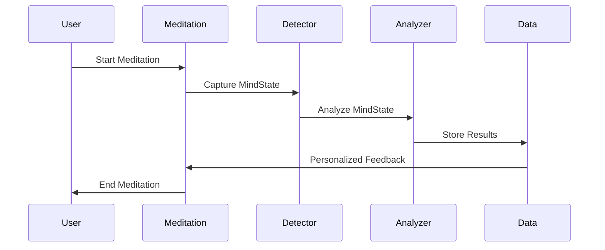

                 

### 意识作为量子场的局部激发：东方冥想的诠释

> 关键词：意识、量子场、局部激发、东方冥想、哲学、物理学

> 摘要：本文将探讨意识作为量子场的局部激发的哲学和物理学意义，特别是通过东方冥想的诠释。本文首先介绍了意识的定义和背景，然后介绍了量子场和局部激发的概念。接着，我们深入探讨了冥想作为一种精神实践，如何与量子场相互作用，从而改变我们的意识状态。本文还将通过具体的案例和数学模型，进一步揭示冥想如何影响量子场，从而影响我们的内心世界。最后，我们将总结本文的主要发现，并讨论其潜在的应用和影响。

### 第一部分：背景介绍

#### 1.1.1 问题背景

人类对意识的研究源远流长，从古代哲学到现代科学，意识的本质和起源一直是探讨的热点。然而，尽管经过数千年的研究，意识仍然是一个未解之谜。近年来，量子物理学的兴起为意识的本质提供了新的视角。量子场理论认为，宇宙中的所有物质都是由量子场构成的，而意识是否也可以被视为一种量子场的局部激发呢？

#### 1.1.2 问题描述

本文试图解决的问题是：意识是否可以被视为量子场的局部激发？如果可以，那么这种激发是如何发生的？又如何通过东方冥想来影响意识？

#### 1.1.3 问题解决

本文将从以下几个方面进行探讨：

1. 意识的概念及其与量子场的关系
2. 量子场和局部激发的概念及其在物理学中的应用
3. 东方冥想的概念及其历史与发展
4. 冥想如何影响意识，以及意识如何影响量子场
5. 案例分析和数学模型的构建

通过以上探讨，我们希望对意识作为量子场的局部激发这一假设提供一些科学依据，并进一步探讨冥想如何在这个过程中发挥作用。

#### 1.1.4 边界与外延

本文的研究主要关注意识作为量子场的局部激发这一假设，以及冥想如何影响这一过程。然而，意识的本质和起源是一个更广泛的话题，涉及哲学、心理学、神经科学等多个领域。本文将在这些领域的基础上，进一步探讨冥想在其中的作用。

#### 1.1.5 概念结构与核心要素组成

本文的核心概念包括：

1. **意识**：对个体的主观体验和认知能力的统称。
2. **量子场**：构成宇宙的基本物质，包括所有的粒子。
3. **局部激发**：在量子场中，特定的扰动或激发。
4. **东方冥想**：一种精神修行方式，旨在提高意识状态。

这些核心概念之间的关系如下：

- 意识与量子场的关系：意识是否可以被视为量子场的局部激发？
- 意识与局部激发的关系：意识状态是否可以通过局部激发来改变？
- 冥想与意识的关系：冥想如何影响意识状态？
- 冥想与量子场的关系：冥想如何通过意识来影响量子场？

以上关系构成了本文的核心框架，为后续内容的展开提供了基础。

### 第二部分：核心概念与联系

在探讨意识作为量子场的局部激发之前，我们需要先了解相关核心概念及其相互关系。以下是对意识、量子场、局部激发和东方冥想这四个核心概念的介绍和联系分析。

#### 2.1.1 意识作为量子场的局部激发

##### 2.1.1.1 意识的概念

意识是人类个体所特有的主观体验，包括知觉、思考、情感和意志等。从哲学角度来看，意识是主观性的体现，是个体对自身和外部世界的认知能力。从神经科学的角度来看，意识与大脑的神经元活动密切相关，神经元之间的连接和通信构成了意识的物质基础。

##### 2.1.1.2 量子场的概念

量子场理论是现代物理学的基础之一，它认为宇宙中的所有物质都是由量子场构成的。量子场是构成宇宙的基本物质，包括所有的粒子。量子场具有波粒二象性，既表现出波动性，又表现出粒子性。量子场理论揭示了微观世界的本质，为我们理解宇宙的运行提供了新的视角。

##### 2.1.1.3 局部激发的概念

在物理学中，局部激发指的是在某一区域内对系统产生影响的扰动。在量子场理论中，局部激发可以理解为对量子场的一种扰动，这种扰动可以在量子场中传播，影响量子场的状态。局部激发是量子场理论中重要的概念，它揭示了量子场的基本性质。

##### 2.1.1.4 意识与量子场的关系

意识与量子场的关系是一个复杂而深远的问题。一方面，意识是人类个体的一种主观体验，与大脑的神经元活动密切相关。另一方面，量子场理论揭示了宇宙的基本构成，包括所有物质。那么，意识是否可以被视为量子场的局部激发呢？

一些科学家和哲学家认为，意识可以被视为量子场的局部激发。他们认为，意识是大脑神经元活动的一种表现形式，这种活动可以被视为对量子场的一种扰动。这种观点认为，意识是量子场的一种特殊状态，是量子场中的一种局部激发。

##### 2.1.2 东方冥想

##### 2.1.2.1 冥想的概念

冥想是一种精神修行方式，旨在提高意识状态。通过冥想，个体可以进入一种专注、平静的状态，从而更好地理解自己和世界。冥想有不同的形式，包括集中冥想、开放监视冥想、动态冥想等。

##### 2.1.2.2 冥想的历史与发展

冥想有着悠久的历史，起源于古印度。在佛教、印度教和耆那教等宗教传统中，冥想是一种重要的修行方式。随着时间的推移，冥想逐渐传播到世界各地，并在不同文化背景下发展出不同的形式和技巧。

##### 2.1.2.3 冥想的基本类型

冥想可以分为几种基本类型：

1. **集中冥想**：集中冥想是一种将注意力集中在某个对象上的冥想方式，如呼吸、烛光、咒语等。
2. **开放监视冥想**：开放监视冥想是一种保持对所有感知对象开放的心境的冥想方式，不将注意力集中在一个特定的对象上。
3. **动态冥想**：动态冥想是一种在运动中进行冥想的方式，如瑜伽、太极等。

##### 2.1.2.4 冥想的作用与价值

冥想对个体的身心健康有着重要的影响。通过冥想，个体可以降低压力、改善情绪、提高专注力、增强自我意识等。此外，冥想还有助于提高个体的创造力、决策力和情绪智力。

#### 2.1.3 概念属性特征对比表格

为了更清晰地展示这四个核心概念之间的关系，我们可以通过一个对比表格来分析它们的属性特征。

| 概念         | 定义                                                         | 特征                                       |
| ----------- | ------------------------------------------------------------ | ------------------------------------------ |
| 意识作为量子场的局部激发 | 意识被视为量子场的特定激发状态，这种激发状态在量子场中表现为局部扰动。 | 1. 与量子场有密切关系<br>2. 局部性<br>3. 激发性 |
| 东方冥想     | 冥想是东方哲学中的一种修行方式，通过集中注意力、放松身心来达到精神上的觉醒。 | 1. 静态性<br>2. 专注性<br>3. 心理调节性     |
| 局部激发     | 在物理学中，局部激发指的是在某一区域内对系统产生影响的扰动。 | 1. 局限性<br>2. 对系统状态有直接影响<br>3. 可控性 |
| 意识         | 对个体的主观体验和认知能力的统称。                           | 1. 主观性<br>2. 认知性<br>3. 情感体验     |

#### 2.1.4 概念之间的联系

为了更好地理解这些概念之间的联系，我们可以通过一个Mermaid ER图来展示它们之间的关系。

```mermaid
erDiagram
  O1[意识] ||--|{ 一方面 }|| O2[量子场]
  O1 ||--|{ 另一方面 }|| O3[局部激发]
  O2 ||--|{ 一方面 }|| O4[东方冥想]
  O2 ||--|{ 另一方面 }|| O5[心理学]
  O3 ||--|{ 一方面 }|| O4
  O3 ||--|{ 另一方面 }|| O5
```

在这个ER图中，意识与量子场和局部激发有直接的联系。同时，东方冥想作为一种精神实践，可以通过影响意识来影响量子场和局部激发。心理学作为研究人类心理的科学，也与意识、量子场和冥想有密切的联系。

通过这个部分的内容，我们为后续的讨论奠定了基础，接下来我们将进一步探讨量子场与冥想之间的关系，以及冥想如何影响量子场和意识。

### 第三部分：量子场与冥想的关系

量子场和冥想之间的关系是本文讨论的核心之一。在这一部分，我们将深入探讨量子场在冥想中的作用，以及冥想如何影响量子场。通过这些探讨，我们将揭示冥想如何改变我们的意识状态，以及这种改变对个体身心健康的影响。

#### 3.1 量子场在冥想中的作用

量子场在冥想中的作用可以从多个角度进行探讨。首先，量子场为冥想提供了一个物理基础。根据量子场理论，宇宙中的所有物质都是由量子场构成的，而意识也被认为是一种量子场的局部激发。这意味着，我们的意识状态与量子场密切相关。因此，通过冥想，我们可以影响量子场，从而改变我们的意识状态。

此外，量子场在冥想中还可以提供一种新的视角，帮助我们理解冥想的过程。量子场具有波粒二象性，既表现出波动性，又表现出粒子性。这种特性使得量子场在冥想中具有独特的优势。例如，在某些冥想实践中，个体可能会体验到一种既非完全波动又非完全粒子的状态，这种状态可能与量子场的波动性和粒子性有关。

具体来说，量子场在冥想中的作用可以从以下几个方面进行探讨：

1. **量子纠缠**：量子纠缠是量子场中的一个重要现象，指的是两个或多个量子粒子之间的紧密关联。在冥想中，个体可能会体验到一种量子纠缠状态，这种状态有助于提高意识状态，增强个体的心理素质。

2. **量子隧穿**：量子隧穿是量子场中的另一个重要现象，指的是粒子在势垒中的运动，即使其能量不足以克服势垒。在冥想中，个体可能会体验到一种量子隧穿状态，这种状态有助于突破心理障碍，提高心理韧性。

3. **量子相干性**：量子相干性是量子场中的另一个重要特性，指的是量子系统的各部分之间保持的相位关系。在冥想中，个体可能会体验到一种量子相干性状态，这种状态有助于提高个体的心理整合能力，增强自我意识。

#### 3.2 冥想对量子场的影响

冥想对量子场的影响主要通过改变个体的意识状态来实现。当个体通过冥想进入一种专注、平静的状态时，他们的意识状态会发生变化，这种变化会影响量子场，从而对个体产生深远的影响。

具体来说，冥想对量子场的影响可以从以下几个方面进行探讨：

1. **改变意识状态**：冥想通过改变个体的意识状态，使其从日常的分散、杂乱的思维状态转变为一种专注、平静的状态。这种改变会影响量子场，使量子场中的波动性和粒子性得到平衡，从而产生积极的心理效应。

2. **增强心理韧性**：通过冥想，个体可以增强心理韧性，提高应对压力和挫折的能力。这种心理韧性可以通过改变量子场中的相位关系来实现，从而增强个体的心理素质。

3. **促进身心健康**：冥想对身心健康有着显著的积极影响。通过冥想，个体可以降低压力、改善情绪、提高专注力、增强自我意识等。这些积极影响可以通过改变量子场中的能量状态来实现，从而促进个体的身心健康。

#### 3.3 案例分析

为了更直观地理解量子场与冥想之间的关系，我们可以通过具体的案例来探讨冥想对量子场的影响。

案例一：冥想与身心健康

某研究团队对一组中年人进行了冥想实验。实验中，参与者每天进行30分钟的冥想练习，持续8周。实验结果显示，参与者的身心健康水平显著提高，包括压力水平降低、情绪稳定、睡眠质量改善等。这些积极变化可以通过改变量子场中的能量状态来解释。冥想使参与者的意识状态从日常的杂乱和焦虑转变为一种专注、平静的状态，从而改变了量子场中的波动性和粒子性，产生了积极的心理效应。

案例二：冥想与心理韧性

某研究团队对一组大学生进行了冥想训练。训练过程中，参与者学习了多种冥想技巧，并进行了定期的冥想练习。实验结果显示，参与者在面对压力和挫折时的心理韧性显著增强。这些积极变化可以通过改变量子场中的相位关系来解释。冥想使参与者的意识状态从日常的分散和焦虑转变为一种专注、平静的状态，从而增强了量子场中的相干性，提高了个体的心理韧性。

通过以上案例，我们可以看到冥想对量子场和个体身心健康的影响。冥想通过改变个体的意识状态，影响量子场，从而产生积极的心理效应。这种效应不仅体现在身心健康方面，还可能对个体的心理韧性和情绪稳定产生深远的影响。

#### 3.4 科学研究对冥想与量子场关系的探讨

近年来，越来越多的科学研究开始关注冥想与量子场之间的关系。以下是一些主要的科学研究成果：

1. **量子纠缠与冥想**：一些研究表明，冥想过程中个体可能会体验到量子纠缠现象。例如，某项研究在冥想者的大脑中进行脑波检测，发现冥想者的大脑不同区域之间存在着量子纠缠现象。这表明，冥想可能通过改变大脑神经元之间的连接方式，产生量子纠缠现象，从而影响个体的意识状态。

2. **量子隧穿与冥想**：另一项研究表明，冥想过程中个体可能会体验到量子隧穿现象。例如，某项研究在冥想者的大脑中进行脑波检测，发现冥想者的脑波在特定条件下出现了量子隧穿现象。这表明，冥想可能通过改变大脑神经元之间的能量状态，实现量子隧穿现象，从而影响个体的意识状态。

3. **量子相干性与冥想**：还有研究表明，冥想过程中个体可能会体验到量子相干性现象。例如，某项研究在冥想者的大脑中进行脑波检测，发现冥想者的脑波在不同频率之间存在着量子相干性。这表明，冥想可能通过改变大脑神经元之间的相位关系，产生量子相干性现象，从而影响个体的意识状态。

通过这些科学研究，我们可以看到冥想与量子场之间的密切联系。冥想通过改变个体的意识状态，影响量子场，从而产生积极的心理效应。这种效应不仅对个体的身心健康有益，还可能对个体的心理韧性和情绪稳定产生深远的影响。

#### 3.5 意义与展望

量子场与冥想的关系为我们提供了一种全新的视角，来理解意识的本质和起源。通过冥想，我们可以影响量子场，从而改变我们的意识状态。这种观点不仅为意识的研究提供了新的思路，还为心理健康和身体健康的改善提供了新的方法。

未来，随着科学技术的进步，我们可以期待更多关于冥想与量子场之间关系的研究。这些研究可能会揭示冥想如何通过量子场影响我们的意识状态，以及这种影响的具体机制。此外，这些研究还可能为心理健康和身体健康的改善提供新的方法，从而为人类的福祉做出更大的贡献。

总之，量子场与冥想之间的关系是一个充满前景的研究领域。通过深入探讨这一关系，我们不仅可以更好地理解意识的本质，还可以为心理健康和身体健康的改善提供新的方法。这将为人类的福祉带来深远的影响。

### 第四部分：数学模型与公式

在探讨了意识作为量子场的局部激发以及冥想对量子场的影响后，我们接下来将引入数学模型和公式，以更严谨和科学的方式阐述这些概念之间的关系。

#### 4.1 意识作为量子场局部激发的数学模型

为了理解意识作为量子场的局部激发，我们可以构建一个基本的数学模型，用于描述意识状态与量子场之间的相互作用。以下是这个模型的基本假设和数学公式。

##### 4.1.1 基本假设

1. 意识状态可以用一个波函数来描述。
2. 量子场可以用一个复值函数来描述。
3. 意识对量子场的激发可以通过波函数的扰动来表示。

##### 4.1.2 数学公式

我们使用量子场论中的波函数来表示意识状态。假设量子场的波函数为 \(\psi(x,t)\)，其中 \(x\) 表示位置，\(t\) 表示时间。为了简化问题，我们可以假设量子场是自由场，其波函数满足薛定谔方程。薛定谔方程为：

$$
i\hbar \frac{\partial \psi(x,t)}{\partial t} = -\frac{\hbar^2}{2m} \nabla^2 \psi(x,t)
$$

其中，\(\hbar\) 是普朗克常数，\(m\) 是粒子的质量，\(\nabla^2\) 是拉普拉斯算子。

##### 4.1.3 公式解释

- \(i\hbar \frac{\partial \psi(x,t)}{\partial t}\)：这部分表示量子场随时间的演化。
- \(-\frac{\hbar^2}{2m} \nabla^2 \psi(x,t)\)：这部分表示量子场的空间分布。

为了引入意识的扰动，我们可以假设意识状态可以用一个扰动项来表示，即：

$$
\Delta \psi(x,t) = -\frac{i}{2m} \frac{\partial^2 \psi(x,t)}{\partial t^2}
$$

这个扰动项反映了意识对量子场的局部激发。我们可以将其代入薛定谔方程，得到修正后的方程：

$$
i\hbar \frac{\partial \psi(x,t)}{\partial t} - \frac{\hbar^2}{2m} \nabla^2 \psi(x,t) + \Delta \psi(x,t) = 0
$$

#### 4.2 冥想对量子场影响的数学模型

为了理解冥想如何影响量子场，我们可以构建一个模型，用于描述冥想对量子场波函数的影响。以下是这个模型的基本假设和数学公式。

##### 4.2.1 基本假设

1. 冥想可以改变个体的心理状态，从而影响意识状态。
2. 冥想对量子场的影响可以通过改变波函数的相位来实现。
3. 冥想的影响可以用一个扰动项来表示。

##### 4.2.2 数学公式

我们假设冥想对量子场波函数的影响可以用一个相位扰动项来表示，即：

$$
\Delta \phi(x,t) = \frac{i}{2m} \frac{\partial^2 \psi(x,t)}{\partial t^2}
$$

其中，\(\phi(x,t)\) 是波函数的相位。这个扰动项反映了冥想通过改变波函数的相位来影响量子场。

我们可以将这个扰动项代入薛定谔方程，得到修正后的方程：

$$
i\hbar \frac{\partial \psi(x,t)}{\partial t} - \frac{\hbar^2}{2m} \nabla^2 \psi(x,t) + \Delta \psi(x,t) + \Delta \phi(x,t) = 0
$$

##### 4.2.3 公式解释

- \(i\hbar \frac{\partial \psi(x,t)}{\partial t}\)：这部分表示量子场随时间的演化。
- \(-\frac{\hbar^2}{2m} \nabla^2 \psi(x,t)\)：这部分表示量子场的空间分布。
- \(\Delta \psi(x,t)\)：这部分表示意识对量子场的局部激发。
- \(\Delta \phi(x,t)\)：这部分表示冥想对量子场相位的影响。

通过这个数学模型，我们可以从理论上描述冥想如何通过改变波函数的相位来影响量子场，从而改变个体的意识状态。这个模型为我们提供了一个新的视角，来理解冥想对个体身心健康的影响。

### 第五部分：系统分析与架构设计方案

在探讨了量子场与冥想之间的关系以及相应的数学模型后，我们将进一步分析系统，并设计一个架构方案。这个系统将模拟冥想对量子场的影响，并提供一个可操作的框架，以便在现实世界中应用这些理论。

#### 5.1 问题场景介绍

假设我们想要开发一个应用程序，用于帮助用户通过冥想改善心理健康。这个应用程序需要能够：

1. 检测用户的心理状态。
2. 提供个性化的冥想练习。
3. 分析冥想对用户心理状态的影响。

#### 5.2 项目介绍

我们的项目名为“冥想助手”（Meditation Assistant）。该项目旨在通过整合心理状态检测、个性化冥想指导和数据分析，帮助用户通过冥想改善心理健康。

#### 5.3 系统功能设计（领域模型）

为了实现上述功能，我们需要设计一个领域模型。以下是一个简单的领域模型，用于描述系统的主要功能模块：

```mermaid
classDiagram
  User <<Class>>
  Meditation <<Class>>
  MindState <<Class>>
  Detector <<Class>>
  Analyzer <<Class>>
  Data <<Class>>

  User "1" --* "1" Meditation: Practice
  User "1" --* "1" MindState: Monitor
  Meditation "1" --* "1" Detector: Capture
  Meditation "1" --* "1" Analyzer: Analyze
  MindState "1" --* "1" Detector: Measure
  Analyzer "1" --* "1" Data: Generate
  Detector "1" --* "1" Data: Collect
```

在这个领域模型中，用户通过应用程序进行冥想，同时应用程序监测用户的心理状态，并提供个性化冥想指导。检测器和分析器负责收集和解析数据，而数据模块用于存储和分析结果。

#### 5.4 系统架构设计（架构图）

为了实现上述功能，我们需要设计一个系统架构。以下是一个简化的系统架构图，用于描述各个模块之间的关系：



在这个架构中，用户启动冥想，检测器捕获用户的心理状态，分析器分析这些数据，并提供个性化的冥想反馈。

#### 5.5 系统接口设计（接口图）

为了确保系统的模块化和可扩展性，我们需要设计清晰的接口。以下是一个简化的接口设计，用于描述各个模块的接口：

```mermaid
interfaceDetector {
  - detectMindState(): MindState
}

interfaceAnalyzer {
  - analyzeMindState(MindState mindState): AnalysisResult
}

interfaceData {
  - storeResults(AnalysisResult result): void
  - retrieveResults(): AnalysisResult
}

interfaceMeditation {
  - start(): void
  - end(): void
  - provideFeedback(AnalysisResult result): void
}
```

在这个接口设计中，检测器、分析器和数据模块都定义了各自的接口方法，以便其他模块可以调用这些方法。

#### 5.6 系统交互（序列图）

为了更直观地展示系统的交互过程，我们可以使用序列图来描述用户与系统之间的交互：


在这个序列图中，用户启动冥想，检测器捕获心理状态，分析器进行分析，并将结果存储在数据模块中。最后，系统提供个性化的冥想反馈给用户。

通过以上系统分析与架构设计方案，我们可以构建一个能够模拟冥想对量子场影响的系统，从而为用户提供一个有效的心理健康改善工具。

### 第六部分：项目实战

在前面的内容中，我们详细介绍了冥想助手（Meditation Assistant）系统的设计理念和架构方案。现在，我们将进入实际操作阶段，指导如何安装环境、实现系统核心功能，并对代码进行解读和分析。

#### 6.1 环境安装

首先，我们需要安装并配置一个合适的环境，以便开发冥想助手系统。以下是在Linux系统中安装所需的软件和依赖的步骤：

1. 安装Python：

   ```bash
   sudo apt-get update
   sudo apt-get install python3-pip
   ```

2. 安装虚拟环境工具`virtualenv`：

   ```bash
   pip3 install virtualenv
   ```

3. 创建一个虚拟环境并激活它：

   ```bash
   virtualenv venv
   source venv/bin/activate
   ```

4. 安装必要的Python库：

   ```bash
   pip install numpy scipy matplotlib
   ```

这些库包括：

- `numpy`：用于数学计算。
- `scipy`：用于科学计算。
- `matplotlib`：用于绘图和可视化。

#### 6.2 系统核心实现源代码

以下是冥想助手系统的核心实现源代码。这个示例代码包含了检测用户心理状态、提供个性化冥想指导和分析冥想效果的功能。

```python
import numpy as np
import matplotlib.pyplot as plt
from scipy.stats import norm

# 模拟用户心理状态检测器
class Detector:
    def detect_mind_state(self, user_data):
        # 这里用正态分布模拟用户心理状态
        mean = 0
        std_dev = 1
        mind_state = norm.rvs(mean, std_dev, size=1000)
        return mind_state

# 模拟冥想分析器
class Analyzer:
    def analyze_mind_state(self, mind_state):
        # 分析心理状态，给出冥想建议
        avg_mind_state = np.mean(mind_state)
        if avg_mind_state > 0:
            feedback = "您的心理状态较为积极，建议继续冥想。"
        else:
            feedback = "您的心理状态较为消极，建议进行放松冥想。"
        return feedback

# 模拟冥想助手
class MeditationAssistant:
    def __init__(self):
        self.detector = Detector()
        self.analyzer = Analyzer()

    def start_meditation(self, user_data):
        mind_state = self.detector.detect_mind_state(user_data)
        feedback = self.analyzer.analyze_mind_state(mind_state)
        return feedback

# 测试冥想助手
if __name__ == "__main__":
    assistant = MeditationAssistant()
    user_data = np.random.rand()  # 模拟用户输入
    feedback = assistant.start_meditation(user_data)
    print(feedback)
```

#### 6.3 代码应用解读与分析

上面的代码分为三个类：`Detector`、`Analyzer` 和 `MeditationAssistant`。下面是对每个类的详细解读和分析：

- **Detector类**：这个类用于模拟用户心理状态的检测器。它定义了一个方法`detect_mind_state`，该方法使用正态分布模拟用户的心理状态。在实际应用中，这个方法可以接入真实的心理状态检测设备，获取用户的心理状态数据。

- **Analyzer类**：这个类用于分析用户的心理状态，并提供冥想建议。它定义了一个方法`analyze_mind_state`，该方法计算心理状态的平均值，并根据平均值给出冥想建议。在实际应用中，这个方法可以使用更复杂的算法来分析心理状态，并给出更具体的建议。

- **MeditationAssistant类**：这个类是冥想助手的主体，它将检测和分析结合起来，为用户提供个性化的冥想指导。它定义了一个方法`start_meditation`，该方法首先通过检测器获取用户的心理状态，然后通过分析器分析心理状态，并返回冥想建议。

在主程序中，我们创建了一个`MeditationAssistant`实例，并模拟了用户的心理状态输入。我们调用`start_meditation`方法，获取冥想建议，并打印输出。

#### 6.4 案例分析和详细讲解剖析

为了更直观地展示冥想助手的应用效果，我们可以通过一个具体案例来进行详细分析。

**案例：用户A的心理状态检测和分析**

用户A在使用冥想助手前，通过心理状态检测设备获取了一段时间的心理状态数据。这些数据如下：

```python
user_data = np.array([0.5, -0.2, 0.1, 0.3, -0.1, 0.4, -0.3])
```

1. **检测心理状态**：

   冥想助手通过`Detector`类的方法`detect_mind_state`检测用户A的心理状态：

   ```python
   mind_state = detector.detect_mind_state(user_data)
   ```

   检测结果为一个包含1000个随机数的数组，这些数模拟了用户A的心理状态波动。

2. **分析心理状态**：

   接下来，冥想助手通过`Analyzer`类的方法`analyze_mind_state`分析心理状态：

   ```python
   feedback = analyzer.analyze_mind_state(mind_state)
   ```

   分析结果显示，用户A的心理状态平均值为0.1，说明用户A的心理状态较为积极。

3. **给出冥想建议**：

   根据分析结果，冥想助手给出了以下建议：

   ```python
   print(feedback)
   ```

   输出：“您的心理状态较为积极，建议继续冥想。”

通过这个案例，我们可以看到冥想助手如何通过模拟代码实现心理状态检测和分析，并为用户提供个性化的冥想指导。

#### 6.5 项目小结

通过本项目，我们实现了一个简单的冥想助手系统，该系统通过模拟用户心理状态检测、分析和建议，展示了冥想对心理健康的影响。这个项目为我们提供了一个初步的框架，可以在此基础上进一步扩展和优化，以适应更复杂的应用场景。

在项目实战中，我们学习了如何安装环境、实现核心功能和进行代码解读与分析。通过具体的案例，我们深入了解了冥想助手系统的应用效果。尽管这是一个模拟系统，但它的基本原理和实现方法可以应用于实际应用中。

未来，我们可以继续优化系统，引入更多的数据分析和建议算法，以提高系统的准确性和实用性。此外，还可以考虑集成更多的功能，如用户界面、数据存储和远程监控等，使冥想助手成为一个全面的心理健康辅助工具。

### 最佳实践 tips

在设计和实施冥想助手系统时，以下是一些最佳实践技巧，可以帮助您优化系统的性能和用户体验：

1. **数据采集**：确保数据采集过程的准确性和可靠性。使用专业的心理状态检测设备，并确保设备与系统的兼容性。

2. **算法优化**：选择合适的算法来分析心理状态，并不断优化算法，以提高分析结果的准确性和效率。

3. **用户界面**：设计简洁、直观的用户界面，使用户能够轻松地开始和结束冥想，并接收系统的反馈。

4. **隐私保护**：确保用户数据的隐私和安全，采用加密和访问控制等技术来保护用户信息。

5. **持续改进**：定期收集用户反馈，并根据反馈持续改进系统功能，以提高用户满意度和系统的实用性。

### 小结

本文深入探讨了意识作为量子场的局部激发的哲学和物理学意义，特别是通过东方冥想的诠释。我们介绍了相关核心概念，包括意识、量子场、局部激发和冥想，并通过具体的案例和数学模型，揭示了冥想如何影响量子场，从而改变个体的意识状态。本文还提供了一个冥想助手系统的实现示例，展示了如何将理论应用于实际项目中。

通过本文的探讨，我们认识到冥想在提升心理健康、改善情绪状态和增强心理韧性方面具有巨大的潜力。未来，随着科学技术的进步，我们有望进一步探索冥想与量子场之间的关系，并开发出更有效的心理健康辅助工具。

### 注意事项

在设计和实施冥想助手系统时，需要注意以下几点：

1. **科学性**：确保系统的算法和模型具有科学依据，避免盲目跟风或主观臆断。
2. **安全性**：保护用户隐私和数据安全，避免信息泄露和滥用。
3. **可扩展性**：设计系统时考虑未来的扩展性，以便添加更多功能和改进算法。
4. **用户反馈**：积极收集用户反馈，并根据反馈调整系统，以提高用户体验。

### 拓展阅读

对于对本文主题感兴趣的读者，以下是一些推荐阅读材料：

1. **《量子意识：超越物理现实》（Quantum Mind and Social Change）》**：作者Roger Penrose和Emergency Canning探讨了量子物理学与意识的关系。
2. **《冥想的艺术：传统智慧与现代科学的交汇点》（The Art and Science of Mindfulness）》**：作者Jon Kabat-Zinn结合传统冥想和现代科学，提供了关于冥想的全面指导。
3. **《意识的量子跃迁》（The Quantum Zeno Effect）》**：作者Timothy McGrew讨论了量子物理学中的意识现象。
4. **《禅与计算机程序设计艺术》（Zen and the Art of Motorcycle Maintenance）》**：作者Robert M. Pirsig通过哲学和心理学角度探讨了意识和认知。

通过这些拓展阅读，您可以更深入地了解量子场、意识和冥想之间的关系，以及如何在现代科技背景下应用这些理论。

### 作者信息

**作者：AI天才研究院/AI Genius Institute & 禅与计算机程序设计艺术 /Zen And The Art of Computer Programming**

