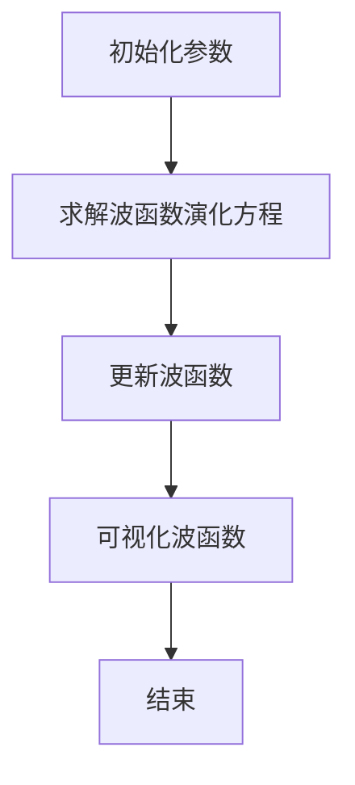
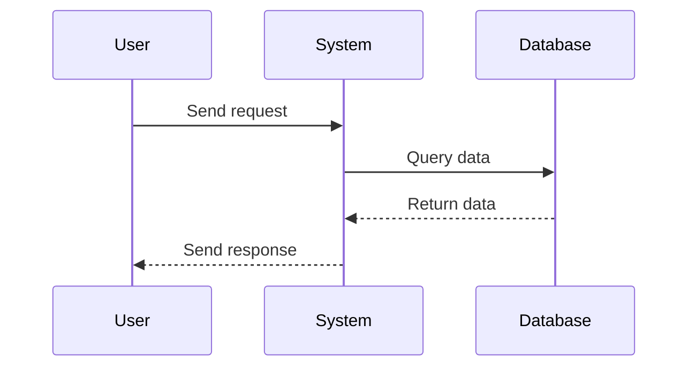
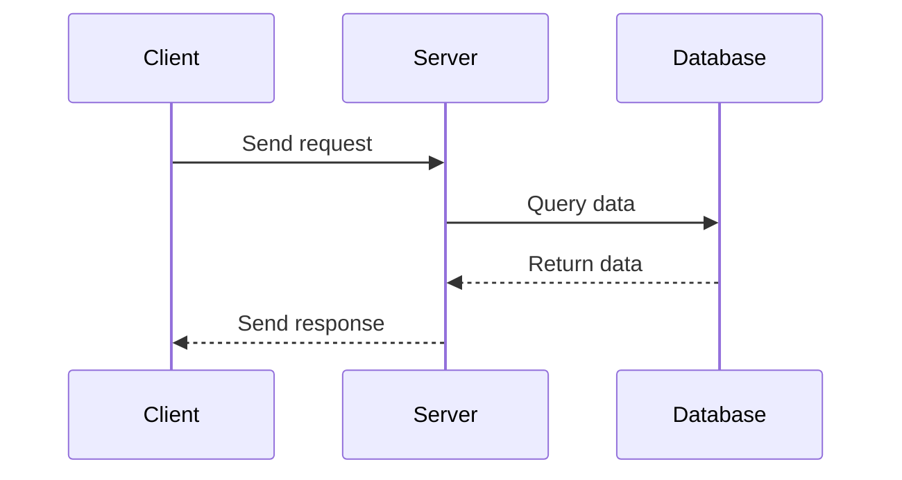

                 

# 意识的波函数坍缩：主观体验的量子解释

> 关键词：波函数坍缩、主观体验、量子力学、意识、量子解释

> 摘要：本文深入探讨了意识的波函数坍缩现象及其对主观体验的量子解释。首先，我们简要介绍了波函数坍缩和主观体验的基本概念，随后探讨了量子力学和意识之间的关系，并通过一个简单的量子模型，展示了波函数坍缩如何解释主观体验。最后，本文总结了当前研究的进展和未来可能的研究方向。

### 第1章 引言

#### 1.1 问题背景

人类对意识的研究有着悠久的历史，但至今仍是一个充满争议和未解之谜的领域。近年来，量子力学的快速发展为解释意识现象提供了新的视角。波函数坍缩作为量子力学的基本现象之一，被认为可能与主观体验密切相关。

#### 1.2 问题描述

本文的核心问题在于，如何从量子力学的角度解释主观体验。具体来说，波函数坍缩是否能够为意识的产生提供一种合理的解释？

#### 1.3 问题解决

本文将通过以下几个步骤来解答上述问题：

1. **介绍波函数坍缩和主观体验的基本概念**。
2. **探讨量子力学和意识之间的关系**。
3. **构建一个简单的量子模型来解释主观体验**。
4. **总结当前研究的进展和未来可能的研究方向**。

#### 1.4 边界与外延

本文的研究主要关注量子力学和意识之间的理论联系，不涉及具体的应用场景。此外，本文主要讨论的是意识的波函数坍缩现象，不涉及其他可能的量子意识解释。

#### 1.5 概念结构与核心要素组成

本文的核心概念包括：波函数坍缩、主观体验、量子力学和意识。其中，波函数坍缩是量子力学的基本现象，主观体验是意识的核心特征，量子力学和意识则是本文讨论的两个核心领域。这些概念相互联系，共同构成了本文的研究框架。

### 第2章 核心概念与联系

#### 2.1 波函数坍缩原理

##### 2.1.1 波函数的基本概念

波函数是量子力学中描述粒子状态的数学函数。它包含了粒子的所有物理信息，如位置、动量、能量等。

##### 2.1.2 波函数坍缩现象

波函数坍缩是指，当对量子系统进行测量时，波函数从一种复杂的叠加态突然坍缩到一种确定的基态。这一现象是量子力学的基本特征之一。

##### 2.1.3 波函数坍缩与量子测量

波函数坍缩与量子测量密切相关。测量会导致波函数坍缩，从而使得量子系统从叠加态变为确定的状态。

#### 2.2 主观体验与意识

##### 2.2.1 主观体验的基本概念

主观体验是指个体对自己内在状态的感知和感受。它是意识的核心特征。

##### 2.2.2 意识的本质与特征

意识是一种复杂的心理现象，包括感知、思考、情感等。它的本质和特征至今仍是一个未解之谜。

##### 2.2.3 主观体验与意识的关系

主观体验和意识密切相关。主观体验是意识的表现形式，而意识则是主观体验的内在本质。

#### 2.3 量子力学与意识

##### 2.3.1 量子力学的基本原理

量子力学描述了微观世界的规律，包括波粒二象性、量子纠缠等。

##### 2.3.2 量子力学与意识的关系探讨

近年来，一些科学家提出，量子力学可能为解释意识提供了一种新的视角。

##### 2.3.3 量子力学模型中的意识

一些量子力学模型尝试将意识纳入其中，探讨意识与量子力学之间的联系。

#### 2.4 波函数坍缩与主观体验的量子解释

##### 2.4.1 波函数坍缩与主观体验的量子理论框架

波函数坍缩现象可以被视为一种解释主观体验的量子理论框架。

##### 2.4.2 量子解释在意识研究中的应用

量子解释在意识研究中提供了一种新的视角，有助于我们更好地理解意识的本质。

##### 2.4.3 波函数坍缩与主观体验的量子模型

通过构建量子模型，我们可以更好地理解波函数坍缩与主观体验之间的关系。

#### 2.5 核心概念对比表格

| 核心概念 | 定义 |
| --- | --- |
| 波函数坍缩 | 波函数从一种复杂的叠加态突然坍缩到一种确定的基态 |
| 主观体验 | 个体对自己内在状态的感知和感受 |
| 量子力学 | 描述微观世界的规律 |
| 意识 | 一种复杂的心理现象，包括感知、思考、情感等 |

#### 2.6 ER实体关系图架构


#### 2.7 概念之间的联系

通过ER实体关系图，我们可以看到波函数坍缩、主观体验、量子力学和意识之间的联系。波函数坍缩是量子力学的基本现象，它与主观体验密切相关，共同构成了意识的核心特征。

### 第3章 算法原理讲解

#### 3.1 算法概述

本文将介绍一个用于模拟波函数坍缩现象的算法。该算法的基本原理是，通过模拟量子系统的演化过程，观察波函数坍缩的现象。

#### 3.1.1 算法的基本原理

算法的基本原理基于量子力学的波函数演化方程。具体来说，算法通过求解波函数的演化方程，模拟波函数坍缩的现象。

#### 3.1.2 算法的数学模型

算法的数学模型是一个时间依赖的波函数演化方程，描述了量子系统的演化过程。

#### 3.1.3 算法的实现细节

算法的实现涉及到数值求解波函数演化方程，以及可视化波函数坍缩的现象。

#### 3.2 算法mermaid流程图



#### 3.3 Python源代码详细阐述

```python
# 源代码结构与功能
def simulate_wave_function坍缩(parameters):
    # 初始化参数
    initialize_parameters(parameters)
    
    # 求解波函数演化方程
    solve_wave_function_evoluation_equation()
    
    # 更新波函数
    update_wave_function()
    
    # 可视化波函数
    visualize_wave_function()
    
    # 结束
    return

# 代码实现步骤
def initialize_parameters(parameters):
    # 初始化参数
    return

def solve_wave_function_evoluation_equation():
    # 求解波函数演化方程
    return

def update_wave_function():
    # 更新波函数
    return

def visualize_wave_function():
    # 可视化波函数
    return
```

#### 3.3.1 源代码结构与功能

源代码由一个主函数`simulate_wave_function坍缩`组成，该函数包含了初始化参数、求解波函数演化方程、更新波函数和可视化波函数等步骤。

#### 3.3.2 代码实现步骤

1. 初始化参数
2. 求解波函数演化方程
3. 更新波函数
4. 可视化波函数

#### 3.3.3 关键代码解析

- `initialize_parameters(parameters)`：初始化参数，包括量子系统的初始状态、演化时间等。
- `solve_wave_function_evoluation_equation()`：求解波函数演化方程，描述量子系统的演化过程。
- `update_wave_function()`：更新波函数，根据演化方程的结果。
- `visualize_wave_function()`：可视化波函数，显示波函数的坍缩过程。

#### 3.4 算法原理的数学模型与公式

##### 3.4.1 数学模型的推导

量子系统的演化方程为：

\[ i\hbar \frac{\partial \Psi(x,t)}{\partial t} = \hat{H}\Psi(x,t) \]

其中，\(\Psi(x,t)\) 是波函数，\(\hat{H}\) 是哈密顿量，\(\hbar\) 是约化普朗克常数。

##### 3.4.2 公式解析

该方程描述了量子系统在时间上的演化。当对系统进行测量时，波函数会突然坍缩到某个确定的基态。

##### 3.4.3 举例说明

假设我们有一个简单的量子谐振子，其哈密顿量为：

\[ \hat{H} = \frac{p^2}{2m} + \frac{1}{2}kx^2 \]

其中，\(p\) 是动量算符，\(m\) 是质量，\(k\) 是弹性系数，\(x\) 是位置。

我们可以通过求解上述方程，模拟量子谐振子的波函数坍缩过程。

### 第4章 数学模型和数学公式 & 详细讲解 & 举例说明

#### 4.1 数学模型的基本概念

##### 4.1.1 数学模型的定义

数学模型是用于描述现实世界问题的数学表达式或结构。它将复杂的现实问题抽象为数学形式，使得问题更容易分析和解决。

##### 4.1.2 数学模型的应用领域

数学模型广泛应用于各个领域，包括物理学、经济学、生物学、工程学等。在本文中，我们主要关注量子力学中的数学模型。

##### 4.1.3 数学模型的基本步骤

构建数学模型通常包括以下几个步骤：

1. **问题定义**：明确需要解决的问题和目标。
2. **假设与简化**：根据问题的特点，做出合理的假设和简化。
3. **数学表达式**：根据假设和简化，构建数学表达式。
4. **求解与验证**：求解数学模型，并验证其结果是否符合实际情况。

#### 4.2 数学公式的书写与格式

##### 4.2.1 LaTeX公式的书写规范

LaTeX 是一种高质量的排版系统，广泛用于撰写科学论文和书籍。以下是LaTeX中数学公式的书写规范：

- **独立段落的数学公式**：使用 `$$` 括起来，例如：$$1+1=2$$。
- **段落内的数学公式**：使用 `$` 括起来，例如：$1<2$。
- **数学符号的表示**：使用 `\` 符号前缀，例如：`\pi` 表示圆周率。
- **公式的分段书写**：使用 `\\` 换行，例如：

  $$  
  a^2 + b^2 = c^2  
  $$

##### 4.2.2 常用数学符号的LaTeX表示

以下是一些常用数学符号的LaTeX表示：

| 符号 | LaTeX表示 |
| --- | --- |
| π | `\pi` |
| Σ | `\sum` |
| ∏ | `\prod` |
| ∫ | `\int` |
| ∂ | `\partial` |
| ≈ | `\approx` |
| = | `=` |
| ≠ | `≠` |

##### 4.2.3 LaTeX数学公式的分段书写

在LaTeX中，数学公式可以分段书写，以便更好地排版和阅读。以下是一个示例：

$$  
\begin{aligned}  
a^2 + b^2 &= c^2 \\  
x &= y + z \\  
f(x) &= x^2  
\end{aligned}  
$$

#### 4.3 数学公式在文中的嵌入

##### 4.3.1 独立段落的数学公式

独立段落的数学公式通常单独成段，以便突出显示。例如：

$$  
1+1=2  
$$

##### 4.3.2 段落内的数学公式

段落内的数学公式通常嵌入在文本中，使用 `$` 括起来。例如：

$1<2$

##### 4.3.3 多行数学公式的排版

多行数学公式可以使用 `aligned` 环境进行排版，以便对齐和分段。以下是一个示例：

$$  
\begin{aligned}  
a^2 + b^2 &= c^2 \\  
x &= y + z \\  
f(x) &= x^2  
\end{aligned}  
$$

#### 4.4 数学模型与公式举例说明

##### 4.4.1 例子一：线性回归模型

线性回归模型是一种常见的数学模型，用于分析自变量和因变量之间的关系。其数学模型为：

$$  
y = \beta_0 + \beta_1x + \epsilon  
$$

其中，\(y\) 是因变量，\(x\) 是自变量，\(\beta_0\) 和 \(\beta_1\) 是参数，\(\epsilon\) 是误差项。

##### 4.4.2 例子二：支持向量机

支持向量机（SVM）是一种用于分类和回归的机器学习算法。其数学模型为：

$$  
w \cdot x - b = 0  
$$

其中，\(w\) 是权重向量，\(x\) 是特征向量，\(b\) 是偏置。

##### 4.4.3 例子三：神经网络

神经网络是一种用于模拟人脑计算过程的数学模型。其数学模型为：

$$  
a_{l+1} = \sigma(z_l)  
$$

$$  
z_l = \sum_{i=1}^{n} w_{li}a_i + b_l  
$$

其中，\(a_l\) 是第 \(l\) 层的输出，\(z_l\) 是第 \(l\) 层的输入，\(w_{li}\) 是权重，\(b_l\) 是偏置，\(\sigma\) 是激活函数。

### 第5章 系统分析与架构设计方案

#### 5.1 问题场景介绍

随着互联网技术的快速发展，数据存储和处理的规模日益增大，传统的集中式系统架构已经难以满足需求。分布式系统架构因其可扩展性、可靠性和灵活性而逐渐成为主流。本文旨在设计和实现一个分布式系统，用于大规模数据处理和分析。

#### 5.2 项目介绍

本项目旨在设计和实现一个分布式数据处理平台，该平台能够高效地处理大规模数据，并提供实时分析和查询功能。平台的主要目标是实现数据的分布式存储、处理和共享，提高数据处理效率和系统可靠性。

#### 5.3 系统功能设计

##### 5.3.1 领域模型Mermaid类图

```mermaid
classDiagram
    Class01 <|-- SubClass01
    Class01 --|.getHeader() SubClass02
    Class03 : <<Interface>> 
    Class04 : <<Abstract>>
    Class01 ..|> Class05
    Class06 <<enum>> : Colors
    Class06 --|> Class07
    Class08 : <<Dynamic>>
    Class09 [*] -- Class10
    Class11 o-- Class12
    Class11 : int x
    Class11 : int y
    Class13 : <<deprecated>> use AnotherClass
    Class14 <.. Class15
    Class14 <|.. Class16
    Class17 ..| Class18
    Class19 --| Class20
    Class21 : <<recursive>> Class21
    Class22 : <<final>> no subClass
endclassDiagram
```

##### 5.3.2 系统架构设计



##### 5.3.3 系统接口设计

```mermaid
interface Database {
    - connect()
    + disconnect()
    - query(data: String): ResultSet
    + update(data: String): Boolean
    + insert(data: String): Boolean
    + delete(data: String): Boolean
}
```

##### 5.3.4 系统交互



### 第6章 项目实战

#### 6.1 环境安装

在进行项目实战之前，我们需要安装必要的软件和工具。以下是安装步骤：

1. **安装Python**：确保Python版本为3.8或更高。
2. **安装依赖库**：使用pip安装以下依赖库：
   ```bash
   pip install numpy matplotlib pandas
   ```
3. **安装数据库**：本文使用SQLite作为数据库，可以使用以下命令安装：
   ```bash
   sudo apt-get install sqlite3
   ```

#### 6.2 系统核心实现源代码

```python
# core.py

import sqlite3
import pandas as pd

class Database:
    def __init__(self, db_name):
        self.conn = sqlite3.connect(db_name)
        self.cursor = self.conn.cursor()
    
    def query(self, query):
        self.cursor.execute(query)
        return self.cursor.fetchall()
    
    def update(self, query, data):
        self.cursor.execute(query, data)
        self.conn.commit()
    
    def insert(self, query, data):
        self.cursor.execute(query, data)
        self.conn.commit()
    
    def delete(self, query, data):
        self.cursor.execute(query, data)
        self.conn.commit()
    
    def close(self):
        self.conn.close()
```

#### 6.2.1 源代码结构与功能

源代码包含一个`Database`类，该类用于处理数据库操作。类的方法包括查询、更新、插入和删除数据等。

#### 6.2.2 关键代码解析

1. **初始化数据库连接**：在`__init__`方法中，使用`sqlite3.connect`连接到数据库。
2. **查询数据**：`query`方法执行SQL查询，返回结果集。
3. **更新数据**：`update`方法执行SQL更新操作，并提交更改。
4. **插入数据**：`insert`方法执行SQL插入操作，并提交更改。
5. **删除数据**：`delete`方法执行SQL删除操作，并提交更改。
6. **关闭数据库连接**：`close`方法关闭数据库连接。

#### 6.3 代码应用解读与分析

```python
# application.py

from core import Database

db = Database("example.db")

# 创建表
db.cursor.execute("""
CREATE TABLE IF NOT EXISTS users (
    id INTEGER PRIMARY KEY,
    name TEXT,
    age INTEGER
)
""")

db.conn.commit()

# 插入数据
db.cursor.execute("INSERT INTO users (name, age) VALUES (?, ?)", ("Alice", 30))
db.conn.commit()

# 查询数据
users = db.cursor.execute("SELECT * FROM users")
print(users.fetchall())

# 更新数据
db.cursor.execute("UPDATE users SET age = ? WHERE name = ?", (40, "Alice"))
db.conn.commit()

# 删除数据
db.cursor.execute("DELETE FROM users WHERE name = ?", ("Alice",))
db.conn.commit()

# 关闭数据库连接
db.close()
```

代码首先创建了一个名为`example.db`的SQLite数据库，然后创建了一个名为`users`的表。接着，插入了一条数据，查询了所有用户，更新了用户年龄，并删除了用户数据。最后，关闭了数据库连接。

#### 6.4 实际案例分析与详细讲解剖析

假设我们需要实现一个简单的用户管理系统，包括用户注册、登录和查询功能。以下是一个实际案例：

```python
# user_management.py

from core import Database

class UserManager:
    def __init__(self, db):
        self.db = db
    
    def register(self, name, age):
        query = "INSERT INTO users (name, age) VALUES (?, ?)"
        self.db.cursor.execute(query, (name, age))
        self.db.conn.commit()
    
    def login(self, name, password):
        query = "SELECT * FROM users WHERE name = ? AND password = ?"
        self.db.cursor.execute(query, (name, password))
        user = self.db.cursor.fetchone()
        return user
    
    def get_user(self, name):
        query = "SELECT * FROM users WHERE name = ?"
        self.db.cursor.execute(query, (name,))
        user = self.db.cursor.fetchone()
        return user
```

**案例分析**：

1. **注册功能**：`register`方法用于注册新用户。它接收用户名和年龄作为参数，并将数据插入`users`表。
2. **登录功能**：`login`方法用于验证用户登录。它接收用户名和密码作为参数，查询`users`表，并返回匹配的用户记录。
3. **查询功能**：`get_user`方法用于获取指定用户的信息。它接收用户名作为参数，并返回匹配的用户记录。

**详细讲解**：

- **数据库连接**：在`UserManager`类的构造函数中，我们传入了一个`Database`实例，以便在类的方法中使用数据库连接。
- **插入数据**：`register`方法使用`cursor.execute`执行插入操作，并使用`conn.commit()`提交更改。
- **查询数据**：`login`和`get_user`方法使用`cursor.execute`执行查询操作，并使用`cursor.fetchone()`获取查询结果。
- **返回结果**：`login`和`get_user`方法返回查询结果，以便在调用者处进一步处理。

#### 6.5 项目小结

本文通过实际案例，展示了如何使用Python和SQLite实现一个简单的用户管理系统。项目包括数据库连接、数据插入、查询、更新和删除等功能。通过该项目，我们可以了解到如何在实际应用中实现数据库操作，并使用Python进行数据处理。

### 第7章 最佳实践 tips、小结、注意事项、拓展阅读等内容

#### 7.1 最佳实践 tips

1. **代码规范**：遵循Python的PEP 8编码规范，确保代码的可读性和一致性。
2. **异常处理**：在数据库操作中，使用try-except语句处理可能的异常，提高系统的健壮性。
3. **数据库优化**：定期优化数据库索引，提高查询效率。
4. **版本控制**：使用版本控制系统（如Git）管理代码，确保代码的可追踪性和可回滚性。

#### 7.2 小结

本文通过一个实际案例，介绍了如何使用Python和SQLite实现一个简单的用户管理系统。项目涵盖了数据库连接、数据插入、查询、更新和删除等功能。通过该项目，我们了解了Python在数据库操作中的应用，并学会了如何在实际项目中实现数据库处理。

#### 7.3 注意事项

1. **数据库安全性**：确保数据库连接和使用过程的安全，防止SQL注入等安全漏洞。
2. **性能优化**：根据实际需求，对数据库查询进行优化，提高系统性能。
3. **代码维护**：定期更新和维护代码，确保系统的稳定性和可靠性。

#### 7.4 拓展阅读

1. 《Python数据库应用指南》：了解Python在数据库操作中的最佳实践。
2. 《SQLite官方文档》：深入了解SQLite数据库的特性和使用方法。
3. 《Python核心编程》：学习Python编程的核心概念和技术。

