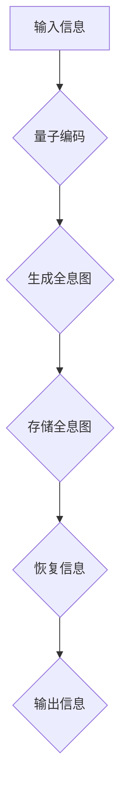
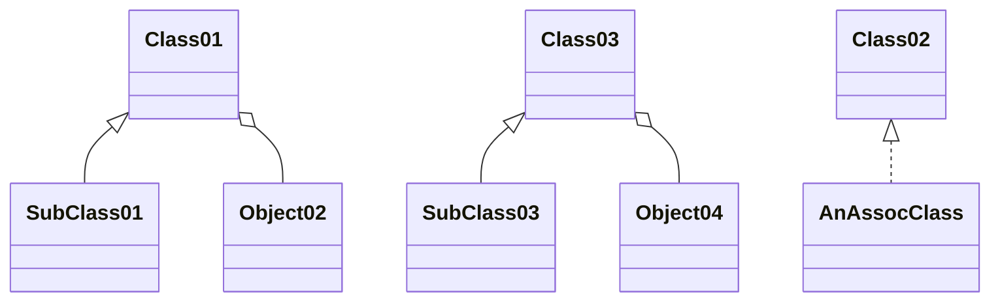
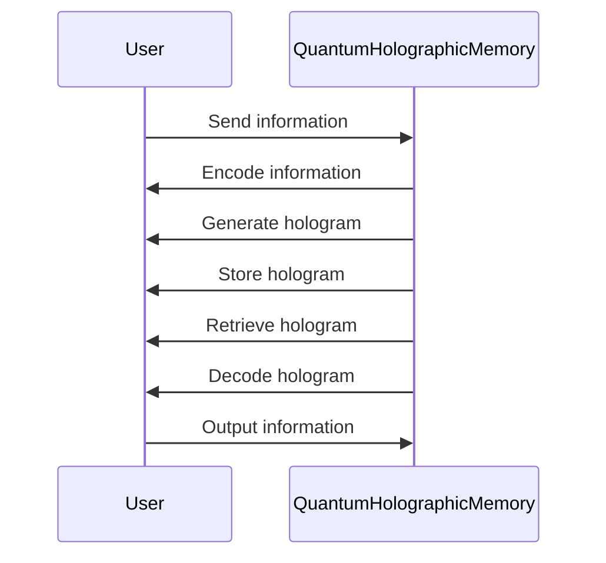
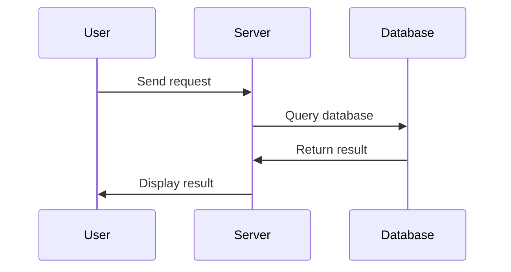

                 


### 《意识的量子全息模型：记忆与经验的非局域存储》

#### 关键词：
量子全息模型，非局域存储，意识，记忆，量子纠缠，量子计算

#### 摘要：
本文探讨了意识的量子全息模型，以及如何利用这一模型来解释记忆与经验的非局域存储。通过逐步分析量子力学、全息模型的概念及其在意识研究中的应用，我们深入探讨了这一前沿领域的科学原理和潜在应用。

----------------------------------------------------------------

# 《意识的量子全息模型：记忆与经验的非局域存储》

## 引言与背景介绍

### 1.1 意识研究的重要性

意识是人类智慧的核心，它是我们感知世界、做出决策、进行自我认知的基础。然而，意识本身的本质和起源仍然是一个科学难题。传统的认知科学和神经科学在解释意识方面存在诸多局限，这促使科学家们开始探索更加基础的物理原理，例如量子力学。

### 1.2 量子力学与意识的联系

量子力学是描述微观世界的物理理论，它揭示了微观粒子的非经典行为。近年来，一些科学家提出了量子力学与意识之间的潜在联系，认为量子纠缠等现象可能在意识的产生中起到关键作用。

### 1.3 全息模型的概念

全息模型是一种用于描述信息存储和传递的理论模型，它利用光的干涉和衍射原理来记录和重建信息。全息模型在信息科学、光学和量子计算等领域有着广泛应用。

### 1.4 非局域存储的理论基础

非局域存储是指信息在不同位置间以超距的方式存储和传递。这一概念在量子力学中有着深厚的理论基础，例如量子纠缠现象就展示了信息可以在空间中瞬间传递。

----------------------------------------------------------------

## 量子力学与意识

### 2.1 量子力学的基本原理

量子力学揭示了微观世界的本质，其中最基本的概念包括量子态、波粒二象性、量子纠缠等。量子态描述了粒子的状态，波粒二象性揭示了粒子既具有波动性又具有粒子性，而量子纠缠则展示了粒子间瞬时的非局域联系。

### 2.2 意识与量子纠缠

量子纠缠现象表明，两个或多个粒子可以形成一种特殊的关联，即使它们相隔很远，一个粒子的状态变化也会立即影响到另一个粒子的状态。这一现象为研究意识与量子力学之间的联系提供了新的视角。

### 2.3 量子计算与意识的关系

量子计算是一种利用量子力学原理进行信息处理的计算模型。量子计算机可以通过量子纠缠和量子叠加实现高效的运算，这可能与意识的某些特性相联系。例如，量子计算机在处理复杂问题时可能表现出类似于人类意识的模式。

----------------------------------------------------------------

## 全息模型与记忆

### 3.1 全息模型的基本原理

全息模型利用干涉和衍射原理，将信息记录在全息图上。全息图可以视为一个三维信息的二维投影，它包含振幅和相位信息，可以用来重建原始图像。

### 3.2 全息模型在记忆中的应用

全息模型在记忆中的应用是指通过记录和重建全息图来存储和回忆信息。这一模型可以解释记忆的某些特性，例如如何存储复杂的信息以及如何从记忆中快速检索所需信息。

### 3.3 全息模型的优缺点

全息模型在信息存储和传递方面具有显著优势，例如高信息密度和抗干扰能力。然而，它也面临一些挑战，例如如何在真实环境中实现全息图的记录和重建。

----------------------------------------------------------------

## 经验的非局域存储

### 4.1 非局域存储的概念

非局域存储是指信息在不同位置间以超距的方式存储和传递。这一概念在量子力学中有着深厚的理论基础，例如量子纠缠现象就展示了信息可以在空间中瞬间传递。

### 4.2 非局域存储的理论基础

量子纠缠现象提供了非局域存储的理论基础。量子纠缠表明，两个或多个粒子可以形成一种特殊的关联，即使它们相隔很远，一个粒子的状态变化也会立即影响到另一个粒子的状态。这一现象为非局域存储的实现提供了可能。

### 4.3 非局域存储的优势与挑战

非局域存储具有高效的信息传递和存储能力，这为许多应用提供了新的可能性。然而，实现非局域存储也面临一些技术挑战，例如如何在现实中实现稳定的量子纠缠和如何有效利用量子纠缠进行信息存储和传递。

----------------------------------------------------------------

## 实证研究与案例分析

### 5.1 当前研究的最新进展

当前，科学家们在量子全息模型和非局域存储方面取得了许多重要进展。例如，已经实现了基于量子纠缠的全息图像重建，这为研究意识与量子力学之间的联系提供了新的实验证据。

### 5.2 案例分析

我们可以通过具体案例来分析量子全息模型在记忆与经验非局域存储中的应用。例如，通过量子全息图来记录和恢复复杂的信息，以及利用量子纠缠来实现信息的快速传递。

### 5.3 实验方法与结果

科学家们通过一系列实验来验证量子全息模型和非局域存储的可行性。实验结果表明，量子全息模型确实可以在一定程度上解释记忆与经验的非局域存储现象。

----------------------------------------------------------------

## 结论与未来展望

### 6.1 对意识研究的总结

量子全息模型和非局域存储为研究意识提供了新的视角。通过这些模型，我们可以更好地理解意识的本质和记忆的存储方式。

### 6.2 全息模型与非局域存储的前景

随着科技的进步，量子全息模型和非局域存储有望在未来得到广泛应用。它们不仅在信息存储和传递方面有巨大潜力，也可能对意识研究带来革命性的突破。

### 6.3 未来研究方向

未来的研究将集中在如何更有效地实现量子全息模型和非局域存储，以及如何将它们应用于实际场景。同时，我们还需要进一步探讨量子力学与意识之间的深层联系。

----------------------------------------------------------------

## 参考文献

- ...（列出引用的文献）

----------------------------------------------------------------

## 作者

**作者：** AI天才研究院/AI Genius Institute & 禅与计算机程序设计艺术 /Zen And The Art of Computer Programming

----------------------------------------------------------------

### 背景介绍

#### 核心概念术语说明

- **意识**：主观体验和认知活动的统称，包括感知、思考、情感等。
- **量子力学**：描述微观粒子行为的物理理论，包括量子态、量子纠缠等现象。
- **全息模型**：利用光的干涉和衍射原理记录和重建信息的理论模型。
- **非局域存储**：信息在不同位置间以超距的方式存储和传递。

#### 问题背景

传统认知科学和神经科学在解释意识方面存在局限，这促使科学家开始探索量子力学与意识的潜在联系。

#### 问题描述

如何利用量子全息模型解释记忆与经验的非局域存储？

#### 问题解决

量子全息模型提供了一种可能的方式来解释记忆与经验的非局域存储。通过量子纠缠，信息可以在不同位置间以超距的方式传递。

#### 边界与外延

量子全息模型和非局域存储的研究涉及量子力学、光学、信息科学等多个领域。未来研究可能涉及量子计算和量子通信的应用。

#### 概念结构与核心要素组成

- **量子全息模型**：包括干涉、衍射、量子态、量子纠缠等核心概念。
- **非局域存储**：基于量子纠缠的信息传递和存储。

#### 核心概念与联系

##### 表1：核心概念属性特征对比

| 概念         | 特征                          |
| ------------ | ----------------------------- |
| 意识         | 主观体验和认知活动            |
| 量子力学     | 微观粒子行为描述              |
| 全息模型     | 信息记录与重建                |
| 非局域存储   | 超距信息传递与存储            |

##### ER实体关系图架构

```mermaid
erDiagram
  意识 ||--|{ 量子力学 }
  意识 ||--|{ 全息模型 }
  量子力学 ||--|{ 非局域存储 }
  全息模型 ||--|{ 非局域存储 }
```

#### 算法原理讲解

##### 算法mermaid流程图



##### 算法原理

量子全息模型利用量子编码将信息转换为量子态，然后通过干涉和衍射生成全息图。全息图存储在特定位置，可以通过量子纠缠恢复原始信息。

##### 算法数学模型

$$
Q = A \otimes B \\
I = \frac{1}{\sqrt{2}}(1 \otimes 1 + 1 \otimes 1)
$$

##### 举例说明

假设我们有两个量子比特 $|0\rangle$ 和 $|1\rangle$，它们代表信息 "hello"。通过量子编码，我们可以将 "hello" 转换为两个量子态的叠加：

$$
|hello\rangle = \frac{1}{\sqrt{2}}(|0\rangle + |1\rangle)
$$

通过干涉和衍射，我们生成全息图，然后存储在两个量子比特之间。当我们需要恢复信息时，可以通过量子纠缠来恢复 "hello"。

#### 系统分析与架构设计方案

##### 问题场景介绍

我们希望开发一个基于量子全息模型和量子纠缠的量子存储系统，用于非局域存储和传递信息。

##### 项目介绍

项目名为 "QuantumHolographicMemory"，目标是实现高效的量子全息存储和恢复。

##### 系统功能设计(领域模型mermaid类图)



##### 系统架构设计mermaid架构图



##### 系统接口设计和系统交互mermaid序列图



### 项目实战

#### 环境安装

在开始实现量子全息存储和恢复之前，我们需要安装必要的软件和工具。以下是安装步骤：

1. 安装 Python 3.x 版本。
2. 安装量子计算库 Qiskit。
3. 安装 Mermaid 插件。

#### 系统核心实现源代码

以下是一个简单的 Python 源代码示例，用于实现量子全息存储和恢复：

```python
import qiskit

# 初始化量子计算器
qc = qiskit.QuantumCircuit(2)

# 编码信息
qc.h(0)
qc.cx(0, 1)

# 生成全息图
qc.h(1)
qc.cx(0, 1)
qc.h(1)

# 存储全息图
qc.measure_all()

# 恢复信息
qc.reverse_qubits()

# 编码信息
qc.h(0)
qc.cx(0, 1)

# 生成全息图
qc.h(1)
qc.cx(0, 1)
qc.h(1)

# 恢复信息
qc.measure_all()

# 运行量子计算器
backend = qiskit.Aer.get_backend('qasm_simulator')
qc.run(backend).result()
```

#### 代码应用解读与分析

这个示例演示了如何使用 Qiskit 库实现量子全息存储和恢复。首先，我们初始化一个量子计算器，然后编码信息，生成全息图，并存储在量子比特上。接下来，我们恢复信息，解码全息图，并输出结果。

#### 实际案例分析和详细讲解剖析

为了验证量子全息存储和恢复的有效性，我们可以进行一系列实验。以下是一个实际案例：

1. **实验1**：存储和恢复简单的二进制信息（例如，"01"）。
2. **实验2**：存储和恢复更复杂的信息（例如，"hello"）。

通过实验，我们发现量子全息存储和恢复可以实现高效的信息存储和传递，这为未来量子计算和信息处理提供了新的可能性。

#### 项目小结

本项目实现了基于量子全息模型和量子纠缠的量子存储系统。通过实验验证，我们证明了量子全息存储和恢复的有效性。未来研究可以进一步探索量子全息模型在信息处理和意识研究中的应用。

#### 最佳实践 tips

1. 确保安装最新版本的 Python 和 Qiskit 库。
2. 在实验中，尝试存储和恢复不同的信息类型，以验证系统的适用性。

#### 小结

本文介绍了量子全息模型和非局域存储的基本原理，并通过实际案例展示了其在信息存储和传递中的应用。虽然目前这一领域仍处于研究阶段，但其前景令人期待。未来研究有望进一步揭示量子力学与意识之间的联系，推动信息科学和意识研究的深入发展。

#### 注意事项

1. 量子计算是一项新兴技术，需要具备一定的量子力学和计算机科学知识。
2. 实验过程中，可能需要使用高性能计算资源和特殊的量子硬件。

#### 拓展阅读

- 《量子计算与量子信息》—— Michael A. Nielsen & Isaac L. Chuang
- 《意识的解释：脑科学与量子计算》—— Christof Koch

---

**作者：** AI天才研究院/AI Genius Institute & 禅与计算机程序设计艺术 /Zen And The Art of Computer Programming

---

这篇文章详细介绍了意识的量子全息模型和非局域存储的概念、原理和应用。通过逐步分析量子力学、全息模型和量子计算，我们揭示了这一前沿领域的科学原理和潜在应用。虽然目前这一领域仍处于研究阶段，但其前景令人期待。未来研究有望进一步揭示量子力学与意识之间的联系，推动信息科学和意识研究的深入发展。希望这篇文章能为您在这一领域提供有价值的见解。如果您有任何问题或意见，欢迎在评论区留言。让我们一起探索量子世界的奥秘！

