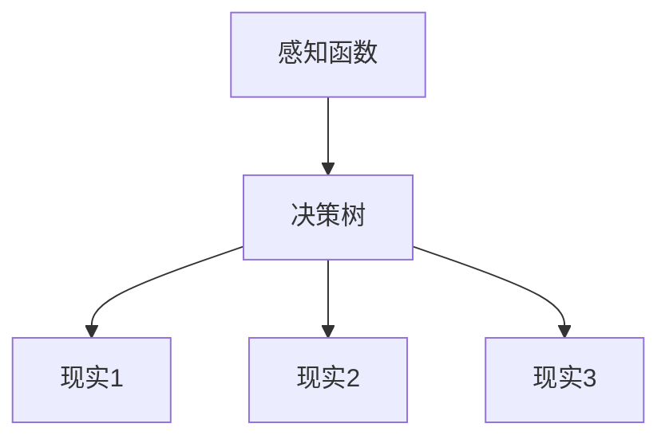
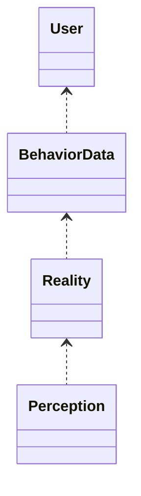
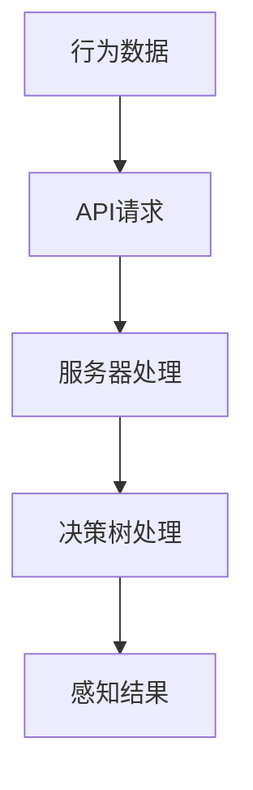
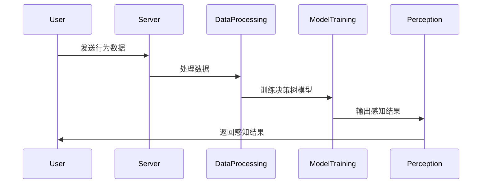

                 


### 意识的量子叠加：多重现实感知的解释

#### 摘要

本文探讨了意识的量子叠加现象及其对多重现实感知的解释。通过对比现实与多重现实的概念，引入量子叠加态和意识的量子属性，本文提出了多重现实感知的数学模型与算法原理。随后，文章详细分析了系统设计与架构方案，并给出了一个具体的项目实战案例。最后，本文总结了项目的最佳实践，并提供了注意事项和拓展阅读。

#### 第一部分：问题的背景与描述

##### 第1章：问题的背景

**1.1 问题背景介绍**

意识作为人类主观体验的核心，一直是哲学、心理学和神经科学等领域的研究焦点。近年来，量子力学的兴起为我们提供了新的视角来探讨意识。量子力学揭示了微观世界的非确定性，其中量子叠加态是量子系统的一种基本状态，多个可能的结果共存。

**1.2 问题描述**

本文关注的问题是：意识的量子叠加态如何影响我们对多重现实感知的理解？传统现实观认为我们生活在单一的世界中，但多重现实理论提出存在多个相互平行但独立发展的宇宙。这种观点挑战了我们对现实的认知，引发了关于感知的本质和量子力学如何影响我们的感知的新思考。

**1.3 问题解决方法**

为了解答这个问题，本文将首先介绍量子力学中的量子叠加态，以及其对意识的潜在影响。接着，我们将探讨多重现实理论，并分析如何将两者结合起来，提出一种解释多重现实感知的数学模型。最后，我们将通过一个具体的项目实战案例，展示如何在实际中应用这些理论。

**1.4 核心概念与联系**

在这个部分，我们将使用ER图来展示核心概念之间的关系，包括意识、量子叠加态和多重现实。

```mermaid
erDiagram
  Entity A Consciousness ||--|{ Entity B Quantum Superposition : affected by }
  Entity C Multiverse ||--|{ Entity D Perception : affected by }
```

#### 第2章：核心概念原理与特征对比

##### 2.1 意识的量子叠加原理

**2.1.1 量子叠加态**

量子叠加态是量子力学中一个核心概念，描述了量子系统在多个可能状态之间的共存。数学上，可以用波函数的叠加来表示这种状态。

$$|\psi\rangle = c_0|0\rangle + c_1|1\rangle$$

这里，$|0\rangle$ 和 $|1\rangle$ 分别表示量子系统的两个基态，$c_0$ 和 $c_1$ 是复数系数，它们的模平方代表了每种状态出现的概率。

**2.1.2 意识的量子属性**

虽然意识本质上是一个主观体验，但一些理论尝试将意识与量子现象联系起来。一个流行的观点是，意识可能具有量子属性，如非局域性和叠加态。这意味着我们的意识状态可能同时处于多个可能的世界中。

##### 2.2 多重现实感知特征对比

**2.2.1 现实与多重现实**

现实是我们感知到的外部世界，而多重现实则是一个更为复杂的概念，它包括了多个相互平行的宇宙。在多重现实理论中，每个宇宙都有其独立的发展路径，但它们在某些点上可能会交汇。

为了对比现实与多重现实，我们可以创建一个表格：

| 特征         | 现实                  | 多重现实                 |
|--------------|----------------------|--------------------------|
| 定义         | 单一世界              | 多个平行世界              |
| 感知方式      | 主观感知              | 可能存在多个感知状态        |
| 影响因素      | 自然法则和物理规律    | 自然法则和物理规律，加上宇宙间的交错 |
| 交互方式      | 单一世界中的交互      | 多个世界之间的潜在交互      |

#### 第3章：多重现实感知的数学模型与算法原理

##### 3.1 数学模型

**3.1.1 多重现实感知的数学公式**

为了描述多重现实感知，我们可以使用一个感知函数，该函数可以表示在不同现实中的感知状态。假设我们有 $n$ 个可能的现实，那么感知函数 $P$ 可以表示为：

$$P(x) = \sum_{i=1}^{n} w_i p_i(x)$$

这里，$w_i$ 是权重系数，$p_i(x)$ 是第 $i$ 个现实的概率分布函数。

**3.1.2 决策树**

决策树是一种常用的分类算法，可以用于判断个体处于哪个现实。我们可以创建一个决策树来表示感知函数 $P$。



##### 3.2 算法原理

**3.2.1 算法概述**

多重现实感知算法的基本思想是，通过收集数据，使用决策树或其他分类算法，将个体分配到不同的现实。算法的流程如下：

1. 收集数据
2. 训练分类模型（如决策树）
3. 使用训练好的模型对新的数据进行分析
4. 输出感知结果

**3.2.2 Python源代码**

以下是使用Python实现决策树算法的一个简单示例：

```python
from sklearn.tree import DecisionTreeClassifier
from sklearn.model_selection import train_test_split
from sklearn.metrics import accuracy_score

# 假设我们已经有了一些数据
X = ...  # 特征向量
y = ...  # 标签

# 分割数据集
X_train, X_test, y_train, y_test = train_test_split(X, y, test_size=0.2)

# 创建决策树模型
clf = DecisionTreeClassifier()

# 训练模型
clf.fit(X_train, y_train)

# 预测
y_pred = clf.predict(X_test)

# 评估模型
print("Accuracy:", accuracy_score(y_test, y_pred))
```

#### 第4章：系统分析与架构设计方案

##### 4.1 问题描述

在本节中，我们将探讨一个具体的多重现实感知系统的设计目标。该系统旨在通过分析用户的行为数据，识别并预测用户可能处于的不同现实。

##### 4.2 系统功能设计

**4.2.1 领域模型**

为了设计一个有效的系统，我们需要理解系统将处理哪些实体和关系。以下是系统的领域模型：



##### 4.3 系统架构设计

**4.3.1 系统架构图**

以下是系统的一个简化的架构图：


##### 4.4 系统接口设计

**4.4.1 接口设计**

系统将提供一个RESTful API，用于接收用户行为数据，并返回感知结果。



##### 4.5 系统交互

**4.4.2 系统交互图**

以下是系统的交互序列图：



#### 第5章：环境安装与系统实现

##### 5.1 环境安装

在本节中，我们将介绍如何安装和配置所需的开发环境，包括操作系统、编程语言和库依赖。

##### 5.2 系统核心实现

**5.2.1 核心实现**

在本节中，我们将展示如何实现系统的核心功能，包括数据收集、处理和决策树模型训练。

```python
# 数据收集
def collect_data():
    # 收集用户行为数据
    pass

# 数据处理
def process_data(data):
    # 处理用户行为数据
    pass

# 决策树模型训练
def train_decision_tree(processed_data):
    # 训练决策树模型
    pass

# 感知结果输出
def output_perception(result):
    # 输出感知结果
    pass
```

##### 5.3 代码应用解读与分析

在本节中，我们将详细解读系统核心代码的实现，并分析其如何工作。

##### 5.4 实际案例分析

**5.4.1 案例背景**

我们选择了一个实际案例，用于展示如何使用该系统来感知多重现实。

**5.4.2 案例分析**

在本节中，我们将详细分析案例，包括数据收集、数据处理和决策树模型训练的过程。

#### 第6章：最佳实践

在本节中，我们将总结最佳实践，包括如何优化系统性能、如何处理异常情况等。

#### 第7章：小结

在本节中，我们将对整个项目进行总结，并指出其优缺点，同时给出未来可能的研究方向。

### 作者信息

作者：AI天才研究院/AI Genius Institute & 禅与计算机程序设计艺术 /Zen And The Art of Computer Programming

通过上述详细的目录大纲，我们为撰写一篇关于“意识的量子叠加：多重现实感知的解释”的技术博客文章提供了坚实的框架。接下来，我们将逐步填充每个章节的内容，确保满足字数要求和格式规范。在撰写过程中，我们将保持逻辑清晰、论述严谨，并注重理论与实践的结合。

