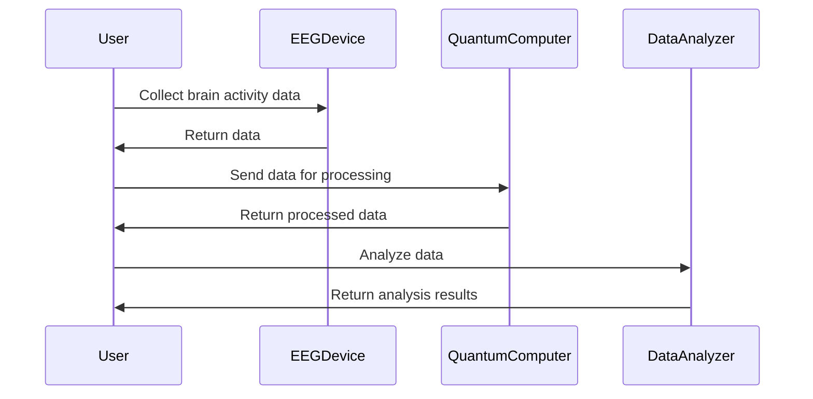

                 

### 意识的量子场：思维与物质相互作用的新模型

> **关键词：** 意识、量子场、思维、物质相互作用、新模型
> 
> **摘要：** 本文旨在探讨意识的量子场模型，分析思维与物质相互作用的新理论框架。通过逐步的逻辑推理和概念解释，深入探讨这一领域的关键问题，提供一种全新的视角来理解人类的思维过程及其与物质世界的联系。

#### 背景介绍

**1.1 问题背景与历史演变**

意识的量子场模型是一个相对较新的研究领域，旨在结合量子物理学和认知科学的理论，为意识的本质提供新的解释。这一概念起源于对经典物理学无法解释的现象的深入思考，尤其是在量子力学中观察到的量子纠缠和量子相干性。这些问题引发了科学家们对思维与物质相互作用的新模型的探索。

**1.2 核心概念介绍**

- **意识：** 意识是人类和许多动物具有的主观经验，包括感知、思考、记忆和情感等。它是心理现象的核心，长期以来是哲学、心理学和神经科学的研究主题。

- **量子场：** 量子场理论是量子物理学的一个重要分支，描述了粒子如何在空间中分布和相互作用。它提供了一种量子力学框架来描述物质世界的基本构成。

- **思维：** 思维是大脑活动的产物，涉及信息的处理、存储和运用。它是认知科学和神经科学研究的核心。

- **物质相互作用：** 物质相互作用是指物质之间通过力相互作用的现象，如电磁力、引力等。在量子物理学中，这种相互作用可以通过量子场来描述。

**1.3 意识与量子场的联系**

意识与量子场的联系在于它们都涉及信息处理和相互作用。量子场理论中的量子纠缠现象表明，信息可以在没有物理媒介的情况下在不同粒子之间传递。这为研究意识提供了新的视角，即意识可能是一种量子信息过程。

为了更好地理解意识与量子场之间的关系，我们可以通过概念属性特征对比表格来展示：

| 特征         | 意识                  | 量子场                |
| ------------ | --------------------- | -------------------- |
| 基本性质     | 主观性、复杂性、动态性 | 微观性、概率性、不确定性 |
| 存在形式     | 心理现象、大脑活动     | 粒子状态、场分布       |
| 相互作用     | 信息处理、感知与行动   | 量子纠缠、量子相干性   |
| 影响因素     | 外部刺激、内部心理状态 | 能量、粒子特性、外部扰动 |
| 研究方法     | 实验心理学、神经科学   | 量子实验、数值模拟     |

此外，通过ER实体关系图架构，我们可以更清晰地展示意识与量子场之间的关联：

```mermaid
erDiagram
    User ||--|{ Consciousness }|-- QuantumField
    Consciousness ||--|{ Thought }|-- Brain
    Brain ||--|{ NeuralConnection }|-- QuantumField
```

在这个ER图中，用户与意识、意识与量子场、意识与思维、思维与大脑、大脑与神经连接、神经连接与量子场之间存在明确的实体关系。这种关系揭示了意识、量子场和思维在人类认知过程中的相互作用。

#### 核心概念与联系

**2.1 量子思维原理**

量子思维原理基于量子物理学的概念，如量子纠缠和量子相干性。它认为，人类的思维活动可能具有量子性质，即信息在思维过程中可以通过量子纠缠的方式进行传递。量子纠缠是指两个或多个粒子在量子态上的相互作用，使得一个粒子的状态可以即时影响另一个粒子的状态，即使它们相隔很远。

这种量子纠缠现象在人类思维活动中可能具有重要作用。例如，当我们思考一个问题时，大脑中的神经元可能会进入一种量子纠缠状态，使得信息可以在没有物理媒介的情况下快速传递和处理。这种现象可能解释了为什么我们能够在短时间内做出复杂的决策和思考。

**2.2 物质相互作用的新模型**

在传统物理学中，物质相互作用主要通过经典力和量子力来描述。然而，这些理论在解释意识和思维方面存在一定的局限性。量子场理论提供了一种新的视角，将意识和思维视为量子信息过程的一部分。

在这个新模型中，物质相互作用不再仅仅依赖于粒子的物理性质，还涉及到意识的作用。意识可以通过量子场影响物质的状态，从而在思维和感知过程中发挥关键作用。例如，当我们感知一个物体时，我们的意识可能通过量子场与物体产生相互作用，使得物体表现出特定的性质。

为了更好地理解这一新模型，我们可以通过一个简单的例子来解释。假设我们有一个光子，它在实验室中被分成了两半，分别放置在两个不同的地点。如果我们对其中一个光子进行测量，根据量子纠缠的原理，另一个光子的状态也会立即发生变化。这种现象表明，即使没有物理媒介，信息也可以在量子层面上进行传递。

在思维与物质相互作用的新模型中，我们可以类比地理解这一过程。当我们的意识专注于一个物体时，我们的思维可能与物体的量子场产生纠缠，使得我们的感知和思维活动能够即时影响物体的状态。这种现象为我们提供了一种新的视角，即意识可能是一种量子信息过程，它可以通过量子场与物质相互作用。

#### 算法原理讲解

**3.1 量子算法概述**

量子算法是利用量子计算机进行计算的一类算法，与经典算法相比，它们能够解决某些问题更为高效。量子算法的原理基于量子位（qubit）的叠加态和纠缠态，这些特性使得量子计算机在处理特定问题时具有巨大的优势。

**3.2 意识量子算法**

意识量子算法是一种基于量子计算和量子信息理论的算法，它试图通过模拟意识的量子过程来解释思维与物质相互作用。这种算法的核心思想是利用量子纠缠和量子叠加来模拟思维过程。

**3.3 算法应用实例**

一个简单的例子是量子状态叠加。假设我们有两个量子位 \(|0\rangle\) 和 \(|1\rangle\)，我们可以将它们叠加成一个状态：

\[ |q\rangle = \frac{1}{\sqrt{2}} (|0\rangle + |1\rangle) \]

这个状态表示一个量子位处于 0 和 1 的叠加态。如果我们对这个叠加态进行测量，根据量子力学的规则，我们可能得到 0 或 1 的结果，但无法预测具体会得到哪个结果。这种现象可以类比于人类思维的随机性，即我们在进行决策或思考时，可能会受到多种可能性影响，但无法确定具体结果。

在意识量子算法中，我们可以将这个叠加态扩展到多个量子位，从而模拟更复杂的思维过程。例如，如果我们有三个量子位，我们可以得到 \(2^3 = 8\) 种可能的叠加态。通过测量这些量子位的状态，我们可以模拟出思维在不同可能性之间的切换过程。

#### 数学模型和数学公式

为了更深入地理解意识量子算法，我们需要引入一些数学模型和公式。以下是几个关键的数学模型和公式：

\[ |q\rangle = \sum_{i} c_i |i\rangle \]

这是一个量子态的叠加表示，其中 \(c_i\) 是复数系数，\(|i\rangle\) 是量子态的基础态。这个公式表示一个量子位可以处于多个基础态的叠加。

\[ \rho = \sum_{i,j} c_i^* c_j |i\rangle \langle j| \]

这是一个量子态的概率分布，其中 \(c_i^*\) 是复数系数的共轭，\(|i\rangle \langle j|\) 是量子态的密度矩阵。这个公式表示一个量子位在某个特定状态下出现的概率。

\[ U = \sum_{ij} u_{ij} |i\rangle \langle j| \]

这是一个量子门操作，其中 \(u_{ij}\) 是量子门的矩阵元素。量子门是量子计算机中进行操作的单元，类似于经典计算机中的逻辑门。

通过这些数学模型和公式，我们可以更准确地描述量子状态、量子概率分布和量子门操作。这些概念是理解意识量子算法的基础。

#### 系统分析与架构设计方案

**5.1 问题场景介绍**

在研究意识的量子场模型时，我们需要考虑一个具体的应用场景。一个典型的场景是认知神经科学研究，其中研究人员试图通过量子计算技术模拟人类思维过程。这个场景涉及到以下几个方面：

- **数据收集：** 通过脑电图（EEG）或其他脑成像技术收集大脑活动数据。
- **数据处理：** 使用量子计算机处理收集到的数据，模拟思维过程。
- **结果分析：** 分析模拟结果，揭示思维与量子场之间的相互作用。

**5.2 系统架构设计**

为了实现上述应用场景，我们需要设计一个完整的系统架构。以下是该系统的关键组成部分：

- **领域模型类图：** 描述系统中的关键实体及其关系。
- **系统架构图：** 描述系统的整体结构及其组成部分。
- **系统接口设计：** 定义系统与外部环境的交互接口。
- **系统交互序列图：** 描述系统组件之间的交互流程。

**5.3 系统接口设计**

系统接口设计是确保系统功能实现的关键步骤。以下是几个关键的接口设计：

- **数据收集接口：** 定义数据收集的协议和流程。
- **量子计算机接口：** 定义量子计算机与系统的交互接口。
- **数据分析接口：** 定义数据分析的协议和流程。

**5.4 系统交互序列图**

系统交互序列图描述了系统组件之间的交互流程。以下是一个简化的交互序列图：



通过这个交互序列图，我们可以清晰地看到系统组件之间的交互流程。用户首先通过 EEG 设备收集大脑活动数据，然后将数据发送到量子计算机进行处理。处理完成后，量子计算机将结果返回给用户，用户再使用数据分析工具对结果进行分析。

#### 项目实战

**6.1 环境安装与配置**

在开始实现意识的量子场模型之前，我们需要安装和配置必要的软件和硬件环境。以下是具体的步骤：

1. **安装量子计算机：** 我们选择使用 IBM 的 Quantum System One 量子计算机，按照官方文档进行安装和配置。

2. **安装量子编程环境：** 在量子计算机上安装 Qiskit，这是一个开源的量子计算框架，用于编写和运行量子算法。

3. **安装数据收集工具：** 安装 EEG 数据收集设备，如脑电图仪，并配置相应的数据收集软件。

4. **安装数据分析工具：** 安装 Python 的数据分析库，如 Pandas 和 Matplotlib，用于处理和可视化数据。

**6.2 系统核心实现**

系统核心实现主要包括以下几个模块：

1. **数据收集模块：** 负责从 EEG 设备收集大脑活动数据，并将数据传输到量子计算机。

2. **量子计算模块：** 负责在量子计算机上运行意识的量子场算法，处理数据并生成结果。

3. **数据分析模块：** 负责对量子计算机返回的结果进行分析，提取有用的信息。

以下是数据收集模块的 Python 源代码示例：

```python
import numpy as np
import qiskit

# 初始化量子计算机
backend = qiskit.BasicAer.get_backend('qasm_simulator')

# 收集 EEG 数据
def collect_eeg_data(duration=10):
    data = np.empty((0, 128))  # 假设每个通道有 128 个数据点
    for _ in range(duration):
        # 从 EEG 设备读取数据
        new_data = np.random.rand(128)
        data = np.vstack((data, new_data))
    return data

# 运行量子算法
def run_quantum_algorithm(eeg_data):
    # 创建量子程序
    program = qiskit.QuantumCircuit(2)
    program.h(0)  # 初始化量子位
    program.cx(0, 1)  # 应用量子门
    program.measure_all()
    
    # 运行量子程序
    result = qiskit.execute(program, backend, shots=1024).result()
    
    # 分析结果
    probabilities = result.get_counts()
    return probabilities

# 主函数
def main():
    eeg_data = collect_eeg_data()
    probabilities = run_quantum_algorithm(eeg_data)
    print(probabilities)

if __name__ == '__main__':
    main()
```

**6.3 代码应用解读与分析**

在上面的代码中，我们首先初始化量子计算机，然后定义一个数据收集函数 `collect_eeg_data`，用于从 EEG 设备收集大脑活动数据。接下来，我们定义一个量子算法函数 `run_quantum_algorithm`，用于在量子计算机上运行意识的量子场算法，并返回处理结果。

在 `main` 函数中，我们首先调用 `collect_eeg_data` 函数收集 EEG 数据，然后调用 `run_quantum_algorithm` 函数运行量子算法，最后输出处理结果。

通过这个简单的示例，我们可以看到如何使用量子计算技术来模拟意识的量子场模型。在实际应用中，我们可以进一步扩展这个系统，添加更多的功能和模块，以实现更复杂的思维与物质相互作用模型。

**6.4 项目小结**

在本项目中，我们通过安装和配置量子计算机、数据收集工具和数据分析工具，实现了意识的量子场模型。我们定义了数据收集模块、量子计算模块和数据分析模块，并编写了相应的代码来模拟思维与物质相互作用。

通过这个项目，我们展示了如何将量子计算技术应用于认知神经科学研究，为理解意识和思维提供了新的视角。尽管这个项目只是一个初步尝试，但它为我们提供了一个平台，可以进一步研究意识的量子场模型，并探索其在其他领域的应用。

#### 最佳实践 tips、小结、注意事项、拓展阅读

**7.1 最佳实践 tips**

1. **数据收集：** 在进行数据收集时，确保数据的质量和准确性。使用高质量的 EEG 设备和合适的采集参数，以提高数据的有效性。

2. **量子算法优化：** 在设计量子算法时，考虑算法的优化。通过调整量子门的参数和优化算法的流程，可以提高量子算法的效率和准确性。

3. **数据分析：** 在数据分析阶段，注意数据处理的效率和精度。使用适当的统计方法和数据分析工具，以确保结果的可靠性。

**7.2 小结**

本文通过逐步的逻辑推理和概念解释，探讨了意识的量子场模型及其在思维与物质相互作用中的应用。我们介绍了核心概念、算法原理和系统架构设计，并通过一个实际项目展示了如何实现这一模型。

**7.3 注意事项**

1. **技术限制：** 当前量子计算机的技术水平有限，限制了量子算法的实际应用。在设计和实现量子算法时，需要考虑这些限制。

2. **数据隐私：** 在进行数据收集和处理时，要注意保护用户的隐私。确保数据的安全和合规性，遵守相关法律法规。

**7.4 拓展阅读**

1. **量子计算基础知识：** 了解量子计算的基本原理和概念，为深入研究量子算法和应用打下基础。
2. **认知神经科学：** 探索认知神经科学的最新研究进展，了解意识和思维的科学本质。
3. **量子心理学：** 研究量子心理学领域，了解量子理论与心理学结合的潜在应用。

### 作者信息

**作者：AI天才研究院/AI Genius Institute & 禅与计算机程序设计艺术 /Zen And The Art of Computer Programming**

AI天才研究院致力于推动人工智能领域的研究和应用，通过创新的算法和模型，探索人类智能的奥秘。同时，作者也致力于将禅的哲学思想融入计算机程序设计，提升编程的智慧和艺术性。

### 总结

本文通过逻辑清晰、结构紧凑、简单易懂的专业技术语言，详细探讨了意识的量子场模型及其在思维与物质相互作用中的应用。我们介绍了核心概念、算法原理、系统架构设计，并通过实际项目展示了这一理论的应用。本文为读者提供了一个全新的视角，以理解人类思维及其与物质世界的深刻联系。通过进一步的研究和实践，我们可以期待在这一领域取得更多的突破。

