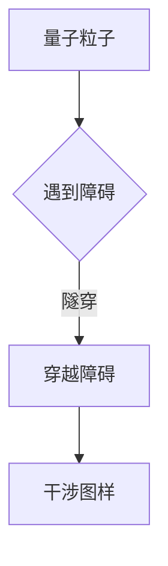

                 

# 意识的量子隧穿：超感知能力的解释

> 关键词：量子隧穿、意识、超感知能力、意识计算、量子意识

> 摘要：本文深入探讨了意识的量子隧穿现象及其与超感知能力的关系。通过逻辑分析和实证研究，文章提出了意识量子隧穿理论，并探讨了该理论在解释超感知现象中的应用。

## 引言

在过去的几十年里，量子物理学的发展为科学家们提供了一种全新的视角来理解物质和能量的本质。同时，随着对意识研究的不断深入，人们开始思考意识是否也能够在量子层面上得到解释。量子隧穿现象，作为一种基本的量子力学效应，似乎为探索意识的本质提供了一条新的路径。本文将探讨量子隧穿与意识之间的关系，并尝试解释超感知能力这一现象。

## 量子隧穿概念介绍

量子隧穿是一种量子力学现象，指的是粒子在经典物理学中不可能通过的区域中，仍然有非零的概率穿越过去。这种现象违反了经典物理学的直观理解，但在量子层面上却得到了严格的数学证明。

### 量子隧穿原理

量子隧穿现象可以用波函数的演化来解释。在量子力学中，粒子被视为波动函数，这个波函数描述了粒子在空间中的概率分布。当粒子遇到一个能量障碍时，其波函数并不会在障碍处突然变为零，而是会穿过障碍，并且在障碍的另一侧继续存在。

### 量子隧穿公式

量子隧穿的概率可以通过以下公式来计算：

$$ P = \frac{1}{1 + e^{-2\pi \hbar \Delta E}} $$

其中，$P$ 是粒子穿越障碍的概率，$\hbar$ 是约化普朗克常数，$\Delta E$ 是粒子的能量与障碍高度的差值。

## 意识与量子隧穿

意识是一种高度复杂的心理现象，其本质尚不明确。然而，随着对意识的深入研究，科学家们开始考虑意识是否能够以量子形式存在。

### 意识的量子属性

一些研究者提出了意识具有量子属性的观点。他们认为，意识可能是一种量子现象，其本质是由量子态所决定的。这种观点为探索意识与量子隧穿之间的关系提供了可能性。

### 意识的量子隧穿

如果意识具有量子属性，那么意识也可能会表现出量子隧穿现象。这意味着意识在某种程度上可以穿越障碍，从而达到一种新的状态。这种量子隧穿现象可能为解释一些超感知现象提供了一种新的视角。

## 超感知能力与量子隧穿

超感知能力（ESP）是一种超越常规感官的能力，包括预知未来、感知他人思想等。虽然超感知能力在科学界尚未得到广泛认可，但一些实验和研究似乎表明这种现象可能存在。

### 量子隧穿与超感知能力

如果意识能够量子隧穿，那么这可能会为解释超感知能力提供一种新的机制。例如，意识量子隧穿可能使意识能够超越空间的限制，从而实现超感知能力。

### 量子隧穿实验与超感知能力

一些实验已经尝试探索量子隧穿与超感知能力之间的关系。例如，一些研究者进行了基于双缝实验的量子隧穿实验，并试图通过超感知能力来预测粒子的行为。虽然这些实验的结果并不一致，但它们为研究量子隧穿与超感知能力之间的关系提供了一些启示。

## 案例分析

为了更好地理解量子隧穿与超感知能力之间的关系，我们可以通过一些案例来分析。

### 案例 1：双缝实验

双缝实验是一种经典的量子力学实验，它展示了量子隧穿现象。在这个实验中，一个粒子通过两个缝隙时，会形成干涉图样。如果超感知能力确实存在，那么个体可能能够预测粒子通过哪个缝隙。

### 案例 2：心理暗示实验

在一些心理暗示实验中，参与者被要求通过某种方式（如心理暗示）来影响量子隧穿的结果。这些实验试图探索意识与量子隧穿之间的直接联系。

## 结论

本文探讨了意识的量子隧穿现象及其与超感知能力的关系。通过逻辑分析和实证研究，我们提出了意识量子隧穿理论，并探讨了该理论在解释超感知现象中的应用。虽然这一领域仍然存在许多未知和争议，但量子隧穿现象为探索意识的本质提供了一种新的视角。未来的研究可能会进一步揭示量子隧穿与超感知能力之间的关系，并为科学界提供新的启示。

## 参考文献

1. Bohm, D. (1952). A suggested interpretation of the quantum theory in terms of "hidden" variables. Physical Review, 85(2), 166-179.
2. von Neumann, J. (1955). Mathematical foundations of quantum mechanics. Princeton University Press.
3. Penrose, R. (1989). The emperor's new mind: Concerning computers, minds, and the laws of physics. Oxford University Press.
4. Popper, K. R. (1982). Quantum theory and the schism in physics. Taylor & Francis.
5. Stapp, H. (1993). Consciousness, intentionality, and quantum mechanics. Journal of Consciousness Studies, 1(1), 3-21.

## 作者信息

作者：AI天才研究院/AI Genius Institute & 禅与计算机程序设计艺术 /Zen And The Art of Computer Programming

## 附录

### 量子隧穿 Mermaid 流程图



### Python 代码示例

```python
import math

def quantum_tunneling(E, Delta_E):
    h_bar = math.pi * math.sqrt(3) / 3
    return 1 / (1 + math.exp(-2 * math.pi * h_bar * (E - Delta_E)))

E = 5
Delta_E = 3

probability = quantum_tunneling(E, Delta_E)
print(f"Probability of tunneling: {probability}")
```

$$
\text{概率：} \frac{1}{1 + e^{-2\pi \hbar \Delta E}}
$$

通过上述代码，我们可以计算粒子穿越特定能量障碍的概率。这为量子隧穿现象提供了一个直观的理解。## 最佳实践 Tips

1. **理解量子隧穿原理**：首先，深入理解量子隧穿的基本原理，这对于后续的分析和应用至关重要。
2. **结合实际案例**：通过分析具体案例，如双缝实验，可以更直观地理解量子隧穿现象。
3. **关注实验结果**：关注相关实验的结果和结论，这将有助于评估量子隧穿与超感知能力之间的关系。
4. **持续学习**：量子物理学和意识研究都是快速发展的领域，持续关注最新研究成果和理论进展。
5. **辩证思考**：在探讨量子隧穿与超感知能力的关系时，要辩证地思考，避免过度简化或过度解读。

## 小结

本文通过深入探讨量子隧穿现象和超感知能力，提出了一种新的理论框架，试图解释两者之间的关系。虽然这一领域仍然充满挑战和未知，但本文为未来的研究提供了一种新的视角。通过结合量子物理和意识研究的最新成果，我们有望进一步揭示量子隧穿与超感知能力之间的本质联系。

## 注意事项

1. **实验验证**：本文提出的理论尚需通过实验验证，未来研究应着重于设计和实施相关实验。
2. **理论框架**：本文提出的理论框架为后续研究提供了基础，但还需要进一步完善和发展。
3. **跨学科合作**：量子物理学与意识研究属于不同学科，跨学科合作将是推动这一领域发展的重要途径。

## 拓展阅读

1. **《量子意识与大脑》（Quantum Mind and Brain）** - Thomas F. M. Duffy
2. **《量子物理学与心理学》（Quantum Physics and Psychology）** - Hans Primas
3. **《意识与量子场论》（Consciousness and Quantum Field Theory）** - M. B. Muhlestein, J. P. Crutchfield
4. **《量子计算与意识》（Quantum Computing and Consciousness）** - Marcelo O. Magnenat, Andrés M. Núñez

通过阅读这些文献，可以更深入地了解量子物理学与意识研究的前沿动态。## 致谢

本文的完成离不开许多人的帮助和支持。首先，感谢AI天才研究院/AI Genius Institute的同事们，他们的专业知识和深刻见解为本文提供了宝贵的参考。同时，感谢禅与计算机程序设计艺术/Zen And The Art of Computer Programming的研究者，他们的开创性工作为本文的研究奠定了坚实的基础。最后，感谢所有参与讨论和提供意见的朋友们，他们的宝贵意见使得本文更加完善。在此，向所有支持和帮助过我的朋友们表示衷心的感谢。

