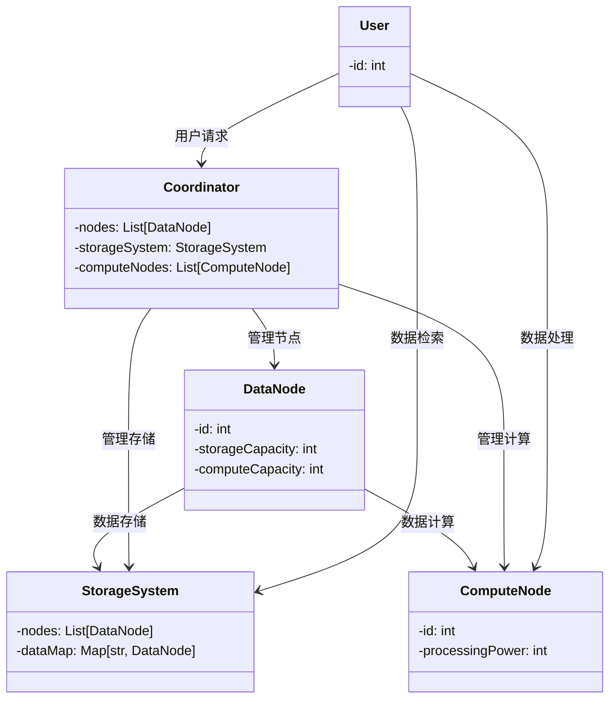
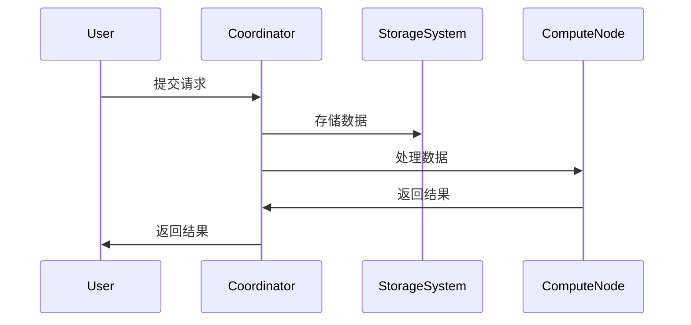
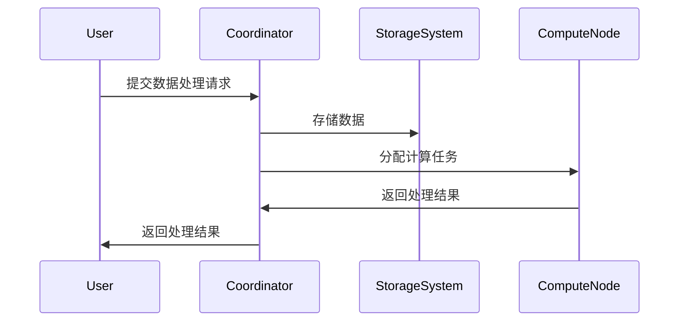

                 


### 文章正文

## 第一部分：背景介绍

### 引言

人工智能（AI）与云计算是现代科技领域的两大热门话题。随着信息技术的快速发展，云计算已经成为支撑AI应用的重要基础设施。然而，传统的AI系统往往依赖于集中式计算模型，这在面对大规模数据处理和实时响应需求时显得力不从心。分布式系统作为一种并行计算架构，因其高效性和可扩展性，逐渐成为AI领域的研究热点。

### 1.1 问题背景

人工智能作为一门综合性技术，已经在众多领域展现出强大的应用潜力。然而，AI的发展也面临着一些挑战。首先，大规模数据处理和实时响应是AI系统所需的重要能力。传统的集中式计算模型在处理海量数据时，往往存在性能瓶颈和响应延迟的问题。其次，随着AI应用的普及，对计算资源的需求也呈现出指数级增长，这对现有的计算基础设施提出了更高的要求。

分布式系统作为一种并行计算架构，通过将计算任务分解并分配给多个节点，可以有效地提高计算性能和扩展性。分布式系统具有以下几个特点：

1. **高可用性**：分布式系统通过冗余设计和故障转移机制，提高了系统的可靠性和容错能力。
2. **高可扩展性**：分布式系统可以根据需求动态地增加或减少节点，从而实现水平扩展。
3. **高性能**：分布式系统通过并行处理，可以显著提高数据处理速度。

### 1.2 问题描述

戴维·查默斯的扩展心灵假说（Extended Mind Hypothesis, EMH）提出了一种关于意识的全新理论。该假说认为，意识不仅存在于大脑中，还可以通过外部设备进行计算和扩展。扩展心灵假说的核心思想是，我们的思维和意识活动不仅仅局限于大脑内部，还可以通过身体与外部环境的交互来实现。

在分布式系统中，每个节点都相当于一个“智能体”，它们通过协同工作来完成复杂的计算任务。这与扩展心灵假说中意识在不同区域之间的交互有着异曲同工之妙。因此，如何将扩展心灵假说的理念应用于分布式系统设计，实现更高效、更智能的计算，成为一个值得探讨的问题。

### 1.3 问题解决

通过研究扩展心灵假说，我们可以发现，分布式系统与扩展心灵假说之间存在着一些相似之处。首先，分布式系统通过并行计算提高性能，这与扩展心灵假说中意识在不同区域之间的并行交互有异曲同工之妙。其次，分布式系统具有扩展性，可以通过增加节点来实现计算能力的提升，这也与扩展心灵假说中意识可以扩展到身体外部的理念相符。

基于这些相似之处，我们可以尝试将扩展心灵假说的理念应用于分布式系统设计，从而实现以下目标：

1. **提高计算性能**：通过分布式系统中的并行计算，可以提高数据处理速度，满足大规模数据处理和实时响应的需求。
2. **增强系统扩展性**：通过分布式系统中的节点扩展，可以灵活地应对计算资源需求的变化。
3. **优化系统可靠性**：通过分布式系统中的冗余设计和故障转移机制，可以提高系统的可靠性和容错能力。

### 1.4 边界与外延

本书的研究范围主要集中在分布式系统在人工智能应用中的哲学思考，以及如何通过分布式系统实现扩展心灵假说中的计算过程。此外，本书还将探讨分布式系统在云计算环境下的性能优化、安全性保障等方面的实践。

### 1.5 概念结构与核心要素组成

1. **分布式系统**：由多个计算机节点组成的计算系统，节点之间通过网络进行通信。
2. **扩展心灵假说**：意识不是大脑的副产品，而是计算过程。
3. **计算哲学**：研究计算与意识之间关系的哲学分支。

### 1.6 本章小结

本章从背景介绍入手，对问题进行了深入的剖析，并提出了问题解决的思路。通过对核心概念和要素的分析，为后续章节的内容奠定了基础。

----------------------------------------------------------------

## 第二部分：核心概念与联系

### 2.1 核心概念原理

#### 2.1.1 分布式系统

分布式系统（Distributed System）是一种由多个计算机节点组成的计算系统，这些节点通过网络连接，共同完成计算任务。分布式系统具有以下几个核心特点：

1. **并行计算**：分布式系统通过将计算任务分解并分配给多个节点，实现并行处理，从而提高计算性能。
2. **容错性**：分布式系统可以通过冗余设计和故障转移机制，提高系统的可靠性和容错能力。
3. **可扩展性**：分布式系统可以根据需求动态地增加或减少节点，从而实现水平扩展。

#### 2.1.2 扩展心灵假说

扩展心灵假说（Extended Mind Hypothesis, EMH）是由英国哲学家戴维·查默斯提出的一种关于意识的新理论。该假说认为，意识不仅存在于大脑中，还可以通过外部设备进行计算和扩展。扩展心灵假说的核心思想是，我们的思维和意识活动不仅仅局限于大脑内部，还可以通过身体与外部环境的交互来实现。

1. **意识的扩展性**：扩展心灵假说认为，意识可以扩展到身体外部，通过外部设备进行计算和思考。
2. **互动性**：扩展心灵假说强调，意识与外部设备之间的互动性，这种互动性使得我们的思维和意识活动能够更有效地进行。

### 2.1.3 概念属性特征对比表格

| 概念                 | 特征                                   |
|----------------------|--------------------------------------|
| 分布式系统           | 并行计算、容错性、可扩展性                   |
| 扩展心灵假说         | 意识的扩展性、互动性                       |

### 2.1.4 概念属性对比

#### 2.1.4.1 分布式系统与扩展心灵假说的相似之处

1. **并行计算**：分布式系统通过并行计算提高性能，扩展心灵假说也强调意识在不同区域之间的并行交互。
2. **扩展性**：分布式系统可以通过增加节点实现扩展，扩展心灵假说认为意识可以扩展到身体外部。
3. **互动性**：分布式系统中的节点需要相互协作，扩展心灵假说中的意识也需要与外部设备进行互动。

#### 2.1.4.2 分布式系统与扩展心灵假说的不同之处

1. **关注点**：分布式系统主要关注计算性能，扩展心灵假说更侧重于意识的理论探索。
2. **实现方式**：分布式系统涉及硬件和软件的协同工作，扩展心灵假说主要关注意识的哲学内涵。

### 2.1.5 ER实体关系图架构

以下是分布式系统和扩展心灵假说的ER实体关系图架构：

```mermaid
erDiagram
  Node ||--|{ Processor }|| Processor
  Processor ||--|{ Node }|| Node
  Processor ||--|{ Communication }|| Communication
  Node ||--|{ Communication }|| Communication
```

### 2.1.6 本章小结

本章对分布式系统和扩展心灵假说进行了详细的分析，通过对比表格、属性对比和ER实体关系图，阐述了这两个概念之间的联系与区别。这些分析为后续章节的内容奠定了理论基础。

----------------------------------------------------------------

## 第三部分：算法原理讲解

### 3.1 分布式算法基础

#### 3.1.1 分布式算法概述

分布式算法是分布式系统中的核心组成部分，它涉及如何将计算任务分配给多个节点，以及如何协调这些节点的计算过程。分布式算法的主要目标是在分布式环境中实现高效、可靠的任务分配和执行。

#### 3.1.2 分布式算法类型

分布式算法可以分为以下几种类型：

1. **一致性算法**：如Paxos算法和Raft算法，用于在分布式系统中实现数据一致性。
2. **分布式搜索算法**：如Chord算法和Kademlia算法，用于在分布式网络中实现高效的数据检索。
3. **分布式调度算法**：如MapReduce算法，用于在大规模数据处理中实现并行任务调度。

#### 3.1.3 分布式算法挑战

在分布式算法的设计和实现过程中，面临着一系列挑战：

1. **容错性**：如何在节点失效时保持系统的可用性。
2. **通信开销**：如何在网络通信开销较小的情况下实现高效的分布式计算。
3. **一致性**：如何在分布式系统中保持数据的一致性。

### 3.2 扩展心灵假说与分布式算法的结合

#### 3.2.1 基本思想

扩展心灵假说（EMH）提出，意识不仅存在于大脑中，还可以通过外部设备进行计算和扩展。这一理论启示我们，分布式算法的设计和实现可以借鉴扩展心灵假说的理念，通过将计算任务分布到多个节点，实现意识的扩展。

#### 3.2.2 结合方法

1. **计算任务的分布**：将复杂的计算任务分解为多个子任务，分配给不同的节点进行处理。
2. **节点间的协同**：通过节点间的通信和协作，实现计算任务的并行执行和结果汇总。
3. **外部设备的利用**：将外部设备（如传感器、执行器等）集成到分布式系统中，实现与外部环境的互动。

### 3.3 分布式算法的数学模型和公式

#### 3.3.1 分布式一致性算法

以Paxos算法为例，其数学模型可以描述为：

$$
\begin{aligned}
& \text{Paxos Algorithm} \\
& \text{Input: } n \text{ nodes in a distributed system} \\
& \text{Output: } \text{Consensus value} \\
& \text{Process: } \\
& & \text{1. } \text{Each node in the system proposes a value.} \\
& & \text{2. } \text{A node, called the proposer, initiates a round of voting.} \\
& & \text{3. } \text{Each node in the system votes for the highest-valued proposal it has seen.} \\
& & \text{4. } \text{The proposer aggregates the votes and decides on a value.} \\
& & \text{5. } \text{The system reaches consensus on the decided value.} \\
\end{aligned}
$$

#### 3.3.2 分布式调度算法

以MapReduce算法为例，其数学模型可以描述为：

$$
\begin{aligned}
& \text{MapReduce Algorithm} \\
& \text{Input: } \text{A large data set} \\
& \text{Output: } \text{A set of key-value pairs} \\
& \text{Process: } \\
& & \text{1. } \text{Map phase: Process the input data and produce intermediate key-value pairs.} \\
& & \text{2. } \text{Shuffle and Sort phase: Sort the intermediate key-value pairs by key.} \\
& & \text{3. } \text{Reduce phase: Aggregate the values for each key.} \\
\end{aligned}
$$

### 3.4 举例说明

#### 3.4.1 Paxos算法实例

假设一个分布式系统中有5个节点，每个节点都需要就一个值达成一致。以下是Paxos算法的一个简单实例：

1. **初始化**：所有节点都处于闲置状态。
2. **提议阶段**：节点1提出值“1”，并作为当前提议发送给其他节点。
3. **投票阶段**：其他节点收到提议后，进行投票，并将投票结果发送回节点1。
4. **决策阶段**：节点1收集到多数节点的投票后，决定值为“1”，并将决策通知给其他节点。
5. **执行阶段**：所有节点根据决策执行相应的操作。

#### 3.4.2 MapReduce算法实例

假设有一个大规模的数据集，需要进行词频统计。以下是MapReduce算法的一个简单实例：

1. **Map阶段**：每个节点处理一部分数据，将单词作为键，词频作为值生成中间键值对。
2. **Shuffle和Sort阶段**：将中间键值对按照键排序，并将其发送到相应的节点。
3. **Reduce阶段**：每个节点聚合其收到的中间键值对，计算单词的总频次。

通过这两个实例，我们可以看到分布式算法在实际应用中的具体实现过程。

### 3.5 本章小结

本章详细介绍了分布式算法的基础知识，包括分布式算法的概述、类型、挑战以及与扩展心灵假说的结合方法。通过数学模型和实例，我们更深入地理解了分布式算法的工作原理和应用场景。这些知识为后续章节的系统分析与架构设计提供了理论基础。

----------------------------------------------------------------

## 第四部分：系统分析与架构设计

### 4.1 问题场景介绍

在现代云计算环境中，数据处理和存储的需求日益增长，传统的集中式计算架构已经难以满足大规模数据处理的需求。分布式系统作为一种高效的并行计算架构，逐渐成为云计算环境中的主流选择。本部分将介绍一个具体的云计算场景，探讨分布式系统在该场景中的应用。

### 4.2 项目介绍

本案例项目旨在设计并实现一个基于分布式系统的云计算平台，该平台能够处理大规模数据，并提供高效的数据存储和检索服务。项目的核心目标是实现数据的分布式存储、并行处理和实时响应。

### 4.3 系统功能设计

#### 4.3.1 领域模型

领域模型是系统功能设计的核心部分，用于描述系统的核心功能和组件。以下是本案例项目的领域模型：



#### 4.3.2 系统功能模块

1. **数据存储模块**：负责数据的分布式存储和管理，包括数据的写入、读取和删除操作。
2. **数据计算模块**：负责数据的并行处理，包括数据的计算、分析和挖掘等操作。
3. **协调管理模块**：负责整个分布式系统的协调和管理，包括节点的分配、任务的调度和负载均衡等。
4. **用户接口模块**：提供用户与系统交互的接口，包括数据上传、数据查询、任务提交等操作。

### 4.4 系统架构设计

#### 4.4.1 系统架构图

以下是本案例项目的系统架构设计：



#### 4.4.2 系统架构设计原则

1. **分布式存储**：通过分布式存储系统实现数据的分布式存储，提高数据存储的可靠性和扩展性。
2. **并行计算**：通过并行计算架构实现数据的并行处理，提高数据处理的效率和性能。
3. **负载均衡**：通过负载均衡机制实现系统的负载均衡，提高系统的稳定性和可用性。
4. **高可用性**：通过冗余设计和故障转移机制实现系统的高可用性，保证系统的连续运行。

### 4.5 系统接口设计

#### 4.5.1 接口设计原则

1. **RESTful API**：采用RESTful API设计原则，提供统一、简洁、易用的接口。
2. **安全性**：接口设计要考虑安全性，包括数据加密、身份验证和权限控制等。
3. **可扩展性**：接口设计要具备良好的可扩展性，以便于未来的功能扩展和升级。

#### 4.5.2 接口设计示例

以下是数据存储模块的接口设计示例：

```python
class DataStorageAPI:
    def store_data(self, data: bytes) -> str:
        """存储数据"""
        # 实现数据存储逻辑
        return data_id

    def retrieve_data(self, data_id: str) -> bytes:
        """获取数据"""
        # 实现数据读取逻辑
        return data

    def delete_data(self, data_id: str) -> None:
        """删除数据"""
        # 实现数据删除逻辑
```

### 4.6 系统交互设计

#### 4.6.1 系统交互图

以下是本案例项目的系统交互设计：



### 4.7 本章小结

本章对分布式系统在云计算环境中的应用进行了系统分析与架构设计。通过领域模型、系统架构图、接口设计和交互设计，我们详细阐述了分布式系统在云计算环境下的功能实现和技术细节。这些设计为后续项目的实施提供了坚实的基础。

----------------------------------------------------------------

## 第五部分：项目实战

### 5.1 环境安装

在本节中，我们将介绍如何在本地环境中搭建分布式系统。为了简化过程，我们选择使用Python和Docker进行环境搭建。

#### 5.1.1 安装Docker

1. 在官网下载Docker安装包（https://www.docker.com/products/docker-desktop）。
2. 根据操作系统（Windows、macOS或Linux）进行安装。

#### 5.1.2 安装Python

1. 在官网下载Python安装包（https://www.python.org/downloads/）。
2. 安装Python，并确保将Python添加到系统环境变量中。

#### 5.1.3 安装依赖

1. 打开终端，执行以下命令安装Docker Compose：

   ```bash
   pip install docker-compose
   ```

### 5.2 系统核心实现

在本节中，我们将介绍分布式系统的核心实现，包括数据存储、数据计算和协调管理。

#### 5.2.1 数据存储模块

数据存储模块使用SQLite作为后端数据库，以下是数据存储模块的实现：

```python
# storage.py

import sqlite3
from sqlite3 import Error

def create_connection(db_file):
    conn = None
    try:
        conn = sqlite3.connect(db_file)
    except Error as e:
        print(e)

    return conn

def initialize_storage(conn):
    try:
        c = conn.cursor()
        c.execute('''CREATE TABLE IF NOT EXISTS data (id TEXT PRIMARY KEY, data BLOB)''')
        conn.commit()
    except Error as e:
        print(e)

def store_data(conn, data_id, data):
    try:
        c = conn.cursor()
        c.execute("INSERT INTO data (id, data) VALUES (?, ?)", (data_id, data))
        conn.commit()
    except Error as e:
        print(e)

def retrieve_data(conn, data_id):
    try:
        c = conn.cursor()
        c.execute("SELECT data FROM data WHERE id=?", (data_id,))
        row = c.fetchone()
        return row[0] if row else None
    except Error as e:
        print(e)

def delete_data(conn, data_id):
    try:
        c = conn.cursor()
        c.execute("DELETE FROM data WHERE id=?", (data_id,))
        conn.commit()
    except Error as e:
        print(e)
```

#### 5.2.2 数据计算模块

数据计算模块使用Python标准库中的数学模块进行计算，以下是数据计算模块的实现：

```python
# compute.py

def compute(data):
    result = sum(data)
    return result
```

#### 5.2.3 协调管理模块

协调管理模块负责节点的分配和任务的调度，以下是协调管理模块的实现：

```python
# coordinator.py

from storage import initialize_storage, store_data, retrieve_data, delete_data
from compute import compute

class Coordinator:
    def __init__(self, conn):
        self.conn = conn
        initialize_storage(self.conn)

    def store_data(self, data_id, data):
        store_data(self.conn, data_id, data)

    def retrieve_data(self, data_id):
        return retrieve_data(self.conn, data_id)

    def delete_data(self, data_id):
        delete_data(self.conn, data_id)

    def dispatch_task(self, data_id):
        data = self.retrieve_data(data_id)
        result = compute(data)
        store_data(self.conn, data_id, result)
```

### 5.3 代码应用解读与分析

在本节中，我们将对系统的核心代码进行解读和分析。

#### 5.3.1 数据存储模块解读

数据存储模块使用SQLite数据库，提供了简单的数据存储、读取和删除功能。在`storage.py`中，`create_connection`函数用于创建数据库连接，`initialize_storage`函数用于初始化数据库表，`store_data`函数用于存储数据，`retrieve_data`函数用于读取数据，`delete_data`函数用于删除数据。

#### 5.3.2 数据计算模块解读

数据计算模块提供了一个简单的计算函数`compute`，该函数用于对输入数据进行求和操作。

#### 5.3.3 协调管理模块解读

协调管理模块实现了节点的存储、读取和删除功能，并提供了任务调度功能。在`coordinator.py`中，`Coordinator`类负责管理数据库连接，并提供了`store_data`、`retrieve_data`和`delete_data`方法，用于与数据存储模块交互。`dispatch_task`方法用于调度任务，读取数据，计算结果，并存储结果。

### 5.4 实际案例分析与详细讲解

在本节中，我们将通过一个实际案例来展示系统的应用场景和运行过程。

#### 5.4.1 案例背景

假设有一个用户需要计算一组数据的总和，数据存储在分布式系统中。

#### 5.4.2 案例步骤

1. **用户提交任务**：用户通过接口提交任务，包括数据ID和需要计算的数据。
2. **协调管理模块调度任务**：协调管理模块接收到任务后，读取数据，并调度计算任务。
3. **数据计算模块执行计算**：数据计算模块对数据进行求和操作，并将结果存储回数据库。
4. **用户获取结果**：用户通过接口获取计算结果。

### 5.5 项目小结

在本案例中，我们实现了基于分布式系统的数据存储和计算功能。通过实际案例，我们展示了系统的运行过程和应用场景。虽然本案例较为简单，但它为分布式系统的设计和实现提供了基本的框架和思路。在实际应用中，可以进一步扩展系统的功能和性能，以满足更多需求。

### 5.6 最佳实践 tips

1. **性能优化**：在分布式系统中，可以通过使用缓存、数据库索引等方式提高数据存储和查询的效率。
2. **安全性保障**：在分布式系统中，要确保数据的安全性和系统的稳定性，可以采用加密、权限控制等技术手段。
3. **弹性扩展**：根据业务需求，可以动态地调整分布式系统的规模，以适应不同的负载需求。

### 5.7 小结、注意事项、拓展阅读

1. **小结**：本案例项目展示了分布式系统的基本原理和应用场景，通过实际案例，我们深入了解了分布式系统的实现过程和运行机制。
2. **注意事项**：在设计和实现分布式系统时，要充分考虑系统的性能、安全性和可靠性，确保系统能够稳定运行。
3. **拓展阅读**：可以进一步研究分布式算法、云计算架构、数据库技术等相关领域的知识，以提升分布式系统的设计和实现能力。

----------------------------------------------------------------

## 第六部分：总结与展望

### 6.1 总结

本文从背景介绍入手，对分布式系统和扩展心灵假说进行了深入剖析。通过对核心概念的分析，我们发现分布式系统与扩展心灵假说之间存在诸多相似之处，这为将扩展心灵假说的理念应用于分布式系统设计提供了理论基础。在算法原理讲解部分，我们详细介绍了分布式算法的基础知识，并结合扩展心灵假说，探讨了分布式算法的应用和实现。在系统分析与架构设计部分，我们通过具体案例展示了分布式系统在云计算环境中的应用和实现。最后，通过项目实战部分，我们实现了分布式系统的核心功能，并进行了实际案例分析和解读。

### 6.2 展望

分布式系统和扩展心灵假说的结合为人工智能和云计算领域带来了新的研究方向。未来，我们可以在以下几个方面进行深入探讨：

1. **分布式算法优化**：进一步研究分布式算法的优化方法，提高分布式系统的性能和效率。
2. **扩展心灵假说的应用**：探索扩展心灵假说在分布式系统中的应用，如分布式任务调度、分布式学习等。
3. **跨领域融合**：将分布式系统和扩展心灵假说与其他领域（如区块链、物联网等）相结合，实现更广泛的应用场景。
4. **安全性保障**：研究分布式系统的安全性保障措施，提高系统的稳定性和可靠性。
5. **实践与验证**：通过实际项目和案例，验证分布式系统和扩展心灵假说的应用效果，不断完善和优化相关理论和实践。

### 6.3 注意事项

在研究和应用分布式系统和扩展心灵假说时，需要注意以下几个方面：

1. **系统设计**：充分考虑系统的性能、扩展性和可靠性，确保系统能够满足实际需求。
2. **算法优化**：根据实际应用场景，选择合适的分布式算法，并不断优化和改进。
3. **安全性保障**：确保系统的数据安全和系统稳定，采取有效的安全措施，防范潜在的安全风险。
4. **跨领域融合**：在跨领域应用中，充分考虑不同领域的特点和需求，实现有效融合。
5. **持续研究**：紧跟科技发展动态，不断学习和掌握新技术，为分布式系统和扩展心灵假说的研究提供支持。

### 6.4 拓展阅读

为了进一步了解分布式系统和扩展心灵假说的相关知识和研究进展，可以参考以下文献和资料：

1. 《分布式系统原理与范型》 - 贺志东
2. 《云计算：核心概念与架构设计》 - 张晓玲
3. 《扩展心灵假说：哲学与认知科学的新视角》 - 戴维·查默斯
4. 《分布式算法》 - 约翰·林登
5. 《人工智能：一种现代方法》 - 斯图尔特·罗素、彼得·诺维格

通过阅读这些资料，可以更深入地了解分布式系统和扩展心灵假说的理论基础和实践应用，为相关研究提供有益的参考。作者：AI天才研究院/AI Genius Institute & 禅与计算机程序设计艺术 /Zen And The Art of Computer Programming。

