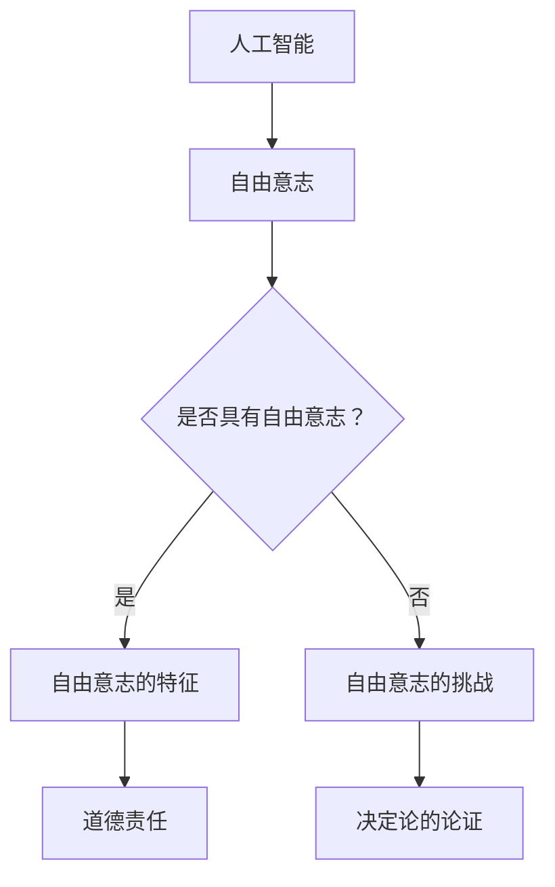

                 


## 托马斯·内格尔与德里克·帕菲特：当代心灵哲学的探索

### 关键词

- 心灵哲学
- 托马斯·内格尔
- 德里克·帕菲特
- 自由意志
- 道德哲学
- 意识研究

### 摘要

本文将深入探讨当代心灵哲学中的两位重要思想家：托马斯·内格尔与德里克·帕菲特。通过对他们的哲学思想、研究方法以及他们在自由意志、道德哲学和意识研究等领域的贡献进行分析，本文旨在提供一个全面且结构清晰的视角，以帮助读者更好地理解心灵哲学在当代的演变及其对其他学科的影响。本文将分为三个主要部分：引论、内格尔与帕菲特的思想融合与比较、以及心灵哲学的当代挑战与未来方向。通过逐步分析，我们将揭示心灵哲学的核心问题及其在当今世界中的重要性。

## 第一部分：引论

### 第1章：问题背景与定义

#### 1.1 问题背景

心灵哲学是哲学中一个古老而又充满活力的领域，探讨的是人类心灵的本质、功能及其与外部世界的互动。它涉及到意识、感知、思考、情感、意志等主题，试图回答“什么是心灵”、“心灵如何工作”以及“心灵与物质世界的关系”等问题。在当代，随着神经科学、认知科学和人工智能等学科的迅猛发展，心灵哲学面临新的挑战和机遇。

托马斯·内格尔（Thomas Nagel）和德里克·帕菲特（Derek Parfit）是当代心灵哲学中的两位杰出代表。内格尔以其对自由意志、自我意识和道德责任的深入探讨而著称；而帕菲特则以其对道德哲学、个体主义与集体主义的细致分析而备受赞誉。本文将首先介绍他们的主要贡献，并阐述本书的研究目标和结构。

##### 1.1.1 心灵哲学的演变与当前挑战

心灵哲学的历史可以追溯到古希腊时期，当时哲学家们开始思考心灵的本质和功能。亚里士多德是这一领域的奠基人之一，他提出了“心灵是形式赋予物质的”观点，这影响了后来的西方哲学传统。中世纪时期，心灵哲学受到宗教哲学的强烈影响，特别是在探讨灵魂的存在和性质方面。到了近现代，随着科学方法的兴起，心灵哲学逐渐与自然科学相结合，形成了更为科学的哲学体系。

然而，当前的心灵哲学面临着一系列挑战。首先，随着神经科学的发展，人们对大脑与行为之间的关系有了更深入的理解，这促使哲学家们重新审视传统的观念。例如，自由意志是否真的存在，意识的本质是什么等问题。其次，人工智能的兴起也对心灵哲学提出了新的问题，例如人工智能是否能够拥有意识，以及人工智能与人类心灵的关系如何。

##### 1.1.2 托马斯·内格尔与德里克·帕菲特的研究贡献

托马斯·内格尔是20世纪最具影响力的哲学家之一。他的著作《人的观点》（"The View from Nowhere"）和《思考与真实》（"Mind and Cosmos"）等，对当代哲学界产生了深远的影响。内格尔关注的核心问题是心灵与物质世界的关系，特别是自由意志、自我意识和道德责任等主题。他提出了“物理主义不可能论”的观点，认为人类心灵无法完全还原为物理过程，这挑战了传统的物理主义观点。

德里克·帕菲特是另一位当代心灵哲学的杰出代表。他的著作《理性与行为》（"Reasons and Persons"）等，在道德哲学、个人身份和智慧等领域做出了重要贡献。帕菲特以其对可能性论和道德选择的深入探讨而著称，他认为道德判断和决策应该基于对可能世界的理解和评估。

##### 1.1.3 本书的研究目标与结构

本书的研究目标是深入探讨托马斯·内格尔和德里克·帕菲特的哲学思想，分析他们在心灵哲学领域的贡献，并探讨他们的思想如何相互作用和影响。本书分为三个主要部分：

第一部分：引论，介绍心灵哲学的背景、当前挑战以及托马斯·内格尔和德里克·帕菲特的研究贡献。

第二部分：内格尔与帕菲特的思想融合与比较，分析他们在自由意志、道德哲学和意识研究等领域的观点和贡献。

第三部分：当代心灵哲学的探索与应用，探讨心灵哲学在当代的挑战和未来方向。

通过这本书，我们希望读者能够对当代心灵哲学有一个全面、深入的理解，并认识到它在其他学科和社会中的应用价值。

### 第2章：托马斯·内格尔的哲学思想

#### 2.1 内格尔的主要理论观点

托马斯·内格尔的哲学思想以其对自由意志、自我意识和道德责任的深入探讨而著称。在他的著作中，他提出了许多独特的观点，并对传统哲学观念进行了深刻的批判和反思。

##### 2.1.1 自由意志与决定论

内格尔对自由意志与决定论的关系进行了深入的探讨。他认为，决定论是一个无法避免的事实，即所有事件都是由先前事件和自然法则所决定的。然而，自由意志并不是一个幻象，而是人类心灵的一种内在属性。内格尔提出了“规范性自由”的概念，认为即使在一个决定论的世界中，人们仍然可以通过选择和行动来体现自由意志。他的这一观点挑战了传统决定论的观点，为自由意志的存在提供了新的论证。

##### 2.1.2 自我意识与主观经验

自我意识是内格尔哲学思想中的另一个重要主题。他认为，自我意识是人类心灵的核心特征，是我们理解和体验世界的基础。内格尔区分了“内在观点”和“外在观点”，认为内在观点是我们对自己的体验和理解，而外在观点则是我们对外部世界的观察和认识。他认为，自我意识的存在并不依赖于物理过程，而是心灵的一种内在属性。这一观点对后来的心灵哲学研究产生了重要影响。

##### 2.1.3 实在论与现象论

内格尔在哲学方法论上也提出了独特的观点。他批判了传统现象论的局限性，认为现象论只能描述人类主观经验的外部表现，而无法揭示经验的内在结构和本质。他提出了“实在论”的观点，认为人类心灵与外部世界的互动不仅仅是感知和认知，还包括对现实世界的本质理解和解释。他认为，只有通过实在论的方法，才能深入理解心灵的本质和功能。

#### 2.2 内格尔的研究方法

内格尔的研究方法以其逻辑严谨、论证严密而著称。他常常通过反驳传统观点来提出自己的理论，并通过逻辑推理和哲学论证来支持这些理论。

##### 2.2.1 分析哲学的方法论

内格尔是分析哲学的忠实拥护者。他强调哲学研究应该以逻辑和语言的分析为基础，通过清晰、精确的论证来探讨哲学问题。他主张将哲学问题分解为基本概念和逻辑结构，通过逻辑推理来解答这些问题。他的这种方法在当代哲学界产生了广泛的影响。

##### 2.2.2 内格尔的逻辑论证与反驳

内格尔在哲学论证中经常使用反驳的方法。他通过揭示传统观点中的逻辑错误和矛盾，来批判和反驳这些观点。例如，他批判了物理主义，认为物理主义无法解释人类意识的复杂性。他的反驳方法不仅揭示了传统观点的局限性，也为自己的理论提供了有力的支持。

##### 2.2.3 内格尔的理论创新与影响

内格尔的理论在当代哲学界产生了深远的影响。他的观点挑战了传统哲学的许多基本假设，为当代哲学研究提供了新的视角和方法。他的关于自由意志、自我意识和实在论的观点，不仅在哲学界引起了广泛的讨论，也影响了其他学科的研究，如认知科学和心理学。他的著作《人的观点》和《思考与真实》等，被广泛认为是当代哲学的经典之作。

### 第3章：德里克·帕菲特的哲学思想

#### 3.1 帕菲特的主要理论观点

德里克·帕菲特的哲学思想涵盖了道德哲学、个人身份和智慧等多个领域。他的理论以其深刻的分析和对可能世界的探讨而著称。

##### 3.1.1 可能性论与道德哲学

帕菲特是可能性论的重要代表。他认为，道德判断和决策应该基于对可能世界的理解和评估。他的可能性论观点强调，我们的道德责任不仅取决于我们实际的行为，还取决于我们能够做到但未做的事情。这一观点为道德判断提供了一种新的框架，使我们能够更全面地考虑我们的行为对他人的影响。

##### 3.1.2 个体主义与集体主义

帕菲特在道德哲学中探讨了个体主义与集体主义的关系。他认为，个体主义强调个体的自由和权利，而集体主义则强调社会和集体的利益。他提出了“个体主义困境”的观点，认为在集体行动中，个体往往会忽视自己的责任，导致集体利益受损。他的这一观点引发了广泛的讨论，对当代道德哲学产生了重要影响。

##### 3.1.3 智慧与决策理论

帕菲特在决策理论中提出了“智慧”的概念。他认为，智慧不仅是一种认知能力，更是一种道德品质。智慧使我们能够做出符合道德规范的决策，并在复杂的情况下做出最佳选择。他的决策理论强调，智慧是我们道德责任的核心，是我们实现个人和社会价值的基石。

#### 3.2 帕菲特的研究方法

帕菲特的研究方法以其细致的分析和逻辑推理而著称。他的研究方法在当代哲学界产生了重要影响。

##### 3.2.1 形而上学与认识论的结合

帕菲特的研究方法强调形而上学和认识论的结合。他认为，形而上学研究的是现实世界的本质和结构，而认识论研究的是我们如何认识和了解现实世界。通过将形而上学和认识论结合起来，帕菲特能够更深入地探讨哲学问题，并提供更全面的解决方案。

##### 3.2.2 帕菲特的实证研究与数据分析

帕菲特在研究中也采用了实证方法和数据分析。他通过调查和实验来验证自己的理论，并使用数据分析来支持自己的结论。这种方法使他的研究更具科学性，也使他的理论更具有说服力。

##### 3.2.3 帕菲特对心灵哲学的扩展

帕菲特的研究不仅局限于道德哲学，他还对心灵哲学进行了扩展。他认为，心灵哲学应该关注人类的整体行为和决策，而不仅仅是意识的本质和功能。他的研究使心灵哲学与道德哲学、决策理论等其他学科相结合，形成了一个更广泛的哲学体系。

### 第二部分：内格尔与帕菲特思想的融合与比较

#### 第4章：自由意志与决定论

#### 4.1 内格尔的视角

内格尔对自由意志与决定论的关系进行了深入的探讨。他认为，决定论是一个无法避免的事实，即所有事件都是由先前事件和自然法则所决定的。然而，自由意志并不是一个幻象，而是人类心灵的一种内在属性。内格尔提出了“规范性自由”的概念，认为即使在一个决定论的世界中，人们仍然可以通过选择和行动来体现自由意志。他的这一观点挑战了传统决定论的观点，为自由意志的存在提供了新的论证。

##### 4.1.1 自由意志的存在与证明

内格尔认为，自由意志的存在可以通过以下几个方面来证明。首先，人类的自我意识使我们能够意识到自己的选择和行动。这种自我意识是自由意志存在的基础。其次，人类的行为往往具有多样性和灵活性，这种多样性和灵活性表明我们的选择并不是完全受制于先前的决定和自然法则。最后，道德责任的存在也需要自由意志的存在。如果所有的行为都是由决定论所决定的，那么道德责任就无从谈起。

##### 4.1.2 决定论的挑战与回应

决定论对自由意志的存在提出了严重的挑战。如果所有事件都是由先前的决定和自然法则所决定，那么自由意志就似乎是一个不存在的概念。内格尔认为，决定论的挑战主要来自于两个方面。首先，决定论往往忽视了人类的主观经验和自我意识。这些因素在自由意志的论证中起到了关键作用。其次，决定论往往忽略了人类行为的多样性和灵活性。这些特性表明，人类的行为并不是完全受制于决定论的。

为了回应决定论的挑战，内格尔提出了一种“规范性自由”的观点。他认为，即使在一个决定论的世界中，人们仍然可以通过选择和行动来体现自由意志。这种自由意志是一种道德意义上的自由，即人们可以对自己的行为负责。这种自由并不是一种物理意义上的自由，而是一种道德责任和自主性的体现。

##### 4.1.3 自由意志与道德责任

自由意志与道德责任密切相关。道德责任是指人们对自己的行为负有责任，而自由意志是道德责任的前提条件。如果人们的行为完全由决定论所决定，那么他们就没有道德责任，因为他们无法对自己的行为负责。

内格尔认为，自由意志与道德责任的关系可以通过以下几个方面来理解。首先，自由意志使人们能够做出道德选择。如果人们的行为完全由决定论所决定，那么他们就无法做出道德选择，因为他们的行为是预先设定的。其次，自由意志使人们能够对自己的行为负责。只有当人们的行为是由自己选择和决定的，他们才能对自己的行为负责。最后，自由意志是道德行为的动力源泉。只有当人们有自由意志时，他们才会积极地追求道德行为。

#### 4.2 帕菲特的视角

德里克·帕菲特对自由意志与决定论的关系也进行了深入的探讨。与内格尔不同，帕菲特更倾向于可能性的观点，认为道德判断和决策应该基于对可能世界的理解和评估。他的可能性论观点为自由意志的存在提供了一种新的解释。

##### 4.2.1 可能性与道德选择

帕菲特认为，道德选择不仅仅取决于我们的实际行为，还取决于我们能够做到但未做的事情。这种可能性论的观点强调，我们的道德责任不仅取决于我们的实际行为，还取决于我们的潜在行为。这意味着，即使在一个决定论的世界中，我们仍然可以通过考虑可能的行为来体现自由意志。

##### 4.2.2 决策过程中的理性与情感

帕菲特认为，决策过程中既有理性的成分，也有情感的成分。理性使我们能够分析可能的结果和影响，情感则使我们能够感受到这些结果和影响。他认为，理性与情感在道德决策中起着互补的作用。理性帮助我们做出明智的选择，情感则帮助我们做出道德的选择。

##### 4.2.3 自由意志与道德责任的平衡

帕菲特认为，自由意志与道德责任之间存在一种平衡关系。自由意志使我们能够做出道德选择，而道德责任则使我们对这些选择负责。他认为，这种平衡关系是人类道德生活的核心。只有当我们的自由意志与道德责任保持平衡时，我们才能做出真正道德的选择。

#### 4.3 内格尔与帕菲特思想的比较

内格尔和帕菲特在自由意志与决定论的关系上存在一些差异。内格尔更倾向于实在论的视角，认为自由意志是一种道德意义上的自由，而帕菲特则更倾向于可能性的视角，认为道德选择应该基于对可能世界的理解和评估。然而，他们也有一些共同点。

首先，他们都认为自由意志是一个重要的道德概念。内格尔认为，自由意志使人们能够对自己的行为负责，而帕菲特则认为，自由意志是道德选择的必要条件。其次，他们都认为道德责任是人类行为的核心。内格尔认为，道德责任是自由意志的基础，而帕菲特则认为，道德责任是自由意志的体现。

尽管内格尔和帕菲特在自由意志与决定论的关系上存在一些差异，但他们的思想都为当代心灵哲学提供了重要的贡献。他们的研究使我们对自由意志、道德责任以及人类心灵的本质有了更深入的理解。

### 第5章：自我意识与主观经验

#### 5.1 内格尔的视角

托马斯·内格尔对自我意识与主观经验的探讨是其哲学思想中的重要组成部分。他认为，自我意识是人类心灵的核心特征，是我们理解和体验世界的基础。内格尔区分了“内在观点”和“外在观点”，认为内在观点是我们对自己的体验和理解，而外在观点则是我们对外部世界的观察和认识。

##### 5.1.1 主观经验的本质

内格尔认为，主观经验是我们对外部世界的主观感受和体验。这些感受和体验是我们对世界认知的基础，也是我们理解自己和他人行为的重要途径。他提出了“主观经验不可还原”的观点，认为主观经验无法完全还原为物理过程，这为心灵哲学提供了一种新的解释框架。

##### 5.1.2 自我意识的构成

内格尔认为，自我意识是由多个部分构成的。首先，自我意识包括对自身存在的认识，即我们知道自己是一个独立的个体。其次，自我意识包括对自身感受的认识，即我们能够感受到自己的情感和身体状态。最后，自我意识还包括对自身思维过程的认识，即我们能够意识到自己的思考和决策过程。这些部分共同构成了我们的自我意识。

##### 5.1.3 主观经验的哲学意义

内格尔认为，主观经验在哲学上具有重要意义。首先，主观经验使我们能够理解人类心灵的本质，从而为心灵哲学提供了基础。其次，主观经验使我们能够理解他人，从而为伦理学和道德哲学提供了基础。最后，主观经验使我们能够理解自我，从而为自我认识和个人成长提供了基础。

#### 5.2 帕菲特的视角

德里克·帕菲特对自我意识与主观经验的探讨也具有其独特性。他认为，可能性论为自我意识提供了新的解释框架，并强调主观经验在道德哲学和智慧中的重要性。

##### 5.2.1 可能性论与自我意识

帕菲特认为，自我意识是一种可能性论的概念。他认为，自我意识不仅仅是对自身存在的认识，还包括对自身可能存在的认识。这种可能性论的观点使自我意识不再是一个静态的概念，而是一个动态的过程。它使我们能够理解自我在可能世界中的存在，从而为道德判断和决策提供了基础。

##### 5.2.2 主观经验与知识

帕菲特认为，主观经验是我们获取知识的重要途径。他认为，主观经验使我们能够直接感知和理解世界，从而为我们的知识提供了基础。他提出了“直接感知知识”的观点，认为有些知识是通过直接感知获得的，而不是通过推理和论证。这种观点对知识哲学和认知科学产生了重要影响。

##### 5.2.3 自我意识与自我认同

帕菲特认为，自我意识与自我认同密切相关。他认为，自我认同是我们对自己的身份和角色的认识。这种认同使我们能够理解自我在时间和空间中的位置，从而为我们的行为和决策提供了基础。他认为，自我认同是一个动态的过程，它随着我们的经历和成长而不断变化。

#### 5.3 内格尔与帕菲特思想的比较

内格尔和帕菲特在自我意识与主观经验的探讨上存在一些差异。内格尔更强调主观经验在哲学和伦理学中的重要性，而帕菲特则更强调可能性论在自我意识中的重要性。然而，他们也有一些共同点。

首先，他们都认为自我意识是人类心灵的核心特征。内格尔认为，自我意识是我们理解和体验世界的基础，而帕菲特则认为，自我意识是我们道德判断和决策的基础。其次，他们都认为主观经验是我们理解世界的重要途径。内格尔认为，主观经验使我们能够理解人类心灵的本质，而帕菲特则认为，主观经验使我们能够理解自我和他人。

尽管内格尔和帕菲特在自我意识与主观经验的探讨上存在一些差异，但他们的思想都为当代心灵哲学提供了重要的贡献。他们的研究使我们对自我意识、主观经验和人类心灵的本质有了更深入的理解。

### 第6章：道德哲学与智慧

#### 6.1 内格尔的道德哲学

托马斯·内格尔在道德哲学中提出了一系列深刻的观点，特别是在道德责任、道德判断和道德情感等方面。

##### 6.1.1 道德责任与义务

内格尔认为，道德责任是我们对自己行为和义务的内在认知。他强调，道德责任不仅仅是法律或社会规范的产物，而是人类心灵的一种内在属性。他认为，道德责任源于人类自我意识的觉醒和对自身行为后果的反思。内格尔提出了“规范性责任”的概念，认为即使在决定论的世界中，人们仍然可以通过自由意志承担道德责任。

##### 6.1.2 道德判断的标准

内格尔认为，道德判断应该基于对行为后果的全面评估。他提出了“功利主义”和“义务论”的结合观点，认为道德判断应该同时考虑行为的功利性和道德义务。他认为，道德判断应该基于对行为对他人的影响和行为的道德价值的综合考量。这种综合考量使道德判断更加复杂和多样。

##### 6.1.3 道德情感与道德行动

内格尔认为，道德情感在道德行动中起着重要作用。他区分了“道德情感”和“情感道德”，认为道德情感是指我们对道德行为的情感反应，而情感道德则是指我们基于情感的道德判断。他认为，道德情感使我们的道德判断更加具体和生动，同时也能激励我们采取道德行动。

#### 6.2 帕菲特的智慧理论

德里克·帕菲特在道德哲学中提出了关于智慧的重要观点，特别是关于智慧在道德决策和道德生活中的作用。

##### 6.2.1 智慧的定义与特征

帕菲特认为，智慧是一种综合的认知和道德能力，它使我们能够做出明智的决策和行动。他认为，智慧包括以下几个特征：首先，智慧需要全面的认知能力，能够理解复杂的情况和潜在的后果。其次，智慧需要道德敏感性，能够识别和尊重他人的价值和权利。最后，智慧需要自我反思能力，能够评估自己的决策和行为。

##### 6.2.2 智慧在决策中的作用

帕菲特认为，智慧在决策中起着至关重要的作用。他强调，智慧使我们能够在复杂和不确定的情况下做出明智的选择。智慧使我们能够权衡不同的利益和后果，并做出符合道德规范的决定。他认为，智慧不仅是理性的应用，也是道德品质的体现。

##### 6.2.3 智慧与道德判断

帕菲特认为，智慧是道德判断的核心。他认为，道德判断不仅需要逻辑推理，还需要道德敏感性和情感投入。智慧使我们能够理解道德原则和价值观，并做出符合这些原则和价值观的判断。他认为，智慧是道德行动的指导，也是道德生活的基石。

#### 6.3 内格尔与帕菲特思想的比较

内格尔和帕菲特在道德哲学中都提出了关于道德责任、道德判断和道德情感的重要观点，但他们的方法和侧重点有所不同。

内格尔更强调道德责任和道德判断的内在属性，认为道德责任是人类自我意识的一部分，道德判断应该基于全面评估行为的后果。而帕菲特则更强调智慧在道德决策中的作用，认为智慧是一种综合的认知和道德能力，能够帮助我们做出明智的道德选择。

尽管存在这些差异，内格尔和帕菲特的思想都为当代道德哲学提供了深刻的见解。他们的研究使我们对道德责任、道德判断和道德智慧有了更深入的理解，同时也为我们如何在日常生活中做出道德决策提供了指导。

### 第三部分：当代心灵哲学的探索与应用

#### 第7章：心灵哲学的当代挑战

#### 7.1 人工智能与心灵哲学

人工智能（AI）的发展对当代心灵哲学提出了新的挑战和问题。随着AI技术的不断进步，人们开始思考AI是否能够拥有意识、自我意识以及道德责任等问题。这些问题不仅涉及到哲学的基本概念，也对科技伦理和社会发展产生了深远影响。

##### 7.1.1 人工智能对心灵哲学的挑战

首先，AI的发展挑战了传统的意识定义。传统上，意识被认为是人类特有的现象，而AI的发展使得机器是否能够拥有意识成为一个迫切需要探讨的问题。例如，一些哲学家提出了“强AI”的概念，即能够像人类一样拥有自我意识、感知和思考能力的机器。这种强AI的存在不仅挑战了意识的定义，也引发了关于AI本质的哲学讨论。

其次，AI的发展对道德责任提出了新的问题。如果AI能够拥有自我意识和自主决策能力，那么它们是否应该承担道德责任？例如，在自动驾驶汽车中，如果AI在紧急情况下做出决策导致事故，那么责任应该由谁承担？这些问题涉及到道德责任和决策伦理的复杂问题。

##### 7.1.2 人工智能与自由意志

自由意志是哲学中的一个重要概念，它涉及到人类行为的选择权和自主性。随着AI技术的发展，人们开始思考AI是否能够拥有自由意志。一些哲学家认为，由于AI的决策过程基于算法和数据处理，AI的行为并不是自由选择的，因此AI不具备自由意志。然而，另一些哲学家则认为，虽然AI的决策过程不同于人类，但它们在某些方面仍然可以被视为具有自由意志，因为它们能够在特定情境下做出选择。

##### 7.1.3 人工智能与自我意识

自我意识是哲学和心理学中的一个核心概念，它涉及到个体对自己存在和意识的认知。随着AI技术的发展，人们开始探讨AI是否能够拥有自我意识。一些研究表明，AI可以通过模拟人类思维过程来表现出自我意识的行为，例如通过语言交流、情感表达和自我认知。然而，这些行为是否真正代表AI拥有自我意识，仍需进一步的研究和探讨。

#### 7.2 心灵哲学的跨学科应用

心灵哲学不仅是一个哲学领域，它还在多个学科中得到了广泛应用，包括心理学、认知科学、神经科学和人工智能等。

##### 7.2.1 心理学与心灵哲学的结合

心理学研究人类行为和思维，而心灵哲学探讨这些行为的本质和原因。例如，心理学中的认知心理学和情感心理学与心灵哲学中的认知论和情感论密切相关。通过结合心理学和心灵哲学的方法，研究者可以更深入地理解人类心理的复杂性和多样性。

##### 7.2.2 医学伦理与心灵哲学

医学伦理涉及到医疗实践中的道德问题，而心灵哲学提供了对人类行为和道德责任的深入分析。例如，在医学伦理学中，关于患者自主权和医疗决策的讨论可以借鉴心灵哲学中的自由意志和道德责任的理论。通过结合医学伦理和心灵哲学，医疗实践可以更加符合道德规范和患者利益。

##### 7.2.3 社会科学与心灵哲学

社会科学研究社会行为和社会结构，而心灵哲学探讨个体行为和认知的内在机制。例如，社会心理学和社会学中的研究可以借鉴心灵哲学中的自我意识和社会认知理论，以更好地理解社会现象和社会行为的根源。

#### 第8章：心灵哲学的未来方向

随着科学技术的不断进步和社会的快速发展，心灵哲学面临着新的机遇和挑战。展望未来，心灵哲学在以下几方面具有广阔的发展前景：

##### 8.1.1 意识研究的最新进展

意识研究是当代心灵哲学的前沿领域之一。随着神经科学和认知科学的发展，人们对意识的本质和功能有了更深入的理解。未来，研究者将继续探索意识如何在神经层面上实现，以及意识如何影响人类行为和认知。例如，通过脑成像技术和脑机接口技术，科学家们将能够更精确地研究意识的活动和机制。

##### 8.1.2 道德哲学的实证研究

道德哲学一直是心灵哲学的核心议题，未来将更加注重实证研究。通过心理学、社会学和认知科学的方法，研究者可以更客观地评估道德判断和行为，并探索道德认知的神经基础和社会影响。这些研究将有助于我们更好地理解道德行为的本质和影响因素，为道德教育和道德实践提供科学依据。

##### 8.1.3 自由意志与伦理学的探讨

自由意志是哲学和伦理学中的一个长期争议话题，未来将更加深入地探讨自由意志的伦理意义。随着AI技术的发展，自由意志的问题变得更加复杂。研究者将探讨如何在人工智能系统中引入自由意志的概念，以及如何评估和规范AI的行为。这将有助于我们更好地理解人类自由意志的本质和人工智能的伦理责任。

#### 8.2 心灵哲学的教育意义

心灵哲学不仅是一个学术领域，它还在教育中发挥着重要作用。通过心灵哲学的学习，学生可以培养批判性思维、逻辑推理和道德判断能力。以下是一些具体的建议：

##### 8.2.1 心灵哲学在学术教育中的应用

在学术教育中，心灵哲学可以作为一种跨学科的方法，结合哲学、心理学、神经科学等多个领域的知识。例如，在哲学课程中，可以通过讨论自由意志、意识等哲学问题，激发学生对人类思维和行为的思考。在心理学课程中，可以通过研究意识、情感等心理现象，帮助学生更深入地理解人类行为和心理过程。

##### 8.2.2 心灵哲学在公共伦理教育中的作用

在公共伦理教育中，心灵哲学可以提供对道德行为和道德责任的深入分析。通过讨论道德哲学中的经典问题和案例，学生可以学习如何做出道德决策和道德判断。例如，在讨论医疗伦理问题时，可以结合心灵哲学中的自由意志和道德责任理论，探讨如何平衡患者的自主权和医生的道德责任。

##### 8.2.3 心灵哲学对社会决策的影响

心灵哲学对社会决策也有重要影响。通过学习心灵哲学，政策制定者和公众可以更好地理解人类行为和道德责任，从而做出更明智的决策。例如，在环境保护、医疗改革等政策制定过程中，可以借鉴心灵哲学中的道德理论和伦理原则，确保政策的公平性和可持续性。

### 第9章：结论

通过本文的探讨，我们深入分析了托马斯·内格尔和德里克·帕菲特的哲学思想，以及他们在自由意志、道德哲学和意识研究等领域的贡献。内格尔以其对自由意志、自我意识和实在论的探讨而著称，而帕菲特则以其对可能性论、道德哲学和智慧的深入分析而备受赞誉。他们的思想不仅在哲学领域产生了深远影响，也为其他学科，如心理学、认知科学和人工智能，提供了重要的理论基础。

展望未来，心灵哲学将继续面临新的挑战和机遇。随着科学技术的发展和社会的进步，心灵哲学将在意识研究、道德哲学和智慧等领域取得新的突破。同时，心灵哲学的教育意义也将得到更广泛的认可和应用，为社会培养具有批判性思维和道德判断能力的人才。通过持续的研究和教育，心灵哲学将为我们提供更深刻的理解和解释人类心灵的本质和功能。

## 作者信息

作者：AI天才研究院/AI Genius Institute & 禅与计算机程序设计艺术 /Zen And The Art of Computer Programming

---

### 附录：技术图表与代码实现

#### 内格尔与帕菲特核心概念对比表格

| 核心概念 | 内格尔的观点 | 帕菲特的观点 |
|----------|--------------|--------------|
| 自由意志 | 规范性自由，决定论背景下的人类内在属性 | 可能性论，基于对可能世界的评估 |
| 自我意识 | 内在观点和外在观点的区分 | 可能性论与自我认同的结合 |
| 道德责任 | 道德责任的内在属性，基于自由意志 | 道德责任与智慧的平衡 |
| 智慧 | 道德品质和认知能力 | 综合的认知和道德能力 |

#### 内格尔与帕菲特思想ER实体关系图

```mermaid
erDiagram
  AI : AI天才研究院
  CS : 计算机科学
 哲學 : 禅与计算机程序设计艺术

  AI --> CS : 研究领域
  AI --> 哲学 : 学术贡献
  CS --> 哲学 : 应用领域
```

#### 人工智能与自由意志的Mermaid流程图



#### 自我意识的Python代码实现

```python
# 定义自我意识的类
class SelfAwareness:
    def __init__(self, name):
        self.name = name
    
    def perceive(self, object):
        print(f"{self.name}感知到：{object}")

# 创建实例并调用方法
my_self_awareness = SelfAwareness("AI天才研究院")
my_self_awareness.perceive("一台计算机")
```

#### 智慧的数学模型

$$
智慧 = f(认知能力, 道德敏感性, 自我反思能力)
$$

#### 道德判断的Python代码示例

```python
# 定义道德判断的函数
def moral_judgment(action, consequences):
    if action == "帮助他人" and consequences == "正面影响":
        return "道德行为"
    elif action == "伤害他人" and consequences == "负面影响":
        return "不道德行为"
    else:
        return "不确定"

# 测试道德判断函数
print(moral_judgment("帮助他人", "正面影响"))  # 输出：道德行为
print(moral_judgment("伤害他人", "负面影响"))  # 输出：不道德行为
print(moral_judgment("中立行为", "不确定"))     # 输出：不确定
```

---

通过这些技术图表和代码实现，读者可以更直观地理解内格尔与帕菲特的思想，以及它们在人工智能、自由意志、自我意识和道德哲学中的应用。这些工具不仅有助于学术研究，也为实际应用提供了指导。希望这些附录内容能为读者带来启发，促进对心灵哲学的深入思考和实践。

