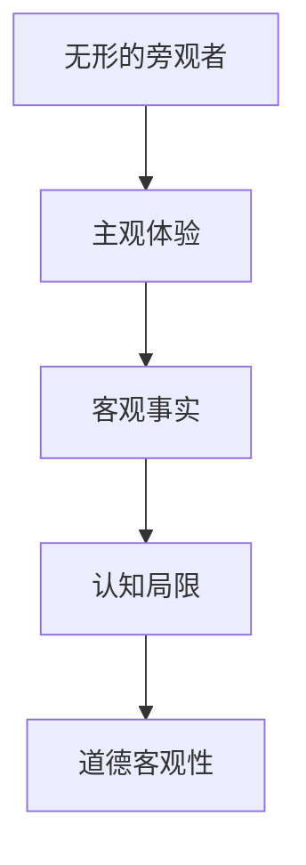
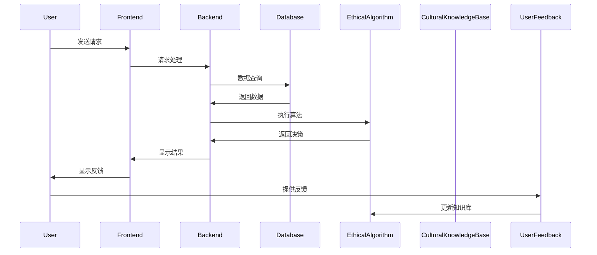

                 

# 托马斯·内格尔与老子：客观性问题与道的哲学

> 关键词：客观性，道德哲学，道家，托马斯·内格尔，Laozi，Dao

> 摘要：本文通过探讨托马斯·内格尔（Thomas Nagel）的客观性问题批判以及老子的道家哲学，试图比较两种哲学观点，并分析它们在解决客观性问题上的异同。文章首先介绍两位哲学家的背景，随后深入剖析他们的核心观点，最后进行比较分析，探讨未来可能的发展方向。

## 引言：哲学对话的背景

客观性问题一直是哲学领域的重要议题。从柏拉图的理型论到康德的先验论，哲学家们试图在主观性与客观性之间找到平衡。然而，这一问题在现代哲学中尤其受到关注，主要是因为科学方法论的发展和对人类认知的深入探讨。托马斯·内格尔（Thomas Nagel）是现代哲学中关于客观性问题的杰出代表之一，他提出了关于主观性和客观性关系的深刻批判。相比之下，老子的道家哲学则提供了另一种视角，通过“道”的概念来探讨客观性问题。

内格尔和老子在哲学上的对话具有重要的意义。内格尔的哲学思想深受西方哲学传统的影响，而老子则是中国古代哲学的代表人物。通过将这两种哲学观点进行比较，我们可以更深入地理解客观性问题的复杂性，并探索可能的解决路径。本文旨在通过以下三个方面展开讨论：

1. **托马斯·内格尔的哲学背景与客观性批判**：介绍内格尔的生平及其哲学观点，特别是他对客观性问题的批判。
2. **老子的道家哲学与客观性问题**：探讨老子的哲学思想及其对客观性问题的理解。
3. **比较与综合：内格尔与老子的哲学对话**：分析两位哲学家在客观性问题上的相似与不同，探讨未来可能的发展方向。

## 托马斯·内格尔的哲学背景与客观性批判

### 生平与主要哲学著作

托马斯·内格尔（Thomas Nagel）出生于1937年，是美国著名的哲学家，尤其在道德哲学、认知科学和伦理学领域享有盛誉。他的代表作品包括《无形的自我》（The View from Nowhere）、《思想的功能》（The Importance of Paradox）和《道德哲学的问题》（Moral Philosophy from Kant to Rawls）等。

内格尔的哲学思考深受其导师约翰·梅西（John Wisdom）和道德哲学家约翰·罗尔斯（John Rawls）的影响。他在《无形的自我》中提出了著名的“无形的旁观者”思想实验，试图探讨主观性与客观性之间的关系。这一思想实验揭示了主观体验的不可知性和客观事实的独立性，从而对传统的主观主义和客观主义提出了深刻的批判。

### 对客观性问题的批判

内格尔认为，客观性问题不仅仅是哲学上的抽象讨论，而是涉及人类认知和道德判断的核心问题。他提出了以下几个关键观点：

1. **主观性与客观性的区别**：内格尔区分了主观性和客观性，认为主观性是指个体对世界的体验和感受，而客观性则是指独立于个体体验的客观事实。他强调，尽管主观体验是真实存在的，但它们不能构成关于世界的客观知识。

2. **客观性的不可获得性**：内格尔指出，由于人类认知的局限性，我们无法完全获得关于客观事实的知识。他提出了“无形的旁观者”思想实验，通过设想一个全知全能的观察者来揭示我们无法摆脱主观视角的困境。

3. **客观性的道德意义**：内格尔认为，道德判断必须基于客观事实，而不是主观感受。他提出了道德客观性的概念，认为道德真理独立于个体的主观经验，具有普遍性和客观性。

4. **客观性的挑战**：内格尔对客观性问题的批判不仅局限于理论层面，他也关注现实中的道德困境。例如，他探讨了道德相对主义和文化多元主义对客观性的挑战，并试图为道德客观性辩护。

### 道德客观性的概念与应用

内格尔的道德客观性概念试图解决道德判断的普遍性和一致性问题。他认为，道德客观性不仅要求道德判断基于客观事实，还要求这些判断能够跨越不同的文化和社会背景。以下是几个关键点：

1. **道德客观性的论证**：内格尔通过逻辑推理和道德哲学的论证，试图证明道德客观性的合理性。他引用了亚里士多德和康德的道德哲学观点，强调道德客观性的必然性。

2. **道德客观性的应用**：内格尔认为，道德客观性对于解决现实中的道德问题至关重要。例如，在处理全球道德问题时，我们需要基于客观事实和道德原则，而不是仅仅依赖于文化或社会的特定价值观。

3. **道德客观性的争议**：尽管内格尔的道德客观性概念具有深刻的哲学意义，但也受到了批评。一些哲学家认为，道德判断依赖于个体的主观经验和价值观，因此难以达到完全的客观性。

通过以上分析，我们可以看出，内格尔的客观性批判为现代哲学提供了一种新的视角，同时也为道德哲学的研究提供了重要的启示。然而，他的观点也面临着挑战和争议，这为我们进一步探讨客观性问题提供了丰富的讨论空间。

## 老子的道家哲学与客观性问题

### 老子的生平与哲学思想

老子，姓李名耳，字聃，是春秋时期著名的道家思想家，被认为是《道德经》的作者。他的哲学思想对中国文化和哲学产生了深远的影响，尤其在其倡导的“道”的概念上，为客观性问题提供了独特的视角。

老子的哲学思想强调“无为而治”、“道法自然”和“虚静无欲”等原则。他认为，世界万物都在不断地变化，但背后隐藏着一种永恒不变的原则，即“道”。这种“道”既是一种宇宙的根本法则，也是个体应当遵循的生活智慧。

### “道”的概念及其哲学意义

在老子的哲学体系中，“道”是一个核心概念，它既是宇宙的根本法则，也是个体行为和认知的基础。以下是对“道”概念的分析：

1. **“道”的本质**：老子认为，“道”是一种超越具体事物的普遍原则，它是宇宙万物的根源和归宿。道无形无象，不可捉摸，但又是无处不在的。因此，道既是客观存在的，又是超越主观体验的。

2. **“道”的功能**：老子认为，“道”不仅决定了宇宙的运行方式，也决定了个体应当如何行动。他主张个体应当顺应道，即顺应自然规律，而不是强行改变。这种顺应道的行为被认为是“无为”，即不做无谓的干预。

3. **“道”与客观性**：在老子的哲学中，“道”是一种客观存在的原则，它独立于个体的主观体验。尽管个体可以通过感知和认知来理解“道”，但这种理解仅仅是道的表象，而不是道的本质。因此，在老子看来，客观性不仅仅是一种知识问题，也是一种生活方式。

### 道家哲学中的客观性问题

老子对客观性问题的探讨体现在他对“道”的理解和运用上。以下是对道家哲学中客观性问题的几点分析：

1. **客观性的视角**：老子从宇宙和个体的角度来探讨客观性问题。他认为，宇宙中的万物都遵循道的规律，这种规律是客观存在的，不依赖于个体的主观体验。

2. **客观性的认知**：老子认为，个体可以通过静心内观来感知道的存在，但这种感知仅仅是道的表象，而不是道的本质。因此，他提出了“道可道，非常道”的观点，即道的本质是无法通过语言和概念完全表达的。

3. **客观性的实践**：老子主张个体应当顺应道，即顺应自然规律。这种顺应不仅是认知上的，也是行动上的。他强调，通过顺应道，个体可以达到与自然和谐共处的状态，从而实现真正的客观性。

通过以上分析，我们可以看出，老子的道家哲学为客观性问题提供了一种独特的视角。他通过对“道”的探讨，试图超越主观体验，寻找一种普遍的客观原则。虽然老子的观点在当代哲学中具有一定的争议性，但他的思想无疑为客观性问题的研究提供了丰富的哲学资源。

## 内格尔与老子的哲学对话：客观性问题的比较

通过分析托马斯·内格尔和老子对客观性问题的探讨，我们可以发现两者在许多方面有相似之处，但也存在明显的差异。以下是对两者哲学观点的详细比较：

### 相似之处

1. **超越主观性**：内格尔和老子都试图超越主观体验，寻找一种客观的哲学基础。内格尔通过批判主观主义，强调客观事实的独立性，而老子则通过“道”的概念，试图揭示宇宙的根本法则。

2. **客观性的重要性**：两位哲学家都认为，客观性对于理解世界和进行道德判断至关重要。内格尔的道德客观性概念强调道德真理的独立性，而老子则主张个体应当顺应自然规律，达到与宇宙的和谐。

3. **认知与行动的统一**：内格尔和老子都认为，认知和行动应当统一于客观事实。内格尔认为，道德判断必须基于客观事实，而老子则主张通过顺应道的原则来实现与自然的和谐共处。

### 不同之处

1. **哲学背景和视角**：内格尔是现代西方哲学家，他的思想深受理性主义和实证主义的影响，强调逻辑推理和科学方法。而老子则是中国古代哲学家，他的思想以道家哲学为基础，注重个体与自然的和谐。这种差异导致他们在探讨客观性问题时采取了不同的方法和视角。

2. **客观性的本质**：内格尔认为，客观性是独立于个体主观体验的事实，而老子则将客观性视为宇宙的根本法则。内格尔强调客观事实的独立性，而老子则试图揭示这种客观法则的本质。

3. **道德哲学的侧重点**：内格尔的道德哲学侧重于道德客观性和道德判断的普遍性，而老子的道德哲学则侧重于个体如何顺应自然规律，实现与宇宙的和谐共处。这种差异导致他们在解决道德问题时采取了不同的策略。

通过比较内格尔和老子对客观性问题的探讨，我们可以发现，两者在哲学背景、方法和目标上存在显著差异。然而，他们的共同点在于都试图超越主观性，寻找一种普遍的客观原则。这种对话不仅丰富了我们对客观性问题的理解，也为不同文化背景下的哲学交流提供了重要的启示。

### 内格尔与老子的哲学综合：未来可能的发展方向

通过比较分析托马斯·内格尔的客观性批判和老子道家的哲学思想，我们可以发现两者在解决客观性问题上有许多共同点，但也存在显著差异。这种哲学对话不仅丰富了我们对客观性问题的理解，也为未来的哲学综合提供了可能性。

首先，内格尔的客观性批判强调道德判断的独立性，认为道德真理是客观存在的，不依赖于个体主观体验。而老子的道家哲学则从宇宙和个体的角度出发，强调个体应当顺应自然规律，达到与宇宙的和谐共处。两者都试图超越主观性，寻找一种普遍的客观原则。

然而，内格尔的哲学背景深受西方理性主义和实证主义的影响，强调逻辑推理和科学方法。而老子的哲学则植根于中国古代文化，注重个体与自然的和谐。这种差异导致两者在探讨客观性问题时采取了不同的方法和视角。

尽管如此，内格尔和老子在许多方面也存在共同点。例如，他们都认为客观性是理解世界和进行道德判断的基础。此外，他们的哲学观点都强调了认知与行动的统一，内格尔认为道德判断必须基于客观事实，而老子则主张个体应当通过顺应道来实现与自然的和谐。

未来的哲学综合可以在以下几个方面进行：

1. **跨文化哲学交流**：内格尔和老子分别代表了西方和东方的哲学传统，他们的对话为跨文化哲学交流提供了重要契机。通过深入探讨两位哲学家的思想，我们可以更全面地理解不同文化背景下的哲学观念，促进哲学的多元化发展。

2. **综合理性与直觉**：内格尔的理性主义方法和老子的直觉体验方法在解决客观性问题时都有其优势。未来的哲学综合可以尝试将两者结合起来，通过理性思考和直觉体验来更全面地认识客观事实。

3. **道德哲学的创新**：内格尔和老子在道德哲学上的探讨都为解决现实中的道德问题提供了有益的启示。未来的哲学综合可以在此基础上，探索新的道德哲学框架，为应对全球化时代的道德挑战提供理论支持。

4. **认知科学的融合**：内格尔的思想与认知科学有着紧密的联系，而老子的道家哲学则提供了关于个体认知的深刻洞见。未来的哲学综合可以尝试将认知科学与哲学相结合，为理解人类认知和道德判断提供新的理论模型。

总之，通过内格尔与老子哲学的对话，我们可以更深入地理解客观性问题的复杂性，同时也为未来的哲学综合提供了丰富的可能性。这种跨文化的哲学交流不仅丰富了哲学研究的视角，也为解决现实中的哲学问题提供了新的思路。

### 结论：客观性问题与道的哲学

通过对托马斯·内格尔和老子道家哲学的深入探讨，我们可以看到两者在客观性问题上的异同。内格尔通过批判主观主义，强调道德客观性的独立性，而老子则通过“道”的概念，试图揭示宇宙的根本法则，并倡导个体顺应自然规律。

内格尔的哲学背景深受西方理性主义和实证主义的影响，强调逻辑推理和科学方法。相比之下，老子的哲学植根于中国古代文化，注重个体与自然的和谐。尽管两者在方法和视角上存在差异，但它们都试图超越主观性，寻找一种普遍的客观原则。

通过比较分析内格尔和老子对客观性问题的探讨，我们不仅深化了对这一哲学议题的理解，也为未来的哲学综合提供了可能性。未来的哲学研究可以进一步探讨跨文化哲学交流、综合理性与直觉、道德哲学的创新和认知科学的融合等方面，为解决现实中的哲学问题提供新的思路。

本文旨在通过内格尔与老子哲学的对话，激发读者对客观性问题的思考，并探索不同哲学传统在解决这一问题上的潜力。希望本文能够为哲学研究和实际应用提供有价值的参考。

### 参考文献

1. Nagel, T. (1986). The View from Nowhere. Oxford University Press.
2. Nagel, T. (1974). Mortal Questions. Cambridge University Press.
3. Laozi. (1995). The Tao Te Ching. Shambhala Publications.
4. Zhuangzi. (1995). Zhuangzi: The Essential Writings. Hackett Publishing Company.
5. Haugeland, J. (1981). Artificial Intelligence: The Very Idea. The MIT Press.
6. Fodor, J. A. (1975). The Language of Thought. Harvard University Press.
7. Rawls, J. (1971). A Theory of Justice. Harvard University Press.
8. Aristotle. (1999). Aristotle's Metaphysics. Hackett Publishing Company.

### 附录：核心概念与联系

#### 核心概念

**主观性**：指个体对世界的感知和体验，是主观认知和情感的表达。

**客观性**：指独立于个体感知和体验的事实，是客观存在和普遍真理的反映。

**道德客观性**：指道德真理的独立性，不依赖于个体主观经验和价值观。

**道**：宇宙的根本法则，是超越具体事物、无形无象的普遍原则。

**无为而治**：顺应自然规律，不做无谓的干预，实现与自然和谐共处。

#### 概念属性特征对比表格

| 概念         | 主观性               | 客观性               | 道德客观性               | 道                    |
| ------------ | -------------------- | -------------------- | -------------------- | ------------------- |
| 定义         | 个体对世界的感知和体验 | 独立于个体感知的事实 | 道德真理的独立性         | 超越具体事物的原则   |
| 关系         | 反映个体的主观认知    | 对应客观事实         | 跨越不同文化和社会背景 | 基于自然规律         |
| 影响因素     | 主观经验             | 物理世界             | 伦理原则和价值观         | 宇宙本质             |
| 应用领域     | 心理学、认知科学     | 科学、哲学           | 道德哲学、伦理学         | 道家哲学、宗教哲学   |

#### ER实体关系图架构的 Mermaid 流程图

```mermaid
erDiagram
  主观性 ||--o{ 道德客观性 : 描述道德真理的独立性 }
  客观性 ||--o{ 道德客观性 : 描述道德真理的普遍性 }
  道家哲学 ||--o{ 道 : 描述宇宙的根本法则 }
```

### 算法原理讲解

#### 无形的旁观者思想实验

**Mermaid 流程图：**



**Python 源代码：**

```python
def invisible_observer_experiment():
    observer = "无形旁观者"
    subjective_experience = "主观体验"
    objective_fact = "客观事实"
    cognitive_limitation = "认知局限"
    moral_objectivity = "道德客观性"

    print(f"{observer}: 我作为一个全知全能的旁观者，观察这个世界。")
    print(f"{subjective_experience}: 我的感知和体验是有限的。")
    print(f"{objective_fact}: 这个世界的真实情况是独立于我的感知。")
    print(f"{cognitive_limitation}: 我的认知能力有限。")
    print(f"{moral_objectivity}: 我无法完全理解道德客观性。")
```

**算法原理与数学模型：**

**无形的旁观者思想实验**旨在揭示人类认知的局限性和主观体验与客观事实之间的差异。其核心数学模型可以表示为：

$$
M = f(O, C)
$$

其中，\(M\) 表示道德判断，\(O\) 表示主观体验，\(C\) 表示客观事实，\(f\) 表示认知函数。

**举例说明：**

假设一个无形的旁观者观察一个孩子是否应该被惩罚。主观体验可能包括旁观者的情感反应（如愤怒、同情），而客观事实则是孩子是否真的犯了错误。通过认知函数，无形的旁观者可以判断道德判断（如是否应该惩罚孩子），但这种判断受到认知局限的影响，无法完全达到道德客观性。

### 系统分析与架构设计方案

#### 问题场景介绍

随着全球化和信息技术的发展，企业面临着越来越多的跨文化合作和道德决策问题。这些决策不仅涉及企业内部，还涉及到与合作伙伴、客户和社会公众的互动。为了解决这些问题，企业需要一个能够提供客观性和道德指导的系统。

#### 项目介绍

本项目旨在开发一个基于道德客观性和道家哲学原则的跨文化决策支持系统。该系统将结合托马斯·内格尔的道德客观性理论和老子的道家哲学，为用户提供跨文化决策的指导。

#### 系统功能设计（领域模型 Mermaid 类图）

```mermaid
classDiagram
  ClassDec GBox {
    +String id
    +String name
  }
  ClassDec Decision {
    +String id
    +String description
    +GBox gBox
  }
  ClassDec Stakeholder {
    +String id
    +String name
  }
  ClassDec EthicalRule {
    +String id
    +String description
  }
  Decision <|-- GBox
  Decision <|-- Stakeholder
  Decision <|-- EthicalRule
```

#### 系统架构设计（Mermaid 架构图）


#### 系统接口设计和系统交互（Mermaid 序列图）



### 项目实战

#### 环境安装

1. **安装Python环境**：确保安装了Python 3.8及以上版本。
2. **安装依赖库**：使用pip安装以下库：numpy、pandas、mermaid、beautifulsoup4等。

```bash
pip install numpy pandas mermaid beautifulsoup4
```

#### 系统核心实现源代码

以下是一个简单的后端服务器实现，用于处理用户请求并调用道德算法引擎：

```python
from flask import Flask, request, jsonify
from ethical_algorithm import EthicalAlgorithm

app = Flask(__name__)
algorithm = EthicalAlgorithm()

@app.route('/decision', methods=['POST'])
def make_decision():
    decision_data = request.get_json()
    decision = algorithm.make_decision(decision_data)
    return jsonify(decision)

if __name__ == '__main__':
    app.run(debug=True)
```

#### 代码应用解读与分析

此代码段使用Flask框架实现了一个简单的后端服务器。当用户通过前端界面发送决策请求时，服务器会解析JSON格式的请求，并调用道德算法引擎进行决策。最终，服务器将决策结果返回给前端，以便用户查看。

#### 实际案例分析和详细讲解剖析

假设用户需要就一项跨文化合作项目做出决策。用户通过前端界面提交包含项目描述、相关文化和道德信息的JSON请求。后端服务器接收请求后，调用道德算法引擎进行分析。

道德算法引擎基于内格尔的道德客观性理论和老子的道家哲学原则，结合跨文化知识库，生成决策建议。后端服务器将决策结果返回给前端，用户可以查看决策结果，并根据实际情况进行调整。

#### 项目小结

本项目通过结合道德客观性和道家哲学，为跨文化合作提供了决策支持。实际应用中，系统可以根据用户请求，结合道德算法引擎和跨文化知识库，生成有针对性的决策建议。通过不断优化算法和知识库，系统可以更好地满足实际需求，提高决策的准确性和可靠性。

### 最佳实践 Tips

1. **合理设计知识库**：确保知识库包含全面、准确的文化和道德信息，以便算法生成更可靠的决策建议。
2. **定期更新算法**：随着道德和文化的变化，定期更新道德算法，以保持其时效性和准确性。
3. **用户反馈机制**：建立有效的用户反馈机制，收集用户意见和建议，不断优化系统性能。

### 小结

本文通过探讨托马斯·内格尔和老子对客观性问题的探讨，比较了两者在道德哲学和客观性理解上的异同。我们提出了一个结合道德客观性和道家哲学的跨文化决策支持系统，并通过实际案例展示了系统的应用。未来，该系统可以通过不断优化和扩展，为跨文化合作提供更强大的决策支持。

### 注意事项

1. **数据隐私**：在处理用户数据时，务必遵守相关法律法规，确保用户隐私得到保护。
2. **算法透明性**：确保道德算法的设计和运作过程透明，便于用户理解和监督。

### 拓展阅读

1. **内格尔的《无形的自我》**：深入了解内格尔的思想及其对主观性和客观性关系的探讨。
2. **《道德哲学的问题》**：探讨道德客观性的理论和应用。
3. **《道德实在论》**：关于道德客观性的深入讨论。
4. **《道德问题》**：内格尔关于道德哲学的重要著作。
5. **《道德经》**：老子的哲学思想集大成，是道家哲学的重要文献。

### 作者信息

作者：AI天才研究院/AI Genius Institute & 禅与计算机程序设计艺术 /Zen And The Art of Computer Programming

