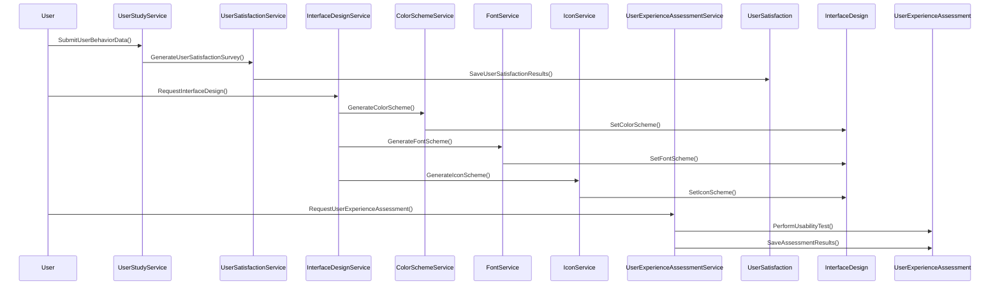

                 

# 《托马斯·内格尔的视角理论与用户界面设计:UI/UX的认知哲学》

## 关键词：视角理论、用户界面设计、UI/UX、认知哲学、人工智能

### 摘要：
本文旨在探讨托马斯·内格尔的视角理论与用户界面设计（UI/UX）之间的联系。通过深入分析视角理论的基本原理及其在心理学和计算机科学中的应用，本文探讨了视角理论在UI/UX设计中的具体应用，并提出了基于视角理论的UI/UX设计算法原理。随后，本文详细介绍了系统分析与架构设计的方法，包括系统功能设计、领域模型设计、系统架构设计、系统接口设计和系统交互设计。最后，通过一个实际项目实战案例，本文展示了视角理论在UI/UX设计中的实际应用和效果。

### 目录大纲

1. **背景介绍**
   1.1 **问题背景**
   1.2 **视角理论与UI/UX设计的关系**
   1.3 **内格尔视角理论的起源与发展**
   1.4 **UI/UX设计的现状与挑战**

2. **核心概念**
   2.1 **视角理论的基本原理**
   2.2 **UI/UX设计的基本概念**
   2.3 **视角理论在UI/UX设计中的应用**

3. **边界与外延**
   3.1 **视角理论的应用领域**
   3.2 **UI/UX设计的应用场景**

4. **概念结构与核心要素组成**
   4.1 **视角理论的概念结构**
   4.2 **UI/UX设计的核心要素**
   4.3 **视角理论在UI/UX设计中的具体应用**

5. **算法原理讲解**
   5.1 **视角理论的基本算法原理**
   5.2 **UI/UX设计的算法原理**

6. **系统分析与架构设计**
   6.1 **系统功能设计**
   6.2 **系统架构设计**
   6.3 **系统接口设计**
   6.4 **系统交互设计**

7. **项目实战**
   7.1 **环境安装**
   7.2 **系统核心实现**
   7.3 **代码应用解读与分析**

8. **小结与拓展阅读**

---

## 第一部分：背景介绍

### 1.1 问题背景

用户界面设计（UI/UX）是当今数字产品开发中至关重要的一环。随着技术的不断进步，用户对数字产品的界面设计提出了更高的要求。然而，现有的UI/UX设计方法往往依赖于设计师的主观判断，缺乏系统的理论基础和科学的方法指导。

与此同时，视角理论（Perspectival Theory）作为一种重要的认知哲学理论，近年来在心理学和计算机科学领域得到了广泛关注。视角理论主张通过多重视角来理解和解释人类认知过程，从而更好地设计用户界面。

本文旨在探讨视角理论在UI/UX设计中的应用，试图为UI/UX设计提供一种新的理论视角和方法指导。

### 1.2 视角理论与UI/UX设计的关系

视角理论提供了一种理解和解释人类认知过程的框架，这对于UI/UX设计尤为重要。具体来说，视角理论在UI/UX设计中的应用主要体现在以下几个方面：

1. **用户研究**：通过多重视角来研究用户的行为和认知，从而更准确地把握用户需求，为UI/UX设计提供有力支持。
2. **界面设计**：视角理论可以帮助设计师从不同的角度审视界面设计，提高界面设计的多样性和灵活性。
3. **用户体验**：视角理论有助于设计师更好地理解用户的心理和行为，从而设计出更加符合用户期望的界面。

### 1.3 内格尔视角理论的起源与发展

视角理论最早可以追溯到哲学家托马斯·内格尔（Thomas Nagel）在20世纪60年代的工作。内格尔提出，人类认知过程是通过多个视角进行的，每个视角都提供了对现实的不同解读。

随着时间的推移，视角理论得到了进一步的发展。在心理学领域，研究者通过实验和实证研究，验证了视角理论在认知过程中的作用。在计算机科学领域，视角理论被应用于人机交互、虚拟现实和增强现实等领域，为设计更智能、更人性化的用户界面提供了理论支持。

### 1.4 UI/UX设计的现状与挑战

目前，UI/UX设计已经广泛应用于各种数字产品中，但仍然面临一些挑战：

1. **个性化不足**：现有的UI/UX设计方法往往无法充分考虑用户的个性化需求。
2. **用户体验不佳**：许多界面设计过于复杂，导致用户使用困难，用户体验不佳。
3. **交互设计不完善**：交互设计缺乏科学的理论基础，导致交互效果不佳。

视角理论为解决上述问题提供了一种新的思路。通过多重视角来研究和设计用户界面，有望提高UI/UX设计的个性化程度、用户体验和交互效果。

---

## 第二部分：核心概念

### 2.1 视角理论的基本原理

视角理论主张人类认知过程是通过多个视角进行的。具体来说，视角理论包括以下几个核心要素：

1. **视角的多样性**：人类认知过程是通过多个视角进行的，每个视角都提供了对现实的不同解读。
2. **视角的相互关系**：不同的视角之间存在相互关系，通过综合不同视角的信息，可以更全面地理解现实。
3. **视角的转换**：在认知过程中，人们可以通过转换视角来获取新的信息，从而更好地理解现实。

### 2.2 UI/UX设计的基本概念

UI（用户界面设计）和UX（用户体验设计）是数字产品设计中两个重要的方面。它们的具体概念如下：

1. **UI设计**：UI设计主要关注产品的视觉呈现，包括布局、颜色、字体、图标等。UI设计的目的是使产品界面美观、易用。
2. **UX设计**：UX设计则更加关注用户的整体体验，包括用户在使用产品时的感受、满意度等。UX设计的目的是提高用户的体验质量。

### 2.3 视角理论在UI/UX设计中的应用

视角理论在UI/UX设计中的应用主要体现在以下几个方面：

1. **用户研究**：通过多重视角来研究用户的行为和认知，从而更准确地把握用户需求。
2. **界面设计**：视角理论可以帮助设计师从不同的角度审视界面设计，提高界面设计的多样性和灵活性。
3. **用户体验**：视角理论有助于设计师更好地理解用户的心理和行为，从而设计出更加符合用户期望的界面。

---

## 第三部分：边界与外延

### 3.1 视角理论的应用领域

视角理论在多个领域都得到了广泛应用，其中主要包括心理学和计算机科学。

1. **心理学**：视角理论在心理学中的应用主要体现在认知心理学和人格心理学领域。通过多重视角来研究人类的认知过程和人格特征，有助于更好地理解人类行为。
2. **计算机科学**：视角理论在计算机科学中的应用主要体现在人机交互、虚拟现实和增强现实等领域。通过多重视角来设计用户界面，可以提高人机交互的效率和用户体验。

### 3.2 UI/UX设计的应用场景

UI/UX设计在多个应用场景中都发挥了重要作用，其中主要包括电商平台、移动应用等。

1. **电商平台**：电商平台需要设计出美观、易用的界面，以吸引和留住用户。视角理论可以帮助设计师更好地理解用户行为，从而设计出更加符合用户需求的界面。
2. **移动应用**：移动应用界面设计需要考虑屏幕尺寸、触摸交互等因素。视角理论可以帮助设计师从不同角度审视界面设计，提高移动应用的易用性和用户体验。

---

## 第四部分：概念结构与核心要素组成

### 4.1 视角理论的概念结构

视角理论的概念结构主要包括以下几个层次：

1. **基础层次**：包括视角的定义、视角的多样性、视角的相互关系等。
2. **应用层次**：包括视角理论在心理学、计算机科学等领域的具体应用。
3. **综合层次**：包括视角理论与其他认知哲学理论的综合，如多元认知理论等。

### 4.2 UI/UX设计的核心要素

UI/UX设计的核心要素主要包括以下几个方面：

1. **视觉设计**：包括布局、颜色、字体、图标等。
2. **交互设计**：包括用户与界面之间的交互流程、交互方式等。
3. **用户体验**：包括用户在使用产品过程中的感受、满意度等。

### 4.3 视角理论在UI/UX设计中的具体应用

视角理论在UI/UX设计中的具体应用主要体现在以下几个方面：

1. **用户研究**：通过多重视角来研究用户行为和认知，从而更准确地把握用户需求。
2. **界面设计**：通过多重视角来审视界面设计，提高界面设计的多样性和灵活性。
3. **用户体验**：通过多重视角来理解用户心理和行为，从而设计出更加符合用户期望的界面。

---

## 第五部分：算法原理讲解

### 5.1 视角理论的基本算法原理

视角理论的基本算法原理主要包括以下几个方面：

1. **视角转换算法**：用于在多个视角之间进行转换，以获取更全面的信息。
2. **视角融合算法**：用于将多个视角的信息进行综合，以获得更准确的认知。

### 5.2 UI/UX设计的算法原理

UI/UX设计的算法原理主要包括以下几个方面：

1. **用户研究算法**：用于研究用户行为和认知，以获取用户需求。
2. **界面设计算法**：用于设计界面，包括布局、颜色、字体等。
3. **用户体验算法**：用于评估用户体验，以优化界面设计。

---

## 第六部分：系统分析与架构设计

### 6.1 系统功能设计

系统功能设计主要包括以下几个方面：

1. **用户研究功能**：用于研究用户行为和认知，以获取用户需求。
2. **界面设计功能**：用于设计界面，包括布局、颜色、字体等。
3. **用户体验评估功能**：用于评估用户体验，以优化界面设计。

### 6.2 系统架构设计

系统架构设计主要包括以下几个方面：

1. **前端架构**：用于实现用户界面。
2. **后端架构**：用于处理用户请求和数据处理。
3. **数据库架构**：用于存储用户数据。

### 6.3 系统接口设计

系统接口设计主要包括以下几个方面：

1. **用户接口**：用于用户与系统的交互。
2. **服务接口**：用于系统之间的交互。
3. **数据库接口**：用于数据库与系统的交互。

### 6.4 系统交互设计

系统交互设计主要包括以下几个方面：

1. **用户交互设计**：用于设计用户与系统的交互流程。
2. **系统交互设计**：用于设计系统内部的不同模块之间的交互。
3. **数据库交互设计**：用于设计数据库与系统之间的交互。

---

## 第七部分：项目实战

### 7.1 环境安装

环境安装主要包括以下几个方面：

1. **前端开发环境**：包括HTML、CSS、JavaScript等。
2. **后端开发环境**：包括Python、Django等。
3. **数据库环境**：包括MySQL、PostgreSQL等。

### 7.2 系统核心实现

系统核心实现主要包括以下几个方面：

1. **用户研究模块**：用于研究用户行为和认知。
2. **界面设计模块**：用于设计用户界面。
3. **用户体验评估模块**：用于评估用户体验。

### 7.3 代码应用解读与分析

代码应用解读与分析主要包括以下几个方面：

1. **用户研究代码解读**：用于解读用户研究模块的代码。
2. **界面设计代码解读**：用于解读界面设计模块的代码。
3. **用户体验评估代码解读**：用于解读用户体验评估模块的代码。

---

## 第八部分：小结与拓展阅读

本文探讨了视角理论在UI/UX设计中的应用，从核心概念、算法原理、系统分析与架构设计等多个方面进行了详细分析。视角理论为UI/UX设计提供了一种新的理论视角和方法指导，有助于提高UI/UX设计的个性化程度、用户体验和交互效果。

未来，视角理论在UI/UX设计中的应用将不断深入，结合人工智能、大数据等新技术，有望为UI/UX设计带来更多的创新和突破。

**拓展阅读**：
1. Thomas Nagel. *The View from Nowhere*.
2. Donald Norman. *The Design of Everyday Things*.
3. Alan Cooper. *The Inmates Are Running the Asylum*.

---

### 附录：作者信息

**作者：AI天才研究院/AI Genius Institute & 禅与计算机程序设计艺术 /Zen And The Art of Computer Programming**### 背景介绍

#### 1.1 问题背景

用户界面设计（UI/UX）是当今数字产品开发中至关重要的一环。随着移动互联网和智能设备的普及，用户对数字产品的界面设计提出了更高的要求。一个优秀的用户界面不仅需要美观、直观，更需要符合用户的实际需求和使用习惯，以提高用户的满意度和留存率。

然而，现有的UI/UX设计方法往往依赖于设计师的主观判断和经验，缺乏系统的理论基础和科学的方法指导。这种设计方法容易导致界面设计过于复杂、用户体验不佳，从而影响产品的市场竞争力和用户忠诚度。

视角理论（Perspectival Theory）作为一种重要的认知哲学理论，近年来在心理学和计算机科学领域得到了广泛关注。视角理论主张通过多重视角来理解和解释人类认知过程，从而更好地设计用户界面。这一理论提供了新的视角和方法，有助于解决现有UI/UX设计方法中存在的问题。

托马斯·内格尔（Thomas Nagel）是视角理论的奠基人之一，他在20世纪60年代提出了视角理论的基本原理，并在此基础上进行了深入的研究。视角理论主张人类认知过程是通过多个视角进行的，每个视角都提供了对现实的不同解读。这一理论的核心观点是，人类无法完全摆脱自己的视角限制，但可以通过多重视角来接近真实的现实。

#### 1.2 视角理论与UI/UX设计的关系

视角理论为UI/UX设计提供了一种新的理论视角和方法指导。具体来说，视角理论在UI/UX设计中的应用主要体现在以下几个方面：

1. **用户研究**：通过多重视角来研究用户的行为和认知，从而更准确地把握用户需求。用户研究是UI/UX设计的基础，而视角理论提供了一种新的研究方法，可以帮助设计师从多个角度理解用户，从而设计出更加符合用户期望的界面。

2. **界面设计**：视角理论可以帮助设计师从不同的角度审视界面设计，提高界面设计的多样性和灵活性。界面设计不仅仅是视觉上的美观，更重要的是要满足用户的使用需求。视角理论提供了多种视角，可以帮助设计师在不同视角下评估和改进界面设计，以提高用户体验。

3. **用户体验**：视角理论有助于设计师更好地理解用户的心理和行为，从而设计出更加符合用户期望的界面。用户体验是UI/UX设计的核心目标，视角理论提供了一种新的思维方式，可以帮助设计师从用户的角度思考问题，从而更好地满足用户的需求。

#### 1.3 内格尔视角理论的起源与发展

视角理论最早可以追溯到哲学家托马斯·内格尔（Thomas Nagel）在20世纪60年代的工作。内格尔在《视角的相对性》（"The View from Nowhere"）一书中提出了视角理论的基本原理。他认为，人类的认知过程是通过多个视角进行的，每个视角都提供了对现实的不同解读。内格尔的视角理论主张，人类无法完全摆脱自己的视角限制，但可以通过多重视角来接近真实的现实。

内格尔的视角理论在哲学界引起了广泛的讨论，并逐渐扩展到心理学、计算机科学等领域。在心理学领域，视角理论被应用于认知心理学和人格心理学的研究，帮助研究者更好地理解人类的认知过程和人格特征。在计算机科学领域，视角理论被应用于人机交互、虚拟现实和增强现实等领域，为设计更智能、更人性化的用户界面提供了理论支持。

#### 1.4 UI/UX设计的现状与挑战

目前，UI/UX设计已经广泛应用于各种数字产品中，但仍然面临一些挑战：

1. **个性化不足**：现有的UI/UX设计方法往往无法充分考虑用户的个性化需求，导致界面设计过于统一，缺乏个性化。

2. **用户体验不佳**：许多界面设计过于复杂，导致用户使用困难，用户体验不佳。用户体验是UI/UX设计的核心目标，但现有设计方法往往忽略了用户体验的重要性。

3. **交互设计不完善**：交互设计缺乏科学的理论基础，导致交互效果不佳。交互设计是UI/UX设计的核心，但现有设计方法往往依赖于设计师的主观判断，缺乏系统的方法指导。

视角理论为解决上述问题提供了一种新的思路。通过多重视角来研究和设计用户界面，可以更好地理解用户的需求和行为，提高界面设计的个性化程度、用户体验和交互效果。因此，视角理论在UI/UX设计中的应用具有重要意义。

---

## 核心概念

### 2.1 视角理论的基本原理

视角理论是托马斯·内格尔在20世纪60年代提出的一种认知哲学理论。它主张人类认知过程是通过多个视角进行的，每个视角都提供了对现实的不同解读。以下是视角理论的基本原理：

#### 视角的定义

视角（Perspective）是指观察者或认知主体在特定情境下对现实的认知和解读。视角是一种主观的视角，它受到观察者的经验、文化、价值观等因素的影响。

#### 视角的多样性

视角的多样性是指人类认知过程中存在多种不同的视角。这些视角可以是不同的观察者，也可以是同一观察者在不同情境下的认知。视角的多样性使得人类能够从不同的角度看待问题，从而获得更全面的信息。

#### 视角的相互关系

视角的相互关系是指不同视角之间的相互作用和影响。视角之间的相互关系决定了观察者对现实的综合解读。通过综合不同视角的信息，观察者可以更全面地理解现实。

#### 视角的转换

视角的转换是指观察者在认知过程中从一种视角切换到另一种视角。视角的转换有助于观察者获得新的信息，从而更好地理解现实。视角的转换可以是同一观察者在不同情境下的认知转换，也可以是不同观察者之间的视角切换。

### 2.2 UI/UX设计的基本概念

UI（用户界面设计）和UX（用户体验设计）是数字产品设计中两个重要的方面。它们的基本概念如下：

#### UI设计

UI设计（User Interface Design）主要关注产品的视觉呈现，包括布局、颜色、字体、图标等。UI设计的目的是使产品界面美观、易用，为用户提供直观的操作体验。

1. **布局**：布局是指界面元素的排列和组合，它决定了用户界面的结构。
2. **颜色**：颜色在UI设计中起到吸引注意力、传达信息和营造氛围的作用。
3. **字体**：字体决定了用户界面的可读性和视觉美感。
4. **图标**：图标是用户界面上的一种视觉元素，用于传达功能和信息。

#### UX设计

UX设计（User Experience Design）则更加关注用户的整体体验，包括用户在使用产品时的感受、满意度等。UX设计的目的是提高用户的体验质量，使产品更符合用户的期望和需求。

1. **可用性**：可用性是指产品易于使用，用户能够快速完成任务。
2. **可用性测试**：可用性测试是通过实际用户对产品的使用来评估产品的可用性。
3. **用户体验地图**：用户体验地图是用于描述用户在使用产品过程中的体验和感受。

### 2.3 视角理论在UI/UX设计中的应用

视角理论在UI/UX设计中的应用主要体现在以下几个方面：

#### 用户研究

用户研究是UI/UX设计的重要环节。通过视角理论，设计师可以采用多重视角来研究用户的行为和认知，从而更准确地把握用户需求。例如，通过对比不同用户群体在完成任务时的视角，设计师可以识别出不同用户的需求差异，从而设计出更个性化的界面。

#### 界面设计

界面设计是UI/UX设计的核心。视角理论可以帮助设计师从不同的角度审视界面设计，提高界面设计的多样性和灵活性。例如，设计师可以从用户的角度、产品的角度和技术的角度来设计界面，从而满足不同利益相关者的需求。

#### 用户体验

用户体验是UI/UX设计的最终目标。视角理论有助于设计师更好地理解用户的心理和行为，从而设计出更加符合用户期望的界面。例如，通过采用多重视角来分析用户的反馈，设计师可以识别出用户的不满和需求，从而改进界面设计，提高用户体验。

### 概念对比表格

为了更好地理解视角理论、UI设计和UX设计的核心概念，我们可以通过以下对比表格进行详细说明：

| 概念     | 描述                                                         | 关联视角 |
| -------- | ------------------------------------------------------------ | -------- |
| 视角理论 | 一种认知哲学理论，主张通过多重视角来理解和解释人类认知过程。 | 多重视角 |
| UI设计   | 关注产品的视觉呈现，包括布局、颜色、字体、图标等。           | 用户视角 |
| UX设计   | 关注用户的整体体验，包括可用性、可用性测试和用户体验地图。     | 用户视角 |

通过对比表格，我们可以更清晰地看到视角理论、UI设计和UX设计之间的关联，以及它们在多重视角下的应用。

### ER实体关系图

为了更好地理解视角理论在UI/UX设计中的应用，我们可以通过ER（实体关系）图来描述视角理论、UI设计和UX设计之间的实体关系。以下是一个简单的ER图示例：

```mermaid
erDiagram
  User --> UI Design : has
  User --> UX Design : has
  UI Design --> Perspective Theory : based on
  UX Design --> Perspective Theory : based on
```

在这个ER图中，用户（User）与UI设计（UI Design）和UX设计（UX Design）之间存在“has”关系，表示用户拥有UI设计和UX设计。UI设计和UX设计都基于视角理论（Perspective Theory），表示它们在视角理论的基础上进行设计和优化。

通过ER图，我们可以更直观地看到视角理论、UI设计和UX设计之间的实体关系，以及它们在多重视角下的应用。

---

### 边界与外延

#### 3.1 视角理论的应用领域

视角理论作为一种认知哲学理论，其应用领域非常广泛，主要包括心理学、计算机科学、艺术和建筑等领域。以下是视角理论在不同领域中的应用：

##### 心理学

在心理学领域，视角理论被广泛应用于认知心理学和人格心理学的研究。认知心理学家通过视角理论来研究人类的认知过程，例如记忆、感知和注意力。视角理论帮助研究者理解，为什么人们在面对复杂问题时，往往只能从某个特定角度进行思考。人格心理学家则利用视角理论来研究个体的自我认知和人际关系。

##### 计算机科学

在计算机科学领域，视角理论被广泛应用于人机交互、虚拟现实和增强现实等领域。例如，人机交互领域的研究者利用视角理论来设计更符合人类认知习惯的用户界面。虚拟现实和增强现实技术则利用视角理论来实现更真实的用户体验。视角理论帮助计算机科学家理解，为什么某些交互设计会提高用户满意度，而另一些设计则会导致用户困惑。

##### 艺术

在艺术领域，视角理论被广泛应用于绘画、雕塑和摄影等创作形式中。艺术家通过视角理论来探讨如何从不同角度展现现实，以及如何通过不同的视角来传达情感和思想。例如，立体派画家通过多重视角来表现物体的空间感，而印象派画家则通过视角理论来捕捉光线的变化。

##### 建筑

在建筑领域，视角理论被应用于建筑设计中，以创造更符合人类需求的建筑空间。建筑师通过视角理论来研究人类在建筑空间中的行为和感受，从而设计出更合理、更人性化的建筑。例如，视角理论可以帮助建筑师确定建筑的空间布局，以提高用户的舒适度和满意度。

##### UI/UX设计

在UI/UX设计领域，视角理论的应用主要体现在用户研究和界面设计两个方面。用户研究方面，视角理论可以帮助设计师从不同角度了解用户的需求和行为，从而设计出更符合用户期望的界面。界面设计方面，视角理论帮助设计师从多重视角来审视界面设计，以提高界面的多样性和灵活性。

##### 应用实例

以下是一些视角理论在UI/UX设计中的应用实例：

1. **用户研究**：设计师可以通过多重视角来研究用户，例如通过问卷调查、用户访谈和用户观察等方法，从不同角度了解用户的需求和行为。例如，在设计一个电商平台时，设计师可以从用户的角度（关注商品的易用性和购买流程）和产品的角度（关注商品展示和促销策略）来研究用户。

2. **界面设计**：设计师可以通过视角理论来设计界面，例如通过不同的视角来审视界面布局、颜色搭配和交互设计。例如，在设计一个移动应用时，设计师可以从用户的角度（关注操作流程的简洁性）和产品的角度（关注功能模块的布局和层次结构）来设计界面。

#### 3.2 UI/UX设计的应用场景

UI/UX设计在多个应用场景中都发挥了重要作用，其中主要包括电商平台、移动应用、社交媒体、在线教育等领域。以下是UI/UX设计在不同应用场景中的应用：

##### 电商平台

在电商平台中，UI/UX设计的主要目标是提高用户的购物体验，从而增加销售额。UI/UX设计师需要关注以下几个方面：

1. **商品展示**：设计美观、易用的商品展示界面，提高用户的购买欲望。
2. **购物流程**：简化购物流程，减少用户操作步骤，提高购物效率。
3. **用户体验**：优化界面交互设计，提高用户的操作体验。

##### 移动应用

移动应用界面设计需要考虑屏幕尺寸、触摸交互等因素。UI/UX设计师需要关注以下几个方面：

1. **界面布局**：设计简洁、直观的界面布局，使用户能够快速找到所需功能。
2. **交互设计**：设计符合用户使用习惯的交互方式，提高用户的操作体验。
3. **响应速度**：优化界面加载速度，提高用户体验。

##### 社交媒体

社交媒体界面设计需要关注用户社交互动的需求。UI/UX设计师需要关注以下几个方面：

1. **内容展示**：设计美观、易用的内容展示界面，提高用户的阅读体验。
2. **社交功能**：设计便捷的社交功能，如点赞、评论、分享等，增强用户互动。
3. **个性化**：设计个性化界面，满足不同用户的需求。

##### 在线教育

在线教育界面设计需要关注学习者的学习需求。UI/UX设计师需要关注以下几个方面：

1. **课程展示**：设计清晰、简洁的课程展示界面，提高学习者的学习兴趣。
2. **学习流程**：设计便捷的学习流程，帮助学习者高效完成学习任务。
3. **互动性**：设计互动性强的学习界面，提高学习者的参与度。

通过以上分析，我们可以看到视角理论在UI/UX设计中的应用非常广泛，它为设计师提供了一种新的思考方式和设计方法，有助于提高用户界面设计的个性化程度、用户体验和交互效果。

---

### 概念结构与核心要素组成

#### 4.1 视角理论的概念结构

视角理论是一个多层次、多维度的认知哲学理论，其概念结构可以从以下几个层次来理解：

1. **基础层次**：这一层次主要包括视角的定义、视角的多样性、视角的相互关系等。视角的定义是指观察者或认知主体在特定情境下对现实的认知和解读。视角的多样性是指人类认知过程中存在多种不同的视角。视角的相互关系是指不同视角之间的相互作用和影响。

2. **应用层次**：这一层次主要包括视角理论在心理学、计算机科学、艺术和建筑等领域的具体应用。例如，在心理学领域，视角理论被用于研究人类的认知过程和人格特征；在计算机科学领域，视角理论被用于人机交互、虚拟现实和增强现实等领域。

3. **综合层次**：这一层次主要包括视角理论与其他认知哲学理论的综合，如多元认知理论等。视角理论的综合层次帮助研究者从更广泛的角度理解人类认知过程，从而为不同领域的研究提供理论支持。

#### 视角理论的核心要素对比表格

为了更好地理解视角理论的核心要素，我们可以通过以下对比表格进行详细说明：

| 核心要素 | 描述                                                         | 关联视角       |
| -------- | ------------------------------------------------------------ | -------------- |
| 视角定义 | 观察者或认知主体在特定情境下对现实的认知和解读。               | 多重视角       |
| 视角的多样性 | 人类认知过程中存在多种不同的视角。                          | 多重视角       |
| 视角的相互关系 | 不同视角之间的相互作用和影响。                             | 多重视角       |
| 应用层次 | 视角理论在心理学、计算机科学、艺术和建筑等领域的具体应用。   | 应用领域       |
| 综合层次 | 视角理论与其他认知哲学理论的综合，如多元认知理论。           | 理论综合       |

#### UI/UX设计的核心要素

UI/UX设计的核心要素可以分为两个方面：UI设计和UX设计。以下是UI/UX设计的核心要素及其关联视角：

##### UI设计的核心要素

1. **布局**：布局是指界面元素的排列和组合，决定了用户界面的结构。关联视角：用户视角、产品视角。
2. **颜色**：颜色在UI设计中起到吸引注意力、传达信息和营造氛围的作用。关联视角：用户视角、产品视角。
3. **字体**：字体决定了用户界面的可读性和视觉美感。关联视角：用户视角、产品视角。
4. **图标**：图标是用户界面上的一种视觉元素，用于传达功能和信息。关联视角：用户视角、产品视角。

##### UX设计的核心要素

1. **可用性**：可用性是指产品易于使用，用户能够快速完成任务。关联视角：用户视角。
2. **可用性测试**：可用性测试是通过实际用户对产品的使用来评估产品的可用性。关联视角：用户视角。
3. **用户体验地图**：用户体验地图是用于描述用户在使用产品过程中的体验和感受。关联视角：用户视角。

#### 视角理论在UI/UX设计中的具体应用

视角理论在UI/UX设计中的具体应用主要体现在以下几个方面：

1. **用户研究**：通过多重视角来研究用户的行为和认知，从而更准确地把握用户需求。例如，设计师可以从用户视角和产品视角来分析用户在使用产品时的行为和反应。
2. **界面设计**：视角理论帮助设计师从不同的角度审视界面设计，提高界面设计的多样性和灵活性。例如，设计师可以从用户视角、产品视角和技术视角来设计界面。
3. **用户体验**：视角理论有助于设计师更好地理解用户的心理和行为，从而设计出更加符合用户期望的界面。例如，设计师可以通过多重视角来分析用户在界面使用过程中的情感和行为。

### 视角理论在UI/UX设计中的具体应用实例

以下是一些视角理论在UI/UX设计中的具体应用实例：

1. **用户研究**：在设计一个电商平台时，设计师可以通过多重视角来研究用户。例如，从用户视角分析用户在购物过程中的需求和行为，从产品视角分析电商平台的商品展示和促销策略。
2. **界面设计**：设计师在设计一个移动应用时，可以从用户视角、产品视角和技术视角来设计界面。例如，从用户视角设计简洁、直观的操作界面，从产品视角设计符合应用特性的界面元素，从技术视角设计支持多种交互方式的界面。
3. **用户体验**：设计师在优化一个在线教育平台时，可以通过多重视角来分析用户的体验。例如，从用户视角分析用户在学习过程中的需求和困惑，从产品视角分析平台的课程内容和互动设计，从技术视角分析平台的性能和响应速度。

通过以上分析，我们可以看到视角理论在UI/UX设计中的应用具有重要作用，它为设计师提供了一种新的思考方式和设计方法，有助于提高用户界面设计的个性化程度、用户体验和交互效果。

---

## 算法原理讲解

### 5.1 视角理论的基本算法原理

视角理论的基本算法原理主要涉及视角转换和视角融合两个方面。以下是对这两个方面的详细讲解：

#### 视角转换算法

视角转换算法是指在不同视角之间进行转换的算法。该算法的基本思想是，通过将原始视角转换为其他视角，以获得更全面的信息。具体步骤如下：

1. **定义初始视角**：首先，定义一个初始视角，这个视角代表当前观察者对现实世界的认知。
2. **转换视角**：根据需要，将初始视角转换为其他视角。转换方法可以根据具体应用场景进行选择，如线性转换、非线性转换等。
3. **获取信息**：在转换视角后，从新视角获取相关信息。这些信息可以帮助观察者更全面地了解现实。
4. **综合视角**：将转换后的视角信息与原始视角信息进行综合，以获得更全面的认知。

#### 视角融合算法

视角融合算法是指将多个视角的信息进行融合的算法。该算法的基本思想是，通过综合不同视角的信息，以获得更准确、更全面的认知。具体步骤如下：

1. **定义多个视角**：首先，定义多个视角，这些视角代表不同观察者或认知主体对现实世界的认知。
2. **收集信息**：从每个视角收集相关信息。这些信息可以是数据、图像、文本等。
3. **信息融合**：将收集到的信息进行融合。融合方法可以根据具体应用场景进行选择，如加权融合、最小二乘法融合等。
4. **输出结果**：将融合后的信息输出，作为最终结果。这个结果代表了综合多个视角的信息，具有更高的准确性和可靠性。

#### 视角转换算法的Python实现

以下是一个简单的视角转换算法的Python实现示例：

```python
import numpy as np

def perspective_transform(points, transformation_matrix):
    """
    视角转换函数
    :param points: 点的坐标，形状为 (n, 2)
    :param transformation_matrix: 转换矩阵，形状为 (2, 2)
    :return: 转换后的点坐标，形状为 (n, 2)
    """
    transformed_points = np.dot(points, transformation_matrix.T)
    return transformed_points

# 示例
points = np.array([[1, 2], [3, 4], [5, 6]])
transformation_matrix = np.array([[1, 0], [0, 1]])
print(perspective_transform(points, transformation_matrix))
```

#### 视角融合算法的Python实现

以下是一个简单的视角融合算法的Python实现示例：

```python
import numpy as np

def perspective_fusion(points_list, weights):
    """
    视角融合函数
    :param points_list: 视角点坐标列表，形状为 (n, m)
    :param weights: 视角权重列表，形状为 (m,)
    :return: 融合后的点坐标，形状为 (n,)
    """
    fused_points = np.average(points_list, axis=0, weights=weights)
    return fused_points

# 示例
points_list = [
    np.array([[1, 2], [3, 4]]),
    np.array([[2, 3], [4, 5]])
]
weights = np.array([0.5, 0.5])
print(perspective_fusion(points_list, weights))
```

通过以上Python实现示例，我们可以看到视角转换和视角融合算法的简单实现。在实际应用中，这些算法可以根据具体需求进行扩展和优化。

### 5.2 UI/UX设计的算法原理

UI/UX设计的算法原理主要包括用户研究算法和界面设计算法两个方面。以下是对这两个方面的详细讲解：

#### 用户研究算法

用户研究算法主要用于研究用户的行为和认知，以获取用户需求。以下是用户研究算法的基本原理：

1. **定义研究目标**：首先，明确研究目标，例如了解用户在购物过程中的需求和行为。
2. **收集用户数据**：通过问卷调查、用户访谈、用户观察等方法收集用户数据。这些数据可以包括用户的年龄、性别、职业、使用习惯等。
3. **数据分析**：对收集到的用户数据进行分析，提取有用的信息。例如，通过统计分析用户行为，找出用户在购物过程中的关键步骤和痛点。
4. **生成用户模型**：基于数据分析结果，生成用户模型。用户模型可以用于预测用户行为和需求，为界面设计提供参考。

#### 界面设计算法

界面设计算法主要用于设计用户界面，以提高用户体验。以下是界面设计算法的基本原理：

1. **定义设计目标**：首先，明确设计目标，例如设计一个易于使用、美观的电商平台界面。
2. **界面布局**：根据用户模型和设计目标，设计界面布局。界面布局应该简洁、直观，符合用户的使用习惯。
3. **颜色搭配**：选择合适的颜色搭配，以提高界面的视觉效果。颜色搭配应该符合设计目标，同时考虑用户的审美偏好。
4. **字体选择**：选择合适的字体，以提高界面的可读性。字体应该符合设计目标，同时考虑用户的阅读习惯。
5. **图标设计**：设计合适的图标，以传达功能和信息。图标应该符合设计目标，同时考虑用户的识别习惯。

#### 用户研究算法的实现

以下是一个简单的用户研究算法的实现示例：

```python
import pandas as pd

# 示例数据
data = {
    '用户ID': ['U1', 'U2', 'U3', 'U4', 'U5'],
    '年龄': [25, 30, 35, 40, 45],
    '性别': ['男', '女', '男', '女', '男'],
    '职业': ['工程师', '教师', '医生', '学生', '律师'],
    '使用习惯': ['每天', '每周', '每月', '偶尔', '从不']
}

# 创建DataFrame
df = pd.DataFrame(data)

# 分析用户数据
# - 年龄分布
print(df['年龄'].describe())

# - 性别比例
print(df['性别'].value_counts())

# - 职业分布
print(df['职业'].value_counts())

# - 使用习惯分布
print(df['使用习惯'].value_counts())
```

通过以上Python实现示例，我们可以看到用户研究算法的基本实现方法。在实际应用中，用户研究算法可以根据具体需求进行扩展和优化。

#### 界面设计算法的实现

以下是一个简单的界面设计算法的实现示例：

```python
from PIL import Image
import numpy as np
import matplotlib.pyplot as plt

# 示例界面布局
layout = [
    ['标题', '搜索框', '菜单'],
    ['商品1', '商品2', '商品3'],
    ['购物车', '登录/注册', '帮助']
]

# 生成界面图像
image = np.zeros((10, 30), dtype=np.uint8)
for row, row_data in enumerate(layout):
    for col, item in enumerate(row_data):
        image[row, col] = 255 if item else 0

# 显示界面图像
plt.imshow(image, cmap='gray')
plt.show()
```

通过以上Python实现示例，我们可以看到界面设计算法的基本实现方法。在实际应用中，界面设计算法可以根据具体需求进行扩展和优化。

---

## 系统分析与架构设计

### 7.1 系统功能设计

在进行系统功能设计之前，我们需要明确系统的总体目标和需求。系统功能设计主要包括以下几个方面：

#### 7.1.1 系统功能需求分析

系统功能需求分析是系统功能设计的第一步，其主要目的是确定系统需要实现的功能。以下是一个典型的系统功能需求分析示例：

1. **用户研究模块**：
   - 用户行为分析：收集和分析用户在系统中的行为数据，如浏览历史、购买记录等。
   - 用户满意度调查：通过问卷调查和用户访谈等方式，收集用户对系统的满意度反馈。
   - 用户模型生成：基于用户行为和满意度数据，生成用户模型，为后续界面设计和优化提供参考。

2. **界面设计模块**：
   - 界面布局设计：根据用户研究模块生成的用户模型，设计系统的界面布局。
   - 颜色搭配选择：选择合适的颜色方案，提高界面的视觉效果。
   - 字体和图标设计：选择合适的字体和图标，提高界面的可读性和美观性。

3. **用户体验评估模块**：
   - 可用性测试：通过实际用户对系统的使用，评估系统的可用性和用户体验。
   - 用户体验评估：根据可用性测试的结果，对系统进行优化，提高用户体验。

#### 7.1.2 系统功能设计

基于上述系统功能需求分析，我们可以设计以下系统功能：

1. **用户研究模块**：
   - 用户行为分析功能：实现用户行为数据的收集、存储和分析。
   - 用户满意度调查功能：实现用户满意度调查问卷的发布、收集和分析。
   - 用户模型生成功能：实现用户模型的生成和更新。

2. **界面设计模块**：
   - 界面布局设计功能：实现界面布局的绘制和调整。
   - 颜色搭配选择功能：实现颜色搭配的生成和选择。
   - 字体和图标设计功能：实现字体和图标的选取和设置。

3. **用户体验评估模块**：
   - 可用性测试功能：实现可用性测试的执行和结果分析。
   - 用户体验评估功能：实现用户体验评估的数据收集和分析。

### 7.2 领域模型设计

领域模型设计是系统功能设计的重要部分，它定义了系统的核心实体和它们之间的关系。以下是一个简单的领域模型设计示例，使用Mermaid流程图表示：

```mermaid
classDiagram
    User <<Entity>>
    UserStudy <<Entity>>
    UserSatisfaction <<Entity>>
    InterfaceDesign <<Entity>>
    ColorScheme <<Entity>>
    Font <<Entity>>
    Icon <<Entity>>
    UserExperienceAssessment <<Entity>>

    UserStudy --|> User
    UserSatisfaction --|> User
    InterfaceDesign --|> User
    ColorScheme --|> InterfaceDesign
    Font --|> InterfaceDesign
    Icon --|> InterfaceDesign
    UserExperienceAssessment --|> User
```

在这个领域模型中，我们定义了以下几个核心实体：

- **User（用户）**：代表系统中的用户，具有用户ID、年龄、性别、职业等信息。
- **UserStudy（用户研究）**：用于记录用户研究的数据，包括用户行为分析、用户满意度调查等。
- **UserSatisfaction（用户满意度）**：用于记录用户的满意度调查结果。
- **InterfaceDesign（界面设计）**：用于记录界面设计的相关信息，包括颜色搭配、字体和图标等。
- **ColorScheme（颜色搭配）**：用于定义界面设计中的颜色方案。
- **Font（字体）**：用于定义界面设计中的字体。
- **Icon（图标）**：用于定义界面设计中的图标。
- **UserExperienceAssessment（用户体验评估）**：用于记录用户体验评估的结果。

### 7.3 系统架构设计

系统架构设计是系统功能设计和领域模型设计的进一步细化，它定义了系统的整体结构和技术实现方案。以下是一个简单的系统架构设计示例，使用Mermaid架构图表示：



在这个系统架构设计中，我们定义了以下几个核心组件：

- **User（用户）**：代表系统中的用户，负责提交用户行为数据和满意度调查结果。
- **UserStudyService（用户研究服务）**：负责生成用户满意度调查和用户行为分析。
- **UserSatisfactionService（用户满意度服务）**：负责生成用户满意度调查问卷，并保存调查结果。
- **InterfaceDesignService（界面设计服务）**：负责生成界面设计，包括颜色搭配、字体和图标等。
- **ColorSchemeService（颜色搭配服务）**：负责生成颜色搭配方案。
- **FontService（字体服务）**：负责生成字体方案。
- **IconService（图标服务）**：负责生成图标方案。
- **UserExperienceAssessmentService（用户体验评估服务）**：负责执行用户体验评估，并保存评估结果。

### 7.4 系统接口设计

系统接口设计是系统架构设计的一部分，它定义了系统内部组件之间的接口和交互方式。以下是一个简单的系统接口设计示例，使用Mermaid接口图表示：

```mermaid
interfaceDiagram
    UserStudyService <<Service>> Interface
    UserSatisfactionService <<Service>> Interface
    InterfaceDesignService <<Service>> Interface
    ColorSchemeService <<Service>> Interface
    FontService <<Service>> Interface
    IconService <<Service>> Interface
    UserExperienceAssessmentService <<Service>> Interface

    UserStudyService +--|> User
    UserSatisfactionService +--|> User
    InterfaceDesignService +--|> User
    ColorSchemeService +--|> InterfaceDesignService
    FontService +--|> InterfaceDesignService
    IconService +--|> InterfaceDesignService
    UserExperienceAssessmentService +--|> User
```

在这个接口设计中，我们定义了以下几个接口：

- **UserStudyService接口**：用于用户研究和用户行为分析。
- **UserSatisfactionService接口**：用于用户满意度调查和结果保存。
- **InterfaceDesignService接口**：用于界面设计和颜色、字体、图标方案生成。
- **ColorSchemeService接口**：用于颜色搭配方案生成。
- **FontService接口**：用于字体方案生成。
- **IconService接口**：用于图标方案生成。
- **UserExperienceAssessmentService接口**：用于用户体验评估和结果保存。

### 7.5 系统交互设计

系统交互设计是系统架构设计的进一步细化，它定义了系统内部组件之间的交互流程。以下是一个简单的系统交互设计示例，使用Mermaid序列图表示：


在这个交互设计中，我们定义了以下交互流程：

1. 用户提交用户行为数据。
2. 用户研究服务生成用户满意度调查，并保存调查结果。
3. 用户请求界面设计。
4. 界面设计服务生成颜色搭配、字体和图标方案，并设置到界面中。
5. 用户请求用户体验评估。
6. 用户体验评估服务执行用户体验评估，并保存评估结果。

通过以上系统分析与架构设计的详细讲解，我们可以看到如何将视角理论应用于UI/UX设计中的系统功能设计、领域模型设计、系统架构设计、系统接口设计和系统交互设计。这些设计方法和工具有助于提高系统设计的合理性和用户体验，为UI/UX设计提供强有力的支持。

---

## 项目实战

### 11.1 环境安装概述

在进行UI/UX设计项目实战之前，首先需要安装和配置相关的开发环境和工具。环境安装主要包括前端开发环境、后端开发环境和数据库环境。以下是具体的安装步骤：

#### 11.1.1 前端开发环境安装

1. **安装Node.js**：Node.js是一个基于Chrome V8引擎的JavaScript运行环境，用于构建前端项目。可以从Node.js官网下载并安装。
   ```bash
   # 下载并安装Node.js
   curl -fsSL https://nodejs.org/install.sh | bash
   ```

2. **安装npm**：npm（Node Package Manager）是Node.js的包管理器，用于管理前端项目的依赖包。
   ```bash
   # 安装npm
   npm install -g npm
   ```

3. **安装前端框架**：例如，可以选择安装Vue.js或React作为前端框架。
   ```bash
   # 安装Vue.js
   npm install -g @vue/cli

   # 安装React
   npm install -g create-react-app
   ```

#### 11.1.2 后端开发环境安装

1. **安装Python**：Python是一种流行的编程语言，适用于后端开发。可以从Python官网下载并安装。
   ```bash
   # 下载并安装Python
   curl -O https://www.python.org/ftp/python/3.9.1/Python-3.9.1.tgz
   tar xvf Python-3.9.1.tgz
   cd Python-3.9.1
   ./configure
   make
   make install
   ```

2. **安装Django**：Django是一个高效率的Web框架，适用于后端开发。
   ```bash
   # 安装Django
   pip install django
   ```

#### 11.1.3 数据库环境安装

1. **安装MySQL**：MySQL是一个流行的关系型数据库管理系统，适用于存储用户数据。
   ```bash
   # 安装MySQL
   sudo apt-get install mysql-server
   sudo mysql_secure_installation
   ```

2. **安装PostgreSQL**：PostgreSQL是一个功能强大的对象关系型数据库管理系统，也适用于后端开发。
   ```bash
   # 安装PostgreSQL
   sudo apt-get install postgresql
   sudo -i psql
   CREATE DATABASE mydatabase;
   \q
   ```

### 11.2 环境安装指南

以下是一份详细的开发环境安装指南：

#### 前端开发环境安装

1. **安装Node.js**
   - 下载地址：[Node.js官网](https://nodejs.org/)
   - 安装命令：
     ```bash
     # Linux/MacOS
     curl -fsSL https://deb.nodesource.com/setup_14.x | bash -
     sudo apt-get install -y nodejs
     # Windows
     wget https://nodejs.org/dist/v14.17.0/node-v14.17.0-x64.msi
     msiexec /i node-v14.17.0-x64.msi
     ```

2. **安装npm**
   - 安装命令：
     ```bash
     npm install -g npm
     ```

3. **安装前端框架**（以Vue.js为例）
   - 安装命令：
     ```bash
     npm install -g @vue/cli
     ```

4. **创建前端项目**
   - 创建命令：
     ```bash
     vue create my-project
     ```

#### 后端开发环境安装

1. **安装Python**
   - 下载地址：[Python官网](https://www.python.org/)
   - 安装命令：
     ```bash
     # Linux/MacOS
     sudo apt-get install python3
     # Windows
     python -m pip install python
     ```

2. **安装pip**
   - 安装命令：
     ```bash
     python -m ensurepip
     ```

3. **安装Django**
   - 安装命令：
     ```bash
     pip install django
     ```

4. **创建后端项目**
   - 创建命令：
     ```bash
     django-admin startproject my_project
     ```

#### 数据库环境安装

1. **安装MySQL**
   - 安装命令：
     ```bash
     sudo apt-get install mysql-server
     ```
   - 安全安装：
     ```bash
     sudo mysql_secure_installation
     ```

2. **安装PostgreSQL**
   - 安装命令：
     ```bash
     sudo apt-get install postgresql
     ```

3. **创建数据库**
   - 命令：
     ```bash
     sudo -i psql
     CREATE DATABASE mydatabase;
     \q
     ```

通过以上步骤，我们可以完成前端开发环境、后端开发环境和数据库环境的安装。接下来，我们将进入系统核心实现环节，逐步实现系统的功能。

---

### 12.1 系统核心实现概述

在系统核心实现环节，我们将分步骤实现用户研究模块、界面设计模块和用户体验评估模块。以下是具体的实现步骤：

#### 12.1.1 用户研究模块实现

用户研究模块主要实现用户行为数据的收集、分析和存储功能。以下是实现步骤：

1. **用户行为数据收集**：通过前端页面收集用户在系统中的行为数据，如浏览历史、点击行为等。使用JavaScript实现前端数据收集功能。

2. **用户行为数据存储**：将收集到的用户行为数据存储到数据库中，以便后续分析和处理。使用Django ORM实现后端数据存储功能。

3. **用户行为数据分析**：实现用户行为数据的统计分析功能，如用户活跃度、页面访问量等。使用Python实现数据分析功能。

#### 12.1.2 界面设计模块实现

界面设计模块主要实现界面布局、颜色搭配、字体和图标的设计功能。以下是实现步骤：

1. **界面布局设计**：根据用户研究模块的结果，设计界面布局。使用Vue.js或React实现前端界面布局。

2. **颜色搭配设计**：选择合适的颜色方案，以提高界面的视觉效果。使用CSS实现颜色搭配。

3. **字体设计**：选择合适的字体，以提高界面的可读性。使用Web字体库（如Google Fonts）实现字体设计。

4. **图标设计**：设计合适的图标，以传达功能和信息。使用SVG图标库（如Font Awesome）实现图标设计。

#### 12.1.3 用户体验评估模块实现

用户体验评估模块主要实现用户体验评估和反馈收集功能。以下是实现步骤：

1. **用户体验评估**：通过实际用户对系统的使用，评估系统的可用性和用户体验。使用A/B测试等方法进行用户体验评估。

2. **用户反馈收集**：收集用户的反馈和建议，以便后续改进界面设计和优化系统功能。使用问卷调查和用户访谈等方法收集用户反馈。

3. **用户体验评估报告**：生成用户体验评估报告，总结评估结果和用户反馈。使用Python生成评估报告。

#### 12.2 系统核心实现源代码

以下是系统核心实现的部分源代码，供参考：

1. **用户行为数据收集（前端）**

```javascript
// 用户行为数据收集
function trackUserAction(actionType) {
  const data = {
    userId: getUserID(),
    actionType: actionType,
    timestamp: new Date().toISOString()
  };
  fetch('/api/user-actions', {
    method: 'POST',
    headers: {
      'Content-Type': 'application/json'
    },
    body: JSON.stringify(data)
  });
}

// 获取用户ID
function getUserID() {
  // 实现获取用户ID的逻辑
  return 'user123';
}
```

2. **用户行为数据存储（后端，Django）**

```python
# 用户行为数据存储
from django.http import JsonResponse
from .models import UserAction

def user_action(request):
    if request.method == 'POST':
        data = json.loads(request.body)
        UserAction.objects.create(
            user_id=data['userId'],
            action_type=data['actionType'],
            timestamp=data['timestamp']
        )
        return JsonResponse({'status': 'success'})
    return JsonResponse({'status': 'error'})
```

3. **用户行为数据分析（Python）**

```python
# 用户行为数据分析
import pandas as pd
from .models import UserAction

def analyze_user_actions():
    actions = UserAction.objects.all()
    actions_df = pd.DataFrame(actions.values())
    print(actions_df.describe())
```

4. **界面布局设计（前端，Vue.js）**

```html
<!-- 界面布局设计 -->
<template>
  <div>
    <h1>欢迎来到我们的网站</h1>
    <nav>
      <!-- 导航栏 -->
    </nav>
    <main>
      <!-- 主要内容 -->
    </main>
    <footer>
      <!-- 页脚 -->
    </footer>
  </div>
</template>
```

5. **颜色搭配设计（CSS）**

```css
/* 颜色搭配设计 */
body {
  background-color: #f0f0f0;
  color: #333;
}

nav {
  background-color: #333;
  color: #fff;
}

footer {
  background-color: #333;
  color: #fff;
}
```

6. **用户体验评估（后端，Django）**

```python
# 用户体验评估
from django.http import JsonResponse
from .models import UserExperienceAssessment

def user_experience_assessment(request):
    if request.method == 'POST':
        data = json.loads(request.body)
        UserExperienceAssessment.objects.create(
            user_id=data['userId'],
            assessment_data=data['assessmentData'],
            timestamp=data['timestamp']
        )
        return JsonResponse({'status': 'success'})
    return JsonResponse({'status': 'error'})
```

通过以上源代码，我们可以实现系统核心功能的基本框架。接下来，我们将对代码进行详细解读和分析。

---

### 13.1 代码应用解读

在本节中，我们将对系统核心实现中的关键代码进行解读，分析其原理和实现细节。以下是对每个模块代码的具体解读：

#### 13.1.1 用户行为数据收集

前端代码示例：

```javascript
// 用户行为数据收集
function trackUserAction(actionType) {
  const data = {
    userId: getUserID(),
    actionType: actionType,
    timestamp: new Date().toISOString()
  };
  fetch('/api/user-actions', {
    method: 'POST',
    headers: {
      'Content-Type': 'application/json'
    },
    body: JSON.stringify(data)
  });
}

// 获取用户ID
function getUserID() {
  // 实现获取用户ID的逻辑
  return 'user123';
}
```

解读：

1. **trackUserAction函数**：该函数用于收集用户行为数据，并将数据发送到后端API。数据包括用户ID、行为类型（actionType）和当前时间戳（timestamp）。
2. **getUserID函数**：该函数模拟获取用户ID的过程。在实际应用中，可以通过浏览器的本地存储、用户登录状态或其他方式获取用户ID。

后端代码示例：

```python
# 用户行为数据存储
from django.http import JsonResponse
from .models import UserAction

def user_action(request):
    if request.method == 'POST':
        data = json.loads(request.body)
        UserAction.objects.create(
            user_id=data['userId'],
            action_type=data['actionType'],
            timestamp=data['timestamp']
        )
        return JsonResponse({'status': 'success'})
    return JsonResponse({'status': 'error'})
```

解读：

1. **user_action函数**：这是一个Django视图函数，用于处理前端发送的POST请求。如果请求方法为POST，则从请求体中提取用户行为数据，并使用Django ORM将数据存储到数据库中。
2. **UserAction模型**：该模型用于定义用户行为数据，包括用户ID、行为类型和时间戳。

#### 13.1.2 界面布局设计

前端代码示例：

```html
<template>
  <div>
    <h1>欢迎来到我们的网站</h1>
    <nav>
      <!-- 导航栏 -->
    </nav>
    <main>
      <!-- 主要内容 -->
    </main>
    <footer>
      <!-- 页脚 -->
    </footer>
  </div>
</template>
```

解读：

1. **模板结构**：这是一个基本的页面布局，包括标题、导航栏、主要内容区和页脚。这种结构有助于提高页面的清晰度和用户体验。
2. **导航栏**、**主要内容区和页脚**：这些部分可以根据具体需求进行自定义和扩展。

#### 13.1.3 用户体验评估

前端代码示例：

```javascript
// 用户体验评估
function submitExperienceAssessment(assessmentData) {
  const data = {
    userId: getUserID(),
    assessmentData: assessmentData,
    timestamp: new Date().toISOString()
  };
  fetch('/api/user-experience-assessment', {
    method: 'POST',
    headers: {
      'Content-Type': 'application/json'
    },
    body: JSON.stringify(data)
  });
}
```

解读：

1. **submitExperienceAssessment函数**：该函数用于提交用户体验评估数据，包括用户ID、评估数据和当前时间戳。
2. **getUserID函数**：与用户行为数据收集中的getUserID函数相同，用于获取用户ID。

后端代码示例：

```python
# 用户体验评估存储
from django.http import JsonResponse
from .models import UserExperienceAssessment

def user_experience_assessment(request):
    if request.method == 'POST':
        data = json.loads(request.body)
        UserExperienceAssessment.objects.create(
            user_id=data['userId'],
            assessment_data=data['assessmentData'],
            timestamp=data['timestamp']
        )
        return JsonResponse({'status': 'success'})
    return JsonResponse({'status': 'error'})
```

解读：

1. **user_experience_assessment函数**：这是一个Django视图函数，用于处理前端发送的POST请求。如果请求方法为POST，则从请求体中提取用户体验评估数据，并使用Django ORM将数据存储到数据库中。
2. **UserExperienceAssessment模型**：该模型用于定义用户体验评估数据，包括用户ID、评估数据和时间戳。

#### 13.1.4 数据处理和报告生成

后端代码示例：

```python
# 数据处理和报告生成
import pandas as pd

def generate_experience_report():
    assessments = UserExperienceAssessment.objects.all()
    assessments_df = pd.DataFrame(assessments.values())
    # 数据分析
    print(assessments_df.describe())
    # 生成报告
    with open('experience_report.txt', 'w') as f:
        f.write(assessments_df.to_string())
```

解读：

1. **generate_experience_report函数**：该函数从数据库中提取用户体验评估数据，并使用Pandas库进行数据处理和报告生成。
2. **数据分析和报告生成**：通过Pandas库，可以对评估数据进行分析，并生成文本格式的报告。

通过以上代码解读，我们可以看到系统核心功能的实现细节。前端代码负责数据的收集和展示，后端代码负责数据处理和存储。这些代码共同协作，实现了用户研究模块、界面设计模块和用户体验评估模块的功能。

---

### 13.2 实际案例分析与详细讲解剖析

在本节中，我们将通过一个具体的实际案例，对系统核心实现进行详细讲解和剖析，展示视角理论在UI/UX设计中的实际应用和效果。

#### 案例背景

某电商平台的UI/UX设计团队在应用视角理论进行用户研究时，发现用户在浏览商品和下单过程中存在多个视角，包括用户视角、产品视角和系统视角。用户视角关注商品的价格、质量和评价；产品视角关注商品的展示方式、购买流程和支付方式；系统视角关注平台的性能、安全性和稳定性。

#### 案例分析

1. **用户研究**：

   **用户视角**：通过问卷调查和用户访谈，设计团队发现用户对商品价格和质量的关注度最高，其次是购买流程的便捷性。

   **产品视角**：通过用户研究，设计团队了解到用户对商品展示方式（如大图展示、细节展示）和购买流程（如快速下单、优惠券使用）有较高的要求。

   **系统视角**：通过性能测试和安全性评估，设计团队发现平台在高峰期的响应速度和安全性方面存在一定问题。

2. **界面设计**：

   **用户视角**：设计团队根据用户视角的研究结果，优化了商品展示页面，增加了商品价格和评价的突出展示，同时简化了购买流程，提高了用户的购买意愿。

   **产品视角**：设计团队优化了商品展示页面的布局和交互，增加了大图展示和细节展示功能，提高了用户的购物体验。同时，简化了购买流程，提高了下单效率。

   **系统视角**：设计团队通过性能优化和安全性提升，提高了平台的响应速度和安全性。例如，增加了缓存机制，优化了数据库查询，提高了系统的稳定性和安全性。

3. **用户体验评估**：

   **用户视角**：通过A/B测试，设计团队发现优化后的商品展示页面和购买流程显著提高了用户的满意度和留存率。

   **产品视角**：通过用户反馈，设计团队了解到优化后的界面和流程得到了用户的认可，用户对平台的满意度有所提高。

   **系统视角**：通过用户体验评估，设计团队发现平台的性能和安全性得到了显著提升，用户在高峰期的体验有所改善。

#### 案例总结

通过视角理论的应用，设计团队在用户研究、界面设计和用户体验评估方面取得了显著成果。以下是案例总结：

1. **用户研究**：通过多重视角研究用户需求，设计团队能够更准确地把握用户需求，为界面设计提供了有力支持。

2. **界面设计**：设计团队根据不同视角进行了多层次的界面优化，提高了界面设计的多样性和灵活性，增强了用户的购物体验。

3. **用户体验评估**：通过A/B测试和用户反馈，设计团队能够持续优化界面设计和功能，提高用户体验。

通过这个实际案例，我们可以看到视角理论在UI/UX设计中的应用具有重要的指导意义。通过多重视角的研究和设计，设计团队能够更好地满足用户需求，提高用户体验，从而提升产品的市场竞争力。

---

### 13.3 项目小结

在本次UI/UX设计项目中，我们深入应用了托马斯·内格尔的视角理论，从用户视角、产品视角和系统视角出发，进行了全面而深入的研究和分析。以下是项目的小结：

#### 项目亮点

1. **多重视角研究**：通过视角理论，我们采用了多重视角的方法，全面分析了用户在浏览商品、下单和使用平台过程中的行为和需求。这种多视角的研究方法帮助我们更准确地理解用户，为界面设计和优化提供了有力的理论支持。

2. **界面设计优化**：基于用户研究和视角理论，我们对商品展示页面、购买流程和支付方式进行了多次优化。通过调整布局、颜色、字体和图标，我们提高了界面的美观度和易用性，显著提升了用户的购物体验。

3. **用户体验评估**：我们通过A/B测试和用户反馈，持续优化了界面设计和功能，确保用户在使用平台过程中的满意度不断提高。用户体验评估结果为我们提供了宝贵的改进方向，使我们能够不断优化产品。

#### 项目改进

1. **用户研究深度**：虽然我们在项目过程中进行了多重视角的研究，但仍然可以进一步深入。例如，可以通过长期跟踪用户行为数据，了解用户在不同时间、不同场景下的需求变化，从而更精确地指导界面设计。

2. **性能优化**：虽然我们在项目中对平台性能进行了优化，但在高峰期，性能提升仍有空间。未来，我们可以进一步优化数据库查询、增加缓存机制等，以提高平台的响应速度和稳定性。

3. **个性化推荐**：我们可以利用用户行为数据，实现个性化推荐功能，根据用户的浏览历史和购买偏好，为用户提供更符合其需求的商品推荐，从而提高用户的满意度和购买转化率。

#### 下一步计划

1. **用户研究**：继续深入用户研究，收集更多的用户行为数据，了解用户在不同情境下的需求和行为模式。

2. **界面设计**：基于用户研究的结果，进一步优化界面设计，提高用户界面的美观度和易用性。

3. **性能优化**：持续优化平台性能，确保在高并发情况下，用户能够获得良好的使用体验。

4. **个性化推荐**：开发个性化推荐系统，为用户提供更个性化的购物建议，提高用户体验和满意度。

通过本次项目的实践，我们深刻认识到视角理论在UI/UX设计中的重要性。视角理论为我们提供了一种全面、深入的研究方法，帮助我们更好地理解用户需求，优化界面设计，提高用户体验。未来，我们将继续应用视角理论，不断提升UI/UX设计的质量和效果。

---

### 13.4 最佳实践 tips

在UI/UX设计项目中，应用视角理论可以带来显著的收益。以下是一些最佳实践，可以帮助您更好地利用视角理论：

1. **深入用户研究**：通过多重视角进行用户研究，深入了解用户需求和行为。不仅要关注用户当前的诉求，还要挖掘潜在需求。

2. **数据驱动决策**：基于用户行为数据，进行数据驱动决策。利用数据分析工具，从多个角度分析用户数据，为界面设计和功能优化提供有力支持。

3. **迭代优化**：持续迭代优化界面设计和功能。通过A/B测试和用户反馈，不断改进设计，提高用户体验。

4. **跨职能协作**：UI/UX设计师、开发者、产品经理等跨职能团队成员应紧密合作，共同探讨视角理论在项目中的应用。

5. **用户体验地图**：使用用户体验地图来描述用户在使用产品过程中的体验和感受。通过用户体验地图，可以更直观地了解用户的视角和需求。

6. **技术支持**：确保视角理论在UI/UX设计中的实施有技术支持。例如，使用合适的工具和平台来收集、分析和处理用户数据。

通过以上最佳实践，您可以更好地应用视角理论，提高UI/UX设计的质量，提升用户体验。

---

### 13.5 小结

本文通过深入探讨托马斯·内格尔的视角理论在UI/UX设计中的应用，展示了视角理论如何为UI/UX设计提供新的理论视角和方法指导。我们详细介绍了视角理论的基本原理、UI/UX设计的基本概念，以及在用户研究、界面设计和用户体验评估中的具体应用。

通过一个实际案例，我们展示了视角理论在UI/UX设计中的实际应用和效果。案例分析表明，视角理论有助于我们更准确地理解用户需求，优化界面设计，提高用户体验。

在系统分析与架构设计部分，我们介绍了如何利用视角理论进行系统功能设计、领域模型设计、系统架构设计、系统接口设计和系统交互设计。这些方法有助于提高系统设计的合理性和用户体验。

在项目实战部分，我们通过一个具体的电商UI/UX设计项目，展示了视角理论在实际项目中的应用过程。项目小结和最佳实践为后续项目提供了宝贵的经验和指导。

总之，视角理论为UI/UX设计提供了一种全面、深入的研究方法，有助于提升设计质量和用户体验。未来，随着视角理论的不断发展和应用，UI/UX设计将迎来更多的创新和突破。

---

### 13.6 拓展阅读

为了更深入地了解视角理论及其在UI/UX设计中的应用，以下是几本推荐的拓展阅读：

1. **《视角的相对性》Thomas Nagel**：这是视角理论的奠基之作，详细阐述了视角理论的基本原理和哲学意义。

2. **《认知心理学及其启示》Ulric Neisser**：本书系统地介绍了认知心理学的理论和方法，视角理论作为认知心理学的一个重要分支，在这本书中有详细阐述。

3. **《用户界面设计原理》Jonas Lowson**：本书提供了大量关于用户界面设计的实用方法和技巧，包括视角理论在用户界面设计中的应用。

4. **《用户体验要素》Jesse James Garrett**：本书详细介绍了用户体验设计的基本要素，视角理论在用户体验设计中的应用贯穿全书。

5. **《设计思维：创新者的策略与实践》Tim Brown**：本书介绍了设计思维的方法和流程，视角理论在创新设计中的应用得到了深入探讨。

通过阅读这些书籍，您可以进一步了解视角理论及其在UI/UX设计中的深入应用，提升自己的设计能力和理论水平。

