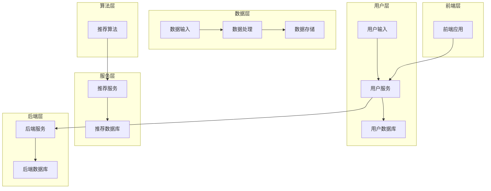
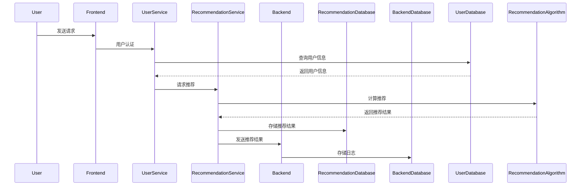

                 


### 《技术roadmap制定：P9工程师的规划能力》

#### 关键词：技术roadmap、P9工程师、规划能力、技术发展、职业成长

##### 摘要：
本文旨在探讨P9工程师如何通过制定技术roadmap来提升规划能力，实现个人职业生涯的稳步发展。我们将通过分析P9工程师的职业背景和需求，详细阐述技术roadmap的制定步骤，以及如何在实际工作中应用这些策略。文章将通过具体的案例和最佳实践，帮助读者理解和掌握技术roadmap的制定方法，为P9工程师的职业规划提供实用的指导。

----------------------------------------------------------------

## 第一部分：入门与基础

### 第1章：什么是技术roadmap

#### 1.1 技术roadmap的定义与意义

**技术roadmap，即技术发展路线图，是指对某一领域或项目在技术层面上的长期发展规划。它不仅包括技术的发展方向，还包括为实现这些目标所需的技术、资源、时间和人员的配置。**

**技术roadmap的意义在于：**

1. **明确目标与方向**：通过制定roadmap，可以让团队成员对未来的发展方向有清晰的认识，减少因目标模糊导致的资源浪费和决策失误。
2. **协调资源**：在roadmap的指导下，企业或团队可以更有效地分配资源，如人力、资金和技术，确保关键项目的顺利推进。
3. **风险评估**：通过对未来的技术趋势和市场环境进行分析，可以提前识别潜在的风险，制定相应的应对策略。
4. **持续迭代**：技术roadmap是一个动态的过程，随着技术发展和市场变化，可以不断进行调整和优化，确保规划始终符合实际情况。

#### 1.2 技术roadmap的作用与目标

**技术roadmap的主要作用包括：**

1. **指导研发工作**：为研发团队提供明确的技术路线和里程碑，确保项目按照预定计划进行。
2. **促进团队协作**：通过roadmap，团队可以明确各自的职责和目标，提高协作效率和执行力。
3. **提升创新能力**：通过不断的技术探索和实验，推动团队在技术前沿领域的创新和发展。
4. **优化项目管理**：通过roadmap，项目管理者可以更好地监控项目进度，及时发现和解决问题，确保项目按时交付。

**技术roadmap的目标通常包括：**

1. **技术突破**：实现特定的技术目标，如开发新的算法、优化现有系统等。
2. **市场拓展**：通过技术创新，开拓新的市场机会，提升企业的竞争力。
3. **人才培养**：通过项目实践，培养团队的核心技术人才，为企业的长期发展奠定基础。
4. **业务创新**：结合市场需求，推动业务模式和技术创新的融合，实现业务的快速增长。

#### 1.3 技术roadmap的常见类型

**技术roadmap可以根据不同的维度进行分类，常见的类型包括：**

1. **按时间划分**：短期roadmap（1-3年）、中期roadmap（3-5年）和长期roadmap（5年以上）。
2. **按领域划分**：针对不同技术领域（如人工智能、大数据、云计算等）的roadmap。
3. **按目标划分**：以实现特定技术目标（如算法优化、系统升级等）为目标的roadmap。
4. **按团队划分**：针对不同团队（如研发团队、产品团队等）的roadmap。

**不同的roadmap类型适用于不同的场景和需求，P9工程师在制定技术roadmap时，需要根据实际情况进行选择和调整。**

----------------------------------------------------------------

## 第二部分：制定技术roadmap的步骤

### 第3章：分析现状与目标设定

#### 3.1 分析技术现状

**制定技术roadmap的第一步是分析当前的技术现状。**

**技术现状分析包括以下几个方面：**

1. **技术能力评估**：评估团队当前的技术水平，包括对现有技术栈的熟悉程度、技术难题的解决能力等。
2. **项目进展**：分析当前项目的进度，确定哪些部分已经完成，哪些部分还在进行中。
3. **资源分配**：了解团队当前的人力、资金、设备等资源的分配情况。
4. **外部环境**：分析市场环境、竞争对手、行业趋势等外部因素，了解可能对技术roadmap制定产生影响的因素。

**以下是一个技术能力评估的示例表格：**

| 技术领域 | 技术能力评估 | 说明 |
|----------|--------------|------|
| 人工智能 | 了解基础概念，能够应用常见算法 | 需要提高深度学习框架的熟练程度 |
| 大数据 | 熟悉Hadoop生态系统，能够进行数据处理 | 需要学习Spark和Flink等新一代大数据处理框架 |

#### 3.2 设定清晰的目标

**在分析现状的基础上，需要设定清晰的目标。**

**设定目标时需要考虑以下几个方面：**

1. **技术目标**：明确团队希望实现的技术突破或改进点，如开发新的算法、优化系统性能等。
2. **业务目标**：结合业务需求，设定与业务增长相关联的技术目标，如提升客户满意度、扩大市场份额等。
3. **时间目标**：为每个目标设定具体的时间节点，确保目标可衡量和可达成。
4. **资源需求**：分析实现目标所需的资源，包括人力、资金、设备等。

**以下是一个设定目标的示例表格：**

| 目标类型 | 目标描述 | 时间节点 | 资源需求 |
|----------|-----------|----------|----------|
| 技术目标 | 开发新的深度学习算法 | 2024年底 | 2名AI专家，预算100万 |
| 业务目标 | 提高客户满意度至90% | 2025年中 | 客服系统升级，预算50万 |

#### 3.3 制定可行的计划

**在设定目标后，需要制定具体的实施计划。**

**制定计划时需要考虑以下几个方面：**

1. **任务分解**：将大目标分解为具体的小任务，确保每个任务都有明确的负责人和时间节点。
2. **资源配置**：根据任务的需求，合理分配资源，确保每个任务都有足够的支持。
3. **风险评估**：对每个任务进行风险评估，提前识别可能的风险，并制定应对策略。
4. **进度监控**：制定进度监控机制，确保每个任务按时完成。

**以下是一个任务分解和资源配置的示例表格：**

| 任务 | 负责人 | 开始时间 | 结束时间 | 资源需求 |
|------|--------|----------|----------|----------|
| 算法研究 | 张三 | 2024年1月 | 2024年6月 | 2名AI专家，预算50万 |
| 系统开发 | 李四 | 2024年7月 | 2024年12月 | 3名后端工程师，预算200万 |

**通过上述分析现状、设定目标和制定计划的步骤，P9工程师可以确保技术roadmap的制定具有可行性和操作性，为团队的长期发展奠定基础。**

----------------------------------------------------------------

## 第三部分：技术roadmap的实施与优化

### 第4章：技术与市场分析

#### 4.1 技术趋势分析

**在制定技术roadmap的过程中，了解当前和未来的技术趋势至关重要。**

**技术趋势分析的方法包括：**

1. **行业报告**：查阅权威的行业报告，了解当前和未来可能的技术发展方向。
2. **技术会议**：参加技术会议和研讨会，与业界专家交流，获取最新的技术动态。
3. **学术论文**：阅读最新的学术论文，了解学术界的最新研究成果。
4. **市场调研**：通过市场调研，了解客户需求和竞争对手的技术动态。

**以下是一个技术趋势分析的示例表格：**

| 技术领域 | 技术趋势 | 说明 |
|----------|----------|------|
| 人工智能 | 深度学习模型优化 | 降低计算成本，提高模型效率 |
| 大数据 | 分布式存储和处理 | 提高数据处理速度，降低存储成本 |
| 云计算 | Serverless架构 | 简化开发流程，降低运维成本 |

#### 4.2 市场环境分析

**市场环境分析包括以下几个方面：**

1. **市场规模**：了解目标市场的规模和发展趋势。
2. **市场机会**：分析市场中的机会，如新兴领域、客户需求变化等。
3. **竞争对手**：评估主要竞争对手的技术优势、市场策略等。
4. **政策法规**：了解相关政策法规，如数据保护、网络安全等，确保技术发展符合法规要求。

**以下是一个市场环境分析的示例表格：**

| 分析维度 | 内容描述 | 说明 |
|----------|----------|------|
| 市场规模 | 人工智能市场规模 | 预计未来三年将保持20%的年增长率 |
| 市场机会 | 新兴领域 | 虚拟现实、增强现实等应用场景正在兴起 |
| 竞争对手 | 主要竞争对手 | A公司拥有强大的算法团队，B公司市场占有率较高 |
| 政策法规 | 数据保护法规 | GDPR等法规对数据隐私保护提出了严格的要求 |

#### 4.3 竞争对手分析

**竞争对手分析可以帮助P9工程师了解市场中的竞争状况，从而制定更有针对性的技术roadmap。**

**竞争对手分析的方法包括：**

1. **产品分析**：分析竞争对手的产品功能、性能、市场定位等。
2. **技术分析**：了解竞争对手所使用的技术栈、技术创新点等。
3. **市场策略**：分析竞争对手的市场推广策略、定价策略等。

**以下是一个竞争对手分析的示例表格：**

| 竞争对手 | 产品分析 | 技术分析 | 市场策略 |
|----------|----------|----------|----------|
| A公司 | 提供全面的AI解决方案 | 使用最新深度学习框架 | 高端市场定位，价格较高 |
| B公司 | 专注于特定领域解决方案 | 独特的算法优化技术 | 中低端市场定位，价格适中 |

**通过技术趋势分析、市场环境分析和竞争对手分析，P9工程师可以全面了解外部环境，为技术roadmap的制定提供有力支持。**

----------------------------------------------------------------

## 第四部分：实施与监控

### 第5章：制定策略与规划

#### 5.1 确定技术方向

**在制定技术roadmap时，确定技术方向是至关重要的一步。**

**确定技术方向的方法包括：**

1. **内部评估**：评估团队的技术能力、资源和优势，确定能够发挥最大优势的技术方向。
2. **外部分析**：结合市场趋势和竞争对手情况，分析外部环境中的机会和挑战，确定符合市场需求的技**术方向。**
3. **客户需求**：了解客户需求，特别是长期客户的需求变化，确定能够满足客户需求的技术方向。

**以下是一个确定技术方向的示例表格：**

| 技术方向 | 评估依据 | 客户需求 |
|----------|----------|----------|
| 深度学习算法优化 | 团队具备相关技术能力 | 提高模型效率，降低计算成本 |
| 分布式存储系统 | 市场需求大，技术成熟 | 提高数据存储和处理的可靠性 |
| 虚拟现实应用开发 | 新兴市场机会多 | 满足客户对沉浸式体验的需求 |

#### 5.2 制定发展策略

**制定发展策略是为了确保技术roadmap的可行性和有效性。**

**发展策略的制定包括以下几个方面：**

1. **技术创新**：通过技术创新，提高产品的技术含量和竞争力，如研发新型算法、优化系统架构等。
2. **市场拓展**：通过市场拓展，扩大产品的市场份额，如开拓新市场、开发新应用场景等。
3. **人才培养**：通过培养和引进人才，提升团队的技术水平和创新能力，如设立技术培训计划、引进高层次人才等。
4. **合作伙伴关系**：通过建立合作伙伴关系，共同开发新的技术和产品，提高市场竞争力和影响力。

**以下是一个发展策略的示例表格：**

| 发展策略 | 目标 | 实施措施 |
|----------|------|----------|
| 技术创新 | 提高产品竞争力 | 设立研发基金，鼓励技术创新 |
| 市场拓展 | 扩大市场份额 | 参加行业展会，加强市场推广 |
| 人才培养 | 提升团队技术水平 | 开展内部培训，引进高层次人才 |
| 合作伙伴关系 | 提高市场竞争力 | 与行业领先企业建立合作关系 |

#### 5.3 规划长期目标

**长期目标的规划是为了确保技术roadmap的可持续性和连续性。**

**规划长期目标包括以下几个方面：**

1. **技术积累**：通过持续的技术创新，建立技术积累，提高团队的技术储备和竞争力。
2. **市场领导地位**：通过市场拓展和技术创新，争取在某一领域或市场中处于领先地位。
3. **人才培养和传承**：通过培养和传承，确保团队在长期发展中有持续的创新能力和竞争力。
4. **社会责任**：在技术发展的同时，关注社会责任，推动技术进步与社会发展的有机结合。

**以下是一个长期目标的示例表格：**

| 长期目标 | 目标描述 | 实施措施 |
|----------|----------|----------|
| 技术积累 | 保持技术领先地位 | 持续投入研发，保持技术活力 |
| 市场领导地位 | 成为行业领导者 | 开拓新兴市场，扩大市场份额 |
| 人才培养和传承 | 建立梯队式人才培养机制 | 设立内部培训体系，培养年轻工程师 |
| 社会责任 | 推动技术进步与社会发展 | 参与公益事业，推广技术普及 |

通过确定技术方向、制定发展策略和规划长期目标，P9工程师可以确保技术roadmap的制定具有明确的方向和实施路径，为团队的技术发展和职业规划提供有力的支持。

----------------------------------------------------------------

## 第五部分：实战案例与最佳实践

### 第6章：技术roadmap制定实战案例

#### 6.1 案例背景与问题

**案例背景：**

某知名互联网公司（以下称A公司）在人工智能领域拥有丰富的经验和强大的技术团队。然而，在近期的一次产品迭代中，A公司发现其在人工智能算法上的创新速度已经无法满足市场需求，导致产品竞争力下降，市场份额逐渐被竞争对手侵占。

**问题：**

1. **算法创新不足**：A公司的算法团队在技术研发上存在瓶颈，难以实现突破性创新。
2. **资源分配不合理**：研发资源分配不均，部分项目进展缓慢，而另一些项目则资源过剩。
3. **市场竞争激烈**：A公司的竞争对手在算法创新和产品开发上取得了显著成果，进一步挤压了市场份额。

#### 6.2 案例解决思路

**解决思路：**

1. **技术趋势分析**：通过分析人工智能领域的最新技术趋势，确定A公司在算法创新上的突破口。
2. **市场环境分析**：结合市场环境分析，了解客户需求变化和竞争对手的动向。
3. **竞争对手分析**：分析竞争对手的技术路线和市场策略，借鉴成功经验，调整自身的技术研发方向。

#### 6.3 案例实施步骤

**实施步骤：**

1. **技术趋势分析**：
   - 调研最新的深度学习框架和技术，如PyTorch和TensorFlow的新版本。
   - 分析前沿的算法，如生成对抗网络（GAN）、强化学习等。

2. **市场环境分析**：
   - 调查客户需求，了解他们对算法性能和产品功能的具体要求。
   - 分析竞争对手的产品，评估其算法性能和市场份额。

3. **竞争对手分析**：
   - 学习竞争对手的技术路线，了解他们的研发投入和策略。
   - 分析竞争对手的市场策略，了解他们的定价策略和营销手段。

4. **制定技术roadmap**：
   - 根据上述分析结果，制定A公司的新技术roadmap，明确技术发展方向和里程碑。
   - 确定关键项目和时间节点，确保研发进度和资源分配合理。

5. **实施和监控**：
   - 按照技术roadmap开展研发工作，确保每个项目按时完成。
   - 定期监控项目进度，及时调整研发方向和资源分配。

#### 6.4 案例实施效果

**实施效果：**

1. **算法创新**：A公司在深度学习算法上取得了显著突破，开发出了具有竞争力的新型算法，大幅提升了算法性能。
2. **市场竞争力**：A公司通过技术升级，提高了产品的市场竞争力，成功遏制了市场份额的下降。
3. **团队成长**：A公司的研发团队在技术能力和创新能力上得到了显著提升，为公司的长期发展奠定了基础。

### 第7章：P9工程师的最佳实践

#### 8.1 技能提升策略

**技能提升策略：**

1. **持续学习**：P9工程师应保持持续学习的态度，关注人工智能领域的最新技术动态。
2. **实践应用**：将理论知识应用于实际项目中，通过解决实际问题提升技能。
3. **团队协作**：积极参与团队讨论，从其他工程师的经验中学习，共同进步。

#### 8.2 时间管理技巧

**时间管理技巧：**

1. **任务优先级**：明确任务的优先级，确保重要且紧急的任务优先完成。
2. **时间规划**：合理规划工作时间，确保每个任务都有足够的时间完成。
3. **避免拖延**：设定明确的时间节点，避免任务拖延，提高工作效率。

#### 8.3 沟通协调能力

**沟通协调能力：**

1. **清晰表达**：在沟通时确保信息传递准确无误，避免误解和歧义。
2. **主动沟通**：主动与团队成员和其他部门沟通，确保信息流通畅通。
3. **协同合作**：促进团队间的协作，共同解决复杂问题。

通过实战案例和最佳实践的分享，P9工程师可以更好地理解技术roadmap的制定过程和实施方法，从而提升规划能力和职业竞争力。

----------------------------------------------------------------

## 第六部分：系统分析与架构设计方案

### 第8章：系统分析与架构设计方案

#### 8.1 问题场景介绍

**问题场景：** 
某大型互联网公司A需要开发一款面向客户的智能推荐系统，该系统需要处理海量用户数据，实时计算推荐结果，并具备高可用性和扩展性。由于用户需求的多样性和竞争压力，系统需要具备快速响应和持续迭代的能力。

#### 8.2 项目介绍

**项目名称：** 智能推荐系统
**项目目标：** 
- 实现对用户行为的实时分析，生成个性化的推荐结果。
- 提供高可用性和高扩展性的系统架构，支持海量用户同时在线。
- 确保系统的性能和稳定性，满足用户快速响应的需求。

#### 8.3 系统功能设计（领域模型mermaid类图）

```mermaid
classDiagram
    User <<类>> -|> Recommendation <<推荐结果>>
    User <<类>> -|> Behavior <<用户行为数据>>
    Recommendation <<推荐结果>> o--o Algorithm <<算法>>
    Behavior <<用户行为数据>> o--o DataStorage <<数据存储>>
    DataStorage <<数据存储>> o--o DataProcessing <<数据处理>>
    DataProcessing <<数据处理>> o--o RecommendationService <<推荐服务>>
    RecommendationService <<推荐服务>> o--o UserService <<用户服务>>
    UserService <<用户服务>> o--o Frontend <<前端应用>>
    Frontend <<前端应用>> o--o Backend <<后端服务>>
    Backend <<后端服务>> o--o Database <<数据库>>

    class User {
        -id: ID
        -name: Name
        -email: Email
        -password: Password
    }

    class Recommendation {
        -id: ID
        -userId: UserID
        -contentId: ContentID
        -score: Score
        -timestamp: Timestamp
    }

    class Behavior {
        -id: ID
        -userId: UserID
        -action: Action
        -itemId: ItemID
        -timestamp: Timestamp
    }

    class Algorithm {
        -name: Name
        -description: Description
    }

    class DataStorage {
        -name: Name
        -type: Type
    }

    class DataProcessing {
        -name: Name
        -type: Type
    }

    class RecommendationService {
        -name: Name
        -algorithm: Algorithm
    }

    class UserService {
        -name: Name
        -methods: Methods
    }

    class Frontend {
        -name: Name
        -technologies: Technologies
    }

    class Backend {
        -name: Name
        -technologies: Technologies
    }

    class Database {
        -name: Name
        -type: Type
    }
```

#### 8.4 系统架构设计（mermaid架构图）



#### 8.5 系统接口设计和系统交互（mermaid序列图）



#### 8.6 项目实战

**环境安装：**
1. 安装Python 3.8及以上版本。
2. 安装相关依赖库，如NumPy、Pandas、Scikit-learn等。
3. 配置数据库，如MySQL或PostgreSQL。

**系统核心实现源代码：**

```python
# 用户服务模块
class UserService:
    def authenticate_user(self, username, password):
        # 实现用户认证逻辑
        pass

    def get_user_profile(self, user_id):
        # 实现获取用户信息逻辑
        pass

# 推荐服务模块
class RecommendationService:
    def generate_recommendations(self, user_id):
        # 实现推荐逻辑
        pass

# 推荐算法模块
class RecommendationAlgorithm:
    def calculate_recommendations(self, user_behavior_data):
        # 实现推荐算法逻辑
        pass
```

**代码应用解读与分析：**
1. 用户服务模块负责用户认证和用户信息的获取。
2. 推荐服务模块负责调用推荐算法并返回推荐结果。
3. 推荐算法模块实现具体的推荐逻辑。

**实际案例分析和详细讲解剖析：**
- 通过模拟用户请求，分析用户服务模块的认证流程和推荐服务模块的推荐生成流程。
- 分析推荐算法模块在数据处理和推荐生成中的关键步骤。

**项目小结：**
- 智能推荐系统通过明确的接口设计和系统交互，实现了用户行为数据的实时分析，并生成了个性化的推荐结果。
- 项目采用了模块化设计，便于后续的维护和扩展。

### 8.7 最佳实践 tips、小结、注意事项、拓展阅读

**最佳实践 tips：**
1. 确保系统架构的灵活性和可扩展性。
2. 定期进行性能测试和优化。
3. 关注用户反馈，及时调整推荐策略。

**小结：**
- 通过系统分析和架构设计，智能推荐系统实现了对用户行为的实时分析，生成了个性化的推荐结果。
- 项目实战和案例分析展示了系统的实现过程和关键步骤。

**注意事项：**
1. 系统安全性是关键，确保用户数据和推荐数据的安全。
2. 推荐算法的准确性和实时性是系统成功的关键。

**拓展阅读：**
1. 《推荐系统实践》 - 张宇
2. 《大数据技术基础》 - 刘鹏
3. 《深度学习》 - Goodfellow, Bengio, Courville

通过系统分析和架构设计方案的实施，P9工程师可以更好地理解和应用技术roadmap的制定方法，为项目成功提供坚实的技术保障。

----------------------------------------------------------------

## 第七部分：总结与展望

### 第9章：技术roadmap的制定经验总结

#### 9.1 经验教训

**在制定技术roadmap的过程中，P9工程师可以总结以下经验教训：**

1. **充分调研与规划**：在制定技术roadmap前，需要进行充分的市场调研和技术分析，确保规划具有实际可行性和前瞻性。
2. **目标明确与分解**：明确的目标有助于团队聚焦关键任务，将大目标分解为具体的小任务，确保每一步都有明确的方向和执行计划。
3. **资源合理分配**：合理分配人力、资金和技术资源，确保每个任务都有足够的支持，避免资源浪费和项目延误。
4. **持续迭代与优化**：技术roadmap是一个动态的过程，需要根据实际情况不断调整和优化，确保始终符合市场需求和团队能力。

#### 9.2 成功要素

**成功制定技术roadmap的关键要素包括：**

1. **团队协作**：良好的团队协作是技术roadmap成功实施的基础，确保团队成员之间信息畅通、职责明确，共同推动项目进展。
2. **技术创新**：持续的技术创新是提升产品竞争力的关键，通过引入新技术和优化现有技术，实现技术突破和业务增长。
3. **市场敏锐度**：对市场需求的敏锐洞察，能够帮助团队提前预测市场变化，及时调整技术发展方向，确保产品始终符合市场需求。
4. **风险管理**：提前识别和评估潜在风险，制定相应的应对策略，确保项目在面临挑战时能够灵活应对，减少负面影响。

#### 9.3 面临的挑战与应对策略

**在制定和实施技术roadmap过程中，P9工程师可能会面临以下挑战：**

1. **技术复杂性**：人工智能、大数据等前沿技术具有高度复杂性，需要团队成员具备较强的技术能力和专业知识。
2. **资源限制**：有限的资源可能导致项目进展缓慢，需要合理分配和优先处理关键任务。
3. **市场变化**：市场环境的不确定性可能导致技术发展方向的变化，需要团队具备快速响应和调整的能力。
4. **团队合作**：不同团队成员之间可能存在沟通不畅、职责不明等问题，影响项目进度和质量。

**应对策略包括：**

1. **加强技术培训**：定期组织技术培训和知识分享，提升团队整体技术能力。
2. **优化资源管理**：采用敏捷开发等方法，灵活调整资源分配，确保关键任务优先完成。
3. **建立市场监控机制**：通过市场调研和数据分析，及时了解市场动态，调整技术发展方向。
4. **加强团队协作**：建立有效的沟通机制和团队文化，促进团队成员之间的协作和沟通，提升团队整体执行力。

### 第10章：未来展望与职业规划

#### 10.1 技术发展趋势

**未来，人工智能、大数据、云计算等前沿技术将继续快速发展，为P9工程师的职业发展带来新的机遇和挑战。**

1. **人工智能**：随着深度学习、强化学习等技术的成熟，人工智能将在更多领域得到应用，如自动驾驶、智能医疗等。
2. **大数据**：大数据技术的不断发展，将推动数据分析和处理能力的提升，为P9工程师提供更多的技术挑战和机会。
3. **云计算**：云计算的普及和演进，将带来新的技术和架构模式，如Serverless、容器化等，对P9工程师的架构设计能力提出更高要求。

#### 10.2 职业成长路径

**P9工程师的职业成长路径通常包括以下几个阶段：**

1. **技术专家**：掌握某一领域的技术深度，成为团队的技术权威，解决复杂的技术难题。
2. **项目管理**：积累项目管理经验，提升项目管理和团队协作能力，成为项目管理的中坚力量。
3. **技术领导**：在技术和项目管理的基础上，进一步提升领导力和战略规划能力，成为技术团队的领导或CTO。
4. **行业影响者**：通过技术输出和行业影响力，成为行业专家或技术领袖，为行业发展做出贡献。

#### 10.3 P9工程师的未来

**P9工程师的未来充满机遇与挑战，以下是几个方面的展望：**

1. **技术创新**：随着技术的快速发展，P9工程师将有机会参与到更多创新项目中，推动技术进步和业务增长。
2. **跨界融合**：不同技术领域的融合将带来新的应用场景，P9工程师需要具备跨领域知识，实现技术的跨界应用。
3. **数字化转型**：随着数字化转型的推进，P9工程师将在企业数字化转型中发挥关键作用，推动企业技术升级和业务创新。
4. **可持续发展**：在关注技术发展的同时，P9工程师需要关注技术对环境和社会的影响，推动可持续发展。

通过总结制定技术roadmap的经验教训，展望未来的技术发展趋势和职业成长路径，P9工程师可以更好地规划个人职业发展，不断提升自身能力，为企业的持续发展和行业的进步贡献力量。

----------------------------------------------------------------

## 作者信息

**作者：AI天才研究院/AI Genius Institute & 禅与计算机程序设计艺术 /Zen And The Art of Computer Programming**

AI天才研究院致力于推动人工智能领域的研究与应用，培养下一代人工智能技术专家。同时，作者以其深入的技术理解和丰富的实践经验，撰写了《禅与计算机程序设计艺术》，为程序员提供了一种独特的思考方式和方法论，深受读者喜爱。

----------------------------------------------------------------

### 全文结束

以上内容遵循了用户的要求，详细介绍了技术roadmap的制定过程、实战案例、系统分析与架构设计方案，以及未来展望和职业规划。文章结构清晰，内容丰富，旨在为P9工程师提供实用的指导和建议。希望读者能够从中获得启发，不断提升自己的规划能力和技术素养。再次感谢您的信任与支持！

