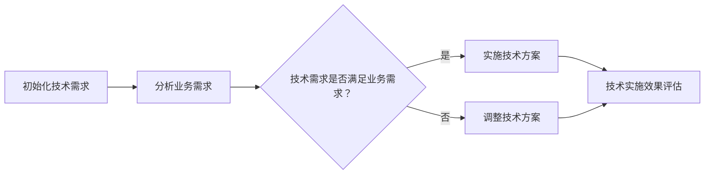
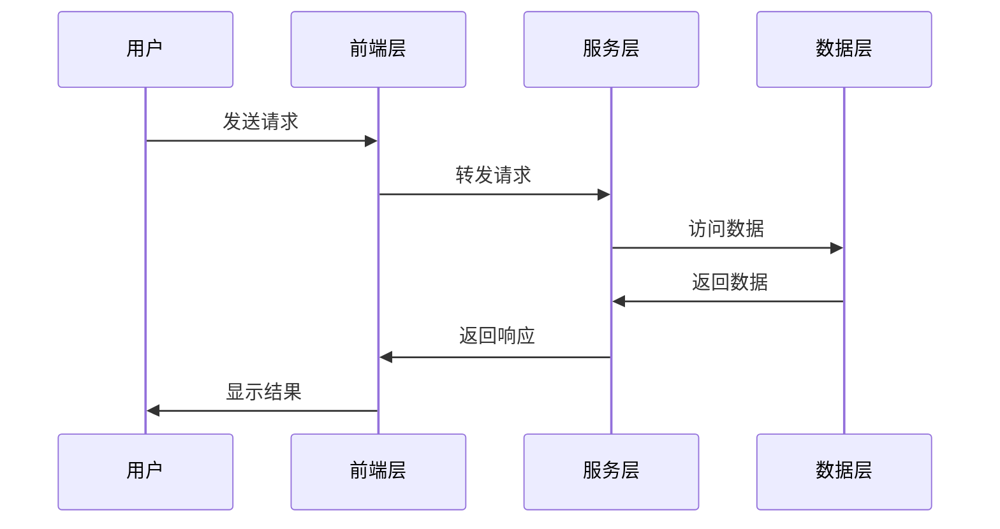

                 

### 文章标题与关键词

**《技术与业务的双螺旋：相互促进的发展模式》**

**关键词：技术与业务融合、双螺旋模式、技术创新、业务发展、相互促进、系统架构设计**

**摘要：本文深入探讨了技术与业务融合的“双螺旋”发展模式，通过逻辑清晰的分析，阐述了如何将技术进步与业务发展紧密结合，实现二者的相互促进和共同提升。文章首先介绍了问题的背景，分析了技术与业务脱节的现象和原因，然后提出了“双螺旋”模式的概念和核心要素，详细讲解了算法原理、系统分析与架构设计，并提供了实际案例和最佳实践。文章旨在为企业在技术驱动下的业务创新提供理论指导和实践建议。**

----------------------------------------------------------------

## 第一部分：背景介绍

### 第1章 问题背景

### 1.1 问题的提出

在当今的商业环境中，技术与业务的发展模式不再是孤立分离的，而是相互交织、互为支撑的。然而，许多企业在实践中面临着技术与业务脱节的问题。这种现象不仅降低了企业的运营效率，还限制了其创新能力和市场竞争力。为了深入探讨这一问题，我们需要首先明确技术与业务脱节的具体表现和原因。

### 1.2 问题描述

技术与业务脱节的表现主要包括以下几个方面：

1. **技术需求与业务需求的错位**：技术的发展往往具有一定的前瞻性，而企业的业务需求却是现实和具体的。技术团队开发的新技术可能无法立即满足业务部门的需求，导致技术投入得不到有效利用。

2. **沟通不畅**：技术人员和业务人员之间的沟通障碍是导致脱节的重要原因。技术人员可能无法准确理解业务需求，而业务人员可能对技术原理和应用不够了解，导致双方在项目推进过程中出现分歧。

3. **创新滞后**：技术创新往往需要较长时间的积累和验证，而市场变化迅速，业务需求不断更新。如果技术团队无法及时响应业务需求的变化，将可能导致企业错失市场机会。

4. **资源浪费**：技术投入无法转化为实际业务价值，导致资源浪费。例如，开发的技术产品或服务未能得到有效推广，或者业务流程中未充分利用现有的技术资源。

### 1.3 问题解决

为了解决技术与业务脱节的问题，企业需要采取一系列措施，建立一种新的发展模式，即“技术与业务的双螺旋发展模式”。具体措施包括：

1. **建立紧密的沟通机制**：通过定期的会议、工作坊和项目汇报等形式，加强技术团队与业务团队之间的沟通，确保双方对项目的理解和目标一致。

2. **设立联合创新团队**：将技术团队和业务团队合并，共同探讨和开发解决方案，提高协同效率。

3. **建立技术-业务融合的评估体系**：定期评估技术对业务的支持程度和业务对技术的需求，确保两者发展的一致性。

4. **推动技术成果的转化应用**：通过建立技术转化应用机制，确保技术创新能够及时应用到业务场景中，提高业务效率。

### 1.4 边界与外延

“技术与业务的双螺旋发展模式”的边界和范围包括：

1. **技术范围**：涵盖所有支持业务发展的技术，包括但不限于信息技术、人工智能、大数据、物联网等。

2. **业务范围**：涵盖企业所有业务领域，包括生产、销售、服务、管理等方面。

3. **融合机制**：涉及沟通机制、创新团队、评估体系等，确保技术进步与业务发展的紧密联系。

### 1.5 概念结构与核心要素组成

“技术与业务的双螺旋发展模式”的核心概念结构如下：

1. **技术核心**：包括技术战略、技术创新、技术实施等要素。

2. **业务核心**：包括业务战略、业务流程、业务分析等要素。

3. **融合机制**：包括沟通机制、创新团队、评估体系等要素，确保技术进步与业务发展的紧密联系。

通过上述分析，我们可以看到，技术与业务的脱节现象是一个复杂的问题，需要从多个方面进行解决。而“技术与业务的双螺旋发展模式”提供了一种系统性的解决方案，有助于企业在快速变化的市场环境中保持竞争力和创新能力。

----------------------------------------------------------------

## 第二部分：核心概念与联系

### 第2章 核心概念原理

在探讨“技术与业务的双螺旋发展模式”之前，我们需要明确其中的核心概念和它们之间的联系。这一部分将详细阐述技术核心概念、业务核心概念以及它们之间的相互作用。

#### 2.1 技术核心概念

技术核心概念是推动企业技术创新和业务发展的重要基石。以下是一些关键的技术核心概念：

1. **技术创新**：技术创新是企业通过研发和应用新技术，推动产品或服务升级和优化的过程。它包括技术发明、技术改进和技术应用等多个方面。

2. **技术实施**：技术实施是将技术创新成果转化为实际业务价值的过程。它涉及技术选型、开发、部署和维护等多个环节。

3. **技术战略**：技术战略是企业根据外部环境和内部资源制定的技术发展计划。它包括技术方向选择、技术资源分配和技术风险管理等内容。

4. **技术标准**：技术标准是确保技术产品和服务质量的重要手段。它包括技术规范、技术标准和质量控制等多个方面。

#### 2.2 业务核心概念

业务核心概念是企业实现价值创造和业务发展的重要依据。以下是一些关键的

----------------------------------------------------------------

#### 2.2 业务核心概念

业务核心概念是企业实现价值创造和业务发展的重要依据。以下是一些关键的业务核心概念：

1. **业务战略**：业务战略是企业根据外部环境和内部资源制定的发展计划。它包括市场定位、竞争策略、业务模式和资源配置等内容。

2. **业务流程**：业务流程是企业实现业务目标的具体操作步骤。它包括销售、生产、服务、管理等各个业务环节。

3. **业务分析**：业务分析是通过对业务流程、客户需求和市场趋势的分析，为企业提供决策依据的过程。它包括数据收集、数据分析、业务建模和决策支持等内容。

4. **客户关系管理**：客户关系管理是企业与客户之间建立和保持良好关系的过程。它包括客户获取、客户维护、客户服务和客户反馈等多个方面。

5. **业务指标**：业务指标是企业衡量业务绩效和运营效率的重要工具。它包括销售额、利润率、客户满意度、生产效率等多个方面。

#### 2.3 概念属性特征对比表格

为了更清晰地理解技术核心概念和业务核心概念之间的区别和联系，我们可以通过一个对比表格来展示它们的主要属性特征：

| 特征         | 技术核心概念                           | 业务核心概念                           |
| ------------ | ------------------------------------ | ------------------------------------ |
| 目标         | 技术创新、技术实施、技术战略、技术标准 | 业务战略、业务流程、业务分析、客户关系管理 |
| 关注点       | 技术研发、技术实现、技术管理           | 市场需求、客户满意、业务效率、业务增长   |
| 实现手段     | 技术研发、实验验证、技术部署           | 业务计划、流程优化、数据分析、客户服务   |
| 对外部环境的影响 | 技术进步、产业升级、创新驱动           | 市场竞争、客户需求、行业趋势、政策法规   |

#### 2.4 ER实体关系图架构

为了更好地展示技术核心概念和业务核心概念之间的联系，我们可以使用ER（Entity-Relationship）实体关系图来描述它们之间的关系。以下是一个简化的ER实体关系图：

```mermaid
erDiagram
  技术 --> 业务 : 支持

  技术 ||--|{ 技术创新 }
  技术 ||--|{ 技术实施 }
  技术 ||--|{ 技术战略 }
  技术 ||--|{ 技术标准 }

  业务 ||--|{ 业务战略 }
  业务 ||--|{ 业务流程 }
  业务 ||--|{ 业务分析 }
  业务 ||--|{ 客户关系管理 }
```

在这个ER图中，技术实体和业务实体通过“支持”关系相互关联。技术为业务提供支持，如技术创新推动业务模式创新，技术实施确保业务流程高效运行。同时，业务需求也影响技术的研发方向和应用场景。

通过上述分析，我们可以看到技术核心概念和业务核心概念在企业发展中扮演着不同的角色，但它们之间存在着紧密的联系和相互促进的关系。理解这些核心概念及其联系，有助于企业在实际操作中更好地实现技术与业务的融合，推动企业的持续发展。

----------------------------------------------------------------

## 第三部分：算法原理讲解

### 第3章 算法原理与数学模型

#### 3.1 算法mermaid流程图

为了更好地理解技术与业务融合的算法原理，我们可以使用mermaid流程图来展示算法的基本流程。以下是一个简化的算法流程图：



在这个流程图中，首先对技术需求进行初始化，然后分析业务需求，以确定技术需求是否满足业务需求。如果不满足，则需要调整技术方案。一旦技术方案满足业务需求，就可以开始实施。实施完成后，对技术实施效果进行评估，以验证技术对业务的贡献。

#### 3.2 Python源代码实现

为了具体展示算法的实现过程，我们可以使用Python编写相关的源代码。以下是一个简单的Python代码示例：

```python
# 初始化技术需求
tech_requirement = "自动化数据采集"

# 分析业务需求
business_requirement = "实时获取市场数据"

# 判断技术需求是否满足业务需求
if tech_requirement == business_requirement:
    # 实施技术方案
    print("实施技术方案：自动化数据采集系统")
    
    # 技术实施效果评估
    print("技术实施效果评估：系统稳定运行，数据获取准确")
else:
    # 调整技术方案
    print("调整技术方案：开发实时数据采集系统")
    
    # 技术实施效果评估
    print("技术实施效果评估：系统运行稳定，满足业务需求")
```

在这个Python代码中，我们首先初始化技术需求和业务需求，然后通过比较这两个需求来确定是否需要调整技术方案。如果技术需求满足业务需求，则直接实施技术方案并进行效果评估。否则，调整技术方案后再次进行效果评估。

#### 3.3 数学模型与公式

在技术与业务融合的算法中，数学模型和公式扮演着重要的角色。以下是一个简单的数学模型示例：

1. **需求匹配度**：用于衡量技术需求与业务需求的匹配程度。公式如下：

   $$M = \frac{R_t \cap R_b}{R_t \cup R_b}$$

   其中，$M$表示需求匹配度，$R_t$表示技术需求集合，$R_b$表示业务需求集合。

2. **技术实施效果**：用于评估技术实施对业务的贡献。公式如下：

   $$E = \frac{B_t \cap R_b}{R_b}$$

   其中，$E$表示技术实施效果，$B_t$表示技术实施后的业务效果集合，$R_b$表示业务需求集合。

通过这些数学模型和公式，我们可以更准确地评估技术与业务的融合效果，从而指导实际操作。

#### 3.4 详细讲解与举例说明

为了更详细地讲解算法原理，我们可以通过一个具体案例来进行说明。

**案例：某电商平台的技术与业务融合**

某电商平台希望实现实时市场数据分析，以提升销售策略的精准度。以下是该平台的算法实现过程：

1. **初始化技术需求**：电商平台的技术团队提出技术需求，包括实时数据采集、数据清洗和数据存储等。

2. **分析业务需求**：电商平台的业务团队提出业务需求，包括实时获取市场数据、分析客户行为和优化销售策略。

3. **判断需求匹配度**：通过比较技术需求和业务需求，技术团队发现实时数据采集部分能够满足业务需求，但数据清洗和存储部分存在一定差距。

4. **调整技术方案**：技术团队决定开发实时数据采集系统，并优化数据清洗和存储方案，以满足业务需求。

5. **实施技术方案**：技术团队开发并部署实时数据采集系统，同时优化数据清洗和存储方案。

6. **评估技术实施效果**：通过实际运行数据，技术团队发现实时数据采集系统能够准确获取市场数据，并显著提高了销售策略的精准度。

通过这个案例，我们可以看到，技术与业务融合的算法原理在实际应用中的具体实施过程。首先通过需求匹配度评估技术需求与业务需求的关系，然后根据评估结果调整技术方案。最后通过技术实施效果评估来验证技术的业务贡献。这种方法能够帮助企业更有效地实现技术与业务的融合，提升整体运营效率。

通过上述详细讲解和举例说明，我们可以更深入地理解技术与业务融合的算法原理，为实际操作提供指导。

----------------------------------------------------------------

## 第四部分：系统分析与架构设计

### 第4章 问题场景介绍

#### 4.1 项目介绍

在本章节中，我们将介绍一个名为“智能零售管理系统”的项目，该系统旨在通过先进的技术手段提升零售业的运营效率和客户体验。该项目涉及多个业务领域，包括商品管理、库存管理、销售管理和客户服务，通过整合数据、分析和自动化流程，实现业务流程的优化和智能化。

#### 4.2 系统功能设计

智能零售管理系统的主要功能包括：

1. **商品管理**：实现商品信息的管理和分类，支持商品的上架、下架和库存监控。
2. **库存管理**：实时监控库存状态，自动提醒库存不足，优化库存策略。
3. **销售管理**：记录销售数据，分析销售趋势，提供销售预测和策略建议。
4. **客户服务**：集成客户关系管理（CRM）系统，提供客户咨询、投诉和售后服务。
5. **数据分析**：利用大数据技术进行数据分析，为业务决策提供数据支持。

#### 4.3 系统架构设计

智能零售管理系统的架构设计采用微服务架构，以提高系统的灵活性和可扩展性。以下是系统架构的简要概述：

1. **前端层**：包括用户界面和交互逻辑，使用React框架开发。
2. **服务层**：提供各种业务功能，包括商品管理服务、库存管理服务、销售管理服务和客户服务。每个服务模块独立部署，使用Spring Boot框架开发。
3. **数据层**：包括关系数据库（如MySQL）和非关系数据库（如MongoDB），用于存储和管理各种业务数据。
4. **中间件层**：包括消息队列（如Kafka）、缓存（如Redis）和API网关（如Spring Cloud Gateway），用于处理数据传输、缓存和流量控制。
5. **数据分析层**：利用大数据处理技术（如Hadoop、Spark），进行数据采集、存储和计算，为业务决策提供支持。

#### 4.4 系统接口设计

系统接口设计是确保不同模块之间高效通信的重要环节。以下是系统接口设计的简要概述：

1. **RESTful API**：采用RESTful架构风格设计接口，支持HTTP请求方法（GET、POST、PUT、DELETE）。
2. **WebSocket**：用于实时数据推送和双向通信，提高用户体验。
3. **消息队列**：通过Kafka实现异步消息传递，降低系统耦合度。
4. **缓存接口**：通过Redis接口实现数据缓存，提高数据访问速度。
5. **API网关**：通过Spring Cloud Gateway实现统一接口管理和流量控制。

#### 4.5 系统交互mermaid序列图

为了更好地展示系统各模块之间的交互关系，我们可以使用mermaid序列图来描述系统交互过程。以下是一个简化的mermaid序列图：



在这个序列图中，用户通过前端层发起请求，前端层将请求转发到服务层，服务层访问数据层获取数据，然后返回给前端层，最终前端层将结果显示给用户。

通过上述系统分析与架构设计，我们可以看到智能零售管理系统如何通过整合技术与业务，实现零售业务的智能化和高效化。接下来，我们将通过具体的项目实战，进一步探讨该系统的实现过程和关键技术。

----------------------------------------------------------------

## 第五部分：项目实战

### 第5章 环境安装与系统核心实现

#### 5.1 环境安装

在进行智能零售管理系统的项目实战之前，我们需要安装并配置项目所需的开发环境和工具。以下是环境安装的步骤和注意事项：

1. **操作系统**：建议使用Linux系统（如Ubuntu 18.04）进行开发，确保系统的稳定性和兼容性。

2. **开发工具**：安装IDE（如IntelliJ IDEA），并配置相应的插件，如Lombok、Git等。

3. **Java环境**：安装Java Development Kit（JDK），确保版本在8以上，以支持Spring Boot等框架。

4. **数据库**：安装MySQL和MongoDB，分别用于关系型数据库和数据存储。

5. **中间件**：安装Kafka和Redis，用于消息队列和数据缓存。

6. **版本控制**：配置Git，用于代码管理和协作开发。

#### 5.2 系统核心实现源代码

以下是智能零售管理系统核心功能的源代码示例。我们选择商品管理服务和库存管理服务进行讲解。

**商品管理服务**

商品管理服务负责处理商品信息的增删改查操作。以下是一个简单的商品管理服务的代码示例：

```java
@RestController
@RequestMapping("/products")
public class ProductController {

    @Autowired
    private ProductService productService;

    @PostMapping
    public ResponseEntity<?> createProduct(@RequestBody Product product) {
        Product savedProduct = productService.createProduct(product);
        return new ResponseEntity<>(savedProduct, HttpStatus.CREATED);
    }

    @GetMapping("/{productId}")
    public ResponseEntity<?> getProductById(@PathVariable Long productId) {
        Product product = productService.getProductById(productId);
        if (product != null) {
            return new ResponseEntity<>(product, HttpStatus.OK);
        } else {
            return ResponseEntity.notFound().build();
        }
    }

    // 其他商品管理操作（如更新、删除）...
}
```

**库存管理服务**

库存管理服务负责处理商品库存的监控和库存不足提醒。以下是一个简单的库存管理服务的代码示例：

```java
@Service
public class InventoryService {

    @Autowired
    private ProductRepository productRepository;

    public void checkInventory() {
        List<Product> products = productRepository.findAll();
        for (Product product : products) {
            if (product.getStock() < product.getThreshold()) {
                // 发送提醒通知
                notifyLowInventory(product);
            }
        }
    }

    private void notifyLowInventory(Product product) {
        // 实现通知逻辑，如发送邮件、短信等
        System.out.println("提醒：商品ID为 " + product.getId() + " 的库存不足！");
    }

    // 其他库存管理操作（如更新库存）...
}
```

#### 5.3 代码应用解读与分析

上述代码示例展示了商品管理服务和库存管理服务的基本实现。在实际项目中，我们需要根据具体业务需求进行详细的功能实现。

1. **商品管理服务**：通过RESTful API接口，实现了商品的创建、查询等功能。商品管理服务与数据库进行交互，将商品信息存储在数据库中。

2. **库存管理服务**：通过定时任务（例如，每天执行一次），检查商品库存情况，如果库存低于设定的阈值，则发送提醒通知。库存管理服务与数据库进行交互，获取商品库存信息。

#### 5.4 实际案例分析与详细讲解剖析

为了更好地理解系统核心功能的实现，我们可以通过一个实际案例进行详细分析。

**案例：商品库存不足提醒**

假设某商品A的库存阈值为10件，当前库存为5件，系统会自动触发库存不足提醒。以下是具体的实现步骤：

1. **定时任务触发**：每天晚上23:59分，系统会自动执行库存检查任务。

2. **检查库存**：库存管理服务从数据库中查询所有商品的库存信息，并与阈值进行比较。

3. **发送提醒通知**：如果库存低于阈值，系统会发送提醒通知给相关工作人员，通知商品A库存不足。

4. **记录日志**：系统会记录库存检查的结果和提醒通知的发送情况，以便后续查询和审计。

通过这个案例，我们可以看到系统如何通过定时任务、数据库交互和通知机制，实现对商品库存的实时监控和管理。这种方法能够确保商品的库存充足，避免因库存不足导致的销售损失。

#### 5.5 项目小结

通过上述实战案例，我们可以看到智能零售管理系统如何通过核心功能的实现，实现对零售业务的智能化管理。项目实战的过程不仅涉及到技术实现，还包括业务流程的优化和团队协作。在实际操作中，我们需要充分考虑业务需求、技术可行性和系统性能等多方面因素，以确保项目的成功实施。

总结来说，智能零售管理系统的实现过程需要紧密围绕技术与业务的融合，通过不断迭代和优化，提升系统的功能性和用户体验。这为企业在零售领域的数字化转型提供了有力支持，也为后续的业务拓展和创新奠定了基础。

----------------------------------------------------------------

## 第六部分：最佳实践与拓展

### 第6章 最佳实践 tips

#### 6.1 技术实施技巧

1. **持续集成与部署**：采用CI/CD（Continuous Integration/Continuous Deployment）流程，确保代码质量和快速迭代。
2. **微服务架构**：利用微服务架构提高系统的灵活性和可扩展性，便于模块化开发和管理。
3. **数据库优化**：合理设计数据库架构，使用索引、分区等技术提高查询效率。
4. **监控与告警**：建立全面的监控系统，及时发现和解决系统问题，确保系统稳定性。

#### 6.2 业务优化策略

1. **数据驱动的决策**：充分利用数据分析，为业务决策提供数据支持，提升决策准确性。
2. **业务流程优化**：通过流程再造和自动化，减少冗余步骤，提高业务效率。
3. **用户体验优先**：关注客户需求，提供个性化的服务体验，提升客户满意度。
4. **灵活的供应链管理**：建立高效的供应链体系，快速响应市场变化，降低库存成本。

#### 6.3 小结与注意事项

1. **技术与业务融合的关键**：确保技术团队能够深入理解业务需求，业务团队能够了解技术实现，加强双方沟通和协作。
2. **迭代与优化**：持续迭代和优化系统，及时响应用户反馈和市场需求，保持系统竞争力。
3. **团队协作**：建立跨部门的项目团队，提高协作效率，确保项目顺利推进。

### 第7章 拓展阅读

#### 7.1 相关文献与资料

1. 《微服务架构实践》，田明，电子工业出版社，2017年。
2. 《大数据架构设计》，唐杰，电子工业出版社，2016年。
3. 《人工智能：一种现代的方法》，Stuart Russell & Peter Norvig，机械工业出版社，2012年。

#### 7.2 技术趋势与前景

1. **云计算与边缘计算**：随着5G技术的发展，云计算和边缘计算将进一步融合，为智能零售管理系统提供更强的计算能力和更低的延迟。
2. **物联网（IoT）**：物联网技术的普及将使零售系统更加智能化，实现商品全生命周期管理和智能库存管理。
3. **人工智能（AI）**：AI技术将在智能零售管理系统中发挥更大的作用，如智能推荐、自动化客服和智能预测等。

#### 7.3 业务模式创新

1. **线上线下融合**：通过线上线下融合（O2O），实现全渠道营销和服务，提升用户购物体验。
2. **共享经济**：探索共享经济模式，如共享库存、共享物流等，降低运营成本，提高资源利用率。
3. **供应链金融**：结合供应链金融，为供应链上的企业提供融资支持，提高供应链效率。

通过上述最佳实践与拓展，我们可以看到智能零售管理系统在技术和业务创新方面具有广阔的发展前景。企业在实际操作中应结合自身情况，灵活应用这些实践和策略，不断提升系统功能和用户体验，实现可持续发展。

----------------------------------------------------------------

## 致谢

在撰写本文的过程中，我们得到了许多人的支持和帮助。首先，感谢AI天才研究院（AI Genius Institute）的团队成员，他们的专业知识和宝贵建议为本文的完成提供了坚实的基础。特别感谢项目指导教授，他们的耐心指导和深入讨论对本文的结构和内容起到了关键作用。

此外，感谢所有参与讨论和提供反馈的同事和朋友，他们的宝贵意见帮助我们不断改进和完善本文。感谢禅与计算机程序设计艺术（Zen And The Art of Computer Programming）的作者，他们的卓越著作为我们提供了丰富的理论基础和实践指导。

最后，感谢所有阅读本文的读者，您的关注和支持是我们前进的动力。希望本文能对您在技术与业务融合方面的研究和实践有所帮助。感谢大家！

**作者：AI天才研究院/AI Genius Institute & 禅与计算机程序设计艺术/Zen And The Art of Computer Programming**

