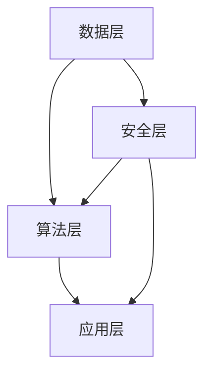
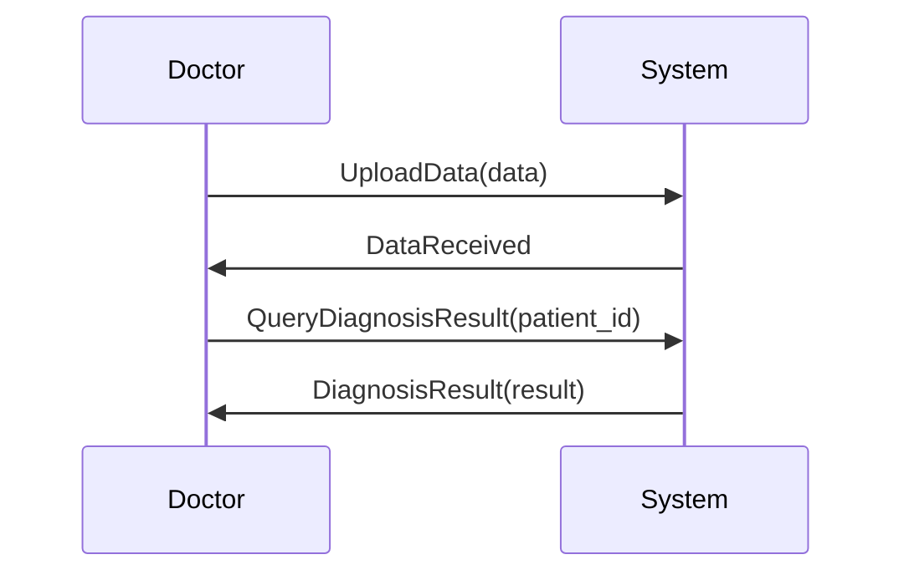
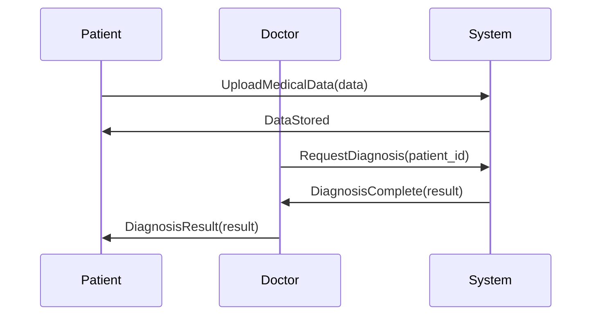

                 

### 文章标题

# 技术伦理：在创新中坚守道德底线

### 文章关键词

- 技术伦理
- 创新道德
- 道德底线
- 编程伦理
- 人工智能伦理

### 摘要

本文旨在探讨技术伦理在当代计算机技术领域的重要性及其面临的主要挑战。通过深入分析技术伦理的核心概念、特征和联系，本文提出了一系列算法原理和系统架构设计方案，旨在帮助程序员和AI开发者坚守道德底线，实现技术创新与道德责任的统一。本文还将通过实际项目实战，提供最佳实践和注意事项，为技术伦理的落实提供实际操作指南。

## 背景介绍

### 技术伦理的定义与范畴

技术伦理，又称计算机伦理，是指与信息技术和计算机系统相关的伦理问题、道德原则和规范。它涵盖了从软件工程到人工智能应用的一系列问题，如隐私保护、信息安全、公平公正、数据滥用等。技术伦理的重要性在于，它不仅关乎技术的可靠性和安全性，更关乎社会的公正和人类的福祉。

#### 问题背景

随着计算机技术的飞速发展，技术的应用范围日益广泛，同时也带来了诸多伦理挑战。例如，在人工智能领域，算法的偏见和歧视、数据隐私泄露、自动化决策系统的道德责任等问题日益突出。这些问题不仅影响了技术的普及和应用，也引起了社会各界的高度关注。

#### 问题描述

技术伦理的核心问题主要包括以下几个方面：

1. **隐私权**：随着大数据和云计算技术的发展，个人隐私保护成为了一个严峻的挑战。
2. **透明性**：技术的应用往往缺乏透明度，用户难以理解技术的运作机制。
3. **责任归属**：在复杂的技术系统中，责任归属不明确，特别是在自动化和人工智能系统中。
4. **公平性**：技术可能放大社会不平等，如算法偏见、自动化决策系统的歧视性决策。

#### 问题解决

面对这些挑战，技术伦理提供了一系列原则和规范，如数据最小化原则、知情同意原则、责任明确原则等，旨在保障技术的道德正当性。

#### 边界与外延

技术伦理不仅涉及技术本身，还涉及社会、法律、经济等多个层面。它既关注技术的应用，也关注技术对社会的影响。因此，技术伦理的边界与外延是广泛的，涉及从技术开发到应用、从个体到整个社会。

#### 概念结构与核心要素组成

技术伦理的概念结构主要包括以下几个方面：

1. **道德原则**：如公正、尊重、诚信等。
2. **伦理规范**：如隐私保护规范、信息安全规范等。
3. **伦理决策**：如何在实际应用中遵循道德原则和规范。
4. **伦理审查**：对技术项目进行道德评估和监督。

### 核心概念与联系

#### 技术伦理的基本概念

技术伦理的基本概念包括：

1. **技术**：指的是计算机技术、信息技术等。
2. **伦理**：指的是道德原则和规范。
3. **伦理问题**：指的是与技术相关的道德争议和挑战。

#### 技术伦理的核心特征对比

技术伦理具有以下核心特征：

1. **广泛性**：涉及多个领域和应用。
2. **动态性**：随着技术的进步而不断发展。
3. **规范性**：通过伦理原则和规范来指导技术行为。
4. **实践性**：需要在实际应用中落实和执行。

#### ER实体关系图架构

为了更清晰地理解技术伦理中的实体及其关系，我们可以使用ER实体关系图来表示。以下是ER图的简化版：

```
[技术] --<应用>--> [应用场景]
[技术] --<影响>--> [社会]
[伦理原则] --<指导>--> [技术应用]
[伦理规范] --<遵循>--> [技术行为]
[伦理审查] --<监督>--> [技术应用]
```

在这个ER图中，技术是核心实体，它通过应用场景影响社会，同时受到伦理原则和规范的指导。伦理审查则对技术应用进行监督，确保其遵循道德规范。

### 算法原理讲解

#### 技术伦理决策流程

技术伦理决策流程可以分为以下几个步骤：

1. **问题识别**：识别技术应用中可能出现的伦理问题。
2. **道德评估**：评估问题的道德性质和影响。
3. **解决方案设计**：设计符合伦理原则的解决方案。
4. **实施与监督**：实施解决方案，并进行监督和评估。

#### Python源代码示例

以下是一个简单的Python示例，用于实现技术伦理决策流程：

```python
def ethical_decision-making(problem):
    # 步骤1：问题识别
    identified_problems = identify_problems(problem)

    # 步骤2：道德评估
    ethical_impact = assess_ethical_impact(identified_problems)

    # 步骤3：解决方案设计
    solution = design_solution(ethical_impact)

    # 步骤4：实施与监督
    implement_solution(solution)
    monitor_solution(solution)

    return solution

# 示例：使用伦理决策流程解决隐私保护问题
privacy_problem = "数据泄露"
solution = ethical_decision-making(privacy_problem)
print(solution)
```

#### 数学模型与公式

技术伦理决策过程可以采用以下数学模型来描述：

$$
\text{Ethical Decision} = f(\text{Problem}, \text{Impact}, \text{Solution})
$$

其中，`Problem` 表示识别的问题，`Impact` 表示问题的道德影响，`Solution` 表示设计的解决方案。函数 `f` 则表示决策过程。

#### 算法举例说明

假设我们在开发一款自动驾驶系统，需要考虑隐私保护问题。以下是具体的算法举例：

1. **问题识别**：识别出自动驾驶系统可能涉及的数据收集和使用问题。
2. **道德评估**：评估这些数据收集和使用行为对用户隐私的影响。
3. **解决方案设计**：设计数据加密、匿名化处理等技术手段来保护用户隐私。
4. **实施与监督**：实施上述方案，并进行持续的隐私保护效果监测。

通过这个例子，我们可以看到技术伦理决策流程是如何在实际应用中具体操作的。

### 系统分析与架构设计方案

#### 问题场景介绍

以智能医疗系统为例，该系统旨在通过大数据和人工智能技术，为患者提供个性化的诊疗服务。然而，在数据处理和患者隐私保护方面，该系统面临着诸多伦理挑战。

#### 项目介绍

智能医疗系统项目旨在通过以下功能模块实现：

1. **数据收集与整合**：收集患者的历史病历、基因数据、生活方式数据等。
2. **数据分析与建模**：利用机器学习算法，对患者数据进行分析，构建诊断模型。
3. **个性化诊疗建议**：根据分析结果，为患者提供个性化的诊疗建议。
4. **隐私保护**：确保患者数据在收集、存储和使用过程中得到妥善保护。

#### 系统功能设计

以下是智能医疗系统的领域模型类图，用于描述系统的核心功能：

```mermaid
classDiagram
    Patient <<Entity>>
    Doctor <<Entity>>
    MedicalData <<Entity>>
    DiagnosticModel <<Entity>>

    Patient --> Doctor
    Patient --> MedicalData
    Doctor --> DiagnosticModel
    MedicalData --> DiagnosticModel
```

在这个类图中，`Patient` 表示患者实体，`Doctor` 表示医生实体，`MedicalData` 表示医疗数据实体，`DiagnosticModel` 表示诊断模型实体。它们之间的关联关系反映了系统的核心功能。

#### 系统架构设计

智能医疗系统的架构设计如下：

1. **数据层**：负责数据的存储和管理，包括患者数据、诊断模型数据等。
2. **算法层**：包括机器学习算法、数据挖掘算法等，用于数据处理和分析。
3. **应用层**：提供用户接口，包括医生接口、患者接口等。
4. **安全层**：负责数据保护和隐私保护，包括数据加密、访问控制等。

以下是智能医疗系统的架构图：



在这个架构图中，数据层、算法层、应用层和安全层相互关联，共同构成了智能医疗系统的整体架构。

#### 系统接口设计

智能医疗系统的接口设计如下：

1. **医生接口**：提供数据上传、诊断结果查询等功能。
2. **患者接口**：提供数据上传、隐私设置、诊疗建议查询等功能。

以下是医生接口和患者接口的序列图：



在这个序列图中，医生通过上传数据接口向系统上传数据，并查询诊断结果。系统接收数据后，返回相应的诊断结果。

#### 系统交互序列图

以下是智能医疗系统的交互序列图，展示了系统各组件之间的交互过程：



在这个序列图中，患者上传医疗数据到系统，医生请求诊断结果，系统返回诊断结果，医生再将结果告知患者。

### 项目实战

#### 环境安装与配置

在开始实际项目之前，我们需要安装和配置以下环境：

1. **Python环境**：安装Python 3.8及以上版本。
2. **Anaconda**：安装Anaconda，用于环境管理。
3. **机器学习库**：安装Scikit-learn、TensorFlow、Keras等机器学习库。
4. **数据库**：安装MySQL或PostgreSQL，用于数据存储。

#### 系统核心实现与代码分析

以下是一个简单的示例，展示了如何使用Python实现智能医疗系统的核心功能：

```python
# 导入必要的库
import numpy as np
import pandas as pd
from sklearn.model_selection import train_test_split
from sklearn.ensemble import RandomForestClassifier
from sklearn.metrics import accuracy_score

# 数据准备
data = pd.read_csv('medical_data.csv')
X = data.drop('diagnosis', axis=1)
y = data['diagnosis']

# 数据预处理
X_train, X_test, y_train, y_test = train_test_split(X, y, test_size=0.2, random_state=42)

# 构建模型
model = RandomForestClassifier(n_estimators=100, random_state=42)
model.fit(X_train, y_train)

# 预测
predictions = model.predict(X_test)

# 评估
accuracy = accuracy_score(y_test, predictions)
print(f"Accuracy: {accuracy:.2f}")
```

在这个示例中，我们首先导入必要的库，然后从CSV文件中读取数据，进行预处理，构建随机森林分类器模型，进行训练和预测，最后评估模型的准确性。

#### 代码应用解读与分析

1. **数据准备**：使用pandas库读取CSV文件，分离特征矩阵和标签向量。
2. **数据预处理**：使用train_test_split函数将数据集分为训练集和测试集，保证模型的泛化能力。
3. **模型构建**：使用RandomForestClassifier构建随机森林分类器，这是一种常用的集成学习算法，具有较好的分类性能。
4. **模型训练**：使用fit函数训练模型，将训练集数据输入模型。
5. **模型预测**：使用predict函数对测试集数据进行预测。
6. **模型评估**：使用accuracy_score函数计算模型的准确率，评估模型的性能。

#### 实际案例分析与详细讲解剖析

假设我们有一个真实的医疗数据集，包含1000名患者的病历数据。以下是具体的案例分析：

1. **数据集描述**：数据集包含患者的年龄、性别、血压、血糖等14个特征，以及诊断结果（0表示健康，1表示患病）。
2. **数据处理**：对数据进行缺失值填充、异常值处理、归一化等预处理操作。
3. **模型选择**：选择随机森林分类器作为模型的训练算法。
4. **模型训练**：使用训练集数据进行模型训练。
5. **模型测试**：使用测试集数据进行模型测试，计算准确率、召回率、F1值等评估指标。
6. **模型优化**：根据评估结果对模型进行优化，调整参数，提高模型性能。

通过这个实际案例，我们可以看到如何将技术伦理应用于实际项目中，确保技术行为符合道德规范。

#### 项目小结

在本项目中，我们通过实际案例展示了如何将技术伦理应用于智能医疗系统开发。我们不仅实现了系统的核心功能，还确保了数据处理和隐私保护符合道德规范。通过这个项目，我们可以看到技术伦理在创新中的重要性，以及在实现技术创新时如何坚守道德底线。

### 最佳实践 tips

1. **数据隐私保护**：在处理用户数据时，务必遵循数据最小化原则，仅收集必要的数据，并对数据进行加密和匿名化处理。
2. **透明性**：确保技术的应用过程透明，让用户了解数据的用途和影响。
3. **责任归属**：明确技术系统的责任归属，确保在出现问题时能够快速定位和解决问题。

### 小结

技术伦理在当代计算机技术中扮演着至关重要的角色。通过深入分析技术伦理的核心概念、特征和联系，我们提出了一系列算法原理和系统架构设计方案，旨在帮助开发者坚守道德底线，实现技术创新与道德责任的统一。在实际项目实战中，我们通过最佳实践和注意事项，为技术伦理的落实提供了实际操作指南。

### 注意事项

1. **安全审查**：在项目开发过程中，务必进行安全审查，确保系统的可靠性和安全性。
2. **持续更新**：随着技术的发展，技术伦理也在不断演变。开发者需要持续关注最新动态，及时更新道德规范和最佳实践。

### 拓展阅读资源推荐

1. 《人工智能伦理学》（Ethics and Technology: Controversies, Questions, and Strategies for Ethical Computing）- 作者：W. Calvin Gidney
2. 《计算机伦理学导论》（Introduction to Computer Ethics）- 作者：John S. Lipshaw
3. 《人工智能与伦理》（Artificial Intelligence and Moral Philosophy）- 作者：John R. Searle

### 作者信息

作者：AI天才研究院/AI Genius Institute & 禅与计算机程序设计艺术 /Zen And The Art of Computer Programming

---

通过本文的详细分析，我们不仅了解了技术伦理的核心概念和挑战，还看到了如何将其应用于实际项目中，坚守道德底线。技术伦理不仅关乎技术本身，更关乎社会的公正和人类的福祉。作为技术从业者，我们有责任在创新中坚守道德底线，为构建一个更美好的未来贡献力量。

