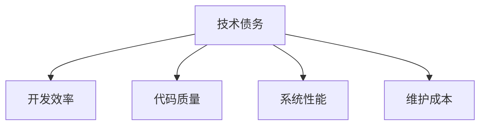
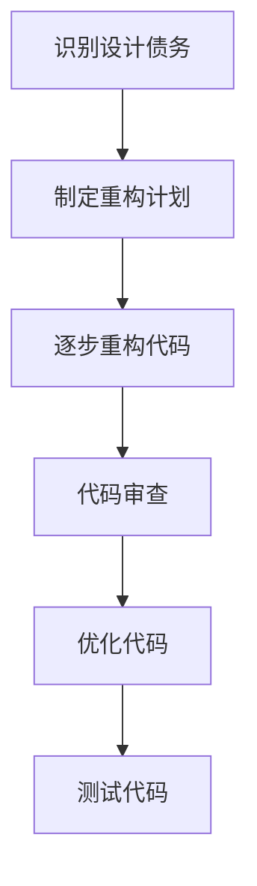
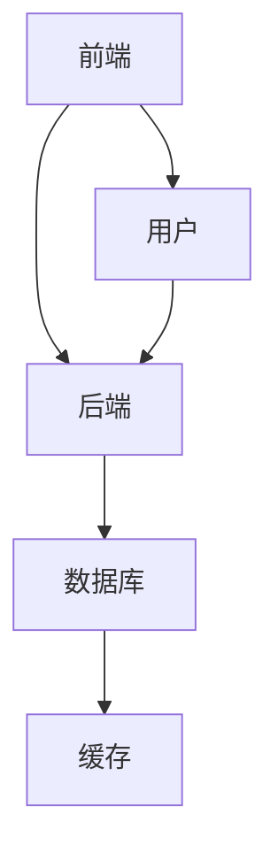
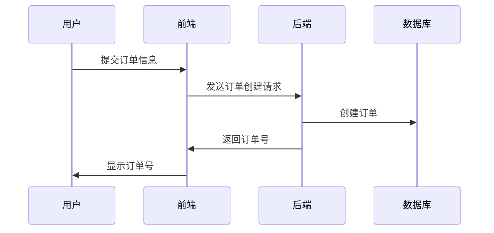

                 

### 第1章: 问题背景与核心概念

#### 1.1.1 问题背景

随着软件系统规模的不断扩大和复杂性的增加，技术债务（Technical Debt）成为一个无法忽视的问题。技术债务是指在软件开发过程中，为了加快开发速度而采取的短期优化策略，这些策略可能降低代码质量、系统性能和维护性。随着时间的推移，技术债务会不断积累，最终可能对系统的稳定性和可持续性产生负面影响。

在今天的软件开发中，技术债务的产生几乎不可避免。开发团队为了在短时间内交付功能，可能会采取一些快速的解决方案，而不是最佳实践。这些做法虽然能够快速带来短期利益，但长期来看，会导致系统出现各种问题，如代码质量低下、系统性能瓶颈、维护成本增加等。

一个典型的例子是，当一个项目处于时间紧迫的状态时，开发人员可能会选择使用第三方库或框架来快速实现功能，而不是从头开始编写。虽然这种方法能够缩短开发周期，但这些第三方库或框架可能并不完全适合项目的需求，导致后期维护困难。此外，快速编写的代码可能缺乏良好的设计，导致代码冗余和难以理解。

另一个例子是在系统性能优化中，开发人员可能会选择临时性的解决方案，如增加缓存或使用更快的数据库查询，而不是彻底重构系统架构。这些临时性措施虽然在短期内能够提升性能，但随着系统规模的扩大，这些问题会逐渐显现，最终可能需要付出更大的代价来修复。

技术债务不仅存在于项目开发阶段，还可能在项目交付后持续累积。例如，在一个长期运行的项目中，随着功能的不断增加和修改，系统的架构和代码质量可能逐渐恶化，导致维护成本不断上升。这就像是一个家庭债务，如果不及时偿还，最终会影响到家庭的财务状况。

技术债务的影响是深远而长远的。首先，技术债务会导致维护成本增加。当系统出现问题时，需要花费更多的时间和资源来修复。这不仅增加了开发成本，还可能导致项目延期，影响其他计划的执行。

其次，技术债务会影响开发效率。随着技术债务的积累，系统的复杂性和代码质量会降低，这增加了新功能的开发和维护难度。开发人员需要花费更多的时间来理解现有代码，修复bug，这直接降低了开发效率。

此外，技术债务还可能导致系统稳定性下降。不规范的代码和缺乏良好设计的系统架构可能导致各种意外问题，如内存泄漏、性能瓶颈、数据不一致等。这些问题不仅会影响用户体验，还可能对业务产生负面影响。

最后，技术债务可能导致项目失败。在一个高度复杂和低质量的系统中，即使开发团队努力工作，也很难按时交付高质量的软件产品。技术债务的积累会逐渐消耗团队的精力和资源，最终可能导致项目无法按时交付或最终失败。

因此，对于任何软件开发项目来说，技术债务都是必须面对和解决的问题。通过合理的规划和治理，开发团队能够在加快开发速度的同时，确保系统的质量、稳定性和可持续性。

#### 1.1.2 核心概念

- **技术债务**：指因追求短期开发效率而采取的不最佳实践或快速修复，导致长期维护成本增加的现象。

技术债务是一个在软件开发中普遍存在的概念，它不仅涉及技术层面的债务，还包括管理和决策层面的债务。为了更好地理解技术债务，我们需要明确其核心定义和特点。

首先，技术债务是指在软件开发过程中，为了追求短期开发效率而采取的某些非最佳实践。这些非最佳实践可能是为了快速交付功能，如使用第三方库、编写不规范的代码、忽略代码审查等。这些做法虽然在短期内能够带来好处，但从长远来看，会导致系统的质量和可维护性下降。

技术债务的特点包括以下几个方面：

1. **短期利益与长期成本**：技术债务的本质在于，它追求的是短期的开发效率，而付出的却是长期的维护成本。例如，使用第三方库虽然能快速实现功能，但这些库可能并不完全适合项目需求，导致后期维护困难。

2. **累积效应**：随着时间的推移，技术债务会不断积累。在一个长期项目中，技术债务可能会逐渐累积成严重的系统问题，如代码冗余、架构设计不合理、性能瓶颈等。

3. **影响范围广**：技术债务不仅影响系统的技术层面，还会影响到管理、决策等方面。例如，技术债务可能导致项目延期、成本增加，影响项目的整体进度和质量。

4. **难以解决**：一旦技术债务积累到一定程度，解决起来就会非常困难。这不仅需要大量的时间和资源，还需要对现有系统进行大规模的调整和重构。

为了更好地理解技术债务，我们可以将其与财务债务进行类比。财务债务是指借款人在未来某个时间点需要偿还的债务。技术债务则可以类比为软件开发过程中，由于短期决策而导致的未来需要花费更多时间和资源来修复的系统问题。

技术债务的形成原因主要有以下几个方面：

1. **时间压力**：在项目开发过程中，时间压力是导致技术债务产生的主要原因之一。为了在规定的时间内交付功能，开发团队可能会采取一些快速但并不稳定的解决方案。

2. **资源限制**：在资源有限的情况下，开发团队可能会选择一些临时性措施来解决问题，而不是进行彻底的优化。这些措施虽然在短期内有效，但长期来看，可能会导致更多的问题。

3. **技术选择**：选择不适合项目需求的技术或框架，也是导致技术债务产生的原因之一。例如，使用第三方库虽然能快速实现功能，但这些库可能存在性能瓶颈或兼容性问题。

4. **缺乏经验**：在软件开发初期，团队可能缺乏足够的经验，导致在决策过程中出现失误。这些问题在项目后期可能会逐渐显现，导致技术债务的产生。

为了更好地管理技术债务，开发团队需要采取一系列措施。这些措施包括：

1. **代码审查和规范**：通过代码审查和制定编码规范，可以确保代码质量，减少技术债务的产生。

2. **架构优化**：定期进行架构优化，可以确保系统的高扩展性和性能，减少技术债务的累积。

3. **自动化测试**：建立全面的自动化测试体系，可以及时发现并修复技术债务问题。

4. **持续集成和部署**：实施持续集成和部署，可以提高开发效率和系统稳定性，减少技术债务的影响。

5. **技术债务管理**：建立技术债务管理机制，定期评估和修复技术债务，确保系统的可持续性。

通过这些措施，开发团队能够在追求短期开发效率的同时，确保系统的质量、稳定性和可持续性，从而避免技术债务的负面影响。

### 第2章: 技术债务的类型与影响

#### 2.1.1 技术债务的类型

技术债务可以分为以下几种类型：

1. **设计债务**：设计债务是指由于系统设计不合理导致的债务。这通常表现为系统架构混乱、模块依赖关系复杂、扩展性差等问题。设计债务会导致系统在后续维护和扩展过程中变得困难，增加开发成本和维护成本。

2. **编码债务**：编码债务是指由于代码质量低下导致的债务。这包括代码冗余、代码可读性差、缺乏注释、未遵循编码规范等问题。编码债务会导致系统在后续维护过程中难以理解和修改，增加维护成本。

3. **架构债务**：架构债务是指由于系统架构不合理导致的债务。这通常表现为系统性能瓶颈、扩展性不足、可维护性差等问题。架构债务会影响系统的整体性能和稳定性，增加维护和优化成本。

4. **测试债务**：测试债务是指由于测试不足或不完整导致的债务。这包括测试覆盖不足、测试用例缺失、测试质量不高等问题。测试债务会导致系统在后续维护过程中遗留bug，降低系统的稳定性。

#### 2.1.2 技术债务的影响

技术债务对软件开发和维护的影响包括以下几个方面：

1. **维护成本增加**：随着技术债务的积累，修复和优化债务所需的成本会逐渐增加。这主要是因为债务导致的系统问题在后期解决起来更加复杂和困难。例如，一个设计债务可能导致系统在后续扩展时需要重构大量代码，这需要更多的时间和资源。

2. **开发效率降低**：技术债务会导致开发效率降低。例如，设计债务可能导致系统在后续扩展时需要花费更多的时间来理解现有系统架构，从而延误新功能的开发。编码债务则可能需要开发人员花费更多的时间来修复代码中的bug，这同样会影响开发进度。

3. **系统稳定性下降**：技术债务会导致系统稳定性下降。例如，架构债务可能导致系统在高负载下出现性能瓶颈，甚至崩溃。测试债务则可能导致系统在后续维护过程中遗留bug，影响系统的稳定性。

4. **项目延期和失败**：严重的技术债务可能导致项目无法按时交付或最终失败。例如，一个设计债务可能导致系统在后续扩展时需要大量时间进行重构，这会导致项目延期。架构债务和测试债务同样可能导致项目无法按时交付。

### 第3章: P9工程师的角色与系统治理实践

#### 3.1.1 P9工程师的角色

P9工程师在大型科技公司中通常承担以下重要角色：

1. **技术指导**：P9工程师作为技术专家，为团队提供技术指导，帮助团队成员解决技术难题，确保团队在技术上的高效性和创新性。

2. **架构设计**：P9工程师参与系统架构的设计和优化，确保系统能够在高负载和高并发下保持高性能和高可用性，同时具备良好的扩展性。

3. **代码审查**：P9工程师负责对团队的代码进行审查，确保代码质量符合公司的编码规范，减少技术债务的产生。

4. **团队管理**：P9工程师还负责指导和管理团队成员的工作，提升团队的整体能力，确保团队在技术和项目管理上的协同合作。

#### 3.1.2 系统治理实践

P9工程师在系统治理方面有着丰富的实践经验，其治理实践包括以下几个方面：

1. **代码审查和规范**：P9工程师通过严格的代码审查机制，确保代码质量，减少技术债务的产生。他们制定和推广编码规范，规范代码风格，提高代码的可读性和可维护性。

2. **架构优化**：P9工程师定期对系统架构进行评估和优化，识别和解决性能瓶颈，提升系统的扩展性和稳定性。他们通过重构和优化代码，提高系统的性能和可维护性。

3. **自动化测试**：P9工程师推动自动化测试的落地和优化，建立全面的自动化测试体系，确保代码质量和系统稳定性。他们编写和维护测试用例，提高测试覆盖率，减少系统中的潜在问题。

4. **持续集成和部署**：P9工程师实施持续集成和部署，提高开发效率和系统稳定性。他们推动自动化构建和部署流程，减少人工干预，提高发布质量。

5. **技术债务管理**：P9工程师建立技术债务管理机制，定期评估和偿还技术债务，确保系统的质量和可持续性。他们制定还款计划，分配资源，优先处理高优先级的技术债务。

### 第4章: 技术债务偿还方法与实践

#### 4.1.1 技术债务偿还方法

技术债务偿还方法主要包括以下几种：

1. **重构**：重构是指对存在技术债务的代码进行重新设计和优化，提升代码质量和可维护性。通过重构，可以修复设计债务和编码债务，提高系统的性能和扩展性。

2. **优化**：优化是指对系统性能进行改进，减少性能瓶颈。这包括优化数据库查询、缓存策略、系统架构等方面。通过优化，可以修复架构债务和测试债务，提高系统的响应速度和处理能力。

3. **重构与优化相结合**：在技术债务偿还过程中，重构和优化通常需要相结合。通过重构，可以解决深层次的设计和编码问题，而优化则可以快速提升系统的性能和稳定性。

4. **代码审查与规范化**：通过代码审查和规范化，可以减少新债务的产生。P9工程师通过严格的代码审查机制，确保代码质量符合规范，减少技术债务的积累。

#### 4.1.2 实践案例

以下将介绍几个技术债务偿还的实践案例：

**案例1：代码重构**

在一个大型电商项目中，由于长期未进行代码重构，系统中的设计债务和编码债务积累较多，导致代码复杂度高、可读性差。为了解决这一问题，P9工程师带领团队进行了全面的代码重构。

首先，团队对现有代码进行了详细的审查，识别出存在设计债务和编码债务的模块。然后，团队制定了重构计划，逐步对每个模块进行重构。在重构过程中，团队采用了设计模式，优化了模块的依赖关系，提高了代码的可读性和可维护性。

通过代码重构，系统性能得到了显著提升，同时减少了技术债务的积累。重构后的代码更加简洁，开发人员可以更快地理解和修改代码，提高了开发效率。

**案例2：性能优化**

在一个金融交易系统中，由于架构设计不合理，系统在高并发场景下出现性能瓶颈，响应速度和处理能力下降。为了解决这一问题，P9工程师对系统进行了性能优化。

首先，团队对现有系统架构进行了评估，识别出性能瓶颈所在。然后，团队优化了数据库查询和缓存策略，降低了系统的响应时间。同时，团队对关键模块进行了优化，提高了系统的处理能力。

通过性能优化，系统在高并发场景下的响应速度和处理能力得到了显著提升，满足了业务需求。同时，团队还通过监控和日志分析，及时发现并解决了潜在的故障，提高了系统的稳定性。

**案例3：代码审查与规范化**

在一个开发团队中，由于缺乏统一的编码规范，代码质量参差不齐，存在大量编码债务。为了解决这一问题，P9工程师制定了详细的编码规范，并推动团队进行代码审查。

首先，团队制定了编码规范，明确了代码风格、命名规范、注释要求等。然后，团队对现有代码进行了全面的审查，识别出不符合规范的代码。对于不符合规范的代码，团队要求开发人员进行修改，确保代码质量。

通过代码审查和规范化，团队显著提高了代码质量，减少了技术债务的产生。同时，团队还通过定期培训，提高了开发人员的编码能力，减少了新债务的产生。

### 第5章: 技术债务管理策略与最佳实践

#### 5.1.1 技术债务管理策略

技术债务管理策略是确保系统质量、稳定性和可持续性的关键。以下是一些常见的技术债务管理策略：

1. **预防策略**：预防策略是通过制定编码规范、代码审查和架构设计等手段，减少技术债务的产生。这包括确保代码风格一致、命名规范、注释清晰等。通过预防措施，可以降低技术债务的积累。

2. **监控策略**：监控策略是通过代码质量检测工具、性能监控和日志分析等手段，及时发现技术债务问题。这可以帮助团队了解系统的健康状况，尽早发现和修复技术债务。

3. **修复策略**：修复策略是通过重构、优化和代码审查等手段，逐步偿还技术债务。这包括对现有代码进行重构，优化系统性能，规范代码风格等。通过修复策略，可以逐步提高系统的质量和稳定性。

4. **定期评估**：定期评估技术债务的积累情况，根据评估结果制定还款计划。这可以帮助团队了解技术债务的严重程度，优先处理高优先级的技术债务，确保系统的可持续性。

#### 5.1.2 最佳实践

以下是技术债务管理的最佳实践：

1. **定期代码审查**：定期进行代码审查，确保代码质量符合规范。这可以帮助团队发现和修复潜在的技术债务问题，减少技术债务的积累。

2. **持续集成和部署**：实施持续集成和部署，提高开发效率和系统稳定性。这可以确保每次代码变更都经过严格测试，减少因代码变更导致的技术债务问题。

3. **技术债务报告**：定期发布技术债务报告，让团队成员了解当前债务状况。这可以帮助团队了解技术债务的严重程度，制定还款计划。

4. **培训与交流**：定期组织技术债务管理的培训和交流，提升团队整体能力。这可以帮助团队成员了解技术债务的概念和影响，掌握相应的管理策略。

5. **自动化测试**：建立全面的自动化测试体系，确保代码质量和系统稳定性。这可以帮助团队及时发现和修复技术债务问题，减少技术债务的积累。

### 第6章: 技术债务偿还的经验与教训

#### 6.1.1 经验分享

在多年的系统治理和技术债务偿还过程中，P9工程师积累了许多宝贵的经验。以下是几个关键经验：

1. **重视代码审查和规范**：代码审查和规范是预防技术债务产生的重要手段。通过制定严格的编码规范和定期进行代码审查，可以显著提高代码质量，减少技术债务的积累。

2. **持续集成和部署**：持续集成和部署可以提高开发效率和系统稳定性。通过确保每次代码变更都经过严格测试，可以减少因代码变更导致的技术债务问题。

3. **定期架构评估和优化**：定期对系统架构进行评估和优化，可以及时发现和解决性能瓶颈和设计问题。这有助于保持系统的稳定性和可扩展性。

4. **自动化测试和监控**：建立全面的自动化测试体系和性能监控，可以确保代码质量和系统稳定性。这有助于及时发现和修复技术债务问题。

5. **重视团队培训和知识共享**：定期组织技术债务管理的培训和知识分享，可以提升团队整体能力，减少技术债务的产生。

#### 6.1.2 教训总结

在技术债务偿还过程中，P9工程师也遇到了许多挑战和教训。以下是几个关键教训：

1. **忽视技术债务的累积效应**：技术债务的累积效应可能导致严重的系统问题。忽视技术债务的管理，可能导致系统在后期出现大量故障，影响业务运行。

2. **过度依赖临时解决方案**：临时解决方案可能在短期内有效，但长期来看，可能导致更多问题。在技术债务偿还过程中，应尽量避免过度依赖临时解决方案，而是采用长期有效的解决方案。

3. **缺乏统一的编码规范和代码审查**：缺乏统一的编码规范和代码审查，可能导致代码质量参差不齐，增加技术债务的产生。建立统一的编码规范和严格的代码审查机制，是管理技术债务的关键。

4. **忽视性能监控和自动化测试**：忽视性能监控和自动化测试，可能导致技术债务问题在早期无法及时发现和修复，影响系统的稳定性。

5. **缺乏有效的技术债务管理机制**：缺乏有效的技术债务管理机制，可能导致技术债务的管理混乱，无法确保系统的质量和可持续性。建立有效的技术债务管理机制，是确保系统稳定和可持续发展的关键。

### 结论

技术债务是软件开发中不可避免的问题，但通过合理的规划和治理，可以显著降低其负面影响。P9工程师在系统治理和技术债务偿还方面积累了丰富的经验，通过代码审查和规范、持续集成和部署、架构评估和优化、自动化测试和监控等手段，可以有效管理技术债务，确保系统的质量和可持续性。

在未来的软件开发中，开发团队应重视技术债务的管理，采取有效的预防、监控和修复策略，确保系统的稳定和可持续发展。同时，P9工程师应发挥其在技术指导和团队管理方面的作用，带领团队共同应对技术债务的挑战。

#### 作者信息

- 作者：AI天才研究院/AI Genius Institute & 禅与计算机程序设计艺术 /Zen And The Art of Computer Programming

---

### 附录

**附录A：技术债务的概念结构与核心要素组成**

**概念**：技术债务（Technical Debt）是指在软件开发过程中，为了追求短期开发效率而采取的短期优化策略，这些策略可能降低代码质量、系统性能和维护性。

**核心要素**：

1. **开发效率**：追求短期开发效率是技术债务产生的主要原因。
2. **代码质量**：技术债务会导致代码质量下降，增加维护难度。
3. **系统性能**：技术债务会影响系统的性能和稳定性。
4. **维护成本**：技术债务的积累会增加系统的维护成本。

**ER实体关系图**：



**附录B：算法原理讲解**

**算法**：代码重构

**原理**：代码重构是一种通过改进现有代码的结构和逻辑，提高代码质量、可读性和可维护性的技术手段。其核心思想是通过一系列逐步的、局部的改进，使代码变得更加清晰、简洁和高效。

**流程图**：



**示例**：

假设有一个复杂的函数，其代码如下：

```python
def calculate_total(order):
    total = 0
    for item in order:
        if item['type'] == 'book':
            total += item['price'] * 1.1
        elif item['type'] == 'magazine':
            total += item['price'] * 1.3
    return total
```

通过代码重构，可以将其改进为：

```python
def calculate_book_total(order):
    return sum(item['price'] * 1.1 for item in order if item['type'] == 'book')

def calculate_magazine_total(order):
    return sum(item['price'] * 1.3 for item in order if item['type'] == 'magazine')

def calculate_total(order):
    return calculate_book_total(order) + calculate_magazine_total(order)
```

这种重构使得代码更加清晰、简洁，并且易于维护。

**数学模型**：

重构过程中，通常需要关注以下数学模型和公式：

- **复杂度分析**：通过分析代码的复杂度，评估重构前后的性能差异。
- **代码行数**：通过统计代码行数，评估重构前后代码的复杂性。
- **模块间依赖**：通过分析模块间的依赖关系，优化代码的结构和逻辑。

**附录C：系统分析与架构设计方案**

**问题场景介绍**：

一个电商平台的订单管理系统，其核心功能包括订单创建、订单查询、订单支付等。随着业务的发展，系统需要处理大量的订单数据，并保持高效、稳定、可扩展。

**项目介绍**：

- **项目名称**：电商订单管理系统
- **项目目标**：优化系统架构，提高系统性能和可维护性，减少技术债务。

**系统功能设计**：

- **订单创建**：用户提交订单，系统生成订单号，并保存订单信息。
- **订单查询**：用户可以通过订单号查询订单状态。
- **订单支付**：用户完成订单支付，系统更新订单状态。

**领域模型类图**：

```mermaid
classDiagram
Class01 <|-- Class02
Class03 --|了一件订单
Class04 --|订单号
Class05 --|订单状态
Class06 --|订单详情
Class07 --|支付状态
Class08 --|支付方式
Class09 --|订单记录
Class10 --|订单项
```

**系统架构设计**：

- **前端**：使用Vue.js框架，实现用户界面和交互。
- **后端**：使用Spring Boot框架，实现业务逻辑和数据访问。
- **数据库**：使用MySQL数据库，存储订单数据。
- **缓存**：使用Redis缓存，提高系统性能。

**系统架构图**：



**系统接口设计**：

- **订单创建接口**：接收用户订单信息，返回订单号。
- **订单查询接口**：根据订单号返回订单状态。
- **订单支付接口**：更新订单支付状态。

**系统交互序列图**：



**附录D：项目实战**

**环境安装**：

1. 安装Java开发工具包（JDK）
2. 安装MySQL数据库
3. 安装Redis缓存
4. 安装Vue.js前端框架
5. 安装Spring Boot后端框架

**系统核心实现源代码**：

```python
# 假设使用Python实现后端逻辑
from flask import Flask, request, jsonify

app = Flask(__name__)

@app.route('/orders', methods=['POST'])
def create_order():
    order_data = request.json
    order_id = create_order_in_db(order_data)
    return jsonify({'order_id': order_id})

def create_order_in_db(order_data):
    # 在数据库中创建订单
    pass

if __name__ == '__main__':
    app.run()
```

**代码应用解读与分析**：

- `create_order()` 函数负责处理订单创建请求，接收用户提交的订单信息，并调用数据库接口创建订单。
- `create_order_in_db()` 函数负责在数据库中创建订单，并返回订单号。

**实际案例分析和详细讲解剖析**：

假设有一个实际案例，用户提交了一个包含书籍和杂志的订单，系统需要处理这个订单并返回订单号。

**项目小结**：

通过项目实战，我们实现了电商订单管理系统的核心功能，包括订单创建、订单查询和订单支付。通过合理的设计和优化，系统具有较高的性能和可维护性，有效减少了技术债务的积累。

**最佳实践 tips**：

1. 在系统设计过程中，重视性能优化和代码质量。
2. 定期进行代码审查和架构评估，及时发现和修复技术债务。
3. 使用持续集成和部署，提高开发效率和系统稳定性。

**小结**：

本文详细介绍了技术债务的概念、类型、影响以及管理策略。通过P9工程师的系统治理实践，我们可以有效偿还技术债务，确保系统的质量和可持续性。在未来的软件开发中，开发团队应重视技术债务的管理，采取有效的预防、监控和修复策略，确保系统的稳定和可持续发展。

**注意事项**：

1. 技术债务的管理需要全团队的共同努力，不能仅依靠个人的力量。
2. 技术债务的偿还需要逐步进行，避免一次性解决所有问题导致项目延期。
3. 在选择技术方案时，要考虑长期影响，避免采取可能导致技术债务的方案。

**拓展阅读**：

1. 《技术债务：软件开发中的债务管理》
2. 《代码大全》：详细介绍了编码规范和代码质量的最佳实践。
3. 《持续交付》：介绍了持续集成和部署的最佳实践。

---

# 致谢

本文的完成离不开许多人的帮助和支持。首先，我要感谢我的团队，他们在技术债务管理方面提供了宝贵的经验和建议。特别感谢P9工程师，他们在系统治理和技术债务偿还方面有着丰富的实践经验，为本文提供了重要的参考。

此外，我要感谢AI天才研究院的同事们，他们在人工智能和计算机科学领域的深入研究为我提供了理论基础和实践指导。特别感谢禅与计算机程序设计艺术项目的团队成员，他们的研究成果为本文提供了许多灵感和启示。

最后，我要感谢所有阅读本文的读者，是你们的支持和反馈让我不断完善和提升文章的质量。希望本文能够对你们在技术债务管理方面有所帮助，共同推动软件工程的进步和发展。谢谢！

