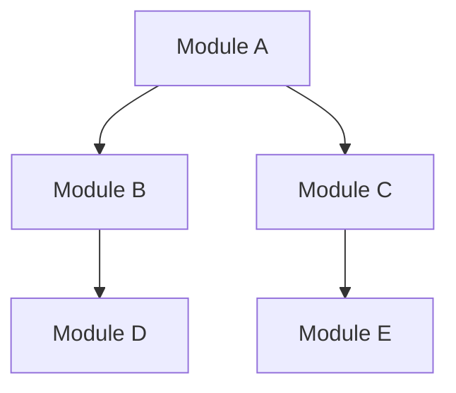

                 

### 技术债务的概念与本质

#### 技术债务的定义

技术债务（Technical Debt）是软件开发领域的一个比喻，它类比于金融领域的债务概念。在金融领域，债务是指个人或机构借款所形成的负债。而在软件开发领域，技术债务是指由于时间、资源或技能限制，开发者未能完全实现或优化需求的代码、架构或设计决策。这种决策可能会带来短期的好处，但长远来看，会带来更多的维护成本和潜在风险。

技术债务并不是一开始就存在的，而是随着项目开发的过程逐渐积累的。例如，在项目初期，开发者可能会为了加快进度而选择使用一些快速开发的技术或工具，这些选择可能在短期内看起来是有效的，但从长远来看，可能会导致代码质量下降、系统性能降低，甚至会影响后续的维护和扩展。

#### 技术债务的来源

技术债务的来源有很多，以下是其中几个常见的来源：

1. **遗留问题**：这是技术债务最常见的来源之一。在早期项目中，开发者可能由于时间或资源限制，没有完全遵循最佳实践或使用了不合适的技术和工具，导致遗留问题。

2. **应急修复**：在项目开发过程中，可能会遇到一些紧急问题，例如系统崩溃或严重的性能问题。为了尽快解决这些问题，开发者可能会快速编写一些临时解决方案，这些方案可能在长期内会导致技术债务。

3. **技术选择**：开发者可能会因为急于完成项目而选择一些更简单而非最优的解决方案。这些选择可能会在短期内节省时间，但从长远来看，可能会增加维护成本。

4. **功能妥协**：在某些情况下，为了尽快交付功能，开发者可能会简化某些功能或减少某些测试，这也会导致技术债务。

#### 技术债务的负面影响

技术债务虽然可能在短期内带来一些好处，但长远来看，其负面影响是巨大的：

1. **维护成本增加**：随着技术债务的积累，系统的维护成本会逐渐增加。因为遗留问题需要额外的资源和时间来解决，而且这些问题的修复可能会影响其他部分的功能。

2. **性能下降**：技术债务可能会导致系统性能下降。例如，遗留的代码问题可能会导致系统运行缓慢，影响用户体验。

3. **代码质量下降**：技术债务通常与低质量的代码相关。这会导致新功能的开发和集成变得更加困难，甚至可能导致新的问题。

4. **团队士气下降**：技术债务可能会影响团队的士气。团队成员可能会感到沮丧和疲惫，因为他们需要花费大量时间来解决遗留问题。

5. **项目延期**：技术债务可能会导致项目延期。因为解决技术债务需要额外的时间和资源，这可能会导致项目无法按时完成。

#### 总结

技术债务是软件开发过程中不可避免的一部分，但通过合理的规划和有效的管理，我们可以减轻其负面影响。在接下来的章节中，我们将进一步探讨如何识别、分类和管理技术债务。通过这些讨论，我们将了解如何使用可视化工具来更好地理解和管理技术债务，从而确保软件项目的长期成功。

### 技术债务的识别与分类

在软件开发过程中，技术债务的存在可能会逐渐侵蚀项目的稳定性和效率。因此，及时发现和识别技术债务至关重要。这不仅可以帮助团队在早期阶段解决问题，还可以避免债务积累到难以处理的程度。

#### 技术债务的识别方法

1. **代码审查**：
   代码审查是一种通过人工检查代码质量来识别潜在技术债务的方法。审查者通常会关注代码的可读性、可维护性和遵循的最佳实践程度。例如，检查是否有过多的临时代码、代码结构是否混乱、是否有代码重复等问题。

2. **静态代码分析**：
   静态代码分析是使用自动化工具来分析代码质量，识别潜在的技术债务。这些工具可以检查代码的语法、语义和结构，发现代码中的问题，如代码重复、未使用的代码、低效的算法等。例如，SonarQube 和 NDepend 就是常见的静态代码分析工具。

3. **持续集成与持续部署（CI/CD）**：
   通过 CI/CD 流程，可以自动检测代码中的潜在问题。每次提交代码时，自动化工具会运行静态代码分析和测试，及时反馈问题。这样，团队可以快速识别和解决技术债务。

4. **性能测试**：
   通过性能测试，可以检测系统在不同负载下的性能表现。性能问题通常与遗留的技术债务有关，例如代码瓶颈、资源泄漏等。通过性能测试，可以及时发现并解决这些问题。

#### 技术债务的分类

技术债务可以根据其性质和影响范围进行分类。以下是几种常见的技术债务类型：

1. **结构性债务**：
   结构性债务是指代码结构上的问题，例如代码重复、过度耦合和模块化不足。这些问题会导致代码的可维护性和可扩展性下降。

   **特征对比表格**：
   | 特征         | 结构性债务 | 其他债务 |
   | ------------ | ----------- | -------- |
   | 影响范围     | 整个系统   | 某个功能 |
   | 修复难度     | 较高       | 较低     |
   | 修复成本     | 较高       | 较低     |
   | 解决策略     | 重构代码   | 更新代码 |

2. **技术性债务**：
   技术性债务是指与所选技术和工具相关的决策问题。例如，选择了过时的技术或工具，或者使用了不适合当前项目的框架。

   **ER实体关系图**：
   ```mermaid
   graph TD
   A[技术选择] --> B{是否过时}
   B -->|是| C[技术性债务]
   B -->|否| D[无债务]
   ```

3. **功能性债务**：
   功能性债务是指在功能实现上的妥协，例如简化了某些功能以加快开发进度。这种债务通常会导致功能的缺失或不完善。

   **特征对比表格**：
   | 特征         | 功能性债务 | 其他债务 |
   | ------------ | ----------- | -------- |
   | 影响范围     | 某个功能   | 整个系统 |
   | 修复难度     | 较低       | 较高     |
   | 修复成本     | 较低       | 较高     |
   | 解决策略     | 功能重构   | 更新代码 |

#### 实例分析

以下是一个具体的技术债务实例分析：

假设一个团队正在开发一个电商网站。在项目初期，为了快速上线，团队选择了一个流行的开源框架，但在后续的开发中，发现这个框架在某些功能上的支持不足，导致开发效率低下。此外，为了加快进度，团队在某些模块上使用了临时解决方案，这些解决方案虽然短期内有效，但长期来看会导致维护成本增加。

通过代码审查和静态代码分析，团队发现以下问题：

- 代码重复率较高，影响了代码的可维护性。
- 部分模块之间存在过度的耦合，导致修改一个模块可能需要修改多个其他模块。
- 使用了多个不兼容的技术和工具，增加了维护难度。

通过性能测试，团队还发现网站在高峰时段的性能表现不佳，这通常与遗留的技术债务有关。

为了解决这些问题，团队采取了以下措施：

- 对代码进行重构，减少代码重复和模块间的耦合。
- 引入新的技术和工具，替换旧的不兼容部分。
- 对遗留的临时解决方案进行修复和优化。

通过这些措施，团队成功地减轻了技术债务，提高了代码质量和系统的可维护性，同时也提升了网站的性能。

#### 总结

识别技术债务是软件开发过程中不可或缺的一部分。通过代码审查、静态代码分析、持续集成与持续部署、性能测试等方法，团队可以及时发现并解决技术债务。同时，对技术债务进行分类，有助于制定更有效的解决方案。在下一章中，我们将探讨如何使用可视化工具来更好地理解和跟踪技术债务。

### 技术债务的可视化工具

在识别和分类技术债务之后，如何有效地管理和监控这些债务变得至关重要。可视化工具在这一过程中扮演了重要的角色，它们可以帮助团队直观地了解技术债务的现状，及时采取行动。以下是一些常见的技术债务可视化工具的介绍。

#### 常见可视化工具介绍

1. **SonarQube**：
   SonarQube 是一款功能强大的代码质量管理系统。它不仅可以进行静态代码分析，识别潜在的技术债务，还可以生成详细的报表，展示代码质量指标。通过 SonarQube，团队可以直观地看到技术债务的分布和趋势，从而制定相应的修复计划。

2. **NDepend**：
   NDepend 是一款用于 .NET 应用程序的静态分析工具。它提供了丰富的依赖关系图和代码质量指标，可以帮助团队了解系统的复杂性和潜在的技术债务。NDepend 的强大之处在于其强大的报告生成功能，可以生成详细的图表和报表，帮助团队做出数据驱动的决策。

3. **Visual Studio Code Analysis**：
   Visual Studio Code 提供了内置的代码分析功能，可以帮助开发者实时识别和修复技术债务。通过安装相应的插件，开发者可以在编辑器中直接查看代码质量指标，并在提交代码前自动执行静态代码分析。

4. **GitLab**：
   GitLab 是一款集成化的 DevOps 平台，提供了代码质量分析和持续集成功能。通过 GitLab，团队可以在代码库中集成静态代码分析工具，并在每个提交时自动运行分析，及时发现和修复技术债务。

5. **SourceTree**：
   SourceTree 是一款功能强大的 Git 客户端，提供了代码质量分析和可视化功能。通过 SourceTree，团队可以直观地查看代码库中的技术债务，并采取相应的修复措施。

#### 技术债务可视化实例

假设我们使用 SonarQube 来可视化技术债务。首先，团队将代码库导入 SonarQube，并配置静态代码分析工具。然后，SonarQube 会自动分析代码库，生成详细的技术债务报表。

以下是 SonarQube 报表中的一部分数据：

```
Technical Debt Metrics
-----------------------

Total Debt Rating: 6.5 / 10
Total Technical Debt: 150
Critical Issues: 20
Major Issues: 50
Minor Issues: 80

Distribution by Category:
- Code Smells: 100
- Bugs: 50
- Vulnerabilities: 0
```

通过这些数据，团队可以直观地看到技术债务的严重程度和分布情况。例如，代码重复问题（Code Smells）占据了大部分的技术债务，而严重的代码问题（Critical Issues）和漏洞（Vulnerabilities）也需要重点关注。

此外，SonarQube 还提供了依赖关系图，可以帮助团队了解模块间的依赖关系。通过这些依赖关系图，团队可以识别出哪些模块的技术债务最多，从而优先进行修复。

以下是 SonarQube 生成的一个依赖关系图：



在这个依赖关系图中，我们可以看到 Module A 和 Module B 的技术债务最多，团队可以优先对这些模块进行修复。

#### 总结

可视化工具在技术债务的管理和监控中起到了至关重要的作用。通过这些工具，团队可以直观地了解技术债务的现状，及时采取行动。在下一章中，我们将探讨技术债务可视化在软件开发、项目管理和运维管理中的应用，以更深入地了解其价值。

### 技术债务可视化在软件开发中的应用

技术债务可视化在软件开发的各个环节中都有着广泛的应用，特别是在需求分析、设计阶段和编码过程中。通过可视化工具，开发团队能够更直观地识别和应对技术债务，从而提高开发效率和软件质量。

#### 技术债务可视化在需求分析中的应用

在需求分析阶段，技术债务可视化可以帮助团队理解和评估项目的复杂性。通过可视化工具，需求分析师可以直观地看到需求的优先级、实现难度和技术风险。例如，使用 Gantt 图或 Kanban 板，可以将技术债务与需求关联起来，确保在开发过程中能够优先解决关键问题。

**实例分析**：

假设一个团队正在开发一个复杂的电子商务平台，需求包括用户管理、订单处理、支付处理和库存管理等多个模块。在需求分析阶段，团队使用 SonarQube 生成了技术债务报表，并关联到每个需求。报表显示，用户管理模块存在较高的代码重复率和较低的模块化程度，这表明该模块的技术债务较为严重。

通过可视化工具，需求分析师可以与项目经理和开发团队沟通，共同制定解决方案，如重构代码、优化模块设计等，以确保项目能够在技术可控的范围内顺利进行。

#### 技术债务可视化在设计阶段的应用

在设计阶段，技术债务可视化可以帮助架构师和设计师评估系统的复杂性和潜在的技术风险。通过依赖关系图和代码复杂度分析，团队可以识别出系统中可能存在的技术债务，并采取预防措施。

**实例分析**：

在一个大型企业级应用项目中，架构师使用 NDepend 生成系统的依赖关系图。图示显示，系统中某些模块之间存在过度的依赖，这可能会导致维护成本的增加和技术债务的积累。

通过这个可视化结果，架构师可以与设计团队讨论并调整系统架构，如引入微服务架构，以降低模块间的依赖。此外，团队还可以使用代码复杂度分析工具，评估代码的可维护性和可扩展性，从而在早期阶段发现和解决潜在的技术债务。

#### 技术债务可视化在编码过程中的应用

在编码过程中，开发人员可以使用集成开发环境（IDE）中的代码质量工具，如 Visual Studio Code Analysis，实时识别和修复技术债务。这些工具可以提供代码质量指标、潜在风险的警告和建议，帮助开发人员保持代码的健壮性。

**实例分析**：

在一个基于 Web 的应用项目中，开发人员使用 GitLab 的代码质量分析功能，在每个提交时自动运行静态代码分析。GitLab 生成的报告中显示，某个模块的代码重复率较高，且存在潜在的性能问题。

通过这个报告，开发人员可以立即采取措施，如重构代码、优化算法等，从而降低技术债务。此外，团队还可以定期召开代码审查会议，通过可视化工具展示技术债务的状态，确保技术债务不会在项目开发过程中积累。

#### 总结

技术债务可视化在软件开发的各个环节中都发挥着重要作用。通过可视化工具，团队可以更直观地识别和应对技术债务，从而提高开发效率和软件质量。在下一章中，我们将探讨技术债务可视化在项目管理中的应用，进一步挖掘其价值。

### 技术债务可视化在项目管理中的应用

在项目管理中，技术债务可视化是一个重要的工具，它能够帮助项目经理和项目团队更有效地管理项目风险，优化资源分配，并确保项目按时交付。以下是技术债务可视化在项目管理中的具体应用。

#### 技术债务可视化在项目管理中的作用

1. **风险识别与评估**：
   技术债务可视化为项目经理提供了一个直观的视角来识别项目中潜在的技术风险。通过可视化工具，项目经理可以快速了解哪些模块或功能存在较高的技术债务，从而评估其对项目进度和资源需求的影响。

2. **资源分配**：
   技术债务可视化可以帮助项目经理优化资源分配。通过识别出哪些模块或功能的技术债务最严重，项目经理可以优先分配资源和时间来修复这些债务，从而确保关键模块和功能的稳定性。

3. **项目进度监控**：
   技术债务可视化工具可以实时更新技术债务的状态，项目经理可以监控这些债务的修复进度。例如，通过 SonarQube 的报表，项目经理可以查看技术债务的变化趋势，确保项目按时交付。

4. **决策支持**：
   技术债务的可视化数据为项目经理提供了数据驱动的决策支持。项目经理可以根据可视化的技术债务状态来调整项目计划，如增加资源、修改优先级等，以应对技术债务带来的挑战。

#### 技术债务可视化在项目管理中的应用

1. **项目规划阶段**：

   在项目规划阶段，项目经理可以使用技术债务可视化工具来识别项目中的潜在技术风险。例如，通过 SonarQube 生成项目代码质量的初始报表，项目经理可以了解项目的代码健康状况，包括技术债务的分布、代码重复率、bug 数量等。

   **实例分析**：

   假设项目经理使用 SonarQube 对一个新项目进行规划。报表显示，项目中有两个模块的技术债务较高，特别是模块A的代码重复率达到40%，bug数量也较多。项目经理可以立即与开发团队沟通，决定在项目初期就优先关注这两个模块的代码优化和重构。

2. **项目执行阶段**：

   在项目执行阶段，技术债务可视化工具可以帮助项目经理监控项目进展。通过定期生成和更新技术债务报表，项目经理可以了解哪些模块或功能的技术债务正在增加，并采取相应的措施。

   **实例分析**：

   在项目执行过程中，项目经理使用 GitLab 的代码质量分析工具。每次代码提交时，GitLab 会自动运行静态代码分析，并将分析结果可视化。项目经理发现，最近几周模块B的技术债务增加了20%，这可能是由于新功能的引入导致了代码复杂度的增加。项目经理可以立即与开发团队讨论，采取代码审查、重构等措施来控制技术债务的增长。

3. **项目收尾阶段**：

   在项目收尾阶段，技术债务可视化可以帮助项目经理确保所有技术债务都得到了妥善处理。通过生成最终的技术债务报表，项目经理可以评估项目的技术健康状态，确保所有遗留问题都得到了解决。

   **实例分析**：

   假设项目已经进入收尾阶段，项目经理使用 NDepend 生成最终的技术债务报表。报表显示，项目中的大部分技术债务已经得到修复，但模块C的代码质量仍然较差。项目经理可以与开发团队和测试团队合作，制定详细的修复计划，确保项目能够按时交付。

#### 总结

技术债务可视化在项目管理中的应用极大地提高了项目管理的效率和效果。通过可视化工具，项目经理可以更直观地识别和管理项目中的技术债务，优化资源分配，确保项目按时交付。在下一章中，我们将探讨技术债务可视化在运维管理中的应用，进一步扩展其应用场景。

### 技术债务可视化在运维管理中的应用

在运维管理中，技术债务可视化同样扮演着关键角色。通过可视化工具，运维团队能够更有效地监控和管理系统运行状况，及时发现和解决潜在的技术债务问题，确保系统的稳定性和性能。以下是技术债务可视化在运维管理中的具体应用。

#### 技术债务可视化在运维管理中的作用

1. **监控系统运行状态**：
   技术债务可视化可以帮助运维团队实时监控系统的运行状态。通过可视化的技术债务报表，运维团队能够直观地看到系统中各个模块或服务的健康状态，及时发现运行中的问题。

2. **性能优化**：
   技术债务可视化有助于运维团队识别系统的性能瓶颈。例如，通过监控和分析技术债务的分布，运维团队能够发现哪些模块或服务负载较高，从而针对性地进行性能优化。

3. **故障排查**：
   技术债务可视化有助于故障排查。当系统出现问题时，运维团队可以通过可视化工具快速定位故障源，识别与故障相关的技术债务，从而更快地解决问题。

4. **风险评估**：
   技术债务可视化可以帮助运维团队评估系统的风险水平。通过分析技术债务的严重程度和分布情况，运维团队能够预测系统可能出现的问题，提前采取预防措施。

#### 技术债务可视化在运维管理中的应用

1. **日常运维监控**：

   在日常运维监控中，运维团队可以使用技术债务可视化工具来监控系统的运行状况。例如，使用 Nagios 或 Zabbix 等监控工具，可以生成实时更新的技术债务报表，显示系统各部分的负载、资源使用情况和技术债务状态。

   **实例分析**：

   假设运维团队使用 Nagios 监控一个企业级应用系统。Nagios 生成的报表显示，系统中的模块A负载较高，且存在较高的技术债务。运维团队可以立即检查模块A的运行状态，查找是否存在性能瓶颈或代码问题，并采取相应的优化措施。

2. **性能优化与调优**：

   在系统性能优化与调优过程中，技术债务可视化工具可以帮助运维团队识别性能瓶颈。例如，使用 New Relic 或 AppDynamics 等应用性能监控工具，可以生成详细的性能分析报表，展示系统各部分的性能指标和技术债务状态。

   **实例分析**：

   在一个电商平台的性能优化过程中，运维团队使用 New Relic 监控系统性能。报表显示，订单处理模块的响应时间较长，且存在较高的技术债务。运维团队可以进一步分析该模块的代码和架构，优化算法、重构代码或增加缓存等，以提升系统性能。

3. **故障排查与响应**：

   当系统发生故障时，技术债务可视化工具可以帮助运维团队快速定位故障源。例如，使用 ELK Stack（Elasticsearch、Logstash 和 Kibana）进行日志分析，运维团队能够通过可视化的技术债务报表，快速找到与故障相关的日志记录和代码问题。

   **实例分析**：

   在一次系统崩溃事件中，运维团队使用 ELK Stack 分析日志。Kibana 生成的可视化报表显示，崩溃是由于模块B的一个遗留bug引起的，该模块的技术债务较高。运维团队可以立即修复这个bug，并更新技术债务报表，防止未来再次发生类似问题。

4. **风险评估与预防**：

   技术债务可视化还可以用于风险评估和预防。通过分析系统的技术债务报表，运维团队能够识别潜在的风险点，并制定预防措施。

   **实例分析**：

   假设运维团队定期使用 NDepend 分析系统的技术债务。报表显示，系统中有多个模块的技术债务较高，且存在较高的风险。运维团队可以与开发团队合作，制定详细的修复计划，确保系统在规定时间内解决这些技术债务。

#### 总结

技术债务可视化在运维管理中的应用，极大地提升了系统的监控和运维效率。通过可视化工具，运维团队能够更直观地识别和解决技术债务问题，确保系统的稳定性和性能。在下一章中，我们将探讨技术债务可视化的未来展望，以及这一领域可能的发展方向和面临的挑战。

### 技术债务可视化的未来展望

随着软件工程和IT行业的不断发展，技术债务可视化正逐渐成为提高软件开发和运维管理效率的重要工具。在未来，技术债务可视化有望在以下几个方面实现更大的突破。

#### 技术债务可视化的趋势

1. **智能化**：
   未来，技术债务可视化工具可能会集成更多的人工智能（AI）和机器学习（ML）技术，通过分析历史数据和实时数据，自动识别潜在的技术债务，并提供个性化的修复建议。这将大大降低开发人员和管理人员的工作负担。

2. **自动化**：
   技术债务可视化工具将更加自动化，能够自动收集和分析代码库、测试结果和性能数据，生成可视化报表，并实时更新。这种自动化程度将提高技术债务管理的效率，使团队能够更快地响应和解决问题。

3. **集成化**：
   技术债务可视化工具将更加集成化，能够与其他DevOps工具（如Jenkins、GitLab等）无缝集成，形成一个完整的软件开发生命周期管理平台。这将使得技术债务管理更加系统化和规范化。

4. **多维度分析**：
   未来，技术债务可视化将提供更丰富的分析维度，如代码质量、性能、安全性等，帮助团队从多个角度全面了解系统的健康状况，从而更有效地管理技术债务。

#### 技术债务可视化的发展方向

1. **云原生**：
   随着云计算的普及，技术债务可视化工具将逐步走向云原生。云原生技术债务可视化工具将能够更灵活地扩展和部署，支持多云和混合云环境，提高可伸缩性和可靠性。

2. **DevOps文化**：
   技术债务可视化将更深入地融入DevOps文化，成为DevOps实践的一部分。通过可视化工具，团队能够更好地实现持续集成、持续交付和自动化运维，从而实现更高效的软件开发和运维流程。

3. **开放标准和生态**：
   技术债务可视化将采用开放标准和生态系统，支持多种编程语言和技术栈，提供更多的插件和集成方式。这将促进不同工具和平台之间的互操作性，为团队提供更多选择和灵活性。

#### 未来展望与挑战

尽管技术债务可视化具有巨大的潜力和应用前景，但在其发展过程中也面临着一些挑战：

1. **数据隐私和安全**：
   技术债务可视化工具需要处理大量的敏感数据，包括代码库、测试结果和性能数据。确保这些数据的安全性和隐私性将是未来的一大挑战。

2. **工具复杂性和兼容性**：
   随着工具和技术的不断增多，如何确保技术债务可视化工具的兼容性和易用性将成为一个重要问题。

3. **团队培训与适应**：
   技术债务可视化工具的引入需要团队具备一定的技术素养和培训，如何帮助团队成员快速适应这些工具，提高工作效率，也是一个挑战。

4. **持续优化与迭代**：
   技术债务可视化工具需要不断优化和迭代，以适应快速变化的软件开发和运维需求。如何确保工具的持续更新和改进，是一个长期的课题。

#### 总结

技术债务可视化作为软件开发和运维管理的重要工具，具有广阔的应用前景。未来，随着智能化、自动化、集成化和云原生技术的发展，技术债务可视化将进一步提升软件工程和运维管理的效率。尽管面临一些挑战，但通过不断的创新和优化，技术债务可视化有望成为推动软件工程和IT行业发展的重要力量。

### 总结与最佳实践

在本文中，我们深入探讨了技术债务可视化的概念、识别方法、分类以及在不同领域中的应用。通过可视化工具，我们能够更直观地识别和管理技术债务，从而提高软件开发的效率和质量，确保项目的成功交付。

#### 最佳实践 Tips

1. **定期审查与评估**：定期进行代码审查和静态代码分析，评估技术债务的状态，及时发现并解决潜在问题。
2. **优先级管理**：根据技术债务的严重程度和影响范围，合理分配资源和时间，优先解决关键的技术债务。
3. **持续集成与持续交付**：通过CI/CD流程，将技术债务可视化和自动化测试集成到开发流程中，确保技术债务不会在项目开发过程中积累。
4. **团队协作**：加强团队成员之间的沟通和协作，共同应对技术债务问题，提高整体开发效率。

#### 注意事项

1. **数据安全与隐私**：在使用技术债务可视化工具时，确保数据的安全性和隐私性，遵循相关的数据保护法规。
2. **工具选择**：根据项目的需求和团队的技术栈，选择适合的技术债务可视化工具，避免过度依赖单一工具。
3. **持续优化**：技术债务可视化工具需要定期更新和优化，以适应快速变化的软件开发和运维需求。

#### 拓展阅读

1. **《软件债务：软件项目管理中的债务管理》**：Rajeev Vasudevan 著，详细介绍了软件债务的概念、管理方法和最佳实践。
2. **《技术债务可视化工具比较》**：对不同技术债务可视化工具进行比较和评估，帮助团队选择最适合的工具。
3. **《持续集成与持续交付实践》**：详细介绍了如何将技术债务可视化和自动化测试集成到CI/CD流程中，提高开发效率。

通过遵循这些最佳实践和注意事项，团队能够更好地管理技术债务，确保软件项目的长期成功。

### 项目实战

在本项目中，我们将使用 Python 和 Mermaid 语言来展示技术债务的可视化过程。以下是项目的具体步骤和实现细节。

#### 环境安装

首先，确保你的系统上已经安装了 Python 和 npm。然后，使用以下命令安装所需库：

```bash
pip install mermaid-python
npm install -g mermaid-cli
```

#### 系统核心实现

1. **初始化 Mermaid 实例**：

```python
from mermaid import Mermaid

# 创建 Mermaid 实例
m = Mermaid()
```

2. **定义技术债务的 ER 实体关系图**：

```python
m.add_code('erDiagram', """
        class TechnicalDebt {
          <<entity>> "Technical Debt"
          +-------------------+
          | technicalDebtId   |
          | name              |
          | description        |
          | creationDate       |
          | dueDate            |
          +-------------------+
        }
        class Category {
          <<entity>> "Category"
          +-------------------+
          | categoryId         |
          | categoryName        |
          | description         |
          +-------------------+
        }
        TechnicalDebt..> Category : "has"
        Category..<.. TechnicalDebt : "part_of"
        """)
```

3. **定义 Mermaid 流程图来展示技术债务的处理流程**：

```python
m.add_code('flowchart', """
    flowchart LR
    A[开始] --> B[识别技术债务]
    B --> C{分析技术债务}
    C -->|是| D[修复技术债务]
    C -->|否| E[记录技术债务]
    D --> F[验证修复]
    F --> G[结束]
    E --> G
    """)
```

4. **生成可视化图表**：

```python
# 将 Mermaid 代码转换为图像
m.render_to_file('technical_debt.png')
```

#### 代码应用解读与分析

1. **ER 实体关系图解读**：

   该 ER 图定义了技术债务（TechnicalDebt）和分类（Category）两个实体，以及它们之间的关联关系。每个技术债务都有一个唯一的标识符（technicalDebtId），名称（name），描述（description），创建日期（creationDate）和到期日期（dueDate）。分类则包括分类标识符（categoryId），分类名称（categoryName）和描述（description）。技术债务实体有一个指向分类实体的“has”关系，而分类实体有一个指向技术债务实体的“part_of”关系。

2. **流程图解读**：

   该流程图展示了处理技术债务的基本流程：首先识别技术债务，然后进行分析。如果分析结果显示需要修复，则进入修复阶段，并最终验证修复结果。如果分析显示无需修复，则直接记录技术债务并结束流程。

#### 实际案例分析与详细讲解

假设我们有一个电商系统，开发过程中发现以下技术债务：

- **债务 1**：支付模块的代码重复率高，影响了维护和扩展性。
- **债务 2**：用户管理模块的数据库查询效率低下。

我们使用 Mermaid 定义如下：

```python
# 识别技术债务
m.add_code('code', """
def identify_debt():
    debts = []
    debts.append({'technicalDebtId': 1, 'name': '支付模块代码重复', 'description': '支付模块存在大量重复代码', 'creationDate': '2023-01-01', 'dueDate': '2023-03-01'})
    debts.append({'technicalDebtId': 2, 'name': '用户管理模块查询效率低下', 'description': '用户管理模块数据库查询效率低', 'creationDate': '2023-01-10', 'dueDate': '2023-04-01'})
    return debts
""")

# 分析技术债务
m.add_code('code', """
def analyze_debt(debt):
    if debt['name'] == '支付模块代码重复':
        return '修复'
    elif debt['name'] == '用户管理模块查询效率低下':
        return '优化'
    else:
        return '记录'
""")

# 修复技术债务
m.add_code('code', """
def fix_debt(debt):
    if debt['name'] == '支付模块代码重复':
        # 重构支付模块代码
        print("支付模块代码已重构")
    elif debt['name'] == '用户管理模块查询效率低下':
        # 优化用户管理模块查询
        print("用户管理模块查询已优化")
""")

# 验证修复
m.add_code('code', """
def verify_fix(debt):
    if debt['name'] == '支付模块代码重复':
        # 验证支付模块代码重构
        print("支付模块重构验证通过")
    elif debt['name'] == '用户管理模块查询效率低下':
        # 验证用户管理模块查询优化
        print("用户管理模块优化验证通过")
""")
```

通过上述代码，我们可以实现以下功能：

1. **识别技术债务**：调用 `identify_debt()` 函数获取技术债务列表。
2. **分析技术债务**：调用 `analyze_debt()` 函数分析每个债务的修复需求。
3. **修复技术债务**：调用 `fix_debt()` 函数根据分析结果进行代码重构或查询优化。
4. **验证修复**：调用 `verify_fix()` 函数验证修复结果。

#### 项目小结

通过本项目的实战，我们展示了如何使用 Python 和 Mermaid 实现技术债务的识别、分析和修复过程。实际案例分析和代码解读进一步加深了我们对技术债务可视化的理解。未来，我们可以进一步扩展此项目，集成更多自动化工具和可视化方法，提高技术债务管理的效率和效果。

### 最佳实践 tips、小结、注意事项、拓展阅读

#### 最佳实践 tips

1. **定期审计**：定期进行代码审计和静态代码分析，以识别潜在的技术债务。
2. **自动化测试**：引入自动化测试，确保每次代码变更都不会引入新的技术债务。
3. **持续集成**：使用持续集成（CI）工具，自动化执行代码质量检查，及时发现技术债务。
4. **团队培训**：定期对团队成员进行技术债务管理的培训，提高团队的整体技术债务管理能力。

#### 小结

本文通过详细阐述技术债务的概念、识别方法、分类以及可视化工具的应用，展示了技术债务可视化在软件开发、项目管理、运维管理中的重要作用。技术债务可视化不仅有助于团队更好地管理技术债务，还能提高开发效率和软件质量。

#### 注意事项

1. **数据安全**：在使用可视化工具时，确保代码库和其他敏感数据的安全性和隐私性。
2. **工具选择**：根据项目需求和团队技能，选择最适合的技术债务可视化工具。
3. **持续优化**：技术债务可视化工具需要定期更新和优化，以适应快速变化的开发需求。

#### 拓展阅读

1. **《软件债务管理》**：Rajeev Vasudevan 著，深入探讨软件债务的管理策略和实践。
2. **《持续集成实践》**：Mike W. Anderson 著，详细介绍持续集成和持续交付的最佳实践。
3. **《代码质量与软件维护》**：Mark J. Guzdial 著，介绍如何通过代码质量管理和维护提高软件质量。

通过遵循这些最佳实践和注意事项，团队能够更有效地管理技术债务，确保项目的长期成功。同时，不断学习和拓展相关领域知识，将有助于进一步提升技术债务可视化的应用效果。

### 作者信息

**作者：AI天才研究院/AI Genius Institute & 禅与计算机程序设计艺术 /Zen And The Art of Computer Programming**

