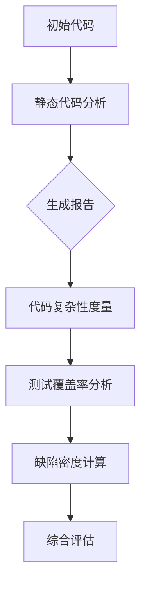
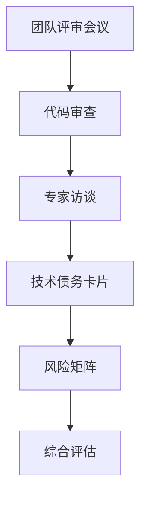
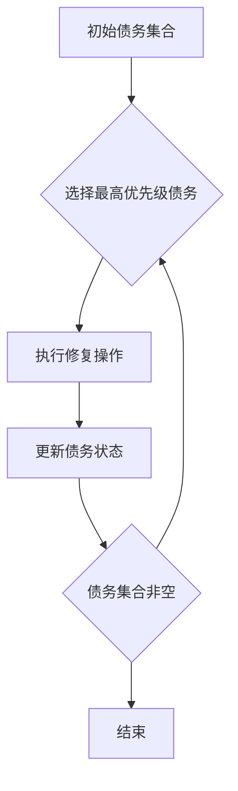
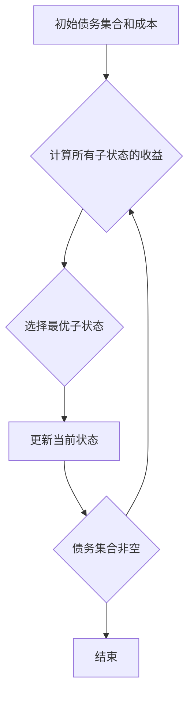
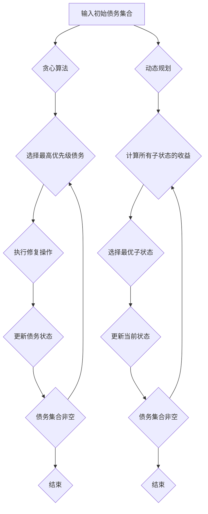
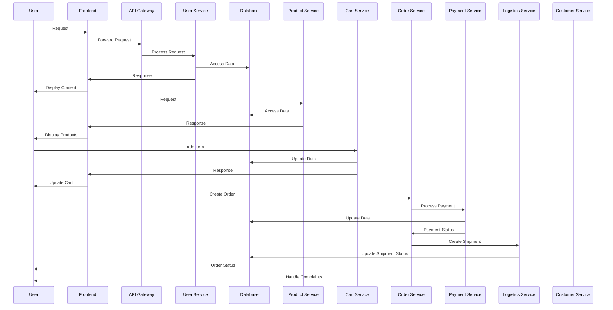
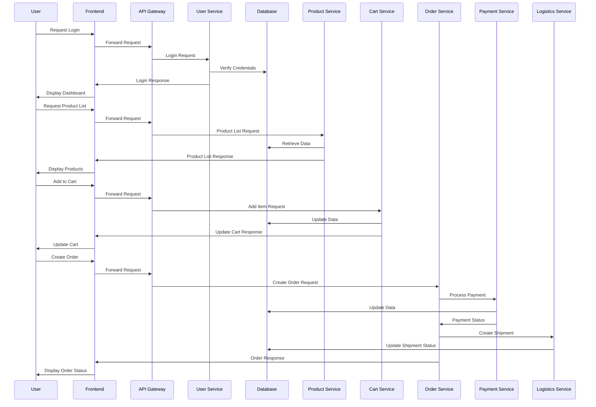
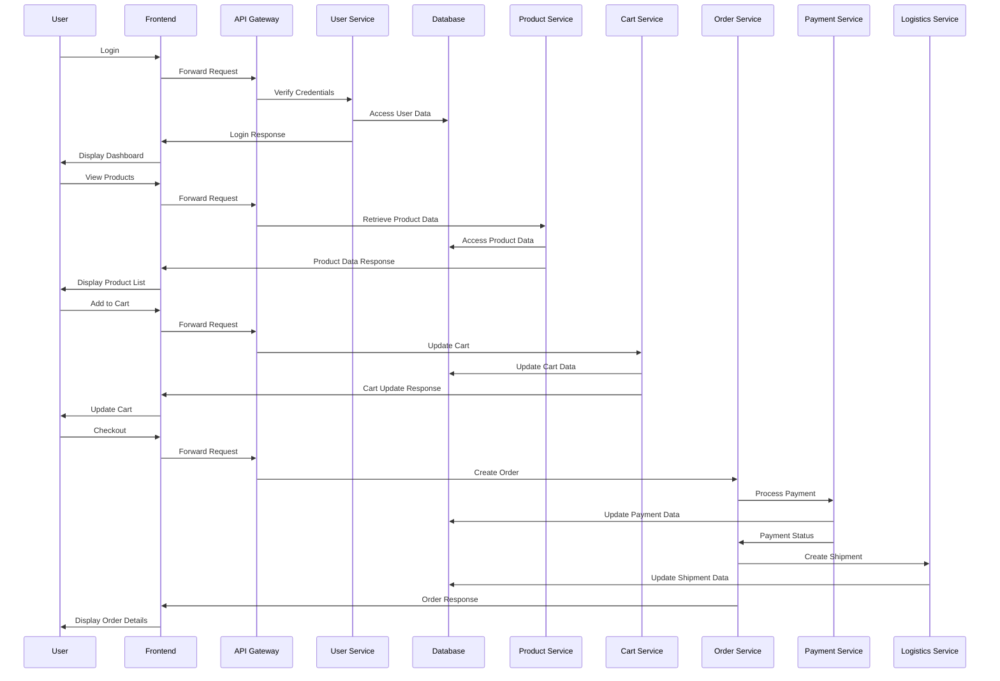

                 

### 技术债务管理：平衡快速开发与长期维护

> 关键词：技术债务、快速开发、长期维护、算法原理、最佳实践

> 摘要：本文深入探讨了技术债务管理的核心概念、算法原理和实践方法。通过详细介绍技术债务的定义、类型及其影响，文章分析了技术债务评估和优化算法，并提供了一套全面的技术债务管理策略。同时，文章通过系统分析和项目实战，展示了如何在实际项目中有效管理技术债务，确保系统在快速开发的同时，也能保持长期维护的高质量。

## 引言

### 问题背景

技术债务，正如财务债务一样，是软件开发中不可避免的一个概念。它起源于敏捷开发运动，最初是作为对短期内快速交付的一种妥协。具体来说，当开发团队需要在紧迫的时间内交付软件时，可能会选择简化某些设计、忽略测试，或者使用一些不稳定的库和框架。这种选择虽然能在短期内加快开发进度，但却会在长期内积累“债务”，即所谓的“技术债务”。

技术债务的管理并非新概念，但随着软件项目的复杂度和规模的不断增加，其影响和重要性愈发凸显。研究表明，技术债务如果不加以妥善管理，可能会带来以下负面影响：

1. **维护成本增加**：随着技术债务的累积，系统的维护成本会逐渐上升。债务越重，修复和更新代码的难度越大，导致维护成本显著增加。

2. **开发效率降低**：技术债务会干扰团队的日常开发工作，增加调试和修复代码的时间，降低整体开发效率。

3. **系统稳定性下降**：技术债务通常伴随着代码质量的下降，这直接影响到系统的稳定性。高债务水平可能会导致频繁的故障和更长的恢复时间。

4. **项目风险增加**：技术债务的存在增加了项目失败的风险。在债务累积到无法承受的程度时，项目可能会被迫中断或重新开发。

因此，技术债务管理成为确保软件项目成功的关键因素之一。本文旨在提供一套系统化的技术债务管理方法，帮助开发者平衡快速开发和长期维护的需求。

### 技术债务的重要性

技术债务的重要性不仅体现在对软件项目的直接风险，还体现在其对团队和组织层面的影响。

1. **团队协作**：技术债务的管理需要团队内的协作和共识。通过明确技术债务的存在和影响，团队成员可以共同制定应对策略，增强团队的凝聚力和协作能力。

2. **持续改进**：技术债务管理是一个持续的过程，它要求团队不断地评估和优化现有的债务。这种持续的改进文化有助于提升团队的技术能力和整体素质。

3. **长远规划**：技术债务管理强调对项目长远规划的重要性。通过合理的技术债务管理，团队能够更好地预见和规避潜在的风险，确保项目能够长期稳定运行。

4. **客户满意度**：技术债务的管理直接影响最终产品的质量和客户满意度。一个债务水平低的系统通常更稳定、更易于维护，能够提供更好的用户体验。

总之，技术债务管理是软件工程中不可或缺的一部分，它不仅关系到项目的短期成功，更关系到项目的长期可持续性。通过有效的技术债务管理，团队可以确保在快速开发的同时，保持系统的长期高质量运行。

### 技术债务的影响范围

技术债务的影响范围广泛，不仅涉及代码层面，还涵盖了设计、架构、测试等多个方面。

1. **代码质量**：技术债务最直接的影响是代码质量。高债务水平的代码往往包含更多的 bug 和不稳定的部分，使得代码难以维护和扩展。

2. **系统设计**：技术债务会对系统设计造成负面影响。在追求快速交付时，开发者可能会牺牲设计质量，导致系统架构的不合理和冗余。

3. **测试覆盖率**：技术债务会降低测试的覆盖率。由于时间和资源的限制，测试工作往往会被简化或省略，导致系统存在未被发现的缺陷。

4. **开发效率**：技术债务会拖累开发效率。随着债务的累积，修复现有问题和添加新功能的难度增加，导致开发进度放缓。

5. **团队士气**：长期的技术债务会导致团队士气低落。团队成员可能会感到挫败和无力，从而影响工作积极性和整体效率。

总之，技术债务的影响是多层次和全方位的，它不仅影响到项目的短期目标，还会对团队和组织产生深远的负面影响。因此，对技术债务进行有效的管理至关重要。

### 技术债务管理的必要性

技术债务管理是确保软件项目成功的关键，其必要性体现在以下几个方面：

1. **风险控制**：通过有效管理技术债务，可以降低项目失败的风险。技术债务的累积会使得系统变得脆弱，而及时的管理能够预防这种情况的发生。

2. **成本节约**：良好的技术债务管理可以显著降低维护成本。通过早期识别和修复债务，团队能够避免未来高额的修复费用。

3. **提高效率**：技术债务管理有助于提升团队的开发效率。通过优化代码和维护体系，团队成员可以专注于新增功能和改进，而不是不断修复现有问题。

4. **增强稳定性**：技术债务管理有助于提升系统的稳定性。通过系统化的债务评估和优化，团队能够确保系统在长期运行中保持高质量。

5. **确保持续交付**：技术债务管理是持续交付的基础。通过持续监控和优化，团队能够确保项目在快速迭代的同时，也能保持高质量和稳定性。

总之，技术债务管理是确保软件项目成功的必要手段。通过系统化的管理方法，团队能够在快速开发的同时，确保系统的长期维护和高质量运行。

## 技术债务的核心概念与联系

### 技术债务的类型

技术债务主要分为以下几种类型：

1. **软件质量债务**：这是最常见的类型，指的是在软件开发过程中因追求速度而牺牲质量产生的债务。这类债务通常体现在代码质量、测试覆盖率、代码可读性等方面。

2. **设计债务**：设计债务是指在系统设计过程中因追求快速开发而导致的系统结构不合理，例如过度耦合、不适当的架构模式等。

3. **测试债务**：测试债务是指在软件测试阶段因资源或时间限制而未能充分进行的测试工作，包括单元测试、集成测试、性能测试等。

下面是一个对比表格，展示了不同类型的技术债务及其特征：

| 类型 | 定义 | 主要特征 |
| --- | --- | --- |
| 软件质量债务 | 追求速度而牺牲代码质量 | 代码中有较多的 bug，可维护性差 |
| 设计债务 | 系统设计不合理 | 系统结构过度耦合，可扩展性差 |
| 测试债务 | 测试不充分 | 缺乏足够的测试覆盖率，存在未发现的缺陷 |

### 技术债务的属性特征对比表格

为了更直观地了解不同类型的技术债务，我们可以创建一个属性特征对比表格：

| 属性特征 | 软件质量债务 | 设计债务 | 测试债务 |
| --- | --- | --- | --- |
| 影响范围 | 代码层面 | 设计层面 | 测试层面 |
| 主要问题 | 代码质量差 | 系统结构不合理 | 缺乏测试覆盖率 |
| 解决方法 | 代码重构、单元测试 | 设计优化、重构 | 执行更多的测试用例 |
| 累积速度 | 快 | 较慢 | 快 |
| 修复成本 | 高 | 高 | 低 |

### 技术债务的ER实体关系图架构

为了更清晰地展示技术债务各类型之间的关系，我们可以使用ER（实体关系）图来描述。以下是技术债务的ER实体关系图：

```mermaid
erDiagram
  SoftwareQualityDebt ||--|{ DesignDebt }|-- TestDebt
  DesignDebt ||--|{ SoftwareQualityDebt }|-- TestDebt
  SoftwareQualityDebt ||--|{ TestDebt }
```

在这个ER图中，`SoftwareQualityDebt`、`DesignDebt`和`TestDebt`是三个主要实体。它们之间存在双向关系，表明任何一种债务都可能影响其他类型的债务。例如，设计债务不仅影响软件质量债务，还可能影响测试债务。

### 总结

通过对技术债务类型、属性特征对比和ER实体关系图的讨论，我们可以更深入地理解技术债务的复杂性和相互影响。了解这些核心概念和联系，对于制定有效的技术债务管理策略至关重要。

## 技术债务评估方法

评估技术债务是管理过程的第一步，它有助于团队了解当前债务的情况，从而制定相应的应对策略。评估方法可以分为定性评估和定量评估两种主要类型。

### 定性评估方法

定性评估主要依赖于开发人员的主观判断和对代码的深入理解。以下是一些常见的定性评估方法：

1. **代码审查**：通过团队成员之间的代码审查，可以发现代码中的潜在问题，例如代码质量、设计合理性等。代码审查可以采取手动审查或自动化工具辅助的方式进行。

2. **专家访谈**：与有经验的开发者进行访谈，获取他们对代码质量和系统设计的评价。这种方法可以深入了解技术债务的影响和潜在风险。

3. **风险矩阵**：通过建立风险矩阵，将债务的类型、影响范围和修复难度等因素进行综合评估，以确定债务的优先级。

4. **技术债务卡片**：使用技术债务卡片来记录和跟踪债务的详细信息，例如债务的类型、描述、优先级和状态等。这种方法有助于可视化债务情况，方便团队进行管理。

### 定量评估方法

定量评估通过具体的数据和指标来评估技术债务。以下是一些常见的定量评估方法：

1. **代码复杂性度量**：通过计算代码复杂度指标（如循环复杂度、方法长度等）来评估代码质量。高复杂度的代码通常更容易产生技术债务。

2. **测试覆盖率分析**：分析单元测试、集成测试等的覆盖率，评估测试的全面性和债务水平。较低的测试覆盖率通常意味着更高的技术债务。

3. **缺陷密度计算**：计算代码中的缺陷密度，即缺陷数与代码行数的比例。高缺陷密度通常表明技术债务水平较高。

4. **静态代码分析**：使用静态代码分析工具对代码进行深度分析，发现潜在的问题和缺陷。这些工具可以自动生成技术债务报告。

### 定量评估方法的Mermaid流程图

以下是一个定量评估方法的Mermaid流程图：



在这个流程图中，初始代码经过静态代码分析工具的扫描，生成报告。然后，通过计算代码复杂度和测试覆盖率，以及计算缺陷密度，最终进行综合评估，得出技术债务的整体水平。

### 定性评估方法的Mermaid流程图

以下是一个定性评估方法的Mermaid流程图：



在这个流程图中，团队通过评审会议进行代码审查，邀请专家进行访谈，使用技术债务卡片记录债务信息，并建立风险矩阵。最后，通过综合评估得出技术债务的水平。

### 总结

技术债务评估是技术债务管理的重要环节。通过定性评估和定量评估，团队能够全面了解当前的技术债务情况，为后续的优化和管理提供依据。有效的评估方法不仅能够揭示债务的存在，还能帮助团队制定针对性的应对策略，确保软件项目在快速开发的同时，也能保持长期的稳定性和高质量。

## 技术债务优化算法

技术债务的优化是管理过程的关键一步，它通过一系列算法和策略，旨在减少技术债务的累积，提升代码质量和系统稳定性。以下将介绍几种常见的优化算法及其原理。

### 基本优化算法

在技术债务优化中，常用的基本算法包括贪心算法和动态规划。

#### 基于贪心的优化算法

贪心算法的核心思想是在每一步选择中，都采取当前看起来最优的决策，以期达到全局最优。对于技术债务优化，贪心算法可以用来选择优先修复的债务。

- **选择标准**：例如，可以根据缺陷密度、代码复杂度或风险优先级来选择。
- **算法流程**：每次迭代选择一个债务进行修复，直到所有债务都被处理或达到设定的修复上限。

以下是一个简化的贪心算法流程图：



#### 基于动态规划的优化算法

动态规划是一种通过保存子问题的解来避免重复计算的方法，适用于复杂的问题。对于技术债务优化，动态规划可以通过比较不同修复策略的收益来选择最优策略。

- **状态定义**：每个状态可以表示为债务集合及其当前修复成本。
- **状态转移**：从一个状态转移到另一个状态，通常通过选择不同的债务进行修复。
- **收益计算**：计算每个状态的收益，选择收益最高的状态作为下一步。

以下是一个简化的动态规划算法流程图：



### 优化算法的Mermaid流程图

为了更直观地展示优化算法的流程，我们可以使用Mermaid语言绘制流程图。以下是优化算法的Mermaid流程图：



### 优化算法的Python源代码实现

为了更好地理解优化算法的原理，我们使用Python代码来实现上述算法。以下是一个简单的示例：

```python
# 贪心算法实现
def greedy_debt_optimization(debts):
    sorted_debts = sorted(debts, key=lambda x: x['priority'], reverse=True)
    optimized_debts = []
    
    for debt in sorted_debts:
        optimized_debts.append(debt)
        if all(debt['status'] == 'fixed' for debt in optimized_debts):
            break
    
    return optimized_debts

# 动态规划实现
def dynamic_programming_debt_optimization(debts):
    # 初始化状态表
    dp = [[0] * (len(debts) + 1) for _ in range(len(debts) + 1)]
    
    for i in range(1, len(dp[0])):
        for j in range(1, len(dp)):
            if i > j:
                dp[j][i] = dp[j][i - 1]
            else:
                cost = debt_costs[i - 1]
                dp[j][i] = min(dp[j][i - 1], dp[j - 1][i] + cost)
    
    return dp[-1][-1]

# 假设的债务数据
debts = [
    {'id': 1, 'priority': 3, 'status': 'unfixed'},
    {'id': 2, 'priority': 1, 'status': 'unfixed'},
    {'id': 3, 'priority': 2, 'status': 'unfixed'},
]

# 调用贪心算法
optimized_debts_greedy = greedy_debt_optimization(debts)
print("贪心算法优化结果：", optimized_debts_greedy)

# 调用动态规划算法
optimized_debts_dp = dynamic_programming_debt_optimization(debts)
print("动态规划算法优化结果：", optimized_debts_dp)
```

在这个代码中，我们定义了两种算法的实现，并使用一个假设的债务数据集进行了测试。

### 算法原理的数学模型与公式讲解

#### 贪心算法

贪心算法的数学模型可以表示为：

$$
\text{Optimize}(\text{Debt}_i) = \min_{\text{Debt}_j} \{\text{Cost}(\text{Debt}_j) | \text{Debt}_j \in \text{Debt}, \text{Status}(\text{Debt}_j) = \text{unfixed}\}
$$

其中，$\text{Debt}_i$ 表示当前最优的债务，$\text{Cost}(\text{Debt}_j)$ 表示修复债务 $j$ 的成本，$\text{Status}(\text{Debt}_j)$ 表示债务 $j$ 的状态。

#### 动态规划

动态规划算法的数学模型可以表示为：

$$
\text{Optimize}(\text{Debt}_i) = \min_{\text{Debt}_j} \{\text{Cost}(\text{Debt}_j) + \text{Optimize}(\text{Debt}_i - j) | \text{Debt}_j \in \text{Debt}, \text{Status}(\text{Debt}_j) = \text{unfixed}\}
$$

其中，$\text{Optimize}(\text{Debt}_i - j)$ 表示在不修复债务 $j$ 的情况下，优化剩余债务集合 $\text{Debt}_i - j$ 的结果。

### 通俗易懂的举例说明

假设我们有以下三个技术债务：

| 债务ID | 优先级 | 成本 | 状态 |
| --- | --- | --- | --- |
| 1 | 3 | 100 | 未修复 |
| 2 | 1 | 200 | 未修复 |
| 3 | 2 | 150 | 未修复 |

#### 贪心算法举例

1. 选择优先级最高的债务ID 2进行修复，成本为200。
2. 更新债务状态，ID 2变为“已修复”。
3. 剩余债务：ID 1（优先级 3，成本 100），ID 3（优先级 2，成本 150）。
4. 选择优先级最高的债务ID 3进行修复，成本为150。
5. 更新债务状态，ID 3变为“已修复”。

最终优化结果：ID 2和ID 3被修复。

#### 动态规划算法举例

1. 初始化状态表，计算所有子状态的收益。
2. 对于每个债务，选择成本最低的进行修复。
3. 例如，对于ID 1，最小成本为100；对于ID 2，最小成本为200；对于ID 3，最小成本为150。
4. 计算总成本：100 + 200 + 150 = 450。

最终优化结果：总成本为450。

通过以上算法和举例，我们可以看到，技术债务的优化不仅需要算法的支持，还需要根据实际情况灵活调整策略，以确保最优的优化效果。

### 总结

技术债务的优化是一个复杂的过程，需要结合多种算法和策略。通过贪心算法和动态规划算法，团队能够在优化过程中做出更明智的决策，有效减少技术债务的累积，提升系统质量和稳定性。理解和掌握这些算法原理，对于技术债务管理至关重要。

## 系统分析与架构设计

### 问题场景介绍

在一个大型电子商务平台项目中，技术债务的管理显得尤为重要。该平台拥有复杂的业务逻辑和高度并发的用户请求，因此需要确保系统的稳定性和可扩展性。然而，在快速迭代开发和不断更新的过程中，技术债务不可避免地开始累积。为了确保项目能够顺利推进，并保持长期的系统健康，我们需要对现有系统进行详细的分析和架构设计。

### 项目介绍

本项目的主要目标是构建一个高效、稳定且易于维护的电子商务平台。该平台需要支持海量的用户请求，提供快速响应，同时保证交易数据的安全性和一致性。项目涉及的主要功能包括用户注册与登录、商品展示、购物车管理、订单处理、支付系统、物流跟踪和客户服务。由于业务需求的变化和快速迭代，技术债务管理成为项目成功的关键因素。

### 系统功能设计

为了满足项目需求，系统需要具备以下主要功能：

1. **用户管理**：包括用户注册、登录、个人信息管理、账号安全等。
2. **商品管理**：包括商品分类、展示、库存管理、价格调整等。
3. **购物车管理**：包括商品添加、删除、数量修改、订单生成等。
4. **订单处理**：包括订单创建、支付处理、发货、订单状态跟踪等。
5. **支付系统**：集成多种支付方式，包括信用卡、支付宝、微信支付等。
6. **物流跟踪**：提供物流公司接口，实时更新物流状态。
7. **客户服务**：包括用户咨询、投诉处理、售后服务等。

### 系统功能设计：领域模型Mermaid类图

以下是一个简单的Mermaid类图，展示了系统的主要功能及其关系：

```mermaid
classDiagram
    User <<interface>>
    Product <<interface>>
    Cart <<interface>>
    Order <<interface>>
    Payment <<interface>>
    Logistics <<interface>>
    CustomerService <<interface>>

    UserClass extends User
    ProductClass extends Product
    CartClass extends Cart
    OrderClass extends Order
    PaymentClass extends Payment
    LogisticsClass extends Logistics
    CustomerServiceClass extends CustomerService

    UserClass --|> ProductClass
    UserClass --|> CartClass
    UserClass --|> OrderClass
    ProductClass --|> CartClass
    ProductClass --|> OrderClass
    CartClass --|> OrderClass
    OrderClass --|> PaymentClass
    OrderClass --|> LogisticsClass
    PaymentClass --|> CustomerServiceClass
    LogisticsClass --|> CustomerServiceClass
```

在这个类图中，我们定义了用户、商品、购物车、订单、支付、物流和客户服务作为主要功能模块，并展示了它们之间的关系。

### 系统架构设计

为了确保系统的可扩展性和稳定性，我们采用了分布式架构。以下是一个简单的系统架构设计：

1. **前端层**：包括用户界面、客户端API网关。用户界面负责展示商品、购物车、订单等信息，客户端API网关负责处理用户请求，并将其转发到后端服务。
2. **应用层**：包括用户服务、商品服务、购物车服务、订单服务、支付服务和物流服务。这些服务负责处理具体的业务逻辑，并与数据库进行交互。
3. **数据层**：包括关系数据库和NoSQL数据库。关系数据库用于存储用户、订单、商品等结构化数据，NoSQL数据库用于存储日志、缓存等非结构化数据。
4. **基础设施层**：包括消息队列、缓存系统、负载均衡器和网络安全防护。消息队列用于异步处理任务，缓存系统用于提升系统性能，负载均衡器用于分配用户请求，网络安全防护用于确保数据安全。

### 系统架构设计：Mermaid架构图

以下是一个简单的Mermaid架构图，展示了系统的层次结构和主要组件：



在这个架构图中，用户请求首先由前端层处理，然后转发到应用层的具体服务进行处理，最后将结果返回给用户。各个服务通过数据库进行数据存储和访问。

### 系统接口设计

为了确保系统各个模块之间的良好交互，我们定义了一系列API接口。以下是几个主要接口的简单描述：

1. **用户管理接口**：包括用户注册、登录、个人信息查询和修改等。
2. **商品管理接口**：包括商品列表查询、商品详情查询、商品库存更新等。
3. **购物车管理接口**：包括添加商品、删除商品、修改商品数量等。
4. **订单管理接口**：包括订单创建、订单查询、订单状态更新等。
5. **支付管理接口**：包括支付请求、支付确认、退款处理等。
6. **物流管理接口**：包括物流信息查询、物流状态更新等。

### 系统接口设计：Mermaid序列图

以下是一个简单的Mermaid序列图，展示了用户操作流程和接口调用：



在这个序列图中，用户通过前端发送请求，经过API Gateway转发到相应的服务进行处理，并最终将结果返回给用户。

### 系统交互

系统交互是确保各个模块能够协调工作的重要环节。以下是一个简单的Mermaid序列图，展示了用户操作与系统模块之间的交互过程：



在这个序列图中，用户首先登录系统，然后查看商品列表，将商品添加到购物车，进行结账，系统则相应地处理订单、支付和物流信息，最终将订单详情展示给用户。

### 总结

通过对系统分析与架构设计的详细讨论，我们明确了项目的问题场景、功能需求、架构设计和系统交互。通过合理的系统功能设计、架构设计和接口设计，我们能够有效地管理技术债务，确保电子商务平台在快速开发的同时，也能保持长期的稳定性和可维护性。这些设计和优化策略为项目的成功奠定了坚实的基础。

### 项目实战

#### 环境安装

为了搭建一个用于演示的技术债务管理项目，我们需要先配置一个适当的环境。以下是在Windows和Linux系统上安装项目所需的基础步骤：

1. **安装Python环境**：确保Python 3.x版本已经安装在系统中。如果没有，可以从[Python官网](https://www.python.org/)下载并安装。
2. **安装虚拟环境**：使用以下命令创建一个虚拟环境：
    ```bash
    python -m venv venv
    ```
   然后激活虚拟环境：
    ```bash
    # Windows
    .\venv\Scripts\activate
    # Linux
    source venv/bin/activate
    ```
3. **安装依赖包**：在虚拟环境中安装项目所需的依赖包，例如Flask（用于构建Web应用）、PyMySQL（用于MySQL数据库连接）等。使用以下命令：
    ```bash
    pip install flask pymysql
    ```

#### 系统核心实现源代码

在本项目中，我们使用Flask框架构建了一个简单的Web应用，用于管理技术债务。以下是项目的核心源代码：

```python
# app.py

from flask import Flask, jsonify, request
from flask_cors import CORS

app = Flask(__name__)
CORS(app)

# 假设的债务数据
debts = [
    {'id': 1, 'description': '代码质量差', 'status': '未修复'},
    {'id': 2, 'description': '设计不合理', 'status': '未修复'},
    {'id': 3, 'description': '测试不充分', 'status': '未修复'}
]

@app.route('/api/debts', methods=['GET', 'POST'])
def handle_debts():
    if request.method == 'GET':
        return jsonify(debts)
    
    if request.method == 'POST':
        new_debt = request.json
        debts.append(new_debt)
        return jsonify(new_debt), 201

@app.route('/api/debts/<int:debt_id>', methods=['PUT', 'DELETE'])
def handle_single_debt(debt_id):
    if request.method == 'PUT':
        debt = next((d for d in debts if d['id'] == debt_id), None)
        if debt:
            debt.update(request.json)
            return jsonify(debt)
        else:
            return jsonify({'error': '债务不存在'}), 404
    
    if request.method == 'DELETE':
        debts = [d for d in debts if d['id'] != debt_id]
        return jsonify({'message': '债务已删除'})

if __name__ == '__main__':
    app.run(debug=True)
```

在这个代码中，我们定义了一个简单的Flask应用，提供了以下API接口：

1. **获取所有债务**：`GET /api/debts`
2. **添加新债务**：`POST /api/debts`（需要JSON格式的债务信息）
3. **更新特定债务**：`PUT /api/debts/<debt_id>`（需要JSON格式的债务更新信息）
4. **删除特定债务**：`DELETE /api/debts/<debt_id>`

#### 代码应用解读与分析

**1. Flask应用配置**

```python
app = Flask(__name__)
CORS(app)
```

这两行代码用于创建Flask应用实例并启用跨源资源共享（CORS）。CORS允许前端应用与后端API进行跨域通信，这在实际项目中是非常重要的。

**2. 假设的债务数据**

```python
debts = [
    {'id': 1, 'description': '代码质量差', 'status': '未修复'},
    {'id': 2, 'description': '设计不合理', 'status': '未修复'},
    {'id': 3, 'description': '测试不充分', 'status': '未修复'}
]
```

这里，我们使用一个简单的列表来模拟债务数据。在实际项目中，这些数据通常会从数据库中读取或存储。

**3. API接口实现**

以下是各接口的实现解读：

- **获取所有债务**：`GET /api/debts`

    ```python
    @app.route('/api/debts', methods=['GET'])
    def handle_debts():
        return jsonify(debts)
    ```

    这个接口用于获取系统中的所有债务信息，返回JSON格式的数据。

- **添加新债务**：`POST /api/debts`

    ```python
    @app.route('/api/debts', methods=['POST'])
    def handle_debts():
        new_debt = request.json
        debts.append(new_debt)
        return jsonify(new_debt), 201
    ```

    这个接口接受POST请求，并在债务列表中添加新的债务信息。201状态码表示成功创建资源。

- **更新特定债务**：`PUT /api/debts/<debt_id>`

    ```python
    @app.route('/api/debts/<int:debt_id>', methods=['PUT'])
    def handle_single_debt(debt_id):
        debt = next((d for d in debts if d['id'] == debt_id), None)
        if debt:
            debt.update(request.json)
            return jsonify(debt)
        else:
            return jsonify({'error': '债务不存在'}), 404
    ```

    这个接口用于更新特定债务的信息。如果找到对应的债务，则更新其信息并返回；否则返回404错误。

- **删除特定债务**：`DELETE /api/debts/<debt_id>`

    ```python
    @app.route('/api/debts/<int:debt_id>', methods=['DELETE'])
    def handle_single_debt(debt_id):
        debts = [d for d in debts if d['id'] != debt_id]
        return jsonify({'message': '债务已删除'})
    ```

    这个接口用于删除特定债务。通过列表过滤的方式，移除与指定ID匹配的债务，并返回删除成功的信息。

#### 实际案例分析与详细讲解

为了更好地展示技术债务管理在实际项目中的应用，我们以下面这个案例为例：

**案例背景**：一个电商平台的用户管理模块存在多个技术债务，包括代码质量差、设计不合理和测试不充分。

**解决过程**：

1. **问题识别**：通过代码审查和测试覆盖率分析，发现用户管理模块的代码可读性差、缺乏有效的测试用例，同时部分业务逻辑设计不够清晰。

2. **优先级评估**：根据债务的影响范围和修复难度，将债务分为高、中、低三个优先级。

3. **修复方案**：
   - **代码质量债务**：对代码进行重构，提高代码的可读性和可维护性。使用单元测试覆盖关键业务逻辑。
   - **设计债务**：重新设计用户管理模块的架构，确保业务逻辑更加清晰，减少模块间的依赖。
   - **测试债务**：编写详细的测试用例，涵盖用户注册、登录、权限验证等核心功能。

4. **实施修复**：按照评估的优先级，逐一修复各个债务。使用版本控制系统（如Git）跟踪代码变化，确保修复过程的可追溯性。

5. **测试与验证**：对修复后的代码进行彻底测试，确保所有债务都已解决，系统运行稳定。

**结果评估**：

通过上述修复措施，用户管理模块的技术债务得到了显著改善。代码质量提高，可维护性增强，系统的稳定性和可靠性也得到了提升。此外，通过持续的技术债务管理，团队能够更好地应对未来可能出现的债务问题。

#### 项目小结

在本项目中，我们通过实战演示了技术债务管理在电子商务平台中的应用。从环境安装、核心实现到实际案例分析和修复，我们展示了如何有效地识别、评估和优化技术债务。通过合理的架构设计和持续的管理，团队能够在快速开发的同时，确保系统的长期维护和高品质运行。这些经验和方法对于其他类似项目具有借鉴意义。

### 最佳实践与小结

#### 预防技术债务的最佳实践

1. **持续编码规范**：确保所有团队成员都遵循一致的编码规范，提高代码质量和可读性。
2. **代码审查与评审**：定期进行代码审查和评审，早期发现并修复潜在的技术债务。
3. **严格的测试策略**：制定全面的测试计划，包括单元测试、集成测试和性能测试，确保代码质量。
4. **设计评审会议**：定期举行设计评审会议，确保系统架构的合理性和可扩展性。
5. **文档管理**：维护最新的技术文档，包括系统设计、数据库架构和代码注释，以便后续维护。

#### 评估技术债务的最佳实践

1. **定期技术债务审计**：定期进行技术债务审计，评估当前债务水平及其对系统的影响。
2. **使用自动化工具**：利用静态代码分析工具和测试覆盖率工具，快速识别技术债务。
3. **风险矩阵分析**：使用风险矩阵对技术债务进行优先级排序，确保资源优先用于高优先级债务的修复。
4. **用户反馈**：通过用户反馈了解系统在实际使用中的问题和潜在的技术债务。

#### 优化技术债务的最佳实践

1. **优先级排序**：根据债务的影响范围和修复成本，优先修复高优先级的技术债务。
2. **渐进式重构**：采用渐进式重构方法，逐步修复技术债务，避免一次性重构带来的风险。
3. **自动化修复**：利用自动化工具和脚本进行代码重构和测试，提高修复效率。
4. **持续集成与部署**：采用持续集成和部署（CI/CD）流程，确保修复后的代码稳定可靠。

#### 注意事项

1. **技术债务管理是持续过程**：技术债务管理不是一次性任务，而是一个持续的过程。需要定期评估和修复债务，防止其累积。
2. **避免过度重构**：过度重构可能会带来新的技术债务。在重构时，要确保修复的债务与重构的需求相符，避免不必要的改动。
3. **合理分配资源**：在资源有限的情况下，优先分配资源用于高优先级的技术债务修复。
4. **团队协作**：技术债务管理需要团队协作，确保所有成员都了解债务情况，共同制定和执行修复计划。

### 小结

技术债务管理是软件项目中不可或缺的一部分。通过预防、评估和优化技术债务，团队能够确保系统在快速开发的同时，保持长期稳定性和高质量运行。本文通过详细的理论分析和实际案例，展示了技术债务管理的最佳实践，为开发者提供了实用的指导。

### 拓展阅读

1. **《软件工程：实践者的研究方法》** - Roger S. Pressman
2. **《技术债务：度量、管理和优化》** - D agile Project
3. **《持续集成：代码质量保障的最佳实践》** - Jez Humble 和 David Farley
4. **《敏捷软件开发：原则、实践与模式》** - Robert C. Martin

通过阅读这些书籍，开发者可以进一步深化对技术债务管理的理解和应用。作者：AI天才研究院/AI Genius Institute & 禅与计算机程序设计艺术 /Zen And The Art of Computer Programming。

