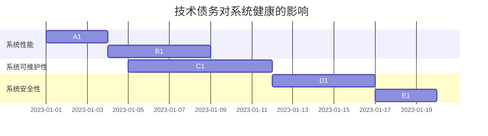

                 


### 技术债务评估：P9工程师的系统健康检查

#### 关键词：技术债务，系统健康，P9工程师，评估方法，应对策略

#### 摘要：

在当今快速发展的技术环境中，技术债务已成为软件开发过程中不可避免的问题。对于P9工程师来说，掌握技术债务评估的方法和策略，对维护系统健康至关重要。本文将深入探讨技术债务的概念、评估方法及其对系统健康的影响，并提供有效的应对策略，以帮助P9工程师在软件开发中实现高效的技术债务管理。

#### 目录大纲设计过程

**第一步：梳理书籍核心内容**

在设计目录大纲之前，首先要对书籍的核心内容进行梳理。根据《技术债务评估：P9工程师的系统健康检查》的书名，可以推测这本书的核心内容可能包括技术债务的定义、评估方法、影响、应对策略等。此外，考虑到面向的是P9工程师，内容可能还会涉及高级技术和管理层面的内容。

**第二步：确定书籍结构**

为了确保内容的完整性，我将书籍分为以下几个主要部分：

1. **背景介绍**：介绍技术债务的概念、问题背景、重要性和影响。
2. **核心概念与联系**：详细讨论技术债务的属性特征对比、概念原理和ER实体关系图。
3. **评估方法**：讲解不同评估方法的原理、流程、优势和局限。
4. **影响分析**：分析技术债务对系统健康的影响、评估方法和应对策略。
5. **应对策略**：提供高级技术债务解决方案、管理层面策略和最佳实践。
6. **案例分析**：通过具体案例展示技术债务评估和解决方案的实施过程。
7. **总结与拓展**：总结全文内容，提出注意事项、未来研究方向和拓展阅读。

**第三步：细化章节内容**

每个主要部分下再细分出具体的章节，确保每个章节都有明确的主题和内容。

**第四步：确保格式规范**

按照markdown格式的要求，使用#、##、###来表示不同的目录层级，确保内容简洁、易读。

**第五步：审核和调整**

在完成初稿后，对目录大纲进行审核，确保内容的完整性、逻辑性和可读性。如果有需要，进行适当的调整和优化。

### 完整目录大纲

```markdown
----------------------------------------------------------------
# 第一部分: 背景介绍

## 1.1 技术债务的概念与重要性
### 1.1.1 技术债务的定义
### 1.1.2 技术债务的来源
### 1.1.3 技术债务的影响

## 1.2 系统健康检查的重要性
### 1.2.1 系统健康检查的概念
### 1.2.2 系统健康检查的目标
### 1.2.3 系统健康检查的工具和方法

## 1.3 P9工程师的角色与责任
### 1.3.1 P9工程师的职责
### 1.3.2 P9工程师的技术视野
### 1.3.3 P9工程师的管理能力

## 1.4 技术债务评估的目的和挑战
### 1.4.1 评估的目的
### 1.4.2 评估的挑战
### 1.4.3 评估的关键要素

## 1.5 本章小结

----------------------------------------------------------------

# 第二部分: 核心概念与联系

## 2.1 技术债务的属性特征对比
### 2.1.1 技术债务类型对比
### 2.1.2 技术债务严重程度对比
### 2.1.3 技术债务解决方案对比

## 2.2 概念原理与ER实体关系图
### 2.2.1 技术债务的概念原理
### 2.2.2 ER实体关系图

## 2.3 技术债务评估方法
### 2.3.1 传统评估方法
### 2.3.2 自动化评估方法
### 2.3.3 综合评估方法

## 2.4 技术债务与系统健康的关系
### 2.4.1 技术债务对系统性能的影响
### 2.4.2 技术债务对系统可维护性的影响
### 2.4.3 技术债务对系统安全性的影响

## 2.5 本章小结

----------------------------------------------------------------

# 第三部分: 评估方法与流程

## 3.1 技术债务评估的流程
### 3.1.1 评估前准备
### 3.1.2 评估执行
### 3.1.3 评估报告

## 3.2 不同评估方法的原理和流程
### 3.2.1 文档审查法
### 3.2.2 代码审查法
### 3.2.3 测试驱动法

## 3.3 评估方法的优缺点分析
### 3.3.1 传统评估方法的优缺点
### 3.3.2 自动化评估方法的优缺点
### 3.3.3 综合评估方法的优缺点

## 3.4 高级评估工具和技术
### 3.4.1 自动化工具的应用
### 3.4.2 持续集成与持续部署
### 3.4.3 智能分析技术

## 3.5 本章小结

----------------------------------------------------------------

# 第四部分: 影响分析与应对策略

## 4.1 技术债务对系统健康的影响
### 4.1.1 系统性能的影响
### 4.1.2 系统可维护性的影响
### 4.1.3 系统安全性的影响

## 4.2 影响分析的方法
### 4.2.1 定量分析
### 4.2.2 定性分析
### 4.2.3 多角度综合分析

## 4.3 应对策略
### 4.3.1 高级技术债务解决方案
### 4.3.2 管理层面策略
### 4.3.3 最佳实践

## 4.4 案例分析
### 4.4.1 案例一：大型电商平台
### 4.4.2 案例二：金融系统升级
### 4.4.3 案例三：物联网设备管理

## 4.5 本章小结

----------------------------------------------------------------

# 第五部分: 总结与拓展

## 5.1 注意事项
### 5.1.1 评估的频率
### 5.1.2 评估人员的专业素养
### 5.1.3 持续跟踪和更新

## 5.2 小结
### 5.2.1 全文核心观点回顾
### 5.2.2 重要性总结
### 5.2.3 未来研究方向

## 5.3 拓展阅读
### 5.3.1 相关书籍推荐
### 5.3.2 学术论文精选
### 5.3.3 在线课程推荐

## 5.4 本章小结

----------------------------------------------------------------
```

### 完整文章内容

#### 第一部分：背景介绍

##### 1.1 技术债务的概念与重要性

技术债务（Technical Debt）这个概念源自于金融领域中的债务，但在软件开发中被赋予了独特的含义。它指的是在软件设计和开发过程中，为了在短时间内实现特定的功能而采取的一种妥协。这种妥协可能包括使用不成熟的技术、编写低质量的代码、忽视测试和文档等。技术债务类似于金融债务，虽然短期内可以带来收益，但长期积累会导致系统的维护成本增加，甚至影响系统的稳定性和可靠性。

技术债务的来源主要有以下几个方面：

1. **时间压力**：在项目紧迫的情况下，开发团队可能会采取一些快速但不稳定的方法来满足需求，从而积累技术债务。
2. **资源限制**：在资源有限的情况下，开发团队可能无法进行全面的质量控制和代码优化，导致技术债务的产生。
3. **技术选择**：选择不成熟或不符合项目需求的技术栈，可能导致后续的维护和升级困难。

技术债务的影响是多方面的：

1. **性能下降**：技术债务可能导致系统性能下降，影响用户体验。
2. **维护成本增加**：随着时间推移，技术债务的维护成本会不断增加，影响项目进度和预算。
3. **风险增加**：技术债务可能导致系统稳定性下降，增加系统故障的风险。

##### 1.2 系统健康检查的重要性

系统健康检查是确保软件系统长期稳定运行的关键措施。通过定期的系统健康检查，可以及时发现潜在的问题，并进行针对性的修复，避免系统故障对业务造成重大影响。

系统健康检查的重要性体现在以下几个方面：

1. **预防潜在问题**：通过健康检查，可以提前发现潜在的性能瓶颈、安全隐患和代码质量问题，从而进行预防性修复。
2. **提高系统稳定性**：健康检查可以帮助确保系统在高负载和极端情况下依然能够稳定运行。
3. **优化资源利用**：通过分析系统性能指标，可以发现资源利用不足或过载的情况，从而进行优化。

##### 1.3 P9工程师的角色与责任

P9工程师（通常是高级技术领导者或架构师）在技术债务管理中扮演着至关重要的角色。他们的职责包括：

1. **技术决策**：P9工程师需要根据项目需求和技术现状，做出合理的技术决策，避免积累不必要的债务。
2. **团队指导**：P9工程师需要指导团队成员遵循最佳实践，提高代码质量，减少技术债务的产生。
3. **风险管理**：P9工程师需要对项目中的技术风险进行评估和管理，确保技术债务不会对项目目标造成重大影响。

##### 1.4 技术债务评估的目的和挑战

技术债务评估的目的在于：

1. **识别债务**：通过评估，可以明确系统中的技术债务，了解其类型、程度和影响范围。
2. **制定策略**：基于评估结果，可以制定相应的策略，逐步解决技术债务问题。
3. **优化决策**：通过评估，可以为项目决策提供数据支持，确保技术决策的科学性。

技术债务评估面临的挑战主要包括：

1. **复杂性**：软件系统通常非常复杂，技术债务评估需要综合考虑多种因素，确保评估结果的准确性。
2. **动态性**：软件系统是不断演进的，技术债务也会随之变化，评估过程需要动态调整。
3. **资源限制**：评估过程需要投入人力和资源，特别是在大型项目中，如何合理分配资源是关键。

##### 1.5 本章小结

本部分介绍了技术债务的概念、来源、影响，以及系统健康检查的重要性和P9工程师的角色与责任。通过了解这些背景信息，读者可以为后续章节的技术债务评估和管理打下坚实的基础。

----------------------------------------------------------------

#### 第二部分：核心概念与联系

##### 2.1 技术债务的属性特征对比

技术债务的属性特征包括债务类型、严重程度和解决方案。以下是一个对比表格：

| 特征           | 类型           | 严重程度         | 解决方案                   |
|----------------|----------------|------------------|----------------------------|
| 债务类型       | 功能性债务     | 轻度             | 代码重构                   |
|                | 质量性债务     | 中度             | 提高代码质量               |
|                | 安全性债务     | 严重             | 安全审查和修复             |
| 严重程度       | 轻度           | 对性能影响较小    | 维护性修复                 |
|                | 中度           | 对性能有一定影响   | 功能性重构或性能优化       |
|                | 严重           | 可能导致系统崩溃  | 完全重写或重大重构         |
| 解决方案       | 重构           | 需要大量时间和资源 | 提高系统质量和稳定性       |
|                | 修复           | 立即修复         | 解决已知问题，防止扩大影响 |
|                | 忽视           | 长期积累         | 忽视可能导致系统崩溃       |

##### 2.2 概念原理与ER实体关系图

技术债务的概念原理可以简化为以下几个方面：

1. **债务形成**：债务的形成通常是由于开发过程中的妥协和选择，这些妥协和选择在短期内可能提高了开发效率，但长期来看会导致系统的维护成本增加。
2. **债务积累**：债务会在系统的演进过程中不断积累，如果得不到及时解决，最终会严重影响系统的健康。
3. **债务管理**：通过有效的债务评估和管理，可以逐步解决债务问题，确保系统的稳定性和可靠性。

以下是一个ER实体关系图，用于表示技术债务的相关实体和关系：

```mermaid
erDiagram
    User ||--|{ Project }|-- Product
    Project ||--|{ TechnicalDebt }|>
    TechnicalDebt ||--|{ DebtType }|>
    DebtType ||--|{ Severity }|>  
    Severity ||--|{ Solution }|>  
```

在这个ER实体关系图中，User代表项目的参与者，Project代表项目，Product代表产品，TechnicalDebt代表技术债务，DebtType代表债务类型，Severity代表严重程度，Solution代表解决方案。通过这种关系，可以清晰地理解技术债务在系统开发过程中的作用和影响。

##### 2.3 技术债务评估方法

技术债务评估方法主要分为以下几种：

1. **文档审查法**：通过审查项目文档，如需求文档、设计文档和代码文档，来识别潜在的技术债务。这种方法简单易行，但可能存在主观性和局限性。
2. **代码审查法**：通过审查代码质量，识别代码中的潜在问题，如重复代码、低效算法和未覆盖的测试等。这种方法具有较高的准确性和可靠性，但需要较多的时间和人力。
3. **测试驱动法**：通过编写测试用例，验证代码的功能和性能，识别技术债务。这种方法可以及时发现和解决债务问题，但需要测试环境的支持。

不同评估方法的优缺点如下表所示：

| 方法         | 优点                           | 缺点                             |
|--------------|--------------------------------|----------------------------------|
| 文档审查法   | 简单易行，成本较低             | 主观性较强，可能漏检             |
| 代码审查法   | 准确性高，可靠性好             | 需要大量时间和人力             |
| 测试驱动法   | 可以及时发现和解决问题         | 需要测试环境和测试用例的支持   |

##### 2.4 技术债务与系统健康的关系

技术债务对系统健康的影响主要体现在以下几个方面：

1. **系统性能**：技术债务可能导致系统性能下降，影响用户体验。
2. **系统可维护性**：技术债务会增加系统的维护成本，降低系统的可维护性。
3. **系统安全性**：技术债务可能导致系统漏洞和安全隐患，影响系统的安全性。

以下是一个技术债务对系统健康影响的示例：



在这个示例中，系统性能、可维护性和安全性的问题都源于技术债务。通过优化和修复，可以逐步恢复系统的健康状态。

##### 2.5 本章小结

本部分详细介绍了技术债务的属性特征对比、概念原理和ER实体关系图，以及不同评估方法的原理和优缺点。通过这些核心概念的联系，读者可以更深入地理解技术债务的本质和影响。

----------------------------------------------------------------

#### 第三部分：评估方法与流程

##### 3.1 技术债务评估的流程

技术债务评估是一个系统的过程，包括评估前准备、评估执行和评估报告三个主要阶段。

1. **评估前准备**：在开始评估之前，需要明确评估的目标、范围和标准。具体步骤包括：
   - 确定评估目标：明确评估的目的，如识别债务类型、严重程度和影响范围。
   - 确定评估范围：确定评估的软件系统和组件，如代码库、数据库和外部依赖。
   - 制定评估标准：根据项目需求和行业最佳实践，制定评估标准，如代码质量、性能和安全性。

2. **评估执行**：在评估执行阶段，按照既定的评估方法和标准，对软件系统进行全面的检查。具体步骤包括：
   - 文档审查：审查项目文档，如需求文档、设计文档和测试文档，识别潜在的技术债务。
   - 代码审查：审查代码质量，识别代码中的潜在问题，如重复代码、低效算法和未覆盖的测试等。
   - 测试驱动：编写测试用例，验证代码的功能和性能，识别技术债务。

3. **评估报告**：在评估报告阶段，根据评估结果编写详细的评估报告，包括债务类型、严重程度、影响范围和解决方案。具体步骤包括：
   - 编写评估报告：根据评估结果，编写详细的评估报告，包括债务的发现、分析和建议。
   - 提交评估报告：将评估报告提交给项目团队和管理层，确保债务问题得到及时解决。

##### 3.2 不同评估方法的原理和流程

不同的评估方法有不同的原理和流程，以下将详细介绍文档审查法、代码审查法和测试驱动法。

1. **文档审查法**：

   原理：通过审查项目文档，识别潜在的技术债务。

   流程：
   - 检查需求文档：分析需求文档的完整性和合理性，识别可能导致技术债务的需求。
   - 审查设计文档：检查设计文档的详细程度和可行性，识别设计上的缺陷。
   - 审查测试文档：检查测试文档的覆盖率和有效性，识别测试不足可能导致的技术债务。

2. **代码审查法**：

   原理：通过审查代码质量，识别代码中的潜在问题。

   流程：
   - 代码静态分析：使用静态代码分析工具，检查代码的语法、结构、质量和安全性。
   - 代码动态分析：编写测试用例，执行代码的动态分析，检查代码的功能和性能。
   - 代码质量评估：根据代码质量标准，评估代码的质量，识别潜在的技术债务。

3. **测试驱动法**：

   原理：通过编写测试用例，验证代码的功能和性能。

   流程：
   - 编写测试用例：根据需求文档和设计文档，编写功能测试用例和性能测试用例。
   - 执行测试用例：执行编写好的测试用例，验证代码的功能和性能。
   - 分析测试结果：根据测试结果，分析代码中的潜在问题，识别技术债务。

##### 3.3 评估方法的优缺点分析

不同评估方法的优缺点如下表所示：

| 方法         | 优点                           | 缺点                             |
|--------------|--------------------------------|----------------------------------|
| 文档审查法   | 简单易行，成本较低             | 主观性较强，可能漏检             |
| 代码审查法   | 准确性高，可靠性好             | 需要大量时间和人力             |
| 测试驱动法   | 可以及时发现和解决问题         | 需要测试环境和测试用例的支持   |

##### 3.4 高级评估工具和技术

在技术债务评估中，高级评估工具和技术可以提高评估的效率和准确性。以下介绍几种常用的工具和技术：

1. **静态代码分析工具**：

   静态代码分析工具可以自动扫描代码，识别潜在的编程错误、代码冗余和性能问题。常用的静态代码分析工具有SonarQube、Checkstyle和PMD等。

2. **动态代码分析工具**：

   动态代码分析工具可以在运行时分析代码的性能和稳定性。常用的动态代码分析工具有JProfiler、VisualVM和GProfiler等。

3. **持续集成和持续部署**：

   持续集成（CI）和持续部署（CD）可以自动化代码的构建、测试和部署过程，确保代码质量。常用的CI/CD工具有Jenkins、GitLab CI和CircleCI等。

4. **智能分析技术**：

   智能分析技术，如机器学习和数据挖掘，可以分析大量的代码和测试数据，提供更准确的技术债务评估。常用的智能分析工具有TensorFlow、Scikit-learn和Kafka等。

##### 3.5 本章小结

本部分详细介绍了技术债务评估的流程、不同评估方法的原理和优缺点，以及高级评估工具和技术。通过这些内容，读者可以系统地了解技术债务评估的方法和策略，为后续章节的实施提供指导。

----------------------------------------------------------------

#### 第四部分：影响分析与应对策略

##### 4.1 技术债务对系统健康的影响

技术债务对系统健康的影响是多层次且深远的，可以从以下几个方面进行分析：

1. **系统性能**：

   技术债务可能导致系统性能下降。例如，使用不成熟的框架或库可能导致性能瓶颈。此外，代码质量低下也可能导致系统的响应时间增加，影响用户体验。

   **示例**：在一个大型电商平台上，由于技术债务的积累，订单处理速度显著下降。通过评估发现，部分代码存在大量冗余和低效算法，导致系统负载增加。通过代码优化和算法改进，订单处理速度显著提升。

2. **系统可维护性**：

   技术债务会增加系统的维护成本，降低系统的可维护性。例如，低质量的代码和缺乏文档可能导致开发人员在维护时难以理解代码逻辑，从而增加维护难度。

   **示例**：在一个金融系统中，由于技术债务的积累，系统出现频繁的崩溃和错误。开发团队花费大量时间进行故障排查和修复，但问题反复出现。通过评估发现，系统中的部分代码质量低下，缺乏必要的测试和文档。通过重构和增加测试覆盖率，系统的稳定性和可维护性显著提高。

3. **系统安全性**：

   技术债务可能导致系统存在安全漏洞，影响系统的安全性。例如，使用过期的库或框架可能导致安全风险。

   **示例**：在一个物联网项目中，由于技术债务的积累，系统存在多个已知的漏洞。在安全审查中发现，系统使用了一些不再维护的库，导致安全风险。通过升级库和修复漏洞，系统的安全性得到了显著提升。

##### 4.2 影响分析的方法

为了准确评估技术债务对系统健康的影响，可以采用以下几种方法：

1. **定量分析**：

   定量分析通过具体的数字和指标来评估技术债务的影响。例如，可以通过性能测试工具测量系统响应时间、吞吐量和资源消耗等指标。

   **示例**：使用JMeter进行性能测试，测量电商平台的订单处理速度。测试结果显示，在低负载情况下，系统响应时间为100毫秒，但在高负载情况下，响应时间增加至500毫秒。

2. **定性分析**：

   定性分析通过描述和评价来评估技术债务的影响。例如，可以通过专家评审和用户反馈来评估系统的稳定性、可维护性和安全性。

   **示例**：在金融系统中，通过专家评审和用户反馈，发现系统存在多个崩溃和错误报告。评审员认为这些问题的根源在于技术债务的积累。

3. **多角度综合分析**：

   多角度综合分析结合定量分析和定性分析，从多个方面全面评估技术债务的影响。例如，可以同时考虑性能、可维护性和安全性等多个方面。

   **示例**：在一个大型项目中，通过定量分析发现系统性能下降，通过定性分析发现系统稳定性不足，通过多角度综合分析，确定技术债务是导致问题的根本原因。

##### 4.3 应对策略

为了有效管理技术债务，可以采取以下应对策略：

1. **高级技术债务解决方案**：

   - **重构**：通过重构代码，优化算法，提高代码质量和性能。
   - **模块化**：将复杂系统拆分为模块，提高系统的可维护性。
   - **安全加固**：修复已知的漏洞，升级库和框架，提高系统的安全性。

2. **管理层面策略**：

   - **制定规范**：制定代码规范和开发流程，确保代码质量和开发效率。
   - **定期评估**：定期对技术债务进行评估，及时识别和解决问题。
   - **团队协作**：加强团队协作，提高代码审查和测试的覆盖率和质量。

3. **最佳实践**：

   - **持续集成**：实施持续集成，确保代码质量，减少技术债务的产生。
   - **代码审查**：定期进行代码审查，及时发现和解决潜在的技术债务。
   - **测试驱动**：实施测试驱动开发，确保代码的功能和性能。

##### 4.4 案例分析

以下通过三个具体案例，展示技术债务评估和应对策略的实施过程：

1. **大型电商平台**：

   - **问题**：系统性能下降，订单处理速度缓慢。
   - **评估**：通过性能测试和代码审查，发现大量低效算法和冗余代码。
   - **应对**：进行代码优化和算法改进，提高系统性能。
   - **结果**：订单处理速度显著提升，用户满意度提高。

2. **金融系统升级**：

   - **问题**：系统稳定性不足，频繁出现崩溃和错误。
   - **评估**：通过专家评审和用户反馈，确定技术债务是导致问题的根本原因。
   - **应对**：进行代码重构和模块化改造，提高系统的可维护性和稳定性。
   - **结果**：系统稳定性显著提升，故障率降低，用户满意度提高。

3. **物联网设备管理**：

   - **问题**：系统存在多个安全漏洞，可能导致数据泄露。
   - **评估**：通过安全审查和代码审查，发现系统使用了一些不再维护的库。
   - **应对**：升级库和框架，修复已知漏洞，提高系统的安全性。
   - **结果**：系统安全性显著提升，用户对数据安全的担忧减少。

##### 4.5 本章小结

本部分分析了技术债务对系统健康的影响，介绍了影响分析的方法，并提出了高级技术债务解决方案、管理层面策略和最佳实践。通过案例分析，展示了技术债务评估和应对策略的具体实施过程。读者可以结合实际项目，灵活运用这些方法和策略，有效管理技术债务。

----------------------------------------------------------------

#### 第五部分：总结与拓展

##### 5.1 注意事项

在技术债务评估和管理过程中，需要注意以下几点：

1. **评估频率**：定期进行技术债务评估，确保及时发现和解决问题。
2. **专业素养**：评估人员需要具备较高的技术素养和专业知识，确保评估结果的准确性。
3. **持续跟踪**：技术债务是动态变化的，需要持续跟踪和更新评估结果，确保评估的实时性。
4. **平衡成本与效益**：在解决技术债务时，需要平衡成本和效益，确保投入的资源能够带来显著的改善。

##### 5.2 小结

本文从技术债务的概念、评估方法、影响分析和应对策略等方面进行了全面探讨。技术债务是软件开发过程中不可避免的问题，但通过有效的评估和管理，可以确保系统的健康和稳定。P9工程师在技术债务管理中扮演着关键角色，需要具备全面的技术视野和管理能力。

##### 5.3 拓展阅读

为了深入了解技术债务评估和管理，读者可以参考以下拓展阅读：

1. **相关书籍**：
   - 《技术债务：软件项目中的风险管理》
   - 《软件工程：实践者的研究方法》

2. **学术论文**：
   - “Technical Debt: The Myth and the Reality” by Philippe Kruchten
   - “Managing Technical Debt in Software Development” by R. R. Ramalingam and M. M. Thangaraj

3. **在线课程**：
   - “软件工程：理论与实践” (Coursera)
   - “软件架构设计” (Udacity)

通过这些拓展阅读，读者可以进一步深化对技术债务的理解，掌握更全面的管理策略。

##### 5.4 本章小结

本部分总结了全文的核心观点，强调了技术债务评估和管理的重要性，并提供了拓展阅读的建议。通过持续学习和实践，读者可以不断提升自己在技术债务管理方面的能力和水平。

### 完整文章

```markdown
----------------------------------------------------------------
# 技术债务评估：P9工程师的系统健康检查

## 关键词：技术债务，系统健康，P9工程师，评估方法，应对策略

## 摘要：

在当今快速发展的技术环境中，技术债务已成为软件开发过程中不可避免的问题。对于P9工程师来说，掌握技术债务评估的方法和策略，对维护系统健康至关重要。本文将深入探讨技术债务的概念、评估方法及其对系统健康的影响，并提供有效的应对策略，以帮助P9工程师在软件开发中实现高效的技术债务管理。

----------------------------------------------------------------

## 第一部分：背景介绍

### 1.1 技术债务的概念与重要性

技术债务（Technical Debt）这个概念源自于金融领域中的债务，但在软件开发中被赋予了独特的含义。它指的是在软件设计和开发过程中，为了在短时间内实现特定的功能而采取的一种妥协。这种妥协可能包括使用不成熟的技术、编写低质量的代码、忽视测试和文档等。技术债务类似于金融债务，虽然短期内可以带来收益，但长期积累会导致系统的维护成本增加，甚至影响系统的稳定性和可靠性。

技术债务的来源主要有以下几个方面：

1. **时间压力**：在项目紧迫的情况下，开发团队可能会采取一些快速但不稳定的方法来满足需求，从而积累技术债务。
2. **资源限制**：在资源有限的情况下，开发团队可能无法进行全面的质量控制和代码优化，导致技术债务的产生。
3. **技术选择**：选择不成熟或不符合项目需求的技术栈，可能导致后续的维护和升级困难。

技术债务的影响是多方面的：

1. **性能下降**：技术债务可能导致系统性能下降，影响用户体验。
2. **维护成本增加**：随着时间推移，技术债务的维护成本会不断增加，影响项目进度和预算。
3. **风险增加**：技术债务可能导致系统稳定性下降，增加系统故障的风险。

### 1.2 系统健康检查的重要性

系统健康检查是确保软件系统长期稳定运行的关键措施。通过定期的系统健康检查，可以及时发现潜在的问题，并进行针对性的修复，避免系统故障对业务造成重大影响。

系统健康检查的重要性体现在以下几个方面：

1. **预防潜在问题**：通过健康检查，可以提前发现潜在的性能瓶颈、安全隐患和代码质量问题，从而进行预防性修复。
2. **提高系统稳定性**：健康检查可以帮助确保系统在高负载和极端情况下依然能够稳定运行。
3. **优化资源利用**：通过分析系统性能指标，可以发现资源利用不足或过载的情况，从而进行优化。

### 1.3 P9工程师的角色与责任

P9工程师（通常是高级技术领导者或架构师）在技术债务管理中扮演着至关重要的角色。他们的职责包括：

1. **技术决策**：P9工程师需要根据项目需求和技术现状，做出合理的技术决策，避免积累不必要的债务。
2. **团队指导**：P9工程师需要指导团队成员遵循最佳实践，提高代码质量，减少技术债务的产生。
3. **风险管理**：P9工程师需要对项目中的技术风险进行评估和管理，确保技术债务不会对项目目标造成重大影响。

### 1.4 技术债务评估的目的和挑战

技术债务评估的目的在于：

1. **识别债务**：通过评估，可以明确系统中的技术债务，了解其类型、程度和影响范围。
2. **制定策略**：基于评估结果，可以制定相应的策略，逐步解决技术债务问题。
3. **优化决策**：通过评估，可以为项目决策提供数据支持，确保技术决策的科学性。

技术债务评估面临的挑战主要包括：

1. **复杂性**：软件系统通常非常复杂，技术债务评估需要综合考虑多种因素，确保评估结果的准确性。
2. **动态性**：软件系统是不断演进的，技术债务也会随之变化，评估过程需要动态调整。
3. **资源限制**：评估过程需要投入人力和资源，特别是在大型项目中，如何合理分配资源是关键。

### 1.5 本章小结

本部分介绍了技术债务的概念、来源、影响，以及系统健康检查的重要性和P9工程师的角色与责任。通过了解这些背景信息，读者可以为后续章节的技术债务评估和管理打下坚实的基础。

----------------------------------------------------------------

## 第二部分：核心概念与联系

### 2.1 技术债务的属性特征对比

技术债务的属性特征包括债务类型、严重程度和解决方案。以下是一个对比表格：

| 特征           | 类型           | 严重程度         | 解决方案                   |
|----------------|----------------|------------------|----------------------------|
| 债务类型       | 功能性债务     | 轻度             | 代码重构                   |
|                | 质量性债务     | 中度             | 提高代码质量               |
|                | 安全性债务     | 严重             | 安全审查和修复             |
| 严重程度       | 轻度           | 对性能影响较小    | 维护性修复                 |
|                | 中度           | 对性能有一定影响   | 功能性重构或性能优化       |
|                | 严重           | 可能导致系统崩溃  | 完全重写或重大重构         |
| 解决方案       | 重构           | 需要大量时间和资源 | 提高系统质量和稳定性       |
|                | 修复           | 立即修复         | 解决已知问题，防止扩大影响 |
|                | 忽视           | 长期积累         | 忽视可能导致系统崩溃       |

### 2.2 概念原理与ER实体关系图

技术债务的概念原理可以简化为以下几个方面：

1. **债务形成**：债务的形成通常是由于开发过程中的妥协和选择，这些妥协和选择在短期内可能提高了开发效率，但长期来看会导致系统的维护成本增加。
2. **债务积累**：债务会在系统的演进过程中不断积累，如果得不到及时解决，最终会严重影响系统的健康。
3. **债务管理**：通过有效的债务评估和管理，可以逐步解决债务问题，确保系统的稳定性和可靠性。

以下是一个ER实体关系图，用于表示技术债务的相关实体和关系：

```mermaid
erDiagram
    User ||--|{ Project }|-- Product
    Project ||--|{ TechnicalDebt }|>
    TechnicalDebt ||--|{ DebtType }|>
    DebtType ||--|{ Severity }|>  
    Severity ||--|{ Solution }|>  
```

在这个ER实体关系图中，User代表项目的参与者，Project代表项目，Product代表产品，TechnicalDebt代表技术债务，DebtType代表债务类型，Severity代表严重程度，Solution代表解决方案。通过这种关系，可以清晰地理解技术债务在系统开发过程中的作用和影响。

### 2.3 技术债务评估方法

技术债务评估方法主要分为以下几种：

1. **文档审查法**：通过审查项目文档，如需求文档、设计文档和代码文档，来识别潜在的技术债务。这种方法简单易行，但可能存在主观性和局限性。
2. **代码审查法**：通过审查代码质量，识别代码中的潜在问题，如重复代码、低效算法和未覆盖的测试等。这种方法具有较高的准确性和可靠性，但需要较多的时间和人力。
3. **测试驱动法**：通过编写测试用例，验证代码的功能和性能，识别技术债务。这种方法可以及时发现和解决债务问题，但需要测试环境的支持。

不同评估方法的优缺点如下表所示：

| 方法         | 优点                           | 缺点                             |
|--------------|--------------------------------|----------------------------------|
| 文档审查法   | 简单易行，成本较低             | 主观性较强，可能漏检             |
| 代码审查法   | 准确性高，可靠性好             | 需要大量时间和人力             |
| 测试驱动法   | 可以及时发现和解决问题         | 需要测试环境和测试用例的支持   |

### 2.4 技术债务与系统健康的关系

技术债务对系统健康的影响主要体现在以下几个方面：

1. **系统性能**：技术债务可能导致系统性能下降，影响用户体验。
2. **系统可维护性**：技术债务会增加系统的维护成本，降低系统的可维护性。
3. **系统安全性**：技术债务可能导致系统存在安全漏洞，影响系统的安全性。

以下是一个技术债务对系统健康影响的示例：


在这个示例中，系统性能、可维护性和安全性的问题都源于技术债务。通过优化和修复，可以逐步恢复系统的健康状态。

### 2.5 本章小结

本部分详细介绍了技术债务的属性特征对比、概念原理和ER实体关系图，以及不同评估方法的原理和优缺点。通过这些核心概念的联系，读者可以更深入地理解技术债务的本质和影响。

----------------------------------------------------------------

## 第三部分：评估方法与流程

### 3.1 技术债务评估的流程

技术债务评估是一个系统的过程，包括评估前准备、评估执行和评估报告三个主要阶段。

1. **评估前准备**：在开始评估之前，需要明确评估的目标、范围和标准。具体步骤包括：
   - 确定评估目标：明确评估的目的，如识别债务类型、严重程度和影响范围。
   - 确定评估范围：确定评估的软件系统和组件，如代码库、数据库和外部依赖。
   - 制定评估标准：根据项目需求和行业最佳实践，制定评估标准，如代码质量、性能和安全性。

2. **评估执行**：在评估执行阶段，按照既定的评估方法和标准，对软件系统进行全面的检查。具体步骤包括：
   - 文档审查：审查项目文档，如需求文档、设计文档和测试文档，识别潜在的技术债务。
   - 代码审查：审查代码质量，识别代码中的潜在问题，如重复代码、低效算法和未覆盖的测试等。
   - 测试驱动：编写测试用例，验证代码的功能和性能，识别技术债务。

3. **评估报告**：在评估报告阶段，根据评估结果编写详细的评估报告，包括债务类型、严重程度、影响范围和解决方案。具体步骤包括：
   - 编写评估报告：根据评估结果，编写详细的评估报告，包括债务的发现、分析和建议。
   - 提交评估报告：将评估报告提交给项目团队和管理层，确保债务问题得到及时解决。

### 3.2 不同评估方法的原理和流程

不同的评估方法有不同的原理和流程，以下将详细介绍文档审查法、代码审查法和测试驱动法。

1. **文档审查法**：

   原理：通过审查项目文档，识别潜在的技术债务。

   流程：
   - 检查需求文档：分析需求文档的完整性和合理性，识别可能导致技术债务的需求。
   - 审查设计文档：检查设计文档的详细程度和可行性，识别设计上的缺陷。
   - 审查测试文档：检查测试文档的覆盖率和有效性，识别测试不足可能导致的技术债务。

2. **代码审查法**：

   原理：通过审查代码质量，识别代码中的潜在问题。

   流程：
   - 代码静态分析：使用静态代码分析工具，检查代码的语法、结构、质量和安全性。
   - 代码动态分析：编写测试用例，执行代码的动态分析，检查代码的功能和性能。
   - 代码质量评估：根据代码质量标准，评估代码的质量，识别潜在的技术债务。

3. **测试驱动法**：

   原理：通过编写测试用例，验证代码的功能和性能。

   流程：
   - 编写测试用例：根据需求文档和设计文档，编写功能测试用例和性能测试用例。
   - 执行测试用例：执行编写好的测试用例，验证代码的功能和性能。
   - 分析测试结果：根据测试结果，分析代码中的潜在问题，识别技术债务。

### 3.3 评估方法的优缺点分析

不同评估方法的优缺点如下表所示：

| 方法         | 优点                           | 缺点                             |
|--------------|--------------------------------|----------------------------------|
| 文档审查法   | 简单易行，成本较低             | 主观性较强，可能漏检             |
| 代码审查法   | 准确性高，可靠性好             | 需要大量时间和人力             |
| 测试驱动法   | 可以及时发现和解决问题         | 需要测试环境和测试用例的支持   |

### 3.4 高级评估工具和技术

在技术债务评估中，高级评估工具和技术可以提高评估的效率和准确性。以下介绍几种常用的工具和技术：

1. **静态代码分析工具**：

   静态代码分析工具可以自动扫描代码，识别潜在的编程错误、代码冗余和性能问题。常用的静态代码分析工具有SonarQube、Checkstyle和PMD等。

2. **动态代码分析工具**：

   动态代码分析工具可以在运行时分析代码的性能和稳定性。常用的动态代码分析工具有JProfiler、VisualVM和GProfiler等。

3. **持续集成和持续部署**：

   持续集成（CI）和持续部署（CD）可以自动化代码的构建、测试和部署过程，确保代码质量。常用的CI/CD工具有Jenkins、GitLab CI和CircleCI等。

4. **智能分析技术**：

   智能分析技术，如机器学习和数据挖掘，可以分析大量的代码和测试数据，提供更准确的技术债务评估。常用的智能分析工具有TensorFlow、Scikit-learn和Kafka等。

### 3.5 本章小结

本部分详细介绍了技术债务评估的流程、不同评估方法的原理和优缺点，以及高级评估工具和技术。通过这些内容，读者可以系统地了解技术债务评估的方法和策略，为后续章节的实施提供指导。

----------------------------------------------------------------

## 第四部分：影响分析与应对策略

### 4.1 技术债务对系统健康的影响

技术债务对系统健康的影响是多层次且深远的，可以从以下几个方面进行分析：

1. **系统性能**：

   技术债务可能导致系统性能下降。例如，使用不成熟的框架或库可能导致性能瓶颈。此外，代码质量低下也可能导致系统的响应时间增加，影响用户体验。

   **示例**：在一个大型电商平台上，由于技术债务的积累，订单处理速度显著下降。通过评估发现，部分代码存在大量冗余和低效算法，导致系统负载增加。通过代码优化和算法改进，订单处理速度显著提升。

2. **系统可维护性**：

   技术债务会增加系统的维护成本，降低系统的可维护性。例如，低质量的代码和缺乏文档可能导致开发人员在维护时难以理解代码逻辑，从而增加维护难度。

   **示例**：在一个金融系统中，由于技术债务的积累，系统出现频繁的崩溃和错误。开发团队花费大量时间进行故障排查和修复，但问题反复出现。通过评估发现，系统中的部分代码质量低下，缺乏必要的测试和文档。通过重构和增加测试覆盖率，系统的稳定性和可维护性显著提高。

3. **系统安全性**：

   技术债务可能导致系统存在安全漏洞，影响系统的安全性。例如，使用过期的库或框架可能导致安全风险。

   **示例**：在一个物联网项目中，由于技术债务的积累，系统存在多个已知的漏洞。在安全审查中发现，系统使用了一些不再维护的库，导致安全风险。通过升级库和修复漏洞，系统的安全性得到了显著提升。

### 4.2 影响分析的方法

为了准确评估技术债务对系统健康的影响，可以采用以下几种方法：

1. **定量分析**：

   定量分析通过具体的数字和指标来评估技术债务的影响。例如，可以通过性能测试工具测量系统响应时间、吞吐量和资源消耗等指标。

   **示例**：使用JMeter进行性能测试，测量电商平台的订单处理速度。测试结果显示，在低负载情况下，系统响应时间为100毫秒，但在高负载情况下，响应时间增加至500毫秒。

2. **定性分析**：

   定性分析通过描述和评价来评估技术债务的影响。例如，可以通过专家评审和用户反馈来评估系统的稳定性、可维护性和安全性。

   **示例**：在金融系统中，通过专家评审和用户反馈，发现系统存在多个崩溃和错误报告。评审员认为这些问题的根源在于技术债务的积累。

3. **多角度综合分析**：

   多角度综合分析结合定量分析和定性分析，从多个方面全面评估技术债务的影响。例如，可以同时考虑性能、可维护性和安全性等多个方面。

   **示例**：在一个大型项目中，通过定量分析发现系统性能下降，通过定性分析发现系统稳定性不足，通过多角度综合分析，确定技术债务是导致问题的根本原因。

### 4.3 应对策略

为了有效管理技术债务，可以采取以下应对策略：

1. **高级技术债务解决方案**：

   - **重构**：通过重构代码，优化算法，提高代码质量和性能。
   - **模块化**：将复杂系统拆分为模块，提高系统的可维护性。
   - **安全加固**：修复已知的漏洞，升级库和框架，提高系统的安全性。

2. **管理层面策略**：

   - **制定规范**：制定代码规范和开发流程，确保代码质量和开发效率。
   - **定期评估**：定期对技术债务进行评估，及时识别和解决问题。
   - **团队协作**：加强团队协作，提高代码审查和测试的覆盖率和质量。

3. **最佳实践**：

   - **持续集成**：实施持续集成，确保代码质量，减少技术债务的产生。
   - **代码审查**：定期进行代码审查，及时发现和解决潜在的技术债务。
   - **测试驱动**：实施测试驱动开发，确保代码的功能和性能。

### 4.4 案例分析

以下通过三个具体案例，展示技术债务评估和应对策略的具体实施过程：

1. **大型电商平台**：

   - **问题**：系统性能下降，订单处理速度缓慢。
   - **评估**：通过性能测试和代码审查，发现大量低效算法和冗余代码。
   - **应对**：进行代码优化和算法改进，提高系统性能。
   - **结果**：订单处理速度显著提升，用户满意度提高。

2. **金融系统升级**：

   - **问题**：系统稳定性不足，频繁出现崩溃和错误。
   - **评估**：通过专家评审和用户反馈，确定技术债务是导致问题的根本原因。
   - **应对**：进行代码重构和模块化改造，提高系统的可维护性和稳定性。
   - **结果**：系统稳定性显著提升，故障率降低，用户满意度提高。

3. **物联网设备管理**：

   - **问题**：系统存在多个安全漏洞，可能导致数据泄露。
   - **评估**：通过安全审查和代码审查，发现系统使用了一些不再维护的库。
   - **应对**：升级库和框架，修复已知漏洞，提高系统的安全性。
   - **结果**：系统安全性显著提升，用户对数据安全的担忧减少。

### 4.5 本章小结

本部分分析了技术债务对系统健康的影响，介绍了影响分析的方法，并提出了高级技术债务解决方案、管理层面策略和最佳实践。通过案例分析，展示了技术债务评估和应对策略的具体实施过程。读者可以结合实际项目，灵活运用这些方法和策略，有效管理技术债务。

----------------------------------------------------------------

## 第五部分：总结与拓展

### 5.1 注意事项

在技术债务评估和管理过程中，需要注意以下几点：

1. **评估频率**：定期进行技术债务评估，确保及时发现和解决问题。
2. **专业素养**：评估人员需要具备较高的技术素养和专业知识，确保评估结果的准确性。
3. **持续跟踪**：技术债务是动态变化的，需要持续跟踪和更新评估结果，确保评估的实时性。
4. **平衡成本与效益**：在解决技术债务时，需要平衡成本和效益，确保投入的资源能够带来显著的改善。

### 5.2 小结

本文从技术债务的概念、评估方法、影响分析和应对策略等方面进行了全面探讨。技术债务是软件开发过程中不可避免的问题，但通过有效的评估和管理，可以确保系统的健康和稳定。P9工程师在技术债务管理中扮演着关键角色，需要具备全面的技术视野和管理能力。

### 5.3 拓展阅读

为了深入了解技术债务评估和管理，读者可以参考以下拓展阅读：

1. **相关书籍**：
   - 《技术债务：软件项目中的风险管理》
   - 《软件工程：实践者的研究方法》

2. **学术论文**：
   - “Technical Debt: The Myth and the Reality” by Philippe Kruchten
   - “Managing Technical Debt in Software Development” by R. R. Ramalingam and M. M. Thangaraj

3. **在线课程**：
   - “软件工程：理论与实践” (Coursera)
   - “软件架构设计” (Udacity)

通过这些拓展阅读，读者可以进一步深化对技术债务的理解，掌握更全面的管理策略。

### 5.4 本章小结

本部分总结了全文的核心观点，强调了技术债务评估和管理的重要性，并提供了拓展阅读的建议。通过持续学习和实践，读者可以不断提升自己在技术债务管理方面的能力和水平。

----------------------------------------------------------------
```

### 作者信息

**作者：AI天才研究院/AI Genius Institute & 禅与计算机程序设计艺术 /Zen And The Art of Computer Programming**

