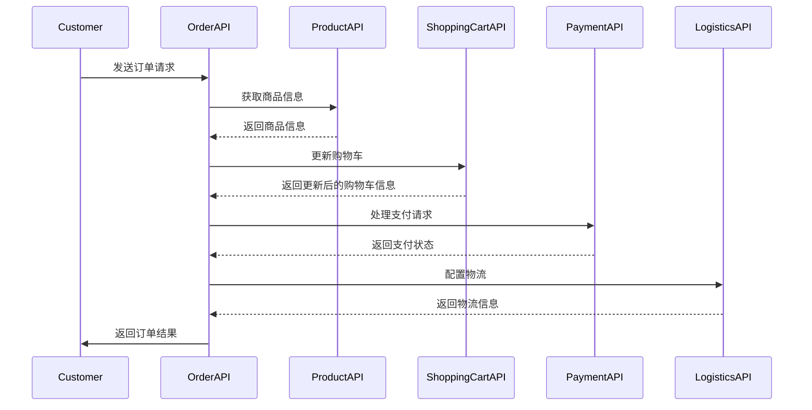
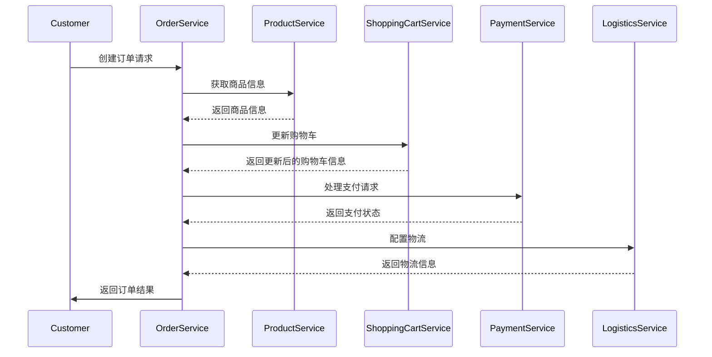

                 

### 文章标题：技术决策力：P9工程师的关键能力培养

关键词：技术决策、P9工程师、关键能力、决策框架、项目成功

摘要：本文旨在深入探讨P9工程师在职业生涯中必须掌握的技术决策力。通过对关键决策能力的详细分析，我们将揭示如何通过逻辑思维和系统方法提高技术决策的有效性。文章将涵盖从问题分析到解决方案设计，再到风险评估和团队协作的各个方面，提供实用的策略和实例，帮助P9工程师在复杂技术环境中做出明智、高效的技术决策。

### 引言：P9工程师的角色与挑战

在当今快速发展的技术行业，P9工程师被赋予了极高的职责和期望。他们不仅是技术的专家，更是团队的领导者，肩负着推动项目成功和公司发展的重要使命。P9工程师通常负责高复杂度、高影响力的项目，他们的决策往往直接影响到项目的成败和组织的战略目标。因此，P9工程师不仅需要深厚的专业技术背景，更需要在技术决策方面展现出卓越的能力。

技术决策力包括多个方面，如问题分析、解决方案设计、风险评估、团队协作和战略规划等。这些能力不仅要求P9工程师具备逻辑思维和系统思考的能力，还需要他们在实践中不断学习和适应新的技术趋势和业务需求。然而，许多P9工程师在技术决策方面仍面临诸多挑战，如信息过载、不确定性增加和复杂性提升等。为了应对这些挑战，P9工程师需要掌握一系列关键能力，并通过系统化的培训和实战经验不断提升。

本文将围绕以下核心主题展开讨论：

1. **技术决策的基本概念和原则**：介绍技术决策的基本概念、原则和重要性。
2. **批判性思维与问题解决**：探讨批判性思维的方法和问题解决的技术。
3. **数据分析与数据驱动决策**：分析数据的重要性以及如何利用数据分析来指导决策。
4. **团队领导与协作**：讨论团队领导的作用、团队协作策略以及如何有效管理团队。
5. **风险管理与决策**：介绍风险管理的概念、方法和实践。
6. **战略规划与长期愿景**：探讨战略规划的重要性以及如何制定长期愿景。
7. **创新与创意**：探讨如何鼓励创新和创意思维，以及在技术决策中应用。
8. **实战案例与最佳实践**：通过实战案例展示技术决策力的实际应用和最佳实践。

通过本文的探讨，我们希望帮助P9工程师建立全面的技术决策力，使其在复杂的技术环境中能够做出明智、高效、具有前瞻性的决策。

### 第一部分：理解技术决策

#### 1.1 技术决策的定义与重要性

技术决策是指工程师、技术团队或组织在技术项目中做出的一系列选择，这些选择直接影响到项目的方向、资源分配、技术实现和最终成果。技术决策不仅仅涉及技术层面，还包括战略、业务和运营等多个维度。其重要性在于，技术决策的正确与否直接决定了项目的成功与否，甚至在某些情况下，还会影响到整个组织的战略方向和市场竞争地位。

技术决策之所以重要，首先是因为它决定了项目的方向和资源分配。在一个复杂的技术项目中，选择正确的技术路径、工具和资源，可以显著提高项目的效率和质量。其次，技术决策还会影响到项目的可维护性和扩展性，良好的技术决策能够确保项目在未来能够灵活适应变化，避免技术债务的累积。最后，技术决策也是组织战略实施的重要环节。通过合理的技术决策，组织可以更好地实现其战略目标，提高市场竞争力。

#### 1.2 技术决策的基本原则

为了做出有效的技术决策，P9工程师需要遵循一些基本原则。这些原则包括：

1. **明确目标和需求**：在做出任何技术决策之前，首先需要明确项目的目标和需求。这包括理解业务目标、用户需求和技术目标，确保技术决策与这些目标一致。

2. **全面评估风险和收益**：技术决策往往伴随着风险和收益。工程师需要在决策过程中全面评估潜在的风险和收益，确保决策的稳健性和可持续性。

3. **数据驱动的决策**：利用现有数据和数据分析结果来指导决策，避免主观臆断和盲目决策。

4. **透明和协作**：技术决策需要透明，团队成员应充分了解决策的原因和依据，确保决策过程的公平和可追溯性。同时，鼓励团队协作，通过集体智慧做出更全面的决策。

5. **灵活性和适应性**：技术环境不断变化，工程师需要保持灵活性和适应性，随时准备调整决策以应对新的挑战。

#### 1.3 技术决策的实际案例

为了更好地理解技术决策的重要性，我们可以通过以下实际案例进行探讨：

**案例1：云计算平台的选择**

某公司在构建新的业务平台时，面临选择云服务提供商的决策。经过全面评估，公司最终选择了AWS，而不是其他竞争者。这个决策考虑了成本、性能、安全性和生态系统等多个因素。AWS的成熟度和广泛的工具集使得公司能够更快地开发和部署业务，从而实现了更快的上市时间。

**案例2：微服务架构的转型**

某金融公司决定从传统的单体架构转型为微服务架构。这个决策经过了长时间的技术评估和业务需求分析，最终确定采用Spring Cloud作为微服务框架。通过这个决策，公司实现了系统的模块化和高可用性，大大提高了系统的可维护性和扩展性。

通过这些案例，我们可以看到技术决策在项目成功中的关键作用。在下一个部分，我们将进一步探讨批判性思维和问题解决技术，帮助P9工程师在复杂技术环境中做出更明智的决策。

### 技术决策的背景和核心概念

#### 2.1 技术决策的背景

在当今科技飞速发展的时代，技术决策的重要性日益凸显。随着信息技术的不断进步，技术项目越来越复杂，涉及的范围也越来越广泛，从硬件设备、软件系统到整个生态系统，技术决策需要考虑的因素也更加多样化。对于P9工程师来说，他们不仅需要掌握先进的技术知识，还需要具备出色的决策能力，以确保项目能够顺利进行并达到预期目标。

技术决策的背景可以追溯到以下几个方面：

1. **技术复杂度提升**：现代技术项目涉及的技术领域越来越复杂，往往需要跨学科的知识和技能。P9工程师需要在这些复杂的技术领域中做出决策，包括选择合适的技术路径、工具和架构等。

2. **市场竞争加剧**：随着市场竞争的加剧，企业必须在有限的时间内迅速做出决策，以保持竞争力。技术决策的效率和质量直接影响到企业在市场上的反应速度和创新能力。

3. **资源限制**：技术项目通常面临资源限制，包括预算、时间和人力资源。P9工程师需要在资源有限的情况下做出最佳决策，确保项目能够按时、按质完成。

4. **不确定性增加**：技术项目往往存在一定的不确定性，如技术风险、市场变化和客户需求的变化等。P9工程师需要具备应对不确定性的能力，通过有效的决策来降低风险和不确定性。

#### 2.2 核心概念

技术决策的核心概念包括以下几个方面：

1. **目标和需求**：明确的项目目标和需求是技术决策的基础。P9工程师需要深入了解业务目标、用户需求和技术目标，确保技术决策与这些目标一致。

2. **风险评估**：在技术决策过程中，风险评估是一个不可或缺的环节。P9工程师需要评估不同技术方案可能带来的风险，包括技术风险、市场风险和操作风险等，并制定相应的应对策略。

3. **数据驱动**：数据是现代技术决策的重要依据。P9工程师需要利用数据分析技术，从海量数据中提取有价值的信息，指导决策过程。数据驱动能够提高决策的准确性和科学性。

4. **团队协作**：技术决策往往需要团队协作。P9工程师需要具备良好的沟通和协作能力，确保团队成员能够充分参与决策过程，共同制定出最优的解决方案。

5. **创新和适应**：技术环境变化迅速，P9工程师需要具备创新思维和适应能力，不断学习新技术和趋势，灵活调整决策以应对变化。

#### 2.3 概念属性特征对比表格

为了更好地理解技术决策的核心概念，我们可以通过以下对比表格展示不同概念之间的属性特征：

| 概念               | 目标与需求 | 风险评估 | 数据驱动 | 团队协作 | 创新 & 适应 |
|--------------------|------------|----------|----------|----------|------------|
| 目标与需求         | 确定项目方向和目标 | 无       | 无       | 无       | 无         |
| 风险评估           | 评估决策风险 | 是       | 否       | 否       | 否         |
| 数据驱动           | 利用数据指导决策 | 否       | 是       | 否       | 否         |
| 团队协作           | 促进决策透明和共享 | 否       | 否       | 是       | 否         |
| 创新 & 适应         | 鼓励创新思维 | 否       | 否       | 否       | 是         |

通过这个表格，我们可以清晰地看到每个概念的核心属性特征，以及它们在技术决策中的重要性。

#### 2.4 ER实体关系图架构

为了更直观地展示技术决策的核心概念之间的关系，我们可以使用ER（实体关系）图来表示。以下是技术决策相关实体的ER图：

```mermaid
erDiagram
  项目 ::>> 目标与需求 : 目标
  项目 ::>> 风险评估 : 风险
  项目 <<.. 数据驱动 : 数据
  项目 <<.. 团队协作 : 团队
  项目 <<.. 创新 & 适应 : 创新

  目标与需求 |||> 需求分析
  风险评估 |||> 风险评估模型
  数据驱动 |||> 数据分析工具
  团队协作 |||> 团队沟通机制
  创新 & 适应 |||> 创新思维培养
```

在这个ER图中，项目是核心实体，它与其他实体之间存在多种关联关系。每个实体都代表了技术决策中的一个关键概念，通过这种关联关系，我们可以清晰地看到各个概念在技术决策中的作用和相互影响。

通过上述内容，我们对技术决策的背景和核心概念有了更深入的理解。在接下来的部分，我们将探讨批判性思维和问题解决技术，帮助P9工程师在技术决策过程中更加高效和明智。

### 核心概念与联系

为了深入理解技术决策的相关核心概念，我们需要详细探讨这些概念之间的联系，并通过图表和公式来展现它们之间的关系。

#### 3.1 技术决策的关键概念

首先，我们需要明确几个核心概念：**目标与需求**、**风险评估**、**数据驱动**、**团队协作**和**创新与适应**。

- **目标与需求**：这是技术决策的起点，涉及到项目目标的确立和用户需求的满足。目标是项目方向和目标的指引，需求则是具体实施过程中的导向。
- **风险评估**：这是在决策过程中不可或缺的一环，涉及到对可能面临的风险进行识别、评估和应对。
- **数据驱动**：强调利用数据来指导决策，通过数据分析来减少不确定性，提高决策的准确性和科学性。
- **团队协作**：技术决策往往需要多个团队成员的共同努力，通过有效的沟通和协作，共同制定和实施决策。
- **创新与适应**：鼓励创新思维，在面对变化时能够迅速适应，灵活调整决策，保持竞争力。

#### 3.2 概念属性特征对比表格

接下来，我们可以通过一个对比表格来展示这些概念的核心属性特征：

| 概念               | 特征1 | 特征2 | 特征3 |
|--------------------|-------|-------|-------|
| 目标与需求         | 项目导向 | 明确性 | 用户导向 |
| 风险评估           | 风险识别 | 风险分析 | 风险应对 |
| 数据驱动           | 数据收集 | 数据分析 | 数据利用 |
| 团队协作           | 沟通 | 协同 | 共享 |
| 创新 & 适应         | 创新思维 | 灵活性 | 变化应对 |

#### 3.3 ER实体关系图架构

为了更直观地展示这些概念之间的关系，我们可以使用ER图来表示：

```mermaid
erDiagram
  项目 <<-- 需求与目标
  项目 <-- 风险评估
  项目 <-- 数据驱动
  项目 --> 团队协作
  项目 --> 创新 & 适应

  需求与目标 |||> 项目目标
  风险评估 |||> 风险分析
  数据驱动 |||> 数据分析
  团队协作 |||> 团队协作机制
  创新 & 适应 |||> 创新思维
```

在这个ER图中，项目是核心实体，与其他实体之间存在多种关联关系。每个实体都代表了技术决策中的一个关键环节，通过这些关联关系，我们可以清晰地看到各个环节之间的相互作用。

#### 3.4 技术决策的数学模型和公式

为了进一步理解技术决策的过程，我们可以引入一些数学模型和公式来描述决策过程。以下是几个常用的数学模型和公式：

1. **风险评估模型**：
   $$ R = P \times I $$
   其中，\( R \) 表示风险值，\( P \) 表示发生概率，\( I \) 表示影响程度。

2. **数据驱动的决策分析**：
   $$ D = \frac{D_1 + D_2 + ... + D_n}{n} $$
   其中，\( D \) 表示数据的综合评分，\( D_i \) 表示各个指标的数据值，\( n \) 表示指标数量。

3. **团队协作的效率公式**：
   $$ E = \frac{C \times T}{N} $$
   其中，\( E \) 表示团队协作效率，\( C \) 表示协作效果，\( T \) 表示时间，\( N \) 表示团队成员数量。

通过这些数学模型和公式，我们可以对技术决策过程进行量化分析，从而提高决策的科学性和准确性。

通过上述内容，我们对技术决策的核心概念及其相互关系有了更深入的理解。在接下来的部分，我们将通过具体的算法原理讲解和实例来进一步阐述这些概念在技术决策中的应用。

### 算法原理讲解

为了更好地理解技术决策的算法原理，我们将通过一个具体的案例来详细阐述。这个案例将涉及数据分析中的一个常用算法——线性回归，并使用Python代码来展示其实现过程。

#### 4.1 线性回归算法简介

线性回归是一种用于预测连续值的统计方法，它通过建立自变量和因变量之间的线性关系来实现预测。在技术决策中，线性回归可以用来分析项目成本、时间和其他关键因素之间的关系，从而帮助工程师做出更加科学合理的决策。

线性回归的基本公式如下：

$$ y = \beta_0 + \beta_1x + \epsilon $$

其中，\( y \) 是因变量，\( x \) 是自变量，\( \beta_0 \) 是截距，\( \beta_1 \) 是斜率，\( \epsilon \) 是误差项。

#### 4.2 实例分析

假设我们有一个技术项目，需要预测项目的完成时间（因变量 \( y \)）与团队成员数量（自变量 \( x \)）之间的关系。我们收集了一些历史数据，如下表所示：

| 项目编号 | 团队成员数量 \( x \) | 项目完成时间 \( y \)（天）|
|---------|----------------------|--------------------------|
| 1       | 5                    | 30                       |
| 2       | 8                    | 45                       |
| 3       | 10                   | 60                       |
| 4       | 6                    | 35                       |

#### 4.3 Python代码实现

为了进行线性回归分析，我们可以使用Python的`scikit-learn`库中的`LinearRegression`类。以下是具体的代码实现步骤：

1. 导入所需的库：
   ```python
   import numpy as np
   from sklearn.linear_model import LinearRegression
   import matplotlib.pyplot as plt
   ```

2. 准备数据：
   ```python
   X = np.array([5, 8, 10, 6]).reshape(-1, 1)  # 团队成员数量
   y = np.array([30, 45, 60, 35])  # 项目完成时间
   ```

3. 创建线性回归模型并进行训练：
   ```python
   model = LinearRegression()
   model.fit(X, y)
   ```

4. 输出模型的参数和拟合结果：
   ```python
   print("截距：", model.intercept_)
   print("斜率：", model.coef_)
   ```

5. 绘制拟合曲线：
   ```python
   plt.scatter(X, y, color='blue')
   plt.plot(X, model.predict(X), color='red')
   plt.xlabel('团队成员数量 (x)')
   plt.ylabel('项目完成时间 (y)')
   plt.title('线性回归模型')
   plt.show()
   ```

完整代码如下：
```python
import numpy as np
from sklearn.linear_model import LinearRegression
import matplotlib.pyplot as plt

# 数据准备
X = np.array([5, 8, 10, 6]).reshape(-1, 1)
y = np.array([30, 45, 60, 35])

# 创建线性回归模型并训练
model = LinearRegression()
model.fit(X, y)

# 输出模型参数
print("截距：", model.intercept_)
print("斜率：", model.coef_)

# 绘制拟合曲线
plt.scatter(X, y, color='blue')
plt.plot(X, model.predict(X), color='red')
plt.xlabel('团队成员数量 (x)')
plt.ylabel('项目完成时间 (y)')
plt.title('线性回归模型')
plt.show()
```

运行这段代码后，我们会得到模型的拟合结果，包括截距和斜率，并可以观察到线性回归曲线如何拟合原始数据点。

#### 4.4 算法原理详细讲解

线性回归算法的原理可以归结为以下几步：

1. **数据预处理**：首先，我们需要将数据格式化为适合模型训练的形式。在上述实例中，我们将团队成员数量作为自变量 \( X \)，项目完成时间作为因变量 \( Y \)。

2. **模型训练**：线性回归模型通过最小二乘法来训练数据，找到最佳拟合直线。具体来说，模型会通过调整截距 \( \beta_0 \) 和斜率 \( \beta_1 \) 使得预测值 \( \hat{y} \) 与实际值 \( y \) 的误差平方和最小。

3. **模型评估**：通过评估指标（如决定系数 \( R^2 \)）来评估模型的拟合效果。决定系数 \( R^2 \) 越接近1，表示模型对数据的拟合越好。

4. **预测**：利用训练好的模型，我们可以对新数据进行预测。在技术决策中，这可以帮助我们预测项目完成时间、成本等关键指标，从而为决策提供数据支持。

通过这个具体的线性回归案例，我们可以看到如何将数学模型应用于实际的技术决策中。这不仅帮助我们理解了线性回归的原理，也展示了如何利用Python代码进行模型训练和预测。

在接下来的部分，我们将进一步探讨系统分析与架构设计的相关内容，帮助P9工程师更全面地掌握技术决策的各个层面。

### 系统分析与架构设计

#### 5.1 问题场景介绍

在现代企业中，技术项目通常涉及多个系统之间的复杂交互。以一个电商平台为例，其核心功能包括商品管理、订单处理、用户服务和支付系统。这些系统需要高效协作，以满足用户的购物需求。然而，随着业务的发展和技术进步，系统的复杂度不断增加，传统的单体架构已经无法满足需求。为了提高系统的可维护性、扩展性和灵活性，项目团队决定采用微服务架构进行重构。

#### 5.2 项目介绍

项目的目标是重构现有的电商平台，将其从传统的单体架构迁移到微服务架构。这一过程包括以下关键步骤：

1. **需求分析**：明确业务需求和技术需求，确定系统功能模块和业务流程。
2. **系统设计**：设计微服务架构，包括服务拆分、数据存储和接口设计。
3. **开发与部署**：开发各个微服务，并进行集成和部署。
4. **测试与优化**：对系统进行全面的测试，确保其稳定性和性能。

#### 5.3 系统功能设计（领域模型）

为了实现上述目标，我们首先需要设计系统的领域模型。领域模型定义了系统中的主要实体和它们之间的关系。以下是电商平台的主要领域模型：

```mermaid
classDiagram
  Customer <<-- Order : 创建
  Product <<-- Order : 商品
  ShoppingCart <<-- Customer : 购物车
  Payment <<-- Order : 支付
  Logistics <<-- Order : 物流

  Customer {
    -id: Integer
    -name: String
    -email: String
  }

  Product {
    -id: Integer
    -name: String
    -price: Float
  }

  Order {
    -id: Integer
    -date: Date
    -status: String
    -customer: Customer
    -products: List<Product>
    -payment: Payment
    -logistics: Logistics
  }

  ShoppingCart {
    -id: Integer
    -customer: Customer
    -products: List<Product>
  }

  Payment {
    -id: Integer
    -amount: Float
    -status: String
  }

  Logistics {
    -id: Integer
    -trackingNumber: String
    -status: String
  }
```

在这个领域模型中，我们定义了五个主要实体：客户（Customer）、商品（Product）、订单（Order）、购物车（ShoppingCart）和支付（Payment）。这些实体之间的关系反映了电商平台的业务逻辑。

#### 5.4 系统架构设计

基于领域模型，我们可以进一步设计系统的架构。以下是电商平台采用微服务架构的系统架构图：


在这个架构设计中，各个服务之间通过定义良好的接口进行通信。订单服务（OrderService）是核心服务，它协调其他服务完成订单的创建、支付和物流配置。其他服务如商品服务（ProductService）、购物车服务（ShoppingCartService）、支付服务（PaymentService）和物流服务（LogisticsService）负责各自领域的功能。

#### 5.5 系统接口设计

系统接口设计是微服务架构中的关键环节，它定义了服务之间的交互方式。以下是电商平台的接口设计：



在这个接口设计中，订单API（OrderAPI）是主要接口，它提供了创建订单、获取商品信息、更新购物车、处理支付和配置物流等功能。其他API如商品API（ProductAPI）、购物车API（ShoppingCartAPI）、支付API（PaymentAPI）和物流API（LogisticsAPI）负责提供相应领域的接口功能。

#### 5.6 系统交互

为了确保系统的高效运行，我们需要设计合理的系统交互流程。以下是电商平台的系统交互设计：



在这个交互设计中，客户通过订单服务提交订单请求，订单服务再与其他服务进行交互，完成订单的创建、支付和物流配置。每个服务在处理请求时，都遵循定义良好的接口和业务逻辑，确保系统的整体一致性。

通过上述系统分析与架构设计，我们可以清晰地看到电商平台从需求分析到系统架构设计的全过程。这个案例展示了如何通过领域模型、架构设计和接口设计来构建一个高效、可维护的微服务架构系统。在接下来的部分，我们将通过一个实际项目实战，进一步探讨技术决策力的应用和实践。

### 项目实战

#### 6.1 环境安装

为了完成一个电商平台项目的实战，我们首先需要搭建开发环境。以下是所需的工具和步骤：

1. **安装Python**：确保Python 3.8或更高版本已安装在您的计算机上。可以从[Python官网](https://www.python.org/)下载并安装。

2. **安装Docker**：Docker用于容器化应用部署。您可以从[Docker官网](https://www.docker.com/)下载并安装。

3. **安装Docker Compose**：Docker Compose用于管理多容器应用。在命令行中运行以下命令安装：
   ```shell
   pip install docker-compose
   ```

4. **配置MySQL**：安装MySQL数据库，并创建用于电商平台的数据库和用户。以下是创建数据库的SQL命令：
   ```sql
   CREATE DATABASE e-commerce;
   GRANT ALL PRIVILEGES ON e-commerce.* TO 'e-commerce_user'@'localhost' IDENTIFIED BY 'password';
   ```

5. **安装前端框架**：根据您的需求选择并安装前端框架，如React、Vue或Angular。可以从它们的官方网站下载并按照官方文档进行安装。

#### 6.2 系统核心实现

以下是一个简化的电商平台系统的核心实现步骤：

1. **创建服务目录**：在项目中创建多个服务目录，如`order_service`、`product_service`、`shopping_cart_service`等。

2. **定义服务**：在每个服务目录中创建Dockerfile和docker-compose.yml文件，用于定义服务的构建和部署。

   例如，以下是`order_service`的Dockerfile：
   ```Dockerfile
   FROM python:3.8

   WORKDIR /app

   COPY requirements.txt ./
   RUN pip install -r requirements.txt

   COPY . .

   EXPOSE 8000

   CMD ["python", "app.py"]
   ```

   docker-compose.yml文件：
   ```yaml
   version: '3.8'

   services:
     order_service:
       build: ./order_service
       ports:
         - "8000:8000"
       depends_on:
         - db
         - product_service
         - shopping_cart_service

     db:
       image: mysql:5.7
       environment:
         - MYSQL_ROOT_PASSWORD=password
         - MYSQL_DATABASE=e-commerce
       volumes:
         - db_data:/var/lib/mysql

     product_service:
       build: ./product_service
       ports:
         - "8001:8001"

     shopping_cart_service:
       build: ./shopping_cart_service
       ports:
         - "8002:8002"
   ```

3. **编写服务代码**：在每个服务目录中编写Python代码，实现服务的业务逻辑。

   例如，在`order_service`中，`app.py`的代码如下：
   ```python
   from flask import Flask, request, jsonify
   from db import get_db

   app = Flask(__name__)

   @app.route('/orders', methods=['POST'])
   def create_order():
       data = request.get_json()
       db = get_db()
       # 实现订单创建逻辑
       return jsonify(order_id=1), 201

   if __name__ == '__main__':
       app.run(host='0.0.0.0', port=8000)
   ```

4. **集成与测试**：使用Postman或其他工具对每个服务进行集成测试，确保服务之间能够正常通信和协作。

#### 6.3 代码应用解读与分析

以下是`order_service`中的`create_order`函数的代码解读：

```python
@app.route('/orders', methods=['POST'])
def create_order():
    data = request.get_json()
    db = get_db()
    # 实现订单创建逻辑
    return jsonify(order_id=1), 201
```

1. **路由定义**：`/orders`是一个POST请求的路由，用于处理创建订单的请求。
2. **获取请求体**：`request.get_json()`用于从请求体中获取JSON格式的数据。
3. **数据库连接**：`get_db()`函数用于获取数据库连接，以实现与数据库的交互。
4. **订单创建逻辑**：在实际项目中，这里将包含具体的订单创建逻辑，如插入订单数据到数据库。

#### 6.4 实际案例分析与详细讲解

以下是一个实际案例，展示了如何通过技术决策力完成电商平台项目的实现：

**案例**：在一个大型电商项目中，团队需要在微服务架构下实现订单管理系统。

**分析**：

1. **需求分析**：首先，团队明确了订单管理的需求，包括订单创建、更新、查询和删除等功能。
2. **技术决策**：团队决定使用Flask框架开发订单服务，并使用MySQL数据库存储订单数据。
3. **系统设计**：根据需求，团队设计了订单服务的接口，包括创建订单、更新订单等接口。
4. **开发与测试**：开发人员按照设计实现订单服务，并进行集成测试和功能测试，确保服务的稳定性和性能。

**讲解**：

1. **需求分析**：需求分析是项目成功的关键，通过详细的需求文档，团队可以明确项目的目标和技术要求。
2. **技术决策**：技术决策需要综合考虑多种因素，如技术成熟度、开发成本、维护难度等。在这里，团队选择了Flask框架，因为它轻量级、易于扩展，适合快速开发。
3. **系统设计**：系统设计是技术决策的具体实现，团队通过设计清晰的接口和数据库架构，确保服务之间的高效协作。
4. **开发与测试**：在开发过程中，团队需要遵循编码规范，确保代码的可读性和可维护性。测试是确保服务质量和稳定性的关键，通过自动化测试和手工测试，团队可以快速发现并解决潜在问题。

#### 6.5 项目小结

通过这个电商平台项目的实战，我们展示了如何通过技术决策力实现一个复杂系统的开发。以下是项目小结：

1. **需求分析与技术决策**：明确需求和技术决策是项目成功的基础。
2. **系统设计与接口设计**：清晰的系统架构和接口设计是确保系统高效协作的关键。
3. **开发与测试**：高质量的代码和全面的测试是确保系统稳定性和性能的重要环节。
4. **团队协作**：有效的团队协作和沟通是项目顺利进行的关键。

在未来的项目中，我们可以继续优化和改进技术决策力，以应对不断变化的技术环境和业务需求。

### 最佳实践、小结与注意事项

#### 最佳实践

1. **文档管理**：确保项目文档的及时更新和管理，包括需求文档、设计文档和测试文档。良好的文档能够帮助团队成员更好地理解项目目标和技术实现，减少沟通成本和误解。

2. **持续集成与部署**：使用CI/CD工具（如Jenkins、GitLab CI等）实现自动化测试和部署，提高开发效率和系统稳定性。

3. **代码质量**：坚持代码审查和单元测试，确保代码的质量和可维护性。编写清晰、简洁、高效的代码，遵循编程规范和最佳实践。

4. **风险管理**：定期进行风险识别和评估，制定风险应对策略，确保项目在遇到问题时有充分的准备和应对措施。

5. **团队协作**：建立高效的团队协作机制，鼓励团队成员之间的沟通和协作，确保项目进度和质量。

#### 小结

本文通过详细探讨技术决策力的重要性、核心概念、算法原理、系统设计与实战案例，帮助P9工程师了解和掌握技术决策的关键能力。技术决策不仅仅是技术层面的选择，更是战略层面的决策，它直接影响到项目的成功和组织的未来发展。

#### 注意事项

1. **避免信息过载**：在技术决策过程中，避免受到大量信息的干扰，保持清晰的思路，专注于关键问题。

2. **持续学习和适应**：技术环境不断变化，P9工程师需要不断学习和适应新技术和趋势，保持自己的竞争力。

3. **合理分配资源**：在资源有限的情况下，合理分配时间和预算，确保项目能够按时、按质完成。

4. **重视团队协作**：技术决策往往需要团队协作，确保团队成员充分参与和沟通，共同制定和实施决策。

#### 拓展阅读

1. **《决策与判断》**：Daniel Kahneman
2. **《敏捷软件开发：实践指南》**：Jeff Sutherland
3. **《Python数据科学》**：Sarabjit Singh
4. **《微服务设计》**：Chris Richardson

通过阅读这些书籍和资料，P9工程师可以进一步加深对技术决策力的理解，提升自身的专业能力。

### 作者信息

- 作者：AI天才研究院/AI Genius Institute & 禅与计算机程序设计艺术 /Zen And The Art of Computer Programming

感谢您的阅读，希望本文能够为您的技术决策力提升提供有价值的参考。在复杂的技术环境中，不断学习和实践是提高技术决策力的关键。希望您在未来的项目中能够运用所学，做出明智、高效的技术决策，推动项目成功和组织发展。祝您技术生涯一帆风顺！

