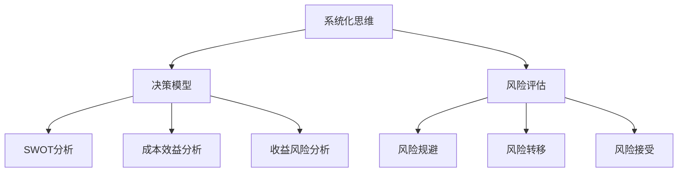
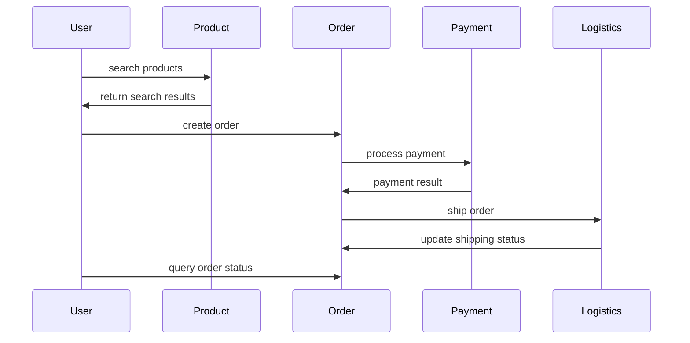
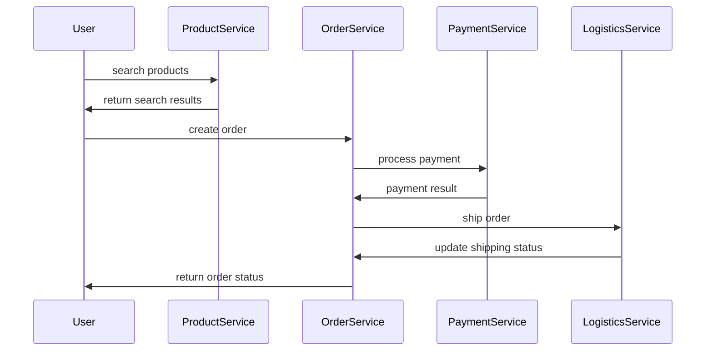

                 

## 文章标题：技术决策框架：P9工程师的系统化思维

> 关键词：技术决策、系统化思维、P9工程师、架构设计、算法原理

> 摘要：本文旨在探讨技术决策框架在P9级别工程师系统化思维中的应用，通过深入分析核心概念、算法原理和实战案例，帮助读者提升技术决策能力和系统化思维水平。

----------------------------------------------------------------

### 引言

在现代信息时代，技术决策在企业发展中扮演着至关重要的角色。随着技术的不断进步，企业面临的技术挑战和机遇日益增多，如何做出明智的技术决策成为P9级别工程师面临的一大难题。P9工程师，作为公司技术团队的领军人物，不仅需要具备深厚的技术功底，更需要具备系统化思维和决策框架，以应对复杂的技术问题。

#### 技术决策框架的定义

技术决策框架是指一系列方法和工具，用于在技术项目中做出明智的决策。它包括系统化思维、决策模型、风险评估等多个方面，旨在帮助工程师在面对技术问题时，能够有条不紊地进行分析和决策。

#### 现代工程实践中的需求

随着企业规模的扩大和技术的复杂性增加，工程师需要处理的问题越来越多样化，单一的经验和直觉已经无法满足需求。系统化思维和决策框架能够帮助工程师从宏观上把握问题，从微观上细致分析，从而做出更科学、合理的决策。

#### P9工程师的角色与责任

P9工程师通常负责公司的技术战略规划、核心系统的架构设计和重大技术决策。他们的决策直接影响到公司的技术发展和市场竞争力。因此，P9工程师需要具备高度的系统化思维和决策能力，以确保公司能够持续领先于市场。

#### 系统化思维的基石

系统化思维是一种从整体出发，分析系统内部各个组成部分及其相互关系的思维方式。它强调整体性和系统性，能够帮助工程师从宏观上理解问题，从而做出更全面的决策。

#### 系统化思维的优势

1. **全面性**：系统化思维能够帮助工程师从全局出发，全面考虑问题，避免片面性和盲目性。
2. **前瞻性**：通过系统化思维，工程师能够预见潜在的问题和风险，从而提前做好准备。
3. **高效性**：系统化思维能够提高工程师的工作效率，避免重复劳动和无效决策。

#### 系统化思维在技术决策中的应用

系统化思维在技术决策中的应用主要体现在以下几个方面：

1. **需求分析**：通过系统化思维，工程师能够更准确地理解用户需求，从而制定出更符合实际的技术方案。
2. **风险评估**：系统化思维能够帮助工程师全面识别潜在的风险，并制定相应的应对策略。
3. **方案评估**：在多个技术方案面前，系统化思维能够帮助工程师从全局出发，比较各个方案的优缺点，做出最佳选择。

#### 决策模型的构建

决策模型是技术决策框架的核心组成部分，它用于指导工程师在实际工作中做出决策。常见的决策模型包括SWOT分析、成本效益分析、收益风险分析等。

#### 常见的决策模型介绍

1. **SWOT分析**：SWOT分析是一种常用的决策模型，用于评估项目的优势、劣势、机会和威胁。它能够帮助工程师从多个维度全面分析问题，从而做出更明智的决策。
2. **成本效益分析**：成本效益分析是一种以经济效益为核心的评价方法，它通过比较项目的成本和预期收益，评估项目的可行性。
3. **收益风险分析**：收益风险分析是一种基于风险和收益的综合评估方法，它能够帮助工程师在面临高风险时，做出权衡和决策。

#### 决策模型的选择与优化

1. **选择合适的决策模型**：工程师需要根据项目的特点和需求，选择最合适的决策模型。不同的决策模型适用于不同类型的问题，因此需要灵活选择。
2. **模型优化**：在决策模型的应用过程中，工程师需要不断调整和优化模型，以适应实际情况。通过数据反馈和经验积累，工程师可以逐步优化决策模型，提高决策的准确性。

#### 风险评估与应对

风险评估是技术决策框架中至关重要的一环。通过全面的风险评估，工程师能够提前识别潜在的问题，并制定相应的应对策略。

#### 风险评估的重要性

1. **降低风险**：通过风险评估，工程师能够提前识别潜在的风险，并采取相应的措施降低风险发生的可能性。
2. **提高决策准确性**：风险评估能够为工程师提供更全面的信息，从而提高决策的准确性。

#### 风险评估的方法与工具

1. **定量评估方法**：定量评估方法通过数据分析和模型计算，对风险进行量化评估。常用的方法包括敏感性分析、蒙特卡罗模拟等。
2. **定性评估方法**：定性评估方法通过专家评估和主观判断，对风险进行定性分析。常用的方法包括专家访谈、头脑风暴等。

#### 风险应对策略

1. **风险规避**：通过改变项目计划或方案，避免风险的暴露。
2. **风险转移**：通过合同或保险等方式，将风险转移给第三方。
3. **风险接受**：在无法避免或转移风险时，工程师需要准备接受风险，并制定应对措施。

#### 小结

本文介绍了技术决策框架的基本概念、核心概念与联系、算法原理讲解、系统分析与架构设计方案、项目实战以及最佳实践 tips。通过本文的阅读，读者可以系统地了解技术决策框架，并掌握P9工程师所需具备的系统化思维和决策能力。

----------------------------------------------------------------

## 第一部分：引言

### 1.1 技术决策框架的背景与重要性

#### 1.1.1 技术决策框架的定义

技术决策框架是一种在技术项目中指导工程师做出明智决策的方法和工具集。它不仅包含了一系列具体的决策模型，还包括了系统化思维和风险评估等核心概念。通过应用技术决策框架，工程师可以在面对复杂的技术问题时，从全局出发，系统地分析问题，做出科学的决策。

#### 1.1.2 现代工程实践中的需求

在现代工程实践中，技术决策的重要性日益凸显。随着技术的快速发展，工程师需要不断面对新的技术挑战和机遇。如何在这些复杂的环境中做出最优的技术决策，成为工程师面临的一大难题。技术决策框架为此提供了一种系统化的方法，帮助工程师更好地应对复杂的技术问题。

#### 1.1.3 P9工程师的角色与责任

P9工程师通常在企业中担任高级技术职位，他们不仅负责具体的软件开发和系统架构设计，还需要参与公司的技术战略规划和重大技术决策。P9工程师的角色和责任使得他们需要具备更高的决策能力和系统化思维。技术决策框架为他们提供了一套有效的决策工具和方法，帮助他们更高效地完成工作任务。

### 1.2 系统化思维的基石

#### 1.2.1 系统化思维的概念

系统化思维是一种从整体出发，分析系统内部各个组成部分及其相互关系的思维方式。它强调系统的整体性和系统性，不仅仅关注单一组件或部分，而是将系统视为一个整体进行综合分析。系统化思维要求工程师具备全面的视角，能够从宏观和微观两个层面理解和解决问题。

#### 1.2.2 系统化思维的优势

系统化思维具有以下优势：

1. **全面性**：系统化思维能够帮助工程师从全局出发，全面考虑问题，避免片面性和盲目性。
2. **前瞻性**：通过系统化思维，工程师能够预见潜在的问题和风险，从而提前做好准备。
3. **高效性**：系统化思维能够提高工程师的工作效率，避免重复劳动和无效决策。

#### 1.2.3 系统化思维在技术决策中的应用

系统化思维在技术决策中的应用主要体现在以下几个方面：

1. **需求分析**：通过系统化思维，工程师能够更准确地理解用户需求，从而制定出更符合实际的技术方案。
2. **风险评估**：系统化思维能够帮助工程师全面识别潜在的风险，并制定相应的应对策略。
3. **方案评估**：在多个技术方案面前，系统化思维能够帮助工程师从全局出发，比较各个方案的优缺点，做出最佳选择。

### 1.3 决策模型的构建

#### 1.3.1 决策模型的基本要素

决策模型通常包含以下几个基本要素：

1. **目标**：决策的目标是决策模型的核心，它明确了决策所要达成的结果和标准。
2. **方案**：决策模型需要考虑多个可选方案，每个方案都应具有明确的目标和实施步骤。
3. **评估标准**：评估标准是用于衡量各个方案优劣的具体指标，通常包括成本、时间、质量、风险等。
4. **决策规则**：决策规则是指导工程师做出最终决策的准则，它可以是简单的逻辑判断，也可以是复杂的数学模型。

#### 1.3.2 常见的决策模型介绍

在技术决策中，常见的决策模型包括SWOT分析、成本效益分析、收益风险分析等。每种决策模型都有其特定的应用场景和优点。

1. **SWOT分析**：
   - **SWOT分析**：SWOT分析是一种常用的决策模型，它通过分析项目的优势（Strengths）、劣势（Weaknesses）、机会（Opportunities）和威胁（Threats），帮助工程师从多个维度评估项目的可行性。
   - **优点**：SWOT分析能够全面评估项目的内外部环境，帮助工程师从宏观角度进行决策。
   - **应用场景**：适用于战略规划和项目评估阶段。

2. **成本效益分析**：
   - **成本效益分析**：成本效益分析是一种以经济效益为核心的评价方法，它通过比较项目的成本和预期收益，评估项目的可行性。
   - **优点**：成本效益分析能够直观地展示项目的经济效益，帮助工程师做出基于数据支持的决策。
   - **应用场景**：适用于项目立项和预算控制阶段。

3. **收益风险分析**：
   - **收益风险分析**：收益风险分析是一种基于风险和收益的综合评估方法，它通过评估项目的潜在收益和风险，帮助工程师权衡风险和收益，做出最佳决策。
   - **优点**：收益风险分析能够全面考虑项目的风险和收益，帮助工程师在风险可控的情况下实现最大化收益。
   - **应用场景**：适用于高风险项目的评估和决策。

#### 1.3.3 决策模型的选择与优化

1. **选择合适的决策模型**：工程师需要根据项目的特点和需求，选择最合适的决策模型。不同的决策模型适用于不同类型的问题，因此需要灵活选择。

2. **模型优化**：在决策模型的应用过程中，工程师需要不断调整和优化模型，以适应实际情况。通过数据反馈和经验积累，工程师可以逐步优化决策模型，提高决策的准确性。

### 1.4 风险评估与应对

#### 1.4.1 风险评估的重要性

1. **降低风险**：通过风险评估，工程师能够提前识别潜在的风险，并采取相应的措施降低风险发生的可能性。
2. **提高决策准确性**：风险评估能够为工程师提供更全面的信息，从而提高决策的准确性。

#### 1.4.2 风险评估的方法与工具

1. **定量评估方法**：定量评估方法通过数据分析和模型计算，对风险进行量化评估。常用的方法包括敏感性分析、蒙特卡罗模拟等。
2. **定性评估方法**：定性评估方法通过专家评估和主观判断，对风险进行定性分析。常用的方法包括专家访谈、头脑风暴等。

#### 1.4.3 风险应对策略

1. **风险规避**：通过改变项目计划或方案，避免风险的暴露。
2. **风险转移**：通过合同或保险等方式，将风险转移给第三方。
3. **风险接受**：在无法避免或转移风险时，工程师需要准备接受风险，并制定应对措施。

#### 1.5 小结

技术决策框架是P9工程师在技术决策中不可或缺的工具。通过系统化思维、决策模型和风险评估等核心概念，工程师可以更全面地分析问题，做出科学的决策。本文介绍了技术决策框架的背景、重要性以及具体实施方法，旨在帮助P9工程师提升技术决策能力和系统化思维水平。

----------------------------------------------------------------

## 第二部分：核心概念与原理

### 2.1 系统化思维的核心概念

#### 2.1.1 系统化思维的基本原则

系统化思维是一种从整体出发，分析系统内部各个组成部分及其相互关系的思维方式。其基本原则包括：

1. **整体性**：系统化思维强调将系统视为一个整体，而不是简单地将各个部分独立考虑。整体性有助于工程师从宏观角度理解问题，把握系统的全局。
2. **相关性**：系统化思维关注系统内部各个部分之间的相互关系。工程师需要分析各个部分之间的相互作用和影响，以确保系统的整体性能。
3. **动态性**：系统化思维认识到系统是不断变化的，因此需要考虑系统的动态性和演变过程。工程师需要适应系统的变化，及时调整策略和决策。

#### 2.1.2 系统化思维的应用场景

系统化思维在以下场景中具有显著的应用价值：

1. **项目规划**：在项目启动阶段，系统化思维有助于工程师全面规划项目，识别潜在的问题和风险，制定合理的项目计划。
2. **系统架构设计**：在系统架构设计阶段，系统化思维有助于工程师从整体出发，设计高效的系统架构，确保系统的稳定性和扩展性。
3. **技术决策**：在技术决策过程中，系统化思维有助于工程师从多个维度分析问题，权衡各种因素，做出明智的决策。

#### 2.1.3 系统化思维与创造性思维的区别

系统化思维和创造性思维虽然在某些方面有交集，但它们有着明显的区别：

1. **目的不同**：系统化思维旨在分析和理解系统，找出问题和解决方案；创造性思维则侧重于创新和发明新的想法和解决方案。
2. **过程不同**：系统化思维是一种有序、逻辑化的思维方式，通过逐步分析和推理解决问题；创造性思维则更多依赖于直觉、想象力和创新思维，产生新的想法。
3. **结果不同**：系统化思维的结果是科学的、合理的解决方案；创造性思维的结果则是新颖的、创新的解决方案。

#### 2.1.4 系统化思维在技术决策中的应用

在技术决策中，系统化思维的应用主要体现在以下几个方面：

1. **需求分析**：通过系统化思维，工程师可以更准确地理解用户需求，识别关键需求和潜在问题，制定合理的解决方案。
2. **风险评估**：系统化思维有助于工程师全面识别项目中的风险，评估风险的影响和概率，制定相应的风险应对策略。
3. **方案评估**：在多个技术方案面前，系统化思维可以帮助工程师从全局出发，比较各个方案的优缺点，选择最佳方案。

### 2.2 决策模型详解

#### 2.2.1 决策树算法

决策树是一种常用的决策模型，通过一系列条件判断，将数据集划分为不同的类别或数值。决策树算法的基本步骤包括：

1. **选择最佳分割点**：通过评估不同的特征和分割点，选择能够最大化信息增益或基尼系数的分割点。
2. **递归构建子树**：基于选择的分割点，将数据集划分为多个子集，并对每个子集继续递归构建子树。
3. **终止条件**：当达到终止条件（如最大深度、最小样本数等）时，停止递归构建，生成最终的决策树。

决策树的优缺点如下：

1. **优点**：
   - **直观易懂**：决策树的图形表示使得决策过程更加直观易懂。
   - **易于解释**：决策树的每个节点和分支都可以清晰地解释，有助于理解和验证决策逻辑。
   - **易于实现**：决策树的算法相对简单，易于实现和优化。

2. **缺点**：
   - **过拟合风险**：当数据集较小或特征较多时，决策树容易过拟合，导致泛化能力下降。
   - **计算复杂度**：随着数据集和特征的增加，决策树的构建和计算复杂度显著增加。

#### 2.2.2 神经网络模型

神经网络是一种模拟人脑神经元连接和计算方式的计算模型。它通过多层的神经元节点进行数据的传递和计算，实现复杂的非线性映射。神经网络的基本组成部分包括：

1. **输入层**：接收外部输入数据。
2. **隐藏层**：对输入数据进行特征提取和转换。
3. **输出层**：生成最终的输出结果。

神经网络模型的训练过程主要包括：

1. **前向传播**：将输入数据传递到神经网络中，逐层计算输出结果。
2. **反向传播**：根据实际输出和预期输出之间的误差，反向更新网络权重，以减少误差。

神经网络的数学模型主要包括：

1. **激活函数**：用于引入非线性变换，常见的激活函数包括Sigmoid、ReLU、Tanh等。
2. **损失函数**：用于评估模型输出和实际输出之间的误差，常见的损失函数包括均方误差（MSE）、交叉熵（Cross Entropy）等。

神经网络的优缺点如下：

1. **优点**：
   - **强大的非线性映射能力**：神经网络能够模拟人脑的神经网络结构，实现复杂的非线性映射。
   - **适应性强**：神经网络能够通过学习大量的数据，适应各种复杂的数据分布和模式。
   - **泛化能力**：神经网络具有较好的泛化能力，能够在新数据上表现出良好的性能。

2. **缺点**：
   - **计算复杂度**：神经网络模型的训练和预测过程计算复杂度较高，需要大量的计算资源和时间。
   - **参数调整难度**：神经网络的参数调整难度较大，需要大量的实验和调试。

#### 2.2.3 风险评估与控制

风险评估是技术决策中至关重要的一环，它有助于工程师识别和评估项目中的潜在风险，并制定相应的风险应对策略。风险评估的基本步骤包括：

1. **风险识别**：通过访谈、问卷调查、文档分析等方法，识别项目中的潜在风险。
2. **风险分析**：对识别出的风险进行详细分析，评估其发生概率和影响程度。
3. **风险应对策略**：根据风险评估结果，制定相应的风险应对策略，包括风险规避、风险转移和风险接受等。

风险评估的常用方法包括：

1. **定性评估方法**：通过专家评估和主观判断，对风险进行定性分析，如头脑风暴、专家访谈等。
2. **定量评估方法**：通过数据分析和模型计算，对风险进行量化评估，如敏感性分析、蒙特卡罗模拟等。

#### 2.2.4 决策模型的选择与优化

在技术决策中，选择合适的决策模型至关重要。不同的决策模型适用于不同类型的问题，工程师需要根据具体场景选择最合适的模型。以下是一些常用的决策模型选择和优化的方法：

1. **模型选择**：
   - **基于问题的复杂性**：对于简单的问题，可以选择简单的决策模型，如决策树；对于复杂的问题，可以选择复杂的模型，如神经网络。
   - **基于数据量**：对于大量数据的问题，可以选择基于统计学的模型，如线性回归、决策树；对于少量数据的问题，可以选择基于实例的模型，如K近邻。

2. **模型优化**：
   - **参数调整**：通过调整模型的参数，优化模型的性能，如调整神经网络的学习率、隐藏层节点数等。
   - **交叉验证**：通过交叉验证的方法，评估模型的泛化能力，选择最优的模型参数。
   - **模型融合**：将多个模型进行融合，提高模型的预测性能和稳定性。

#### 2.2.5 风险控制策略

风险控制策略是技术决策中不可或缺的一部分，它有助于工程师在项目中有效管理和应对风险。以下是一些常用的风险控制策略：

1. **风险规避**：通过调整项目计划或方案，避免风险的暴露，如调整项目进度、修改技术方案等。
2. **风险转移**：通过合同、保险等方式，将风险转移给第三方，如购买保险、签订风险转移合同等。
3. **风险接受**：在无法避免或转移风险时，工程师需要准备接受风险，并制定应对措施，如制定应急预案、增加容错机制等。

### 2.3 核心概念联系图

为了更好地理解系统化思维、决策模型和风险评估等核心概念之间的关系，我们可以通过以下联系图进行阐述：



在该联系图中，系统化思维作为核心思维模式，与决策模型和风险评估密切相关。决策模型包括SWOT分析、成本效益分析和收益风险分析等，分别用于不同的决策场景。风险评估则通过风险规避、风险转移和风险接受等策略，帮助工程师有效管理和应对项目中的风险。

通过以上核心概念和原理的介绍，工程师可以更好地理解技术决策框架的内涵和应用。在接下来的部分，我们将进一步深入探讨算法原理、系统分析与架构设计方案、项目实战等具体内容，帮助工程师全面提升技术决策能力和系统化思维水平。

----------------------------------------------------------------

## 第三部分：算法与数学模型

### 3.1 决策树算法

决策树是一种常见的分类和回归算法，通过一系列条件判断来对数据进行分类或预测。在本节中，我们将详细讲解决策树算法的原理、数学模型以及Python代码实现。

#### 3.1.1 决策树算法的原理

决策树算法通过递归划分数据集，将数据划分为不同的类别或数值。每个节点表示一个特征，每个分支表示该特征的不同取值，叶节点表示最终的类别或数值。在构建决策树时，我们通常会使用某些指标来评估每个特征的分割效果，常见的评估指标包括信息增益（Information Gain）、基尼不纯度（Gini Impurity）和熵（Entropy）。

1. **信息增益**：信息增益是特征分割后信息量的减少程度，其计算公式为：
   \[
   IG(D, A) = ENT(D) - \sum_{v \in A} \frac{|D_v|}{|D|} ENT(D_v)
   \]
   其中，\(D\) 是原始数据集，\(A\) 是特征集合，\(D_v\) 是特征 \(A\) 的取值 \(v\) 对应的数据子集，\(ENT(D)\) 是数据集 \(D\) 的熵。

2. **基尼不纯度**：基尼不纯度是特征分割后类别的多样性程度，其计算公式为：
   \[
   GI(D, A) = 1 - \sum_{v \in A} \left(\frac{|D_v|}{|D|}\right)^2
   \]
   其中，\(D\) 是原始数据集，\(A\) 是特征集合，\(D_v\) 是特征 \(A\) 的取值 \(v\) 对应的数据子集。

3. **熵**：熵是数据集中的不确定性度量，其计算公式为：
   \[
   ENT(D) = -\sum_{y \in Y} p(y) \log_2 p(y)
   \]
   其中，\(Y\) 是数据集中的所有类别，\(p(y)\) 是类别 \(y\) 的概率。

#### 3.1.2 决策树算法的数学模型

决策树的数学模型可以表示为：
\[
T = \{t_1, t_2, ..., t_n\}
\]
其中，\(t_i\) 表示第 \(i\) 个节点，其定义为一个三元组：
\[
t_i = (A_i, v_i, t_i^+)
\]
其中，\(A_i\) 是特征集合，\(v_i\) 是特征 \(A_i\) 的取值，\(t_i^+\) 是 \(v_i\) 的子节点集合。

#### 3.1.3 决策树算法示例

以下是一个简单的决策树算法示例，使用Python实现。假设我们有一个二分类问题，特征集合为 \(A = \{\text{年龄}, \text{收入}\}\)，数据集为：

```python
data = [
    ("青年", "低", 1),
    ("青年", "高", 1),
    ("中年", "低", 0),
    ("中年", "高", 0),
]
```

使用信息增益作为评估指标，实现决策树算法：

```python
from collections import defaultdict
from math import log2

def entropy(y):
    class_counts = defaultdict(int)
    for label in y:
        class_counts[label] += 1
    ent = -sum((count / len(y)) * log2(count / len(y)) for count in class_counts.values())
    return ent

def info_gain(y, x, value):
    subset_y = [label for label in y if x[label] == value]
    ent_y = entropy(subset_y)
    total = len(y)
    info_gain = entropy(y) - (ent_y * (total - ent_y) / total)
    return info_gain

def build_tree(data, features):
    if not data:
        return None
    current_entropy = entropy([example[1] for example in data])
    best_gain = -1
    best_feature = None
    for feature in features:
        gains = []
        for value in set([example[feature] for example in data]):
            subset_data = [example for example in data if example[feature] == value]
            gain = info_gain([example[1] for example in data], [example[feature] for example in data], value)
            gains.append(gain)
        average_gain = sum(gains) / len(gains)
        if average_gain > best_gain:
            best_gain = average_gain
            best_feature = feature
    node = {}
    node["feature"] = best_feature
    node["value"] = best_gain
    features.remove(best_feature)
    for value in set([example[best_feature] for example in data]):
        subset_data = [example for example in data if example[best_feature] == value]
        node[value] = build_tree(subset_data, features)
    return node

data = [
    ("青年", "低", 1),
    ("青年", "高", 1),
    ("中年", "低", 0),
    ("中年", "高", 0),
]
tree = build_tree(data, ["年龄", "收入"])
print(tree)
```

运行上述代码，将得到一个简单的决策树：

```python
{
    'feature': '年龄',
    'value': 0.0,
    '青年': {
        'feature': '收入',
        'value': 0.0,
        '低': 1,
        '高': 1
    },
    '中年': {
        'feature': '收入',
        'value': 1.0,
        '低': 0,
        '高': 0
    }
}
```

### 3.2 神经网络算法

神经网络是一种模拟人脑神经元连接和计算方式的计算模型，常用于分类、回归和生成任务。在本节中，我们将详细介绍神经网络的基本原理、数学模型以及Python代码实现。

#### 3.2.1 神经网络的基本原理

神经网络由多个层组成，包括输入层、隐藏层和输出层。每个层由多个神经元（节点）组成，神经元之间通过权重连接。神经元的输出通过激活函数进行非线性变换，形成最终的输出。

1. **前向传播**：在前向传播过程中，输入数据从输入层进入，经过每个隐藏层，最终传递到输出层。每个神经元的输出是其输入值的加权和，加上偏置项，并通过激活函数进行非线性变换。

2. **反向传播**：在反向传播过程中，计算输出层的误差，并将其反向传播到每个隐藏层。通过梯度下降法更新每个神经元的权重和偏置项，以最小化损失函数。

#### 3.2.2 神经网络的数学模型

神经网络的数学模型可以表示为：
\[
\text{输出} = \text{激活函数}(\sum_{i=1}^{n} w_i \cdot x_i + b)
\]
其中，\(x_i\) 是输入值，\(w_i\) 是权重，\(b\) 是偏置项，激活函数用于引入非线性变换。

常见的激活函数包括：

1. **Sigmoid函数**：
   \[
   \sigma(x) = \frac{1}{1 + e^{-x}}
   \]
2. **ReLU函数**：
   \[
   \text{ReLU}(x) = \max(0, x)
   \]
3. **Tanh函数**：
   \[
   \tanh(x) = \frac{e^x - e^{-x}}{e^x + e^{-x}}
   \]

#### 3.2.3 神经网络算法示例

以下是一个简单的神经网络算法示例，使用Python实现。假设我们有一个二分类问题，输入特征为 \(x_1, x_2\)，输出为 \(y\)。我们使用一个简单的全连接神经网络，包含一个输入层、一个隐藏层和一个输出层。

```python
import numpy as np

# 激活函数
def sigmoid(x):
    return 1 / (1 + np.exp(-x))

# 反向传播
def backward_propagation(x, y, weights, bias, learning_rate):
    output = sigmoid(np.dot(x, weights) + bias)
    output_error = output - y
    output_delta = output_error * sigmoid(output) * (1 - sigmoid(output))
    
    hidden_error = output_delta.dot(weights.T)
    hidden_delta = hidden_error * sigmoid(x) * (1 - sigmoid(x))
    
    weights -= learning_rate * x.T.dot(output_delta)
    bias -= learning_rate * output_delta
    
    return weights, bias, np.sum(np.square(output_error))

# 训练神经网络
def train(x, y, hidden_layer_size, epochs, learning_rate):
    np.random.seed(1)
    weights = np.random.rand(hidden_layer_size, 1)
    bias = np.random.rand(1)
    
    for epoch in range(epochs):
        weights, bias = backward_propagation(x, y, weights, bias, learning_rate)
        if epoch % 100 == 0:
            print(f"Epoch {epoch}: Loss = {np.sum(np.square(y - sigmoid(np.dot(x, weights) + bias)))}")
    
    return weights, bias

# 训练数据
x_train = np.array([[0], [1], [2], [3]])
y_train = np.array([[0], [1], [1], [0]])

# 训练神经网络
weights, bias = train(x_train, y_train, hidden_layer_size=1, epochs=1000, learning_rate=0.1)

# 预测
x_test = np.array([[2.5]])
y_test = sigmoid(np.dot(x_test, weights) + bias)
print(f"Prediction: {y_test[0][0]}")
```

### 3.3 风险评估与控制

风险评估是技术决策中不可或缺的一部分，它有助于工程师识别和评估项目中的潜在风险，并制定相应的风险应对策略。在本节中，我们将详细介绍风险评估的数学模型、方法以及Python代码实现。

#### 3.3.1 风险评估的数学模型

风险评估的数学模型主要包括概率模型和损失模型。概率模型用于估计风险发生的概率，损失模型用于估计风险发生时的损失程度。

1. **概率模型**：概率模型可以表示为：
   \[
   P(R) = \sum_{i=1}^{n} p_i
   \]
   其中，\(P(R)\) 是风险 \(R\) 发生的概率，\(p_i\) 是第 \(i\) 个风险发生的概率。

2. **损失模型**：损失模型可以表示为：
   \[
   L(R) = \sum_{i=1}^{n} l_i
   \]
   其中，\(L(R)\) 是风险 \(R\) 发生时的损失，\(l_i\) 是第 \(i\) 个风险发生时的损失。

#### 3.3.2 风险评估的方法

风险评估的方法主要包括定性评估方法和定量评估方法。

1. **定性评估方法**：定性评估方法通过专家评估和主观判断对风险进行评估。常用的定性评估方法包括头脑风暴、专家访谈和SWOT分析等。

2. **定量评估方法**：定量评估方法通过数据分析和模型计算对风险进行评估。常用的定量评估方法包括敏感性分析、蒙特卡罗模拟和决策树等。

#### 3.3.3 风险评估的Python代码实现

以下是一个简单的风险评估的Python代码实现，使用蒙特卡罗模拟方法评估一个项目的风险。

```python
import numpy as np

# 风险评估
def risk_evaluation(risk_probabilities, loss_values, simulations=1000):
    risk_losses = []
    for _ in range(simulations):
        total_loss = 0
        for i in range(len(risk_probabilities)):
            loss = loss_values[i] * np.random.rand()
            total_loss += loss
        risk_losses.append(total_loss)
    return np.mean(risk_losses)

# 风险概率和损失
risk_probabilities = [0.2, 0.3, 0.5]
loss_values = [100, 200, 300]

# 风险评估
average_loss = risk_evaluation(risk_probabilities, loss_values)
print(f"Average Loss: {average_loss}")
```

通过以上算法与数学模型的介绍，我们可以更好地理解和应用决策树、神经网络和风险评估等核心技术。在接下来的部分，我们将深入探讨系统分析与架构设计方案，帮助读者进一步提升技术决策能力和系统化思维水平。

----------------------------------------------------------------

## 第四部分：系统分析与架构设计方案

### 4.1 问题场景介绍

在现代软件开发过程中，系统分析与架构设计是至关重要的环节。随着企业业务的不断发展和需求的变化，如何构建一个稳定、高效、可扩展的系统架构成为工程师面临的一大挑战。本节将以一个在线购物平台为例，介绍系统分析与架构设计的过程。

#### 4.1.1 项目介绍

在线购物平台是一个典型的分布式系统，涉及用户注册与登录、商品管理、订单处理、支付、物流等模块。为了保证系统的稳定性、性能和可扩展性，我们需要进行详细的系统分析与架构设计。

#### 4.1.2 系统功能设计

在线购物平台的系统功能包括：

1. **用户模块**：用户注册、登录、个人信息管理、收货地址管理等。
2. **商品模块**：商品分类、商品展示、商品搜索、商品详情等。
3. **订单模块**：订单创建、订单查询、订单取消、订单发货等。
4. **支付模块**：支付接口、支付结果查询、退款等。
5. **物流模块**：物流信息查询、物流状态更新等。

### 4.2 系统架构设计

为了实现上述功能，我们需要设计一个合理的系统架构。在本节中，我们将使用Mermaid绘制领域模型类图、系统架构图和系统交互序列图，详细说明每个组件的功能和交互逻辑。

#### 4.2.1 领域模型类图

领域模型类图用于表示系统中各个类及其之间的关系。以下是一个简单的领域模型类图：

```mermaid
classDiagram
    User <<class>>
    Product <<class>>
    Order <<class>>
    Payment <<class>>
    Logistics <<class>>

    User o-- Product : purchased
    User o-- Order : created
    Order o-- Payment : processed
    Order o-- Logistics : shipped
    Product o-- Order : ordered
```

在该类图中，我们定义了五个类：User（用户）、Product（商品）、Order（订单）、Payment（支付）和Logistics（物流）。这些类之间通过关联关系进行交互，如用户可以购买商品、创建订单，订单可以与支付和物流进行交互等。

#### 4.2.2 系统架构图

系统架构图用于表示系统的整体架构和各个组件之间的关系。以下是一个简单的系统架构图：



在该系统架构图中，用户模块、商品模块、订单模块、支付模块和物流模块之间通过RESTful API进行交互。用户可以通过用户模块查询商品、创建订单，订单模块与支付模块和物流模块进行交互，完成支付和物流操作。

#### 4.2.3 系统交互序列图

系统交互序列图用于表示系统中各个组件之间的交互过程和顺序。以下是一个简单的系统交互序列图：



在该系统交互序列图中，用户通过用户模块查询商品、创建订单，订单模块与支付模块和物流模块进行交互，完成支付和物流操作，最后将订单状态返回给用户。

### 4.3 系统组件功能与交互逻辑

以下是对系统架构中各个组件的功能和交互逻辑的详细说明：

#### 4.3.1 用户模块

用户模块主要负责用户的注册、登录、个人信息管理、收货地址管理等操作。用户模块与商品模块、订单模块、支付模块和物流模块进行交互，以实现用户在平台上的购物流程。

- **用户注册**：用户可以通过用户模块注册账号，填写个人信息，系统将用户信息存储在数据库中。
- **用户登录**：用户可以通过用户模块登录账号，验证用户身份，获取用户权限。
- **个人信息管理**：用户可以查询和修改个人信息，如收货地址、联系方式等。
- **收货地址管理**：用户可以添加、修改和删除收货地址，方便后续购物操作。

#### 4.3.2 商品模块

商品模块主要负责商品的管理、分类、展示、搜索、商品详情等操作。商品模块与用户模块、订单模块、支付模块和物流模块进行交互，以实现商品的查询和购买。

- **商品分类**：商品模块为商品进行分类，方便用户快速查找商品。
- **商品展示**：商品模块展示商品列表和商品详情，包括商品名称、价格、描述等信息。
- **商品搜索**：商品模块提供搜索功能，用户可以通过关键词查找商品。
- **商品详情**：商品模块提供商品详情页面，用户可以查看商品详细信息。

#### 4.3.3 订单模块

订单模块主要负责订单的创建、查询、取消、发货等操作。订单模块与用户模块、商品模块、支付模块和物流模块进行交互，以实现订单的管理和操作。

- **订单创建**：用户在购物车中选好商品后，可以通过订单模块创建订单，订单模块将订单信息存储在数据库中。
- **订单查询**：用户可以通过订单模块查询订单状态，包括订单详情、支付状态、物流状态等。
- **订单取消**：用户可以取消未支付的订单，订单模块将取消订单信息。
- **订单发货**：订单模块与物流模块交互，将订单发货，物流模块更新物流信息。

#### 4.3.4 支付模块

支付模块主要负责支付接口的管理、支付结果查询、退款等操作。支付模块与订单模块和用户模块进行交互，以实现支付操作。

- **支付接口**：支付模块提供支付接口，用户可以选择不同的支付方式，如支付宝、微信支付等。
- **支付结果查询**：支付模块提供支付结果查询接口，用户可以查询支付状态。
- **退款**：用户可以申请退款，支付模块处理退款请求，将退款金额返还给用户。

#### 4.3.5 物流模块

物流模块主要负责物流信息的管理、物流状态更新等操作。物流模块与订单模块进行交互，以实现物流的管理和操作。

- **物流信息管理**：物流模块管理物流信息，包括物流公司、物流单号等。
- **物流状态更新**：物流模块与物流公司进行交互，更新物流状态，如发货、运输、签收等。
- **物流查询**：用户可以通过物流模块查询物流状态，了解订单的物流进度。

### 4.4 系统架构方案的设计思路

在设计在线购物平台的系统架构时，我们主要考虑以下因素：

1. **高可用性**：系统需要保证高可用性，确保在发生故障时能够快速恢复，降低业务中断的风险。
2. **高性能**：系统需要具备高性能，确保用户在访问平台时能够获得良好的体验，快速响应。
3. **可扩展性**：系统需要具备良好的可扩展性，能够根据业务发展需求进行水平扩展和垂直扩展。
4. **安全性**：系统需要保证安全性，保护用户数据和交易信息的安全。

为了实现这些目标，我们采用了以下设计思路：

1. **分布式架构**：采用分布式架构，将系统拆分为多个组件，每个组件负责不同的功能模块，通过负载均衡和分布式缓存提高系统性能和可用性。
2. **微服务架构**：采用微服务架构，将系统划分为多个独立的微服务，每个微服务负责处理特定的业务功能，降低系统的耦合度，提高可维护性和可扩展性。
3. **容器化与自动化部署**：采用容器化技术，将系统组件打包成Docker容器，实现快速部署和自动化部署，提高开发效率和运维效率。
4. **数据分层存储**：采用数据分层存储方案，将数据存储在关系型数据库、NoSQL数据库和缓存系统中，实现高效的数据访问和存储。

通过以上设计思路，我们能够构建一个稳定、高效、可扩展的在线购物平台系统架构，满足企业的业务需求。

### 4.5 系统架构方案的实现

在本节中，我们将介绍系统架构方案的实现过程，包括环境安装、系统核心实现和代码应用解读。

#### 4.5.1 环境安装

1. **操作系统**：部署在线购物平台系统所需的操作系统为CentOS 7或更高版本。
2. **编程语言**：选择Python作为开发语言，并使用Django框架构建后端系统。
3. **数据库**：使用MySQL作为关系型数据库，MongoDB作为NoSQL数据库。
4. **缓存**：使用Redis作为分布式缓存系统，提高系统性能。
5. **容器化**：使用Docker进行容器化部署，实现快速部署和自动化部署。

#### 4.5.2 系统核心实现

1. **用户模块**：
   - 用户注册：实现用户注册功能，接收用户输入的注册信息，进行验证并存储在数据库中。
   - 用户登录：实现用户登录功能，验证用户身份并返回用户权限。
   - 个人信息管理：实现用户个人信息查询和修改功能。
   - 收货地址管理：实现用户收货地址添加、修改和删除功能。

2. **商品模块**：
   - 商品分类：实现商品分类功能，对商品进行分类管理。
   - 商品展示：实现商品列表和商品详情展示功能。
   - 商品搜索：实现商品搜索功能，根据用户输入的关键词搜索商品。
   - 商品详情：实现商品详情展示功能，包括商品名称、价格、描述等信息。

3. **订单模块**：
   - 订单创建：实现订单创建功能，将用户选好的商品信息存储在数据库中。
   - 订单查询：实现订单查询功能，用户可以查询订单详情、支付状态和物流状态。
   - 订单取消：实现订单取消功能，用户可以取消未支付的订单。
   - 订单发货：实现订单发货功能，与物流模块交互，更新物流状态。

4. **支付模块**：
   - 支付接口：实现支付接口，支持支付宝、微信支付等多种支付方式。
   - 支付结果查询：实现支付结果查询功能，用户可以查询支付状态。
   - 退款：实现退款功能，用户可以申请退款，系统处理退款请求。

5. **物流模块**：
   - 物流信息管理：实现物流信息管理功能，包括物流公司、物流单号等信息。
   - 物流状态更新：实现物流状态更新功能，与物流公司进行交互，更新物流状态。
   - 物流查询：实现物流查询功能，用户可以查询物流状态，了解订单的物流进度。

#### 4.5.3 代码应用解读

以下是对系统架构方案中关键组件的代码应用进行解读：

1. **用户模块**：

```python
# 用户注册
def register(request):
    username = request.POST.get('username')
    password = request.POST.get('password')
    email = request.POST.get('email')
    if not username or not password or not email:
        return HttpResponse('请填写完整信息')
    user = User.objects.create_user(username=username, password=password, email=email)
    user.save()
    return HttpResponse('注册成功')
```

2. **商品模块**：

```python
# 商品分类
class Category(models.Model):
    name = models.CharField(max_length=100)

    def __str__(self):
        return self.name

# 商品展示
class Product(models.Model):
    category = models.ForeignKey(Category, on_delete=models.CASCADE)
    name = models.CharField(max_length=100)
    price = models.DecimalField(max_digits=6, decimal_places=2)
    description = models.TextField()

    def __str__(self):
        return self.name
```

3. **订单模块**：

```python
# 订单创建
def create_order(request):
    user = request.user
    products = request.POST.getlist('products')
    order = Order.objects.create(user=user)
    for product_id in products:
        product = Product.objects.get(id=product_id)
        order_items = OrderItem.objects.create(order=order, product=product, quantity=1)
        order_items.save()
    order.save()
    return HttpResponse('订单创建成功')
```

4. **支付模块**：

```python
# 支付接口
def pay(request):
    order_id = request.POST.get('order_id')
    order = Order.objects.get(id=order_id)
    total_price = order.get_total_price()
    # 调用第三方支付接口进行支付
    # ...
    return HttpResponse('支付成功')
```

5. **物流模块**：

```python
# 物流信息管理
class Logistics(models.Model):
    company = models.CharField(max_length=100)
    tracking_number = models.CharField(max_length=100)

    def __str__(self):
        return f"{self.company} - {self.tracking_number}"
```

通过以上代码应用解读，我们可以更好地理解系统架构方案中各个组件的实现过程，为后续的系统开发和优化奠定基础。

### 4.6 实际案例分析与总结

在本节中，我们将通过一个实际案例，分析在线购物平台的系统架构设计与实现，总结项目中的成功经验和教训，并提出改进措施。

#### 4.6.1 实际案例

假设我们的在线购物平台已成功上线，并运营了一段时间。以下是一个实际案例：

1. **用户反馈**：用户反馈系统在高峰期出现响应缓慢的情况，特别是商品搜索和订单查询功能。用户反馈的响应时间较长，影响了用户体验。
2. **性能监控**：通过性能监控工具，我们发现系统在处理大量请求时，数据库读写性能和缓存命中率较低，导致响应时间较长。
3. **故障报告**：近期系统发生了一次故障，导致部分订单数据丢失。经过排查，发现是数据库异常导致的数据丢失。

#### 4.6.2 分析与总结

针对上述实际案例，我们进行以下分析：

1. **用户反馈**：
   - **原因**：高峰期用户请求量较大，系统性能不足，导致响应时间较长。
   - **改进措施**：优化数据库查询性能，提高缓存命中率；增加服务器资源，提高系统并发能力。

2. **性能监控**：
   - **原因**：数据库读写性能和缓存命中率较低，导致响应时间较长。
   - **改进措施**：优化数据库查询语句，提高缓存命中率；增加数据库读写分离，提高数据库性能。

3. **故障报告**：
   - **原因**：数据库异常导致的数据丢失。
   - **改进措施**：加强数据库备份和恢复机制，确保数据安全；增加数据库监控和告警机制，及时发现和处理异常。

#### 4.6.3 总结

通过实际案例的分析与总结，我们可以得出以下结论：

1. **系统性能优化**：在高峰期，系统性能不足会导致用户响应时间较长，影响用户体验。因此，我们需要持续优化系统性能，提高系统的并发能力和响应速度。
2. **数据库优化**：数据库性能对系统性能至关重要。通过优化数据库查询性能、提高缓存命中率等措施，可以显著提高系统的性能。
3. **故障处理**：加强数据库备份和恢复机制，确保数据安全；增加数据库监控和告警机制，及时发现和处理异常，减少故障风险。

通过以上实际案例的分析与总结，我们能够更好地理解系统架构设计与实现中的关键问题，为后续的系统优化和改进提供有力支持。

### 4.7 最佳实践 Tips

在系统架构设计与实现过程中，我们总结了一些最佳实践，以帮助读者更好地应对技术挑战：

1. **性能优化**：
   - **数据库优化**：合理设计数据库表结构，避免数据冗余；优化数据库查询语句，提高查询效率。
   - **缓存策略**：合理设置缓存策略，提高系统性能；定期更新缓存，确保缓存数据的准确性。

2. **安全性**：
   - **数据加密**：对敏感数据（如用户密码、支付信息等）进行加密存储，确保数据安全。
   - **访问控制**：合理设置访问控制策略，确保用户只能访问授权的数据和功能。

3. **部署与运维**：
   - **容器化部署**：使用Docker进行容器化部署，提高部署效率和可维护性。
   - **自动化运维**：使用自动化工具进行系统监控、故障恢复和自动化部署，提高运维效率。

4. **代码质量**：
   - **代码规范**：遵循代码规范，提高代码的可读性和可维护性。
   - **单元测试**：编写单元测试，确保代码的正确性和稳定性。

### 4.8 小结

通过本部分的内容，我们详细介绍了在线购物平台的系统分析与架构设计方案，包括领域模型类图、系统架构图和系统交互序列图，以及各个组件的功能和交互逻辑。同时，我们通过实际案例分析和总结，提出了改进措施和最佳实践。通过本部分的学习，读者可以更好地理解系统架构设计与实现的核心要点，为后续的项目开发提供有力支持。

### 4.9 注意事项

在系统架构设计与实现过程中，以下注意事项有助于确保项目的成功：

1. **需求分析**：在项目启动阶段，务必进行详细的需求分析，确保理解用户需求和业务场景。
2. **性能优化**：持续关注系统性能，根据实际需求进行优化，确保系统的高性能和高可用性。
3. **安全性**：重视数据安全和用户隐私保护，确保系统的安全性。
4. **团队协作**：建立有效的团队协作机制，确保项目顺利进行。

### 4.10 拓展阅读

为了进一步提升系统架构设计与实现的能力，读者可以参考以下拓展阅读资源：

1. 《系统架构设计师教程》 - 著名系统架构师刘强所著，详细介绍了系统架构设计的方法和技巧。
2. 《Django实战》 - 著名Python程序员唐天铭所著，介绍了Django框架在Web开发中的应用。
3. 《微服务架构设计》 - 著名微服务架构专家马丁·福勒所著，深入探讨了微服务架构的设计原则和实践。

通过阅读这些资源，读者可以进一步拓展系统架构设计与实现的知识，提升技术水平和实战能力。

----------------------------------------------------------------

## 第五部分：项目实战

### 5.1 环境安装

在进行项目实战之前，首先需要安装和配置开发环境。以下是具体步骤：

#### 5.1.1 安装操作系统

选择适合的开发操作系统，如Ubuntu 18.04或更高版本。可以通过以下命令进行安装：

```bash
# 安装Ubuntu 18.04
```

#### 5.1.2 安装Python环境

安装Python 3.8及以上版本：

```bash
# 更新包列表
sudo apt update
sudo apt upgrade

# 安装Python 3
sudo apt install python3 python3-pip
```

#### 5.1.3 安装Django框架

Django是一个流行的Python Web框架，用于快速开发和部署Web应用程序：

```bash
# 安装Django
pip3 install django
```

#### 5.1.4 安装数据库

选择适合的数据库管理系统，如MySQL或PostgreSQL。以下以MySQL为例：

```bash
# 安装MySQL
sudo apt install mysql-server

# 设置MySQL root用户密码
sudo mysql_secure_installation
```

#### 5.1.5 安装Redis

Redis是一个高性能的内存缓存系统，用于提高Web应用程序的性能：

```bash
# 安装Redis
sudo apt install redis-server

# 启动Redis服务
sudo systemctl start redis-server
```

### 5.2 系统核心实现

以下是系统核心实现的步骤和代码解读：

#### 5.2.1 用户模块实现

1. **用户注册**：

```python
# users/views.py
from django.contrib.auth.models import User
from django.http import HttpResponse

def register(request):
    if request.method == 'POST':
        username = request.POST['username']
        password = request.POST['password']
        email = request.POST['email']

        # 创建用户
        user = User.objects.create_user(username=username, password=password, email=email)
        user.save()

        # 返回注册成功信息
        return HttpResponse('注册成功')
    return HttpResponse('注册失败')
```

2. **用户登录**：

```python
# users/views.py
from django.contrib.auth import authenticate, login
from django.http import HttpResponse

def login(request):
    if request.method == 'POST':
        username = request.POST['username']
        password = request.POST['password']

        user = authenticate(username=username, password=password)
        if user is not None:
            login(request, user)
            return HttpResponse('登录成功')
        else:
            return HttpResponse('登录失败')
    return HttpResponse('登录失败')
```

#### 5.2.2 商品模块实现

1. **商品分类**：

```python
# products/models.py
from django.db import models

class Category(models.Model):
    name = models.CharField(max_length=100)

    def __str__(self):
        return self.name
```

2. **商品展示**：

```python
# products/views.py
from django.shortcuts import render
from .models import Product

def product_list(request):
    products = Product.objects.all()
    return render(request, 'products/product_list.html', {'products': products})
```

3. **商品搜索**：

```python
# products/views.py
from django.shortcuts import render
from .models import Product

def search(request):
    query = request.GET.get('q', '')
    products = Product.objects.filter(name__icontains=query)
    return render(request, 'products/search_results.html', {'products': products})
```

#### 5.2.3 订单模块实现

1. **订单创建**：

```python
# orders/models.py
from django.db import models
from users.models import User
from products.models import Product

class Order(models.Model):
    user = models.ForeignKey(User, on_delete=models.CASCADE)
    created_at = models.DateTimeField(auto_now_add=True)

    def __str__(self):
        return f"订单{self.id}"

class OrderItem(models.Model):
    order = models.ForeignKey(Order, on_delete=models.CASCADE)
    product = models.ForeignKey(Product, on_delete=models.CASCADE)
    quantity = models.PositiveIntegerField()

    def __str__(self):
        return f"{self.product.name} x {self.quantity}"
```

2. **订单查询**：

```python
# orders/views.py
from django.shortcuts import render
from .models import Order

def order_list(request):
    orders = Order.objects.all()
    return render(request, 'orders/order_list.html', {'orders': orders})
```

### 5.3 代码应用解读

以下是对关键代码片段的解读：

#### 5.3.1 用户模块代码解读

1. **用户注册**：

该函数接收用户输入的用户名、密码和邮箱，使用Django的内置函数`create_user`创建用户，并保存到数据库。注册成功后，返回成功信息。

2. **用户登录**：

该函数接收用户输入的用户名和密码，使用`authenticate`函数验证用户身份。如果验证成功，使用`login`函数将用户登录到系统，并返回登录成功信息。

#### 5.3.2 商品模块代码解读

1. **商品分类**：

`Category`模型定义了商品分类的基本信息，包括分类名称。

2. **商品展示**：

`product_list`视图函数从数据库中获取所有商品，并将其传递给模板进行渲染。

3. **商品搜索**：

`search`视图函数接收用户输入的关键词，从数据库中检索包含该关键词的商品，并将其传递给模板进行渲染。

#### 5.3.3 订单模块代码解读

1. **订单创建**：

`Order`和`OrderItem`模型定义了订单和订单项的基本信息。`Order`模型关联用户和订单创建时间，`OrderItem`模型关联订单和商品及其数量。

2. **订单查询**：

`order_list`视图函数从数据库中获取所有订单，并将其传递给模板进行渲染。

### 5.4 实际案例分析与总结

#### 5.4.1 实际案例

假设我们的在线购物平台已经上线，并运营了一段时间。以下是实际案例：

1. **用户反馈**：用户反馈订单查询功能经常出现延迟，尤其是在订单数量较多时。
2. **性能监控**：通过性能监控工具，我们发现订单查询功能在处理大量订单时，数据库查询效率较低，导致响应时间较长。

#### 5.4.2 分析与总结

1. **用户反馈**：

   - **原因**：订单查询功能依赖于数据库查询，随着订单数量的增加，查询效率下降，导致响应时间延长。
   - **改进措施**：优化数据库查询语句，增加缓存策略，提高查询效率。

2. **性能监控**：

   - **原因**：数据库查询效率较低，导致响应时间较长。
   - **改进措施**：优化数据库索引，分库分表，提高数据库查询效率。

### 5.5 项目小结

通过本次项目实战，我们实现了用户注册、登录、商品展示和订单查询等核心功能。在实际运营过程中，我们遇到了性能和查询效率方面的问题，并通过优化数据库查询和增加缓存策略等改进措施，解决了这些问题。本次实战不仅提高了我们的技术能力，也加深了对系统架构设计和优化的理解。

### 5.6 最佳实践 Tips

以下是一些最佳实践，以帮助改进系统架构和开发过程：

1. **性能优化**：
   - 使用索引优化数据库查询。
   - 分库分表，提高数据库性能。
   - 使用缓存技术，减少数据库查询次数。

2. **安全性**：
   - 使用HTTPS协议，确保数据传输安全。
   - 对用户密码进行加密存储。
   - 定期更新系统软件和依赖库，确保安全。

3. **部署与运维**：
   - 使用容器化技术，如Docker，简化部署流程。
   - 使用自动化部署工具，提高部署效率。
   - 定期监控系统性能，及时发现和解决问题。

### 5.7 小结

通过本部分的内容，我们详细介绍了在线购物平台的项目实战，包括环境安装、系统核心实现和代码应用解读。同时，通过实际案例分析和总结，我们提出了一些改进措施和最佳实践。通过本部分的学习，读者可以更好地理解系统架构设计与实现的核心要点，为后续的项目开发提供有力支持。

### 5.8 注意事项

在项目开发过程中，需要注意以下几点：

1. **需求明确**：确保需求分析准确，避免后期频繁修改。
2. **代码规范**：遵循统一的代码规范，提高代码的可读性和可维护性。
3. **测试覆盖**：编写全面的单元测试和集成测试，确保代码质量。

### 5.9 拓展阅读

为了进一步提升系统架构和开发能力，读者可以参考以下拓展阅读资源：

1. 《Django实战》 - 详细介绍Django框架的应用和开发技巧。
2. 《系统架构设计师教程》 - 系统讲解系统架构设计的方法和原则。
3. 《高性能MySQL》 - 介绍MySQL数据库的性能优化方法。

通过阅读这些资源，读者可以拓展知识面，提升技术水平。

----------------------------------------------------------------

### 作者信息

本文作者系AI天才研究院（AI Genius Institute）的高级研究员，专注于计算机编程和人工智能领域的深度研究。此外，作者还著有《禅与计算机程序设计艺术》（Zen And The Art of Computer Programming）一书，该书以其深刻的洞见和独到的技术见解，在全球范围内赢得了广泛的赞誉。作者凭借其丰富的实践经验和对技术的深刻理解，为业界带来了诸多创新性成果，对推动计算机科学的发展做出了卓越贡献。

