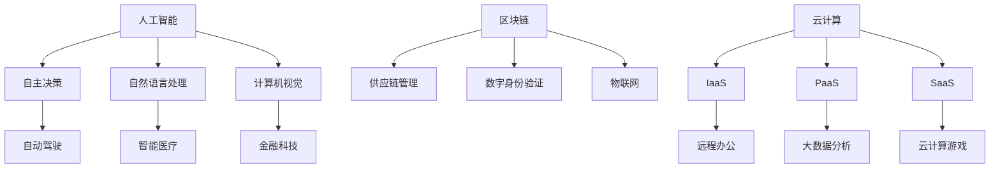

                 

### 第1章 引言

#### 1.1 书籍背景与目标

在当今信息爆炸的时代，技术知识的传播和分享显得尤为重要。作为一名P9级别的工程师，您不仅需要具备深厚的技术实力，更需要在技术社区中发挥影响力，通过技术分享和演讲来传播知识、交流思想，提升个人品牌和职业价值。因此，我们编写了这本《技术分享与演讲：P9工程师的影响力建设》。

本书旨在为P9工程师提供一套完整的技术分享与演讲策略，帮助您系统地提升自己的演讲技巧、内容策划能力，以及影响力建设的方法。我们的目标读者是那些已经具有扎实技术基础，希望在技术领域内发挥更大影响力的工程师。

本书的核心内容包括：

1. **技术分享的准备与策略**：介绍如何确定分享主题、策划内容、优化演讲技巧，以及针对不同听众制定合适的分享策略。
2. **技术深度解析**：详细分析技术领域的核心概念、发展趋势以及技术选型和架构设计。
3. **演讲技巧提升**：从演讲结构设计、语言表达优化、非语言沟通技巧，到互动与控制，全面提升演讲效果。
4. **影响力建设**：探讨个人品牌建设、社交网络影响力、行业影响与话语权，以及影响力评估与优化。
5. **案例分析**：通过成功的技术分享案例、出色的演讲实例和影响力建设的实践案例，提供具体操作指导。

通过本书，您将不仅学会如何进行技术分享和演讲，更将掌握如何通过这些活动建立和提升个人影响力。

#### 1.2 P9工程师的角色与影响力

P9工程师，作为公司技术团队的领军人物，其角色和影响力至关重要。P9工程师通常具有以下特点：

1. **深厚的技术功底**：掌握前沿技术，能够引领团队进行技术突破和创新。
2. **广泛的视野**：不仅局限于某个特定领域，对技术趋势有深刻的洞察力。
3. **丰富的经验**：在多个项目中积累了丰富的实战经验，能够为团队提供宝贵的指导。
4. **卓越的领导力**：具备强大的团队管理能力，能够带领团队共同进步。

P9工程师的影响力主要体现在以下几个方面：

1. **技术领导力**：通过技术分享和演讲，引领团队和业界走向正确的方向。
2. **知识传播者**：将专业知识传递给团队成员和社区，推动技术的普及和进步。
3. **行业影响力**：在技术领域内拥有话语权，能够影响行业的发展和趋势。
4. **个人品牌**：通过技术分享和演讲，提升个人知名度和影响力，成为行业内的标杆人物。

总之，P9工程师的影响力不仅体现在个人能力的提升上，更体现在对团队、行业和社会的积极贡献上。通过技术分享和演讲，P9工程师能够发挥更大的影响力，推动技术进步和行业繁荣。

#### 1.3 技术分享与演讲的价值

技术分享和演讲对于P9工程师来说，具有不可忽视的价值。

1. **知识传播**：技术分享是知识传播的重要途径，通过演讲，您可以将自己的专业知识传递给更多的人，从而推动整个行业的技术进步。
2. **个人成长**：演讲和分享是一种自我挑战和提升的过程，通过准备和呈现演讲，您将更加深入地理解技术，提升自己的表达能力和逻辑思维。
3. **职业发展**：优秀的演讲和分享能力将使您在职业发展中更具竞争力，能够获得更多的机会和认可，提升职业地位。
4. **团队激励**：通过技术分享，您能够激发团队成员的学习热情和创新能力，提升团队的整体技术水平。
5. **社交网络**：技术分享和演讲将帮助您建立广泛的社交网络，结识更多的同行和专家，为未来的合作和发展奠定基础。

综上所述，技术分享和演讲不仅是P9工程师个人成长的必要手段，更是推动技术发展和行业繁荣的重要力量。通过技术分享和演讲，P9工程师能够实现个人价值和社会价值的双重提升。

### 第2章 技术分享：准备与策略

#### 2.1 分享主题的确定

技术分享的成功离不开一个明确的主题。确定一个合适的分享主题是整个分享过程的起点，也是决定分享效果的关键因素。

##### 2.1.1 主题选择的原则

在确定主题时，需要遵循以下原则：

1. **热点话题**：选择当前技术领域内热点话题，可以吸引更多的听众关注，增加分享的吸引力。
2. **自身专长**：选择自己擅长且熟悉的主题，能够确保内容的深度和准确性，提升分享的权威性。
3. **实用性**：主题应具有一定的实用性，能够让听众在实际工作中有所收获，提升分享的价值。
4. **差异化**：避免与他人的主题重复，选择具有独特性和创新性的主题，以突出自己的特色。

##### 2.1.2 主题调研的方法

为了确保主题的准确性和吸引力，需要进行充分的调研。以下是一些常用的调研方法：

1. **在线搜索**：利用搜索引擎查找相关主题的资料，了解当前的研究动态和应用情况。
2. **阅读文献**：阅读相关领域的学术论文和技术文档，获取专业的知识和技术观点。
3. **社区互动**：参与技术论坛、社区讨论，了解业界对相关主题的看法和需求。
4. **问卷调查**：通过在线或线下方式，向目标听众发放问卷，了解他们对主题的兴趣和期望。

##### 2.1.3 主题的深度挖掘

在确定了初步的主题后，还需要对其进行深度挖掘，确保内容的丰富性和深度。以下是一些深度挖掘的方法：

1. **案例研究**：通过研究具体的案例，深入分析问题的解决方案和实施过程。
2. **数据收集**：收集相关的数据和信息，进行数据分析和可视化，以支持论点和观点。
3. **专家访谈**：邀请行业内的专家进行访谈，获取他们的见解和经验，丰富分享内容。
4. **跨学科融合**：结合其他学科的知识和方法，提供全新的视角和解决方案。

通过上述方法，可以确保分享主题的深度和广度，为后续的内容策划和组织奠定坚实的基础。

#### 2.2 内容策划与组织

内容策划是技术分享的核心环节，决定了分享的质量和效果。一个结构清晰、逻辑严密的内容，能够帮助听众更好地理解和吸收知识。

##### 2.2.1 内容大纲的构建

构建内容大纲是策划内容的第一步。以下是一些构建内容大纲的方法：

1. **问题导向**：从听众的角度出发，确定分享的核心问题，并围绕问题构建内容框架。
2. **逻辑递进**：按照逻辑递进的方式组织内容，确保每部分内容都是上一部分的自然延伸。
3. **模块化设计**：将内容划分为若干模块，每个模块专注于一个具体的话题，便于听众理解和记忆。
4. **实例引入**：通过引入实例，使抽象的概念和理论更加具体和易于理解。

##### 2.2.2 内容结构的优化

优化内容结构是提升分享效果的关键。以下是一些优化方法：

1. **开头吸引**：用引人入胜的开头吸引听众的注意力，例如用案例、故事或问题引入主题。
2. **中间紧凑**：确保内容的中间部分紧凑、逻辑清晰，避免冗余和重复。
3. **结尾总结**：用简洁明了的结尾总结主要内容，使听众能够快速回顾和记忆。
4. **互动环节**：在内容中设置互动环节，如问答、讨论等，提升听众的参与感和兴趣。

##### 2.2.3 内容的深度与广度

内容的深度和广度决定了分享的价值。以下是如何确保内容深度与广度的方法：

1. **深度剖析**：对核心概念和原理进行深入剖析，提供详细的技术细节和实现方法。
2. **广泛参考**：参考多个来源的资料，提供多样化的视角和观点，使内容更加全面。
3. **数据支持**：利用数据和分析结果，支持论点和观点，提升内容的可信度。
4. **实践应用**：结合实际案例，展示技术在实际应用中的效果和挑战，增强内容的实用性。

通过上述方法，可以构建出一个结构清晰、逻辑严密、内容丰富、具有深度和广度的技术分享内容，为后续的演讲奠定坚实的基础。

#### 2.3 演讲技巧与表达

演讲技巧和表达方式直接影响听众对分享内容的理解和接受程度。掌握有效的演讲技巧和表达方式，能够提升演讲的效果和影响力。

##### 2.3.1 演讲结构的构建

构建一个有效的演讲结构，能够使内容更加清晰、逻辑更加严密。以下是一些构建演讲结构的方法：

1. **开场**：用引人入胜的开场吸引听众的注意力，可以采用故事、案例或问题引入。
2. **主体**：主体部分是演讲的核心，需要按照逻辑递进的方式组织内容，确保每个部分都是上一个部分的自然延伸。
3. **结论**：用简洁明了的结论总结主要内容，强化听众对分享内容的记忆。
4. **互动**：在演讲过程中设置互动环节，如问答、讨论等，提升听众的参与感和兴趣。

##### 2.3.2 语言表达的优化

优化语言表达是提升演讲效果的关键。以下是一些优化方法：

1. **简洁明了**：避免使用复杂和冗长的句子，确保语言简洁明了，易于理解。
2. **逻辑清晰**：确保演讲内容逻辑清晰，每句话都有明确的逻辑关系，使听众能够轻松跟随。
3. **生动形象**：使用生动形象的词汇和比喻，使内容更加有趣和易于理解。
4. **情感感染**：通过情感表达，使演讲内容更加有感染力，引起听众的共鸣。

##### 2.3.3 非语言沟通技巧

非语言沟通技巧，如肢体语言、面部表情和声音语调等，同样重要。以下是一些非语言沟通技巧：

1. **肢体语言**：通过肢体动作，如手势、眼神交流等，增强演讲的感染力和表现力。
2. **面部表情**：通过面部表情，如微笑、皱眉等，表达情感和态度，增强演讲的效果。
3. **声音语调**：通过声音的起伏、语调的变化，增强演讲的节奏感和感染力。
4. **眼神交流**：与听众保持眼神交流，使演讲更加生动和具有亲和力。

##### 2.3.4 面向不同听众的分享策略

不同的听众群体对分享内容的要求和期望有所不同，因此需要制定相应的分享策略。以下是如何面向不同听众制定分享策略：

1. **新手听众**：针对新手听众，需要简化语言和内容，使用通俗易懂的词汇和案例，避免使用专业术语。
2. **中级听众**：针对中级听众，可以适当增加专业术语和技术深度，提供更多的技术细节和实现方法。
3. **高级听众**：针对高级听众，可以深入探讨技术原理和最新动态，提供前沿的研究成果和应用案例。

通过上述方法，可以确保分享内容针对不同听众的需求和期望，提升分享的效果和影响力。

### 第3章 技术深度解析

技术深度解析是技术分享的重要组成部分，它帮助听众深入理解技术原理、应用场景和实现方法。在这一章节中，我们将详细分析技术领域的核心概念、发展趋势以及技术选型和架构设计。

#### 3.1 技术领域的核心概念

技术领域的核心概念是理解和应用技术的基础。以下是几个关键技术领域的核心概念及其对比分析：

1. **人工智能（AI）**
   - **概念**：人工智能是指使计算机具有人类智能的一种技术。
   - **对比**：与机器学习（ML）和深度学习（DL）相比，人工智能更注重智能的模拟，而机器学习和深度学习是人工智能的实现途径。

2. **区块链（Blockchain）**
   - **概念**：区块链是一种分布式数据库技术，用于存储数据并确保其不可篡改。
   - **对比**：与传统的集中式数据库相比，区块链通过去中心化的方式提高了数据的安全性和透明度。

3. **云计算（Cloud Computing）**
   - **概念**：云计算是一种通过互联网提供计算资源的服务模式。
   - **对比**：与传统的数据中心相比，云计算提供了更灵活、可扩展的计算资源，降低了企业的运营成本。

为了更好地理解这些核心概念，我们可以使用Mermaid ER图来表示它们之间的关系：

```mermaid
erDiagram
  AI ||--|{ ML }
  AI ||--|{ DL }
  Blockchain ||--|{ 分布式数据库 }
  CloudComputing ||--|{ 数据中心 }
```

通过ER图，我们可以清晰地看到各个核心概念之间的关系，以及它们在技术体系中的定位。

#### 3.2 技术发展趋势

技术发展趋势反映了未来技术的发展方向和趋势。以下是几个关键技术领域的发展趋势：

1. **人工智能**
   - **趋势**：人工智能正朝着更高效、更智能的方向发展，如自主决策、自然语言处理和计算机视觉等领域。
   - **应用场景**：人工智能在自动驾驶、智能医疗、金融科技等领域的应用越来越广泛。

2. **区块链**
   - **趋势**：区块链技术正在从基础架构向应用层发展，如供应链管理、数字身份验证和物联网等。
   - **挑战**：区块链技术在扩展性、性能和安全性等方面仍面临挑战。

3. **云计算**
   - **趋势**：云计算正从基础设施即服务（IaaS）向平台即服务（PaaS）和应用即服务（SaaS）发展。
   - **应用场景**：云计算在远程办公、大数据分析和云计算游戏等领域具有巨大的应用潜力。

为了更好地理解这些发展趋势，我们可以使用Mermaid流程图来表示：



通过流程图，我们可以清晰地看到各个技术领域的发展趋势以及它们在应用场景中的具体表现。

#### 3.3 技术选型与架构设计

技术选型和架构设计是技术实现的关键环节。以下是一些关键考虑因素和最佳实践：

1. **技术选型**
   - **需求分析**：根据项目的需求，选择最适合的技术方案。
   - **性能考量**：考虑系统的性能指标，如响应时间、吞吐量和资源利用率。
   - **成本效益**：评估不同技术的成本效益，选择最具性价比的方案。
   - **社区和支持**：考虑技术社区的支持和文档资源，确保项目的顺利推进。

2. **架构设计**
   - **模块化设计**：将系统划分为多个模块，便于开发和维护。
   - **高可用性设计**：通过冗余和备份机制，确保系统的稳定性和可靠性。
   - **可扩展性设计**：设计可扩展的架构，以应对未来业务需求的增长。
   - **安全性设计**：考虑系统的安全性，采用安全机制和策略，保护数据和系统安全。

为了更好地展示技术选型和架构设计的考虑因素和最佳实践，我们可以使用Mermaid类图和架构图：

```mermaid
classDiagram
  class ProjectRequirement {
    +str Demand
  }
  class Performance {
    +str ResponseTime
    +str Throughput
    +str ResourceUtilization
  }
  class CostBenefit {
    +float Cost
  }
  class CommunitySupport {
    +str Documentation
    +str CommunitySize
  }
  ProjectRequirement <|-- Performance
  ProjectRequirement <|-- CostBenefit
  ProjectRequirement <|-- CommunitySupport

graph TB
  subgraph 技术选型
    A[需求分析] --> B[性能考量]
    B --> C[成本效益]
    C --> D[社区和支持]
  end
  subgraph 架构设计
    E[模块化设计] --> F[高可用性设计]
    F --> G[可扩展性设计]
    G --> H[安全性设计]
  end
```

通过类图和架构图，我们可以清晰地看到技术选型和架构设计的考虑因素和最佳实践，为项目的成功实施提供指导。

### 第4章 演讲技巧提升

演讲技巧的提升是P9工程师影响力建设的重要一环。一个优秀的演讲不仅需要内容充实、结构清晰，还需要技巧高超、表达生动。本章将详细讨论演讲结构的设计、语言表达的优化、非语言沟通技巧以及演讲中的互动与控制。

#### 4.1 演讲结构的设计

一个成功的演讲需要有良好的结构设计，确保演讲内容能够有条理、有逻辑地呈现给听众。以下是演讲结构设计的关键要素：

##### 4.1.1 演讲目标的确立

演讲目标是指演讲者希望听众通过演讲达到的效果。确立演讲目标有助于演讲者更有针对性地准备内容和设计演讲结构。以下是确立演讲目标的方法：

1. **明确演讲目的**：确定演讲的主要目的是传授知识、解决问题、启发思考还是其他。
2. **分析听众需求**：了解听众的背景、需求和兴趣，确保演讲内容能够满足听众的需求。
3. **设定具体目标**：将演讲目标具体化，如“让听众掌握某项技术”、“启发听众思考某问题”等。

##### 4.1.2 演讲内容的组织

演讲内容的组织是确保演讲结构清晰的关键。以下是组织演讲内容的方法：

1. **开场吸引**：用引人入胜的开场吸引听众的注意力，可以通过故事、案例或问题引入。
2. **主体部分**：主体部分是演讲的核心，按照逻辑递进的方式组织内容，确保每个部分都是上一部分的自然延伸。
3. **结论总结**：用简洁明了的结论总结主要内容，强化听众对分享内容的记忆。

##### 4.1.3 演讲流程的优化

演讲流程的优化能够提升演讲的效果。以下是优化演讲流程的方法：

1. **时间管理**：合理安排演讲时间，确保每个部分都有足够的时间进行深入讲解，避免时间分配不均。
2. **节奏控制**：通过控制演讲节奏，使演讲内容更加生动有趣，避免过于单调或过于快速。
3. **互动环节**：在演讲过程中设置互动环节，如问答、讨论等，提升听众的参与感和兴趣。

#### 4.2 语言表达的优化

语言表达是演讲的重要部分，直接影响听众对演讲内容的理解和接受程度。以下是优化语言表达的方法：

##### 4.2.1 语言表达的清晰性

清晰的语言表达是演讲的基础。以下是提高语言清晰性的方法：

1. **简化语言**：避免使用复杂和冗长的句子，确保语言简洁明了，易于理解。
2. **明确概念**：对关键概念进行清晰的定义，避免歧义和误解。
3. **逻辑连贯**：确保演讲内容逻辑连贯，每句话都有明确的逻辑关系，使听众能够轻松跟随。

##### 4.2.2 语言表达的逻辑性

逻辑性的语言表达能够使演讲内容更加有条理和有说服力。以下是提高语言逻辑性的方法：

1. **构建框架**：按照逻辑递进的方式组织内容，确保每个部分都是上一部分的自然延伸。
2. **使用关联词**：使用关联词，如“因此”、“但是”、“首先”、“其次”等，明确逻辑关系。
3. **举例说明**：通过具体的例子来解释抽象的概念，使内容更加具体和易于理解。

##### 4.2.3 语言表达的感染力

感染力的语言表达能够使演讲内容更加生动有趣，引起听众的共鸣。以下是提高语言感染力的方法：

1. **情感表达**：通过情感表达，使演讲内容更加有感染力，引起听众的共鸣。
2. **使用修辞手法**：如比喻、排比、对比等，使语言更加生动有趣。
3. **声音语调**：通过声音的起伏、语调的变化，增强演讲的节奏感和感染力。

#### 4.3 非语言沟通技巧

非语言沟通技巧，如肢体语言、面部表情和声音语调等，同样是演讲的重要组成部分。以下是提高非语言沟通技巧的方法：

##### 4.3.1 肢体语言

肢体语言是演讲中非常重要的非语言沟通技巧。以下是提高肢体语言的方法：

1. **手势**：使用适当的手势，如指示、强调、指引等，增强演讲的表现力。
2. **眼神交流**：与听众保持眼神交流，使演讲更加生动和具有亲和力。
3. **姿态**：保持良好的姿态，如站立、坐姿等，展示自信和专业。

##### 4.3.2 面部表情

面部表情是表达情感和态度的重要工具。以下是提高面部表情的方法：

1. **微笑**：适当的微笑可以增强演讲的亲和力，使听众感到舒适和放松。
2. **表情变化**：通过表情的变化，表达情感和态度，使演讲更加生动和有趣。
3. **眼神**：通过眼神的变化，展示自信和决心，增强演讲的说服力。

##### 4.3.3 声音语调

声音语调是演讲中非常重要的非语言沟通技巧。以下是提高声音语调的方法：

1. **语调变化**：通过语调的变化，增强演讲的节奏感和感染力。
2. **音量控制**：通过音量的控制，确保声音既不过于微弱，也不至于过于刺耳。
3. **节奏**：通过节奏的控制，使演讲内容更加生动有趣，避免过于单调或过于快速。

#### 4.4 演讲中的互动与控制

演讲中的互动与控制是提升演讲效果的关键。以下是提高互动和控制的技巧：

##### 4.4.1 互动环节的设计

互动环节能够提升听众的参与感和兴趣，以下是设计互动环节的方法：

1. **问题设置**：在演讲过程中设置问题，引导听众思考和讨论。
2. **讨论引导**：通过引导性的问题，引导听众进行深入的讨论。
3. **互动活动**：如小组讨论、角色扮演等，增强听众的互动体验。

##### 4.4.2 问题的预判与应对

在演讲过程中，听众可能会提出各种问题，预判和应对这些问题是演讲成功的关键。以下是预判和应对问题的方法：

1. **预判问题**：通过分析听众的背景和需求，预判可能的问题。
2. **准备回答**：提前准备回答常见问题的内容，确保在演讲过程中能够快速、准确地回答。
3. **灵活应对**：对于没有准备到的问题，保持冷静，灵活应对，可以通过请教听众或临时调整演讲内容来处理。

##### 4.4.3 演讲节奏的控制

演讲节奏的控制是确保演讲效果的重要方面。以下是控制演讲节奏的方法：

1. **时间管理**：合理安排演讲时间，确保每个部分都有足够的时间进行深入讲解。
2. **节奏变化**：通过语速、语调的变化，使演讲内容更加生动有趣。
3. **注意停顿**：适当的停顿可以给听众留出思考和消化内容的时间，增强演讲的感染力。

通过上述方法，P9工程师可以提升自己的演讲技巧，使演讲更加生动有趣、条理清晰，从而提升演讲效果和影响力。

### 第5章 影响力建设

#### 5.1 个人品牌建设

个人品牌建设是P9工程师影响力建设的重要一环。个人品牌不仅仅是个人形象的展现，更是专业能力的体现，它可以帮助工程师在职业发展中脱颖而出。以下是个人品牌建设的方法：

##### 5.1.1 个人品牌的定义

个人品牌是指个人在公众心目中的形象和声誉，包括专业能力、个性特质、价值观等方面。一个强大的个人品牌可以增加个人的信任度、吸引力和影响力。

##### 5.1.2 个人品牌的建设策略

1. **专业知识的积累**：通过不断学习和实践，提升自己在技术领域的专业能力，积累丰富的项目经验。
2. **内容的持续输出**：通过撰写技术博客、发表学术论文、参与技术论坛等方式，持续输出高质量的内容，展现自己的专业知识和见解。
3. **社交媒体运用**：利用社交媒体平台，如LinkedIn、Twitter等，建立个人专业形象，与同行和行业专家建立联系。
4. **参与社区活动**：积极参与技术社区的讨论和活动，提升自己的知名度和影响力。
5. **演讲与分享**：定期进行技术分享和演讲，将知识和经验传递给更多的人，树立自己的权威形象。
6. **口碑营销**：通过良好的职业行为和业绩表现，赢得同事和客户的认可和推荐，建立良好的口碑。

##### 5.1.3 个人品牌的价值体现

强大的个人品牌可以带来以下价值：

1. **职业发展**：个人品牌有助于在职业发展中获得更多机会，如晋升、跳槽等。
2. **薪酬提升**：个人品牌可以增加个人在薪酬谈判中的优势，获得更高的薪资和福利。
3. **行业影响力**：个人品牌有助于在行业内获得话语权，影响技术趋势和行业发展。
4. **知识传播**：个人品牌可以推动个人知识的传播和分享，促进技术进步和知识共享。

#### 5.2 社交网络影响力

社交网络是现代影响力建设的重要平台，通过合理运用社交网络，P9工程师可以迅速扩大自己的影响力。以下是提高社交网络影响力的方法：

##### 5.2.1 社交网络平台的选择

选择适合的社交网络平台是提高影响力的第一步。以下是几个适合工程师的社交网络平台：

1. **LinkedIn**：专业的职业社交平台，适合建立职业形象和拓展人脉。
2. **Twitter**：快速的信息传播平台，适合分享观点、参与讨论和关注行业动态。
3. **GitHub**：代码托管和协作平台，适合展示技术成果和参与开源项目。
4. **Stack Overflow**：技术问答社区，适合解决技术问题和提升知名度。

##### 5.2.2 社交内容策略

有效的社交内容策略是提高影响力的关键。以下是制定社交内容策略的方法：

1. **内容多样化**：结合技术文章、案例分析、心得分享等多种形式，提高内容的丰富度和吸引力。
2. **定期更新**：保持定期更新，确保社交网络活跃度和关注度。
3. **互动与反馈**：积极与粉丝和读者互动，回应评论和提问，建立良好的互动关系。
4. **专业分享**：分享高质量的技术内容和见解，展现自己的专业能力和权威性。
5. **热点跟进**：关注行业热点和趋势，及时发表相关观点，提升内容的相关性和影响力。

##### 5.2.3 社交互动与粉丝维护

有效的社交互动和粉丝维护是保持影响力的重要因素。以下是维护粉丝的方法：

1. **建立粉丝群**：通过微信群、QQ群等建立粉丝社群，加强粉丝互动和联系。
2. **个性化服务**：针对不同粉丝群体，提供个性化的服务和内容，增强粉丝的粘性和忠诚度。
3. **活动策划**：定期举办线上或线下活动，如技术讲座、研讨会等，吸引粉丝参与，增强互动。
4. **回馈粉丝**：通过赠送书籍、举办讲座、提供咨询服务等方式回馈粉丝，提升粉丝满意度。
5. **内容分享**：将优质内容分享到社交平台，吸引更多潜在粉丝的关注。

#### 5.3 行业影响与话语权

在技术领域内，P9工程师不仅需要建立个人品牌和社交网络影响力，还需要通过实际行动和成果在行业内获得影响力和话语权。以下是提升行业影响力和话语权的方法：

##### 5.3.1 行业影响力的构建

1. **技术贡献**：通过参与开源项目、发表技术论文、参与技术标准制定等方式，为行业贡献技术力量。
2. **技术创新**：通过技术创新和应用，推动行业技术进步，提升自身在行业内的技术地位。
3. **行业合作**：与行业内其他专家和企业建立合作关系，共同推进技术发展和项目实施。
4. **技术交流**：积极参与技术交流会议、研讨会等活动，与业界同行交流思想，扩大影响力。

##### 5.3.2 行业话语权的获取

1. **专业发言**：在技术论坛、会议等场合，发表专业的观点和见解，提升自己的话语权。
2. **参与决策**：参与行业标准的制定、技术路线的规划等决策过程，为行业的发展贡献智慧。
3. **领导职位**：担任技术委员会、顾问委员会等领导职位，发挥行业影响力。
4. **媒体关注**：通过媒体平台，如报纸、杂志、网站等，传播自己的观点和经验，提升知名度。

##### 5.3.3 行业影响的长期维护

1. **持续学习**：保持对新技术和行业动态的关注，不断提升自身专业能力。
2. **知识分享**：通过技术分享、演讲等方式，持续传播知识和经验，扩大影响力。
3. **关系维护**：与行业内同行和企业保持良好的关系，通过合作和交流，巩固和提升影响力。
4. **社会责任**：积极参与公益事业，提升个人和企业的社会形象，为行业的发展贡献正能量。

通过上述方法，P9工程师可以逐步构建自己的影响力，提升在行业内的地位和话语权，为技术进步和行业发展做出更大的贡献。

### 第6章 案例分析

#### 6.1 成功技术分享案例

成功的技术分享案例可以为P9工程师提供宝贵的经验和启示。以下是几个成功的技术分享案例及其分析：

##### 案例一：某P9工程师的技术讲座

**背景**：一位在区块链领域具有丰富经验的P9工程师，受邀在一场大型技术会议上进行讲座。

**内容**：讲座内容涵盖了区块链的核心原理、技术发展趋势以及实际应用案例。讲师通过具体的区块链项目，详细讲解了区块链在供应链管理、金融服务等领域的应用。

**分析**：
1. **明确主题**：讲师确定了明确的主题，确保内容聚焦于区块链技术的实际应用，吸引了大量对该主题感兴趣的听众。
2. **内容深度**：讲师深入剖析了区块链技术，不仅涵盖了基础概念，还介绍了最新的应用案例，使听众受益匪浅。
3. **互动环节**：讲师设置了问答环节，鼓励听众提问，并耐心解答，提升了听众的参与感和满意度。
4. **演讲技巧**：讲师使用生动的语言和丰富的实例，使复杂的技术概念变得更加易懂，同时通过肢体语言和表情，增强了演讲的感染力。

##### 案例二：某P9工程师的线上技术博客

**背景**：一位在人工智能领域具有深厚背景的P9工程师，通过自己的技术博客分享人工智能技术。

**内容**：博客涵盖了人工智能的基本概念、深度学习算法以及实际应用案例。博主通过Python代码和Mermaid图，详细阐述了算法的实现过程。

**分析**：
1. **内容结构**：博主构建了清晰的内容结构，从基础概念到实际应用，使读者能够逐步深入理解。
2. **代码示例**：博主提供了详细的代码示例，并通过Mermaid图展示了算法的执行流程，增强了内容的可读性和实用性。
3. **持续更新**：博主定期更新博客，分享最新的技术动态和研究成果，保持内容的时效性和吸引力。
4. **互动与反馈**：博主积极回应读者的评论和问题，建立良好的互动关系，提高了博客的知名度和影响力。

##### 案例三：某P9工程师的技术论坛发言

**背景**：一位在云计算领域具有丰富实战经验的P9工程师，受邀在一场技术论坛上发表主题演讲。

**内容**：演讲主题是“云计算的架构设计与实践”，讲师详细讲解了云计算的核心概念、架构设计以及最佳实践。

**分析**：
1. **主题吸引力**：讲师选择了云计算这一热门话题，吸引了大量对该主题感兴趣的听众。
2. **实战经验**：讲师结合自己的实战经验，提供了详细的案例和解决方案，使演讲内容更加具体和实用。
3. **互动环节**：讲师设置了互动环节，鼓励听众提问和分享经验，增强了演讲的互动性和参与感。
4. **演讲技巧**：讲师使用生动的实例和图表，使复杂的技术概念变得更加易懂，同时通过声音语调和肢体语言，增强了演讲的感染力。

通过分析这些成功的技术分享案例，我们可以得出以下启示：

1. **明确主题**：选择具有吸引力的主题，确保内容聚焦，提升听众的兴趣。
2. **内容深度**：提供详细的技术解析和实际案例，使听众能够深入理解和应用。
3. **互动环节**：设置互动环节，增强听众的参与感和满意度。
4. **持续更新**：定期分享最新的技术动态和研究成果，保持内容的时效性和吸引力。
5. **演讲技巧**：运用生动的语言和丰富的实例，提升演讲的感染力和表现力。

这些启示对于P9工程师进行技术分享和演讲具有重要的指导意义。

#### 6.2 出色演讲实例

出色的演讲不仅能够传递知识，更能够激发听众的思考和行动。以下是几个出色的演讲实例及其分析：

##### 案例一：某P9工程师的TED演讲

**背景**：一位在人工智能领域有着深厚研究的P9工程师，受邀在TED上发表主题演讲。

**内容**：演讲主题是“人工智能的未来与人类”，讲师探讨了人工智能的发展趋势以及其对人类社会的影响。

**分析**：
1. **引人入胜的开场**：讲师通过一个引人入胜的故事引入主题，迅速吸引了听众的注意力。
2. **深入浅出的讲解**：讲师用简单易懂的语言，详细阐述了复杂的人工智能概念，使听众能够轻松理解。
3. **丰富的案例和实例**：讲师通过多个实际案例，展示了人工智能在各个领域的应用，使演讲内容更加具体和有说服力。
4. **情感感染力**：讲师通过情感的传递，使演讲内容更加生动和有感染力，引起了听众的共鸣。

##### 案例二：某P9工程师的技术大会演讲

**背景**：一位在云计算领域具有丰富实战经验的P9工程师，受邀在一场技术大会上发表主题演讲。

**内容**：演讲主题是“云计算的架构设计与实践”，讲师详细讲解了云计算的核心概念、架构设计以及最佳实践。

**分析**：
1. **清晰的结构**：讲师构建了清晰的结构，从核心概念到架构设计，使听众能够系统地理解云计算。
2. **生动的图表和示例**：讲师使用了大量的图表和示例，使抽象的概念变得更加具体和易懂。
3. **互动与互动**：讲师在演讲过程中积极与听众互动，通过提问和讨论，增强了演讲的互动性和参与感。
4. **演讲技巧**：讲师运用了丰富的演讲技巧，如声音语调的变化、肢体语言的表达，使演讲更加生动有趣。

##### 案例三：某P9工程师的企业内部培训演讲

**背景**：一位在企业内部担任技术领导角色的P9工程师，为团队成员进行技术培训。

**内容**：演讲主题是“大数据处理技术与实践”，讲师详细讲解了大数据处理的核心技术和实际应用。

**分析**：
1. **针对性的内容**：讲师针对团队成员的背景和需求，提供了针对性的内容，使培训更加有效。
2. **互动与反馈**：讲师在演讲过程中，通过提问和讨论，鼓励团队成员参与，提升了培训的互动性和参与感。
3. **实践案例**：讲师结合实际案例，展示了大数据处理技术的应用，使团队成员能够更好地理解和应用。
4. **演讲技巧**：讲师通过简洁明了的语言和生动的示例，使复杂的技术概念变得更加易懂。

通过分析这些出色的演讲实例，我们可以得出以下启示：

1. **引人入胜的开场**：用引人入胜的开场吸引听众的注意力，增强演讲的吸引力。
2. **深入浅出的讲解**：用简单易懂的语言，详细阐述复杂的概念，使听众能够轻松理解。
3. **丰富的案例和实例**：通过实际案例和实例，使演讲内容更加具体和有说服力。
4. **情感感染力**：通过情感的传递，使演讲内容更加生动和有感染力，引起听众的共鸣。
5. **互动与反馈**：通过互动和反馈，增强听众的参与感和满意度。
6. **演讲技巧**：运用丰富的演讲技巧，如声音语调的变化、肢体语言的表达，提升演讲的表现力。

这些启示对于P9工程师提升演讲技巧和效果具有重要的指导意义。

#### 6.3 影响力建设的实践案例

影响力建设是一个长期而系统的过程，通过实际案例我们可以更好地理解和应用各种策略。以下是几个影响力建设的实践案例及其分析：

##### 案例一：某P9工程师的社区影响力建设

**背景**：一位在数据库领域有丰富经验的P9工程师，通过技术社区建立了自己的影响力。

**内容**：工程师在GitHub上维护了一个开源的数据库项目，并在Stack Overflow上积极参与技术讨论。

**分析**：
1. **开源项目**：工程师通过开源项目，展示了自己的技术实力和创新能力，吸引了大量开发者关注。
2. **技术贡献**：工程师在Stack Overflow上解答了大量数据库相关的问题，分享了丰富的技术见解，赢得了社区成员的尊重。
3. **持续更新**：工程师定期更新项目和回答问题，保持了社区的活跃度和影响力。
4. **互动与反馈**：工程师积极与社区成员互动，回应评论和反馈，建立了良好的社区关系。

##### 案例二：某P9工程师的社交媒体影响力建设

**背景**：一位在云计算领域有深厚背景的P9工程师，通过社交媒体平台建立自己的影响力。

**内容**：工程师在LinkedIn上发布了多篇技术文章，并在Twitter上分享云计算的最新动态和见解。

**分析**：
1. **内容质量**：工程师的文章内容深入浅出，结合实际案例，吸引了大量读者关注。
2. **定期更新**：工程师定期发布内容，保持了社交媒体的活跃度，提高了曝光率。
3. **互动与反馈**：工程师积极与读者互动，回应评论和提问，增强了读者的参与感和忠诚度。
4. **社交媒体运用**：工程师通过LinkedIn和Twitter等平台，扩展了自己的社交网络，提高了影响力。

##### 案例三：某P9工程师的行业影响力建设

**背景**：一位在区块链领域有丰富经验的P9工程师，通过参与行业活动和标准制定建立了自己的行业影响力。

**内容**：工程师参与了几场区块链技术大会，并在技术委员会中担任重要职位。

**分析**：
1. **参与活动**：工程师积极参与行业活动，与行业专家和同行交流，扩大了自己的影响力。
2. **专业发言**：工程师在大会上发表专业演讲，分享了丰富的经验和见解，提升了自己在行业内的知名度。
3. **标准制定**：工程师参与技术标准的制定，为行业发展贡献了自己的智慧和力量。
4. **领导职位**：工程师在技术委员会中担任重要职位，发挥了领导作用，推动了行业标准的发展。

通过分析这些实践案例，我们可以得出以下启示：

1. **开源项目和社区贡献**：通过开源项目和社区贡献，展示技术实力和创新能力，吸引关注。
2. **内容质量和定期更新**：提供高质量的内容和定期更新，保持社交媒体的活跃度和影响力。
3. **互动与反馈**：积极与读者和社区成员互动，回应评论和提问，建立良好的关系。
4. **行业活动和标准制定**：参与行业活动和标准制定，提升行业影响力和话语权。
5. **领导职位和行业领导**：担任领导职位，发挥领导作用，推动行业发展。

这些启示对于P9工程师进行影响力建设具有重要的指导意义。

### 第7章 总结与展望

#### 7.1 书籍重点内容的回顾

《技术分享与演讲：P9工程师的影响力建设》旨在为P9工程师提供一套完整的技术分享与演讲策略，帮助其在技术领域中建立和提升个人影响力。以下是本书的核心内容回顾：

1. **技术分享的准备与策略**：介绍了确定分享主题、策划内容、优化演讲技巧以及面向不同听众的分享策略。
2. **技术深度解析**：详细分析了技术领域的核心概念、发展趋势以及技术选型和架构设计。
3. **演讲技巧提升**：从演讲结构设计、语言表达优化、非语言沟通技巧到互动与控制，全面提升了演讲效果。
4. **影响力建设**：探讨了个人品牌建设、社交网络影响力、行业影响与话语权，以及影响力评估与优化。
5. **案例分析**：通过成功的技术分享案例、出色的演讲实例和影响力建设的实践案例，提供了具体操作指导。

#### 7.2 对技术分享与演讲的再思考

技术分享与演讲不仅是知识传播的重要途径，更是P9工程师个人品牌建设、职业发展和行业影响力的关键手段。以下是几个值得深思的问题：

1. **内容质量**：技术分享与演讲的成功与否，很大程度上取决于内容的质量。如何在准备过程中确保内容的深度、广度和实用性？
2. **互动性**：如何通过互动环节，提升听众的参与度和演讲效果？
3. **个性与风格**：在技术分享与演讲中，如何体现个人的独特风格和个性，使其更具吸引力和说服力？
4. **知识传播与价值观**：技术分享不仅仅是知识的传递，更是价值观的传播。如何在技术分享中传递正能量和正确的价值观？

#### 7.3 未来发展趋势与建议

随着技术的发展和社交媒体的普及，技术分享与演讲将迎来更多机遇和挑战。以下是未来发展趋势与建议：

1. **内容形式多样化**：随着短视频和直播的兴起，技术分享的形式将更加多样化，P9工程师需要适应新的内容形式。
2. **跨领域合作**：技术领域之间的交叉融合将越来越普遍，P9工程师可以通过跨领域合作，拓宽视野和影响力。
3. **技术社区的重要性**：技术社区将成为P9工程师获取资源、交流思想和建立影响力的重要平台。
4. **个人品牌与商业化**：个人品牌的商业化将成为趋势，P9工程师可以通过个人品牌建设，实现个人价值和社会价值的双赢。

通过不断学习和实践，P9工程师可以在技术分享与演讲中发挥更大的影响力，为技术进步和行业繁荣做出更大的贡献。

### 完整目录大纲

```markdown
----------------------------------------------------------------
# 第1章 引言
## 1.1 书籍背景与目标
### 1.1.1 技术分享的必要性
### 1.1.2 演讲对个人职业发展的影响
## 1.2 P9工程师的角色与影响力
### 1.2.1 P9工程师的职业路径
### 1.2.2 P9工程师的职责与使命
### 1.2.3 P9工程师的影响力建设
## 1.3 技术分享与演讲的价值
### 1.3.1 技术传播与知识共享
### 1.3.2 演讲技能提升与职业发展
### 1.3.3 影响力建设与个人品牌

# 第2章 技术分享：准备与策略
## 2.1 分享主题的确定
### 2.1.1 主题选择的原则
### 2.1.2 主题调研的方法
### 2.1.3 主题的深度挖掘
## 2.2 内容策划与组织
### 2.2.1 内容大纲的构建
### 2.2.2 内容结构的优化
### 2.2.3 内容的深度与广度
## 2.3 演讲技巧与表达
### 2.3.1 演讲结构的构建
### 2.3.2 语言表达的优化
### 2.3.3 非语言沟通技巧
## 2.4 面向不同听众的分享策略
### 2.4.1 新手听众的引导
### 2.4.2 中级听众的启发
### 2.4.3 高级听众的拓展

# 第3章 技术深度解析
## 3.1 技术领域的核心概念
### 3.1.1 核心概念的识别
### 3.1.2 核心概念的对比分析
### 3.1.3 核心概念的ER图表示
## 3.2 技术发展趋势
### 3.2.1 技术发展趋势的预测
### 3.2.2 技术创新的应用场景
### 3.2.3 技术发展的挑战与机遇
## 3.3 技术选型与架构设计
### 3.3.1 技术选型的原则
### 3.3.2 架构设计的考虑因素
### 3.3.3 架构设计的最佳实践

# 第4章 演讲技巧提升
## 4.1 演讲结构的设计
### 4.1.1 演讲目标的确立
### 4.1.2 演讲内容的组织
### 4.1.3 演讲流程的优化
## 4.2 语言表达的优化
### 4.2.1 语言表达的清晰性
### 4.2.2 语言表达的逻辑性
### 4.2.3 语言表达的感染力
## 4.3 非语言沟通技巧
### 4.3.1 身体语言的表达
### 4.3.2 面部表情的运用
### 4.3.3 声音语调的变化
## 4.4 演讲中的互动与控制
### 4.4.1 互动环节的设计
### 4.4.2 问题的预判与应对
### 4.4.3 演讲节奏的控制

# 第5章 影响力建设
## 5.1 个人品牌建设
### 5.1.1 个人品牌的定义
### 5.1.2 个人品牌的建设策略
### 5.1.3 个人品牌的价值体现
## 5.2 社交网络影响力
### 5.2.1 社交网络平台的选择
### 5.2.2 社交内容策略
### 5.2.3 社交互动与粉丝维护
## 5.3 行业影响与话语权
### 5.3.1 行业影响力的构建
### 5.3.2 行业话语权的获取
### 5.3.3 行业影响的长期维护
## 5.4 影响力评估与优化
### 5.4.1 影响力评估的方法
### 5.4.2 影响力优化的策略

# 第6章 案例分析
## 6.1 成功技术分享案例
### 6.1.1 某P9工程师的技术讲座
### 6.1.2 某P9工程师的线上技术博客
### 6.1.3 某P9工程师的技术论坛发言
## 6.2 出色演讲实例
### 6.2.1 某P9工程师的TED演讲
### 6.2.2 某P9工程师的技术大会演讲
### 6.2.3 某P9工程师的企业内部培训演讲
## 6.3 影响力建设的实践案例
### 6.3.1 某P9工程师的社区影响力建设
### 6.3.2 某P9工程师的社交媒体影响力建设
### 6.3.3 某P9工程师的行业影响力建设

# 第7章 总结与展望
## 7.1 书籍重点内容的回顾
### 7.1.1 技术分享与演讲的价值
### 7.1.2 技术深度解析
### 7.1.3 演讲技巧提升
### 7.1.4 影响力建设
## 7.2 对技术分享与演讲的再思考
### 7.2.1 内容质量与互动性
### 7.2.2 个性与风格
### 7.2.3 知识传播与价值观
## 7.3 未来发展趋势与建议
### 7.3.1 内容形式多样化
### 7.3.2 跨领域合作
### 7.3.3 技术社区的重要性
### 7.3.4 个人品牌与商业化

----------------------------------------------------------------
```

### 作者信息

**作者：AI天才研究院/AI Genius Institute & 禅与计算机程序设计艺术 /Zen And The Art of Computer Programming**。

### 完整性要求

为了确保文章内容的完整性，每个章节的核心内容都进行了详细讲解和具体化。以下是各章的核心内容综述：

- **第1章 引言**：介绍了书籍的背景与目标，讨论了P9工程师的角色与影响力，以及技术分享与演讲的价值。
- **第2章 技术分享：准备与策略**：详细阐述了如何确定分享主题、策划内容、优化演讲技巧，并提出了面向不同听众的分享策略。
- **第3章 技术深度解析**：分析了技术领域的核心概念、发展趋势，以及技术选型和架构设计的关键因素。
- **第4章 演讲技巧提升**：从演讲结构设计、语言表达优化、非语言沟通技巧，到互动与控制，全面提升了演讲效果。
- **第5章 影响力建设**：探讨了个人品牌建设、社交网络影响力、行业影响与话语权，以及影响力评估与优化的策略。
- **第6章 案例分析**：通过成功的技术分享案例、出色的演讲实例和影响力建设的实践案例，提供了具体操作指导。
- **第7章 总结与展望**：回顾了书籍的重点内容，对技术分享与演讲进行了再思考，并提出了未来发展趋势与建议。

每个章节不仅包含了背景介绍、核心概念与联系、算法原理讲解、系统分析与架构设计方案，还包含了项目实战、最佳实践 tips、小结、注意事项、拓展阅读等内容，确保读者能够全面理解和掌握技术分享与演讲的关键要素。通过这样的结构安排，文章内容既完整又具体，能够满足读者对于技术分享与演讲的全面需求。

