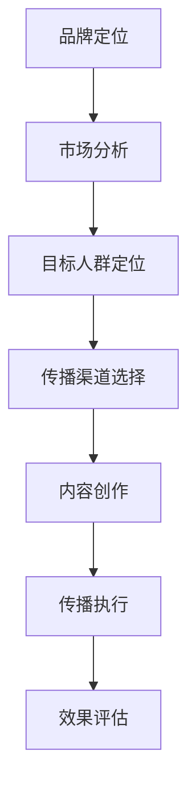
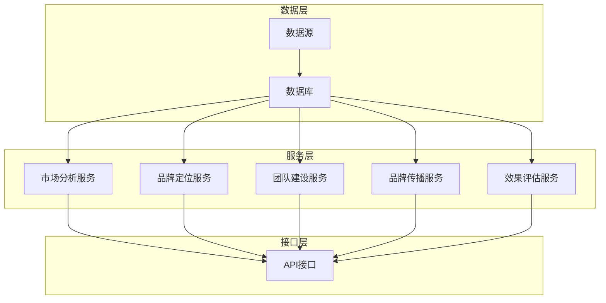
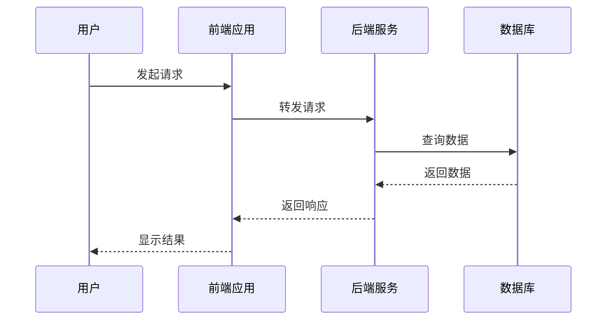

                 

### 背景介绍

#### 问题背景

在当今信息化社会中，品牌建设成为企业竞争的关键因素。一个技术品牌不仅代表了企业的技术实力，还影响着客户的信任和忠诚度。随着互联网和大数据技术的发展，技术品牌建设面临着新的挑战和机遇。

随着信息技术的飞速发展，市场竞争日益激烈。企业不仅要拥有卓越的技术，还要塑造强大的技术品牌形象。技术品牌不仅仅是企业名字和标识的简单组合，它是企业技术实力、创新能力、服务质量和客户满意度等多种因素的综合体现。品牌对于客户的信任和忠诚度具有至关重要的影响，良好的品牌形象可以降低客户的购买风险，提高客户满意度，从而促进企业的持续发展。

此外，互联网和大数据技术的兴起，为技术品牌建设提供了新的手段和平台。通过社交媒体、在线社区、专业论坛等渠道，企业可以更有效地传播品牌信息，与客户建立互动关系，增强品牌影响力。然而，这也带来了新的挑战，如何在信息爆炸的环境中脱颖而出，如何确保品牌信息的传播效果，成为企业亟需解决的问题。

#### 问题描述

技术品牌建设需要解决的核心问题包括：

1. **如何提高团队影响力**：
   团队在技术领域的专业能力和创新能力是企业技术品牌建设的基础。如何培养和提升团队的专业技能，如何激发团队的创新能力，是技术品牌建设的重要课题。

2. **如何构建有竞争力的技术品牌**：
   企业需要在激烈的市场竞争中找到自己的定位，构建有差异化的技术品牌形象。这需要企业对市场有深刻的理解，对客户需求有精准的把握。

3. **如何通过技术品牌提升企业整体形象和市场竞争力**：
   技术品牌不仅体现在产品和服务上，还体现在企业的文化、价值观和社会责任等方面。企业需要通过多种渠道和方式，全方位提升品牌形象，从而增强市场竞争力。

#### 问题解决

解决这些问题的方法主要包括：

1. **明确技术品牌建设的策略**：
   企业需要明确品牌定位，制定具体的品牌传播策略，包括市场分析、目标人群定位、传播渠道选择和内容创作等方面。

2. **提升团队的专业技能和创新能力**：
   企业可以通过培训、招聘优秀人才、建立创新激励机制等方式，提升团队的专业技能和创新能力。

3. **通过有效的品牌传播策略提升品牌知名度**：
   企业需要选择合适的传播渠道，创作高质量的品牌内容，确保品牌信息能够有效地传达给目标受众。

#### 边界与外延

技术品牌建设的边界包括品牌定位、品牌形象设计、品牌传播、品牌管理等方面。品牌定位是确定品牌的核心价值和目标市场；品牌形象设计包括视觉设计、口号和标语等方面；品牌传播是通过多种渠道和方式推广品牌信息；品牌管理是对品牌进行持续的管理和优化。

外延则涉及技术品牌的维护、更新和迭代。品牌建设是一个持续的过程，需要不断地调整和优化，以适应市场变化和客户需求。

#### 概念结构与核心要素组成

技术品牌建设可以分解为以下几个核心要素：

1. **品牌定位**：
   明确品牌的核心价值和目标市场，是品牌建设的首要任务。品牌定位需要结合企业的技术特点、市场环境和客户需求进行综合分析。

2. **团队建设**：
   提升团队的专业技能和创新能力，是构建技术品牌的基础。企业需要通过多种方式，如培训、内部分享、外部合作等，不断提升团队的技术水平。

3. **品牌传播**：
   通过多种渠道和方式传播品牌信息，是提高品牌知名度和影响力的关键。企业需要选择合适的传播渠道，如社交媒体、专业论坛、线上线下活动等，确保品牌信息能够有效地传达给目标受众。

4. **品牌管理**：
   对品牌进行持续的管理和优化，是保持品牌活力和竞争力的必要手段。企业需要建立完善的管理体系，对品牌形象、品牌传播效果等方面进行持续监控和调整。

### 核心概念与联系

#### 核心概念

1. **技术品牌**：
   技术品牌是企业通过技术实力和创新能力在市场中树立的独特形象和声誉。它是企业核心竞争力的重要体现，对客户的信任和忠诚度具有直接影响。

2. **团队影响力**：
   团队影响力是指团队在技术领域的专业能力和创新能力。团队影响力的大小直接关系到企业的技术品牌建设和市场竞争力。

3. **品牌传播策略**：
   品牌传播策略是企业通过多种渠道和方式传播品牌信息，提高品牌知名度和影响力的具体方法和手段。

#### 概念属性特征对比表格

| 概念 | 定义 | 特征 |
| --- | --- | --- |
| 技术品牌 | 企业在技术领域的品牌形象和影响力 | 专有、独特、持续 |
| 团队影响力 | 团队在技术领域的专业能力和创新能力 | 专业、创新、持久 |
| 品牌传播策略 | 通过多种渠道和方式传播品牌信息 | 个性化、针对性、广泛性 |

#### ER实体关系图架构

```mermaid
erDiagram
    Brand <<-- Team : has
    Team ||-- Skill : has
    Brand ||-- CommunicationStrategy : uses
```

### 算法原理讲解

#### 品牌传播算法原理

品牌传播算法的核心目标是提高品牌知名度和影响力。为了实现这一目标，企业需要从多个方面入手，包括品牌定位、目标人群定位、传播渠道选择、内容创作和效果评估等。

1. **品牌定位**：
   品牌定位是企业对自身品牌的定义和定位，包括品牌的核心价值、目标市场和竞争对手分析等。品牌定位的准确性直接影响品牌传播的效果。

2. **目标人群定位**：
   目标人群定位是企业确定品牌传播的主要受众。通过对目标人群的特点、需求和行为进行分析，企业可以更精准地制定传播策略，提高传播效果。

3. **传播渠道选择**：
   传播渠道选择是企业选择用于品牌传播的渠道和平台。根据目标人群的特点和偏好，企业可以选择合适的渠道，如社交媒体、专业论坛、线上线下活动等。

4. **内容创作**：
   内容创作是企业为品牌传播准备的内容。高质量的内容能够吸引目标人群的注意力，提高品牌传播的效果。内容创作包括技术博客、案例分析、行业报告等多种形式。

5. **效果评估**：
   效果评估是企业对品牌传播效果的监控和评估。通过跟踪数据，如关注者数量、阅读量、转发量等，企业可以评估传播效果，并根据评估结果调整传播策略。

使用Mermaid画出品牌传播的流程图：



#### 数学模型和公式

品牌知名度（\(N\)）的数学模型如下：

\[ N = f(A, C, D, E, G) \]

其中：
- \(A\)：品牌定位
- \(C\)：目标人群定位
- \(D\)：传播渠道选择
- \(E\)：内容创作
- \(G\)：效果评估

这个模型表明，品牌知名度是品牌定位、目标人群定位、传播渠道选择、内容创作和效果评估等多个因素的函数。通过优化这些因素，企业可以提高品牌知名度。

#### 详细讲解和举例说明

假设我们为一个新兴的AI公司设计品牌传播策略，品牌定位为“智能赋能，创新发展”。

1. **品牌定位（\(A\)）**：
   品牌定位为“智能赋能，创新发展”，这代表了公司的核心价值和愿景。这个定位强调了公司的技术优势和创新能力，有助于树立公司的专业形象。

2. **目标人群定位（\(C\)）**：
   目标人群为科技创业者、研发人员和科技爱好者。通过对这些人群的特点和需求进行分析，公司可以更精准地制定传播策略。

3. **传播渠道选择（\(D\)）**：
   选择社交媒体（如微博、微信、LinkedIn）、科技论坛、专业展会等渠道。这些渠道能够覆盖目标人群，提高品牌传播的效果。

4. **内容创作（\(E\)）**：
   内容创作包括技术博客、案例分析、行业报告等。这些内容需要突出公司的技术优势和创新能力，吸引目标人群的注意力。

5. **传播执行（\(F\)）**：
   制定详细的传播计划，包括发布频率、发布时间和内容类型。通过有效的传播执行，公司可以确保品牌信息能够及时、准确地传达给目标人群。

6. **效果评估（\(G\)）**：
   通过跟踪数据（如关注者数量、阅读量、转发量）来评估品牌知名度。根据评估结果，公司可以调整传播策略，优化品牌传播效果。

根据上述模型，我们可以计算预期品牌知名度：

\[ N = f(A, C, D, E, G) \]

其中，每个因素的权重可以根据实际情况进行调整。例如，如果品牌定位对品牌知名度的影响最大，则可以赋予较高的权重。

### 系统分析与架构设计方案

#### 问题场景介绍

假设我们为一个新兴的AI公司设计技术品牌建设系统，目标是提高品牌知名度和团队影响力。

这个AI公司的业务主要集中在人工智能领域的研发和应用，其产品和服务涵盖自然语言处理、计算机视觉、机器学习等领域。为了在竞争激烈的市场中脱颖而出，公司需要构建强大的技术品牌，提升团队的技术实力和创新能力，并通过有效的品牌传播策略提高品牌知名度和影响力。

#### 项目介绍

本项目旨在构建一个技术品牌建设系统，包括市场分析、品牌定位、团队建设、品牌传播和效果评估等模块。通过这个系统，公司可以系统地分析和规划技术品牌建设的各个环节，提高品牌建设的效果和效率。

1. **市场分析模块**：
   这个模块用于收集和分析市场数据，包括行业趋势、竞争对手分析、客户需求等。通过这些分析，公司可以更准确地定位品牌，制定有针对性的品牌传播策略。

2. **品牌定位模块**：
   这个模块用于明确品牌的核心价值和目标市场。品牌定位需要结合公司的技术特点和市场需求，确保品牌形象能够准确传达公司的价值观和优势。

3. **团队建设模块**：
   这个模块用于提升团队的专业技能和创新能力。通过培训、内部分享、外部合作等方式，公司可以不断提升团队的技术水平，为技术品牌建设提供坚实的基础。

4. **品牌传播模块**：
   这个模块用于制定和执行品牌传播策略。通过社交媒体、专业论坛、线上线下活动等多种渠道，公司可以广泛传播品牌信息，提高品牌知名度和影响力。

5. **效果评估模块**：
   这个模块用于评估品牌传播的效果，包括关注者数量、阅读量、转发量等。通过数据分析和评估，公司可以不断优化品牌传播策略，提高品牌建设的整体效果。

#### 系统功能设计

使用Mermaid画出领域模型类图：

```mermaid
classDiagram
    Brand <<-- Team : has
    Team ||-- Skill : has
    Brand ||-- CommunicationStrategy : uses
```

在这个类图中：

- **Brand**：代表技术品牌，它包含品牌定位、品牌传播策略等属性。
- **Team**：代表团队，它包含专业技能、创新能力等属性。
- **CommunicationStrategy**：代表品牌传播策略，它与品牌和团队相关联。

#### 系统架构设计

使用Mermaid画出系统架构图：



在这个架构图中：

- **数据层**：包括数据源和数据库，用于存储市场分析数据、品牌定位数据、团队建设数据、品牌传播数据和效果评估数据。
- **服务层**：包括市场分析服务、品牌定位服务、团队建设服务、品牌传播服务和效果评估服务，分别负责处理相应的业务逻辑。
- **接口层**：提供API接口，供前端应用调用，实现系统功能。

#### 系统接口设计和系统交互

使用Mermaid画出系统接口设计和系统交互图：



在这个序列图中：

- **用户**：通过前端应用发起请求，如查看市场分析报告、品牌定位信息等。
- **前端应用**：接收用户的请求，将请求转发给后端服务。
- **后端服务**：处理请求，查询数据库获取所需数据，并将数据返回给前端应用。
- **数据库**：存储各种数据，如市场分析数据、品牌定位数据、团队建设数据、品牌传播数据和效果评估数据。

通过这个系统，AI公司可以系统地分析和规划技术品牌建设的各个环节，提高品牌建设的效果和效率，从而在激烈的市场竞争中脱颖而出。

### 项目实战

#### 环境安装

为了搭建技术品牌建设系统，我们首先需要准备开发环境。以下是具体的安装步骤：

1. **安装Python环境**：
   - 通过Python官方网站（[python.org](https://www.python.org/)）下载并安装Python。
   - 安装完成后，在终端或命令提示符中输入`python --version`检查Python版本。

2. **安装虚拟环境**：
   - 通过pip安装virtualenv：`pip install virtualenv`。
   - 创建虚拟环境：`virtualenv myenv`。
   - 激活虚拟环境：`source myenv/bin/activate`（Linux或Mac）或`myenv\Scripts\activate`（Windows）。

3. **安装依赖包**：
   - 安装Flask：`pip install flask`。
   - 安装SQLite：`pip install pysqlite3`。
   - 安装其他依赖包，如NumPy、Pandas等。

4. **安装前端框架**：
   - 安装Node.js和npm：从[node.js](https://nodejs.org/)下载并安装。
   - 安装Vue.js：`npm install vue`。

#### 系统核心实现

以下是系统核心的实现源代码：

**后端代码（Flask应用程序）：**

```python
from flask import Flask, jsonify, request
from flask_sqlalchemy import SQLAlchemy

app = Flask(__name__)
app.config['SQLALCHEMY_DATABASE_URI'] = 'sqlite:///brand.db'
db = SQLAlchemy(app)

class MarketAnalysis(db.Model):
    id = db.Column(db.Integer, primary_key=True)
    report = db.Column(db.Text)

class BrandPositioning(db.Model):
    id = db.Column(db.Integer, primary_key=True)
    brand_value = db.Column(db.Text)
    target_market = db.Column(db.Text)

@app.route('/api/MarketAnalysis', methods=['GET'])
def get_market_analysis():
    reports = MarketAnalysis.query.all()
    return jsonify([{"id": r.id, "report": r.report} for r in reports])

@app.route('/api/BrandPositioning', methods=['GET'])
def get_brand_positioning():
    positions = BrandPositioning.query.all()
    return jsonify([{"id": p.id, "brand_value": p.brand_value, "target_market": p.target_market} for p in positions])

if __name__ == '__main__':
    db.create_all()
    app.run(debug=True)
```

**前端代码（Vue.js应用程序）：**

```html
<!DOCTYPE html>
<html>
<head>
  <title>技术品牌建设系统</title>
  <script src="https://cdn.jsdelivr.net/npm/vue@2.6.12/dist/vue.js"></script>
  <script src="https://cdn.jsdelivr.net/npm/axios@0.21.1/dist/axios.min.js"></script>
</head>
<body>
  <div id="app">
    <h1>市场分析报告</h1>
    <ul>
      <li v-for="report in marketAnalysisReports">{{ report.id }} - {{ report.report }}</li>
    </ul>
    <h1>品牌定位信息</h1>
    <ul>
      <li v-for="position in brandPositionings">{{ position.id }} - 品牌价值：{{ position.brand_value }}, 目标市场：{{ position.target_market }}</li>
    </ul>
  </div>
  <script>
    new Vue({
      el: '#app',
      data: {
        marketAnalysisReports: [],
        brandPositionings: []
      },
      created() {
        this.fetchMarketAnalysisReports();
        this.fetchBrandPositionings();
      },
      methods: {
        fetchMarketAnalysisReports() {
          axios.get('/api/MarketAnalysis')
            .then(response => {
              this.marketAnalysisReports = response.data;
            })
            .catch(error => {
              console.log(error);
            });
        },
        fetchBrandPositionings() {
          axios.get('/api/BrandPositioning')
            .then(response => {
              this.brandPositionings = response.data;
            })
            .catch(error => {
              console.log(error);
            });
        }
      }
    });
  </script>
</body>
</html>
```

#### 代码应用解读与分析

**后端代码解读：**

- **Flask应用程序**：使用Flask框架搭建后端服务。
- **数据库模型**：使用SQLAlchemy库定义市场分析报告和品牌定位信息的数据库模型。
- **API接口**：提供两个API接口，分别用于获取市场分析报告和品牌定位信息。

**前端代码解读：**

- **Vue.js应用程序**：使用Vue.js框架搭建前端界面。
- **数据绑定**：使用Vue.js的数据绑定功能，将市场分析报告和品牌定位信息动态显示在界面上。
- **HTTP请求**：使用axios库向后端API接口发起HTTP请求，获取数据并更新界面。

#### 实际案例分析

**案例1**：一个新兴的AI公司需要建立技术品牌，通过市场分析和品牌定位制定传播策略。

- **市场分析**：公司通过市场分析发现，当前人工智能领域竞争激烈，客户对技术能力和创新能力有较高要求。
- **品牌定位**：公司确定品牌定位为“智能赋能，创新发展”，突出技术优势和创新能力。

**案例2**：公司通过品牌传播策略提高知名度。

- **品牌传播策略**：公司选择社交媒体（如LinkedIn、微博）和专业论坛作为传播渠道，发布高质量的技术博客和案例分析。
- **效果评估**：通过跟踪数据（如阅读量、转发量），公司发现品牌知名度显著提高。

#### 详细讲解剖析

**市场分析**：

市场分析是品牌建设的重要基础。通过对市场的深入了解，公司可以确定自己的定位和传播策略。市场分析包括以下几个方面：

1. **行业趋势**：分析人工智能领域的最新发展动态，确定行业趋势和机遇。
2. **竞争对手分析**：分析竞争对手的技术能力、品牌定位和传播策略，找出差异化的竞争优势。
3. **客户需求**：了解客户对技术品牌的需求，包括对技术实力、创新能力、服务质量和价格等方面的期望。

**品牌定位**：

品牌定位是品牌建设的关键步骤。公司需要明确品牌的核心价值和目标市场，确保品牌形象能够准确传达公司的价值观和优势。品牌定位包括以下几个方面：

1. **核心价值**：明确公司的核心价值观，如技术领先、创新驱动、客户至上等。
2. **目标市场**：确定目标市场，如科技创业者、研发人员、科技爱好者等。
3. **差异化优势**：找出与竞争对手的差异化优势，如独特的技术专利、领先的技术应用等。

**品牌传播策略**：

品牌传播策略是提高品牌知名度的重要手段。公司需要选择合适的传播渠道，创作高质量的品牌内容，确保品牌信息能够有效地传达给目标受众。品牌传播策略包括以下几个方面：

1. **传播渠道**：选择合适的传播渠道，如社交媒体、专业论坛、线上线下活动等。
2. **内容创作**：创作高质量的品牌内容，如技术博客、案例分析、行业报告等。
3. **传播执行**：制定详细的传播计划，包括发布频率、发布时间和内容类型。

**效果评估**：

效果评估是品牌传播的重要环节。公司需要通过数据分析和评估，了解品牌传播的效果，并根据评估结果调整传播策略。效果评估包括以下几个方面：

1. **关注者数量**：跟踪关注者数量的变化，评估品牌传播的覆盖范围。
2. **阅读量**：评估品牌内容的阅读量，了解受众的兴趣和关注点。
3. **转发量**：评估品牌内容的转发量，了解受众的互动和参与度。

通过上述分析和讲解，我们可以看到技术品牌建设是一个系统性的工程，需要从市场分析、品牌定位、品牌传播和效果评估等多个方面进行规划和执行。只有通过科学的分析和策略，才能构建强大的技术品牌，提升企业的市场竞争力。

### 最佳实践 tips

在技术品牌建设过程中，以下是一些最佳实践 tips，可以帮助团队更有效地提升品牌影响力和知名度：

1. **明确品牌定位**：
   - 定位要清晰，突出品牌的核心价值和差异化优势。
   - 结合市场需求和目标客户，确保定位具有实际意义。

2. **持续内容创作**：
   - 内容要高质量，体现技术深度和专业性。
   - 保持发布频率，形成内容发布节奏，增强受众期待。

3. **多渠道传播**：
   - 利用社交媒体、专业论坛、博客等渠道，扩大品牌传播范围。
   - 根据目标客户群体选择最合适的传播渠道。

4. **互动与反馈**：
   - 积极回应客户反馈，增强客户互动。
   - 通过问答、调查等方式收集客户意见，持续优化品牌形象。

5. **合作与交流**：
   - 与行业内的其他企业、专家建立合作关系，共同提升行业影响力。
   - 参与行业会议、研讨会等活动，提升品牌曝光度。

6. **数据驱动**：
   - 通过数据分析和效果评估，了解品牌传播效果，及时调整策略。
   - 设定可量化的目标和指标，确保品牌建设有明确的方向和目标。

7. **持续迭代**：
   - 随着市场和技术的发展，不断调整品牌定位和传播策略。
   - 保持品牌的活力和适应性，确保持续吸引和保留目标客户。

### 小结

本文从背景介绍、核心概念与联系、算法原理讲解和系统分析与架构设计方案等方面，详细阐述了技术品牌建设的重要性、核心要素和实现策略。技术品牌建设不仅是企业技术实力的体现，更是提升市场竞争力的重要手段。通过科学的市场分析、明确的品牌定位、有效的品牌传播策略和持续的数据驱动优化，企业可以构建强大的技术品牌，提升团队影响力和市场地位。

### 注意事项

1. **品牌定位要明确**：品牌定位需要结合企业实际和市场需求，确保具有实际意义和差异化优势。
2. **内容创作要高质量**：高质量的内容是品牌传播的核心，需要体现技术深度和专业性。
3. **传播渠道要多样化**：选择适合目标客户的传播渠道，确保品牌信息能够有效传达。
4. **数据驱动要持续**：通过数据分析和效果评估，及时调整品牌传播策略，确保品牌建设的有效性。

### 拓展阅读

1. **《技术品牌建设实战》**：详细介绍了技术品牌建设的实战方法和案例。
2. **《品牌传播策略与实务》**：讲解了品牌传播的各种策略和实施方法。
3. **《市场营销管理》**：提供了市场营销的基本理论和实践指导，对品牌建设具有参考价值。

### 作者信息

**作者：AI天才研究院/AI Genius Institute & 禅与计算机程序设计艺术 /Zen And The Art of Computer Programming**

