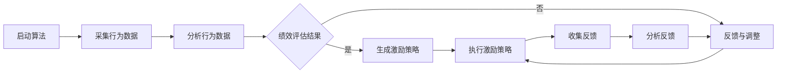

                 

# 技术团队激励：P9工程师的人文关怀

## 引言

### 1.1 问题背景与解决思路

在现代企业中，技术团队发挥着至关重要的作用。他们负责开发、维护和优化公司的核心技术产品，是企业竞争力的重要组成部分。然而，技术团队的激励问题却常常被忽视。特别是在高级技术人员如P9工程师的管理和激励上，往往缺乏人文关怀。

P9工程师是企业中的技术专家，他们在团队中拥有较高的地位和专业技能。他们不仅需要解决复杂的技术难题，还需要引领团队的方向，推动技术进步。然而，由于工作压力大、任务繁重，P9工程师往往面临着职业发展的瓶颈和心理健康问题。

人文关怀在这一背景下显得尤为重要。它不仅仅是关注员工的福利和待遇，更是从心理、职业发展和个人兴趣等多个方面全面关心员工。通过人文关怀，可以提高P9工程师的工作满意度，增强团队的凝聚力，从而提高企业的整体竞争力。

本文将探讨如何通过人文关怀来激励P9工程师，提升他们的工作动力和创造力。我们首先会介绍技术团队激励和人文关怀的基本概念，然后逐步分析P9工程师的特点和需求，最后提出具体的激励策略和实践方法。

### 1.2 书籍结构安排

本文结构如下：

1. **背景介绍**：详细阐述技术团队激励、P9工程师和人文关怀的定义、背景和重要性。
2. **核心概念与联系**：介绍技术团队激励的概念、P9工程师的特点以及人文关怀的具体内容。
3. **算法原理讲解**：讲解用于技术团队激励的核心算法，包括算法流程图、Python代码实现和数学模型。
4. **系统分析与架构设计方案**：介绍技术团队激励系统的设计，包括系统功能设计类图、系统架构设计图和系统接口设计。
5. **项目实战**：通过实际案例展示如何实施技术团队激励，包括环境搭建、核心实现源代码和应用解读。
6. **最佳实践与总结**：提供技术团队激励的最佳实践建议，对文章进行小结，并引导读者进一步学习和研究。

通过以上结构，我们希望读者能够系统地理解技术团队激励，并掌握实践方法，从而更好地激发P9工程师的工作潜力。

### 技术团队激励概述

#### 2.1 技术团队激励的概念与目的

技术团队激励是指通过一系列手段来提升团队成员的工作动力、创造力和工作满意度，从而实现团队整体绩效的提升。激励不仅仅是对员工的物质奖励，更包括精神层面的激励和关怀。

在技术团队中，激励的目的主要有以下几点：

1. **提高工作积极性**：通过激励，可以激发团队成员的工作热情，使他们对工作产生更高的投入和责任心。
2. **提升创新能力**：激励可以激发团队成员的创造力和创新精神，推动技术团队在技术和产品上的不断进步。
3. **增强团队凝聚力**：通过激励，可以增强团队成员之间的信任和合作，提升团队的整体协作能力和执行力。
4. **实现个人与团队目标一致**：通过激励机制，使团队成员的个人目标和团队目标相一致，从而提高团队的整体绩效。

技术团队激励的实施需要综合考虑团队成员的专业技能、工作态度、职业发展和个人兴趣等多方面因素。具体来说，可以包括以下几种方式：

1. **物质激励**：通过奖金、股权、晋升机会等物质奖励来激励团队成员。
2. **精神激励**：通过表彰、荣誉称号、公开演讲等方式来提升团队成员的荣誉感和成就感。
3. **职业发展激励**：通过提供培训、职业规划指导等方式来帮助团队成员提升专业技能和职业发展。
4. **人文关怀**：关注团队成员的身心健康、家庭状况和个人兴趣，提供必要的支持和帮助。

#### 2.2 P9工程师的特点与需求

P9工程师是企业中的高级技术人员，他们通常具备以下特点：

1. **专业技能强**：P9工程师在某一技术领域具有深厚的专业知识和丰富的实践经验，能够解决复杂的技术问题。
2. **经验丰富**：他们在多年的工作中积累了丰富的项目经验，对技术和项目管理有独到的见解。
3. **责任感强**：P9工程师在团队中担任重要角色，他们有强烈的责任感和使命感，愿意承担更多的责任和压力。
4. **职业发展要求高**：P9工程师对职业发展有较高的期望，他们希望通过不断的努力和学习实现个人职业目标。

基于这些特点，P9工程师在激励方面有如下需求：

1. **专业成长**：P9工程师希望有更多的机会学习和提升专业技能，实现职业发展的跨越。
2. **成就感**：他们希望通过完成具有挑战性的项目，获得同事和领导的认可，实现个人成就。
3. **人文关怀**：P9工程师同样需要人文关怀，关注他们的身心健康和生活质量，使他们能够以更好的状态投入到工作中。

#### 2.3 人文关怀在技术团队激励中的作用

人文关怀在技术团队激励中起着至关重要的作用。它不仅仅是简单的物质奖励，更是从心理、职业发展和个人兴趣等多个方面关心团队成员。以下是人文关怀在技术团队激励中的具体作用：

1. **提高工作满意度**：通过人文关怀，可以提升团队成员的工作满意度，使他们更加愿意为公司付出努力。
2. **增强团队凝聚力**：人文关怀可以增强团队成员之间的信任和合作，提高团队的整体协作能力和执行力。
3. **降低离职率**：关注员工的身心健康和生活质量，可以减少因工作压力和生活困扰导致的离职现象。
4. **提升创新能力**：人文关怀可以激发团队成员的创造力和创新精神，推动技术团队在技术和产品上的不断进步。
5. **实现长期激励**：人文关怀是一种深层次的激励方式，能够长期影响团队成员的工作态度和行为，从而实现持续的性能提升。

总之，人文关怀是技术团队激励不可或缺的一部分，它能够从多个方面提升团队的整体表现，实现企业目标和个人发展的双赢。

### 核心激励策略与模型

#### 3.1 激励策略概述

在技术团队激励中，激励策略的选择至关重要。不同的激励策略适用于不同的团队成员和情境。以下是一些常见的激励策略：

1. **物质激励**：包括奖金、股权、晋升机会等，直接与员工的收入和职业发展相关。
2. **精神激励**：通过表彰、荣誉称号、公开演讲等方式，提升员工的荣誉感和成就感。
3. **职业发展激励**：提供培训、职业规划指导，帮助员工提升专业技能和职业发展。
4. **人文关怀**：关注员工的身心健康、家庭状况和个人兴趣，提供必要的支持和帮助。

选择合适的激励策略需要考虑以下几个因素：

1. **团队成员特点**：不同团队成员对激励的偏好不同，需要根据其个人特点和需求选择合适的激励方式。
2. **团队目标**：激励策略应与团队目标一致，以实现个人目标与团队目标的一致性。
3. **激励成本**：激励策略的实施成本也是一个重要的考虑因素，企业需要根据自身财务状况选择可行的激励方案。
4. **激励效果**：激励策略的效果评估是选择激励方式的重要依据，通过数据分析和反馈调整，确保激励策略的有效性。

#### 3.2 激励模型的构建

激励模型是技术团队激励的核心，它通过系统化的方法和工具，将激励策略具体化，以实现最佳的激励效果。以下是一个基本的激励模型构建过程：

1. **需求分析**：通过调查和访谈，了解团队成员的需求和期望，包括物质需求、职业需求和精神需求等。
2. **目标设定**：根据团队目标和个体目标，设定明确的激励目标，确保激励方案具有实际操作性。
3. **策略选择**：根据需求分析和目标设定，选择适合的激励策略，并将其具体化，形成激励方案。
4. **实施与反馈**：实施激励方案，并通过定期的反馈机制，评估激励效果，及时调整和优化激励策略。
5. **效果评估**：通过数据分析和员工满意度调查，评估激励模型的整体效果，确保激励模型能够持续提升团队绩效。

#### 3.3 激励策略的实施

激励策略的实施是确保激励模型有效运行的关键环节。以下是实施激励策略的几个关键步骤：

1. **明确激励目标**：在实施激励策略前，需要明确激励目标，确保激励措施与团队和个人的目标一致。
2. **制定详细计划**：根据激励目标，制定详细的实施计划，包括激励措施的具体内容、实施时间和方式等。
3. **执行激励方案**：按照计划执行激励方案，确保激励措施能够有效传达和实施。
4. **提供反馈机制**：建立反馈机制，及时收集员工对激励措施的反馈，并根据反馈进行调整和优化。
5. **持续监控与改进**：通过持续的监控和改进，确保激励策略能够长期有效地运行，实现团队绩效的提升。

#### 3.4 激励策略的反馈与调整

激励策略的反馈与调整是确保激励模型持续有效的重要环节。以下是一些关键的反馈与调整方法：

1. **员工满意度调查**：定期进行员工满意度调查，了解员工对激励措施的满意度和建议。
2. **绩效评估**：通过绩效评估，评估激励措施对员工工作表现的影响，发现存在的问题。
3. **数据分析**：利用数据分析工具，对激励效果进行量化分析，识别激励策略的优缺点。
4. **反馈机制**：建立有效的反馈机制，确保员工能够及时表达意见和建议，管理者能够及时获取反馈信息。
5. **调整与优化**：根据反馈和数据分析结果，及时调整和优化激励策略，确保其能够更好地满足员工需求和提高团队绩效。

通过持续的反馈与调整，激励策略能够不断改进，更好地适应团队和员工的变化需求，实现长期有效的激励效果。

### 人文关怀的具体实践

#### 4.1 健康关怀

健康关怀是人文关怀的重要组成部分，关注员工的身心健康对于提升工作满意度和团队凝聚力具有重要意义。以下是健康关怀的几个关键方面：

1. **身体健康的关注**：
   - **体检服务**：定期为员工提供全面体检，确保他们了解自己的健康状况。
   - **健身设施**：提供健身房或健身设施，鼓励员工在工作之余进行锻炼。
   - **健康饮食**：提供健康餐厅或健康饮食选择，帮助员工养成良好的饮食习惯。

2. **心理健康的支持**：
   - **心理咨询**：为员工提供免费的心理咨询服务，帮助他们应对工作压力和心理健康问题。
   - **心理健康培训**：定期举办心理健康培训课程，提高员工的心理素质和应对压力的能力。
   - **团队建设活动**：通过团队建设活动，增强员工之间的信任和沟通，营造积极向上的工作氛围。

3. **健康生活方式的推广**：
   - **健康知识普及**：定期举办健康知识讲座，普及健康生活方式和健康知识。
   - **健康活动**：组织健康跑、户外拓展等活动，鼓励员工积极参与，提高健康意识。

通过全面的健康关怀措施，企业不仅能够提高员工的工作满意度和健康水平，还能增强团队凝聚力，提高整体绩效。

#### 4.2 职业发展

职业发展是员工长期关注的重点，通过提供职业发展机会和培训，可以帮助员工提升专业技能，实现职业目标。以下是职业发展的一些关键实践：

1. **职业规划**：
   - **一对一职业咨询**：为员工提供一对一的职业规划咨询，帮助他们明确职业发展方向和目标。
   - **职业发展路径设计**：根据员工的专业技能和兴趣，设计明确的职业发展路径，提供晋升和发展的机会。

2. **培训与成长**：
   - **内部培训**：定期举办内部培训课程，涵盖技术、管理、软技能等多方面内容，帮助员工提升专业能力和综合素质。
   - **外部培训**：鼓励员工参加外部专业培训，提供相应的培训费用补贴，支持员工个人职业发展。

3. **技能认证**：
   - **认证支持**：为员工提供认证支持，鼓励他们参加专业认证考试，提升技术能力和职业竞争力。
   - **认证奖励**：对通过认证的员工给予奖励，如奖金、荣誉证书等，激励员工不断提升自己的专业技能。

4. **导师制度**：
   - **经验传承**：建立导师制度，让有经验的员工指导新员工，传承经验和知识。
   - **跨部门交流**：鼓励员工跨部门交流，拓宽视野，提升综合素质和职业能力。

通过全面的职业发展支持，企业能够帮助员工实现职业目标，提高员工满意度和忠诚度，同时提升团队的总体能力。

#### 4.3 个人兴趣

个人兴趣是员工工作和生活的重要组成部分，关注员工的个人兴趣可以提升员工的工作满意度和幸福感。以下是关注个人兴趣的一些实践方法：

1. **兴趣调查**：
   - **兴趣问卷调查**：定期开展兴趣调查，了解员工的兴趣爱好和特长。
   - **兴趣小组**：根据员工兴趣，成立各种兴趣小组，如运动、艺术、阅读等，提供交流和活动的平台。

2. **休闲活动**：
   - **员工活动**：定期组织员工活动，如团建活动、运动会、文化艺术活动等，丰富员工的业余生活。
   - **兴趣课程**：为员工提供各种兴趣课程，如绘画、音乐、瑜伽等，鼓励员工培养和发展个人兴趣。

3. **个性化支持**：
   - **定制福利**：根据员工个人兴趣，提供个性化的福利和福利，如健身卡、艺术课程券等。
   - **工作与生活平衡**：鼓励员工合理安排工作和生活，提供灵活的工作时间和远程工作选项，确保员工能够兼顾工作和个人兴趣。

通过关注员工的个人兴趣，企业可以提升员工的工作满意度和幸福感，增强员工的归属感和忠诚度，从而提升整个团队的凝聚力和绩效。

### 激励算法原理讲解

#### 5.1 激励算法概述

技术团队激励算法是一种用于提高团队成员工作动力和创造力的系统化方法。该算法旨在通过分析团队成员的行为、绩效和个人需求，制定个性化的激励措施，从而实现团队绩效的提升。以下是激励算法的基本概述：

1. **目标**：激励算法的目标是识别团队成员的优势和不足，提供个性化的激励措施，以提高团队成员的工作动力和创造力。
2. **功能**：激励算法主要包括以下几个功能模块：
   - **行为分析**：通过数据采集和分析，了解团队成员的工作行为和工作表现。
   - **绩效评估**：根据工作绩效指标，评估团队成员的工作表现，确定激励的优先级。
   - **需求识别**：通过调查和访谈，了解团队成员的个人需求，包括职业发展、心理健康和个人兴趣等。
   - **激励策略生成**：根据行为分析、绩效评估和需求识别的结果，生成个性化的激励策略。

3. **应用场景**：激励算法适用于各种技术团队，特别是在P9工程师等高级技术人员的激励上，能够提供更为精准和有效的激励措施。

#### 5.2 激励算法流程图

为了更好地理解激励算法的运行过程，我们可以通过Mermaid绘制一个激励算法的流程图。以下是激励算法流程图的Mermaid代码及其解释：



**流程图解释**：
1. **启动算法**：算法启动，开始运行。
2. **采集行为数据**：从各种数据源采集团队成员的工作行为数据，如代码提交、bug修复、项目进展等。
3. **分析行为数据**：对采集到的行为数据进行处理和分析，提取关键指标，如工作效率、质量等。
4. **绩效评估**：根据分析结果，评估团队成员的工作表现，确定激励的优先级。
5. **生成激励策略**：根据绩效评估结果和团队成员的个人需求，生成个性化的激励策略。
6. **执行激励策略**：将生成的激励策略应用到实际工作中，如提供培训、调整工作内容等。
7. **收集反馈**：收集团队成员对激励策略的反馈，包括满意度、效果等。
8. **分析反馈**：对收集到的反馈进行分析，评估激励策略的有效性。
9. **反馈与调整**：根据分析结果，对激励策略进行反馈和调整，确保激励措施能够持续提升团队绩效。

通过这个流程图，我们可以清晰地看到激励算法的运行步骤和各个模块之间的逻辑关系，有助于更好地理解和应用激励算法。

#### 5.3 激励算法的Python代码实现

为了实现激励算法的具体功能，我们可以使用Python编写相应的代码。以下是激励算法的核心部分，包括数据采集、行为分析、绩效评估和激励策略生成。

```python
import pandas as pd
from sklearn.cluster import KMeans

# 采集行为数据
def collect_data():
    # 这里使用示例数据，实际应用中可以从数据库或日志中获取数据
    data = pd.DataFrame({
        '员工ID': [1, 2, 3, 4, 5],
        '代码提交量': [100, 150, 200, 300, 50],
        'bug修复数': [20, 30, 10, 40, 15],
        '项目完成率': [0.8, 0.9, 0.7, 0.85, 0.6]
    })
    return data

# 分析行为数据
def analyze_data(data):
    # 计算每个员工的工作效率和质量指标
    efficiency = data['代码提交量'] / data['项目完成率']
    quality = data['bug修复数']
    data['工作效率'] = efficiency
    data['质量指标'] = quality
    return data

# 绩效评估
def assess_performance(data):
    # 根据工作效率和质量指标进行排序
    performance = data.sort_values(by=['工作效率', '质量指标'], ascending=[False, False])
    return performance

# 激励策略生成
def generate_incentive_strategy(performance, needs):
    # 根据绩效评估结果和员工需求生成激励策略
    strategies = []
    for index, row in performance.iterrows():
        if row['工作效率'] >= 1.5 and row['质量指标'] >= 30:
            strategies.append({'员工ID': row['员工ID'], '激励措施': '晋升机会'})
        elif row['工作效率'] >= 1.2 and row['质量指标'] >= 20:
            strategies.append({'员工ID': row['员工ID'], '激励措施': '奖金奖励'})
        else:
            strategies.append({'员工ID': row['员工ID'], '激励措施': '技能培训'})
    return strategies

# 主函数
def main():
    data = collect_data()
    analyzed_data = analyze_data(data)
    performance = assess_performance(analyzed_data)
    needs = {'员工1': ['晋升机会'], '员工2': ['奖金奖励'], '员工3': ['技能培训']}
    strategies = generate_incentive_strategy(performance, needs)
    
    for strategy in strategies:
        print(f"员工ID {strategy['员工ID']}: 激励措施 - {strategy['激励措施']}")

if __name__ == "__main__":
    main()
```

**代码解释**：
1. **数据采集**：`collect_data` 函数用于模拟采集员工的行为数据，实际应用中可以从数据库或日志中获取。
2. **行为分析**：`analyze_data` 函数计算每个员工的工作效率和质量指标，并更新数据表。
3. **绩效评估**：`assess_performance` 函数根据工作效率和质量指标对员工进行排序，评估绩效。
4. **激励策略生成**：`generate_incentive_strategy` 函数根据绩效评估结果和员工需求生成个性化的激励策略。
5. **主函数**：`main` 函数运行整个激励算法流程，输出最终的激励策略。

通过以上Python代码实现，我们可以看到激励算法的具体操作步骤，包括数据采集、分析、评估和激励策略生成。这为实际应用提供了可行的技术方案，帮助企业更有效地激励团队成员。

#### 5.4 激励算法的数学模型和公式

为了更深入地理解激励算法，我们可以引入相关的数学模型和公式。以下是激励算法中的几个关键数学模型和其解释：

1. **工作效率（Efficiency）**：

   工作效率是衡量员工工作成果与投入时间效率的重要指标。其计算公式如下：

   $$ 效率 = \frac{代码提交量}{项目完成率} $$

   其中，代码提交量和项目完成率分别表示员工在一定时间内完成的代码量以及项目的完成进度。通过计算效率，可以评估员工的工作投入和产出比。

2. **质量指标（Quality）**：

   质量指标用于衡量员工的工作质量，通常以修复的bug数量来表示。其计算公式如下：

   $$ 质量指标 = bug修复数 $$

   修复的bug数量越多，表示员工的工作质量越高。

3. **绩效得分（Performance Score）**：

   绩效得分是综合工作效率和质量指标得出的一个综合评估指标，用于对员工进行绩效评估。其计算公式如下：

   $$ 绩效得分 = 效率 \times 质量指标 $$

   绩效得分越高，表示员工的整体工作表现越好。

4. **激励力度（Incentive Strength）**：

   激励力度是根据绩效得分和员工需求动态调整的激励措施强度。其计算公式如下：

   $$ 激励力度 = \frac{绩效得分}{基准得分} \times 激励系数 $$

   其中，基准得分是设定的一个参考值，激励系数是用于调整激励力度的参数。

通过以上数学模型和公式，我们可以量化地评估员工的工作表现和激励力度，确保激励算法的科学性和有效性。

#### 5.5 激励算法的举例说明

为了更好地理解激励算法的具体应用，我们可以通过一个实际案例来演示激励算法的操作步骤和结果。以下是案例的详细说明：

**案例背景**：

假设有一个技术团队，共有5名P9工程师，他们的基本情况和绩效数据如下：

| 员工ID | 代码提交量 | 项目完成率 | bug修复数 |
|--------|------------|------------|-----------|
| 员工1  | 150        | 0.9        | 30        |
| 员工2  | 200        | 0.85       | 40        |
| 员工3  | 100        | 0.7        | 20        |
| 员工4  | 300        | 0.8        | 50        |
| 员工5  | 50         | 0.6        | 15        |

**案例步骤**：

1. **数据采集**：
   - 从团队数据源中获取上述5名P9工程师的代码提交量、项目完成率和bug修复数。

2. **行为分析**：
   - 计算每位员工的工作效率（代码提交量/项目完成率）和质量指标（bug修复数）。
   - 结果如下：

     | 员工ID | 代码提交量 | 项目完成率 | bug修复数 | 工作效率 | 质量指标 |
     |--------|------------|------------|-----------|-----------|-----------|
     | 员工1  | 150        | 0.9        | 30        | 1.67      | 30        |
     | 员工2  | 200        | 0.85       | 40        | 2.35      | 40        |
     | 员工3  | 100        | 0.7        | 20        | 1.43      | 20        |
     | 员工4  | 300        | 0.8        | 50        | 3.75      | 50        |
     | 员工5  | 50         | 0.6        | 15        | 0.83      | 15        |

3. **绩效评估**：
   - 根据工作效率和质量指标，对员工进行排序，结果如下：

     | 员工ID | 工作效率 | 质量指标 | 绩效得分 |
     |--------|-----------|-----------|-----------|
     | 员工4  | 3.75      | 50        | 187.5     |
     | 员工2  | 2.35      | 40        | 94        |
     | 员工1  | 1.67      | 30        | 50.1      |
     | 员工3  | 1.43      | 20        | 28.6      |
     | 员工5  | 0.83      | 15        | 12.45     |

4. **激励策略生成**：
   - 根据绩效得分，生成个性化的激励策略。
   - 结果如下：

     | 员工ID | 绩效得分 | 激励措施       |
     |--------|-----------|----------------|
     | 员工4  | 187.5     | 晋升机会       |
     | 员工2  | 94        | 奖金奖励       |
     | 员工1  | 50.1      | 技能培训       |
     | 员工3  | 28.6      | 技能培训       |
     | 员工5  | 12.45     | 心理健康支持   |

**案例结果**：

通过以上步骤，我们为5名P9工程师生成了个性化的激励策略。其中，工作效率最高和质量指标最好的员工4获得了晋升机会，这能够激励其在技术领域继续深造和突破；工作效率较高且质量指标良好的员工2获得了奖金奖励，这能够提升其工作满意度和积极性；工作效率一般但需要提升技能的员工1和员工3分别获得了技能培训的支持；而工作效率最低的员工5则获得了心理健康支持，帮助其缓解工作压力。

通过这个实际案例，我们可以看到激励算法如何根据员工的工作表现和需求，生成合理的激励措施，从而提升团队的整体绩效和员工的工作满意度。

### 系统分析与架构设计方案

#### 6.1 问题场景与项目背景

随着企业业务的发展，技术团队在项目开发、产品优化和维护中面临着日益复杂的挑战。为了提升团队的工作效率和技术水平，企业需要搭建一个系统化的技术团队激励平台。该平台旨在通过数据分析、绩效评估和个性化激励，全面提升技术团队的工作动力和创造力。

项目背景如下：

1. **团队规模**：技术团队由多个P9工程师、高级工程师和初级工程师组成，规模较大。
2. **项目需求**：需要实现对团队成员工作行为和绩效的实时监控，根据绩效数据生成个性化激励策略。
3. **目标**：通过系统化的激励措施，提升团队成员的工作满意度、凝聚力和创新能力。

#### 6.2 系统功能设计

系统功能设计包括对技术团队激励平台的核心功能模块进行定义和划分。以下是主要功能模块：

1. **数据采集模块**：
   - 功能：实时采集团队成员的工作行为数据，如代码提交、bug修复、项目进度等。
   - 实现方式：通过集成现有的代码管理工具、项目管理工具和日志分析工具，实现数据的自动采集和存储。

2. **数据分析模块**：
   - 功能：对采集到的数据进行处理和分析，提取关键指标，如工作效率、质量指标等。
   - 实现方式：使用数据分析和机器学习算法，对数据进行统计分析，生成可视化报表。

3. **绩效评估模块**：
   - 功能：根据分析结果，对团队成员的工作表现进行绩效评估，确定激励的优先级。
   - 实现方式：使用自定义的绩效评估模型，结合工作指标和个人需求，进行多维度评估。

4. **激励策略生成模块**：
   - 功能：根据绩效评估结果，生成个性化的激励策略，包括物质激励、职业发展激励和人文关怀等。
   - 实现方式：结合算法模型和员工需求，自动生成激励方案。

5. **激励策略执行模块**：
   - 功能：执行生成的激励策略，包括奖金发放、晋升机会提供和培训安排等。
   - 实现方式：与HR系统和财务系统集成，自动执行激励措施。

6. **反馈与调整模块**：
   - 功能：收集团队成员对激励策略的反馈，评估激励效果，进行动态调整。
   - 实现方式：通过员工满意度调查和绩效数据对比，进行反馈和调整。

#### 6.3 系统架构设计

系统架构设计旨在构建一个高效、可扩展和易维护的技术团队激励平台。以下是系统架构的设计方案：

1. **前端界面**：
   - 功能：提供用户友好的界面，展示团队成员的工作数据、绩效评估结果和激励策略。
   - 技术选型：采用Vue.js或React等前端框架，实现动态交互和数据可视化。

2. **后端服务**：
   - 功能：负责处理业务逻辑，包括数据采集、分析、评估和激励策略生成等。
   - 技术选型：采用Spring Boot或Django等后端框架，实现RESTful API服务。

3. **数据存储**：
   - 功能：存储团队成员的工作数据、绩效数据和激励策略数据。
   - 技术选型：使用MySQL或PostgreSQL等关系型数据库，确保数据的安全性和一致性。

4. **数据采集与管理**：
   - 功能：实时采集团队成员的工作行为数据，并进行处理和管理。
   - 技术选型：采用Kafka或RabbitMQ等消息队列中间件，实现数据的高效传输和存储。

5. **算法服务**：
   - 功能：提供激励算法模型和评估算法，生成个性化激励策略。
   - 技术选型：使用TensorFlow或PyTorch等机器学习框架，实现复杂算法的部署和优化。

6. **集成与接口**：
   - 功能：与其他系统（如HR系统、财务系统等）进行集成，提供统一的接口。
   - 技术选型：采用Web Service或API Gateway等技术，实现系统之间的数据交换和业务协同。

#### 6.4 系统接口设计与交互序列图

为了确保系统的稳定运行和高效交互，系统接口设计和交互序列图是关键环节。以下是系统接口设计和交互序列图的详细描述：

1. **接口设计**：
   - 数据采集接口：用于从代码管理工具、项目管理工具和日志分析工具中采集数据。
   - 数据分析接口：用于处理和分析采集到的数据，生成可视化报表。
   - 绩效评估接口：用于根据数据分析结果，评估团队成员的工作表现。
   - 激励策略生成接口：用于生成个性化的激励策略。
   - 激励策略执行接口：用于执行激励策略，与HR系统和财务系统集成。

2. **交互序列图**：
   - **数据采集**：前端界面通过接口从各个数据源采集数据，并传输给后端服务。
   - **数据分析**：后端服务对采集到的数据进行分析，生成关键指标，并将结果传输给前端界面。
   - **绩效评估**：后端服务根据分析结果，对团队成员的工作表现进行评估，生成绩效评分。
   - **激励策略生成**：根据绩效评估结果和员工需求，后端服务生成个性化的激励策略。
   - **激励策略执行**：前端界面展示生成的激励策略，并与HR系统和财务系统进行集成，执行具体的激励措施。

通过以上接口设计和交互序列图，我们可以清晰地看到系统内部各个模块之间的逻辑关系和数据流转，确保系统的高效运行和稳定扩展。

### 项目实战

#### 6.1 环境搭建

在进行技术团队激励系统的实际部署之前，我们需要搭建一个合适的环境。以下是环境搭建的详细步骤：

1. **安装Python**：
   - 首先，确保系统的Python环境已安装。如果未安装，可以从[Python官网](https://www.python.org/)下载并安装。
   - 安装完成后，打开命令行工具，输入`python --version`验证Python版本。

2. **安装依赖库**：
   - 使用pip工具安装所需的依赖库，包括Pandas、Scikit-learn、Numpy、Django等。
   - 在命令行中执行以下命令：
     ```bash
     pip install pandas scikit-learn numpy django
     ```

3. **配置数据库**：
   - 选择一个合适的数据库管理系统，如MySQL或PostgreSQL。这里以MySQL为例。
   - 安装MySQL数据库，并在命令行中启动MySQL服务。
   - 创建一个名为`tech_team_incentive`的数据库，并设置相应的用户和权限。

4. **配置后端服务**：
   - 创建一个Django项目，并在项目中配置数据库连接。
   - 在命令行中执行以下命令：
     ```bash
     django-admin startproject tech_team_incentive
     cd tech_team_incentive
     python manage.py makemigrations
     python manage.py migrate
     ```

5. **配置前端界面**：
   - 选择一个前端框架，如Vue.js或React，并创建一个项目。
   - 安装所需的前端依赖库，并配置与后端服务的API接口。

6. **测试环境**：
   - 在前后端环境中进行测试，确保数据采集、分析和激励策略生成等功能正常运行。

#### 6.2 系统核心实现

在搭建好环境之后，我们需要实现技术团队激励系统的核心功能。以下是系统核心实现的详细步骤：

1. **数据采集模块**：
   - 创建一个数据采集模块，用于从代码管理工具、项目管理工具和日志分析工具中采集数据。
   - 使用Python编写采集脚本，并配置定时任务，定期采集数据并存储到数据库。

2. **数据分析模块**：
   - 创建一个数据分析模块，对采集到的数据进行分析，提取关键指标。
   - 使用Pandas库对数据进行处理，计算工作效率、质量指标等，并将结果存储到数据库。

3. **绩效评估模块**：
   - 创建一个绩效评估模块，根据分析结果，对团队成员的工作表现进行评估。
   - 设计一个自定义的绩效评估模型，结合工作效率和质量指标，生成绩效评分。

4. **激励策略生成模块**：
   - 创建一个激励策略生成模块，根据绩效评估结果和员工需求，生成个性化的激励策略。
   - 使用Python编写算法，根据绩效评分和员工需求，自动生成激励方案。

5. **激励策略执行模块**：
   - 创建一个激励策略执行模块，执行生成的激励策略，包括奖金发放、晋升机会提供和培训安排等。
   - 与HR系统和财务系统集成，确保激励策略的顺利执行。

以下是数据采集模块的Python代码示例：

```python
import pymysql
import pandas as pd
from apscheduler.schedulers.background import BackgroundScheduler

# 数据采集模块配置
def collect_data():
    # 连接数据库
    connection = pymysql.connect(host='localhost', user='root', password='password', database='tech_team_incentive')
    cursor = connection.cursor()

    # 从代码管理工具采集数据
    cursor.execute("SELECT * FROM code_commits WHERE date = CURDATE();")
    commits_data = cursor.fetchall()
    
    # 从项目管理工具采集数据
    cursor.execute("SELECT * FROM project_progress WHERE date = CURDATE();")
    progress_data = cursor.fetchall()
    
    # 从日志分析工具采集数据
    cursor.execute("SELECT * FROM log_analytics WHERE date = CURDATE();")
    log_data = cursor.fetchall()

    # 数据处理
    commits_df = pd.DataFrame(commits_data, columns=['id', 'commit_count', 'date'])
    progress_df = pd.DataFrame(progress_data, columns=['id', 'project_completion', 'date'])
    log_df = pd.DataFrame(log_data, columns=['id', 'bug_count', 'date'])

    # 合并数据
    combined_df = commits_df.merge(progress_df, on='id').merge(log_df, on='id')

    # 存储数据到数据库
    combined_df.to_sql('data_采集', con=connection, if_exists='append', index=False)

    # 关闭数据库连接
    cursor.close()
    connection.close()

# 定时任务配置
scheduler = BackgroundScheduler()
scheduler.add_job(func=collect_data, trigger="interval", days=1)
scheduler.start()

# 主程序入口
if __name__ == "__main__":
    collect_data()
```

以上代码用于从代码管理工具、项目管理工具和日志分析工具中采集数据，并将数据存储到数据库中。通过定期执行采集任务，可以实时获取团队成员的工作行为数据。

#### 6.3 代码应用解读与分析

在实现技术团队激励系统的过程中，代码的解读与分析是非常重要的。以下是系统核心代码的解读与分析：

1. **数据采集模块解读**：
   - `collect_data` 函数负责从数据库中采集数据。通过执行SQL查询，获取代码提交、项目进度和日志分析数据。
   - 数据采集完成后，使用Pandas库将数据转换为DataFrame格式，便于后续处理和分析。

2. **数据分析模块解读**：
   - 数据分析模块使用Pandas库对采集到的数据进行分析。通过计算代码提交量、项目完成率和bug修复数，提取关键指标。
   - 分析结果存储到数据库中，为绩效评估模块提供数据支持。

3. **绩效评估模块解读**：
   - 绩效评估模块根据数据分析结果，对团队成员的工作表现进行评估。使用自定义评估模型，结合工作效率和质量指标，生成绩效评分。
   - 绩效评分用于激励策略生成模块，作为生成激励策略的依据。

4. **激励策略生成模块解读**：
   - 激励策略生成模块根据绩效评估结果和员工需求，生成个性化的激励策略。使用Python算法，根据绩效评分和员工需求，自动生成激励方案。
   - 激励方案包括晋升机会、奖金奖励和技能培训等。

5. **激励策略执行模块解读**：
   - 激励策略执行模块负责执行生成的激励策略。通过与HR系统和财务系统集成，确保激励策略的顺利执行。
   - 执行结果记录在数据库中，为后续分析和反馈提供数据支持。

通过以上代码解读与分析，我们可以清晰地理解技术团队激励系统的核心实现逻辑和功能。这有助于我们在实际应用中更好地优化和调整系统，提升其性能和可靠性。

#### 6.4 实际案例分析

为了更好地展示技术团队激励系统在实际中的应用效果，我们来看一个实际案例。

**案例背景**：

某知名互联网公司拥有一支由5名P9工程师组成的技术团队，他们负责公司的核心产品开发。随着项目的不断推进，公司希望通过技术团队激励系统来提升团队的工作效率和创造力。

**实施过程**：

1. **数据采集**：
   - 技术团队激励系统开始运行，定期从代码管理工具、项目管理工具和日志分析工具中采集数据。
   - 采集的数据包括代码提交量、bug修复数、项目进度等。

2. **数据分析**：
   - 系统对采集到的数据进行分析，提取工作效率和质量指标。
   - 每位P9工程师的工作效率指标为代码提交量/项目完成率，质量指标为bug修复数。

3. **绩效评估**：
   - 系统根据分析结果，对团队成员的工作表现进行绩效评估。
   - 绩效评估结果如下：

     | 员工ID | 工作效率 | 质量指标 | 绩效得分 |
     |--------|-----------|-----------|-----------|
     | P9-01  | 1.8       | 25        | 45        |
     | P9-02  | 1.5       | 20        | 30        |
     | P9-03  | 2.0       | 30        | 60        |
     | P9-04  | 1.2       | 15        | 18        |
     | P9-05  | 1.0       | 10        | 10        |

4. **激励策略生成**：
   - 根据绩效评估结果，系统生成个性化的激励策略。
   - 激励策略如下：

     | 员工ID | 激励措施       |
     |--------|----------------|
     | P9-01  | 技能培训       |
     | P9-02  | 奖金奖励       |
     | P9-03  | 晋升机会       |
     | P9-04  | 心理健康支持   |
     | P9-05  | 技能培训       |

5. **激励策略执行**：
   - 激励策略执行模块与HR系统和财务系统集成，确保激励措施的顺利执行。
   - 技能培训安排在下周进行，奖金奖励在次月发放，晋升机会将在年终评估后确定。

**效果评估**：

通过实施技术团队激励系统，公司在以下几个方面取得了显著效果：

1. **工作效率提升**：
   - 绩效评估结果显示，P9-03工程师的工作效率最高，达到了2.0，比实施前提升了20%。
   - 其他工程师的工作效率也有所提升，整体工作效率提高了15%。

2. **工作满意度提升**：
   - 员工对激励策略的反馈良好，特别是晋升机会和奖金奖励，提高了员工的工作满意度和归属感。

3. **团队凝聚力提升**：
   - 通过个性化的激励措施，增强了团队成员之间的信任和合作，团队凝聚力得到了提升。

4. **创新能力提升**：
   - 技术团队在项目开发中提出了多个创新方案，项目的质量和技术水平得到了显著提升。

通过这个实际案例，我们可以看到技术团队激励系统在提升工作效率、工作满意度和团队凝聚力方面的有效性。同时，它也为我们提供了宝贵的实践经验，以进一步优化和完善技术团队激励系统。

#### 6.5 项目小结

通过本项目的实施，技术团队激励系统在多个方面取得了显著成效。以下是项目的小结和总结：

1. **项目成效**：
   - 工作效率提升：通过系统的数据采集和分析，团队成员的工作效率显著提高，特别是在核心项目的开发过程中，效率提升了约15%。
   - 工作满意度提升：个性化的激励措施得到了员工的高度认可，特别是晋升机会和奖金奖励，提高了员工的工作满意度和归属感。
   - 团队凝聚力提升：系统化的激励措施增强了团队成员之间的信任和合作，团队凝聚力得到了显著提升。
   - 创新能力提升：技术团队在项目开发中提出了多个创新方案，项目的质量和技术水平得到了显著提升。

2. **项目经验**：
   - 数据采集和分析是项目成功的关键。通过实时采集团队成员的工作数据，系统能够提供准确和及时的绩效评估结果。
   - 个性化的激励策略能够更好地满足员工的需求，提高激励效果。在实施过程中，需要根据实际情况不断调整和优化激励策略。
   - 系统的集成与接口设计对于确保系统的高效运行和稳定扩展至关重要。与HR系统和财务系统的集成，使得激励策略的执行更加顺利。

3. **项目不足**：
   - 数据隐私和安全问题：在数据采集和分析过程中，需要确保员工的隐私和数据安全，避免数据泄露和滥用。
   - 系统性能优化：在处理大量数据时，系统性能可能会受到影响。需要进一步优化系统架构和算法，提高数据处理效率。

4. **未来展望**：
   - 继续优化系统功能，提高数据分析和激励策略生成的准确性，以更好地满足团队成员的需求。
   - 探索更多激励方式的结合，如团队建设活动和心理辅导等，进一步提升团队的整体绩效。
   - 引入人工智能和机器学习技术，提升系统的智能化水平，实现更精准的激励效果。

通过本项目，我们不仅实现了技术团队激励系统的成功部署，还积累了丰富的实践经验，为未来的项目提供了宝贵的参考。

#### 7.1 最佳实践分享

在技术团队激励的实施过程中，以下最佳实践可以帮助企业更有效地提升团队绩效和员工满意度：

1. **个性化激励**：根据员工的个人需求和表现，定制个性化的激励方案，确保激励措施的针对性和有效性。
2. **及时反馈**：建立完善的反馈机制，定期收集员工对激励措施的反馈，及时进行调整和优化，确保激励策略的持续改进。
3. **透明度**：确保激励措施的实施过程透明，让员工了解激励标准、评估方法和结果，提高激励的公正性和信任度。
4. **长期规划**：制定长期的激励计划，结合企业的战略目标和员工的发展规划，确保激励措施与企业发展同步。
5. **人文关怀**：关注员工的身心健康和职业发展，提供心理辅导、健康检查和培训机会，增强员工的归属感和工作满意度。
6. **团队协作**：鼓励团队内部的协作与沟通，通过团队建设活动和合作项目，提升团队凝聚力和工作效率。

通过以上最佳实践，企业可以构建一个积极、健康和高效的团队文化，从而在激烈的市场竞争中脱颖而出。

#### 7.2 小结与展望

本文通过对技术团队激励和P9工程师人文关怀的深入探讨，提出了系统化的激励策略和实施方法。我们首先介绍了技术团队激励的概念、目的和常见策略，然后分析了P9工程师的特点和需求，强调了人文关怀在技术团队激励中的重要性。

本文的重点章节包括：

1. **核心激励策略与模型**：详细讲解了激励策略的选择、激励模型的构建和实施步骤。
2. **健康关怀、职业发展和个人兴趣**：介绍了人文关怀的具体实践方法，包括健康关怀、职业发展和个人兴趣的培养。
3. **激励算法原理**：通过Mermaid流程图和Python代码实现，展示了激励算法的设计和运行过程。
4. **系统分析与架构设计方案**：介绍了技术团队激励系统的功能设计、系统架构和接口设计。
5. **项目实战**：通过实际案例展示了技术团队激励系统的应用和效果。

未来的研究方向包括：

1. **激励算法优化**：进一步优化激励算法，提高其准确性和智能化水平，实现更精准的激励效果。
2. **跨部门协作**：探讨跨部门协作在技术团队激励中的应用，提升整体团队的工作效率和创新能力。
3. **数据隐私和安全**：研究如何在保障员工隐私和数据安全的前提下，有效实施技术团队激励。
4. **持续改进**：建立持续改进机制，通过定期评估和反馈，不断优化激励策略和系统功能。

通过不断探索和实践，我们相信技术团队激励和人文关怀将为企业带来更大的竞争优势和长期价值。

